# 🚀 Product Hunt Daily Top 10 (2026-02-04)

## 1. [CreateOS](https://www.producthunt.com/products/createos?utm_campaign=producthunt-api&utm_medium=api-v2&utm_source=Application%3A+antigravity_test+%28ID%3A+258588%29)
**Votes**: 331 | **Tagline**: Build and deploy apps from any AI coding tool, in one place

### 📌 요약
DevOps나 복잡한 툴 연동 없이, AI 코딩 툴로 만든 앱을 '한 곳에서' 빌드하고 배포, 스케일링까지 책임지는 올인원 통합 개발 워크스페이스입니다.

### 🔑 핵심 기능
- 🎯 Target Audience: 백엔드/프론트엔드 개발자, 스타트업/소규모 개발팀 (DevOps 복잡성을 싫어하고 제품 출시 속도를 높이고 싶은 모든 이)
- ✨ Key Differentiator: 여러 개발/배포 툴을 통합해야 하는 '툴 스프로울(Tool Sprawl)' 문제를 해결하고, AI 코딩 툴과의 연결성을 강조한 통합 환경 제공.
- 💡 Core Feature: 빌드-배포-스케일링을 위한 모든 기능이 내장되어 있어(No DevOps) 개발자가 오직 코드 작성과 제품 기능 개선에만 집중할 수 있게 해주는 워크플로우 통일.

### 📸 스크린샷 및 갤러리
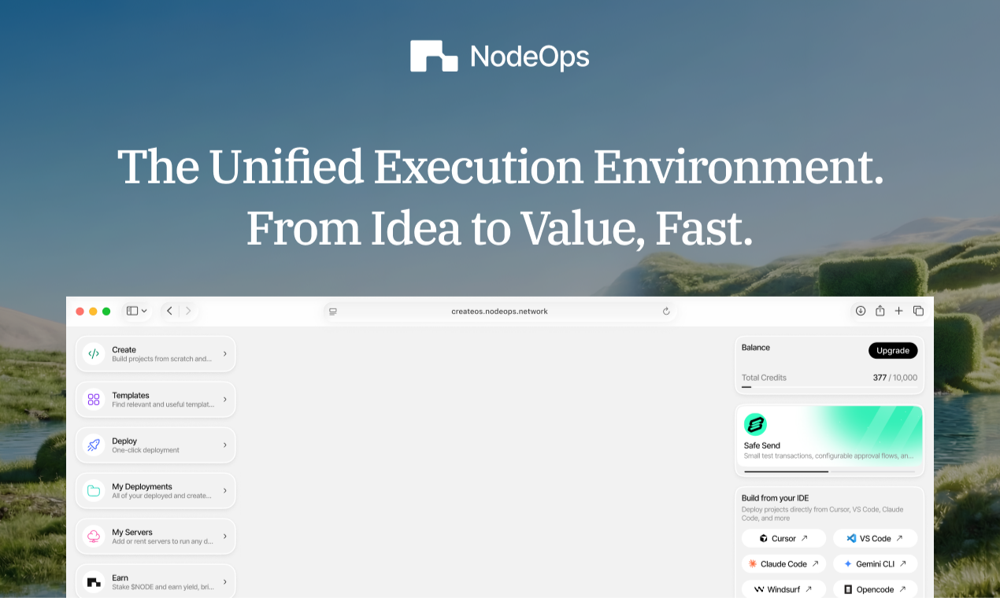
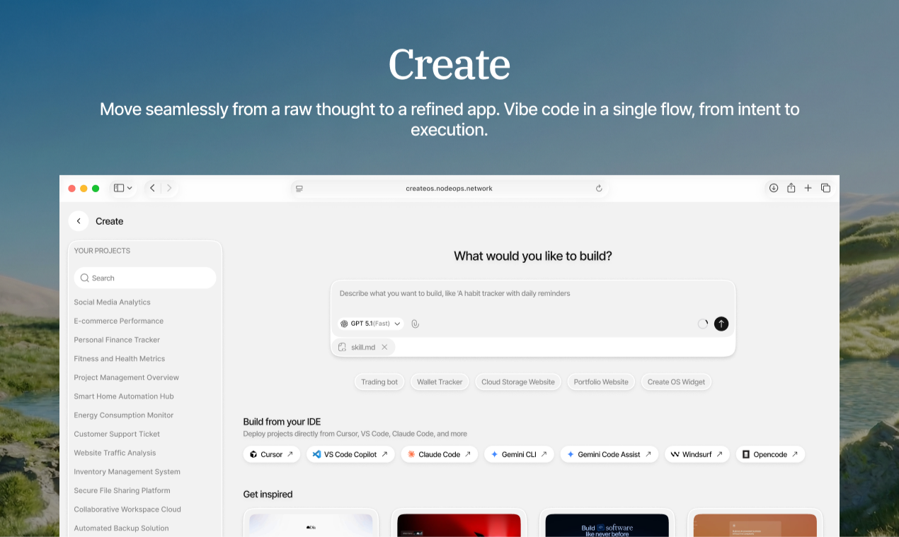
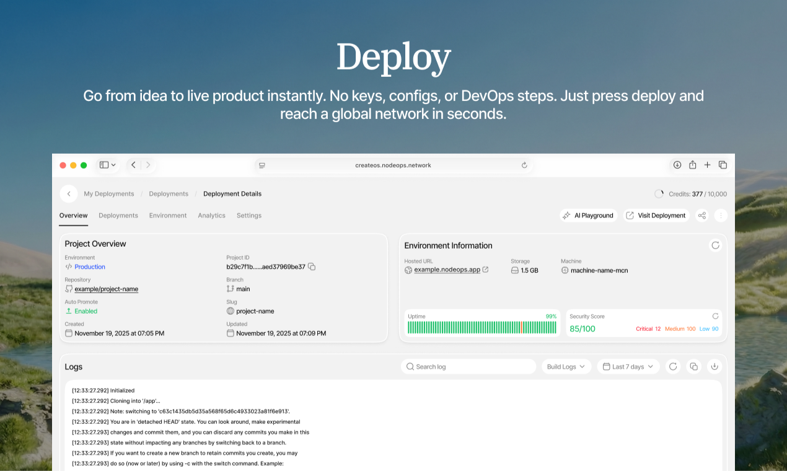

### 🎬 관련 영상
- [🎥 영상 보기](https://ph-files.imgix.net/aaeef9a2-f1d1-456a-8ec6-0cfe66b5ce1c.jpeg?auto=format)

---

## 2. [Genstore.ai](https://www.producthunt.com/products/genstore-ai-2?utm_campaign=producthunt-api&utm_medium=api-v2&utm_source=Application%3A+antigravity_test+%28ID%3A+258588%29)
**Votes**: 274 | **Tagline**: Test, iterate, and launch an agentic storefront in minutes

### 📌 요약
아이디어만 있으면 AI 에이전트가 순식간에 상품 기획부터 디자인, 공급업체 연결까지 끝내주는 '무재고 드롭쉬핑형' AI 쇼핑몰 생성 서비스입니다.

### 🔑 핵심 기능
- 🎯 Target Audience: 빠르고 쉽게 온라인 사업 아이디어를 검증하고 싶은 초기 창업가(린 스타트업), 드롭쉬핑 기반의 사이드 프로젝트를 원하는 사람.
- ✨ Key Differentiator: 단순한 스토어 빌더를 넘어, AI 에이전트가 직접 제품 큐레이션 및 공급망 설정까지 대행하여 '테스트 후 바로 판매'가 가능한 완결성을 제공합니다.
- 💡 Core Feature: 프롬프트 입력만으로 바로 판매 가능한 상태의 AI 기반 쇼핑몰을 몇 분 안에 완성하며, 재고 관리나 제품 소싱 걱정 없이 아이디어 검증에 집중할 수 있습니다.

### 📸 스크린샷 및 갤러리
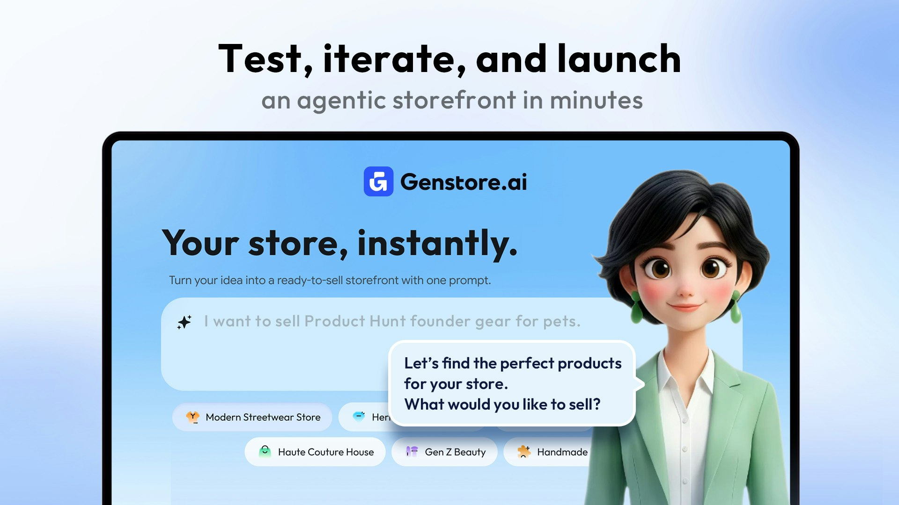

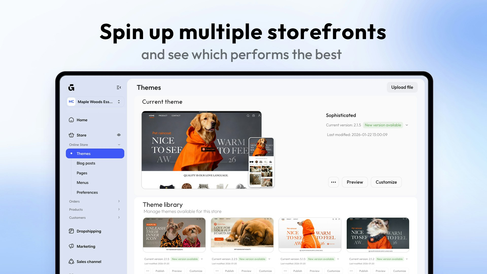

### 🎬 관련 영상
- [🎥 영상 보기](https://ph-files.imgix.net/1c1dfef4-cca5-42b7-88ff-d27a47d4f001.jpeg?auto=format)

---

## 3. [Xcode 26.3](https://www.producthunt.com/products/xcode?utm_campaign=producthunt-api&utm_medium=api-v2&utm_source=Application%3A+antigravity_test+%28ID%3A+258588%29)
**Votes**: 236 | **Tagline**: Leverage coding agents to tackle complex tasks autonomously

### 📌 요약
단순 코딩 보조는 끝났다! Xcode 26.3이 Claude/Codex 기반의 자율 코딩 에이전트를 탑재하여, 복잡한 개발 목표를 스스로 판단하고 완수하는 '완전 자동화' 개발 환경을 구현합니다.

### 🔑 핵심 기능
- 🎯 Target Audience: 복잡한 개발 목표를 AI에게 위임하고 싶거나, 최신 LLM 에이전트(Claude Agent, Codex)를 IDE 내에서 직접 활용하고자 하는 모든 iOS/macOS 개발자.
- ✨ Key Differentiator: 단순 코드 자동 완성(Auto-completion)을 넘어, 프로젝트 아키텍처를 이해하고 작업을 분해하며 의사 결정까지 내리는 '자율성(Autonomy)'을 확보하여 능동적인 개발이 가능해집니다.
- 💡 Core Feature: Anthropic Claude Agent 및 OpenAI Codex 등 강력한 서드파티 코딩 에이전트를 IDE에 직접 통합하여 복잡하고 다단계적인 개발 목표를 처음부터 끝까지 자율적으로 완수하는 '에이전트 코딩(Agentic Coding)' 지원.

### 📸 스크린샷 및 갤러리
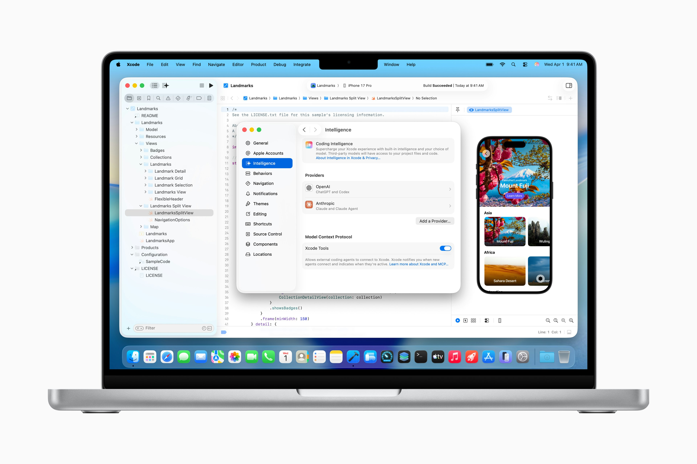
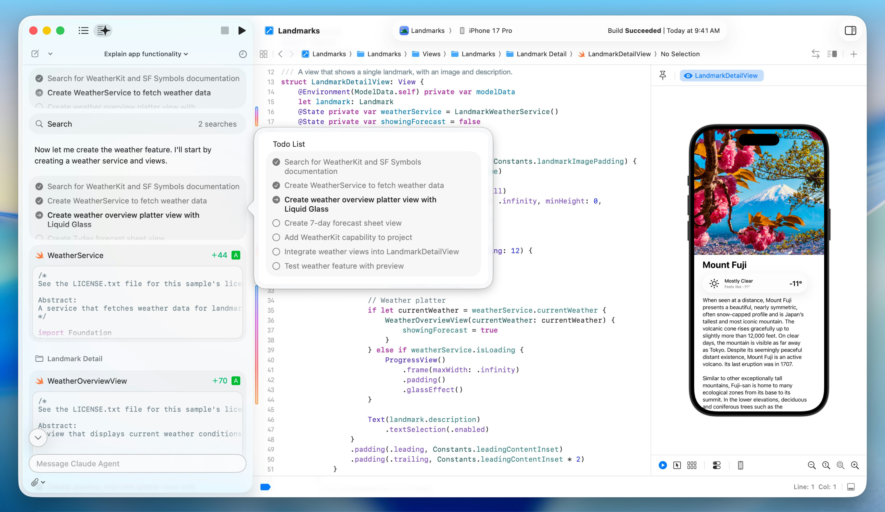
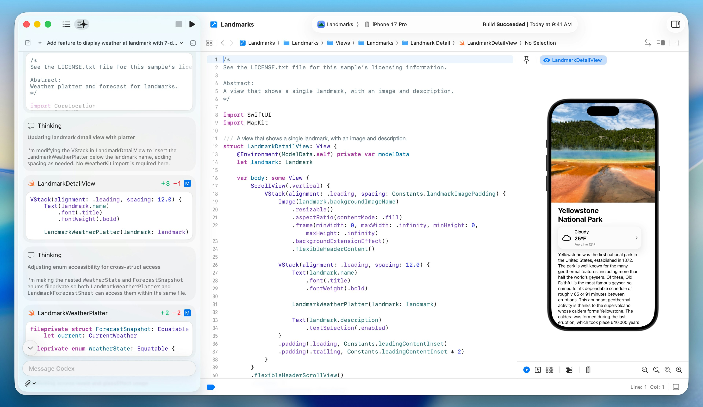

### 🎬 관련 영상
- [🎥 영상 보기](https://ph-files.imgix.net/a44ad06a-57a3-4e93-aae4-34a0af370ba8.jpeg?auto=format)

---

## 4. [Bunny Database](https://www.producthunt.com/products/bunny-net?utm_campaign=producthunt-api&utm_medium=api-v2&utm_source=Application%3A+antigravity_test+%28ID%3A+258588%29)
**Votes**: 180 | **Tagline**: Like SQLite, but for the web

### 📌 요약
유휴 상태일 땐 알아서 종료되는(spin down) SQLite 호환 웹 데이터베이스예요. 서버리스(Serverless) 시대에 딱 맞는, 저지연(low-latency) 데이터베이스를 손쉽게 구축할 수 있게 해줍니다.

### 🔑 핵심 기능
- 🎯 Target Audience: 백엔드 복잡성 없이 웹 애플리케이션에 빠르고 확장 가능한 데이터베이스가 필요한 개발자, 특히 서버리스 환경(예: Vercel, Cloudflare Pages)을 선호하는 사용자.
- ✨ Key Differentiator: 기존 SQLite의 단순함과 편리함을 유지하면서, 유휴 시 비용을 절감하는 자동 종료 기능 및 복잡한 재설계 없이 다중 지역(Multi-region) 확장이 가능하다는 점.
- 💡 Core Feature: 사용자가 어디에 있든 낮은 지연 시간을 보장하기 위해 지역(Region) 추가를 자유롭게 할 수 있으며, 사용하지 않을 때는 자원을 반납하는 'Auto Spin Down' 기능.

### 📸 스크린샷 및 갤러리
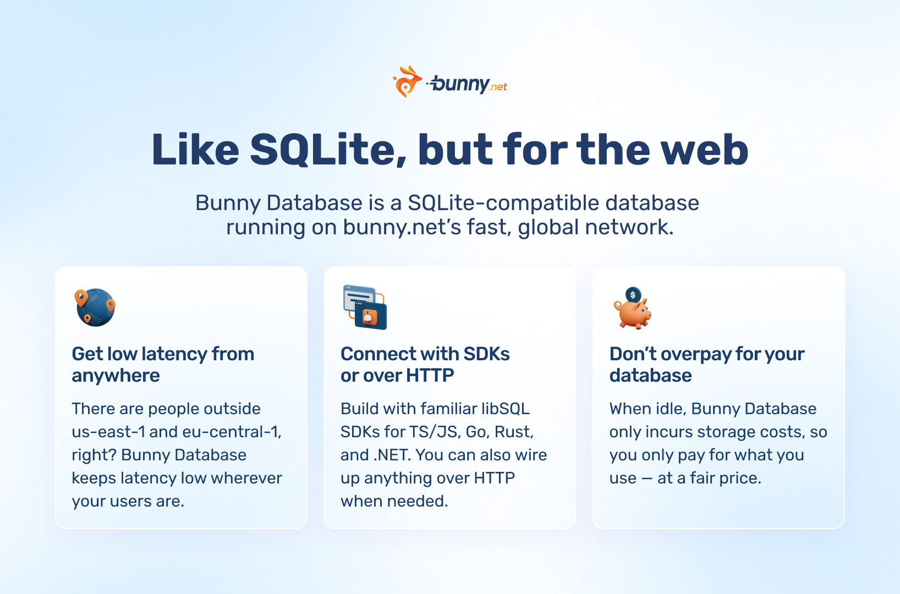
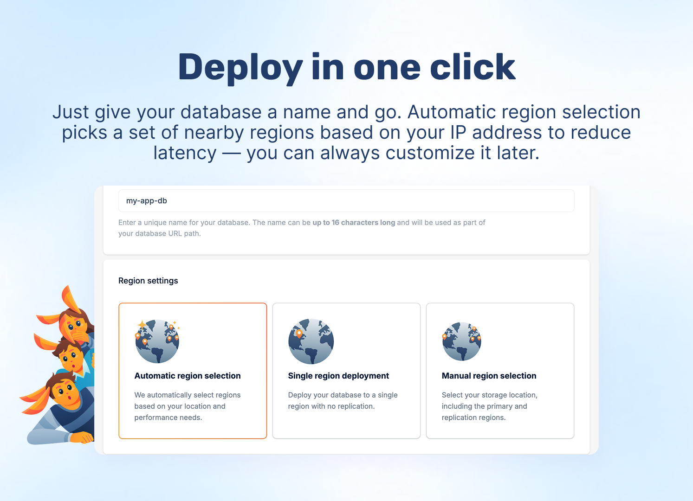
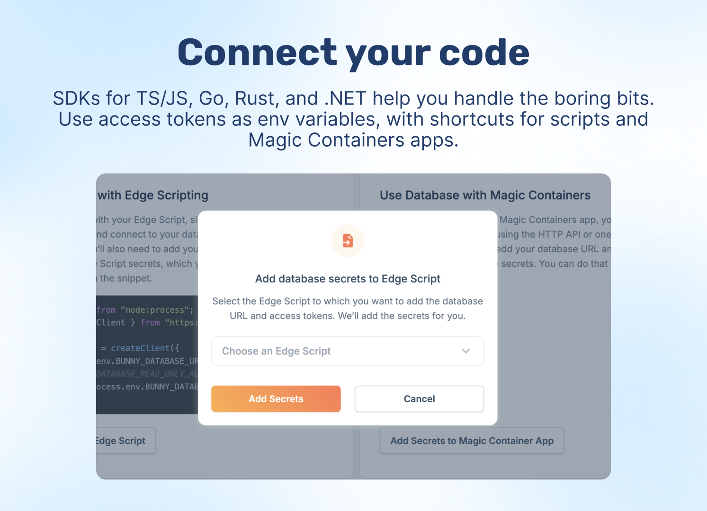

### 🎬 관련 영상
- [🎥 영상 보기](https://ph-files.imgix.net/d59562c7-a984-4572-8d01-d0ae4c59acbf.jpeg?auto=format)

---

## 5. [Nexuscale AI](https://www.producthunt.com/products/nexuscale-ai?utm_campaign=producthunt-api&utm_medium=api-v2&utm_source=Application%3A+antigravity_test+%28ID%3A+258588%29)
**Votes**: 180 | **Tagline**: AI sales assistant that finds leads + books meetings for you

### 📌 요약
이제 데이터베이스 필터링은 멈추세요. Nexuscale AI는 웹사이트 주소 하나만으로 시장 조사부터 리드 발굴, 이메일/링크드인 아웃바운드까지 미팅 확보를 위한 모든 과정을 알아서 처리해주는 '자율 운영 아웃바운드 OS(Autonomous Outbound OS)'입니다.

### 🔑 핵심 기능
- 🎯 Target Audience: 수동 리드 발굴에 지친 B2B 영업팀, 초기 단계 스타트업 창업가, 아웃바운드 효율을 극대화하려는 마케팅/세일즈 리더.
- ✨ Key Differentiator: 단순 리드 생성 툴을 넘어, 시장 조사 및 컨택 정보(enrichment)까지 완료한 후 이메일/링크드인 시퀀스를 '완전히 자율적(Autonomous)'으로 실행하여 미팅까지 잡아주는 풀 사이클 자동화.
- 💡 Core Feature: 웹사이트 URL만 입력하면, AI 에이전트가 알아서 잠재 고객을 연구 및 발굴하고 미팅이 잡힐 때까지 전체 아웃바운드 캠페인을 관리함.

### 📸 스크린샷 및 갤러리

### 🎬 관련 영상
- [🎥 영상 보기](https://ph-files.imgix.net/e6c7ca1d-c10a-4ac2-ab41-f0fb80d0ffb6.jpeg?auto=format)

---

## 6. [Sheetful.co](https://www.producthunt.com/products/sheetful-co?utm_campaign=producthunt-api&utm_medium=api-v2&utm_source=Application%3A+antigravity_test+%28ID%3A+258588%29)
**Votes**: 130 | **Tagline**: Build robust REST APIs with Google Sheets for free

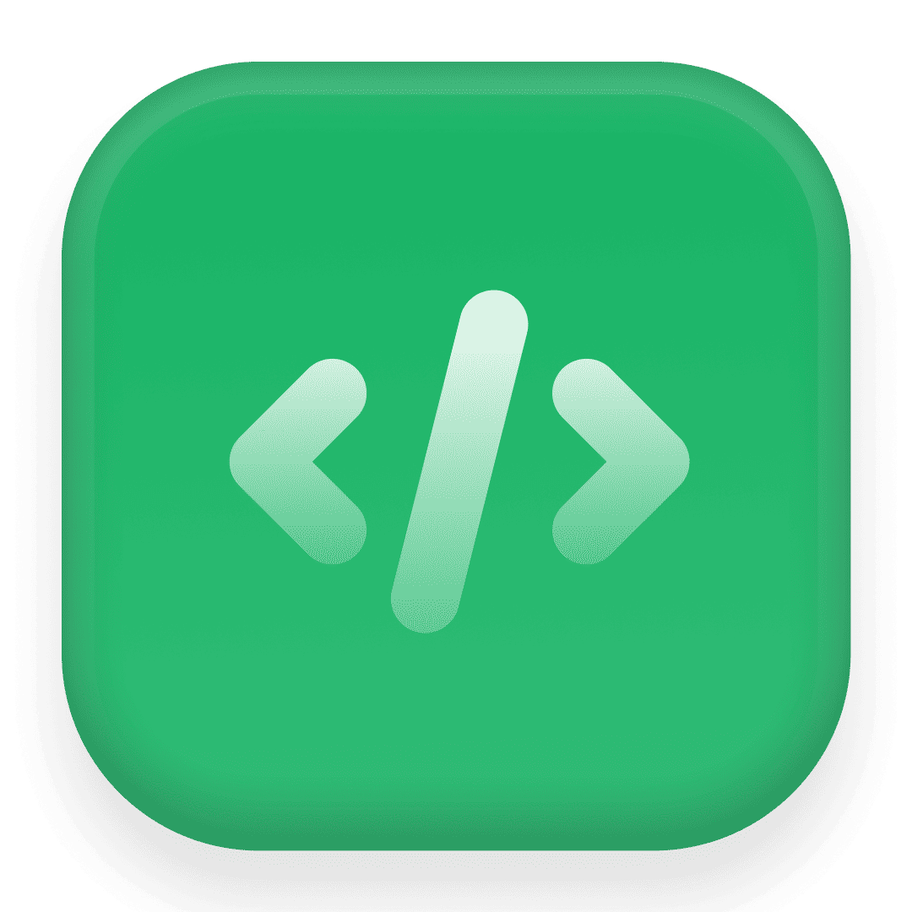

### 📌 요약
구글 시트(Google Sheets)를 데이터베이스처럼 활용해 무료로 GET, POST, PUT, DELETE를 지원하는 강력한 REST API로 즉시 변환해주는 노코드(No-code) 툴입니다. 복잡한 백엔드 구축 없이 시트만으로 데이터를 실시간 관리할 수 있어 웹/앱 개발 시간을 대폭 단축시켜줍니다.

### 🔑 핵심 기능
- 🎯 Target Audience: 빠르고 저렴하게 데이터 기반 기능을 구현하려는 개발자, 프로토타입 제작자, 노코드 솔루션 사용자.
- ✨ Key Differentiator: 코딩 없이 구글 시트만으로 CRUD(Create, Read, Update, Delete)를 모두 지원하는 완전한 REST API를 구축하며, 모든 데이터 업데이트가 실시간으로 반영됩니다.
- 💡 Core Feature: 단 몇 초 만에 구글 시트의 데이터를 즉시 읽고(GET), 쓰고(POST), 수정하고(PUT), 삭제(DELETE)할 수 있는 API 엔드포인트 4종을 제공하여 데이터 관리를 용이하게 함.

### 📸 스크린샷 및 갤러리
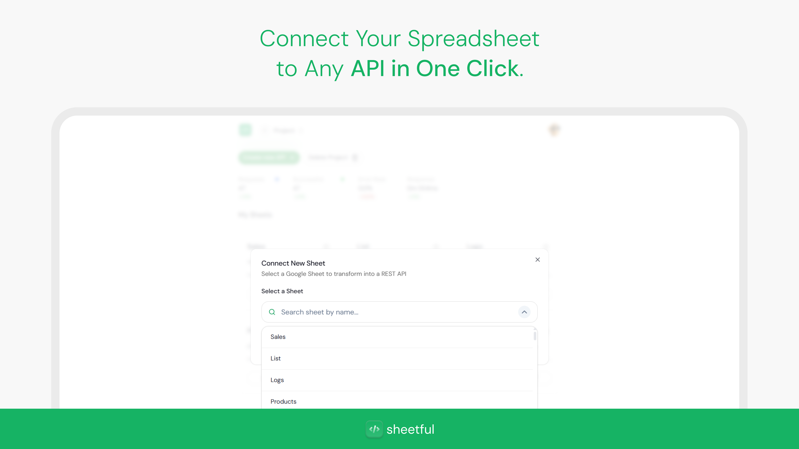
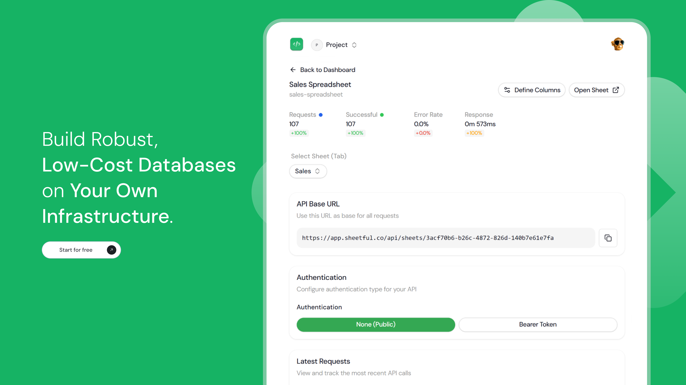
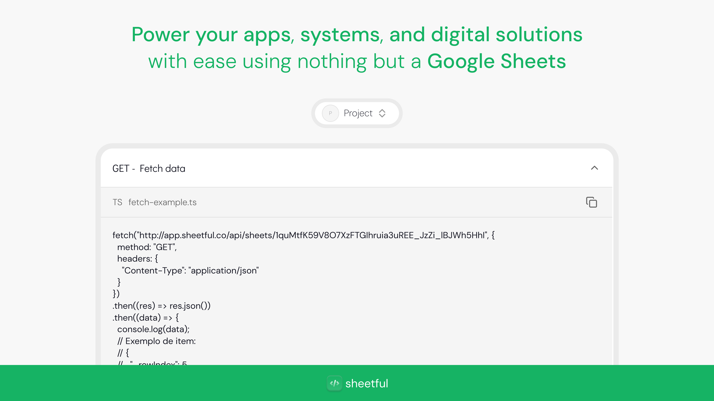

### 🎬 관련 영상
- [🎥 영상 보기](https://ph-files.imgix.net/c9954999-e10f-4a4a-8e31-2bbb2c269f6d.jpeg?auto=format)

---

## 7. [Scribeist V2](https://www.producthunt.com/products/scribeist?utm_campaign=producthunt-api&utm_medium=api-v2&utm_source=Application%3A+antigravity_test+%28ID%3A+258588%29)
**Votes**: 122 | **Tagline**: Write without switching tools

### 📌 요약
이제 더 이상 글쓰기 툴을 옮겨 다닐 필요가 없습니다. 블로그 및 리서치 툴의 강자였던 Scribeist가 소설 집필, 일반 노트, 전문 블로그 기능을 통합하고 워크스페이스별 맞춤형 AI를 탑재한 '올인원 전문 글쓰기 플랫폼 V2'를 출시했습니다.

### 🔑 핵심 기능
- 🎯 Target Audience: 전문적인 글쓰기를 하며 툴을 자주 전환하는 '글쓰기 툴 유목민' (작가, 전문 블로거, 리서처 등).
- ✨ Key Differentiator: 소설 집필(캐릭터/타임라인 추적), 전문 블로그(SEO/가독성 분석), 일반 노트를 하나의 플랫폼에서 해결하는 '통합형 전문 워크스페이스' 제공.
- 💡 Core Feature: 선택한 워크스페이스(소설, 블로그, 일반)에 따라 기능과 UI가 최적화되며, 각 분야의 맥락을 이해하고 글을 돕는 맞춤형 AI 어시스턴트 기능.

### 📸 스크린샷 및 갤러리
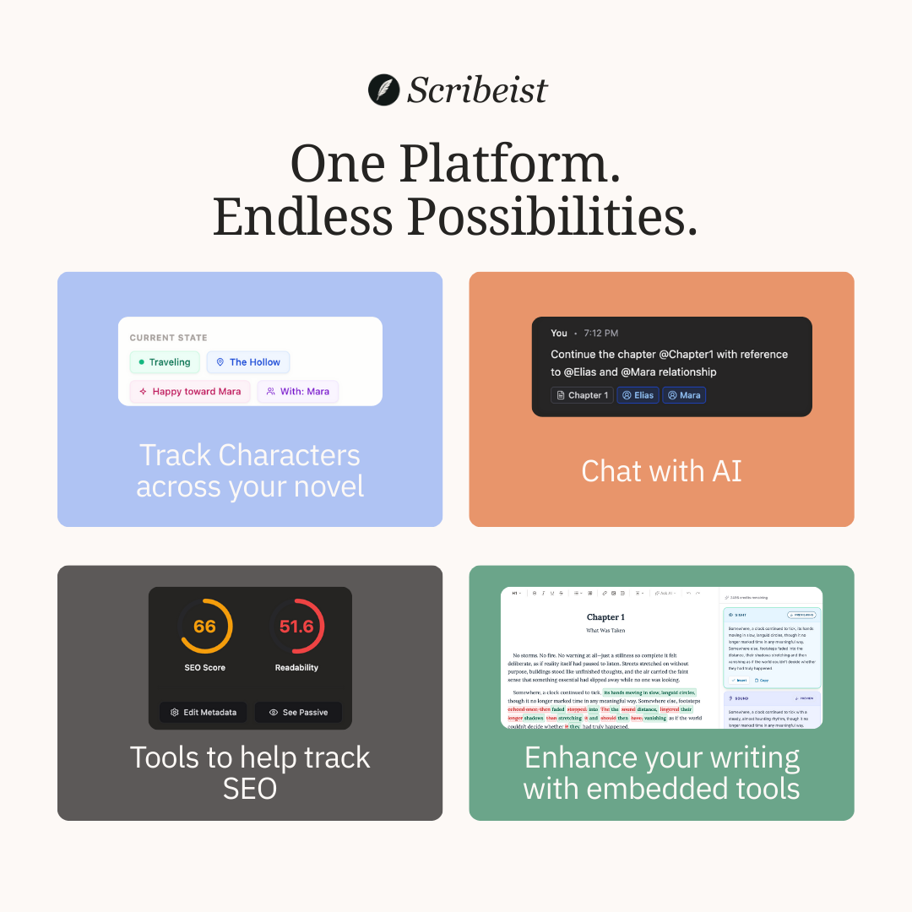
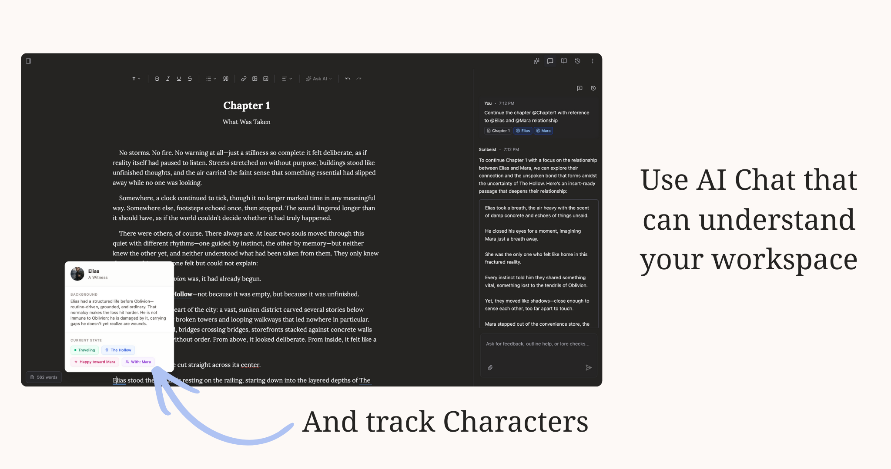

---

## 8. [Unblocked Code Review](https://www.producthunt.com/products/unblocked?utm_campaign=producthunt-api&utm_medium=api-v2&utm_source=Application%3A+antigravity_test+%28ID%3A+258588%29)
**Votes**: 115 | **Tagline**: AI code review that knows when to chime in

### 📌 요약
코드 변경분(diff)만 보는 게 아니라, 전체 레포지토리, 슬랙, 지라 등 개발 환경의 맥락을 이해하고 '꼭 필요한 순간'에만 참견하는 AI 코드 리뷰 솔루션입니다. (AI 코드 리뷰계의 현자)

### 🔑 핵심 기능
- 🎯 Target Audience: 코드 리뷰의 비효율성(저품질/불필요한 코멘트)에 지친 모든 개발팀 및 엔지니어링 리드.
- ✨ Key Differentiator: 단순히 코드 분석을 넘어, 개발 맥락(Context) 전체를 파악하여 불필요한 노이즈를 줄이고 실행 가능한(actionable) 고품질 코멘트를 제공합니다.
- 💡 Core Feature: 전체 레포지토리/PR 이력/협업 툴(Slack, Jira) 등 다양한 소스에서 맥락을 추출하여, 근거가 명확히 제시된(cited sources) 코멘트를 생성합니다.

### 📸 스크린샷 및 갤러리
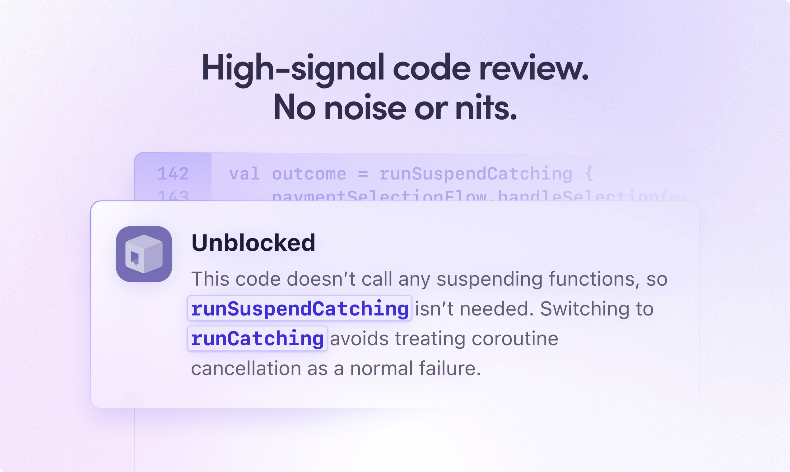
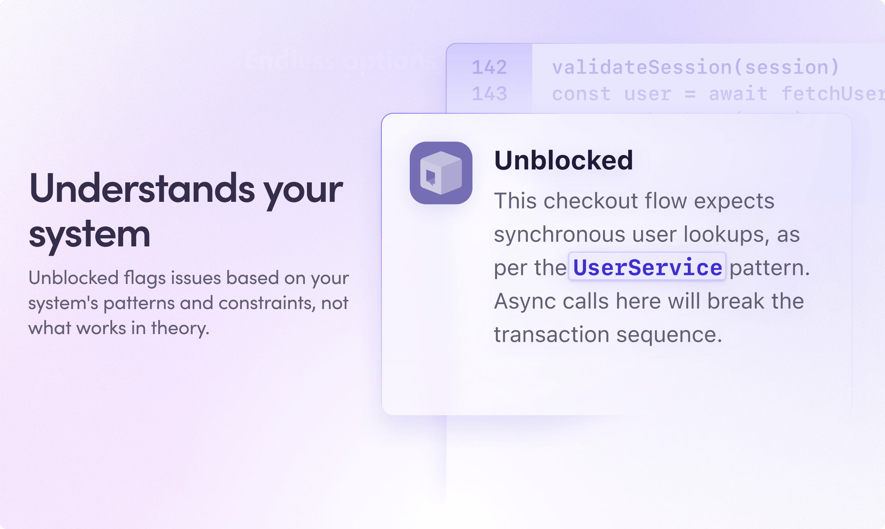
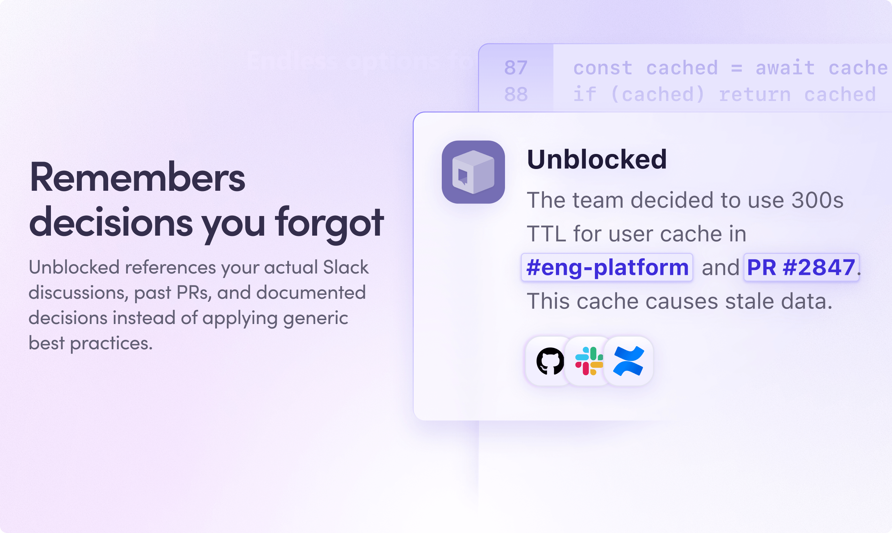

### 🎬 관련 영상
- [🎥 영상 보기](https://ph-files.imgix.net/023535b5-4ead-4ab1-add2-4cfe29705fd6.jpeg?auto=format)

---

## 9. [Postproxy](https://www.producthunt.com/products/postproxy?utm_campaign=producthunt-api&utm_medium=api-v2&utm_source=Application%3A+antigravity_test+%28ID%3A+258588%29)
**Votes**: 113 | **Tagline**: One API to publish to Instagram, TikTok, Youtube and others

### 📌 요약
인스타그램, 틱톡, 유튜브 등 여러 채널에 대량의 콘텐츠를 발행할 때, 복잡한 API 대신 단 하나의 엔드포인트로 모든 것을 해결해주는 개발자 친화적인 통합 퍼블리싱 API입니다.

### 🔑 핵심 기능
- 🎯 Target Audience: 콘텐츠 자동화 및 대규모 발행 시스템을 구축하려는 개발자 및 SaaS 운영팀.
- ✨ Key Differentiator: 복잡하고 불안정한 소셜 네트워크별 API를 단일화하고, 실패 시 자동 재시도(Built-in Retries) 기능을 제공하여 안정성을 극대화합니다.
- 💡 Core Feature: 하나의 엔드포인트(One API)로 주요 소셜 미디어 채널에 동시 발행 및 예약 업로드가 가능한 '통합 스케줄링' 기능.

### 📸 스크린샷 및 갤러리
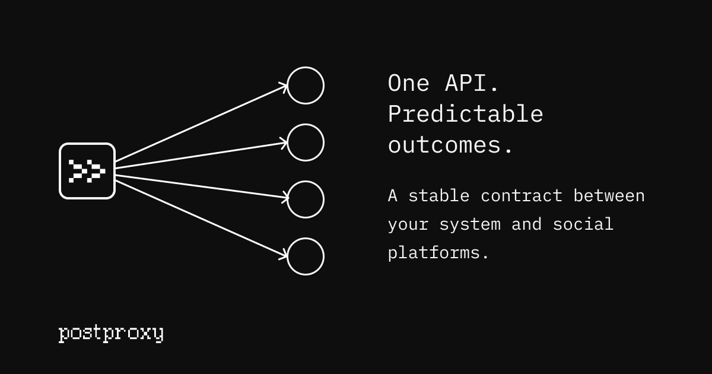
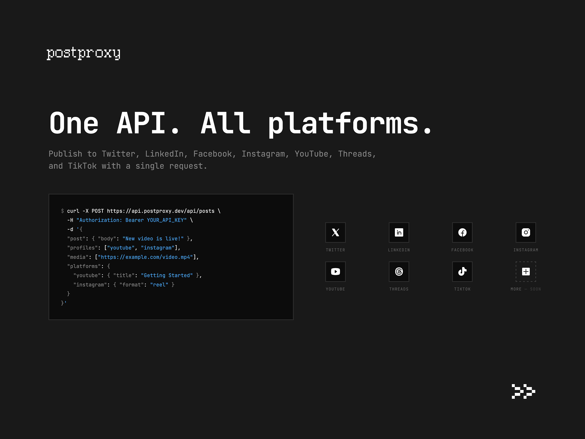
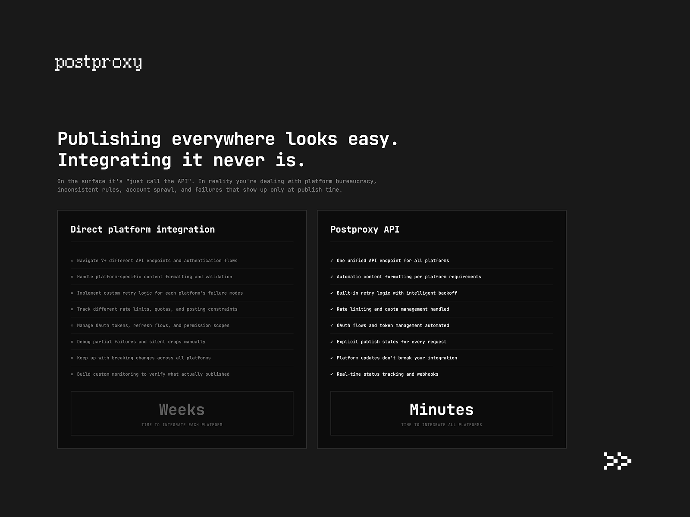

---

## 10. [Multitui](https://www.producthunt.com/products/multitui?utm_campaign=producthunt-api&utm_medium=api-v2&utm_source=Application%3A+antigravity_test+%28ID%3A+258588%29)
**Votes**: 104 | **Tagline**: Sandbox claude code, codex, or any TUI on macOS

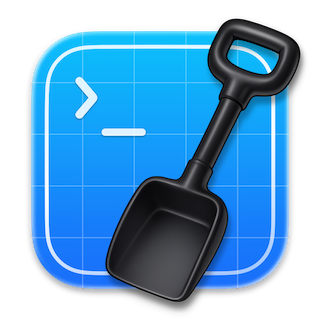

### 📌 요약
macOS의 터미널 기반 프로그램(TUI)들을 독(Dock)에서 바로 실행 가능한 독립적인 네이티브 앱으로 깔끔하게 패키징해주는 '앱 팩토리'입니다.

### 🔑 핵심 기능
- 🎯 Target Audience: TUI 기반 개발 도구(lazygit, harlequin 등)나 AI 코딩 보조 도구(claude code, codex, gemini)를 자주 사용하는 macOS 개발자 및 파워 유저.
- ✨ Key Differentiator: 복잡한 단일 터미널 환경을 벗어나, 각 TUI 프로그램에 전용 아이콘과 독립된 창을 제공하여 macOS 환경에 완벽하게 통합시킵니다.
- 💡 Core Feature: 원하는 TUI 프로그램을 몇 번의 클릭만으로 개별 네이티브 앱으로 생성하며, 필요에 따라 샌드박스 옵션을 적용하여 보안을 강화할 수 있습니다.

### 📸 스크린샷 및 갤러리

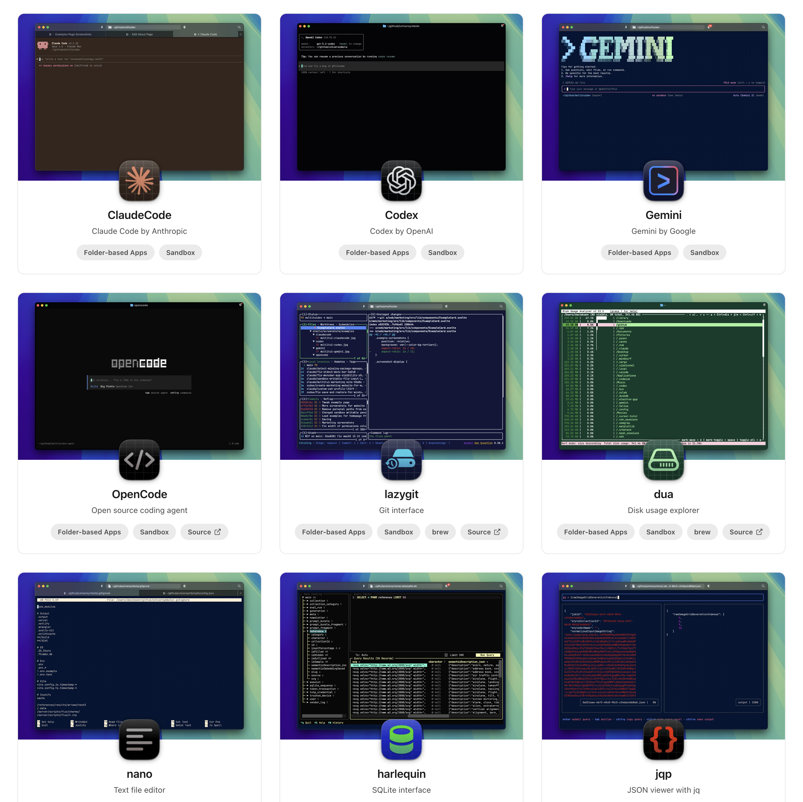

---

