# 🚀 Product Hunt Daily Top 10 (2026-02-05)

## 1. [Supaboard](https://www.producthunt.com/products/supaboard-ai?utm_campaign=producthunt-api&utm_medium=api-v2&utm_source=Application%3A+antigravity_test+%28ID%3A+258588%29)
**Votes**: 411 | **Tagline**: Ask in plain English. Get accurate answers from your data

### 📌 요약
SQL이나 복잡한 과정 없이, 일상 언어(영어)로 질문만 하면 600개 이상의 데이터 소스에서 정확하고 실행 가능한 비즈니스 인사이트를 즉시 뽑아주는 'AI 기반 데이터 분석 대시보드'입니다.

### 🔑 핵심 기능
- 🎯 Target Audience: 데이터에 접근하고 분석해야 하지만 기술적 배경(SQL 등)이 없는 현업 부서(비즈니스 사용자) 및 의사 결정권자.
- ✨ Key Differentiator: 자체 비즈니스 로직을 적용하는 내장형 에이전트 덕분에 AI가 생성한 단순한 답변이 아닌, 기업 환경에 '정확한(Right)' 답변과 분석 결과를 제공하며, 완벽한 거버넌스와 보안을 보장합니다.
- 💡 Core Feature: 600가지 이상의 데이터 소스에 연결하여 일반 영어 질문을 즉각적인 분석 및 행동(Action)으로 전환하는 자연어 기반 질의응답 기능.

### 📸 스크린샷 및 갤러리
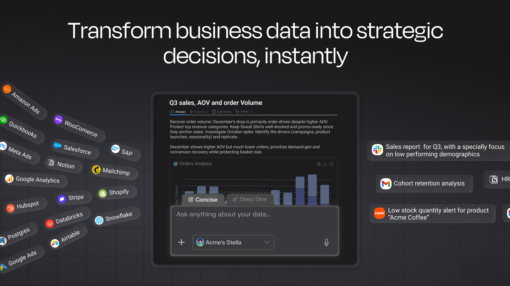
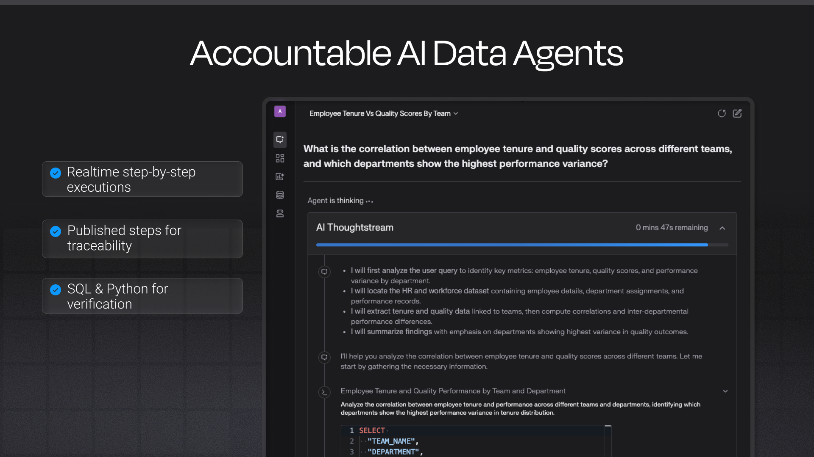
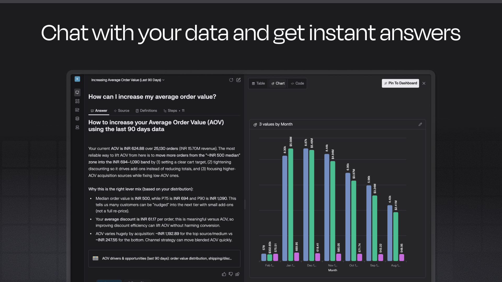

### 🎬 관련 영상
- [🎥 영상 보기](https://ph-files.imgix.net/613d7993-c365-4d54-8551-a1609cdf9473.jpeg?auto=format)

---

## 2. [The new v0](https://www.producthunt.com/products/v0?utm_campaign=producthunt-api&utm_medium=api-v2&utm_source=Application%3A+antigravity_test+%28ID%3A+258588%29)
**Votes**: 275 | **Tagline**: Full stack vibe coding platform. Created by Vercel.

### 📌 요약
Vercel이 선보이는 풀스택 개발의 미래, v0! 디자인과 코드 작업을 AI와 함께 '분위기(vibe)' 있게 해결하며 프로토타입을 눈 깜짝할 새에 완성시켜주는 궁극의 협업형 AI 코딩 플랫폼입니다.

### 🔑 핵심 기능
- 🎯 타겟층: 빠른 프로토타이핑과 확장을 목표로 하는 풀스택 개발자 및 디자이너, 개발 협업 팀.
- ✨ 핵심 차별점: 단순히 코드를 생성하는 것을 넘어, 디자인부터 배포까지 Vercel 생태계 내에서 전 과정을 매끄럽게 돕는 협업형 풀스택 AI 어시스턴트 역할 수행.
- 💡 핵심 기능: 사용자 프롬프트 기반으로 풀스택 컴포넌트 및 애플리케이션의 디자인과 코드를 즉시 생성하고, AI가 실시간으로 반복 작업을 지원하는 기능.

### 📸 스크린샷 및 갤러리
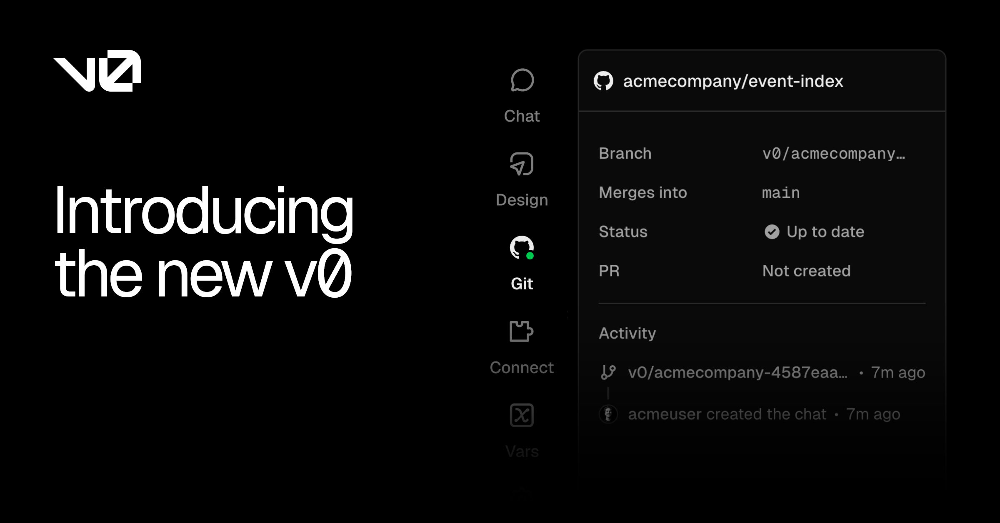
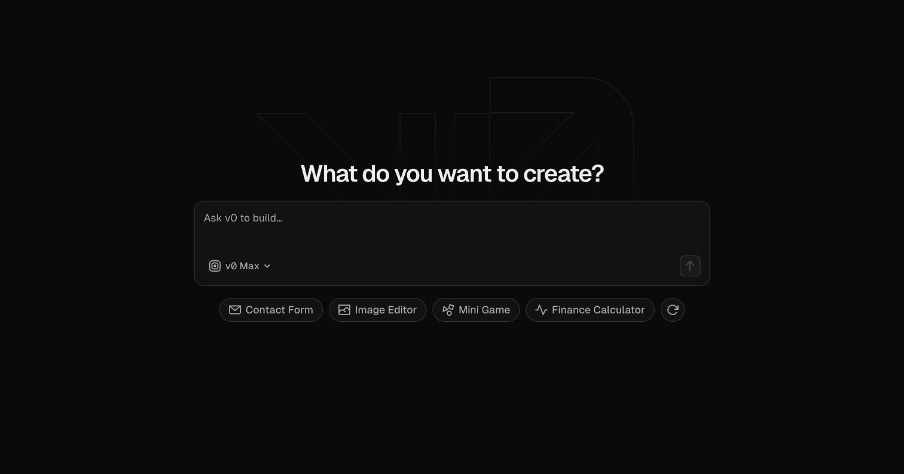
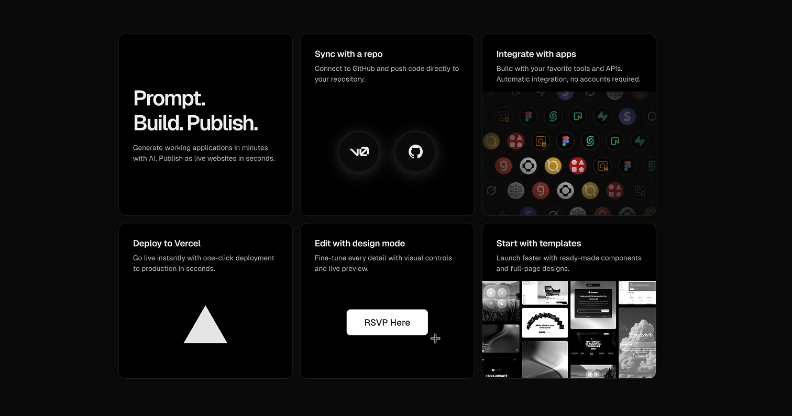

---

## 3. [Higgsfield Vibe-Motion](https://www.producthunt.com/products/higgsfield?utm_campaign=producthunt-api&utm_medium=api-v2&utm_source=Application%3A+antigravity_test+%28ID%3A+258588%29)
**Votes**: 225 | **Tagline**: Create motion images in a single prompt in an editing canvas

### 📌 요약
마침내 영상 제작도 '프롬프트 한 줄'로 끝내는 시대가 왔습니다. Higgsfield의 Vibe-Motion은 복잡한 편집 툴 없이도 AI가 만든 영상을 바로 캔버스에서 수정하고 다듬을 수 있는 혁신적인 AI 영상 생성 솔루션입니다.

### 🔑 핵심 기능
- 🎯 Target Audience: 영상 콘텐츠를 빠르게 제작해야 하는 마케터, 디자이너, 1인 크리에이터 및 콘텐츠 제작자.
- ✨ Key Differentiator: 단순히 영상을 생성하는 것을 넘어, 생성된 AI 영상을 편집 캔버스(Editing Canvas)에서 바로 수정하고 정교하게 다듬을 수 있는 직관적인 크리에이티브 컨트롤 제공.
- 💡 Core Feature: 텍스트 프롬프트 입력만으로 아이디어를 전문적인 영상으로 변환하고, 그 과정에 고급 AI 모델을 쉽게 적용하여 고품질의 모션 이미지를 제작.

### 📸 스크린샷 및 갤러리
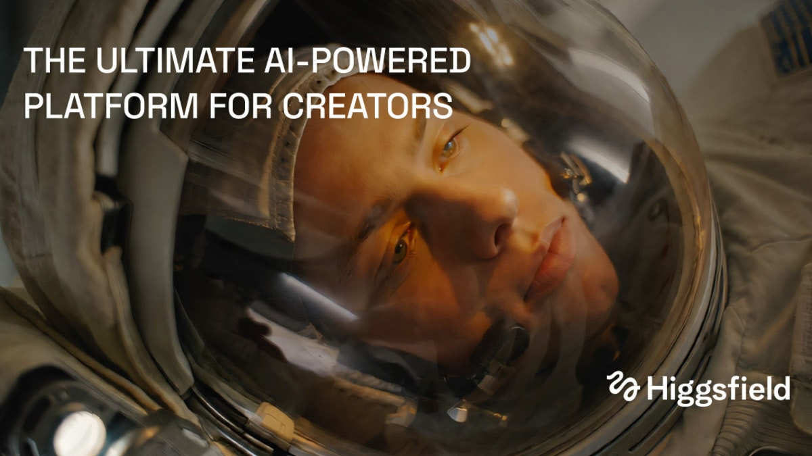
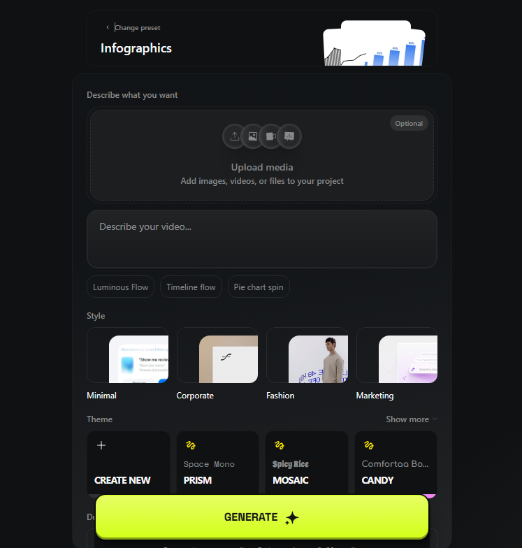
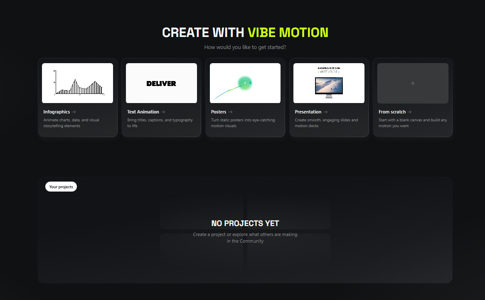

### 🎬 관련 영상
- [🎥 영상 보기](https://ph-files.imgix.net/3d36cecf-1cd2-4661-b2b3-13c758f3dc01.jpeg?auto=format)

---

## 4. [Voxtral Transcribe 2 by Mistral](https://www.producthunt.com/products/mistral-7b?utm_campaign=producthunt-api&utm_medium=api-v2&utm_source=Application%3A+antigravity_test+%28ID%3A+258588%29)
**Votes**: 202 | **Tagline**: Real-time speech-to-text with speaker diarization

### 📌 요약
실시간 받아쓰기의 끝판왕! Mistral 기반의 'Voxtral Transcribe 2'는 누가, 언제 말했는지까지 찰나의 순간에 정확히 구분해내는 초고속 STT(Speech-to-Text) 엔진입니다. 속도는 올리고 비용은 낮춘, 라이브 서비스용 핵심 솔루션입니다.

### 🔑 핵심 기능
- 🎯 Target Audience: 라이브 서비스(앱) 개발자, 음성 비서(에이전트) 구축팀, 실시간으로 고품질 회의록 자동화가 필요한 기업.
- ✨ Key Differentiator: 초고속 실시간 전사(Transcription)와 '누가 말했는지'를 구분하는 화자 분리(Diarization) 기능을 동시에 제공하며, 업계 최고 수준의 속도와 비용 효율성을 자랑함.
- 💡 Core Feature: 실시간 전사 과정에서 13개 언어를 지원하며, 개인정보 보호를 위한 배포 옵션과 단어별 타임스탬프를 제공하여 개발 유연성을 극대화함.

### 📸 스크린샷 및 갤러리
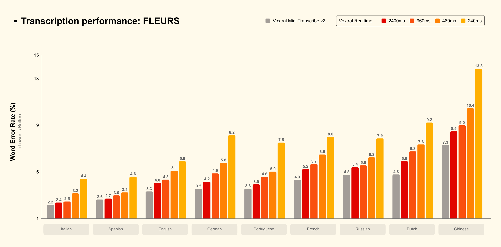

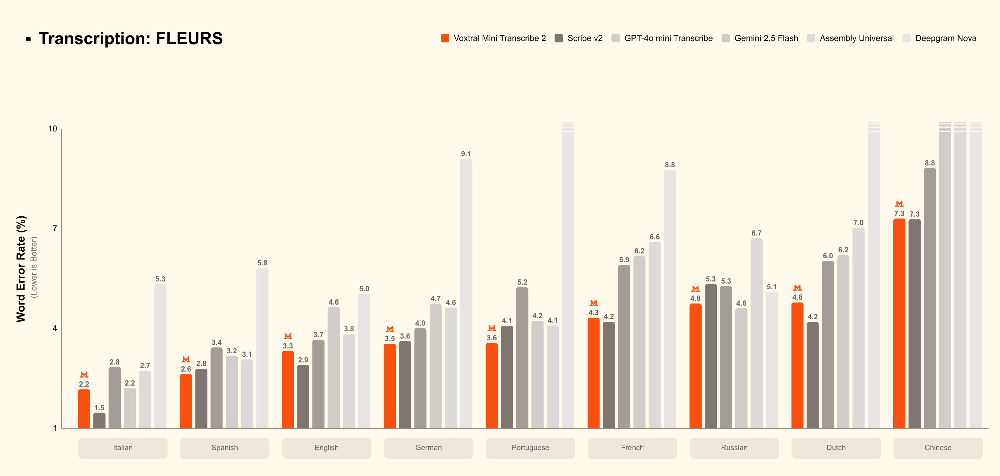

### 🎬 관련 영상
- [🎥 영상 보기](https://ph-files.imgix.net/0cb2bb3a-03b3-44b8-abfd-4eb02b65959c.jpeg?auto=format)

---

## 5. [Webflow AI site builder](https://www.producthunt.com/products/webflow?utm_campaign=producthunt-api&utm_medium=api-v2&utm_source=Application%3A+antigravity_test+%28ID%3A+258588%29)
**Votes**: 170 | **Tagline**: Turn a prompt into a production-ready site with Webflow

### 📌 요약
프롬프트 입력만으로 바로 프로덕션에 투입할 수 있는 수준의 웹사이트를 Webflow(웹플로우)에서 AI로 순식간에 제작해주는 마법 같은 빌더가 출시되었습니다.

### 🔑 핵심 기능
- 🎯 Target Audience: 빠르고 확장 가능한 웹사이트 기초를 다지고 싶은 웹 디자이너, 스타트업 창업가, 프로덕트 매니저(PM).
- ✨ Key Differentiator: 단순한 템플릿 생성이 아니라, AI가 구조, 스타일, 애니메이션까지 잡아준 후, Webflow에서 이어서 작업을 할 수 있도록 '확장 가능한 기반'을 제공합니다.
- 💡 Core Feature: 텍스트 프롬프트(Prompt)만으로 멀티 페이지 웹사이트의 초기 구조를 생산(Production-ready) 수준으로 자동 생성 및 빌드 시작.

### 📸 스크린샷 및 갤러리
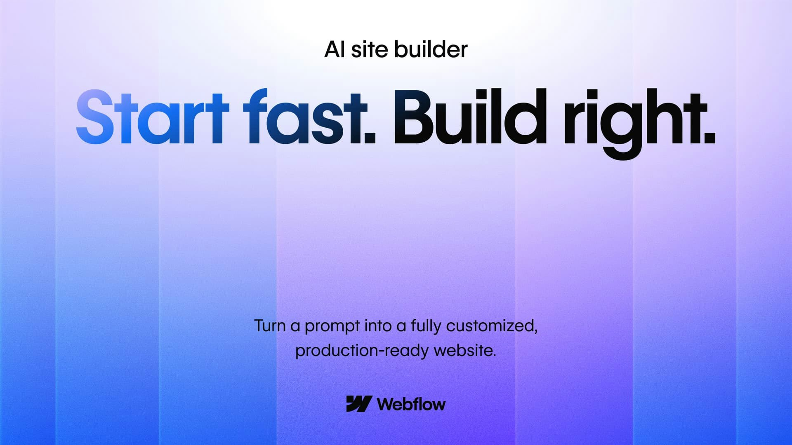
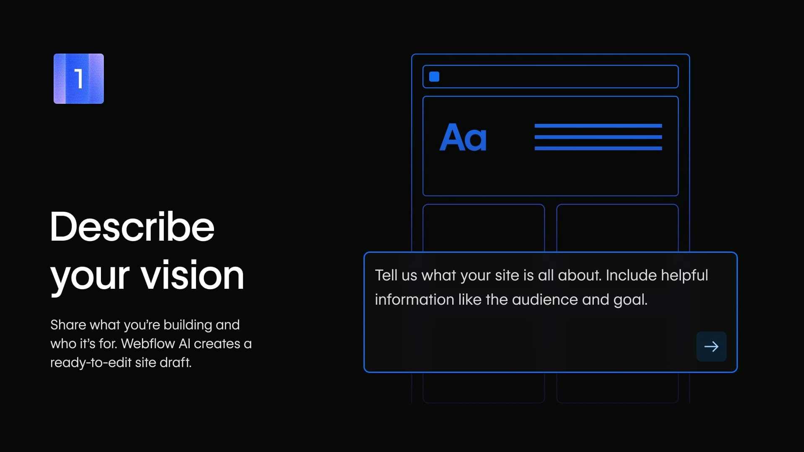
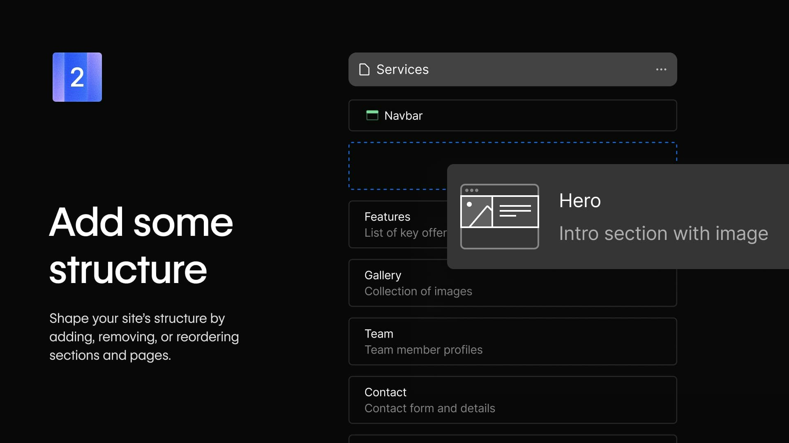

### 🎬 관련 영상
- [🎥 영상 보기](https://ph-files.imgix.net/5d9ef830-6d62-4d17-ab9c-8cfde97cb026.jpeg?auto=format)

---

## 6. [GitHub Agent HQ](https://www.producthunt.com/products/github?utm_campaign=producthunt-api&utm_medium=api-v2&utm_source=Application%3A+antigravity_test+%28ID%3A+258588%29)
**Votes**: 156 | **Tagline**: Run Claude, Codex & Copilot directly in GitHub & VS Code

### 📌 요약
드디어 '클로드'와 '코덱스'가 깃허브와 VS Code 속으로 들어왔습니다! 코파일럿 엔터프라이즈 구독자는 별도의 API 연동 없이 바로 이 강력한 AI 모델들을 개발 환경 내에서 사용할 수 있게 되었어요.

### 🔑 핵심 기능
- 🎯 Target Audience: Copilot Pro+ 또는 Copilot Enterprise 구독을 사용하는 개발자 및 대규모 엔터프라이즈 개발팀.
- ✨ Key Differentiator: Anthropic의 Claude와 OpenAI Codex를 개발 환경(GitHub/VS Code) 내에서 직접 실행하고 관리할 수 있는 통합 AI 에이전트 허브 제공.
- 💡 Core Feature: 코드 작성, 디버깅, 문서 요약 등 다양한 개발 작업을 수행하는 AI 에이전트를 개발 환경 내부에서 호출 및 활용 가능.

### 📸 스크린샷 및 갤러리

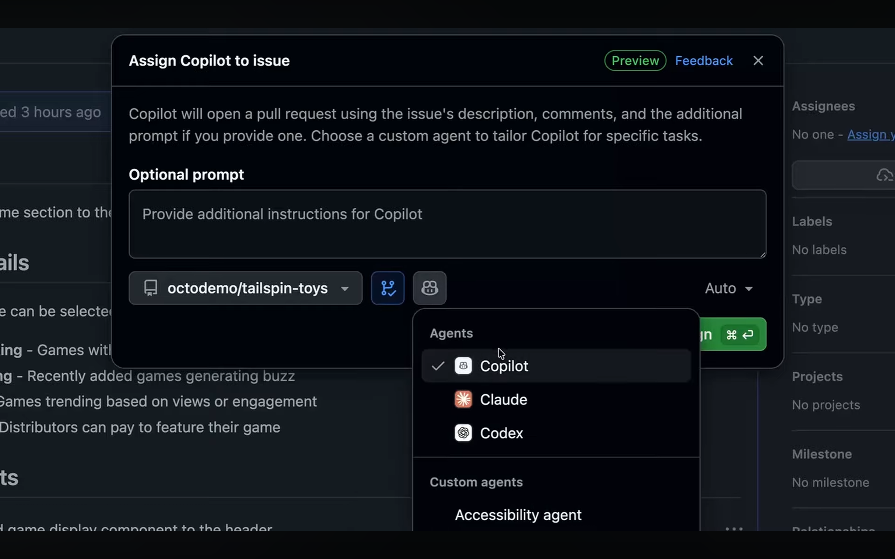
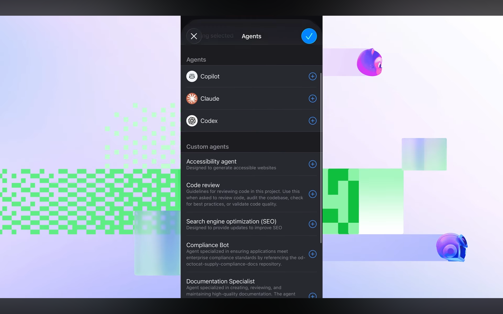

### 🎬 관련 영상
- [🎥 영상 보기](https://ph-files.imgix.net/abcee6dc-775f-4e82-b7f8-c1f6764e2559.jpeg?auto=format)

---

## 7. [Kling 3.0](https://www.producthunt.com/products/kling-ai-4?utm_campaign=producthunt-api&utm_medium=api-v2&utm_source=Application%3A+antigravity_test+%28ID%3A+258588%29)
**Votes**: 127 | **Tagline**: Native 4K output with extended video time with just a prompt

### 📌 요약
드디어 '진짜' 4K AI 비디오를 뽑아낼 수 있게 되었습니다! Kling 3.0은 단순한 AI 영상 생성기를 넘어, 프롬프트 입력만으로 현실적인 네이티브 4K 해상도와 확장된 길이의 영상을 구현하는 차세대 올인원 크리에이티브 엔진입니다.

### 🔑 핵심 기능
- 🎯 Target Audience: 고해상도 콘텐츠를 제작해야 하는 영상 전문가, AI 아티스트, 마케터 및 유튜버.
- ✨ Key Differentiator: 기존 AI 영상들이 겪던 해상도 및 길이 제한 문제를 극복하고, 네이티브(진정한) 4K 출력을 지원하는 현존 최고의 멀티모달 창작 엔진이라는 점.
- 💡 Core Feature: 텍스트 프롬프트 입력만으로 확장된 영상 길이를 유지하며 고품질 4K 비디오를 즉시 생성하는 기능.

### 📸 스크린샷 및 갤러리
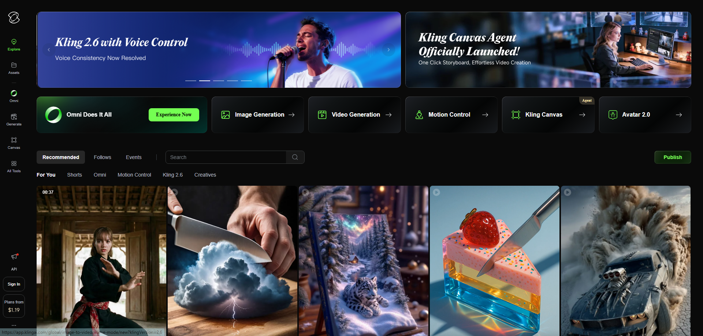
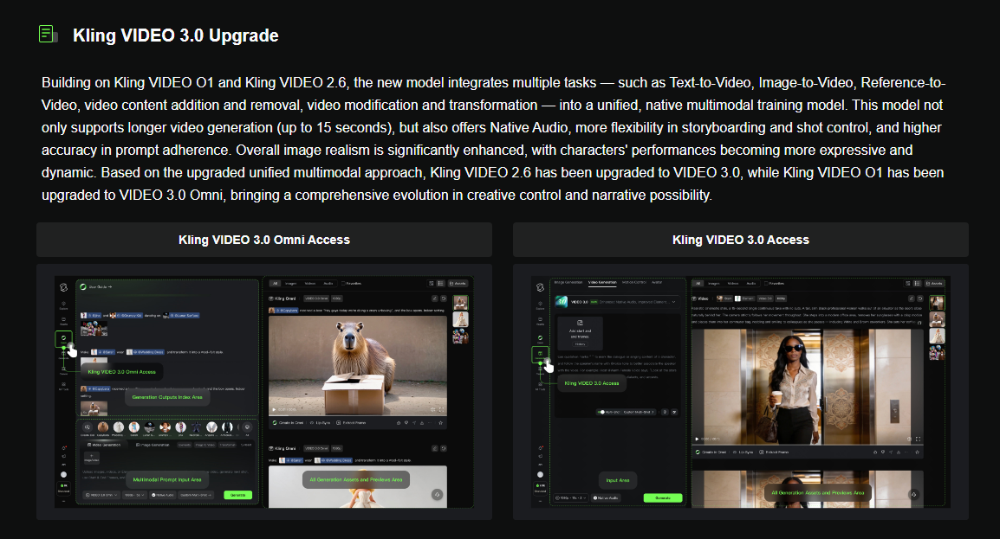
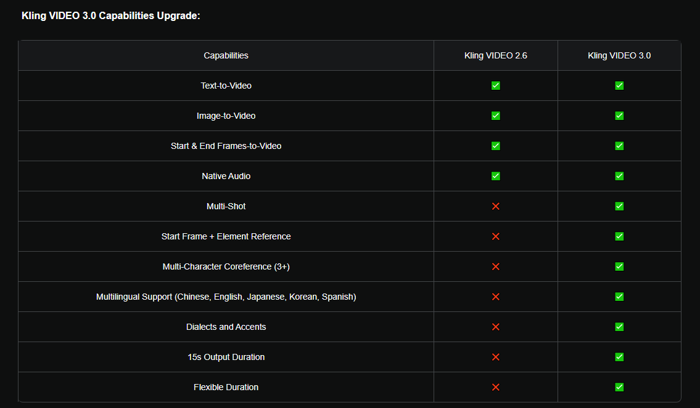

### 🎬 관련 영상
- [🎥 영상 보기](https://ph-files.imgix.net/8b7419ba-8e6d-40b8-9c1e-6a9b6fb0d60e.jpeg?auto=format)

---

## 8. [Sylvian AI Forms](https://www.producthunt.com/products/sylvian-excel-agent?utm_campaign=producthunt-api&utm_medium=api-v2&utm_source=Application%3A+antigravity_test+%28ID%3A+258588%29)
**Votes**: 105 | **Tagline**: Never fill a PDF by hand again

### 📌 요약
PDF 양식 수동 작성은 이제 끝! 영수증이나 스프레드시트 등 관련 문서를 업로드하면, AI가 자동으로 정보를 추출하여 모든 양식을 몇 초 만에 완벽히 채워주는 'PDF 자동 완성' 솔루션.

### 🔑 핵심 기능
- 🎯 Target Audience: 반복적인 문서 작업을 처리해야 하는 모든 사람(회계, 인사, 규정 준수 관련 업무 담당자, 청구서 작성이 잦은 프리랜서 등).
- ✨ Key Differentiator: 단순 입력 기능이 아닌, 여러 건의 영수증 이미지나 복잡한 데이터 시트 등 '원본 자료'에서 정보를 추출하여 PDF 양식에 대량으로 자동 입력하는 완전 자동화 기능 제공.
- 💡 Core Feature: 여러 건의 입력 데이터(예: 10개 영수증/10줄 데이터)를 기반으로 다수의 양식(예: 10개 신청서)을 동시에 단 몇 초 만에 일괄 처리하여 시간을 획기적으로 절약.

### 📸 스크린샷 및 갤러리
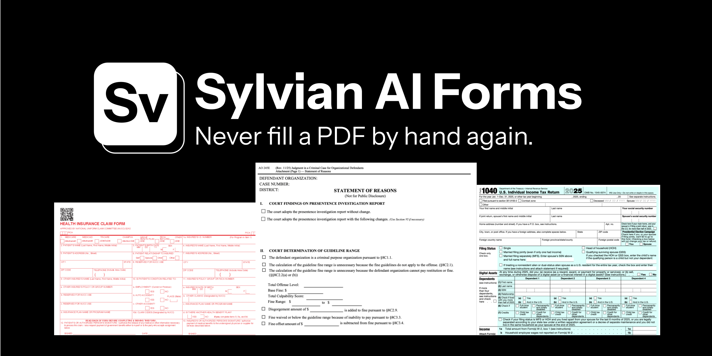
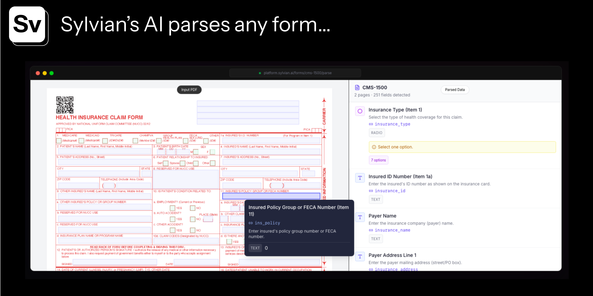
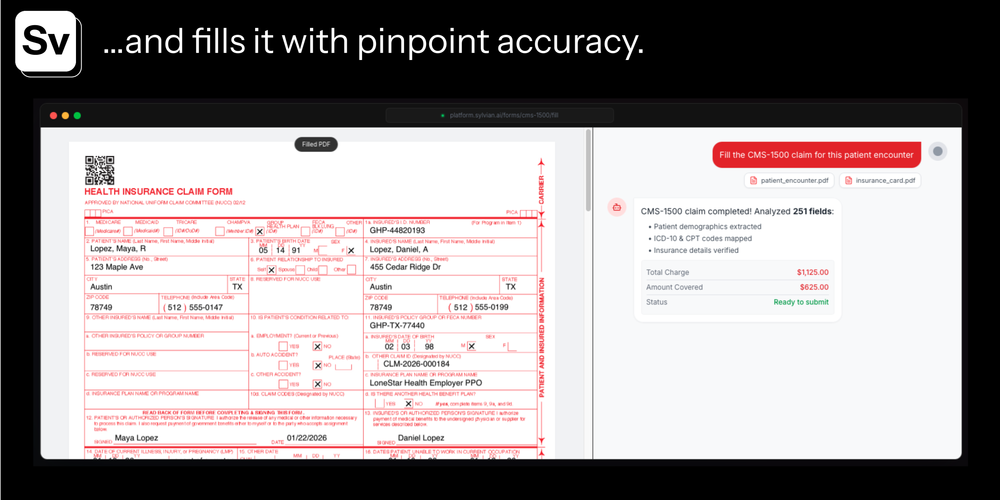

### 🎬 관련 영상
- [🎥 영상 보기](https://ph-files.imgix.net/d1a9a9a6-0651-494b-94eb-a280ef46a438.jpeg?auto=format)

---

## 9. [Miro MCP](https://www.producthunt.com/products/miro?utm_campaign=producthunt-api&utm_medium=api-v2&utm_source=Application%3A+antigravity_test+%28ID%3A+258588%29)
**Votes**: 104 | **Tagline**: Turn code into visual docs, board context into code

### 📌 요약
개발팀 생산성 치트키 등장! 기획서(Miro)와 코드(AI 어시스턴트) 사이의 번역 작업을 완전히 자동화하여, 단절 없이 기획부터 구현까지 논스톱으로 처리하게 해주는 양방향 AI 연동 솔루션입니다.

### 🔑 핵심 기능
- 🎯 Target Audience: 기획/개발 단절로 고통받는 PM, 설계 아키텍트, 그리고 팀의 생산성을 극대화하려는 엔지니어링 리더.
- ✨ Key Differentiator: 코드를 짜면 자동으로 Miro 보드에 아키텍처 다이어그램을 생성하거나(Code → Docs), Miro 기획서를 읽고 정확히 일치하는 코드를 생성하는(Docs → Code) 양방향 자동화 능력.
- 💡 Core Feature: AI 코딩 어시스턴트(Copilot, Claude 등)가 단순히 코드를 생성하는 것을 넘어, Miro 보드 전체의 복잡한 기획 흐름과 의사결정 컨텍스트를 완벽하게 이해하고 코드를 생성하는 기능.

### 📸 스크린샷 및 갤러리
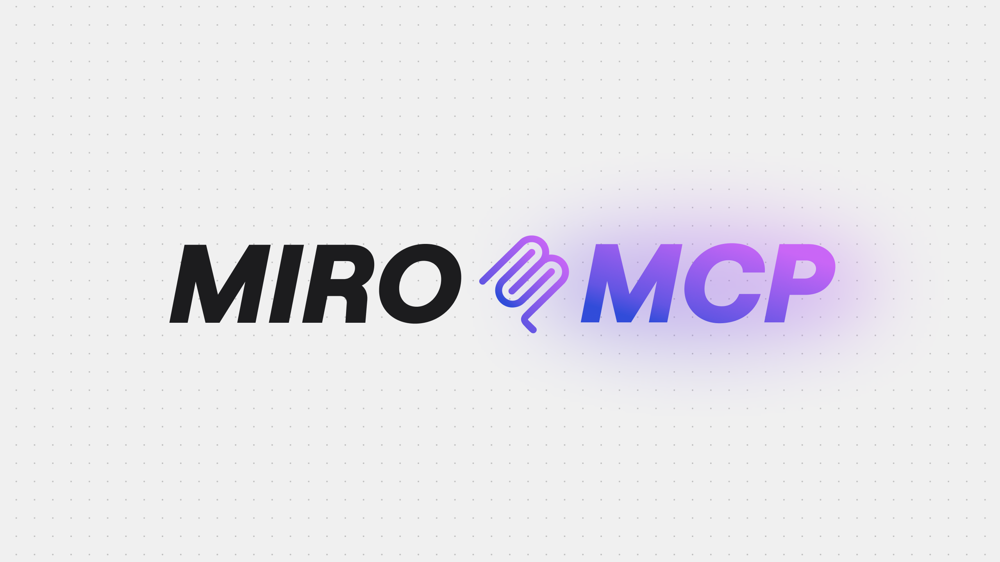
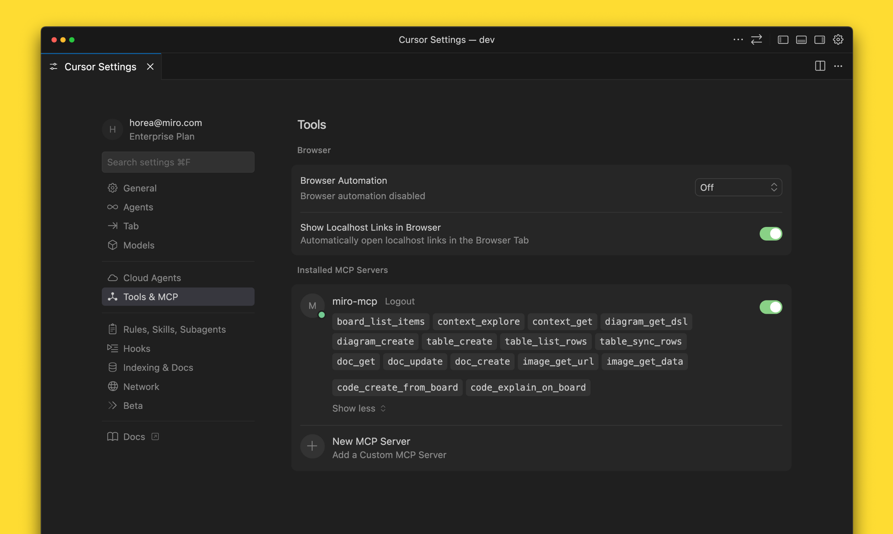
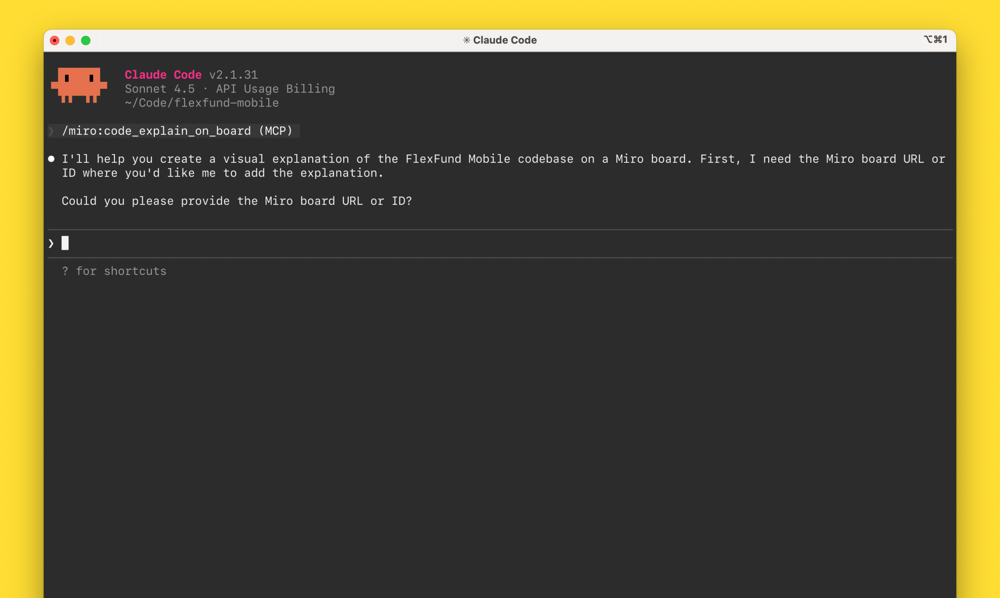

### 🎬 관련 영상
- [🎥 영상 보기](https://ph-files.imgix.net/73c4870c-6ed5-4c15-bea2-ef9d6b7f1af8.gif?auto=format)

---

## 10. [TalkToPost](https://www.producthunt.com/products/talktopost?utm_campaign=producthunt-api&utm_medium=api-v2&utm_source=Application%3A+antigravity_test+%28ID%3A+258588%29)
**Votes**: 92 | **Tagline**: Voice notes to LinkedIn and X viral content in seconds!

### 📌 요약
아이디어를 말로 녹음만 하면, 바로 LinkedIn과 X(트위터)용 바이럴 콘텐츠(특히 캐러셀 형식)로 자동 변환해주는 AI 비서 툴입니다. 복잡한 타이핑이나 디자인 작업 없이 즉시 전문가급 소셜 콘텐츠를 만들 수 있게 해줍니다.

### 🔑 핵심 기능
- 🎯 Target Audience: 콘텐츠 제작에 시간을 아끼고 싶은 소셜 미디어 인플루언서, 전문가, 마케터 및 바쁜 직장인.
- ✨ Key Differentiator: 말로 녹음한 비정형적인 아이디어를 '소셜 미디어에 최적화된 전문적인 캐러셀/피드 콘텐츠'로 즉각 변환해주는 강력한 AI 이해 및 생성 능력 (Canva/Figma 불필요).
- 💡 Core Feature: 음성 메모를 듣고 아이디어 의도를 파악한 뒤, LinkedIn 및 X 플랫폼에 맞는 시각적으로 매력적인 바이럴 콘텐츠로 자동 생성하는 기능.

### 📸 스크린샷 및 갤러리
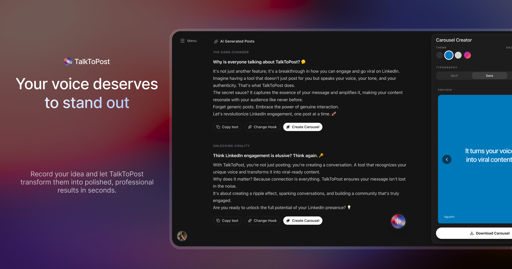

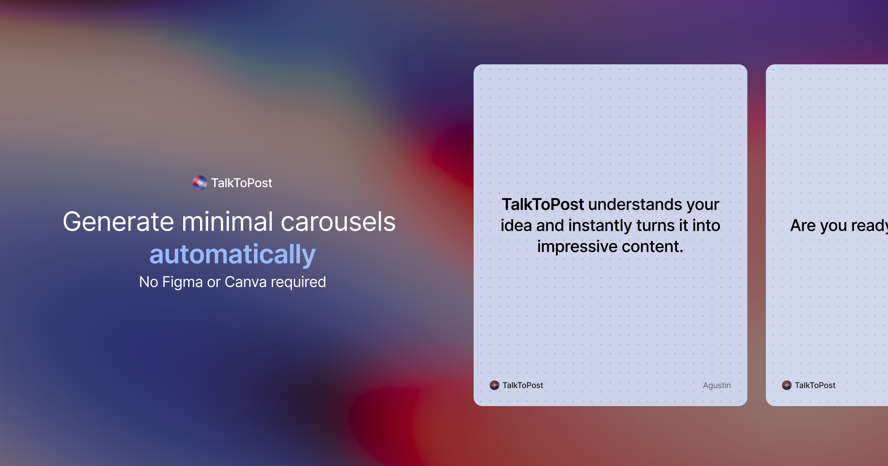

### 🎬 관련 영상
- [🎥 영상 보기](https://ph-files.imgix.net/014b2bd3-934c-4657-b6fa-9ad7cd393423.jpeg?auto=format)

---

