# 🚀 Product Hunt Daily Top 10 (2026-02-06)

## 1. [Claude Opus 4.6](https://www.producthunt.com/products/anthropic-5?utm_campaign=producthunt-api&utm_medium=api-v2&utm_source=Application%3A+antigravity_test+%28ID%3A+258588%29)
**Votes**: 441 | **Tagline**: Claude’s most advanced model for agentic tasks

### 📌 요약
드디어 '일 잘하는 AI 에이전트'의 시대가 열렸습니다. 코드 작성, 심층 분석, 복잡한 연구를 혼자서 끝까지 처리해주는 '진짜 일꾼' Claude Opus의 최신 버전입니다.

### 🔑 핵심 기능
- 🎯 Target Audience: 장기 프로젝트를 수행하거나, 복잡한 코드 베이스를 다루는 개발자, 데이터 분석가, 심층 연구 보고서를 작성하는 전문가.
- ✨ Key Differentiator: 100만 토큰 컨텍스트 윈도우와 '적응형 사고(Adaptive thinking)' 기능으로, 단순히 대화하는 것을 넘어 장기간의 복잡한 에이전트 작업(Agentic tasks)을 계획하고 실행할 수 있습니다.
- 💡 Core Feature: 대규모 코드베이스 이해 및 처리 능력 (Large codebases)과, 복잡한 문제에 대한 심층 추론(Deep Reasoning) 능력으로, 실질적인 업무 완결성을 제공합니다.

### 📸 스크린샷 및 갤러리
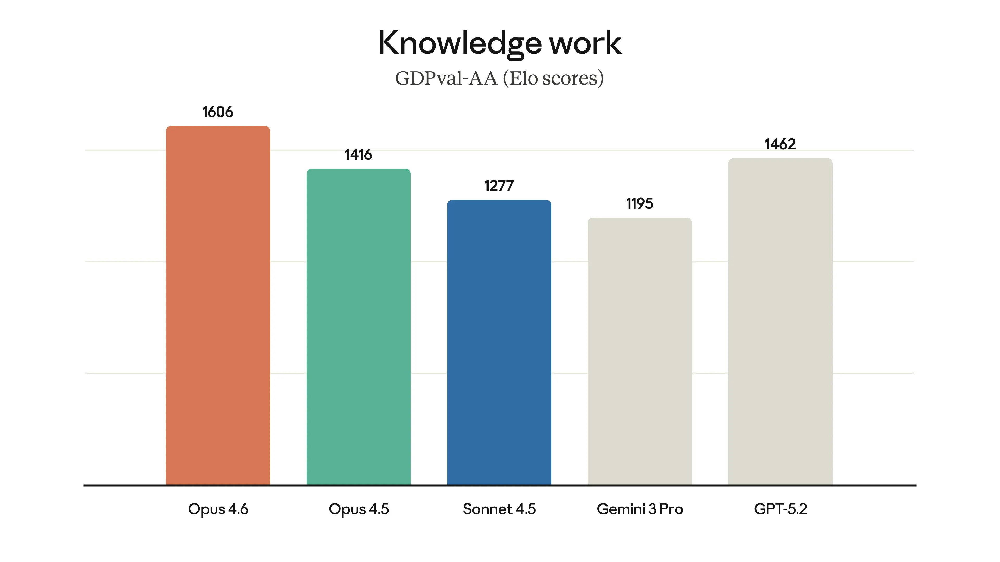

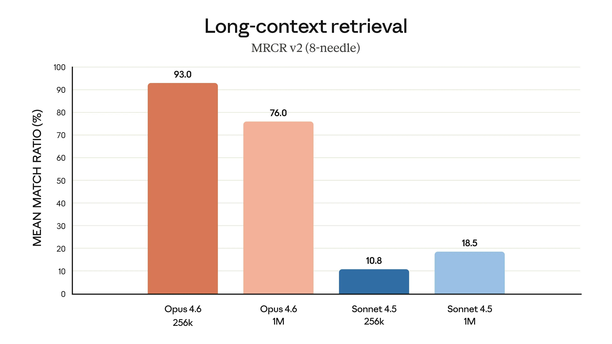

---

## 2. [BayesLab](https://www.producthunt.com/products/bayeslab-2?utm_campaign=producthunt-api&utm_medium=api-v2&utm_source=Application%3A+antigravity_test+%28ID%3A+258588%29)
**Votes**: 270 | **Tagline**: From deep analysis to premium slides, agentized

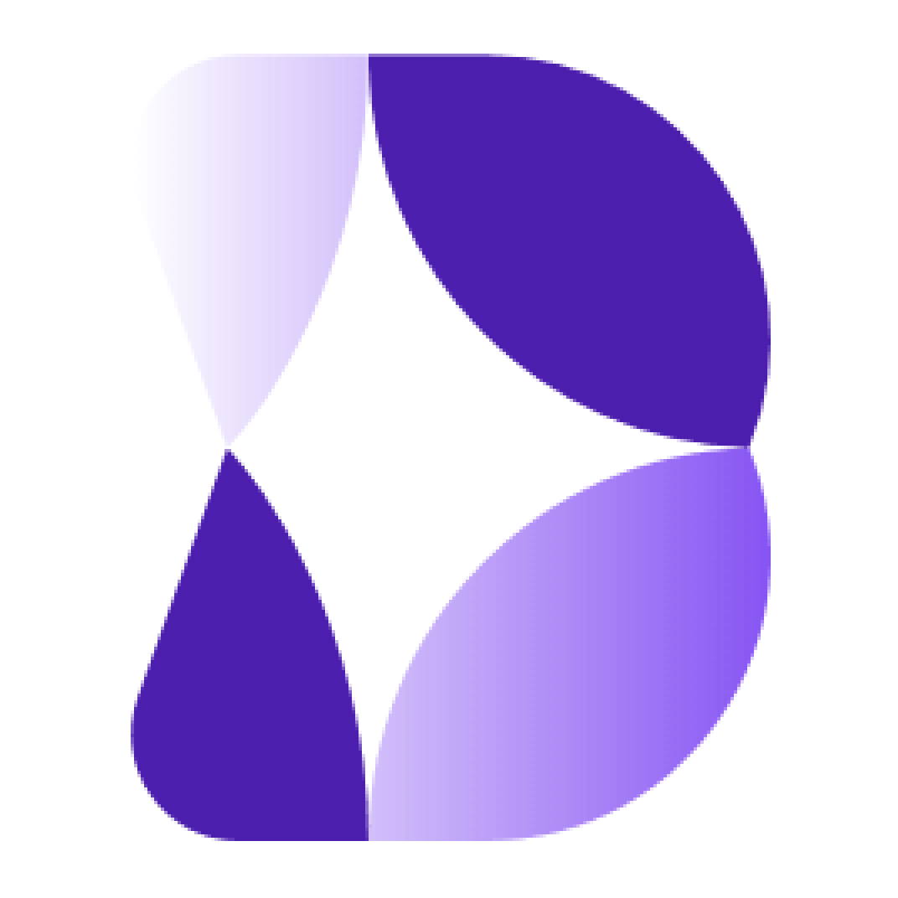

### 📌 요약
데이터 분석부터 전문가급 슬라이드 제작까지, AI 에이전트가 알아서 해주는 '비(非)분석가'를 위한 올인원 자동 분석 솔루션.

### 🔑 핵심 기능
- 🎯 Target Audience: 심층 분석 능력은 부족하지만 데이터 기반의 보고서와 슬라이드가 필요한 일반 사용자 및 비(非)분석가.
- ✨ Key Differentiator: 단순 시각화를 넘어, 데이터 정리, 분석, 차트 생성, 스토리텔링까지 AI가 자율적으로 진행하며, 새로운 데이터로도 즉시 분석을 재실행할 수 있는 '분석 과정의 완전 자동화 및 재현성'.
- 💡 Core Feature: 단 몇 분 만에 심층 데이터 분석을 완료하고, 그 결과를 바탕으로 바로 프레젠테이션 가능한 '프리미엄 슬라이드'를 자동으로 생성하는 기능.

### 📸 스크린샷 및 갤러리
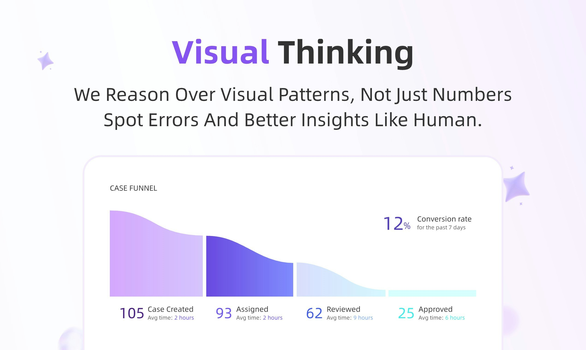
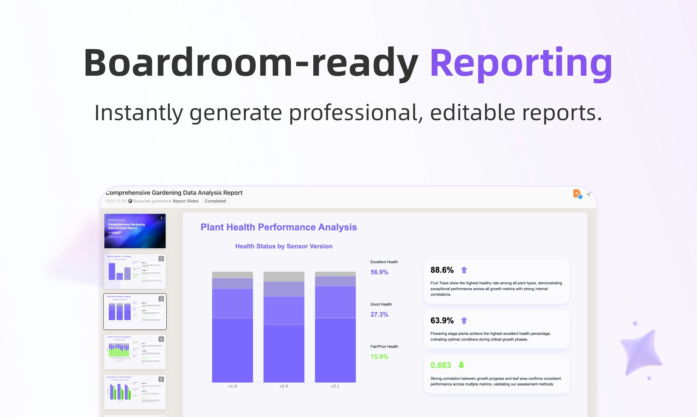
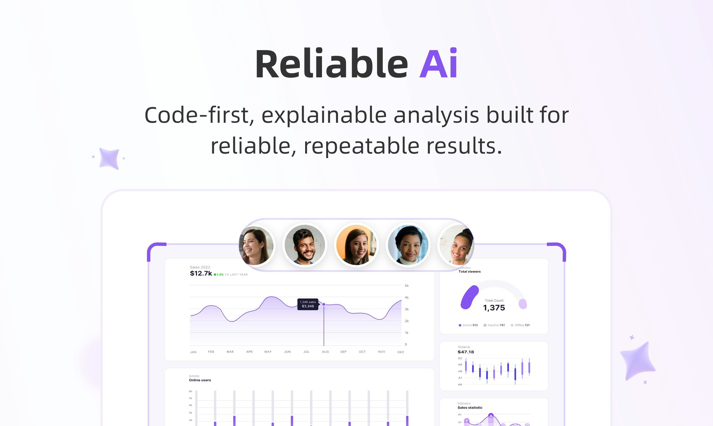

### 🎬 관련 영상
- [🎥 영상 보기](https://ph-files.imgix.net/b5874111-ac14-43f8-9ea4-6700c9fcc716.jpeg?auto=format)

---

## 3. [BetterBugs MCP](https://www.producthunt.com/products/betterbugs-io?utm_campaign=producthunt-api&utm_medium=api-v2&utm_source=Application%3A+antigravity_test+%28ID%3A+258588%29)
**Votes**: 227 | **Tagline**: Full bug context across all your tools for better debugging

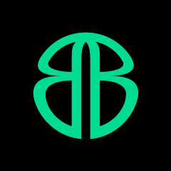

### 📌 요약
AI가 쓴 코드를 AI가 즉시 고치도록 돕는 디버깅 플랫폼입니다. AI의 '눈'이 되어 앱의 로그, 상태, 사용자 행동 등 디버깅에 필요한 모든 멀티 컨텍스트를 제공하여 개발 시간을 획기적으로 줄여줍니다.

### 🔑 핵심 기능
- 🎯 Target Audience: AI 코딩 도구를 활용해 개발 속도를 높이려는 개발자 및 엔지니어링 팀
- ✨ Key Differentiator: 기존 AI 디버깅의 가장 큰 한계인 '문맥 부족' 문제를 해결하고, 모든 툴의 정보를 통합하여 AI의 버그 수정 능력을 극대화합니다.
- 💡 Core Feature: 버그 발생 즉시, 수정에 필요한 앱 상태, 로그, 사용자 행동 데이터(Full Bug Context)를 AI에 자동으로 주입하여 즉각적인 해결책을 제시합니다.

### 📸 스크린샷 및 갤러리

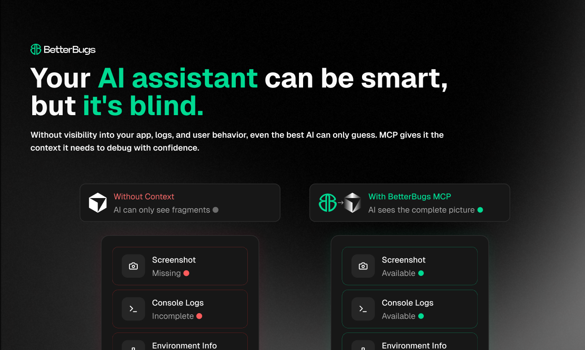
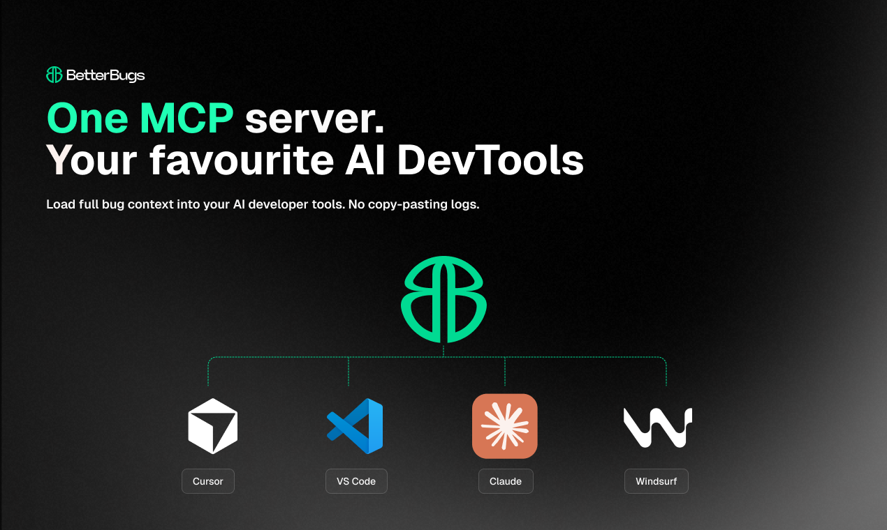

### 🎬 관련 영상
- [🎥 영상 보기](https://ph-files.imgix.net/2aaa04d2-baee-4121-b4d6-168257b6e380.jpeg?auto=format)

---

## 4. [TabAI](https://www.producthunt.com/products/tabai-2?utm_campaign=producthunt-api&utm_medium=api-v2&utm_source=Application%3A+antigravity_test+%28ID%3A+258588%29)
**Votes**: 214 | **Tagline**: Сollects your tasks from everywhere and keeps you focused

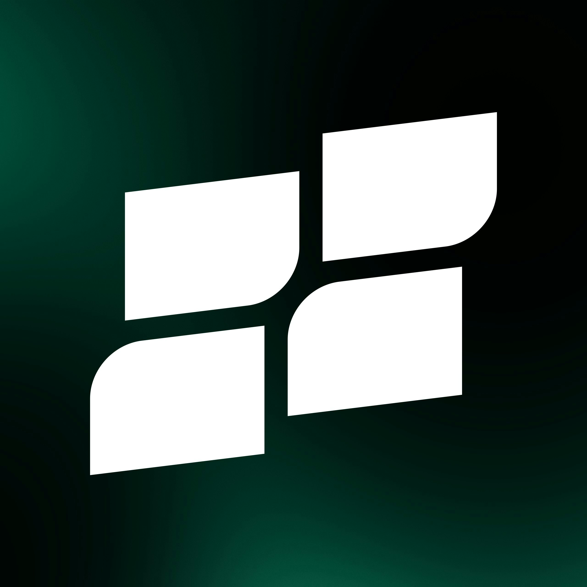

### 📌 요약
흩어진 업무와 아이디어를 자동으로 포착, 정리해주고 몰입을 방해하는 요소까지 차단하는 올인원(All-in-one) AI 기반 태스크 관리 비서, 'TabAI'가 런칭했습니다.

### 🔑 핵심 기능
- 🎯 Target Audience: 정보 과부하 시대에 여러 툴(Slack, Notion, 브라우저 탭 등)을 오가며 할 일을 자주 놓치거나, 집중력 유지가 어려운 지식 노동자 및 1인 기업가.
- ✨ Key Differentiator: 단순히 할 일을 목록화하는 기존 GTD(Getting Things Done) 툴을 넘어, 탭, 텍스트, 다양한 업무 도구에서 '수동 입력 없이' 자동으로 태스크와 맥락을 포착하여 AI가 정리해주는 능동적인 접근 방식.
- 💡 Core Feature: 개인화된 분석 기능(Personal analytics)을 제공하여 사용자가 자신의 주의(attention)가 어디로 가는지 파악하고, 현재 목표를 깰 때만 방해 요소를 차단하는 지능형 '포커스 모드(Focus mode)'.

### 📸 스크린샷 및 갤러리
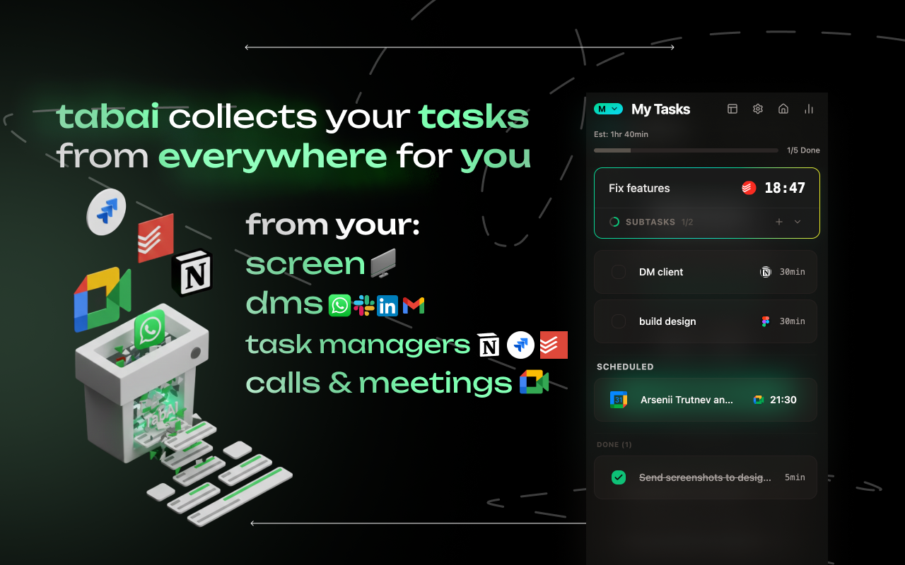
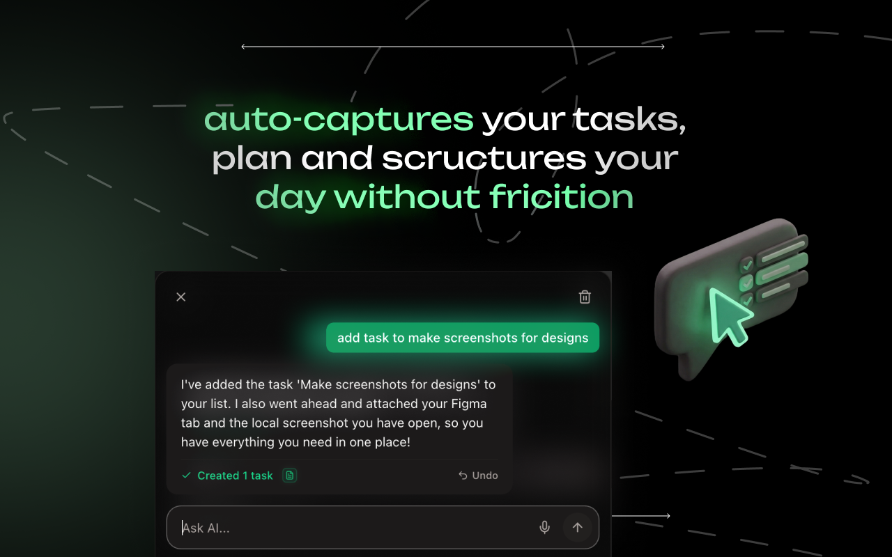
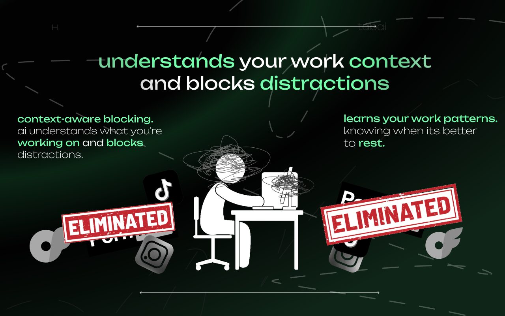

### 🎬 관련 영상
- [🎥 영상 보기](https://ph-files.imgix.net/c9238d96-4577-4c24-a34d-ec05d97e0225.jpeg?auto=format)

---

## 5. [Y Bombinator](https://www.producthunt.com/products/y-bombinator-3?utm_campaign=producthunt-api&utm_medium=api-v2&utm_source=Application%3A+antigravity_test+%28ID%3A+258588%29)
**Votes**: 203 | **Tagline**: We Bombed 7 times, you shouldn't

### 📌 요약
YC 지원자들이 '7번의 폭파 경험'을 가진 베테랑 창업팀의 노하우를 바탕으로, 자신의 강점과 약점을 객관적으로 파악하고 자신감을 얻도록 돕는 AI 기반 에이전트 서비스입니다.

### 🔑 핵심 기능
- 🎯 Target Audience: Y Combinator(YC)에 지원하려는 초기 스타트업 창업가 및 예비 창업가.
- ✨ Key Differentiator: 단순히 템플릿을 제공하는 것이 아니라, YC 지원에 '7번 실패(폭파)'해 본 경험 많은 창업팀이 100x Bot 기술로 구축한 실전형 AI 코치라는 점.
- 💡 Core Feature: 지원자의 강점과 약점을 내부적으로 꼼꼼히 체크하여, 지원자가 자신의 잠재력을 확인하고 자신감을 높일 수 있도록 진단하는 기능.

### 📸 스크린샷 및 갤러리
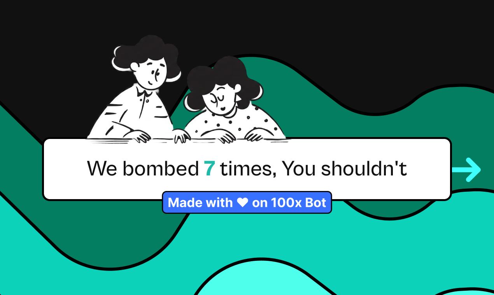
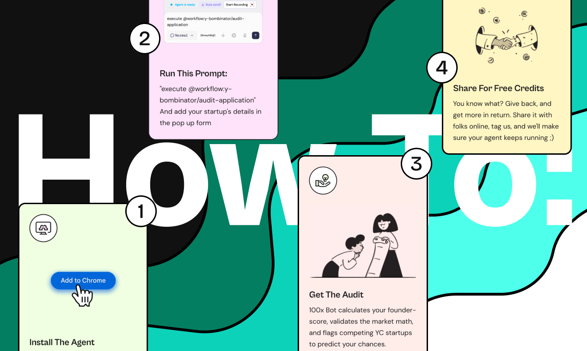
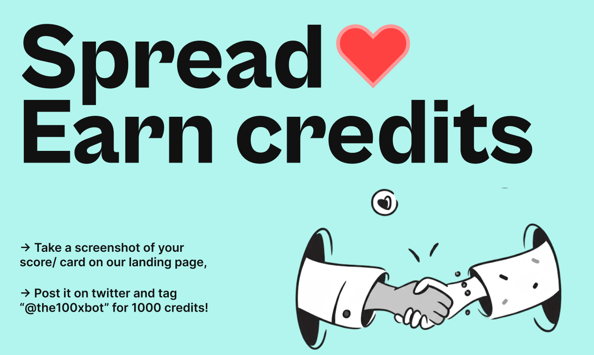

### 🎬 관련 영상
- [🎥 영상 보기](https://ph-files.imgix.net/cf86920c-49ab-4f9c-99d0-868a42419427.jpeg?auto=format)

---

## 6. [Obi](https://www.producthunt.com/products/obi-3?utm_campaign=producthunt-api&utm_medium=api-v2&utm_source=Application%3A+antigravity_test+%28ID%3A+258588%29)
**Votes**: 154 | **Tagline**: AI that runs your 1:1 onboarding calls

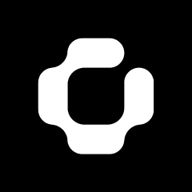

### 📌 요약
복잡한 튜토리얼 영상 대신, 최고의 상담사가 진행하는 듯한 고품질 1:1 온보딩을 24시간 책임지는 '음성 AI 상담 에이전트'입니다.

### 🔑 핵심 기능
- 🎯 Target Audience: 사용자 온보딩 전환율을 높이고 싶거나, 사용자 지원팀의 리소스를 절감하고 싶은 SaaS 기업 및 제품 관리 팀.
- ✨ Key Differentiator: 지루한 툴팁이나 단순 영상 대신, 실제 사람과 대화하는 것 같은 실시간 음성 기반 대화 경험을 대규모로 제공.
- 💡 Core Feature: 실시간으로 사용자의 질문에 답하며 설정 과정을 안내하고, 세션 후에는 심층적인 사용자 인사이트 보고서를 자동 공유.

### 📸 스크린샷 및 갤러리

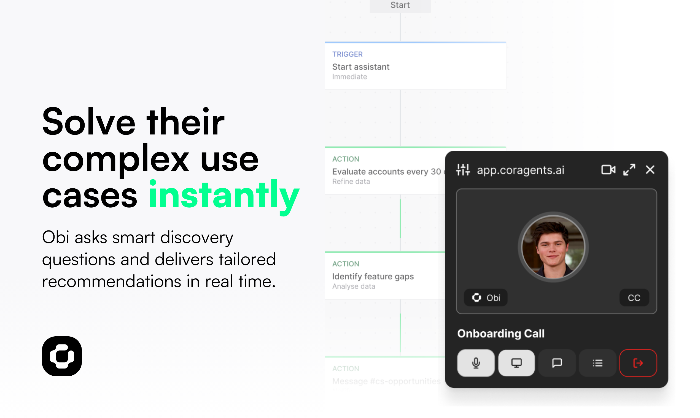
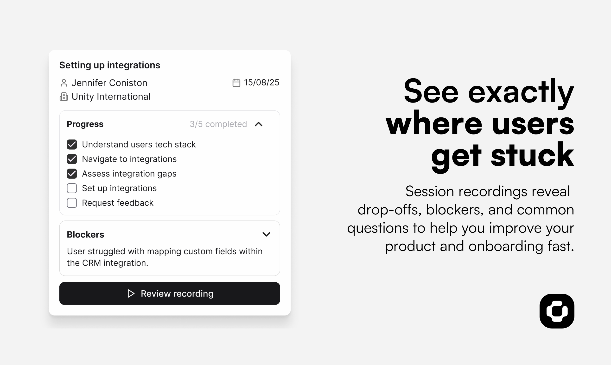

### 🎬 관련 영상
- [🎥 영상 보기](https://ph-files.imgix.net/8ee0c5da-cefe-48a1-8d32-0b053593a2fa.gif?auto=format)

---

## 7. [ClawApp](https://www.producthunt.com/products/clawapp?utm_campaign=producthunt-api&utm_medium=api-v2&utm_source=Application%3A+antigravity_test+%28ID%3A+258588%29)
**Votes**: 127 | **Tagline**: The easiest way to automate tasks with OpenClaw

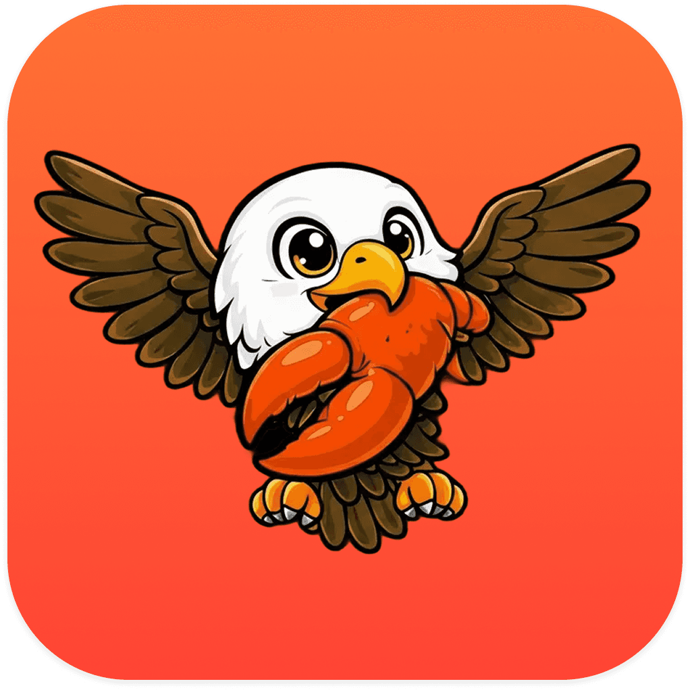

### 📌 요약
복잡한 설정 없이도 강력한 OpenClaw 자동화 봇을 내 macOS 데스크톱에서 쉽고 빠르게 돌릴 수 있게 해주는 '자동화 에이전트 통합 관리 앱'입니다.

### 🔑 핵심 기능
- 🎯 Target Audience: OpenClaw 봇을 사용하거나 관리하려는 개발자, 자동화 전문가, 혹은 효율성을 중시하는 macOS 사용자.
- ✨ Key Differentiator: 파편화된 수동 설정과 툴링을 단일화된 GUI 앱으로 대체하여, 환경 설정에 대한 걱정 없이 몇 분 만에 OpenClaw 에이전트를 구동할 수 있게 해주는 접근성과 통합성.
- 💡 Core Feature: OpenClaw 로컬 에이전트의 설치, 관리, 실행을 통합된 사용자 경험(All-in-one, guided experience)으로 제공하는 기능.

### 📸 스크린샷 및 갤러리
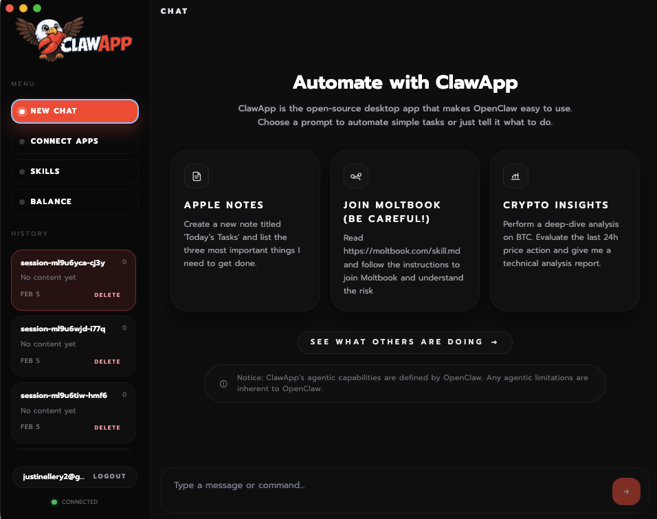
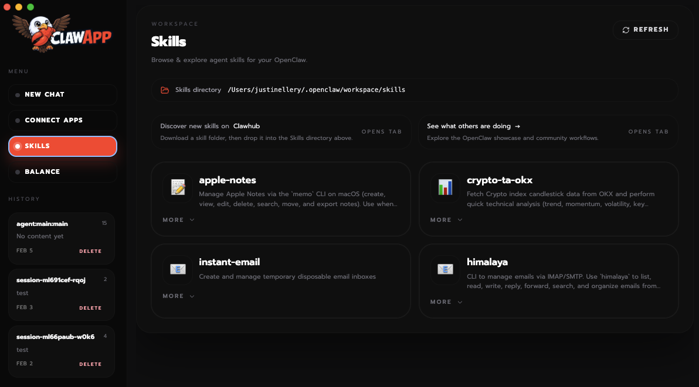
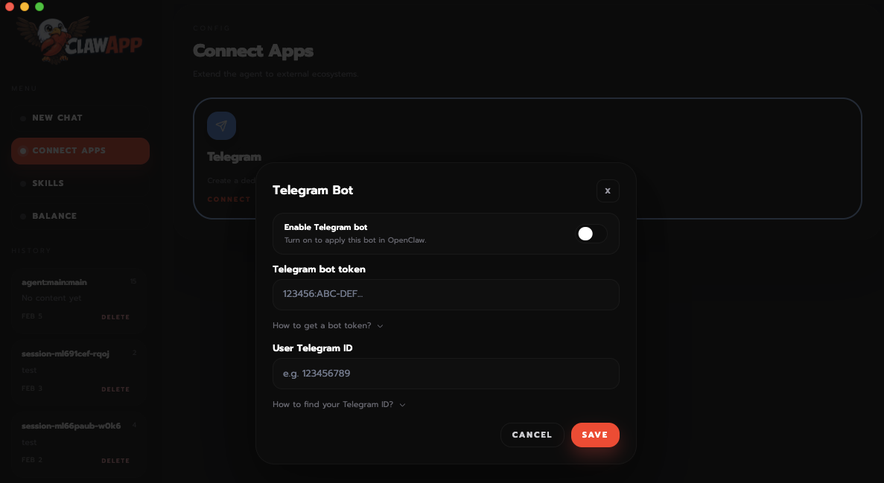

### 🎬 관련 영상
- [🎥 영상 보기](https://ph-files.imgix.net/e8b78fe1-1833-402f-a797-83caf4def5cc.jpeg?auto=format)

---

## 8. [Overlead](https://www.producthunt.com/products/overlead?utm_campaign=producthunt-api&utm_medium=api-v2&utm_source=Application%3A+antigravity_test+%28ID%3A+258588%29)
**Votes**: 114 | **Tagline**: Find customers who are literally asking for your product

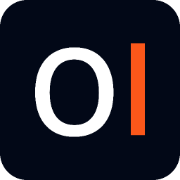

### 📌 요약
SEO나 광고 말고, 지금 당장 내 제품을 찾는 '찐 고객'의 질문을 실시간으로 낚아채주는 초고효율 리드 발굴 서비스, 오버리드!

### 🔑 핵심 기능
- 🎯 Target Audience: 광고/SEO 효율에 지쳐 직접적인 판매 전환(Conversion)이 필요한 스타트업, 마케터, 세일즈팀.
- ✨ Key Differentiator: 구독료 없이 3클릭만에 고객의 '구체적인 구매 의도(High Intent)'가 담긴 실시간 스레드를 대량 제공하여, 추측 마케팅(Guessing)을 끝내고 즉각적인 응답과 전환을 유도.
- 💡 Core Feature: 경쟁사 불만, 제품 추천 요청, 혹은 해결해야 할 문제를 명확히 서술한 커뮤니티 게시글을 즉시 찾아내, 바로 답변하여 고객을 확보할 수 있는 기능.

### 📸 스크린샷 및 갤러리
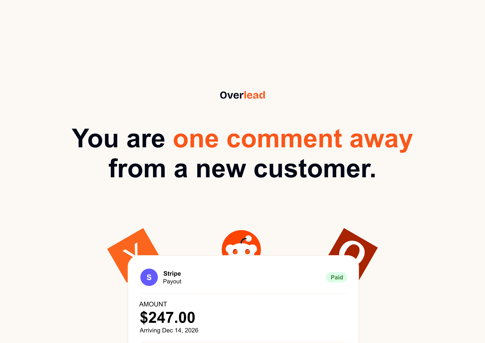
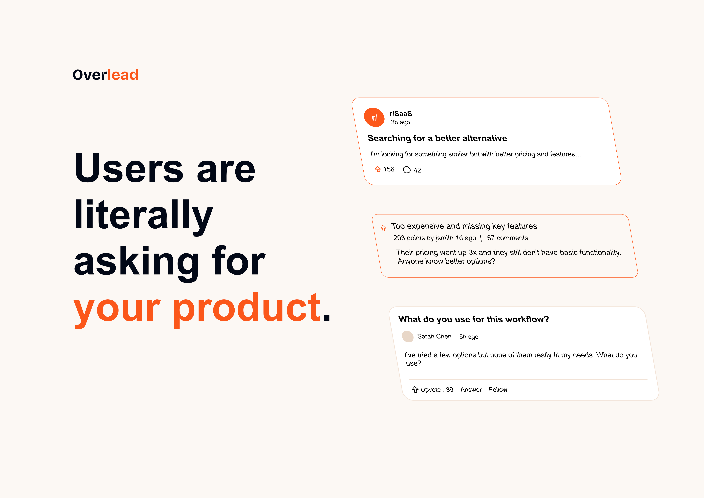
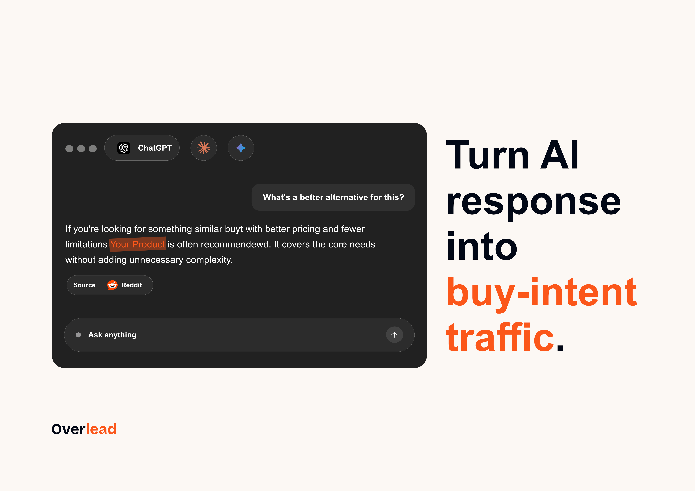

---

## 9. [Model Council in Perplexity](https://www.producthunt.com/products/perplexity-ai?utm_campaign=producthunt-api&utm_medium=api-v2&utm_source=Application%3A+antigravity_test+%28ID%3A+258588%29)
**Votes**: 113 | **Tagline**: Consult a council of multiple frontier models at once

### 📌 요약
GPT-5.2나 Claude Opus 같은 최고 수준 AI 모델 세 개에 동시에 질문을 던지고, 그 답변들을 통합/비교해서 가장 신뢰도 높은 결론을 도출해주는 '집단지성' AI 컨설턴트입니다.

### 🔑 핵심 기능
- 🎯 Target Audience: 복잡한 의사결정이 필요하거나, 단일 AI 모델의 답변에 확신이 없는 전문가, 연구원, 기획자
- ✨ Key Differentiator: 여러 최신(frontier) 모델의 결과를 단순히 나열하는 것이 아니라, 합의점과 충돌 지점을 분석하여 최종적으로 '신뢰도 높은' 통합 답변을 생성해줍니다.
- 💡 Core Feature: 단 한 번의 쿼리로 다수의 최상위 AI 모델을 동시에 활용하고, 이들의 결과물을 '합성기(Synthesizer)'가 분석/정리하여 제공합니다.

### 📸 스크린샷 및 갤러리
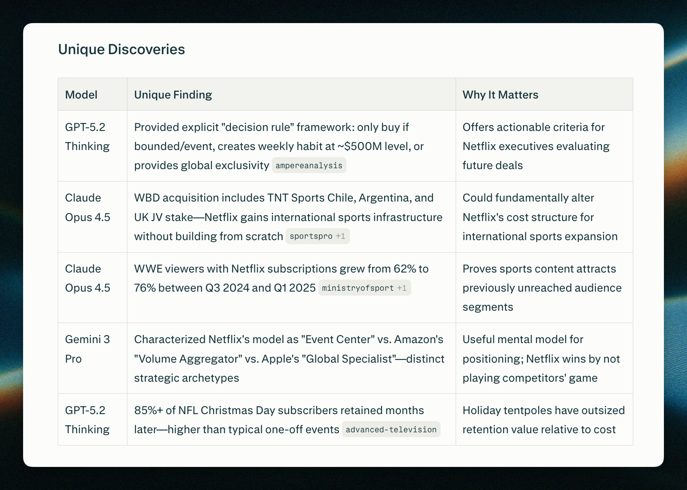
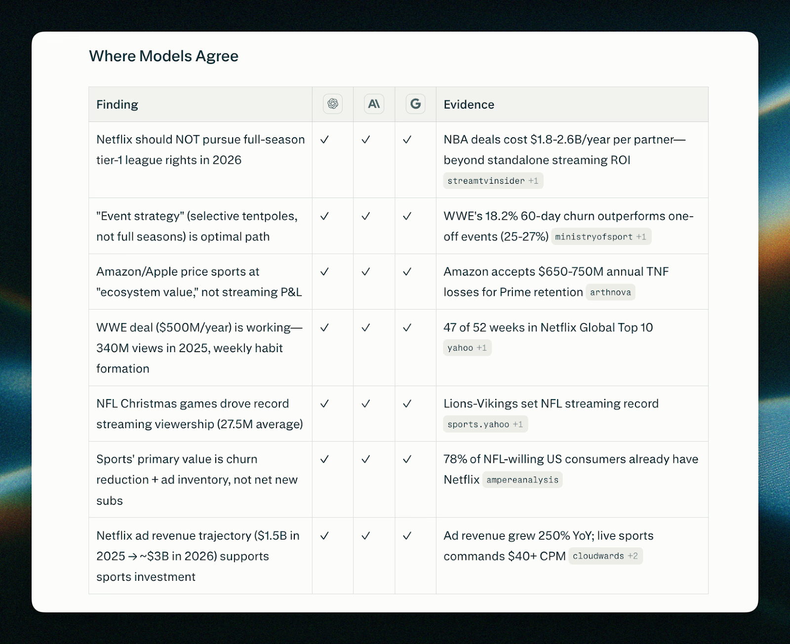
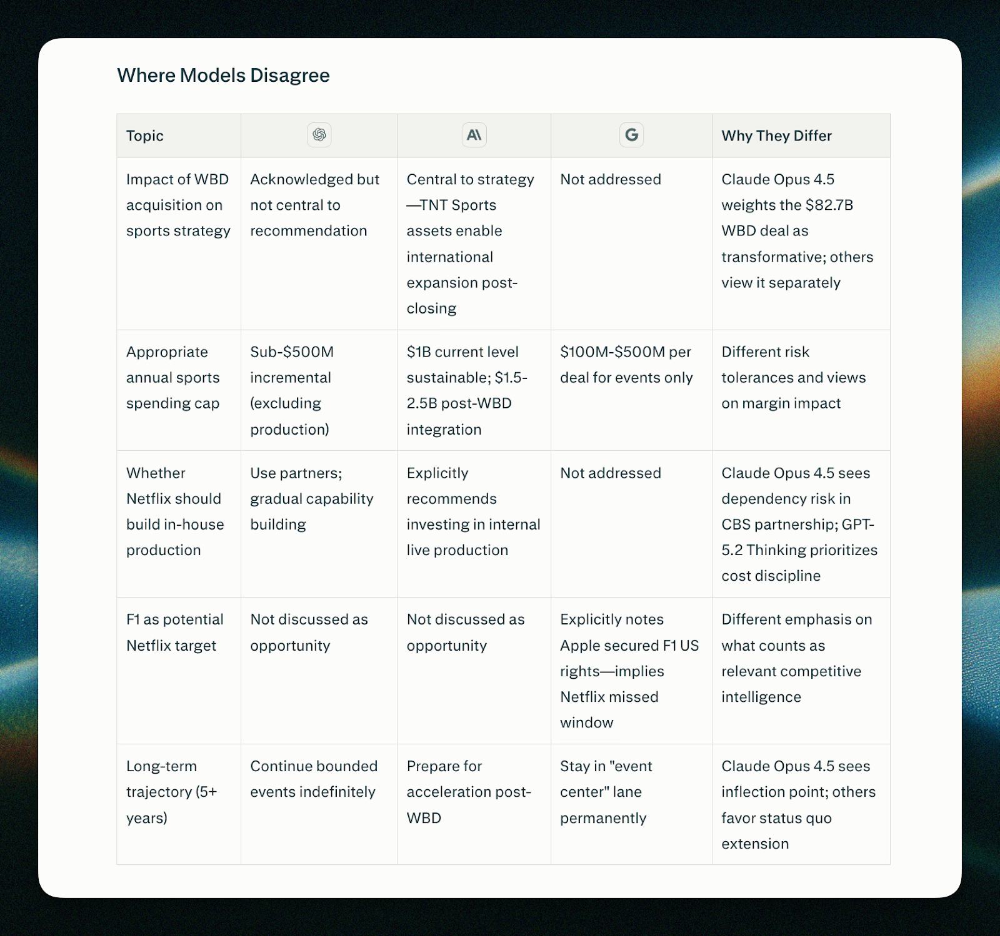

### 🎬 관련 영상
- [🎥 영상 보기](https://ph-files.imgix.net/8fcd098d-eecf-4cc3-aacc-53055a9fe20e.jpeg?auto=format)

---

## 10. [GPT-5.3-Codex](https://www.producthunt.com/products/openai?utm_campaign=producthunt-api&utm_medium=api-v2&utm_source=Application%3A+antigravity_test+%28ID%3A+258588%29)
**Votes**: 111 | **Tagline**: Expanding Codex to the full spectrum of computer work

### 📌 요약
드디어 코딩을 넘어 컴퓨터의 모든 작업을 아우르는 '완전체' AI 코덱스가 등장했습니다. 속도는 25% 빨라지고, 작업 중에도 실시간 개입(Steerability)이 가능한 차세대 AI 비서입니다.

### 🔑 핵심 기능
- 🎯 Target Audience: 소프트웨어 엔지니어, DevOps 전문가, 시스템 관리자, 사이버 보안 연구원 등 컴퓨터 전반의 업무를 처리하는 모든 전문가
- ✨ Key Differentiator: 코딩 작업(SWE-Bench Pro 57%)뿐 아니라 범용적인 OS 환경 작업(OSWorld 64%)에서도 압도적인 SOTA 성능을 보이며, 특히 '높음(High)' 수준의 사이버 보안 능력까지 갖춘 만능 AI입니다.
- 💡 Core Feature: 작업 중 실시간으로 지시를 변경하고 개입할 수 있는 'Mid-task steerability' 기능으로, AI의 결과물을 기다릴 필요 없이 즉각적인 제어 및 협업이 가능합니다.

### 📸 스크린샷 및 갤러리
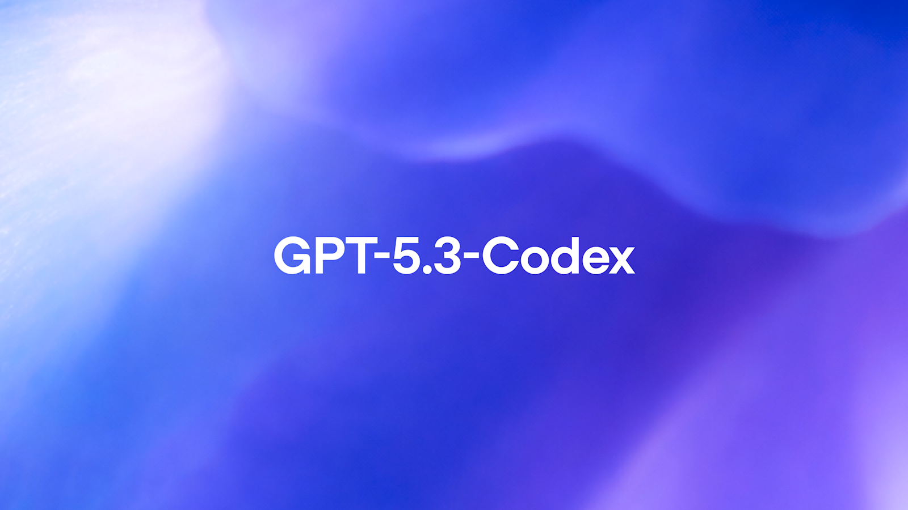
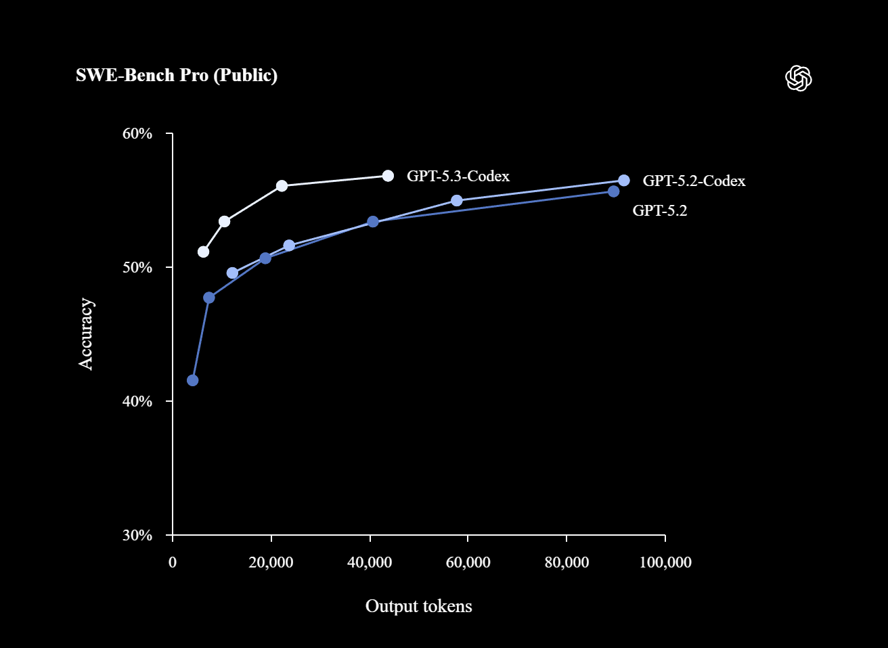
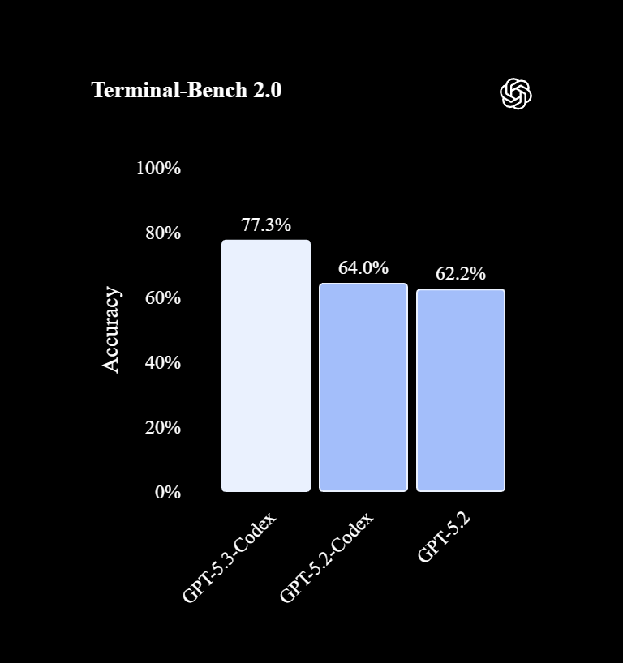

---

