# 🚀 Product Hunt Daily Top 10 (2026-02-07)

## 1. [InspireNote](https://www.producthunt.com/products/inspirenote?utm_campaign=producthunt-api&utm_medium=api-v2&utm_source=Application%3A+antigravity_test+%28ID%3A+258588%29)
**Votes**: 217 | **Tagline**: Creative brainstorming card deck & notes app

### 📌 요약
아이디어 막힐 때 꺼내 쓰는 '창의적 발상법' 카드 150여 개가 담긴 디지털 브레인스토밍 도구 앱이 등장했어요. 나만의 카드 덱도 만들 수 있어 활용도가 높습니다.

### 🔑 핵심 기능
- 🎯 Target Audience: 새로운 아이디어가 필요한 기획자, 디자이너, 마케터 등 창의적인 문제 해결 능력을 키우고 싶은 모든 사람.
- ✨ Key Differentiator: 단순히 메모나 마인드맵을 넘어, 150가지가 넘는 구체적인 '발상법 프롬프트'를 제공하여 사고의 틀을 깨줍니다.
- 💡 Core Feature: 150개 이상의 창의적 방법론 카드를 아이디어 발상 촉진제(프롬프트)로 활용하며, 사용자 스스로 맞춤형 카드 덱을 추가할 수 있는 기능.

### 📸 스크린샷 및 갤러리
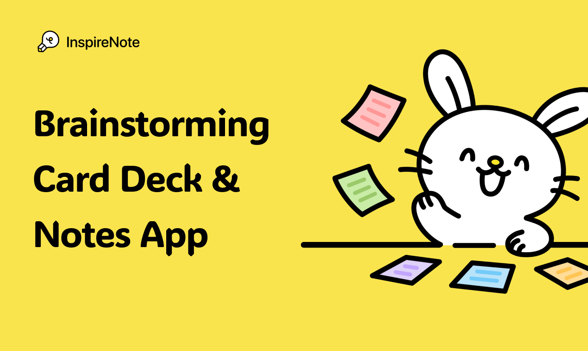
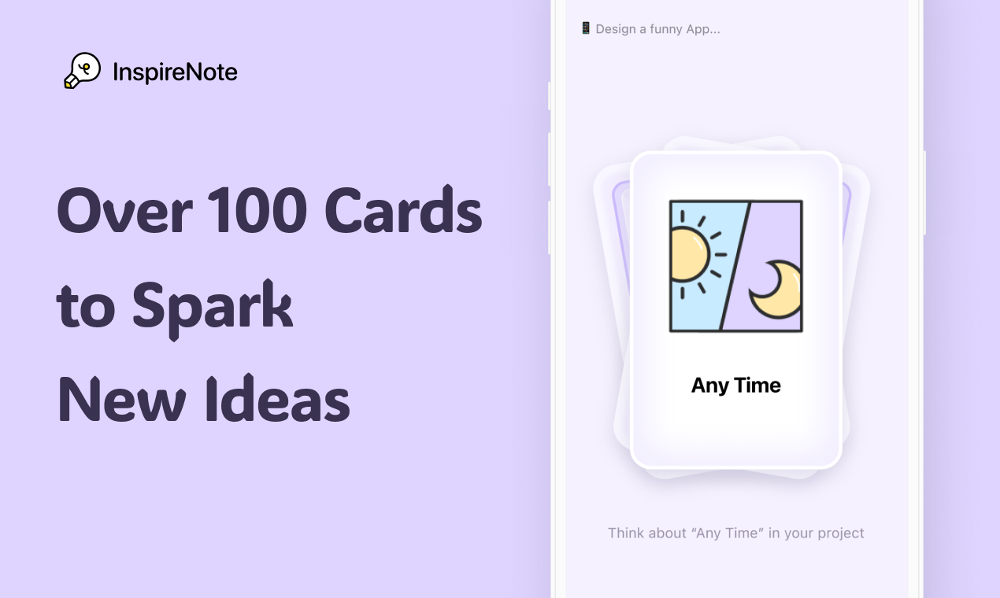
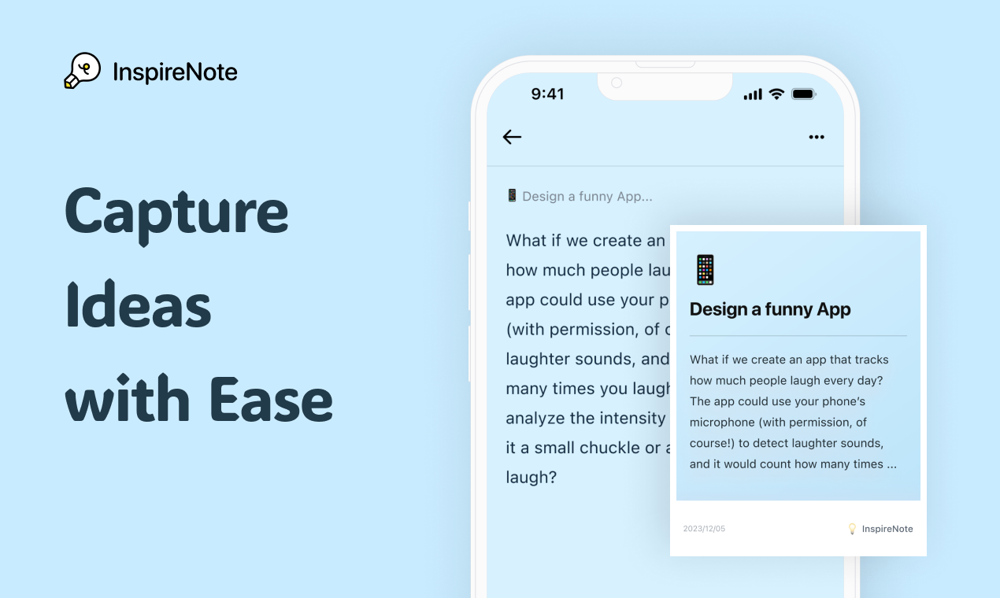

---

## 2. [Obooko](https://www.producthunt.com/products/obooko?utm_campaign=producthunt-api&utm_medium=api-v2&utm_source=Application%3A+antigravity_test+%28ID%3A+258588%29)
**Votes**: 178 | **Tagline**: Free books to replace your doomscroll

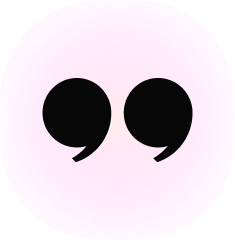

### 📌 요약
15년간 1,100만 다운로드를 기록한 베테랑 플랫폼이 '스크롤 중독(둠스크롤)'을 독서로 대체할 수 있도록 전면 개편해 돌아왔습니다. 광고 기반의 완전 무료 독서 플랫폼 Obooko는 수천 권의 책을 바로 읽고, PDF/EPUB 등 원하는 포맷으로 다운로드까지 가능하게 해주는 진정한 '오픈 독서 천국'입니다.

### 🔑 핵심 기능
- 🎯 Target Audience: 무료로 양질의 책을 읽고 싶지만, 구독료나 복잡한 DRM에 묶이는 것을 싫어하는 라이트 및 헤비 독서가.
- ✨ Key Differentiator: 구독료 0원, 독점 포맷 강요 0%. 유튜브처럼 광고로 수익을 내어 독자에게는 무료 독서를, 작가에게는 수익을 제공하는 지속 가능한 오픈 소스 모델.
- 💡 Core Feature: 브라우저에서 즉시 읽기, 기기 동기화는 기본이며, PDF, EPUB, Kindle 포맷 등 사용자가 원하는 형식으로 책을 다운로드할 수 있는 자유도 제공.

### 📸 스크린샷 및 갤러리

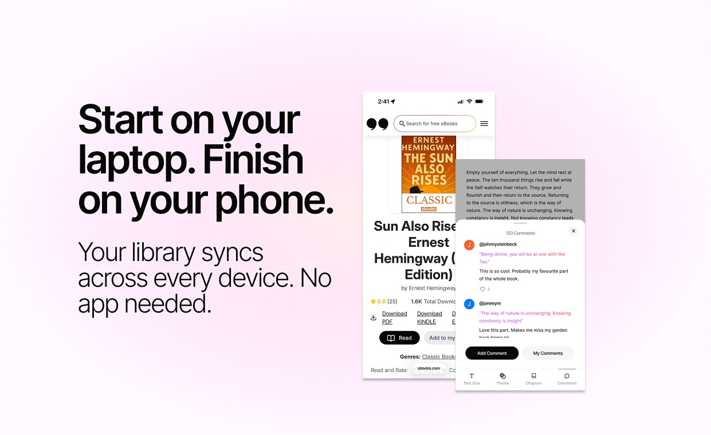
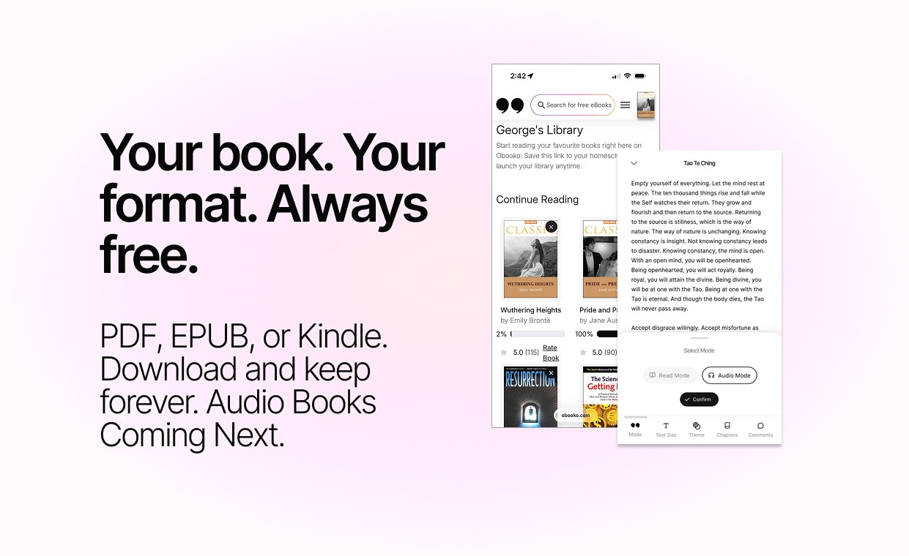

### 🎬 관련 영상
- [🎥 영상 보기](https://ph-files.imgix.net/70102f5f-7580-4f6d-bc83-0c6aeb2e1c7f.jpeg?auto=format)

---

## 3. [Skillkit](https://www.producthunt.com/products/skillkit-2?utm_campaign=producthunt-api&utm_medium=api-v2&utm_source=Application%3A+antigravity_test+%28ID%3A+258588%29)
**Votes**: 172 | **Tagline**: The package manager for AI agent skills

### 📌 요약
흩어져 있는 AI 코딩 에이전트(Claude, Copilot 등)의 '능력치'를 단 하나의 CLI로 통합 관리하고 공유하는, 에이전트 스킬의 범용 패키지 매니저입니다.

### 🔑 핵심 기능
- 🎯 Target Audience: 다수의 AI 코딩 에이전트(Claude, Copilot, Cursor 등)를 활용하며 스킬 관리 및 동기화에 어려움을 겪는 개발자 및 AI 엔지니어.
- ✨ Key Differentiator: 30개 이상의 주요 AI 코딩 에이전트를 단일 CLI로 제어할 수 있으며, 학습(Primer)과 기억(Memory)을 영속적으로 유지하여 에이전트의 성능을 표준화합니다.
- 💡 Core Feature: Primer 기능을 활용하여 사용 맥락에 맞는 AI 지침(Instruction)을 자동 생성하고, 이를 Mesh 네트워크를 통해 팀 또는 커뮤니티에 쉽게 배포하고 공유하는 기능.

### 📸 스크린샷 및 갤러리
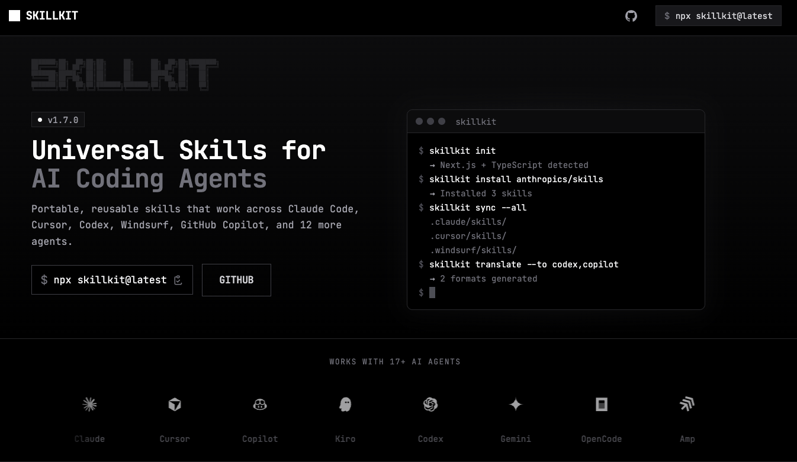
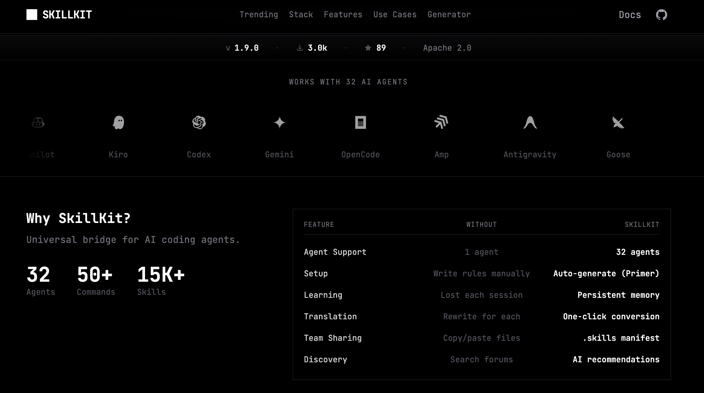
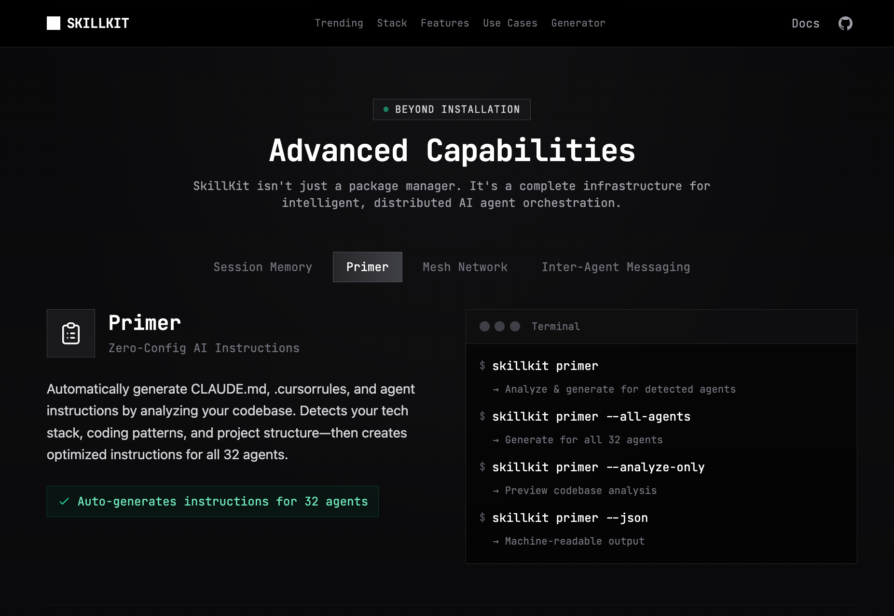

---

## 4. [Quash](https://www.producthunt.com/products/quash-intent-driven-mobile-testing?utm_campaign=producthunt-api&utm_medium=api-v2&utm_source=Application%3A+antigravity_test+%28ID%3A+258588%29)
**Votes**: 150 | **Tagline**: A mobile QA agent that runs tests without scripts

### 📌 요약
스크립트 짜는 시간 낭비는 이제 그만! '말로 시키는' AI 기반 모바일 QA 에이전트가 테스트 전 과정을 알아서 처리하고, 심지어 UI가 바뀌어도 스스로 고치는(Self-healing) 혁신 툴이 등장했습니다.

### 🔑 핵심 기능
- 🎯 Target Audience: 잦은 UI 변경으로 테스트 스크립트 유지보수(maintenance)에 어려움을 겪는 모바일 개발팀 및 QA 엔지니어.
- ✨ Key Differentiator: 복잡한 코딩 스크립트 대신 일반 언어(plain language)로 테스트 케이스를 작성하여 QA의 진입 장벽을 낮추고, UI 변경 시에도 자동으로 적응하는 '셀프 힐링(Self-healing)' 기능으로 안정성을 확보합니다.
- 💡 Core Feature: 스크립트 없이 '의도(Intent)' 기반으로 테스트를 명령하고, 실제 기기, 클라우드, 에뮬레이터 등 환경에 구애받지 않고 병렬로 테스트를 실행할 수 있습니다.

### 📸 스크린샷 및 갤러리
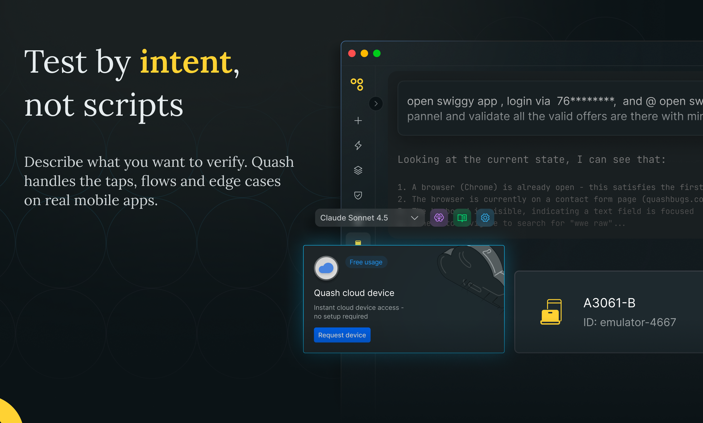
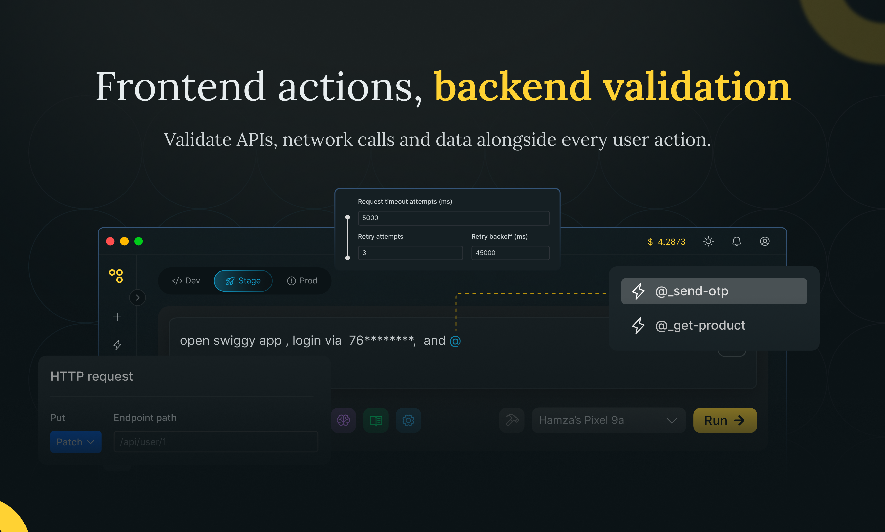
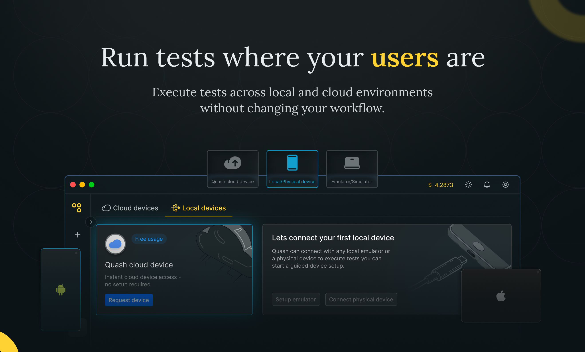

### 🎬 관련 영상
- [🎥 영상 보기](https://ph-files.imgix.net/f8a4ec7a-bafd-45d4-9037-c947722609ef.jpeg?auto=format)

---

## 5. [stagecaptions.io](https://www.producthunt.com/products/stagecaptions-io?utm_campaign=producthunt-api&utm_medium=api-v2&utm_source=Application%3A+antigravity_test+%28ID%3A+258588%29)
**Votes**: 148 | **Tagline**: Real-time captioning software for live events

### 📌 요약
실시간 라이브 이벤트(컨퍼런스, 방송 등)에서 곧바로 전문적인 수준의 자막을 띄워주는, 브라우저 기반의 초경량 프로덕션용 자막 솔루션이 떴습니다.

### 🔑 핵심 기능
- 🎯 Target Audience: 청각 장애인 접근성을 높여야 하는 대규모 컨퍼런스 주최자, 하이브리드 이벤트(온/오프라인 동시) 기획자, 실시간 자막 품질이 중요한 방송 제작팀.
- ✨ Key Differentiator: 별도의 장비나 복잡한 설치 없이 브라우저만으로 즉시 '프로덕션 레디(Production-Ready)' 수준의 고품질 실시간 전사를 제공하여, 기존의 복잡하거나 품질이 낮은 솔루션보다 압도적으로 간편하고 빠릅니다.
- 💡 Core Feature: 어떤 브라우저에서든 몇 초 만에 접속하여 라이브 이벤트 자막을 실시간으로 생성하고 바로 송출할 수 있는 간편한 접근성 및 실시간 자막 생성 기능.

### 📸 스크린샷 및 갤러리
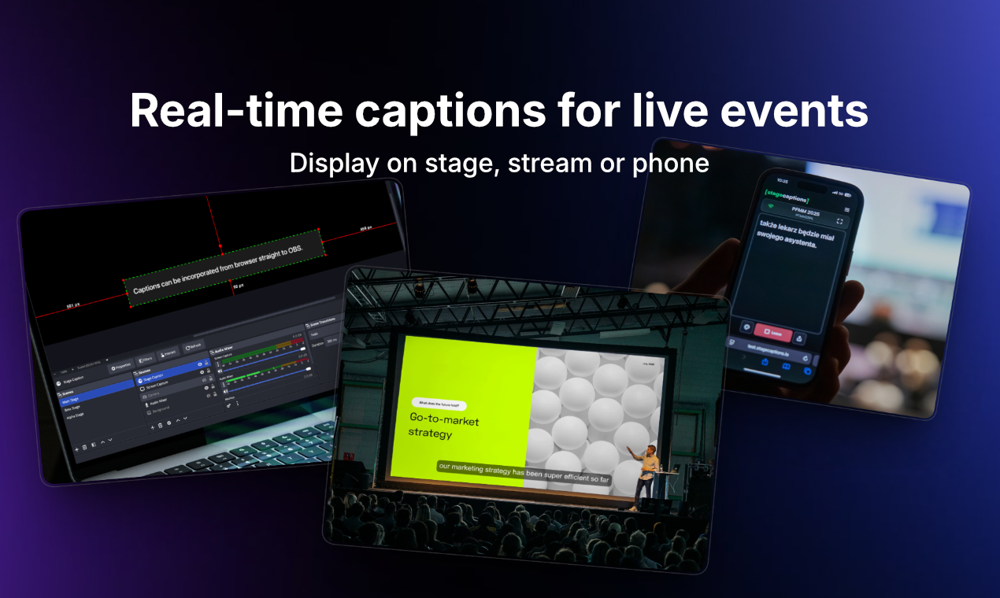
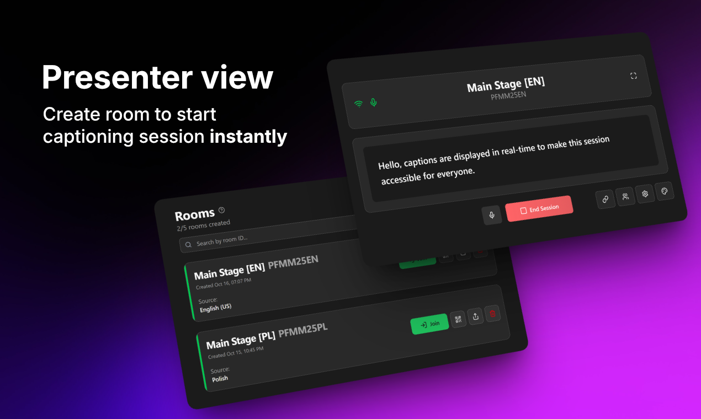
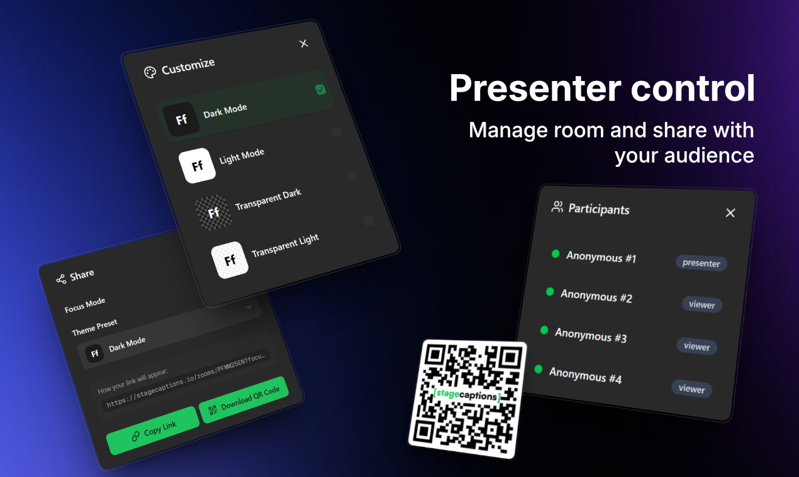

### 🎬 관련 영상
- [🎥 영상 보기](https://ph-files.imgix.net/c04fa06d-e885-40c3-9fc3-331743ff898d.jpeg?auto=format)

---

## 6. [Nativeline](https://www.producthunt.com/products/nativeline?utm_campaign=producthunt-api&utm_medium=api-v2&utm_source=Application%3A+antigravity_test+%28ID%3A+258588%29)
**Votes**: 106 | **Tagline**: Build native Swift iPhone, iPad, and Mac apps with AI

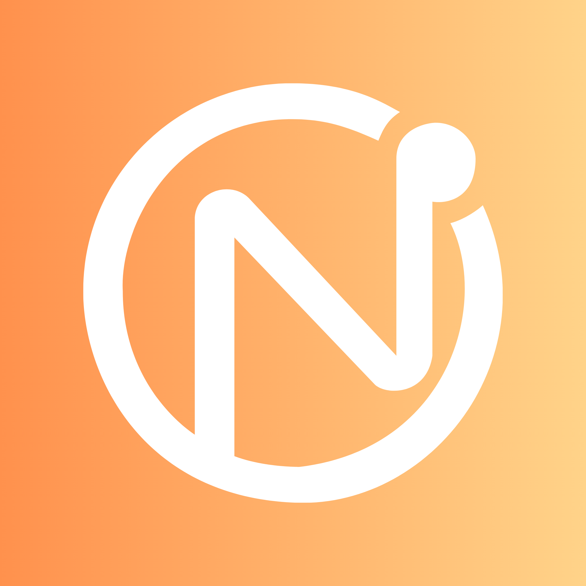

### 📌 요약
아이폰을 넘어 아이패드, 맥까지 Apple 생태계 전체를 아우르는 진정한 네이티브 Swift 앱을 AI로 한 번에 빌드하는 개발 혁신 플랫폼입니다.

### 🔑 핵심 기능
- 🎯 Target Audience: 웹 래퍼(Web Wrapper)가 아닌, 제대로 된 네이티브 사용자 경험(UX)의 Apple 앱 출시를 원하는 모든 개발자 및 스타트업.
- ✨ Key Differentiator: 기존 AI 앱 빌더가 제공하지 못했던 Mac(메뉴, 멀티 윈도우) 및 iPad(전체 화면 최적화) 지원을 포함하여, 전 플랫폼의 '진짜 네이티브 Swift 코드'를 생성합니다.
- 💡 Core Feature: 아이디어 설명을 입력하면 선택한 플랫폼에 맞춰 Swift 코드를 자동 생성하고, 앱스토어 출시까지 지원하는 간편한 엔드 투 엔드(End-to-End) 빌드 워크플로우.

### 📸 스크린샷 및 갤러리
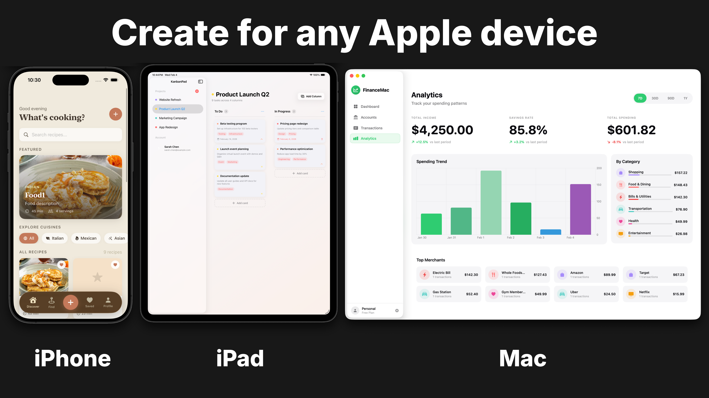
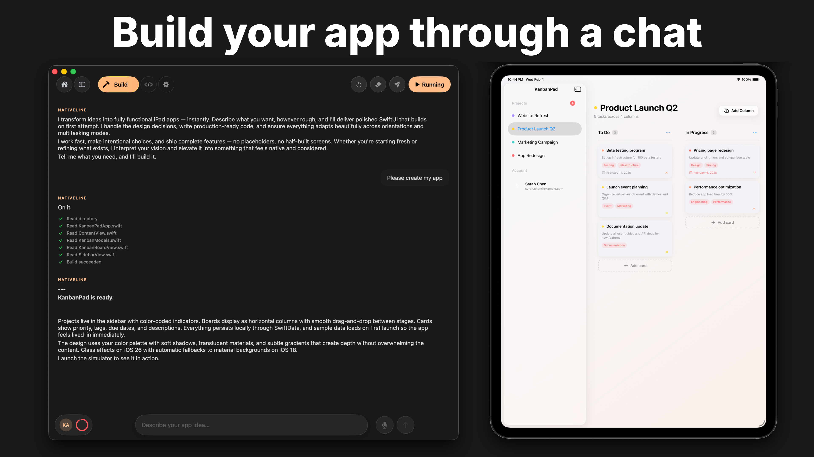
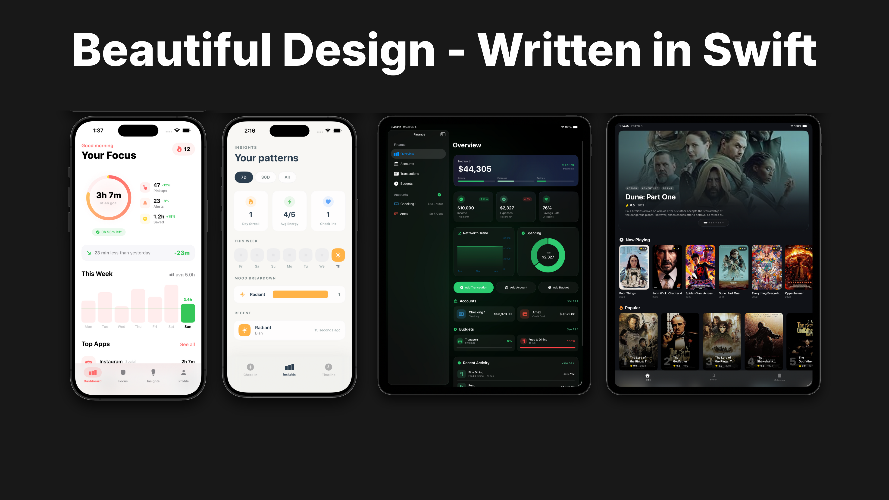

### 🎬 관련 영상
- [🎥 영상 보기](https://ph-files.imgix.net/403a270c-9a0b-4a3d-ad29-4f07de69575e.jpeg?auto=format)

---

## 7. [NeuroBlock](https://www.producthunt.com/products/neuroblock?utm_campaign=producthunt-api&utm_medium=api-v2&utm_source=Application%3A+antigravity_test+%28ID%3A+258588%29)
**Votes**: 103 | **Tagline**: No-code AI Lab: Train models, access datasets, run inference

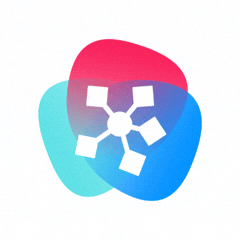

### 📌 요약
드디어 '나만의 AI'를 코딩 한 줄 없이 만들고, 서버, PC, 심지어 스마트폰까지 어디든 배포할 수 있는 진정한 노코드 AI OS, 뉴로블록(NeuroBlock)이 등장했습니다.

### 🔑 핵심 기능
- 🎯 Target Audience: 커스터마이징된 AI 모델이 필요하지만, 복잡한 코딩과 인프라 구축에 시간을 쓰고 싶지 않은 개발자 및 비즈니스 담당자.
- ✨ Key Differentiator: 데이터셋 생성부터 모델 훈련, 클라우드/로컬 환경 어디든 '소유하고' 저렴하게 실행 가능한 모델을 배포할 수 있는 독보적인 올인원 노코드 에코시스템 제공.
- 💡 Core Feature: 개인 데이터셋을 활용해 원하는 성능에 정확히 맞춰진 AI 모델을 노코드 방식으로 빠르게 훈련하고, 원하는 디바이스에서 실행 가능한 파일 형태로 다운로드하는 기능.

### 📸 스크린샷 및 갤러리
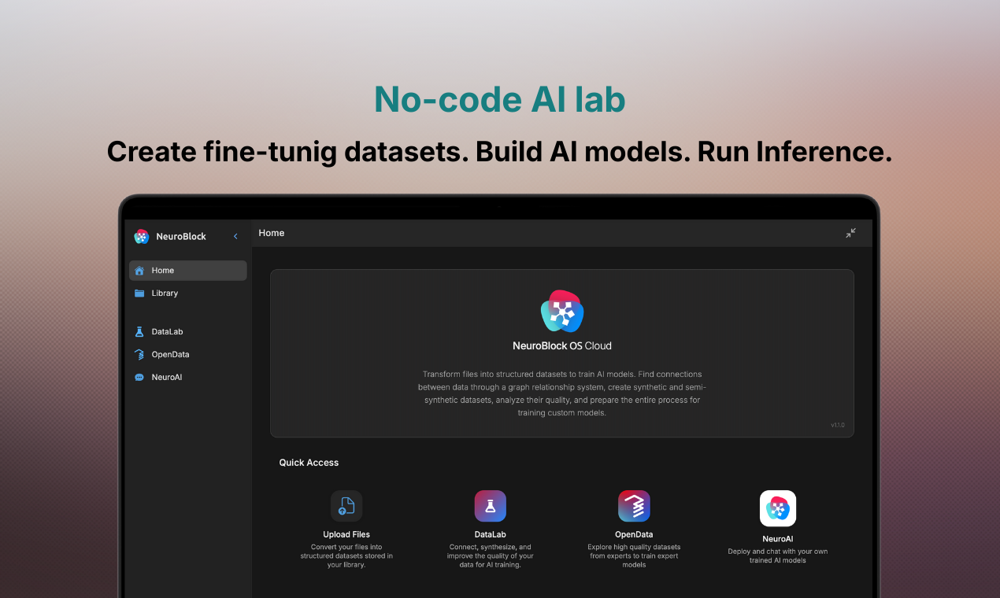
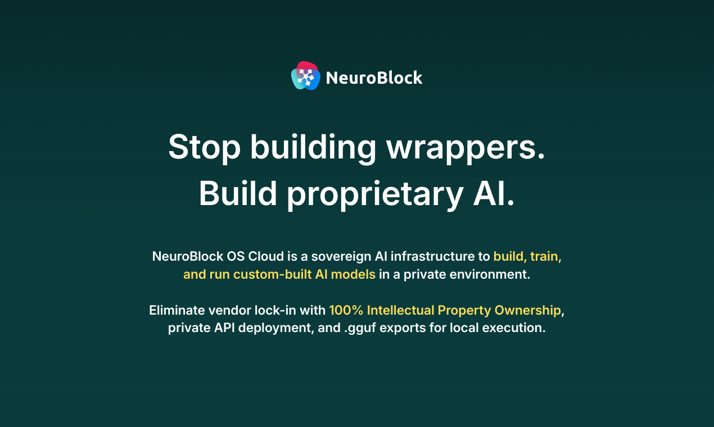
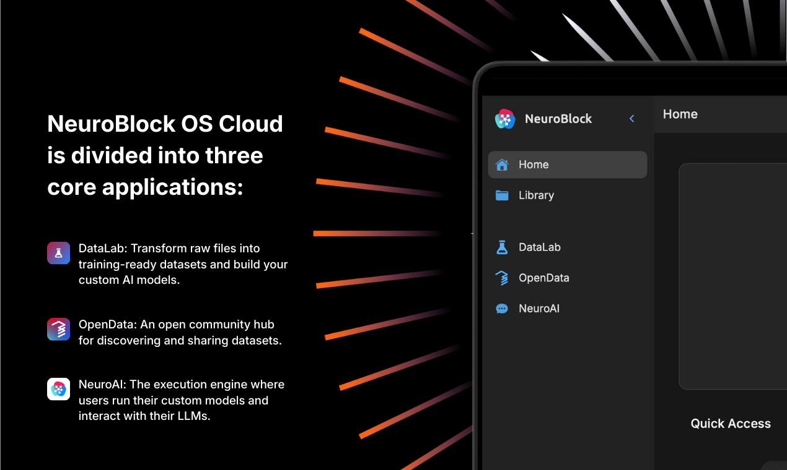

### 🎬 관련 영상
- [🎥 영상 보기](https://ph-files.imgix.net/56eda3f2-56a7-4d87-a094-a0f0fe86fc8a.jpeg?auto=format)

---

## 8. [Developer Docs Audit](https://www.producthunt.com/products/nakora?utm_campaign=producthunt-api&utm_medium=api-v2&utm_source=Application%3A+antigravity_test+%28ID%3A+258588%29)
**Votes**: 100 | **Tagline**: Increase LLM visibility, signups and activated users

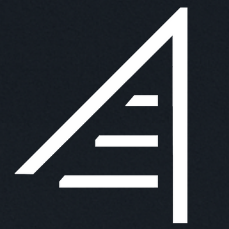

### 📌 요약
LLM(대규모 언어 모델) 서비스를 개발했다면, 이 제품은 개발자 문서를 분석해 잠재 고객의 유입과 활성화를 폭발적으로 늘리는 비장의 무기입니다.

### 🔑 핵심 기능
- 🎯 Target Audience: LLM 기반의 API, SaaS, 데브툴(DevTool) 등 개발자 문서(Docs)를 통해 유저를 확보해야 하는 모든 스타트업 및 팀.
- ✨ Key Differentiator: 단순히 문법을 검사하는 것을 넘어, 상위 120개 이상의 성공적인 데브툴 문서를 기반으로 '실제 전환율을 높이는' 행동 기반 인사이트를 제공합니다.
- 💡 Core Feature: 개발자 문서의 가시성(Visibility), 신규 가입(Signups), 그리고 활성 사용자(Activated Users) 전환율을 구체적인 데이터와 실행 가능한 조치로 진단 및 개선 제안.

### 📸 스크린샷 및 갤러리
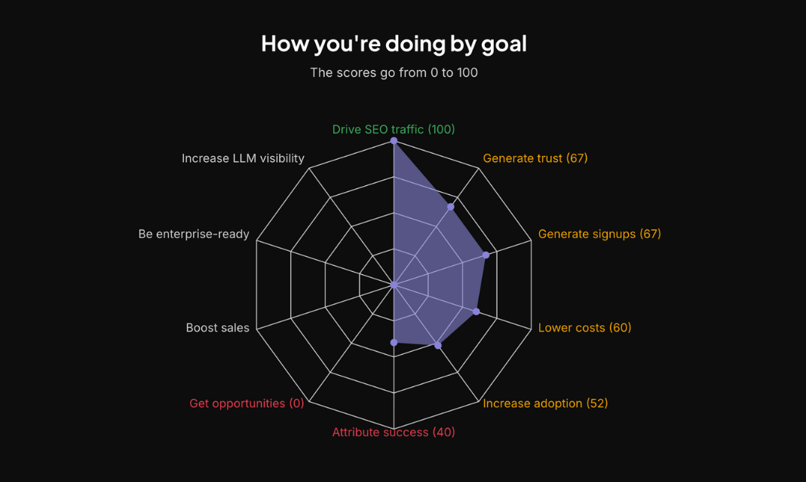
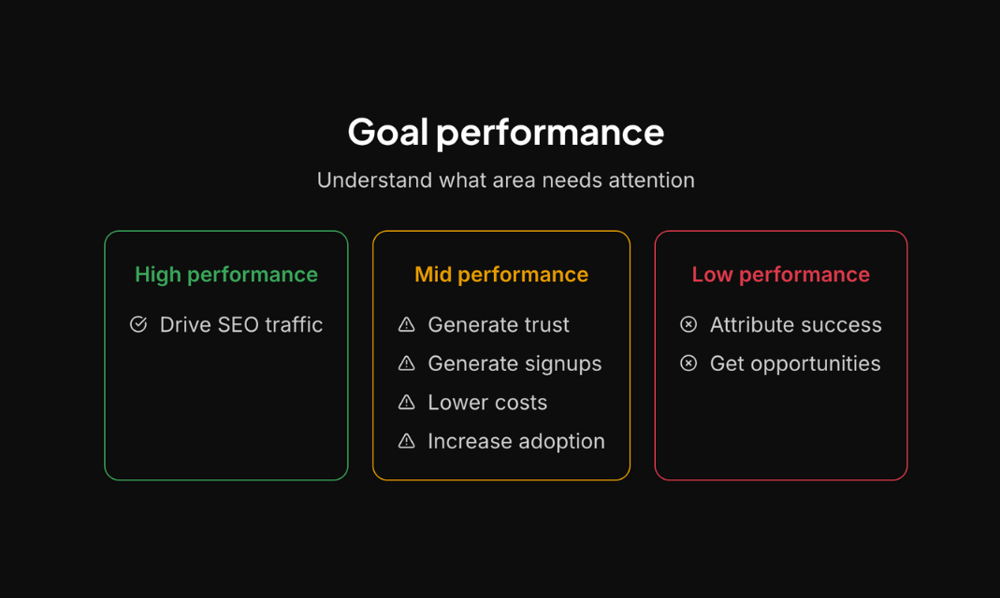
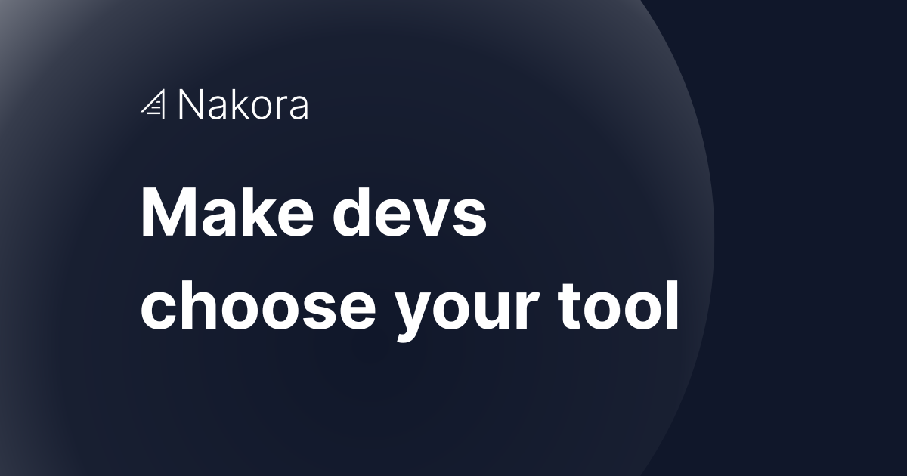

---

## 9. [GitBoard](https://www.producthunt.com/products/gitboard?utm_campaign=producthunt-api&utm_medium=api-v2&utm_source=Application%3A+antigravity_test+%28ID%3A+258588%29)
**Votes**: 98 | **Tagline**: Menubar mac app for Github Projects

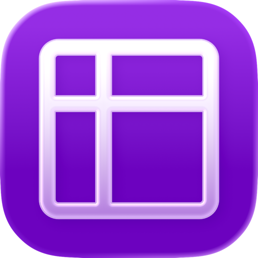

### 📌 요약
깃허브 프로젝트를 맥(Mac) 메뉴바에서 바로 확인하고 관리할 수 있게 해주는 네이티브 앱, 깃보드(GitBoard)가 출시되었습니다. 이제 복잡한 웹 인터페이스를 띄울 필요 없이, 마치 투두리스트처럼 프로젝트 현황을 빠르게 확인하고 관리하세요.

### 🔑 핵심 기능
- 🎯 Target Audience: 깃허브 프로젝트를 사용하여 개발 일정을 관리하는 개발자, PM, 혹은 소규모 팀 리더.
- ✨ Key Differentiator: 웹 브라우저를 켜지 않고도 macOS 네이티브 앱 환경에서 깃허브 프로젝트를 빠르고 직관적으로 접근 및 관리 가능.
- 💡 Core Feature: 메뉴바 퀵뷰 기능과 전체 칸반 보드 뷰를 제공하며, 이슈 생성, 사용자 할당, 필터링 및 검색 등의 핵심 관리가 메뉴바 앱 내에서 모두 가능.

### 📸 스크린샷 및 갤러리

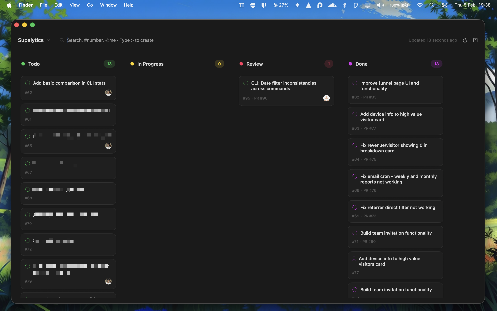

---

## 10. [Fix Ugly PowerPoint by CubeOne](https://www.producthunt.com/products/cubeone?utm_campaign=producthunt-api&utm_medium=api-v2&utm_source=Application%3A+antigravity_test+%28ID%3A+258588%29)
**Votes**: 93 | **Tagline**: Who designed this?

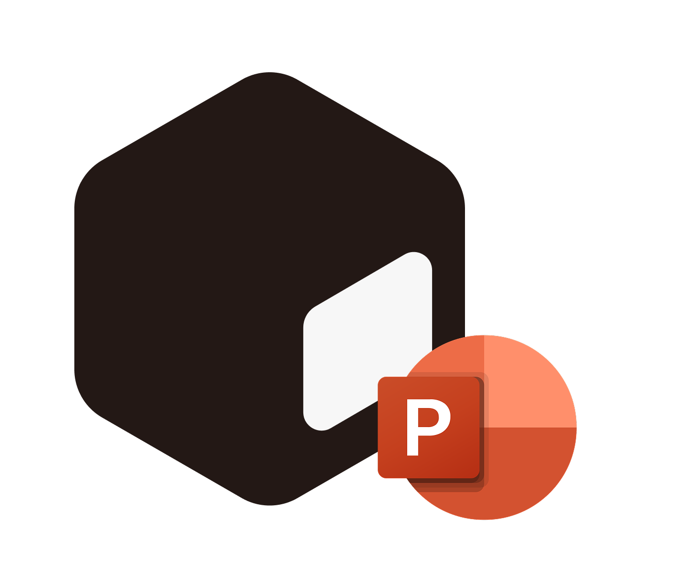

### 📌 요약
엉망진창 PPT를 올리면 AI가 '프리미엄 템플릿' 수준으로 디자인, 애니메이션, 브랜딩까지 싹 정리해주는, 슬라이드 디자인 혁명 툴.

### 🔑 핵심 기능
- 🎯 Target Audience: 바쁜 기획자, 스타트업 창업가, 발표를 앞둔 직장인 등 디자인 센스가 없어도 당장 고퀄리티 슬라이드가 필요한 모든 사용자.
- ✨ Key Differentiator: 단순히 '보기 좋은 이미지'로 바꿔주는 것이 아니라, AI가 구성한 레이아웃 그대로 PPTX, 구글 슬라이드, 키노트 등 완벽하게 '편집 가능한' 원본 파일을 제공.
- 💡 Core Feature: 지저분한 원본 파일을 업로드하면, 브랜드 컬러와 톤앤매너에 맞춰 전체 슬라이드에 일관성 있는 디자인과 부드러운 애니메이션을 자동으로 적용해주는 기능.

### 📸 스크린샷 및 갤러리
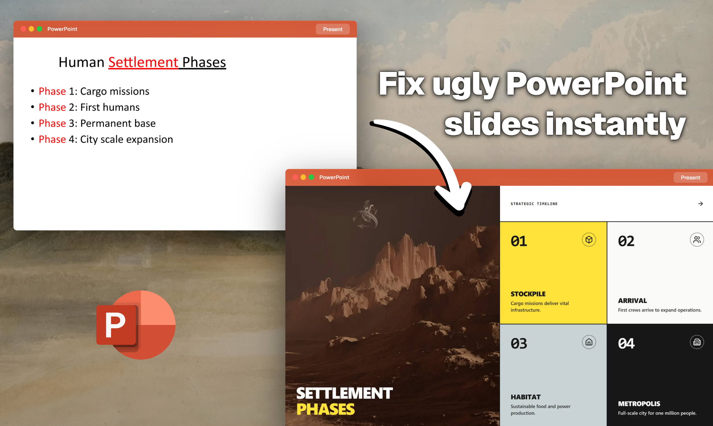
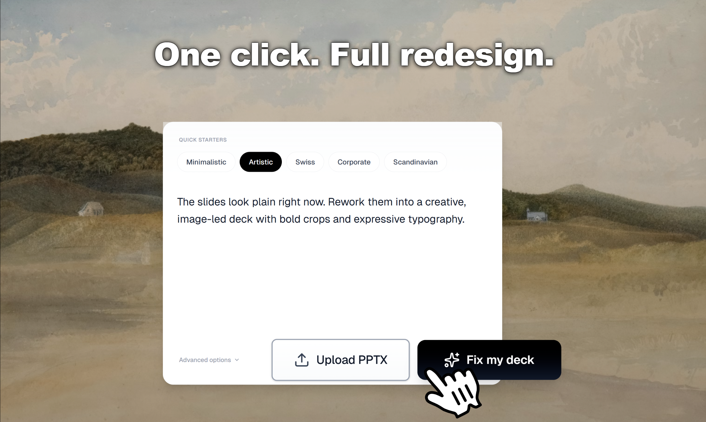
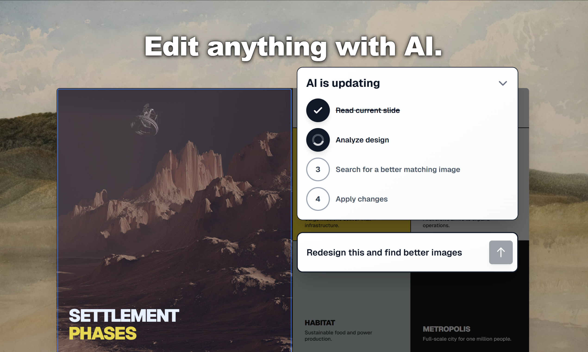

### 🎬 관련 영상
- [🎥 영상 보기](https://ph-files.imgix.net/b13a3944-f3be-47af-bce1-b384bab0ed35.jpeg?auto=format)

---

