# 🚀 Product Hunt Daily Top 10 (2026-02-08)

## 1. [Inspector](https://www.producthunt.com/products/inspector-3?utm_campaign=producthunt-api&utm_medium=api-v2&utm_source=Application%3A+antigravity_test+%28ID%3A+258588%29)
**Votes**: 349 | **Tagline**: Figma for Claude Code

### 📌 요약
AI 에이전트(Claude Code, Codex 등)가 짜준 코드를 피그마처럼 시각적으로 클릭하고 편집하면, AI가 자동으로 코드를 수정해주는 개발자용 '디자인 핸드오프 종결자' 툴입니다.

### 🔑 핵심 기능
- 🎯 Target Audience: AI 코딩 에이전트(Claude Code, Codex, Cursor 등)를 사용하여 UI 개발을 진행하는 프론트엔드 개발자 및 팀
- ✨ Key Differentiator: AI가 생성한 코드를 직접 수정하는 대신, Inspector의 UI 환경에서 시각적으로 요소를 조정하면 해당 변경 사항이 실시간으로 코드베이스에 반영됨. (디자인/개발 분리 과정 완전 제거)
- 💡 Core Feature: AI 에이전트와 연결된 상태에서 UI 요소를 직접 클릭하고 시각적 편집(Tweak)을 수행하면, Inspector가 이를 해석하여 AI가 생성한 코드에 정확히 반영하는 기능

### 📸 스크린샷 및 갤러리

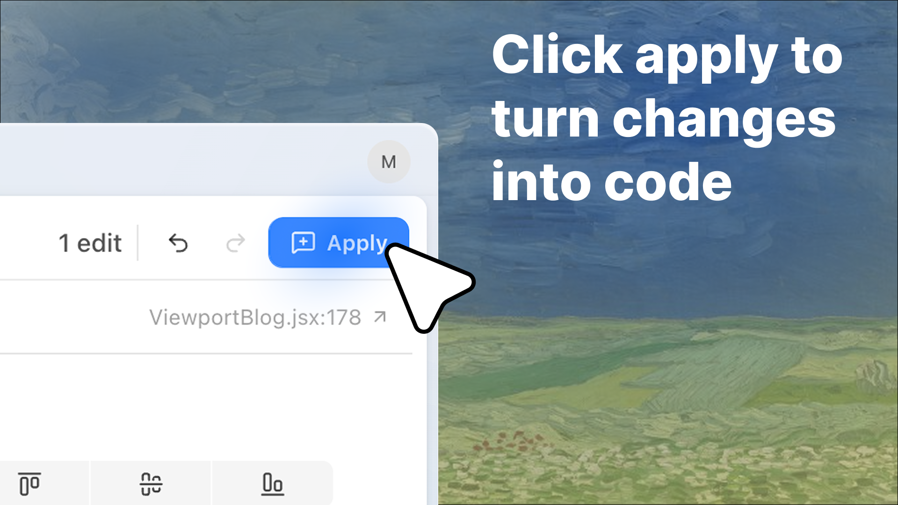
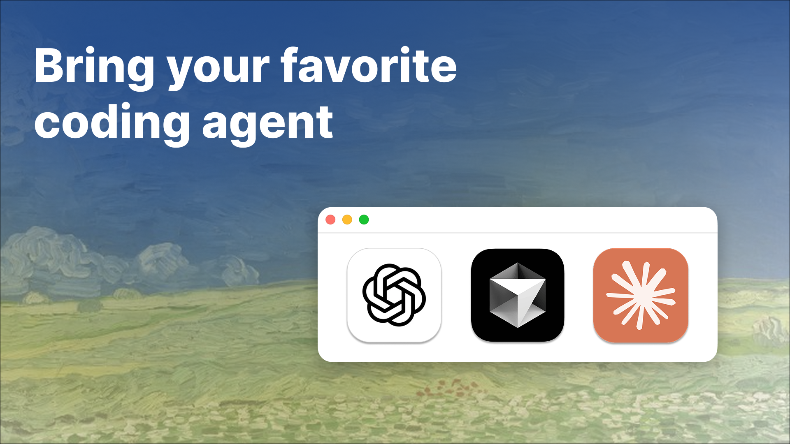

### 🎬 관련 영상
- [🎥 영상 보기](https://ph-files.imgix.net/ee078168-a8fc-4d8a-8d6b-4d3db293c410.jpeg?auto=format)

---

## 2. [Extrovert](https://www.producthunt.com/products/extrovert?utm_campaign=producthunt-api&utm_medium=api-v2&utm_source=Application%3A+antigravity_test+%28ID%3A+258588%29)
**Votes**: 245 | **Tagline**: Lead nurturing and warm outreach copilot for LinkedIn

### 📌 요약
링크드인에서 15분 만에 잠재 고객과 신뢰를 쌓는 '따뜻한 아웃리치(Warm Outreach)'를 자동화하고 관리해주는 AI 비서(코파일럿) 툴.

### 🔑 핵심 기능
- 🎯 Target Audience: 링크드인 기반 리드 생성(Lead Gen) 및 B2B 영업 담당자, 잠재 고객에게 지속적으로 신뢰를 심어줘야 하는 창업가.
- ✨ Key Differentiator: 단순히 메시지를 대량 발송하는 스팸 툴이 아닌, 사용자의 '플레이북' 기반으로 신뢰를 구축하는 초개인화된 댓글/DM 초안을 생성해 퀄리티를 유지하며 아웃리치 효율을 극대화.
- 💡 Core Feature: 잠재 고객의 활동 및 관련 토픽 추적 기능과, 이를 바탕으로 맞춤형 아웃리치 문구를 추천(Suggest)하는 AI 코파일럿 기능.

### 📸 스크린샷 및 갤러리
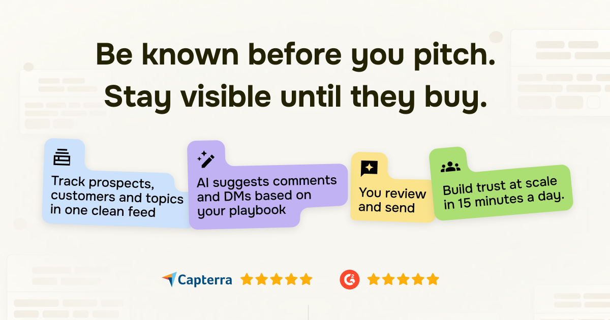

### 🎬 관련 영상
- [🎥 영상 보기](https://ph-files.imgix.net/06c2c939-a665-4cdc-9148-f3cc664ff7bb.jpeg?auto=format)

---

## 3. [Axel](https://www.producthunt.com/products/axel-3?utm_campaign=producthunt-api&utm_medium=api-v2&utm_source=Application%3A+antigravity_test+%28ID%3A+258588%29)
**Votes**: 193 | **Tagline**: Todoist for AI coding agents

### 📌 요약
개발자를 위한 AI 코딩 에이전트 통합 관리 툴 'Axel'이 맥(macOS) 기반의 키보드 중심 워크플로우로 생산성을 극대화합니다. 여러 AI 모델을 Todoist처럼 한곳에서 관리하며 코드를 더 빠르게 배포하세요.

### 🔑 핵심 기능
- 🎯 Target Audience: Claude, Codex 등 다양한 AI 코딩 에이전트를 활용하여 개발 속도를 높이고 싶은 개발자 및 테크 리드.
- ✨ Key Differentiator: 여러 AI 에이전트의 작업을 큐잉, 디스패치하고 승인/거부하는 과정을 macOS 네이티브 및 키보드 기반의 '단일 인박스'로 통합하여 효율성 극대화.
- 💡 Core Feature: 다양한 AI 모델(Claude, Codex, OpenCode, Antigravity 등)과의 즉각적인 연동을 지원하며, 마치 태스크 매니저처럼 AI 에이전트의 작업을 관리하고 최종 액션을 통제하는 워크플로우 제공.

### 📸 스크린샷 및 갤러리
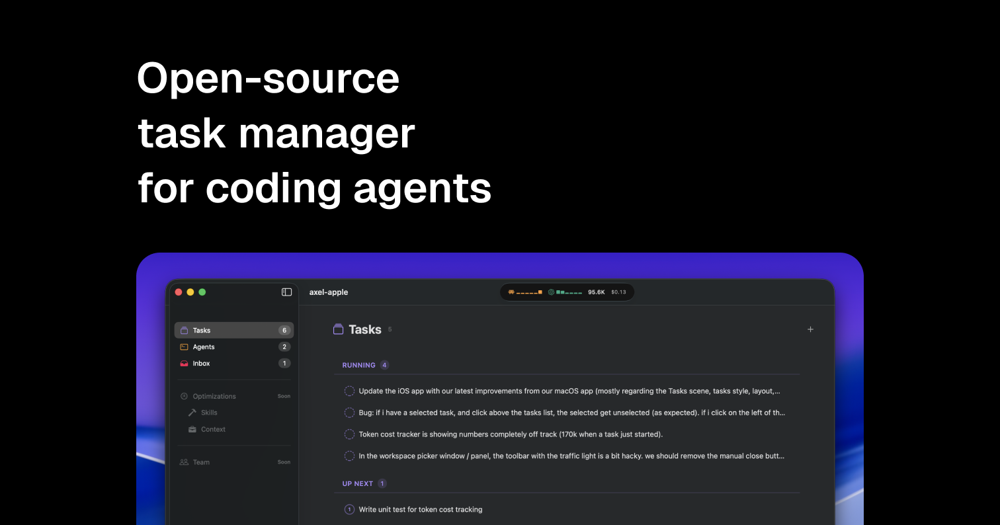

### 🎬 관련 영상
- [🎥 영상 보기](https://ph-files.imgix.net/c22538ca-6abe-4733-8ec7-ca7d70be5041.jpeg?auto=format)

---

## 4. [Snap](https://www.producthunt.com/products/snap-8?utm_campaign=producthunt-api&utm_medium=api-v2&utm_source=Application%3A+antigravity_test+%28ID%3A+258588%29)
**Votes**: 145 | **Tagline**: The floating dock for developers

### 📌 요약
AI 기반 코딩 환경(Cursor, Claude Code)에서 생산성을 극대화해주는, 개발자 맞춤형 '만능 플로팅 독'입니다. 각종 보조 작업을 위해 팝업창을 띄울 필요가 없습니다.

### 🔑 핵심 기능
- 🎯 Target Audience: Cursor나 Claude Code 등 AI 코딩 툴을 활용하며, 개발 보조 도구들을 한 곳에서 관리하여 작업 효율을 극대화하려는 개발자.
- ✨ Key Differentiator: 코딩 중 화면 전환 없이 스크린샷, 오류 복사, 프롬프트 최적화, 웹 미리보기 등 모든 보조 작업을 항상 화면에 띄워 놓고 처리할 수 있는 통합 워크플로우.
- 💡 Core Feature: 콘솔 에러를 즉시 복사하거나 AI 프롬프트를 생성/최적화하는 기능 등 개발자에게 필수적인 다중 기능을 버튼 하나로 처리하는 커스텀 액션 버튼.

### 📸 스크린샷 및 갤러리

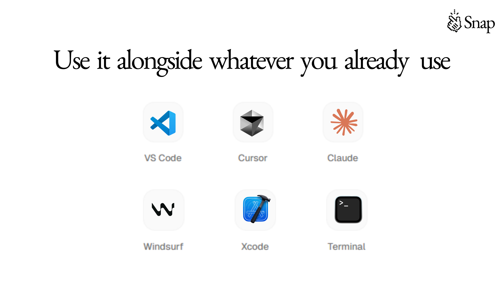
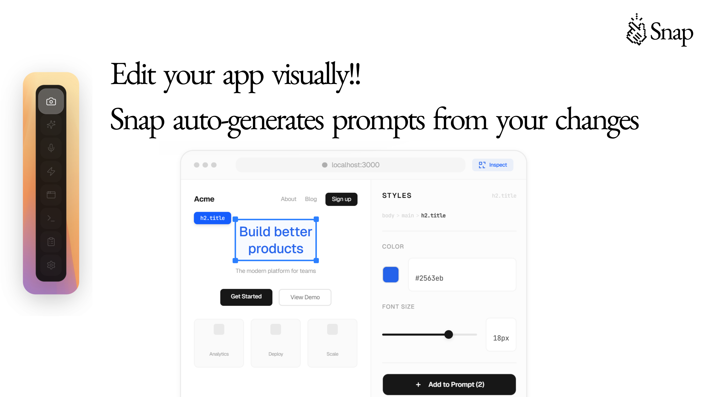

---

## 5. [VolumeHub](https://www.producthunt.com/products/volumehub?utm_campaign=producthunt-api&utm_medium=api-v2&utm_source=Application%3A+antigravity_test+%28ID%3A+258588%29)
**Votes**: 144 | **Tagline**: Per-app volume control for macOS with no driver installs

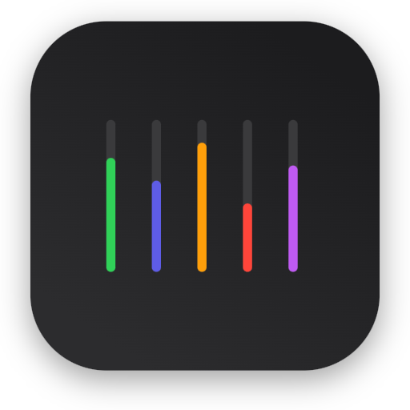

### 📌 요약
맥 유저의 숙원 사업이었던 '앱별 볼륨 믹서'가 드디어 등장했습니다. 커널 확장이나 드라이버 설치 없이, 애플 순정 API로 구현되어 안정성과 프라이버시까지 잡은 맥(Mac) 전용 사운드 컨트롤 센터입니다.

### 🔑 핵심 기능
- 🎯 Target Audience: 멀티태스킹이 잦은 맥 사용자, 스트리머, 그리고 음악을 들으며 화상회의를 자주 하는 사용자.
- ✨ Key Differentiator: 드라이버나 커널 확장(Kext) 설치 없이 애플의 네이티브 Audio Tap API를 사용해 시스템 안정성이 매우 높고 100% 프라이버시를 보장함.
- 💡 Core Feature: 화상 통화 중 다른 앱 소리를 자동으로 줄여주는 'Focus Audio' 기능과 앱별 10밴드 EQ를 통한 정교한 사운드 제어.

### 📸 스크린샷 및 갤러리
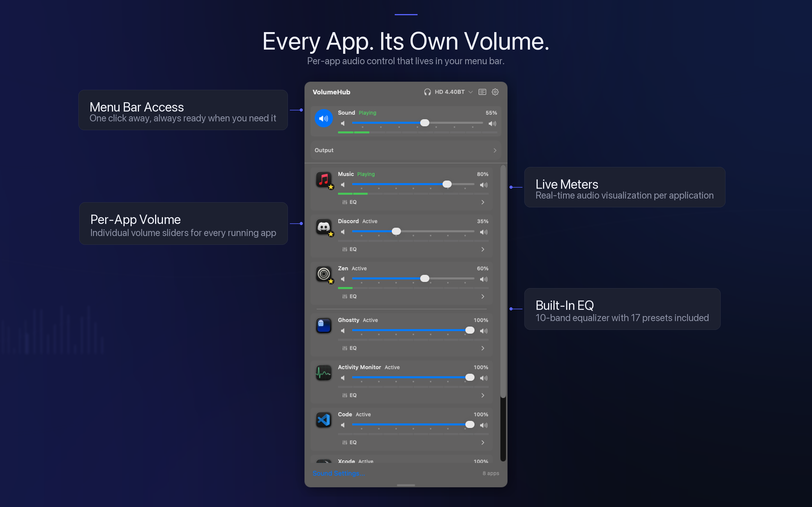
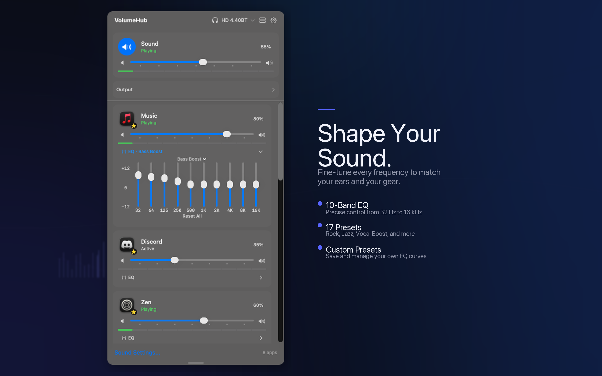
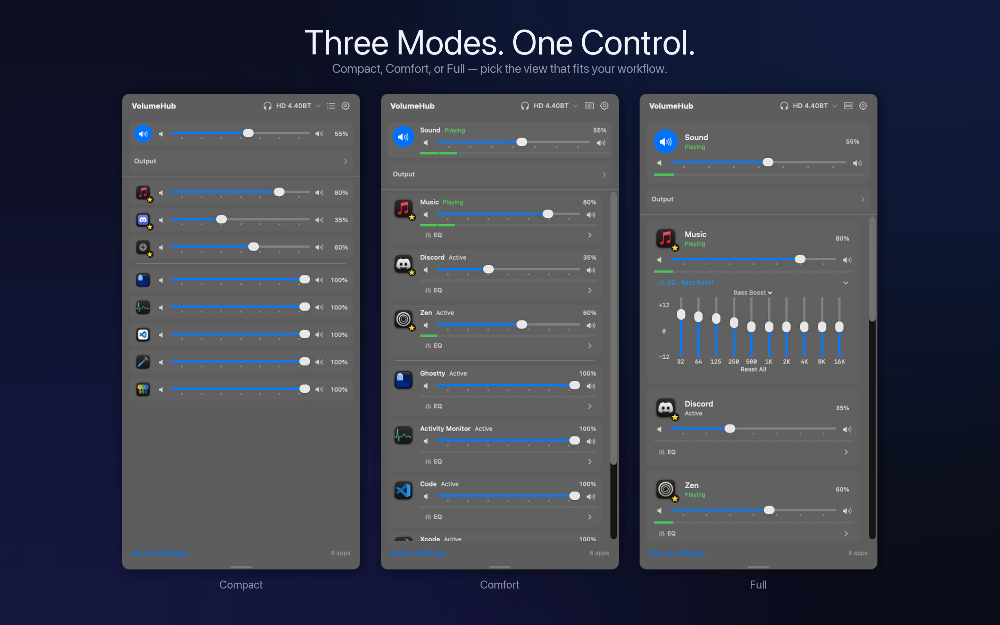

---

## 6. [One Minute News](https://www.producthunt.com/products/one-minute-news?utm_campaign=producthunt-api&utm_medium=api-v2&utm_source=Application%3A+antigravity_test+%28ID%3A+258588%29)
**Votes**: 132 | **Tagline**: Learning what happened around the world in one minute.

### 📌 요약
인터넷 기사의 낚시성 헤드라인(Clickbait)에 지친 사람들을 위한 필수 앱입니다. 단 1분 만에 군더더기 없이 핵심만, 중요도 순으로 정리해주는 ‘노-클릭베이트’ 뉴스 요약 서비스가 드디어 등장했습니다.

### 🔑 핵심 기능
- 🎯 Target Audience: 낚시성 기사(Clickbait)에 시간 낭비하기 싫은 바쁜 현대인 및 핵심 정보만 빠르게 습득하려는 사용자.
- ✨ Key Differentiator: '낚시성 제목 유도(Tease/Mislead)'를 완전히 배제하고, 순수 저널리즘 방식으로 명확하고 정직한 헤드라인과 요약만 제공합니다.
- 💡 Core Feature: 긴 기사를 클릭할 필요 없이, 가장 중요한(Importance) 뉴스를 1분 요약으로 우선순위화하여 읽을 수 있는 기능.

### 📸 스크린샷 및 갤러리
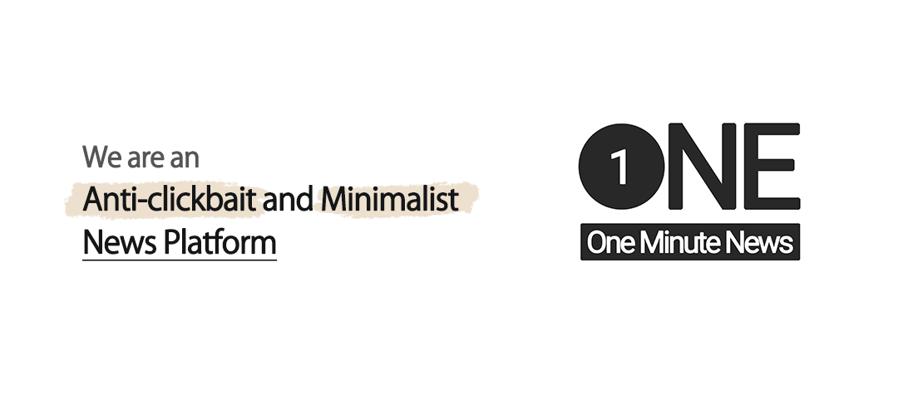
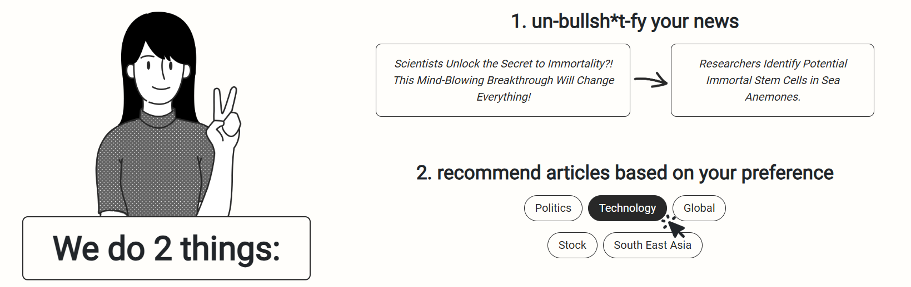
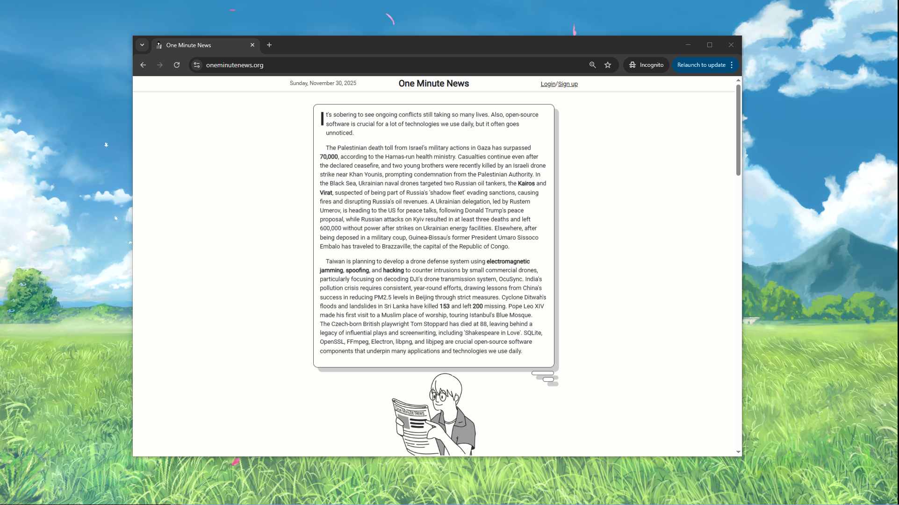

---

## 7. [Sway](https://www.producthunt.com/products/sway-12?utm_campaign=producthunt-api&utm_medium=api-v2&utm_source=Application%3A+antigravity_test+%28ID%3A+258588%29)
**Votes**: 114 | **Tagline**: Turn spoken thoughts into clear structure.

### 📌 요약
말하는 대로 생각의 흐름을 놓치지 않고 구조화된 요약, 핵심 포인트, 그리고 할 일 목록으로 자동 정리해주는 '음성-텍스트 변환 구조화' AI 툴입니다.

### 🔑 핵심 기능
- 🎯 Target Audience: 타이핑보다 말로 생각 정리나 아이디어 구상을 더 잘하는 사람, 이동 중 또는 산책 중에도 효율적으로 메모하고 싶은 사용자.
- ✨ Key Differentiator: 별도의 프롬프트나 포맷팅 없이, 사용자의 자연스러운 음성 입력만으로도 바로 명확하고 구조화된 결과물을 제공하는 자동화된 정리 능력.
- 💡 Core Feature: 사용자의 길고 복잡한 '말하는 생각'을 즉시 핵심 요약(Summaries), 주요 포인트(Key Points), 실행 가능한 액션(Actions)으로 분리하고 변환하는 기능.

### 📸 스크린샷 및 갤러리
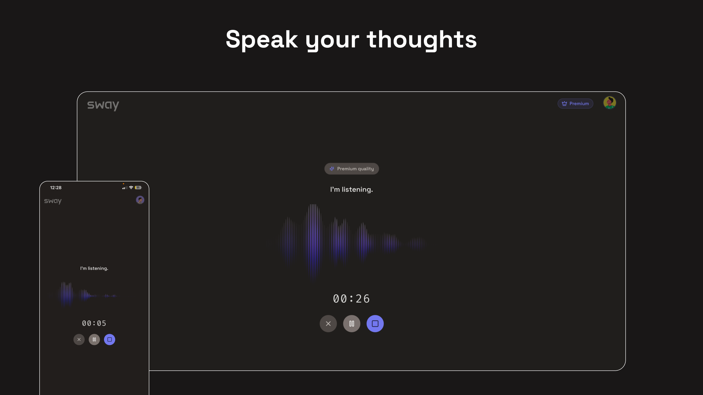
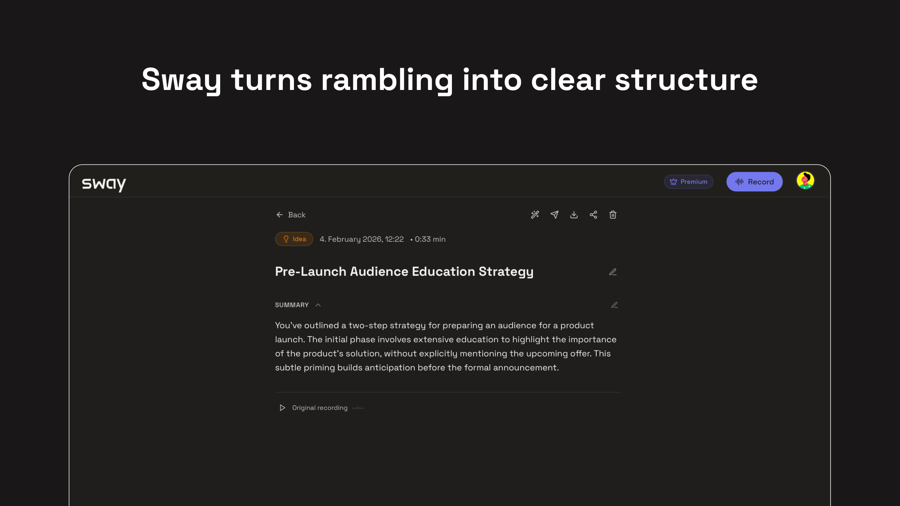

---

## 8. [Sunday](https://www.producthunt.com/products/sunday-the-book-quotes-collector?utm_campaign=producthunt-api&utm_medium=api-v2&utm_source=Application%3A+antigravity_test+%28ID%3A+258588%29)
**Votes**: 107 | **Tagline**: The beautiful way to save and collect your books quotes

### 📌 요약
우리가 책에 투자한 시간의 ‘수익’을 확실히 돌려받게 해주는, 하이라이트 및 인용구 전용 캡처 및 정리 툴입니다. 더 이상 중요한 문장을 놓치거나 사진첩에서 헤맬 필요가 없습니다.

### 🔑 핵심 기능
- 🎯 Target Audience: 독서 후 정리 습관을 들이고 싶은 사람, 책 속 구절을 인용하거나 저장할 필요가 많은 지식 노동자(Knowledge Worker) 및 학생.
- ✨ Key Differentiator: 메모 앱이나 카메라 롤에 흩어지는 것이 아닌, '인용구 저장 및 활용'이라는 목적에 완벽하게 최적화된(purpose-built) 전용 워크플로우를 제공하여 관리 피로도를 극도로 낮춤.
- 💡 Core Feature: 읽는 행위에 방해받지 않고 중요한 문장을 디지털 데이터로 즉시 캡처하고 영구적으로 보관할 수 있는 'Seamless Capture' 기능.

### 📸 스크린샷 및 갤러리
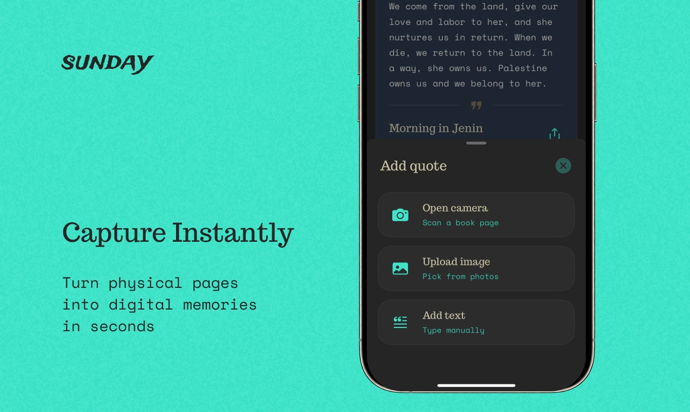
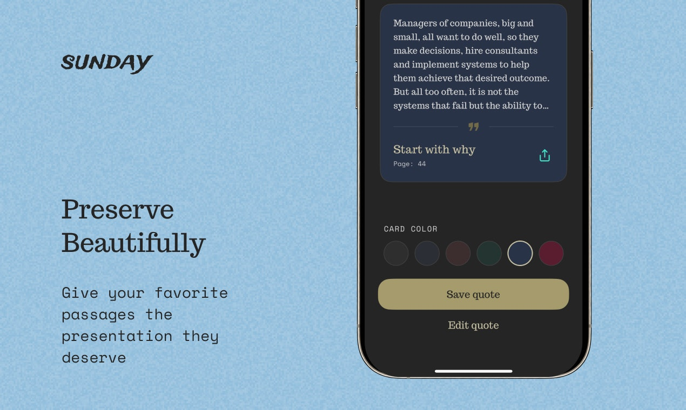
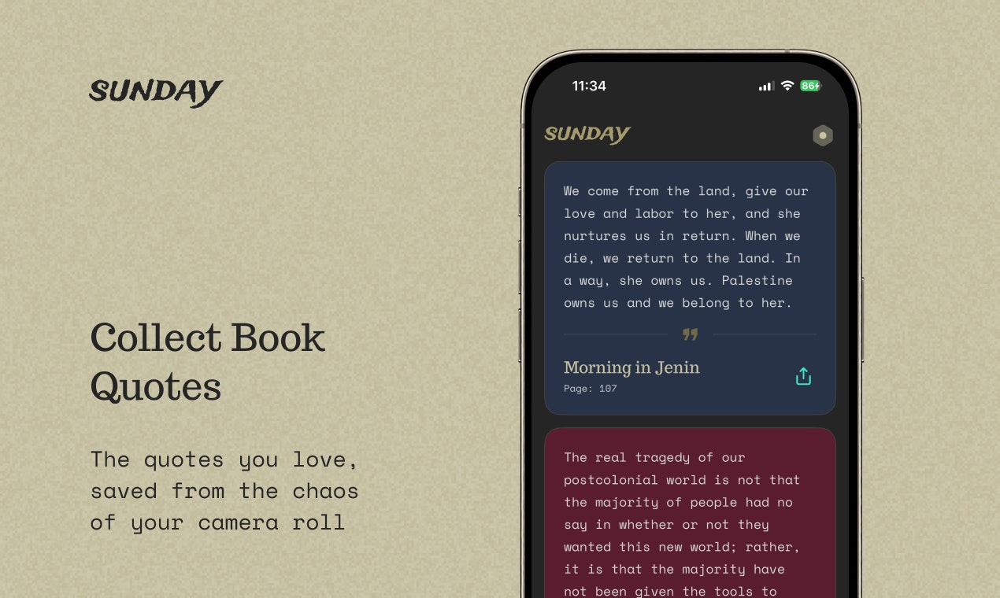

---

## 9. [StayAwake.Dev](https://www.producthunt.com/products/stayawake-dev?utm_campaign=producthunt-api&utm_medium=api-v2&utm_source=Application%3A+antigravity_test+%28ID%3A+258588%29)
**Votes**: 99 | **Tagline**: The one tab developers never close

### 📌 요약
개발자들이 늘 열어두는 여러 개의 탭들을 '하나의 닫지 않는 탭'으로 통합하여, 설치나 가입 없이 바로 쓸 수 있는 올인원 브라우저 생산성 허브입니다.

### 🔑 핵심 기능
- 🎯 Target Audience: 브라우저에서 작업하는 시간이 많은 개발자 및 테크 직군
- ✨ Key Differentiator: 플립 시계, 포모도로 타이머, 화면 잠금 방지, 작업 관리, 필수 개발 유틸리티(JSON, JWT, UUID 등)를 하나의 탭에 통합하여 탭 혼란(Tab Chaos) 제거
- 💡 Core Feature: UUID 생성, Base64 인코딩/디코딩, JSON 포매터 등 개발 작업에 필수적인 도구들을 즉시 사용할 수 있는 '개발 유틸리티 모음'

### 📸 스크린샷 및 갤러리
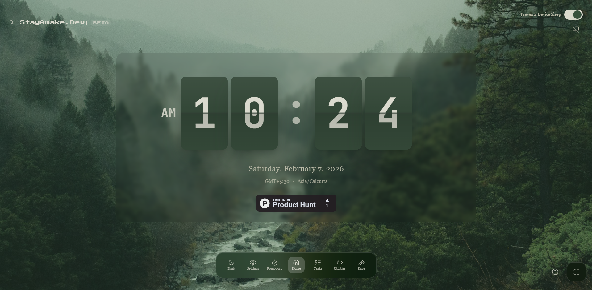
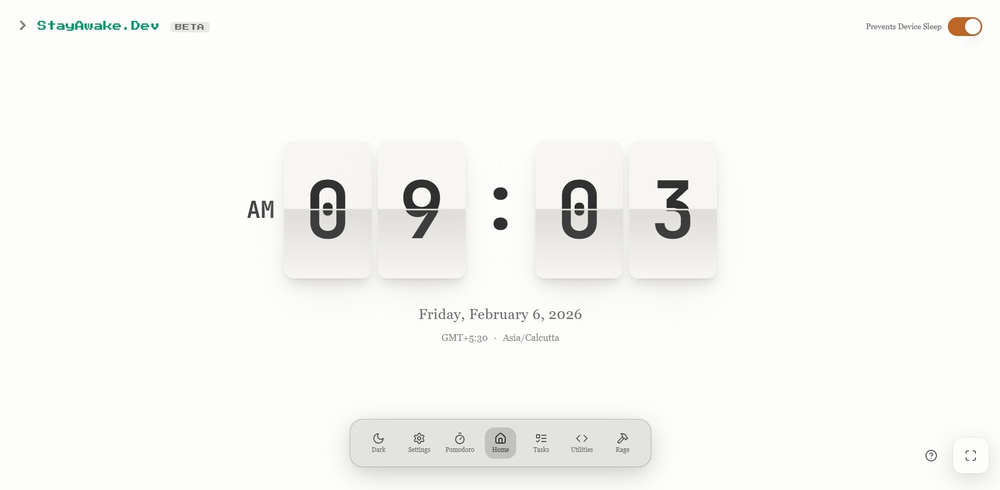
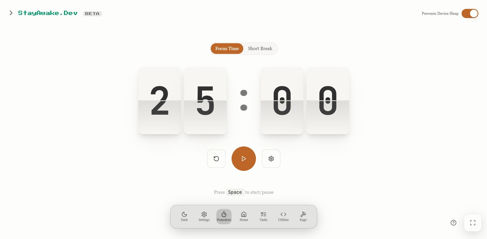

### 🎬 관련 영상
- [🎥 영상 보기](https://ph-files.imgix.net/8834b10a-7b1e-44eb-8d75-177ce8f626e8.gif?auto=format)

---

## 10. [OpenClaw Mac mini M4 Enclosure](https://www.producthunt.com/products/openclaw-mac-mini-m4-enclosure?utm_campaign=producthunt-api&utm_medium=api-v2&utm_source=Application%3A+antigravity_test+%28ID%3A+258588%29)
**Votes**: 18 | **Tagline**: Every powerful little crustacean needs a proper shell!

### 📌 요약
당신의 Mac mini M4를 책상 위 귀여운 캐릭터(클로봇)로 변신시켜주는 3D 프린팅 커스텀 케이스, 'OpenClaw 인클로저'가 출시되었습니다. 성능 저하 없이 책상 위 분위기를 확실히 살려줍니다.

### 🔑 핵심 기능
- 🎯 Target Audience: Mac mini M4를 사용하며 깔끔하고 개성 있는 데스크테리어를 원하는 사용자 (특히 OpenClaw/Clawdbot 팬)
- ✨ Key Differentiator: 단순히 예쁜 케이스를 넘어, Mac mini의 모든 포트에 완벽하게 접근 가능하며 쿨링 시스템에 간섭을 주지 않도록 기능적으로 설계됨.
- 💡 Core Feature: Mac mini를 '클로봇/몰트봇' 캐릭터 디자인의 청키한 데스크 컴패니언으로 변모시켜주는 디스플레이 중심의 3D 프린팅 디자인

### 📸 스크린샷 및 갤러리
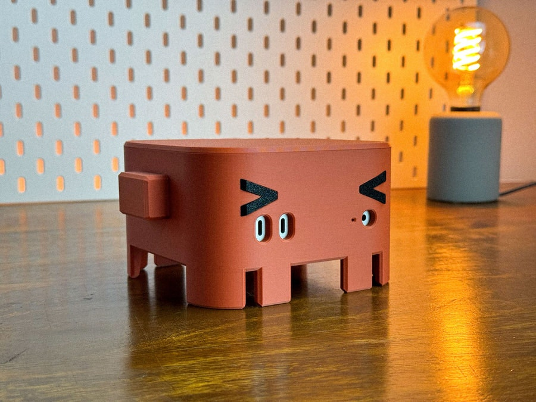
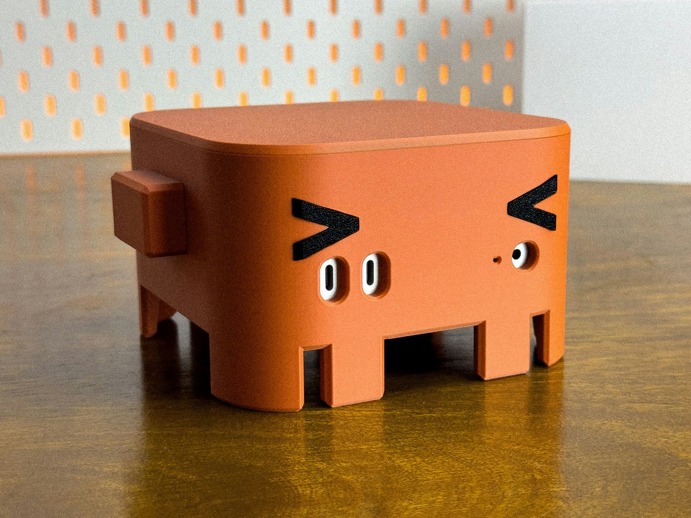

---

