# 🚀 Product Hunt Daily Top 10 (2026-02-09)

## 1. [SuperX](https://www.producthunt.com/products/superx?utm_campaign=producthunt-api&utm_medium=api-v2&utm_source=Application%3A+antigravity_test+%28ID%3A+258588%29)
**Votes**: 583 | **Tagline**: All-in-one growth OS for serious 𝕏 creators

### 📌 요약
극강의 성장을 원하는 𝕏(구 트위터) 크리에이터들을 위한 콘텐츠 생성부터 분석까지 책임지는 올인원 OS, SuperX가 떴습니다.

### 🔑 핵심 기능
- 🎯 Target Audience: 진심으로 𝕏 계정 성장을 원하는 '시리어스(Serious)' 크리에이터 및 마케터
- ✨ Key Differentiator: 단순히 예약 발행을 넘어, 바이럴 콘텐츠 기반 영감 제공, 트렌드 분석, 내 목소리를 반영한 빠른 리라이팅(재작성)까지 한 번에 처리하는 '성장 툴킷'
- 💡 Core Feature: 틈새시장(niche)의 바이럴 게시물과 트렌드를 분석해 매일 영감을 제공하고, 이를 바탕으로 내 목소리대로 빠르게 게시물을 생성해주는 AI 기반 콘텐츠 생산 기능

### 📸 스크린샷 및 갤러리

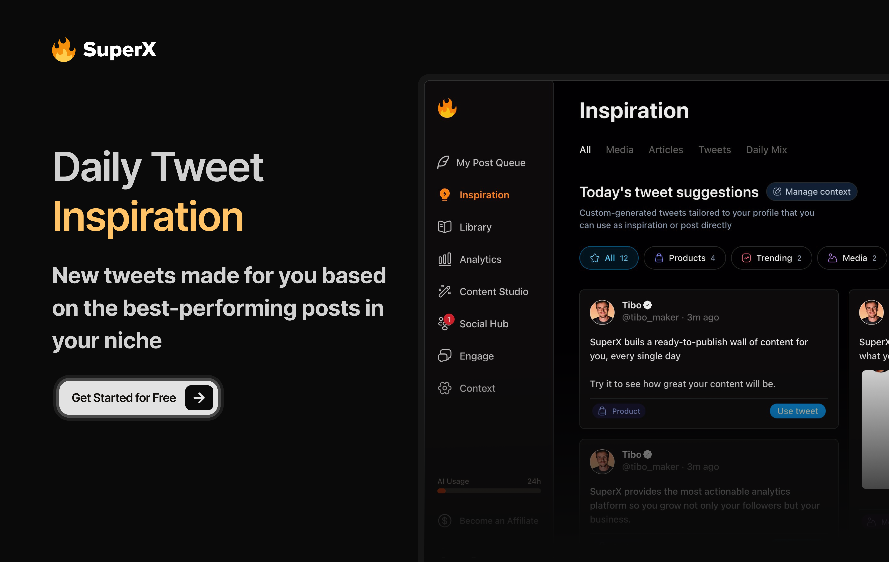

### 🎬 관련 영상
- [🎥 영상 보기](https://ph-files.imgix.net/4978cf51-f541-421b-aa87-f5b391f58691.jpeg?auto=format)

---

## 2. [Unicorne](https://www.producthunt.com/products/unicorne?utm_campaign=producthunt-api&utm_medium=api-v2&utm_source=Application%3A+antigravity_test+%28ID%3A+258588%29)
**Votes**: 372 | **Tagline**: The 20 fastest growing startups based on TrustMRR data

### 📌 요약
말로만 듣던 성장률이 아닌, Stripe나 RevenueCat 같은 실제 결제 데이터를 기반으로 급성장 중인 스타트업 Top 20 순위를 실시간으로 보여주는 대시보드입니다.

### 🔑 핵심 기능
- 🎯 Target Audience: VC, 엔젤 투자자, 스타트업 창업가, 경쟁사 분석이 필요한 마케터 및 사업 개발팀
- ✨ Key Differentiator: 단순 추정치가 아닌, TrustMRR 데이터를 통해 검증된 실제 매출(Stripe, Paddle 등) 기반의 '신뢰할 수 있는' 성장률 순위 제공
- 💡 Core Feature: 상위 20개 스타트업의 순위가 시간당 업데이트되는 실시간 랭킹 추적 기능

### 📸 스크린샷 및 갤러리
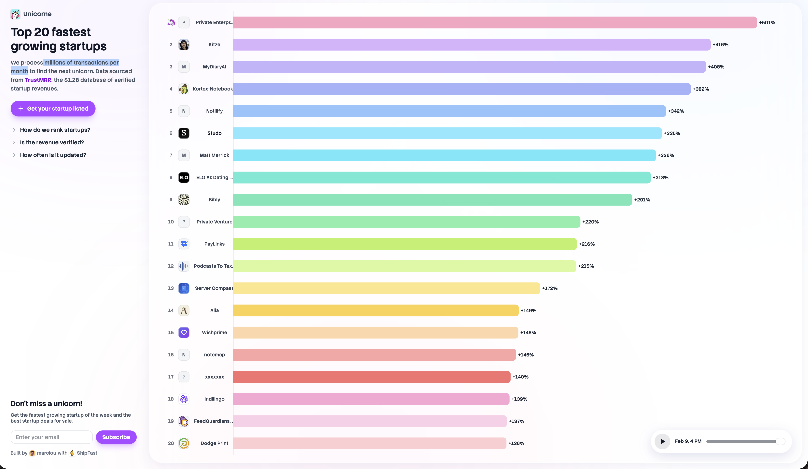
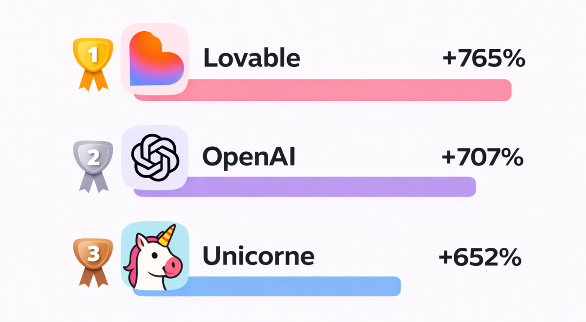
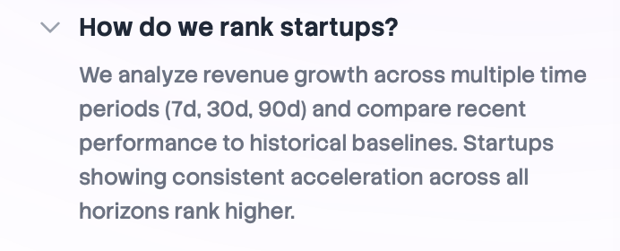

---

## 3. [Umbrel Pro](https://www.producthunt.com/products/umbrel?utm_campaign=producthunt-api&utm_medium=api-v2&utm_source=Application%3A+antigravity_test+%28ID%3A+258588%29)
**Votes**: 256 | **Tagline**: 16TB home cloud server. Run OpenClaw, store files, and more.

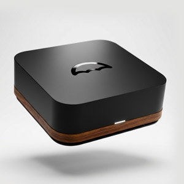

### 📌 요약
최대 16TB 용량과 고급스러운 디자인을 갖춘, '우아한 개인용 홈 클라우드 서버'의 등장입니다. 단순한 파일 저장소를 넘어, 나만의 앱을 구동하고 데이터를 완벽히 통제하는 홈 서버계의 프리미엄 올인원 솔루션입니다.

### 🔑 핵심 기능
- 🎯 Target Audience: 개인 데이터 주권을 중요시하며, 대용량 저장 공간과 높은 성능, 그리고 미학적 디자인을 추구하는 테크 얼리어답터 및 파워 유저.
- ✨ Key Differentiator: 4개의 NVMe SSD 슬롯으로 최대 16TB까지 확장되는 강력한 성능과, 통 알루미늄 및 아메리칸 월넛 프레임으로 마감된 '오브제'급의 고급스러운 디자인.
- 💡 Core Feature: umbrelOS를 통해 OpenClaw, Immich(사진/영상 백업) 등 수백 가지의 자가 호스팅(Self-hosted) 앱들을 클릭 한 번으로 쉽게 설치하고 구동할 수 있는 '원클릭 앱 생태계'.

### 📸 스크린샷 및 갤러리
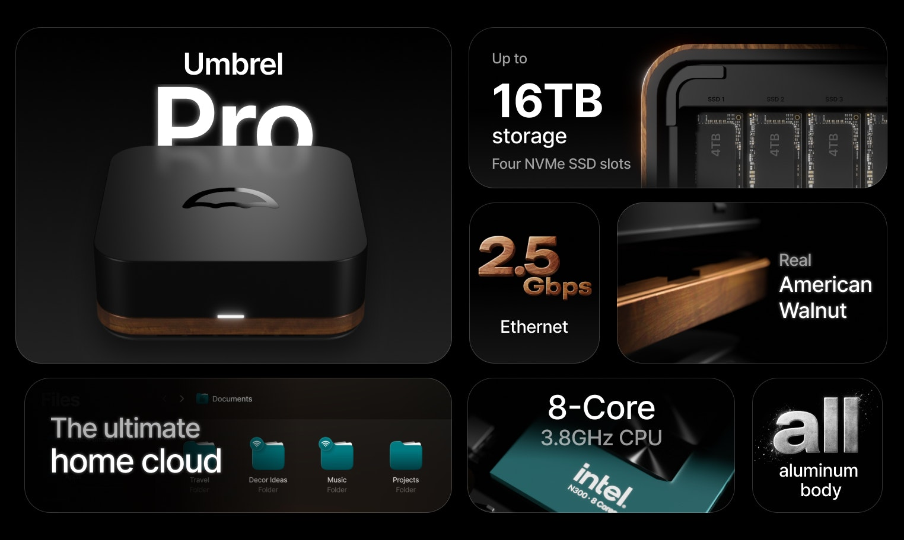
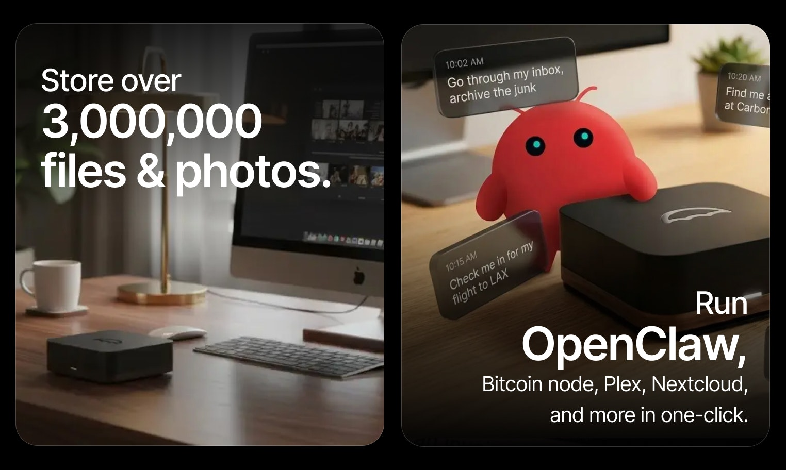
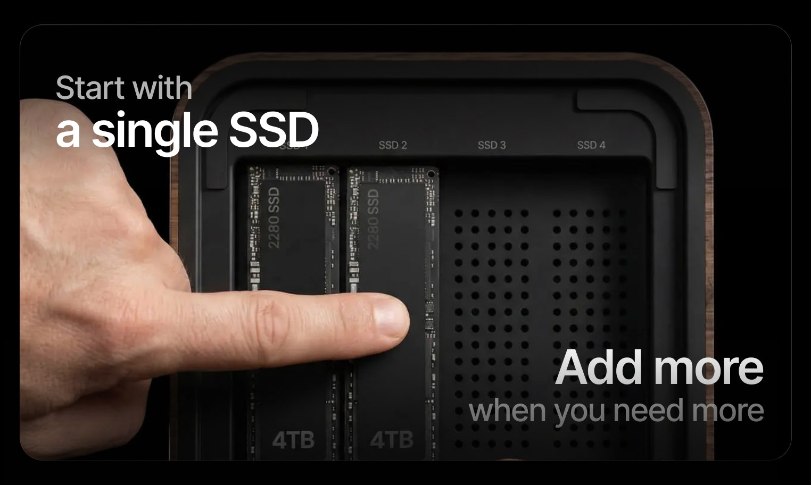

### 🎬 관련 영상
- [🎥 영상 보기](https://ph-files.imgix.net/3041b5fb-cec1-4815-a774-476da5a83d9e.jpeg?auto=format)

---

## 4. [rivva](https://www.producthunt.com/products/rivva?utm_campaign=producthunt-api&utm_medium=api-v2&utm_source=Application%3A+antigravity_test+%28ID%3A+258588%29)
**Votes**: 199 | **Tagline**: AI Schedule & Planner | Your Day, Planned Around Your Energy

### 📌 요약
단순한 할 일 관리를 넘어, 사용자의 집중력과 에너지 레벨에 맞춰 고강도 업무를 '자동 배치'해주는 혁신적인 AI 스케줄러입니다. (Do more than just manage tasks; this is an innovative AI scheduler that automatically allocates demanding work based on your focus and energy levels.)

### 🔑 핵심 기능
- 🎯 Target Audience: 집중력 관리에 어려움을 겪거나, 자신의 최고 효율 시간에 맞춰 업무를 재구성하고 싶은 모든 지식 근로자 및 프로페셔널.
- ✨ Key Differentiator: 기존 생산성 도구가 활동(Activity)만 추적하는 것과 달리, rivva는 수면, 에너지 패턴, 인지 부하 등의 신호를 통합하여 실제 작업 가능 능력(Capacity)을 기준으로 스케줄을 모델링합니다.
- 💡 Core Feature: AI가 사용자의 최고 집중 시간대(Peak Focus)를 예측하고, 가장 까다로운 작업을 그 시간에 자동 매칭/배치하여 최상의 성과를 끌어내는 지능형 스케줄링.

### 📸 스크린샷 및 갤러리
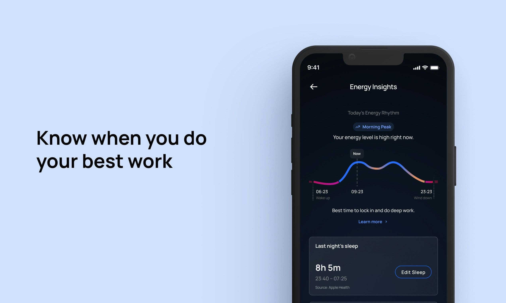
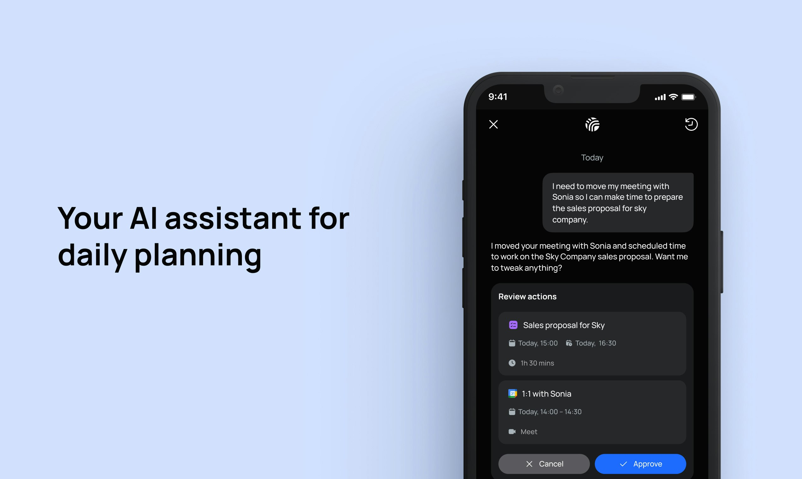
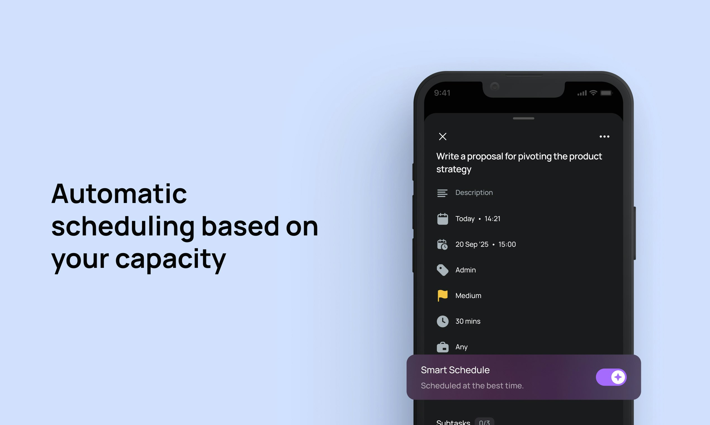

### 🎬 관련 영상
- [🎥 영상 보기](https://ph-files.imgix.net/cea95d9f-a7f4-4ce4-ac04-42240b67dd90.jpeg?auto=format)

---

## 5. [Dropstone 3](https://www.producthunt.com/products/dropstone-2?utm_campaign=producthunt-api&utm_medium=api-v2&utm_source=Application%3A+antigravity_test+%28ID%3A+258588%29)
**Votes**: 181 | **Tagline**: The first multiplayer AI code editor. Now with Share Chat.

### 📌 요약
사람과 AI 에이전트가 실시간으로 협업하는 '멀티플레이어' 코드 작업 공간. 링크 하나로 즉시 코딩 세션을 공유하고 무한 컨텍스트 AI의 도움을 받으세요.

### 🔑 핵심 기능
- 🎯 Target Audience: 복잡한 프로젝트를 진행하며 실시간 AI 지원 및 팀 협업이 필요한 개발자 및 엔지니어링 팀.
- ✨ Key Differentiator: API 래퍼가 아닌 독자 연구 기반의 'D3 엔진' 탑재. 무한 컨텍스트(Infinite Context)와 영구 메모리로 복잡한 코드베이스 작업 시 압도적인 효율 제공.
- 💡 Core Feature: 'Share Chat' 기능. 링크 클릭 한 번으로 팀원 및 AI 에이전트와 실시간으로 작업 공간을 공유하고 즉각적인 협업 시작 가능.

### 📸 스크린샷 및 갤러리
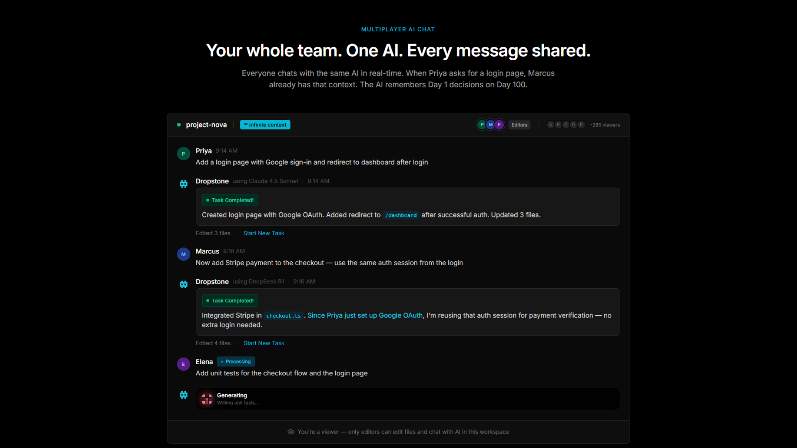
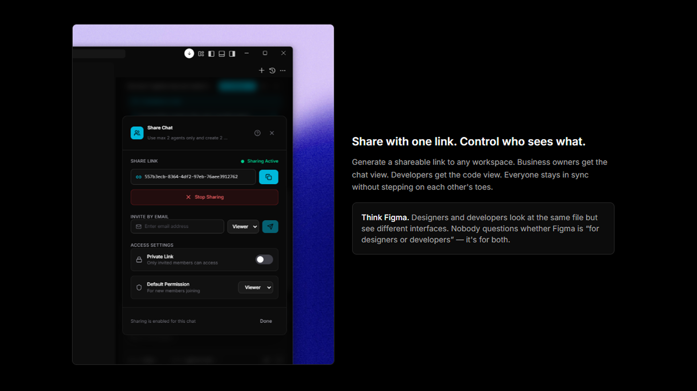
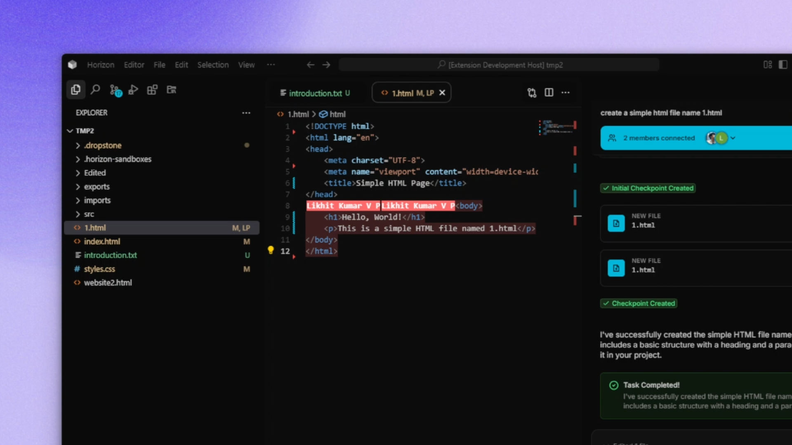

### 🎬 관련 영상
- [🎥 영상 보기](https://ph-files.imgix.net/8584c0ac-8bfe-446c-bf30-7950d95ce20a.jpeg?auto=format)

---

## 6. [ClawdTalk](https://www.producthunt.com/products/telnyx?utm_campaign=producthunt-api&utm_medium=api-v2&utm_source=Application%3A+antigravity_test+%28ID%3A+258588%29)
**Votes**: 165 | **Tagline**: Your Clawdbot's first phone number.

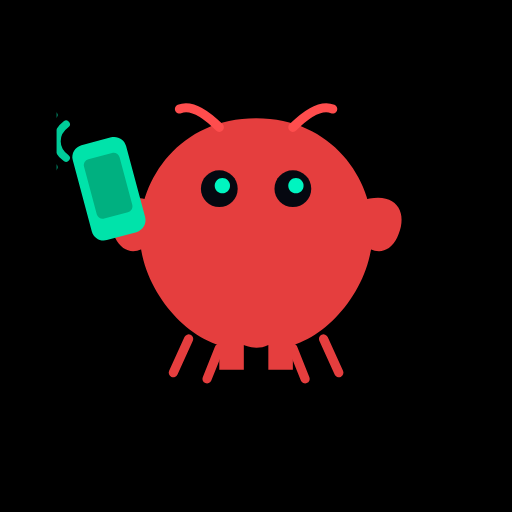

### 📌 요약
드디어 내 AI 에이전트에게 전용 전화번호가 생겼습니다! 채팅창에 갇혀 답답한 타이핑 대신, 언제 어디서든 전화, 문자, 왓츠앱으로 '진짜 통화'처럼 음성 대화를 나눌 수 있는 보이스 퍼스트(Voice-first) AI 커뮤니케이션 플랫폼입니다.

### 🔑 핵심 기능
- 🎯 Target Audience: AI 에이전트를 적극적으로 활용하며, 텍스트 입력 대신 빠르고 자연스러운 음성 기반 대화를 선호하는 사용자 및 서비스 개발자.
- ✨ Key Differentiator: 기존의 AI 챗봇이 가진 웹/앱 채팅 UI의 한계를 벗어나, 전화나 문자와 같은 일상적인 커뮤니케이션 채널을 통해 AI와 음성으로 직접 연결됩니다.
- 💡 Core Feature: 사용자 휴대폰 번호만 추가하면 AI 에이전트에게 고유한 전화번호가 부여되어, 보안 설계 하에(에이전트는 사용자에게만 연락 가능) 양방향 통화 및 문자 소통이 가능해집니다.

### 📸 스크린샷 및 갤러리
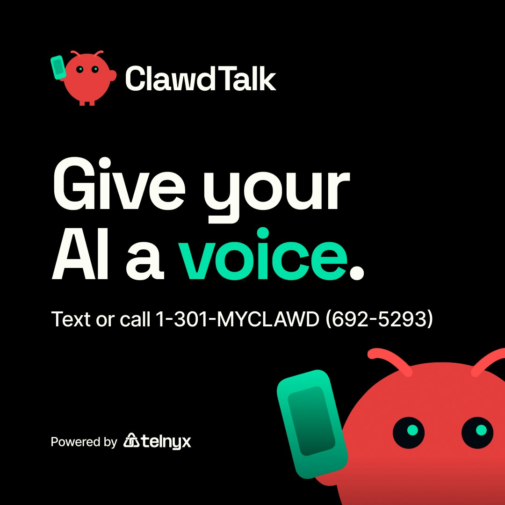
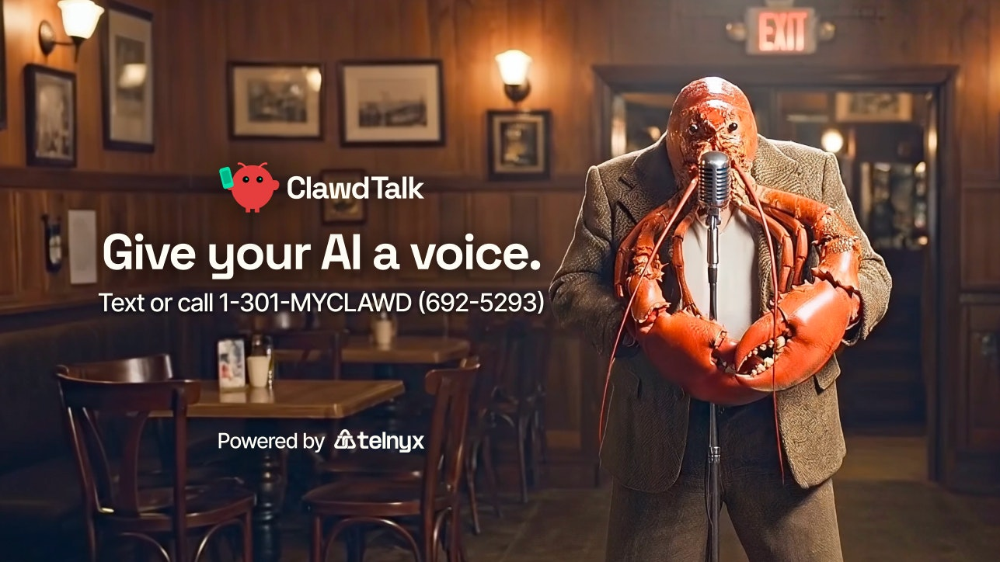
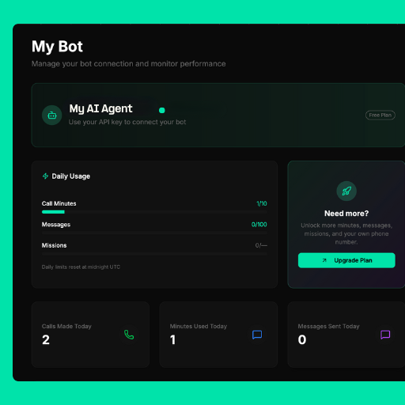

### 🎬 관련 영상
- [🎥 영상 보기](https://ph-files.imgix.net/aa416e6f-f473-46cd-b00f-91fd2c47c40c.jpeg?auto=format)

---

## 7. [DubStream by CAMB.AI](https://www.producthunt.com/products/dubstream-by-camb?utm_campaign=producthunt-api&utm_medium=api-v2&utm_source=Application%3A+antigravity_test+%28ID%3A+258588%29)
**Votes**: 153 | **Tagline**: Dub live streams in 150+ languages, instantly

### 📌 요약
실시간 라이브 스트리밍을 150개 이상의 언어로 즉시 더빙하여 글로벌 시청자에게 도달할 수 있게 해주는 혁신적인 AI 더빙 솔루션입니다.

### 🔑 핵심 기능
- 🎯 Target Audience: 글로벌 시청자 확장을 원하는 라이브 스트리머, 미디어 플랫폼, 스포츠 리그(MLS, NASCAR 등) 및 기업.
- ✨ Key Differentiator: CAMB.AI의 MARS8 AI 기반으로 150+ 언어를 지원하며, 특히 '실시간(real-time)' 라이브 스트림 더빙이라는 속도와 규모의 강점.
- 💡 Core Feature: 웹 플랫폼 또는 API를 통해 라이브 방송에 접속하면, 방송 내용이 실시간으로 다국어 음성 더빙되어 송출되는 기능.

### 📸 스크린샷 및 갤러리
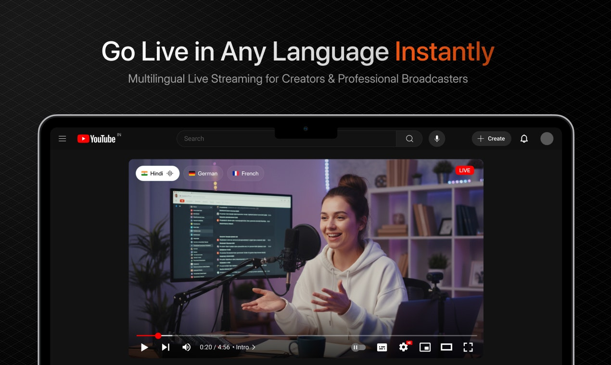

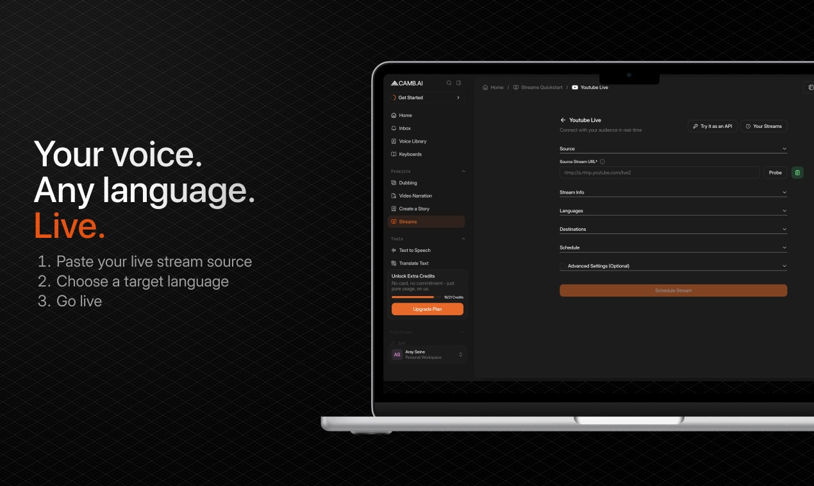

### 🎬 관련 영상
- [🎥 영상 보기](https://ph-files.imgix.net/69d00384-8db4-4076-9030-3148b4b38254.jpeg?auto=format)

---

## 8. [OpenAI Frontier](https://www.producthunt.com/products/openai?utm_campaign=producthunt-api&utm_medium=api-v2&utm_source=Application%3A+antigravity_test+%28ID%3A+258588%29)
**Votes**: 142 | **Tagline**: Operate AI coworkers on a single enterprise platform

### 📌 요약
OpenAI가 AI를 단순 도구가 아닌 '동료'로 격상시키는 엔터프라이즈 플랫폼을 출시했습니다. 복잡하게 흩어져 있던 AI 에이전트들을 통합 온보딩하고 관리하며 전사적 협업을 가능케 하는 미래형 업무 시스템입니다.

### 🔑 핵심 기능
- 🎯 Target Audience: AI 활용을 특정 부서나 프로젝트를 넘어 전사적으로 확장하고, 효율적인 AI 거버넌스(관리) 체계를 구축하려는 대기업 및 IT 운영팀.
- ✨ Key Differentiator: AI 에이전트에게 '동료'와 동일한 온보딩, 공유된 업무 맥락, 피드백 기반 학습 기회를 제공하여, 파편화된 AI가 아닌 협업 가능한 전사적 AI 시스템 구축.
- 💡 Core Feature: AI 에이전트 구축부터 배포, 운영까지 하나의 플랫폼에서 통합 관리하며, 특히 명확한 '권한 및 경계 설정' 기능을 통해 안전하고 통제된 AI 활용 환경 보장.

### 📸 스크린샷 및 갤러리
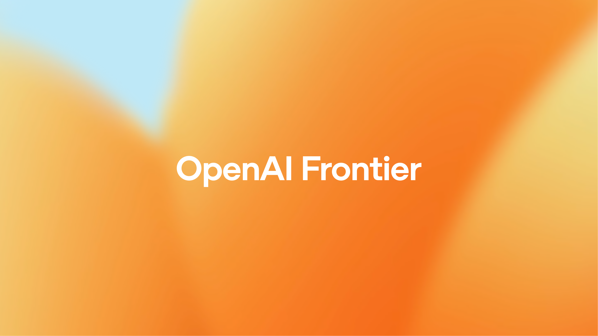
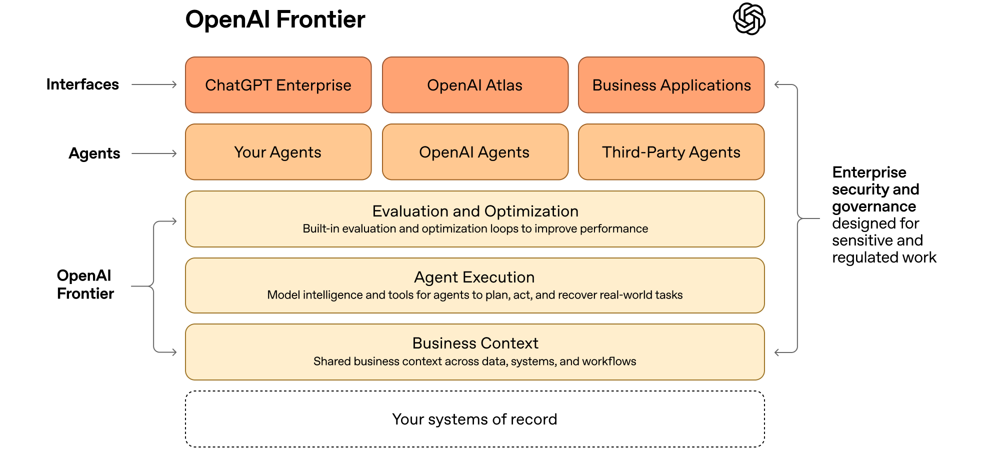

---

## 9. [Apple Creator Studio](https://www.producthunt.com/products/apple?utm_campaign=producthunt-api&utm_medium=api-v2&utm_source=Application%3A+antigravity_test+%28ID%3A+258588%29)
**Votes**: 126 | **Tagline**: Powerful creativity apps and premium productivity features

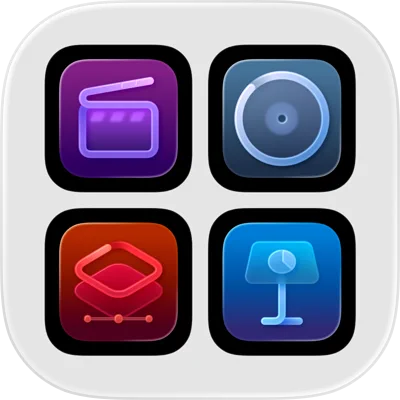

### 📌 요약
애플의 모든 프로급 창작 앱과 최신 AI 기능을 한데 모은 '창작자용 끝판왕 패키지'가 드디어 등장했습니다. 개별 구매의 부담을 덜고 Apple Intelligence로 작업 효율을 극대화할 수 있는 강력한 통합 구독 서비스입니다.

### 🔑 핵심 기능
- 🎯 Target Audience: 영상, 음악, 디자인 등 다양한 분야에서 전문적인 결과물을 만들고 싶은 크리에이터와 애플 기기 활용도를 극대화하려는 파워 유저
- ✨ Key Differentiator: 고가의 프로급 앱(Final Cut, Logic 등)을 개별 구매할 필요 없이 구독 하나로 해결하며, Apple Intelligence와 결합해 기존 방식보다 훨씬 빠르고 직관적인 창작 환경을 제공
- 💡 Core Feature: AI 기반의 스마트 워크플로우와 프리미엄 에셋 지원, 그리고 최대 5명의 가족과 함께 공유할 수 있는 압도적인 가성비

### 📸 스크린샷 및 갤러리

### 🎬 관련 영상
- [🎥 영상 보기](https://ph-files.imgix.net/50a7c4b8-92c3-4e07-9f87-40edd04ebafd.jpeg?auto=format)

---

## 10. [CRML](https://www.producthunt.com/products/crml?utm_campaign=producthunt-api&utm_medium=api-v2&utm_source=Application%3A+antigravity_test+%28ID%3A+258588%29)
**Votes**: 124 | **Tagline**: CRML is a declaritive language for writing cyberrisk as code

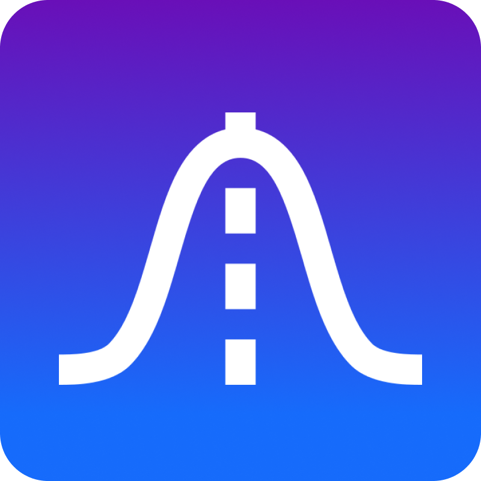

### 📌 요약
'코드형 인프라(IaC)'의 다음 단계! 사이버 리스크를 YAML/JSON으로 명확하게 정의하고 관리하는 '코드형 리스크(RaC)' 시대의 핵심 언어, CRML이 드디어 공개되었습니다.

### 🔑 핵심 기능
- 🎯 Target Audience: 정량적인 리스크 분석이 필요하거나 기존 리스크 관리 방식(문서, 스프레드시트)의 한계를 느끼는 보안 아키텍트 및 리스크 엔지니어링 팀.
- ✨ Key Differentiator: 특정 시뮬레이션 엔진, 위험 정량화 방법론, 또는 보안 프레임워크(MITRE 등)에 종속되지 않는 개방적이고 선언적인(Declarative) 설계 방식.
- 💡 Core Feature: YAML/JSON 형식으로 사이버 리스크 모델, 측정 데이터(Telemetry) 매핑, 시뮬레이션 파이프라인 전체를 코드로 상세하게 기술 및 버전 관리 가능.

### 📸 스크린샷 및 갤러리
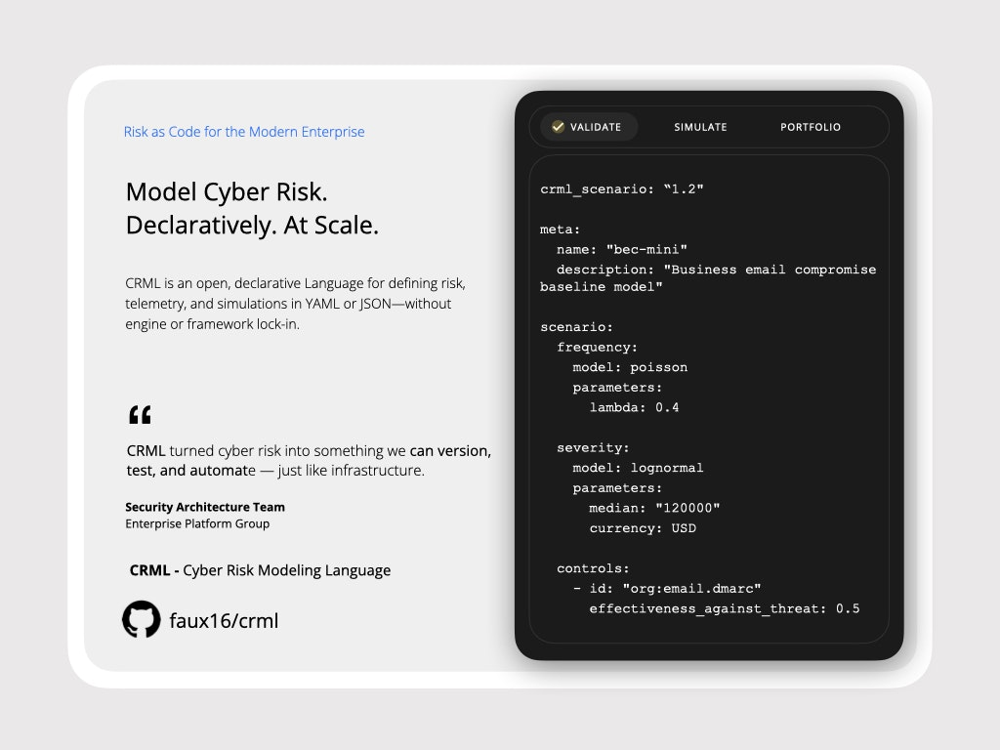
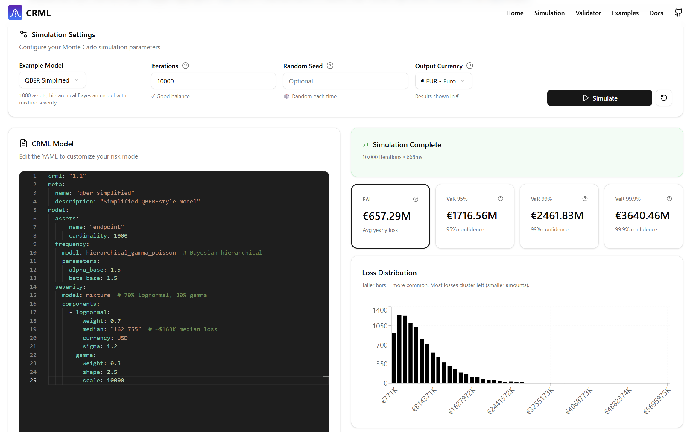
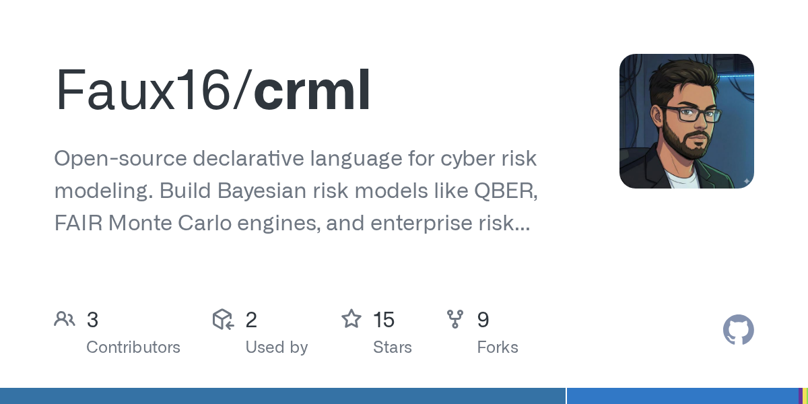

---

