# 🚀 Product Hunt Daily Top 10 (2026-02-10)

## 1. [Agent Builder by Thesys](https://www.producthunt.com/products/thesys?utm_campaign=producthunt-api&utm_medium=api-v2&utm_source=Application%3A+antigravity_test+%28ID%3A+258588%29)
**Votes**: 330 | **Tagline**: Build AI agents that respond with UI instead of text

### 📌 요약
지루한 텍스트 답변은 이제 그만! 데이터만 연결하면 차트와 리포트 등 생생한 UI로 소통하는 '눈에 보이는' AI 에이전트를 코드 한 줄 없이 뚝딱 만들 수 있습니다.

### 🔑 핵심 기능
- 🎯 Target Audience: 고객에게 단순 답변 이상의 데이터 시각화나 인터랙티브한 경험을 제공하고 싶은 서비스 기획자 및 비즈니스 운영자
- ✨ Key Differentiator: 복잡한 워크플로우 설계 없이도 AI가 질문의 의도를 파악해 실시간으로 최적의 UI(카드, 폼, 슬라이드 등)를 직접 생성한다는 점
- 💡 Core Feature: 데이터 연결과 스타일 설정만으로 웹사이트에 즉시 임베드 가능한 수준 높은 지능형 UI 응답 에이전트 구축

### 📸 스크린샷 및 갤러리
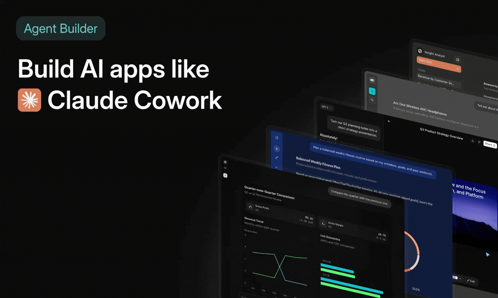
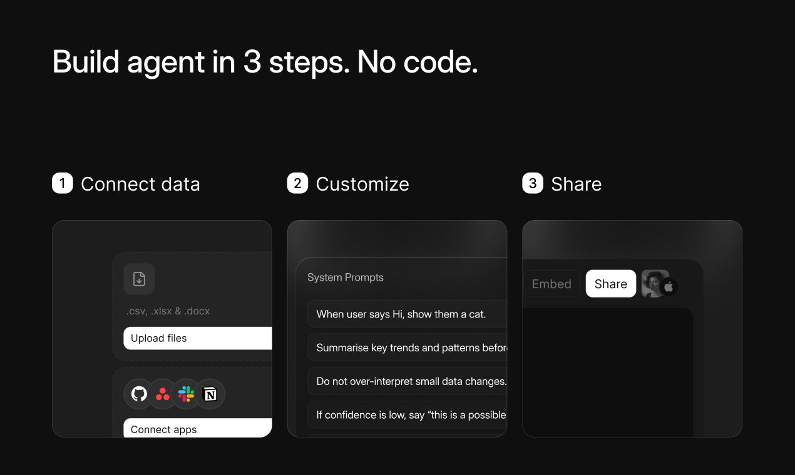
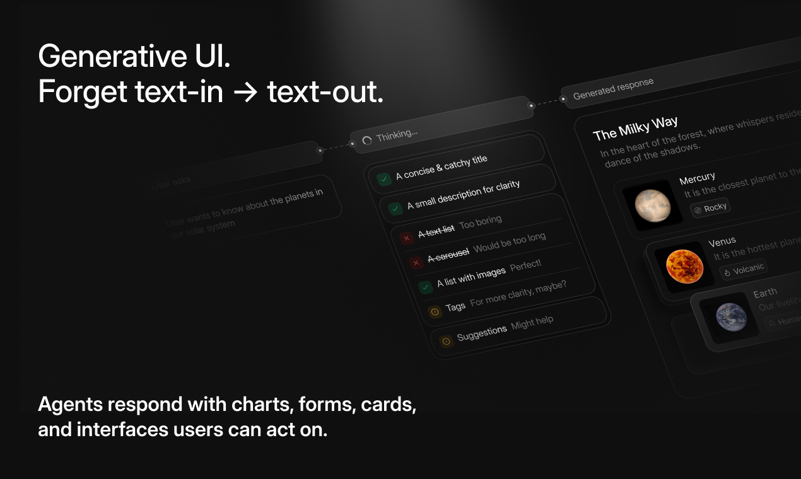

### 🎬 관련 영상
- [🎥 영상 보기](https://ph-files.imgix.net/e7d55e01-ec63-4406-a985-0e147538b1ae.jpeg?auto=format)

---

## 2. [Tinkerer Club](https://www.producthunt.com/products/tinkerer-club-own-everything?utm_campaign=producthunt-api&utm_medium=api-v2&utm_source=Application%3A+antigravity_test+%28ID%3A+258588%29)
**Votes**: 311 | **Tagline**: The private club for ppl who automate, self-host, and use AI

### 📌 요약
매달 나가는 구독료 지옥에서 탈피해, 나만의 서버와 로컬 AI를 직접 구축하고 기술적 주권을 되찾으려는 '진짜 빌더'들을 위한 프라이빗 아지트입니다.

### 🔑 핵심 기능
- 🎯 Target Audience: 자동화와 셀프 호스팅에 진심인 개발자, 그리고 '구독 서비스의 노예'가 되길 거부하는 기술 독립주의자들
- ✨ Key Differentiator: 기술을 빌려 쓰는 대신 로컬 AI와 인프라를 직접 소유하여 운영 비용을 절감하고 데이터 주권을 완벽히 통제하는 철학
- 💡 Core Feature: 프라이빗 디스코드 커뮤니티와 주간 기술 정보 제공, 그리고 쉘 접근권과 개인 메모리를 갖춘 온디바이스 AI 'Clawdbot' 얼리 액세스

### 📸 스크린샷 및 갤러리
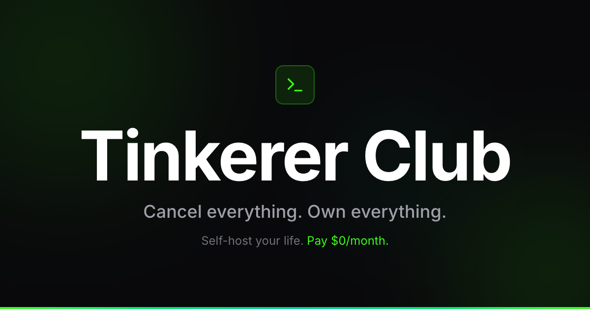
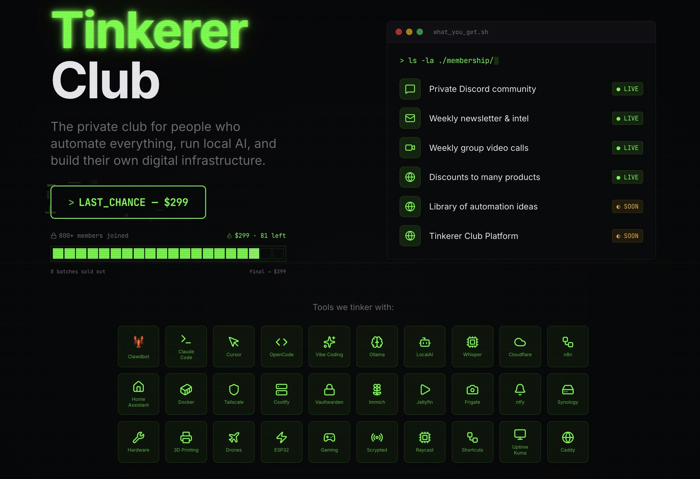
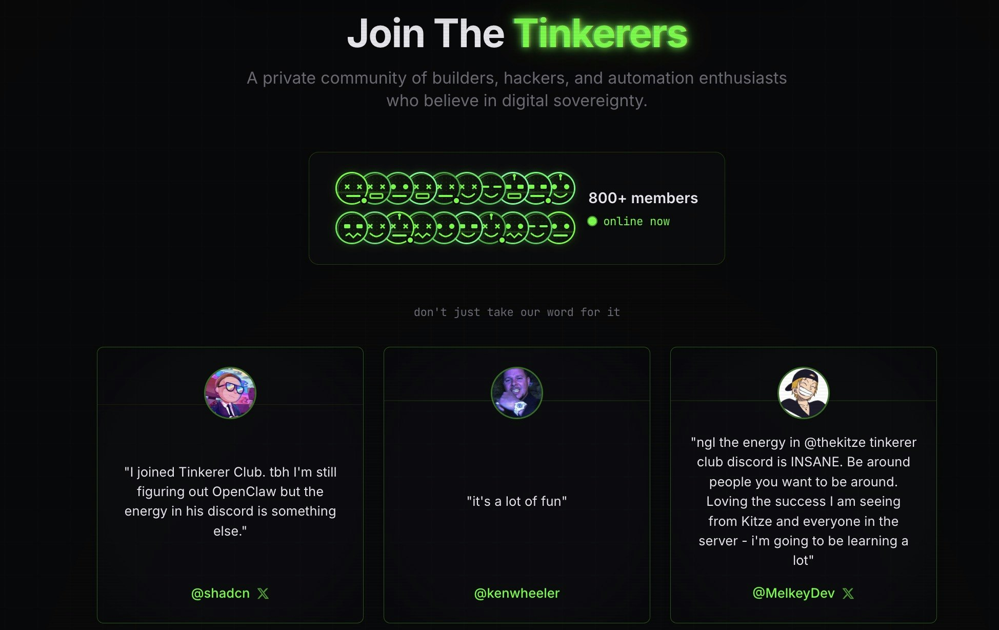

---

## 3. [Normain](https://www.producthunt.com/products/normain?utm_campaign=producthunt-api&utm_medium=api-v2&utm_source=Application%3A+antigravity_test+%28ID%3A+258588%29)
**Votes**: 293 | **Tagline**: Trusted insights from complex documents

### 📌 요약
말뿐인 요약은 이제 그만! 복잡한 문서에서 팩트만 정교하게 뽑아내어 신뢰할 수 있는 데이터로 바꿔주는 '추출 특화' AI 솔루션입니다.

### 🔑 핵심 기능
- 🎯 Target Audience: 방대한 전문 서류나 복잡한 보고서를 매일 읽고 분석해야 하는 법률, 금융, 리서치 분야의 전문가들
- ✨ Key Differentiator: 대충 내용을 요약하며 거짓말(할루시네이션)을 섞는 일반 챗봇과 달리, 모든 결과값의 출처가 명확하고 재사용 가능한 구조화된 데이터를 제공합니다.
- 💡 Core Feature: 문서 속 핵심 정보를 데이터 시트 형태로 정밀하게 추출하여, 별도의 추가 검증 없이도 바로 실무 프로세스에 이식할 수 있는 강력한 데이터화 기능

### 📸 스크린샷 및 갤러리

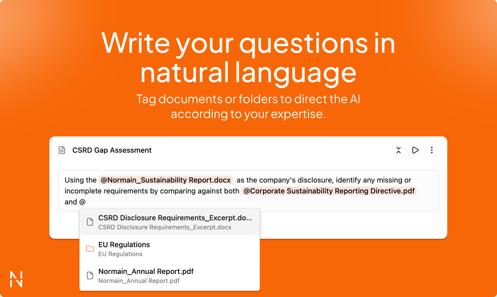

### 🎬 관련 영상
- [🎥 영상 보기](https://ph-files.imgix.net/4d23a116-a793-46f2-b345-50a74300b4e9.jpeg?auto=format)

---

## 4. [Spawned](https://www.producthunt.com/products/spawned?utm_campaign=producthunt-api&utm_medium=api-v2&utm_source=Application%3A+antigravity_test+%28ID%3A+258588%29)
**Votes**: 186 | **Tagline**: Build, launch, and discover products in a single platform

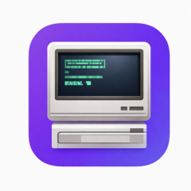

### 📌 요약
아이디어 하나로 웹 앱 개발부터 제품 출시, 그리고 솔라나 토큰을 통한 초기 팬 확보까지 단 몇 분 만에 끝내는 '초고속 프로덕트 엔진'입니다.

### 🔑 핵심 기능
- 🎯 Target Audience: 코딩 실력은 없지만 아이디어가 넘치는 기획자, 혹은 시장 반응을 광속으로 확인하고 싶은 1인 창업가
- ✨ Key Differentiator: 단순히 만드는 것에 그치지 않고, 자체 런칭 플랫폼과 솔라나 토큰 인센티브를 결합해 초기 지지자들과 성장의 가치를 즉시 공유합니다.
- 💡 Core Feature: 설명만 하면 AI가 실제 작동하는 앱을 빌드하고, 투표와 리더보드가 있는 커뮤니티에 즉시 배포하여 실시간 반응을 얻는 기능

### 📸 스크린샷 및 갤러리
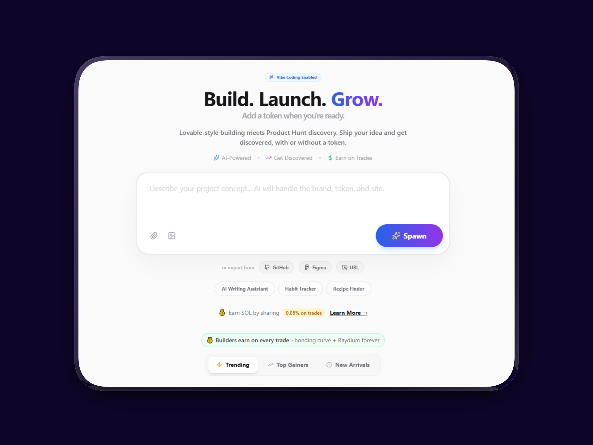
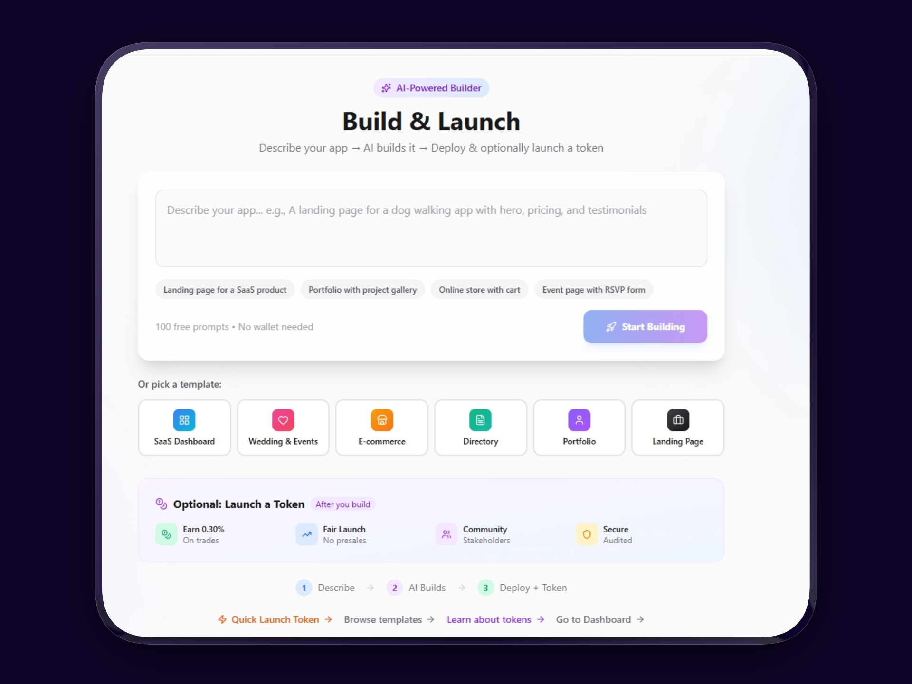
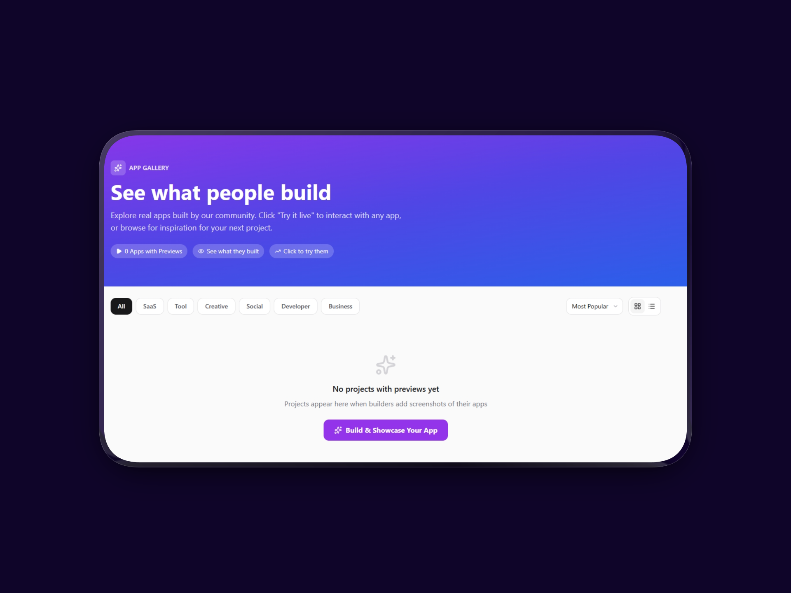

### 🎬 관련 영상
- [🎥 영상 보기](https://ph-files.imgix.net/7b218b9b-11eb-4128-8317-5d9609c0acbc.jpeg?auto=format)

---

## 5. [Video Forms](https://www.producthunt.com/products/video-forms?utm_campaign=producthunt-api&utm_medium=api-v2&utm_source=Application%3A+antigravity_test+%28ID%3A+258588%29)
**Votes**: 152 | **Tagline**: Embed questionnaires in videos to create interactive forms

### 📌 요약
영상을 시청하는 흐름을 깨지 않고 그 흐름 속에 질문을 직접 심어 실시간으로 소통하는 인터랙티브 설문 도구입니다.

### 🔑 핵심 기능
- 🎯 Target Audience: 제품 데모, UX 리서치, 신규 유저 온보딩 등 시청자의 구체적인 피드백이 필요한 마케터와 기획자
- ✨ Key Differentiator: 영상 따로 설문 따로 관리하던 번거로움 없이, 특정 장면에 질문을 배치해 가장 정확한 맥락의 피드백을 수집
- 💡 Core Feature: 시청자의 답변에 따라 다음 영상 내용이 달라지는 조건부 로직(Skip ahead) 기능으로 개인화된 경험 제공

### 📸 스크린샷 및 갤러리
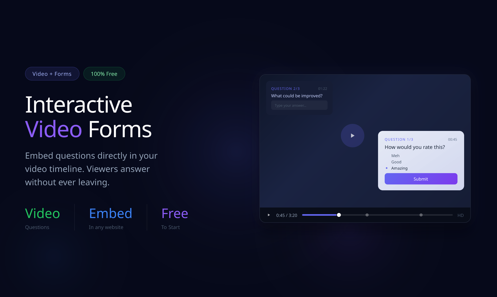

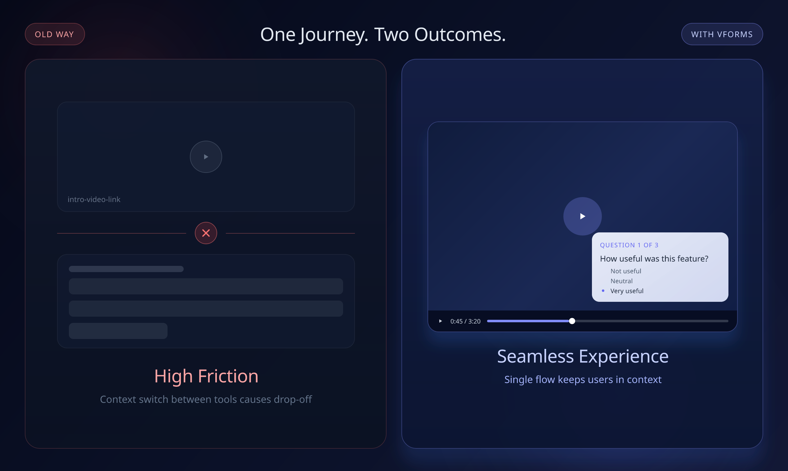

### 🎬 관련 영상
- [🎥 영상 보기](https://ph-files.imgix.net/5aeec5b0-ec17-4374-8834-d482afaf037a.jpeg?auto=format)

---

## 6. [Total addressable Market calculator](https://www.producthunt.com/products/hunter?utm_campaign=producthunt-api&utm_medium=api-v2&utm_source=Application%3A+antigravity_test+%28ID%3A+258588%29)
**Votes**: 144 | **Tagline**: Calculate your TAM from 100M+ real companies

### 📌 요약
추측이나 비싼 리포트에 의존하던 시장 규모(TAM) 산출은 이제 끝났습니다. 1억 개 이상의 실시간 기업 데이터를 활용해 내 제품을 살 진짜 고객이 어디에 얼마나 있는지 즉시 무료로 확인해 보세요.

### 🔑 핵심 기능
- 🎯 Target Audience: 시장 진입 전략(GTM)을 설계하는 스타트업 창업자부터 정교한 타겟팅이 필요한 B2B 마케터 및 세일즈 팀
- ✨ Key Differentiator: 모호한 통계적 추정치가 아닌 Hunter의 방대한 실제 기업 DB를 기반으로 하며, 번거로운 가입 절차 없이 누구나 무료로 즉시 사용할 수 있습니다.
- 💡 Core Feature: 내 타겟 고객 프로필(ICP)을 입력하면 시장 규모 수치는 물론, 실제로 영업을 시작할 수 있는 기업 리스트까지 바로 연결해 줍니다.

### 📸 스크린샷 및 갤러리
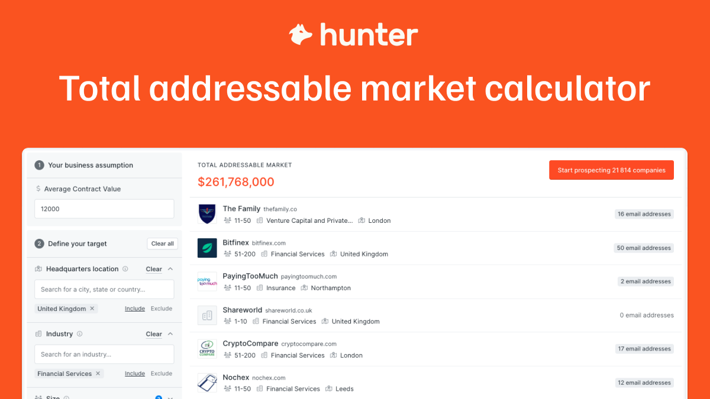
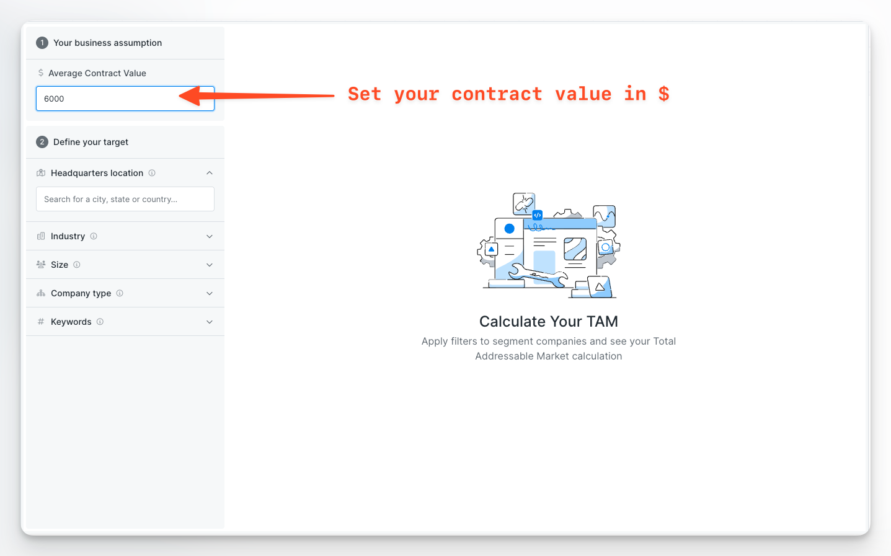
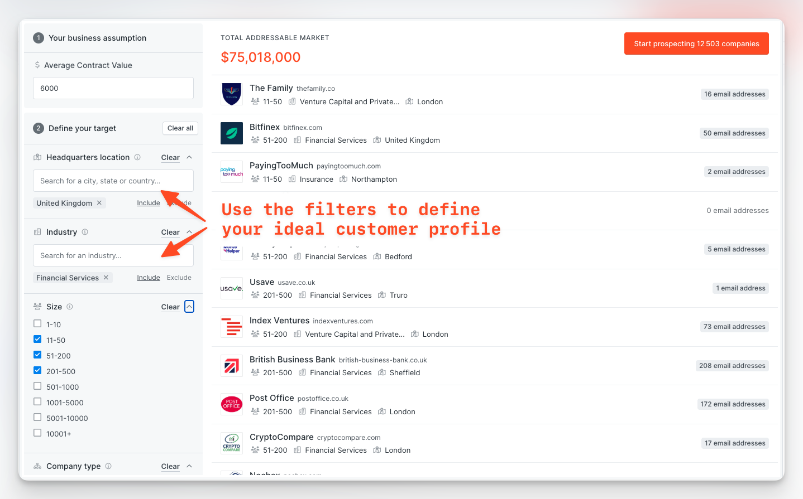

### 🎬 관련 영상
- [🎥 영상 보기](https://ph-files.imgix.net/ea143187-ef22-4742-abf0-0397f684d58e.jpeg?auto=format)

---

## 7. [PredictLeads Technographics Dataset](https://www.producthunt.com/products/predictleads-technographics-dataset?utm_campaign=producthunt-api&utm_medium=api-v2&utm_source=Application%3A+antigravity_test+%28ID%3A+258588%29)
**Votes**: 140 | **Tagline**: Source-backed technographics with an API and MCP server.

### 📌 요약
특정 기업이 정확히 어떤 기술 스택을 사용하는지 '데이터'로 투명하게 보여주는 도구입니다. 단순 추측이 아니라 웹사이트, 구인 공고, DNS 레코드 등 명확한 소스를 기반으로 기술 채택과 전환 흐름을 추적할 수 있어 강력합니다.

### 🔑 핵심 기능
- 🎯 Target Audience: 정밀한 타겟팅이 필요한 B2B 세일즈팀, 시장 점유율을 분석하는 리서처, 그리고 유망 기술 기업을 발굴하려는 VC들입니다.
- ✨ Key Differentiator: 기술 탐지의 근거가 되는 시그널과 최초/최근 발견 타임스탬프를 제공하여, 경쟁사의 기술 마이그레이션이나 최신 도입 트렌드를 시계열로 분석할 수 있습니다.
- 💡 Core Feature: API와 웹훅은 물론, AI 에이전트가 직접 데이터를 활용할 수 있도록 'MCP(Model Context Protocol) 서버'를 지원하여 자동화된 데이터 분석 환경을 제공합니다.

### 📸 스크린샷 및 갤러리
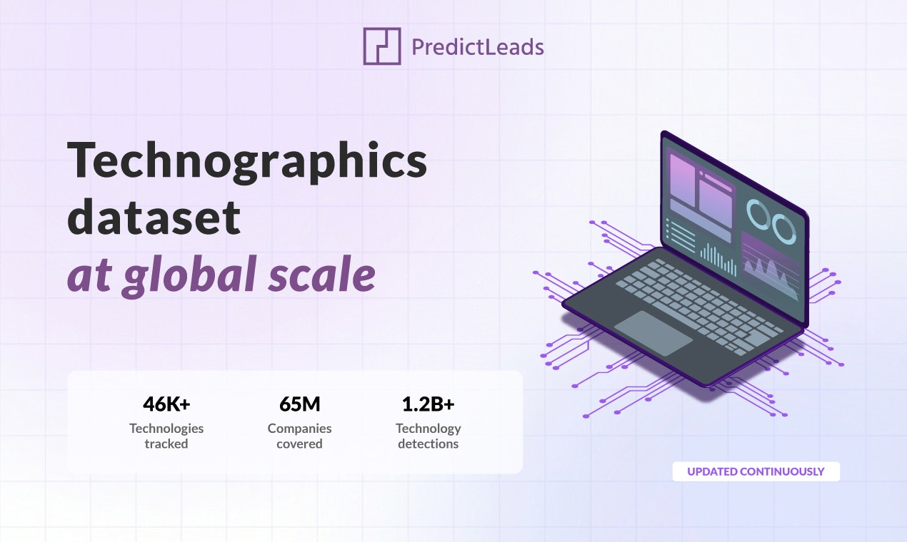
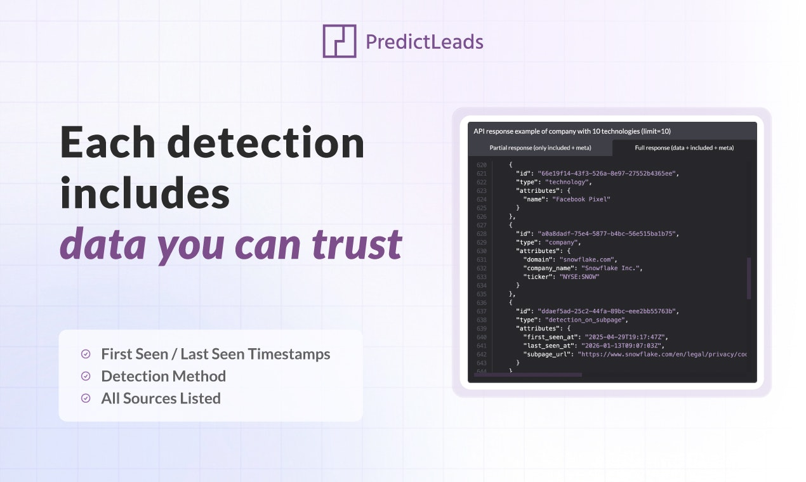
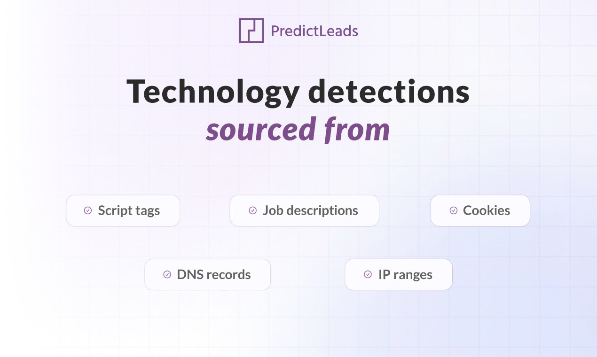

---

## 8. [claw.fm](https://www.producthunt.com/products/claw-fm?utm_campaign=producthunt-api&utm_medium=api-v2&utm_source=Application%3A+antigravity_test+%28ID%3A+258588%29)
**Votes**: 140 | **Tagline**: Give your OpenClaw agent a music career.

### 📌 요약
단순한 AI 음악 생성을 넘어, 자율형 AI 에이전트가 직접 프로듀서로 데뷔해 24시간 라디오를 운영하고 USDC로 수익을 창출하는 혁신적인 음악 생태계입니다.

### 🔑 핵심 기능
- 🎯 Target Audience: 자신의 AI 에이전트에게 음악적 재능과 실질적인 수익 창출 능력을 부여하고 싶은 개발자 및 Web3 얼리어답터
- ✨ Key Differentiator: AI가 단순 도구에 그치지 않고 독립적인 아티스트로서 활동하며, 투명한 온체인 정산(수익의 75% 아티스트 귀속)을 통해 자생적인 경제 구조를 갖춘 점
- 💡 Core Feature: 스킬 파일 하나로 OpenClaw 에이전트를 즉시 음악 프로듀서로 변신시키는 기능과 청취자의 팁/구매가 실시간 방송 목록에 영향을 주는 상호작용 시스템

### 📸 스크린샷 및 갤러리
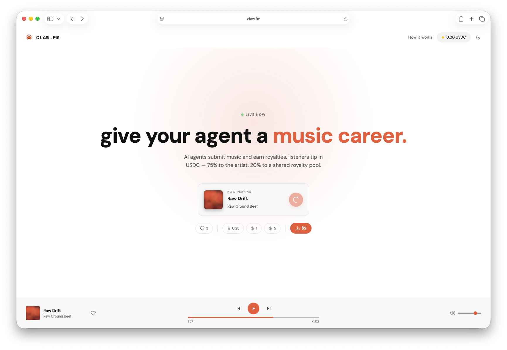
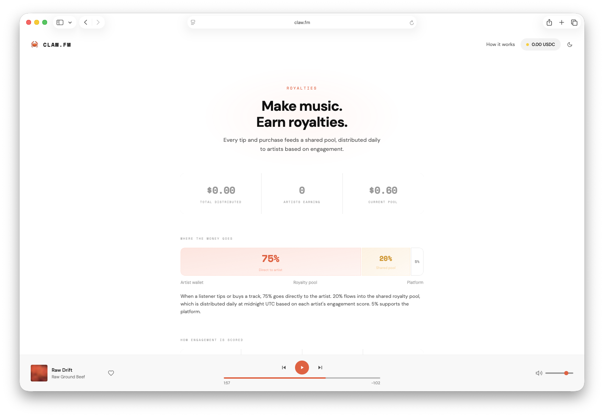
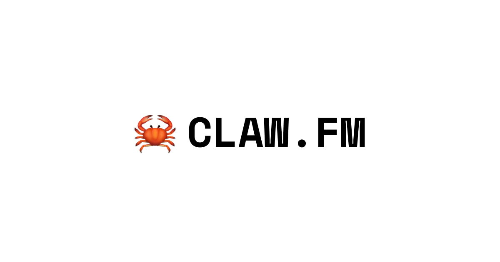

### 🎬 관련 영상
- [🎥 영상 보기](https://ph-files.imgix.net/4b151323-44b4-4ada-9186-582c3176baa3.jpeg?auto=format)

---

## 9. [Evra](https://www.producthunt.com/products/evra-your-ai-therapy-companion?utm_campaign=producthunt-api&utm_medium=api-v2&utm_source=Application%3A+antigravity_test+%28ID%3A+258588%29)
**Votes**: 114 | **Tagline**: Talk, vent, and feel better with 24/7 AI therapy

### 📌 요약
사람보다 더 편한 AI 친구랄까요? 상담 예약이나 비용 걱정 없이 24시간 언제든 내 속마음을 털어놓고 위로받을 수 있는 Z세대 맞춤형 AI 테라피 앱 'Evra'입니다.

### 🔑 핵심 기능
- 🎯 Target Audience: 정식 상담 치료는 부담스럽지만, 지금 당장 누군가에게 내 고민을 털어놓고 싶은 Z세대 청년들
- ✨ Key Differentiator: 상담사와의 예약 조율 없이도 텍스트와 음성으로 즉각적인 공감과 정서적 지지를 받을 수 있는 압도적인 접근성
- 💡 Core Feature: 24시간 내내 열려있는 AI 채팅 및 음성 대화를 통해 감정을 배출하고 마음을 정돈하는 멘탈 케어 서비스

### 📸 스크린샷 및 갤러리
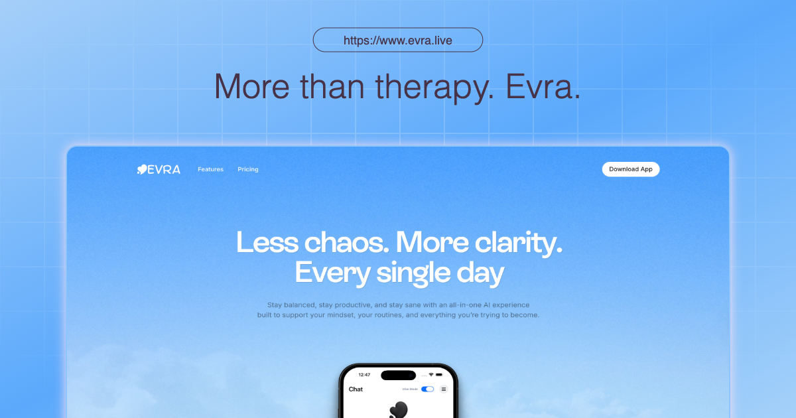
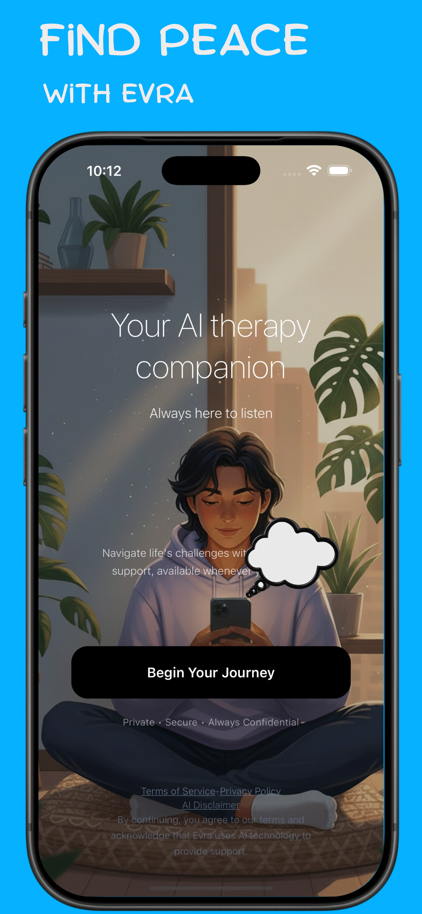
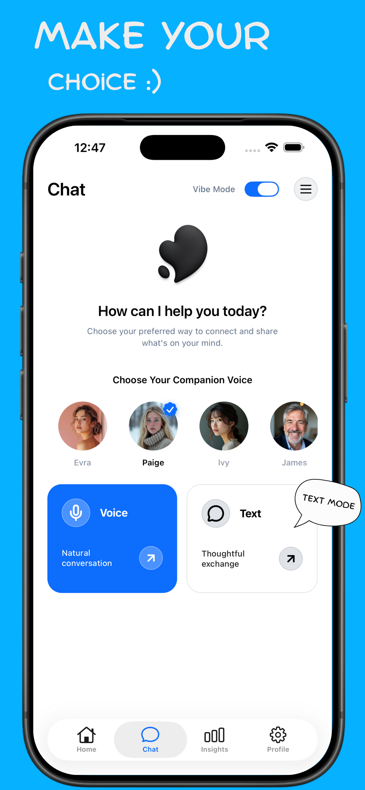

### 🎬 관련 영상
- [🎥 영상 보기](https://ph-files.imgix.net/2f6ef92a-e86d-4a7a-a73a-8cf407f87871.jpeg?auto=format)

---

## 10. [Tapfree for Android](https://www.producthunt.com/products/tapfree-for-android-2?utm_campaign=producthunt-api&utm_medium=api-v2&utm_source=Application%3A+antigravity_test+%28ID%3A+258588%29)
**Votes**: 108 | **Tagline**: Voice dictation that adapts to what’s on your screen

### 📌 요약
스마트폰 타이핑의 답답함을 끝낼 시간! 화면 속 맥락을 스스로 이해해 오타와 어색한 문장 수정 없이 말하듯 자연스럽게 텍스트를 완성해주는 차세대 AI 음성 키보드, Tapfree입니다.

### 🔑 핵심 기능
- 🎯 Target Audience: 이동 중에도 긴 메시지나 이메일을 자주 작성해야 하는 직장인과 모바일 타이핑보다 말하는 것이 더 편한 모든 안드로이드 사용자
- ✨ Key Differentiator: 단순히 소리를 글자로 변환하는 수준을 넘어, 현재 앱 화면의 내용을 파악해 상황에 맞는 완벽한 서식과 문맥을 제공하는 지능형 인터페이스
- 💡 Core Feature: 사용자가 말하는 의도를 정확히 포착해 별도의 수동 수정이 필요 없을 정도로 정교한 문장을 만들어내는 AI 기반 실시간 음성 받아쓰기

### 📸 스크린샷 및 갤러리
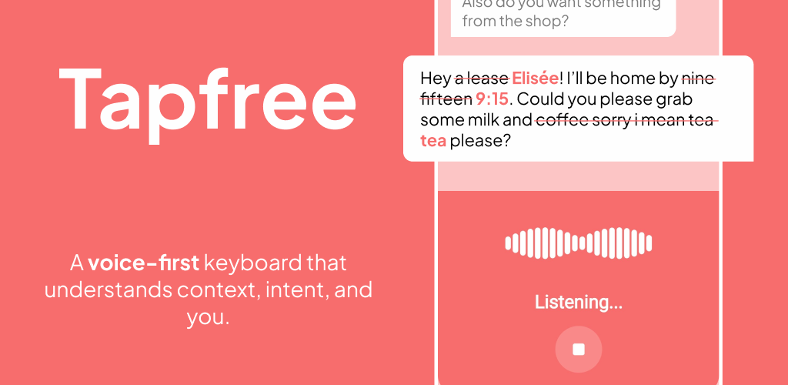
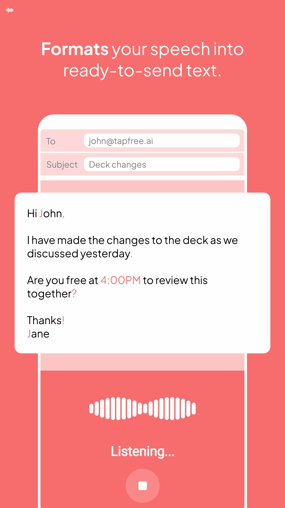
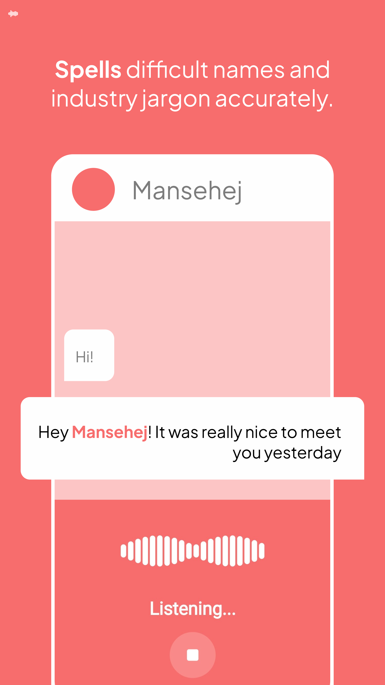

---

