# 🚀 Product Hunt Daily Top 10 (2026-02-11)

## 1. [happycapy](https://www.producthunt.com/products/happycapy?utm_campaign=producthunt-api&utm_medium=api-v2&utm_source=Application%3A+antigravity_test+%28ID%3A+258588%29)
**Votes**: 526 | **Tagline**: The agent-native computer, for the rest of us

### 📌 요약
Claude Code의 강력한 지능을 터미널 대신 친숙한 브라우저와 모바일 UI로 경험하세요. 복잡한 설정 없이 누구나 AI 에이전트를 개인용 컴퓨터처럼 활용해 코딩부터 일상 업무까지 끝낼 수 있는 가장 쉬운 생산성 도구입니다.

### 🔑 핵심 기능
- 🎯 Target Audience: 개발 지식 유무와 상관없이 AI를 통해 업무를 자동화하고 결과물을 만들고 싶은 모든 크리에이터와 생산성 매니아
- ✨ Key Differentiator: 기존 OpenClaw 같은 도구와 달리 설치 과정이나 보안 걱정 없이 브라우저에서 즉시 실행되며 모바일 환경까지 완벽 지원
- 💡 Core Feature: Claude Code 기반으로 코딩, 디자인, 일상적 태스크를 한곳에서 알아서 수행하는 사용자 친화적 에이전트 네이티브 인터페이스

### 📸 스크린샷 및 갤러리
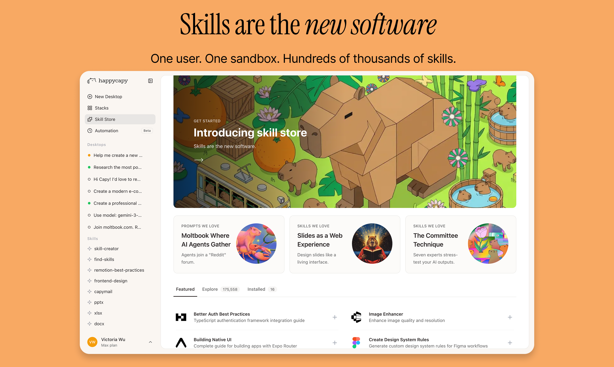
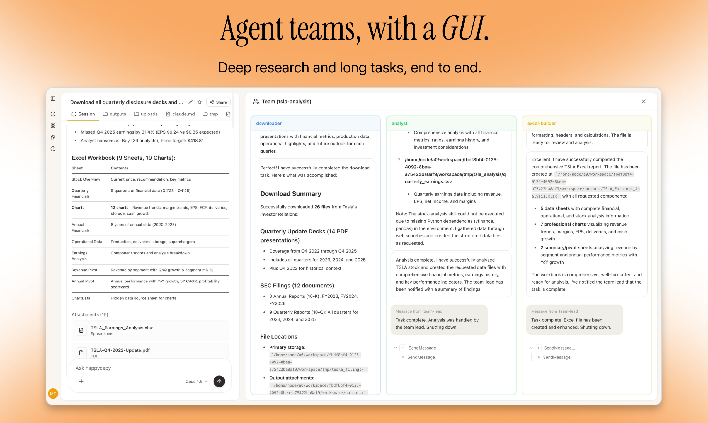

### 🎬 관련 영상
- [🎥 영상 보기](https://ph-files.imgix.net/275f83d5-e4e0-4e79-b9e4-07581d0afa5a.jpeg?auto=format)

---

## 2. [Subscription Day² for iOS](https://www.producthunt.com/products/subscription-day?utm_campaign=producthunt-api&utm_medium=api-v2&utm_source=Application%3A+antigravity_test+%28ID%3A+258588%29)
**Votes**: 257 | **Tagline**: Track paid subscriptions w/ analytics from multiple sources

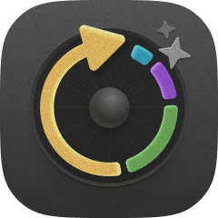

### 📌 요약
매달 야금야금 빠져나가는 구독료를 단순 기록하는 수준을 넘어, Mac과 iOS를 넘나들며 정교한 데이터 분석으로 지출을 완벽히 통제하게 해주는 스마트 매니저입니다.

### 🔑 핵심 기능
- 🎯 타겟: OTT부터 각종 생산성 앱까지, 여기저기 흩어진 구독 서비스 때문에 고정 지출 관리가 안 되는 프로 구독러
- ✨ 차별점: 단순 리스트업을 넘어 다양한 소스의 데이터를 통합 분석하며, Mac에서 검증된 깔끔한 UI를 iOS에서도 완벽하게 경험할 수 있습니다.
- 💡 핵심 기능: 여러 플랫폼의 구독 현황을 한데 모아 시각화된 그래프로 보여주고, 지출 패턴을 분석해주는 고도화된 분석 대시보드

### 📸 스크린샷 및 갤러리
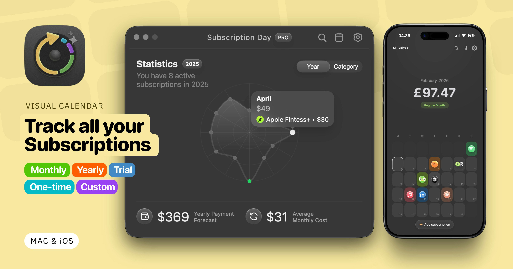
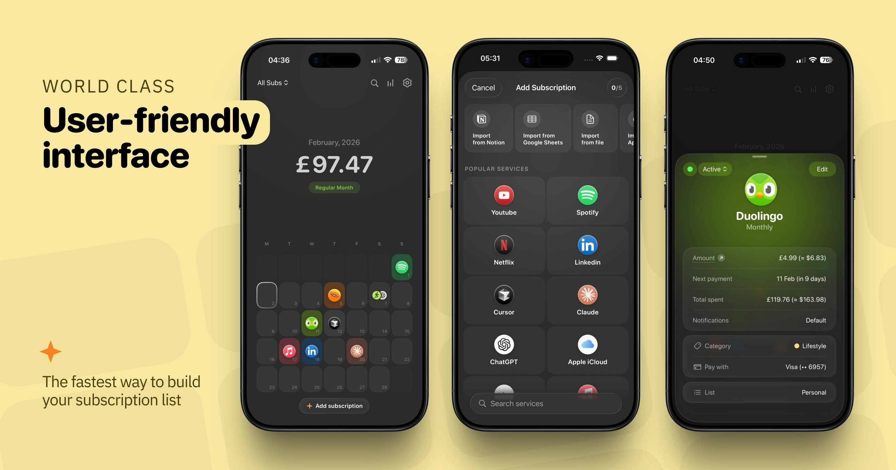
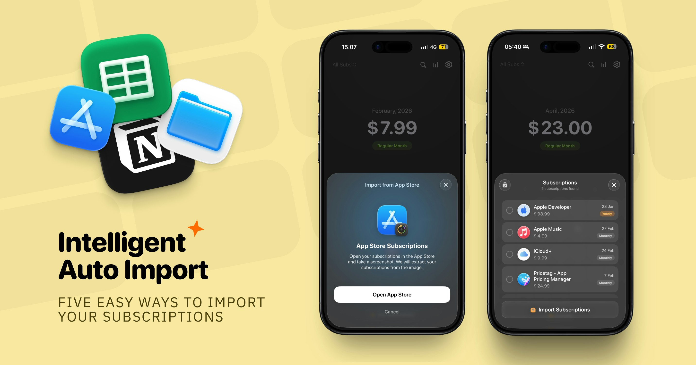

### 🎬 관련 영상
- [🎥 영상 보기](https://ph-files.imgix.net/9c3c8882-2d20-4c54-ba66-5e0235e7b125.jpeg?auto=format)

---

## 3. [Tines ](https://www.producthunt.com/products/tines?utm_campaign=producthunt-api&utm_medium=api-v2&utm_source=Application%3A+antigravity_test+%28ID%3A+258588%29)
**Votes**: 240 | **Tagline**: Build agents & automations integrated across your workspace

### 📌 요약
Tines는 특정 서비스에 종속되지 않고 보안이 보장된 환경에서 업무용 도구들을 연결해, 단순 자동화를 넘어 스스로 판단하고 실행하는 '지능형 에이전트'를 누구나 쉽게 만들 수 있게 해주는 혁신적인 플랫폼입니다.

### 🔑 핵심 기능
- 🎯 Target Audience: 높은 수준의 보안과 복잡한 워크플로우 자동화가 동시에 필요한 기업 내 IT, 보안 및 운영 팀
- ✨ Key Differentiator: 특정 벤더에 갇히지 않는 유연성과 강력한 보안을 바탕으로, 단순 반복 업무를 넘어 실제 '지능형 판단'이 필요한 영역까지 자동화 영역을 확장함
- 💡 Core Feature: 코딩 없이도 워크스페이스 전반의 앱들을 연결하고 모니터링하며, AI를 활용해 능동적으로 작동하는 에이전트를 구축할 수 있는 통합 워크플로우 빌더

### 📸 스크린샷 및 갤러리
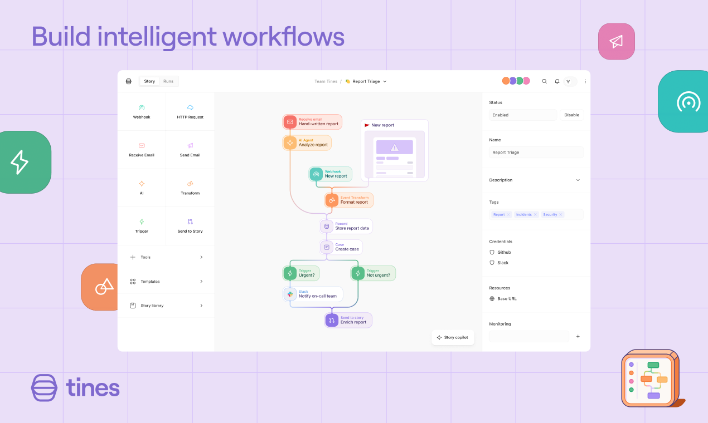
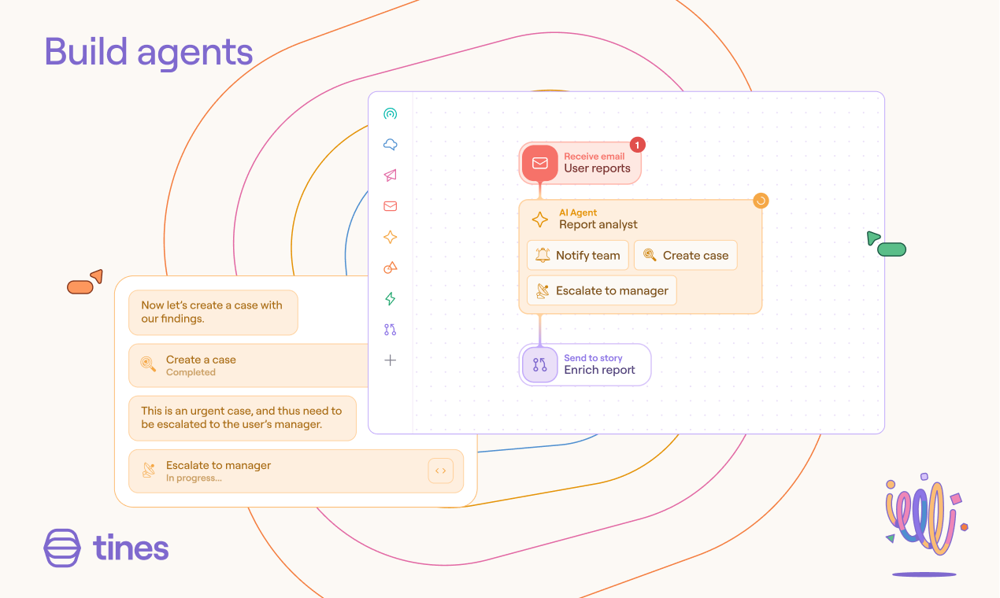
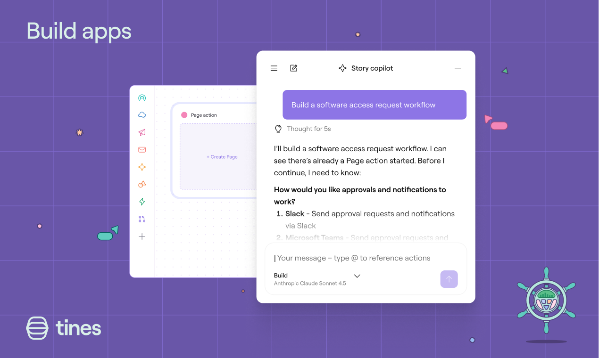

### 🎬 관련 영상
- [🎥 영상 보기](https://ph-files.imgix.net/2e08171e-eecc-4333-9436-2ba90e308feb.jpeg?auto=format)

---

## 4. [Revo AI Email Assistant](https://www.producthunt.com/products/revo-ai?utm_campaign=producthunt-api&utm_medium=api-v2&utm_source=Application%3A+antigravity_test+%28ID%3A+258588%29)
**Votes**: 231 | **Tagline**: AI with accurate replies that tackle the next-step tasks

### 📌 요약
단순한 문장 생성을 넘어 회의록, 슬랙, CRM 데이터를 통합해 맥락에 맞는 정확한 답장과 다음 실행 과제까지 제안하는 차세대 '지능형 이메일 레이어'입니다.

### 🔑 핵심 기능
- 🎯 Target Audience: 여러 협업 툴과 이메일 사이에서 정보를 찾느라 시간을 허비하는 바쁜 비즈니스 프로페셔널 및 영업·CS 관리자
- ✨ Key Differentiator: 단순히 글을 잘 쓰는 AI가 아니라, 내부 데이터(Slack, CRM)를 실시간 반영해 사용자가 정보를 따로 조회할 필요가 없는 높은 정확도
- 💡 Core Feature: 지메일과 아웃룩에 즉시 적용되어 파편화된 업무 맥락을 하나로 묶고 '다음 할 일'까지 이메일 답변에 녹여내는 인텔리전트 인박스 기능

### 📸 스크린샷 및 갤러리
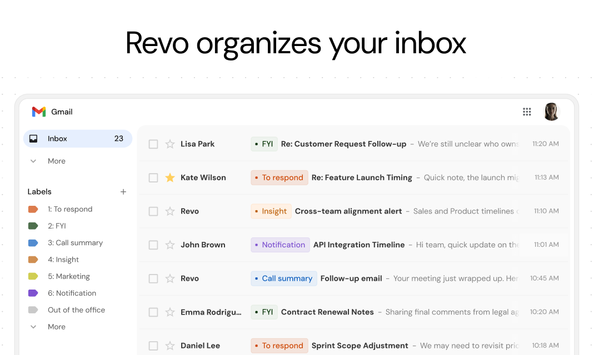
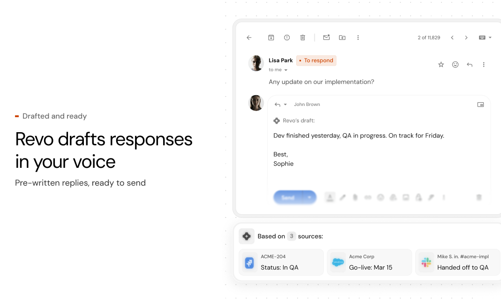
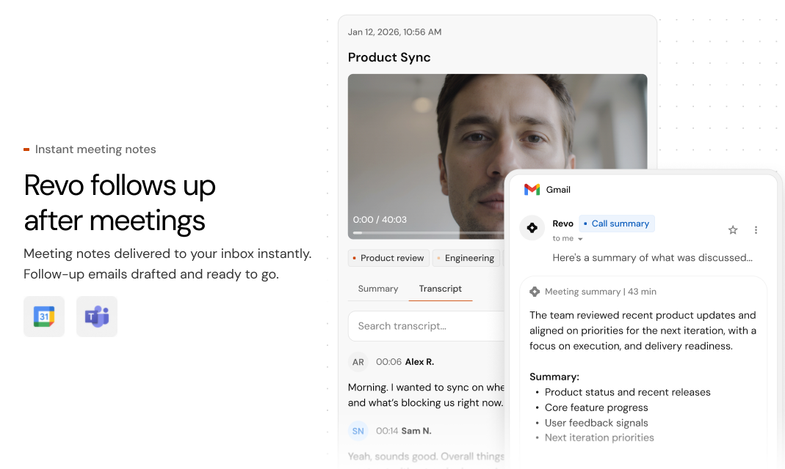

### 🎬 관련 영상
- [🎥 영상 보기](https://ph-files.imgix.net/26945c59-1c47-4ce2-bffc-b753f2c46cfb.jpeg?auto=format)

---

## 5. [Migma AI](https://www.producthunt.com/products/migma-ai?utm_campaign=producthunt-api&utm_medium=api-v2&utm_source=Application%3A+antigravity_test+%28ID%3A+258588%29)
**Votes**: 218 | **Tagline**: Make emails sexy again

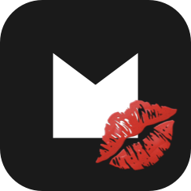

### 📌 요약
천편일률적인 스팸 이메일은 이제 그만! Migma AI는 AI를 활용해 디자인 고민 없이 클릭을 부르는 '힙한' 이메일을 제작하고, 원클릭 도메인 연결로 즉시 발송과 성과 측정까지 끝내는 차세대 이메일 마케팅 도구입니다.

### 🔑 핵심 기능
- 🎯 Target Audience: 디자인 감각이 부족하지만 높은 클릭률을 원하는 마케터와 복잡한 설정 없이 이메일 API가 필요한 개발자
- ✨ Key Differentiator: 무거운 기존 툴들과 달리 클릭 한 번으로 도메인을 연결하고, 즉시 API 접근이 가능한 압도적인 기동성
- 💡 Core Feature: AI 기반의 고전환율 이메일 디자인 생성 및 실시간 오픈율/클릭률에 대한 정밀한 트래킹 기능

### 📸 스크린샷 및 갤러리

### 🎬 관련 영상
- [🎥 영상 보기](https://ph-files.imgix.net/062dfdbc-0e2b-461a-b88a-1ad374f5f36c.jpeg?auto=format)

---

## 6. [Atyla](https://www.producthunt.com/products/atyla?utm_campaign=producthunt-api&utm_medium=api-v2&utm_source=Application%3A+antigravity_test+%28ID%3A+258588%29)
**Votes**: 216 | **Tagline**: The SEO tool for ChatGPT, Gemini and AI search engines

### 📌 요약
구글 검색의 시대가 저물고 AI 답변이 정보를 지배하는 지금, ChatGPT와 Perplexity 내에서 우리 브랜드의 존재감을 측정하고 키워주는 'GEO(생성 엔진 최적화)'의 핵심 도구입니다.

### 🔑 핵심 기능
- 🎯 Target Audience: AI 검색 엔진에서 브랜드 노출을 극대화하고 싶은 마케팅 팀과 브랜드 운영자
- ✨ Key Differentiator: 기존의 단순 검색 순위를 넘어, AI의 답변 맥락 속에서 브랜드가 어떻게 추천되는지 실시간으로 추적하고 경쟁사와 비교 분석합니다.
- 💡 Core Feature: AI 검색 결과 내 브랜드 언급 빈도 수치화 및 노출 비중을 높이기 위한 구체적인 생성 엔진 최적화(GEO) 전략 리포트 제공

### 📸 스크린샷 및 갤러리
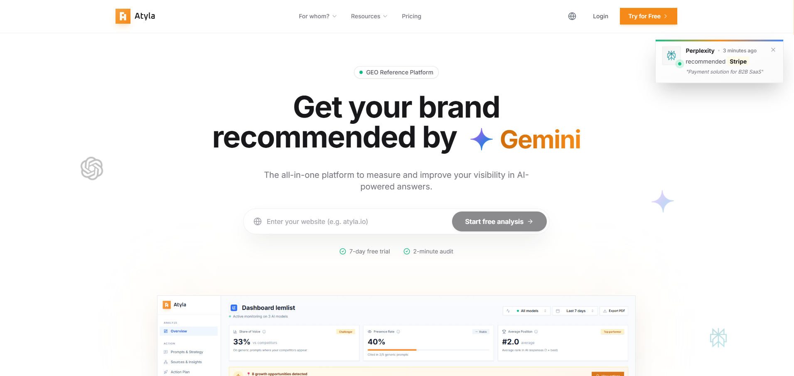
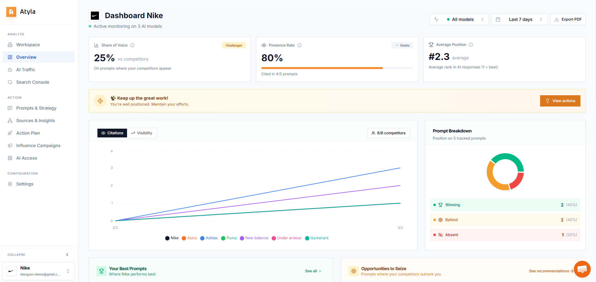

### 🎬 관련 영상
- [🎥 영상 보기](https://ph-files.imgix.net/c67b0cd1-e299-49b1-a578-1de80bb48673.jpeg?auto=format)

---

## 7. [Doraverse's All-in-One AI for Meetings](https://www.producthunt.com/products/doraverse-3?utm_campaign=producthunt-api&utm_medium=api-v2&utm_source=Application%3A+antigravity_test+%28ID%3A+258588%29)
**Votes**: 180 | **Tagline**: Meet in any language with live translations

### 📌 요약
언어 장벽 없는 글로벌 협업의 완성, 실시간 통역부터 후속 작업 자동화까지 회의의 전 과정을 책임지는 올인원 AI 비서입니다.

### 🔑 핵심 기능
- 🎯 Target Audience: 전 세계 동료들과 협업하는 글로벌 팀과 회의록 정리 및 후속 업무에 시달리는 모든 직장인
- ✨ Key Differentiator: 60개 이상의 언어 실시간 통역은 물론, 봇 참여 여부를 선택할 수 있는 유연성과 기업용 보안 표준을 기본으로 제공
- 💡 Core Feature: 실시간 스크립트 작성과 요약은 물론, 회의 중 궁금한 점을 즉시 물어볼 수 있는 온더스팟 AI 어시스턴트

### 📸 스크린샷 및 갤러리
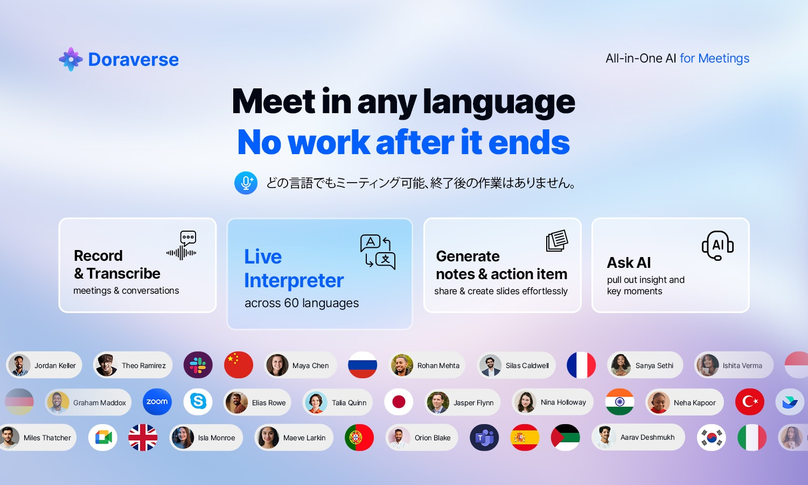
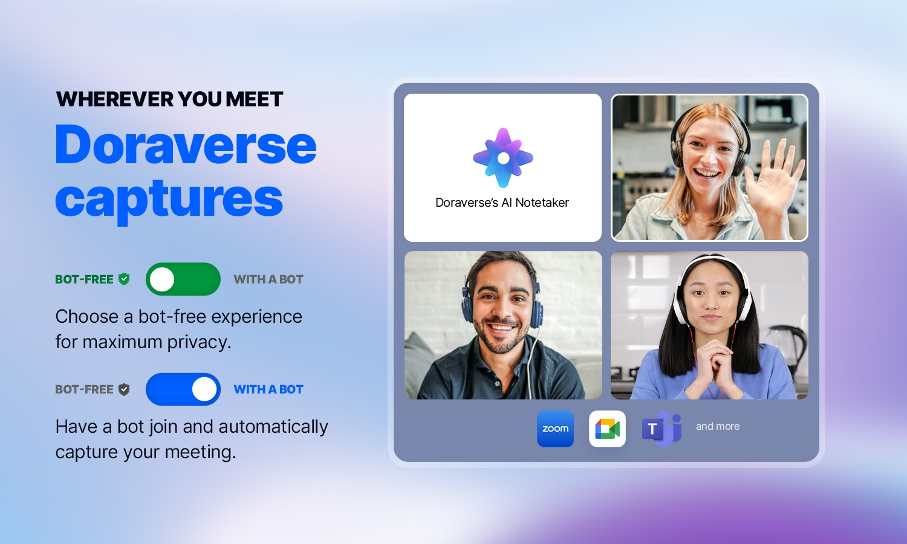
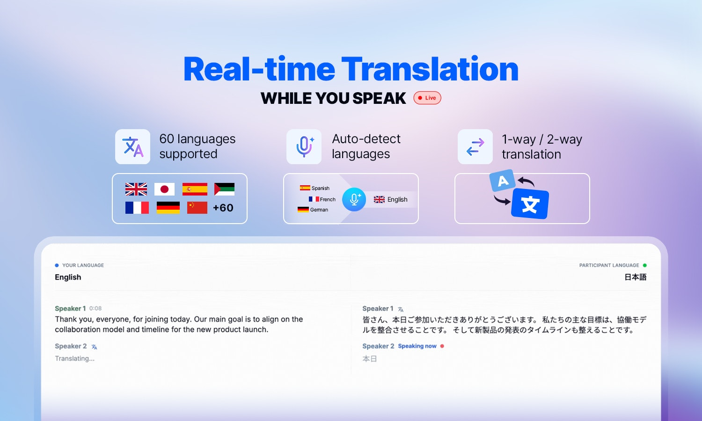

### 🎬 관련 영상
- [🎥 영상 보기](https://ph-files.imgix.net/c1731de6-b807-4111-b45f-6d745ef8d280.jpeg?auto=format)

---

## 8. [Oz by Warp](https://www.producthunt.com/products/warp?utm_campaign=producthunt-api&utm_medium=api-v2&utm_source=Application%3A+antigravity_test+%28ID%3A+258588%29)
**Votes**: 146 | **Tagline**: Run hundreds of cloud agents in parallel

### 📌 요약
터미널이나 스마트폰 터치 몇 번으로 수백 명의 AI 개발자를 동시에 고용한 효과를 내며, 자고 일어나면 완성된 PR을 눈앞에 가져다주는 클라우드 에이전트 오케스트레이션 플랫폼입니다.

### 🔑 핵심 기능
- 🎯 Target Audience: 대규모 인프라 관리나 반복적인 코드 수정 업무를 자동화하고 싶은 엔지니어링 팀과 효율을 극대화하려는 개발자
- ✨ Key Differentiator: 복잡한 설정 없이 Warp 터미널, CLI, 모바일 앱에서 수백 개의 에이전트를 병렬로 즉시 가동할 수 있는 압도적인 확장성과 접근성
- 💡 Core Feature: 수백 개의 클라우드 에이전트를 동시 실행하여 복잡한 작업을 처리하고, 즉시 머지 가능한 수준의 PR(Pull Request)을 자동 생성하는 기능

### 📸 스크린샷 및 갤러리
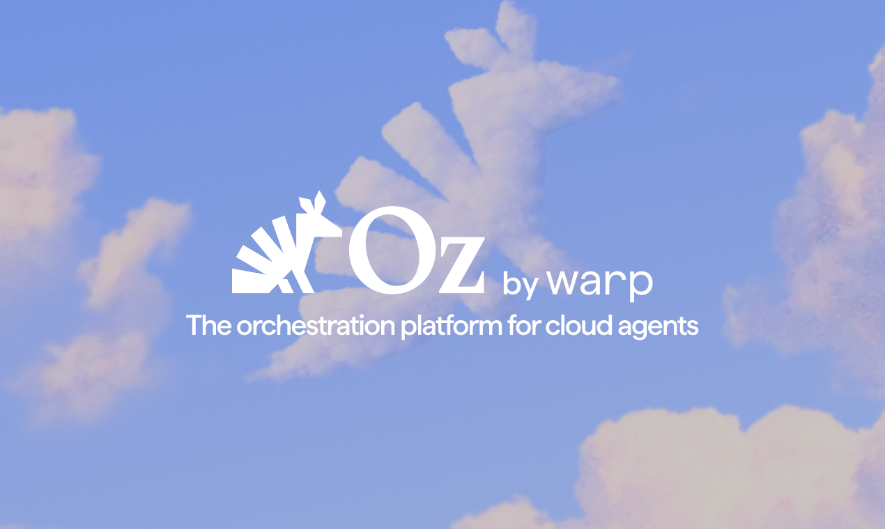
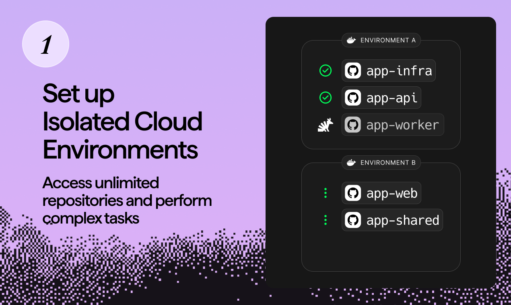
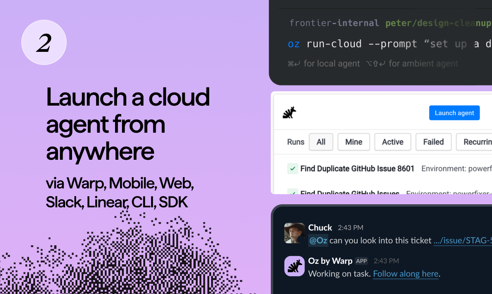

### 🎬 관련 영상
- [🎥 영상 보기](https://ph-files.imgix.net/f52993dc-4f02-4f12-8292-7d1940b41192.jpeg?auto=format)

---

## 9. [Willow for Developers](https://www.producthunt.com/products/willow-voice?utm_campaign=producthunt-api&utm_medium=api-v2&utm_source=Application%3A+antigravity_test+%28ID%3A+258588%29)
**Votes**: 140 | **Tagline**: Dictation for Cursor & AI IDEs, the fastest way to vibe code

### 📌 요약
이제 키보드 대신 말로 '바이브 코딩' 하세요! Willow는 Cursor 같은 AI IDE에서 개발 용어를 3배 더 정확하게 알아듣는 개발자 전용 음성 받아쓰기 도구입니다.

### 🔑 핵심 기능
- 🎯 Target Audience: Cursor, Antigravity 등 AI IDE를 활용해 코딩 속도를 극대화하고 싶은 얼리어답터 개발자
- ✨ Key Differentiator: 일반 음성 인식 대비 3배 높은 정확도는 물론, SQL이나 API 같은 전문 기술 용어와 약어를 찰떡같이 알아듣는 높은 이해도
- 💡 Core Feature: 파일 태깅을 통한 풍부한 맥락 전달 기능과 Mac/Windows를 모두 지원하는 초고속 프롬프트 입력 환경

### 📸 스크린샷 및 갤러리
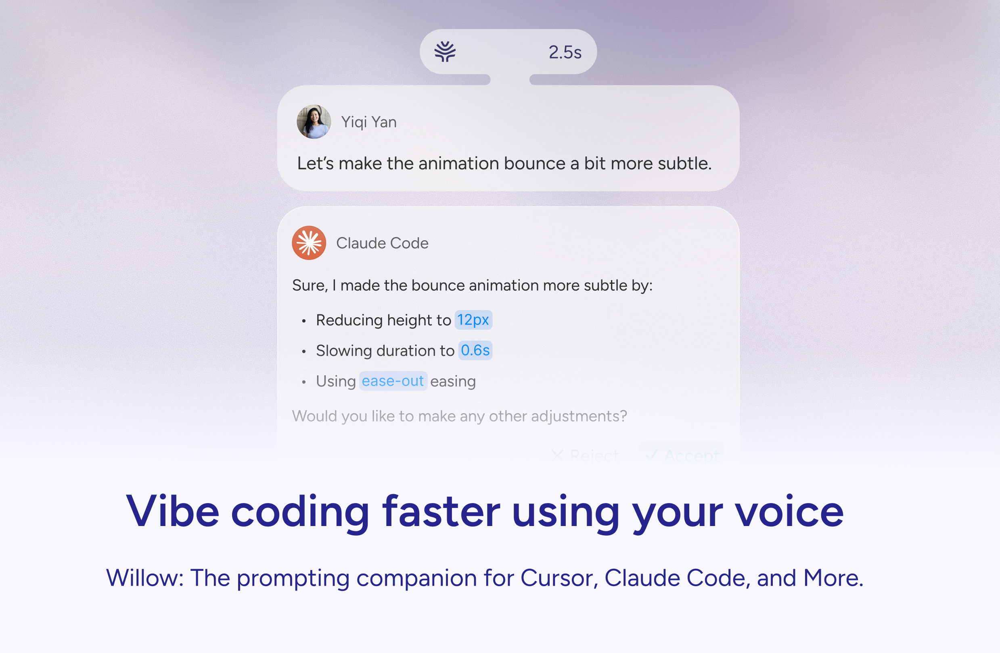
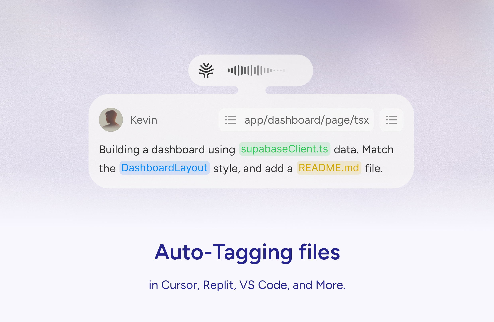
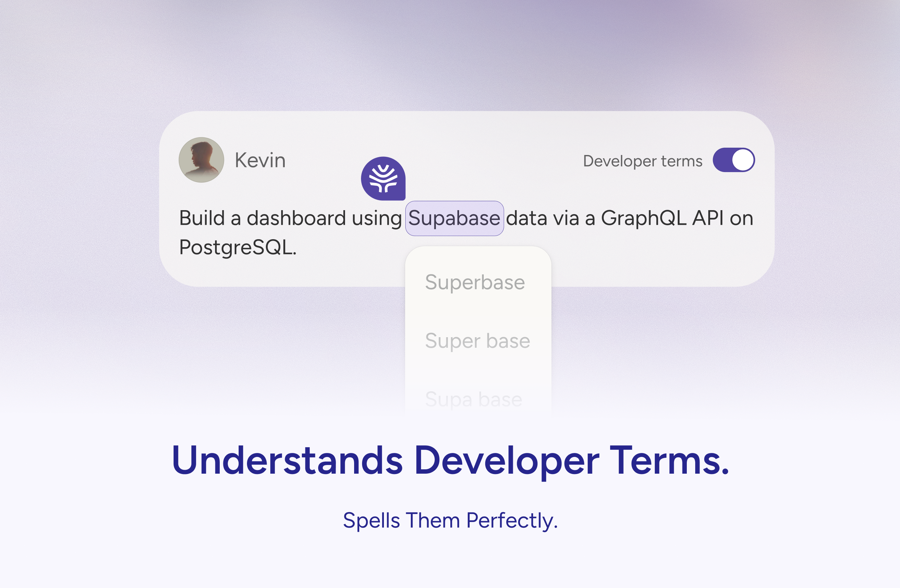

### 🎬 관련 영상
- [🎥 영상 보기](https://ph-files.imgix.net/2014fe1d-36b9-45ff-a89f-b7c3aca01ee9.jpeg?auto=format)

---

## 10. [JumprAI](https://www.producthunt.com/products/jumprai?utm_campaign=producthunt-api&utm_medium=api-v2&utm_source=Application%3A+antigravity_test+%28ID%3A+258588%29)
**Votes**: 123 | **Tagline**: Find any moment inside YouTube videos with AI search

### 📌 요약
유튜브 영상 속에서 내가 찾는 '그 장면'을 찾으려고 더 이상 타임라인을 헤매지 마세요. JumprAI는 문맥을 이해하는 AI로 영상 내용을 검색해 원하는 순간으로 즉시 점프시켜주는 강력한 도구입니다.

### 🔑 핵심 기능
- 🎯 Target Audience: 긴 강의 영상이나 튜토리얼, 팟캐스트에서 필요한 핵심 정보만 빠르게 골라보고 싶은 헤비 유튜버 시청자
- ✨ Key Differentiator: 단순 키워드 매칭이 아닌 문장의 의미를 파악하는 '시맨틱 검색'을 통해 "가장 웃긴 장면"처럼 추상적인 묘사로도 탐색 가능
- 💡 Core Feature: 별도의 사이트 이동 없이 유튜브 인터페이스 내에서 자연어 검색으로 특정 시점까지 즉시 이동하는 자동화 기능

### 📸 스크린샷 및 갤러리
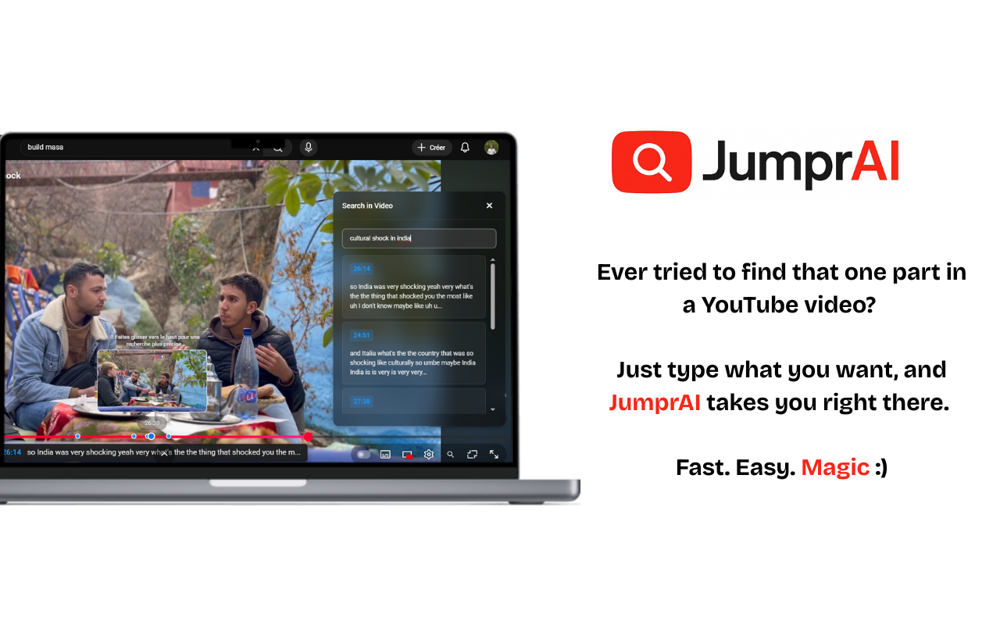
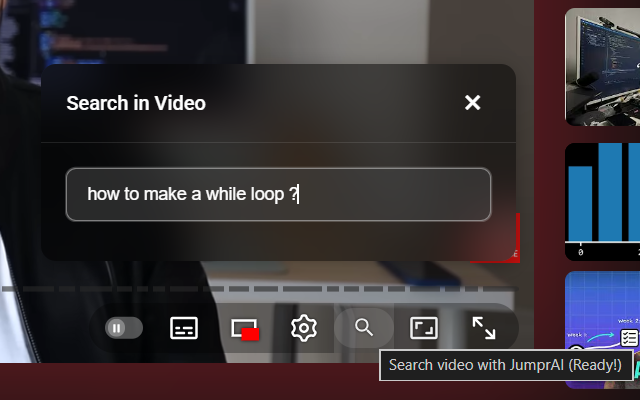
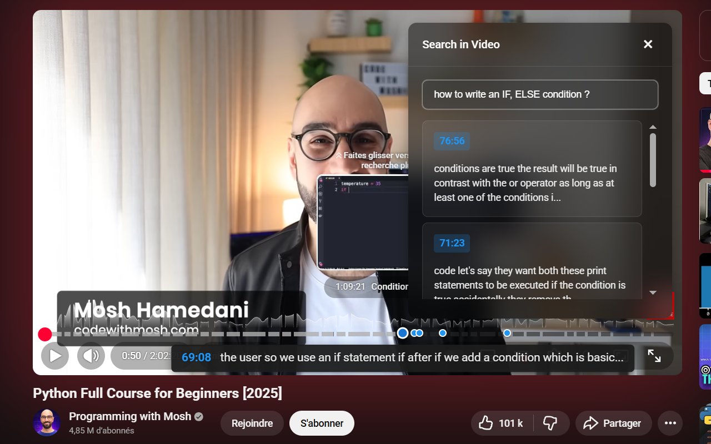

### 🎬 관련 영상
- [🎥 영상 보기](https://ph-files.imgix.net/532ed554-cd14-4640-9fe3-867315a0b0b1.jpeg?auto=format)

---

