# 🚀 Product Hunt Daily Top 10 (2026-02-12)

## 1. [Starnus](https://www.producthunt.com/products/starnus?utm_campaign=producthunt-api&utm_medium=api-v2&utm_source=Application%3A+antigravity_test+%28ID%3A+258588%29)
**Votes**: 363 | **Tagline**: Find and reach your next customers on autopilot

### 📌 요약
복잡한 콜드 메일과 잠재 고객 리스트 관리에 지친 분들을 위해, 프롬프트 하나로 타겟 발굴부터 맞춤형 제안까지 알아서 처리하는 'B2B 영업 자동화 비서'가 등장했습니다.

### 🔑 핵심 기능
- 🎯 Target Audience: 영업 인력이 부족한 초기 스타트업 파운더 및 효율적인 아웃바운드 확장이 필요한 B2B 마케팅 팀
- ✨ Key Differentiator: 여러 유료 툴을 번거롭게 연결할 필요 없이, AI 프롬프트를 통해 우리 제품을 좋아할 법한 '룩어라이크' 고객을 실시간으로 찾아내고 데이터 인리치먼트까지 한 번에 끝냅니다.
- 💡 Core Feature: ICP 정의부터 연락처 확보, 개인화된 메시지 생성 및 답장 추적까지 전 과정을 자동화하는 엔드 투 엔드(End-to-End) 워크플로우

### 📸 스크린샷 및 갤러리
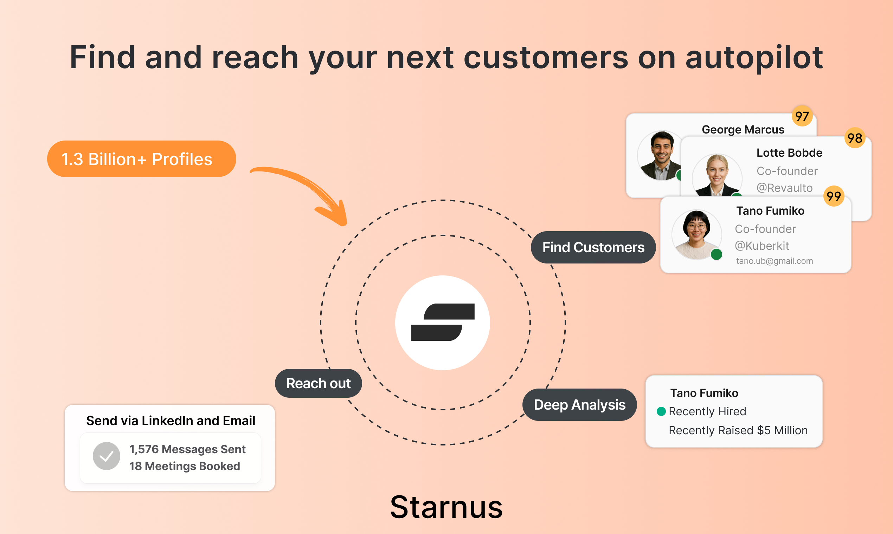
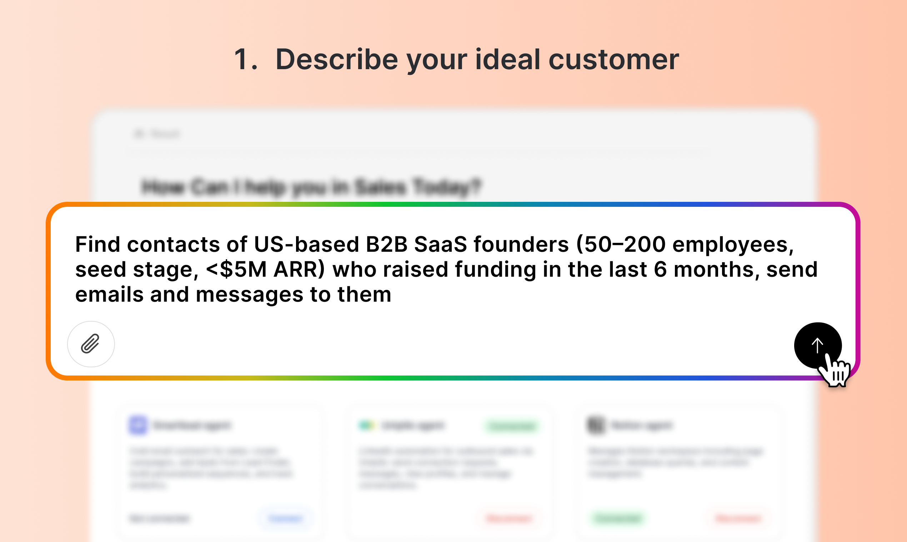
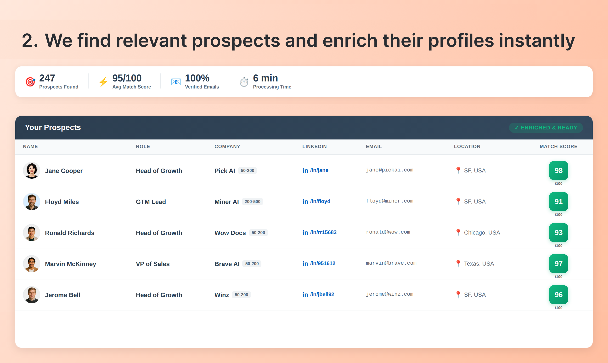

### 🎬 관련 영상
- [🎥 영상 보기](https://ph-files.imgix.net/6575c006-137a-4b8c-8754-699f82f27202.jpeg?auto=format)

---

## 2. [Gro](https://www.producthunt.com/products/gro-2?utm_campaign=producthunt-api&utm_medium=api-v2&utm_source=Application%3A+antigravity_test+%28ID%3A+258588%29)
**Votes**: 299 | **Tagline**: The best way to prospect and sell with AI

### 📌 요약
파편화된 영업 도구와 데이터 홍수 속에서 길을 잃은 세일즈 팀을 위해, 10억 개의 실시간 데이터를 기반으로 '진짜 구매할 고객'만 정밀 타격하는 가장 스마트한 AI 세일즈 엔진입니다.

### 🔑 핵심 기능
- 🎯 Target Audience: 고효율 아웃바운드 전략이 필요한 B2B 영업팀과 리소스가 부족한 성장기 스타트업
- ✨ Key Differentiator: 데이터 수출입이나 여러 툴을 오갈 필요 없이, 발굴부터 자동화까지 한 곳에서 끝내는 매끄러운 올인원 워크플로우
- 💡 Core Feature: AI 기반의 성향 점수(Propensity Scoring)와 의도 신호를 활용해 지금 당장 전환 가능성이 높은 리드를 찾아내는 정밀 타겟팅

### 📸 스크린샷 및 갤러리
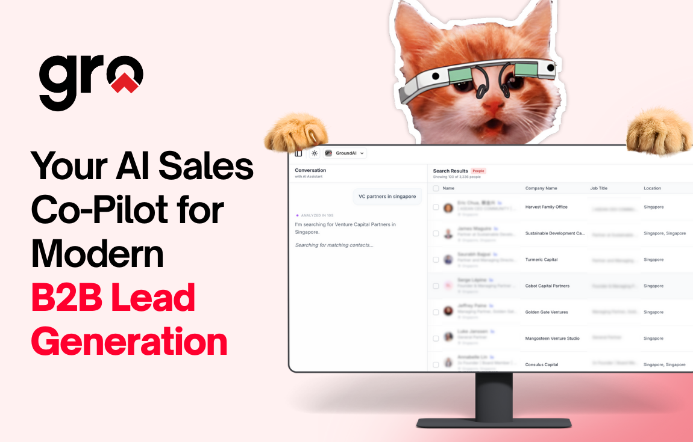
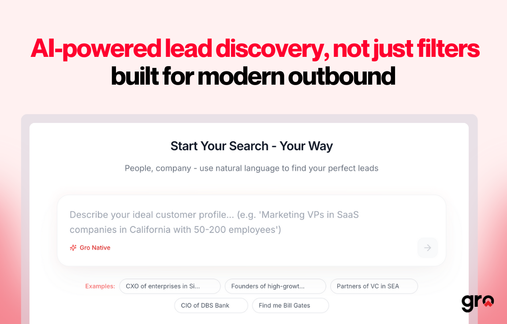
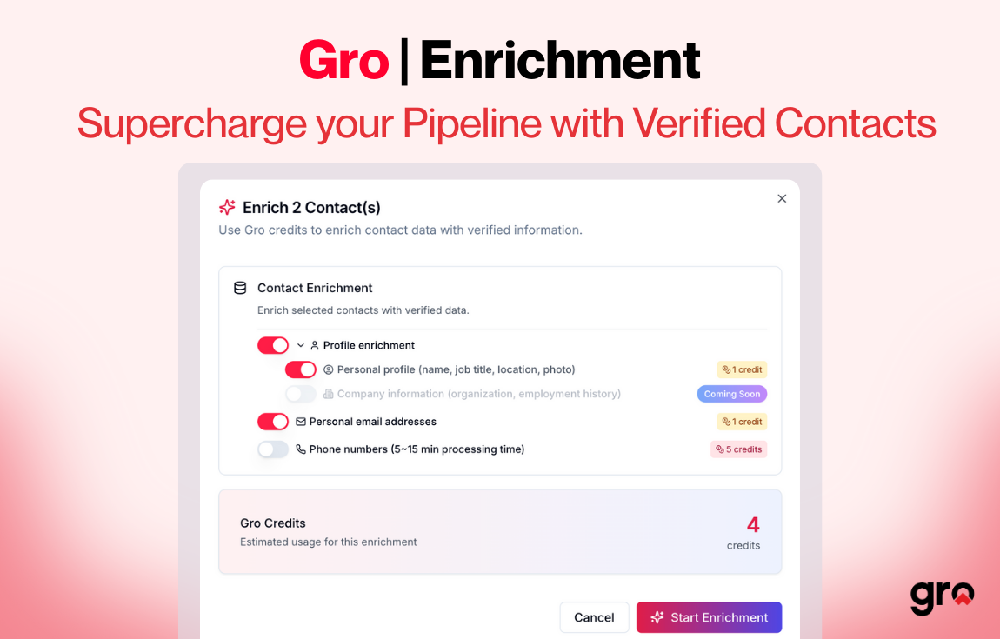

### 🎬 관련 영상
- [🎥 영상 보기](https://ph-files.imgix.net/191c2a9e-8d19-4611-bf5c-45540aac3c71.jpeg?auto=format)

---

## 3. [EditWithAva](https://www.producthunt.com/products/editwithava?utm_campaign=producthunt-api&utm_medium=api-v2&utm_source=Application%3A+antigravity_test+%28ID%3A+258588%29)
**Votes**: 248 | **Tagline**: Your AI assistant video editor

### 📌 요약
편집 지옥에서 해방될 시간! 내가 찍은 날것의 영상을 AI가 문맥 그대로 이해해서 베스트 컷만 골라내고, 자막과 배경음악까지 붙여 즉시 업로드 가능한 수준으로 완성해주는 똑똑한 비디오 비서입니다.

### 🔑 핵심 기능
- 🎯 Target Audience: 촬영은 좋아하지만 지루한 컷 편집과 리테이크 선별 과정에 진이 빠지는 유튜버 및 숏폼 크리에이터
- ✨ Key Differentiator: 시중에 흔한 '가짜 영상 생성기'와 달리, 사용자가 직접 찍은 원본의 내용을 의미론적으로 분석해 창작자의 의도에 딱 맞는 결과물을 도출
- 💡 Core Feature: 촬영본 속 실수 장면 자동 삭제, 맥락에 맞는 B-roll(삽입 영상) 매칭 및 자막·보이스오버를 결합한 원클릭 자동 편집 조립

### 📸 스크린샷 및 갤러리

### 🎬 관련 영상
- [🎥 영상 보기](https://ph-files.imgix.net/5384a8ab-efc0-4bee-8cc0-3c29f0f77c55.jpeg?auto=format)

---

## 4. [Lindy Assistant](https://www.producthunt.com/products/lindy?utm_campaign=producthunt-api&utm_medium=api-v2&utm_source=Application%3A+antigravity_test+%28ID%3A+258588%29)
**Votes**: 217 | **Tagline**: Proactive assistant that does tasks without being prompted

### 📌 요약
일일이 명령할 필요 없이 알아서 메일을 거르고 미팅을 준비해 주는, 진짜 '사람 같은' AI 개인 비서 Lindy가 등장했습니다.

### 🔑 핵심 기능
- 🎯 Target Audience: 쏟아지는 이메일과 미팅 일정 사이에서 매일 최소 2시간의 여유를 되찾고 싶은 모든 비즈니스 프로페셔널
- ✨ Key Differentiator: 사용자의 명령을 기다리는 수동적인 챗봇이 아니라, 스스로 상황을 판단하고 업무를 먼저 처리하는 '선제적(Proactive)' 시스템
- 💡 Core Feature: 중요도에 따른 이메일 자동 분류부터 미팅 자료 사전 준비 및 사후 팔로업까지 이어지는 빈틈없는 워크플로우 자동화

### 📸 스크린샷 및 갤러리
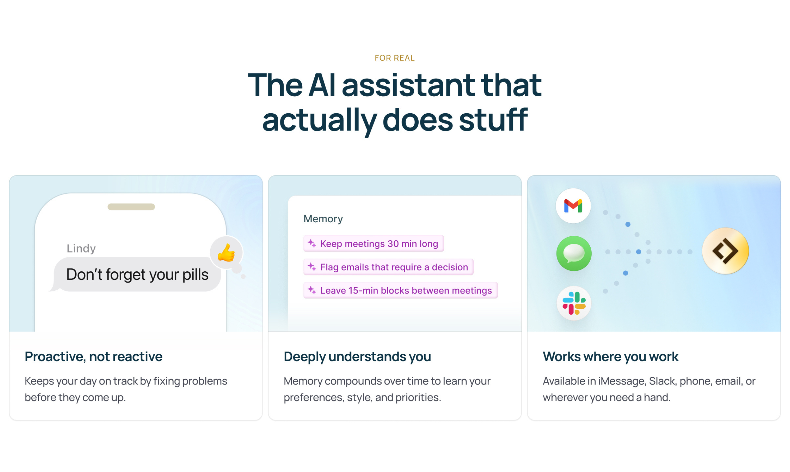
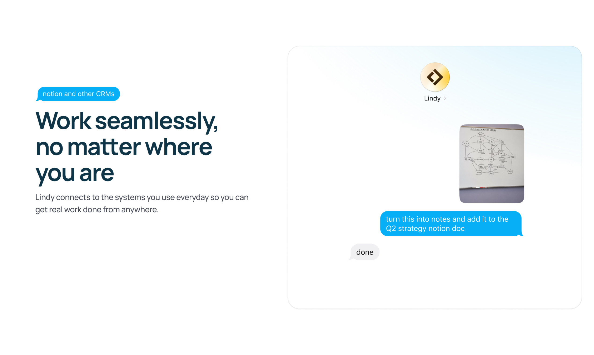
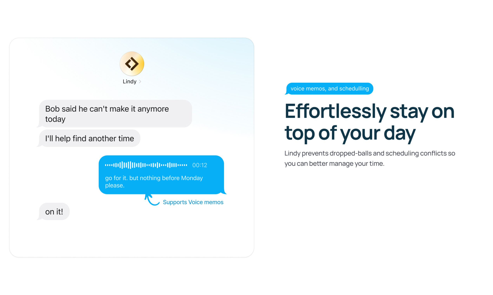

---

## 5. [Visual Editing by DatoCMS](https://www.producthunt.com/products/dato-cms?utm_campaign=producthunt-api&utm_medium=api-v2&utm_source=Application%3A+antigravity_test+%28ID%3A+258588%29)
**Votes**: 155 | **Tagline**: Visual editing for Headless CMS

### 📌 요약
Headless CMS의 자유로움은 유지하면서도, 실시간으로 화면을 보며 바로 수정하는 마법 같은 편집 경험을 개발자와 에디터 모두에게 선물합니다.

### 🔑 핵심 기능
- 🎯 Target Audience: Headless CMS의 복잡한 폼 입력 대신 직관적인 편집 환경을 원하는 콘텐츠 에디터와 이를 간단히 구축하고 싶은 개발자
- ✨ Key Differentiator: 단순히 미리보기를 제공하는 것을 넘어, 웹사이트 화면에서 수정하고 싶은 부분을 클릭하면 관리자 페이지의 해당 입력칸으로 즉시 연결되는 압도적인 편의성
- 💡 Core Feature: 실시간 업데이트와 드래프트 모드를 통해 코드를 건드리지 않고도 실제 사이트와 동일한 환경에서 콘텐츠를 즉각 수정하고 확인할 수 있는 비주얼 편집 기능

### 📸 스크린샷 및 갤러리
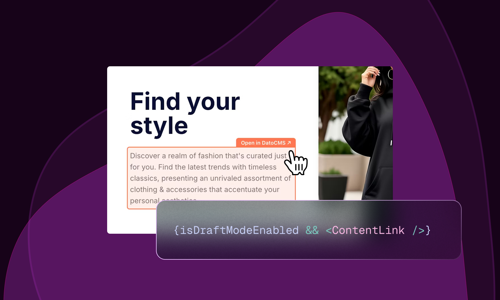
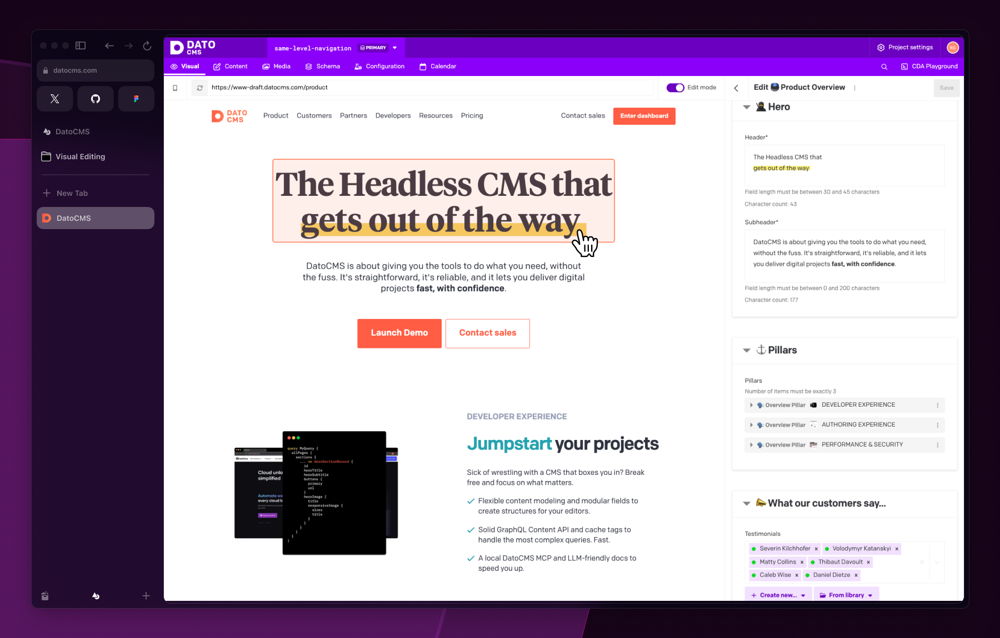
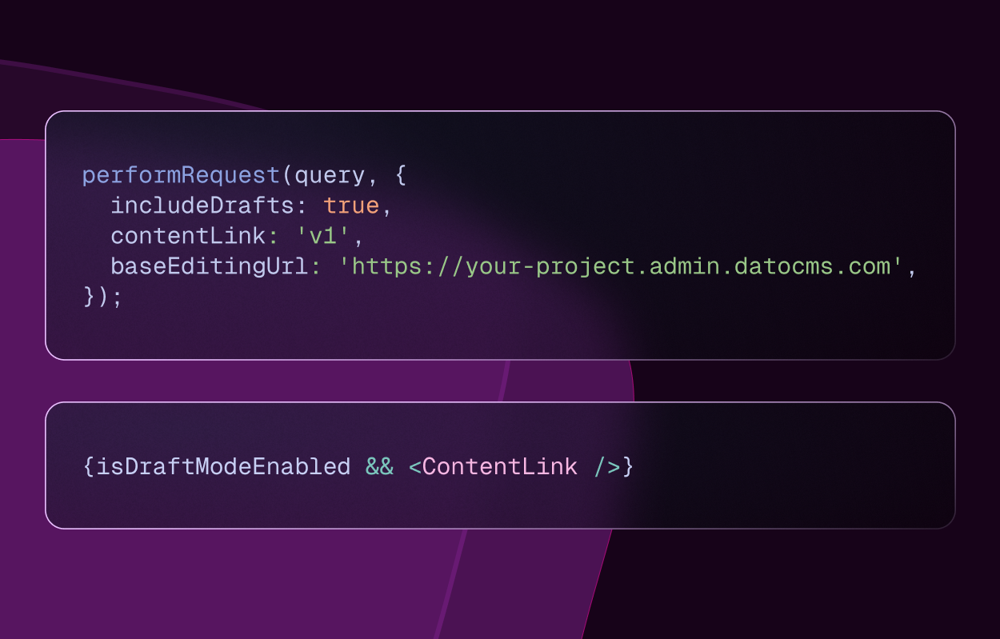

### 🎬 관련 영상
- [🎥 영상 보기](https://ph-files.imgix.net/e8c0afd6-fa62-4176-95de-d4e0b68ecdea.jpeg?auto=format)

---

## 6. [Edgee](https://www.producthunt.com/products/edgee?utm_campaign=producthunt-api&utm_medium=api-v2&utm_source=Application%3A+antigravity_test+%28ID%3A+258588%29)
**Votes**: 154 | **Tagline**: The AI Gateway that TL;DR tokens

### 📌 요약
코드 한 줄 고치지 않고 LLM 비용을 절반으로 뚝딱 줄여주는 AI 전용 '다이어트 게이트웨이', Edgee가 등장했습니다.

### 🔑 핵심 기능
- 🎯 Target Audience: 매달 청구되는 OpenAI, Anthropic 등의 API 토큰 요금이 부담스러운 개발자와 테크 스타트업
- ✨ Key Differentiator: 복잡한 로직 수정 없이 프롬프트를 실시간으로 압축해 즉각적인 비용 절감을 실현하는 플러그앤플레이 방식
- 💡 Core Feature: 프롬프트의 핵심 의미는 보존하면서 불필요한 토큰만 골라 제거해 최대 50%까지 지출을 줄여주는 지능형 압축 기술

### 📸 스크린샷 및 갤러리
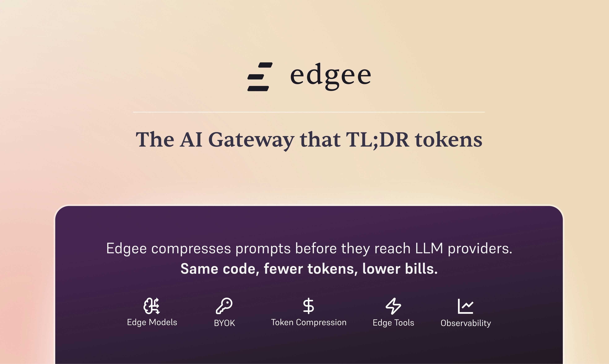
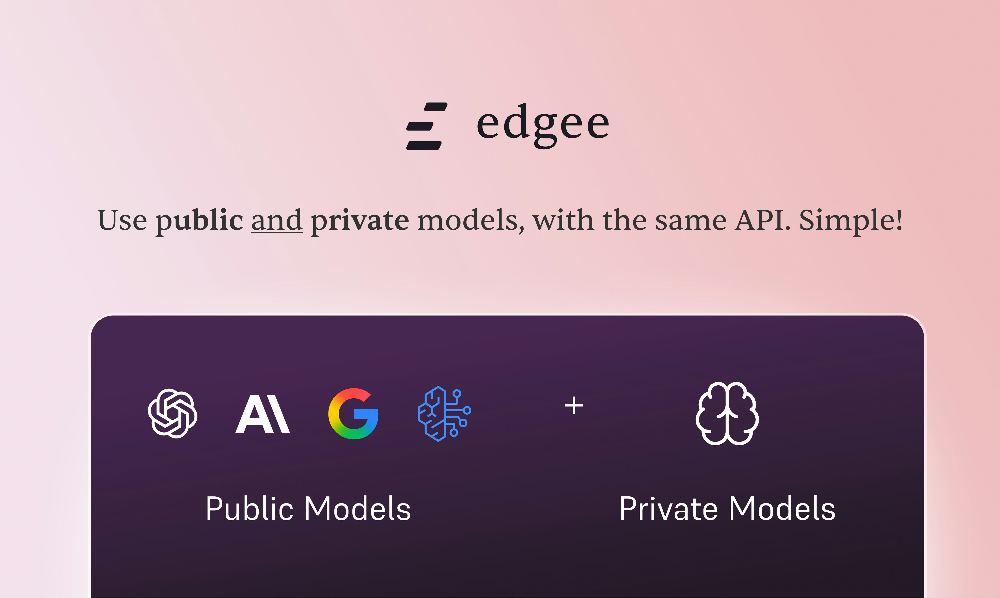
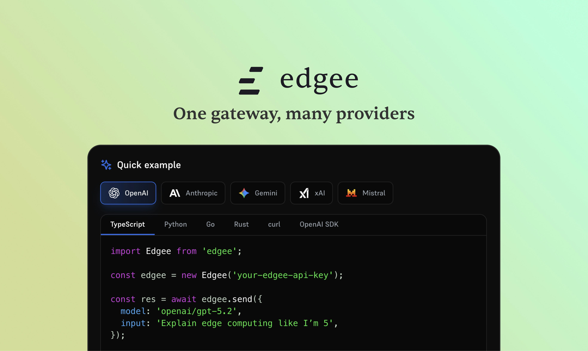

### 🎬 관련 영상
- [🎥 영상 보기](https://ph-files.imgix.net/a200c63a-80fd-4609-8da3-508046966a38.jpeg?auto=format)

---

## 7. [FocalRead ](https://www.producthunt.com/products/focalread-speed-read-anything?utm_campaign=producthunt-api&utm_medium=api-v2&utm_source=Application%3A+antigravity_test+%28ID%3A+258588%29)
**Votes**: 116 | **Tagline**: Turn articles, eBooks & social threads into speed reading

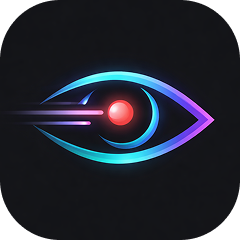

### 📌 요약
산더미처럼 쌓인 아티클과 전자책을 방치하고 있다면, RSVP 기술로 눈의 움직임을 최소화해 3배 더 빠르게 정보를 흡수하는 이 새로운 읽기 도구에 주목하세요.

### 🔑 핵심 기능
- 🎯 Target Audience: 읽어야 할 자료는 많지만 시간이 부족한 전문직 종사자와 학생, 그리고 긴 트위터(X) 스레드나 뉴스레터를 빠르게 훑어보고 싶은 정보 중독자들
- ✨ Key Differentiator: 단순히 텍스트를 나열하는 대신 한 단어씩 빠르게 보여주는 RSVP 방식을 채택했으며, 사파리 브라우저나 X(트위터), 레딧의 글을 즉시 불러와 끊김 없는 리딩 경험을 제공합니다.
- 💡 Core Feature: 분당 100단어부터 1,200단어까지 조절 가능한 초고속 읽기 기능과 PDF, EPUB, 웹 링크를 가리지 않는 강력한 콘텐츠 추출 및 변환 기능

### 📸 스크린샷 및 갤러리
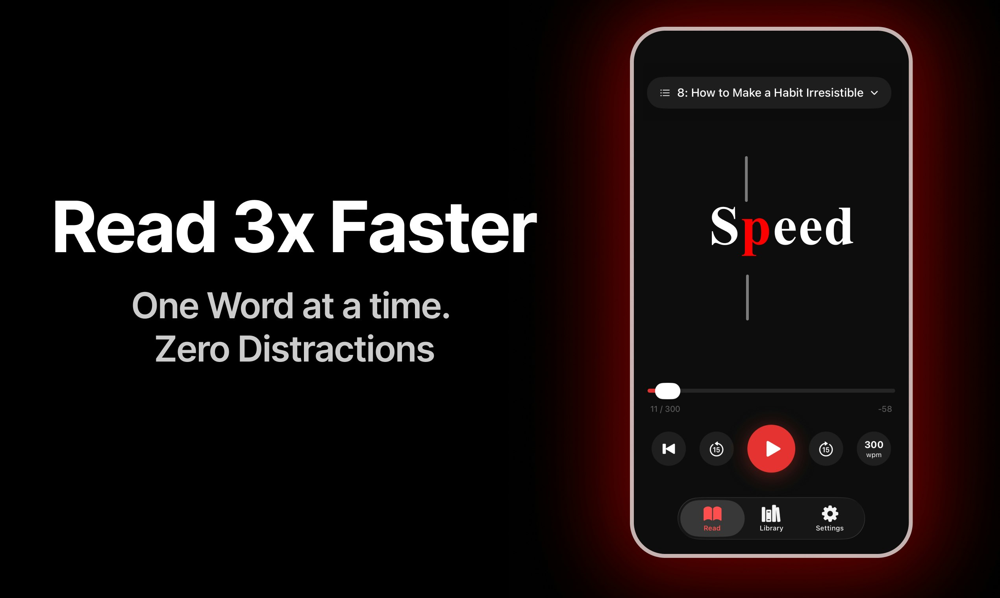
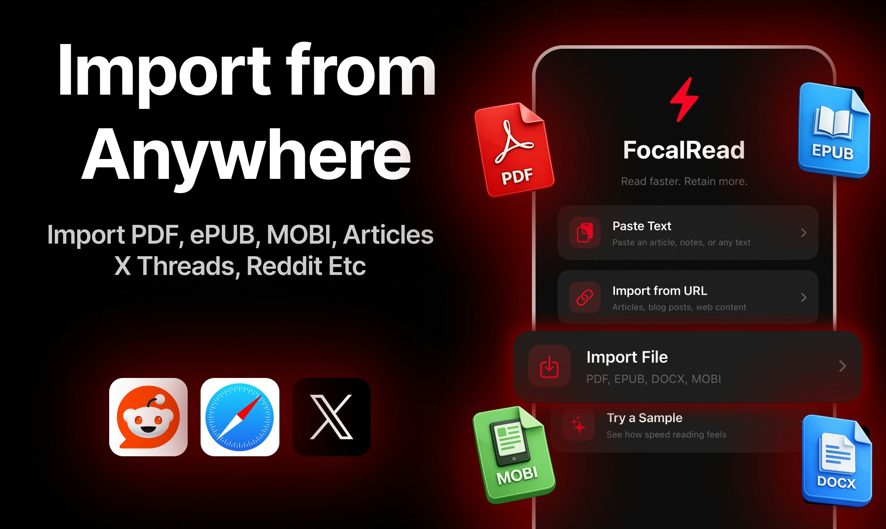
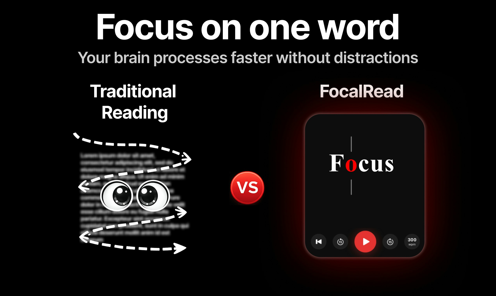

---

## 8. [Visla AI Director Mode](https://www.producthunt.com/products/visla?utm_campaign=producthunt-api&utm_medium=api-v2&utm_source=Application%3A+antigravity_test+%28ID%3A+258588%29)
**Votes**: 114 | **Tagline**: Continuous scene-by-scene AI video generation

### 📌 요약
비슬라(Visla) AI 디렉터 모드는 단순한 영상 생성을 넘어, 브랜드의 정체성과 캐릭터를 모든 장면에 일관되게 유지하며 디테일하게 연출할 수 있게 돕는 가장 진화된 AI 조감독입니다.

### 🔑 핵심 기능
- 🎯 Target Audience: 브랜드 아이덴티티 유지가 필수적인 마케터와 복잡한 영상 제작 공정을 효율화하려는 크리에이터
- ✨ Key Differentiator: AI 영상의 고질적 문제인 '장면 간 불일치'를 해결하고, 로고나 제품 같은 브랜드 자산을 모든 프레임에 고정해 완벽한 통일성을 제공합니다.
- 💡 Core Feature: AI가 짠 스토리보드를 바탕으로 연출 방향과 캐릭터를 세밀하게 조정한 뒤, 필요한 부분만 골라 고품질 영상으로 변환하는 정교한 시퀀스 제어

### 📸 스크린샷 및 갤러리
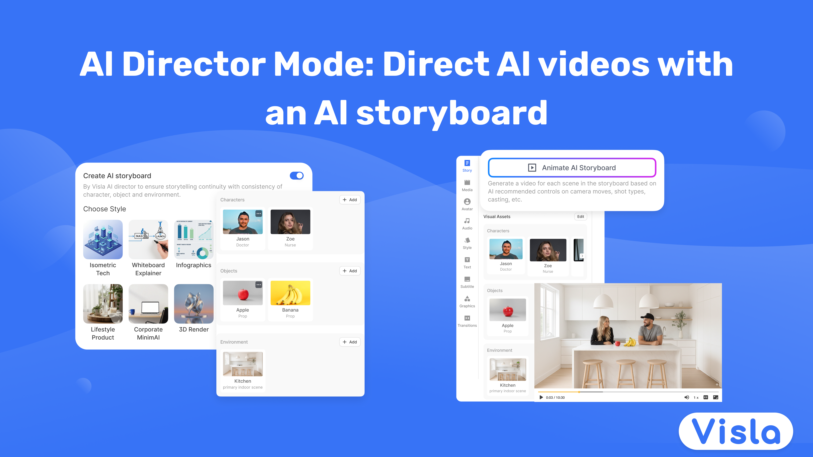
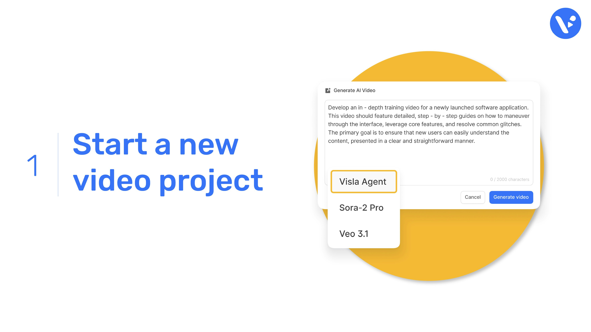
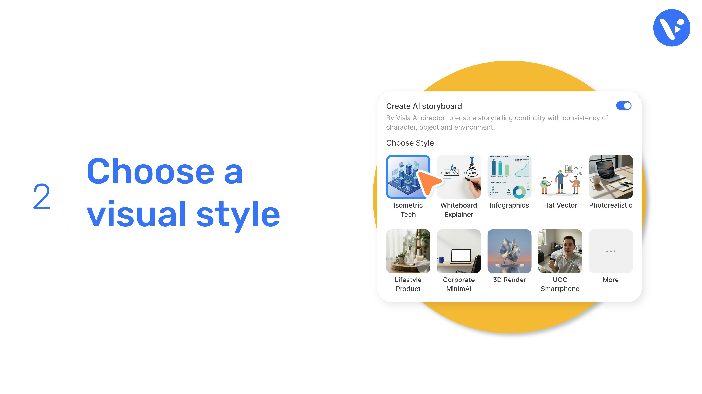

### 🎬 관련 영상
- [🎥 영상 보기](https://ph-files.imgix.net/18e18ca5-5dcf-4fc3-97b3-de1554026cc3.jpeg?auto=format)

---

## 9. [Scout Program](https://www.producthunt.com/products/scout-program?utm_campaign=producthunt-api&utm_medium=api-v2&utm_source=Application%3A+antigravity_test+%28ID%3A+258588%29)
**Votes**: 110 | **Tagline**: Fantasy Sports for Early-Stage Investing with real money

### 📌 요약
실제 자본으로 내 안목을 증명하고 싶은 투자자들을 위한 '실전 투자 판타지 리그'로, 단 한 시즌 만에 주니어에서 베테랑 VC 수준의 커리어를 쌓을 수 있는 가장 투명한 데뷔 무대입니다.

### 🔑 핵심 기능
- 🎯 Target Audience: 나만의 투자 논리를 증명하고 싶지만 운용할 자본이 없는 예비 벤처캐피털리스트와 엔젤 투자자
- ✨ Key Differentiator: 10년이 걸리는 평판 구축 과정을 단 한 시즌으로 압축하며, 폐쇄적인 벤처 투자 시장을 공개적인 실력 경쟁의 장으로 바꿉니다.
- 💡 Core Feature: 선정된 10명의 스카우트에게 각각 10만 달러의 실전 투자금을 지급하고, 투자 프로세스와 성과를 대중에게 실시간으로 투명하게 공개합니다.

### 📸 스크린샷 및 갤러리
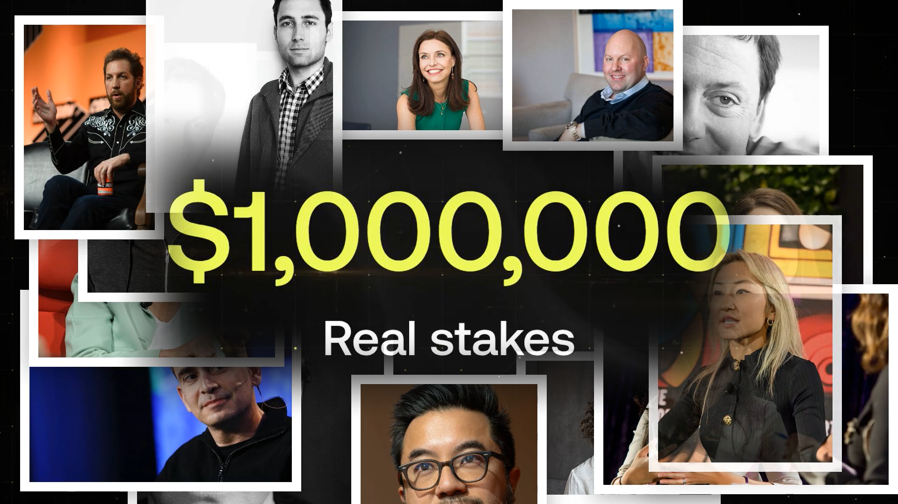
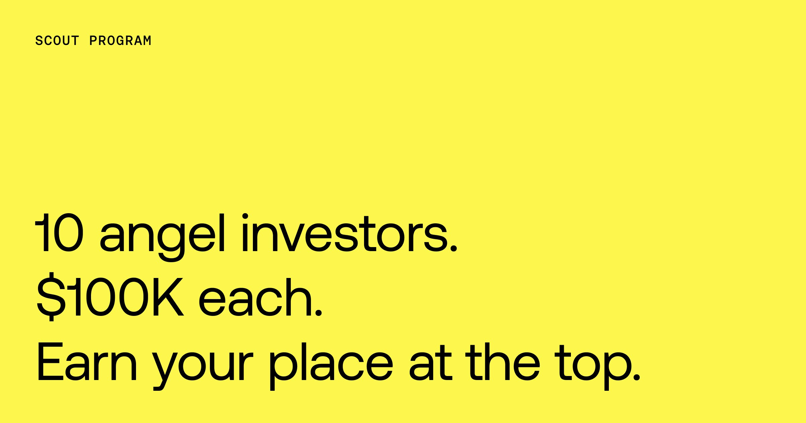
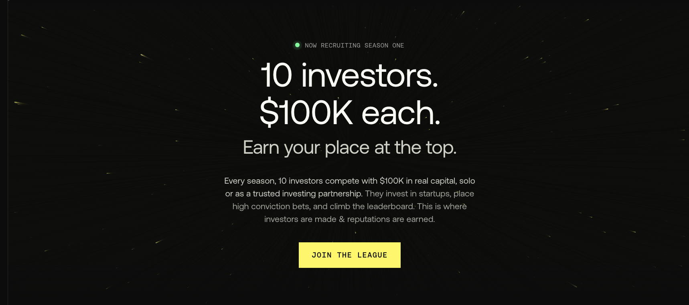

### 🎬 관련 영상
- [🎥 영상 보기](https://ph-files.imgix.net/a0f0ad4f-4a48-4bd4-976d-2850c57c572a.jpeg?auto=format)

---

## 10. [Cube](https://www.producthunt.com/products/cube-dev?utm_campaign=producthunt-api&utm_medium=api-v2&utm_source=Application%3A+antigravity_test+%28ID%3A+258588%29)
**Votes**: 102 | **Tagline**: AI agent that builds your data model and answers questions

### 📌 요약
데이터 분석 AI의 고질적인 문제인 '환각'을 잡기 위해, 데이터에 비즈니스 언어를 입혀주는 똑똑한 AI 에이전트 Cube가 등장했습니다.

### 🔑 핵심 기능
- 🎯 Target Audience: 데이터 모델링 시간을 아끼고 싶은 데이터 엔지니어와 정확한 지표 확인이 절실한 비즈니스 의사결정권자
- ✨ Key Differentiator: 로우 데이터(Raw data)를 직접 쿼리해 오류를 범하는 기존 툴과 달리, 1.9만 개 이상의 별을 받은 검증된 오픈소스 기반 '시맨틱 레이어'를 자동 구축해 신뢰도를 극대화했습니다.
- 💡 Core Feature: AI 에이전트가 복잡한 비즈니스 로직을 반영한 데이터 모델을 자동으로 설계하고, 자연어 질문에 대해 정확한 리포트와 답변을 초단위로 생성합니다.

### 📸 스크린샷 및 갤러리
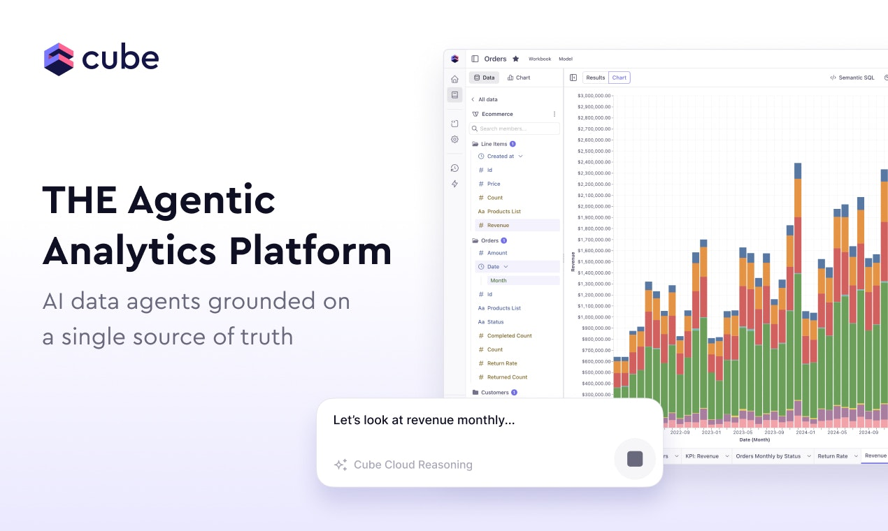
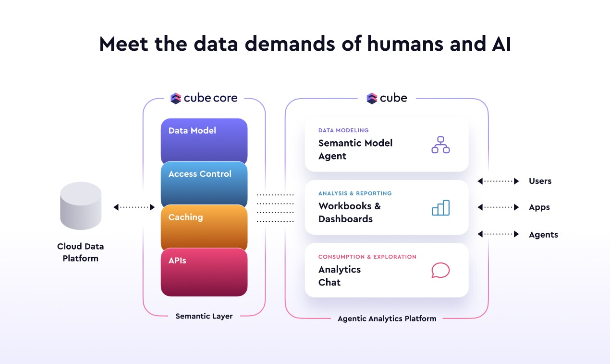

### 🎬 관련 영상
- [🎥 영상 보기](https://ph-files.imgix.net/1c35eaf4-bade-4b3e-9c0c-3e1bf4141ec9.jpeg?auto=format)

---

