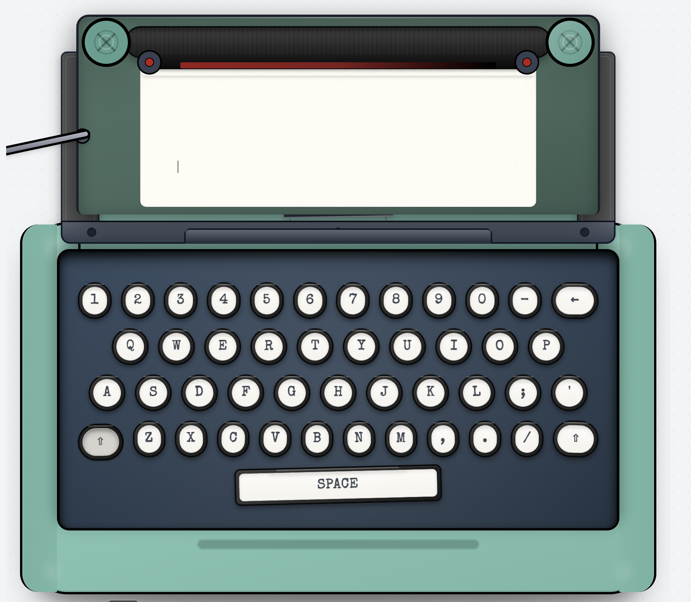
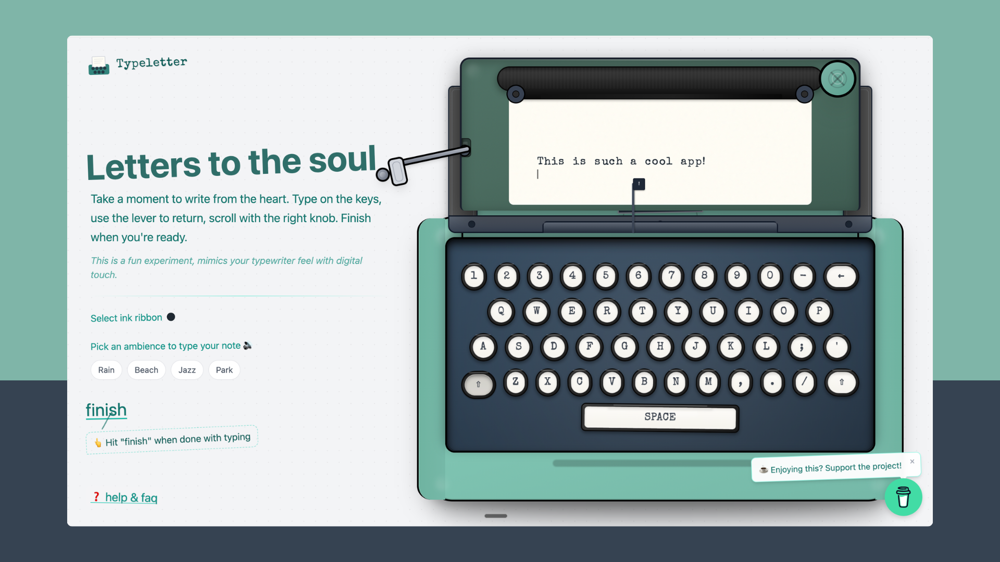
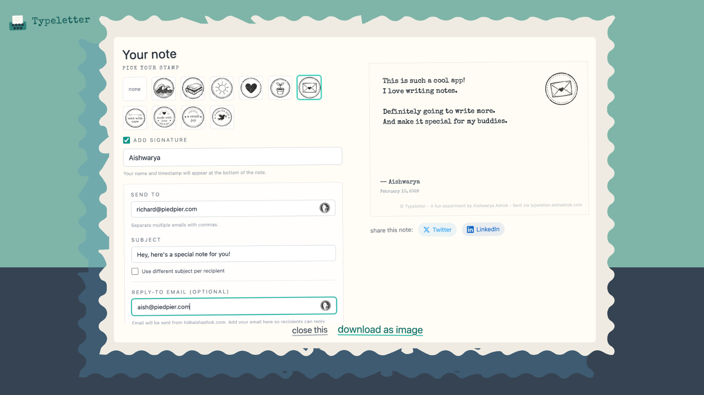
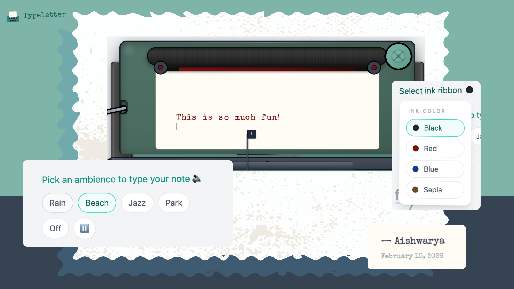

# 🚀 Product Hunt Daily Top 10 (2026-02-13)

## 1. [Lovon AI Therapy](https://www.producthunt.com/products/lovon?utm_campaign=producthunt-api&utm_medium=api-v2&utm_source=Application%3A+antigravity_test+%28ID%3A+258588%29)
**Votes**: 580 | **도입 난이도**: 중 | **신뢰도**: 중
**Tagline**: Talk it out and feel better

**태그**: AI, 헬스케어, NLP, 챗봇, AI Tool

### 📌 한 줄 요약
Lovon AI Therapy는 자연어 음성 기반 AI 상담 서비스로, 사용자의 심리적 지원을 24/7 제공합니다.

### 🔑 핵심 기능
- 자연어 음성 인터페이스를 통한 상담 제공
- 24시간 언제든 사용 가능한 심리 지원
- AI 기반 개인 맞춤형 상담 가능성

### 🧑‍💻 개발자 관점
자연어 처리 및 음성 인식 기술을 활용하여 사용자 친화적인 상담 경험을 제공하고, AI 기반 챗봇 개발에 대한 실질적인 인사이트를 얻을 수 있습니다.

### 🚀 바로 실험할 액션
- 음성 기반 상담 서비스 프로토타입 개발
- 자체 서비스에 간단한 멘탈 헬스 챗봇 연동 실험
- Lovon AI Therapy의 응답 패턴 분석 및 개선 방안 연구

### ⚠️ 리스크/한계
- AI 상담의 윤리적 문제 및 책임 소재 불분명
- 사용자 데이터 보안 및 개인 정보 보호 문제 발생 가능성
- AI의 공감 능력 부족으로 인한 상담 효과 미흡 가능성

### 🧭 불확실성 메모
Product Hunt 데이터만으로는 Lovon AI Therapy의 기술적 깊이와 성능을 정확히 파악하기 어렵습니다.

### 📸 스크린샷 및 갤러리

### 🎬 관련 영상
- [🎥 영상 보기](https://ph-files.imgix.net/4446dc2a-76b8-491b-902b-74355859200d.jpeg?auto=format)

---

## 2. [Meme Dealer](https://www.producthunt.com/products/meme-dealer-2?utm_campaign=producthunt-api&utm_medium=api-v2&utm_source=Application%3A+antigravity_test+%28ID%3A+258588%29)
**Votes**: 462 | **도입 난이도**: 중 | **신뢰도**: 중
**Tagline**: You are what you meme

**태그**: AI, Keyboard, Content Creation, UX, AI Tool, Chat

### 📌 한 줄 요약
AI 기반 밈 추천 키보드로, 사용자 입력/분위기에 맞는 밈을 즉시 제안하여 채팅 참여도를 높이고 컨텐츠 제작 시간을 단축합니다.

### 🔑 핵심 기능
- 키보드 내장형으로 앱 전환 불필요
- AI 기반 문맥/분위기 맞춤 밈 추천
- 실시간 채팅에 최적화된 빠른 전송

### 🧑‍💻 개발자 관점
사용자 참여도 및 콘텐츠 생산성 향상을 위한 AI 기반 기능 도입 가능성을 제시하며, 키보드 내장형 UX는 SDK 및 API 개발 방향에 대한 시사점을 제공합니다.

### 🚀 바로 실험할 액션
- 자사 서비스 내 텍스트 기반 반응형 콘텐츠 추천 기능 프로토타입 개발
- 키보드 SDK 또는 API 연동 가능성 검토
- 사용자 분위기/맥락 파악을 위한 자연어 처리 모델 연구

### ⚠️ 리스크/한계
- AI 밈 추천의 정확도 및 관련 법적 문제 발생 가능성
- 밈 콘텐츠 저작권 및 윤리적 문제 발생 가능성

### 🧭 불확실성 메모
제품 상세 정보가 제한적이므로, 기술적 구현 방식 및 AI 모델의 성능에 대한 추가 검토가 필요합니다.

### 📸 스크린샷 및 갤러리

### 🎬 관련 영상
- [🎥 영상 보기](https://ph-files.imgix.net/3507cd27-cd71-4791-a88a-fd40c1a340a8.jpeg?auto=format)

---

## 3. [ZenMux](https://www.producthunt.com/products/zenmux-2?utm_campaign=producthunt-api&utm_medium=api-v2&utm_source=Application%3A+antigravity_test+%28ID%3A+258588%29)
**Votes**: 408 | **도입 난이도**: 중 | **신뢰도**: 중
**Tagline**: An enterprise-grade LLM gateway with automatic compensation

**태그**: LLM, API Gateway, AI, DevTool, Automation, AI Tool, API

### 📌 한 줄 요약
ZenMux는 LLM 사용을 단순화하고 안정성을 높이는 엔터프라이즈급 LLM 게이트웨이로, 자동 보상 기능을 제공하여 개발자의 LLM 운영 부담을 줄여줍니다.

### 🔑 핵심 기능
- 통합 API 제공
- 스마트 라우팅
- 자동 보상 메커니즘

### 🧑‍💻 개발자 관점
개발팀은 ZenMux를 통해 LLM 모델의 복잡한 관리에서 벗어나, 더욱 안정적이고 효율적인 AI 기반 애플리케이션 개발에 집중할 수 있습니다.

### 🚀 바로 실험할 액션
- ZenMux 데모 API 호출 테스트
- 기존 LLM API 호출을 ZenMux API로 마이그레이션 테스트
- 자동 보상 메커니즘 작동 방식 확인

### ⚠️ 리스크/한계
- 자동 보상 메커니즘의 성능 검증 필요
- 엔터프라이즈급 기능에 대한 충분한 문서 확인 필요

### 🧭 불확실성 메모
제공된 메타데이터가 제한적이므로 실제 기능 및 성능은 다를 수 있습니다.

### 📸 스크린샷 및 갤러리

### 🎬 관련 영상
- [🎥 영상 보기](https://ph-files.imgix.net/1d6feabc-32d4-4a25-90f2-91b9b370af96.jpeg?auto=format)

---

## 4. [Code Arena](https://www.producthunt.com/products/arena-5?utm_campaign=producthunt-api&utm_medium=api-v2&utm_source=Application%3A+antigravity_test+%28ID%3A+258588%29)
**Votes**: 282 | **도입 난이도**: 중 | **신뢰도**: 중
**Tagline**: Prompt once. Compare multiple AI-built apps for free.

**태그**: DevTool, AI, 코드 생성, 자동화, 비교 분석, AI Tool, Prompting

### 📌 한 줄 요약
Code Arena는 하나의 프롬프트로 여러 AI 코딩 모델의 결과물을 동시에 비교하고, 실행 가능한 코드를 GitHub나 IDE로 내보낼 수 있어 개발 효율성을 높여줍니다.

### 🔑 핵심 기능
- 다양한 AI 코딩 모델 비교
- 멀티 파일 앱/웹사이트 생성
- GitHub 및 IDE 연동

### 🧑‍💻 개발자 관점
다양한 AI 모델의 코드 생성 능력을 비교하고 최적의 결과물을 빠르게 선택하여 개발 시간을 단축하고 코드 품질을 향상시킬 수 있습니다.

### 🚀 바로 실험할 액션
- 간단한 웹사이트 프로토타입 생성 비교
- 특정 알고리즘 구현에 대한 AI 모델별 코드 비교
- 기존 프로젝트 일부 기능의 AI 기반 자동 생성 실험

### ⚠️ 리스크/한계
- 생성된 코드의 품질과 보안 검증 필요
- AI 모델 성능에 따라 결과 편차 발생 가능

### 🧭 불확실성 메모
Product Hunt 상세 설명에만 의존하므로, AI 모델의 종류 및 연동 수준에 대한 정보가 불확실합니다.

### 📸 스크린샷 및 갤러리

### 🎬 관련 영상
- [🎥 영상 보기](https://ph-files.imgix.net/c8c0d12f-3698-4ec1-ab7f-8ff952fff6d3.jpeg?auto=format)

---

## 5. [GPT‑5.3‑Codex‑Spark](https://www.producthunt.com/products/openai?utm_campaign=producthunt-api&utm_medium=api-v2&utm_source=Application%3A+antigravity_test+%28ID%3A+258588%29)
**Votes**: 247 | **도입 난이도**: 중 | **신뢰도**: 중
**Tagline**: An ultra-fast model for real-time coding in Codex

**태그**: DevTool, AI, Code Generation, Real-time, Codex, Chat, API

### 📌 한 줄 요약
ChatGPT Pro 사용자를 위한 Codex 기반의 초고속 코딩 모델로, 실시간 협업 및 빠른 반복 작업에 최적화되어 개발 생산성을 극대화합니다.

### 🔑 핵심 기능
- Codex 대비 15배 빠른 코드 생성 속도
- 128k 컨텍스트 지원으로 복잡한 코드 작업 가능
- 실시간 인터럽트 및 리디렉션 기능으로 협업 효율성 향상

### 🧑‍💻 개발자 관점
짧은 대기 시간으로 즉각적인 피드백을 제공하여 개발자가 코드 작성 과정에서 더 빠르고 효율적으로 실험하고 반복할 수 있도록 돕습니다.

### 🚀 바로 실험할 액션
- ChatGPT Pro 계정으로 Codex-Spark 연구 미리보기 사용 신청
- 간단한 코드 스니펫 생성 및 수정 작업에 Codex-Spark 적용 후 성능 비교
- 팀 협업 환경에서 실시간 코드 편집 및 피드백 실험

### ⚠️ 리스크/한계
- 속도 최적화로 인해 복잡한 문제 해결 능력은 기존 모델 대비 낮을 수 있음
- 연구 미리보기 단계이므로 안정성 및 지원에 제한이 있을 수 있음

### 🧭 불확실성 메모
제품 설명이 제한적이므로 실제 성능 및 사용성은 다를 수 있습니다.

### 📸 스크린샷 및 갤러리

### 🎬 관련 영상
- [🎥 영상 보기](https://ph-files.imgix.net/078d5ff0-569b-4e6b-a673-d744e848e1b7.jpeg?auto=format)

---

## 6. [Walme Wallet](https://www.producthunt.com/products/walme-wallet?utm_campaign=producthunt-api&utm_medium=api-v2&utm_source=Application%3A+antigravity_test+%28ID%3A+258588%29)
**Votes**: 178 | **도입 난이도**: 중 | **신뢰도**: 중
**Tagline**: A unified hub for all your Web3 wallets

**태그**: Web3, Wallet, Crypto, Android, AI Tool

### 📌 한 줄 요약
Web3 지갑들을 통합 관리하고, 자산 추적 및 스왑 기능을 제공하여 사용자 편의성을 높이는 Android 앱 (iOS 예정)

### 🔑 핵심 기능
- 다양한 Web3 지갑 및 거래소 계정 통합 관리
- 멀티 체인 자산 추적 및 활동 모니터링
- 앱 내에서 토큰 스왑 기능 제공

### 🧑‍💻 개발자 관점
분산된 Web3 자산 관리의 복잡성을 줄여 사용자 경험을 개선하고, 개발팀은 사용자 편의 기능 개선에 집중할 수 있도록 돕습니다.

### 🚀 바로 실험할 액션
- 기존 Web3 지갑 연동 테스트
- 멀티 체인 자산 추적 기능 테스트
- 토큰 스왑 기능의 안정성 및 수수료 확인

### ⚠️ 리스크/한계
- 보안 취약점 발생 가능성 (지갑 통합 및 스왑 기능)
- 지원하는 체인 및 거래소의 제한

### 🧭 불확실성 메모
Product Hunt 메타데이터만으로 판단하여 기능의 실제 성능 및 안정성에 대한 정보는 부족합니다.

### 📸 스크린샷 및 갤러리

### 🎬 관련 영상
- [🎥 영상 보기](https://ph-files.imgix.net/21e9b96a-ec69-486a-8227-dd8d72dfc0fa.jpeg?auto=format)

---

## 7. [Atomic Bot](https://www.producthunt.com/products/atomic-bot?utm_campaign=producthunt-api&utm_medium=api-v2&utm_source=Application%3A+antigravity_test+%28ID%3A+258588%29)
**Votes**: 172 | **도입 난이도**: 하 | **신뢰도**: 중
**Tagline**: One-click OpenClaw macOS app

**태그**: DevTool, Automation, LLM, macOS

### 📌 한 줄 요약
Atomic Bot은 OpenClaw를 원클릭으로 실행할 수 있게 해주는 macOS 앱으로, 로컬 또는 클라우드에서 LLM 키를 활용하여 사용 가능하며 오픈소스 및 무료로 제공되어 LLM 기반 자동화 테스트/실험 환경 구축에 용이합니다.

### 🔑 핵심 기능
- OpenClaw 원클릭 실행
- 로컬/클라우드 LLM 지원
- 오픈소스 및 무료

### 🧑‍💻 개발자 관점
개발팀은 Atomic Bot을 통해 OpenClaw를 간편하게 활용하여 LLM 기반의 다양한 실험 및 자동화 작업을 효율적으로 수행하고, 자체 LLM 키를 사용하여 보안 및 유연성을 확보할 수 있습니다.

### 🚀 바로 실험할 액션
- OpenClaw를 활용한 간단한 자동화 테스트 구축
- 자체 LLM 키를 연동하여 성능 테스트 진행
- 오픈소스 코드 분석 및 커스터마이징 검토

### ⚠️ 리스크/한계
- OpenClaw 자체의 안정성 및 성능에 의존적
- LLM 키 관리에 대한 책임 필요

### 🧭 불확실성 메모
Product Hunt listing 메타데이터만으로는 OpenClaw의 구체적인 기능과 Atomic Bot의 실제 성능을 정확히 파악하기 어렵습니다.

### 📸 스크린샷 및 갤러리

### 🎬 관련 영상
- [🎥 영상 보기](https://ph-files.imgix.net/ad00e971-dcff-4d6e-8495-b913989a2378.gif?auto=format)

---

## 8. [GLM-5](https://www.producthunt.com/products/z-ai?utm_campaign=producthunt-api&utm_medium=api-v2&utm_source=Application%3A+antigravity_test+%28ID%3A+258588%29)
**Votes**: 142 | **도입 난이도**: 중 | **신뢰도**: 중
**Tagline**: Open-weights model for long-horizon agentic engineering

**태그**: AI, Agent, Open Source, MoE, RL

### 📌 한 줄 요약
복잡한 시스템 및 에이전트 작업을 위한 744B MoE 오픈 소스 모델로, Claude Opus 4.5와의 성능 격차를 좁히고 Vending Bench 2에서 1위를 차지함.

### 🔑 핵심 기능
- 744B MoE 모델 (40B 활성)
- DeepSeek Sparse Attention
- "slime" RL 인프라

### 🧑‍💻 개발자 관점
장기적인 에이전트 기반 엔지니어링 작업 자동화에 활용 가능하며, 특히 복잡한 시스템 개발 및 관리에 잠재력을 제공합니다.

### 🚀 바로 실험할 액션
- 간단한 에이전트 기반 자동화 스크립트 작성 및 테스트
- Vending Bench 2 벤치마크 결과 재현 시도
- 기존 시스템에 slime RL 인프라 연동 가능성 검토

### ⚠️ 리스크/한계
- 744B 모델 규모로 인해 높은 컴퓨팅 자원 요구
- 오픈 소스 모델의 지속적인 유지보수 및 업데이트 불확실성

### 🧭 불확실성 메모
제공된 메타데이터가 제한적이므로 실제 성능 및 적용 가능성은 추가적인 검증이 필요합니다.

### 📸 스크린샷 및 갤러리

---

## 9. [Product Front](https://www.producthunt.com/products/product-front?utm_campaign=producthunt-api&utm_medium=api-v2&utm_source=Application%3A+antigravity_test+%28ID%3A+258588%29)
**Votes**: 134 | **도입 난이도**: 하 | **신뢰도**: 중
**Tagline**: A place to get discovered faster and discover new products

**태그**: Product Discovery, Marketing, Launch, Design

### 📌 한 줄 요약
Product Front는 제품 출시 후 묻히는 문제를 해결하고, 사용자 발견 가능성을 높여주는 가시성 중심의 제품 디스커버리 플랫폼입니다.

### 🔑 핵심 기능
- 제품 출시 후 빠른 발견 가능성 향상
- 직관적인 UI/UX 디자인
- 주간 재출시 기능 제공

### 🧑‍💻 개발자 관점
개발팀은 Product Front를 통해 개발한 제품을 더 많은 잠재 사용자에게 노출시켜 초기 사용자 확보 및 피드백 수집에 용이하게 활용할 수 있습니다.

### 🚀 바로 실험할 액션
- 출시 예정인 제품 Product Hunt에 등록하기
- 기존 출시 제품 Product Front에 등록하여 재발견 기회 얻기
- Product Front의 주간 재출시 기능 활용 전략 수립

### ⚠️ 리스크/한계
- Product Hunt 외 플랫폼 효과 미지수
- 유료 'Top 5' 기능 부재로 인한 노출 효과 제한 가능성

### 🧭 불확실성 메모
제품의 실제 효과 및 사용자 반응은 추가적인 사용 데이터 분석을 통해 검증해야 합니다.

### 📸 스크린샷 및 갤러리

### 🎬 관련 영상
- [🎥 영상 보기](https://ph-files.imgix.net/e6c92014-ea13-4b3b-a3ba-785c4903c38f.jpeg?auto=format)

---

## 10. [Typeletter](https://www.producthunt.com/products/typeletter-letters-to-the-soul?utm_campaign=producthunt-api&utm_medium=api-v2&utm_source=Application%3A+antigravity_test+%28ID%3A+258588%29)
**Votes**: 123 | **도입 난이도**: 하 | **신뢰도**: 중
**Tagline**: Turn your browser into a cozy, nostalgic writing nook

**태그**: UI/UX, Web Audio API, Canvas, CSS, 아날로그 감성, AI Tool, Vision, Email

### 📌 한 줄 요약
브라우저를 타자기처럼 만들어주는 웹 앱으로, 간단한 글쓰기 경험을 제공하며 완성된 글을 이미지로 다운로드하거나 이메일로 보낼 수 있습니다.

### 🔑 핵심 기능
- 타자기와 유사한 사용자 인터페이스 제공
- 다양한 잉크 색상 및 배경 분위기 선택 가능
- 별도의 설정이나 회원 가입 없이 바로 사용 가능

### 🧑‍💻 개발자 관점
글쓰기 기능을 간단하게 구현해야 하는 경우, 사용자에게 몰입감 있는 UI/UX를 제공하는 방법을 참고할 수 있습니다. 특히, 사운드 및 시각 효과를 통해 아날로그 감성을 디지털 환경에 접목하는 아이디어를 얻을 수 있습니다.

### 🚀 바로 실험할 액션
- 캔버스 기반 이미지 생성 라이브러리 조사 (글자 및 왁스 스탬프 표현)
- Web Audio API를 활용한 타자기 소리 구현 방법 연구
- CSS를 이용한 아날로그 UI 구현 기술 습득

### ⚠️ 리스크/한계
- 특정 브라우저 또는 환경에서 호환성 문제가 발생할 수 있음
- 이미지 기반의 글은 검색 엔진 최적화(SEO)에 불리할 수 있음

### 🧭 불확실성 메모
제공된 정보가 제한적이므로, 실제 기능 및 기술 스택은 다를 수 있습니다.

### 📸 스크린샷 및 갤러리

### 🎬 관련 영상
- [🎥 영상 보기](https://ph-files.imgix.net/7ba47cb2-a56f-4b5e-8990-3e6bb27d65fd.jpeg?auto=format)

---

