# 🚀 Product Hunt Daily Top 10 (2026-02-13)

## 1. [Lovon AI Therapy](https://www.producthunt.com/products/lovon?utm_campaign=producthunt-api&utm_medium=api-v2&utm_source=Application%3A+antigravity_test+%28ID%3A+258588%29)
**Votes**: 505 | **Tagline**: Talk it out and feel better

### 📌 요약
답답한 속마음을 텍스트로 치는 대신, 친구에게 전화하듯 편하게 말로 털어놓고 즉각적인 위로를 받을 수 있는 '진짜 대화형' AI 심리 상담 서비스입니다.

### 🔑 핵심 기능
- 🎯 Target Audience: 상담 예약이 부담스럽거나 늦은 밤 누군가에게 마음을 털어놓고 싶은 감정적 지원이 필요한 모든 분들
- ✨ Key Differentiator: 딱딱한 챗봇과 타이핑하는 번거로움 없이, 실제 사람과 대화하듯 자연스러운 음성 상호작용으로 몰입감을 높였습니다.
- 💡 Core Feature: 24시간 언제 어디서나 내 감정을 읽어주고 실시간 음성으로 피드백을 주는 '상시 대기 상담' 기능

### 📸 스크린샷 및 갤러리
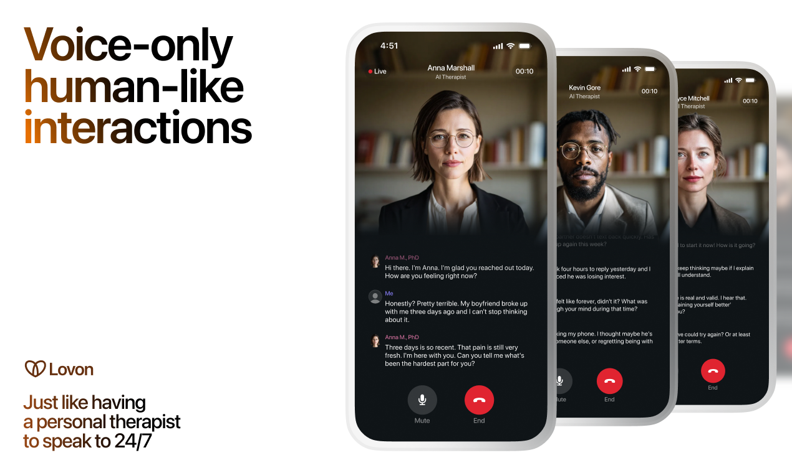
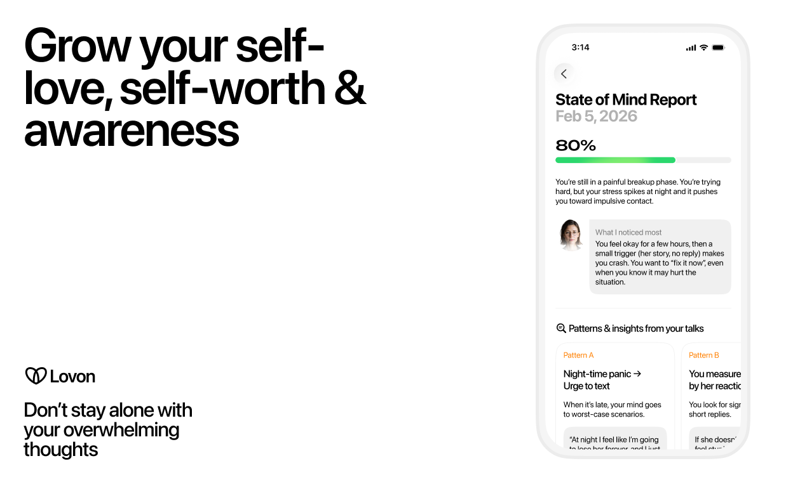
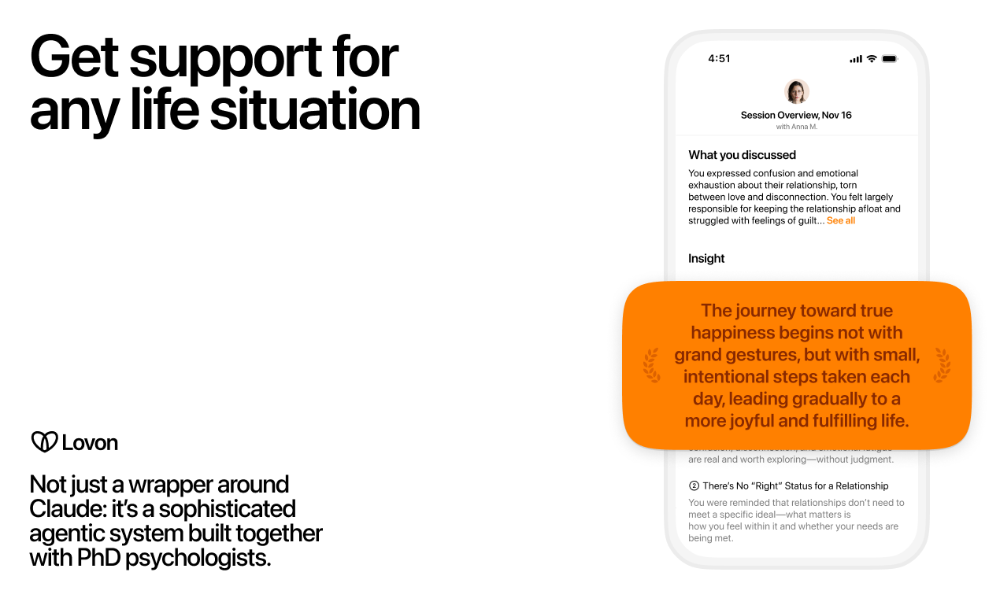

### 🎬 관련 영상
- [🎥 영상 보기](https://ph-files.imgix.net/4446dc2a-76b8-491b-902b-74355859200d.jpeg?auto=format)

---

## 2. [Meme Dealer](https://www.producthunt.com/products/meme-dealer-2?utm_campaign=producthunt-api&utm_medium=api-v2&utm_source=Application%3A+antigravity_test+%28ID%3A+258588%29)
**Votes**: 350 | **Tagline**: You are what you meme

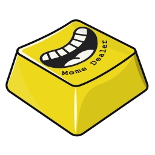

### 📌 요약
단톡방에서 '짤'로 기선제압을 하고 싶은 분들을 위한 끝판왕 도구로, AI가 대화의 맥락을 읽고 상황에 딱 맞는 짤을 실시간으로 제안해주는 지능형 키보드 앱입니다.

### 🔑 핵심 기능
- 🎯 Target Audience: 단톡방 대화를 경쟁 스포츠처럼 즐기며, 1초라도 빨리 적재적소에 짤을 던져 '드립'의 주도권을 잡고 싶은 분들
- ✨ Key Differentiator: 갤러리를 뒤지는 번거로움 없이 키보드 안에서 즉시 해결하며, AI가 상황별 무드(Roast, Cope, Hype 등)에 맞춰 최적의 짤을 큐레이션해줍니다.
- 💡 Core Feature: 별도의 앱 전환이 필요 없는 키보드 네이티브 인터페이스와 대화 흐름을 끊지 않는 초고속 실시간 짤 전송 기능

### 📸 스크린샷 및 갤러리
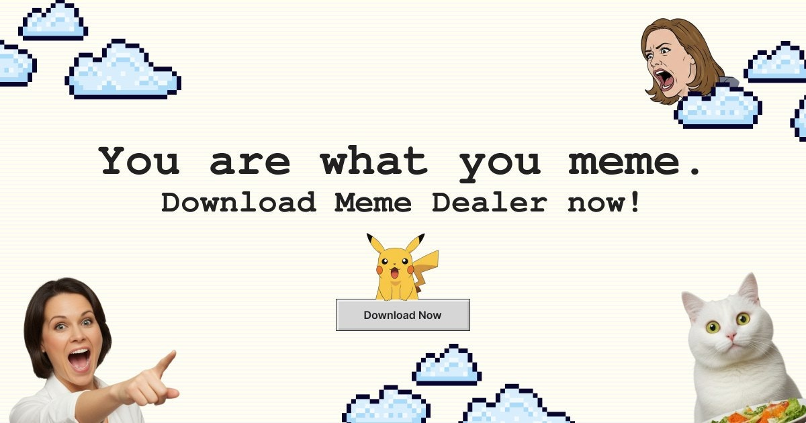
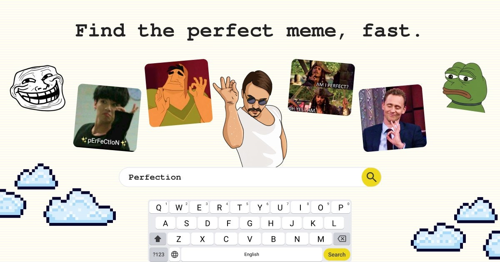

### 🎬 관련 영상
- [🎥 영상 보기](https://ph-files.imgix.net/3507cd27-cd71-4791-a88a-fd40c1a340a8.jpeg?auto=format)

---

## 3. [ZenMux](https://www.producthunt.com/products/zenmux-2?utm_campaign=producthunt-api&utm_medium=api-v2&utm_source=Application%3A+antigravity_test+%28ID%3A+258588%29)
**Votes**: 294 | **Tagline**: An enterprise-grade LLM gateway with automatic compensation

### 📌 요약
여러 LLM을 번갈아 쓰며 발생하는 복잡한 API 관리와 서비스 중단 걱정을 한 번에 해결하고, 문제 발생 시 자동 보상까지 지원하는 든든한 AI 미들웨어입니다.

### 🔑 핵심 기능
- 🎯 Target Audience: 멀티 LLM 전략을 사용하면서 시스템의 안정성과 운영 효율을 동시에 잡고 싶은 기업 개발팀
- ✨ Key Differentiator: 장애 발생 시 자동으로 대응하는 업계 최초의 보상 메커니즘으로 '절대 죽지 않는' AI 서비스 구축 가능
- 💡 Core Feature: 단일 API 엔드포인트를 통해 여러 모델을 통합 관리하고 최적의 성능과 비용을 찾아주는 스마트 라우팅

### 📸 스크린샷 및 갤러리
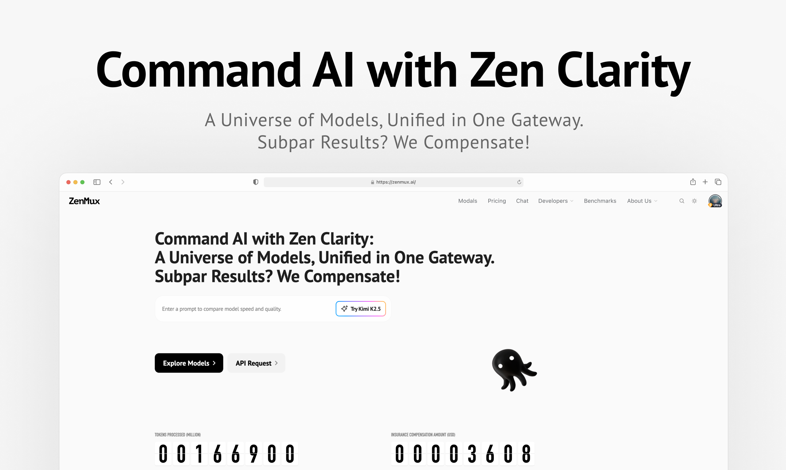
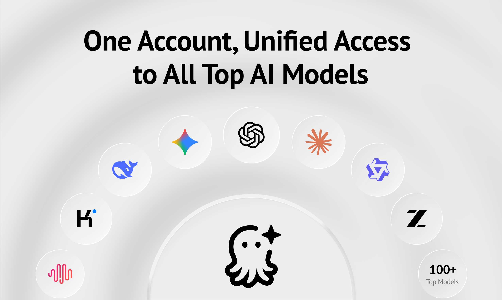
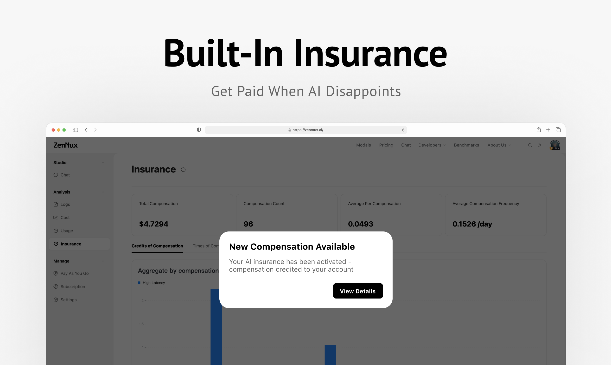

### 🎬 관련 영상
- [🎥 영상 보기](https://ph-files.imgix.net/1d6feabc-32d4-4a25-90f2-91b9b370af96.jpeg?auto=format)

---

## 4. [Code Arena](https://www.producthunt.com/products/arena-5?utm_campaign=producthunt-api&utm_medium=api-v2&utm_source=Application%3A+antigravity_test+%28ID%3A+258588%29)
**Votes**: 228 | **Tagline**: Prompt once. Compare multiple AI-built apps for free.

### 📌 요약
프롬프트 한 번으로 여러 AI 모델의 코딩 실력을 실시간으로 비교하고, 곧바로 실행 가능한 멀티 파일 앱을 무료로 얻을 수 있는 개발자 전용 'AI 대결장'입니다.

### 🔑 핵심 기능
- 🎯 Target Audience: 어떤 AI 모델이 내 프로젝트 요구사항을 가장 완벽하게 구현하는지 일일이 테스트하기 번거로운 효율 중심 개발자
- ✨ Key Differentiator: 여러 모델이 생성한 전체 프로젝트 구조와 작동 화면을 한눈에 볼 수 있도록 사이드 바이 사이드(Side-by-side) 비교 환경을 제공합니다.
- 💡 Core Feature: 가장 마음에 드는 결과물을 클릭 한 번으로 GitHub나 개인 IDE로 내보내 즉시 실제 개발에 활용할 수 있습니다.

### 📸 스크린샷 및 갤러리

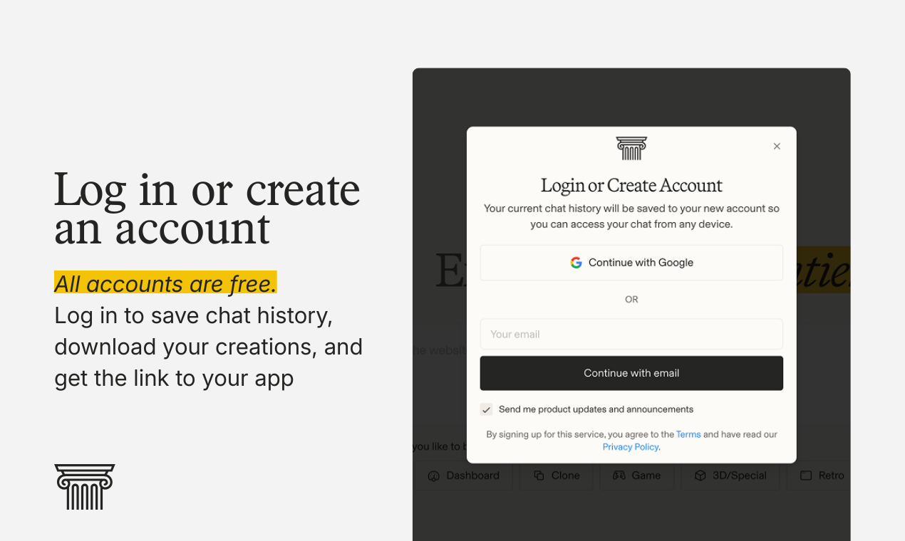
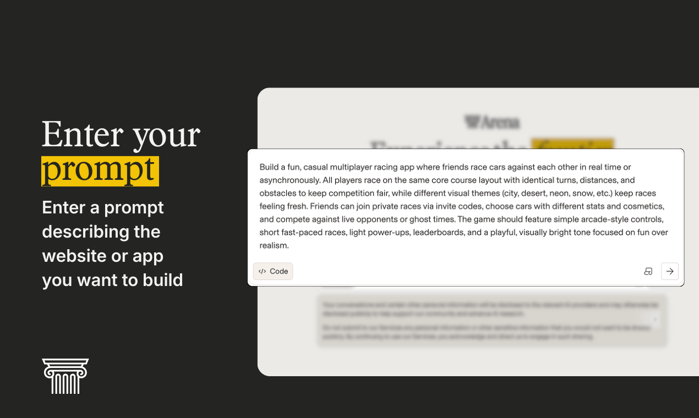

### 🎬 관련 영상
- [🎥 영상 보기](https://ph-files.imgix.net/c8c0d12f-3698-4ec1-ab7f-8ff952fff6d3.jpeg?auto=format)

---

## 5. [GPT‑5.3‑Codex‑Spark](https://www.producthunt.com/products/openai?utm_campaign=producthunt-api&utm_medium=api-v2&utm_source=Application%3A+antigravity_test+%28ID%3A+258588%29)
**Votes**: 210 | **Tagline**: An ultra-fast model for real-time coding in Codex

### 📌 요약
지연 시간(latency)을 혁신적으로 줄여 개발자의 생각만큼 빠르게 코드를 뱉어내는, 실시간 협업에 최적화된 역대급 속도의 코딩 모델이 등장했습니다.

### 🔑 핵심 기능
- 🎯 Target Audience: 실시간 피드백과 빠른 반복 작업이 필요한 프로 개발자 및 ChatGPT Pro 사용자
- ✨ Key Differentiator: 기존보다 15배 빠른 생성 속도와 128k 컨텍스트를 기반으로, AI의 코딩 도중 언제든 즉시 개입하고 방향을 틀 수 있는 반응성
- 💡 Core Feature: 전체 코드를 다시 쓰지 않고 필요한 부분만 가볍고 정확하게 수정하며 실시간으로 호흡하는 대화형 코딩 워크플로우

### 📸 스크린샷 및 갤러리
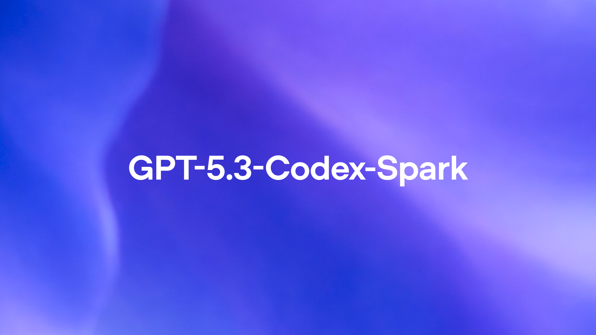
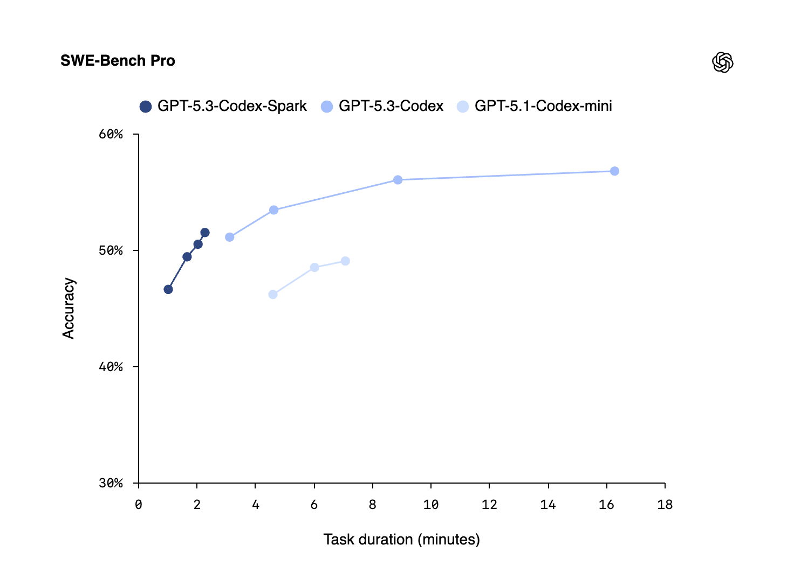
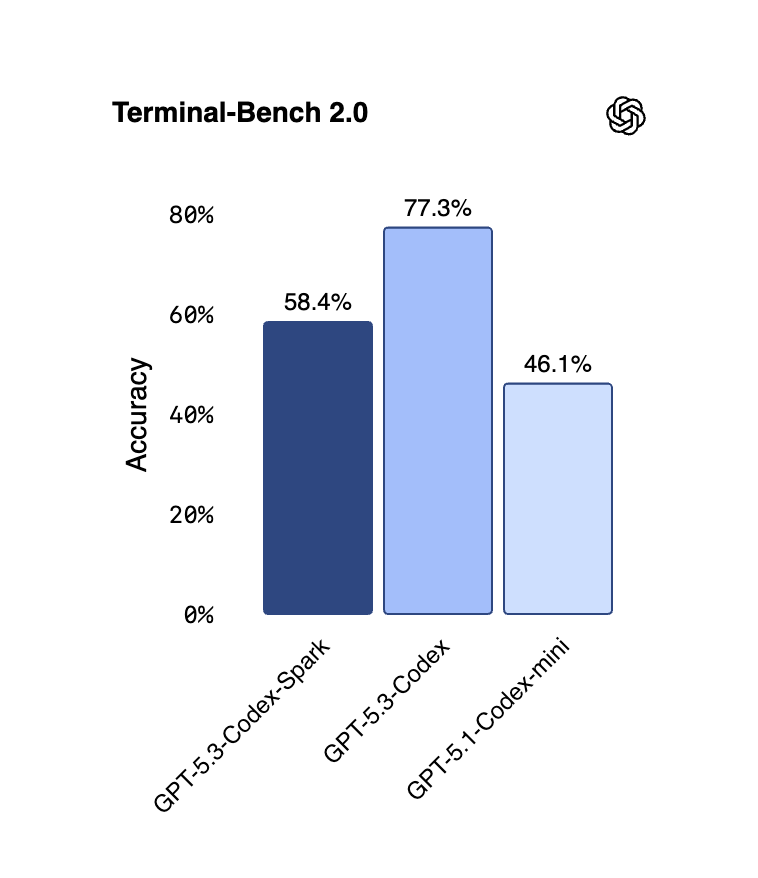

### 🎬 관련 영상
- [🎥 영상 보기](https://ph-files.imgix.net/078d5ff0-569b-4e6b-a673-d744e848e1b7.jpeg?auto=format)

---

## 6. [Walme Wallet](https://www.producthunt.com/products/walme-wallet?utm_campaign=producthunt-api&utm_medium=api-v2&utm_source=Application%3A+antigravity_test+%28ID%3A+258588%29)
**Votes**: 151 | **Tagline**: A unified hub for all your Web3 wallets

### 📌 요약
거래소와 개별 지갑을 오가는 번거로움 끝! 모든 웹3 자산을 한눈에 제어하는 스마트한 암호화폐 통합 관리 솔루션입니다.

### 🔑 핵심 기능
- 🎯 Target Audience: 다수의 거래소 계정과 개인 지갑을 운영하며 전체 자산 현황을 한눈에 파악하고 싶은 헤비 웹3 투자자
- ✨ Key Differentiator: 바이낸스 같은 거래소 API와 비수탁형 지갑, 관찰 전용 지갑까지 단일 인터페이스로 묶어 파편화된 자산 관리 경험을 혁신
- 💡 Core Feature: 플랫폼 이동 없이 앱 내에서 여러 체인의 잔고를 실시간 모니터링하고 즉시 토큰을 교환할 수 있는 통합 스왑 기능

### 📸 스크린샷 및 갤러리
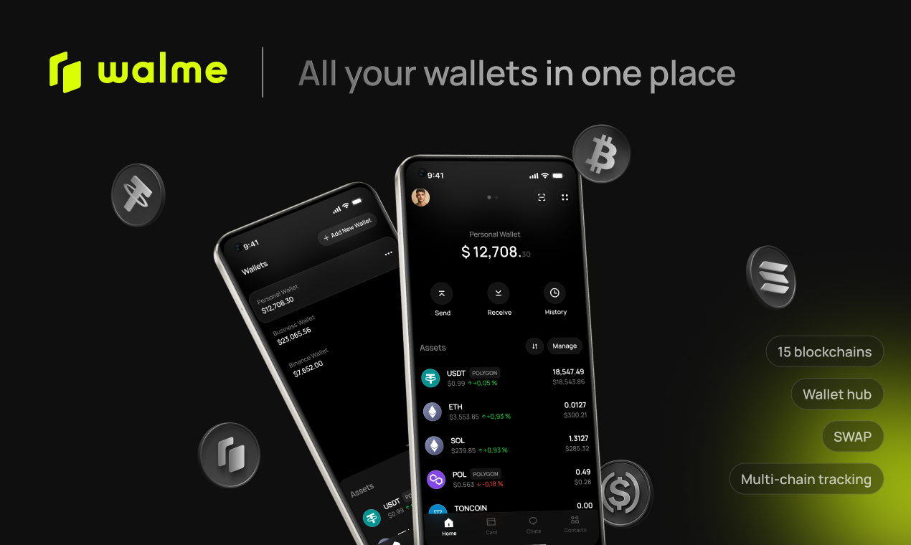
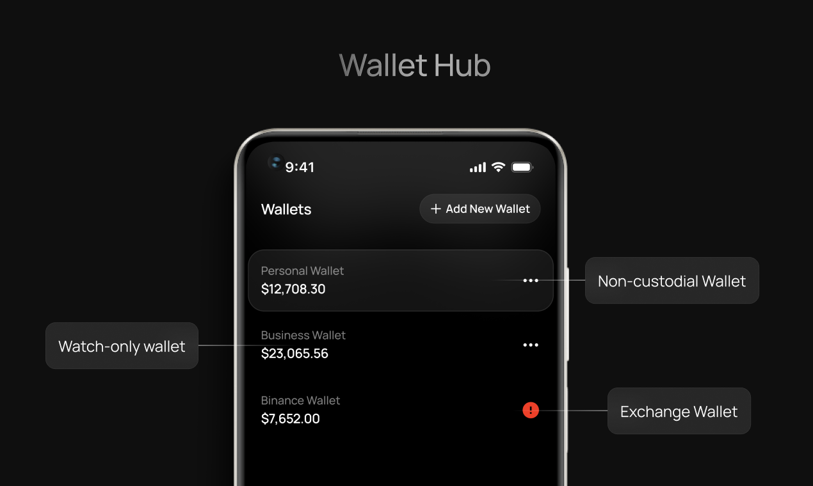
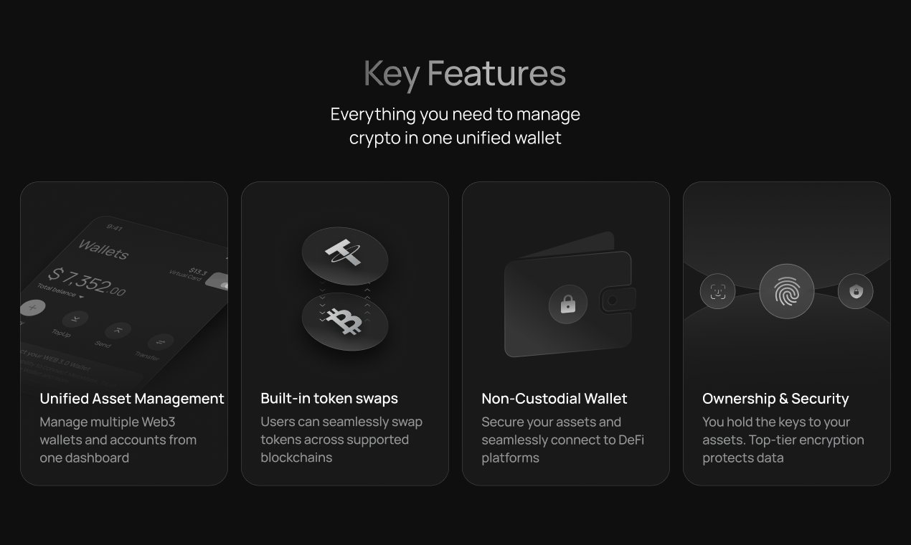

### 🎬 관련 영상
- [🎥 영상 보기](https://ph-files.imgix.net/21e9b96a-ec69-486a-8227-dd8d72dfc0fa.jpeg?auto=format)

---

## 7. [GLM-5](https://www.producthunt.com/products/z-ai?utm_campaign=producthunt-api&utm_medium=api-v2&utm_source=Application%3A+antigravity_test+%28ID%3A+258588%29)
**Votes**: 129 | **Tagline**: Open-weights model for long-horizon agentic engineering

### 📌 요약
단순한 대화를 넘어 복잡한 엔지니어링 설계를 스스로 완수하는 에이전트 전용 '끝판왕' 오픈소스 모델이 등장했습니다.

### 🔑 핵심 기능
- 🎯 Target Audience: 자율 작동 에이전트를 구축하거나 대규모 시스템 아키텍처를 설계하는 AI 엔지니어 및 개발팀
- ✨ Key Differentiator: 클로드 Opus 4.5 수준의 강력한 성능을 내면서도 누구나 가져다 쓸 수 있는 오픈 웨이트(Open-weights) 방식의 압도적 효율성
- 💡 Core Feature: DeepSeek Sparse Attention과 독자적인 RL 인프라를 활용해 길고 복잡한 연쇄 작업(Long-horizon)을 오차 없이 수행하는 능력

### 📸 스크린샷 및 갤러리
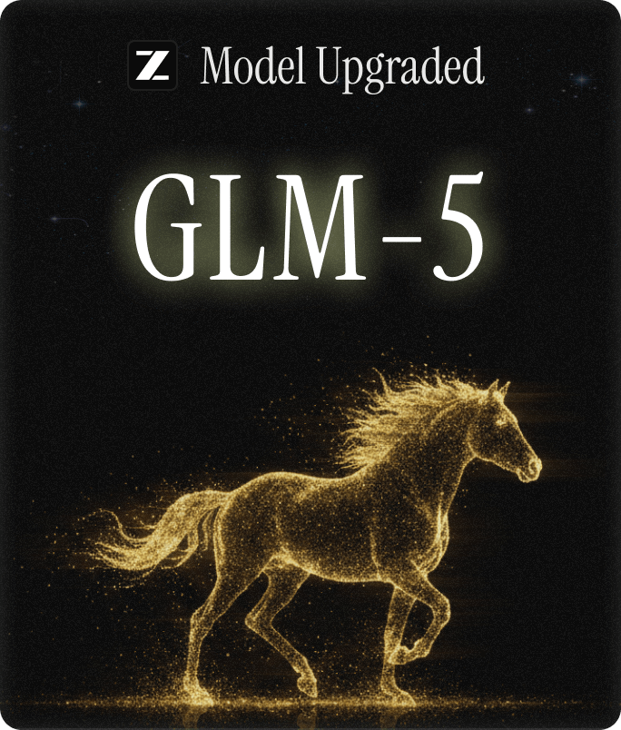
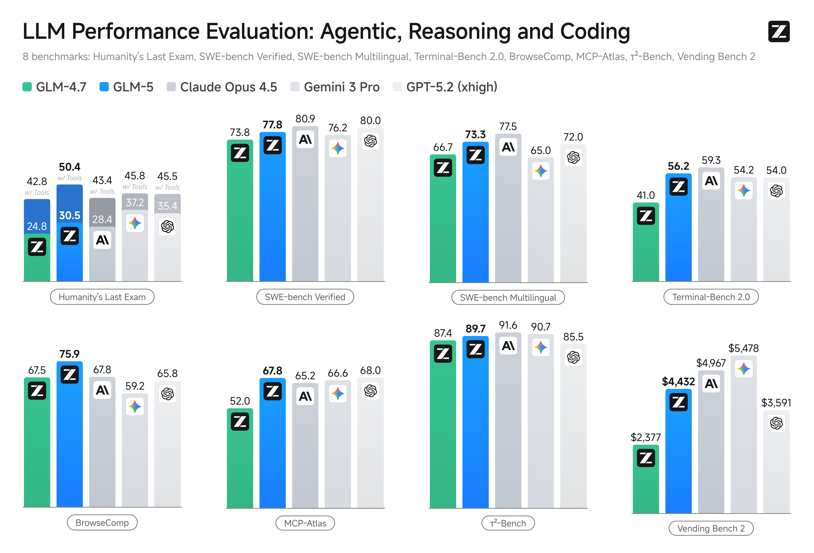
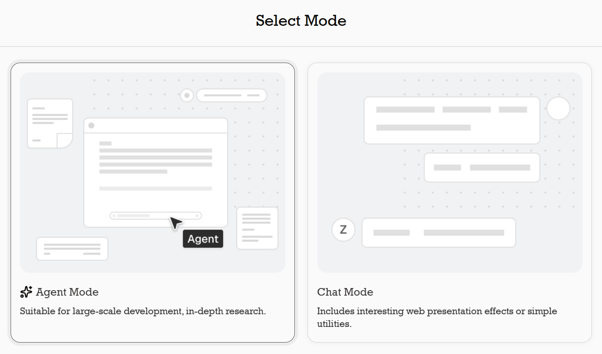

---

## 8. [Product Front](https://www.producthunt.com/products/product-front?utm_campaign=producthunt-api&utm_medium=api-v2&utm_source=Application%3A+antigravity_test+%28ID%3A+258588%29)
**Votes**: 125 | **Tagline**: A place to get discovered faster and discover new products

### 📌 요약
공들여 만든 내 제품이 출시 하루 만에 묻히는 게 아쉬웠다면, 매주 메인 페이지 노출 기회를 새로 부여해 가시성을 극대화한 이 '공정한' 발견 플랫폼을 주목하세요.

### 🔑 핵심 기능
- 🎯 Target Audience: 초기 유저 확보가 절실한 1인 창업자 및 인디 개발자와 남보다 먼저 혁신적인 툴을 찾고 싶은 큐레이터
- ✨ Key Differentiator: 거대 자본이 상위권을 독점하는 유료 광고 시스템 대신, 누구나 스크롤 없이도 첫 화면에 보일 수 있도록 설계된 평등한 노출 구조
- 💡 Core Feature: 제품이 잊혀지지 않도록 매주 다시 런칭할 수 있는 기능을 제공하여 지속적인 유입과 가시성을 보장

### 📸 스크린샷 및 갤러리
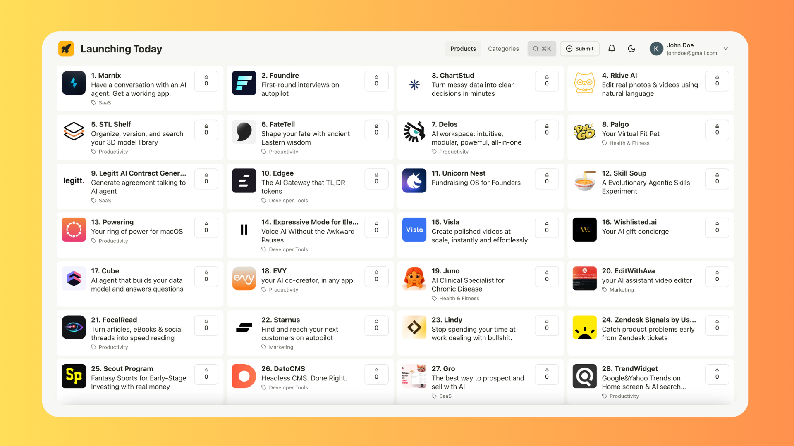
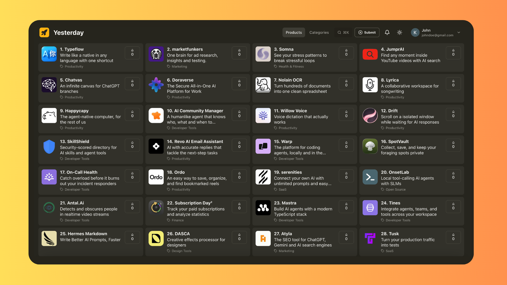
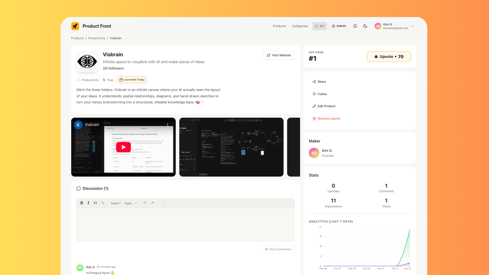

### 🎬 관련 영상
- [🎥 영상 보기](https://ph-files.imgix.net/e6c92014-ea13-4b3b-a3ba-785c4903c38f.jpeg?auto=format)

---

## 9. [Atomic Bot](https://www.producthunt.com/products/atomic-bot?utm_campaign=producthunt-api&utm_medium=api-v2&utm_source=Application%3A+antigravity_test+%28ID%3A+258588%29)
**Votes**: 116 | **Tagline**: One-click OpenClaw macOS app

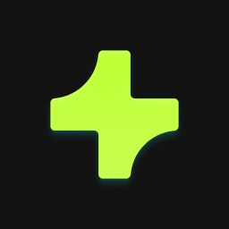

### 📌 요약
복잡한 터미널 명령어나 설정 없이, 클릭 한 번으로 맥에서 OpenClaw를 돌릴 수 있는 가장 직관적인 방법입니다. 내 API 키로 로컬이나 클라우드 어디서든 AI 에이전트를 자유롭게 제어할 수 있다는 점이 압도적이네요.

### 🔑 핵심 기능
- 🎯 Target Audience: OpenClaw의 강력한 기능을 맥에서 가장 쉽고 빠르게 써보고 싶은 AI 활용가 및 개발자
- ✨ Key Differentiator: 번거로운 설치 과정이 필요 없는 네이티브 macOS 앱이면서, 완전 오픈 소스라 투명하고 비용 부담이 없는 무료 도구
- 💡 Core Feature: 사용자 본인의 LLM API 키를 연동해 로컬 환경이나 클라우드에서 OpenClaw를 즉시 구동하는 원클릭 실행 인터페이스

### 📸 스크린샷 및 갤러리
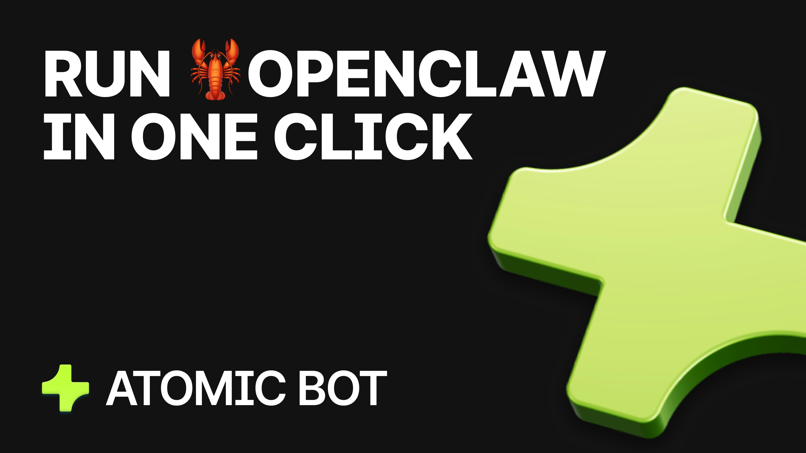
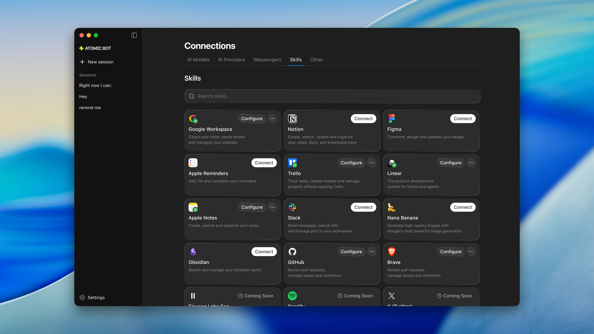
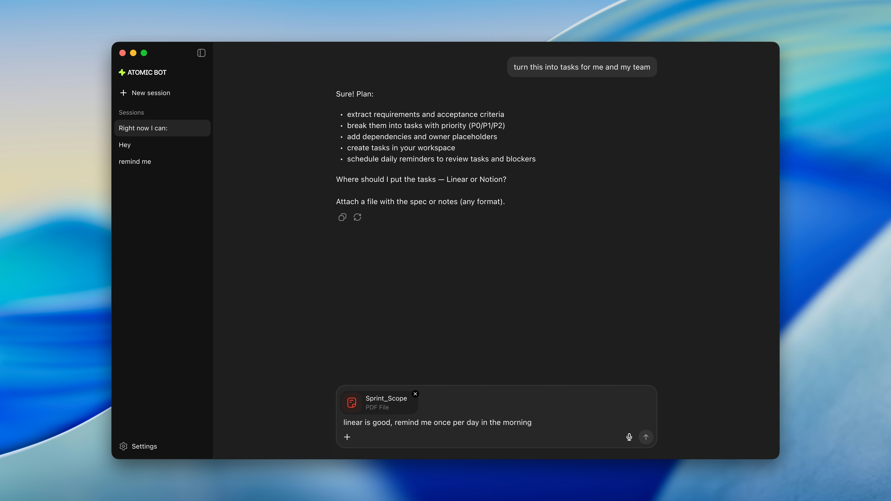

### 🎬 관련 영상
- [🎥 영상 보기](https://ph-files.imgix.net/ad00e971-dcff-4d6e-8495-b913989a2378.gif?auto=format)

---

## 10. [Media Library by beehiiv](https://www.producthunt.com/products/beehiiv?utm_campaign=producthunt-api&utm_medium=api-v2&utm_source=Application%3A+antigravity_test+%28ID%3A+258588%29)
**Votes**: 108 | **Tagline**: One place to create, edit, and manage all your creative

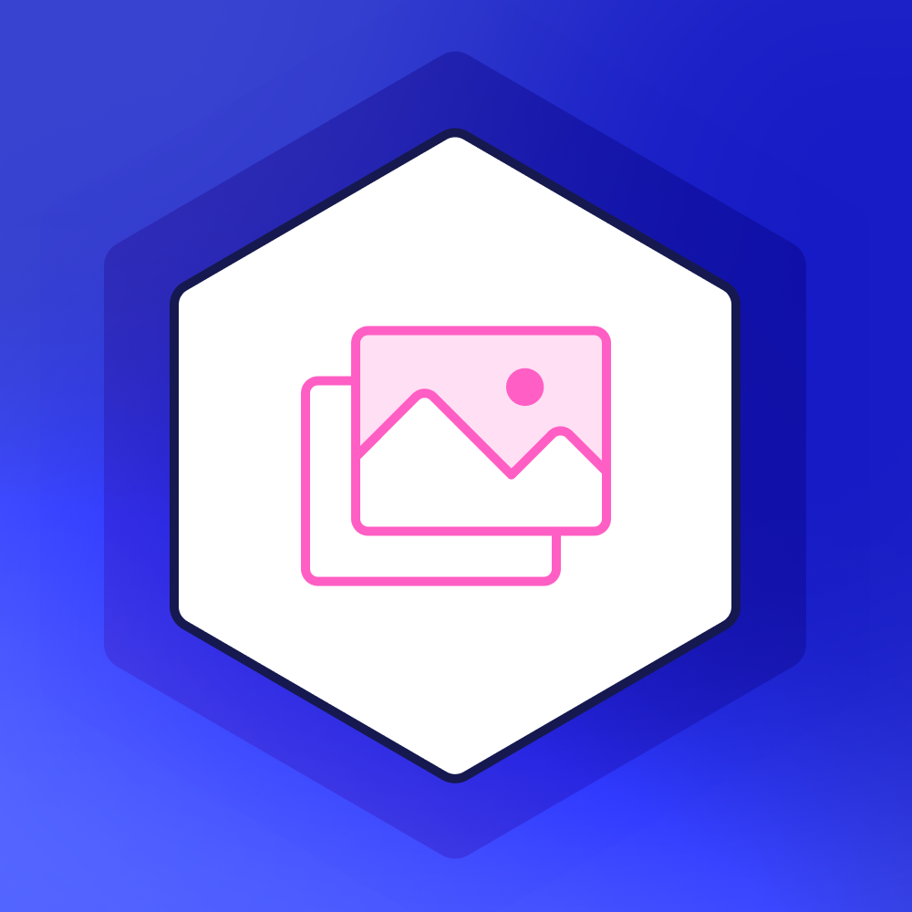

### 📌 요약
뉴스레터 만들 때 이미지 찾느라 시간 다 버리셨죠? 이제 beehiiv 미디어 라이브러리 하나로 자산 관리부터 AI 이미지 생성까지 워크플로우를 완전히 통합할 수 있습니다.

### 🔑 핵심 기능
- 🎯 Target Audience: 뉴스레터를 통해 정기적으로 시각적 콘텐츠를 발행하는 크리에이터 및 효율적인 자산 관리가 필요한 마케팅 팀
- ✨ Key Differentiator: 여러 툴을 오갈 필요 없이 뉴스레터 빌더 안에서 편집과 AI 생성을 모두 해결하는 끊김 없는(Seamless) 작업 환경
- 💡 Core Feature: 강력한 필터 기반의 에셋 검색 기능과 최신 AI 모델을 활용해 아이디어를 즉시 고퀄리티 비주얼로 바꾸는 AI 생성 기능

### 📸 스크린샷 및 갤러리
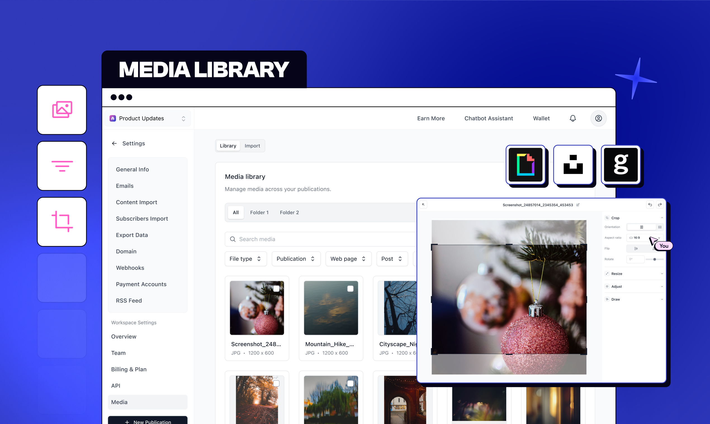

---

