# 🚀 Product Hunt Daily Top 10 (2026-02-14)

## 1. [Seedance 2.0](https://www.producthunt.com/products/pixeldance-seaweed?utm_campaign=producthunt-api&utm_medium=api-v2&utm_source=Application%3A+antigravity_test+%28ID%3A+258588%29)
**Votes**: 266 | **도입 난이도**: 중 | **신뢰도**: 중
**Tagline**: Advanced AI video creation with precise narrative control

**태그**: AI, 영상생성, 자동화, 콘텐츠제작, AI Tool, Prompting, Video, Design

### 📌 한 줄 요약
ByteDance에서 개발한 Seedance 2.0은 AI 기반의 영상 생성 모델로, 특히 시네마틱한 멀티샷 스토리텔링에 특화되어 있어 영상 제작 파이프라인 자동화에 기여할 수 있습니다.

### 🔑 핵심 기능
- 간단한 프롬프트로 일관성 있는 캐릭터와 자연스러운 전환, 역동적인 카메라 움직임 생성
- 모션, 장면 구성, 스토리 흐름에 대한 세밀한 제어 가능
- AI 비디오 제작을 실제 영화 연출처럼 느끼게 함

### 🧑‍💻 개발자 관점
영상 콘텐츠 제작 자동화 가능성을 탐색하고, 복잡한 컷 편집 및 카메라 워크를 AI로 구현하여 개발팀의 창의적인 콘텐츠 제작 역량을 강화할 수 있습니다.

### 🚀 바로 실험할 액션
- 간단한 스토리보드 기반 영상 제작 실험
- 기존 영상 콘텐츠 스타일을 모방하는 프롬프트 엔지니어링 실험
- Seedance 2.0으로 생성한 영상의 퀄리티와 제작 시간을 기존 방식과 비교

### ⚠️ 리스크/한계
- AI 모델이 생성하는 영상의 예술적 품질 및 독창성 제한 가능성
- 프롬프트 엔지니어링 난이도 및 결과물의 예측 불가능성
- 저작권 관련 문제 발생 가능성

### 🧭 불확실성 메모
Product Hunt 메타데이터만으로는 모델의 실제 성능 및 API 제공 여부 등을 정확히 파악하기 어렵습니다.

### 📸 스크린샷 및 갤러리
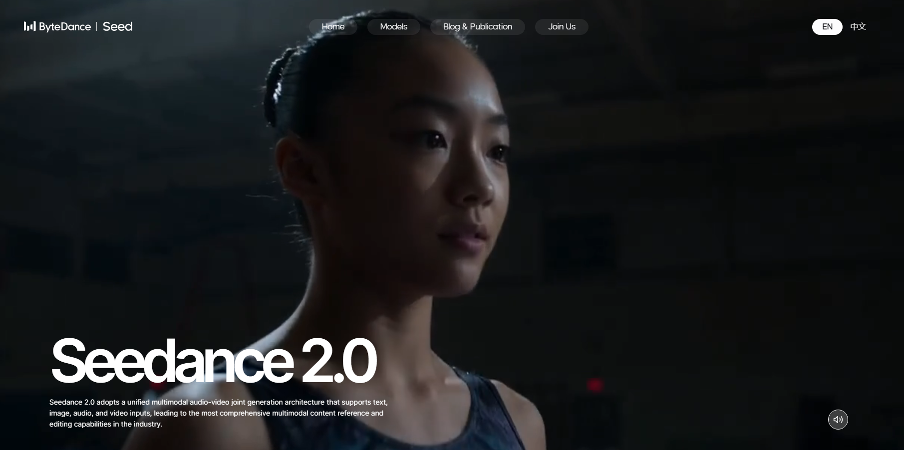
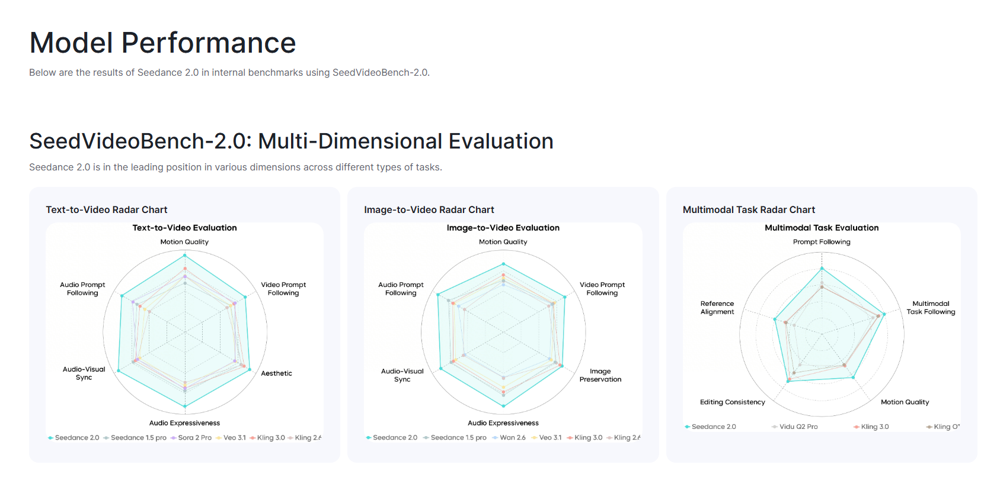

### 🎬 관련 영상
- [🎥 영상 보기](https://ph-files.imgix.net/9d33a602-fcde-431b-9685-a2c44ca862c8.jpeg?auto=format)
- [🎥 영상 보기](https://ph-files.imgix.net/23a43d15-274b-4b6c-b0e9-fc12fd193dd1.jpeg?auto=format)
- [🎥 영상 보기](https://ph-files.imgix.net/d0577cf0-1fcc-44a4-a735-412b9ae5a217.jpeg?auto=format)
- [🎥 영상 보기](https://ph-files.imgix.net/c83508aa-9425-441b-884a-19dee460cbdc.jpeg?auto=format)

---

## 2. [Cline CLI 2.0](https://www.producthunt.com/products/cline-4?utm_campaign=producthunt-api&utm_medium=api-v2&utm_source=Application%3A+antigravity_test+%28ID%3A+258588%29)
**Votes**: 203 | **도입 난이도**: 중 | **신뢰도**: 중
**Tagline**: Parallel agents & headless CI/CD in your terminal

**태그**: CLI, DevTool, Automation, CI/CD, Open Source, Agent, Design

### 📌 한 줄 요약
Cline CLI 2.0은 터미널에서 바로 자율 코딩, 병렬 에이전트, headless CI/CD를 가능하게 하여 개발 생산성을 극대화하는 오픈소스 도구입니다.

### 🔑 핵심 기능
- 병렬 에이전트 지원으로 빌드/테스트 속도 향상
- headless 모드로 CI/CD 파이프라인 통합 용이
- ACP 지원으로 Zed, Neovim 등 다양한 에디터와 호환

### 🧑‍💻 개발자 관점
개발팀은 Cline CLI 2.0을 통해 자동화된 코딩 워크플로우를 구축하고, CI/CD 파이프라인 효율성을 높이며, 개발 환경의 유연성을 확보할 수 있습니다.

### 🚀 바로 실험할 액션
- 기존 CLI 기반 스크립트를 Cline CLI 병렬 에이전트로 마이그레이션하여 성능 개선 테스트
- headless 모드를 활용하여 CI/CD 파이프라인에 통합하고 빌드/테스트 시간 단축 효과 확인
- Zed 또는 Neovim에서 ACP 기능을 사용하여 코드 자동 완성 및 오류 검사 기능 활용

### ⚠️ 리스크/한계
- 오픈소스 특성상 안정성 및 유지보수에 대한 자체적인 책임 필요
- 기존 워크플로우와의 통합 과정에서 예상치 못한 문제 발생 가능성
- 병렬 에이전트 사용 시 리소스 관리 및 충돌 문제 발생 가능성

### 🧭 불확실성 메모
Product Hunt 메타데이터만으로는 실제 사용 시 성능 및 통합 호환성에 대한 정확한 판단이 어렵습니다.

### 📸 스크린샷 및 갤러리
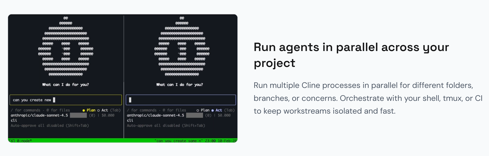
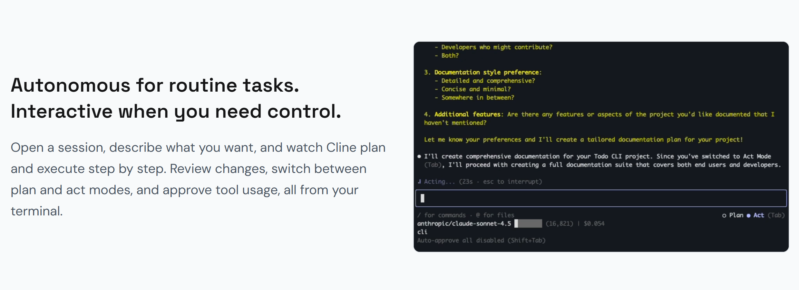
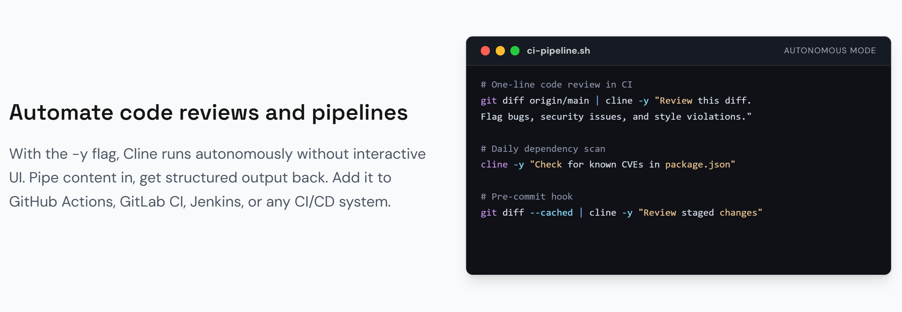

### 🎬 관련 영상
- [🎥 영상 보기](https://ph-files.imgix.net/56d65960-0aca-4333-9e01-226b6684f68b.jpeg?auto=format)

---

## 3. [TexTab](https://www.producthunt.com/products/textab?utm_campaign=producthunt-api&utm_medium=api-v2&utm_source=Application%3A+antigravity_test+%28ID%3A+258588%29)
**Votes**: 161 | **도입 난이도**: 중 | **신뢰도**: 중
**Tagline**: Turn any AI task into a Keyboard Shortcut

**태그**: DevTool, AI, Automation, Shortcut, AI Tool

### 📌 한 줄 요약
TexTab은 AI 기반 작업을 단축키로 만들어 개발 생산성을 향상시키는 도구입니다. 번역, 요약, 재작성 등 다양한 AI 기능을 코드 편집기 내에서 즉시 실행할 수 있습니다.

### 🔑 핵심 기능
- AI 기반 작업 단축키로 실행
- 사용자 정의 가능한 AI 액션
- 생산성 향상 및 워크플로우 자동화

### 🧑‍💻 개발자 관점
반복적인 AI 작업을 자동화하여 개발 시간을 단축하고, 문맥 전환 없이 코딩에 집중할 수 있도록 돕습니다. 코드 문서화, 번역, 코드 개선 등에 활용 가능합니다.

### 🚀 바로 실험할 액션
- 텍스트 요약 단축키 설정 후 사용
- 특정 코드 패턴 자동 수정 단축키 생성
- 에러 메시지 번역 단축키 활용

### ⚠️ 리스크/한계
- AI 모델의 정확성에 의존적
- 커스터마이징 복잡도 증가 가능성
- API 사용량 제한 및 비용 발생 가능성

### 🧭 불확실성 메모
Product Hunt 메타데이터만으로 판단하여 실제 사용성과 기능은 다를 수 있습니다.

### 📸 스크린샷 및 갤러리

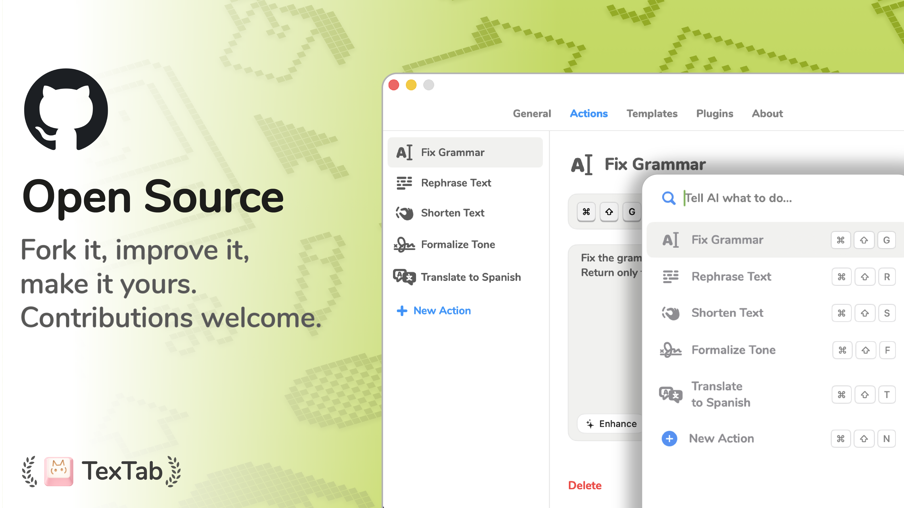

### 🎬 관련 영상
- [🎥 영상 보기](https://ph-files.imgix.net/3ceb0039-6109-442e-8cb2-0cbfebd4e943.jpeg?auto=format)

---

## 4. [Valentine Online ](https://www.producthunt.com/products/valentine-online?utm_campaign=producthunt-api&utm_medium=api-v2&utm_source=Application%3A+antigravity_test+%28ID%3A+258588%29)
**Votes**: 156 | **도입 난이도**: 하 | **신뢰도**: 중
**Tagline**: Personalized Valentine’s surprise page for your loved one

**태그**: No-Code, Marketing, Page Builder, Design

### 📌 한 줄 요약
코딩 없이 발렌타인 데이 기념 페이지를 만들 수 있는 툴. 디자인 요소 자동 생성 및 메시지 커스터마이징 기능 제공.

### 🔑 핵심 기능
- 노코드 기반 페이지 생성
- 개인화된 메시지 및 추억 공유 기능
- 간편한 공유 및 배포

### 🧑‍💻 개발자 관점
프론트엔드 개발 리소스 부족 시, 마케팅 팀에서 직접 캠페인 페이지를 제작하고 관리할 수 있어 퍼블리싱 bottleneck 해소에 기여할 수 있습니다.

### 🚀 바로 실험할 액션
- 기존 발렌타인 데이 캠페인 페이지 제작 소요 시간 및 리소스 비교
- 마케팅 팀에 해당 툴 소개 및 사용 피드백 수집
- 생성된 페이지의 반응형 디자인 및 사용자 경험 테스트

### ⚠️ 리스크/한계
- 템플릿 기반 디자인의 제한적인 커스터마이징 옵션
- 트래픽 급증 시 서비스 안정성 보장 필요

### 🧭 불확실성 메모
제공된 정보가 제한적이므로, 실제 사용 편의성, 성능, 보안 수준에 대한 추가 검토가 필요합니다.

### 📸 스크린샷 및 갤러리

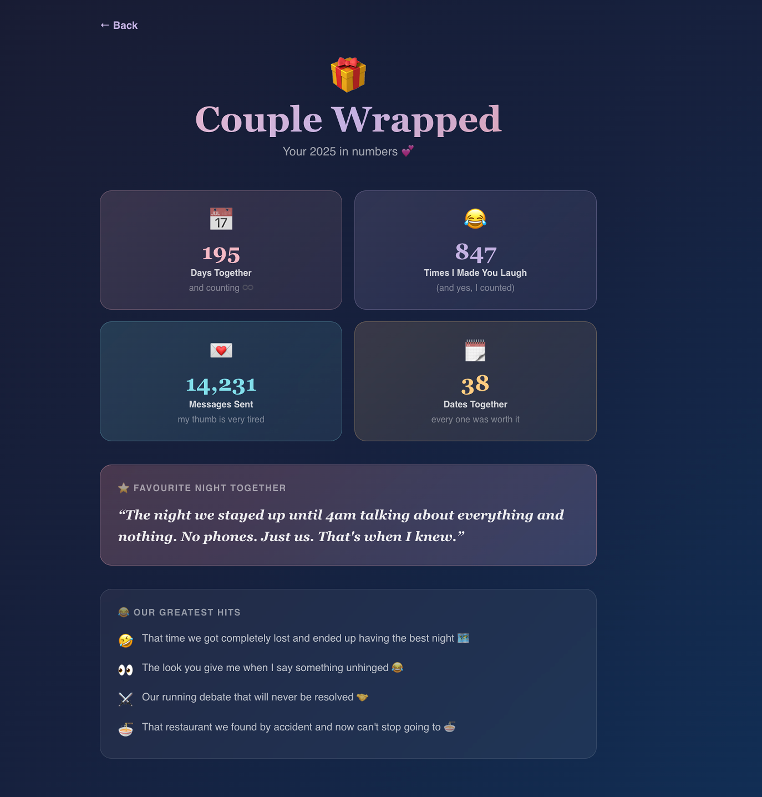

---

## 5. [Termsy](https://www.producthunt.com/products/termsy?utm_campaign=producthunt-api&utm_medium=api-v2&utm_source=Application%3A+antigravity_test+%28ID%3A+258588%29)
**Votes**: 132 | **도입 난이도**: 하 | **신뢰도**: 중
**Tagline**: Scans terms and conditions for you

**태그**: LegalTech, Automation, Privacy, Utility

### 📌 한 줄 요약
Terms of Service 및 개인정보처리방침 페이지를 자동으로 스캔하여 주요 조항을 강조 표시하고 깔끔하게 요약해주는 도구로, 사용자 동의 전에 정보에 입각한 선택을 돕습니다.

### 🔑 핵심 기능
- Terms of Service 및 개인정보처리방침 자동 스캔
- 중요 조항 하이라이트 및 요약 제공
- 빠르고 가벼우며 사용하기 쉬움

### 🧑‍💻 개발자 관점
개발팀은 Terms of Service 및 개인정보처리방침 관련 분석 도구를 자체 개발하는 대신 이 도구를 활용하여 효율성을 높이고, 사용자에게 더 투명한 정보 제공을 고려할 수 있습니다.

### 🚀 바로 실험할 액션
- Terms of Service 또는 개인정보처리방침이 있는 서비스에 적용하여 요약 결과 확인
- 요약된 결과를 기반으로 자체 서비스 정책 개선 아이디어 발굴
- 자사 서비스에 유사한 기능 도입 가능성 검토

### ⚠️ 리스크/한계
- 스캔 및 요약 정확도에 대한 의존성
- 법적 책임 면피 불가
- 지원하는 페이지 형식의 제한

### 🧭 불확실성 메모
제공된 메타데이터만으로 판단하므로, 실제 성능 및 기능은 다를 수 있습니다.

### 📸 스크린샷 및 갤러리
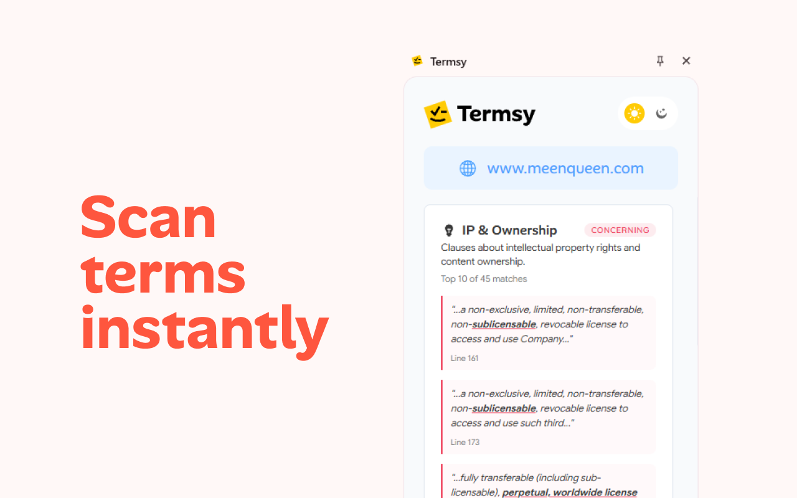
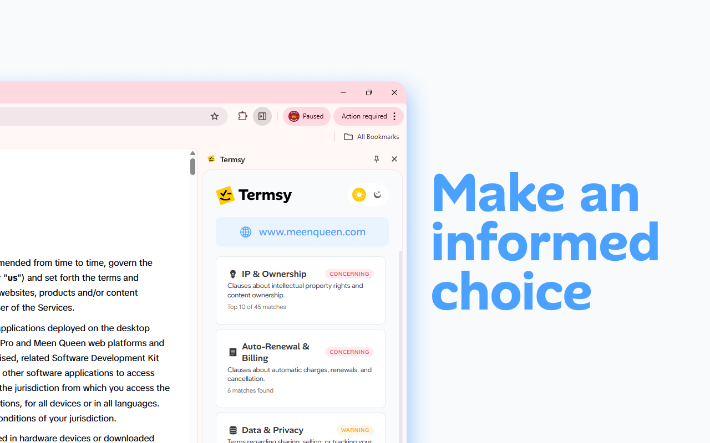
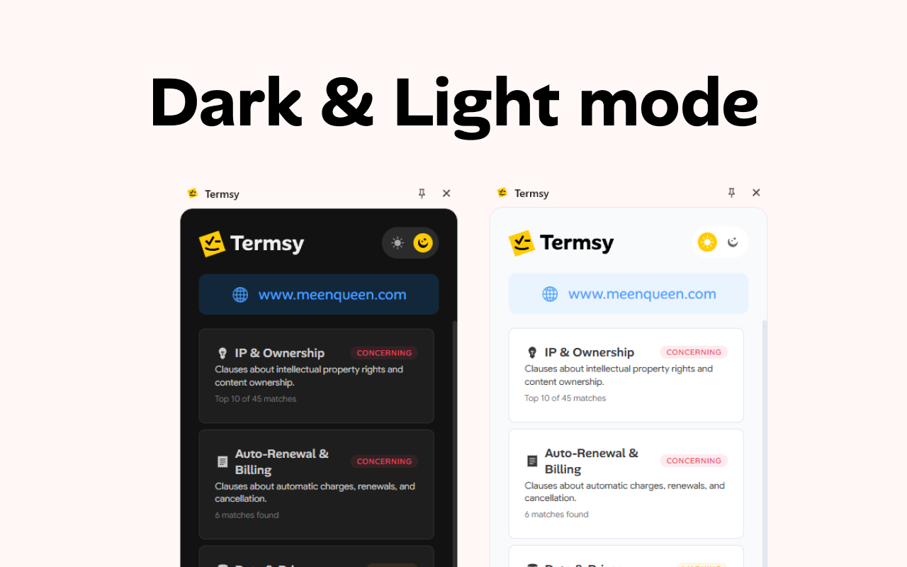

### 🎬 관련 영상
- [🎥 영상 보기](https://ph-files.imgix.net/e9d7dab9-c796-4cc8-ae19-f35b948fc420.jpeg?auto=format)

---

## 6. [WikiTrip 2.0](https://www.producthunt.com/products/wikitrip?utm_campaign=producthunt-api&utm_medium=api-v2&utm_source=Application%3A+antigravity_test+%28ID%3A+258588%29)
**Votes**: 100 | **도입 난이도**: 중 | **신뢰도**: 중
**Tagline**: Location-based audio guide powered by Wikipedia

**태그**: Location, Audio, Wikipedia, Travel, Education, AI Tool

### 📌 한 줄 요약
WikiTrip 2.0은 위치 기반 위키피디아 오디오 가이드 앱으로, 주변 정보 학습 경험을 제공하고, 개발팀은 위치 정보 및 오디오 스트리밍 기술 통합 및 개선에 집중해야 합니다.

### 🔑 핵심 기능
- 위치 기반 위키피디아 콘텐츠 제공
- 오디오 가이드 기능으로 운전 중 학습 가능
- 여행, 통근 등 다양한 상황에서 활용 가능

### 🧑‍💻 개발자 관점
개발팀은 사용자 경험 향상을 위해 정확한 위치 정보 제공 및 안정적인 오디오 스트리밍 기술 개발에 집중해야 하며, 위키피디아 데이터 업데이트 자동화 시스템 구축도 고려할 수 있습니다.

### 🚀 바로 실험할 액션
- 위치 정보 정확도 향상을 위한 GPS 데이터 처리 개선
- 오디오 스트리밍 안정성 및 배터리 효율성 개선
- 다양한 언어 지원을 위한 위키피디아 번역 API 연동 테스트

### ⚠️ 리스크/한계
- 위키피디아 콘텐츠의 정확성 및 신뢰성 문제
- GPS 신호 문제로 인한 위치 정보 오류 가능성

### 🧭 불확실성 메모
제공된 메타데이터만으로는 앱의 기술적 구현 방식 및 실제 성능을 정확히 파악하기 어렵습니다.

### 📸 스크린샷 및 갤러리

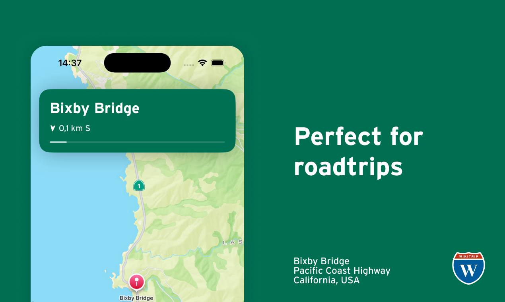

---

## 7. [CozyTwo](https://www.producthunt.com/products/cozytwo?utm_campaign=producthunt-api&utm_medium=api-v2&utm_source=Application%3A+antigravity_test+%28ID%3A+258588%29)
**Votes**: 92 | **도입 난이도**: 중 | **신뢰도**: 중
**Tagline**: Build a home together, even when you're apart.

**태그**: Realtime, Streaming, Social

### 📌 한 줄 요약
원격 연애 커플을 위한 가상 공간 제공. 유튜브 동시 시청, 가상 포옹 기능 제공, 구독 기반 수익 모델.

### 🔑 핵심 기능
- 유튜브 동시 시청 기능 (synchronized playback)
- 가상 상호작용 기능 (virtual hugs)
- 구독 기반 수익 모델 (subscription based)

### 🧑‍💻 개발자 관점
실시간 동기화 및 커뮤니케이션 기능 구현에 대한 연구 및 사용자 경험 디자인에 대한 인사이트를 얻을 수 있다.

### 🚀 바로 실험할 액션
- 동영상 스트리밍 동기화 기술 조사 (WebSockets, WebRTC)
- 가상 상호작용 UI/UX 연구
- 구독 모델 구현 및 관리 방식 벤치마킹

### ⚠️ 리스크/한계
- 동영상 플랫폼 API 변경에 따른 영향
- 사용자 트래픽 증가에 따른 서버 부하
- 새로운 기능 개발 및 유지보수 비용

### 🧭 불확실성 메모
Product Hunt 메타데이터만으로는 기술 스택 및 구체적인 구현 방식에 대한 정보가 부족하다.

### 📸 스크린샷 및 갤러리
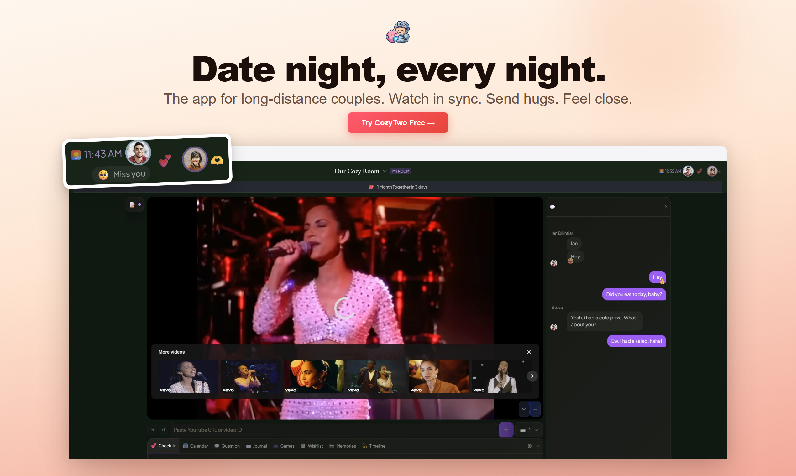
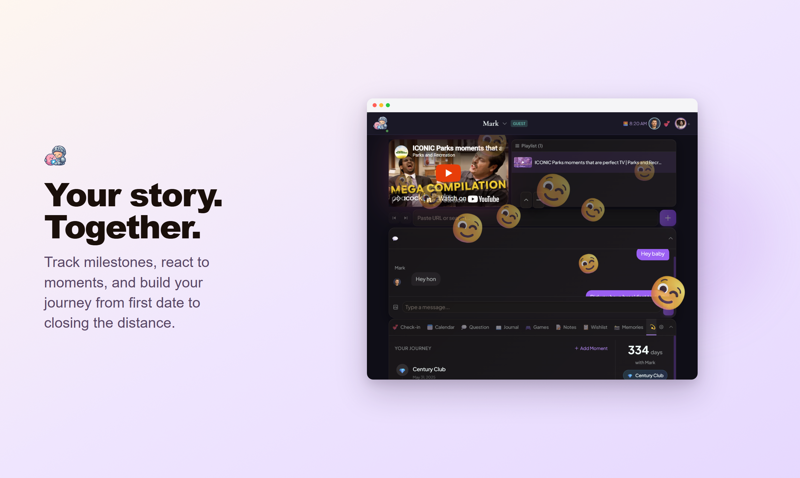
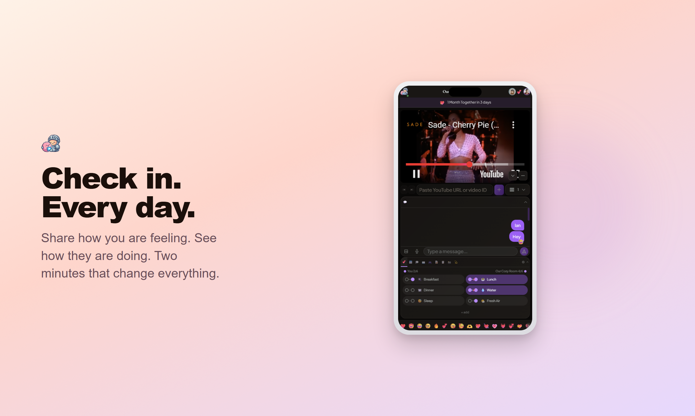

---

## 8. [OpenBug](https://www.producthunt.com/products/openbug?utm_campaign=producthunt-api&utm_medium=api-v2&utm_source=Application%3A+antigravity_test+%28ID%3A+258588%29)
**Votes**: 89 | **도입 난이도**: 중 | **신뢰도**: 중
**Tagline**: Ticket in, fix out. Every solution trains the next one.

**태그**: DevTool, CLI, AI, Automation, Open Source, Agent, AI Tool

### 📌 한 줄 요약
OpenBug는 오픈소스 CLI 도구로, 버그 티켓을 기반으로 AI 에이전트가 자동으로 로그 분석, 코드 분석, 서비스 간 연관 관계 분석을 수행하여 수정 diff를 생성하고, 해결 과정은 Git 기반의 공유 런북에 저장되어 팀의 문제 해결 능력을 향상시킵니다.

### 🔑 핵심 기능
- 버그 티켓 기반 자동 수정 diff 생성
- AI 에이전트의 로그/코드 분석 및 서비스 연관 분석
- Git 기반 공유 런북을 통한 팀 지식 축적

### 🧑‍💻 개발자 관점
버그 해결 과정을 자동화하고 팀의 문제 해결 노하우를 공유하여 개발 생산성을 향상시키고 반복적인 문제 해결 시간을 단축할 수 있습니다.

### 🚀 바로 실험할 액션
- OpenBug CLI 설치 및 간단한 버그 티켓으로 테스트
- Git 저장소 연동 및 런북 저장 설정 확인
- 팀 내 공유 런북 활용 가이드라인 수립

### ⚠️ 리스크/한계
- AI 에이전트의 분석 정확도 및 수정 제안의 신뢰도 검증 필요
- 복잡한 시스템 환경에서의 적용 가능성 및 성능 테스트 필요

### 🧭 불확실성 메모
제품 설명이 제한적이므로 실제 성능 및 기능은 사용 환경에 따라 다를 수 있습니다.

### 📸 스크린샷 및 갤러리

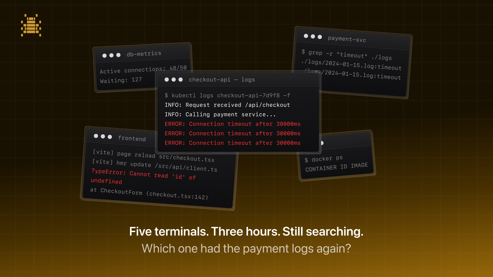

---

## 9. [Your Love Style](https://www.producthunt.com/products/your-love-style-a-valentine-s-day-event?utm_campaign=producthunt-api&utm_medium=api-v2&utm_source=Application%3A+antigravity_test+%28ID%3A+258588%29)
**Votes**: 87 | **도입 난이도**: 중 | **신뢰도**: 중
**Tagline**: A choose-your-own-adventure game meets personality quiz

**태그**: UserBehavior, Personalization, Quiz, Game, Analytics, AI Tool

### 📌 한 줄 요약
사용자의 행동 패턴 기반으로 연애 스타일을 분석하는 새로운 방식의 성격 테스트 (choose-your-own-adventure 게임 형식) 도입 가능성 검토

### 🔑 핵심 기능
- 자기 보고 방식의 한계 극복: 사용자의 실제 행동 기반 분석
- 게임 형식으로 몰입도 향상 및 데이터 수집
- 무료 및 로그인 불필요로 접근성 향상

### 🧑‍💻 개발자 관점
사용자 행동 데이터를 수집하고 분석하여 제품 개선 및 개인화된 추천에 활용할 수 있는지 탐색 필요.

### 🚀 바로 실험할 액션
- 유사한 성격 테스트 프레임워크 조사 및 비교 분석
- 사용자 행동 데이터 수집 및 분석 파이프라인 구축 가능성 검토
- 작은 규모의 A/B 테스트를 통해 기존 방식과 비교

### ⚠️ 리스크/한계
- 게임 형식의 테스트가 실제 연애 성향을 정확하게 반영하는지 검증 필요
- 행동 데이터 분석 결과의 해석 및 활용 방안에 대한 추가 연구 필요

### 🧭 불확실성 메모
제공된 정보가 제한적이므로 실제 연애 성향 분석의 정확도 및 유효성은 불확실함.

### 📸 스크린샷 및 갤러리

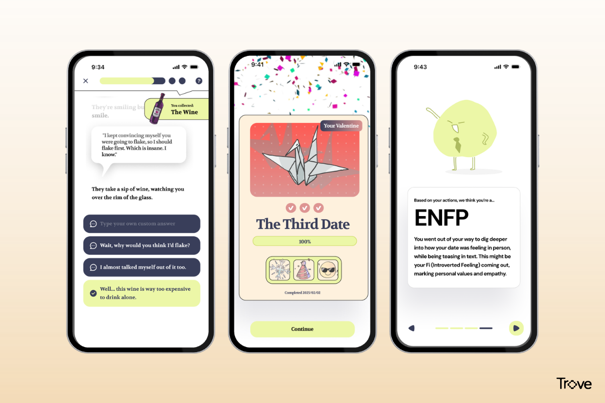

---

## 10. [SnapPoint](https://www.producthunt.com/products/snappoint?utm_campaign=producthunt-api&utm_medium=api-v2&utm_source=Application%3A+antigravity_test+%28ID%3A+258588%29)
**Votes**: 86 | **도입 난이도**: 중 | **신뢰도**: 중
**Tagline**: Make Your System Snap Back Into Alignment

**태그**: DevTool, 환경설정, 자동화, 오픈소스, 클리닝

### 📌 한 줄 요약
개발 환경의 불필요한 파일 및 설정을 찾아 정리하여 일관성 있고 깨끗한 개발 환경을 유지하도록 돕는 오픈소스 시스템 감사 도구 및 패키지 매니저 관리 도구입니다.

### 🔑 핵심 기능
- 유령 바이너리(ghost binaries) 탐지
- PATH 충돌 해결
- 개발 머신 딥 클리닝

### 🧑‍💻 개발자 관점
개발 환경의 복잡성을 줄이고 예상치 못한 오류 발생 가능성을 낮춰 개발 생산성을 향상시키고, 새로운 팀원의 온보딩 과정을 더 원활하게 만들어줍니다.

### 🚀 바로 실험할 액션
- 자신의 개발 머신에서 SnapPoint를 실행하여 잠재적인 문제점을 찾아보기
- 팀원들과 함께 SnapPoint를 사용하여 개발 환경 일관성 유지 방안 논의
- 자동화된 개발 환경 감사 파이프라인 구축 가능성 검토

### ⚠️ 리스크/한계
- 오픈소스 프로젝트의 특성상 안정성 및 유지보수에 대한 보장이 부족할 수 있음
- 초기 설정 및 구성에 시간 투자가 필요할 수 있음

### 🧭 불확실성 메모
Product Hunt listing 정보만으로는 SnapPoint의 실제 성능과 사용 편의성을 정확히 판단하기 어렵습니다.

### 📸 스크린샷 및 갤러리
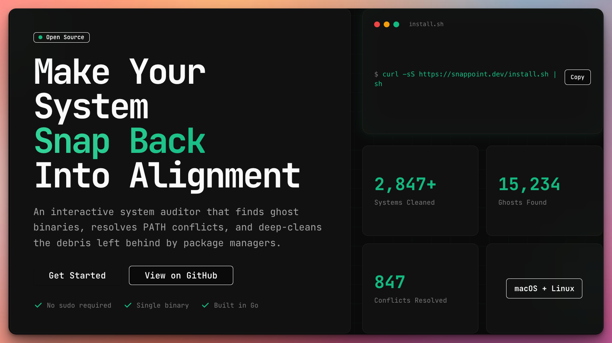
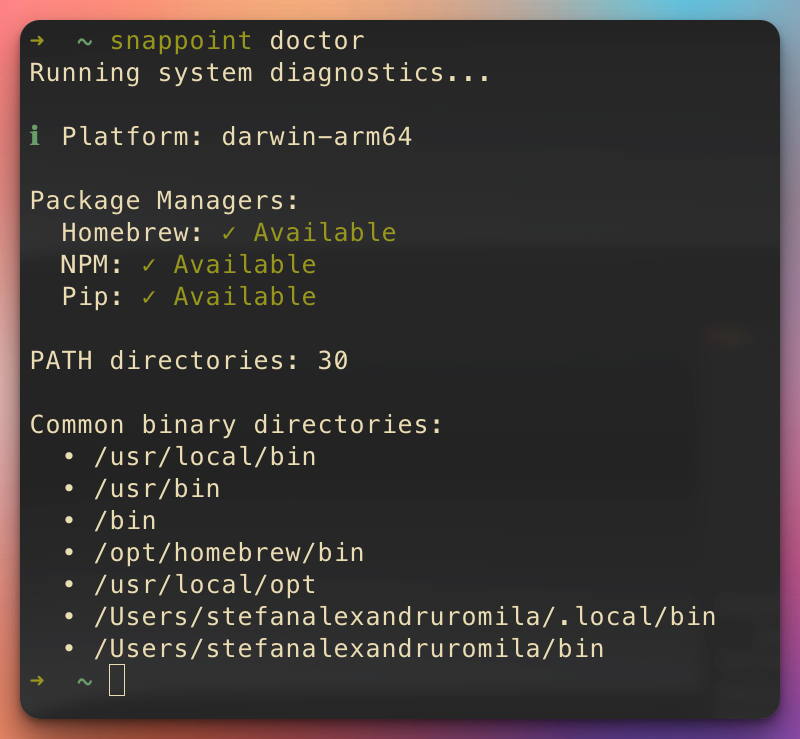
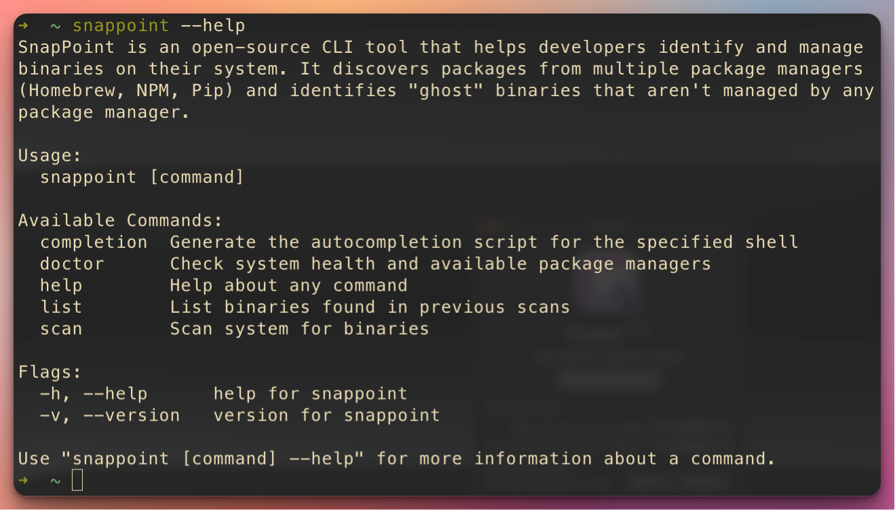

### 🎬 관련 영상
- [🎥 영상 보기](https://ph-files.imgix.net/c35d27ea-51f8-4cb2-a548-b05c09e381af.jpeg?auto=format)

---

