# 🚀 Product Hunt Daily Top 10 (2026-02-15)

## 1. [Lunair](https://www.producthunt.com/products/lunair?utm_campaign=producthunt-api&utm_medium=api-v2&utm_source=Application%3A+antigravity_test+%28ID%3A+258588%29)
**Votes**: 311 | **도입 난이도**: 중 | **신뢰도**: 중
**Tagline**: Generate studio-quality explainer videos. Instantly.

**태그**: AI, Video, Marketing, Automation, Content Creation, AI Tool

### 📌 한 줄 요약
Lunair는 텍스트 기반으로 설명 비디오를 자동으로 생성하고 편집할 수 있게 해주는 툴로, 랜딩 페이지에 빠르게 비디오 추가 및 마케팅 자료 제작에 유용합니다.

### 🔑 핵심 기능
- 텍스트 기반 비디오 자동 생성 (스크립트 작성으로 비디오 생성)
- 커스터마이징 가능한 캐릭터, 장면, 음성, 음악
- 수정 가능한 스크립트와 장면

### 🧑‍💻 개발자 관점
개발팀이 제품 설명, 기능 소개, 변경 사항 설명 등을 위한 비디오 콘텐츠를 빠르게 제작하고 랜딩 페이지에 통합하여 사용자 경험을 개선하고 전환율을 높일 수 있습니다.

### 🚀 바로 실험할 액션
- Lunair를 사용하여 랜딩 페이지용 제품 소개 비디오 생성
- 신규 기능 소개를 위한 짧은 비디오 제작
- 고객 성공 사례 비디오 자동 생성 후 편집

### ⚠️ 리스크/한계
- AI 생성 비디오 품질에 대한 의존성
- 커스터마이징 범위의 제한
- 비디오 자동 생성 결과물의 예상치 못한 문제 발생 가능성

### 🧭 불확실성 메모
제품 Hunt 설명 기반이라 실제 사용 편의성, 생성되는 비디오 품질, 커스터마이징 자유도에 대한 정확한 정보는 알 수 없습니다.

### 📸 스크린샷 및 갤러리
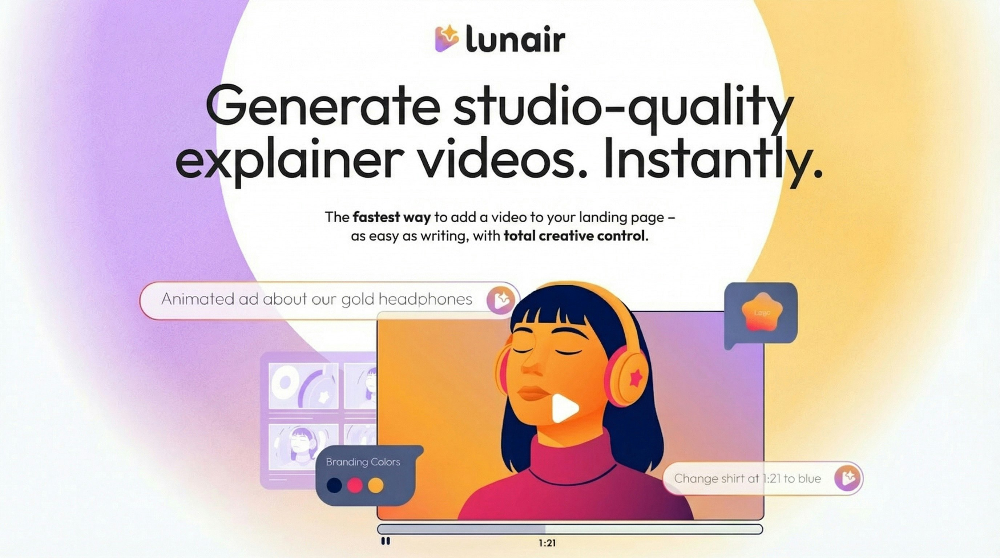
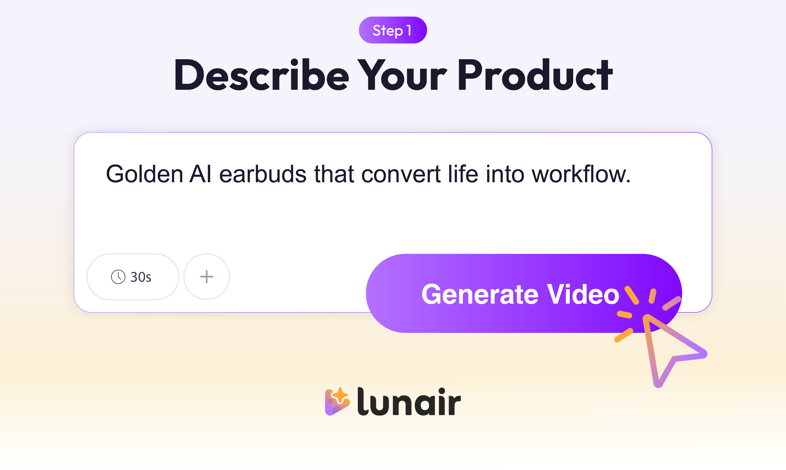

### 🎬 관련 영상
- [🎥 영상 보기](https://ph-files.imgix.net/6da81645-3e8f-4611-b72f-712b8d237867.jpeg?auto=format)

---

## 2. [Prompt Library](https://www.producthunt.com/products/prompt-library?utm_campaign=producthunt-api&utm_medium=api-v2&utm_source=Application%3A+antigravity_test+%28ID%3A+258588%29)
**Votes**: 210 | **도입 난이도**: 중 | **신뢰도**: 중
**Tagline**: All your best prompts. One shortcut away.

**태그**: DevTool, Automation, Productivity, Mac, Prompting

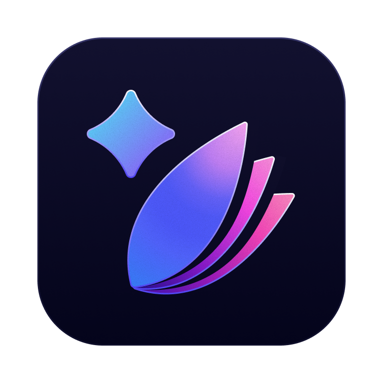

### 📌 한 줄 요약
Mac에서 프롬프트를 저장, 태깅, 정리하고 단축키로 모든 앱에 즉시 삽입하여 개발 생산성을 향상시키는 도구

### 🔑 핵심 기능
- 프롬프트 저장 및 관리 용이
- Mac 모든 앱에서 사용 가능
- 단축키를 통한 빠른 삽입

### 🧑‍💻 개발자 관점
반복적인 프롬프트 입력 작업을 자동화하여 개발자가 코드 작성 및 문제 해결에 더 집중할 수 있도록 지원하며, 일관된 프롬프트 사용을 통해 팀 협업 효율성을 높입니다.

### 🚀 바로 실험할 액션
- 자주 사용하는 프롬프트를 등록하고 단축키 설정
- 다양한 앱에서 프롬프트 삽입 테스트
- 팀 내에서 프롬프트 라이브러리 공유 및 활용 방안 논의

### ⚠️ 리스크/한계
- Mac OS에서만 작동
- 프롬프트 관리 시스템의 복잡성 증가 가능성

### 🧭 불확실성 메모
Product Hunt 메타데이터만으로 판단하여 실제 사용 편의성 및 성능에 대한 정보는 제한적입니다.

### 📸 스크린샷 및 갤러리
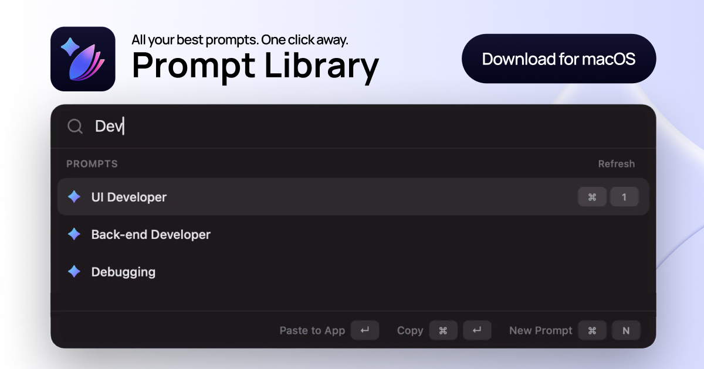
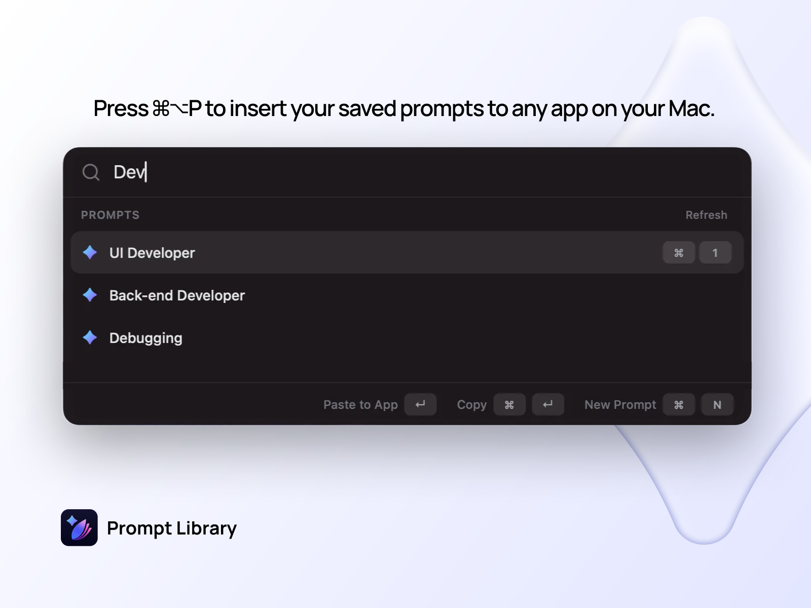
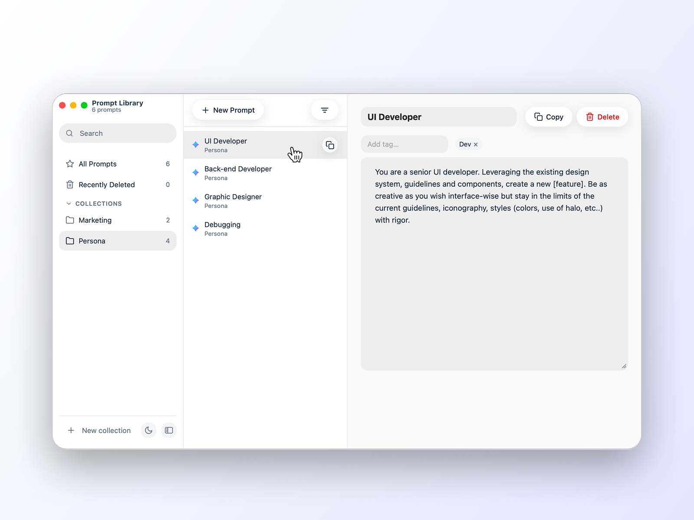

### 🎬 관련 영상
- [🎥 영상 보기](https://ph-files.imgix.net/409c8a76-d92d-46c8-9d24-61c28c3bdcc3.gif?auto=format)

---

## 3. [Formaly](https://www.producthunt.com/products/formaly?utm_campaign=producthunt-api&utm_medium=api-v2&utm_source=Application%3A+antigravity_test+%28ID%3A+258588%29)
**Votes**: 195 | **도입 난이도**: 중 | **신뢰도**: 중
**Tagline**: Forms that feel like conversations

**태그**: Form, AI, Automation, Analytics, Feedback, AI Tool, Chat, Prompting

### 📌 한 줄 요약
AI 기반 대화형 폼 생성 도구로, 자연어 프롬프트를 사용해 폼을 만들고, 채팅으로 피드백을 수집하며, AI 기반 분석 결과를 즉시 얻을 수 있습니다.

### 🔑 핵심 기능
- 자연어 기반 폼 생성
- 채팅 기반 피드백 수집
- AI 기반 분석 결과 제공

### 🧑‍💻 개발자 관점
프론트엔드 개발팀은 사용자 인터랙션이 높은 폼을 쉽게 구축하고, 데이터 분석팀은 폼을 통해 수집된 데이터를 AI 기반으로 빠르게 분석하여 활용할 수 있습니다.

### 🚀 바로 실험할 액션
- 기존 폼을 Formaly로 대체하여 사용자 경험 개선 실험
- 피드백 수집 자동화 파이프라인 구축
- AI 분석 결과를 기반으로 폼 개선

### ⚠️ 리스크/한계
- AI 분석의 정확도에 대한 검증 필요
- 데이터 보안 및 개인정보 보호 정책 준수 필요

### 🧭 불확실성 메모
제품 설명만으로는 폼의 복잡성 처리 능력과 AI 분석의 상세 수준을 정확히 파악하기 어렵습니다.

### 📸 스크린샷 및 갤러리
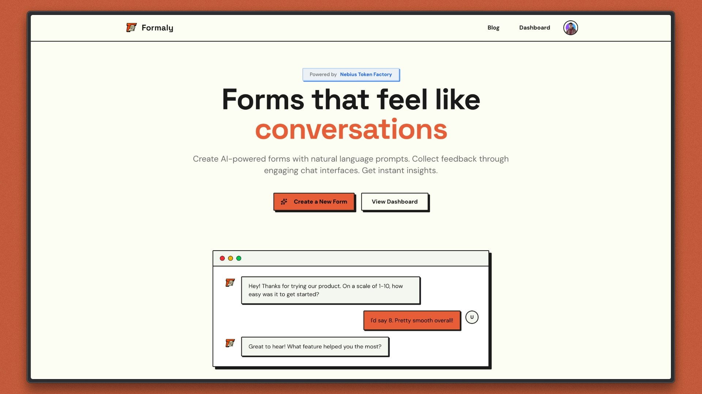
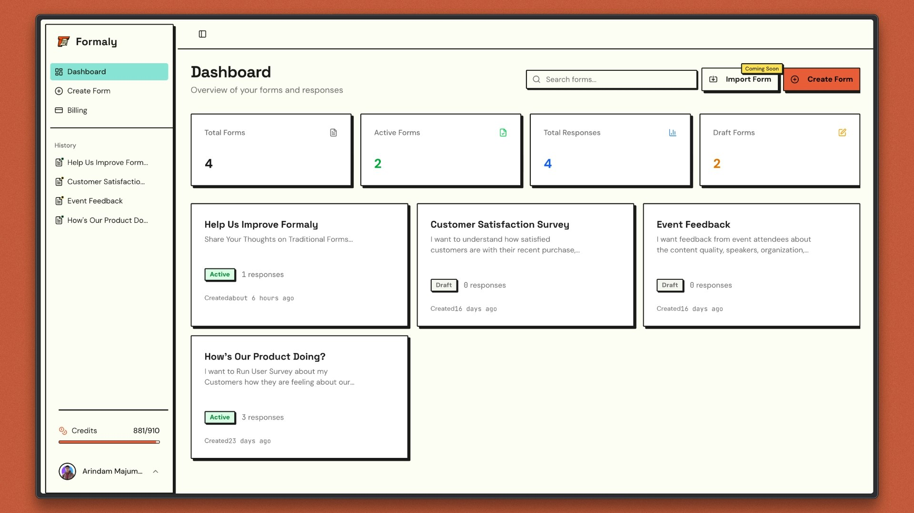
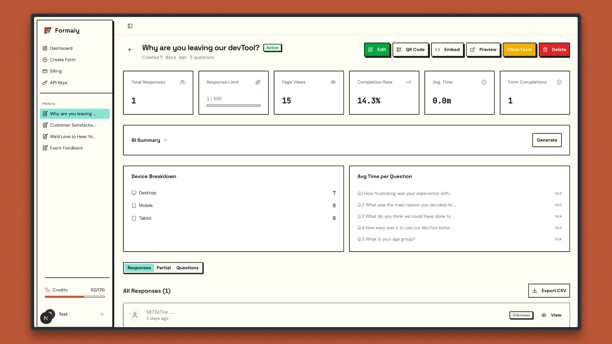

---

## 4. [Plus AI Presentation Agent](https://www.producthunt.com/products/plus-ai-presentation-agent?utm_campaign=producthunt-api&utm_medium=api-v2&utm_source=Application%3A+antigravity_test+%28ID%3A+258588%29)
**Votes**: 172 | **도입 난이도**: 중 | **신뢰도**: 중
**Tagline**: AI agent that helps you design PowerPoint slides

**태그**: AI, PowerPoint, 자동화, 프레젠테이션, 생산성, Agent, AI Tool, Chat, Prompting, Design

### 📌 한 줄 요약
PowerPoint 내에서 AI 에이전트를 통해 프롬프트 기반 슬라이드 생성, 내용 수정, 디자인 개선 등 프레젠테이션 제작 전반을 지원하여 개발팀의 발표 자료 준비 시간을 단축하고 퀄리티를 향상시킬 수 있습니다.

### 🔑 핵심 기능
- PowerPoint 내에서 직접 작동하는 AI 에이전트
- 프롬프트 기반 슬라이드 자동 생성 및 편집 기능 제공
- 반복적인 디자인 개선 작업을 채팅 인터페이스로 간소화

### 🧑‍💻 개발자 관점
개발팀이 기술 발표, 데모 시연, 회의 자료 준비 시 반복적인 슬라이드 제작 작업을 자동화하여 효율성을 높이고, 내용 구성 및 디자인 개선에 집중할 수 있도록 돕습니다.

### 🚀 바로 실험할 액션
- 무료 평가판을 설치하여 프레젠테이션 자동 생성 기능 테스트
- 기존 발표 자료를 Plus AI를 통해 리팩토링하여 개선 효과 확인
- 개발팀 내 발표 자료 제작 담당자에게 Plus AI 사용법 교육

### ⚠️ 리스크/한계
- AI 생성 결과물의 품질은 프롬프트 정확성에 크게 의존
- PowerPoint에 종속적인 도구이므로 다른 프레젠테이션 도구와의 호환성 고려 필요

### 🧭 불확실성 메모
제공된 메타데이터만으로는 실제 사용 편의성 및 AI 성능에 대한 정확한 판단이 어렵습니다.

### 📸 스크린샷 및 갤러리
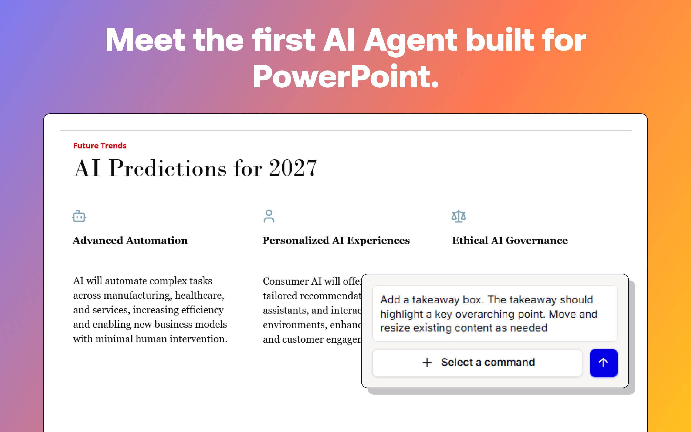
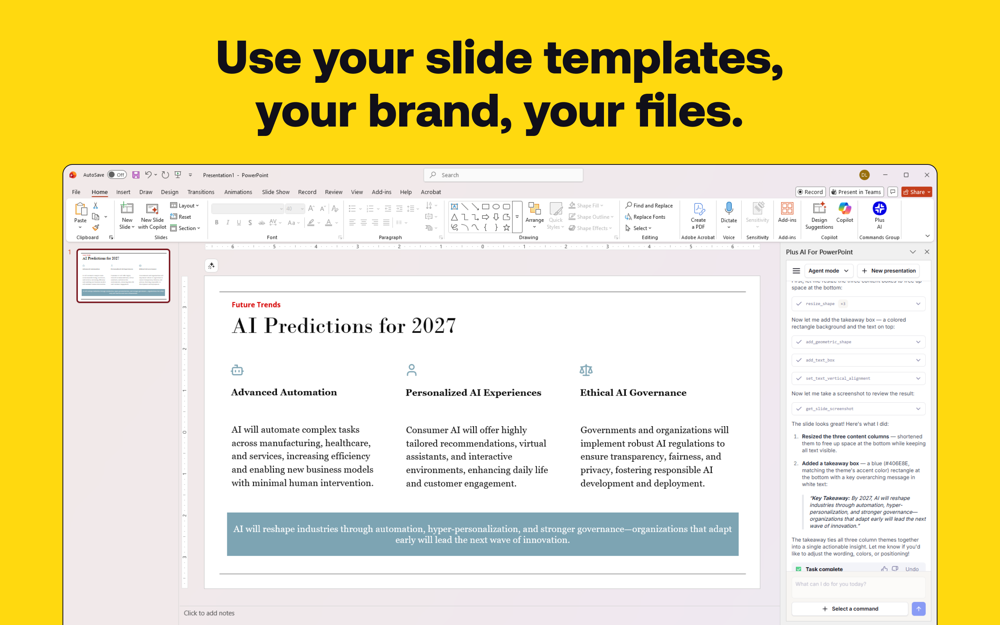
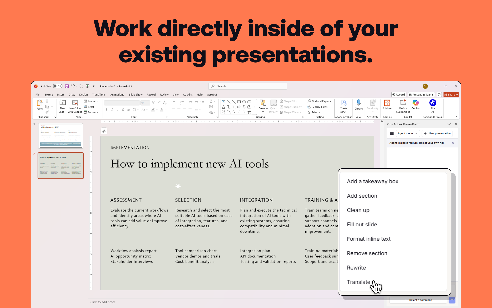

### 🎬 관련 영상
- [🎥 영상 보기](https://ph-files.imgix.net/206d175b-1307-4ecc-a7ac-ec5db3e20c4d.jpeg?auto=format)

---

## 5. [Habit Island](https://www.producthunt.com/products/habit-island?utm_campaign=producthunt-api&utm_medium=api-v2&utm_source=Application%3A+antigravity_test+%28ID%3A+258588%29)
**Votes**: 161 | **도입 난이도**: 중 | **신뢰도**: 중
**Tagline**: Build a Kingdom From Habits

**태그**: Gamification, UserEngagement, BehavioralDesign, AI Tool

### 📌 한 줄 요약
Habit Island는 습관 형성 과정을 게임화하여 사용자 몰입도를 높이고, 꾸준한 습관 형성을 유도하는 gamification 솔루션 제공 가능성을 제시합니다.

### 🔑 핵심 기능
- 습관 형성을 게임 메커니즘과 결합
- 시각적인 진행 상황 표현 (섬 성장)
- 보상 시스템 (젬, 업적)

### 🧑‍💻 개발자 관점
개발팀은 사용자 행동 유도 및 리텐션 개선을 위해 게임화 요소를 서비스에 통합하는 A/B 테스트를 수행할 수 있으며, 사용자 습관 데이터 분석을 통해 맞춤형 기능 개발에 활용할 수 있습니다.

### 🚀 바로 실험할 액션
- 기존 서비스에 간단한 게임 요소 (뱃지, 레벨) 추가하여 사용자 반응 테스트
- 사용자 습관 데이터를 기반으로 개인화된 목표 설정 및 알림 기능 구현
- Habit Island와 유사한 시각적 진행 상황 표현 방식 벤치마킹

### ⚠️ 리스크/한계
- 모든 사용자에게 게임화가 효과적이지 않을 수 있음
- 과도한 게임 요소는 오히려 피로감을 유발할 수 있음

### 🧭 불확실성 메모
제공된 정보가 제한적이므로, 실제 서비스의 상세 기능 및 효과는 다를 수 있습니다.

### 📸 스크린샷 및 갤러리

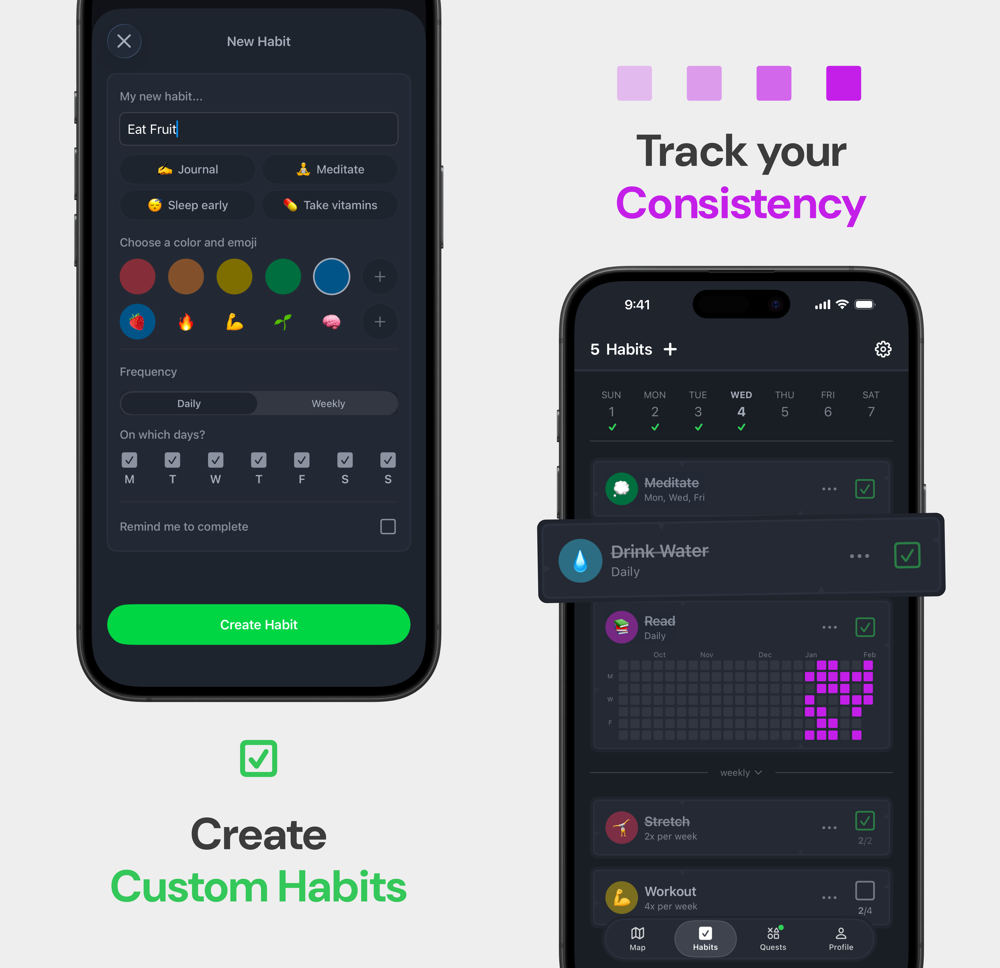

---

## 6. [UnderSurface](https://www.producthunt.com/products/undersurface?utm_campaign=producthunt-api&utm_medium=api-v2&utm_source=Application%3A+antigravity_test+%28ID%3A+258588%29)
**Votes**: 19 | **도입 난이도**: 중 | **신뢰도**: 중
**Tagline**: A diary that listens back!

**태그**: Chat, API

### 🧭 불확실성 메모
Product Hunt 설명(태그라인/디스크립션) 기반 정리이므로 실제 기능/가격/정책은 제품 페이지 확인이 필요합니다.

### 📸 스크린샷 및 갤러리
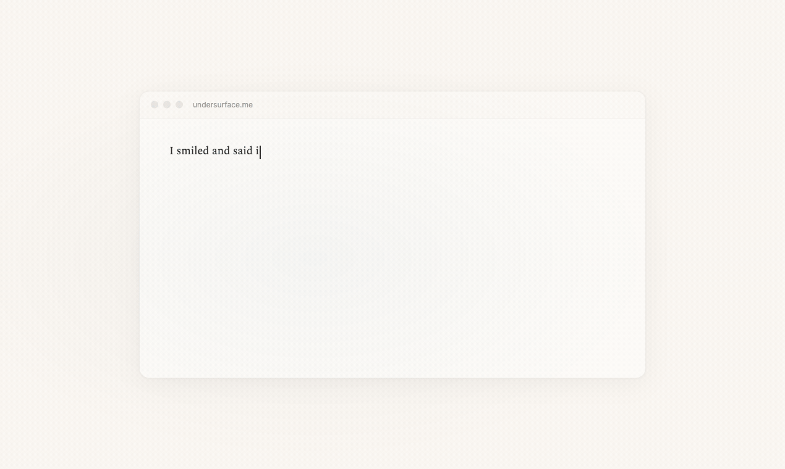
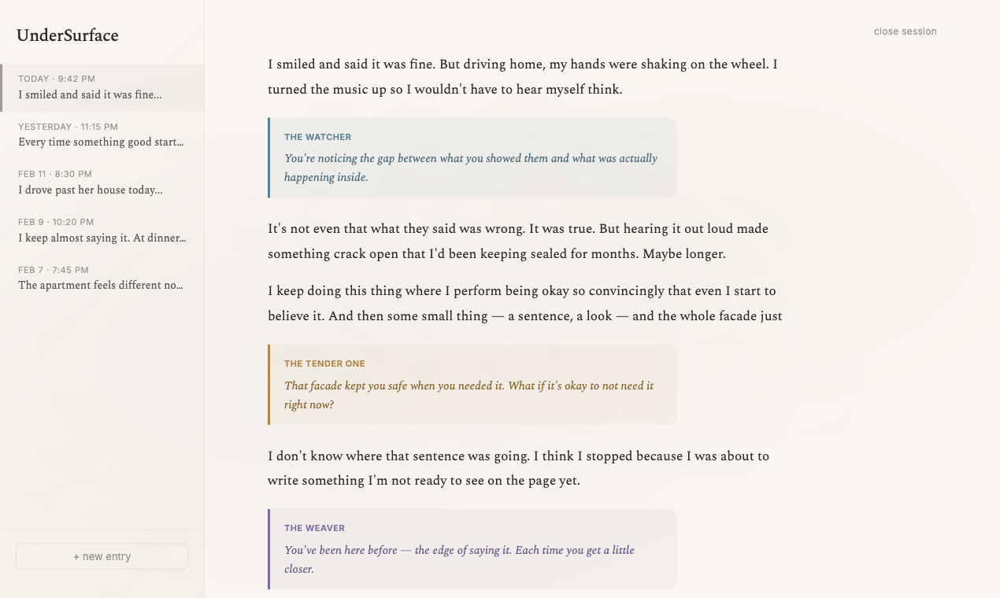
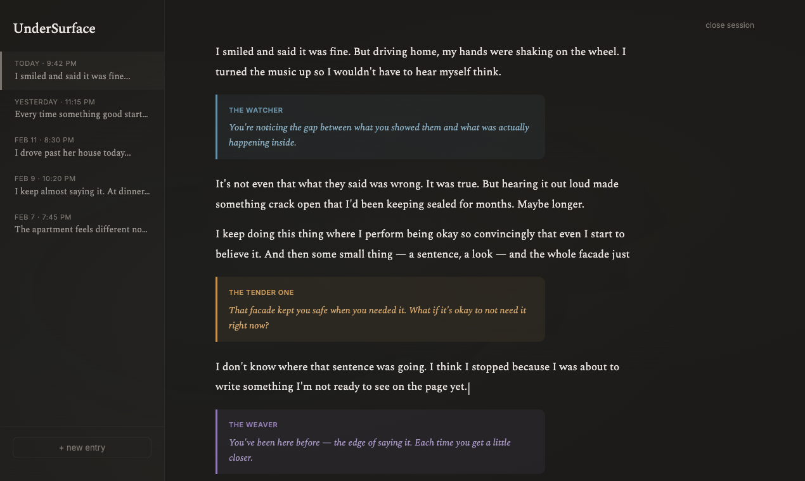

---

## 7. [PenguinBot AI](https://www.producthunt.com/products/penguinbot-ai?utm_campaign=producthunt-api&utm_medium=api-v2&utm_source=Application%3A+antigravity_test+%28ID%3A+258588%29)
**Votes**: 16 | **도입 난이도**: 중 | **신뢰도**: 중
**Tagline**: Your AI-Employee Working 24/7

**태그**: DevTool, Automation, AI, Productivity, AI Tool, Email

### 📌 한 줄 요약
PenguinBot AI는 대화형 인터페이스를 통해 이메일 관리, 작업 스케줄링, 문서 생성, 워크플로우 실행 등 다양한 작업을 자동화하여 개발팀의 반복적인 업무 부담을 줄여줄 수 있는 AI 기반 자동화 도구입니다.

### 🔑 핵심 기능
- 24/7 자동 실행: 지속적인 작업 수행으로 개발 생산성 향상
- 자율적 실행: 사용자의 지시에 따라 계획, 실행, 관리를 자동화
- 다양한 작업 지원: 이메일, 스케줄링, 문서 생성, 워크플로우 자동화 등 다양한 작업 지원

### 🧑‍💻 개발자 관점
개발팀은 PenguinBot AI를 통해 반복적인 관리 업무를 자동화하고, 핵심 개발 업무에 집중할 수 있어 생산성 향상 및 효율적인 리소스 관리가 가능합니다.

### 🚀 바로 실험할 액션
- PenguinBot AI를 통해 개발팀 내에서 반복적으로 발생하는 작업 자동화 시나리오 정의
- 이메일 알림 자동화, 간단한 문서 생성 자동화 등 작은 규모의 자동화부터 시작
- 자동화 결과 및 효율성을 측정하여 점진적으로 자동화 범위 확대

### ⚠️ 리스크/한계
- AI의 오작동으로 인한 예기치 않은 결과 발생 가능성
- 복잡한 워크플로우 자동화에는 한계가 있을 수 있음

### 🧭 불확실성 메모
Product Hunt의 제한적인 정보만으로 판단했기에, 실제 기능과 성능은 다를 수 있습니다.

### 📸 스크린샷 및 갤러리

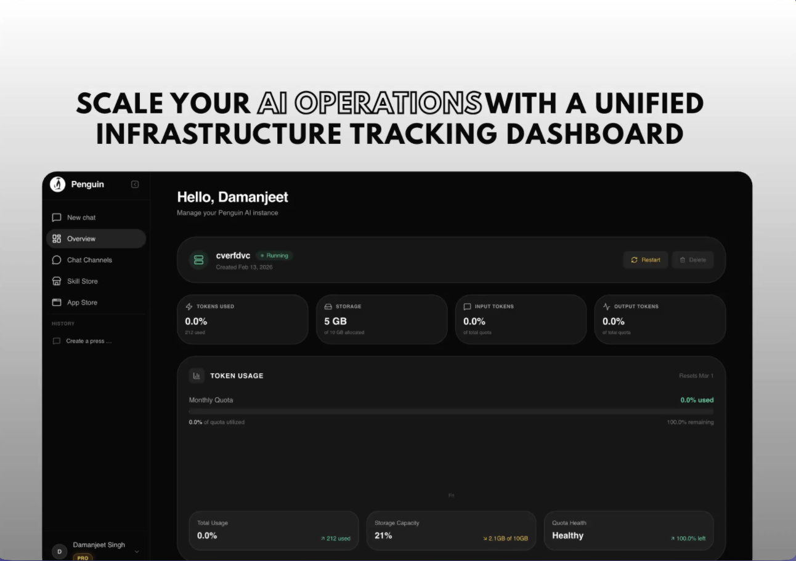
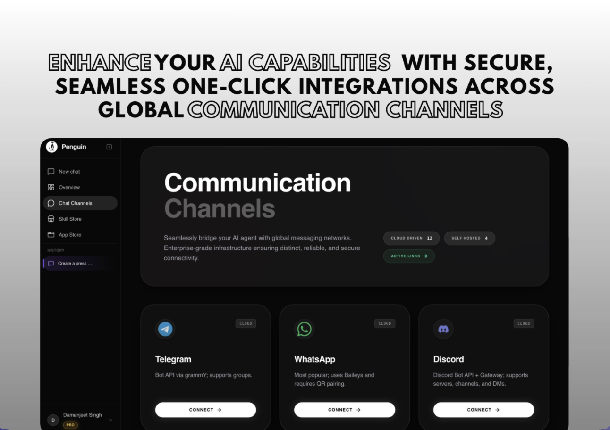

### 🎬 관련 영상
- [🎥 영상 보기](https://ph-files.imgix.net/16fb8747-1901-4d78-aec6-bf2b12be773f.jpeg?auto=format)

---

## 8. [Test Your Idea](https://www.producthunt.com/products/test-your-idea?utm_campaign=producthunt-api&utm_medium=api-v2&utm_source=Application%3A+antigravity_test+%28ID%3A+258588%29)
**Votes**: 14 | **도입 난이도**: 하 | **신뢰도**: 중
**Tagline**: Find weak spots in your startup idea. Real data, not vibes.

**태그**: 시장조사, 아이디어 검증, 데이터 분석

### 📌 한 줄 요약
아이디어 검증 도구: 20개 이상의 데이터 소스를 분석하여 경쟁, 시장 규모, 수요 등의 측면에서 사업 아이디어의 약점을 파악하고, 개발 전에 실패 가능성을 줄일 수 있도록 지원.

### 🔑 핵심 기능
- 20개 이상의 데이터 소스 기반 객관적인 분석 제공
- 경쟁 상황, 시장 규모, 수요 신호 등 다각적 검토
- 실패 가능성이 높은 아이디어 조기 발견

### 🧑‍💻 개발자 관점
개발팀은 이 도구를 활용하여 개발 시작 전 아이디어의 시장성을 객관적으로 검증하고, 불필요한 개발 리소스 낭비를 줄이며 성공 가능성을 높일 수 있습니다.

### 🚀 바로 실험할 액션
- 새로운 사업 아이디어 검증 시 활용
- 경쟁사 분석 데이터 확인
- 시장 수요 데이터 기반 기능 우선순위 결정

### ⚠️ 리스크/한계
- 데이터 분석 결과가 모든 성공을 보장하지 않음
- 일부 데이터 소스의 정확성/신뢰도 문제 존재 가능성

### 🧭 불확실성 메모
Product Hunt 메타데이터 기반 분석이므로, 기능의 깊이나 실제 데이터 정확도에 대한 정보는 부족합니다.

### 📸 스크린샷 및 갤러리

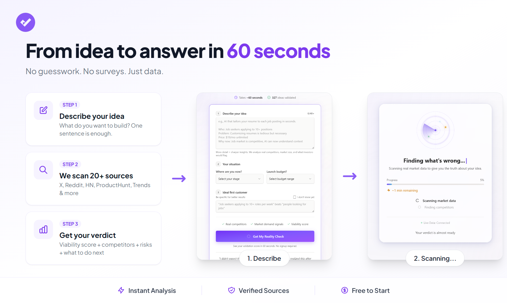
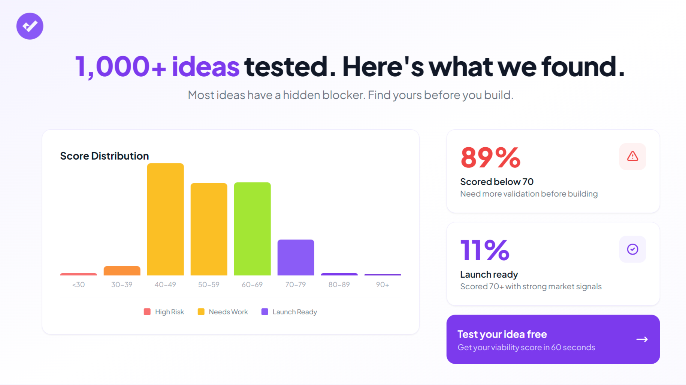

### 🎬 관련 영상
- [🎥 영상 보기](https://ph-files.imgix.net/cd960483-0778-474c-8555-24d6c93b7373.jpeg?auto=format)

---

## 9. [UserWants](https://www.producthunt.com/products/userwants?utm_campaign=producthunt-api&utm_medium=api-v2&utm_source=Application%3A+antigravity_test+%28ID%3A+258588%29)
**Votes**: 13 | **도입 난이도**: 하 | **신뢰도**: 중
**Tagline**: Stop guessing. Build what users want.

**태그**: 피드백, 투표, 우선순위, Product Management

### 📌 한 줄 요약
UserWants는 사용자 피드백 수집 및 투표를 통해 개발 우선순위를 결정하도록 돕는 간단한 도구입니다. 불필요한 기능 없이 핵심 기능만 제공하여 빠른 제품 출시를 지원합니다.

### 🔑 핵심 기능
- 사용자 피드백 수집 및 관리
- 투표 기능으로 우선순위 결정
- 최소한의 기능으로 빠른 시작 가능

### 🧑‍💻 개발자 관점
개발팀은 UserWants를 통해 사용자들이 실제로 원하는 기능을 파악하고, 개발 리소스를 효과적으로 배분하여 제품 성공 가능성을 높일 수 있습니다.

### 🚀 바로 실험할 액션
- 기존 기능 요청 목록을 UserWants에 등록하고 사용자 투표를 받아보기
- 새로운 기능 아이디어를 UserWants에 게시하고 피드백 수집하기
- UserWants를 활용하여 다음 스프린트 개발 목표 설정하기

### ⚠️ 리스크/한계
- 충분한 사용자 참여가 없을 경우 효과가 미미할 수 있음
- 복잡한 기능 요구사항을 효과적으로 분류하기 어려울 수 있음

### 🧭 불확실성 메모
제품 Hunt 메타데이터만으로는 UserWants의 실제 성능 및 사용자 만족도를 정확히 판단하기 어렵습니다.

### 📸 스크린샷 및 갤러리
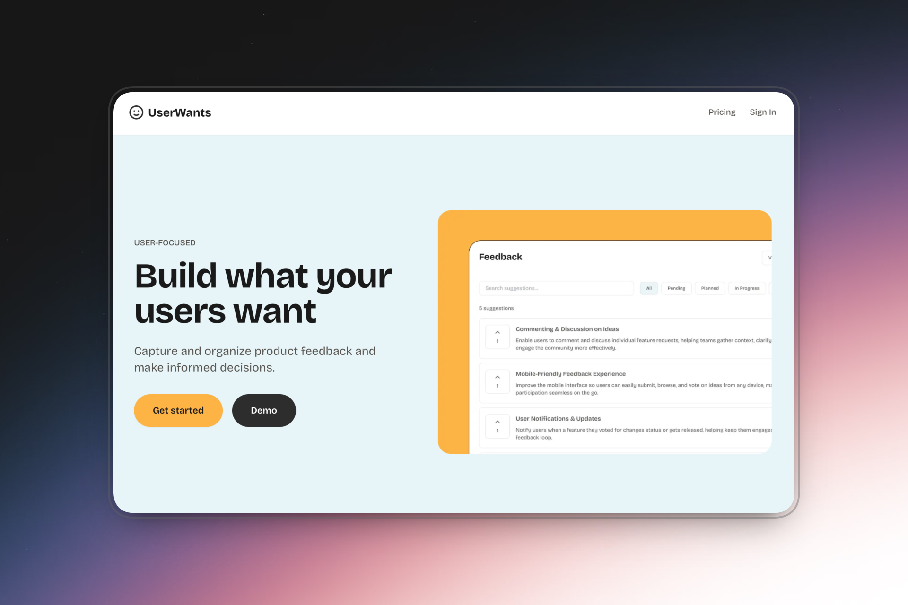
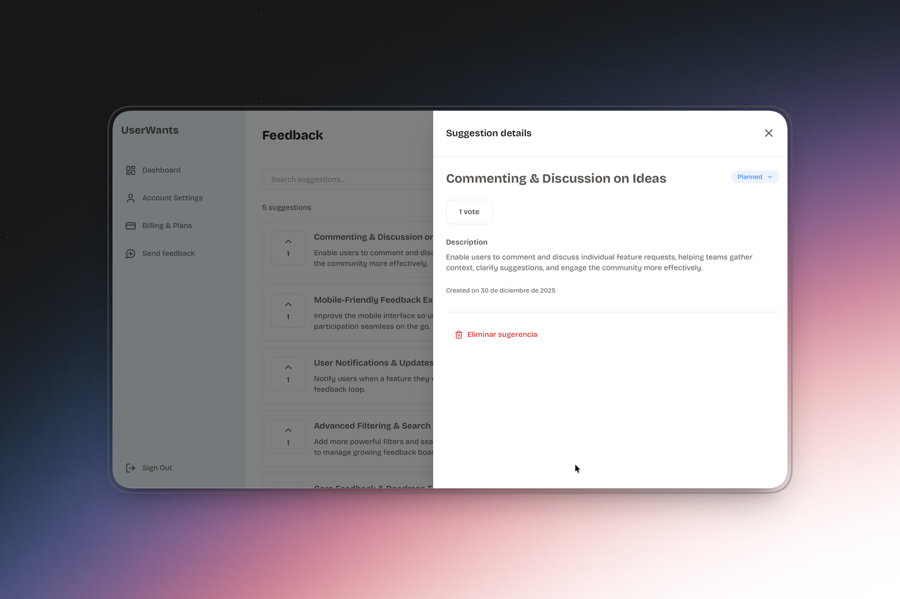
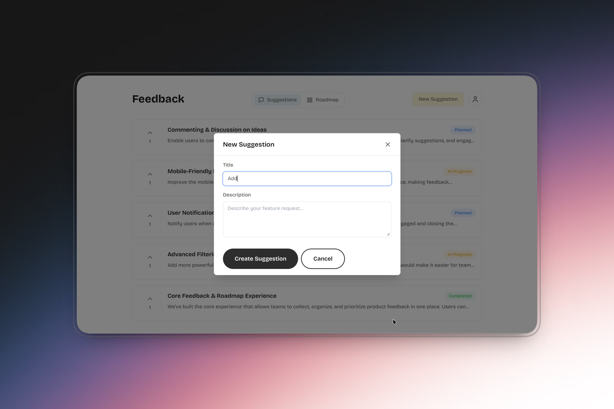

---

## 10. [Whyze](https://www.producthunt.com/products/whyze?utm_campaign=producthunt-api&utm_medium=api-v2&utm_source=Application%3A+antigravity_test+%28ID%3A+258588%29)
**Votes**: 12 | **도입 난이도**: 중 | **신뢰도**: 중
**Tagline**: Understand why users leave your product — not just where

**태그**: AI, Analytics, User Behavior, Funnel Analysis, AI Tool

### 📌 한 줄 요약
Whyze는 AI 기반으로 사용자 이탈 원인을 분석하여, 단순히 차트만 보여주는 것이 아니라 실행 가능한 인사이트를 빠르게 제공하여 개발팀의 사용자 경험 개선 작업을 가속화합니다.

### 🔑 핵심 기능
- AI를 이용한 퍼널 분석 및 이탈 원인 자동 분석
- 차트 대신 근본 원인 분석 제공
- 실행 가능한 인사이트를 즉시 제공

### 🧑‍💻 개발자 관점
개발팀은 Whyze를 통해 사용자 이탈 문제의 근본적인 원인을 파악하고, 데이터 분석 없이도 빠르게 개선 아이디어를 도출하여 프로덕트 개선 속도를 높일 수 있습니다.

### 🚀 바로 실험할 액션
- Whyze를 통해 주요 퍼널의 이탈 원인 분석
- AI가 제시하는 개선 아이디어들을 실험에 적용
- 실험 결과를 Whyze를 통해 지속적으로 모니터링 및 개선

### ⚠️ 리스크/한계
- AI 분석의 정확도는 데이터 품질에 크게 의존적
- 제공되는 인사이트가 모든 사용자 이탈 원인을 포괄하지 못할 수 있음

### 🧭 불확실성 메모
Product Hunt 메타데이터만으로 판단했으므로, 실제 사용 편의성 및 분석 정확도는 다를 수 있습니다.

### 📸 스크린샷 및 갤러리
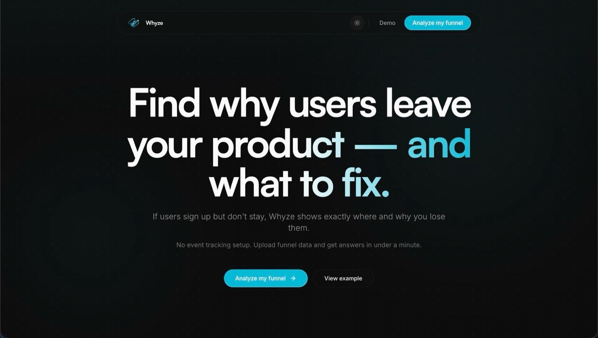
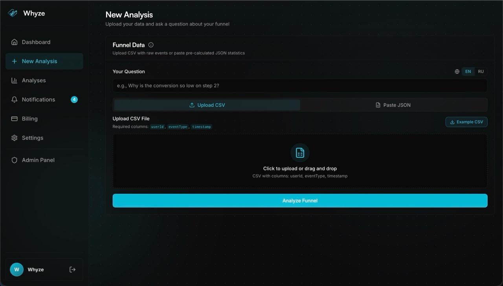
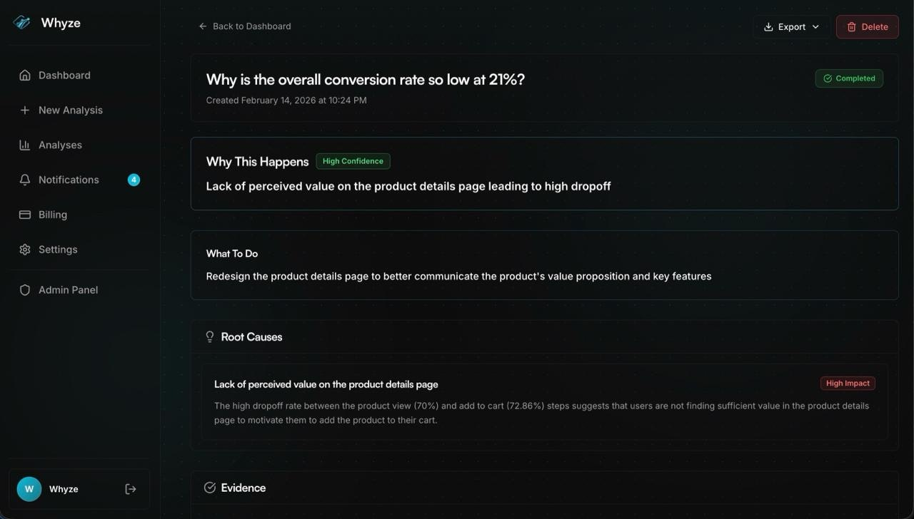

### 🎬 관련 영상
- [🎥 영상 보기](https://ph-files.imgix.net/871895c7-ff8e-4c48-bcc2-c951dae8936e.jpeg?auto=format)

---

