# 🚀 Product Hunt Daily Top 10 (2026-02-16)

## 1. [Base44 Backend Platform](https://www.producthunt.com/products/base44)
**Votes**: 318 | **도입 난이도**: 하 | **신뢰도**: 중
**Tagline**: The Backend for the age of AI
**서비스 링크**: https://www.producthunt.com/r/YKRAC6GSJ23QM3

**태그**: AI, Backend, DevTool, Automation, Agent, AI Tool, API

### 📌 이 서비스 한눈에 보기
AI 에이전트 기반 앱 개발을 위한 풀스택 백엔드 플랫폼으로, 복잡한 설정 없이 간단한 명령어로 배포하고 AI 에이전트 스킬을 활용하여 앱을 구축할 수 있습니다.

### 🔑 주요 기능
- AI 에이전트 기반 앱 개발에 최적화
- 단 한 줄 명령어로 풀스택 앱 배포
- 복잡한 API 대신 간단한 Skills 사용

### 🙋 사용자에게 어떤 점이 좋은가
백엔드 설정 및 관리에 시간을 쏟지 않고 AI 에이전트 개발에 집중할 수 있도록 해주며, 간단한 명령어로 빠르게 앱을 배포할 수 있습니다.

### ✅ 지금 바로 써볼 기능
- npx base44@latest create 명령어로 프로젝트 시작
- Claude Code 또는 Cursor 연동
- AI 에이전트 Skills 탐색

### ⚠️ 사용 전 확인할 점
- Claude Code 및 Cursor에 대한 의존성 존재
- 제공되는 AI 에이전트 Skills의 범위 확인 필요

### 🧭 확인이 더 필요한 정보
실제 프로덕션 환경에서의 확장성 및 성능에 대한 추가적인 정보가 필요합니다.

### 📸 스크린샷 및 갤러리
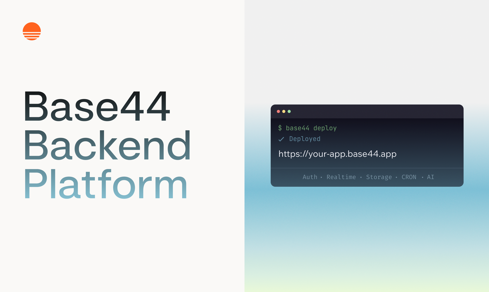
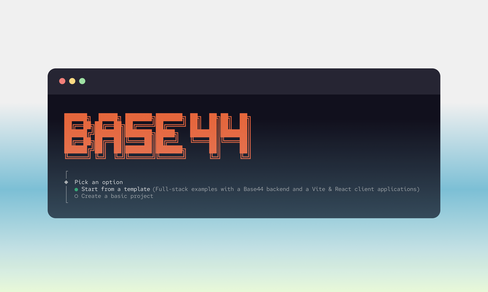

### 🎬 관련 영상
- [🎥 영상 보기](https://ph-files.imgix.net/338fedb1-c86f-4b75-a738-e054e9b3b024.jpeg?auto=format)

---

## 2. [Toolspend](https://www.producthunt.com/products/toolspend)
**Votes**: 270 | **도입 난이도**: 중 | **신뢰도**: 중
**Tagline**: Track AI spend, usage, and cost across tools
**서비스 링크**: https://www.producthunt.com/r/V7LVWH6JBUFCWG

**태그**: AI Tool, Design

### 🧭 확인이 더 필요한 정보
Product Hunt 설명(태그라인/디스크립션) 기반 정리이므로 실제 기능/가격/정책은 제품 페이지 확인이 필요합니다.

### 📸 스크린샷 및 갤러리
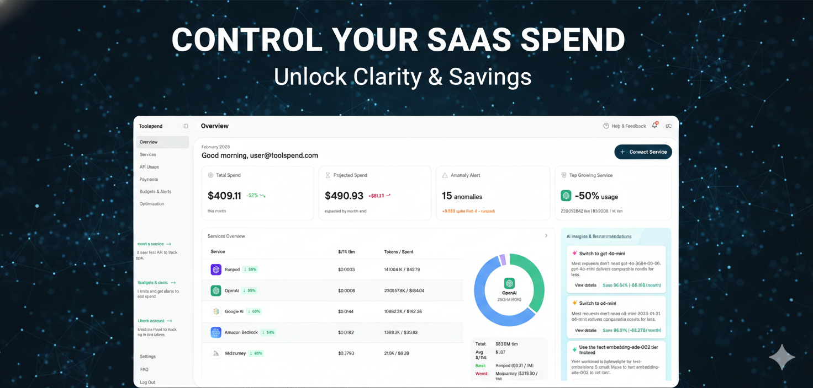
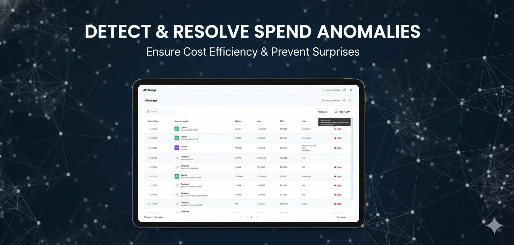
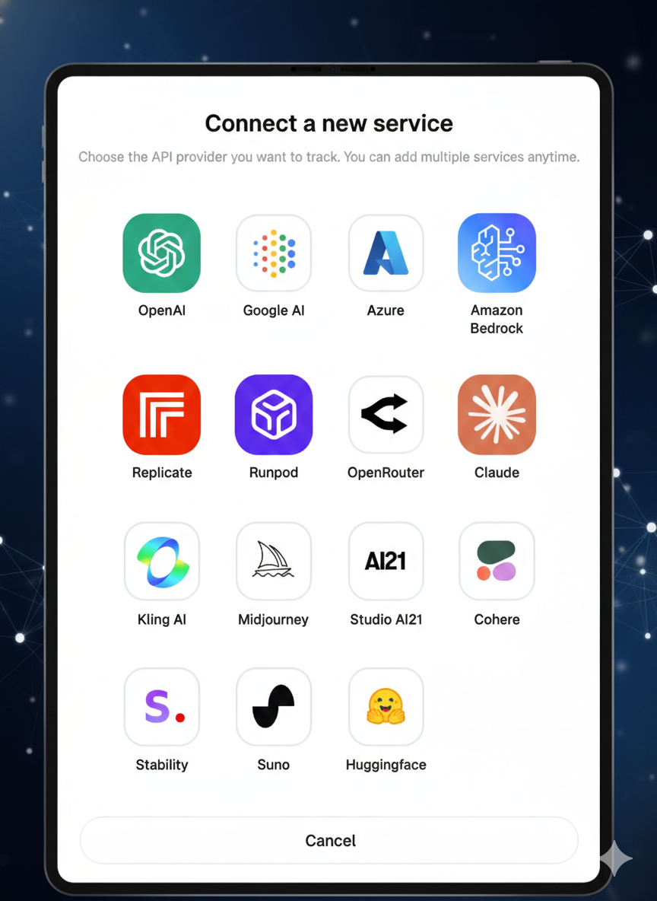

### 🎬 관련 영상
- [🎥 영상 보기](https://ph-files.imgix.net/d25aadef-a740-44ef-ab9a-24a4e083ff11.jpeg?auto=format)

---

## 3. [NVIDIA PersonaPlex](https://www.producthunt.com/products/nvidia)
**Votes**: 194 | **도입 난이도**: 중 | **신뢰도**: 중
**Tagline**: Natural Conversational AI With Any Role and Voice
**서비스 링크**: https://www.producthunt.com/r/R6F2KSJUGFNSSO

**태그**: AI, 대화형 AI, 자연어처리, NVIDIA, AI Tool

### 📌 이 서비스 한눈에 보기
NVIDIA PersonaPlex는 사용자 정의 가능한 목소리와 역할을 가진 자연스러운 대화형 AI 모델로, 중단과 채널 전환을 처리하며 역할 일관성을 유지하여 기존 시스템보다 뛰어난 성능을 제공합니다.

### 🔑 주요 기능
- 자연스러운 대화형 AI
- 사용자 정의 가능한 목소리 및 역할
- 중단 및 채널 전환 처리

### 🙋 사용자에게 어떤 점이 좋은가
PersonaPlex는 더욱 현실감 있고 개인화된 AI 대화 경험을 제공하여 다양한 분야에서 활용 가능합니다. 특히 챗봇, 가상 비서, 게임 캐릭터 등에 적용하여 사용자 만족도를 높일 수 있습니다.

### ✅ 지금 바로 써볼 기능
- 다양한 역할 시뮬레이션
- 다양한 목소리 테스트
- 실제 대화 시나리오 적용

### ⚠️ 사용 전 확인할 점
- PersonaPlex의 성능은 특정 역할 및 목소리에 따라 달라질 수 있습니다.
- 지나치게 복잡한 역할은 모델 성능 저하를 야기할 수 있습니다.

### 🧭 확인이 더 필요한 정보
PersonaPlex의 한국어 지원 수준 및 다양한 환경에서의 성능에 대한 추가 정보가 필요합니다.

### 📸 스크린샷 및 갤러리
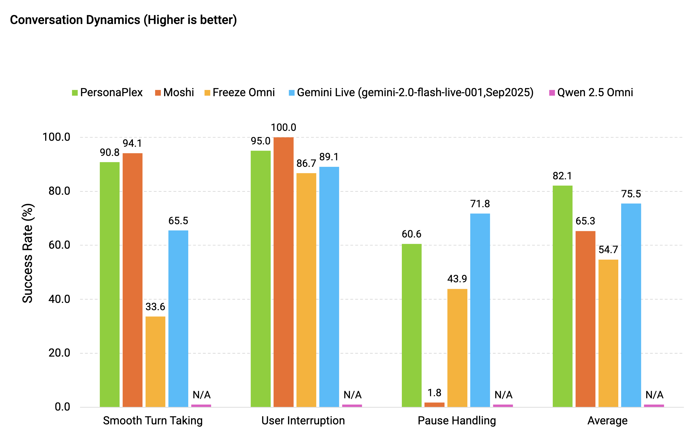
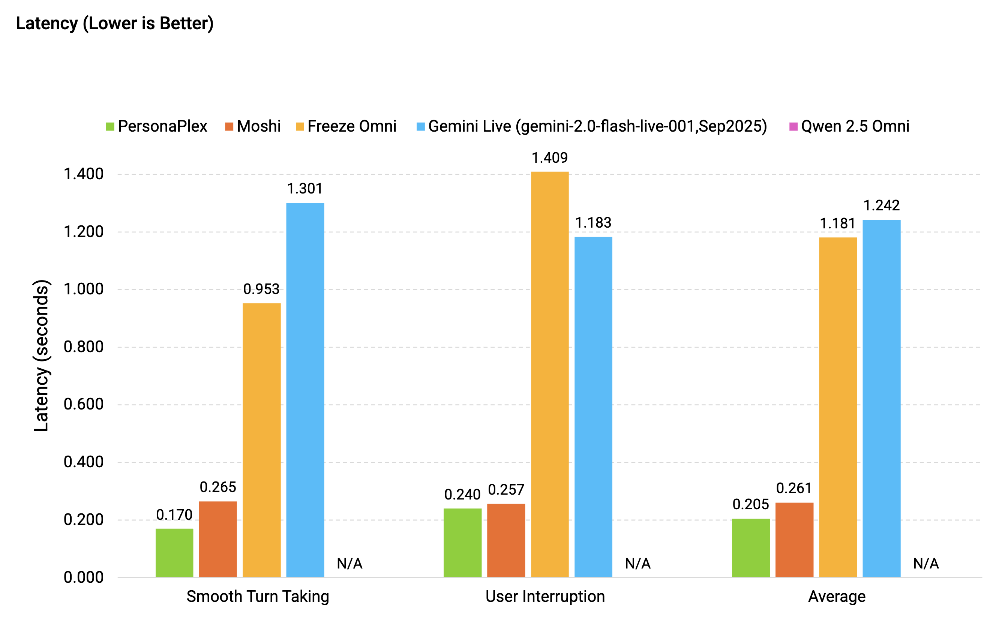
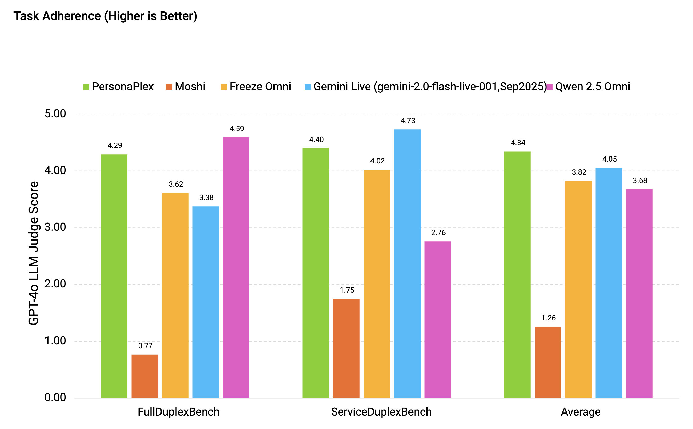

---

## 4. [JDoodle.ai MCP](https://www.producthunt.com/products/jdoodle-ai)
**Votes**: 162 | **도입 난이도**: 중 | **신뢰도**: 중
**Tagline**: Build and deploy web apps straight from ChatGPT/Claude
**서비스 링크**: https://www.producthunt.com/r/CUENJ7UZDJ2RHR

**태그**: DevTool, AI, 웹 개발, 자동화, Automation, AI Tool, Chat

### 📌 이 서비스 한눈에 보기
JDoodle.ai MCP는 ChatGPT/Claude와 연동하여 채팅 인터페이스를 통해 웹사이트 및 웹 앱을 구축하고 배포할 수 있게 해줍니다. 실시간 미리보기를 통해 반복적인 수정 및 업데이트가 가능하며, 프론트엔드, 백엔드, 풀스택 개발까지 지원합니다.

### 🔑 주요 기능
- ChatGPT/Claude 연동을 통한 채팅 기반 웹 개발
- 실시간 미리보기 및 반복적인 업데이트 지원
- 프론트엔드, 백엔드, 풀스택 개발 가능

### 🙋 사용자에게 어떤 점이 좋은가
개발 과정을 간소화하고, AI와의 협업을 통해 빠르게 웹 앱을 제작하고 배포할 수 있습니다. 특히 실시간 미리보기 기능은 개발 효율성을 높여줍니다.

### ✅ 지금 바로 써볼 기능
- ChatGPT/Claude를 통해 간단한 웹 페이지 초안 생성해보기
- 실시간 미리보기 기능을 활용하여 디자인 수정해보기
- 데이터베이스 연동하여 풀스택 앱 개발 시도해보기

### ⚠️ 사용 전 확인할 점
- AI 모델의 정확도에 따라 결과물의 품질이 달라질 수 있습니다.
- 복잡한 기능 구현 시 AI의 한계에 부딪힐 수 있습니다.

### 🧭 확인이 더 필요한 정보
지원하는 데이터베이스 종류와 AI 모델의 최신 업데이트 정보 확인이 필요합니다.

### 📸 스크린샷 및 갤러리
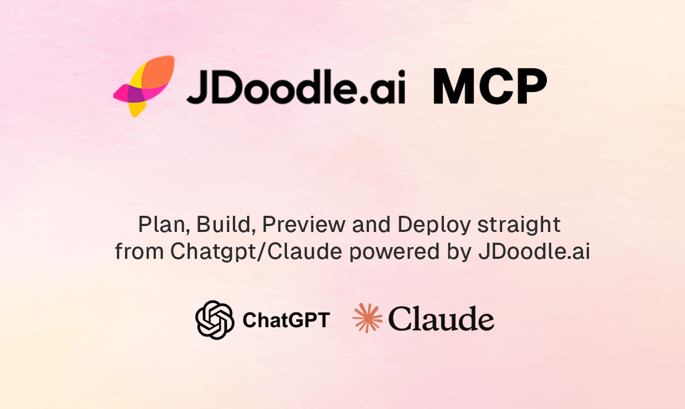

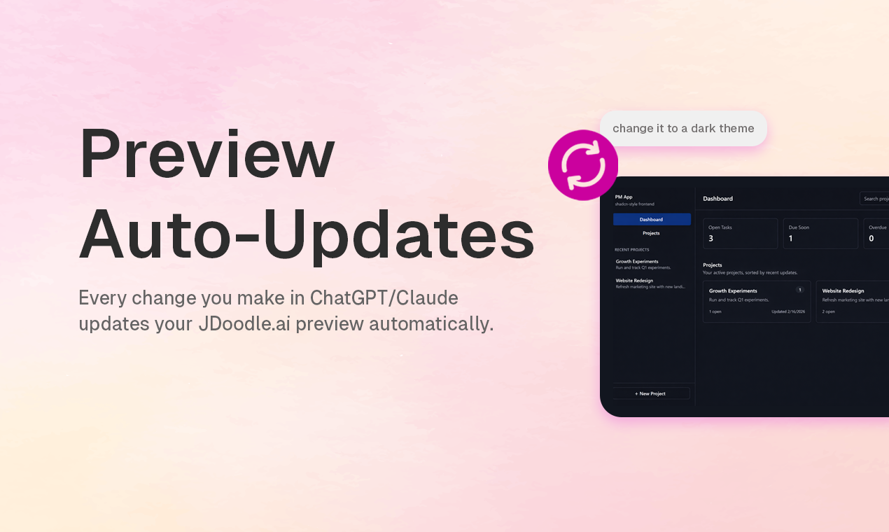

### 🎬 관련 영상
- [🎥 영상 보기](https://ph-files.imgix.net/cf1ff1ce-7fa2-4252-a8d5-35392b3408bf.jpeg?auto=format)

---

## 5. [PenguinBot AI](https://www.producthunt.com/products/penguinbot-ai)
**Votes**: 158 | **도입 난이도**: 중 | **신뢰도**: 중
**Tagline**: Your AI-Employee Working 24/7
**서비스 링크**: https://www.producthunt.com/r/UQD2NEGBYHLXKS

**태그**: AI비서, 자동화, 업무 효율성, 생산성, Automation, AI Tool, Email

### 📌 이 서비스 한눈에 보기
PenguinBot은 24시간 쉬지 않고 이메일 관리, 작업 스케줄링, 문서 작성, 워크플로우 실행 등 다양한 업무를 자동화하여 사용자가 핵심 업무에 집중할 수 있도록 돕는 AI 비서입니다.

### 🔑 주요 기능
- 대화형 인터페이스로 간편한 업무 지시
- 자동화된 계획, 실행, 진행 관리
- 24시간 연중무휴 운영 및 보안

### 🙋 사용자에게 어떤 점이 좋은가
반복적인 업무 부담을 줄여주고, 시간과 노력을 절약하여 더 중요한 일에 집중할 수 있도록 도와줍니다. 특히 이메일 관리나 문서 작업과 같은 일상적인 업무에 유용합니다.

### ✅ 지금 바로 써볼 기능
- 이메일 자동 관리 설정
- 반복적인 작업 자동화 워크플로우 구축
- 문서 자동 생성 기능 사용

### ⚠️ 사용 전 확인할 점
- 정확한 업무 지시를 위한 명확한 커뮤니케이션 필요
- 자동화 범위 및 보안 설정 확인

### 🧭 확인이 더 필요한 정보
PenguinBot의 데이터 보안 수준 및 자동화 정확도에 대한 추가 정보 확인이 필요합니다.

### 📸 스크린샷 및 갤러리

### 🎬 관련 영상
- [🎥 영상 보기](https://ph-files.imgix.net/16fb8747-1901-4d78-aec6-bf2b12be773f.jpeg?auto=format)

---

## 6. [Marketing Agents Squad](https://www.producthunt.com/products/marketing-agents-squad)
**Votes**: 124 | **도입 난이도**: 하 | **신뢰도**: 중
**Tagline**: Find AI agents to delegate your daily marketing grind
**서비스 링크**: https://www.producthunt.com/r/R4PYS7COXP2PZW

**태그**: AI 마케팅, 자동화, 생산성, 마케팅, Agent, AI Tool, Marketing

### 📌 이 서비스 한눈에 보기
마케팅 업무를 자동화해줄 250개 이상의 AI 에이전트들을 활용하여 마치 숙련된 인턴을 250명 고용한 듯한 경험을 누리세요.

### 🔑 주요 기능
- 250개 이상의 마케팅 특화 AI 에이전트 제공
- 마케팅 맥락을 이해하여 즉각적인 전문 결과물 생성
- 별도의 교육 없이 바로 사용 가능

### 🙋 사용자에게 어떤 점이 좋은가
반복적인 마케팅 업무를 자동화하여 시간과 노력을 절약하고, 더 중요한 전략적 업무에 집중할 수 있도록 돕습니다.

### ✅ 지금 바로 써볼 기능
- 가장 필요한 마케팅 업무에 맞는 에이전트 탐색
- 목표를 구체적으로 설명하여 결과물 확인
- 다양한 에이전트 활용하여 마케팅 프로세스 최적화

### ⚠️ 사용 전 확인할 점
- 제공되는 AI 에이전트의 전문성 및 결과물의 품질 확인 필요
- 데이터 보안 및 개인 정보 보호 정책 확인 필요

### 🧭 확인이 더 필요한 정보
각 AI 에이전트의 성능과 사용 후기에 대한 추가적인 정보가 필요합니다.

### 📸 스크린샷 및 갤러리

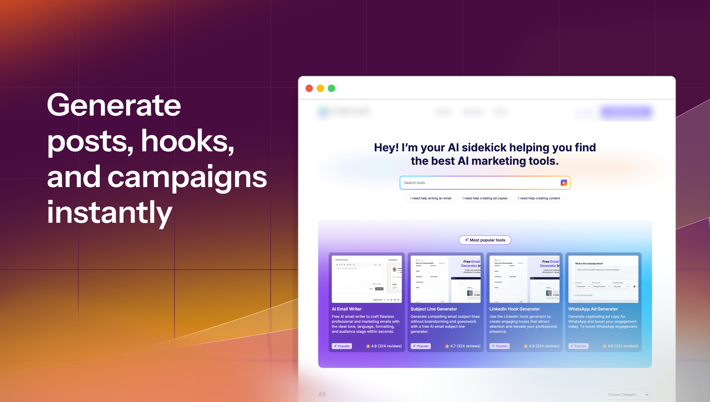
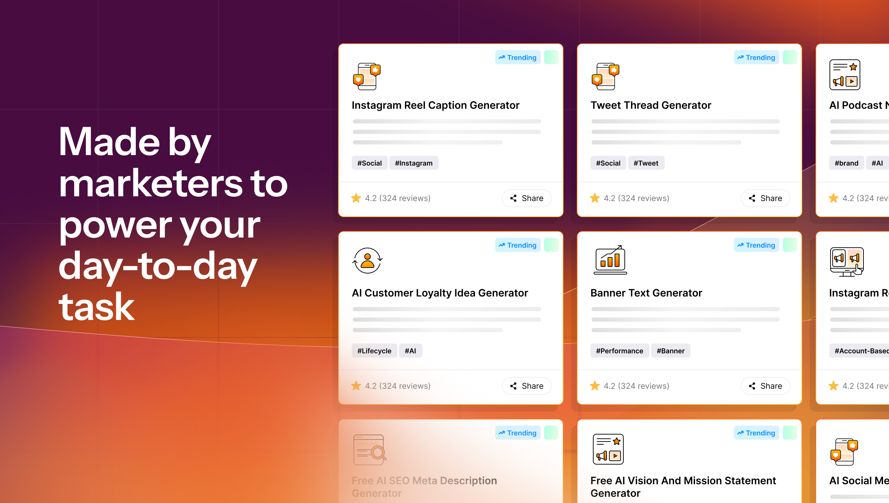

---

## 7. [Agent Bar](https://www.producthunt.com/products/agent-bar)
**Votes**: 121 | **도입 난이도**: 중 | **신뢰도**: 중
**Tagline**: Run Claude Code from your menu bar
**서비스 링크**: https://www.producthunt.com/r/MEJKSMRKJ5QV7Q

**태그**: Agent, DevTool

### 🧭 확인이 더 필요한 정보
Product Hunt 설명(태그라인/디스크립션) 기반 정리이므로 실제 기능/가격/정책은 제품 페이지 확인이 필요합니다.

### 📸 스크린샷 및 갤러리
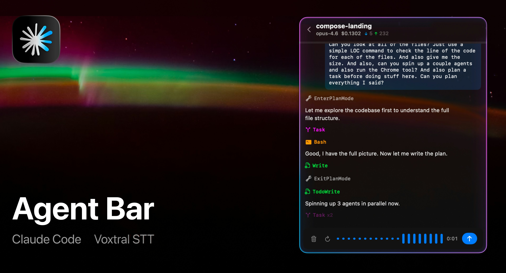
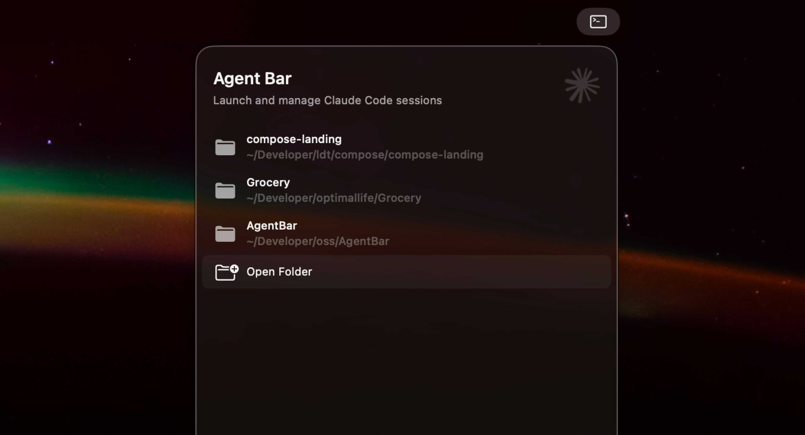
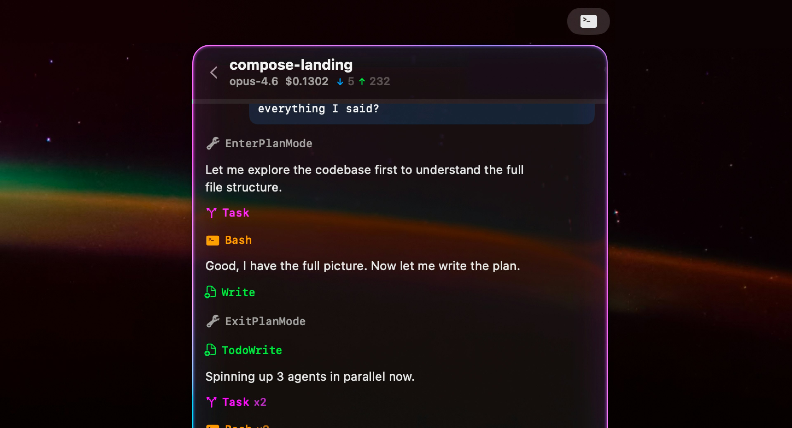

---

## 8. [chowder.dev](https://www.producthunt.com/products/chowder-2)
**Votes**: 117 | **도입 난이도**: 중 | **신뢰도**: 중
**Tagline**: Single API for launching OpenClaw instances.
**서비스 링크**: https://www.producthunt.com/r/O2XPCOWGXMDSZA

**태그**: AI Tool, API

### 🧭 확인이 더 필요한 정보
Product Hunt 설명(태그라인/디스크립션) 기반 정리이므로 실제 기능/가격/정책은 제품 페이지 확인이 필요합니다.

### 📸 스크린샷 및 갤러리
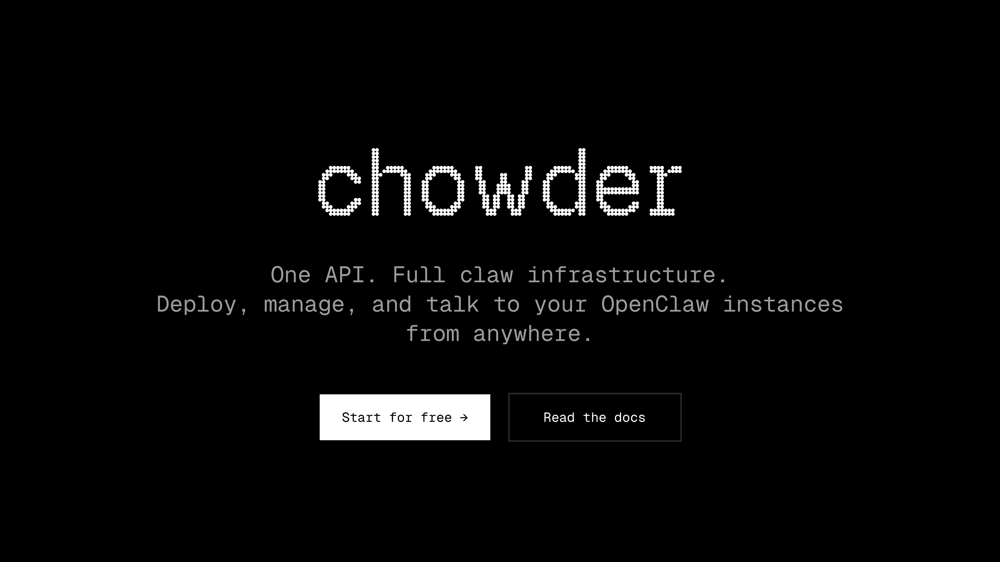
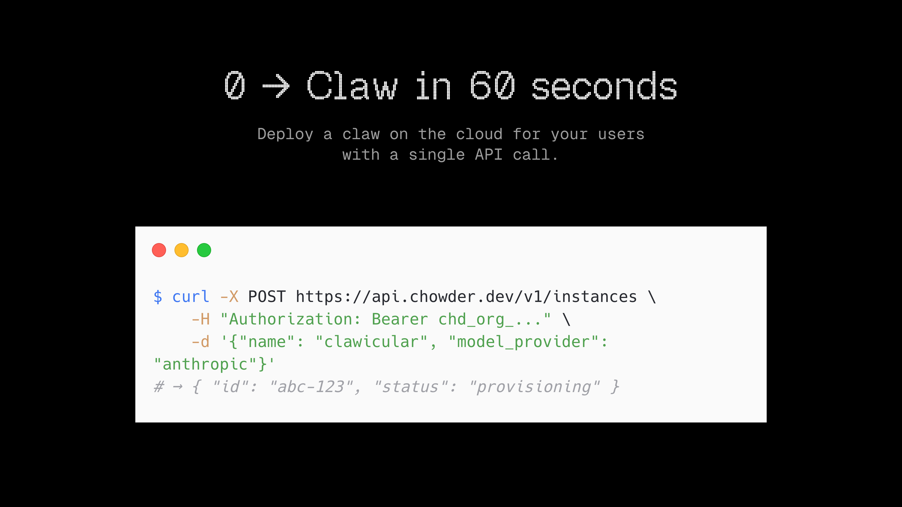
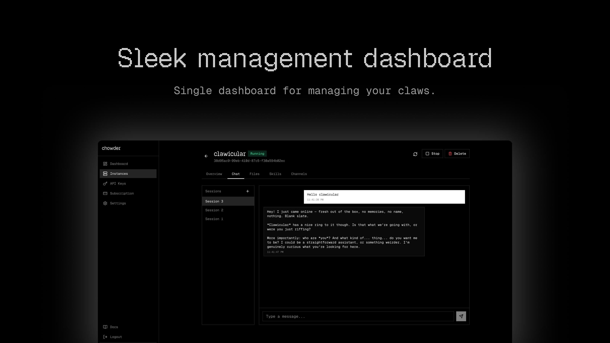

---

## 9. [MockAPI Dog](https://www.producthunt.com/products/mockapi-dog)
**Votes**: 111 | **도입 난이도**: 하 | **신뢰도**: 중
**Tagline**: Instant mock REST & LLM APIs - free, no signup required
**서비스 링크**: https://www.producthunt.com/r/ZSRQJDFIG7B4JC

**태그**: API, Mock API, LLM, 개발, 테스팅, AI Tool

### 📌 이 서비스 한눈에 보기
프론트엔드 개발, 테스팅, AI 개발자를 위한 가입 없이 바로 사용 가능한 무료 REST API 및 LLM 스트리밍 엔드포인트 Mock API 제공

### 🔑 주요 기능
- 가입 불필요, 즉시 사용 가능
- REST API 및 LLM 스트리밍 엔드포인트 지원
- 프론트엔드 개발, 테스팅, AI 개발에 최적화

### 🙋 사용자에게 어떤 점이 좋은가
백엔드 개발 없이도 즉시 API를 구축하고 테스트하여 개발 속도를 높이고, AI 모델의 스트리밍 응답을 간편하게 시뮬레이션할 수 있습니다.

### ✅ 지금 바로 써볼 기능
- 간단한 REST API 생성해보기
- LLM 스트리밍 엔드포인트 테스트해보기
- 프론트엔드 연동 테스트에 활용해보기

### ⚠️ 사용 전 확인할 점
- 무료 서비스이므로 사용량 제한 확인 필요
- 데이터 저장 및 보안 정책 확인 필요

### 🧭 확인이 더 필요한 정보
실제 서비스 환경에서의 성능 및 확장성에 대한 정보는 추가 확인이 필요합니다.

### 📸 스크린샷 및 갤러리
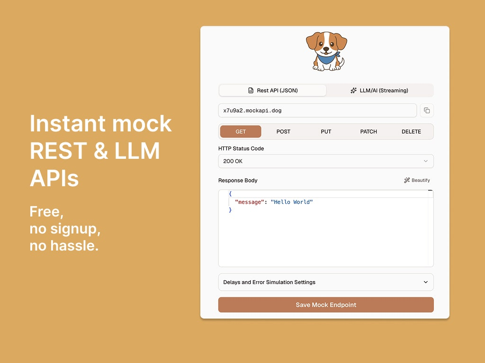
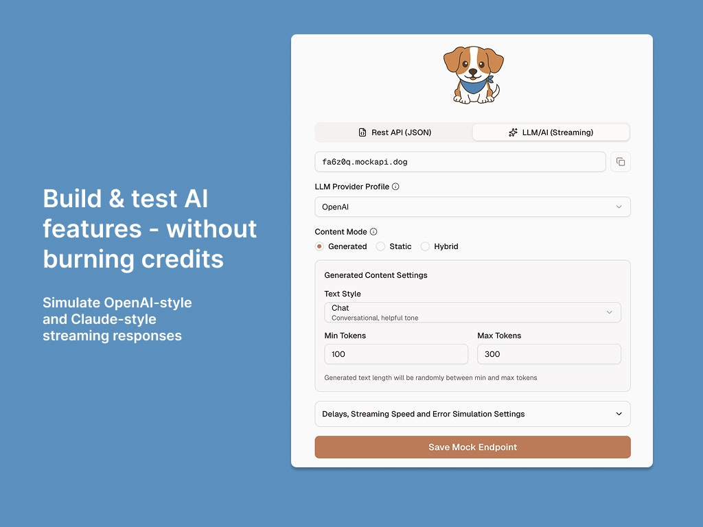
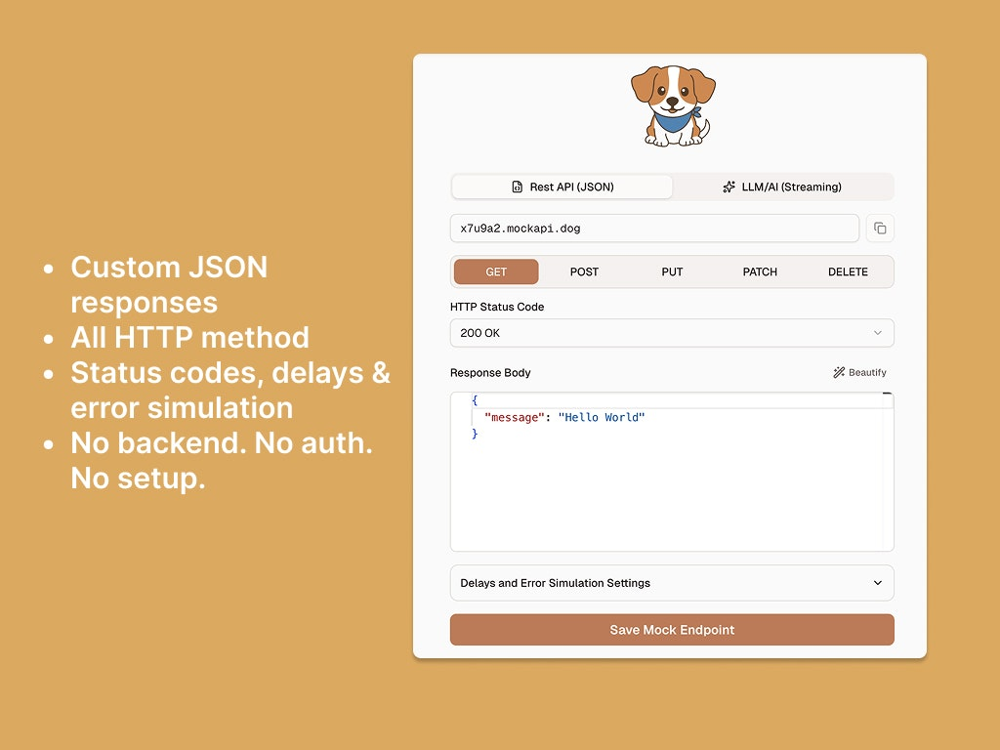

---

## 10. [Enough Cream](https://www.producthunt.com/products/enough-cream)
**Votes**: 109 | **도입 난이도**: 중 | **신뢰도**: 중
**Tagline**: Perfect coffee, every time.
**서비스 링크**: https://www.producthunt.com/r/KMF4YPPZNWCRQT

**태그**: 커피, 레시피, 자동화, 개인화, 유틸리티, AI Tool

### 📌 이 서비스 한눈에 보기
더 이상 크림 양 조절 실패는 없다! Enough Cream으로 완벽한 나만의 커피 레시피를 만들고 매번 동일한 맛을 즐기세요.

### 🔑 주요 기능
- 실시간 커피 색상 분석
- 사용자 맞춤형 크림 양 설정
- 매번 일관된 커피 맛 유지

### 🙋 사용자에게 어떤 점이 좋은가
더 이상 크림을 너무 많이 넣거나 적게 넣어 커피 맛을 망칠 일 없이, 앱이 알려주는 대로 따라하면 언제나 완벽한 황금비율 커피를 만들 수 있습니다.

### ✅ 지금 바로 써볼 기능
- 나만의 이상적인 커피 색상 저장하기
- 커피에 크림을 넣으면서 앱의 실시간 분석 기능 사용하기
- 다양한 원두와 크림 종류에 따른 최적 비율 찾아보기

### ⚠️ 사용 전 확인할 점
- 정확한 색상 분석을 위해 밝은 조명 필요
- 스마트폰 카메라 성능에 따라 결과가 다를 수 있음

### 🧭 확인이 더 필요한 정보
다양한 종류의 커피와 크림에 대한 앱의 색상 분석 정확도에 대한 추가 정보가 필요합니다.

### 📸 스크린샷 및 갤러리

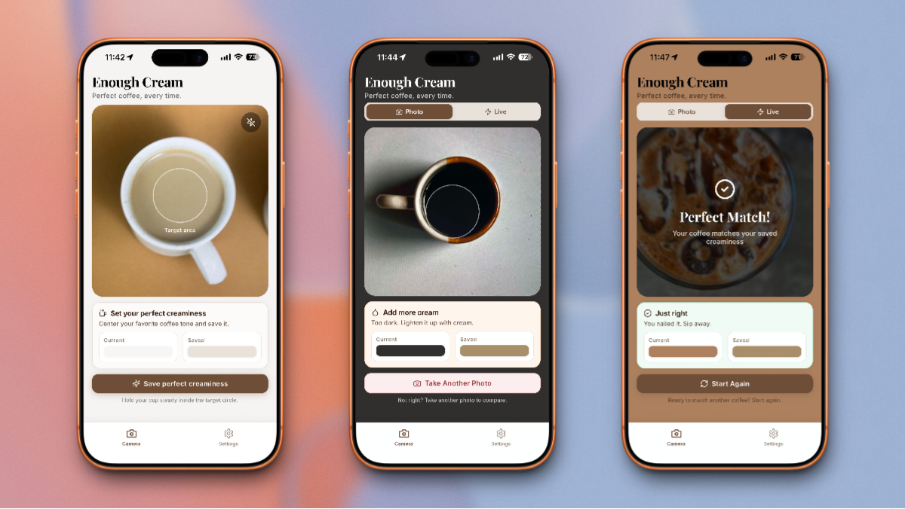
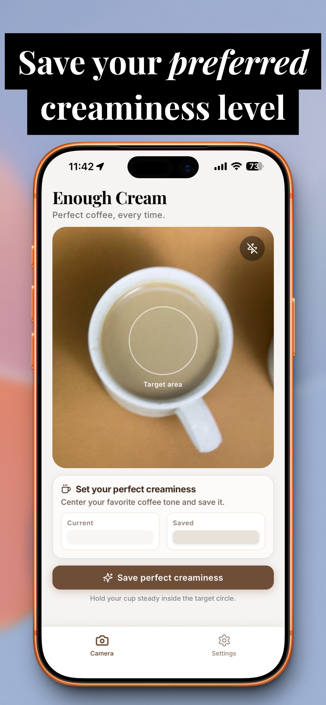

---

