# 🚀 Product Hunt Daily Top 10 (2026-02-17)

## 1. [Figr AI](https://www.producthunt.com/products/figr-design-research-simplified)
**Votes**: 321 | **도입 난이도**: 중 | **신뢰도**: 중
**Tagline**: Product-aware AI that thinks through UX
**서비스 링크**: https://www.producthunt.com/r/MSR5QNHU7TKR5L

**태그**: AI, UX, 프로덕트 관리, 자동화, 분석, Agent, AI Tool, Design, Analytics

### 📌 이 서비스 한눈에 보기
Figr AI는 프로덕트 관리자를 위한 AI 에이전트로, 앱의 UX를 분석하고 개선하여 더 나은 프로덕트를 만들도록 돕습니다.

### 🔑 주요 기능
- 실제 앱, Figma, 문서, 분석 데이터 연동을 통해 프로덕트 상황을 정확히 파악
- 20만 개 이상의 UX 패턴 기반으로 UX 리뷰, A/B 테스트, 프로토타입 제작 지원
- 앱 디자인 언어에 맞춰 일관성 있는 개선안 및 프로토타입 제시

### 🙋 사용자에게 어떤 점이 좋은가
Figr AI를 사용하면 프로덕트 관리자가 UX 개선에 필요한 분석 및 디자인 작업을 효율적으로 처리하고, 데이터 기반 의사 결정을 내릴 수 있습니다. 또한, 실제 앱 디자인에 맞는 프로토타입을 빠르게 제작하여 테스트할 수 있습니다.

### ✅ 지금 바로 써볼 기능
- Chrome 확장 프로그램을 설치하여 실제 앱 연동
- Figma 디자인 파일 또는 문서 데이터 가져오기
- UX 리뷰 기능을 통해 앱의 문제점 진단

### ⚠️ 사용 전 확인할 점
- Chrome 확장 프로그램 호환성 확인 필요
- 지원하는 데이터 형식 및 분석 범위 확인 필요

### 🧭 확인이 더 필요한 정보
20만 개 이상의 UX 패턴 데이터베이스의 최신 업데이트 주기 및 정확도 확인이 필요합니다.

### 📸 스크린샷 및 갤러리
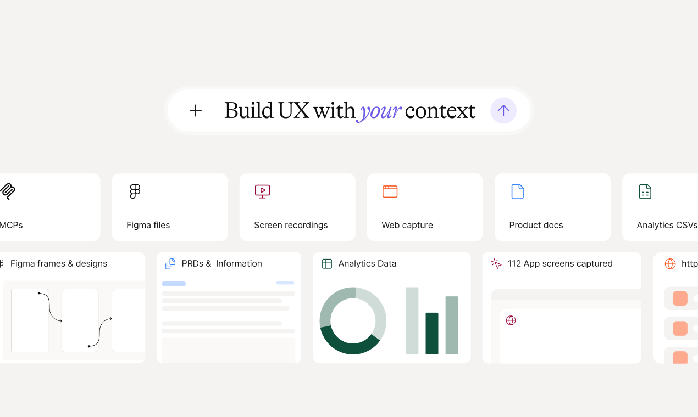
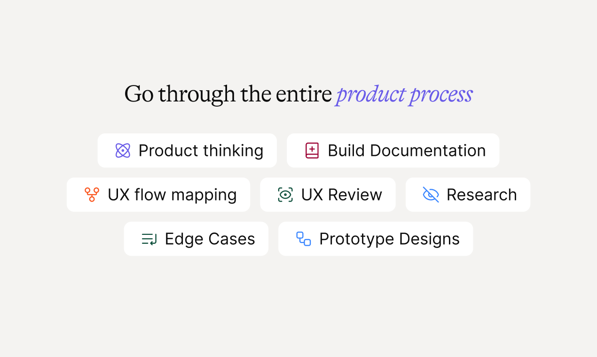
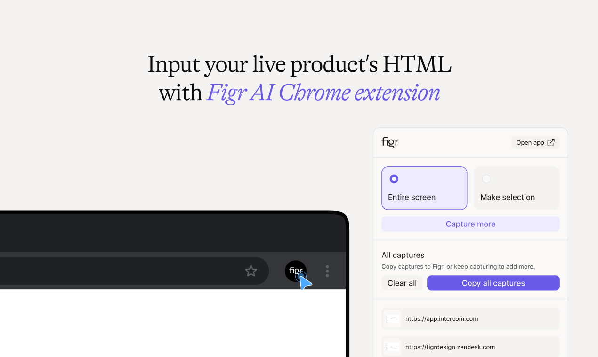

### 🎬 관련 영상
- [🎥 영상 보기](https://ph-files.imgix.net/ffe67380-01a2-4a6b-b8be-e64f9d4ba70e.jpeg?auto=format)

---

## 2. [Boost.space v5](https://www.producthunt.com/products/boost-space)
**Votes**: 236 | **도입 난이도**: 중 | **신뢰도**: 중
**Tagline**: Shared Context for your AI Agents & Automations
**서비스 링크**: https://www.producthunt.com/r/Q2VU5ODIIJU2XZ

**태그**: AI, 자동화, 데이터 분석, 워크플로우, 비즈니스 인텔리전스, Agent, Automation, AI Tool, LLM

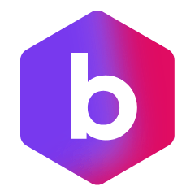

### 📌 이 서비스 한눈에 보기
Boost.space v5는 AI 에이전트와 자동화 시스템이 업무 맥락을 이해하도록 돕는 '공유된 두뇌'를 제공하여, 데이터 사일로 문제를 해결하고 더욱 효율적인 비즈니스 인텔리전스 시스템을 구축하도록 돕습니다.

### 🔑 주요 기능
- AI 에이전트 및 자동화에 공유 맥락 제공
- 과거 상호작용 및 데이터베이스 상태를 활용
- 업무 흐름의 일관성 및 효율성 향상

### 🙋 사용자에게 어떤 점이 좋은가
AI 에이전트와 자동화 시스템의 성능을 극대화하여, 비즈니스 워크플로우의 효율성을 높이고 데이터 기반 의사 결정을 지원합니다. 분산된 정보를 통합하여 전체적인 시야를 확보할 수 있습니다.

### ✅ 지금 바로 써볼 기능
- 자동화 워크플로우에 Boost.space 적용
- AI 에이전트의 컨텍스트 레이어로 활용
- 데이터베이스 연동을 통한 실시간 정보 활용

### ⚠️ 사용 전 확인할 점
- 초기 설정 및 데이터 연동 과정의 복잡성
- 기존 시스템과의 호환성 검토 필요

### 🧭 확인이 더 필요한 정보
정확한 성능 향상 정도는 실제 사용 환경 및 데이터 특성에 따라 달라질 수 있습니다.

### 📸 스크린샷 및 갤러리
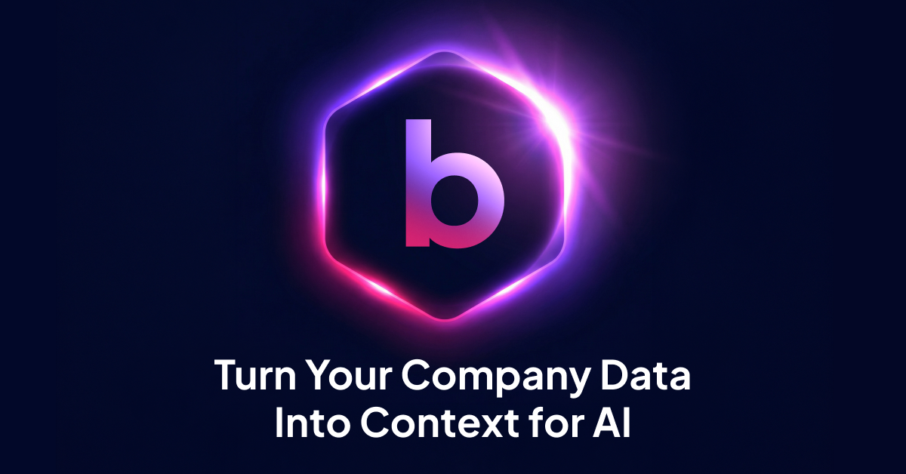

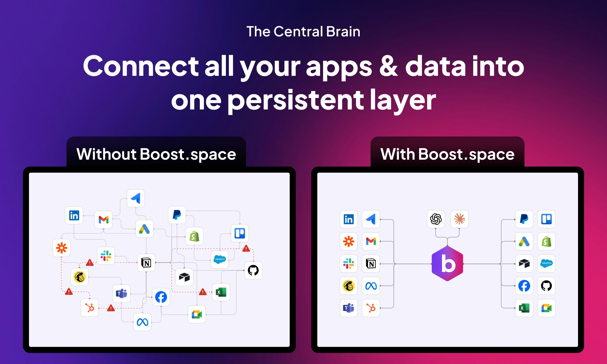

### 🎬 관련 영상
- [🎥 영상 보기](https://ph-files.imgix.net/32b3aa5b-7fb4-48ec-acc4-188f0a964207.jpeg?auto=format)

---

## 3. [Qwen3.5](https://www.producthunt.com/products/qwen3)
**Votes**: 199 | **도입 난이도**: 중 | **신뢰도**: 중
**Tagline**: The 397B native multimodal agent with 17B active params
**서비스 링크**: https://www.producthunt.com/r/GSMFKQQ2OC33T6

**태그**: AI 모델, 멀티모달, 에이전트, 오픈소스, Agent

### 📌 이 서비스 한눈에 보기
Qwen3.5는 397B 파라미터 규모의 멀티모달 에이전트 모델로, 17B 모델 수준의 빠른 추론 속도를 제공하여 장기적인 에이전트 작업을 효율적으로 처리할 수 있습니다.

### 🔑 주요 기능
- 오픈 웨이트 모델로 자유로운 사용 가능
- 시각-언어 모델로 다양한 입력 처리
- 선형 어텐션 + MoE 하이브리드 아키텍처로 성능과 속도 모두 확보

### 🙋 사용자에게 어떤 점이 좋은가
복잡한 멀티모달 작업을 처리해야 하는 개발자에게 빠른 속도와 뛰어난 성능을 동시에 제공하며, 오픈 웨이트 모델이므로 자유롭게 실험하고 활용할 수 있습니다.

### ✅ 지금 바로 써볼 기능
- 장기 에이전트 작업에 활용해보기
- 이미지 및 텍스트 기반 작업에 적용해보기
- 모델 구조 및 파라미터 조정 실험해보기

### ⚠️ 사용 전 확인할 점
- 397B 모델 수준의 리소스 요구 가능성 고려
- 오픈 웨이트 모델 사용 관련 라이선스 확인

### 🧭 확인이 더 필요한 정보
실제 사용 환경에서의 성능 및 리소스 요구량에 대한 추가적인 정보가 필요합니다.

### 📸 스크린샷 및 갤러리
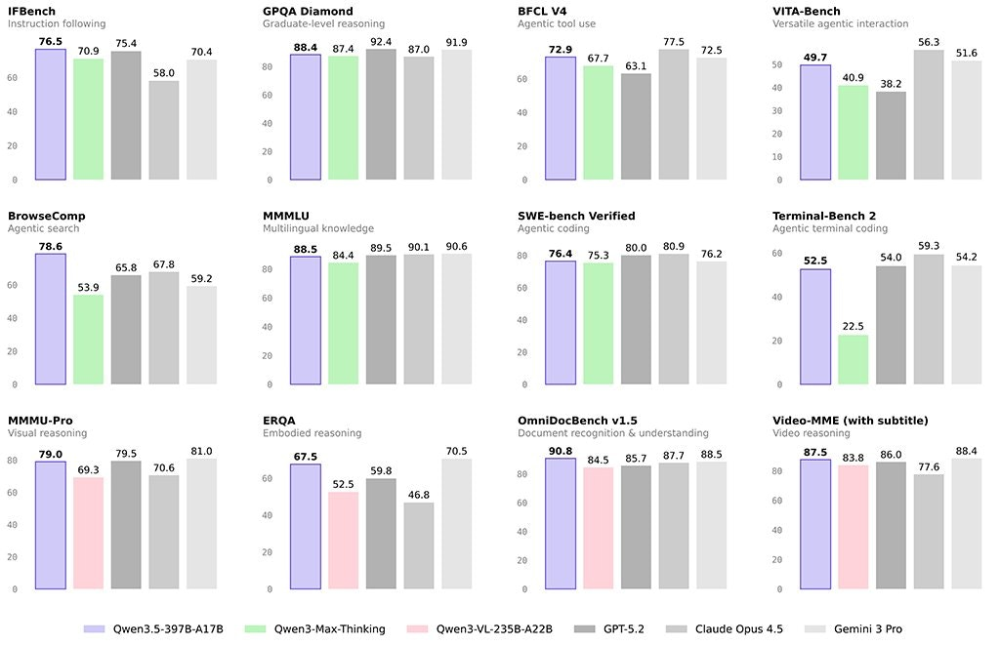
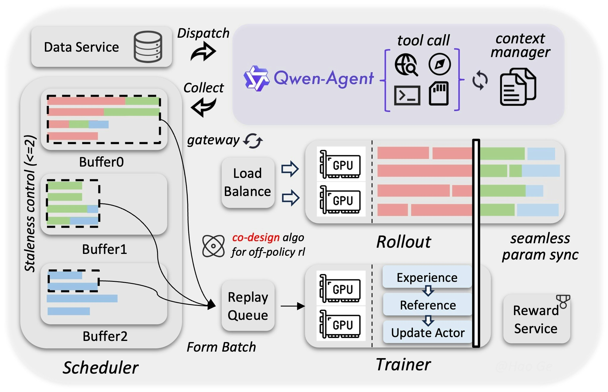
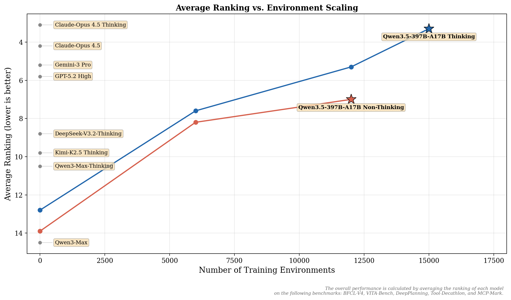

### 🎬 관련 영상
- [🎥 영상 보기](https://ph-files.imgix.net/d8a328ad-b244-40a0-8496-51f4084a31ca.jpeg?auto=format)

---

## 4. [Mozart for iOS](https://www.producthunt.com/products/mozart-ai)
**Votes**: 196 | **도입 난이도**: 하 | **신뢰도**: 중
**Tagline**: Make a song and a music video while you're on the go
**서비스 링크**: https://www.producthunt.com/r/XPJU46YLT7UOC6

**태그**: 음악, 뮤직비디오, 창작, iOS, Video

### 📌 이 서비스 한눈에 보기
아이디어 떠오르는 대로 즉석에서 음악과 뮤직비디오를 만들어 친구들과 공유하세요!

### 🔑 주요 기능
- 모바일 환경에서 간편하게 음악 스케치 가능
- 사진과 미디어를 활용한 맞춤형 뮤직비디오 제작
- 탭 한 번으로 간편하게 공유

### 🙋 사용자에게 어떤 점이 좋은가
이동 중에도 떠오르는 영감을 놓치지 않고 음악으로 표현하고, 나만의 뮤직비디오를 만들어 특별한 순간을 공유할 수 있습니다.

### ✅ 지금 바로 써볼 기능
- 떠오르는 멜로디를 즉시 녹음하여 스케치하기
- 사진이나 비디오 클립을 추가하여 뮤직비디오 만들기
- 친구들에게 완성된 음악과 뮤직비디오 공유하기

### ⚠️ 사용 전 확인할 점
- iOS 기기에서만 사용 가능
- 저작권 문제가 없는 미디어 사용 권장

### 🧭 확인이 더 필요한 정보
음악 제작 및 비디오 편집 기능의 상세 스펙 확인이 필요합니다.

### 📸 스크린샷 및 갤러리
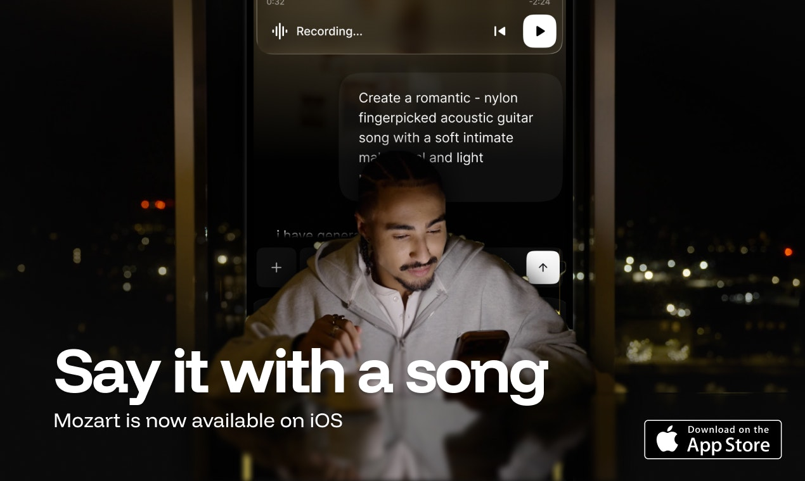
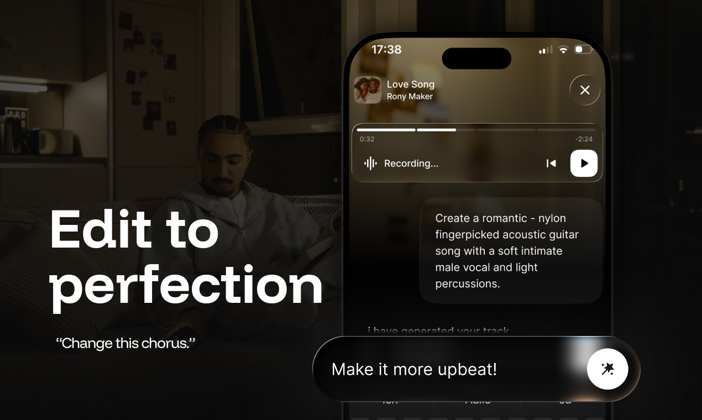

### 🎬 관련 영상
- [🎥 영상 보기](https://ph-files.imgix.net/8a824c40-40e1-48d5-9068-6006e524b02d.jpeg?auto=format)

---

## 5. [Layers](https://www.producthunt.com/products/layers-6)
**Votes**: 175 | **도입 난이도**: 중 | **신뢰도**: 중
**Tagline**: Marketing agents that know your code for better messaging
**서비스 링크**: https://www.producthunt.com/r/Z7SJIHSZH2W2CJ

**태그**: DevTool, 마케팅 자동화, 분석, 성장, Agent, Marketing

### 📌 이 서비스 한눈에 보기
개발 코드를 이해하는 마케팅 에이전트가 콘텐츠 제작, 소셜 포스팅, 광고 운영, 인사이트 분석까지 자동화하여 사용자 유입을 늘리고 개발에 집중할 수 있도록 돕습니다.

### 🔑 주요 기능
- 코드 이해 기반의 마케팅 전략 수립
- 콘텐츠, 소셜, 광고 자동화
- 성장 계획 수립 및 실행

### 🙋 사용자에게 어떤 점이 좋은가
개발자는 마케팅에 신경 쓰지 않고 제품 개발에만 집중할 수 있으며, 마케팅 담당자는 코드에 대한 이해 없이도 효과적인 마케팅 전략을 실행할 수 있습니다.

### ✅ 지금 바로 써볼 기능
- 성장 계획 자동 생성
- 콘텐츠 자동 생성 및 게시
- 광고 캠페인 자동 설정 및 운영

### ⚠️ 사용 전 확인할 점
- 코드 이해 기반 마케팅의 정확성 검증 필요
- 자동화된 콘텐츠의 품질 확인 필요

### 🧭 확인이 더 필요한 정보
실제 사용 사례 및 성공 사례를 통해 자동화 효율성을 확인해야 합니다.

### 📸 스크린샷 및 갤러리
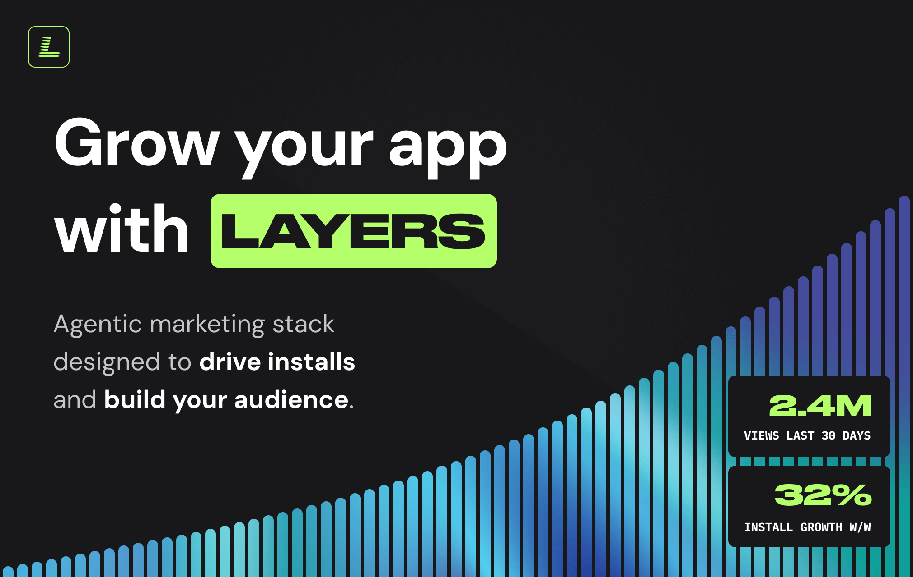
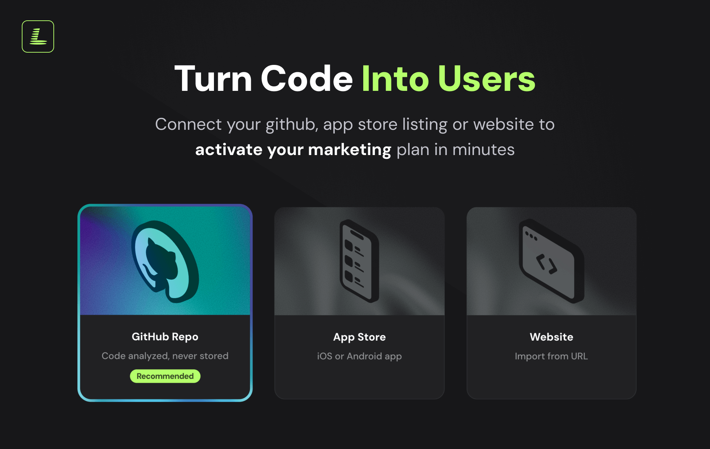
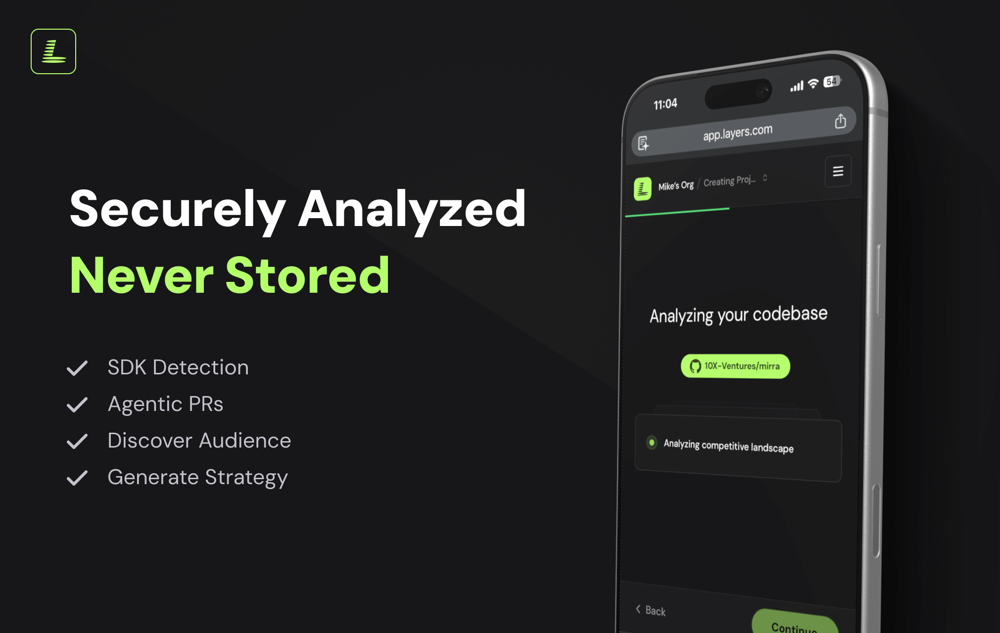

### 🎬 관련 영상
- [🎥 영상 보기](https://ph-files.imgix.net/9490e36e-0812-4209-9aaf-c18136e2b89f.jpeg?auto=format)

---

## 6. [MiniMax-M2.5](https://www.producthunt.com/products/minimax-m2-5)
**Votes**: 154 | **도입 난이도**: 중 | **신뢰도**: 중
**Tagline**: The first open model to beat Sonnet made for productivity
**서비스 링크**: https://www.producthunt.com/r/BEFJWYFLECP7ZP

**태그**: 생산성, 오픈소스, AI 모델, 자동화, 개발, Agent, Design, Productivity

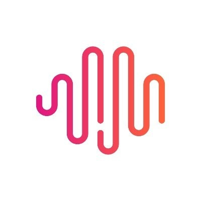

### 📌 이 서비스 한눈에 보기
MiniMax-M2.5는 생산성을 위해 설계된 오픈 소스 모델로, 코딩, 검색, 에이전트 도구 호출, 사무 작업 등 다양한 분야에서 최고 수준의 성능을 제공하며, 특히 복잡한 작업에서 효율적인 실행 속도를 자랑합니다.

### 🔑 주요 기능
- 오픈 소스 모델
- 코딩, 검색, 에이전트 작업 등 다양한 분야에서 SOTA 성능
- 복잡한 작업에서 빠른 실행 속도

### 🙋 사용자에게 어떤 점이 좋은가
MiniMax-M2.5는 다양한 분야에서 높은 성능을 요구하는 사용자에게 생산성 향상을 위한 강력한 도구를 제공하며, 특히 장기적인 에이전트 사용에 경제적인 솔루션이 될 수 있습니다.

### ✅ 지금 바로 써볼 기능
- 코딩 작업 성능 테스트
- 검색 작업 효율성 테스트
- 에이전트 기반 도구 호출 테스트

### ⚠️ 사용 전 확인할 점
- 오픈 소스 모델의 잠재적인 보안 취약점 확인
- 특정 작업 환경에서의 호환성 검토

### 🧭 확인이 더 필요한 정보
MiniMax-M2.5의 실제 사용 환경에서의 지속적인 성능과 안정성에 대한 사용자 피드백을 확인해야 합니다.

### 📸 스크린샷 및 갤러리
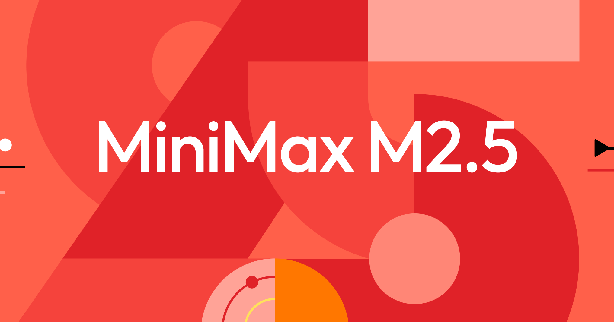
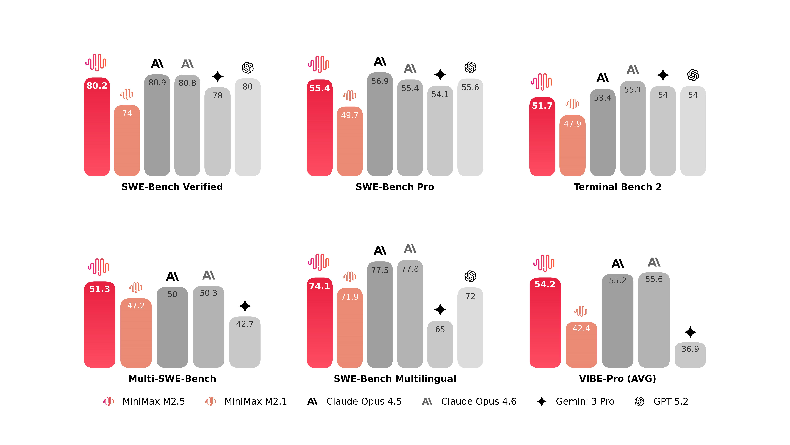
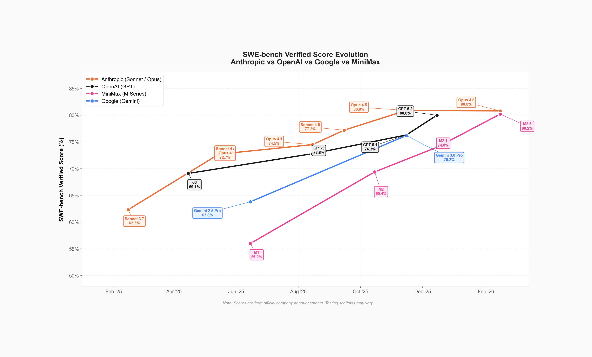

---

## 7. [Brainstream](https://www.producthunt.com/products/brainstream)
**Votes**: 138 | **도입 난이도**: 중 | **신뢰도**: 중
**Tagline**: Agentic AI notes: smart search, briefs & tasks
**서비스 링크**: https://www.producthunt.com/r/YKAIAZCZSR6VG7

**태그**: AI 노트, 생산성, 자동화, 작업 관리, Agent, AI Tool

### 📌 이 서비스 한눈에 보기
Brainstream은 AI 기반 노트 앱으로, 흩어진 생각을 정리하고 자동으로 작업을 생성하며, 개인 맞춤 브리핑까지 제공하여 생산성을 높여줍니다.

### 🔑 주요 기능
- AI 기반 자동 작업 생성 및 정리
- 음성, 텍스트, 사진 등 다양한 입력 방식 지원
- 개인 맞춤형 데일리/위클리 브리핑 제공

### 🙋 사용자에게 어떤 점이 좋은가
단순히 메모를 넘어, AI가 알아서 할 일을 만들고 정리해주어 시간을 절약하고 업무 효율을 높일 수 있습니다. 아이디어를 빠르게 캡쳐하고, AI가 나머지를 처리하도록 맡기세요.

### ✅ 지금 바로 써볼 기능
- 음성 메모로 아이디어 빠르게 기록하기
- 노트에서 자동으로 생성된 작업 확인하기
- 데일리 브리핑을 통해 하루 일정 정리하기

### ⚠️ 사용 전 확인할 점
- AI 기능의 정확도 및 개인 정보 처리 방침 확인 필요
- 복잡한 작업 분류 및 생성에는 한계가 있을 수 있음

### 🧭 확인이 더 필요한 정보
AI 기반 작업 생성 기능의 효율성과 사용자 맞춤 설정 범위에 대한 추가 정보가 필요합니다.

### 📸 스크린샷 및 갤러리
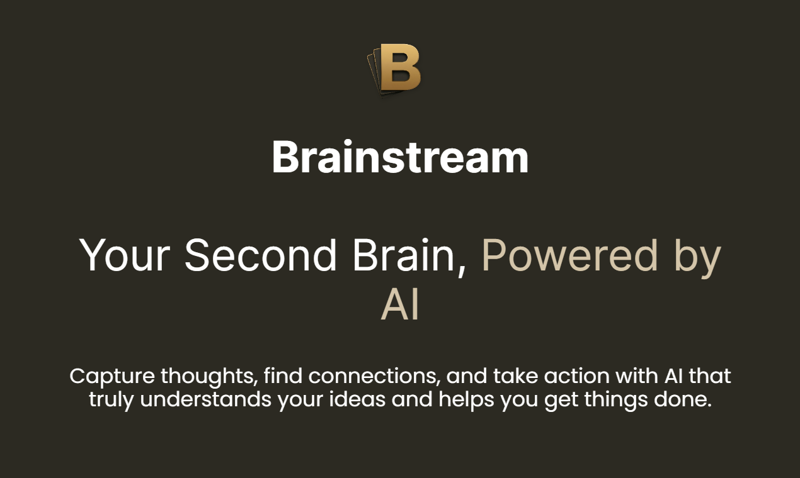
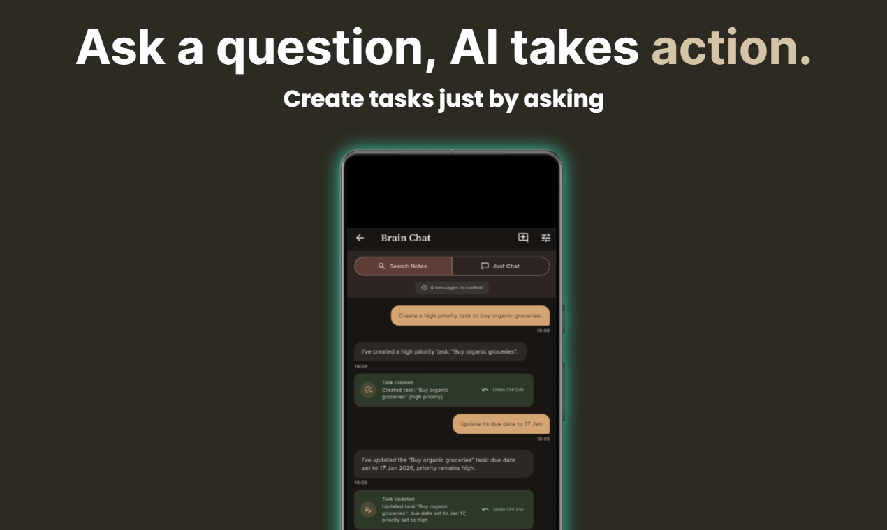
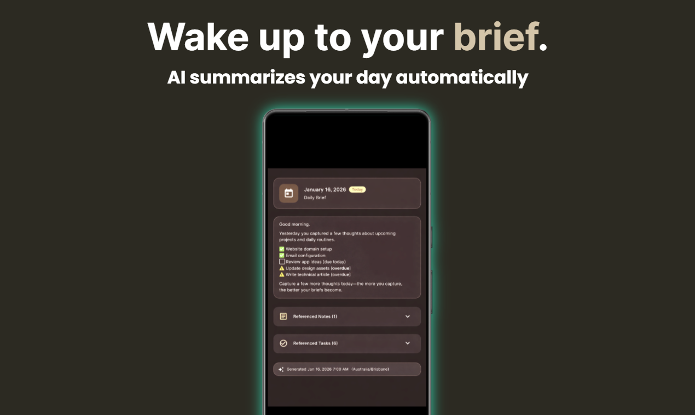

### 🎬 관련 영상
- [🎥 영상 보기](https://ph-files.imgix.net/0e14fd54-d5b8-4f1c-9e2d-0a331f262647.jpeg?auto=format)

---

## 8. [Vela](https://www.producthunt.com/products/vela-4)
**Votes**: 137 | **도입 난이도**: 중 | **신뢰도**: 중
**Tagline**: AI scheduling that works the way a great EA does
**서비스 링크**: https://www.producthunt.com/r/D4ZTFMAYEQILON

**태그**: AI, 자동화, 스케줄링, 생산성, Agent, AI Tool, Email

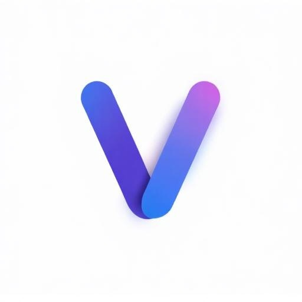

### 📌 이 서비스 한눈에 보기
Vela는 마치 유능한 비서처럼 작동하는 AI 스케줄링 에이전트로, 이메일, SMS, WhatsApp, 전화 등 다양한 채널을 통해 복잡한 미팅 일정을 효율적으로 관리해줍니다.

### 🔑 주요 기능
- AI 기반 자동 스케줄링
- 다양한 채널 지원 (이메일, SMS, WhatsApp, 전화)
- 미팅 우선순위 자동 판단

### 🙋 사용자에게 어떤 점이 좋은가
번거로운 미팅 일정 조율 과정을 자동화하여 시간을 절약하고, 중요한 미팅을 놓치지 않도록 도와줍니다. 특히 대규모 인터뷰 일정을 효율적으로 관리해야 할 때 유용합니다.

### ✅ 지금 바로 써볼 기능
- 미팅 일정 자동 조율 기능 사용해보기
- 여러 채널을 통한 일정 공유 기능 사용해보기
- 미팅 우선순위 설정 기능 확인해보기

### ⚠️ 사용 전 확인할 점
- AI가 판단하는 우선순위가 사용자의 의도와 다를 수 있음
- 지원 채널 및 언어 확인 필요

### 🧭 확인이 더 필요한 정보
정확한 가격 정보 및 지원되는 언어는 추가 확인이 필요합니다.

### 📸 스크린샷 및 갤러리
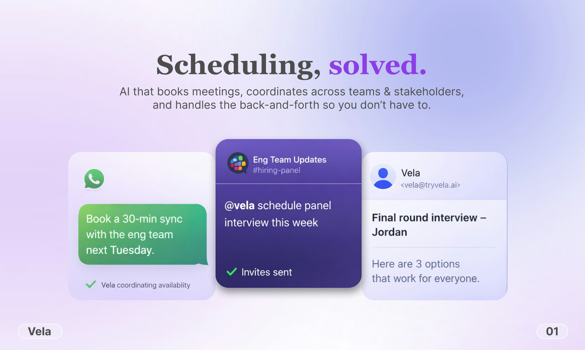
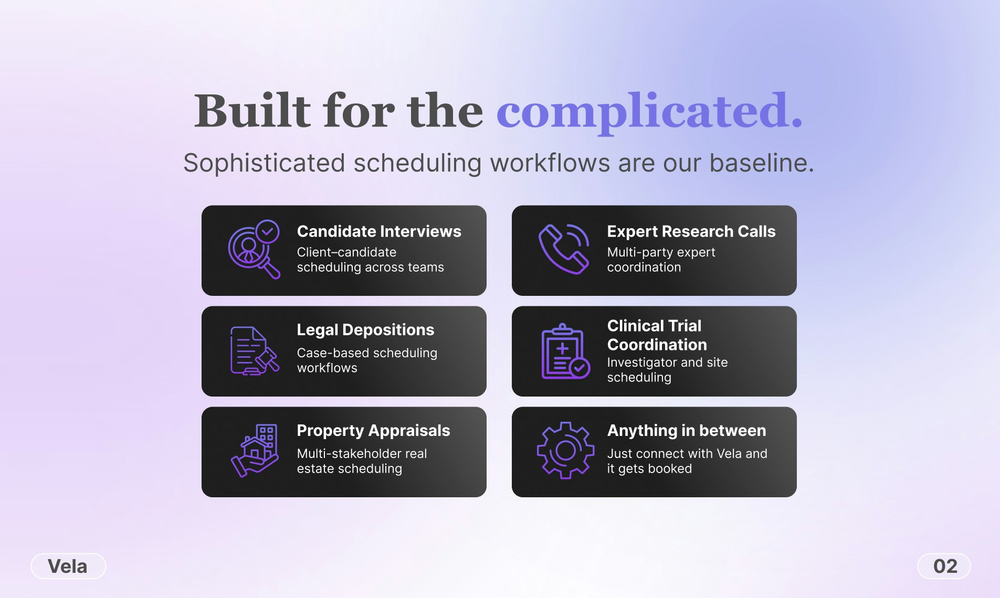
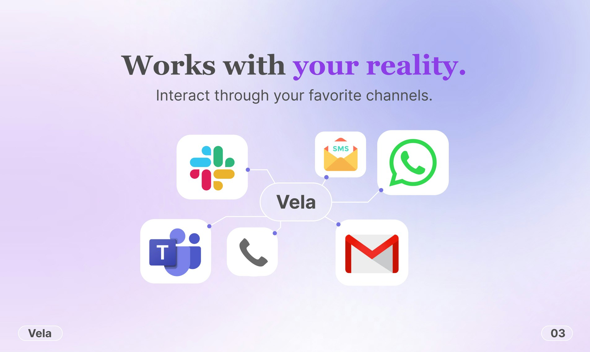

### 🎬 관련 영상
- [🎥 영상 보기](https://ph-files.imgix.net/8c5c013b-1cab-4da9-a94f-9ed45ff9917c.jpeg?auto=format)

---

## 9. [OpenGraph+](https://www.producthunt.com/products/opengraph)
**Votes**: 122 | **도입 난이도**: 중 | **신뢰도**: 중
**Tagline**: Automatic Open Graph images for every page
**서비스 링크**: https://www.producthunt.com/r/G4FFLXLY6QGJCV

**태그**: DevTool, 자동화, Open Graph, 이미지 생성, Chat, Vision, Design

### 📌 이 서비스 한눈에 보기
OpenGraph+는 웹 페이지의 Open Graph 이미지를 자동으로 생성 및 업데이트하여 공유 링크의 품질을 높여줍니다.

### 🔑 주요 기능
- 모든 페이지에 자동으로 Open Graph 이미지 생성
- 콘텐츠 변경 시 자동 업데이트
- 별도의 이미지 디자인이나 렌더링 로직 불필요

### 🙋 사용자에게 어떤 점이 좋은가
Slack, iMessage 등 그룹 채팅에서 공유되는 링크 미리보기를 개선하여 클릭률을 높이고 사용자 경험을 향상시킵니다. 복잡한 설정 없이 자동으로 최신 이미지를 유지할 수 있습니다.

### ✅ 지금 바로 써볼 기능
- 웹사이트에 OpenGraph+ 연동하기
- 생성된 Open Graph 이미지 미리보기 확인하기
- 콘텐츠 변경 후 이미지 업데이트 확인하기

### ⚠️ 사용 전 확인할 점
- 이미지 생성에 시간이 걸릴 수 있음
- OpenGraph+ 서버에 페이지 캡쳐 정보가 저장될 수 있음

### 🧭 확인이 더 필요한 정보
OpenGraph+의 이미지 생성 방식 및 콘텐츠 업데이트 주기에 대한 추가 정보 확인이 필요합니다.

### 📸 스크린샷 및 갤러리
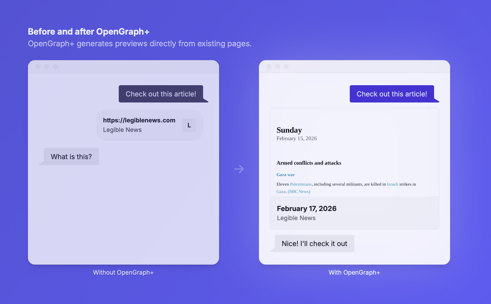
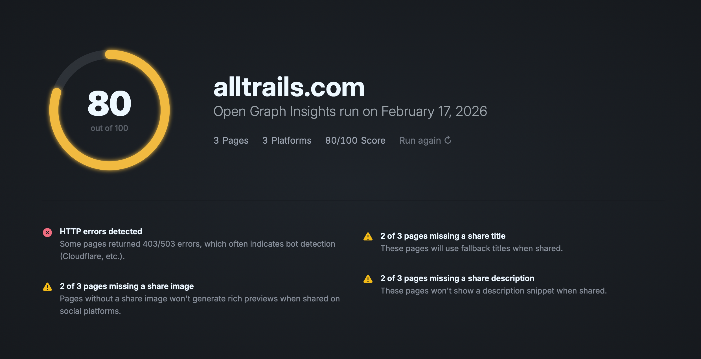
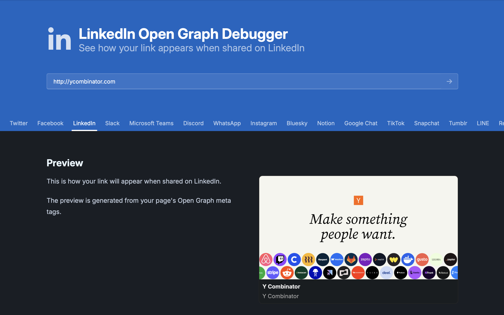

### 🎬 관련 영상
- [🎥 영상 보기](https://ph-files.imgix.net/bba30223-3443-4978-ac64-d8b02388af34.jpeg?auto=format)

---

## 10. [Agent Monitor](https://www.producthunt.com/products/agent-monitor-track-ai-traffic)
**Votes**: 112 | **도입 난이도**: 중 | **신뢰도**: 중
**Tagline**: Server-side analytics for AI & bot traffic
**서비스 링크**: https://www.producthunt.com/r/YMYMZQJOY7WGTU

**태그**: AI 분석, 봇 탐지, 웹 분석, 트래픽 분석, SEO, Agent, AI Tool, Chat, Analytics

### 📌 이 서비스 한눈에 보기
Agent Monitor는 서버 측 데이터를 활용하여 웹사이트의 AI 및 봇 트래픽을 정확하게 분석하고, Google Analytics 4에서 놓치는 봇 트래픽 정보를 제공하여 데이터 기반의 의사결정을 돕습니다.

### 🔑 주요 기능
- 서버 측 데이터 기반의 정확한 봇 트래픽 분석
- AI 봇 (ChatGPT, Gemini, Claude 등) 트래픽 식별 및 분류
- 봇 프로필, 랭킹, AI 어시스턴트 트래픽 등 상세 정보 제공

### 🙋 사용자에게 어떤 점이 좋은가
웹사이트의 실제 트래픽 구성을 정확하게 파악하고, 봇 트래픽으로 인한 왜곡을 제거하여 마케팅 및 SEO 전략을 최적화하는 데 도움을 줍니다.

### ✅ 지금 바로 써볼 기능
- 웹사이트에 Agent Monitor 설치 및 서버 측 데이터 연동
- AI 봇 트래픽 비율 확인 및 트래픽 소스 분석
- 봇 트래픽 패턴 분석을 통한 웹사이트 보안 강화

### ⚠️ 사용 전 확인할 점
- 서버 측 데이터 수집 및 처리에 따른 기술적 이해 필요
- GA4 등 기존 분석 도구와의 데이터 비교 분석 필요

### 🧭 확인이 더 필요한 정보
Agent Monitor의 정확도 및 특정 봇 식별 능력에 대한 추가적인 검증이 필요합니다.

### 📸 스크린샷 및 갤러리
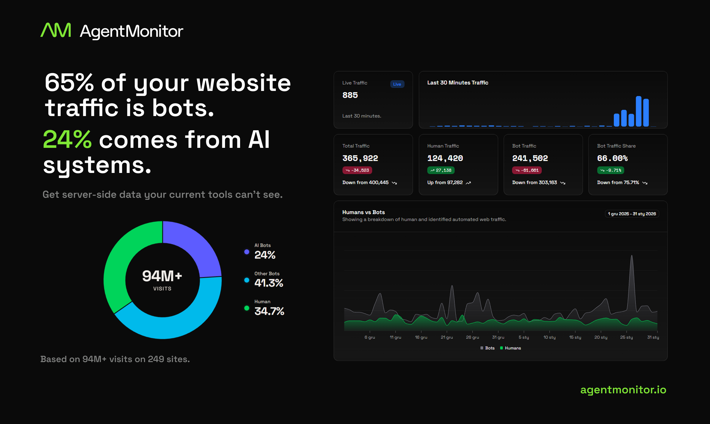
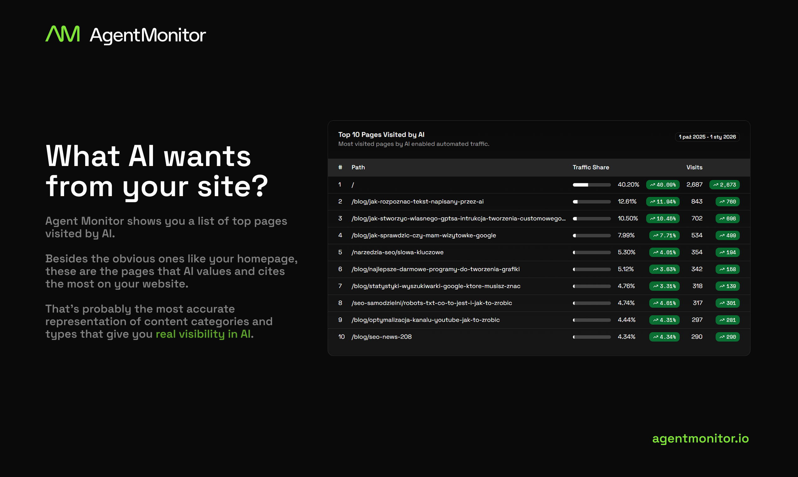
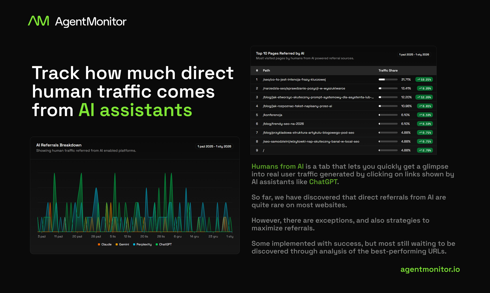

---

