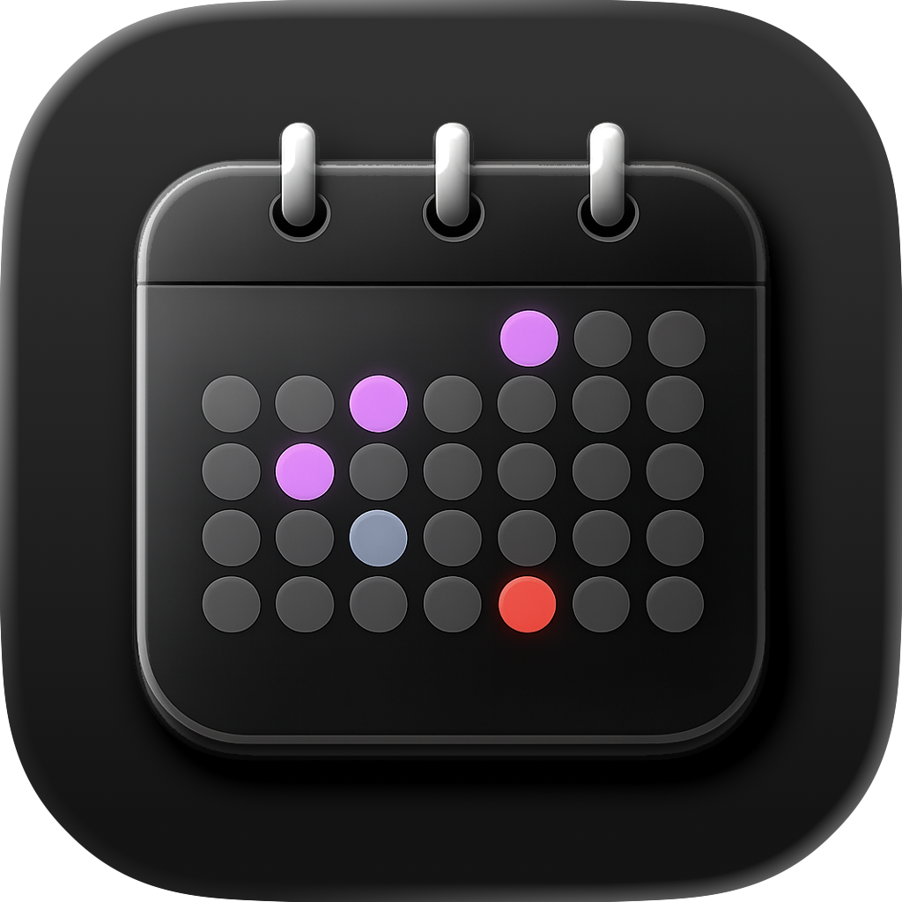
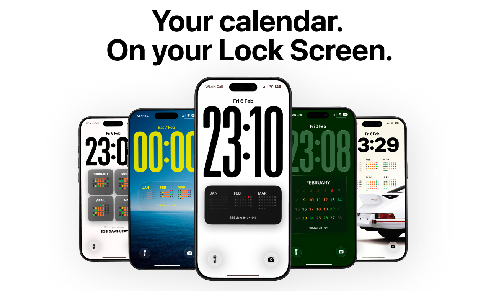
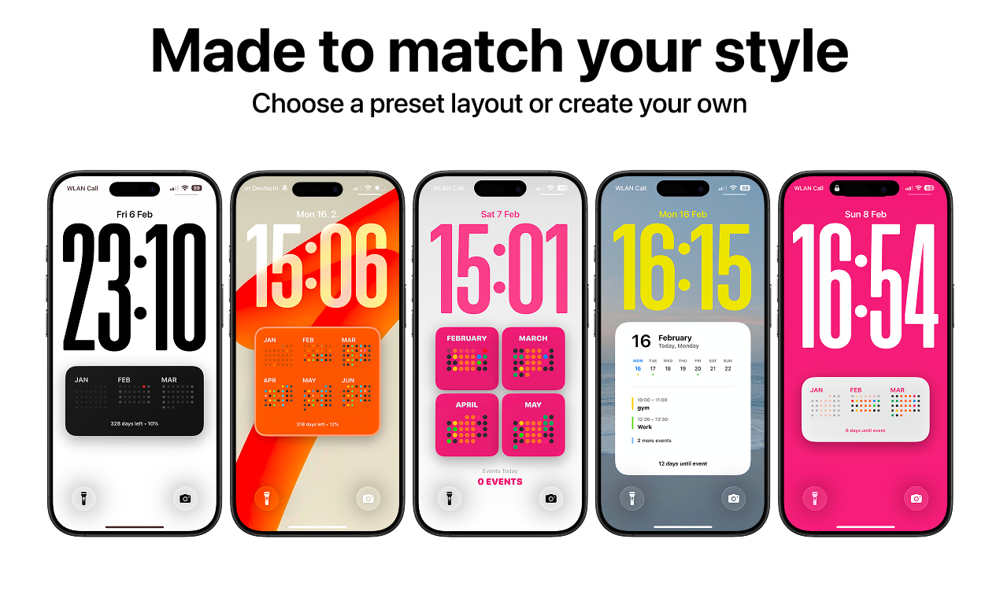

# 🚀 Product Hunt Daily Top 10 (2026-02-18)

## 1. [Sonnet 4.6](https://www.producthunt.com/products/claude)
**Votes**: 555 | **도입 난이도**: 중 | **신뢰도**: 중
**Tagline**: The most capable Sonnet model yet
**서비스 링크**: https://www.producthunt.com/r/XRJAQEGV3YYNPN

**태그**: AI, 생산성, 자동화, 지능형 에이전트, Agent, Design

### 📌 이 서비스 한눈에 보기
Claude Sonnet 4.6은 코딩, 컴퓨터 활용, 장문맥 추론 등 다양한 분야에서 성능이 대폭 향상되었으며, 1백만 토큰 컨텍스트 윈도우를 제공하여 더욱 강력한 작업을 가능하게 합니다.

### 🔑 주요 기능
- 코딩, 컴퓨터 활용 능력 대폭 향상
- 1백만 토큰 컨텍스트 윈도우 (베타)
- Opus 수준의 지능에 가까워진 성능

### 🙋 사용자에게 어떤 점이 좋은가
더욱 저렴한 가격으로 Opus 수준의 지능을 경험하고, 방대한 양의 정보를 처리하는 작업에 유용하게 활용할 수 있습니다.

### ✅ 지금 바로 써볼 기능
- 긴 문서 요약 및 분석
- 복잡한 코드 생성 및 디버깅
- 광범위한 지식 기반 검색 및 활용

### ⚠️ 사용 전 확인할 점
- 1백만 토큰 컨텍스트 윈도우는 베타 버전이므로 안정성을 확인해야 함
- Opus 수준의 지능이라고 하지만, 실제 사용 시 성능 차이가 있을 수 있음

### 🧭 확인이 더 필요한 정보
가격 정보 및 Opus와의 구체적인 성능 비교 데이터는 추가 확인이 필요합니다.

### 📸 스크린샷 및 갤러리

### 🎬 관련 영상
- [🎥 영상 보기](https://ph-files.imgix.net/ec9b3170-a2b7-4735-93db-8c7fc48a96d8.jpeg?auto=format)

---

## 2. [Moda](https://www.producthunt.com/products/moda-2)
**Votes**: 486 | **도입 난이도**: 중 | **신뢰도**: 중
**Tagline**: Finally, AI designs you can edit
**서비스 링크**: https://www.producthunt.com/r/CXN2YMANFHJXCU

**태그**: AI, 디자인, 콘텐츠 제작, 편집, AI Tool, Design

### 📌 이 서비스 한눈에 보기
Moda는 브랜드에 맞는 아름다운 콘텐츠 디자인을 AI로 생성하고, 강력한 레이어 기반 편집 기능까지 제공하여 디자인 작업 효율성을 극대화합니다.

### 🔑 주요 기능
- AI 기반 디자인 생성
- 완전한 편집 기능
- 브랜드 맞춤형 디자인

### 🙋 사용자에게 어떤 점이 좋은가
슬라이드, 포스터, 광고 등 다양한 콘텐츠 디자인을 쉽고 빠르게 제작할 수 있으며, 생성된 디자인을 자유롭게 수정하여 원하는 결과물을 얻을 수 있습니다.

### ✅ 지금 바로 써볼 기능
- AI 디자인 생성 기능 사용해보기
- 레이어 편집 기능 활용해보기
- 브랜드 스타일 가이드 적용해보기

### ⚠️ 사용 전 확인할 점
- AI가 생성한 디자인의 창의성 수준 확인 필요
- 편집 기능 숙지에 시간 소요 가능성

### 🧭 확인이 더 필요한 정보
Moda AI의 디자인 학습 데이터 범위와 사용자 브랜드 스타일 적용 정확도에 대한 추가 정보 필요

### 📸 스크린샷 및 갤러리

### 🎬 관련 영상
- [🎥 영상 보기](https://ph-files.imgix.net/2a6d5d63-0e12-4ce0-959b-83bc89d6e00a.jpeg?auto=format)

---

## 3. [Omnia](https://www.producthunt.com/products/omnia-2)
**Votes**: 287 | **도입 난이도**: 중 | **신뢰도**: 중
**Tagline**: Become the brand AI recommends
**서비스 링크**: https://www.producthunt.com/r/P2QNFKXIJOJQ5N

**태그**: AI, 브랜드 관리, 분석, 콘텐츠, 가시성, AI Tool, Prompting

### 📌 이 서비스 한눈에 보기
옴니아는 AI가 당신의 브랜드를 어떻게 인식하는지 보여주고, AI 검색 결과에서 브랜드 인지도를 높이는 데 필요한 액션을 취할 수 있도록 돕는 AI 가시성 도구입니다.

### 🔑 주요 기능
- AI가 사용하는 실제 프롬프트 발견
- 경쟁사 대비 브랜드 인지도 모니터링
- AI 검색 최적화 콘텐츠 제작

### 🙋 사용자에게 어떤 점이 좋은가
옴니아를 통해 브랜드가 AI 검색 엔진에서 더 잘 보이도록 만들어, 인지도와 트래픽을 효과적으로 높일 수 있습니다.

### ✅ 지금 바로 써볼 기능
- AI가 브랜드에 대해 어떤 프롬프트를 사용하는지 확인하기
- 경쟁사 브랜드의 AI 인지도와 비교해보기
- AI 검색에 최적화된 콘텐츠 제작 전략 구상하기

### ⚠️ 사용 전 확인할 점
- 데이터 분석에 필요한 충분한 브랜드 정보 제공 필요
- AI 검색 엔진 알고리즘 변화에 따른 결과 변동 가능성 고려

### 🧭 확인이 더 필요한 정보
AI 검색 엔진별, 그리고 산업별 옴니아의 정확도와 적용 가능성에 대한 추가적인 정보가 필요합니다.

### 📸 스크린샷 및 갤러리

### 🎬 관련 영상
- [🎥 영상 보기](https://ph-files.imgix.net/14eaee9d-6ddb-4970-93b1-0aa6d901458e.jpeg?auto=format)

---

## 4. [Flixier Generate AI Video in Timeline](https://www.producthunt.com/products/flixier)
**Votes**: 189 | **도입 난이도**: 중 | **신뢰도**: 중
**Tagline**: Extend shots, connect clips, generate from any frame
**서비스 링크**: https://www.producthunt.com/r/2J7TBBVCY7KL7J

**태그**: AI, 비디오 편집, 자동화, 콘텐츠 제작, AI Tool, Video

### 📌 이 서비스 한눈에 보기
Flixier는 AI를 비디오 편집 타임라인에 통합하여 비디오 생성, 편집, 다듬기를 한 곳에서 완벽하게 처리할 수 있도록 돕습니다.

### 🔑 주요 기능
- AI 기반 비디오 생성 및 편집 기능을 타임라인 내에서 제공
- 비디오 클립 확장, 연결, 프레임 기반 생성 가능
- 별도의 내보내기나 재구축 없이 원스톱 편집 워크플로우 제공

### 🙋 사용자에게 어떤 점이 좋은가
AI를 활용하여 비디오 편집 시간을 단축하고, 여러 도구를 거치지 않고 한 곳에서 편집 작업을 완료할 수 있어 효율성을 높여줍니다.

### ✅ 지금 바로 써볼 기능
- AI 기반 클립 확장 기능 사용해보기
- 프레임 기반 비디오 생성 기능 사용해보기
- 타임라인 내에서 클립 연결 및 편집 기능 사용해보기

### ⚠️ 사용 전 확인할 점
- AI 생성 품질은 입력 프롬프트 및 데이터에 따라 달라질 수 있음
- 대규모 프로젝트에서 성능 저하 가능성 확인 필요

### 🧭 확인이 더 필요한 정보
AI 비디오 생성 기능의 구체적인 지원 언어 및 데이터셋 정보 확인 필요

### 📸 스크린샷 및 갤러리

### 🎬 관련 영상
- [🎥 영상 보기](https://ph-files.imgix.net/1bdecb6a-c26c-401f-bfb6-899b4daac2e5.jpeg?auto=format)

---

## 5. [ClawMetry for OpenClaw](https://www.producthunt.com/products/clawmetry)
**Votes**: 175 | **도입 난이도**: 하 | **신뢰도**: 중
**Tagline**: Real-time observability dashboard for OpenClaw AI agents
**서비스 링크**: https://www.producthunt.com/r/JKIL5I3A43NUWI

**태그**: DevTool, AI Agent, Monitoring, Dashboard, Agent, AI Tool

### 📌 이 서비스 한눈에 보기
OpenClaw AI 에이전트를 위한 실시간 모니터링 대시보드 ClawMetry로, Grafana처럼 AI 맞춤형 관리를 손쉽게 시작하세요.

### 🔑 주요 기능
- OpenClaw 에이전트 실시간 모니터링
- 토큰 비용, 하위 에이전트 활동 등 다양한 지표 제공
- 단 한 줄 명령어로 설치 및 즉시 사용 가능

### 🙋 사용자에게 어떤 점이 좋은가
AI 에이전트의 성능과 비용을 실시간으로 파악하고, 문제 발생 시 즉각적으로 대응하여 효율적인 AI 운영을 가능하게 합니다. 복잡한 설정 없이 바로 사용할 수 있어 개발 편의성을 높입니다.

### ✅ 지금 바로 써볼 기능
- pip install clawmetry로 설치 후 실행
- 대시보드에서 토큰 비용 모니터링
- 실시간 흐름 시각화 기능 확인

### ⚠️ 사용 전 확인할 점
- OpenClaw 에이전트 외 다른 AI 플랫폼과의 호환성 확인 필요
- Raspberry Pi에서의 성능은 환경에 따라 달라질 수 있음

### 🧭 확인이 더 필요한 정보
OpenClaw의 특정 버전에 대한 ClawMetry의 최적화 정도 확인이 필요합니다.

### 📸 스크린샷 및 갤러리

### 🎬 관련 영상
- [🎥 영상 보기](https://ph-files.imgix.net/7fbbaf29-1b62-463d-8ad7-d916a3678413.jpeg?auto=format)

---

## 6. [Empirical Health for web](https://www.producthunt.com/products/empirical-health)
**Votes**: 140 | **도입 난이도**: 하 | **신뢰도**: 중
**Tagline**: Comprehensive preventive heart health solution scaled w/ AI
**서비스 링크**: https://www.producthunt.com/r/YDLCIZK56UJV22

**태그**: 건강, AI, 심장 건강, 웹, 의료, AI Tool

### 📌 이 서비스 한눈에 보기
Empirical Health는 AI 기반의 종합적인 심장 건강 관리 솔루션으로, 이제 웹에서도 혈액 검사 결과 확인, 심장 마비 위험 점수 확인, 의사와의 상담, 검사 예약 등 다양한 기능을 앱 다운로드 없이 이용할 수 있습니다.

### 🔑 주요 기능
- 웹에서 간편하게 심장 건강 관리 가능
- 100개 이상의 바이오마커를 포함한 혈액 검사 결과 확인
- AI 기반 심장 마비 위험 점수 제공

### 🙋 사용자에게 어떤 점이 좋은가
작은 화면에서 보기 힘들었던 혈액 검사 결과들을 큰 화면에서 편리하게 확인할 수 있으며, 앱 설치 없이 웹에서 모든 기능을 이용할 수 있어 접근성이 향상되었습니다.

### ✅ 지금 바로 써볼 기능
- 혈액 검사 결과 확인하기
- 심장 마비 위험 점수 확인하기
- 의사에게 문의하기

### ⚠️ 사용 전 확인할 점
- 개인 건강 정보 보호에 유의
- 제공되는 정보는 참고용이며, 반드시 전문 의료진과 상담 필요

### 🧭 확인이 더 필요한 정보
제공되는 AI 기반 심장 마비 위험 점수의 정확도 및 신뢰도에 대한 추가 정보 확인이 필요합니다.

### 📸 스크린샷 및 갤러리

---

## 7. [Travel Animator](https://www.producthunt.com/products/travel-animator)
**Votes**: 130 | **도입 난이도**: 중 | **신뢰도**: 중
**Tagline**: Name every stop your way with Place Labels
**서비스 링크**: https://www.producthunt.com/r/VOTWBNKKAFFXMB

**태그**: 여행, 지도, 애니메이션, 커스터마이징, 시각화, Design

### 📌 이 서비스 한눈에 보기
Travel Animator로 여행 경로를 시각적으로 더욱 명확하고 개인적으로 만들어주는 'Place Labels' 기능이 추가되어, 방문 장소를 지도에 강조하고 스타일과 색상을 자유롭게 커스터마이징하여 나만의 여행 스토리를 만들 수 있습니다.

### 🔑 주요 기능
- 방문 장소 라벨 추가 기능
- 6가지 스타일 및 7가지 색상 커스터마이징
- 라벨 표시 모드(Current, Visited, Always-on) 선택 가능

### 🙋 사용자에게 어떤 점이 좋은가
애니메이션 지도에 방문 장소를 시각적으로 표시하여 여행 경험을 더욱 풍부하게 만들고, 개인적인 여행 경로 기록을 쉽게 공유할 수 있습니다.

### ✅ 지금 바로 써볼 기능
- 다양한 스타일과 색상으로 Place Labels 커스터마이징 해보기
- 방문 장소 라벨 표시 모드 변경해보기
- 애니메이션 지도에 Place Labels 추가하여 여행 경로 시각화하기

### ⚠️ 사용 전 확인할 점
- 애니메이션 지도 생성 및 편집에 필요한 기능 숙지 필요
- 너무 많은 Place Labels 추가 시 지도 가독성 저하 가능성

### 🧭 확인이 더 필요한 정보
Travel Animator의 기존 기능과의 연동 방식 및 Place Labels 기능의 성능에 대한 추가적인 사용자 후기 확인이 필요합니다.

### 📸 스크린샷 및 갤러리

### 🎬 관련 영상
- [🎥 영상 보기](https://ph-files.imgix.net/f321432d-6b11-4a2c-9838-1d3fdeb6c575.jpeg?auto=format)

---

## 8. [Calendarly](https://www.producthunt.com/products/calendarly-calendar-on-lock-screen)
**Votes**: 126 | **도입 난이도**: 하 | **신뢰도**: 중
**Tagline**: Turn your calendar into a live Lock Screen wallpaper
**서비스 링크**: https://www.producthunt.com/r/VXIJIWRE4LHY6B

**태그**: 캘린더, 생산성, 개인화, 잠금화면, Design

### 📌 이 서비스 한눈에 보기
Calendarly는 캘린더 일정을 실시간으로 업데이트되는 잠금 화면 배경화면으로 만들어, 폰을 켤 때마다 바로 일정을 확인할 수 있도록 도와줍니다.

### 🔑 주요 기능
- 위젯 설정이나 앱 실행 없이 간편하게 일정 확인
- 다양한 디자인 템플릿과 커스터마이징 옵션 제공
- 모든 데이터는 기기 내에서 처리되어 개인 정보 보호

### 🙋 사용자에게 어떤 점이 좋은가
매번 캘린더 앱을 열 필요 없이, 폰을 켜는 순간 다음 일정을 확인할 수 있어 시간을 절약하고 효율성을 높여줍니다. 개인 정보 보호를 중시하는 사용자에게도 적합합니다.

### ✅ 지금 바로 써볼 기능
- 마음에 드는 템플릿 선택 후 적용
- 글꼴, 색상 등 디자인 커스터마이징
- 일정 업데이트 주기 확인

### ⚠️ 사용 전 확인할 점
- 배터리 소모량 확인 필요
- 일부 기기와의 호환성 확인 필요

### 🧭 확인이 더 필요한 정보
지원되는 캘린더 서비스 종류에 대한 정보 확인이 필요합니다.

### 📸 스크린샷 및 갤러리

---

## 9. [Design Rails](https://www.producthunt.com/products/design-rails-ai-native-brand-in-mins)
**Votes**: 123 | **도입 난이도**: 중 | **신뢰도**: 중
**Tagline**: Get an agent-ready brand in minutes
**서비스 링크**: https://www.producthunt.com/r/OB4CXSZGF6WGRV

**태그**: Agent, AI Tool, Chat, Design

### 🧭 확인이 더 필요한 정보
Product Hunt 설명(태그라인/디스크립션) 기반 정리이므로 실제 기능/가격/정책은 제품 페이지 확인이 필요합니다.

### 📸 스크린샷 및 갤러리

### 🎬 관련 영상
- [🎥 영상 보기](https://ph-files.imgix.net/dc9ed1ba-04ff-46da-91a0-0e67eef233e9.jpeg?auto=format)

---

## 10. [SPECTRE](https://www.producthunt.com/products/spectre-2)
**Votes**: 112 | **도입 난이도**: 중 | **신뢰도**: 중
**Tagline**: An agentic coding workflow for product builders
**서비스 링크**: https://www.producthunt.com/r/CZQAMGV6OW6DHH

**태그**: DevTool, Automation, AI Coding, Agent, AI Tool

### 📌 이 서비스 한눈에 보기
SPECTRE는 AI 코딩 에이전트를 활용하여 제품 개발 워크플로우를 자동화하고 효율성을 높여주는 도구입니다.

### 🔑 주요 기능
- 자동화된 코딩 워크플로우 (Scope, Plan, Execute, Clean, Test, Rebase, Evaluate)
- AI 코딩 에이전트 활용
- 단계별 제품 개발 프로세스

### 🙋 사용자에게 어떤 점이 좋은가
제품 개발 과정을 자동화하여 개발 시간을 단축하고, AI 에이전트를 통해 더 높은 품질의 결과물을 얻을 수 있습니다.

### ✅ 지금 바로 써볼 기능
- /Scope 명령어로 프로젝트 범위 정의하기
- /Plan 명령어로 개발 계획 수립하기
- /Execute 명령어로 실제 코드 생성 시작하기

### ⚠️ 사용 전 확인할 점
- AI 에이전트의 결과물을 검토하고 필요한 수정 작업을 수행해야 합니다.
- 복잡한 프로젝트의 경우, 초기 설정 및 조정에 시간이 소요될 수 있습니다.

### 🧭 확인이 더 필요한 정보
AI 에이전트의 성능이 프로젝트 복잡도 및 데이터 품질에 따라 달라질 수 있습니다.

### 📸 스크린샷 및 갤러리

---

