# 🚀 Product Hunt Daily Top 10 (2026-02-18)

## 1. [Sonnet 4.6](https://www.producthunt.com/products/claude)
**Votes**: 412 | **도입 난이도**: 중 | **신뢰도**: 중
**Tagline**: The most capable Sonnet model yet
**서비스 링크**: https://www.producthunt.com/r/XRJAQEGV3YYNPN

**태그**: AI, LLM, 생성 AI, 자동화, 개발, Agent, Design

### 📌 이 서비스 한눈에 보기
Claude Sonnet 4.6은 코딩, 컴퓨터 활용, 추론 능력, 에이전트 계획, 지식 작업, 디자인 등 모든 면에서 크게 향상되었으며, 100만 토큰 컨텍스트 창을 지원하는 최신 Sonnet 모델입니다.

### 🔑 주요 기능
- 코딩, 컴퓨터 활용 능력 대폭 향상
- 100만 토큰 컨텍스트 창 베타 제공
- Opus 수준의 지능을 훨씬 저렴한 가격으로 제공

### 🙋 사용자에게 어떤 점이 좋은가
더욱 강력해진 성능으로 다양한 작업을 효율적으로 처리할 수 있으며, 특히 긴 문맥을 이해해야 하는 작업에서 뛰어난 성능을 보여줍니다. 컴퓨터 활용 능력 향상으로 개발 및 자동화 작업에 유용합니다.

### ✅ 지금 바로 써볼 기능
- 긴 문서 요약 및 분석 시 활용
- 복잡한 코딩 작업에 투입
- 컴퓨터 활용 관련 작업 자동화

### ⚠️ 사용 전 확인할 점
- 베타 버전인 100만 토큰 컨텍스트 창의 안정성 확인 필요
- Opus 수준이라고는 하지만, 실제 사용 환경에서의 성능 차이 확인 필요

### 🧭 확인이 더 필요한 정보
벤치마크 외 실제 사용 환경에서 Opus 모델과 어느 정도의 성능 차이를 보이는지 추가적인 정보가 필요합니다.

### 📸 스크린샷 및 갤러리
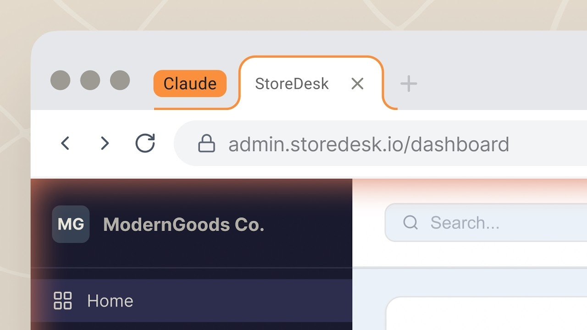

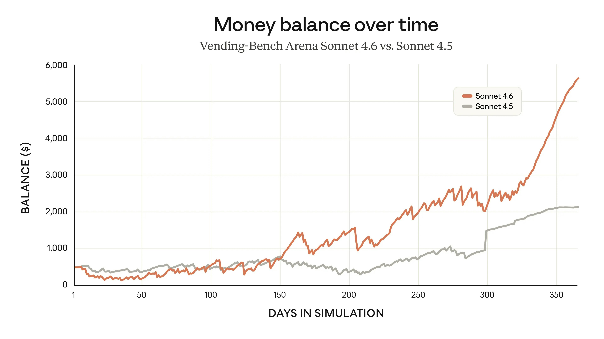

### 🎬 관련 영상
- [🎥 영상 보기](https://ph-files.imgix.net/ec9b3170-a2b7-4735-93db-8c7fc48a96d8.jpeg?auto=format)

---

## 2. [Moda](https://www.producthunt.com/products/moda-2)
**Votes**: 342 | **도입 난이도**: 중 | **신뢰도**: 중
**Tagline**: Finally, AI designs you can edit
**서비스 링크**: https://www.producthunt.com/r/CXN2YMANFHJXCU

**태그**: AI 디자인, 콘텐츠 제작, 그래픽 편집, AI Tool, Design

### 📌 이 서비스 한눈에 보기
Moda는 브랜드에 맞는 아름다운 콘텐츠 디자인을 AI로 생성하고, 레이어 기반 편집 기능으로 완벽하게 수정할 수 있게 해줍니다.

### 🔑 주요 기능
- 그래픽 디자인 훈련을 받은 AI
- 슬라이드, 포스터, 광고 등 다양한 콘텐츠 디자인 가능
- 레이어 기반의 강력한 편집 기능

### 🙋 사용자에게 어떤 점이 좋은가
디자인 작업 시간을 단축하고 브랜드 아이덴티티에 맞는 콘텐츠를 쉽게 제작할 수 있도록 도와줍니다. 특히, AI가 생성한 디자인을 자유롭게 편집하여 원하는 결과물을 얻을 수 있습니다.

### ✅ 지금 바로 써볼 기능
- AI 디자인 생성 후 편집 기능 활용
- 슬라이드 또는 포스터 디자인 생성
- 브랜드 컬러 및 스타일 적용

### ⚠️ 사용 전 확인할 점
- AI가 생성한 디자인의 퀄리티가 사용자의 기대에 미치지 못할 수 있습니다.
- 편집 기능 숙지에 시간이 필요할 수 있습니다.

### 🧭 확인이 더 필요한 정보
AI 디자인의 정확성과 다양한 디자인 템플릿 제공 여부에 대한 추가 정보가 필요합니다.

### 📸 스크린샷 및 갤러리
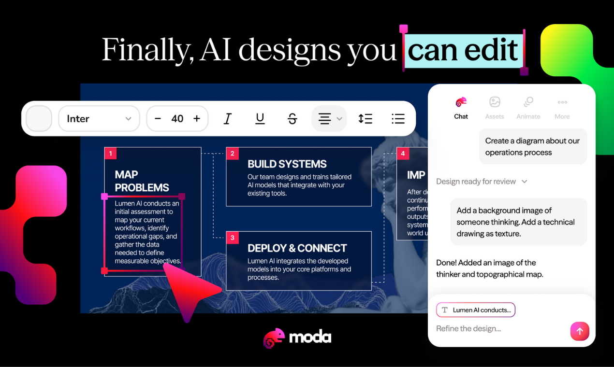
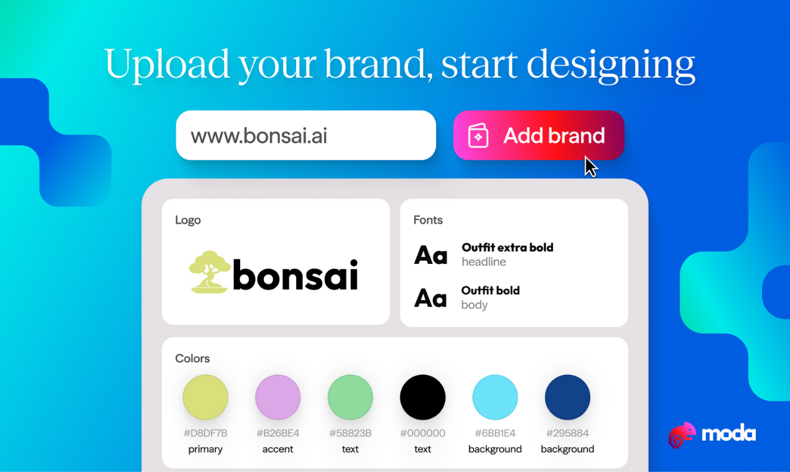
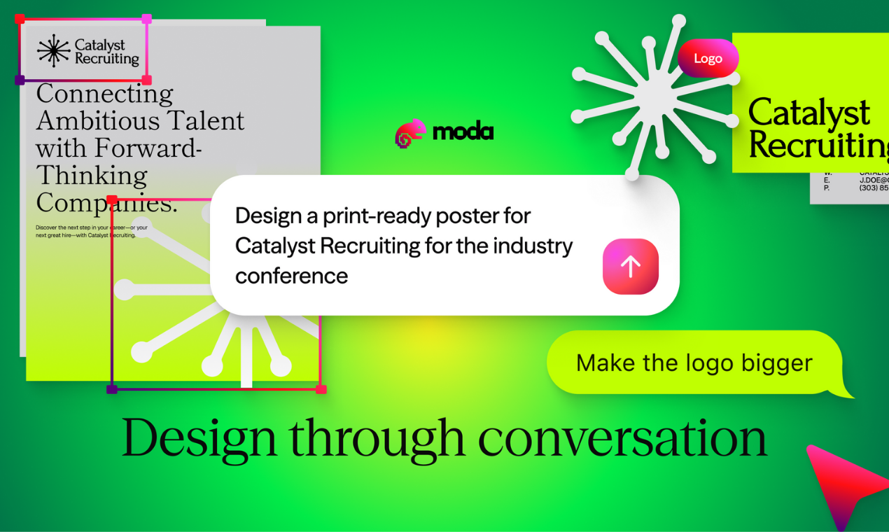

### 🎬 관련 영상
- [🎥 영상 보기](https://ph-files.imgix.net/2a6d5d63-0e12-4ce0-959b-83bc89d6e00a.jpeg?auto=format)

---

## 3. [Omnia](https://www.producthunt.com/products/omnia-2)
**Votes**: 222 | **도입 난이도**: 중 | **신뢰도**: 중
**Tagline**: Become the brand AI recommends
**서비스 링크**: https://www.producthunt.com/r/P2QNFKXIJOJQ5N

**태그**: AI, 브랜드 분석, 콘텐츠 제작, SEO, 마케팅, AI Tool, Prompting

### 📌 이 서비스 한눈에 보기
Omnia는 AI가 당신의 브랜드를 어떻게 인식하는지 보여주고, AI 검색에서 브랜드 인지도를 높이는 콘텐츠 제작을 돕는 AI 가시성 분석 도구입니다.

### 🔑 주요 기능
- AI가 사용하는 실제 프롬프트 발견
- 경쟁사 대비 브랜드 인지도 모니터링
- AI 검색에 최적화된 콘텐츠 제작 지원

### 🙋 사용자에게 어떤 점이 좋은가
AI 시대에 맞춰 브랜드 인지도를 높이고, 경쟁사 대비 차별화된 전략을 수립하는 데 도움을 줍니다. 특히 AI 검색 엔진 최적화에 어려움을 겪는 사용자에게 유용합니다.

### ✅ 지금 바로 써볼 기능
- AI 프롬프트 발견 기능으로 시장 트렌드 파악
- 경쟁사 브랜드 인지도 벤치마킹
- AI 검색 최적화 콘텐츠 제작 기능 활용

### ⚠️ 사용 전 확인할 점
- AI 분석 결과의 정확도는 사용된 데이터와 알고리즘에 따라 달라질 수 있습니다.
- 모든 AI 검색 엔진에 대한 완벽한 최적화를 보장하지 않습니다.

### 🧭 확인이 더 필요한 정보
Omnia가 제공하는 AI 분석 결과가 실제 비즈니스 성과에 미치는 영향에 대한 추가적인 검증이 필요합니다.

### 📸 스크린샷 및 갤러리
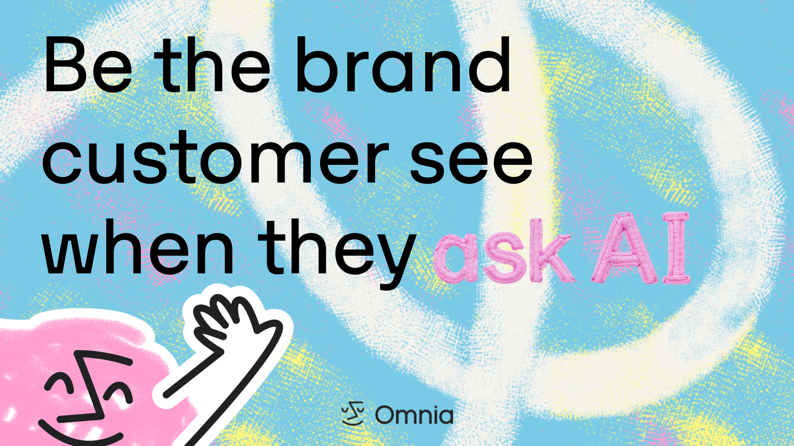
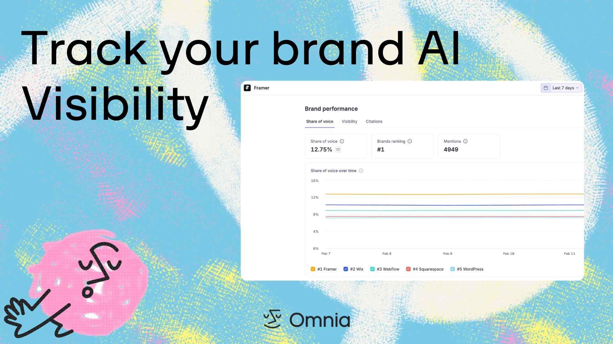
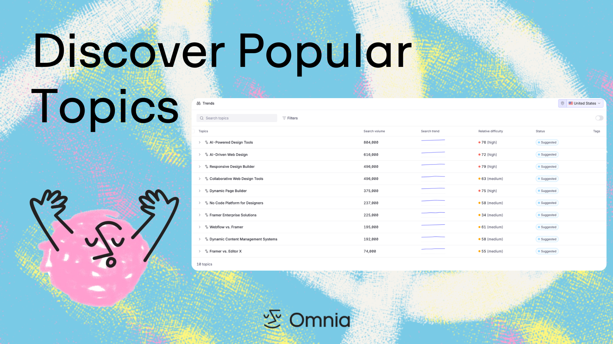

### 🎬 관련 영상
- [🎥 영상 보기](https://ph-files.imgix.net/14eaee9d-6ddb-4970-93b1-0aa6d901458e.jpeg?auto=format)

---

## 4. [Flixier Generate AI Video in Timeline](https://www.producthunt.com/products/flixier)
**Votes**: 156 | **도입 난이도**: 중 | **신뢰도**: 중
**Tagline**: Extend shots, connect clips, generate from any frame
**서비스 링크**: https://www.producthunt.com/r/2J7TBBVCY7KL7J

**태그**: AI, 비디오 편집, 생산성, 자동화, AI Tool, Video

### 📌 이 서비스 한눈에 보기
Flixier는 AI 비디오 생성 기능을 편집 타임라인에 통합하여, 별도의 내보내기 없이 한 곳에서 비디오 생성, 편집, 마무리까지 가능하게 해줍니다.

### 🔑 주요 기능
- AI를 활용하여 비디오 클립을 생성, 확장, 연결 가능
- 편집 타임라인 내에서 AI 기능 사용으로 워크플로우 간소화
- 별도 프로그램 이동 없이 비디오 편집 및 완성 가능

### 🙋 사용자에게 어떤 점이 좋은가
비디오 편집 시간을 단축하고, 여러 도구를 사용할 필요 없이 Flixier 하나로 간편하게 작업할 수 있어 생산성을 높여줍니다.

### ✅ 지금 바로 써볼 기능
- AI를 사용하여 새로운 비디오 클립 생성해보기
- 기존 클립을 AI로 확장하여 자연스러운 연결 시도해보기
- 타임라인 내에서 AI 생성 클립 편집 및 다듬어보기

### ⚠️ 사용 전 확인할 점
- AI 생성 품질은 입력 프레임 및 조건에 따라 달라질 수 있음
- 복잡한 편집 작업 시 AI 기능이 기대만큼 작동하지 않을 수 있음

### 🧭 확인이 더 필요한 정보
AI 생성 클립의 저작권 및 상업적 이용 가능 범위에 대한 추가 확인이 필요합니다.

### 📸 스크린샷 및 갤러리
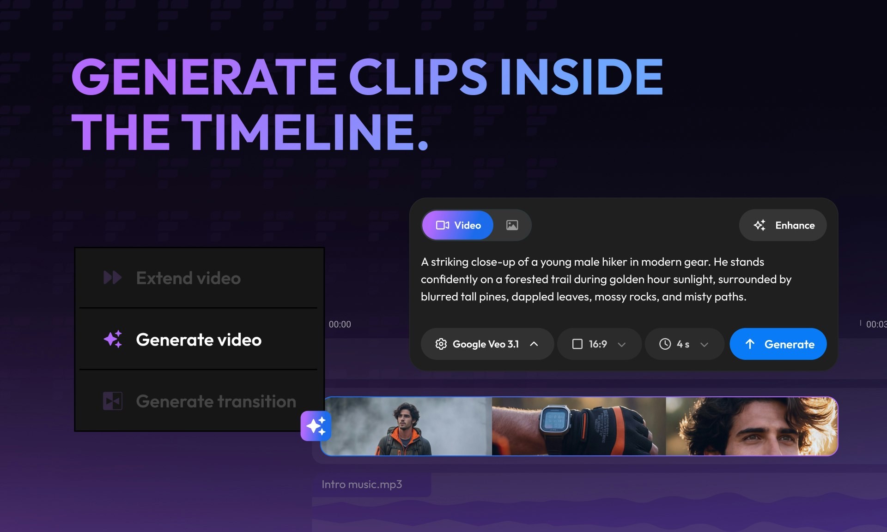
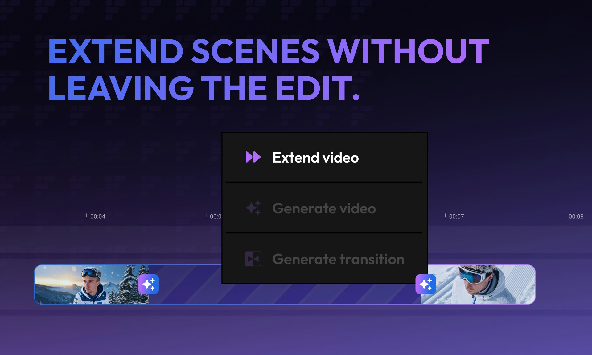
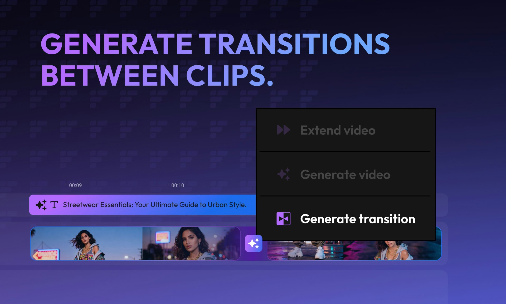

### 🎬 관련 영상
- [🎥 영상 보기](https://ph-files.imgix.net/1bdecb6a-c26c-401f-bfb6-899b4daac2e5.jpeg?auto=format)

---

## 5. [ClawMetry for OpenClaw](https://www.producthunt.com/products/clawmetry)
**Votes**: 124 | **도입 난이도**: 하 | **신뢰도**: 중
**Tagline**: Real-time observability dashboard for OpenClaw AI agents
**서비스 링크**: https://www.producthunt.com/r/JKIL5I3A43NUWI

**태그**: DevTool, AI, 모니터링, 오픈소스, 대시보드, Agent, AI Tool

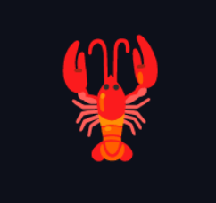

### 📌 이 서비스 한눈에 보기
OpenClaw AI 에이전트의 성능을 실시간으로 모니터링하고 분석할 수 있는 무료 오픈소스 대시보드입니다.

### 🔑 주요 기능
- OpenClaw AI 에이전트 전용으로 설계된 Grafana 스타일 대시보드
- 토큰 비용, 하위 에이전트 활동, cron 작업 등 다양한 지표 실시간 모니터링
- 단 한 줄의 명령어로 설치 가능 (pip install clawmetry)

### 🙋 사용자에게 어떤 점이 좋은가
AI 에이전트의 동작을 시각적으로 파악하고 성능 병목 현상을 쉽게 찾아 개선하여 효율성을 높일 수 있습니다. 실시간 모니터링으로 문제 발생 시 즉각적인 대응이 가능합니다.

### ✅ 지금 바로 써볼 기능
- 토큰 비용 추적 기능 사용해보기
- 실시간 흐름 시각화 기능으로 에이전트 활동 모니터링
- cron 작업 및 메모리 변화 추적 설정해보기

### ⚠️ 사용 전 확인할 점
- OpenClaw 에이전트와의 호환성 확인 필요
- 오픈소스이므로 자체적인 유지보수 및 업데이트 필요

### 🧭 확인이 더 필요한 정보
지원하는 OpenClaw 에이전트의 버전을 확인해야 합니다.

### 📸 스크린샷 및 갤러리
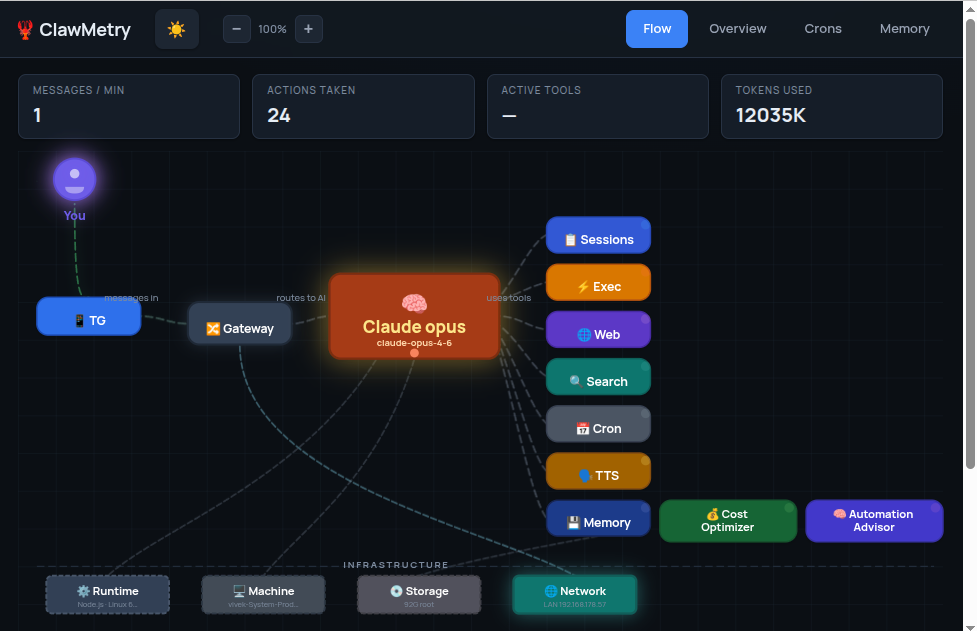
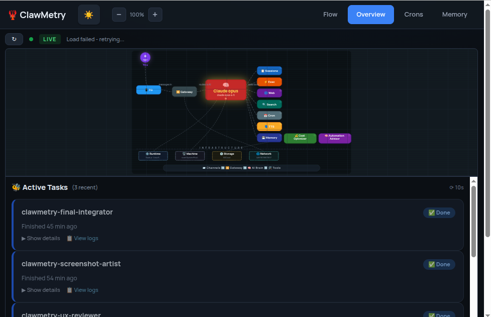
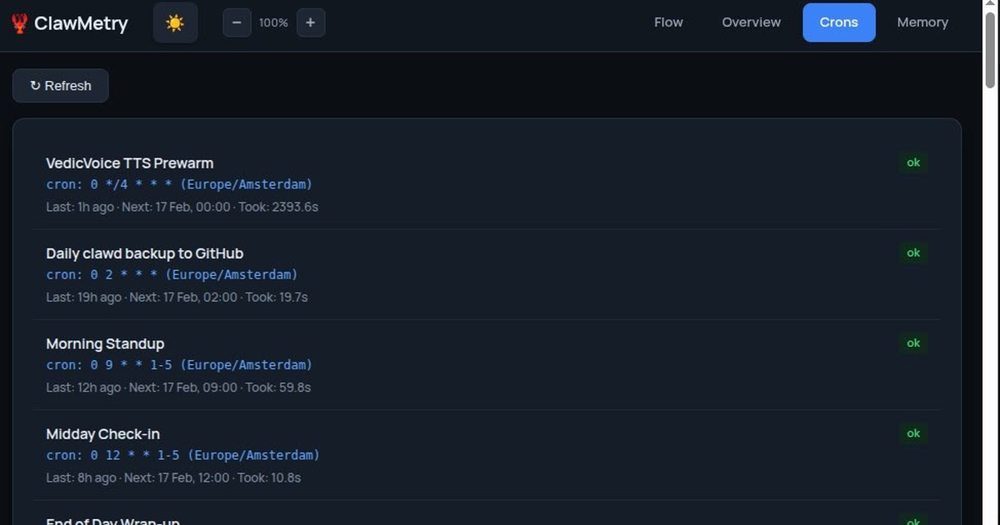

### 🎬 관련 영상
- [🎥 영상 보기](https://ph-files.imgix.net/7fbbaf29-1b62-463d-8ad7-d916a3678413.jpeg?auto=format)

---

## 6. [Travel Animator](https://www.producthunt.com/products/travel-animator)
**Votes**: 123 | **도입 난이도**: 중 | **신뢰도**: 중
**Tagline**: Name every stop your way with Place Labels
**서비스 링크**: https://www.producthunt.com/r/VOTWBNKKAFFXMB

**태그**: 여행, 지도, 애니메이션, 커스터마이징, 기록, Design

### 📌 이 서비스 한눈에 보기
여행 경로 애니메이션 지도에 방문 장소를 라벨로 표시하여 더 명확하고 개인적인 여정 기록을 만들 수 있습니다.

### 🔑 주요 기능
- 애니메이션 지도에 장소 라벨 추가 가능
- 6가지 스타일과 7가지 색상의 라벨 커스터마이징
- Current, Visited, Always-on 모드 지원

### 🙋 사용자에게 어떤 점이 좋은가
애니메이션으로 제작된 여행 경로에 방문 장소들을 시각적으로 쉽게 표시하여 기억을 되살리고 공유하기에 유용합니다. 다양한 스타일과 모드를 통해 사용자 취향에 맞게 라벨을 디자인할 수 있습니다.

### ✅ 지금 바로 써볼 기능
- 다양한 스타일의 라벨 적용해보기
- Current, Visited, Always-on 모드 변경해보기
- 기존 여행 애니메이션에 라벨 추가해보기

### ⚠️ 사용 전 확인할 점
- 애니메이션 제작 기능 자체의 학습 필요
- 라벨 디자인 옵션이 사용자의 니즈를 모두 충족시키지 못할 수 있음

### 🧭 확인이 더 필요한 정보
Travel Animator 자체의 사용법에 대한 정보가 부족합니다.

### 📸 스크린샷 및 갤러리
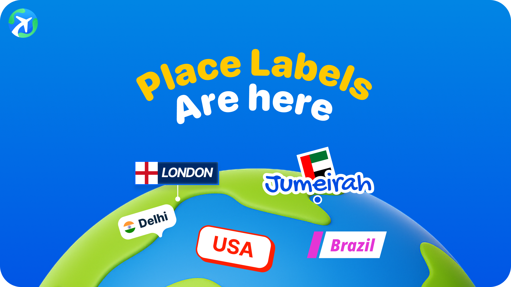
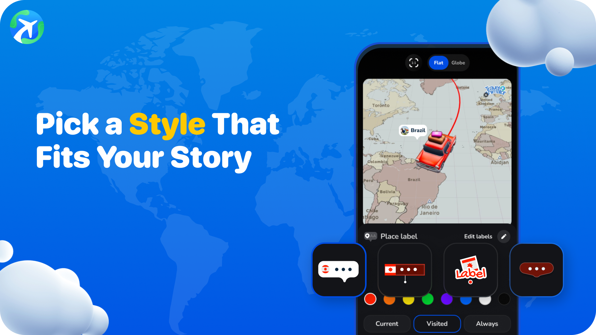
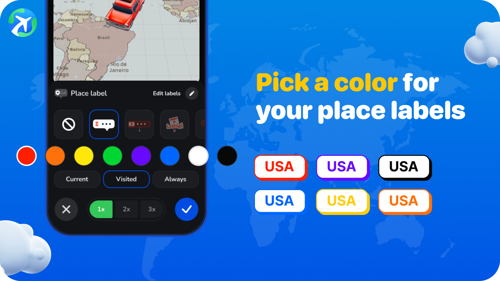

### 🎬 관련 영상
- [🎥 영상 보기](https://ph-files.imgix.net/f321432d-6b11-4a2c-9838-1d3fdeb6c575.jpeg?auto=format)

---

## 7. [Design Rails](https://www.producthunt.com/products/design-rails-ai-native-brand-in-mins)
**Votes**: 112 | **도입 난이도**: 중 | **신뢰도**: 중
**Tagline**: Get an agent-ready brand in minutes
**서비스 링크**: https://www.producthunt.com/r/OB4CXSZGF6WGRV

**태그**: Agent, AI Tool, Chat, Design

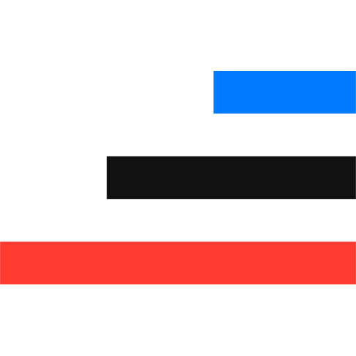

### 🧭 확인이 더 필요한 정보
Product Hunt 설명(태그라인/디스크립션) 기반 정리이므로 실제 기능/가격/정책은 제품 페이지 확인이 필요합니다.

### 📸 스크린샷 및 갤러리
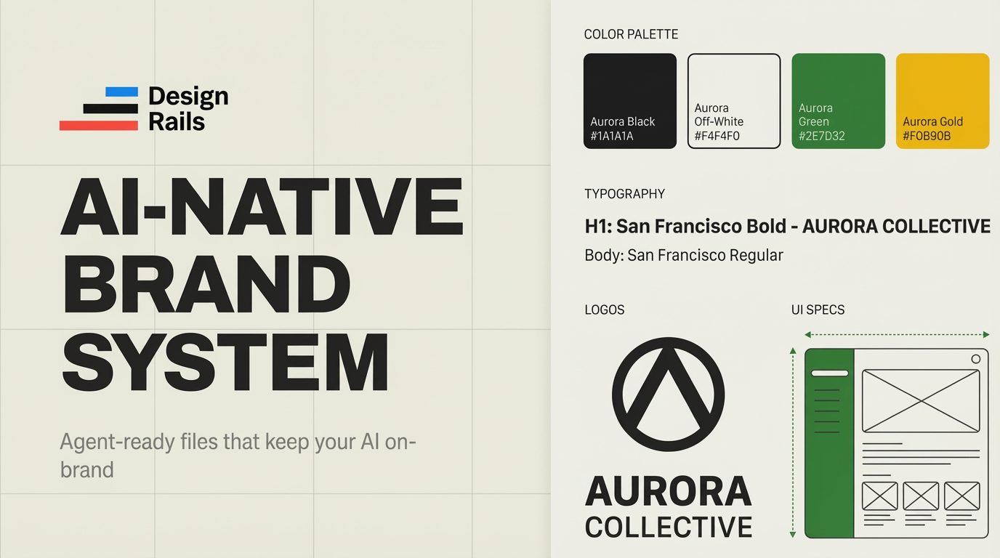
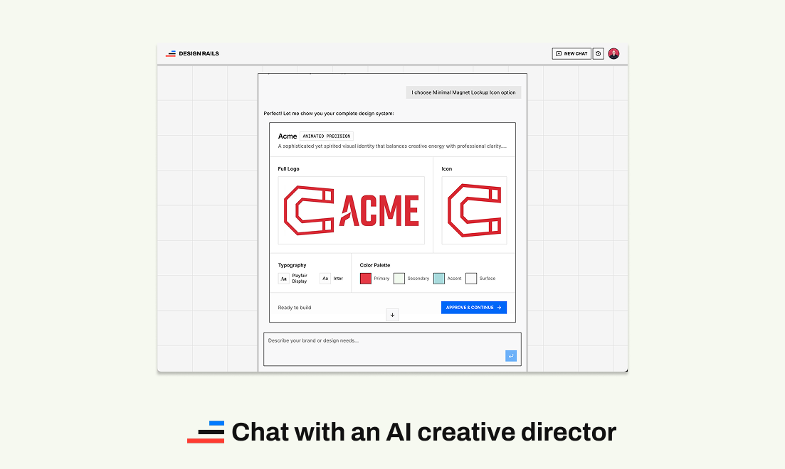
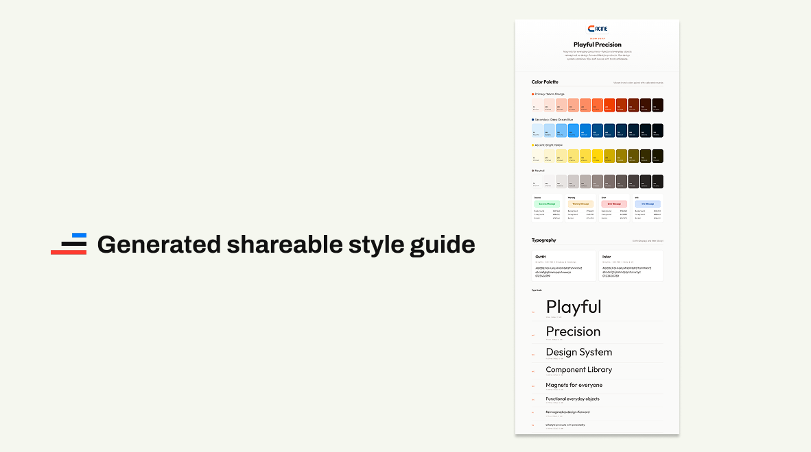

### 🎬 관련 영상
- [🎥 영상 보기](https://ph-files.imgix.net/dc9ed1ba-04ff-46da-91a0-0e67eef233e9.jpeg?auto=format)

---

## 8. [Your AI Clone](https://www.producthunt.com/products/your-ai-clone)
**Votes**: 99 | **도입 난이도**: 중 | **신뢰도**: 중
**Tagline**: Your clone remembers people you've never met
**서비스 링크**: https://www.producthunt.com/r/RMUPNE7DZIF2BR

**태그**: AI, 자동화, 고객 관리, 개인화, 소통, AI Tool

### 📌 이 서비스 한눈에 보기
나만의 AI 클론을 만들어 24시간 소통하고, 대화 내용을 기억하여 개인 맞춤 응대를 제공하여 잠재 고객 확보 및 참여를 극대화하세요.

### 🔑 주요 기능
- 나의 콘텐츠, 목소리, 개성을 학습한 AI 클론 생성
- AI 클론은 24/7 고객 응대 및 모든 대화 내용 기억
- 수익 창출 또는 무료 제공 옵션 선택 가능

### 🙋 사용자에게 어떤 점이 좋은가
시간과 장소에 구애받지 않고 고객과 소통하며, 개인화된 경험을 제공하여 관계를 강화하고 새로운 기회를 창출할 수 있습니다. 또한, 콘텐츠 제작자, 기업가, 인플루언서 등이 오디언스와 지속적인 소통을 가능하게 합니다.

### ✅ 지금 바로 써볼 기능
- AI 클론 생성 및 학습 데이터 업로드
- AI 클론의 응답 스타일 및 개성 설정
- AI 클론 페이지 홍보 및 고객과의 상호작용 시작

### ⚠️ 사용 전 확인할 점
- AI 클론이 부적절하거나 오해를 불러일으킬 수 있는 답변을 생성할 가능성
- 학습 데이터의 품질에 따라 AI 클론의 정확성과 신뢰도가 달라질 수 있음

### 🧭 확인이 더 필요한 정보
AI 클론의 장기적인 성능 및 사용자 만족도에 대한 추가적인 정보가 필요합니다.

### 📸 스크린샷 및 갤러리

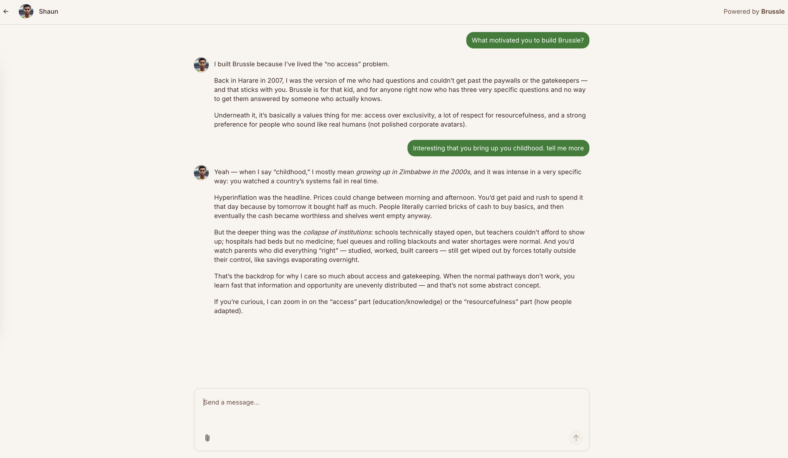
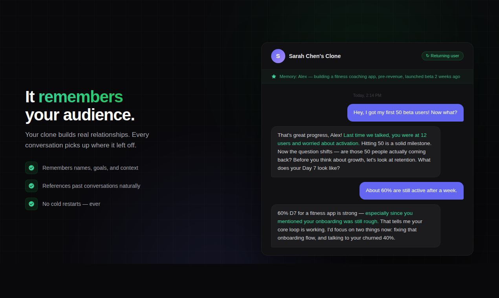

---

## 9. [SPECTRE](https://www.producthunt.com/products/spectre-2)
**Votes**: 99 | **도입 난이도**: 중 | **신뢰도**: 중
**Tagline**: An agentic coding workflow for product builders
**서비스 링크**: https://www.producthunt.com/r/CZQAMGV6OW6DHH

**태그**: DevTool, AI, Automation, Workflow, Agent, AI Tool

### 📌 이 서비스 한눈에 보기
SPECTRE는 AI 코딩 에이전트를 활용하여 제품 개발 워크플로우를 자동화하고 고품질 결과물을 생성하도록 돕는 에이전트 기반 코딩 도구입니다.

### 🔑 주요 기능
- 제품 개발 워크플로우 자동화(Scope, Plan, Execute 등)
- AI 코딩 에이전트 활용
- 단계별 작업으로 고품질 결과 도출

### 🙋 사용자에게 어떤 점이 좋은가
제품 개발 과정을 체계적으로 관리하고 자동화하여 효율성을 높이고, AI 코딩 에이전트의 성능을 극대화하여 더 나은 결과물을 얻을 수 있습니다.

### ✅ 지금 바로 써볼 기능
- /Scope 명령어로 프로젝트 범위 정의해보기
- /Plan 명령어로 개발 계획 수립해보기
- /Execute 명령어로 AI 에이전트 실행해보기

### ⚠️ 사용 전 확인할 점
- AI 에이전트의 결과물 검토 필요
- 복잡한 프로젝트에는 추가적인 조정 필요

### 🧭 확인이 더 필요한 정보
제공된 정보만으로는 다양한 AI 코딩 에이전트와의 호환성을 정확히 판단하기 어렵습니다.

### 📸 스크린샷 및 갤러리
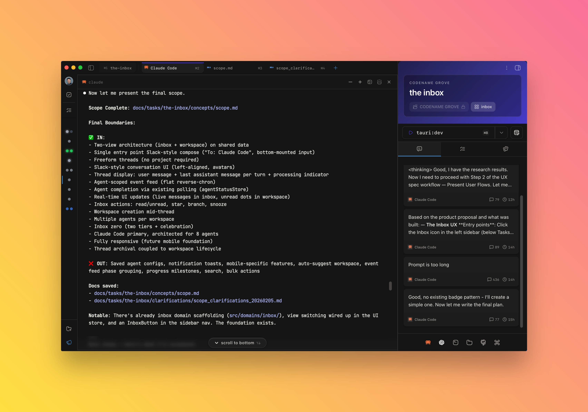
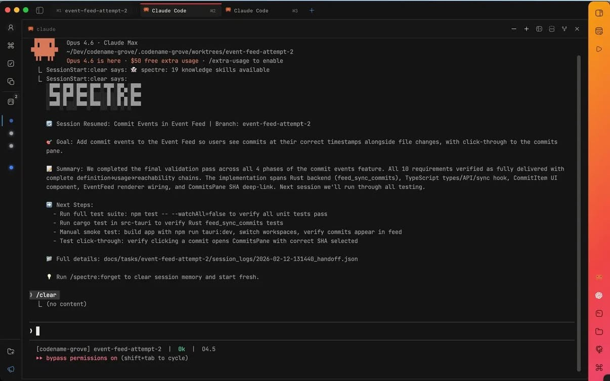
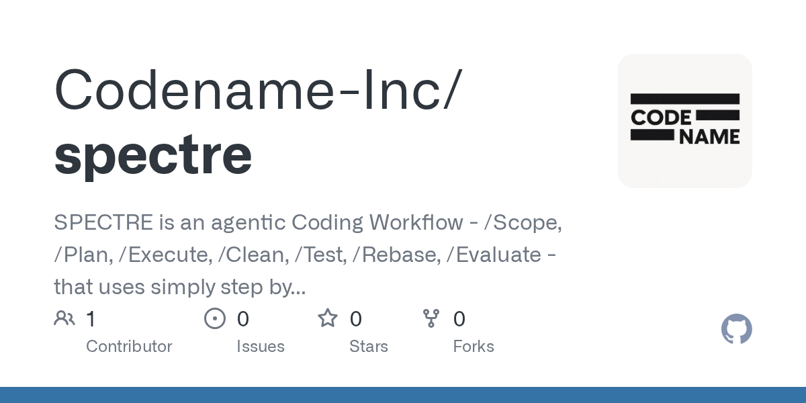

---

## 10. [Empirical Health for web](https://www.producthunt.com/products/empirical-health)
**Votes**: 98 | **도입 난이도**: 하 | **신뢰도**: 중
**Tagline**: Comprehensive preventive heart health solution scaled w/ AI
**서비스 링크**: https://www.producthunt.com/r/YDLCIZK56UJV22

**태그**: 건강, AI, 심장 건강, 웹앱, AI Tool

### 📌 이 서비스 한눈에 보기
Empirical Health의 웹 버전 출시! 이제 AI 기반 심장 건강 관리 솔루션을 더 큰 화면에서 편리하게 이용하고, 혈액 검사 결과 확인, 의사 상담, 위험도 점수 확인 등을 앱 설치 없이 데스크탑이나 휴대폰에서 가능합니다.

### 🔑 주요 기능
- 100개 이상의 바이오마커 혈액 검사 결과 확인 가능
- 심장 마비 위험도 점수 확인 및 관리
- 의사에게 메시지 보내고, 실험실 검토 예약 가능

### 🙋 사용자에게 어떤 점이 좋은가
앱 설치 없이 데스크탑에서도 동일한 기능을 사용할 수 있어 더욱 편리하며, 특히 많은 양의 혈액 검사 결과를 큰 화면에서 쉽게 확인할 수 있습니다. 의사와의 상담 및 예약 기능도 웹에서 간편하게 이용 가능합니다.

### ✅ 지금 바로 써볼 기능
- 혈액 검사 결과 확인하기
- 심장 마비 위험도 점수 확인하기
- 의사에게 메시지 보내기

### ⚠️ 사용 전 확인할 점
- 기존 Empirical Health iOS/Android 앱 사용자 대상 서비스 확장인지 확인 필요
- AI 기반 심장 건강 관리의 정확도 및 신뢰성에 대한 사용자 후기 참고

### 🧭 확인이 더 필요한 정보
구체적인 웹 버전의 기능과 UI/UX 디자인에 대한 추가 정보 확인이 필요합니다.

### 📸 스크린샷 및 갤러리
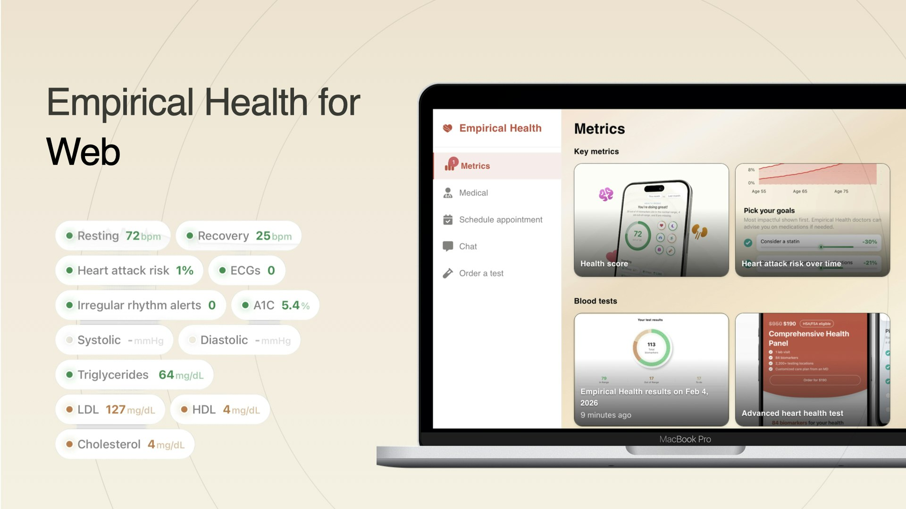

---

