# 🚀 Product Hunt Daily Top 10 (2026-02-19)

## 1. [Origami.chat](https://www.producthunt.com/products/origami-chat)
**Votes**: 306 | **도입 난이도**: 하 | **신뢰도**: 중
**Tagline**: Find your perfect leads with one prompt
**서비스 링크**: https://www.producthunt.com/r/NMVUHKBICTPMDX

**태그**: 리드 생성, 자동화, 데이터 분석, 영업, 마케팅, Chat, Prompting

### 📌 이 서비스 한눈에 보기
프롬프트 하나로 완벽한 잠재 고객 리드 목록을 빠르게 생성하여, 고객 발굴 및 데이터 확보에 드는 시간을 절약해 보세요.

### 🔑 주요 기능
- 100개 이상의 데이터 소스 활용
- 프롬프트 기반의 간편한 사용법
- 잠재 고객 발굴, CSV 데이터 보강, 의사 결정권자 정보 획득

### 🙋 사용자에게 어떤 점이 좋은가
몇 초 만에 맞춤형 리드 목록을 얻을 수 있어, 영업 및 마케팅 활동의 효율성을 극대화하고 더 많은 잠재 고객에게 도달할 수 있습니다. 특히, 데이터 분석 및 고객 발굴에 어려움을 겪는 사용자에게 유용합니다.

### ✅ 지금 바로 써볼 기능
- 원하는 고객 특징을 담은 프롬프트 작성해보기
- CSV 파일을 업로드하여 데이터 보강 시도해보기
- 특정 산업 분야의 의사 결정권자 리스트 생성해보기

### ⚠️ 사용 전 확인할 점
- 데이터 소스의 정확도 및 최신 정보 확인 필요
- 생성된 리스트의 품질에 대한 사용자 검증 필요

### 🧭 확인이 더 필요한 정보
제공되는 데이터 소스의 범위와 업데이트 주기에 대한 추가 정보가 필요합니다.

### 📸 스크린샷 및 갤러리
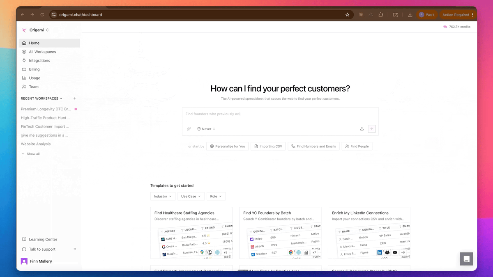
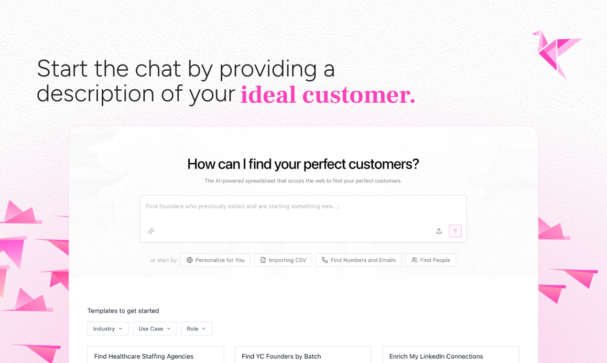
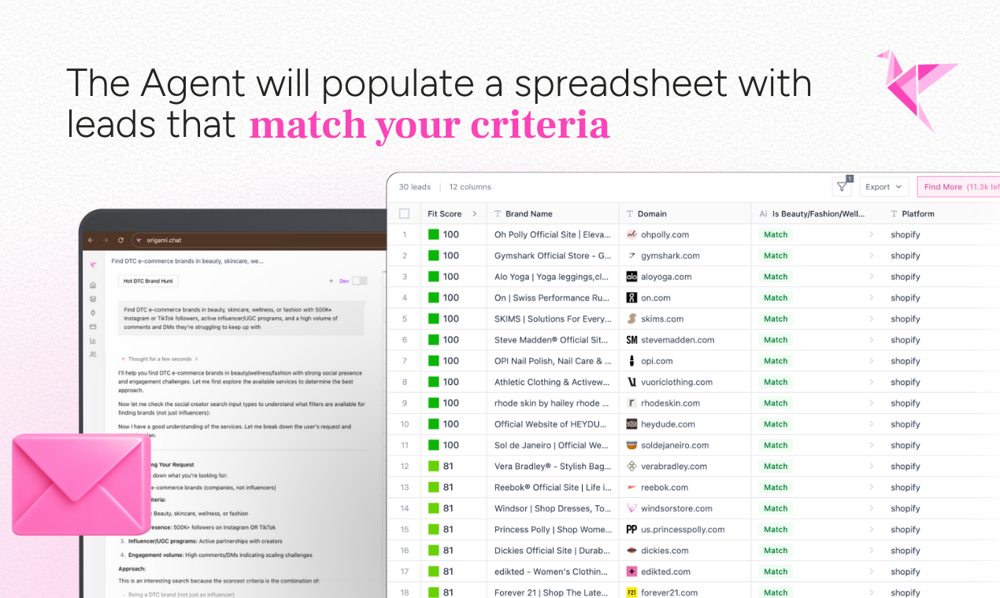

---

## 2. [Clawi.ai](https://www.producthunt.com/products/clawi-ai)
**Votes**: 238 | **도입 난이도**: 하 | **신뢰도**: 중
**Tagline**: OpenClaw in the Cloud with Zero Setup and on 24/7
**서비스 링크**: https://www.producthunt.com/r/FZITZ765ZWI4CO

**태그**: 자동화, AI 어시스턴트, 생산성, AI Tool

### 📌 이 서비스 한눈에 보기
서버 관리 없이 24시간 내 개인 OpenClaw 어시스턴트를 WhatsApp, Telegram, Discord에서 사용하세요!

### 🔑 주요 기능
- 5분 안에 설정 완료
- 서버 관리 불필요
- WhatsApp, Telegram, Discord 지원

### 🙋 사용자에게 어떤 점이 좋은가
더 이상 서버 문제로 씨름하지 마세요. Clawi.ai를 사용하면 개인 OpenClaw 어시스턴트를 쉽고 빠르게 설정하여 24시간 활용할 수 있습니다.

### ✅ 지금 바로 써볼 기능
- WhatsApp 연동하여 사용해보기
- Telegram 채널에 연결해보기
- Discord 서버에 초대하여 활용해보기

### ⚠️ 사용 전 확인할 점
- OpenClaw 자체의 기능 제한사항 확인
- 지원하는 플랫폼 외 사용 가능 여부 확인

### 🧭 확인이 더 필요한 정보
OpenClaw 어시스턴트의 구체적인 기능과 성능에 대한 추가 정보 확인이 필요합니다.

### 📸 스크린샷 및 갤러리
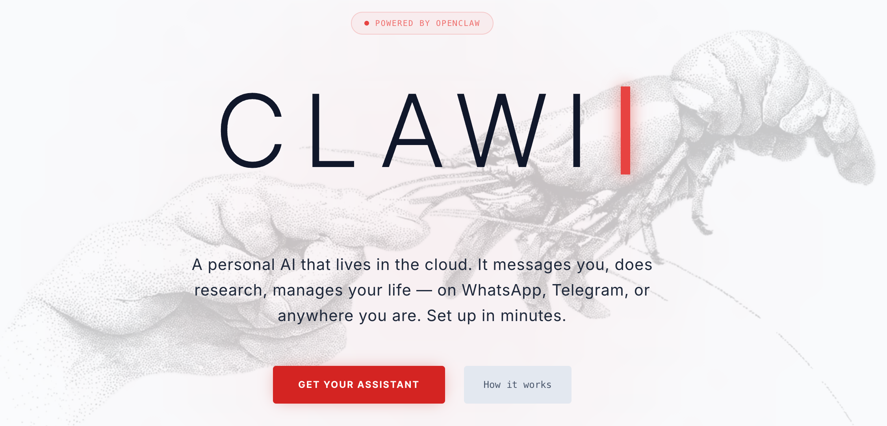
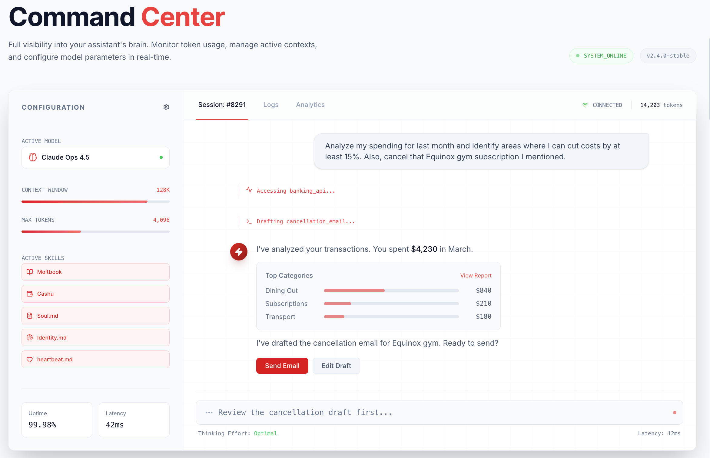
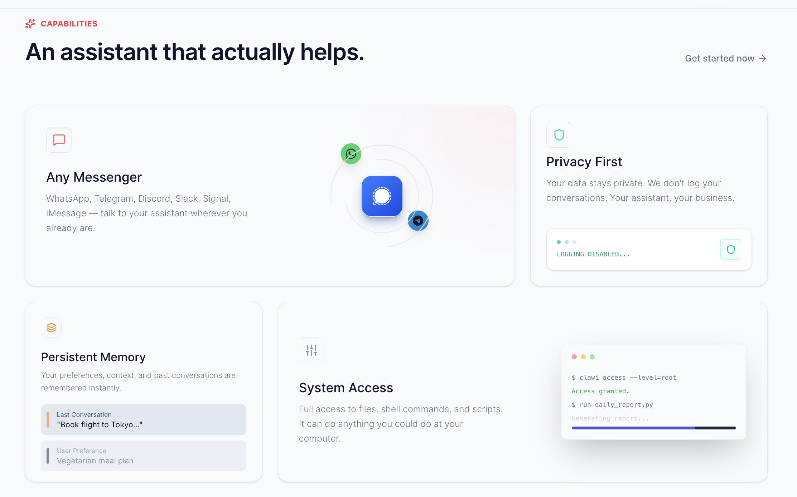

---

## 3. [Reloop](https://www.producthunt.com/products/reloop)
**Votes**: 206 | **도입 난이도**: 중 | **신뢰도**: 중
**Tagline**: Create winning ads without prompts or skills
**서비스 링크**: https://www.producthunt.com/r/ON5VGHUQEFW47Y

**태그**: AI, 광고, 영상 제작, 자동화, 마케팅, Agent, AI Tool, Chat, Prompting, Video

### 📌 이 서비스 한눈에 보기
Reloop은 프롬프트 작성 기술 없이도 대화형 AI 에이전트를 통해 아이디어만으로 광고 영상을 빠르게 제작할 수 있게 해줍니다.

### 🔑 주요 기능
- 프롬프트 작성 없이 대화만으로 광고 제작 가능
- 맞춤형 아바타, 음성 복제, 비디오 편집기, 자동 자막 기능 통합 제공
- 아이디어 구상부터 광고 제작까지 단 몇 분 만에 완료

### 🙋 사용자에게 어떤 점이 좋은가
Reloop을 사용하면 광고 제작에 필요한 시간과 노력을 크게 줄일 수 있으며, 특별한 기술 없이도 고품질의 광고를 만들 수 있습니다. 광고 제작 과정을 간소화하여 마케팅 효율성을 높일 수 있습니다.

### ✅ 지금 바로 써볼 기능
- 아이디어를 채팅으로 설명하고 광고 초안 생성해보기
- 맞춤형 아바타 및 음성 복제 기능 사용해보기
- 자동 자막 기능을 활용하여 광고 영상에 자막 추가해보기

### ⚠️ 사용 전 확인할 점
- AI가 생성하는 광고 품질이 사용자의 기대에 미치지 못할 수 있음
- 아직 초기 단계의 서비스이므로 예상치 못한 오류가 발생할 수 있음

### 🧭 확인이 더 필요한 정보
Reloop의 광고 제작 품질 및 확장성에 대한 사용자 리뷰를 추가적으로 확인해야 합니다.

### 📸 스크린샷 및 갤러리

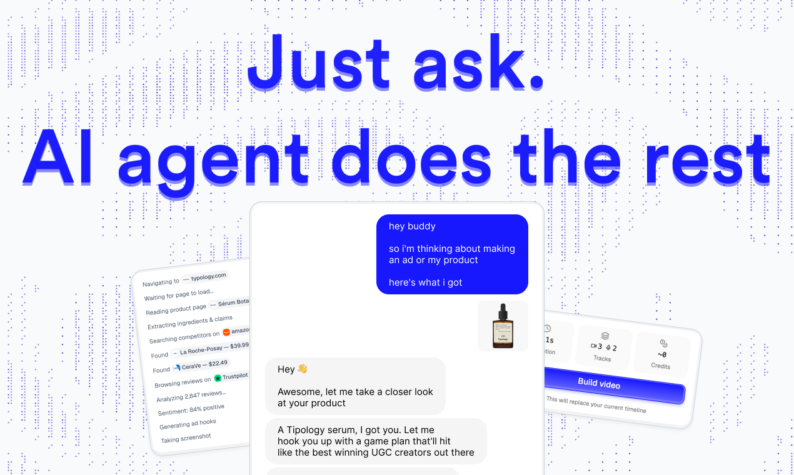
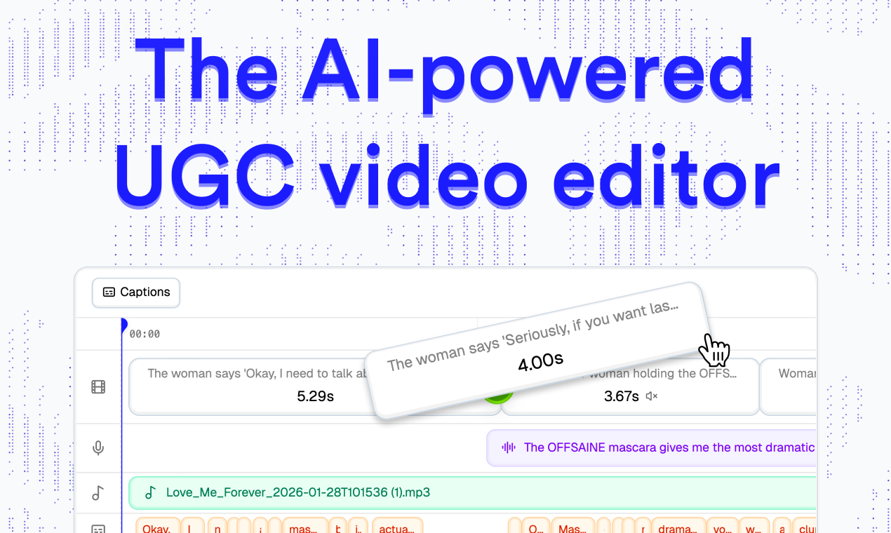

### 🎬 관련 영상
- [🎥 영상 보기](https://ph-files.imgix.net/f90423d3-8b98-4fbf-b669-2cdd63633cf0.jpeg?auto=format)

---

## 4. [FF Designer](https://www.producthunt.com/products/flutterflow)
**Votes**: 163 | **도입 난이도**: 하 | **신뢰도**: 중
**Tagline**: Generate beautiful UI designs that you can instantly edit
**서비스 링크**: https://www.producthunt.com/r/ULPY3V7GSDA6PJ

**태그**: 디자인, AI, UI/UX, 자동화, AI Tool, Prompting, Design

### 📌 이 서비스 한눈에 보기
AI 디자인 도구의 느린 속도와 반복적인 프롬프트 문제 해결! FF Designer는 즉시 편집 가능한 고품질 UI 디자인을 빠르게 생성하여 작업 효율성을 극대화합니다.

### 🔑 주요 기능
- 빠른 UI 디자인 생성 속도
- 시각적인 편집 기능 제공
- 다운로드 및 내보내기 지원

### 🙋 사용자에게 어떤 점이 좋은가
반복적인 프롬프트 입력 없이 즉시 수정 가능한 완성도 높은 디자인을 얻을 수 있어 디자인 작업 시간을 단축하고 창의적인 작업에 집중할 수 있습니다.

### ✅ 지금 바로 써볼 기능
- AI 디자인 생성 기능 사용해보기
- 생성된 디자인 즉시 편집해보기
- 다양한 내보내기 옵션 확인해보기

### ⚠️ 사용 전 확인할 점
- 생성된 디자인의 완성도는 사용자의 요구사항에 따라 달라질 수 있습니다.
- 복잡한 디자인의 경우, 편집 기능의 제약이 있을 수 있습니다.

### 🧭 확인이 더 필요한 정보
FF Designer가 지원하는 디자인 템플릿의 종류와 사용자 정의 가능 범위에 대한 추가 정보가 필요합니다.

### 📸 스크린샷 및 갤러리
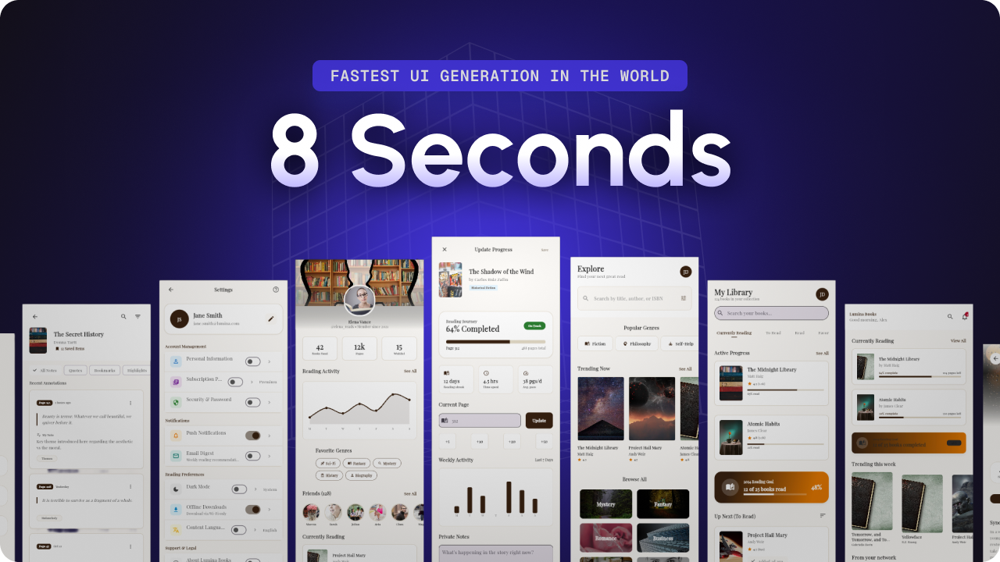
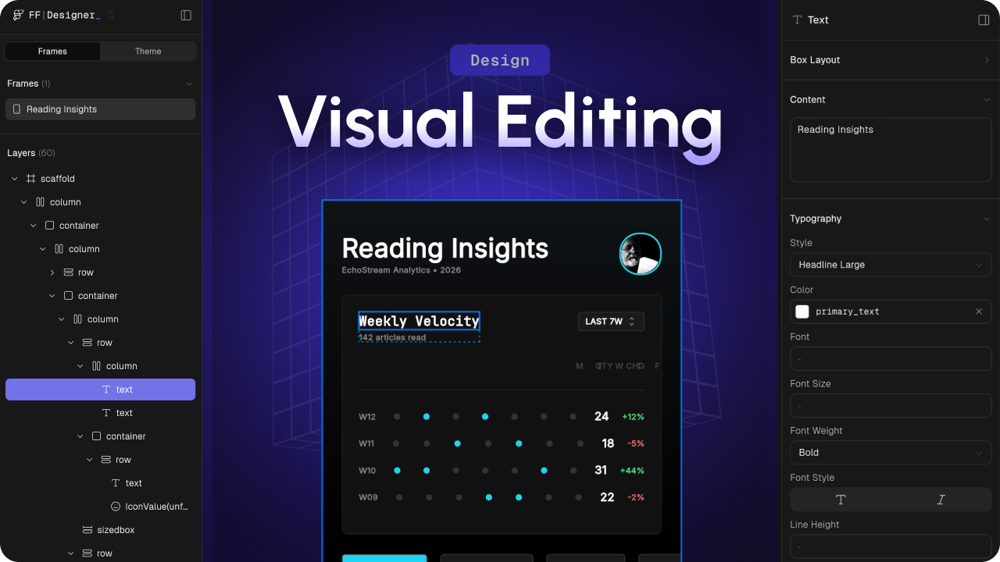
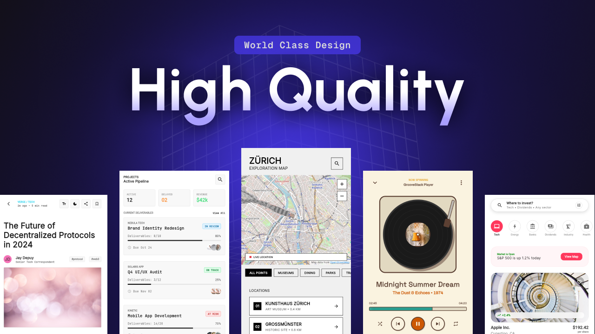

### 🎬 관련 영상
- [🎥 영상 보기](https://ph-files.imgix.net/feffa86e-491c-48f5-8d90-c6b519c6a099.jpeg?auto=format)

---

## 5. [Monologue for iOS](https://www.producthunt.com/products/monologue-2)
**Votes**: 160 | **도입 난이도**: 중 | **신뢰도**: 중
**Tagline**: Turn your voice into polished writing—wherever you go.
**서비스 링크**: https://www.producthunt.com/r/WV4M33GRYXCMSP

**태그**: 글쓰기, 생산성, 음성인식, 자동화, AI Tool, Email

### 📌 이 서비스 한눈에 보기
아이폰에서 음성을 텍스트로 변환할 때, 단순 딕테이션이 아닌 문맥에 맞춰 다듬어주는 똑똑한 글쓰기 도구

### 🔑 주요 기능
- 음성을 텍스트로 변환 시 문법 및 문맥에 맞게 자동 수정
- 필요 없는 단어 제거 및 구두점 자동 추가
- 터미널 코딩부터 메시지 전송까지 다양한 앱에서 사용 가능

### 🙋 사용자에게 어떤 점이 좋은가
이제 음성으로 더 빠르고 효율적으로 글을 쓸 수 있으며, 작성된 텍스트의 품질도 향상됩니다.

### ✅ 지금 바로 써볼 기능
- 메시지 앱에서 음성으로 빠르게 답장하기
- 메모 앱에서 음성으로 아이디어 정리하기
- 코딩 시 터미널에서 음성으로 코드 작성해보기

### ⚠️ 사용 전 확인할 점
- 정확도는 사용 환경(소음, 발음)에 따라 달라질 수 있음
- 지원 언어 확인 필요

### 🧭 확인이 더 필요한 정보
어떤 언어를 지원하는지, 그리고 오프라인에서도 사용 가능한지 확인이 필요합니다.

### 📸 스크린샷 및 갤러리
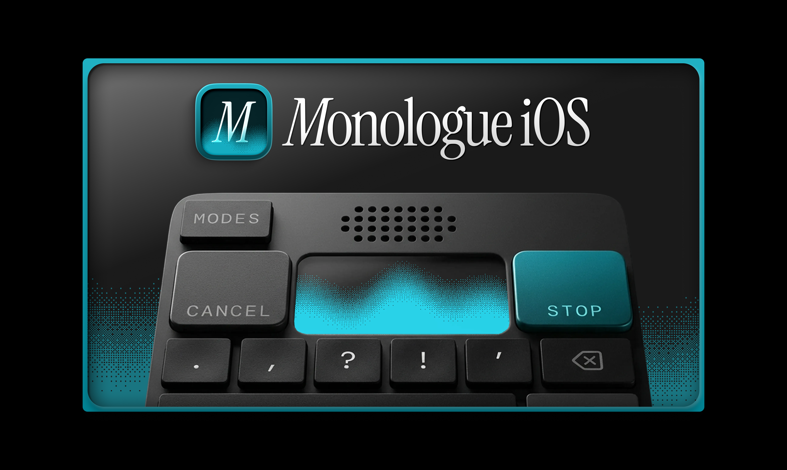

### 🎬 관련 영상
- [🎥 영상 보기](https://ph-files.imgix.net/b41c1175-5ba8-4f87-bfb2-d41067c8197f.jpeg?auto=format)

---

## 6. [Kollect Voice Agent](https://www.producthunt.com/products/kollect-voice-agent)
**Votes**: 115 | **도입 난이도**: 중 | **신뢰도**: 중
**Tagline**: Collect forms via voice
**서비스 링크**: https://www.producthunt.com/r/RDNFXGXVMGMHF2

**태그**: AI, 음성인식, 설문조사, 자동화, 데이터수집, Agent, AI Tool

### 📌 이 서비스 한눈에 보기
지루한 설문조사를 AI 기반 음성 대화로 바꿔 실시간으로 데이터를 수집하고, 음성으로 설문 양식을 만들 수도 있습니다.

### 🔑 주요 기능
- 자연스러운 음성 기반 설문조사
- AI 기반의 대화형 인터페이스
- 음성으로 설문 양식 생성 가능

### 🙋 사용자에게 어떤 점이 좋은가
복잡한 설문지를 일일이 작성할 필요 없이, 음성으로 쉽고 빠르게 데이터를 수집할 수 있어 업무 효율성을 높여줍니다. 특히, 현장 조사나 고객 피드백 수집에 유용합니다.

### ✅ 지금 바로 써볼 기능
- 음성으로 설문 양식 만들기
- 다양한 상황에서 음성 설문조사 진행해보기
- 수집된 데이터 분석하기

### ⚠️ 사용 전 확인할 점
- AI의 음성 인식 정확도 확인 필요
- 개인정보 보호 관련 정책 준수 필요

### 🧭 확인이 더 필요한 정보
어떤 언어들을 지원하는지, 그리고 데이터 보안 관련 정책은 어떻게 되는지 추가 확인이 필요합니다.

### 📸 스크린샷 및 갤러리
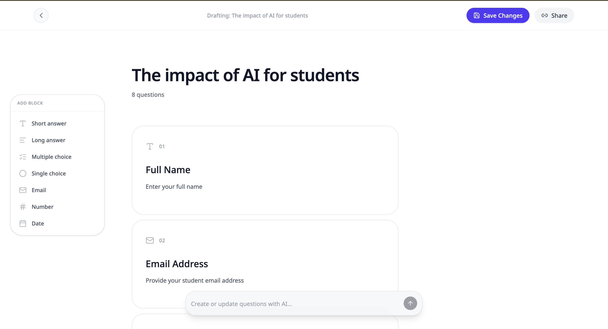
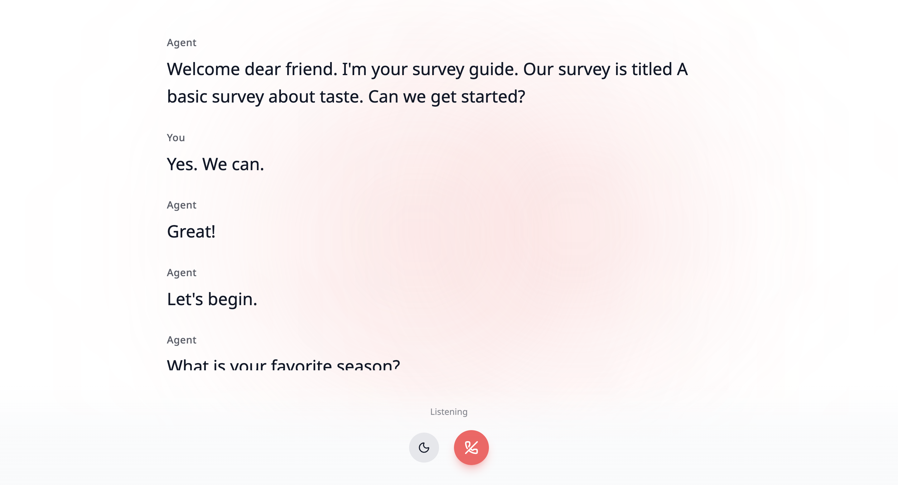

### 🎬 관련 영상
- [🎥 영상 보기](https://ph-files.imgix.net/d77cd44a-54db-4099-8921-8ea0cefc6343.jpeg?auto=format)

---

## 7. [HyperCaps for macOS](https://www.producthunt.com/products/hypercaps-for-macos)
**Votes**: 110 | **도입 난이도**: 중 | **신뢰도**: 중
**Tagline**: Turn CapsLock into a Super Key & Boost Productivity
**서비스 링크**: https://www.producthunt.com/r/2Y5KYVYPGBNGG6

**태그**: 생산성, 단축키, 맥(macOS), 자동화, DevTool, Productivity

### 📌 이 서비스 한눈에 보기
맥(macOS) CapsLock 키를 생산성 향상을 위한 '슈퍼 키'로 바꿔, 복잡한 단축키 사용을 간소화하고 작업 효율을 높여줍니다.

### 🔑 주요 기능
- CapsLock 키를 Cmd+Opt+Ctrl+Shift 슈퍼 키로 변환
- Vim 모드로 홈 행에서 방향키 없이 탐색 가능
- 탭 한 번으로 Escape 또는 CapsLock 기능 활성화

### 🙋 사용자에게 어떤 점이 좋은가
복잡한 단축키 조합을 누르기 위해 손가락을 꼬는 불편함을 해소하고, CapsLock 키를 활용하여 작업 속도를 향상시켜줍니다.

### ✅ 지금 바로 써볼 기능
- CapsLock 키를 슈퍼 키로 설정하고 단축키 사용해보기
- Vim 모드를 활성화하여 문서 편집 시 방향키 없이 탐색해보기
- 스마트 탭 설정을 조정하여 Escape 또는 CapsLock 기능 사용해보기

### ⚠️ 사용 전 확인할 점
- 다른 앱과의 단축키 충돌 가능성 확인
- CapsLock 키 사용 습관 변경에 따른 적응 기간 필요

### 🧭 확인이 더 필요한 정보
다양한 앱 환경에서 단축키 충돌 발생 여부 및 사용자별 적응 기간에 대한 추가 정보가 필요합니다.

### 📸 스크린샷 및 갤러리
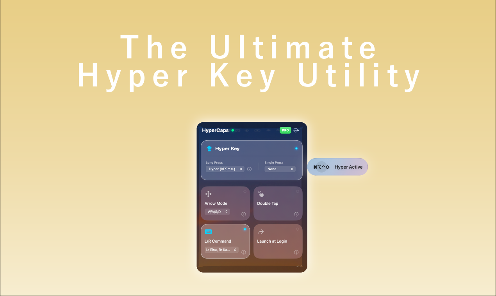
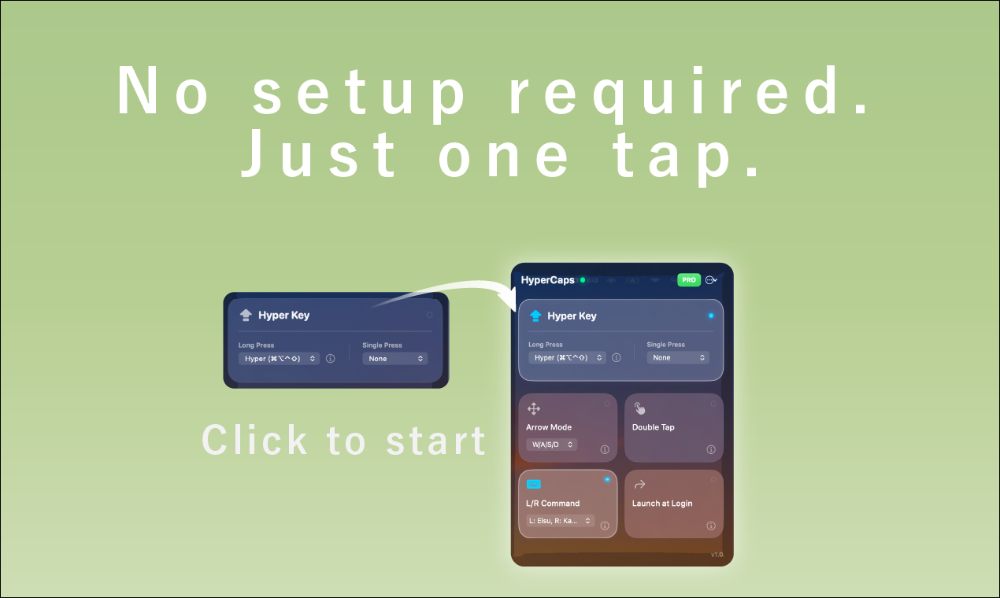
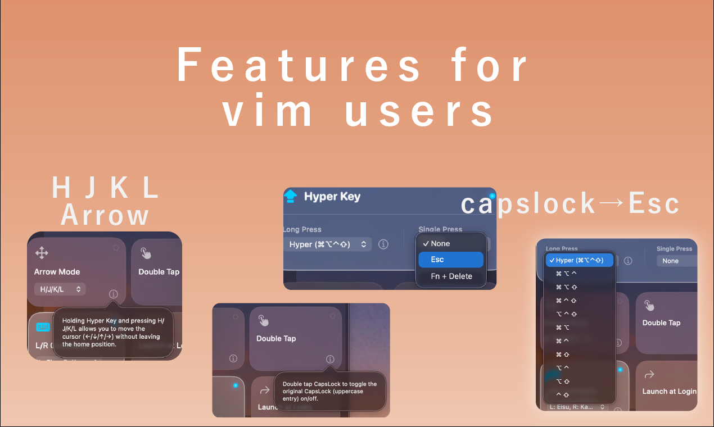

### 🎬 관련 영상
- [🎥 영상 보기](https://ph-files.imgix.net/79938241-c667-49ef-bf6a-2b5077e86012.jpeg?auto=format)

---

## 8. [Decks For Good](https://www.producthunt.com/products/decks-for-good)
**Votes**: 104 | **도입 난이도**: 중 | **신뢰도**: 중
**Tagline**: Get fundraising advice when you give to charity
**서비스 링크**: https://www.producthunt.com/r/3URR37QSR5D46Y

**태그**: 펀드레이징, 피치덱, 기부, 투자, 피드백, AI Tool

### 📌 이 서비스 한눈에 보기
기부하고 투자 전문가에게 피드백받아 성공적인 펀드레이징을 위한 피치덱을 만드세요. 기부금 전액은 자선단체에 전달됩니다.

### 🔑 주요 기능
- 기부하고 펀드레이징 피치덱에 대한 투자자 및 창업가의 피드백을 받습니다.
- 피드백을 통해 펀드레이징 성공 가능성을 높입니다.
- 기부금 100%가 자선단체에 직접 전달됩니다.

### 🙋 사용자에게 어떤 점이 좋은가
펀드레이징을 준비하는 스타트업 창업자나 사회적 기업가가 피치덱을 개선하고 투자 유치 가능성을 높이는 데 유용합니다. 동시에 좋은 일도 할 수 있습니다.

### ✅ 지금 바로 써볼 기능
- 피치덱을 준비하고, Decks For Good에 접속하여 기부할 자선단체를 선택하세요.
- 기부 후, 피치덱을 제출하고 피드백을 요청하세요.
- 피드백을 바탕으로 피치덱을 개선하고 펀드레이징에 활용하세요.

### ⚠️ 사용 전 확인할 점
- 피드백 제공자의 전문성과 피드백의 질은 보장되지 않을 수 있습니다.
- 투자 유치 가능성은 피드백 외에도 다양한 요인에 따라 달라질 수 있습니다.

### 🧭 확인이 더 필요한 정보
피드백 제공자의 구체적인 배경과 전문 분야에 대한 정보가 더 필요합니다.

### 📸 스크린샷 및 갤러리
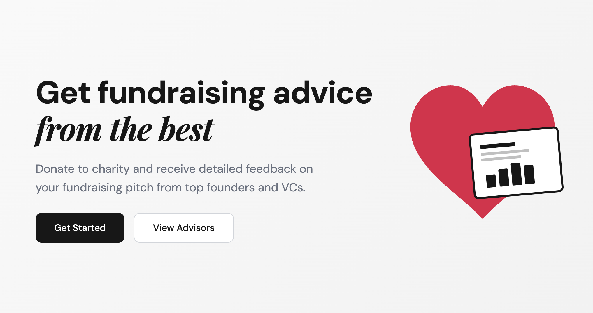
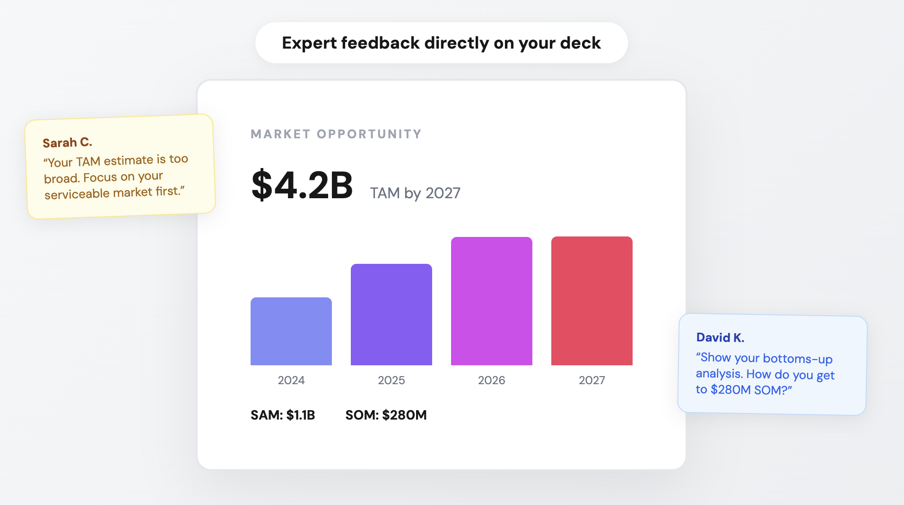
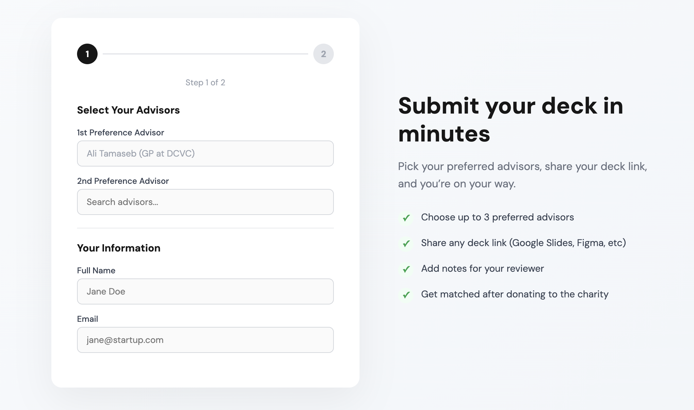

---

## 9. [AgentReady](https://www.producthunt.com/products/agentready-2)
**Votes**: 97 | **도입 난이도**: 중 | **신뢰도**: 중
**Tagline**: Cut your AI token costs by 40-60% with one API call
**서비스 링크**: https://www.producthunt.com/r/LRVFGJCXHYN3VH

**태그**: Agent, AI Tool, LLM, Vision, DevTool, API

### 🧭 확인이 더 필요한 정보
Product Hunt 설명(태그라인/디스크립션) 기반 정리이므로 실제 기능/가격/정책은 제품 페이지 확인이 필요합니다.

### 📸 스크린샷 및 갤러리
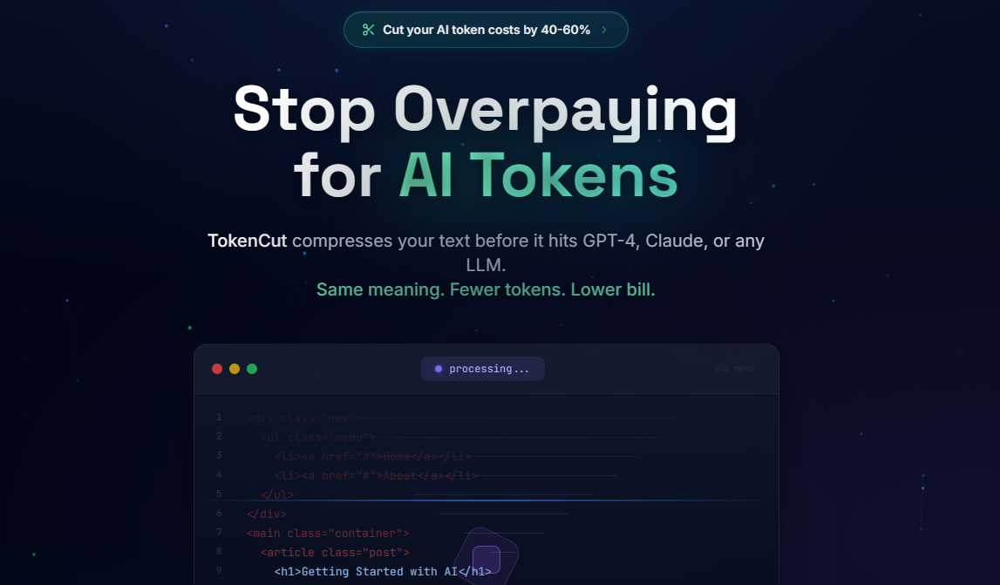
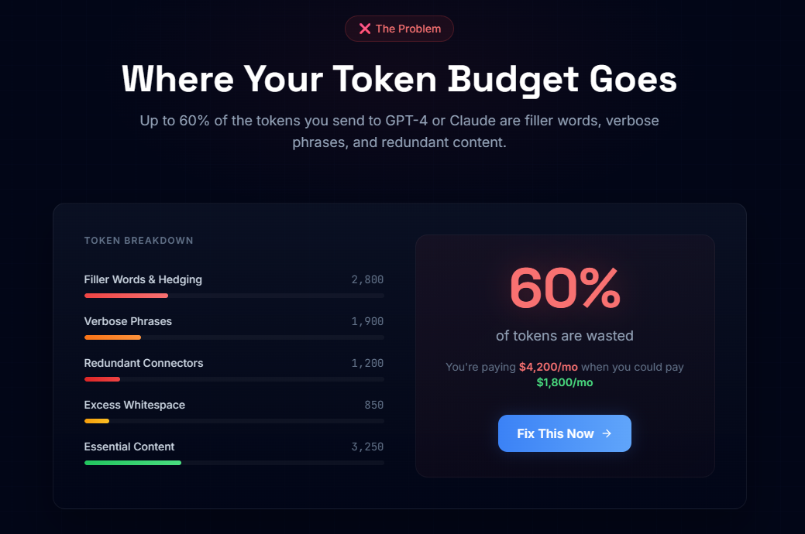
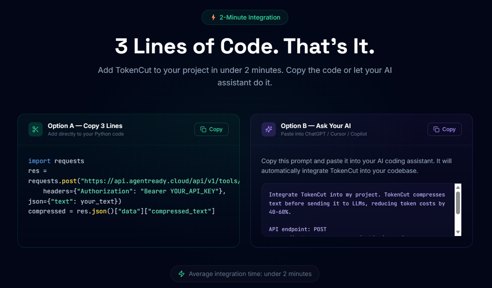

---

## 10. [Mengram](https://www.producthunt.com/products/mengram)
**Votes**: 97 | **도입 난이도**: 중 | **신뢰도**: 중
**Tagline**: AI memory API with 3 types: facts, events, and workflows
**서비스 링크**: https://www.producthunt.com/r/NR6MAZGJFDX3PR

**태그**: AI, API, 자동화, 개발툴, 오픈소스, Agent, Automation, AI Tool

### 📌 이 서비스 한눈에 보기
Mengram은 AI 에이전트가 학습한 내용을 기억하고 재사용하도록 돕는 API로, 에이전트의 작업 효율성을 극대화합니다.

### 🔑 주요 기능
- 사실, 이벤트, 워크플로우 세 가지 유형의 기억 자동 추출
- 작업 성공/실패 추적을 통한 최적 경로 학습 및 재사용
- Claude, LangChain, CrewAI, OpenClaw 등 다양한 프레임워크 지원

### 🙋 사용자에게 어떤 점이 좋은가
AI 에이전트가 반복적인 작업을 자동화하고, 과거 경험을 바탕으로 더 나은 결정을 내리도록 도와 생산성을 향상시킵니다.

### ✅ 지금 바로 써볼 기능
- AI 에이전트에 Mengram 통합하여 기억 저장 기능 활성화
- 작업 완료 후 Mengram에 저장된 워크플로우 확인
- 성공/실패 추적 데이터 분석으로 에이전트 성능 개선

### ⚠️ 사용 전 확인할 점
- API 호출량 제한 확인 필요
- 지원하는 프레임워크 버전 확인 필요

### 🧭 확인이 더 필요한 정보
실제 사용 환경에서의 성능 및 확장성에 대한 추가 검증이 필요합니다.

### 📸 스크린샷 및 갤러리
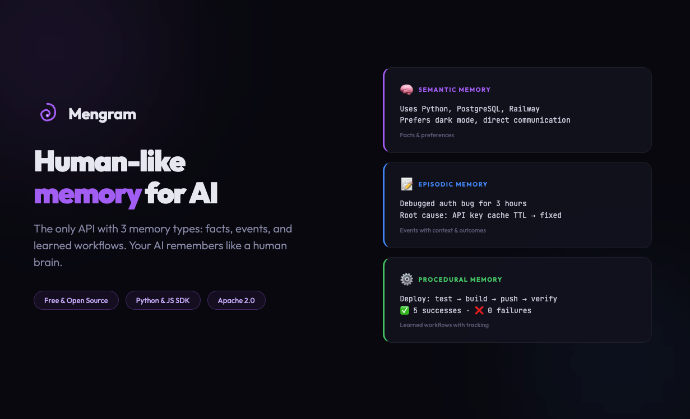
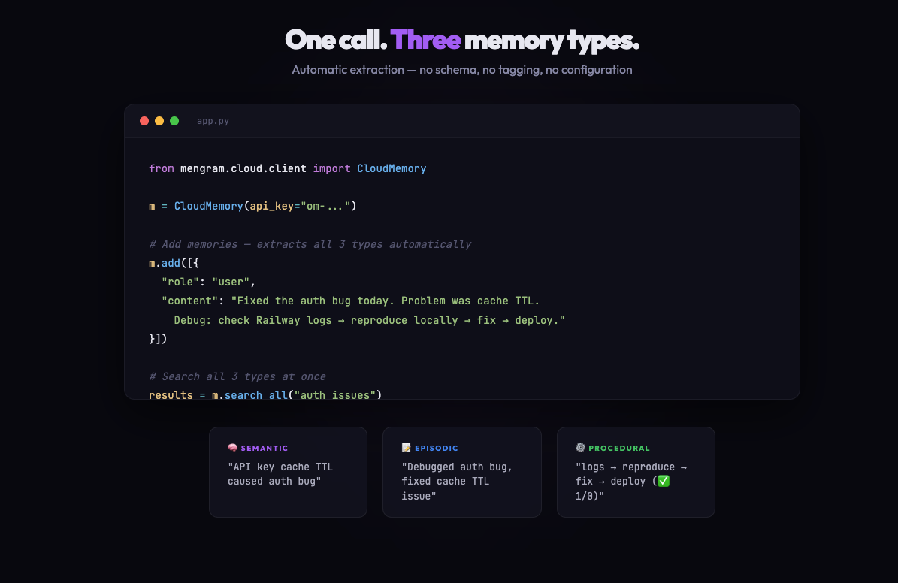

---

