# 🚀 Product Hunt Daily Top 10 (2026-02-20)

## 1. [Gemini 3.1 Pro](https://www.producthunt.com/products/gemini-6)
**Votes**: 343 | **도입 난이도**: 중 | **신뢰도**: 중
**Tagline**: A smarter model for your most complex tasks
**서비스 링크**: https://www.producthunt.com/r/CAQ2BW4R4II6WT

**태그**: AI, 문제 해결, 추론, DevTool, Design

### 📌 이 서비스 한눈에 보기
Gemini 3.1 Pro는 복잡한 문제 해결 능력을 향상시켜 더 똑똑하고 유능한 AI 모델을 찾는 사용자에게 적합합니다.

### 🔑 주요 기능
- 더욱 향상된 추론 능력
- 복잡한 문제 해결에 특화
- Gemini 3 시리즈의 업그레이드 버전

### 🙋 사용자에게 어떤 점이 좋은가
단순한 답변 이상을 요구하는 작업에서 뛰어난 성능을 발휘하며, 문제 해결에 필요한 핵심적인 사고 능력을 제공합니다.

### ✅ 지금 바로 써볼 기능
- 복잡한 데이터 분석 시 사용
- 창의적인 문제 해결에 활용
- 기존 Gemini 모델과 비교 분석

### ⚠️ 사용 전 확인할 점
- 특정 분야에 편향된 답변을 제공할 수 있음
- 완벽한 문제 해결을 보장하지 않음

### 🧭 확인이 더 필요한 정보
실제 사용 사례를 통해 3.1 Pro의 성능 향상 정도를 확인해야 합니다.

### 📸 스크린샷 및 갤러리
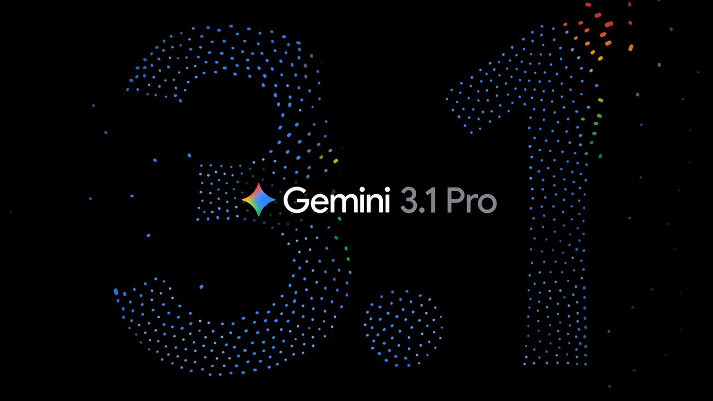
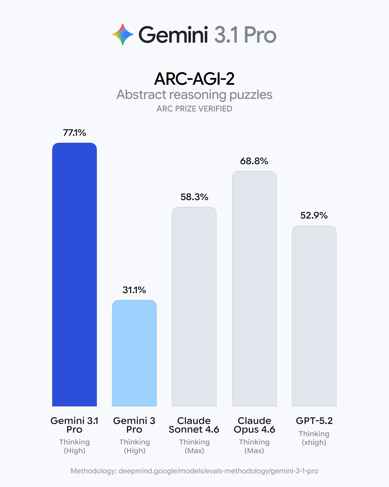

---

## 2. [Google Pomelli 2.0 ](https://www.producthunt.com/products/google)
**Votes**: 272 | **도입 난이도**: 중 | **신뢰도**: 중
**Tagline**: Turn simple product photos into pro studio imagery instantly
**서비스 링크**: https://www.producthunt.com/r/NTAGXLYVOMPYJV

**태그**: 이미지 생성, 마케팅, 자동화, 제품 사진, Vision, Marketing

### 📌 이 서비스 한눈에 보기
구글 포멜리 2.0, 단 하나의 제품 사진으로 전문가 수준의 마케팅 이미지를 즉시 만들어 보세요!

### 🔑 주요 기능
- ‘Photoshoot’ 기능으로 간단한 제품 사진을 고품질 이미지로 변환
- 텍스트 설명 또는 이미지 참조를 통해 원하는 제품 이미지 직접 제작 및 편집 가능
- 마케팅 자료 제작 시간 단축 및 비용 절감 효과 기대

### 🙋 사용자에게 어떤 점이 좋은가
복잡한 스튜디오 촬영 없이도 제품의 매력을 돋보이게 하는 이미지를 손쉽게 만들 수 있어, 마케팅 효율성을 높이고 시간과 비용을 절약해 줍니다.

### ✅ 지금 바로 써볼 기능
- 기존 제품 사진을 업로드하여 'Photoshoot' 기능 시험해보기
- 텍스트 설명으로 원하는 이미지 스타일을 구체적으로 지정하여 이미지 생성해보기
- 생성된 이미지 다운로드하여 마케팅 자료에 활용해보기

### ⚠️ 사용 전 확인할 점
- 생성된 이미지의 저작권 관련 사항 확인 필요
- 이미지 품질은 원본 사진 및 설명의 정확도에 따라 달라질 수 있음

### 🧭 확인이 더 필요한 정보
생성 가능한 이미지 스타일 및 편집 기능의 상세 범위에 대한 추가 정보 확인이 필요합니다.

### 📸 스크린샷 및 갤러리
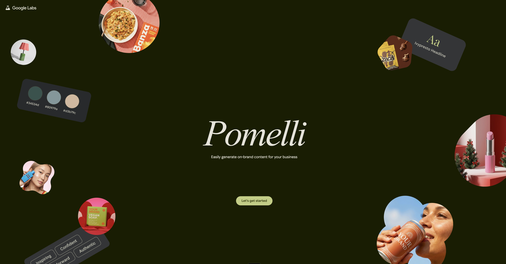
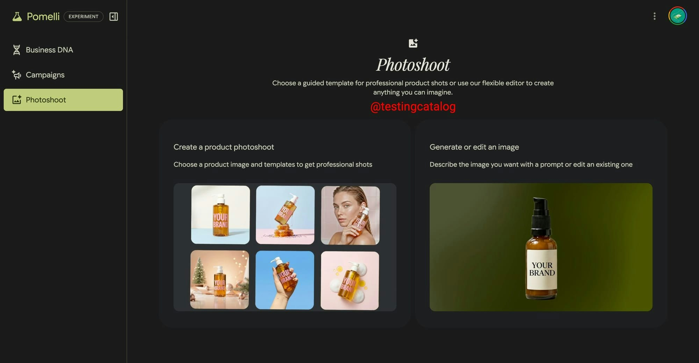
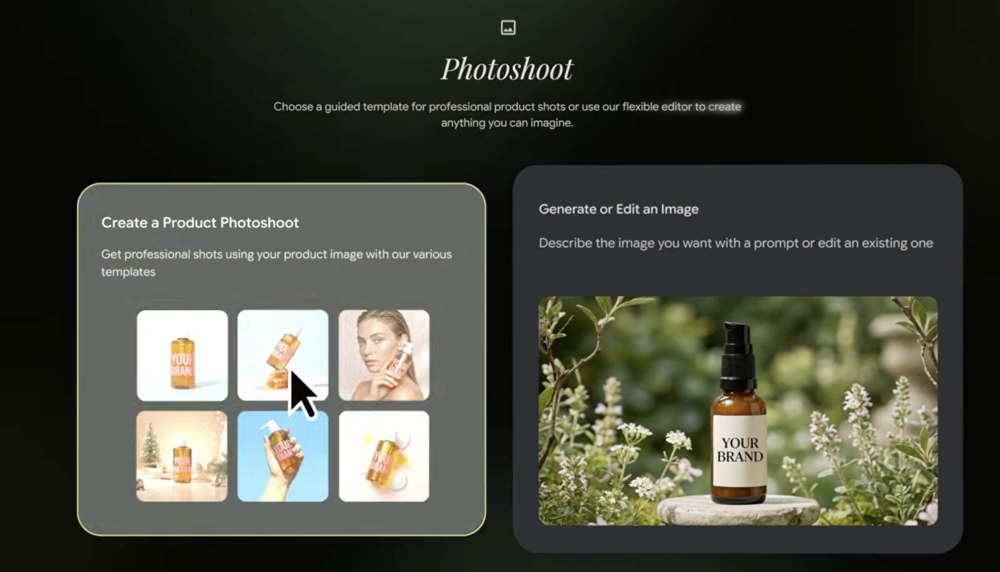

### 🎬 관련 영상
- [🎥 영상 보기](https://ph-files.imgix.net/69834507-23fc-4e4f-b6bc-3416de67ce52.jpeg?auto=format)

---

## 3. [Architect by Lyzr](https://www.producthunt.com/products/architect)
**Votes**: 239 | **도입 난이도**: 중 | **신뢰도**: 중
**Tagline**: Build AI that works for you
**서비스 링크**: https://www.producthunt.com/r/EMVYYBVLEV27LQ

**태그**: AI, 자동화, DevTool, Workflow, Agent, AI Tool

### 📌 이 서비스 한눈에 보기
코딩 없이 N8N처럼 강력하고 사용자 친화적인 멀티 에이전트 AI 시스템을 구축하고, 모든 결정 과정을 투명하게 관리하세요.

### 🔑 주요 기능
- 코드 없이 시각적으로 AI 시스템 구축
- 모든 의사결정 과정에 대한 완벽한 통제
- 다양한 통합 및 워크플로우 지원

### 🙋 사용자에게 어떤 점이 좋은가
Architect를 사용하면 복잡한 AI 시스템을 쉽게 설계하고 관리할 수 있으며, 코드 작성 부담 없이 원하는 기능을 구현할 수 있습니다. AI 시스템의 작동 방식을 명확하게 파악하여 문제 해결과 개선에 도움이 됩니다.

### ✅ 지금 바로 써볼 기능
- 다양한 에이전트 연결하여 워크플로우 구성해보기
- 데이터 흐름 시각화 기능 활용해보기
- 각 에이전트의 결정 과정 추적해보기

### ⚠️ 사용 전 확인할 점
- 지원하는 통합 범위 확인 필요
- 복잡한 워크플로우 설계 시 성능 검토 필요

### 🧭 확인이 더 필요한 정보
실제 사용 환경에서 Architect의 성능 및 안정성에 대한 추가적인 정보가 필요합니다.

### 📸 스크린샷 및 갤러리
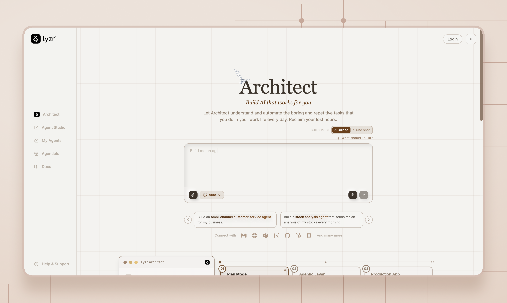
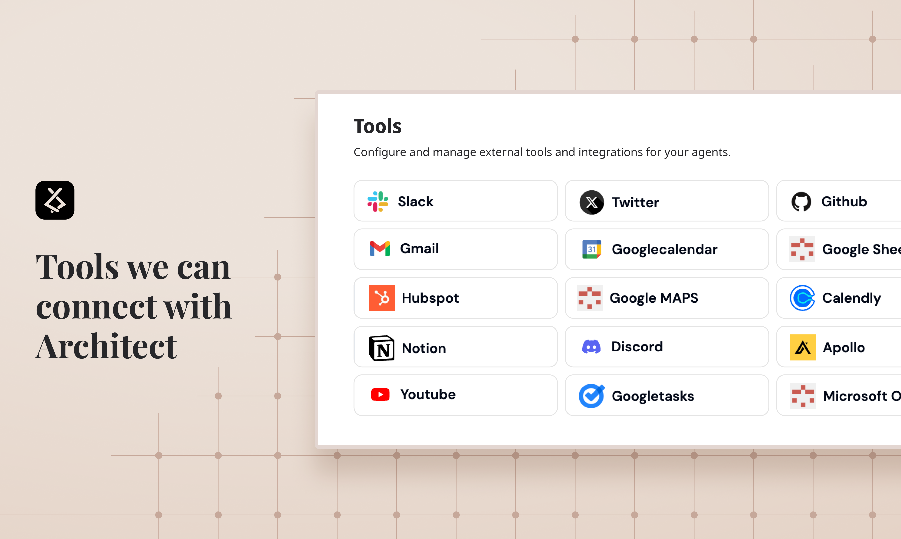

### 🎬 관련 영상
- [🎥 영상 보기](https://ph-files.imgix.net/734fb5b1-318d-429f-aff9-71f812dfac5b.jpeg?auto=format)

---

## 4. [Claudebin](https://www.producthunt.com/products/claudebin)
**Votes**: 186 | **도입 난이도**: 중 | **신뢰도**: 중
**Tagline**: Export and share your Claude Code sessions as resumable URLs
**서비스 링크**: https://www.producthunt.com/r/QCXVCLOIINOBVF

**태그**: DevTool, 협업, 코드 공유, Claude Code, AI Tool

### 📌 이 서비스 한눈에 보기
Claude Code 세션 내용을 쉽게 공유하고 재사용할 수 있도록 URL 형태로 저장하고 관리할 수 있게 해주는 도구입니다.

### 🔑 주요 기능
- Claude Code 세션 전체 내용 캡쳐 (메시지 스레드, 파일 입출력, bash 명령어, 웹/MCP 호출)
- 캡쳐된 세션을 구조화된 뷰어로 제공 (URL 링크 공유)
- PR, 문서 등에 임베딩 가능, 로컬에서 재개 가능

### 🙋 사용자에게 어떤 점이 좋은가
Claude Code를 사용하는 개발자가 코드 리뷰, 문서 작성, 문제 해결 과정 등을 동료와 더 효율적으로 공유하고 협업할 수 있도록 돕습니다. 로컬에만 저장되던 세션 데이터를 팀원과 쉽게 공유하고, 나중에 다시 활용할 수 있어 생산성을 높여줍니다.

### ✅ 지금 바로 써볼 기능
- Claude Code 세션을 Claudebin으로 내보내기
- 생성된 URL을 동료에게 공유하기
- URL을 사용하여 세션 내용 확인 및 재개하기

### ⚠️ 사용 전 확인할 점
- Claudebin 서버에 세션 데이터가 저장되므로, 보안 및 개인정보 보호 정책 확인 필요
- 지원되는 Claude Code 버전 및 기능 확인 필요

### 🧭 확인이 더 필요한 정보
Claudebin 서비스의 안정성 및 지속적인 업데이트 여부에 대한 추가 정보가 필요합니다.

### 📸 스크린샷 및 갤러리
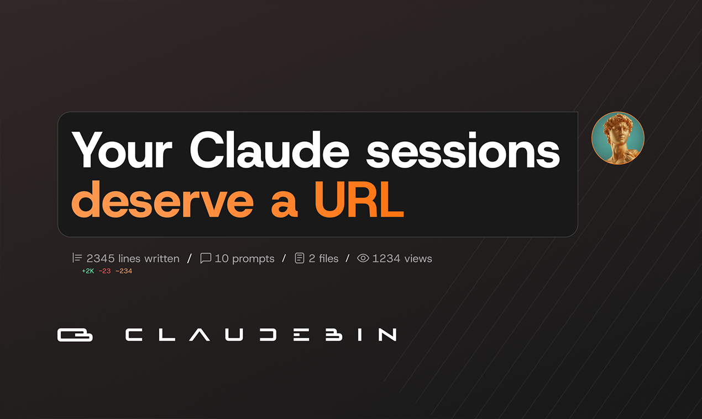
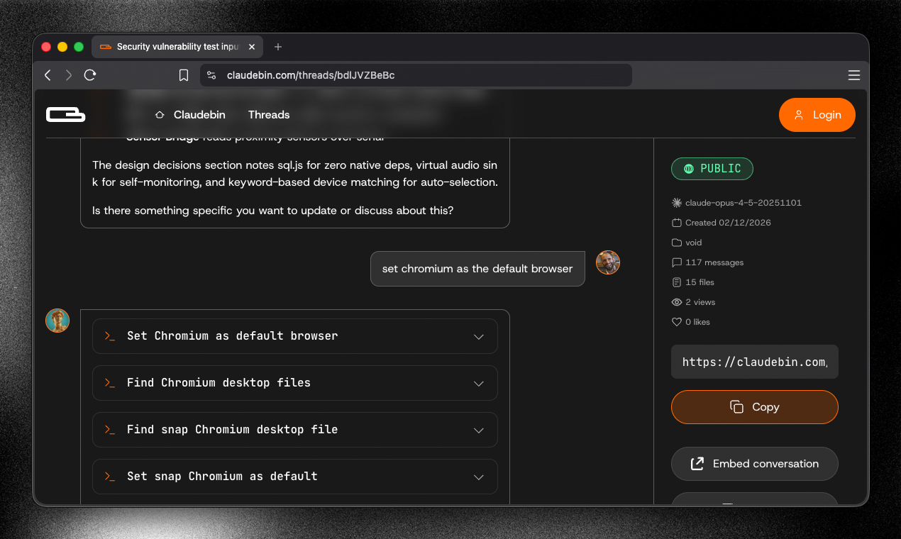
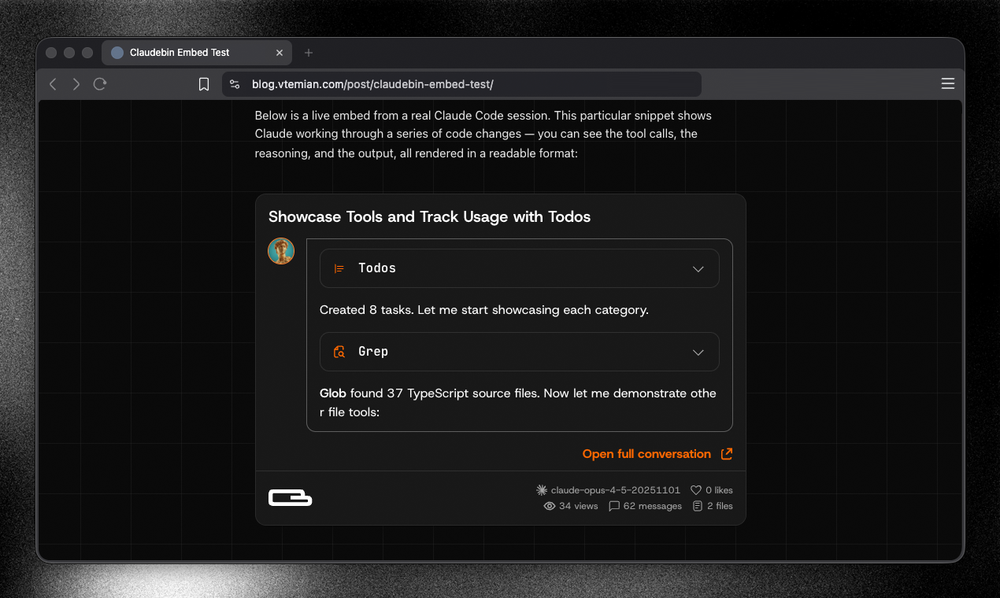

### 🎬 관련 영상
- [🎥 영상 보기](https://ph-files.imgix.net/aa79b1c4-e71d-4964-b01c-5c2e629cf996.jpeg?auto=format)

---

## 5. [Arcmark](https://www.producthunt.com/products/arcmark)
**Votes**: 167 | **도입 난이도**: 중 | **신뢰도**: 중
**Tagline**: Your bookmarks, attached to any browser as a sidebar
**서비스 링크**: https://www.producthunt.com/r/FRGB42YL7JASI6

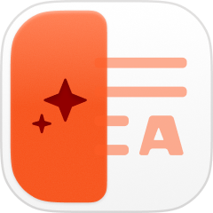

### 🧭 확인이 더 필요한 정보
Product Hunt 설명(태그라인/디스크립션) 기반 정리이므로 실제 기능/가격/정책은 제품 페이지 확인이 필요합니다.

### 📸 스크린샷 및 갤러리
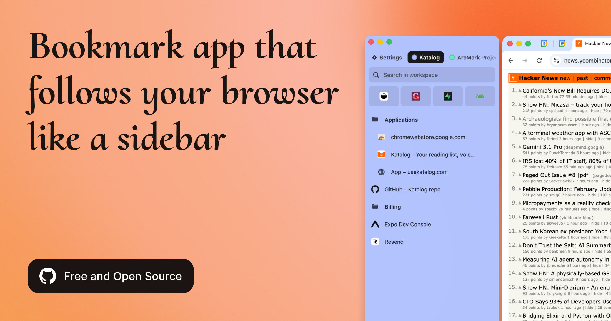
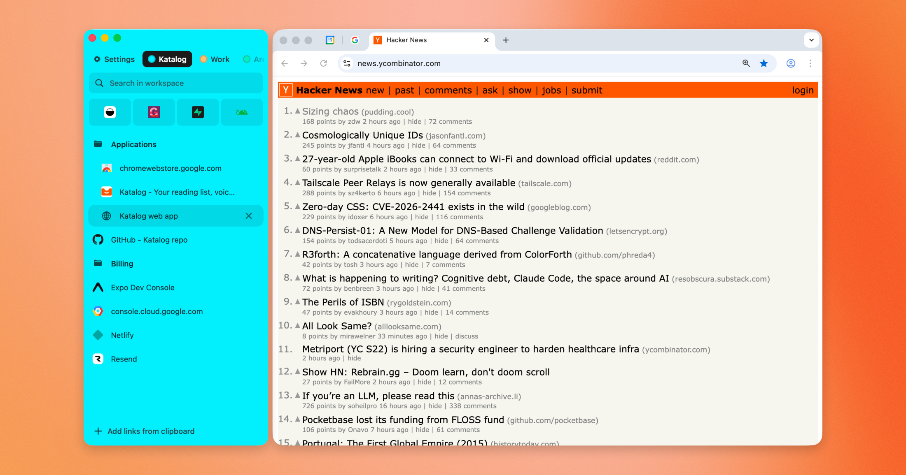
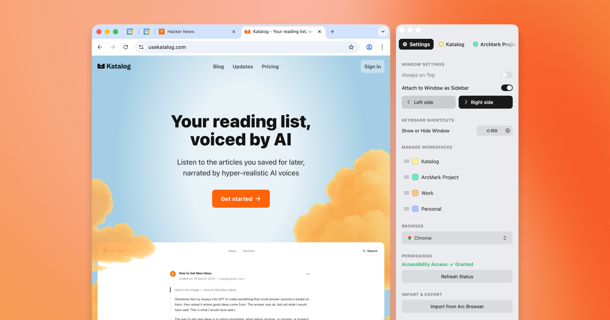

### 🎬 관련 영상
- [🎥 영상 보기](https://ph-files.imgix.net/8f77feed-7ed6-4e1e-ba17-01023ec9b669.jpeg?auto=format)

---

## 6. [keychains.dev](https://www.producthunt.com/products/keychain-dev)
**Votes**: 166 | **도입 난이도**: 중 | **신뢰도**: 중
**Tagline**: Give AI access to 6754+ APIs with zero credentials exposed
**서비스 링크**: https://www.producthunt.com/r/EFULFZJ5FPJCG4

**태그**: DevTool, 보안, API, AI, 자동화, Agent, AI Tool, Prompting, Design

### 📌 이 서비스 한눈에 보기
AI 에이전트가 API에 안전하게 접근하도록 도와주는 보안 자격 증명 프록시로, API 키 노출 없이 11,000개 이상의 API를 활용할 수 있습니다.

### 🔑 주요 기능
- API 키를 코드에 직접 노출할 필요 없이 안전하게 관리
- 프롬프트 인젝션 공격으로부터 안전하게 보호
- 사용자 권한 승인 및 접근 기록 추적 기능 제공

### 🙋 사용자에게 어떤 점이 좋은가
AI 에이전트 개발 시 보안 걱정 없이 다양한 API를 활용할 수 있으며, 사용자 데이터 유출 위험을 줄여줍니다.

### ✅ 지금 바로 써볼 기능
- keychains curl 명령어를 기존 curl 명령어 대신 사용해보기
- 템플릿 변수를 사용하여 API 키를 안전하게 관리하기
- 접근 권한 설정 및 감사 로그 확인하기

### ⚠️ 사용 전 확인할 점
- 지원하는 API의 범위 및 성능 확인 필요
- 기존 코드 수정 필요 여부 확인

### 🧭 확인이 더 필요한 정보
실제 API 사용 환경에서의 성능 및 안정성 검증이 필요합니다.

### 📸 스크린샷 및 갤러리
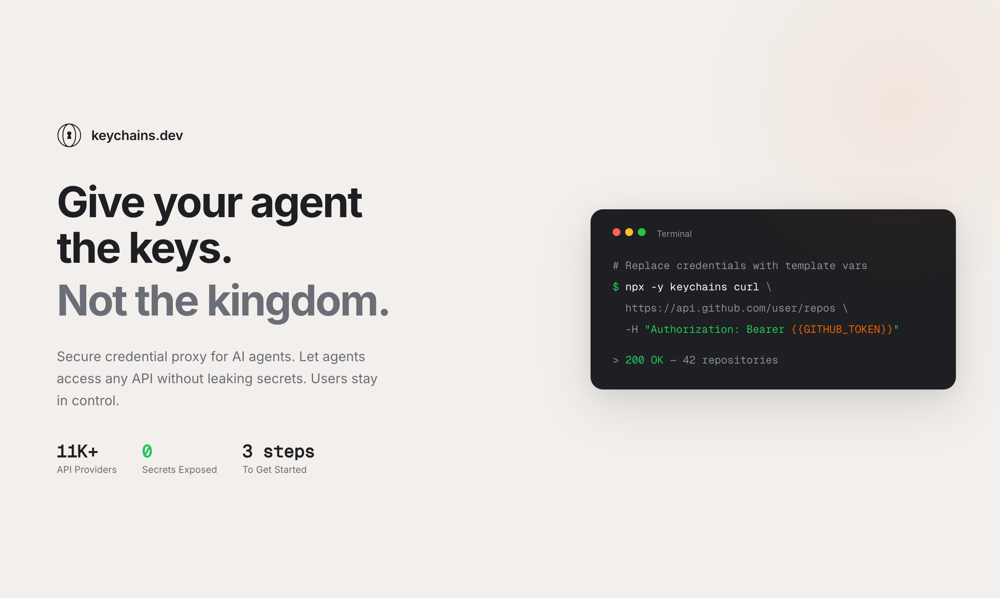
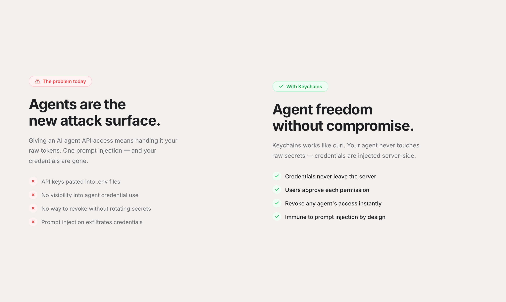
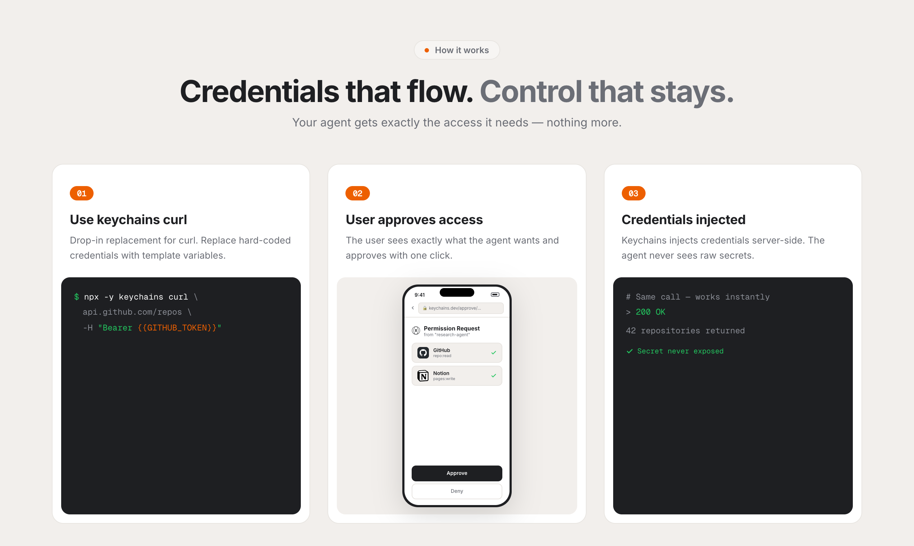

### 🎬 관련 영상
- [🎥 영상 보기](https://ph-files.imgix.net/16b351bd-d51d-445f-9c88-68ee925cdb4a.jpeg?auto=format)

---

## 7. [Guideless](https://www.producthunt.com/products/guideless)
**Votes**: 142 | **도입 난이도**: 중 | **신뢰도**: 중
**Tagline**: Create AI-narrated software video guides in minutes
**서비스 링크**: https://www.producthunt.com/r/Q6Z75BNJZYPHZI

**태그**: 튜토리얼, AI, 자동화, 영상, AI Tool, Video

### 📌 이 서비스 한눈에 보기
복잡한 튜토리얼 제작 도구 대신, AI가 자동으로 내레이션을 생성해주는 쉽고 깔끔한 소프트웨어 사용 가이드를 몇 분 만에 만들 수 있습니다.

### 🔑 주요 기능
- 자동 캡션 생성 및 AI 보정 기능 제공
- 다국어 지원 및 자연스러운 AI 음성 지원
- 간편한 공유, 임베딩, MP4 내보내기 지원

### 🙋 사용자에게 어떤 점이 좋은가
기존 튜토리얼 제작 도구의 복잡함에서 벗어나, 쉽고 빠르게 고품질의 가이드를 제작하여 사용자 경험을 향상시키고 교육 자료 제작 시간을 단축할 수 있습니다.

### ✅ 지금 바로 써볼 기능
- 소프트웨어 화면 녹화 후 자동 생성되는 가이드 확인
- AI 음성 내레이션 선택 및 적용
- MP4 파일로 내보내기 또는 웹에 임베딩

### ⚠️ 사용 전 확인할 점
- AI 음성의 자연스러움 정도는 사용자에 따라 다르게 느껴질 수 있습니다.
- 지원하는 언어 및 음성 종류를 확인해야 합니다.

### 🧭 확인이 더 필요한 정보
실제 사용 환경에서 생성되는 가이드의 품질 및 AI 음성의 완성도를 직접 확인해야 합니다.

### 📸 스크린샷 및 갤러리
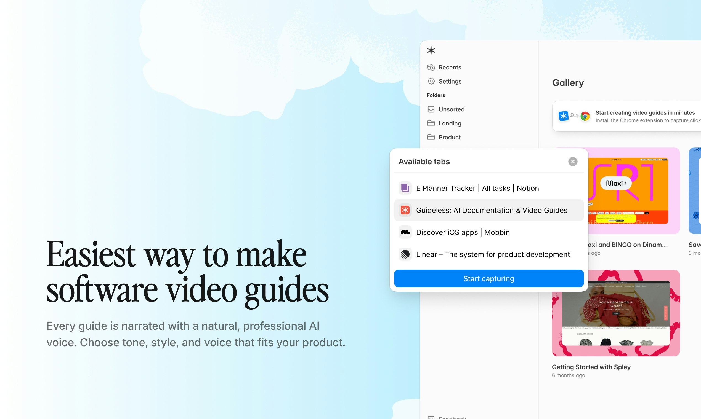
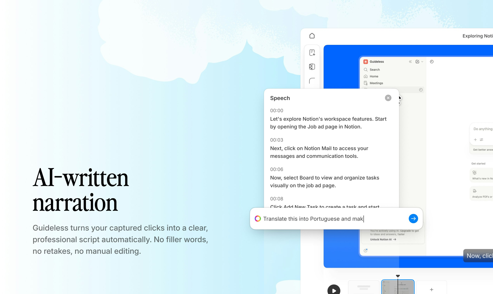
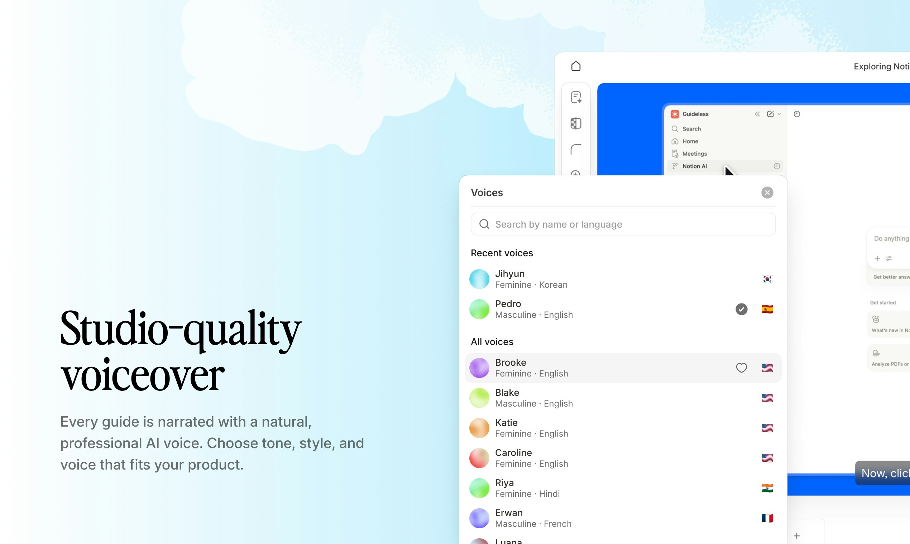

### 🎬 관련 영상
- [🎥 영상 보기](https://ph-files.imgix.net/ca9a32b6-3628-44dc-b84d-93113969ad78.jpeg?auto=format)

---

## 8. [NotchPrompt](https://www.producthunt.com/products/notchprompt)
**Votes**: 130 | **도입 난이도**: 하 | **신뢰도**: 중
**Tagline**: The invisible teleprompter that lives in your MacBook Notch.
**서비스 링크**: https://www.producthunt.com/r/QMLUMB23QFP5AE

**태그**: 생산성, 발표, 텔레프롬프터, 무료, 오픈소스, AI Tool, Prompting

### 📌 이 서비스 한눈에 보기
맥북 노치(카메라 부분)에 스크립트를 표시하여 발표 시 자연스러운 아이 컨택을 유지하고, 화면 공유 시에는 스크립트가 보이지 않아 깔끔한 발표를 도와주는 무료 오픈소스 텔레프롬프터 앱

### 🔑 주요 기능
- 맥북 노치 활용으로 아이 컨택 유지
- 화면 공유 시 스크립트 숨김
- 무료 & 오픈소스

### 🙋 사용자에게 어떤 점이 좋은가
온라인 미팅이나 발표 시 시선 처리 고민 없이 자연스럽게 발표할 수 있으며, 화면 공유를 통해 발표 자료에만 집중할 수 있도록 도와줍니다.

### ✅ 지금 바로 써볼 기능
- 무료 다운로드 후 사용해보기
- 단축키 설정 변경하여 사용 편의성 높이기
- 자동 스크롤 속도 조절하여 자연스러운 발표 연습하기

### ⚠️ 사용 전 확인할 점
- 맥북 사용자만 사용 가능
- 노치 디자인에 최적화되어 다른 위치에 표시하는 기능은 없음

### 🧭 확인이 더 필요한 정보
다양한 발표 환경 (Zoom, Meet, Teams) 에서의 안정적인 동작 여부에 대한 추가적인 사용자 피드백 필요

### 📸 스크린샷 및 갤러리
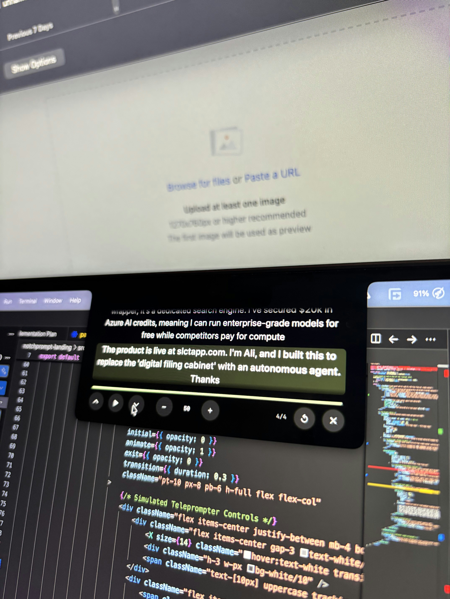

### 🎬 관련 영상
- [🎥 영상 보기](https://ph-files.imgix.net/4b830215-ee22-4cfa-8ad6-4bedc964df43.jpeg?auto=format)

---

## 9. [Merge](https://www.producthunt.com/products/merge-connect-apple-watch-to-android)
**Votes**: 101 | **도입 난이도**: 중 | **신뢰도**: 중
**Tagline**: Use your Apple Watch with any Android phone
**서비스 링크**: https://www.producthunt.com/r/P7NQOZ22CBWOAJ

**태그**: Android, Apple Watch, 건강, 알림

### 📌 이 서비스 한눈에 보기
Merge를 통해 Apple Watch를 Android 폰과 연결하여 건강 데이터 동기화, 알림 확인, 메시지 답장 등 다양한 기능을 활용하세요.

### 🔑 주요 기능
- Apple Watch를 Android 폰에서 사용 가능
- 건강 데이터를 Health Connect 호환 앱과 동기화
- Android 알림을 Apple Watch에서 확인 및 메시지 답장

### 🙋 사용자에게 어떤 점이 좋은가
이제 Android 사용자도 Apple Watch의 고급 건강 데이터 기능을 활용하고, 스마트워치 경험을 확장할 수 있습니다.

### ✅ 지금 바로 써볼 기능
- 건강 데이터 동기화 설정
- 알림 연동 설정
- 미디어 재생 컨트롤 설정

### ⚠️ 사용 전 확인할 점
- Apple Watch와 Android 폰의 호환성 확인 필요
- 일부 기능은 제한될 수 있음

### 🧭 확인이 더 필요한 정보
모든 Apple Watch 모델 및 Android 폰에서 완벽하게 작동하는지 확인이 필요합니다.

### 📸 스크린샷 및 갤러리

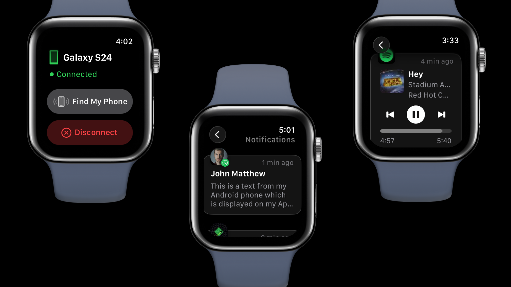
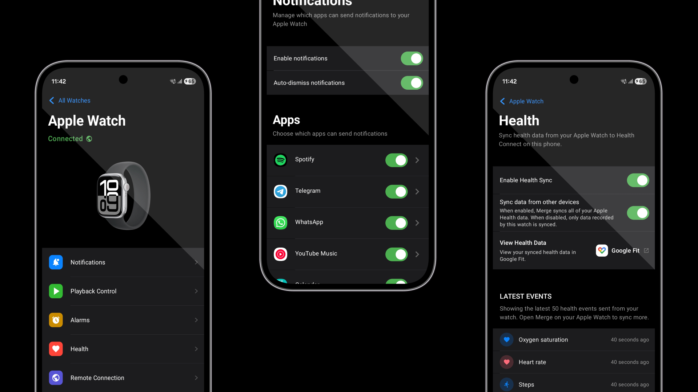

---

## 10. [Repaint](https://www.producthunt.com/products/repaint-ai-website-builder)
**Votes**: 99 | **도입 난이도**: 중 | **신뢰도**: 중
**Tagline**: Build a website by chatting with AI
**서비스 링크**: https://www.producthunt.com/r/GDCMX3AS6I4PCC

**태그**: 웹사이트 빌더, AI, 자동화, 노코드, Agent, AI Tool, Chat, Design

### 📌 이 서비스 한눈에 보기
Repaint는 AI와 대화하며 몇 분 안에 맞춤 웹사이트를 만들어주는 서비스입니다.

### 🔑 주요 기능
- AI 기반 웹사이트 자동 생성
- 대화를 통해 웹사이트 요구사항 정의
- 디자인 레퍼런스 자동 검색 및 적용

### 🙋 사용자에게 어떤 점이 좋은가
코딩 지식 없이도 빠르고 쉽게 웹사이트를 만들 수 있어 시간과 노력을 절약해줍니다. 복잡한 웹사이트 제작 과정을 간소화하여 아이디어를 빠르게 현실화할 수 있습니다.

### ✅ 지금 바로 써볼 기능
- AI와 대화하며 웹사이트 컨셉 정의하기
- 자동 생성된 디자인 레퍼런스 확인하기
- 최종 웹사이트 디자인 및 기능 점검하기

### ⚠️ 사용 전 확인할 점
- AI가 생성한 디자인이 완전히 만족스럽지 않을 수 있습니다.
- 세부적인 커스터마이징 옵션이 제한적일 수 있습니다.

### 🧭 확인이 더 필요한 정보
Repaint가 제공하는 디자인 템플릿의 다양성과 맞춤 설정 옵션의 범위에 대한 추가 정보가 필요합니다.

### 📸 스크린샷 및 갤러리

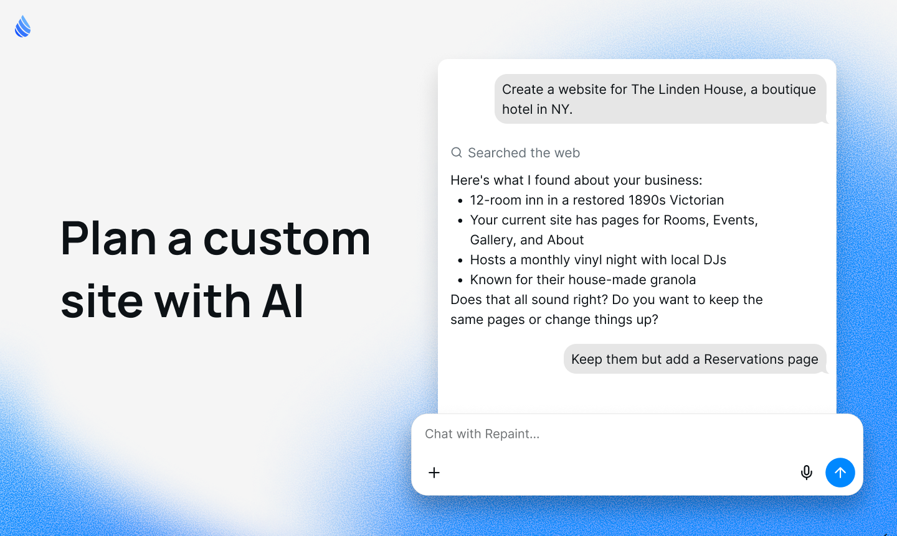
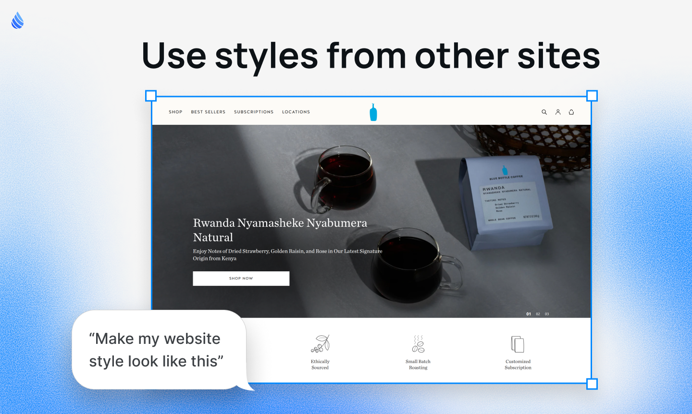

---

