# 🚀 Product Hunt Daily Top 10 (2026-02-21)

## 1. [Rork Max](https://www.producthunt.com/products/rork-app-for-ios)
**Votes**: 514 | **도입 난이도**: 중 | **신뢰도**: 중
**Tagline**: Best AI for iOS apps. Website that replaces Xcode
**서비스 링크**: https://www.producthunt.com/r/XIM7DHZLPO3UNQ

**태그**: DevTool, AI, iOS, 앱 개발, No-Code, AI Tool, Design

### 📌 이 서비스 한눈에 보기
Rork Max는 웹 기반 AI 앱 빌더로, Xcode 없이도 iOS 앱을 간편하게 개발하고 App Store에 배포할 수 있게 해줍니다.

### 🔑 주요 기능
- 웹 기반 Swift 앱 빌더: Xcode 없이 웹에서 iOS 앱 개발 가능
- 광범위한 플랫폼 지원: iPhone, iPad, Apple Watch 등 모든 Apple 플랫폼 지원
- 간편한 배포: 클릭 몇 번으로 App Store에 앱 배포

### 🙋 사용자에게 어떤 점이 좋은가
Rork Max를 사용하면 개발 환경 구축 없이도 빠르게 iOS 앱을 만들고 배포할 수 있어, 개발 시간과 노력을 크게 절약할 수 있습니다. 특히, 3D 게임, AR, 위젯 등 고급 기능도 쉽게 구현할 수 있습니다.

### ✅ 지금 바로 써볼 기능
- 웹사이트에서 Rork Max 체험해보기
- iPhone에 설치하여 앱 빌드 기능 사용해보기
- 간단한 앱을 만들어 App Store 배포 과정 테스트해보기

### ⚠️ 사용 전 확인할 점
- AI 기반 개발의 한계: 복잡한 로직이나 특수한 기능 구현에 제약이 있을 수 있음
- 웹 기반 환경의 의존성: 인터넷 연결 상태에 따라 사용 환경이 달라질 수 있음

### 🧭 확인이 더 필요한 정보
실제 앱 개발 성능 및 AI의 코드 생성 정확도에 대한 추가 정보가 필요합니다.

### 📸 스크린샷 및 갤러리
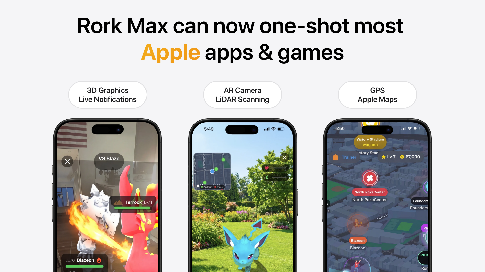
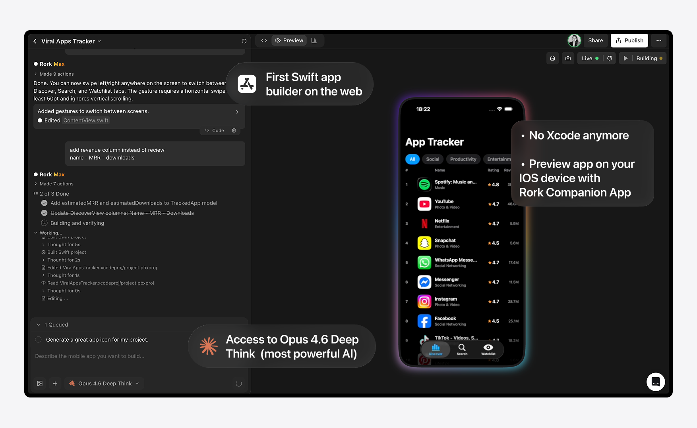

### 🎬 관련 영상
- [🎥 영상 보기](https://ph-files.imgix.net/a1119df5-d0a5-47bc-afbd-4f1a71528edb.jpeg?auto=format)

---

## 2. [Lyria 3 by Google Deepmind](https://www.producthunt.com/products/lyria-3-by-google-deepmind)
**Votes**: 270 | **도입 난이도**: 중 | **신뢰도**: 중
**Tagline**: Turn any photo or thought into a custom song inside Gemini
**서비스 링크**: https://www.producthunt.com/r/AVCFS7HYWL536E

**태그**: AI Tool, Vision

### 🧭 확인이 더 필요한 정보
Product Hunt 설명(태그라인/디스크립션) 기반 정리이므로 실제 기능/가격/정책은 제품 페이지 확인이 필요합니다.

### 📸 스크린샷 및 갤러리
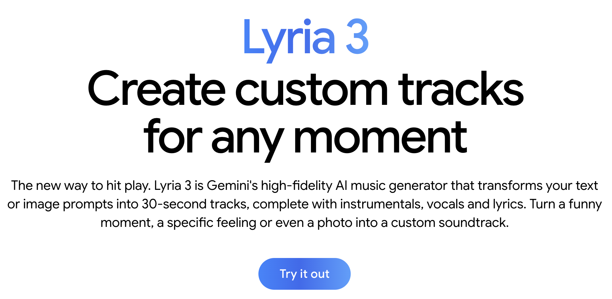
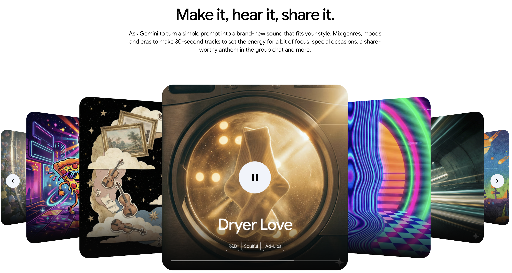
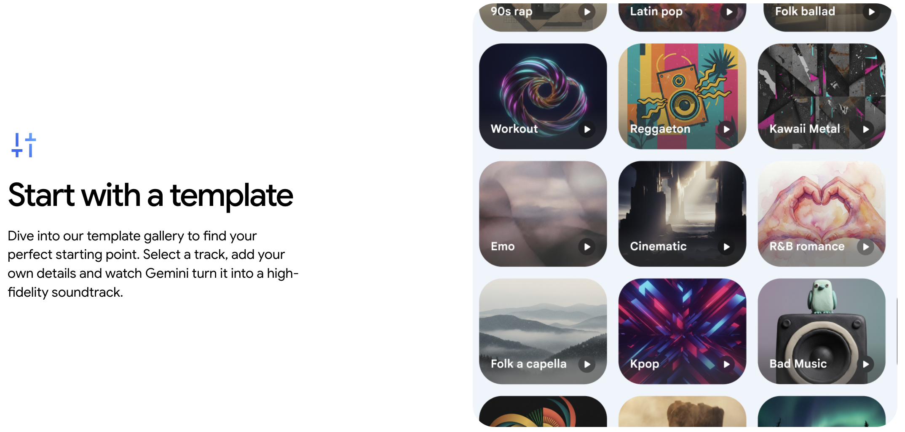

### 🎬 관련 영상
- [🎥 영상 보기](https://ph-files.imgix.net/d0ba6204-f26f-4153-8066-59664b59ca96.jpeg?auto=format)

---

## 3. [git-lrc](https://www.producthunt.com/products/git-lrc)
**Votes**: 198 | **도입 난이도**: 중 | **신뢰도**: 중
**Tagline**: Free, unlimited AI code reviews that run on commit
**서비스 링크**: https://www.producthunt.com/r/7EJINVQ4EBGRUY

**태그**: DevTool, AI, 코드리뷰, 자동화, Git, Agent, AI Tool

### 📌 이 서비스 한눈에 보기
git-lrc는 깃 커밋 시 AI 코드 리뷰를 통해 잠재적인 오류를 사전에 방지하여 코드 품질을 향상시키는 무료 도구입니다.

### 🔑 주요 기능
- 커밋 전 AI 기반 코드 리뷰 자동 실행
- 코드 논리 오류, 보안 취약점, 성능 문제 등 검사
- 개발 속도 저하 없이 안정적인 코드 유지

### 🙋 사용자에게 어떤 점이 좋은가
AI가 자동으로 코드 변경 사항을 검토하여 개발자가 놓칠 수 있는 문제점을 찾아주므로, 시간과 노력을 절약하고 코드 안정성을 높일 수 있습니다.

### ✅ 지금 바로 써볼 기능
- 깃 저장소에 git-lrc 설치 및 설정
- 커밋 시 자동으로 실행되는 리뷰 결과 확인
- 리뷰 결과를 바탕으로 코드 수정 및 개선

### ⚠️ 사용 전 확인할 점
- AI 리뷰의 정확도는 모델 성능에 따라 달라질 수 있음
- 모든 잠재적 문제를 100% 탐지하지 못할 수 있음

### 🧭 확인이 더 필요한 정보
AI 모델의 정확도 및 지원하는 언어/프레임워크 범위에 대한 추가 정보가 필요합니다.

### 📸 스크린샷 및 갤러리
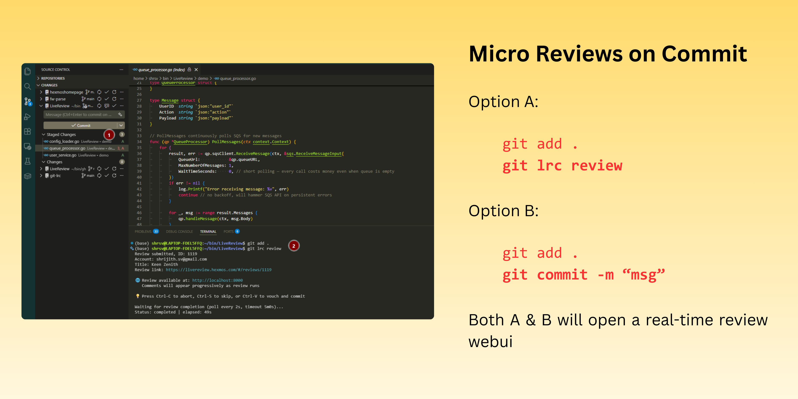
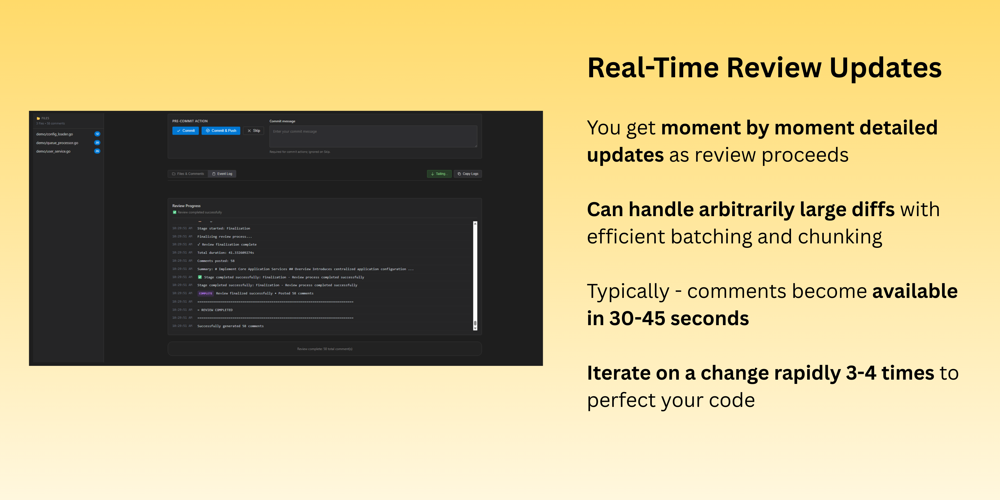

### 🎬 관련 영상
- [🎥 영상 보기](https://ph-files.imgix.net/932f4d3b-898e-4a2d-91f7-44a65184ecfc.jpeg?auto=format)

---

## 4. [WANotifier ](https://www.producthunt.com/products/wanotifier)
**Votes**: 164 | **도입 난이도**: 중 | **신뢰도**: 중
**Tagline**: All-in-one WhatsApp marketing & automation tool
**서비스 링크**: https://www.producthunt.com/r/TMC4PDUPPF6E4O

**태그**: Automation, API, Marketing

### 🧭 확인이 더 필요한 정보
Product Hunt 설명(태그라인/디스크립션) 기반 정리이므로 실제 기능/가격/정책은 제품 페이지 확인이 필요합니다.

### 📸 스크린샷 및 갤러리
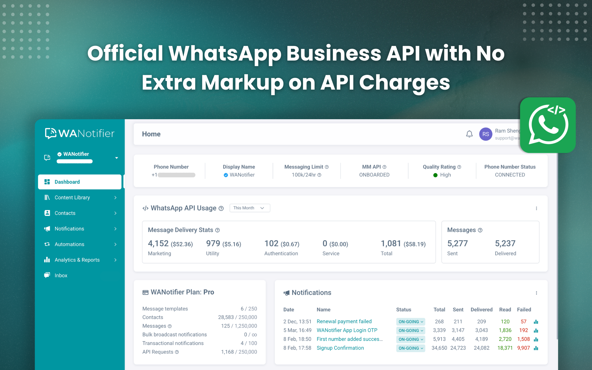
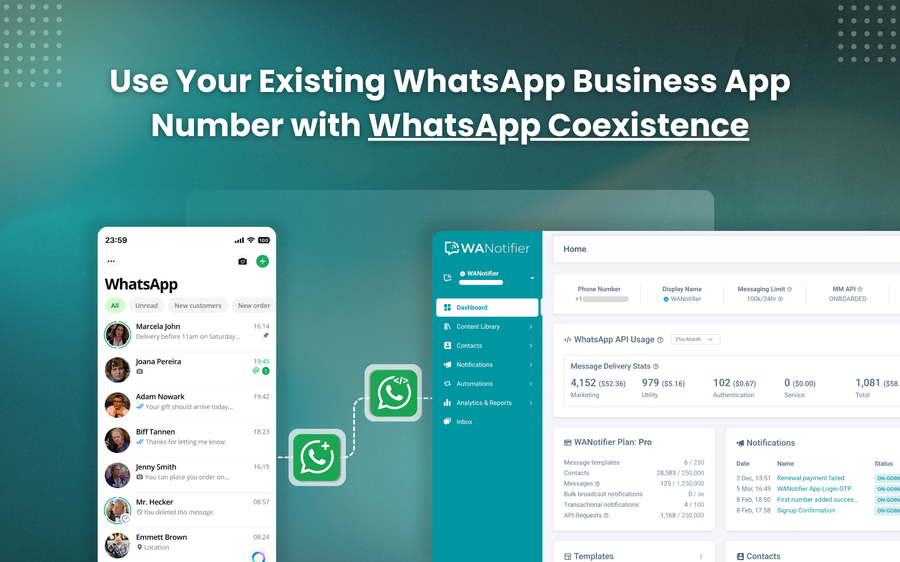

### 🎬 관련 영상
- [🎥 영상 보기](https://ph-files.imgix.net/56ae4b3b-a725-4202-927d-0b75ece70c95.jpeg?auto=format)

---

## 5. [Prism Videos](https://www.producthunt.com/products/prism-videos)
**Votes**: 157 | **도입 난이도**: 중 | **신뢰도**: 중
**Tagline**: A unified workspace to generate and edit AI videos 
**서비스 링크**: https://www.producthunt.com/r/54HK4DI5ISC5LR

**태그**: AI 비디오, 영상 편집, 자동화, 숏폼, AI Tool, Video, Vision

### 📌 이 서비스 한눈에 보기
여러 AI 모델을 활용해 이미지/비디오 에셋 생성부터 편집, 관리를 한 곳에서 끝낼 수 있는 단편 비디오 제작 플랫폼입니다.

### 🔑 주요 기능
- 여러 AI 모델 활용 가능
- 클라우드 기반 프로젝트 관리 및 편집
- 템플릿 및 프리셋 재사용

### 🙋 사용자에게 어떤 점이 좋은가
복잡한 툴 없이, AI 기반으로 빠르게 숏폼 비디오를 제작하고 관리할 수 있어 시간과 노력을 절약해줍니다. 특히, 템플릿과 프리셋 재사용으로 생산성을 극대화할 수 있습니다.

### ✅ 지금 바로 써볼 기능
- 다양한 AI 모델로 에셋 생성해보기
- 템플릿을 활용하여 비디오 제작해보기
- 기존 프리셋을 커스터마이징하여 재사용해보기

### ⚠️ 사용 전 확인할 점
- 생성 가능한 비디오의 길이 제한 확인
- 지원하는 AI 모델 종류 확인

### 🧭 확인이 더 필요한 정보
지원되는 AI 모델의 종류와 템플릿/프리셋의 다양성, 그리고 비디오 제작 과정의 세부적인 기능들을 추가적으로 확인해야 합니다.

### 📸 스크린샷 및 갤러리
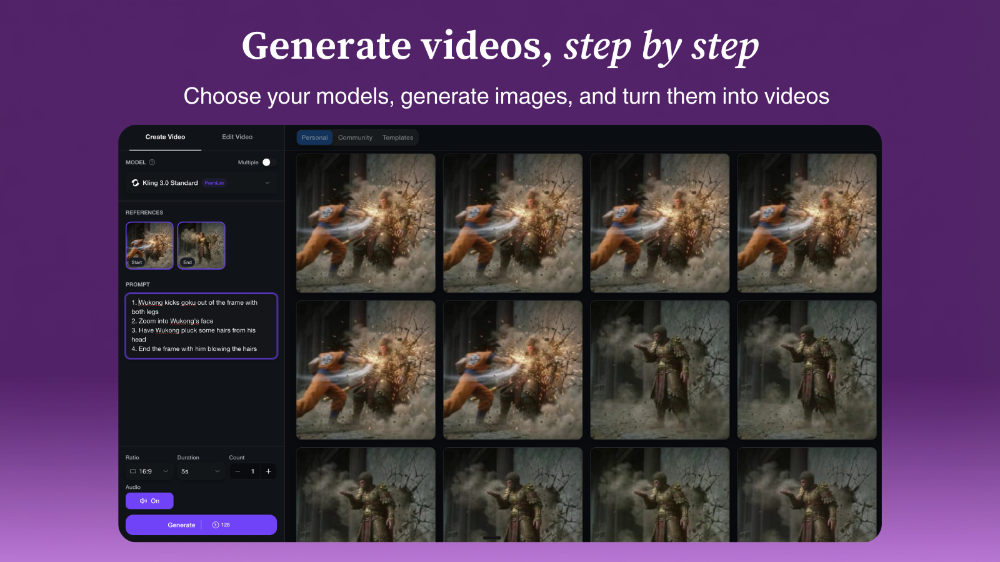
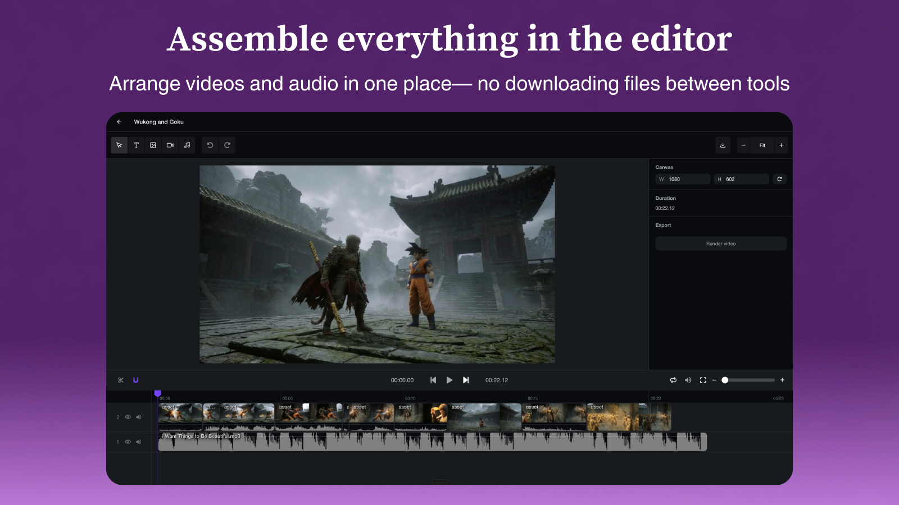
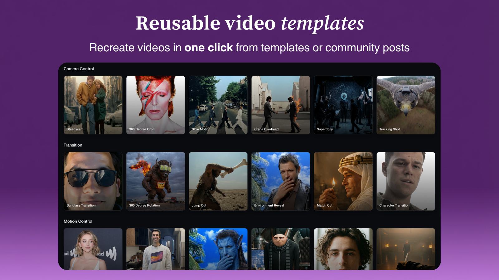

### 🎬 관련 영상
- [🎥 영상 보기](https://ph-files.imgix.net/f66f57b0-3cae-4f02-9547-c5b9e9f19025.jpeg?auto=format)

---

## 6. [Macky](https://www.producthunt.com/products/macky-2)
**Votes**: 130 | **도입 난이도**: 중 | **신뢰도**: 중
**Tagline**: Connect to your Mac terminal from iPhone
**서비스 링크**: https://www.producthunt.com/r/6YKJU4ZINLZMEE

**태그**: DevTool, 터미널, 원격제어

### 📌 이 서비스 한눈에 보기
아이폰에서 맥 터미널에 접속하여 언제 어디서든 맥을 제어하세요!

### 🔑 주요 기능
- 아이폰으로 맥 터미널 접속
- 언제 어디서든 작업 가능
- 간편한 원격 제어

### 🙋 사용자에게 어떤 점이 좋은가
이제 침대나 화장실에서도 맥 터미널을 사용할 수 있어, 이동 중에도 코딩이나 서버 관리가 가능합니다. 맥 앞에 앉아있을 필요 없이 자유롭게 작업하세요.

### ✅ 지금 바로 써볼 기능
- 아이폰에서 맥에 접속하여 파일 목록 확인하기
- 터미널 명령어로 간단한 스크립트 실행해보기
- 원격으로 서버 상태 모니터링하기

### ⚠️ 사용 전 확인할 점
- 보안 연결 설정 확인 필수
- 네트워크 연결 상태에 따라 성능 차이 발생 가능

### 🧭 확인이 더 필요한 정보
Macky 사용시 배터리 소모량에 대한 정보는 추가 확인이 필요합니다.

### 📸 스크린샷 및 갤러리

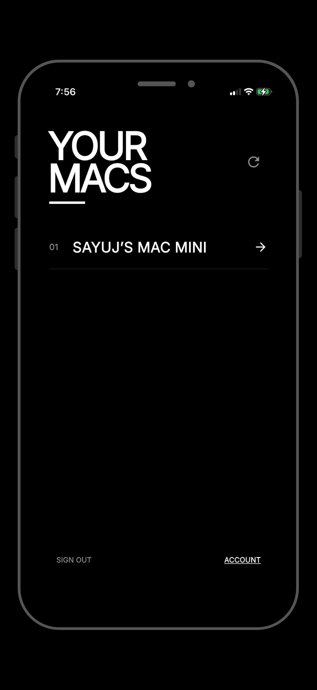

### 🎬 관련 영상
- [🎥 영상 보기](https://ph-files.imgix.net/b704a8bd-71ee-48a6-8934-c42dee0405b8.jpeg?auto=format)

---

## 7. [Woise](https://www.producthunt.com/products/woise-2)
**Votes**: 125 | **도입 난이도**: 중 | **신뢰도**: 중
**Tagline**: AI Voice & Screen Recording Tool for Websites
**서비스 링크**: https://www.producthunt.com/r/CRVHWRKVGE4DL5

**태그**: AI Tool

### 🧭 확인이 더 필요한 정보
Product Hunt 설명(태그라인/디스크립션) 기반 정리이므로 실제 기능/가격/정책은 제품 페이지 확인이 필요합니다.

### 📸 스크린샷 및 갤러리

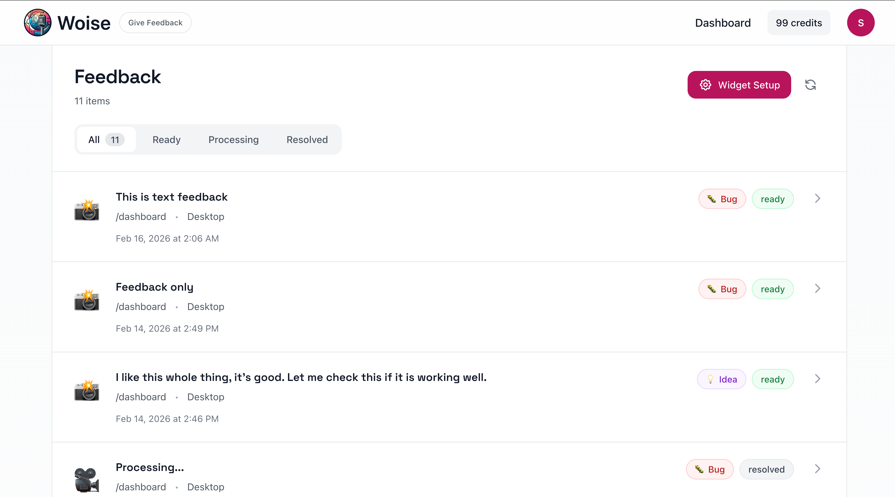
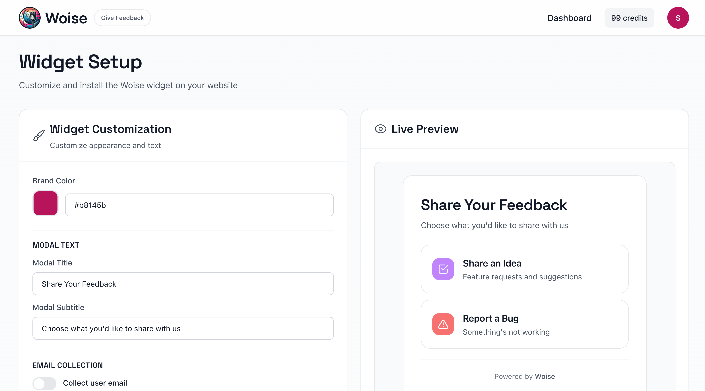

---

## 8. [PulseKit](https://www.producthunt.com/products/pulsekit)
**Votes**: 115 | **도입 난이도**: 중 | **신뢰도**: 중
**Tagline**: Your key metrics, as widgets across your Apple devices
**서비스 링크**: https://www.producthunt.com/r/FZA4M62YM4L6XL

**태그**: 위젯, 지표, 애플, 대시보드, 생산성

### 📌 이 서비스 한눈에 보기
Product Hunt, LinkedIn, Discord 등 다양한 서비스의 주요 지표를 위젯으로 보여줘, 대시보드를 열지 않아도 홈 화면에서 바로 확인할 수 있습니다.

### 🔑 주요 기능
- 아이폰, 아이패드, 맥 등 애플 기기에서 위젯 지원
- Product Hunt, LinkedIn, Discord 등 다양한 서비스 연동
- 대시보드 열기 전 간단하게 지표 확인

### 🙋 사용자에게 어떤 점이 좋은가
매번 대시보드를 열어 확인해야 했던 번거로움을 줄여주고, 홈 화면에서 바로 핵심 지표를 파악하여 시간을 절약할 수 있습니다. 중요한 변화를 놓치지 않고 즉각적으로 대응할 수 있도록 도와줍니다.

### ✅ 지금 바로 써볼 기능
- 관심 있는 서비스 연동하여 위젯 설정하기
- 홈 화면에 위젯 추가하여 지표 확인하기
- 자주 확인하는 지표 위젯 우선 배치하기

### ⚠️ 사용 전 확인할 점
- 대시보드 수준의 상세 분석은 불가
- 지원하는 서비스 외에는 연동 불가

### 🧭 확인이 더 필요한 정보
현재 지원하는 서비스 외에 어떤 서비스들이 추가될 예정인지 확인이 필요합니다.

### 📸 스크린샷 및 갤러리
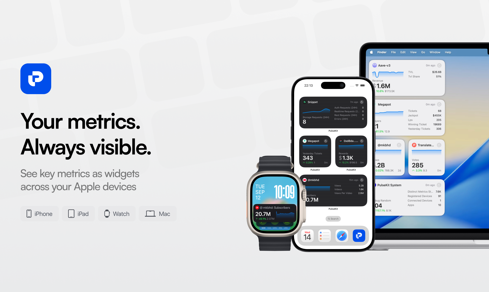
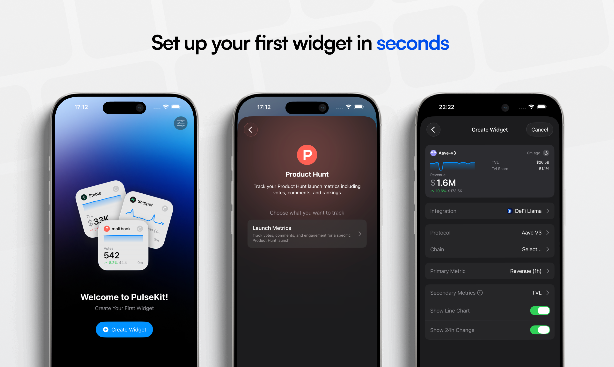
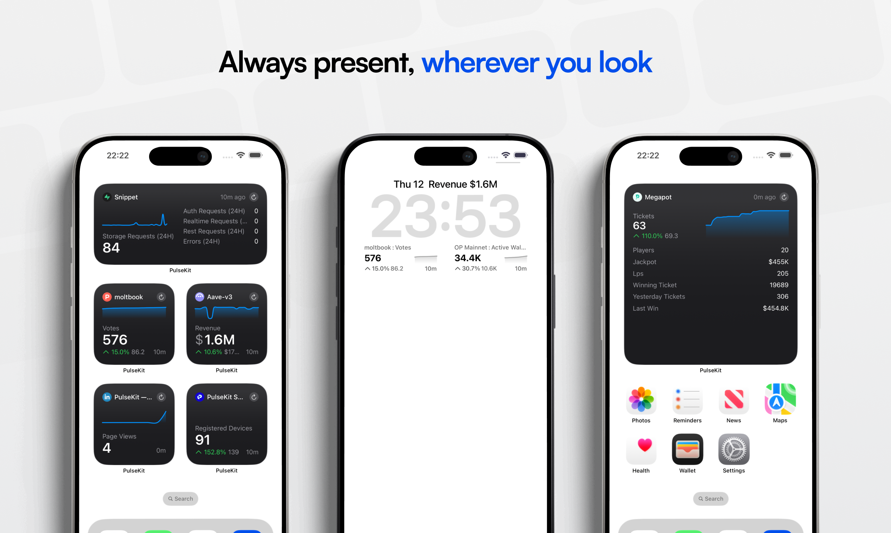

### 🎬 관련 영상
- [🎥 영상 보기](https://ph-files.imgix.net/9b269c6f-158e-44eb-8574-a47d4a2c9909.jpeg?auto=format)

---

## 9. [KraftCV](https://www.producthunt.com/products/kraftcv)
**Votes**: 54 | **도입 난이도**: 중 | **신뢰도**: 중
**Tagline**: Tailored resumes per job. Free forever.
**서비스 링크**: https://www.producthunt.com/r/65VQ3DQ3P2AAFU

**태그**: 이력서, 자동화, 커리어, 생산성, AI Tool

### 📌 이 서비스 한눈에 보기
KraftCV는 이력서를 코드처럼 관리하여 각 채용 공고에 맞춰 맞춤형 이력서를 쉽게 만들고 관리할 수 있는 무료 이력서 빌더입니다.

### 🔑 주요 기능
- 이력서를 버전 관리하여 채용 공고별 맞춤 이력서 생성 가능
- 무료로 워터마크 없는 PDF 이력서 무제한 다운로드
- ATS(채용 관리 시스템) 최적화된 템플릿 제공

### 🙋 사용자에게 어떤 점이 좋은가
지원하는 각 회사와 직무에 맞는 이력서를 효율적으로 관리하고, 무료로 필요한 기능을 모두 사용할 수 있어 이력서 작성 및 관리에 드는 시간과 노력을 절약해줍니다.

### ✅ 지금 바로 써볼 기능
- 새로운 채용 공고에 맞춰 이력서 분기(branch) 생성하기
- 각 직무에 맞는 '커밋'을 생성하여 이력서 내용 변경하기
- ATS 최적화 템플릿을 활용하여 이력서 작성하기

### ⚠️ 사용 전 확인할 점
- Power mode(유료 기능)의 가격 정책 확인 필요 (활발히 지원할 때 1$/일)
- 무료 버전에서 제공하는 템플릿 종류 확인 필요

### 🧭 확인이 더 필요한 정보
ATS 최적화 템플릿의 구체적인 기능 및 효과에 대한 추가 정보 확인이 필요합니다.

### 📸 스크린샷 및 갤러리
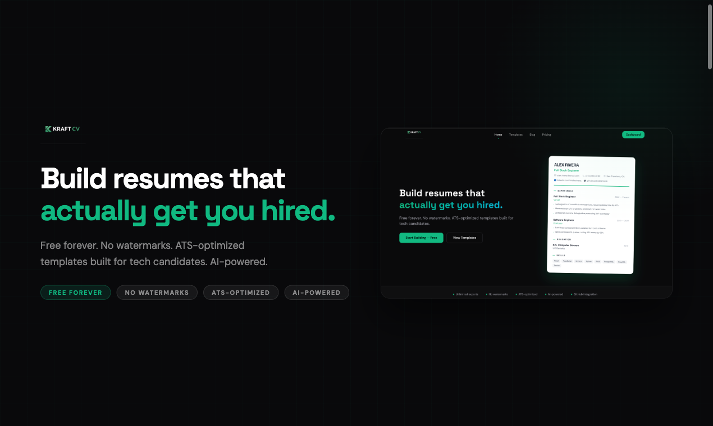
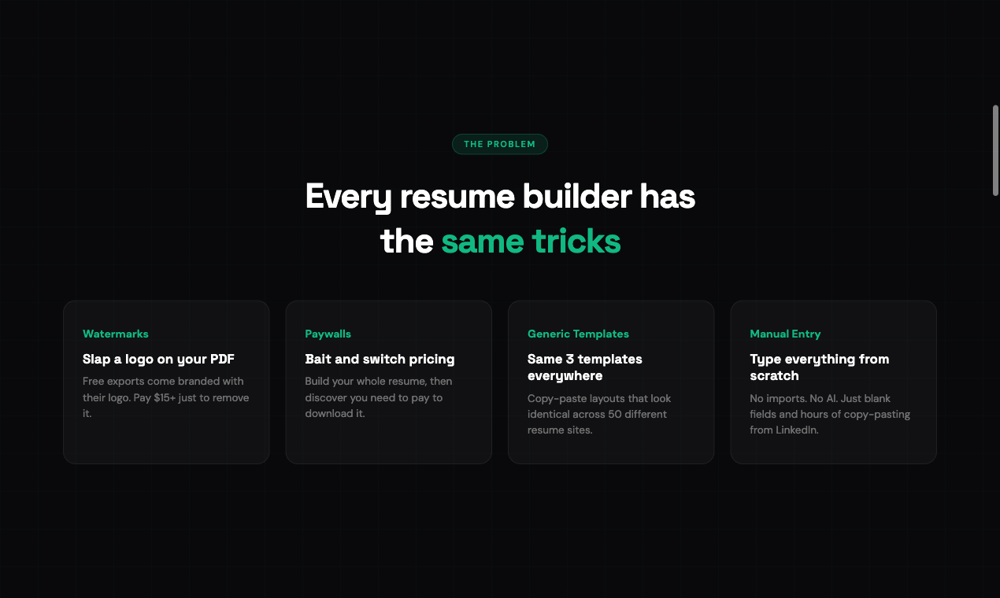
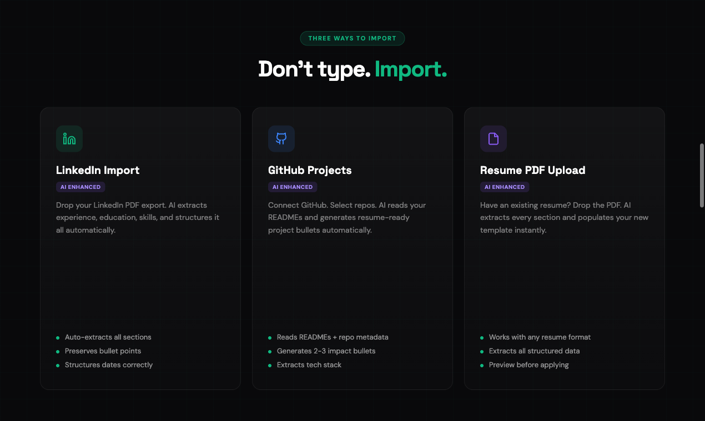

### 🎬 관련 영상
- [🎥 영상 보기](https://ph-files.imgix.net/a80beb25-9aaf-4529-99a7-7033644b7458.jpeg?auto=format)

---

## 10. [Postly-ai](https://www.producthunt.com/products/postly-ai)
**Votes**: 32 | **도입 난이도**: 하 | **신뢰도**: 중
**Tagline**: Paste your URL. Get an IG strategy + posts instantly.
**서비스 링크**: https://www.producthunt.com/r/G4N52PIXRRB2WI

**태그**: AI, 인스타그램, 마케팅 자동화, 콘텐츠 생성, AI Tool, Marketing

### 📌 이 서비스 한눈에 보기
Postly-ai: 웹사이트 URL만 넣으면 인스타그램 마케팅 전략과 게시물을 AI가 즉시 생성해주는 서비스

### 🔑 주요 기능
- URL 기반 AI 콘텐츠 생성
- 인스타그램 전략 자동 생성
- 게시물 및 스토리 자동 생성

### 🙋 사용자에게 어떤 점이 좋은가
인스타그램 마케팅 콘텐츠 제작에 드는 시간과 노력을 크게 줄여주며, AI 기반 전략 수립으로 효율적인 마케팅을 가능하게 합니다.

### ✅ 지금 바로 써볼 기능
- URL 입력 후 전략 및 게시물 생성해보기
- 생성된 게시물을 수정하여 게시해보기
- 다양한 URL을 시도하여 콘텐츠 품질 비교해보기

### ⚠️ 사용 전 확인할 점
- 생성된 콘텐츠의 독창성 및 정확성 검토 필요
- AI가 생성한 전략이 실제 효과를 보장하지 않을 수 있음

### 🧭 확인이 더 필요한 정보
AI가 생성하는 콘텐츠의 품질 및 효과는 웹사이트 URL의 내용에 따라 달라질 수 있습니다.

### 📸 스크린샷 및 갤러리
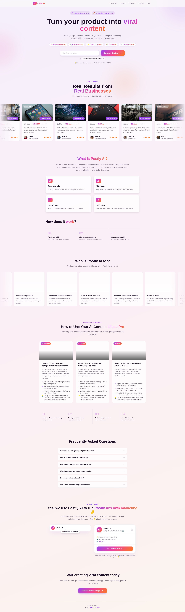
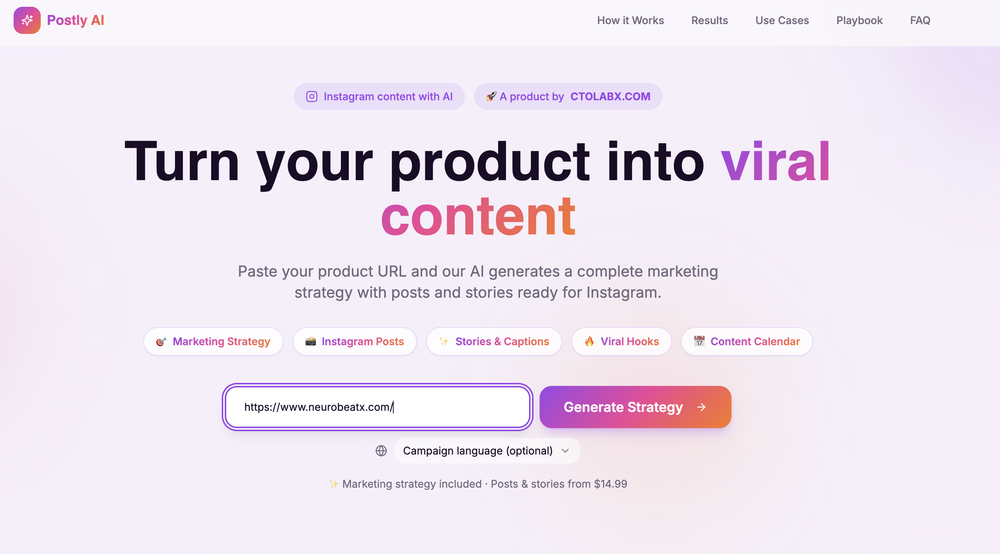
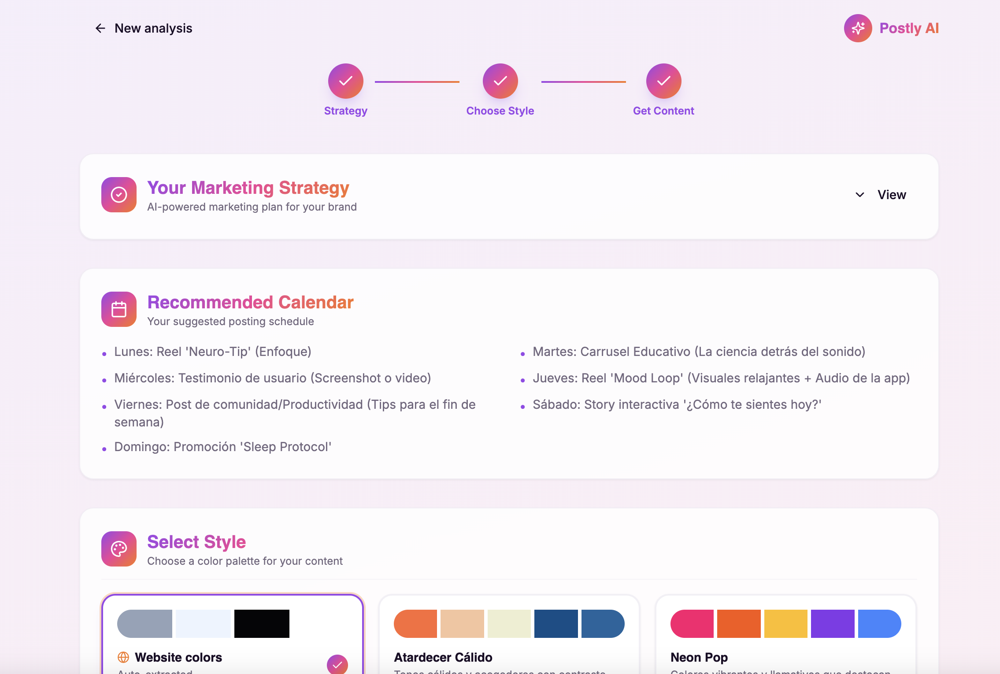

---

