# 🚀 Product Hunt Daily Top 10 (2026-02-23)

## 1. [Claude in PowerPoint](https://www.producthunt.com/products/claude)
**Votes**: 381 | **도입 난이도**: 중 | **신뢰도**: 중
**Tagline**: Use Claude to build, edit & refine PowerPoint presentations.
**서비스 링크**: https://www.producthunt.com/r/TLPPXFP4GJKRQQ

**태그**: AI, PowerPoint, 프레젠테이션, 자동화, 생산성, AI Tool

### 📌 이 서비스 한눈에 보기
Claude AI가 PowerPoint 내에서 실시간으로 슬라이드 제작, 편집, 개선을 도와 브랜드 및 템플릿에 맞는 효율적인 프레젠테이션 제작을 가능하게 합니다.

### 🔑 주요 기능
- PowerPoint 내에서 Claude AI 활용
- 실시간 슬라이드 제작 및 편집
- 브랜드 및 템플릿 일관성 유지

### 🙋 사용자에게 어떤 점이 좋은가
Claude AI를 통해 파워포인트 작업 시간을 단축하고, 브랜드 스타일을 유지하면서 더욱 효율적으로 프레젠테이션을 만들 수 있습니다. 특히 Pro 플랜 사용자는 라이브 데이터 커넥터를 통해 외부 데이터 연동이 가능해 실시간 정보 업데이트가 용이합니다.

### ✅ 지금 바로 써볼 기능
- 슬라이드 초안 작성 기능 사용해보기
- 기존 슬라이드 편집 및 개선 기능 사용해보기
- 라이브 데이터 커넥터 연동 (Pro 플랜)

### ⚠️ 사용 전 확인할 점
- Pro 플랜에서만 라이브 데이터 커넥터 기능 사용 가능
- AI 편집 결과의 정확성 검토 필요

### 🧭 확인이 더 필요한 정보
제공되는 템플릿의 종류 및 Claude AI의 학습 데이터 범위에 대한 추가 정보 확인이 필요합니다.

### 📸 스크린샷 및 갤러리
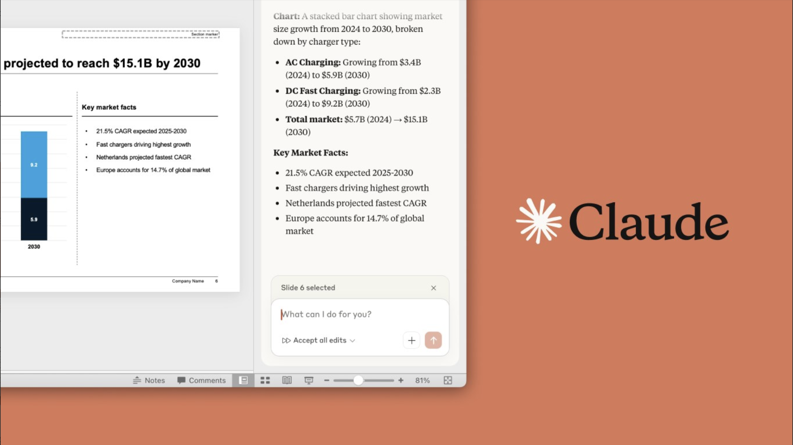
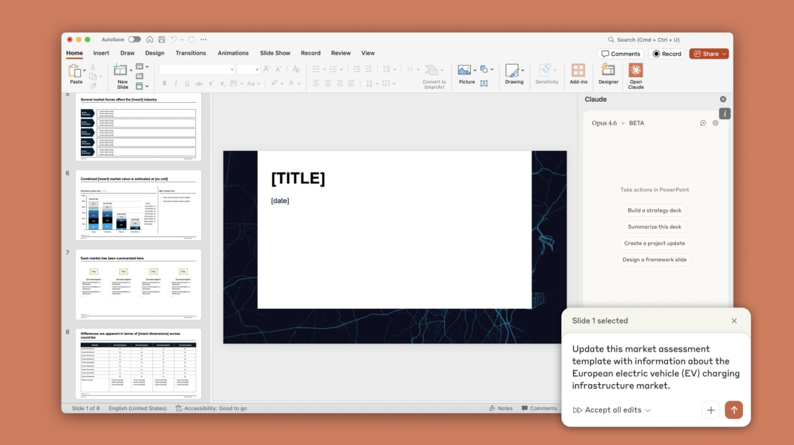
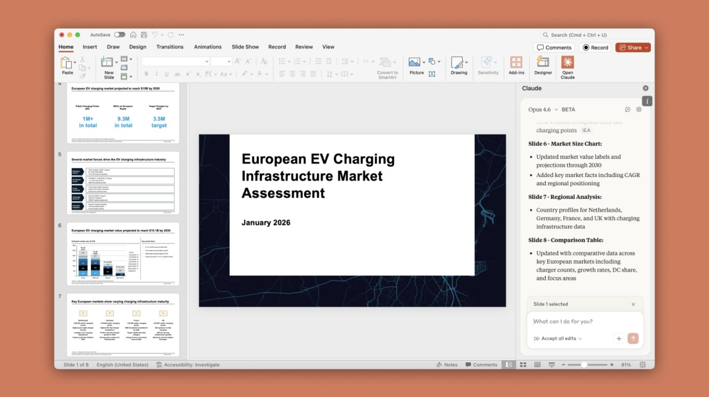

### 🎬 관련 영상
- [🎥 영상 보기](https://ph-files.imgix.net/7d90c220-0e2e-4e19-8aba-863de9607801.jpeg?auto=format)

---

## 2. [Straion](https://www.producthunt.com/products/straion)
**Votes**: 267 | **도입 난이도**: 중 | **신뢰도**: 중
**Tagline**: Manage Rules for AI Coding Agents 
**서비스 링크**: https://www.producthunt.com/r/DVFFWFKM53QL2G

**태그**: DevTool, AI, 코드 자동화, 생산성, 규칙 관리, Agent, AI Tool

### 📌 이 서비스 한눈에 보기
Straion은 Claude Code, Github Copilot 등 AI 코딩 에이전트의 규칙을 중앙에서 관리하여 기업 수준의 코드 생산성을 10배 향상시켜 줍니다.

### 🔑 주요 기능
- AI 코딩 에이전트 규칙 중앙 집중 관리
- 작업별 자동 규칙 선택
- 엔터프라이즈 레벨 코드 품질 향상

### 🙋 사용자에게 어떤 점이 좋은가
Straion을 통해 AI 코딩 도구를 효과적으로 통제하고, 코드 품질을 유지하면서 개발 속도를 대폭 향상시킬 수 있습니다. 팀 전체의 코딩 표준을 일관되게 적용하는 데 도움이 됩니다.

### ✅ 지금 바로 써볼 기능
- 기존 AI 코딩 에이전트 연동
- 규칙 정의 및 자동 선택 설정
- 코드 품질 및 생산성 변화 측정

### ⚠️ 사용 전 확인할 점
- 자동 규칙 선택의 정확도 확인 필요
- 초기 규칙 설정에 시간 투자 필요

### 🧭 확인이 더 필요한 정보
다양한 코딩 환경 및 에이전트와의 호환성 정보가 추가적으로 필요합니다.

### 📸 스크린샷 및 갤러리

### 🎬 관련 영상
- [🎥 영상 보기](https://ph-files.imgix.net/49c6aa0a-6aca-43de-b3fb-19061d994685.jpeg?auto=format)

---

## 3. [Tidy](https://www.producthunt.com/products/tidy-3)
**Votes**: 236 | **도입 난이도**: 중 | **신뢰도**: 중
**Tagline**: A personal assistant that can learn to use any app you use
**서비스 링크**: https://www.producthunt.com/r/JSZKHTL7R4KUZG

**태그**: 자동화, 개인 비서, 노코드, 생산성, Agent, DevTool

### 📌 이 서비스 한눈에 보기
Tidy는 사용자가 사용하는 모든 앱을 학습하여 작업을 자동화해주는 개인 비서이며, 코딩 없이 웹사이트 사용법을 가르칠 수 있습니다.

### 🔑 주요 기능
- 모든 앱 사용법 학습 가능
- iMessage 및 파일 시스템으로 정보 공유
- 클라우드 기반으로 코딩 없이 웹 자동화

### 🙋 사용자에게 어떤 점이 좋은가
Tidy를 통해 반복적인 작업을 자동화하고 시간을 절약하며, 코딩 지식 없이도 웹 기반 작업을 효율적으로 관리할 수 있습니다.

### ✅ 지금 바로 써볼 기능
- 웹사이트 작업 자동화 교육
- iMessage 알림 설정
- 파일 시스템 연동

### ⚠️ 사용 전 확인할 점
- 사용자의 웹사이트 사용 패턴 학습 필요
- 데이터 보안 및 개인 정보 보호 고려

### 🧭 확인이 더 필요한 정보
실제 사용 환경에서 다양한 웹사이트와의 호환성 및 학습 속도에 대한 추가 정보가 필요합니다.

### 📸 스크린샷 및 갤러리
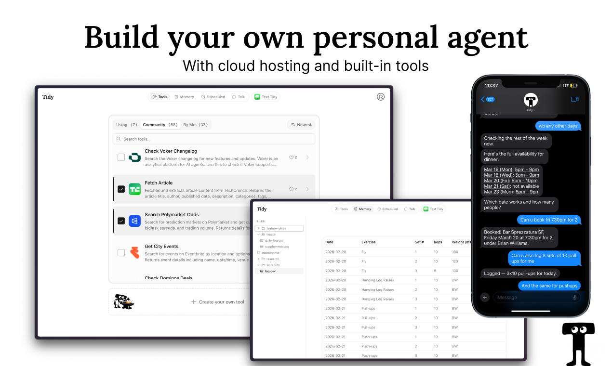
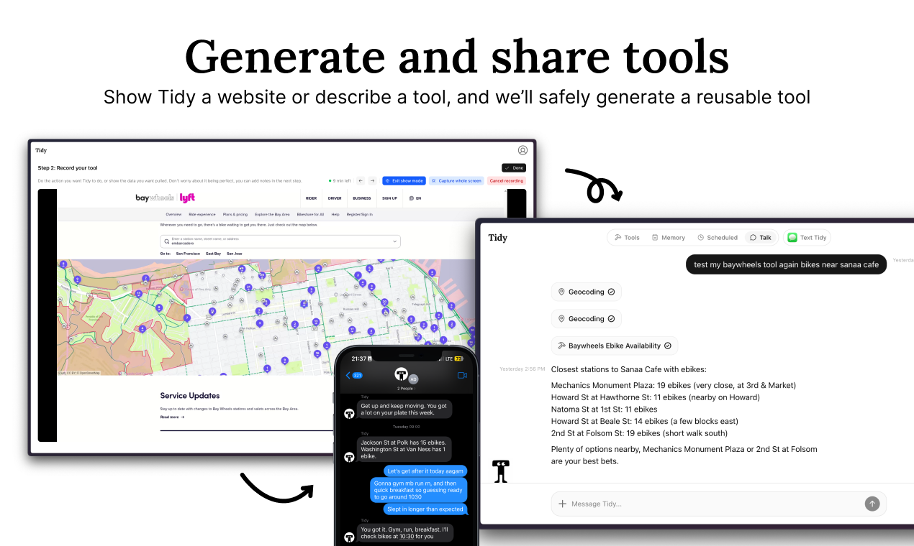
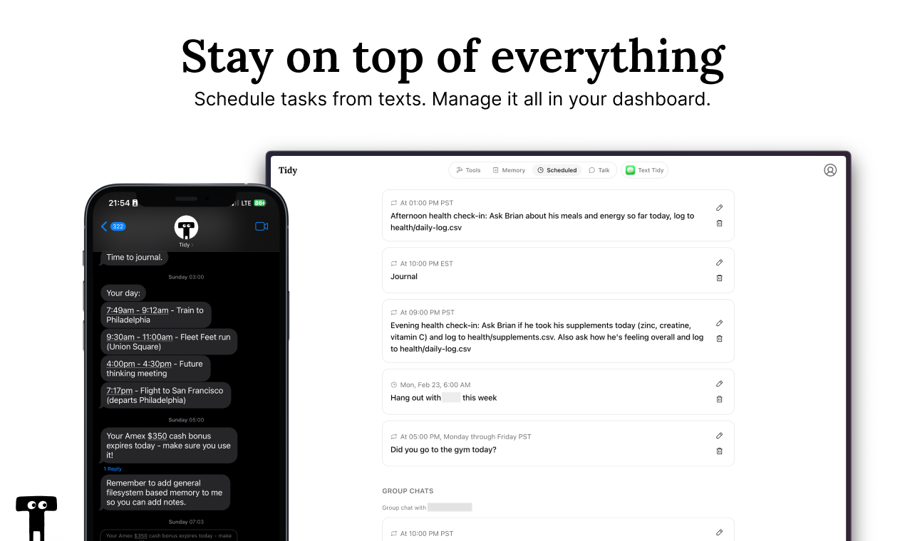

---

## 4. [Wordy](https://www.producthunt.com/products/wordy-81fc3d1c-40c1-42d1-9a07-6c2a80ffb302)
**Votes**: 192 | **도입 난이도**: 하 | **신뢰도**: 중
**Tagline**: Learn languages from real movie and TV clips with quizzes
**서비스 링크**: https://www.producthunt.com/r/Q4LL7KFB3C3IZO

**태그**: 언어 학습, 교육, 퀴즈, 비디오

### 📌 이 서비스 한눈에 보기
좋아하는 영화나 TV 프로그램 클립을 보면서 퀴즈도 풀고, 자동으로 어휘 학습까지 할 수 있는 언어 학습 도구입니다.

### 🔑 주요 기능
- 실제 영화 및 TV 프로그램 클립 활용
- 내장 퀴즈로 학습 내용 점검
- 자동 어휘 추적 및 관리

### 🙋 사용자에게 어떤 점이 좋은가
지루한 문법 공부 대신 재미있게 언어를 배우고, 어휘력을 효과적으로 향상시킬 수 있습니다.

### ✅ 지금 바로 써볼 기능
- 관심 있는 영화나 TV 프로그램 선택
- 클립 시청 후 퀴즈 풀기
- 나만의 어휘 목록 확인

### ⚠️ 사용 전 확인할 점
- 클립으로 제공되는 언어의 종류 확인 필요
- 개인의 학습 스타일에 따라 효과가 다를 수 있음

### 🧭 확인이 더 필요한 정보
어떤 언어를 지원하는지, 콘텐츠 업데이트 주기가 어떻게 되는지 확인이 필요합니다.

### 📸 스크린샷 및 갤러리
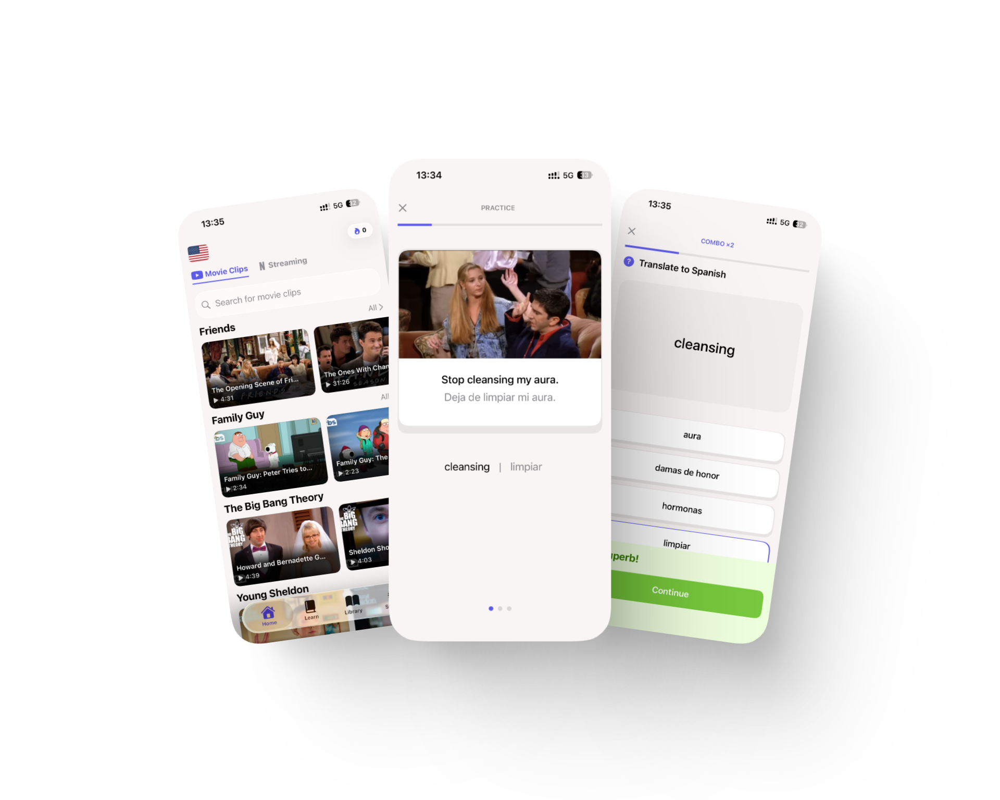
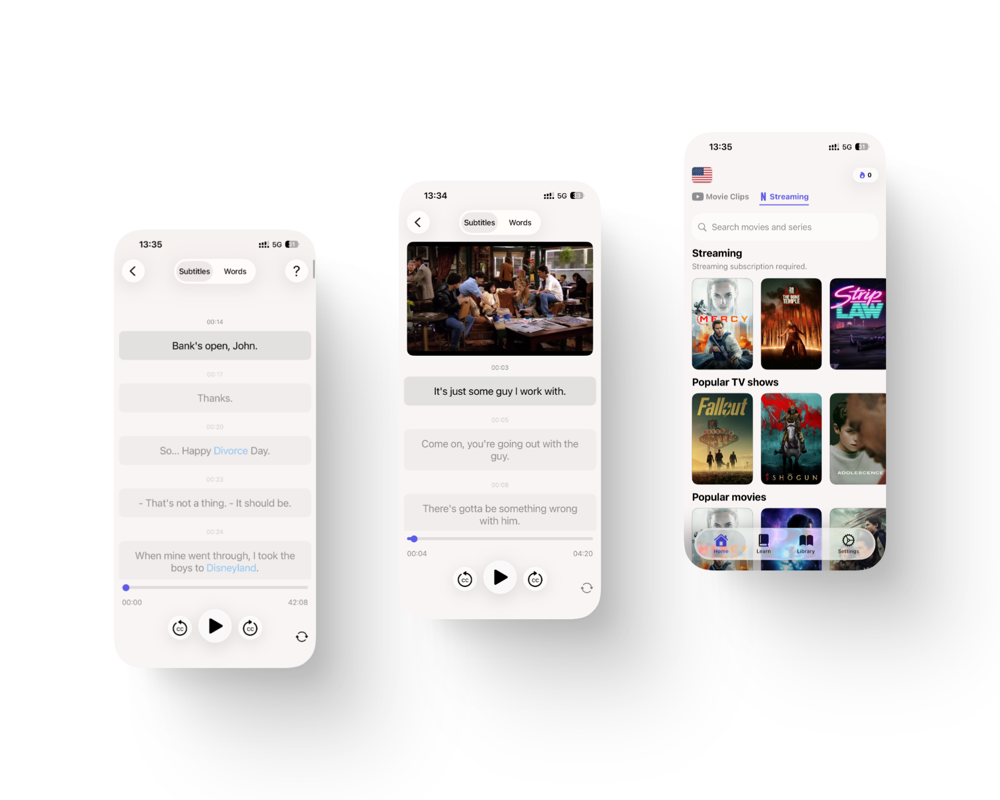
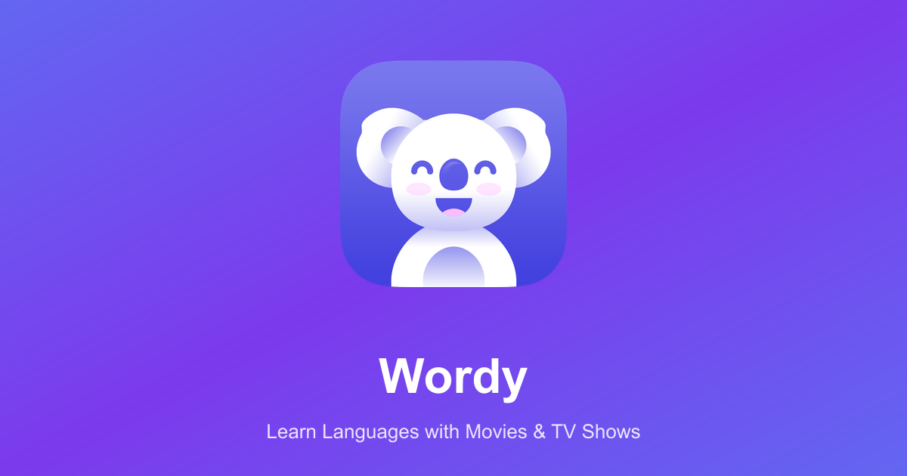

---

## 5. [Ashera AI](https://www.producthunt.com/products/index-of-ashera)
**Votes**: 83 | **도입 난이도**: 중 | **신뢰도**: 중
**Tagline**: GTM, Run by AI
**서비스 링크**: https://www.producthunt.com/r/3VQ6CG24DPSNIJ

**태그**: 영업, AI, 자동화, CRM, 분석, AI Tool, Sales

### 📌 이 서비스 한눈에 보기
Ashera AI는 AI를 활용하여 영업 통화 내용을 분석, 실행 가능한 정보로 전환하고 CRM 자동 업데이트, 거래 상태 점수화 등을 통해 영업 효율성을 극대화하는 솔루션입니다.

### 🔑 주요 기능
- AI 기반 영업 통화 분석 및 실행 가능한 정보 제공
- CRM 자동 업데이트 및 거래 상태 점수화
- 영업 여정 전반에 걸쳐 일관된 정보 제공으로 팀 협업 강화

### 🙋 사용자에게 어떤 점이 좋은가
영업 통화 내용을 일일이 기록하고 분석하는 번거로움을 줄여주어 영업 담당자가 핵심 업무에 집중할 수 있도록 돕고, 팀 전체의 정보 공유 및 협업 효율성을 높여줍니다.

### ✅ 지금 바로 써볼 기능
- 무료 플랜을 사용하여 개인 또는 소규모 팀에서 바로 사용해보기
- AI가 분석한 영업 통화 데이터 및 개선점 확인하기
- CRM 자동 업데이트 기능 연동하여 데이터 관리 효율성 높이기

### ⚠️ 사용 전 확인할 점
- AI 분석 정확도에 따라 정보의 신뢰도가 달라질 수 있음
- 개인 정보 보호 및 데이터 보안 관련 정책 확인 필요

### 🧭 확인이 더 필요한 정보
제공되는 AI 분석의 정확도 및 세부적인 CRM 연동 방식에 대한 추가적인 정보 확인이 필요합니다.

### 📸 스크린샷 및 갤러리
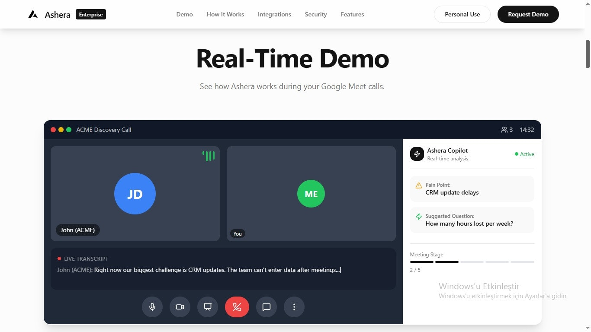
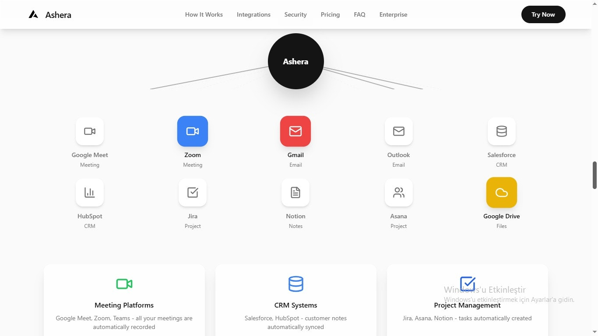
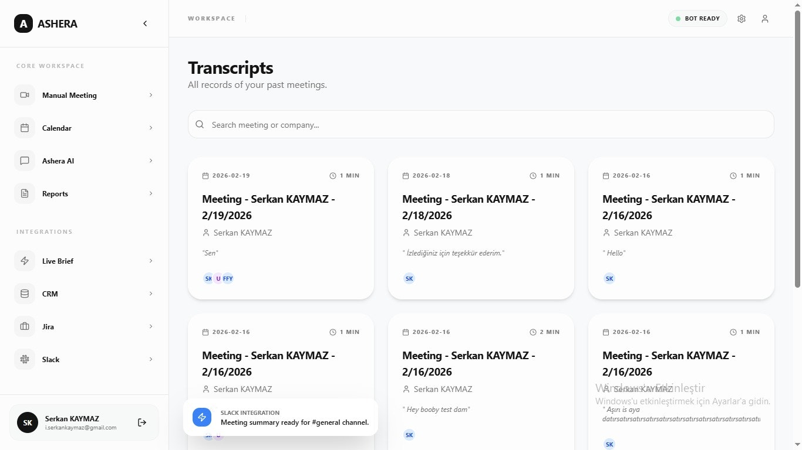

---

## 6. [Verly](https://www.producthunt.com/products/verly-ai)
**Votes**: 28 | **도입 난이도**: 중 | **신뢰도**: 중
**Tagline**: AI agents that resolve customer support across channels
**서비스 링크**: https://www.producthunt.com/r/XA7VJI27P537F4

**태그**: AI, 고객 지원, 자동화, 챗봇, Agent, AI Tool

### 📌 이 서비스 한눈에 보기
VerlyAI로 웹, 전화, WhatsApp 등 다양한 채널에서 고객 지원을 자동화하여 비용을 절감하고 무제한 대화를 동시에 처리하세요.

### 🔑 주요 기능
- AI 에이전트를 통한 고객 지원 자동화
- 웹, 전화, WhatsApp 등 멀티 채널 지원
- 지원 비용 절감 및 동시 대화 처리

### 🙋 사용자에게 어떤 점이 좋은가
VerlyAI는 고객 지원팀의 부담을 줄이고, 24시간 고객 응대를 가능하게 하여 고객 만족도를 향상시킬 수 있습니다. 특히, 다양한 채널을 통해 고객과 소통해야 하는 기업에 유용합니다.

### ✅ 지금 바로 써볼 기능
- 데모 요청하여 AI 에이전트 성능 확인
- 자주 묻는 질문(FAQ) 기반 자동 응답 설정
- WhatsApp 연동하여 고객 응대 자동화

### ⚠️ 사용 전 확인할 점
- AI 에이전트의 답변 정확도 및 적절성 검토 필요
- 초기 설정 및 학습 과정 필요
- 특정 산업 또는 복잡한 문의에 대한 대응 능력 확인 필요

### 🧭 확인이 더 필요한 정보
VerlyAI의 실제 성능과 비용 절감 효과는 기업의 규모 및 고객 지원 환경에 따라 달라질 수 있습니다.

### 📸 스크린샷 및 갤러리
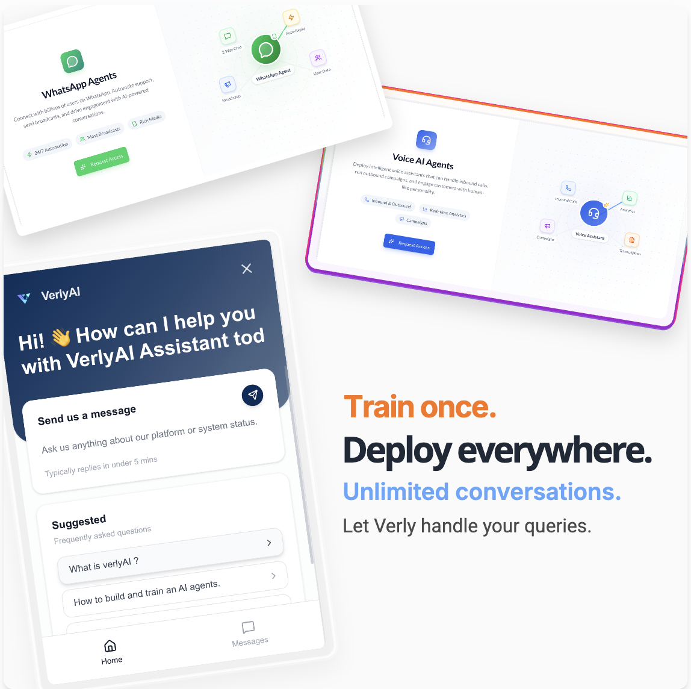
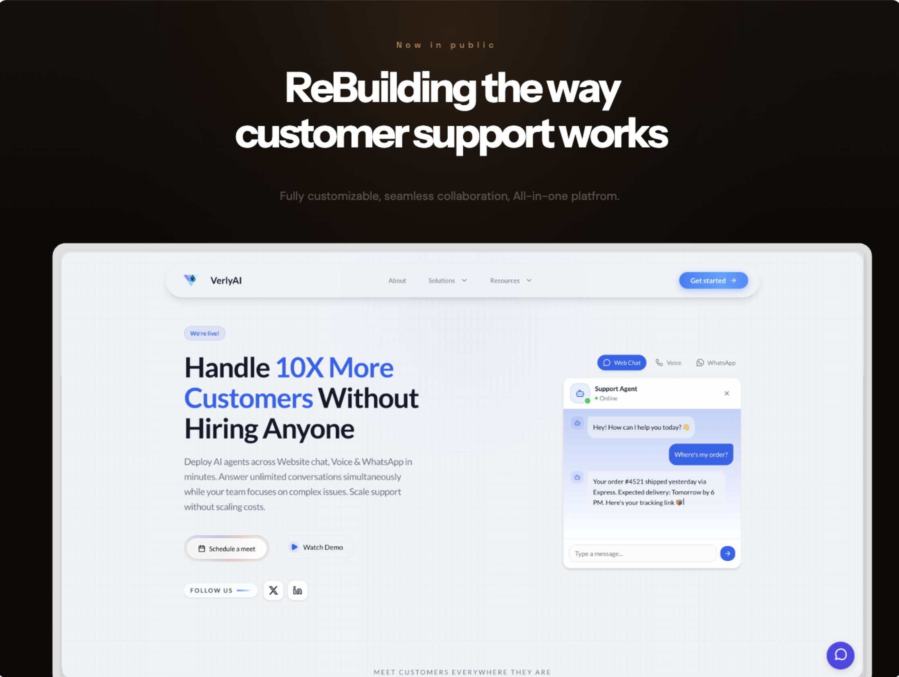
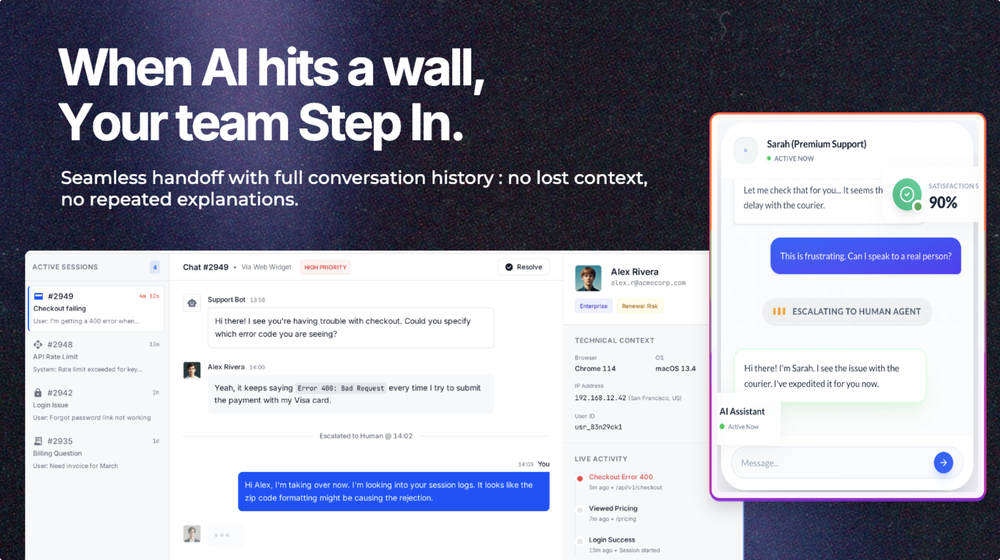

### 🎬 관련 영상
- [🎥 영상 보기](https://ph-files.imgix.net/2d1f3d28-5323-4227-ad20-1aa2ae1a24fe.jpeg?auto=format)

---

## 7. [Remalt](https://www.producthunt.com/products/remalt)
**Votes**: 20 | **도입 난이도**: 중 | **신뢰도**: 중
**Tagline**: AI Workspace For Content-Led Business
**서비스 링크**: https://www.producthunt.com/r/LF5BFRPAAGBNZ6

**태그**: 콘텐츠 제작, AI, 자동화, 생산성, 워크스페이스, Automation, AI Tool, Chat, Video

### 📌 이 서비스 한눈에 보기
분산된 여러 툴을 사용할 필요 없이, 비디오, 파일, 노트, 그리고 브랜드 맞춤형 AI를 하나의 시각적인 작업 공간에서 관리하고 콘텐츠를 재활용하여 생산성을 극대화하세요.

### 🔑 주요 기능
- 비디오, 파일, 노트 통합 관리
- 브랜드 맞춤형 AI 제공
- 콘텐츠 재활용 및 워크플로우 자동화

### 🙋 사용자에게 어떤 점이 좋은가
콘텐츠 제작 및 관리에 필요한 모든 것을 한 곳에서 해결하여 시간과 비용을 절약하고, AI 기반 자동화로 효율성을 높일 수 있습니다. 특히 LinkedIn, YouTube, Instagram 등 다양한 플랫폼에 맞게 콘텐츠를 쉽게 재활용할 수 있다는 장점이 있습니다.

### ✅ 지금 바로 써볼 기능
- 브레인보드를 활용하여 콘텐츠 아이디어 시각화
- AI 기반 콘텐츠 재활용 기능 사용
- 자동화된 워크플로우 설정

### ⚠️ 사용 전 확인할 점
- 브랜드 맞춤형 AI의 정확도 및 학습 속도 확인 필요
- 기존 사용하던 툴과의 데이터 호환성 확인 필요

### 🧭 확인이 더 필요한 정보
제공되는 AI 기능이 얼마나 효과적으로 브랜드의 특성을 학습하고 콘텐츠 제작에 도움이 되는지 확인이 필요합니다.

### 📸 스크린샷 및 갤러리
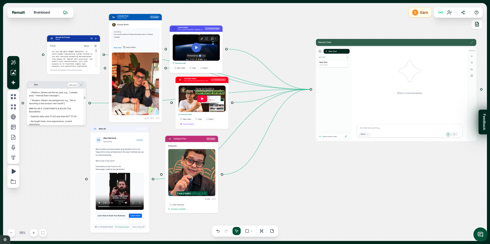
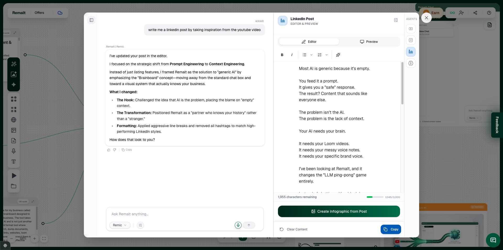
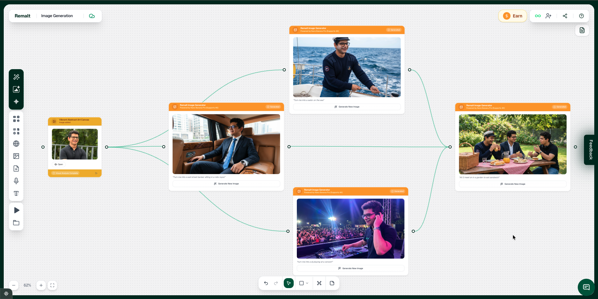

### 🎬 관련 영상
- [🎥 영상 보기](https://ph-files.imgix.net/9794f6cf-494c-48ed-9410-04065aa585aa.jpeg?auto=format)

---

## 8. [Cassiopeia](https://www.producthunt.com/products/cassiopeia-2)
**Votes**: 12 | **도입 난이도**: 중 | **신뢰도**: 중
**Tagline**: Turn any B2B case study pages into live product demos
**서비스 링크**: https://www.producthunt.com/r/Z7UCQ4HSQVKZM7

**태그**: B2B, 데모, 인터랙티브, 자동화, ROI

### 📌 이 서비스 한눈에 보기
B2B 케이스 스터디 페이지 URL만 입력하면 ROI 계산기, 미니 데모 등 인터랙티브 컴포넌트를 즉시 생성하여 잠재 고객의 몰입도를 높일 수 있습니다.

### 🔑 주요 기능
- 케이스 스터디 페이지 기반 맞춤형 인터랙티브 컴포넌트 자동 생성
- 페이지 디자인과 일관된 디자인 제공
- ROI 계산기, 미니 데모 등 다양한 컴포넌트 지원

### 🙋 사용자에게 어떤 점이 좋은가
기존 케이스 스터디 페이지를 단순한 자료 제공에서 벗어나, 사용자가 직접 참여하고 경험하는 형태로 전환하여 제품 이해도를 높이고 구매 결정을 유도할 수 있습니다.

### ✅ 지금 바로 써볼 기능
- 기존 케이스 스터디 페이지 URL 입력 후 인터랙티브 컴포넌트 생성
- 생성된 컴포넌트 디자인 커스터마이징
- 페이지에 컴포넌트 삽입 후 사용자 반응 테스트

### ⚠️ 사용 전 확인할 점
- 생성되는 컴포넌트의 종류 및 기능이 제한적일 수 있음
- 페이지 디자인과의 완벽한 통합을 위해서는 추가적인 조정이 필요할 수 있음

### 🧭 확인이 더 필요한 정보
지원하는 인터랙티브 컴포넌트 종류 및 커스터마이징 옵션에 대한 추가 정보 확인이 필요합니다.

### 📸 스크린샷 및 갤러리
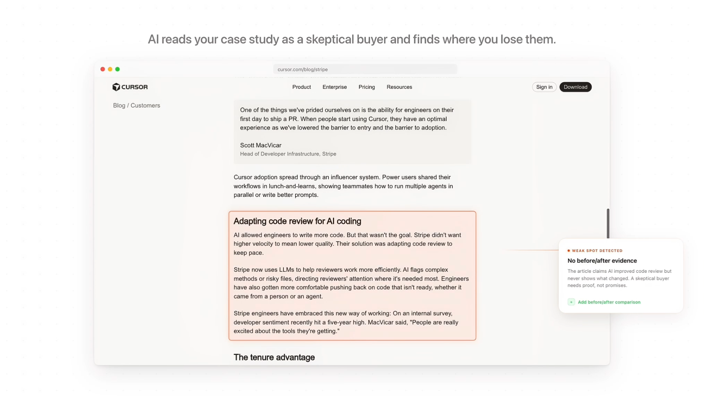
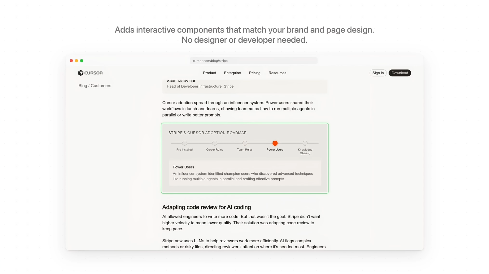
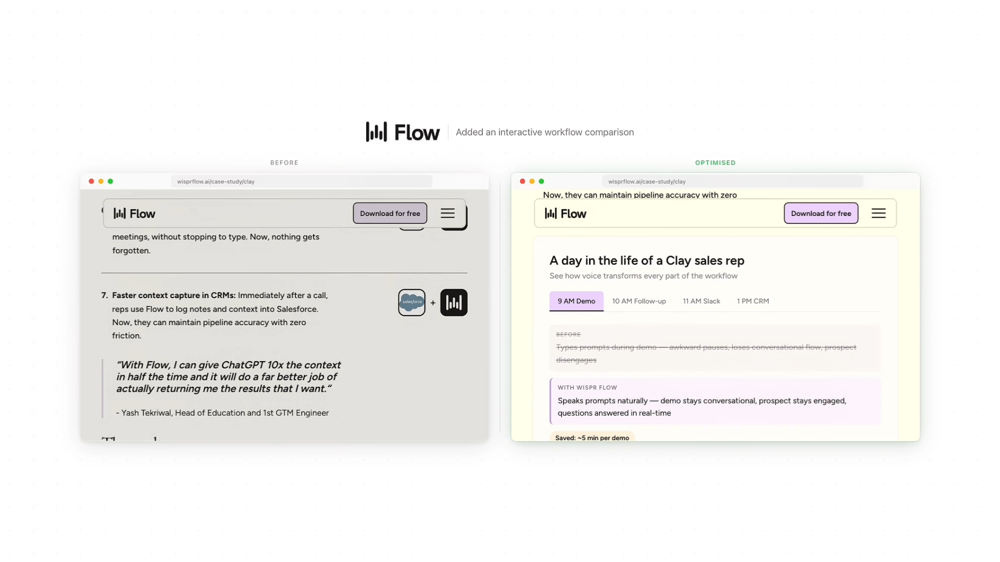

### 🎬 관련 영상
- [🎥 영상 보기](https://ph-files.imgix.net/fc250e1d-532d-4170-aee0-c72b0f319ceb.jpeg?auto=format)

---

## 9. [Voice Notes to Text - SotiTalk](https://www.producthunt.com/products/voice-notes-to-text-sotitalk)
**Votes**: 11 | **도입 난이도**: 하 | **신뢰도**: 중
**Tagline**: iOS voice to text app, real-time & privacy-first
**서비스 링크**: https://www.producthunt.com/r/O3DZBDU2PSH6E5

**태그**: 음성인식, 생산성, 메모, iOS, 프라이버시, AI Tool

### 📌 이 서비스 한눈에 보기
SotiTalk은 아이폰에서 음성을 실시간으로 텍스트로 변환해주는 앱으로, 녹음/텍스트가 클라우드에 저장되지 않아 사생활 보호에 강점을 가집니다.

### 🔑 주요 기능
- 실시간 음성 텍스트 변환
- 데이터 로컬 저장 (개인 정보 보호)
- 핸즈프리 메모 및 아이디어 기록

### 🙋 사용자에게 어떤 점이 좋은가
걷거나 회의 중에도 손쉽게 아이디어를 기록하고, 다시 듣지 않는 음성 메모 대신 즉시 텍스트로 변환하여 활용도를 높일 수 있습니다. 개인 정보 유출 걱정 없이 안전하게 사용할 수 있다는 장점도 있습니다.

### ✅ 지금 바로 써볼 기능
- 아이디어 떠오를 때 음성 메모 즉시 변환해보기
- 회의 중 핸즈프리로 노트 필기해보기
- 음성으로 긴 텍스트 작성해보기

### ⚠️ 사용 전 확인할 점
- 음성 인식 정확도는 주변 소음이나 발음에 따라 달라질 수 있습니다.
- iOS에서만 사용 가능합니다.

### 🧭 확인이 더 필요한 정보
지원하는 언어의 종류와 정확도에 대한 추가 정보 확인이 필요합니다.

### 📸 스크린샷 및 갤러리
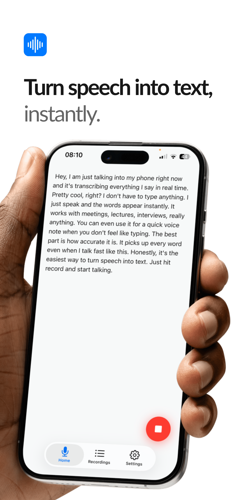
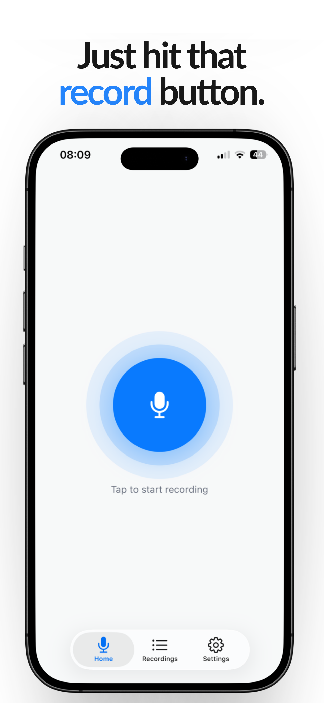
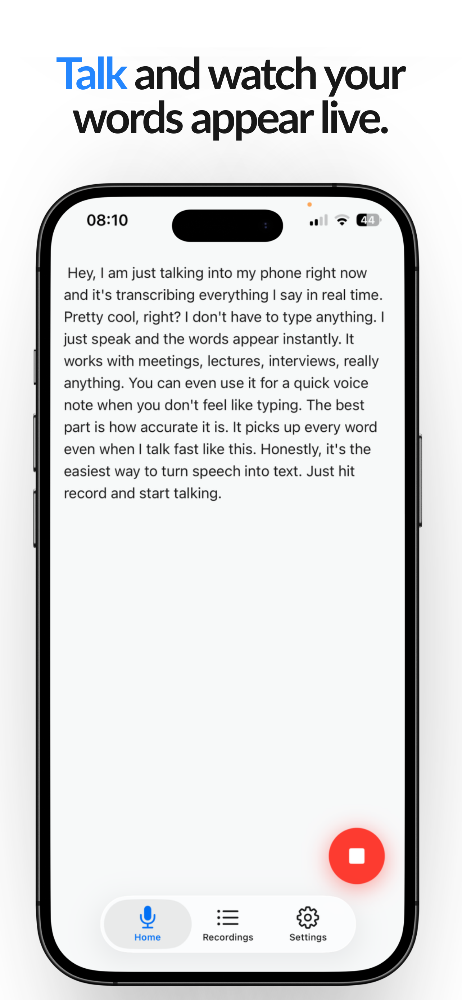

---

## 10. [City Buddy](https://www.producthunt.com/products/city-buddy)
**Votes**: 10 | **도입 난이도**: 하 | **신뢰도**: 중
**Tagline**: Discover everything from top attractions to hidden gems.
**서비스 링크**: https://www.producthunt.com/r/W6IINXWHEV2VNJ

**태그**: 여행, 정보, 추천, 도시, 검색

### 📌 이 서비스 한눈에 보기
City Buddy는 가입 없이 전 세계 도시의 인기 명소, 숨겨진 보석, 평점, 여행 정보를 즉시 찾아주는 서비스입니다.

### 🔑 주요 기능
- 가입 불필요
- 도시 및 국가별 정보 제공
- 숨겨진 명소 추천

### 🙋 사용자에게 어떤 점이 좋은가
여행 계획을 세울 때, 혹은 새로운 도시를 탐험하고 싶을 때 유용하게 사용할 수 있습니다. 복잡한 절차 없이 바로 정보를 얻을 수 있다는 점이 큰 장점입니다.

### ✅ 지금 바로 써볼 기능
- 새로운 도시 검색해보기
- 숨겨진 명소 찾아보기
- 여행 정보 확인하기

### ⚠️ 사용 전 확인할 점
- 정보의 최신성 확인 필요
- 사용자 리뷰는 제공되지 않음

### 🧭 확인이 더 필요한 정보
정보 제공 주체의 신뢰도 및 정보 업데이트 빈도 확인이 필요합니다.

### 📸 스크린샷 및 갤러리
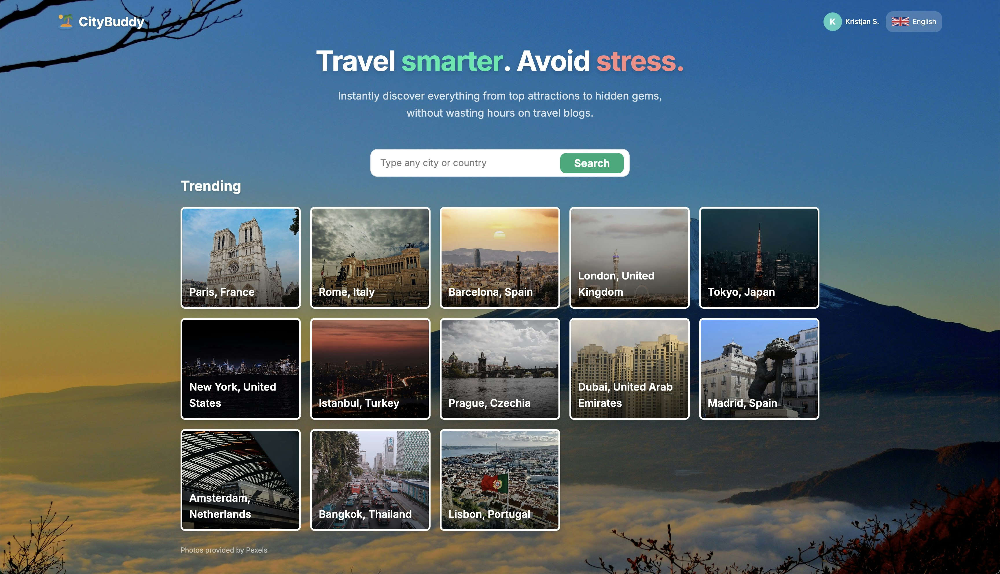
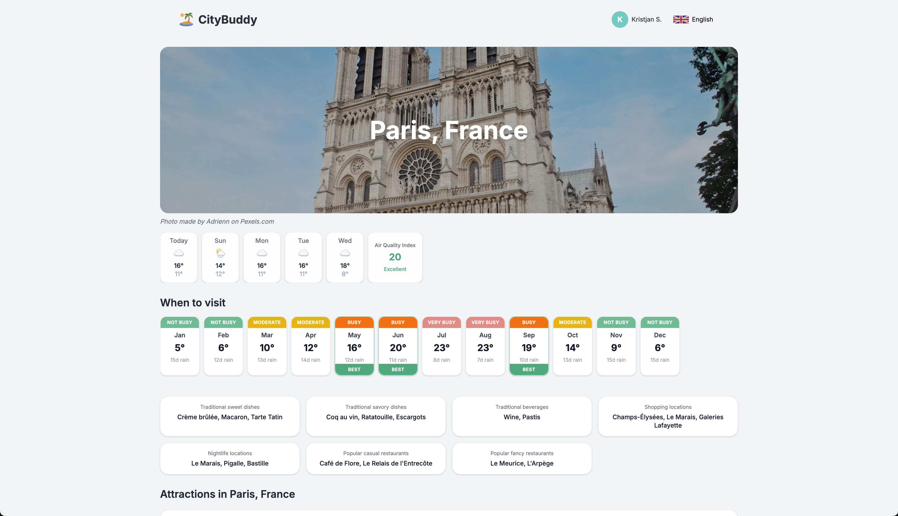
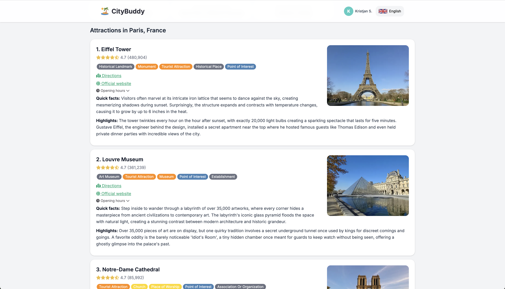

---

