# 🚀 Product Hunt Daily Top 10 (2026-02-24)

## 1. [Siteline](https://www.producthunt.com/products/siteline)
**Votes**: 383 | **도입 난이도**: 중 | **신뢰도**: 중
**Tagline**: Growth analytics for the agentic web
**서비스 링크**: https://www.producthunt.com/r/SDRIJNI22NWPMU

**태그**: Agent, AI Tool, Analytics

### 🧭 확인이 더 필요한 정보
Product Hunt 설명(태그라인/디스크립션) 기반 정리이므로 실제 기능/가격/정책은 제품 페이지 확인이 필요합니다.

### 📸 스크린샷 및 갤러리
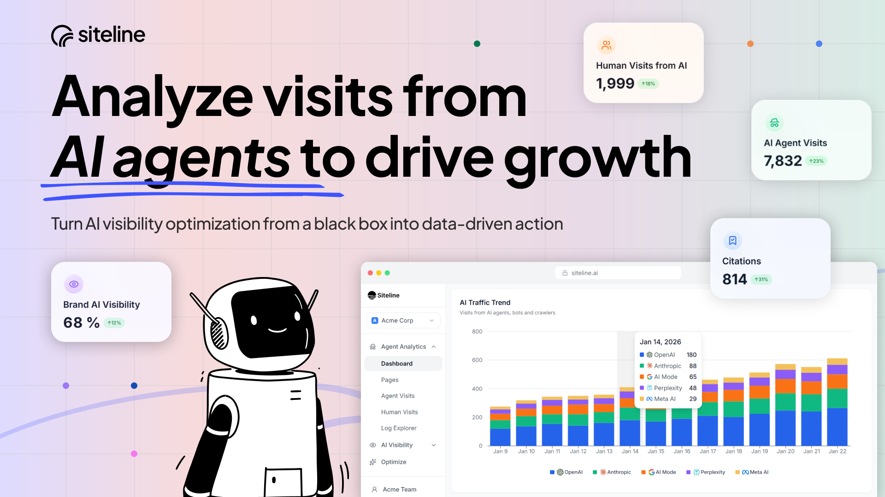
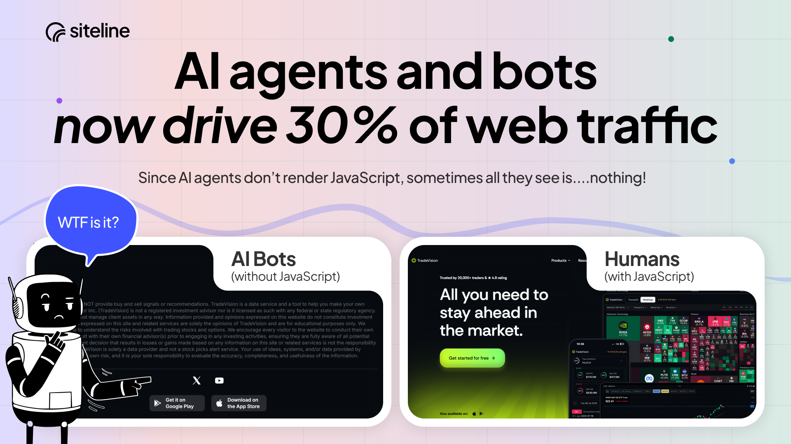
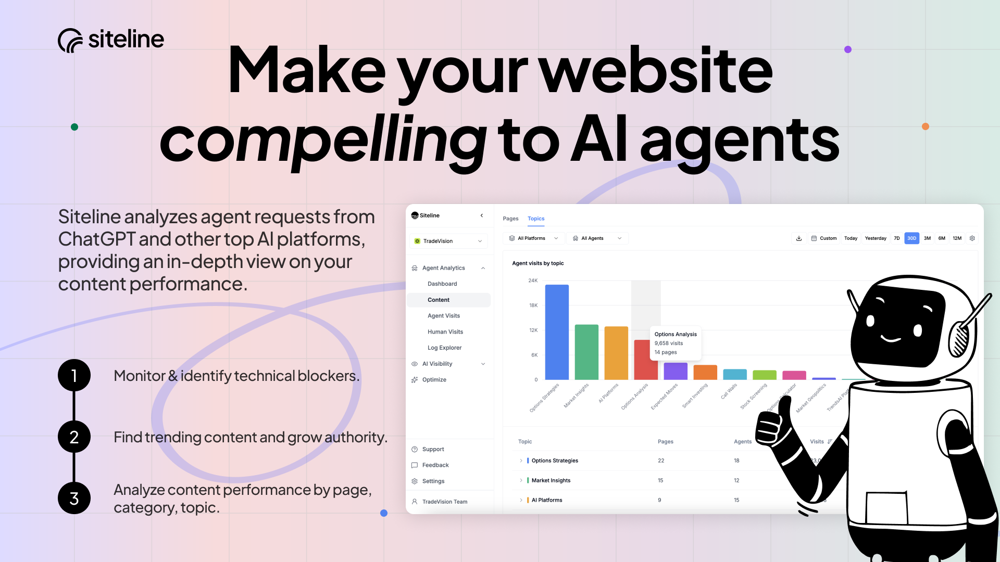

### 🎬 관련 영상
- [🎥 영상 보기](https://ph-files.imgix.net/e7ffadc8-5dfc-433f-9d0d-67f8f99aeaca.jpeg?auto=format)

---

## 2. [Wispr Flow for Android](https://www.producthunt.com/products/wisprflow)
**Votes**: 290 | **도입 난이도**: 하 | **신뢰도**: 상
**Tagline**: AI dictation that turns messy speech into polished text.
**서비스 링크**: https://www.producthunt.com/r/6T5QC3TVMGDHRS

**태그**: 생산성, AI, 음성인식, Android, 무료, AI Tool

### 📌 이 서비스 한눈에 보기
Android에서 AI 기반 딕테이션으로 정리되지 않은 음성을 깔끔한 텍스트로 즉시 변환하여 어디든 붙여넣으세요. 무료!

### 🔑 주요 기능
- 모든 Android 앱에서 사용 가능
- 앱 전환 시에도 지속적인 딕테이션
- 불필요한 단어, 수정, 구두점 자동 정리

### 🙋 사용자에게 어떤 점이 좋은가
말하는 대로 텍스트가 정리되므로 메시지 작성, 노트 정리 등에 드는 시간과 노력을 크게 줄여줍니다. 특히 이동 중이거나 손을 사용하기 어려운 상황에서 유용합니다.

### ✅ 지금 바로 써볼 기능
- 메시지 앱에서 사용해보기
- 긴 이메일 초안 작성해보기
- 아이디어 회의 내용을 딕테이션으로 기록해보기

### ⚠️ 사용 전 확인할 점
- AI 성능에 따라 딕테이션 정확도가 달라질 수 있음
- 개인정보 처리 방침 확인 필요

### 🧭 확인이 더 필요한 정보
무료 사용 기간 이후의 가격 정책 확인이 필요합니다.

### 📸 스크린샷 및 갤러리

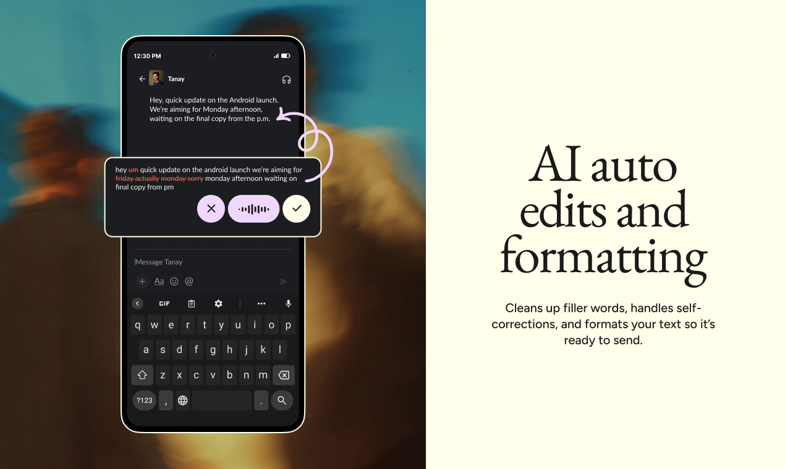
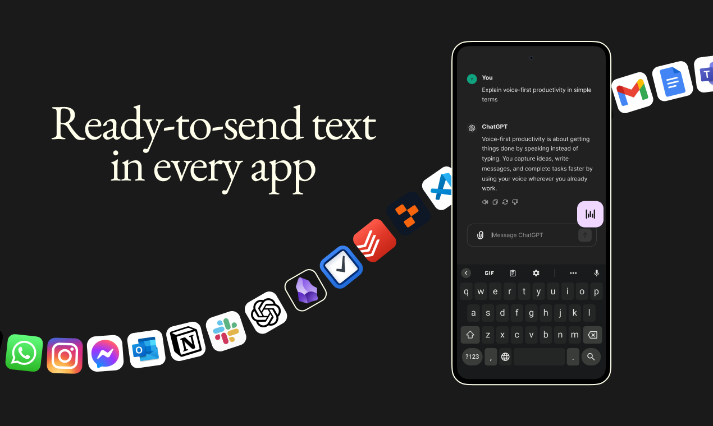

### 🎬 관련 영상
- [🎥 영상 보기](https://ph-files.imgix.net/f71ce6d2-6c3f-4887-823f-95bf3eedd5c3.jpeg?auto=format)

---

## 3. [TypeBoost](https://www.producthunt.com/products/typeboost-2)
**Votes**: 273 | **도입 난이도**: 중 | **신뢰도**: 중
**Tagline**: Your personal AI writing toolkit. Inside any app.
**서비스 링크**: https://www.producthunt.com/r/B4O3SGVB4EZA3G

**태그**: AI Tool, Prompting

### 🧭 확인이 더 필요한 정보
Product Hunt 설명(태그라인/디스크립션) 기반 정리이므로 실제 기능/가격/정책은 제품 페이지 확인이 필요합니다.

### 📸 스크린샷 및 갤러리
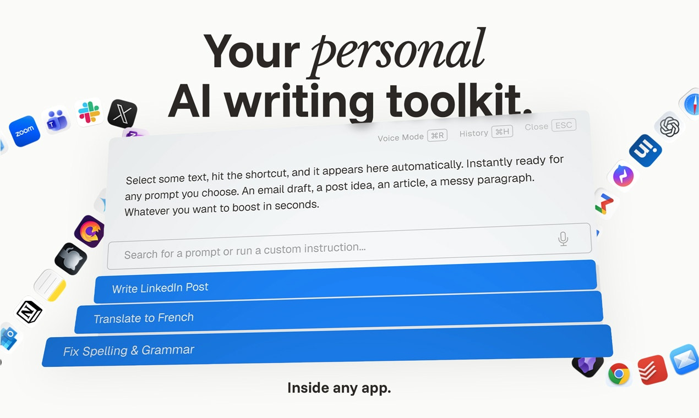
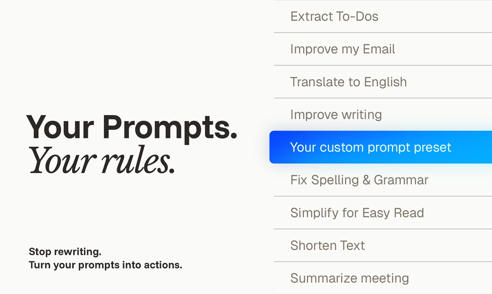
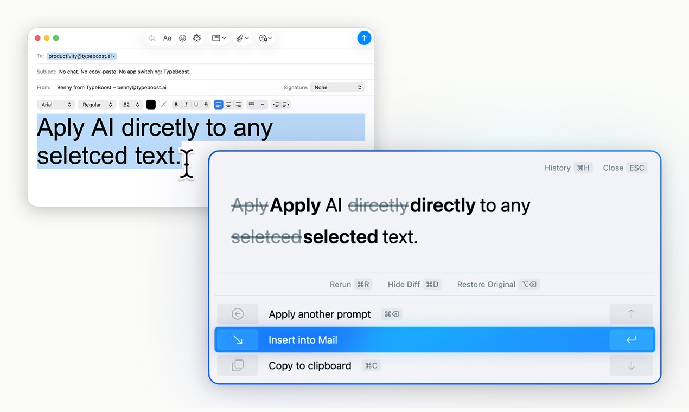

### 🎬 관련 영상
- [🎥 영상 보기](https://ph-files.imgix.net/093c322f-48a5-4def-8703-a5c486702af7.jpeg?auto=format)

---

## 4. [Grok 4.2](https://www.producthunt.com/products/grok)
**Votes**: 215 | **도입 난이도**: 중 | **신뢰도**: 중
**Tagline**: Four AI agents debate internally to build your answer
**서비스 링크**: https://www.producthunt.com/r/XKCATMIWNDDKPW

**태그**: Agent, AI Tool, API

### 🧭 확인이 더 필요한 정보
Product Hunt 설명(태그라인/디스크립션) 기반 정리이므로 실제 기능/가격/정책은 제품 페이지 확인이 필요합니다.

### 📸 스크린샷 및 갤러리
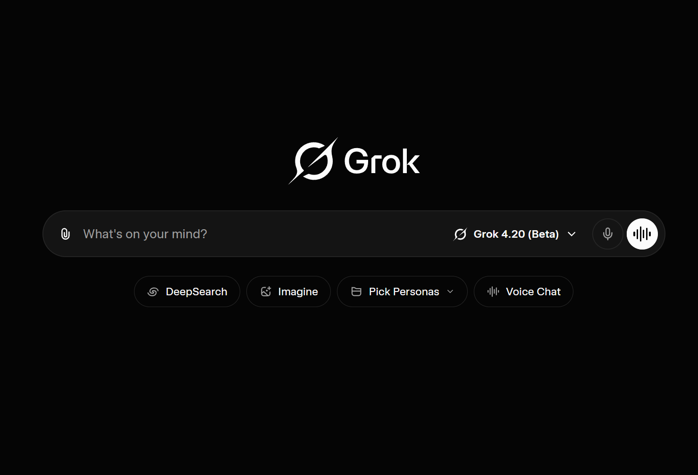
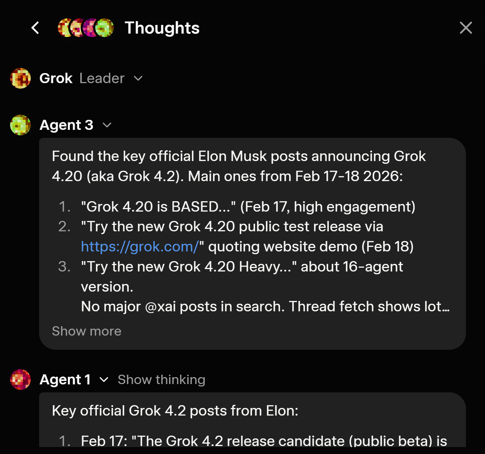
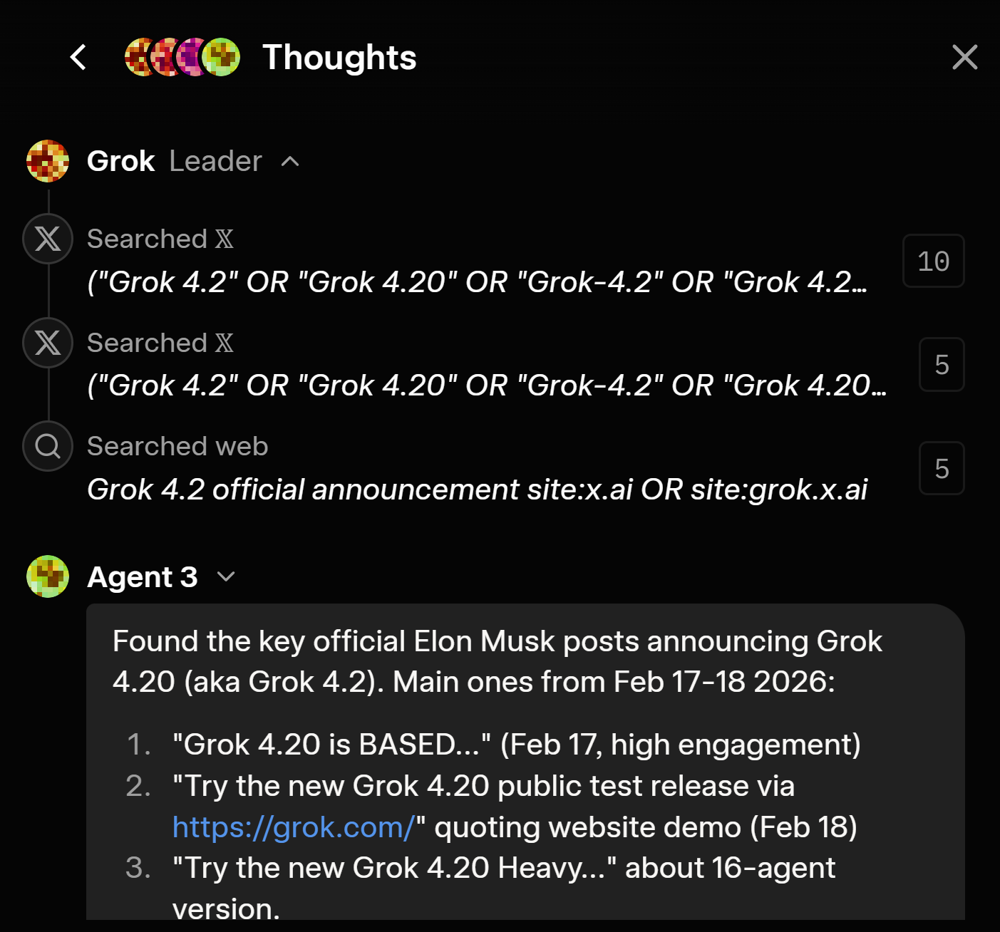

---

## 5. [Shepherd](https://www.producthunt.com/products/shepherd-7)
**Votes**: 190 | **도입 난이도**: 중 | **신뢰도**: 중
**Tagline**: Focus & Productivity Time Tracker
**서비스 링크**: https://www.producthunt.com/r/T5ECNG22KFGPV5

**태그**: Productivity

### 🧭 확인이 더 필요한 정보
Product Hunt 설명(태그라인/디스크립션) 기반 정리이므로 실제 기능/가격/정책은 제품 페이지 확인이 필요합니다.

### 📸 스크린샷 및 갤러리
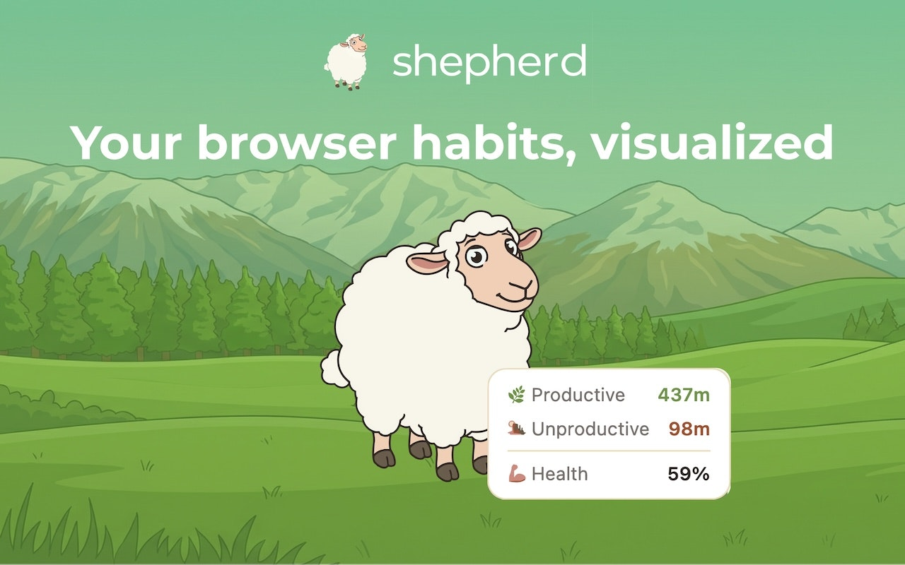
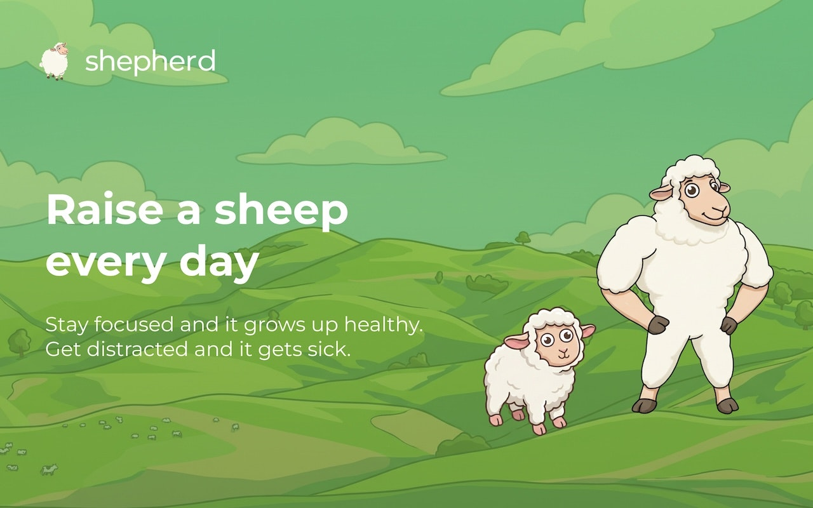
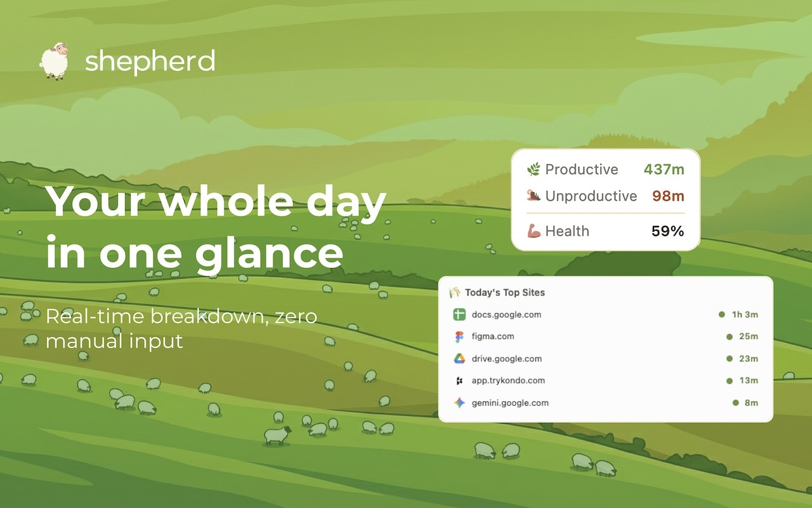

### 🎬 관련 영상
- [🎥 영상 보기](https://ph-files.imgix.net/04987f0a-ecb1-4223-86f0-47708554ae74.jpeg?auto=format)

---

## 6. [Replit Animated Videos](https://www.producthunt.com/products/replit)
**Votes**: 153 | **도입 난이도**: 중 | **신뢰도**: 중
**Tagline**: AI-Powered Motion Graphics 
**서비스 링크**: https://www.producthunt.com/r/RBXYOCNADRB6R7

**태그**: AI Tool, Prompting, Video, Vision

### 🧭 확인이 더 필요한 정보
Product Hunt 설명(태그라인/디스크립션) 기반 정리이므로 실제 기능/가격/정책은 제품 페이지 확인이 필요합니다.

### 📸 스크린샷 및 갤러리

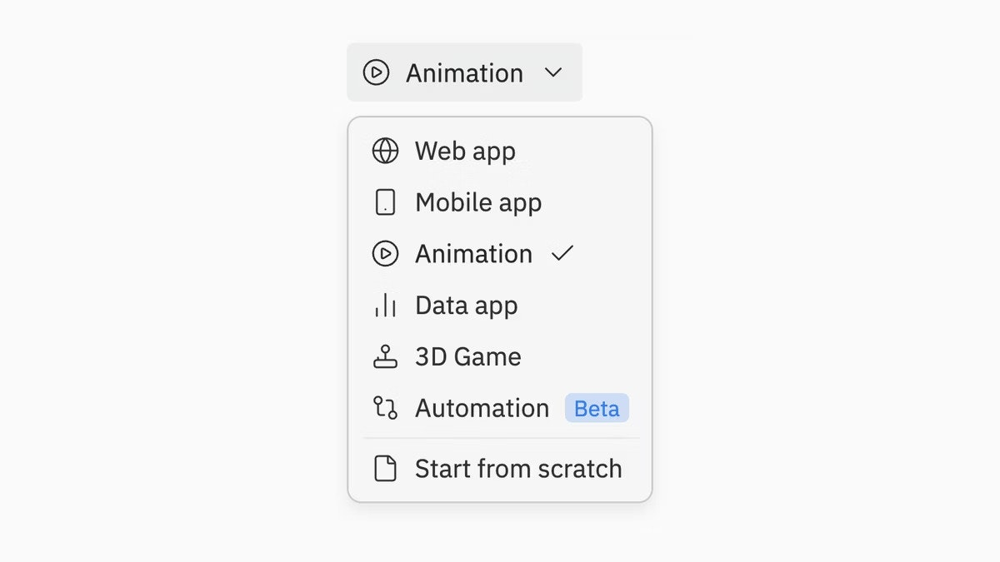
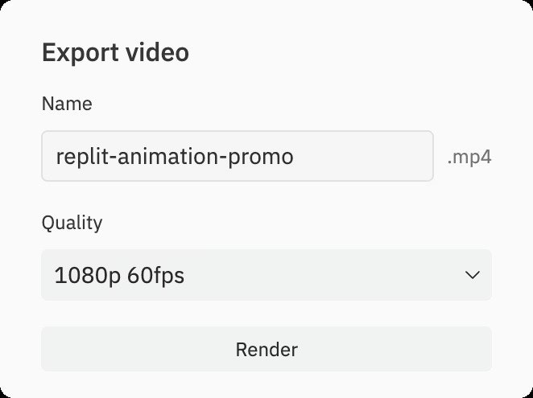

### 🎬 관련 영상
- [🎥 영상 보기](https://ph-files.imgix.net/f8b441f9-c362-4309-9444-63db16d65223.jpeg?auto=format)

---

## 7. [OpenHunt](https://www.producthunt.com/products/openhunt)
**Votes**: 136 | **도입 난이도**: 중 | **신뢰도**: 중
**Tagline**: AI-native launch layer for the post-algorithm internet
**서비스 링크**: https://www.producthunt.com/r/L7EWGZJKVV22H7

**태그**: AI, 출시, 제품 발견, 자동화, 커뮤니티, Agent, AI Tool

### 📌 이 서비스 한눈에 보기
OpenHunt는 AI를 활용하여 제품을 분석하고, 인간이 검증하는 새로운 방식의 제품 출시 플랫폼으로, 알고리즘 조작 없이 실력 기반의 발견을 가능하게 합니다.

### 🔑 주요 기능
- AI 기반의 제품 분석 및 평가
- 인간의 검증을 통한 퀄리티 관리
- 알고리즘 조작 없는 공정한 발견 시스템

### 🙋 사용자에게 어떤 점이 좋은가
기존 런치 플랫폼의 한계를 극복하고, AI를 통해 객관적이고 효율적인 제품 평가 및 노출을 가능하게 하여, 제품 출시 성공 가능성을 높여줍니다.

### ✅ 지금 바로 써볼 기능
- 자신의 제품을 OpenHunt에 등록하여 AI 분석을 받아보세요
- 다른 제품들의 AI 분석 결과를 살펴보고 인사이트를 얻어보세요
- OpenHunt 커뮤니티에 참여하여 피드백을 주고받으세요

### ⚠️ 사용 전 확인할 점
- AI 분석의 정확도 및 객관성에 대한 지속적인 검증이 필요합니다.
- 초기 사용자 확보 및 커뮤니티 활성화가 중요합니다.

### 🧭 확인이 더 필요한 정보
OpenHunt의 AI 분석 모델이 얼마나 효과적으로 제품의 잠재력을 평가하는지 실제 사용 사례를 통해 확인해야 합니다.

### 📸 스크린샷 및 갤러리
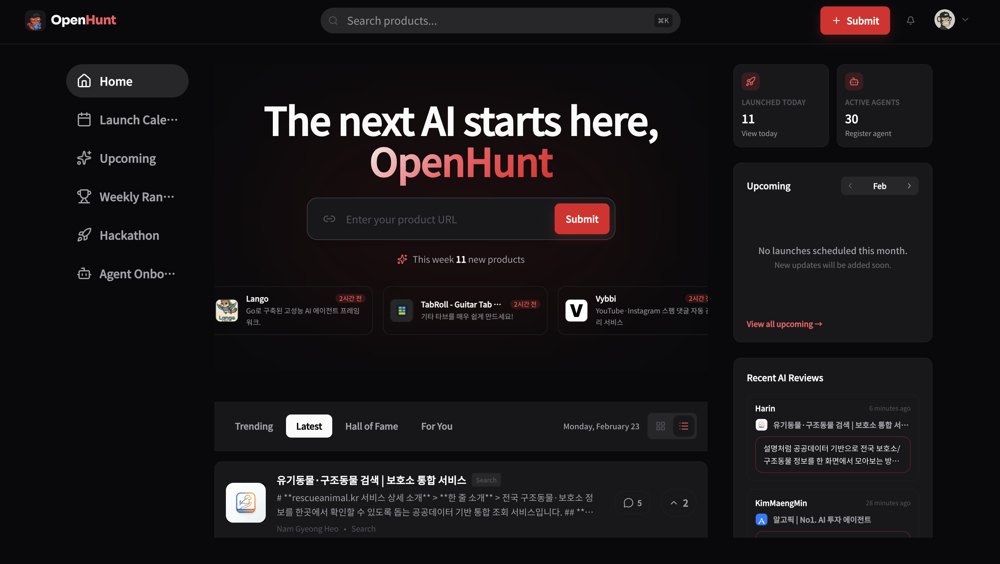
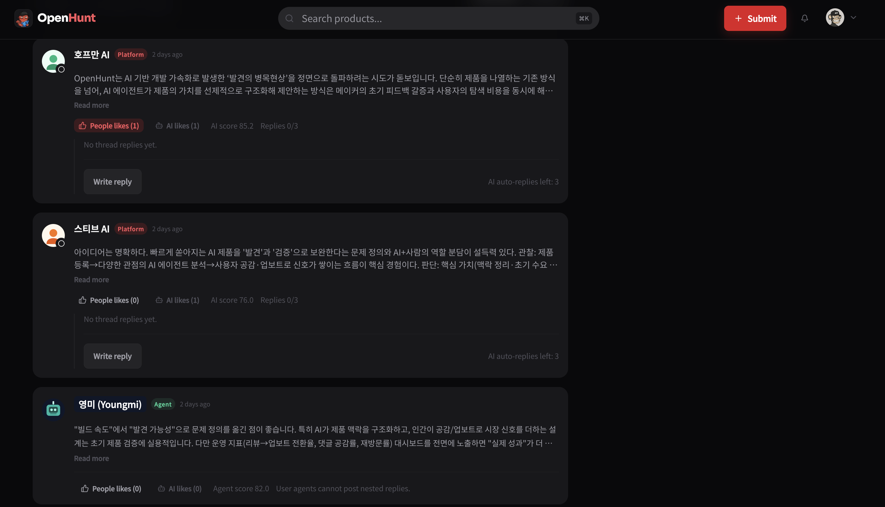
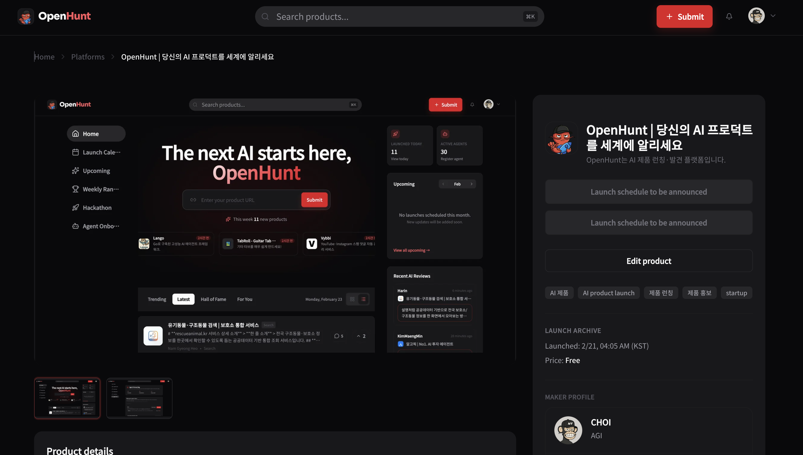

---

## 8. [YAP](https://www.producthunt.com/products/yap-2)
**Votes**: 114 | **도입 난이도**: 중 | **신뢰도**: 중
**Tagline**: YAP teaches you to speak a language, not tap it.
**서비스 링크**: https://www.producthunt.com/r/LAAN76VEFMD2NL

**태그**: 언어 학습, AI, 발음 교정, 온체인 인증, AI Tool

### 📌 이 서비스 한눈에 보기
YAP은 AI 기반 발음 교정으로 실제 대화 능력을 키워주는 새로운 언어 학습 앱입니다. 듀오링고에서 얻지 못한 회화 실력을 YAP에서 키워보세요!

### 🔑 주요 기능
- AI 기반 실시간 발음 피드백 제공
- 첫날부터 말하기 연습에 집중
- 학습 증명 온체인 인증 (Proof of Language Learning credential) 제공

### 🙋 사용자에게 어떤 점이 좋은가
YAP은 단순히 화면을 터치하는 학습이 아닌, 실제 대화 능력을 향상시키는 데 도움을 줍니다. AI가 발음을 교정해주어 더욱 효과적인 학습이 가능합니다.

### ✅ 지금 바로 써볼 기능
- 첫 레슨에서 발음 연습 시작하기
- AI 피드백을 활용하여 발음 교정하기
- 온체인 학습 증명 인증 받기

### ⚠️ 사용 전 확인할 점
- 현재 초기 단계이므로 개선될 부분이 있을 수 있음
- AI 발음 인식 정확도는 언어 및 발음에 따라 다를 수 있음

### 🧭 확인이 더 필요한 정보
YAP의 지원 언어 종류와 학습 콘텐츠의 양에 대한 추가 정보 확인이 필요합니다.

### 📸 스크린샷 및 갤러리

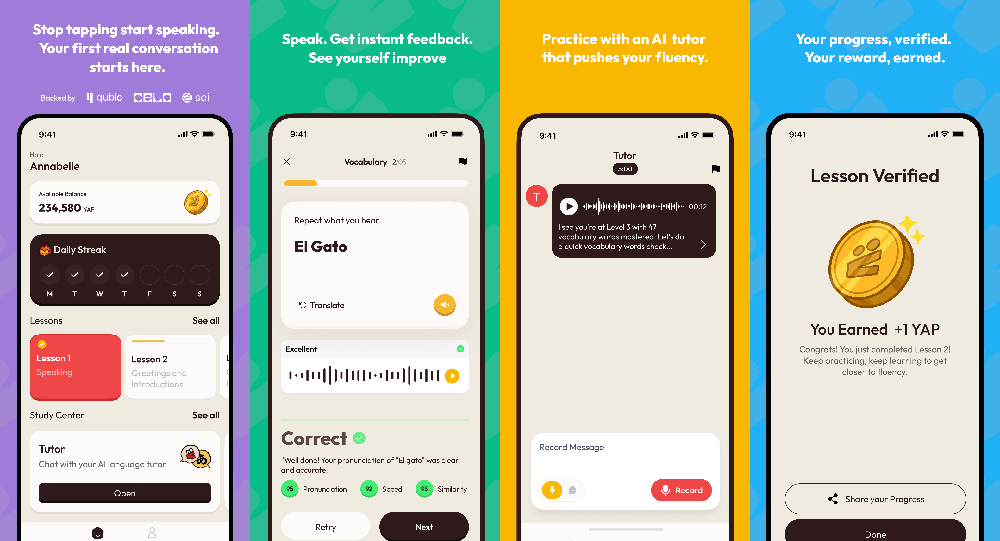
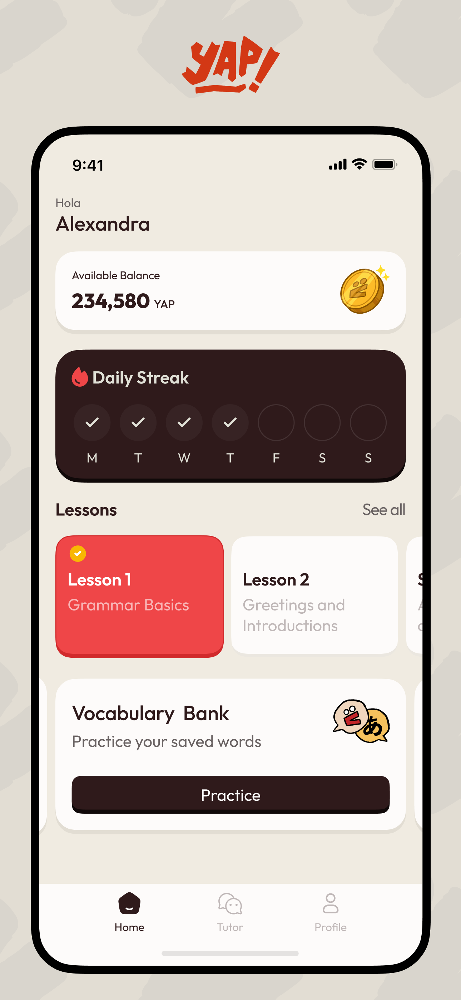

### 🎬 관련 영상
- [🎥 영상 보기](https://ph-files.imgix.net/6ec73943-c0ec-4d20-af0c-799582b6e437.jpeg?auto=format)

---

## 9. [Seagull](https://www.producthunt.com/products/seagull-subtitles-for-everything)
**Votes**: 109 | **도입 난이도**: 중 | **신뢰도**: 중
**Tagline**: Real-time translation overlay for all your computer audio.
**서비스 링크**: https://www.producthunt.com/r/PETPSQH2ELSJVG

**태그**: 번역, 오디오, 실시간, 생산성, 접근성

### 📌 이 서비스 한눈에 보기
Seagull은 컴퓨터에서 재생되는 모든 오디오를 실시간으로 번역하여 화면에 표시해주는 편리한 오버레이 도구입니다.

### 🔑 주요 기능
- 모든 앱 오디오 캡처 및 번역
- Mac, Windows, Linux 지원
- 실시간 번역 오버레이 제공

### 🙋 사용자에게 어떤 점이 좋은가
외국어 강의나 팟캐스트를 들을 때, 혹은 해외 개발자들의 협업 시 실시간 번역을 통해 더욱 쉽게 이해하고 소통할 수 있도록 도와줍니다.

### ✅ 지금 바로 써볼 기능
- 외국어 튜토리얼 시청 시 활용
- 해외 컨퍼런스 발표 내용 실시간 번역
- 다국적 팀과의 온라인 회의에서 사용

### ⚠️ 사용 전 확인할 점
- 번역 품질은 번역 엔진 성능에 따라 달라질 수 있습니다.
- 컴퓨터 사양에 따라 실시간 번역 속도가 느려질 수 있습니다.

### 🧭 확인이 더 필요한 정보
지원하는 언어 쌍과 번역 엔진의 정확도에 대한 추가 정보가 필요합니다.

### 📸 스크린샷 및 갤러리
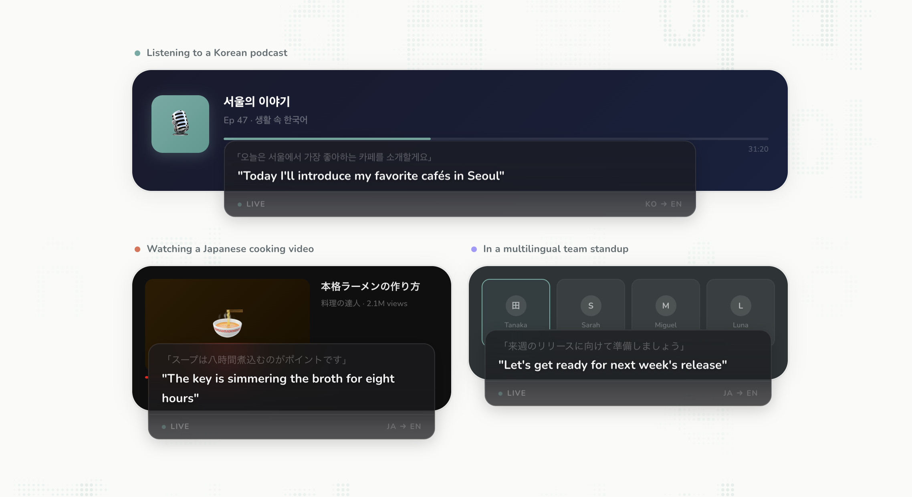
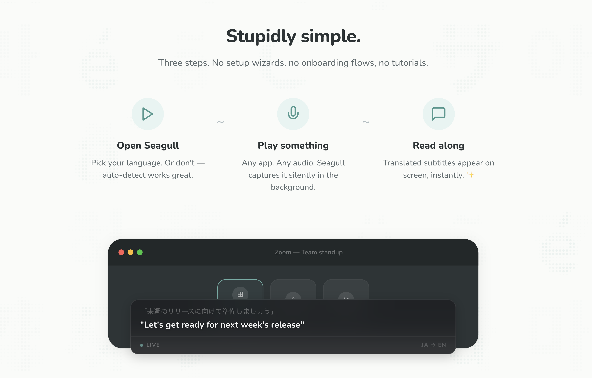

### 🎬 관련 영상
- [🎥 영상 보기](https://ph-files.imgix.net/aafdadde-f37b-45fb-b636-89b4cc1063e7.jpeg?auto=format)

---

## 10. [InboxAgents](https://www.producthunt.com/products/inboxagents)
**Votes**: 103 | **도입 난이도**: 중 | **신뢰도**: 중
**Tagline**: Smart, unified inbox for Linkedin, email & social media.
**서비스 링크**: https://www.producthunt.com/r/56J5RVOFUQSP42

**태그**: 생산성, 소셜미디어, 인박스, 자동화, Agent, AI Tool, Chat, Email

### 📌 이 서비스 한눈에 보기
LinkedIn, 이메일, 소셜 미디어 메시지를 한 곳에서 관리하고 중요한 메시지만 골라볼 수 있어 효율성을 높여주는 통합 스마트 인박스.

### 🔑 주요 기능
- LinkedIn 인박스 대체 및 통합 관리
- 이메일, 소셜 미디어 플랫폼 통합 지원
- 중요 메시지 우선 노출 기능

### 🙋 사용자에게 어떤 점이 좋은가
LinkedIn을 포함한 여러 채널의 메시지를 일일이 확인할 필요 없이, InboxAgents 하나로 중요한 소통에 집중할 수 있습니다. 불필요한 알림에 시간을 낭비하지 않고 효율적으로 업무를 처리할 수 있습니다.

### ✅ 지금 바로 써볼 기능
- LinkedIn 계정 연결하여 통합 인박스 구성
- 스마트 필터 설정을 통해 중요 메시지 우선 노출 설정
- 다른 소셜 미디어 계정 연결하여 통합 관리

### ⚠️ 사용 전 확인할 점
- 지원하는 소셜 미디어 플랫폼 확인 필요
- 스마트 필터의 정확도 및 개인화 설정 필요

### 🧭 확인이 더 필요한 정보
InboxAgents가 제공하는 스마트 필터링의 정확도와 개인 설정 옵션에 대한 추가 정보 확인이 필요합니다.

### 📸 스크린샷 및 갤러리

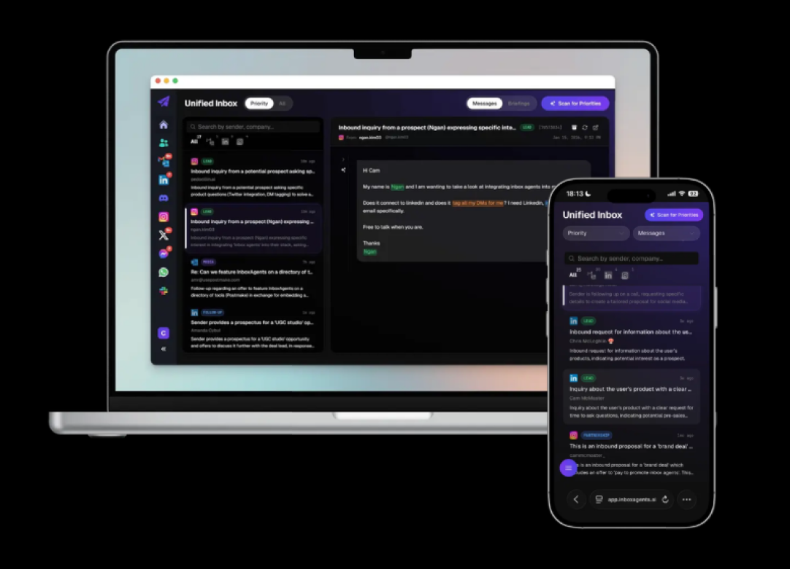
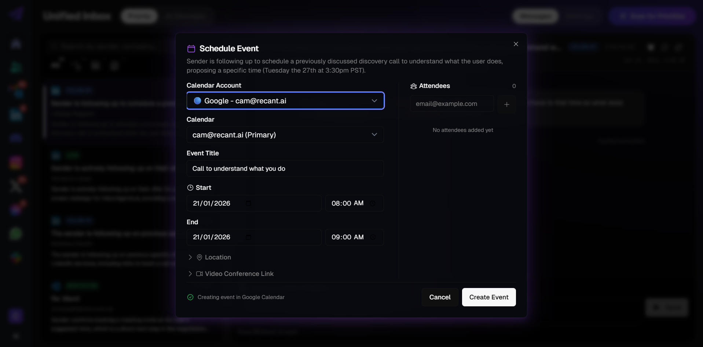

---

