# 🚀 Product Hunt Daily Top 10 (2026-02-25)

## 1. [Stitch by Google](https://www.producthunt.com/products/stitch-by-google)
**Votes**: 337 | **도입 난이도**: 중 | **신뢰도**: 중
**Tagline**: Turn napkin sketches into production-ready UI in seconds.
**서비스 링크**: https://www.producthunt.com/r/JEM76QOQHZLFO7

**태그**: DevTool, UI/UX, 코드 생성, 자동화, Google, Agent, AI Tool, Design

### 📌 이 서비스 한눈에 보기
Stitch by Google: 손으로 그린 UI 스케치를 몇 초 만에 실제 작동하는 UI 코드로 변환하여 프로덕션에 즉시 적용할 수 있게 해줍니다.

### 🔑 주요 기능
- 스케치를 기반으로 편집 가능한 디자인 및 실제 코드를 생성
- Hatter 에이전트를 통해 다단계 디자인 작업 처리
- App Store 에셋 생성 및 네이티브 MCP 내보내기 지원

### 🙋 사용자에게 어떤 점이 좋은가
창업자나 PM들이 모형 제작에 시간을 낭비하지 않고 아이디어를 빠르게 시각화하고 실제 코드로 구현할 수 있도록 도와줍니다. Google에서 무료로 제공합니다.

### ✅ 지금 바로 써볼 기능
- 스케치 기반 UI 디자인 생성
- Hatter 에이전트를 활용한 디자인 작업 자동화
- App Store 에셋 자동 생성 기능 사용

### ⚠️ 사용 전 확인할 점
- 생성된 코드의 품질 및 복잡성 검토 필요
- Hatter 에이전트의 다단계 디자인 작업 처리 성능 확인 필요

### 🧭 확인이 더 필요한 정보
생성된 코드의 유지보수 용이성 및 확장성에 대한 추가 정보가 필요합니다.

### 📸 스크린샷 및 갤러리

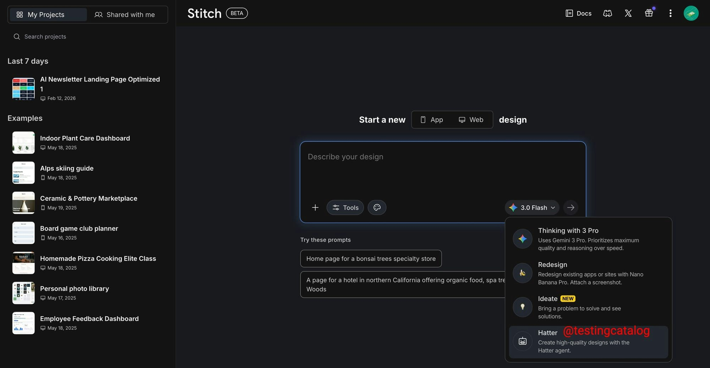
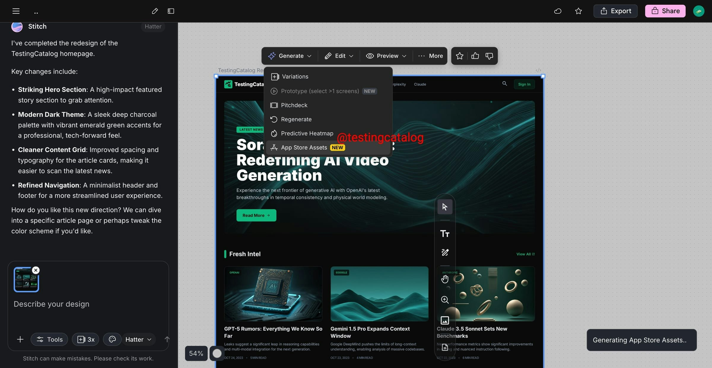

### 🎬 관련 영상
- [🎥 영상 보기](https://ph-files.imgix.net/928690c0-8f76-4dd5-8463-14e131cb4bda.jpeg?auto=format)

---

## 2. [Modelence App Builder](https://www.producthunt.com/products/modelence-app-builder)
**Votes**: 293 | **도입 난이도**: 중 | **신뢰도**: 중
**Tagline**: Build real apps, not prototypes
**서비스 링크**: https://www.producthunt.com/r/AUQV7WTYW5GCBU

**태그**: 앱 빌더, 개발 도구, 오픈 소스, AI, 자동화, AI Tool, Design

### 📌 이 서비스 한눈에 보기
Modelence App Builder는 인증, 데이터베이스, 모니터링 기능을 내장하여 프로덕션 수준의 앱을 프로토타입이 아닌 실제 앱으로 빠르게 구축할 수 있게 해줍니다.

### 🔑 주요 기능
- 실제 앱 구축 가능: 프로토타입 수준이 아닌, 바로 배포 가능한 앱을 만들 수 있습니다.
- 올인원 솔루션: 인증, 데이터베이스, 모니터링 등 필요한 모든 기능이 내장되어 있습니다.
- 오픈 소스 기반: AI 시대에 맞춰 설계된 오픈 소스 프레임워크를 사용합니다.

### 🙋 사용자에게 어떤 점이 좋은가
Modelence App Builder를 사용하면 개발 시간을 단축하고, 초기 인프라 구축에 대한 부담 없이 앱 개발에 집중할 수 있습니다. 특히 AI 기반 앱 개발에 유용합니다.

### ✅ 지금 바로 써볼 기능
- 제공되는 템플릿을 사용하여 간단한 앱을 만들어 보세요.
- 내장된 인증 기능을 설정하여 보안을 강화하세요.
- 데이터베이스 연결을 설정하고 데이터를 관리하는 방법을 익히세요.

### ⚠️ 사용 전 확인할 점
- 오픈 소스 프레임워크에 대한 이해가 필요할 수 있습니다.
- 특정 기능의 커스터마이징에 제약이 있을 수 있습니다.

### 🧭 확인이 더 필요한 정보
오픈 소스 프레임워크의 구체적인 라이선스 조건 및 지원 범위를 확인해야 합니다.

### 📸 스크린샷 및 갤러리
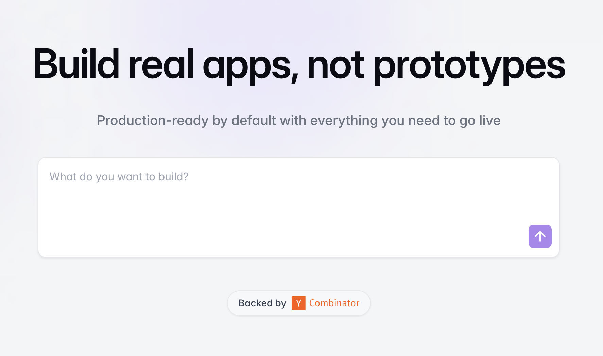
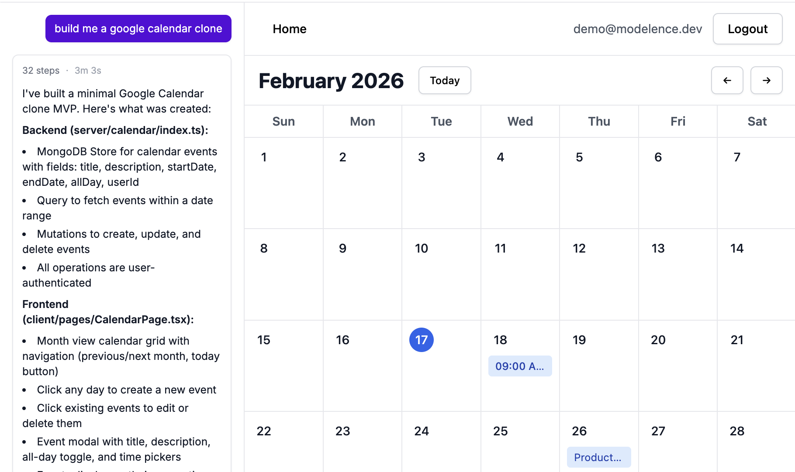
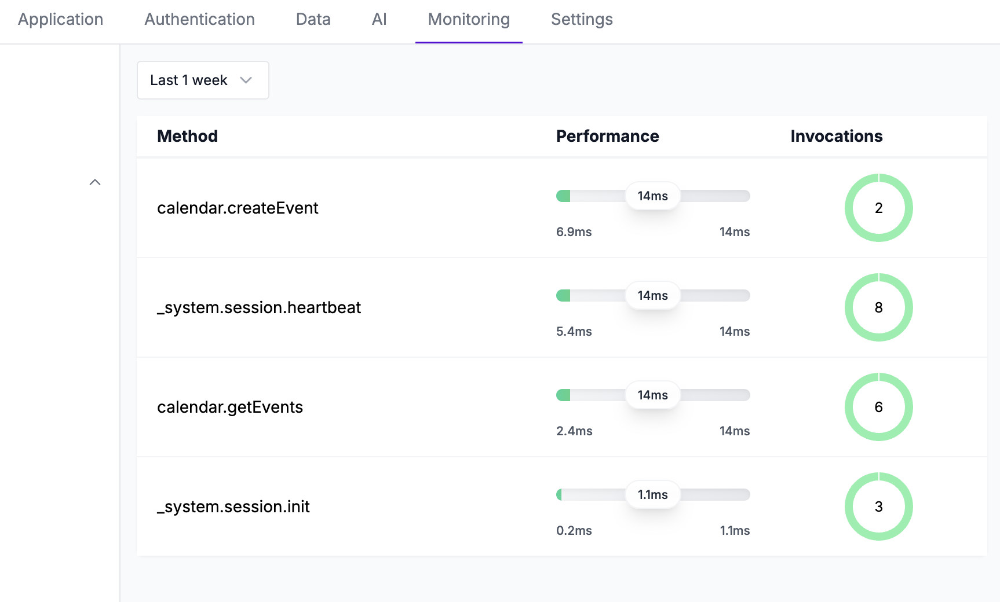

### 🎬 관련 영상
- [🎥 영상 보기](https://ph-files.imgix.net/bd334a62-307a-4999-808f-516659729424.jpeg?auto=format)

---

## 3. [Anima](https://www.producthunt.com/products/anima-app)
**Votes**: 238 | **도입 난이도**: 중 | **신뢰도**: 중
**Tagline**: UX Design Agent | Design to Code
**서비스 링크**: https://www.producthunt.com/r/7UZL47QDXGAL4P

**태그**: Design to Code, AI, Figma, 프론트엔드 개발, UI, Agent, AI Tool, Design, DevTool

### 📌 이 서비스 한눈에 보기
Anima는 AI를 활용하여 디자인 시스템에 맞는 정확한 프론트엔드 코드를 생성, 디자이너가 실제 배포 가능한 UI를 더 빠르고 효율적으로 만들 수 있도록 돕습니다.

### 🔑 주요 기능
- Figma 디자인 파일을 기반으로 코드 생성
- 디자인 시스템에 맞는 코드 자동 생성
- 반응형 UI 코드 지원

### 🙋 사용자에게 어떤 점이 좋은가
Anima를 통해 디자이너는 디자인에서 실제 코드로의 전환 과정을 간소화하고, 브랜드에 맞는 UI를 빠르게 구현하여 개발 시간을 단축할 수 있습니다.

### ✅ 지금 바로 써볼 기능
- Figma 파일 연동하여 코드 생성 테스트
- 생성된 코드의 반응형 기능 확인
- 디자인 시스템 연동 기능 탐색

### ⚠️ 사용 전 확인할 점
- 생성된 코드의 품질 및 유지보수성 검토 필요
- 복잡한 디자인 요소에 대한 코드 생성 정확도 확인 필요

### 🧭 확인이 더 필요한 정보
Anima가 지원하는 디자인 시스템의 범위와 코드 생성 품질에 대한 추가 정보 확인이 필요합니다.

### 📸 스크린샷 및 갤러리

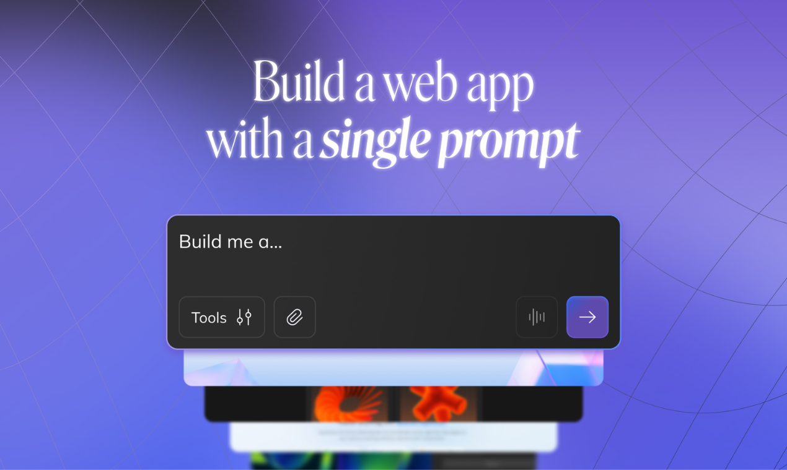
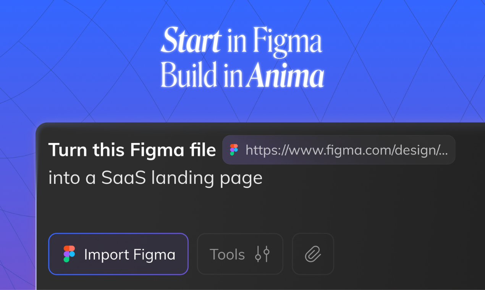

### 🎬 관련 영상
- [🎥 영상 보기](https://ph-files.imgix.net/f55ce9ed-9e58-4130-9d2e-5c934655bec1.jpeg?auto=format)

---

## 4. [Foxchat](https://www.producthunt.com/products/foxchat)
**Votes**: 196 | **도입 난이도**: 하 | **신뢰도**: 중
**Tagline**: Best Intercom alternative for startups and indie hackers
**서비스 링크**: https://www.producthunt.com/r/GVGWVCVNPPDJBK

**태그**: 라이브 채팅, 고객 지원, Slack, 위젯, Chat

### 📌 이 서비스 한눈에 보기
Foxchat은 스타트업과 개인 개발자를 위한 가벼운 Intercom 스타일의 라이브 채팅 위젯으로, Slack에서 실시간으로 고객 응대가 가능하며 5분 안에 설정할 수 있습니다.

### 🔑 주요 기능
- Intercom 대체 가능한 라이브 채팅 위젯
- Slack 연동을 통한 실시간 고객 응대
- 5분 내 빠른 설정

### 🙋 사용자에게 어떤 점이 좋은가
웹사이트에 간편하게 라이브 채팅 기능을 추가하여 고객 문의에 즉각적으로 대응하고, Slack을 통해 효율적인 커뮤니케이션이 가능합니다.

### ✅ 지금 바로 써볼 기능
- 웹사이트에 Foxchat 위젯 설치
- Slack 워크스페이스 연동
- 실시간 고객 응대 시작

### ⚠️ 사용 전 확인할 점
- Slack 연동에 필요한 권한 확인
- 무료 플랜의 기능 제한 확인

### 🧭 확인이 더 필요한 정보
Intercom 대비 기능 차이 및 Slack 연동 안정성 추가 확인 필요.

### 📸 스크린샷 및 갤러리

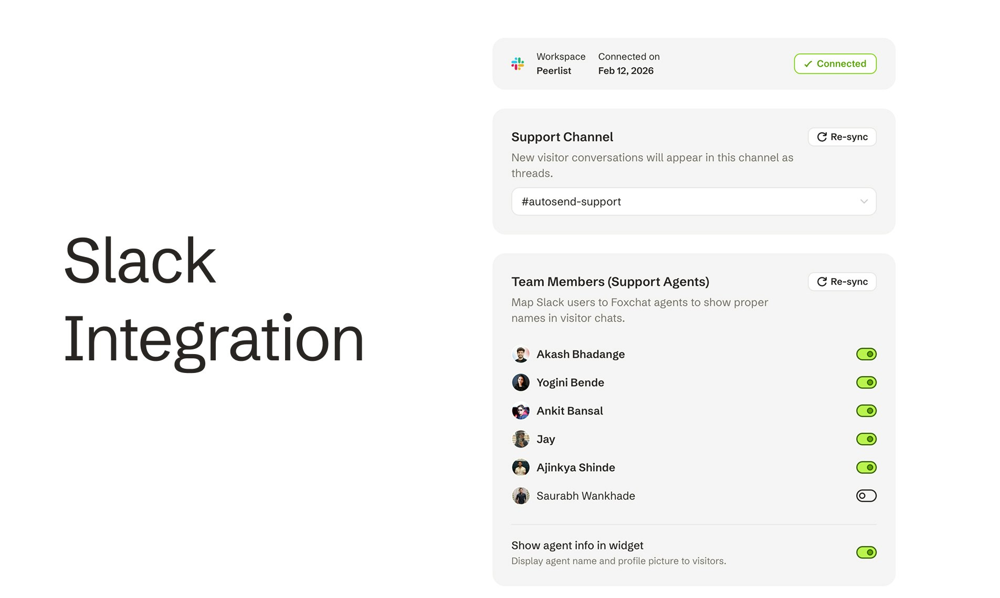
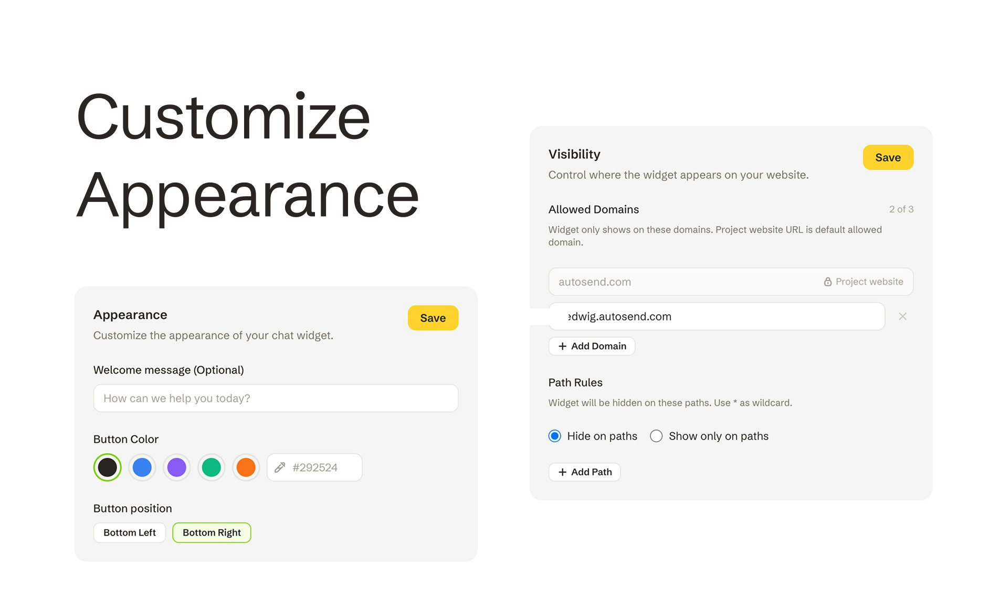

---

## 5. [Orchids 1.0](https://www.producthunt.com/products/orchids)
**Votes**: 149 | **도입 난이도**: 중 | **신뢰도**: 중
**Tagline**: Build any app using your existing AI subscriptions
**서비스 링크**: https://www.producthunt.com/r/F62SP6R6P6PU4Y

**태그**: DevTool, AI, No-code, API, AI Tool, Chat

### 📌 이 서비스 한눈에 보기
기존 AI 구독 서비스(ChatGPT, Claude 등)나 API 키를 활용하여 어떤 앱이든 무료로 구축할 수 있게 해주는 개발 도구입니다.

### 🔑 주요 기능
- 기존 AI 구독 활용: ChatGPT, Claude, Gemini, Github Copilot 등 다양한 AI 서비스 연동
- 무료 사용: API 키만 있으면 무료로 앱 개발 가능
- 다양한 스택 지원: 어떤 앱, 어떤 스택이든 개발 가능

### 🙋 사용자에게 어떤 점이 좋은가
기존에 사용하던 AI 서비스들을 활용하여 앱 개발 비용을 절감하고, 개발 스택에 제약 없이 자유롭게 앱을 만들 수 있습니다.

### ✅ 지금 바로 써볼 기능
- 기존에 사용하던 ChatGPT API 키를 연동하여 간단한 앱 개발 시작
- 다양한 AI 모델을 활용하여 앱 기능 확장
- 개발 스택에 맞춰 Orchids 설정

### ⚠️ 사용 전 확인할 점
- API 키 관리 및 보안에 유의
- AI 서비스 사용량에 따라 비용 발생 가능성 확인

### 🧭 확인이 더 필요한 정보
지원하는 AI 서비스 목록 및 각 서비스별 기능 지원 범위에 대한 추가 확인이 필요합니다.

### 📸 스크린샷 및 갤러리

### 🎬 관련 영상
- [🎥 영상 보기](https://ph-files.imgix.net/5d713dcd-8cda-405f-979a-b82e51e9138e.jpeg?auto=format)

---

## 6. [Liner Write](https://www.producthunt.com/products/liner-write)
**Votes**: 146 | **도입 난이도**: 중 | **신뢰도**: 중
**Tagline**: Cursor for professional writing
**서비스 링크**: https://www.producthunt.com/r/YPC5USPMEIC7IG

**태그**: AI 글쓰기, 생산성, 비즈니스, 문서 작성, Agent, AI Tool

### 📌 이 서비스 한눈에 보기
Liner Write는 Cursor 스타일의 AI 글쓰기 도구로, Liner Deep Research의 정확한 검색을 기반으로 비즈니스 문서 작성에 특화되어 있습니다.

### 🔑 주요 기능
- Cursor 스타일의 AI 글쓰기 에이전트
- Liner Deep Research 기반의 높은 정확도 (95% 이상)
- 비즈니스 문서 (계획, 제안서, 보고서 등) 공동 작성 지원

### 🙋 사용자에게 어떤 점이 좋은가
Liner Write를 사용하면 전문적인 문서 작성 시 AI의 도움을 받아 효율성을 높이고, 높은 정확도를 바탕으로 오류를 줄일 수 있습니다.

### ✅ 지금 바로 써볼 기능
- 비즈니스 계획 초안 작성에 사용해보기
- 보고서 작성 시 필요한 정보 검색에 Liner Deep Research 활용해보기
- 제안서 작성 시 문장 개선 기능 사용해보기

### ⚠️ 사용 전 확인할 점
- Liner Deep Research의 정확도가 높지만, 결과의 사실 여부를 반드시 확인해야 함
- AI가 생성한 문장을 검토하여 문맥에 맞게 수정해야 함

### 🧭 확인이 더 필요한 정보
Liner Deep Research의 데이터 최신성에 대한 추가 확인이 필요합니다.

### 📸 스크린샷 및 갤러리

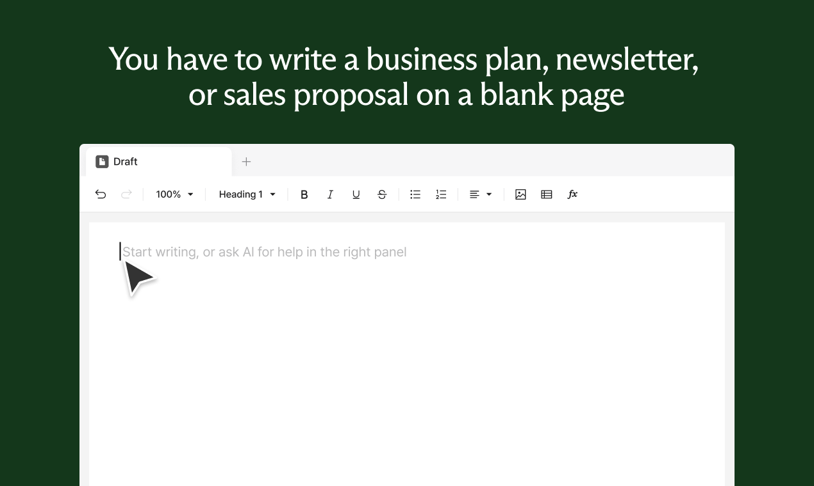
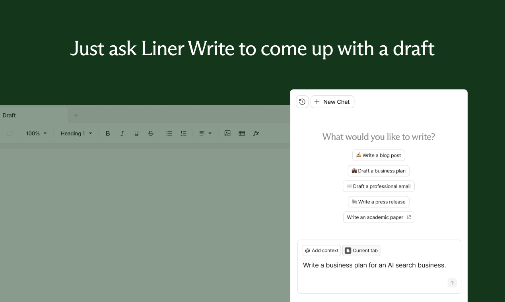

### 🎬 관련 영상
- [🎥 영상 보기](https://ph-files.imgix.net/5c369e2f-90ab-44a9-9746-6a860a581b60.jpeg?auto=format)

---

## 7. [What YC Is Really Betting On?](https://www.producthunt.com/products/what-yc-is-really-betting-on)
**Votes**: 134 | **도입 난이도**: 하 | **신뢰도**: 중
**Tagline**: An X-ray of 793 YC startups
**서비스 링크**: https://www.producthunt.com/r/V6CYGRRE2IZWQR

**태그**: 스타트업, YC, 투자, 데이터 분석, 트렌드

### 📌 이 서비스 한눈에 보기
최근 YC 스타트업 793개의 데이터와 창업자 1,625명의 정보를 분석하여, YC가 투자하는 산업 동향, 창업자 특징, 파트너의 선택 기준 등 흥미로운 통계 및 인사이트를 무료로 제공합니다.

### 🔑 주요 기능
- YC 스타트업의 산업별 분포 및 성장/쇠퇴 추세 분석
- YC 창업자들의 공통적인 특징 및 통계적 프로필 제공
- YC 파트너들의 투자 결정 기준 및 선호하는 유형 분석

### 🙋 사용자에게 어떤 점이 좋은가
YC에 관심 있는 창업가, 투자자, 또는 스타트업 생태계 관계자들에게 유용한 정보를 제공하여, YC의 트렌드를 파악하고 전략을 수립하는 데 도움을 줄 수 있습니다.

### ✅ 지금 바로 써볼 기능
- 인터랙티브 차트를 통해 관심 있는 산업 분야의 동향을 확인해 보세요.
- YC 창업자 프로필 분석을 통해 자신의 강점과 약점을 비교해 보세요.
- YC 파트너 유형 분석을 통해 투자 유치 전략을 구상해 보세요.

### ⚠️ 사용 전 확인할 점
- 데이터는 과거 정보를 기반으로 하므로, 미래의 트렌드를 정확하게 예측하지 못할 수 있습니다.
- 분석 결과는 일반적인 경향을 나타내므로, 개별 스타트업의 성공을 보장하지 않습니다.

### 🧭 확인이 더 필요한 정보
분석에 사용된 데이터의 최신성 및 정확성에 대한 추가 확인이 필요합니다.

### 📸 스크린샷 및 갤러리
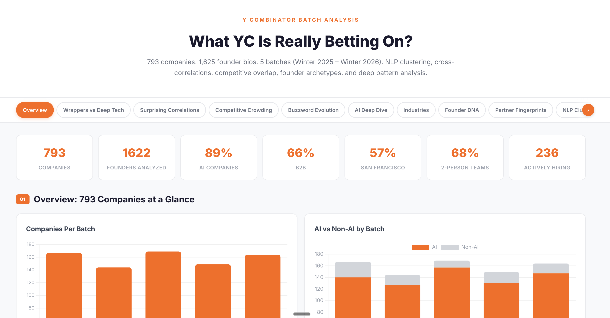
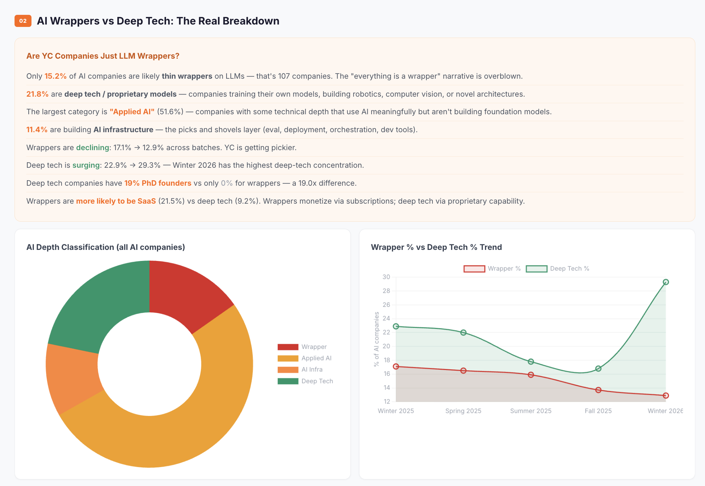
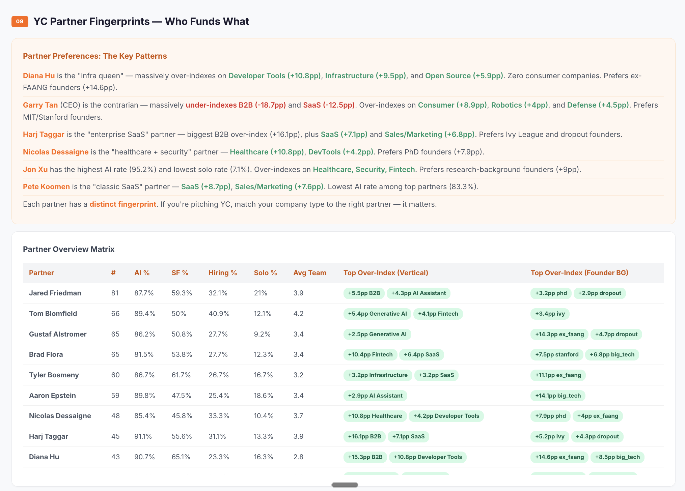

---

## 8. [Toggle for OpenClaw](https://www.producthunt.com/products/togglex-openclaw)
**Votes**: 126 | **도입 난이도**: 중 | **신뢰도**: 중
**Tagline**: Your browser activity, streamed to your agent in real time
**서비스 링크**: https://www.producthunt.com/r/2MOCAHPQL7Y7H7

**태그**: AI 에이전트, 자동화, 생산성, 브라우저 확장, 작업 맥락, Agent, AI Tool, Prompting, DevTool

### 📌 이 서비스 한눈에 보기
Toggle for OpenClaw는 브라우저 활동을 실시간으로 AI 에이전트에 전달하여, 에이전트가 사용자의 작업 맥락을 정확히 파악하고 더 나은 결과물을 제공하도록 돕습니다.

### 🔑 주요 기능
- 브라우저 활동을 실시간으로 AI 에이전트에 스트리밍
- 프로젝트, 세션, 의사 결정 등 구조화된 작업 맥락 제공
- 에이전트가 사용자의 현재 작업 상황을 정확히 파악

### 🙋 사용자에게 어떤 점이 좋은가
더 이상 에이전트에게 작업 내용을 반복적으로 설명할 필요 없이, 항상 최신 정보를 바탕으로 작업을 시작할 수 있습니다. 5분 설치로 30일 무료 체험이 가능합니다.

### ✅ 지금 바로 써볼 기능
- OpenClaw와 Toggle 연동하여 사용해보기
- 브라우저 활동 스트리밍 설정하기
- AI 에이전트에게 작업 지시 후 결과 비교해보기

### ⚠️ 사용 전 확인할 점
- OpenClaw 에이전트와의 호환성 확인 필요
- 브라우저 활동 데이터 스트리밍으로 인한 개인 정보 보호 고려

### 🧭 확인이 더 필요한 정보
Toggle for OpenClaw가 지원하는 브라우저 및 OpenClaw 에이전트 버전을 확인해야 합니다.

### 📸 스크린샷 및 갤러리
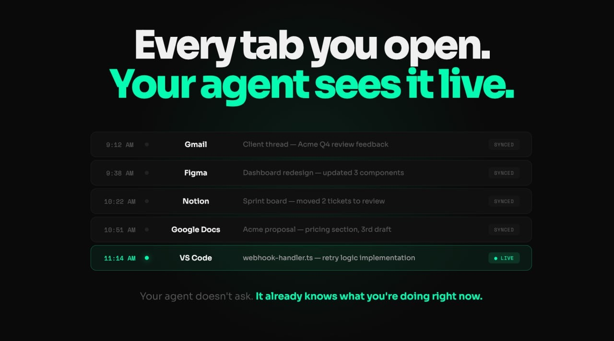
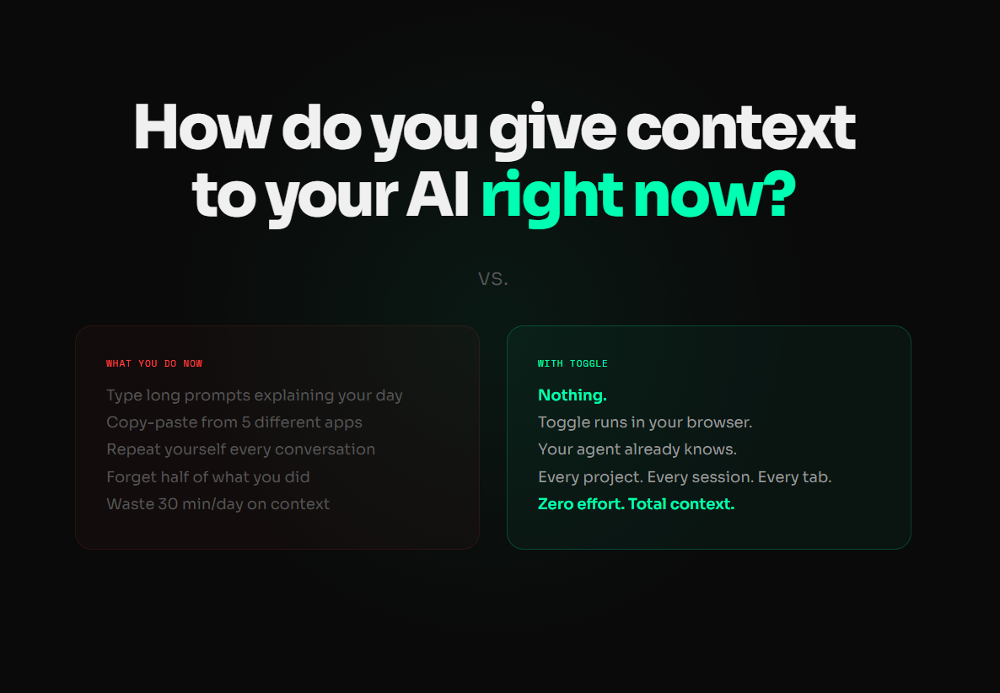
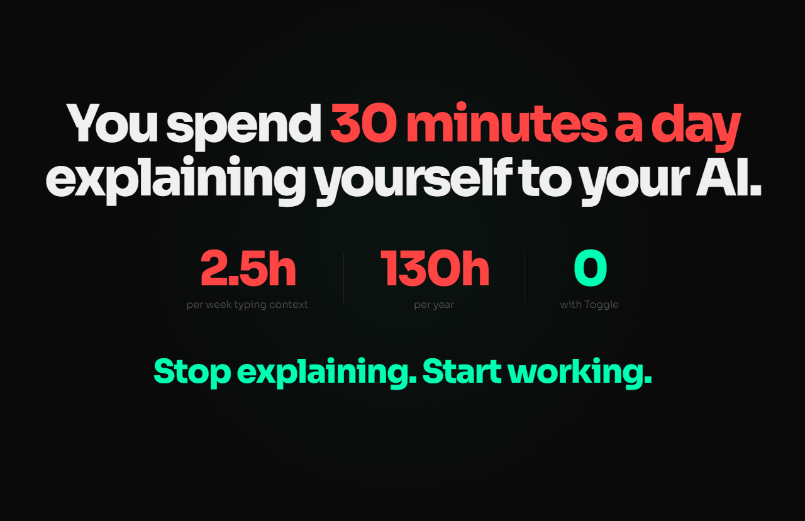

### 🎬 관련 영상
- [🎥 영상 보기](https://ph-files.imgix.net/5eb729dd-1636-40c9-a14b-8bea890cf730.jpeg?auto=format)

---

## 9. [Just The Article Please](https://www.producthunt.com/products/just-the-article-please)
**Votes**: 109 | **도입 난이도**: 하 | **신뢰도**: 중
**Tagline**: A simple article reader for the web
**서비스 링크**: https://www.producthunt.com/r/J77DJJNH7LRPZL

**태그**: 생산성, 웹, 리더

### 📌 이 서비스 한눈에 보기
웹페이지의 복잡한 광고나 불필요한 요소를 제거하고 핵심 내용만 깔끔하게 보여주는 웹 서비스입니다.

### 🔑 주요 기능
- 광고 및 불필요한 요소 제거
- 깔끔한 가독성 제공
- URL 앞에 'justthearticleplease.com/' 또는 'jtap.cc/' 추가하여 사용

### 🙋 사용자에게 어떤 점이 좋은가
웹페이지의 핵심 내용에 집중하고 싶을 때, 광고나 불필요한 디자인 요소 없이 깔끔하게 기사를 읽을 수 있어 편리합니다.

### ✅ 지금 바로 써볼 기능
- 웹사이트 방문하여 URL 입력해보기
- URL 앞에 'justthearticleplease.com/' 추가하여 사용해보기
- "Copy just the article link" 기능으로 공유해보기

### ⚠️ 사용 전 확인할 점
- 웹페이지 구조에 따라 제대로 동작하지 않을 수 있음
- 이미지나 비디오 등 미디어 콘텐츠 지원 여부 확인 필요

### 🧭 확인이 더 필요한 정보
어떤 알고리즘으로 핵심 내용을 추출하는지, 그리고 모든 웹사이트에 대해 얼마나 정확하게 동작하는지 추가 확인이 필요합니다.

### 📸 스크린샷 및 갤러리
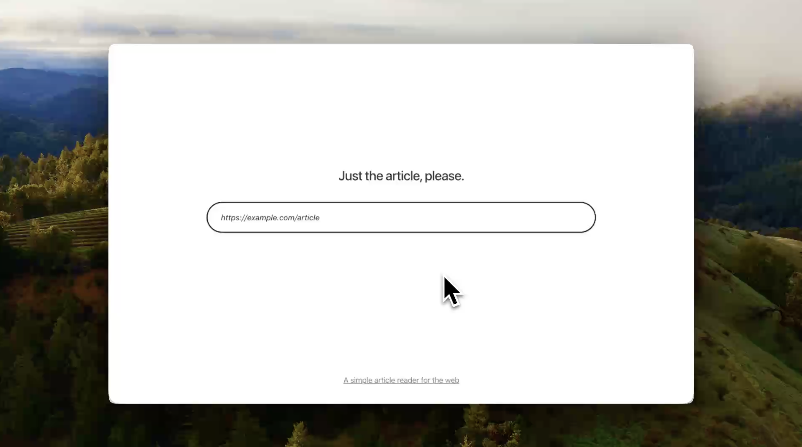
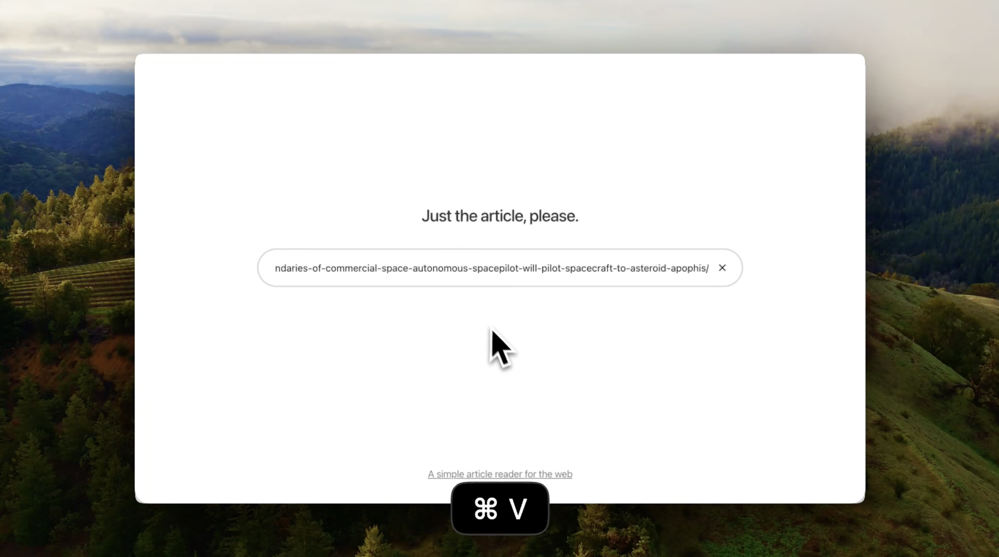
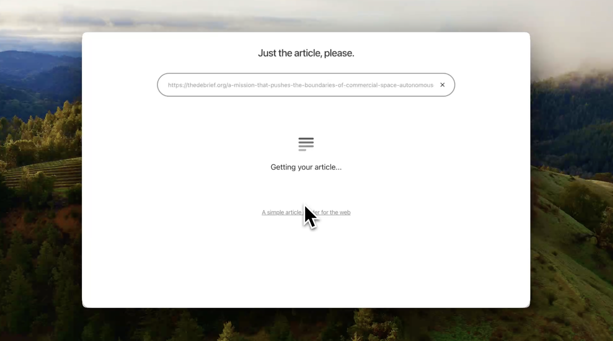

### 🎬 관련 영상
- [🎥 영상 보기](https://ph-files.imgix.net/355f2668-75de-47c5-9659-61bc03867d4a.jpeg?auto=format)

---

## 10. [Bazaar V4](https://www.producthunt.com/products/bazaar-2)
**Votes**: 109 | **도입 난이도**: 중 | **신뢰도**: 중
**Tagline**: AI motion graphics and video generator 
**서비스 링크**: https://www.producthunt.com/r/CKDHH7J5YE6QSG

**태그**: AI, 비디오 생성, 모션 그래픽, 데모 비디오, 자동화, Agent, AI Tool, Video

### 📌 이 서비스 한눈에 보기
Bazaar V4는 AI 기반 모션 그래픽 및 비디오 생성기로, 특히 소프트웨어 데모 비디오 제작에 특화된 다양한 생성 AI 도구를 제공하여 사용자가 쉽게 애니메이션 데모 비디오를 만들 수 있도록 돕습니다.

### 🔑 주요 기능
- Remotion을 기반으로 3만 개 이상의 소프트웨어 데모 비디오로 미세 조정됨
- Agentic 비디오 편집기인 Bazaar Agent 출시
- 다양한 생성 AI 도구로 구성된 풀 크리에이티브 스위트 제공

### 🙋 사용자에게 어떤 점이 좋은가
소프트웨어 데모 비디오를 빠르고 쉽게 제작할 수 있어 시간과 노력을 절약해주며, 특히 애니메이션 효과를 통해 더욱 매력적인 콘텐츠를 만들 수 있습니다.

### ✅ 지금 바로 써볼 기능
- Bazaar Agent를 사용하여 에이전트 기반 비디오 편집 경험해보기
- 제공되는 다양한 생성 AI 도구들을 활용하여 창의적인 비디오 제작 시도해보기
- 소프트웨어 데모 비디오 제작에 활용하여 효율성 향상시키기

### ⚠️ 사용 전 확인할 점
- AI 생성 결과물의 품질은 학습 데이터에 따라 달라질 수 있음
- 특정 소프트웨어나 데모 스타일에 최적화되어 있을 수 있음

### 🧭 확인이 더 필요한 정보
Bazaar V4의 구체적인 가격 정책 및 지원하는 비디오 포맷에 대한 추가 정보 확인이 필요합니다.

### 📸 스크린샷 및 갤러리
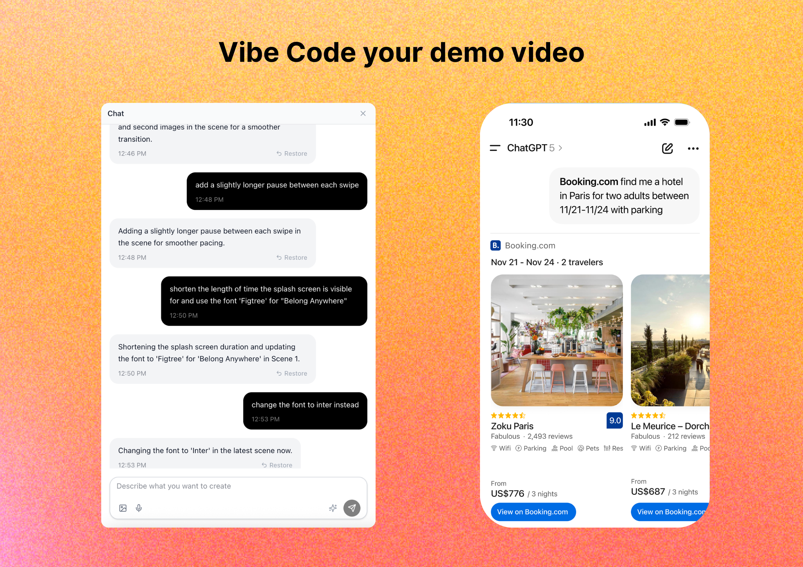
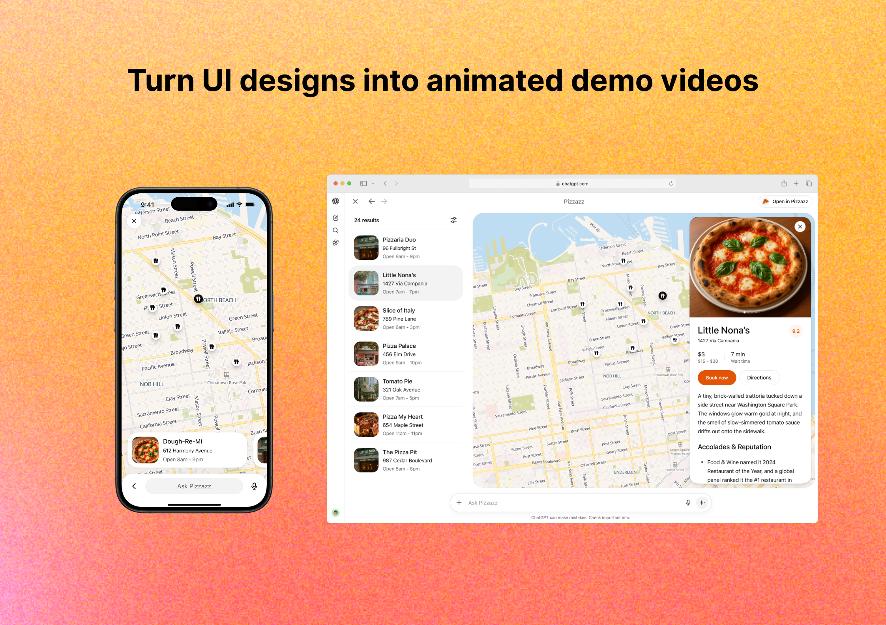
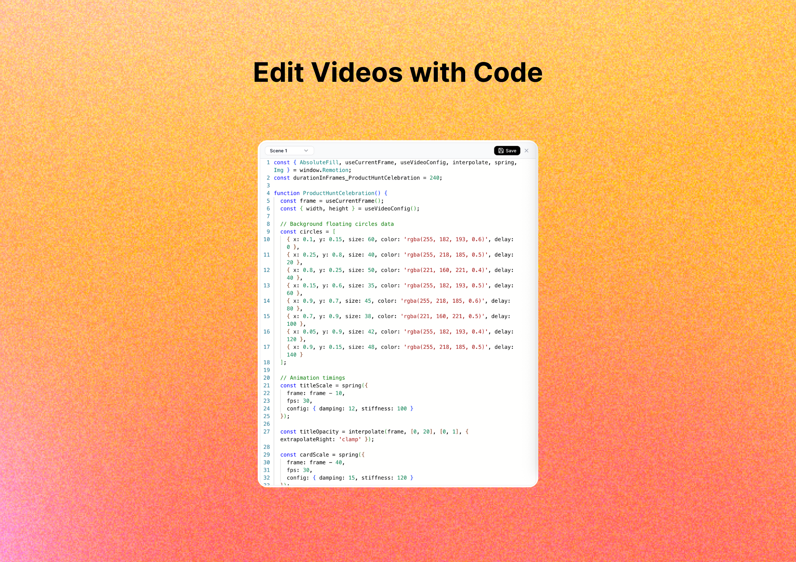

### 🎬 관련 영상
- [🎥 영상 보기](https://ph-files.imgix.net/fa7d3054-8bb9-4000-bf27-f98784a0e77a.jpeg?auto=format)

---

