# 🚀 Product Hunt Daily Top 10 (2026-02-26)

## 1. [KiloClaw](https://www.producthunt.com/products/kiloclaw)
**Votes**: 475 | **도입 난이도**: 중 | **신뢰도**: 중
**Tagline**: Hosted OpenClaw. No Mac mini required.
**서비스 링크**: https://www.producthunt.com/r/3UMQDS2622AQCL

**태그**: AI 에이전트, 호스팅, 자동화, 개발 도구, Agent, AI Tool, Security

### 📌 이 서비스 한눈에 보기
KiloClaw는 가장 인기 있는 오픈 소스 AI 에이전트인 OpenClaw를 호스팅하여 사용자가 인프라 관리 부담 없이 에이전트의 기능에 집중할 수 있도록 돕습니다.

### 🔑 주요 기능
- OpenClaw의 완전 관리형 호스팅 버전
- 인프라, 보안, 업데이트, 모니터링 자동 관리
- 사용자는 에이전트의 핵심 기능 개발에 집중 가능

### 🙋 사용자에게 어떤 점이 좋은가
OpenClaw를 직접 운영하는 데 드는 어려움을 해소하고, 사용자가 AI 에이전트의 활용에만 집중할 수 있도록 지원하여 생산성을 향상시킵니다.

### ✅ 지금 바로 써볼 기능
- KiloClaw를 통해 OpenClaw 에이전트 즉시 배포
- 인프라 관리 없이 에이전트 기능 개발에 집중
- 자동 업데이트 및 보안 기능 활용

### ⚠️ 사용 전 확인할 점
- OpenClaw의 기능 및 성능에 대한 이해 필요
- KiloClaw의 호스팅 환경에 대한 의존성 발생 가능

### 🧭 확인이 더 필요한 정보
KiloClaw의 구체적인 가격 정책 및 기술 지원 수준에 대한 추가 정보 확인이 필요합니다.

### 📸 스크린샷 및 갤러리

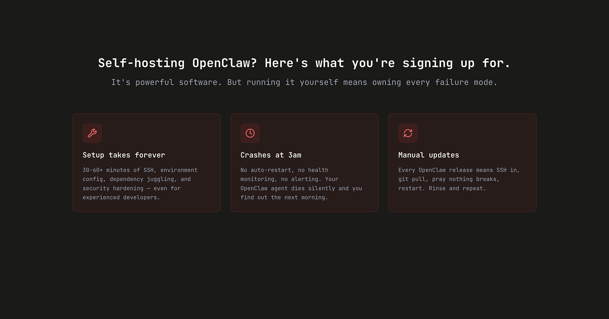
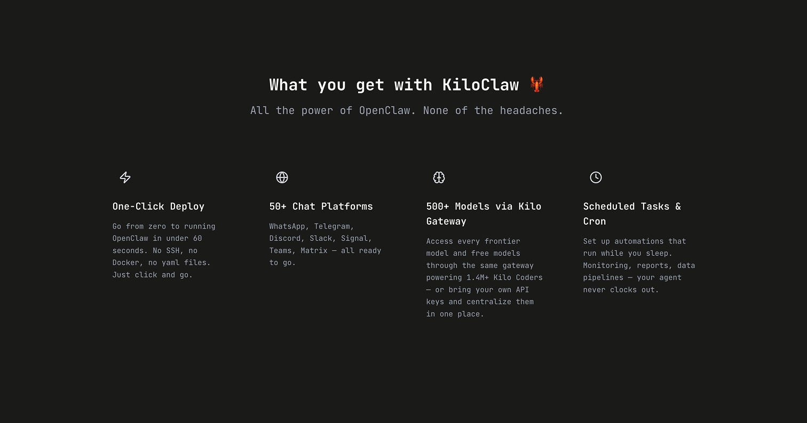

### 🎬 관련 영상
- [🎥 영상 보기](https://ph-files.imgix.net/c91a55c4-d340-470a-86dd-e1fb73a37d8d.jpeg?auto=format)

---

## 2. [Notion Custom Agents](https://www.producthunt.com/products/notion)
**Votes**: 249 | **도입 난이도**: 중 | **신뢰도**: 중
**Tagline**: Anything you can do in Notion, your Agent can do for you.
**서비스 링크**: https://www.producthunt.com/r/JVW32FVUHJJTJU

**태그**: Notion, AI, 자동화, 생산성, Agent, AI Tool

### 📌 이 서비스 한눈에 보기
Notion Custom Agents는 Notion 내에서 사용자의 업무를 자동화해주는 AI 팀원입니다.

### 🔑 주요 기능
- Notion 내 작업 자동화
- 자율적인 AI 에이전트
- 팀 협업에 용이

### 🙋 사용자에게 어떤 점이 좋은가
반복적인 업무를 자동화하여 시간을 절약하고, 팀원들은 더 중요한 일에 집중할 수 있습니다. 버그 보고, 문서 업데이트, 질문 응답, 보고서 초안 작성 등을 자동화할 수 있습니다.

### ✅ 지금 바로 써볼 기능
- 자동화할 작업 할당
- 트리거 또는 스케줄 설정
- 팀원들에게 에이전트 공유

### ⚠️ 사용 전 확인할 점
- 자동화 설정의 정확성 확인
- AI 에이전트의 판단 오류 가능성 고려

### 🧭 확인이 더 필요한 정보
AI 에이전트의 성능과 자동화 범위에 대한 추가 정보 확인이 필요합니다.

### 📸 스크린샷 및 갤러리
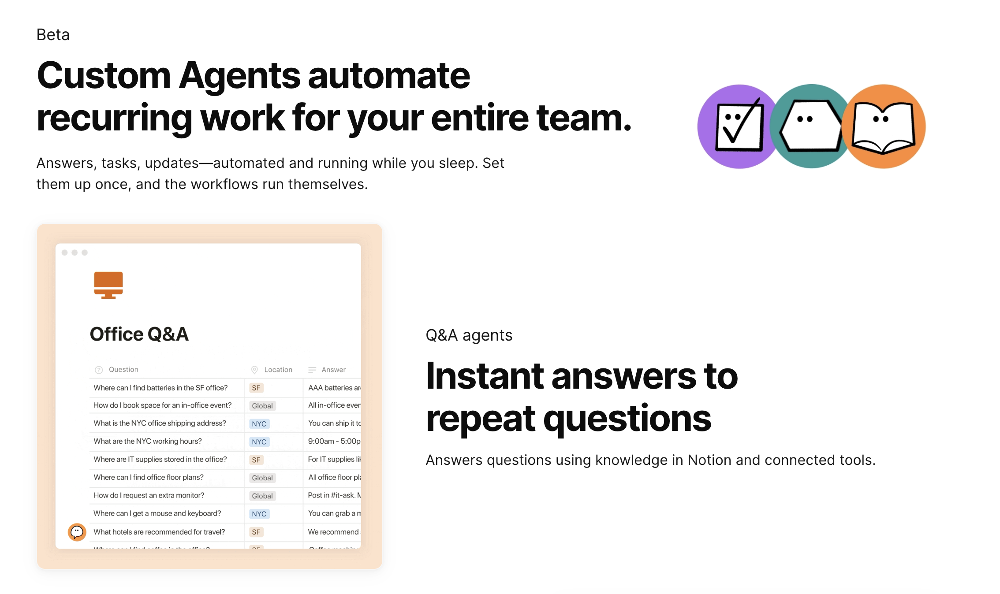
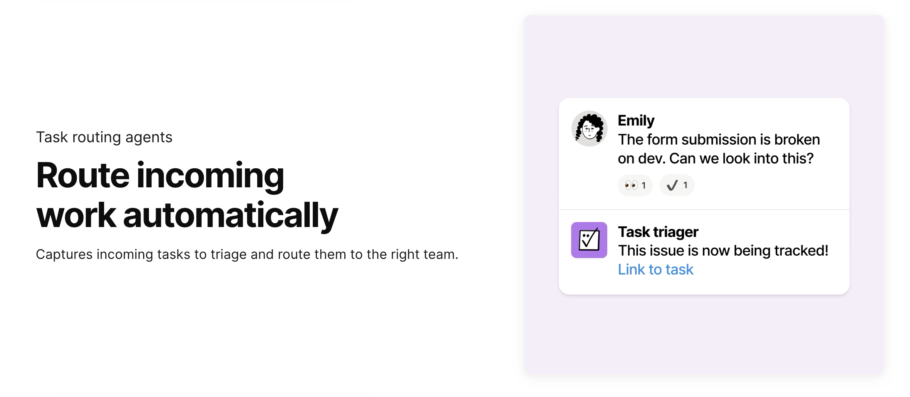
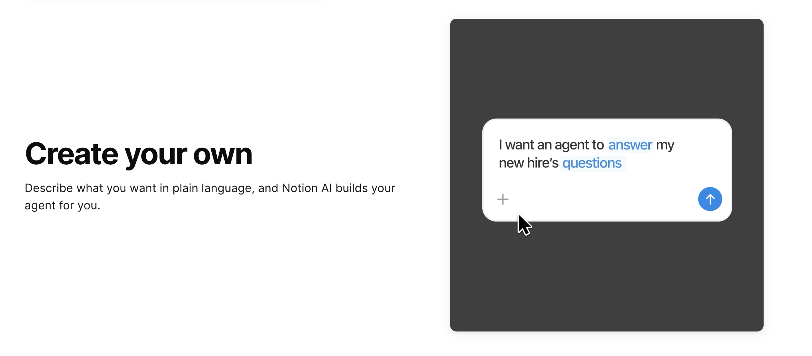

### 🎬 관련 영상
- [🎥 영상 보기](https://ph-files.imgix.net/96f60f04-e4a4-424c-9039-81e85c71b891.jpeg?auto=format)

---

## 3. [Opal 2.0 by Google Labs ](https://www.producthunt.com/products/google)
**Votes**: 222 | **도입 난이도**: 중 | **신뢰도**: 중
**Tagline**: Now with smart agent, memory, routing and interactive chat
**서비스 링크**: https://www.producthunt.com/r/UZOWMTGYKECYVV

**태그**: AI, No-code, Workflow, Automation, Agent, AI Tool, Chat, Video, DevTool

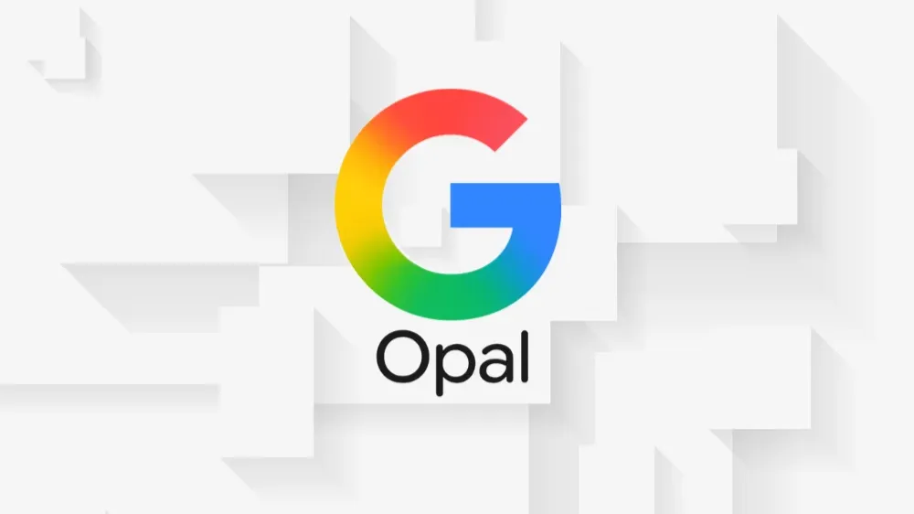

### 📌 이 서비스 한눈에 보기
Opal 2.0은 AI 워크플로우를 위한 노코드 비주얼 빌더로, 스마트 에이전트, 메모리, 라우팅, 인터랙티브 채팅 기능이 추가되어 더욱 강력해졌습니다.

### 🔑 주요 기능
- 목표 분석 및 최적의 도구 자동 호출 (Veo, 웹 검색 등)
- 메모리 기능으로 이전 대화 내용 기억
- 동적 라우팅으로 상황에 맞는 경로 설정

### 🙋 사용자에게 어떤 점이 좋은가
코딩 없이 AI 워크플로우를 구축하고 자동화하여 생산성을 높일 수 있으며, 다양한 도구와 연동하여 복잡한 작업도 쉽게 처리할 수 있습니다.

### ✅ 지금 바로 써볼 기능
- 새로운 에이전트 스텝을 활용하여 목표 기반 자동화 워크플로우 구축
- 메모리 기능을 활용하여 이전 대화 내용을 바탕으로 작업 진행
- 동적 라우팅을 통해 상황에 맞는 최적의 경로 설정

### ⚠️ 사용 전 확인할 점
- 자동으로 호출되는 도구의 정확성 및 성능 확인 필요
- 복잡한 워크플로우의 경우 예상치 못한 결과 발생 가능성 고려

### 🧭 확인이 더 필요한 정보
Veo와 같은 특정 도구의 성능 및 Opal과의 호환성에 대한 추가 정보 확인이 필요합니다.

### 📸 스크린샷 및 갤러리
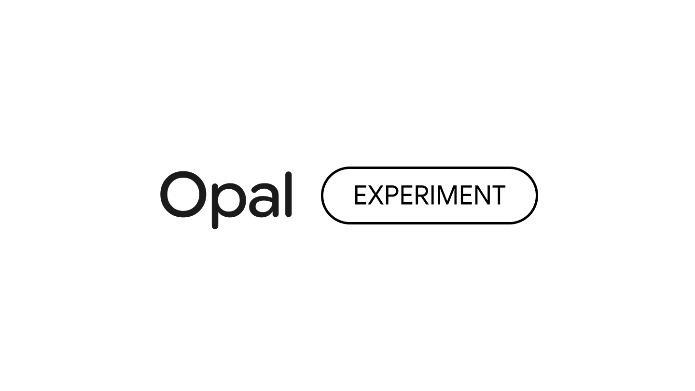
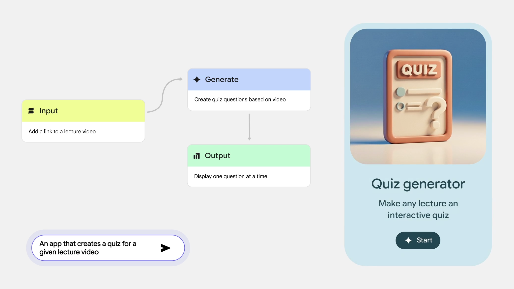
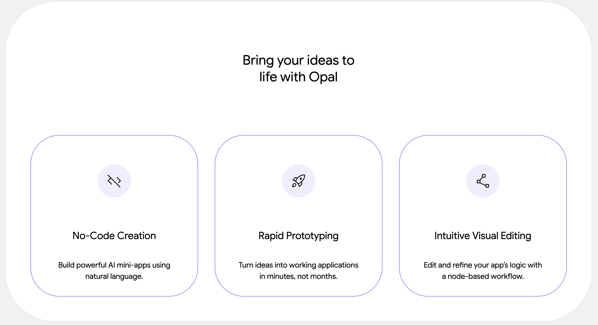

### 🎬 관련 영상
- [🎥 영상 보기](https://ph-files.imgix.net/0d37e9aa-a342-4551-9b32-8ba23ca416c4.jpeg?auto=format)

---

## 4. [Arzule](https://www.producthunt.com/products/arzule)
**Votes**: 164 | **도입 난이도**: 중 | **신뢰도**: 중
**Tagline**: Turn partnerships into predictable revenue with AI 
**서비스 링크**: https://www.producthunt.com/r/S3OS3736RC7KBP

**태그**: AI, 파트너십, SaaS, 자동화, 데이터 분석, AI Tool

### 📌 이 서비스 한눈에 보기
Arzule는 AI를 활용하여 B2B SaaS 기업의 파트너십을 통한 수익 성장을 최적화합니다. 데이터 기반으로 파트너십 기회를 발굴하고 자동화하여 예측 가능한 수익 채널로 만들어줍니다.

### 🔑 주요 기능
- AI 기반 파트너십 기회 발굴 및 우선순위 설정
- 데이터 기반 액션 추천 및 인센티브 최적화
- 파트너십 확장 자동화

### 🙋 사용자에게 어떤 점이 좋은가
스프레드시트와 추측에 의존하던 파트너십 관리를 데이터 기반 시스템으로 전환하여, 더 효율적이고 예측 가능한 수익 성장을 가능하게 합니다.

### ✅ 지금 바로 써볼 기능
- 파트너십 생태계 분석 및 잠재적 수익 기회 식별
- AI 기반 추천 액션 활용하여 파트너십 전략 개선
- 데이터 기반 인센티브 최적화로 파트너 참여 유도

### ⚠️ 사용 전 확인할 점
- AI 분석의 정확성을 위해 충분한 데이터 확보 필요
- 파트너십 생태계의 특성을 고려한 맞춤형 전략 수립 필요

### 🧭 확인이 더 필요한 정보
Arzule의 AI가 제공하는 추천의 정확도와 실제 수익 증대 효과에 대한 추가적인 사용 사례 확인이 필요합니다.

### 📸 스크린샷 및 갤러리
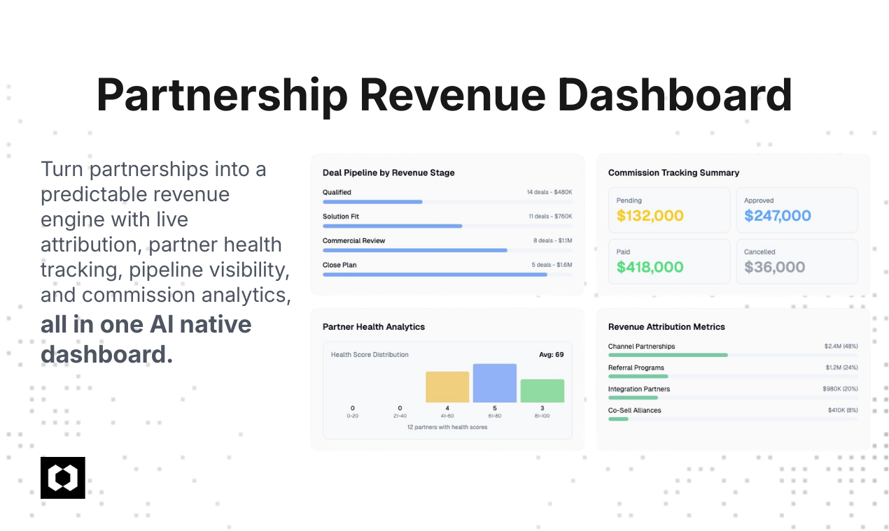
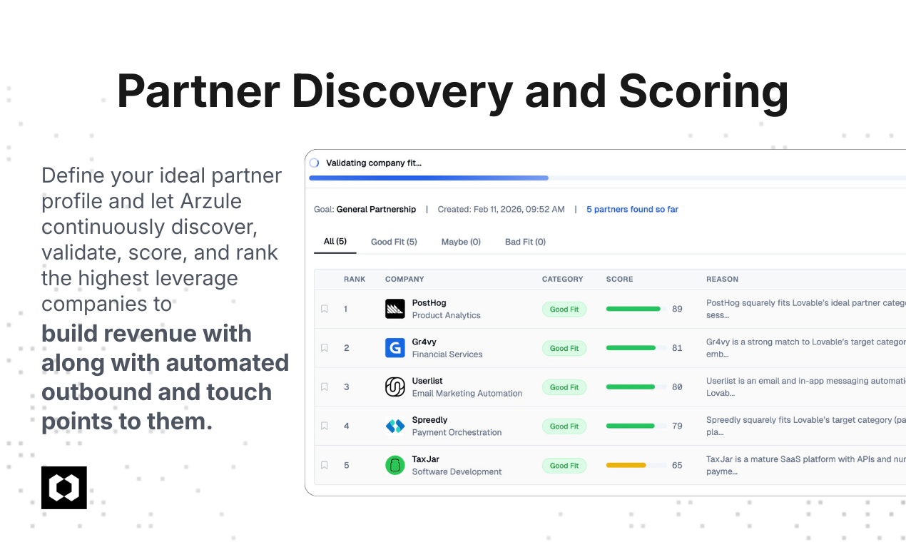
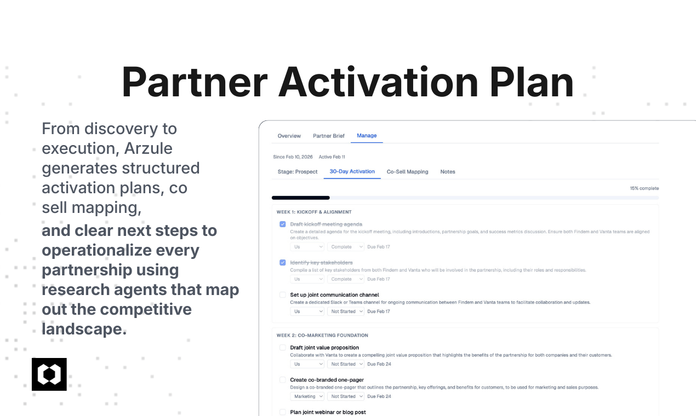

### 🎬 관련 영상
- [🎥 영상 보기](https://ph-files.imgix.net/fb0e3809-5c91-4388-a1be-8306c6ca0eb0.jpeg?auto=format)

---

## 5. [floors.js](https://www.producthunt.com/products/floors-js)
**Votes**: 150 | **도입 난이도**: 하 | **신뢰도**: 중
**Tagline**: Turn your website into Habbo Hotel - one script tag
**서비스 링크**: https://www.producthunt.com/r/YA24YPQWQIYDNX

**태그**: 3D, 채팅, 아바타, 웹사이트, 실시간, Chat

### 📌 이 서비스 한눈에 보기
단 한 줄의 스크립트 추가로 웹사이트를 'Habbo Hotel'처럼 바꿔 방문자들의 몰입도를 높이고 실시간 채팅 기능을 제공합니다.

### 🔑 주요 기능
- 간단한 스크립트 삽입으로 웹사이트를 3D 공간으로 변환
- 방문자들은 3D 아바타로 표현
- 실시간 채팅 기능 제공으로 사용자 간 상호작용 증진

### 🙋 사용자에게 어떤 점이 좋은가
웹사이트를 더욱 생동감 있게 만들고 사용자 참여를 유도하여, 방문자 경험을 향상시킬 수 있습니다. 별도의 설정이나 가입 절차 없이 바로 사용할 수 있다는 점이 편리합니다.

### ✅ 지금 바로 써볼 기능
- 데모 웹사이트에서 아바타 움직임 체험해보기
- 실제 웹사이트에 스크립트 태그 삽입 후 변화 확인하기
- 채팅 기능을 통해 사용자들과 소통해보기

### ⚠️ 사용 전 확인할 점
- 웹사이트 디자인과의 조화 고려 필요
- 과도한 3D 효과가 사용자 경험을 저해할 가능성

### 🧭 확인이 더 필요한 정보
실제 웹사이트에 적용했을 때의 성능 및 사용자 반응에 대한 추가적인 검증이 필요합니다.

### 📸 스크린샷 및 갤러리
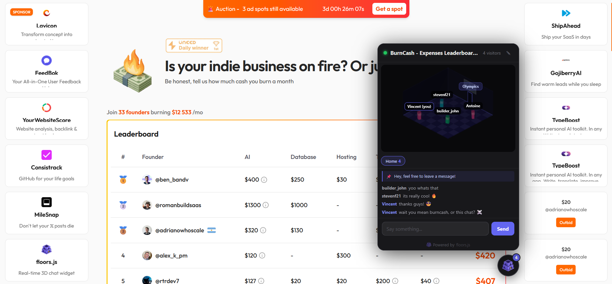
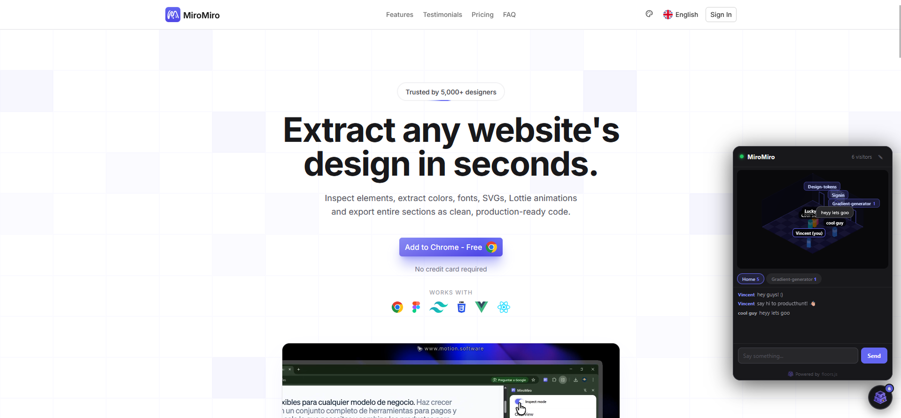
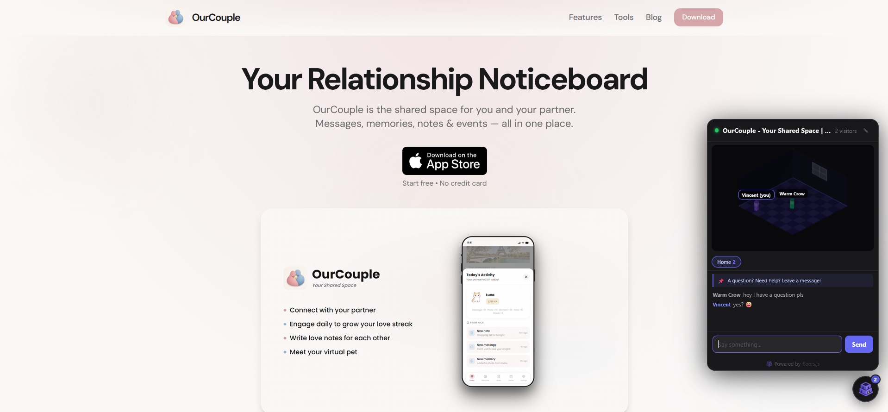

### 🎬 관련 영상
- [🎥 영상 보기](https://ph-files.imgix.net/651b384b-79dd-4e04-804a-b77f1263e9e2.jpeg?auto=format)

---

## 6. [Ask Fellow](https://www.producthunt.com/products/fellow-app)
**Votes**: 141 | **도입 난이도**: 중 | **신뢰도**: 중
**Tagline**: Automate post-meeting actions from documentation to emails
**서비스 링크**: https://www.producthunt.com/r/5J72OZPHEPO43G

**태그**: 생산성, 자동화, 회의, 협업, AI Tool, Video, Email

### 📌 이 서비스 한눈에 보기
Ask Fellow는 회의 전, 중, 후에 필요한 작업을 자동화하여 회의 관련 업무 시간을 줄여주고 중요한 업무에 집중할 수 있도록 돕습니다.

### 🔑 주요 기능
- 원클릭으로 회의 후속 이메일 초안 작성
- 회의 영상 클립 생성 및 공유
- Notion, Confluence, Google Docs로 문서 내보내기

### 🙋 사용자에게 어떤 점이 좋은가
회의 후속 작업에 소요되는 시간을 줄여주고, 회의 내용을 효율적으로 관리하여 생산성을 향상시킵니다.

### ✅ 지금 바로 써볼 기능
- 원클릭 이메일 초안 기능 사용해보기
- 회의 영상 클립 생성 및 공유 기능 사용해보기
- 문서 내보내기 기능 사용해보기

### ⚠️ 사용 전 확인할 점
- 지원하는 회의 플랫폼 및 문서 도구 확인 필요
- 자동화 기능의 정확도 및 사용자 설정 옵션 확인 필요

### 🧭 확인이 더 필요한 정보
Ask Fellow가 실제로 회의 관련 업무 시간을 얼마나 단축시켜주는지 사용 후기 확인이 필요합니다.

### 📸 스크린샷 및 갤러리
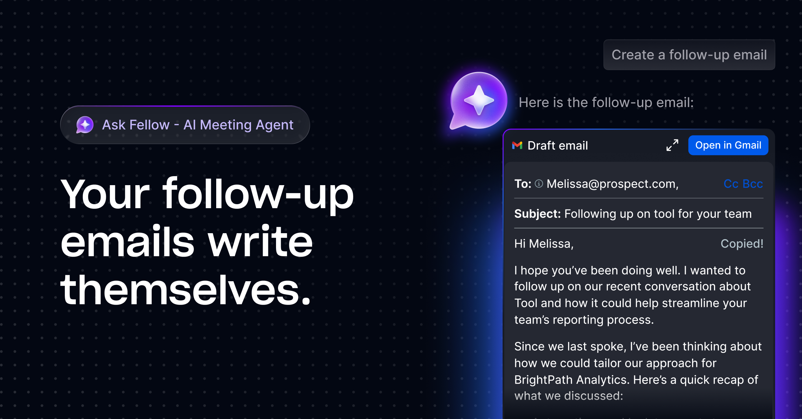
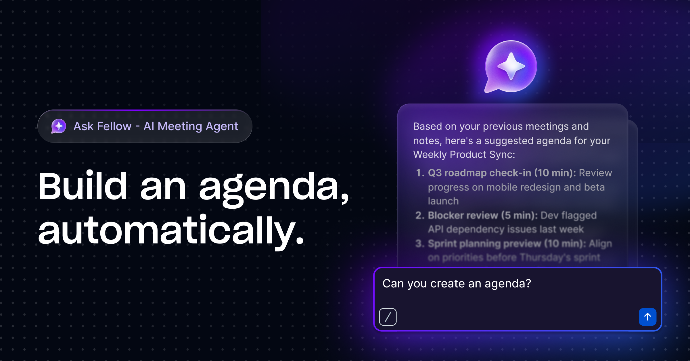
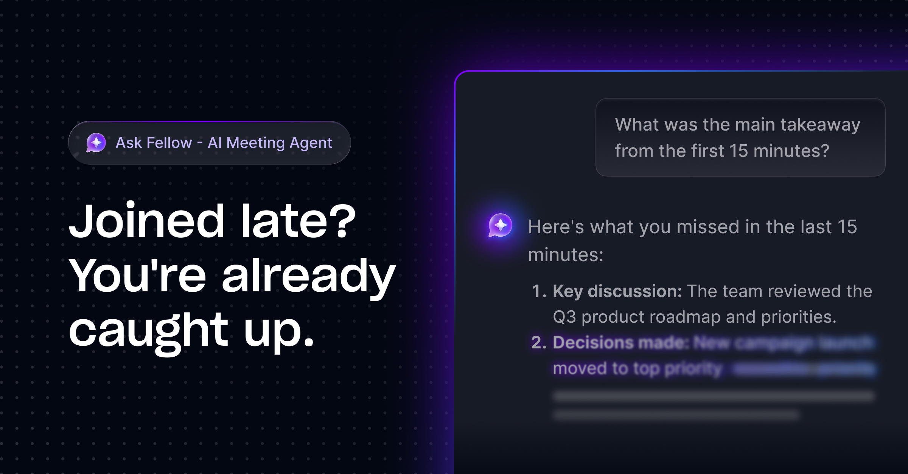

---

## 7. [DemoMe](https://www.producthunt.com/products/demome)
**Votes**: 138 | **도입 난이도**: 중 | **신뢰도**: 상
**Tagline**: Turn screen recordings into polished demo videos instantly
**서비스 링크**: https://www.producthunt.com/r/DTBYM23U4WWJKS

**태그**: 비디오 편집, 데모 제작, 개발 도구, 자동화, Video, DevTool

### 📌 이 서비스 한눈에 보기
DemoMe는 인디 개발자가 스크린 레코딩과 스크린샷을 사용하여 순식간에 멋진 데모 비디오를 만들 수 있도록 도와줍니다. 클라우드 업로드 없이 로컬에서 실행되어 빠르고 일관성 있는 결과물을 얻을 수 있습니다.

### 🔑 주요 기능
- 스크린 레코딩 및 스크린샷 기반 데모 비디오 제작
- 빠르고 일관성 있는 결과물
- 클라우드 업로드 없이 로컬에서 실행

### 🙋 사용자에게 어떤 점이 좋은가
App Store 미리보기, Product Hunt 런칭, 랜딩 페이지, 소셜 미디어 게시물 등 다양한 곳에 활용할 수 있는 데모 비디오를 빠르게 제작하여 출시 속도를 높일 수 있습니다.

### ✅ 지금 바로 써볼 기능
- 스크린 레코딩을 사용하여 데모 비디오 제작
- 스크린샷을 사용하여 데모 비디오 제작
- App Store 미리보기에 활용할 데모 비디오 제작

### ⚠️ 사용 전 확인할 점
- 모든 기능이 로컬에서 실행되므로, 디바이스 성능에 따라 속도가 달라질 수 있습니다.
- 클라우드 기반 협업 기능은 제공되지 않습니다.

### 🧭 확인이 더 필요한 정보
지원하는 비디오 포맷 및 편집 기능의 상세 스펙을 확인해야 합니다.

### 📸 스크린샷 및 갤러리
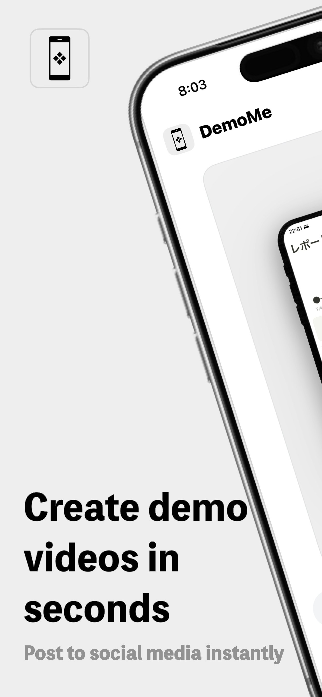
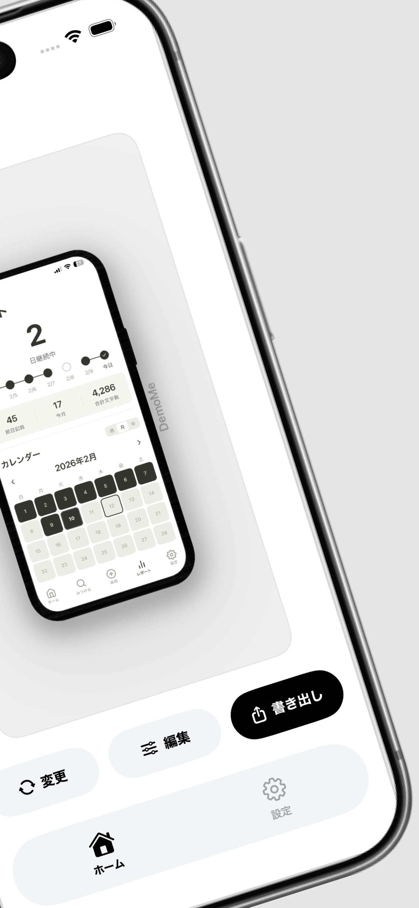
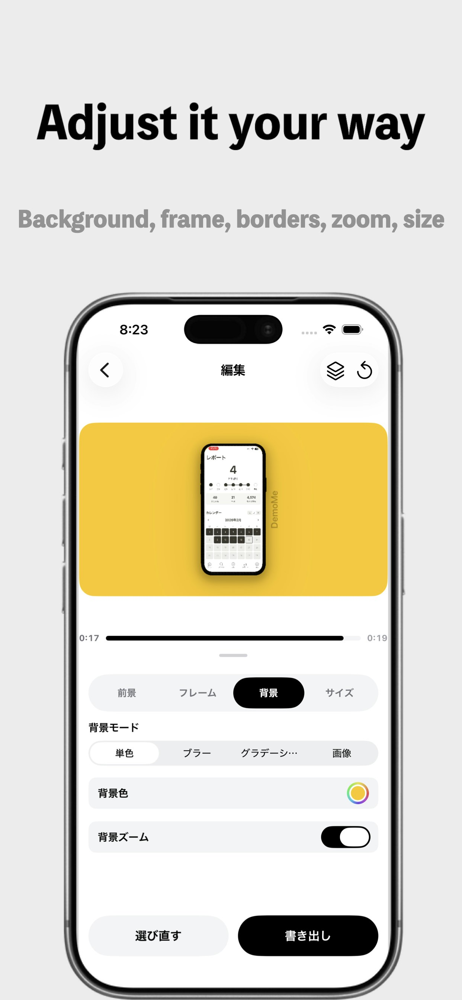

### 🎬 관련 영상
- [🎥 영상 보기](https://ph-files.imgix.net/2ca06134-2624-4c16-a069-01ce55656a0c.jpeg?auto=format)

---

## 8. [Mercury 2](https://www.producthunt.com/products/mercury-412)
**Votes**: 123 | **도입 난이도**: 중 | **신뢰도**: 중
**Tagline**: Fastest reasoning LLM built for instant production AI
**서비스 링크**: https://www.producthunt.com/r/TA2P65U73N7YYP

**태그**: LLM, AI, 추론, 에이전트, 병렬처리, Agent, AI Tool

### 📌 이 서비스 한눈에 보기
Mercury 2는 병렬 처리 방식으로 토큰을 동시에 생성하여 빠른 속도와 높은 추론 능력을 제공하는 LLM입니다.

### 🔑 주요 기능
- 순차적 디코딩 대신 병렬 정제 방식을 사용
- 1,000+ 토큰/초의 빠른 속도
- 에이전트 루프에 적합한 짧은 지연 시간

### 🙋 사용자에게 어떤 점이 좋은가
빠른 속도로 추론 능력이 필요한 AI 에이전트 구축에 유용하며, 지연 시간에 민감한 환경에서 고품질 추론을 가능하게 합니다.

### ✅ 지금 바로 써볼 기능
- 에이전트 루프에 통합하여 성능 테스트
- 지연 시간 감소 효과 확인
- 기존 모델 대비 추론 품질 비교

### ⚠️ 사용 전 확인할 점
- 병렬 처리 방식의 안정성 및 정확성 검증 필요
- 기존 모델과의 호환성 확인 필요

### 🧭 확인이 더 필요한 정보
실제 사용 환경에서의 성능과 리소스 사용량에 대한 추가 정보가 필요합니다.

### 📸 스크린샷 및 갤러리

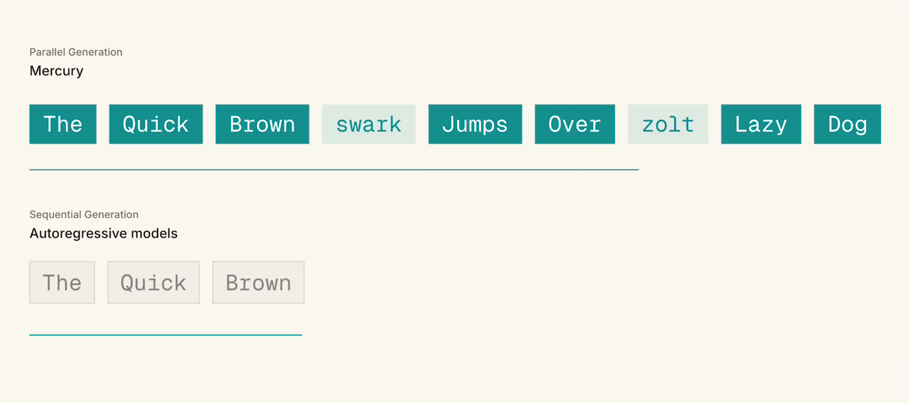
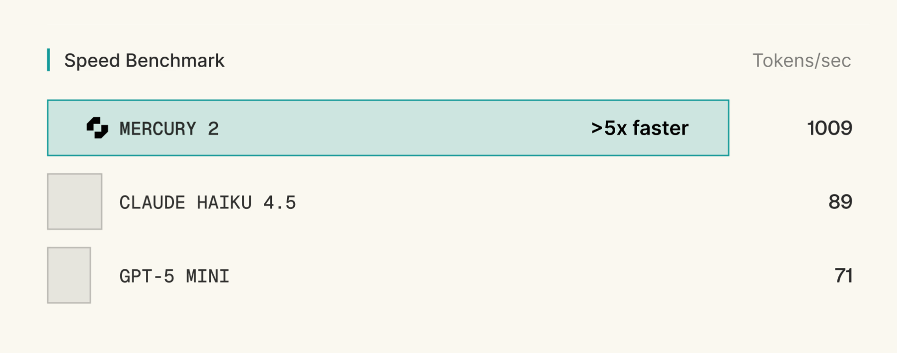

### 🎬 관련 영상
- [🎥 영상 보기](https://ph-files.imgix.net/52afa92c-f7b1-4d2d-be34-9c434544813e.jpeg?auto=format)

---

## 9. [Yuma Social AI](https://www.producthunt.com/products/yuma-social-ai)
**Votes**: 109 | **도입 난이도**: 중 | **신뢰도**: 중
**Tagline**: Put your ecommerce social media on auto-pilot
**서비스 링크**: https://www.producthunt.com/r/OX5Z7BFXYVH6NZ

**태그**: AI, 소셜미디어, 자동화, 이커머스, 댓글관리, Automation, AI Tool

### 📌 이 서비스 한눈에 보기
Yuma Social AI는 이커머스 소셜 미디어 관리를 자동화하여 댓글을 실시간으로 분석하고, 사용자가 설정한 규칙에 따라 자동으로 관리해주는 AI 도구입니다.

### 🔑 주요 기능
- 페이스북, 인스타그램, 틱톡 댓글 자동 관리
- 댓글 의도 및 감정 분석
- 자동화 규칙 설정 가능

### 🙋 사용자에게 어떤 점이 좋은가
반복적인 소셜 미디어 관리에 드는 시간을 줄여주고, 댓글 관리를 자동화하여 효율성을 높여줍니다.

### ✅ 지금 바로 써볼 기능
- 자동화 규칙 설정
- 댓글 감정 분석 기능 사용
- 자동 관리 범위 설정

### ⚠️ 사용 전 확인할 점
- 자동화 규칙 설정 시 오작동 가능성 확인
- 초기 설정 시 충분한 테스트 필요

### 🧭 확인이 더 필요한 정보
자동화 성공률 60%는 초기 테스트 결과이므로, 실제 사용 환경에 따라 달라질 수 있습니다.

### 📸 스크린샷 및 갤러리

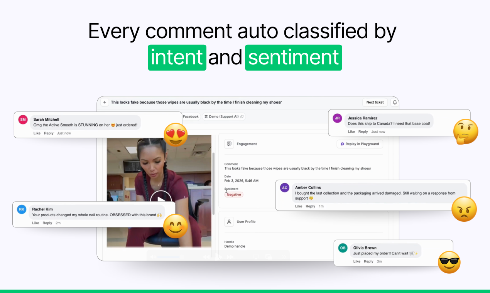
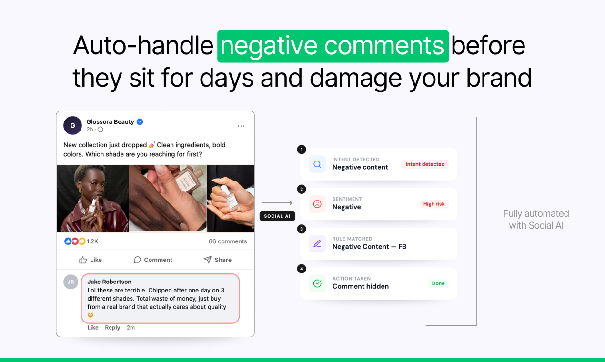

### 🎬 관련 영상
- [🎥 영상 보기](https://ph-files.imgix.net/ef49b6aa-4eae-47fa-a492-eed47285ad6f.jpeg?auto=format)

---

## 10. [PeonPing](https://www.producthunt.com/products/peonping)
**Votes**: 108 | **도입 난이도**: 중 | **신뢰도**: 중
**Tagline**: Stop babysitting Claude Code (or Codex, Cursor, + more)
**서비스 링크**: https://www.producthunt.com/r/YHHGOW56BMQX2W

**태그**: DevTool, AI, Notification, Automation, Agent, AI Tool

### 📌 이 서비스 한눈에 보기
코딩 AI 에이전트(Claude Code, Cursor, Codex 등)의 작업 완료, 오류, 승인 요청 시 게임 캐릭터 소리로 알림을 제공하여 개발 흐름을 유지하도록 돕습니다.

### 🔑 주요 기능
- 다양한 AI 에이전트 지원 (Claude Code, Cursor, Codex 등)
- 100개 이상의 게임 사운드 팩 제공 (Warcraft, StarCraft 등)
- 데스크탑 알림 및 애니메이션 오크 타마고치 제공

### 🙋 사용자에게 어떤 점이 좋은가
코딩 에이전트의 상태를 즉시 파악하여 불필요한 대기 시간을 줄이고 개발 생산성을 향상시킬 수 있습니다. 특히, 조용한 환경에서 터미널을 계속 주시하지 않아도 됩니다.

### ✅ 지금 바로 써볼 기능
- 자신이 사용하는 코딩 에이전트에 PeonPing을 연결해 보세요.
- 마음에 드는 게임 사운드 팩을 선택하여 알림음을 설정하세요.
- 데스크탑 오크 타마고치를 활성화하여 재미를 더해보세요.

### ⚠️ 사용 전 확인할 점
- 사운드 알림이 개발 환경에 방해가 되지 않도록 적절한 볼륨으로 설정하세요.
- 지원하는 AI 에이전트 목록을 확인하고, 사용하는 에이전트가 지원되는지 확인하세요.

### 🧭 확인이 더 필요한 정보
PeonPing이 실제로 개발 생산성을 얼마나 향상시키는지에 대한 사용자 후기 데이터가 부족합니다.

### 📸 스크린샷 및 갤러리

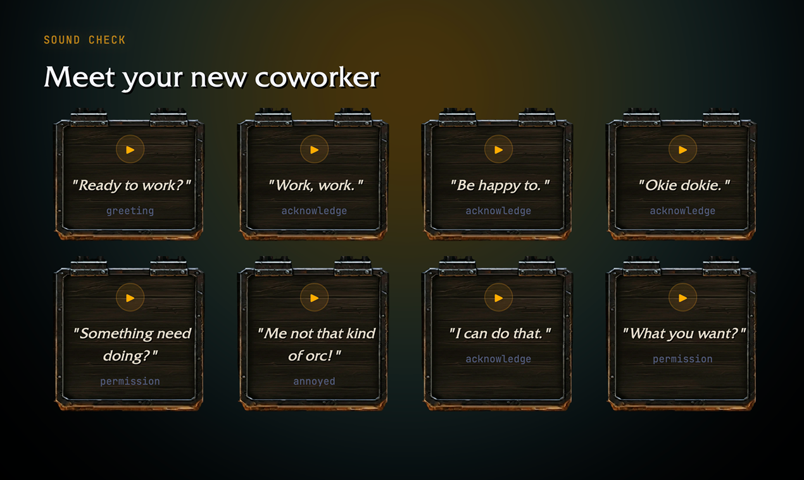

### 🎬 관련 영상
- [🎥 영상 보기](https://ph-files.imgix.net/d9cb1dc2-a198-42a7-be06-ec85d87ecfb4.jpeg?auto=format)

---

