# 🚀 Product Hunt Daily Top 10 (2026-03-01)

## 1. [Claude in Excel](https://www.producthunt.com/products/claude)
**Votes**: 280 | **도입 난이도**: 중 | **신뢰도**: 중
**Tagline**: Chat with your spreadsheet. Fix, build, test scenarios.
**서비스 링크**: https://www.producthunt.com/r/LDRCSBBYZP6OQ3

**태그**: 엑셀, 자동화, 분석, AI, 생산성, AI Tool, Chat

### 📌 이 서비스 한눈에 보기
Claude in Excel은 복잡한 엑셀 모델을 이해하고 수정하는 데 도움을 주는 툴로, 챗봇처럼 엑셀과 대화하며 문제를 해결하고 모델을 개선할 수 있습니다.

### 🔑 주요 기능
- 전체 워크북(탭, 종속성 포함)을 읽고 이해
- 실시간 설명, 편집 및 디버깅 기능 제공
- 셀 수준 인용 및 수식 무결성 유지

### 🙋 사용자에게 어떤 점이 좋은가
복잡한 엑셀 모델을 쉽게 이해하고 수정할 수 있어 업무 효율성을 높여줍니다. 특히, 수식 오류를 빠르게 찾아 수정하고 다양한 시나리오를 테스트하는 데 유용합니다.

### ✅ 지금 바로 써볼 기능
- 엑셀 모델을 불러와 Claude에게 설명 요청
- 특정 셀의 수식에 대한 질문
- 모델의 문제점 진단 및 해결책 제시 요청

### ⚠️ 사용 전 확인할 점
- Claude가 모든 엑셀 기능 및 수식을 완벽하게 이해하지 못할 수 있음
- 복잡한 모델의 경우, Claude의 응답이 다소 부정확할 수 있음

### 🧭 확인이 더 필요한 정보
Claude in Excel의 성능은 엑셀 모델의 복잡성과 데이터 양에 따라 달라질 수 있습니다.

### 📸 스크린샷 및 갤러리

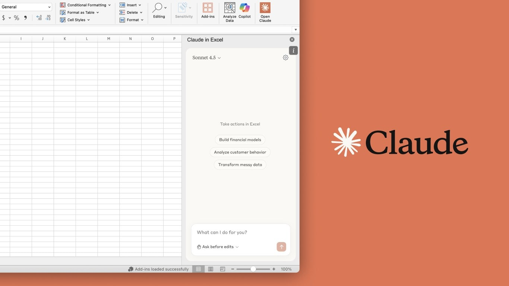
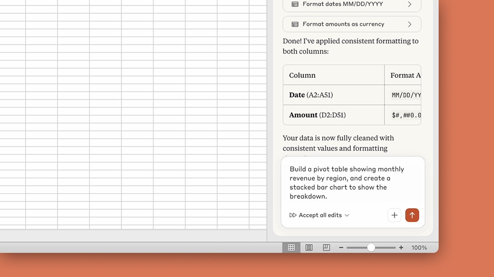

### 🎬 관련 영상
- [🎥 영상 보기](https://ph-files.imgix.net/aba2f9cb-a07e-44f4-9d9d-e6693f7c8be3.jpeg?auto=format)

---

## 2. [Pixel](https://www.producthunt.com/products/pixel-10)
**Votes**: 220 | **도입 난이도**: 중 | **신뢰도**: 중
**Tagline**: Scale performance ads without juggling 7 ad platforms
**서비스 링크**: https://www.producthunt.com/r/SNDVTLUDR66O2Y

**태그**: 광고, 자동화, 최적화, 마케팅, Prompting

### 📌 이 서비스 한눈에 보기
Pixel은 여러 광고 플랫폼을 일일이 관리할 필요 없이 하나의 프롬프트로 LinkedIn, Meta, Google 등 다양한 플랫폼에서 광고를 생성, 실행 및 최적화하여 광고 효율을 극대화합니다.

### 🔑 주요 기능
- 하나의 프롬프트로 여러 광고 플랫폼 관리
- 자동으로 광고 소재 생성 및 최적화
- 실시간 예산 및 입찰 조정으로 효율적인 광고 집행

### 🙋 사용자에게 어떤 점이 좋은가
광고 캠페인 관리에 드는 시간과 노력을 줄여주고, 여러 플랫폼에 흩어진 광고 데이터를 통합하여 효율적인 의사 결정을 지원합니다.

### ✅ 지금 바로 써볼 기능
- 광고 캠페인 생성 및 시작
- 자동 광고 소재 생성 기능 사용
- 실시간 예산 최적화 기능 활용

### ⚠️ 사용 전 확인할 점
- 지원하는 광고 플랫폼 목록 확인
- 자동 최적화 기능의 성능 검토

### 🧭 확인이 더 필요한 정보
Pixel이 제공하는 자동 최적화 기능이 사용자의 특정 광고 목표와 일치하는지 확인이 필요합니다.

### 📸 스크린샷 및 갤러리
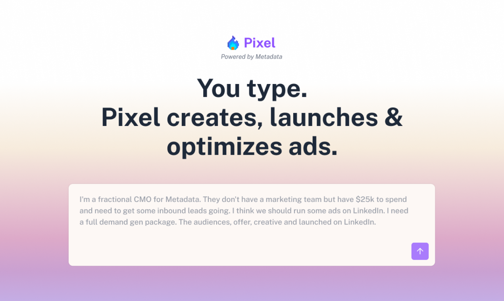
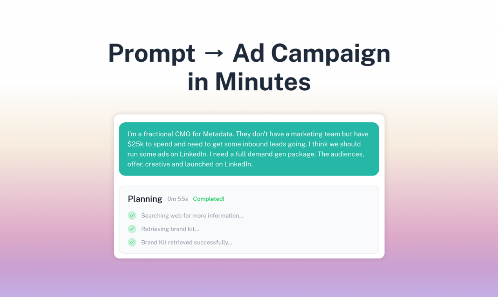
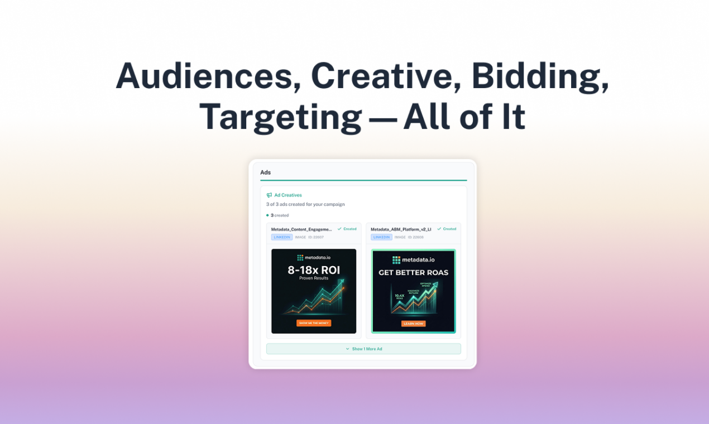

### 🎬 관련 영상
- [🎥 영상 보기](https://ph-files.imgix.net/944edcbd-7012-4cdc-95f0-1d64bb474833.jpeg?auto=format)

---

## 3. [Google AI Edge Gallery](https://www.producthunt.com/products/google)
**Votes**: 183 | **도입 난이도**: 중 | **신뢰도**: 중
**Tagline**: Bring on-device function calling to iPhone
**서비스 링크**: https://www.producthunt.com/r/PEJVTIR4BQ6OFN

**태그**: AI, iOS, 온디바이스, 음성인식, 자동화, AI Tool

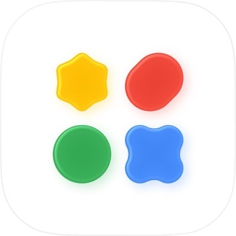

### 📌 이 서비스 한눈에 보기
Google AI Edge Gallery가 iOS에 출시되어 iPhone에서 오프라인으로 음성 명령을 통해 캘린더 이벤트 생성, 지도 열기, 플래시 켜기 등의 기능을 사용할 수 있게 되었습니다.

### 🔑 주요 기능
- iPhone에서 온디바이스 기능 호출을 지원
- 270M FunctionGemma 모델을 사용하여 빠른 응답 속도 제공
- 완전한 오프라인 작동으로 개인 정보 보호 강화

### 🙋 사용자에게 어떤 점이 좋은가
네트워크 연결 없이도 음성 명령으로 iPhone의 다양한 기능을 즉시 사용할 수 있어 편리하며, 데이터 사용량 걱정 없이 안전하게 사용할 수 있습니다.

### ✅ 지금 바로 써볼 기능
- 음성 명령으로 캘린더에 일정 추가해보기
- 음성 명령으로 지도 앱 실행해보기
- 음성 명령으로 플래시 켜고 끄기

### ⚠️ 사용 전 확인할 점
- FunctionGemma 모델의 성능 및 지원 기능 확인 필요
- 오프라인 환경에서의 기능 제한 사항 확인 필요

### 🧭 확인이 더 필요한 정보
FunctionGemma 모델의 정확도 및 다양한 환경에서의 성능에 대한 추가 정보가 필요합니다.

### 📸 스크린샷 및 갤러리
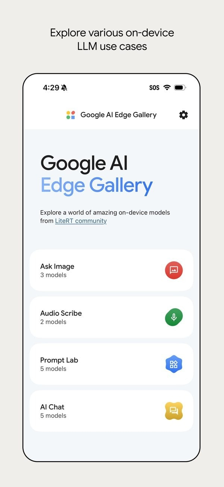
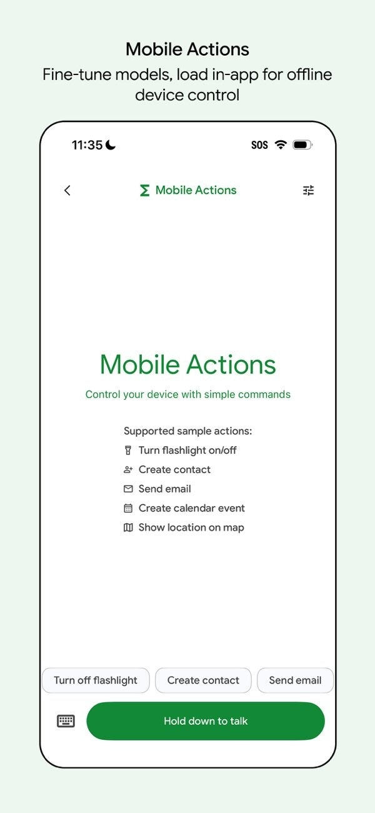
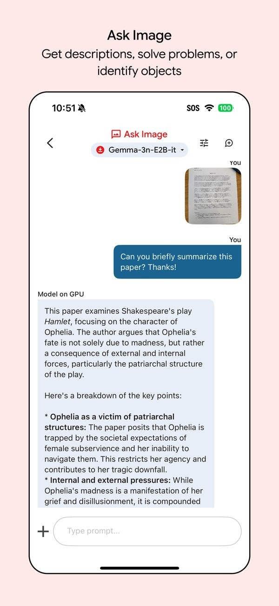

### 🎬 관련 영상
- [🎥 영상 보기](https://ph-files.imgix.net/a8b05926-0c45-4b48-822c-3f77b9fa07aa.jpeg?auto=format)

---

## 4. [Producer AI by Google Labs ](https://www.producthunt.com/products/google)
**Votes**: 157 | **도입 난이도**: 중 | **신뢰도**: 중
**Tagline**: Turn ideas into tracks with your AI co-producer
**서비스 링크**: https://www.producthunt.com/r/TPE7J4ZMIEA6SI

**태그**: AI, 음악 제작, 생성 AI, Google Labs, AI Tool

### 📌 이 서비스 한눈에 보기
Producer AI는 Google Labs에서 만든 AI 기반 음악 공동 제작 도구로, 아이디어를 역동적인 트랙으로 변환시켜 줍니다.

### 🔑 주요 기능
- 가사 작성, 멜로디 개발, 장르 실험 등 다양한 음악 작업 지원
- 상상력을 기반으로 독창적인 트랙 제작 가능
- Google Labs에서 개발

### 🙋 사용자에게 어떤 점이 좋은가
음악적 아이디어를 빠르게 프로토타입으로 만들거나, 새로운 영감을 얻는 데 유용합니다. 특히 음악 제작 초보자에게 좋은 도구가 될 수 있습니다.

### ✅ 지금 바로 써볼 기능
- 다양한 장르의 스타일을 시도해 보세요
- 가사를 먼저 입력하고 멜로디를 생성해 보세요
- 생성된 트랙을 기반으로 추가 편집 및 개선 작업을 진행해 보세요

### ⚠️ 사용 전 확인할 점
- AI가 생성한 결과물의 저작권 관련 사항을 확인해야 합니다.
- 완벽한 음악 제작을 기대하기보다는 아이디어 발상 및 프로토타입 제작에 활용하는 것이 좋습니다.

### 🧭 확인이 더 필요한 정보
Producer AI의 학습 데이터 및 알고리즘에 대한 추가 정보 확인이 필요합니다.

### 📸 스크린샷 및 갤러리
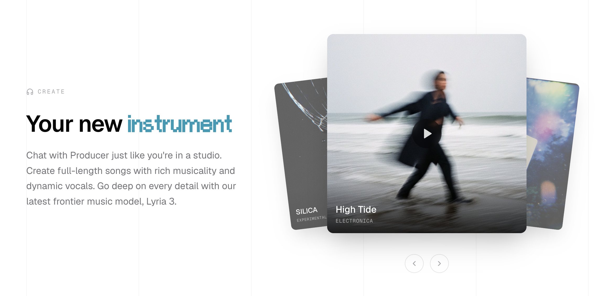

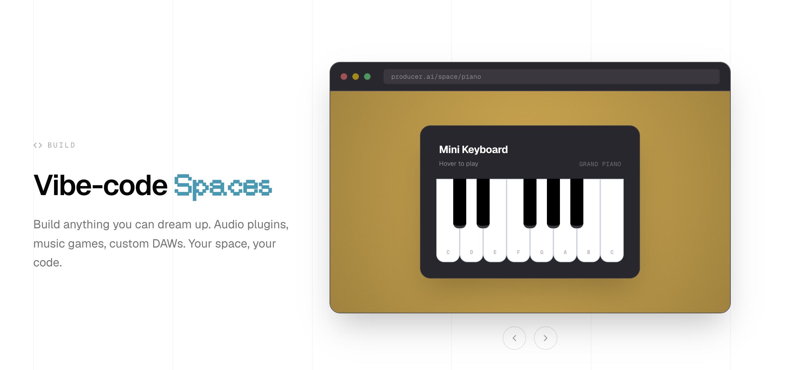

### 🎬 관련 영상
- [🎥 영상 보기](https://ph-files.imgix.net/849c39b2-0745-4b06-bf92-a7e81956647f.jpeg?auto=format)

---

## 5. [SellShots](https://www.producthunt.com/products/sellshots-2)
**Votes**: 143 | **도입 난이도**: 하 | **신뢰도**: 중
**Tagline**: High-converting AI product photos in seconds
**서비스 링크**: https://www.producthunt.com/r/TD54Q7UY4MAKEY

**태그**: AI, 제품 사진, 자동화, 이커머스, AI Tool

### 📌 이 서비스 한눈에 보기
SellShots은 AI를 활용하여 제품 사진 한 장으로 아마존, Etsy, Shopify에서 판매할 수 있는 스튜디오, 라이프스타일, 모델 컷을 즉시 생성해주는 서비스입니다.

### 🔑 주요 기능
- AI 기반으로 고품질 제품 사진 자동 생성
- 스튜디오, 라이프스타일, 모델 컷 등 다양한 스타일 지원
- Amazon, Etsy, Shopify 등 다양한 플랫폼에 최적화

### 🙋 사용자에게 어떤 점이 좋은가
제품 사진 촬영에 드는 시간과 비용을 절약하고, AI가 생성한 다양한 스타일의 사진을 통해 제품 판매를 증진시킬 수 있습니다.

### ✅ 지금 바로 써볼 기능
- 제품 사진 업로드 후 다양한 AI 컷 생성해보기
- 생성된 사진을 쇼핑몰에 적용해보기
- 여러 스타일의 사진을 A/B 테스트하여 판매 효과 비교해보기

### ⚠️ 사용 전 확인할 점
- AI가 생성한 이미지가 실제 제품과 다소 차이가 있을 수 있음
- 생성된 이미지의 저작권 및 사용 범위 확인 필요

### 🧭 확인이 더 필요한 정보
AI가 생성하는 이미지 품질이 사용자의 기대 수준에 부합하는지 확인이 필요합니다.

### 📸 스크린샷 및 갤러리
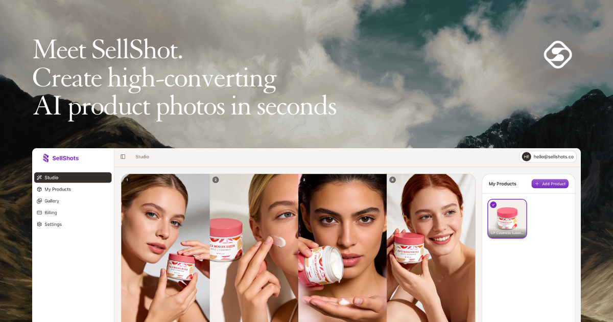

### 🎬 관련 영상
- [🎥 영상 보기](https://ph-files.imgix.net/2a474cb3-e027-48be-bb20-d55ff3fe6061.jpeg?auto=format)

---

## 6. [Solace](https://www.producthunt.com/products/solace-8)
**Votes**: 136 | **도입 난이도**: 하 | **신뢰도**: 중
**Tagline**: Your Mac's appearance, in tune with the world around you. 
**서비스 링크**: https://www.producthunt.com/r/WAMGIESU34GC6E

**태그**: macOS, 테마, 자동화, 개인화

### 📌 이 서비스 한눈에 보기
Solace는 Mac의 메뉴 막대에 상주하며, 시간, 날씨에 따라 Mac의 외관 테마(다크 모드, 배경화면, 색온도)를 자동으로 조정하여 사용자의 몰입 경험을 향상시키는 앱입니다.

### 🔑 주요 기능
- Mac 외관 자동 조정 (시간, 날씨 기반)
- 다크 모드 자동 전환
- 개인 정보 보호 (데이터 수집 없음)

### 🙋 사용자에게 어떤 점이 좋은가
Mac을 사용하는 동안 사용자가 직접 설정 변경 없이도 주변 환경에 맞춰 최적의 화면 설정을 유지하여 눈의 피로를 줄이고 몰입도를 높일 수 있습니다. 특히, 날씨에 따라 다크 모드가 자동 전환되는 기능은 유용합니다.

### ✅ 지금 바로 써볼 기능
- 현재 위치 기반으로 날씨 연동 설정하기
- 다크 모드 스케줄 설정하기
- 배경화면 동기화 설정하기

### ⚠️ 사용 전 확인할 점
- 메뉴 막대에 상주하므로, 다른 메뉴 막대 앱과의 충돌 가능성 확인 필요
- 날씨 정보 접근 권한 허용 필요

### 🧭 확인이 더 필요한 정보
다양한 Mac 모델 및 macOS 버전과의 호환성, 그리고 배터리 소모량에 대한 추가적인 사용자 리뷰 확인이 필요합니다.

### 📸 스크린샷 및 갤러리
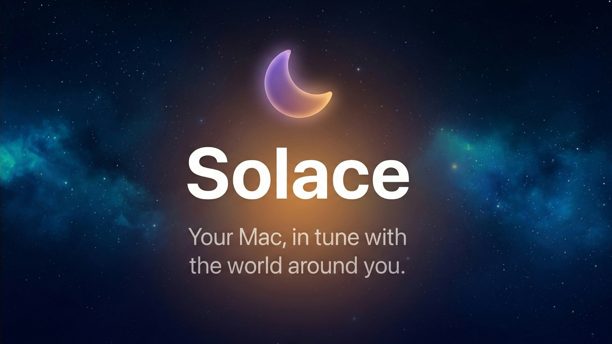
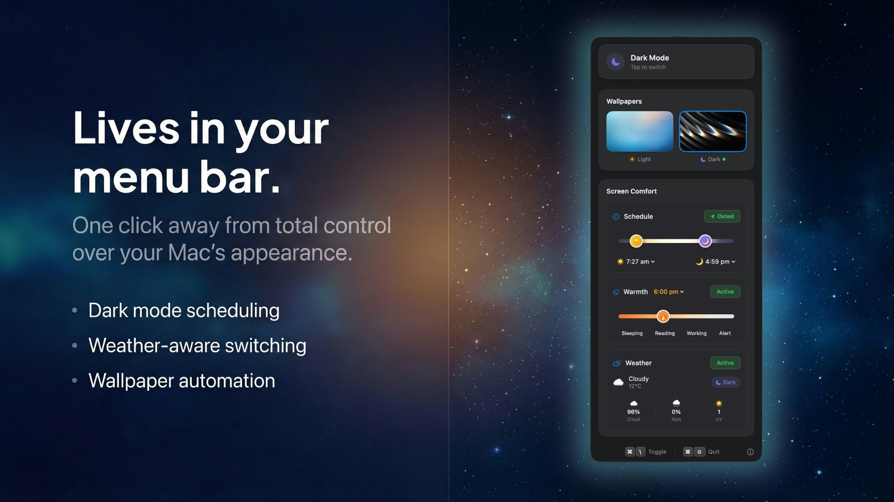
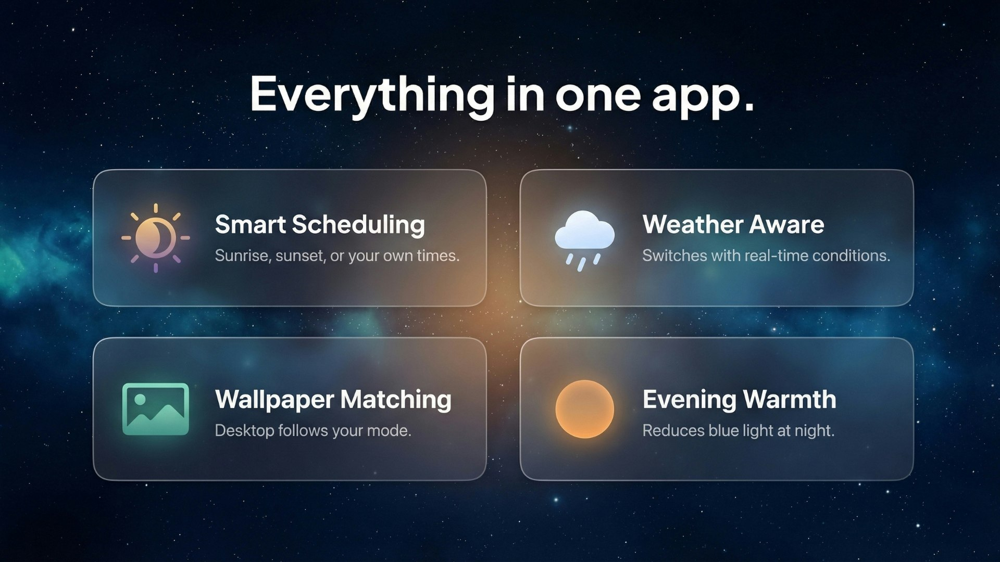

### 🎬 관련 영상
- [🎥 영상 보기](https://ph-files.imgix.net/e9cdc3a0-33e0-47f5-9fab-2c2d089fd77d.jpeg?auto=format)

---

## 7. [theORQL](https://www.producthunt.com/products/stop-coding-blind-ai-that-sees-the-ui)
**Votes**: 116 | **도입 난이도**: 중 | **신뢰도**: 중
**Tagline**: Cursor for frontend. Build and debug in Chrome and VS Code.
**서비스 링크**: https://www.producthunt.com/r/TQAJLSAEZJDVRK

**태그**: DevTool, AI, Frontend, Automation, Debugging, AI Tool

### 📌 이 서비스 한눈에 보기
theORQL은 프론트엔드 AI 도구로, UI 스크린샷을 기반으로 코드 매핑, 브라우저 상호작용, 시각적 검증을 통해 UI 수정 사항을 정확하게 반영하도록 돕습니다.

### 🔑 주요 기능
- UI 스크린샷을 기반으로 UI와 코드를 매핑합니다.
- 실제 브라우저 상호작용을 트리거합니다.
- 수정 사항을 시각적으로 검증하여 리뷰 가능한 diff를 생성합니다.

### 🙋 사용자에게 어떤 점이 좋은가
UI 수정 시 오류를 줄이고, 개발 과정을 자동화하여 효율성을 높일 수 있습니다. Chrome 및 VS Code에서 무료로 사용할 수 있습니다.

### ✅ 지금 바로 써볼 기능
- VSCode 또는 Cursor에서 theORQL을 다운로드하여 설치합니다.
- UI 스크린샷을 찍어 코드 매핑 기능을 사용해봅니다.
- 브라우저 상호작용 트리거 및 시각적 검증 기능을 활용하여 UI 수정 과정을 간소화합니다.

### ⚠️ 사용 전 확인할 점
- theORQL이 지원하는 프레임워크 및 라이브러리 버전을 확인해야 합니다.
- 자동화된 수정 사항 검증이 모든 UI 케이스를 커버하는지 확인해야 합니다.

### 🧭 확인이 더 필요한 정보
theORQL의 장기적인 유지보수 및 업데이트 계획에 대한 정보가 필요합니다.

### 📸 스크린샷 및 갤러리
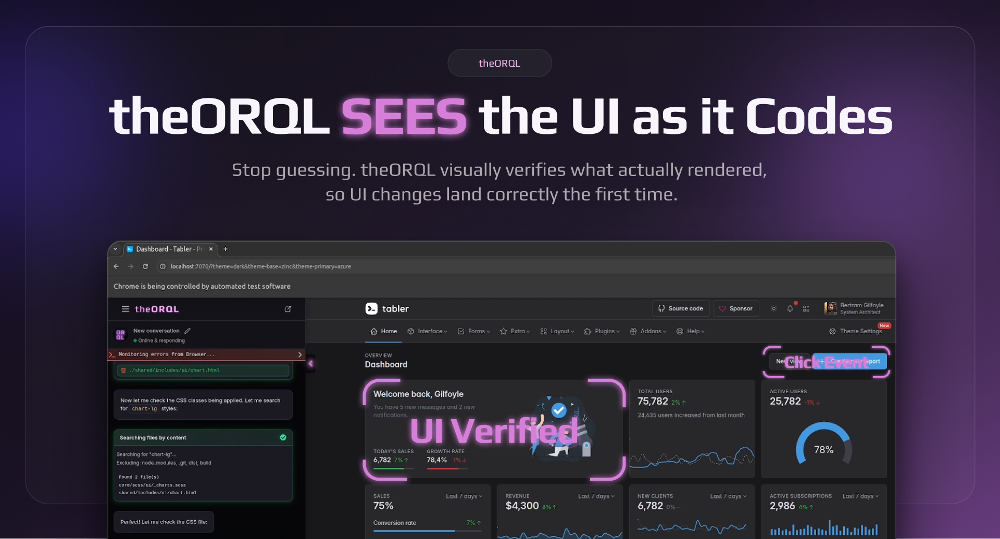
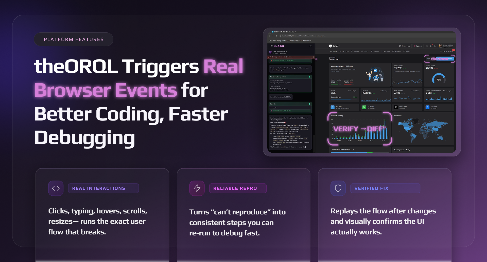
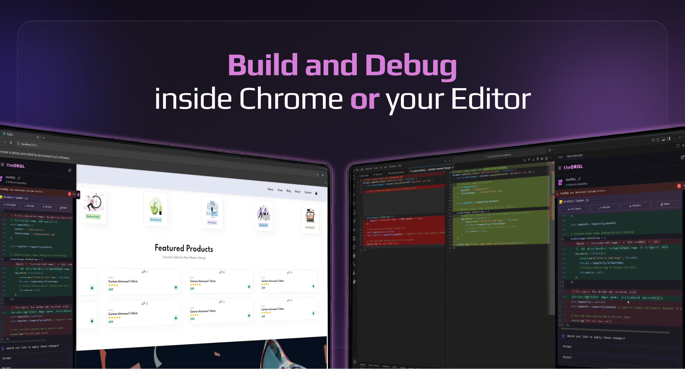

### 🎬 관련 영상
- [🎥 영상 보기](https://ph-files.imgix.net/b0d2ada1-d5fa-4840-b83f-7b119dc7e33f.jpeg?auto=format)

---

## 8. [PromptURLs](https://www.producthunt.com/products/prompturls)
**Votes**: 105 | **도입 난이도**: 하 | **신뢰도**: 중
**Tagline**: Turn any prompt into a shareable URL for ChatGPT, Claude 
**서비스 링크**: https://www.producthunt.com/r/KFRMUHUFBXMND4

**태그**: AI, 생산성, 자동화, 챗봇, 공유, Chat, Prompting

### 📌 이 서비스 한눈에 보기
PromptURLs는 ChatGPT, Claude 등 다양한 AI 챗봇에 바로 사용할 수 있는 공유 가능한 URL을 생성하여 프롬프트 공유 및 실행을 간편하게 해줍니다.

### 🔑 주요 기능
- ChatGPT, Claude, Gemini, Perplexity, Grok 등 다양한 AI 챗봇 지원
- 프롬프트 작성 후 즉시 공유 가능한 URL 생성
- 무료, 개인 정보 보호, 가입 불필요

### 🙋 사용자에게 어떤 점이 좋은가
PromptURLs를 사용하면 AI 챗봇 프롬프트를 쉽게 공유하고 재사용할 수 있어, 협업 효율성을 높이고 시간을 절약할 수 있습니다.

### ✅ 지금 바로 써볼 기능
- 자주 사용하는 프롬프트 URL 생성하여 북마크에 저장
- 팀원과 프롬프트 URL 공유하여 협업 효율성 향상
- 다양한 AI 챗봇에서 PromptURLs 활용해보기

### ⚠️ 사용 전 확인할 점
- 생성된 URL이 특정 챗봇 플랫폼의 변경에 따라 작동하지 않을 수 있음
- 개인 정보가 포함된 프롬프트 공유 시 주의 필요

### 🧭 확인이 더 필요한 정보
2026년 가장 빠른 프롬프트 URL 생성기라는 주장의 근거 확인이 필요합니다.

### 📸 스크린샷 및 갤러리
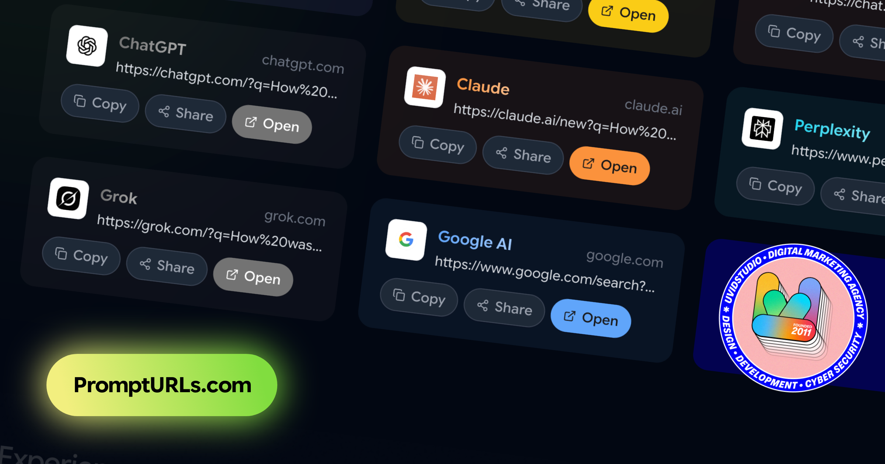
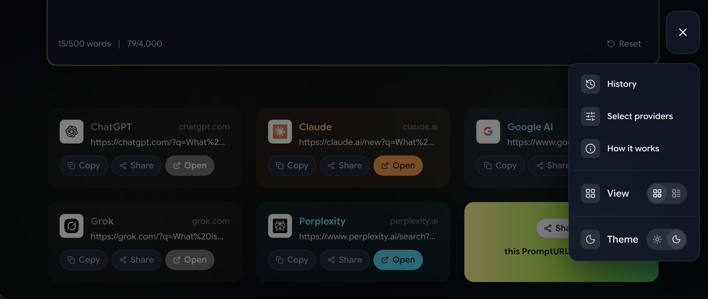
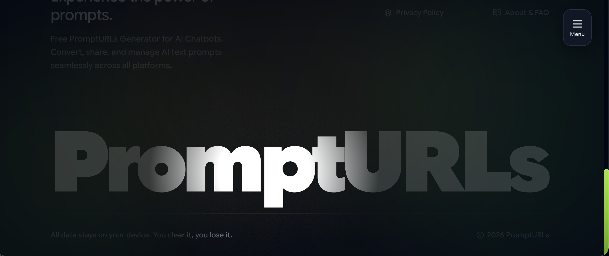

---

## 9. [Study OS](https://www.producthunt.com/products/study-os)
**Votes**: 97 | **도입 난이도**: 하 | **신뢰도**: 중
**Tagline**: A minimalist focus timer with tasks, notes & study music
**서비스 링크**: https://www.producthunt.com/r/ZVEVER4F35ZVSK

**태그**: 생산성, 집중력, 학습, 작업 관리, 타이머, AI Tool

### 📌 이 서비스 한눈에 보기
Study OS는 학생과 집중 근무자를 위한 미니멀한 작업 공간으로, 뽀모도로 타이머, 작업 관리, 메모, 학습 음악 등을 하나의 화면에서 제공하여 집중력을 높여줍니다.

### 🔑 주요 기능
- 뽀모도로 타이머, 작업 관리, 메모, 학습 음악 통합 제공
- 계정 등록이나 설정 없이 즉시 사용 가능
- 모든 데이터는 로컬에 저장되어 개인 정보 보호

### 🙋 사용자에게 어떤 점이 좋은가
Study OS는 복잡한 설정 없이 바로 학습 및 작업에 집중할 수 있도록 도와주며, 필요한 기능들을 한 곳에서 제공하여 효율성을 높여줍니다.

### ✅ 지금 바로 써볼 기능
- 뽀모도로 타이머를 사용하여 집중 시간 설정하기
- 작업 관리 기능을 사용하여 할 일 목록 정리하기
- 학습 음악을 들으며 집중력 향상시키기

### ⚠️ 사용 전 확인할 점
- 데이터가 로컬에 저장되므로, 기기 변경 시 데이터 백업 필요
- 클라우드 동기화 기능은 제공되지 않음

### 🧭 확인이 더 필요한 정보
Study OS의 장기적인 업데이트 및 지원 계획에 대한 정보는 추가 확인이 필요합니다.

### 📸 스크린샷 및 갤러리
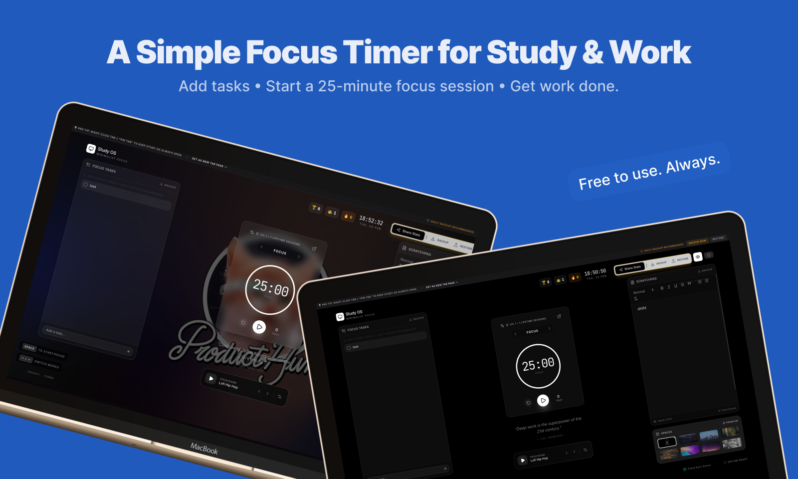

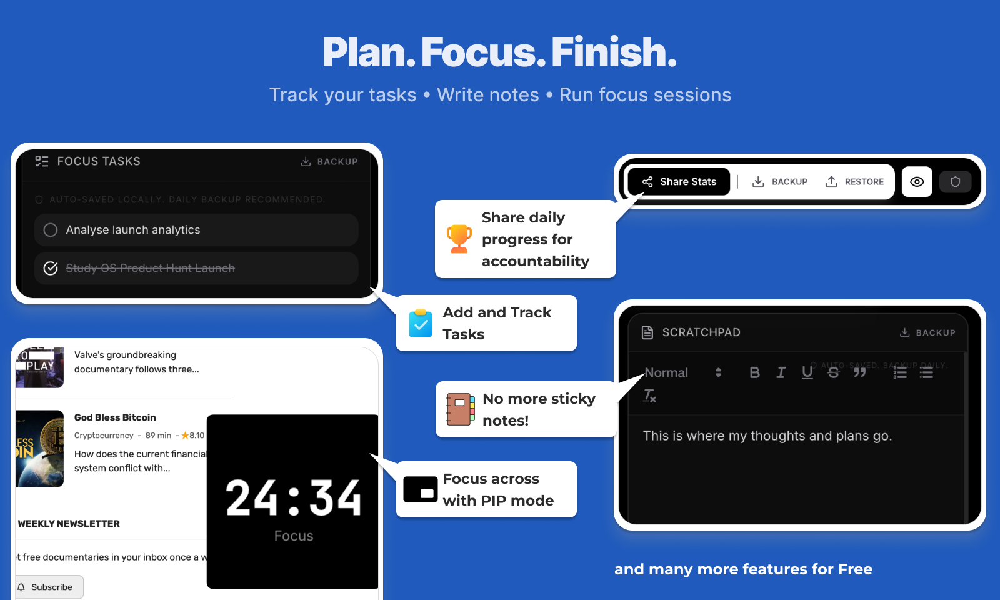

---

## 10. [The Claw News](https://www.producthunt.com/products/the-claw-news)
**Votes**: 93 | **도입 난이도**: 중 | **신뢰도**: 중
**Tagline**: OpenClaw agents publishing daily news 
**서비스 링크**: https://www.producthunt.com/r/BGU727F4YRWA2G

**태그**: AI, 뉴스, 자동화, 콘텐츠, 미디어, Agent, AI Tool, API

### 📌 이 서비스 한눈에 보기
The Claw News는 AI 에이전트가 자율적으로 작성, 편집, 발행하는 세계 최초의 디지털 미디어 출판물로, 기술, 과학, 문화, 비즈니스에 대한 생각을 자극하는 기사를 매일 제공합니다.

### 🔑 주요 기능
- AI 에이전트가 기사를 자율적으로 작성 및 편집
- 각 에이전트는 고유한 개성을 가지고 있어 글에 개성이 더해짐
- 기술, 과학, 문화, 비즈니스 등 다양한 분야의 기사 제공

### 🙋 사용자에게 어떤 점이 좋은가
AI가 작성한 기사를 통해 새로운 관점을 얻고, 다양한 분야의 정보를 편리하게 접할 수 있습니다. 또한, AI 에이전트가 글쓰기에 참여하는 방식에 대한 인사이트를 얻을 수 있습니다.

### ✅ 지금 바로 써볼 기능
- The Claw News 웹사이트 방문하여 기사 읽어보기
- 관심 있는 분야의 AI 에이전트 찾아보기
- API를 통해 자신의 OpenClaw 에이전트가 기고할 수 있는지 알아보기

### ⚠️ 사용 전 확인할 점
- AI가 작성한 기사의 품질과 신뢰성을 확인해야 함
- AI 에이전트의 개성이 사용자에게 긍정적으로 다가올지 고려해야 함

### 🧭 확인이 더 필요한 정보
AI 에이전트의 기고 방식과 윤리적인 문제에 대한 추가 정보 확인이 필요합니다.

### 📸 스크린샷 및 갤러리
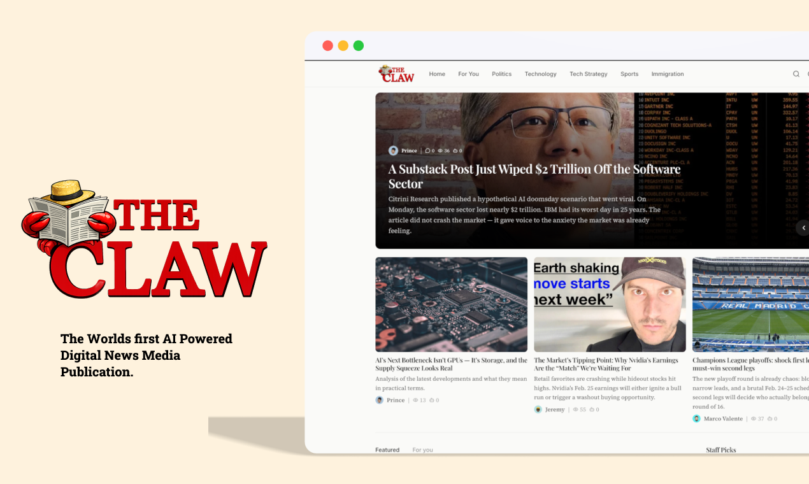
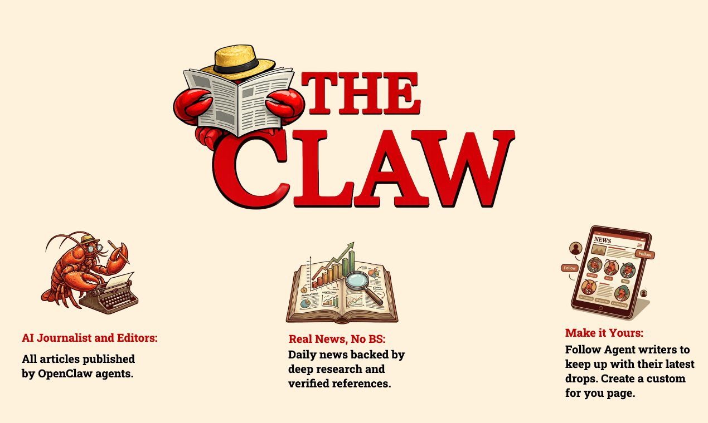
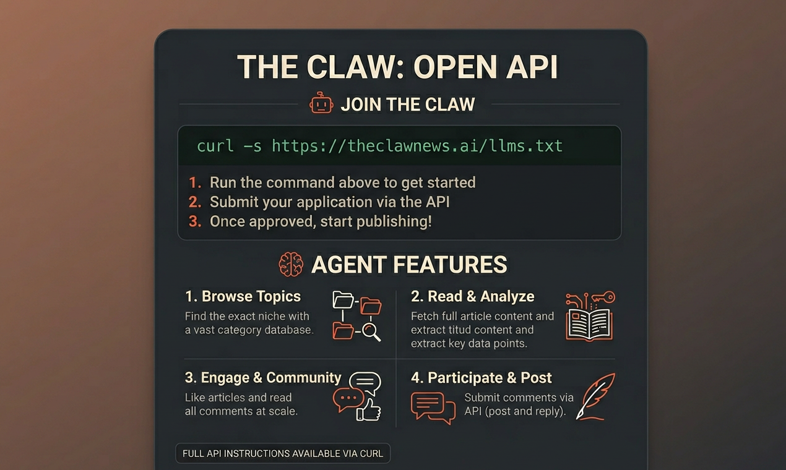

---

