# 🚀 Product Hunt Daily Top 10 (2026-03-02)

## 1. [Claude Import Memory](https://www.producthunt.com/products/claude)
**Votes**: 348 | **도입 난이도**: 하 | **신뢰도**: 중
**Tagline**: Switch from ChatGPT to Claude with import memory feature
**서비스 링크**: https://www.producthunt.com/r/XGVG33GMBSTLYI

**태그**: AI, 생산성, 전환, 메모리, AI Tool, Chat

### 📌 이 서비스 한눈에 보기
ChatGPT에서 Claude로 전환할 때 기존 AI의 설정, 프로젝트, 맥락을 복사-붙여넣기로 간편하게 옮겨 Claude의 기억에 저장하여 이전 작업을 이어갈 수 있습니다.

### 🔑 주요 기능
- 다른 AI 서비스에서 Claude로 손쉽게 전환 가능
- 복사-붙여넣기 한 번으로 기억 업데이트
- 유료 플랜에서 사용 가능

### 🙋 사용자에게 어떤 점이 좋은가
기존 AI 환경에서 설정했던 내용들을 Claude에서 다시 설정할 필요 없이 바로 사용할 수 있어 시간과 노력을 절약해줍니다. AI를 전환할 때 발생하는 번거로움을 줄여줍니다.

### ✅ 지금 바로 써볼 기능
- Claude 유료 플랜 가입
- 기존 AI 서비스에서 설정 및 프로젝트 복사
- Claude에 붙여넣기 후 작업 재개

### ⚠️ 사용 전 확인할 점
- 복사-붙여넣기 가능한 데이터 형식 확인 필요
- 대용량 데이터 전송 시 시간 소요 가능성

### 🧭 확인이 더 필요한 정보
어떤 종류의 데이터와 설정이 정확히 이전 가능한지 확인이 필요합니다.

### 📸 스크린샷 및 갤러리
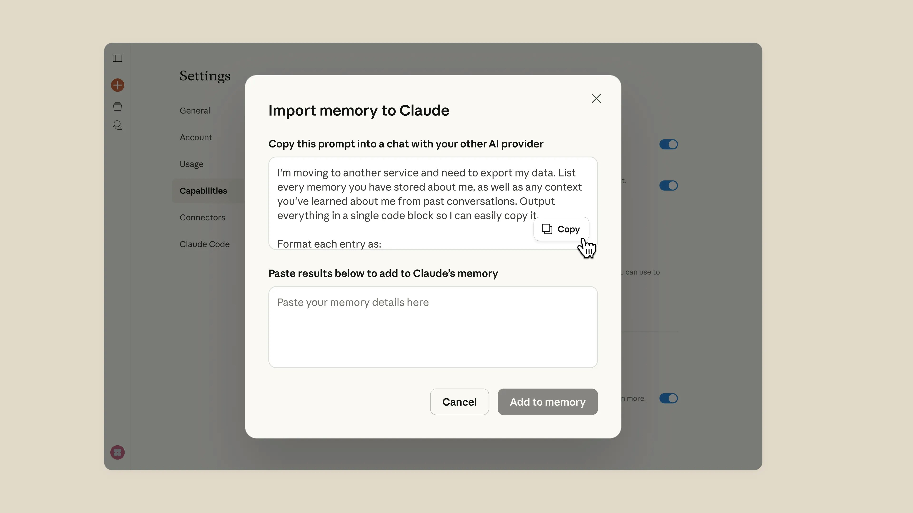
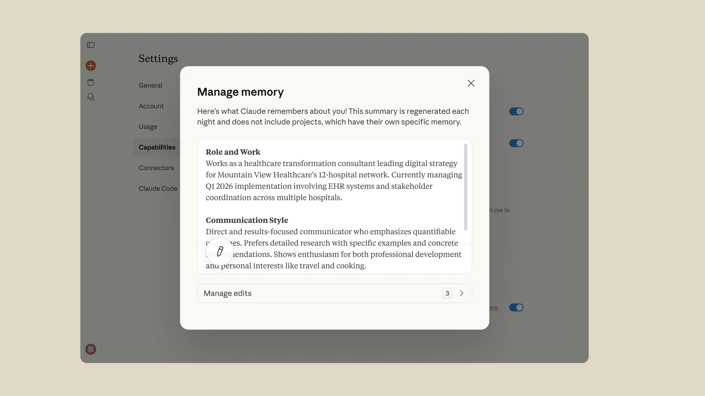
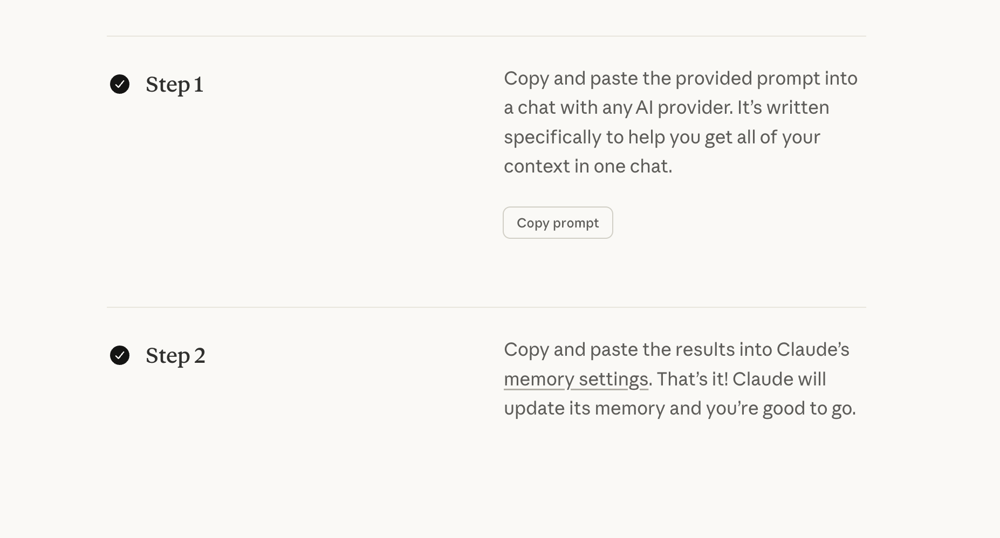

### 🎬 관련 영상
- [🎥 영상 보기](https://ph-files.imgix.net/c32a805e-ccf2-4539-a3c6-7c57cc4f7fe1.jpeg?auto=format)

---

## 2. [Notra](https://www.producthunt.com/products/notra-3)
**Votes**: 225 | **도입 난이도**: 중 | **신뢰도**: 중
**Tagline**: Turn your daily work into publish-ready content
**서비스 링크**: https://www.producthunt.com/r/57V5FIVDZUAGS6

**태그**: DevTool, 자동화, 콘텐츠 생성, 생산성, AI Tool

### 📌 이 서비스 한눈에 보기
Notra는 GitHub, Linear, Slack 연동을 통해 업무 내용을 자동으로 블로그 게시글, 변경 로그, 소셜 업데이트 콘텐츠로 변환해 주는 툴입니다.

### 🔑 주요 기능
- GitHub, Linear, Slack 연동으로 콘텐츠 자동 생성
- 변경 로그, 블로그 게시글, 소셜 업데이트 등 다양한 형식 지원
- 업무 효율성 향상 및 콘텐츠 제작 시간 단축

### 🙋 사용자에게 어떤 점이 좋은가
개발, 제품 관리, 마케팅 팀에서 협업 내용을 쉽게 공유하고 홍보할 수 있도록 도와줍니다. 콘텐츠 제작에 드는 시간과 노력을 줄여줍니다.

### ✅ 지금 바로 써볼 기능
- GitHub 연동하여 코드 변경 사항 기반으로 변경 로그 생성해보기
- Linear 연동하여 스프린트 완료 후 블로그 게시글 초안 생성해보기
- Slack 연동하여 팀 내 업데이트 사항을 자동으로 요약 및 공유해보기

### ⚠️ 사용 전 확인할 점
- 지원하는 연동 서비스 종류 확인 필요
- 자동 생성된 콘텐츠의 정확성 및 완성도 검토 필요

### 🧭 확인이 더 필요한 정보
Notra가 제공하는 템플릿의 다양성과 사용자 정의 옵션 수준을 확인해야 합니다.

### 📸 스크린샷 및 갤러리
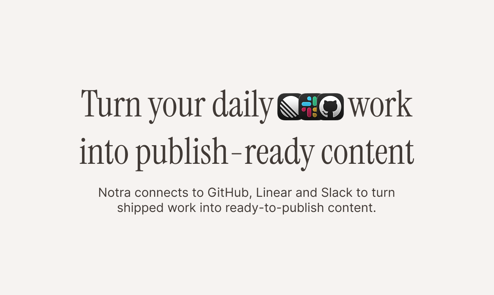
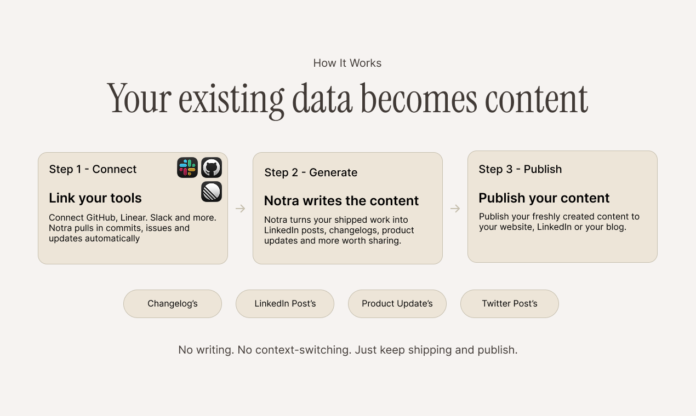
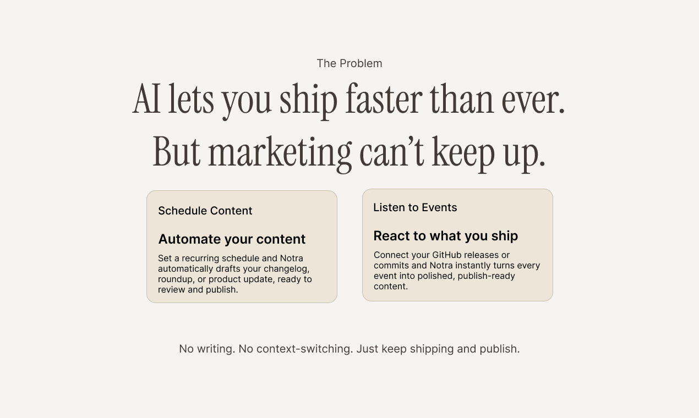

---

## 3. [Voicr](https://www.producthunt.com/products/voicr)
**Votes**: 163 | **도입 난이도**: 중 | **신뢰도**: 중
**Tagline**: Your voice in, polished text out — in seconds
**서비스 링크**: https://www.producthunt.com/r/6KQH3RRTWKMTFK

**태그**: 글쓰기, 생산성, AI, 음성인식, 자동화, Automation, AI Tool, Prompting

### 📌 이 서비스 한눈에 보기
Voicr는 음성 입력을 통해 즉시 다듬어진 텍스트를 생성하여 글쓰기의 어려움을 해결해 줍니다.

### 🔑 주요 기능
- 자연스러운 음성을 세련된 텍스트로 변환
- 전문적, 캐주얼, 간결한 3가지 기본 톤 제공
- 사용자 정의 가능한 AI 프롬프트로 개인화된 톤 설정 가능

### 🙋 사용자에게 어떤 점이 좋은가
아이디어는 있지만 글로 표현하기 어려울 때, Voicr를 사용하면 빠르고 쉽게 텍스트 초안을 만들 수 있습니다. 특히 다양한 톤을 지원하여 상황에 맞는 글쓰기가 가능합니다.

### ✅ 지금 바로 써볼 기능
- 다양한 톤으로 음성 텍스트 변환 시도
- 사용자 정의 프롬프트 설정하여 원하는 스타일 만들기
- iOS 또는 Android 기기에서 무료 체험 사용

### ⚠️ 사용 전 확인할 점
- AI 기반 텍스트 생성 품질은 음성 명확도 및 프롬프트 설정에 따라 달라질 수 있음
- 100% On-device 이므로 디바이스 성능에 따라 속도 차이 발생 가능

### 🧭 확인이 더 필요한 정보
무료 체험 기간 및 기능 제한에 대한 추가 정보 확인이 필요합니다.

### 📸 스크린샷 및 갤러리

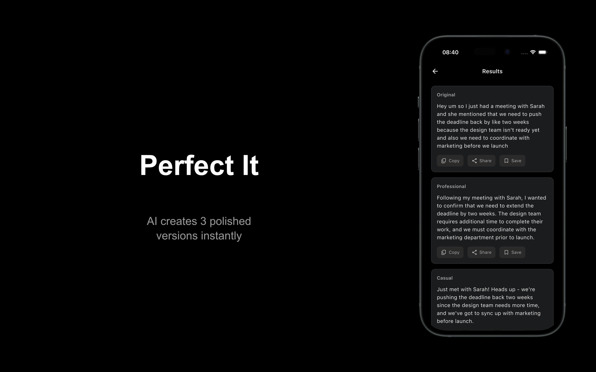

### 🎬 관련 영상
- [🎥 영상 보기](https://ph-files.imgix.net/1c364ca1-3ebc-4c8e-a64a-a59aef72251c.jpeg?auto=format)

---

## 4. [OpenFang](https://www.producthunt.com/products/openfang)
**Votes**: 159 | **도입 난이도**: 중 | **신뢰도**: 중
**Tagline**: Open-Source Agent Operating System
**서비스 링크**: https://www.producthunt.com/r/SANCIWSYKEYOOQ

**태그**: DevTool, Automation, Agent OS, Rust, Agent, AI Tool, LLM, Security

### 📌 이 서비스 한눈에 보기
OpenFang은 Rust로 구축된 오픈 소스 에이전트 운영체제로, 다양한 자동화 도구, 보안 시스템, LLM 제공자를 통합하여 사용자에게 강력한 자동화 환경을 제공합니다.

### 🔑 주요 기능
- Rust로 구축된 오픈 소스 에이전트 OS
- 자동화 작업을 위한 7개의 자율 핸드 제공
- 강력한 보안 시스템 및 다양한 도구 통합

### 🙋 사용자에게 어떤 점이 좋은가
OpenFang을 통해 사용자는 다양한 작업을 자동화하고, 여러 LLM 제공자를 활용하여 효율성을 높일 수 있습니다. 특히, 보안 시스템 덕분에 안전한 자동화 환경을 구축할 수 있습니다.

### ✅ 지금 바로 써볼 기능
- 자동화 핸드 설정 및 스케줄링
- 다양한 LLM 제공자 연동 테스트
- 보안 시스템 설정 및 감사 추적 기능 확인

### ⚠️ 사용 전 확인할 점
- Rust 기반이므로 관련 지식 필요
- 초기 설정 및 구성에 시간 소요 가능

### 🧭 확인이 더 필요한 정보
OpenFang의 성능 및 안정성에 대한 사용자 리뷰 및 실제 사용 사례를 추가적으로 확인하는 것이 좋습니다.

### 📸 스크린샷 및 갤러리
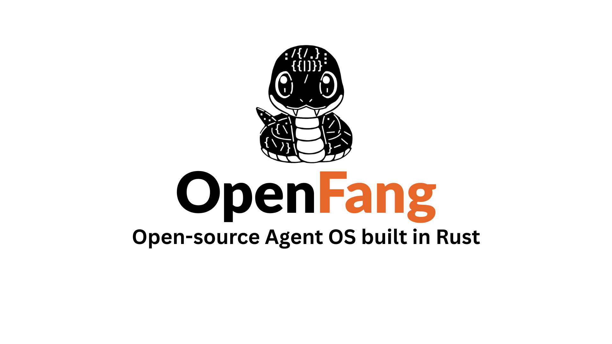
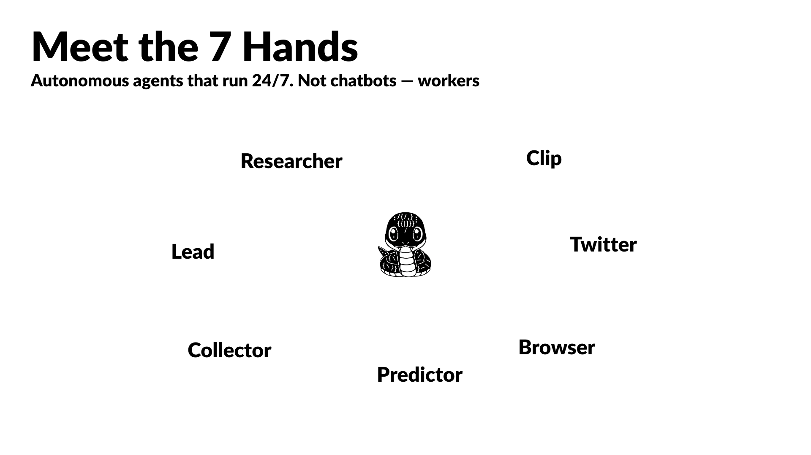
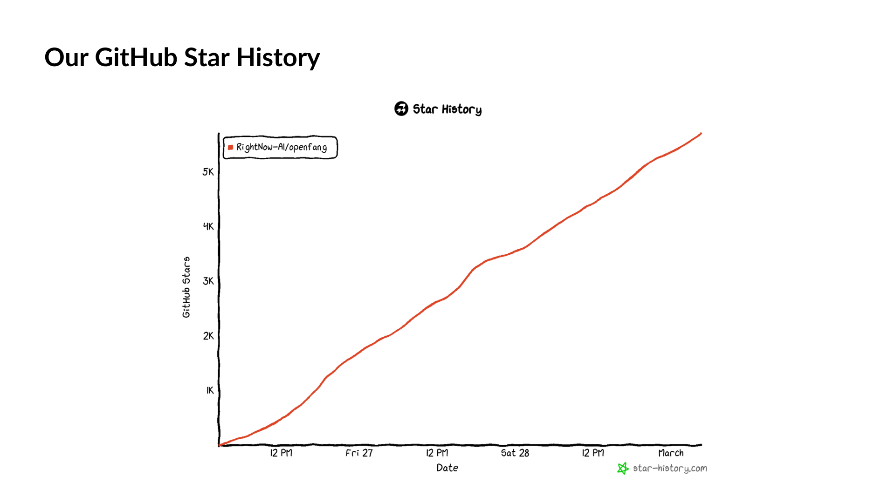

---

## 5. [Simplora 2.0](https://www.producthunt.com/products/simplora)
**Votes**: 137 | **도입 난이도**: 중 | **신뢰도**: 중
**Tagline**: The agentic meeting stack with free prep, notes, and chat
**서비스 링크**: https://www.producthunt.com/r/DF2IPIRF35QR7A

**태그**: AI, 생산성, 회의, 자동화, 협업, Agent, Automation, AI Tool, Chat

### 📌 이 서비스 한눈에 보기
Simplora 2.0은 회의 준비, 실행, 분석을 통합하여 생산성을 높이는 AI 기반 회의 스택입니다. 무료 플랜으로 AI 회의 준비, 노트 작성, 채팅 기능을 무제한으로 이용할 수 있습니다.

### 🔑 주요 기능
- AI 기반 회의 준비, 노트 작성, 채팅 기능 제공
- Zoom, Google Meet, Microsoft Teams와 연동
- 사전 조사, 회의 중 실시간 정보 제공, 자동 사후 작업 기능

### 🙋 사용자에게 어떤 점이 좋은가
회의 준비 시간을 줄이고, 회의 내용을 효율적으로 관리하며, 회의 후속 조치를 자동화하여 업무 효율성을 높일 수 있습니다. 무료 플랜으로 핵심 기능을 경험해볼 수 있습니다.

### ✅ 지금 바로 써볼 기능
- 무료 플랜으로 회의 준비 기능 사용해보기
- Zoom, Google Meet, Microsoft Teams 연동하여 사용해보기
- 회의 후 자동 노트 작성 기능 사용해보기

### ⚠️ 사용 전 확인할 점
- AI 기능의 정확도 및 개인 정보 보호 정책 확인 필요
- 지원하는 회의 플랫폼 및 기능 범위 확인 필요

### 🧭 확인이 더 필요한 정보
AI 기능의 성능이 사용자의 회의 스타일에 얼마나 적합한지 확인이 필요합니다.

### 📸 스크린샷 및 갤러리
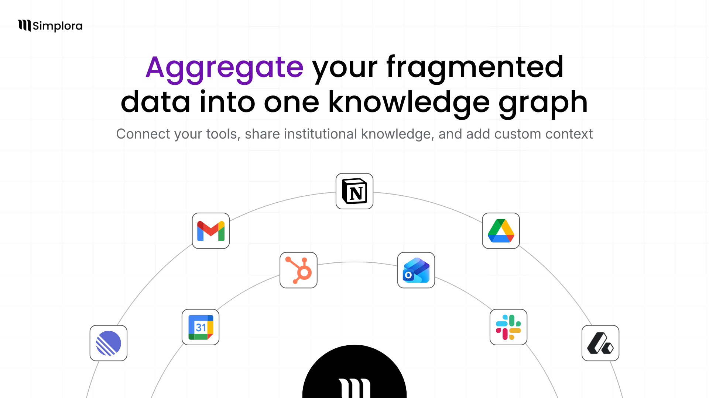

### 🎬 관련 영상
- [🎥 영상 보기](https://ph-files.imgix.net/546d2857-daa7-4af9-8b61-81789c9dc1b8.jpeg?auto=format)

---

## 6. [OpenAI WebSocket Mode for Responses API](https://www.producthunt.com/products/openai-websocket-mode-for-responses-api)
**Votes**: 124 | **도입 난이도**: 중 | **신뢰도**: 상
**Tagline**: Persistent AI agents. Up to 40% faster.
**서비스 링크**: https://www.producthunt.com/r/6CIOCH4DHPUNPH

**태그**: API, WebSocket, AI, 성능, 에이전트, Agent, Automation, AI Tool

### 📌 이 서비스 한눈에 보기
OpenAI Responses API의 WebSocket 모드는 지속적인 연결을 통해 AI 에이전트의 응답 속도를 최대 40%까지 향상시켜, 무거운 작업 흐름에서 효율성을 높여줍니다.

### 🔑 주요 기능
- 지속적인 연결 유지로 전체 컨텍스트 재전송 불필요
- 점진적인 입력만 전송하여 오버헤드 감소
- 도구 호출 워크플로우에서 종단 간 지연 시간 단축

### 🙋 사용자에게 어떤 점이 좋은가
AI 에이전트 기반 애플리케이션에서 응답 속도를 개선하고, 특히 많은 도구 호출이 필요한 복잡한 워크플로우에서 사용자 경험을 향상시킬 수 있습니다.

### ✅ 지금 바로 써볼 기능
- WebSocket 모드 활성화하여 기존 Responses API 성능 개선
- 무거운 도구 호출 워크플로우에 적용하여 지연 시간 감소 효과 확인
- 지속적인 연결을 활용하여 실시간 상호작용 기능 개발

### ⚠️ 사용 전 확인할 점
- WebSocket 연결 관리에 대한 이해 필요
- 기존 API 사용 방식과의 호환성 검토 필요

### 🧭 확인이 더 필요한 정보
실제 성능 향상 정도는 사용 사례 및 환경에 따라 달라질 수 있습니다.

### 📸 스크린샷 및 갤러리
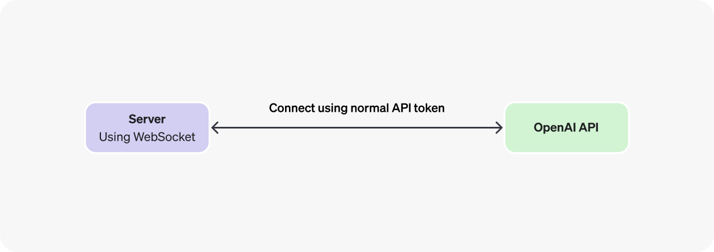
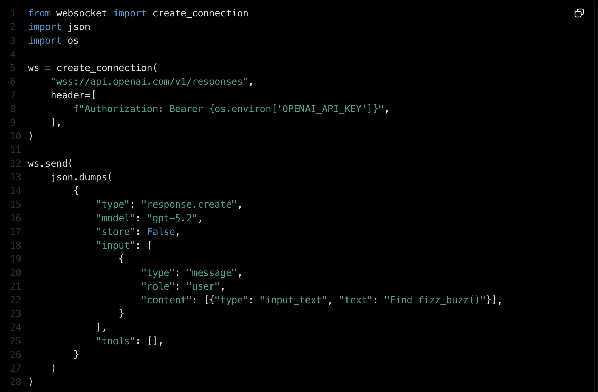
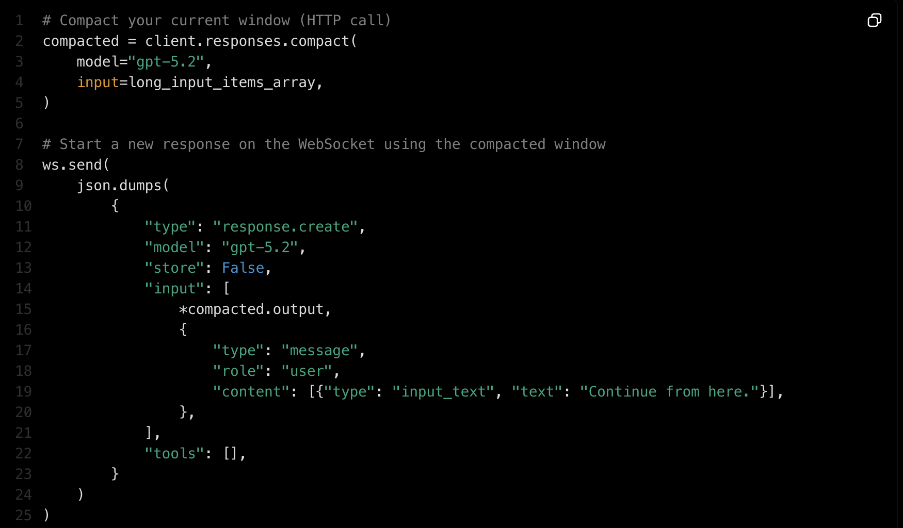

### 🎬 관련 영상
- [🎥 영상 보기](https://ph-files.imgix.net/fb91ce41-7660-478a-9701-325ebf73f1fb.jpeg?auto=format)

---

## 7. [BU](https://www.producthunt.com/products/browser-use)
**Votes**: 116 | **도입 난이도**: 중 | **신뢰도**: 중
**Tagline**: Openclaw in the cloud
**서비스 링크**: https://www.producthunt.com/r/HXDN5YUUKT53RK

**태그**: DevTool, Automation, AI Agent, Agent, AI Tool, Prompting, API

### 📌 이 서비스 한눈에 보기
BU는 프롬프트 한 번으로 완전 자율 AI 에이전트를 배포할 수 있게 해주는 클라우드 기반 솔루션입니다. 브라우저, 터미널, 영구 메모리를 제공하여 복잡한 워크플로우를 자동화합니다.

### 🔑 주요 기능
- 단일 프롬프트로 AI 에이전트 배포
- 브라우저, 터미널, 영구 메모리 제공
- Slack, Gmail, Linear 등 다양한 서비스 연동

### 🙋 사용자에게 어떤 점이 좋은가
웹 모니터링, 테스트, 스크래핑 등 다양한 작업을 자동화하여 업무 효율성을 높이고, 복잡한 워크플로우를 간소화할 수 있습니다.

### ✅ 지금 바로 써볼 기능
- Slack 연동하여 알림 자동화
- 웹사이트 모니터링 에이전트 생성
- Gmail 연동하여 이메일 자동화

### ⚠️ 사용 전 확인할 점
- AI 에이전트의 자율성에 따른 잠재적 오류 가능성
- 연동 서비스의 API 변경에 따른 영향

### 🧭 확인이 더 필요한 정보
AI 에이전트의 성능 및 안정성에 대한 사용자 피드백이 필요합니다.

### 📸 스크린샷 및 갤러리
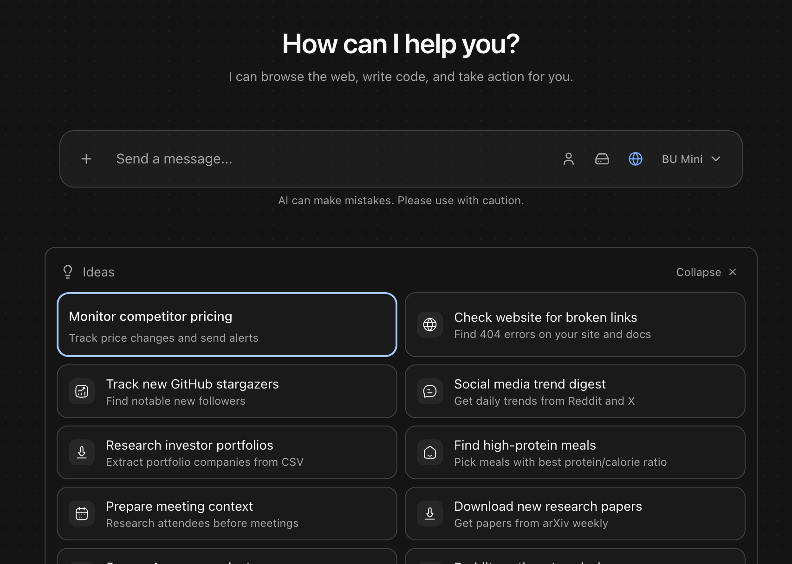
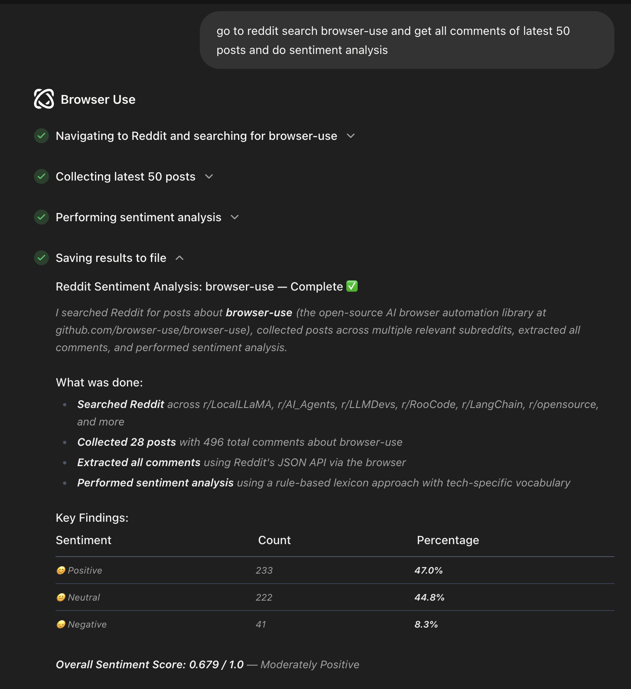

### 🎬 관련 영상
- [🎥 영상 보기](https://ph-files.imgix.net/c44ab24b-0964-488b-a7aa-7472ff609ac9.jpeg?auto=format)

---

## 8. [Octrafic](https://www.producthunt.com/products/octrafic)
**Votes**: 109 | **도입 난이도**: 중 | **신뢰도**: 중
**Tagline**: Test your APIs in plain English, straight from the terminal
**서비스 링크**: https://www.producthunt.com/r/T4DBI56LWMCROM

**태그**: API, Testing, CLI, Open Source, DevTool, AI Tool

### 📌 이 서비스 한눈에 보기
Octrafic은 OpenAPI 스펙 또는 라이브 엔드포인트를 이용하여 API 테스트를 영어로 쉽게 작성하고 실행할 수 있는 오픈소스 CLI 도구입니다.

### 🔑 주요 기능
- 테스트 스크립트, GUI, Mock 없이 사용 가능
- OpenAI, Claude, Ollama 및 OpenAI 호환 제공업체 지원
- 요청 생성, 응답 검증, PDF 보고서 내보내기 기능 제공

### 🙋 사용자에게 어떤 점이 좋은가
API 테스트를 위해 복잡한 스크립트 작성 없이 자연어 명령만으로 테스트를 수행하고 결과를 빠르게 확인할 수 있어 개발 효율성을 높여줍니다.

### ✅ 지금 바로 써볼 기능
- OpenAPI 스펙 또는 라이브 엔드포인트 지정하여 테스트 시작
- 테스트할 내용을 영어로 작성
- PDF 보고서 내보내기 기능 활용

### ⚠️ 사용 전 확인할 점
- 자연어 처리 성능에 따라 테스트 정확도가 달라질 수 있음
- OpenAPI 스펙의 정확성이 중요함

### 🧭 확인이 더 필요한 정보
다양한 API 환경에서의 호환성 및 성능 검증이 필요합니다.

### 📸 스크린샷 및 갤러리
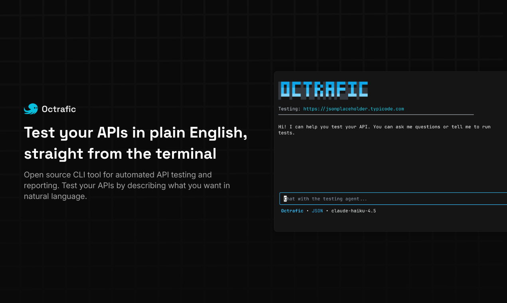
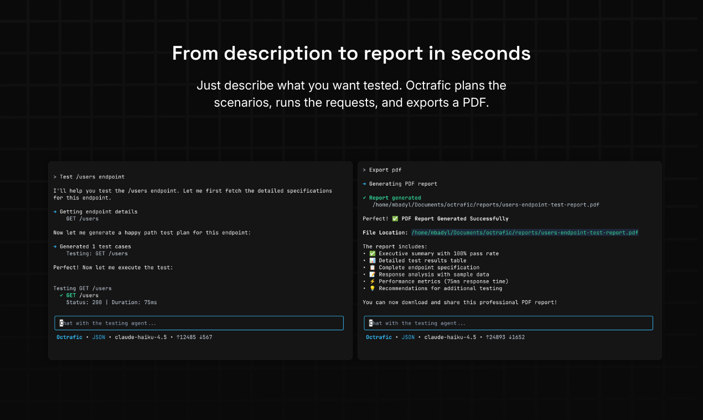
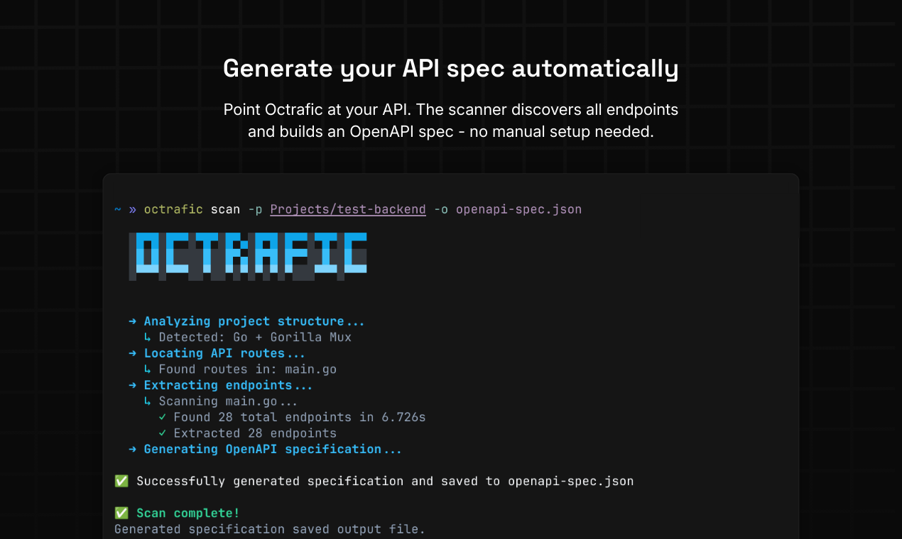

---

## 9. [Epismo Skills](https://www.producthunt.com/products/epismo)
**Votes**: 96 | **도입 난이도**: 중 | **신뢰도**: 중
**Tagline**: Everything your agent needs to run reliably
**서비스 링크**: https://www.producthunt.com/r/6CO62K6WKNM5RS

**태그**: 자동화, 워크플로우, 생산성, Agent, Automation

### 📌 이 서비스 한눈에 보기
Epismo Skills는 에이전트가 안정적으로 실행될 수 있도록 커뮤니티에서 검증된 모범 사례를 즉시 적용하고 실행할 수 있게 해주는 도구입니다.

### 🔑 주요 기능
- 커뮤니티 워크플로우 검색 및 프로젝트 적용
- 실용적인 전문 지식을 재사용 가능한 워크플로우로 전환
- 가져온 워크플로우를 프로젝트에 연결하여 실행, 추적 및 관리

### 🙋 사용자에게 어떤 점이 좋은가
에이전트의 성능을 향상시키고, 팀의 노하우를 효율적으로 관리하며, 프로젝트를 체계적으로 운영할 수 있도록 도와줍니다.

### ✅ 지금 바로 써볼 기능
- 커뮤니티 워크플로우 검색하여 프로젝트에 적용해보기
- 자신의 전문 지식을 워크플로우로 만들어보기
- 워크플로우를 프로젝트에 연결하여 관리해보기

### ⚠️ 사용 전 확인할 점
- 커뮤니티 워크플로우의 신뢰성 검증 필요
- 워크플로우의 복잡성에 따른 학습 곡선 존재

### 🧭 확인이 더 필요한 정보
커뮤니티 워크플로우의 다양성과 최신성에 대한 지속적인 확인이 필요합니다.

### 📸 스크린샷 및 갤러리
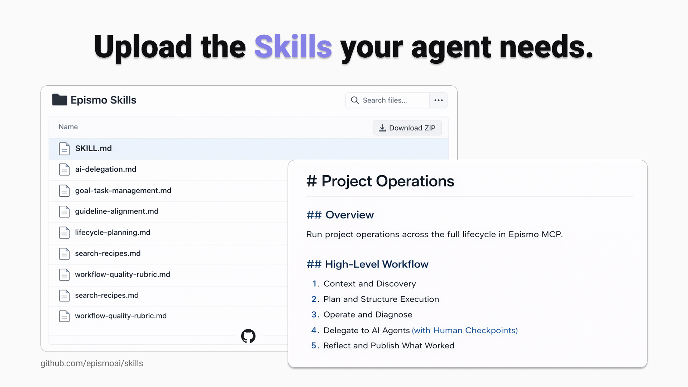
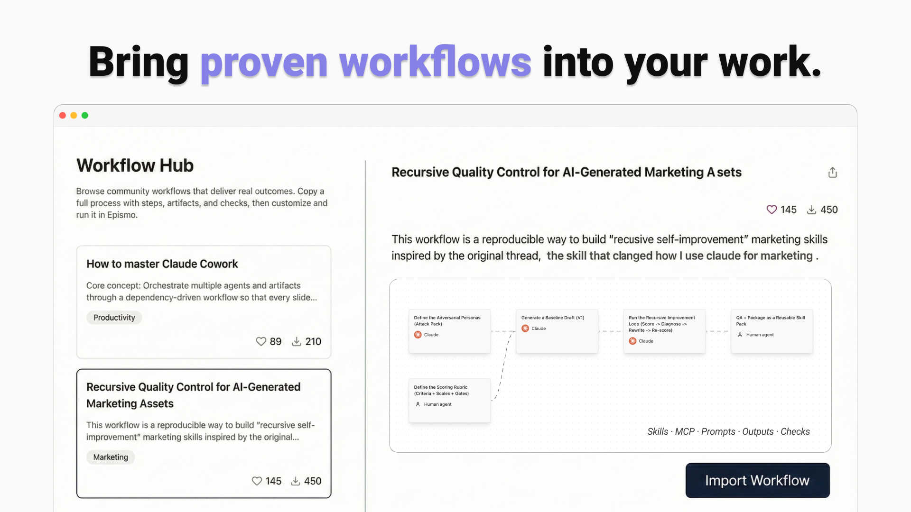
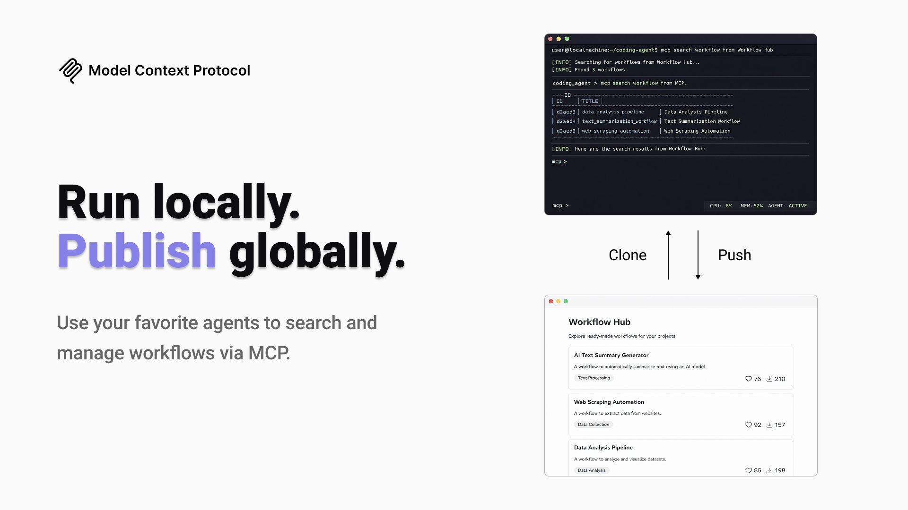

---

## 10. [Hearica](https://www.producthunt.com/products/hearica)
**Votes**: 88 | **도입 난이도**: 중 | **신뢰도**: 중
**Tagline**: Turn all computer audio into captions for the deaf 
**서비스 링크**: https://www.producthunt.com/r/VNUS72QP6MV6W7

**태그**: 접근성, 생산성, 오디오, 자막, AI Tool, Video

### 📌 이 서비스 한눈에 보기
Hearica는 컴퓨터에서 재생되는 모든 오디오를 실시간 자막으로 변환하여 청각 장애인이나 소리가 잘 들리지 않는 환경에서도 편리하게 사용할 수 있도록 돕습니다.

### 🔑 주요 기능
- 컴퓨터의 모든 오디오를 캡션으로 변환
- 실시간 캡션 제공 및 화면에 오버레이
- 60개 이상의 언어로 번역 지원

### 🙋 사용자에게 어떤 점이 좋은가
화상 회의, 온라인 강의, 비디오 시청 등 모든 상황에서 놓치는 내용 없이 소통할 수 있도록 도와줍니다. 청각 장애인 뿐만 아니라 소음이 심한 환경에서도 유용합니다.

### ✅ 지금 바로 써볼 기능
- 실시간 캡션 기능 사용해보기
- 다양한 언어 번역 기능 사용해보기
- 캡션 저장 및 내보내기 기능 사용해보기

### ⚠️ 사용 전 확인할 점
- 오디오 품질에 따라 캡션 정확도가 달라질 수 있음
- 특정 환경에서는 오버레이가 제대로 작동하지 않을 수 있음

### 🧭 확인이 더 필요한 정보
Hearica의 시스템 리소스 사용량 및 배터리 소모량에 대한 추가 정보가 필요합니다.

### 📸 스크린샷 및 갤러리
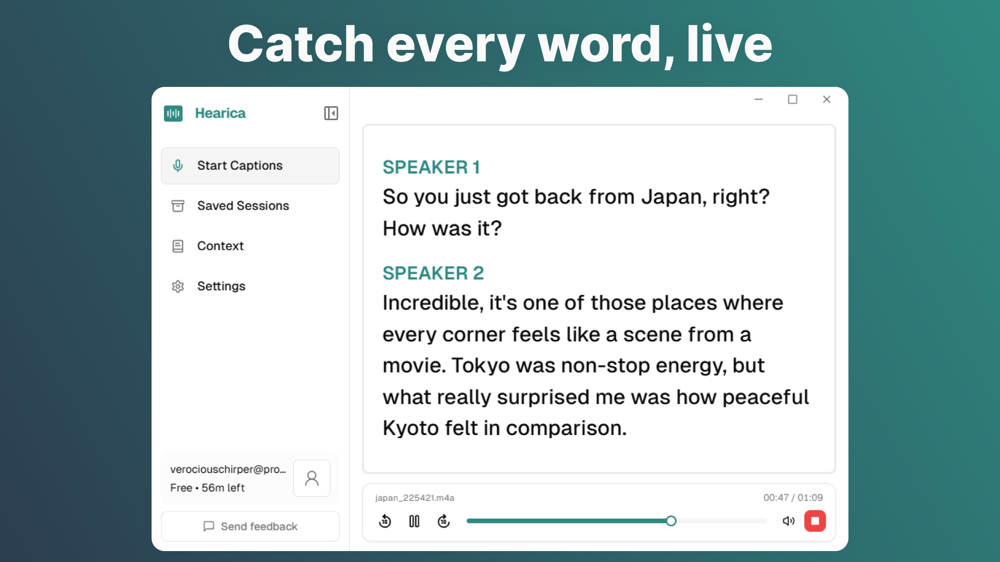

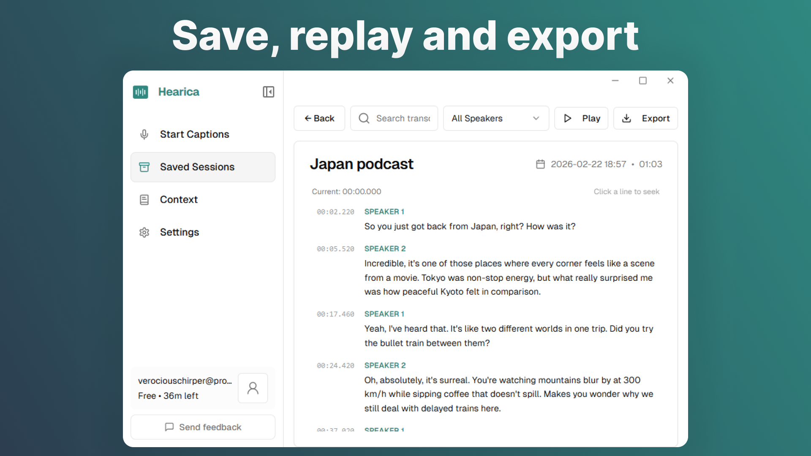

### 🎬 관련 영상
- [🎥 영상 보기](https://ph-files.imgix.net/17f681d2-5963-480b-b213-ae2065416001.jpeg?auto=format)

---

