# 🚀 Product Hunt Daily Top 10 (2026-03-05)

## 1. [Anything API](https://www.producthunt.com/products/notte)
**Votes**: 326 | **도입 난이도**: 중 | **신뢰도**: 중
**Tagline**: Any website. We deliver the API.
**서비스 링크**: https://www.producthunt.com/r/XORVIP366I6U5U

**태그**: DevTool, API, Automation, Web Scraping, Agent

### 📌 이 서비스 한눈에 보기
Anything API는 웹사이트 API가 없는 경우에도 원하는 작업을 API로 만들어 배포할 수 있게 해주는 서비스입니다.

### 🔑 주요 기능
- 웹사이트 API가 없어도 API를 만들 수 있습니다.
- 서버리스 배포, Cron 스케줄링, API 호출 등 다양한 방식으로 활용 가능합니다.
- Notte에게 원하는 작업을 설명하면 맞춤형 함수 엔드포인트를 제공합니다.

### 🙋 사용자에게 어떤 점이 좋은가
웹 스크래핑이나 자동화 작업을 API로 쉽게 만들어 사용할 수 있어 개발 시간을 단축하고 효율성을 높일 수 있습니다.

### ✅ 지금 바로 써볼 기능
- Notte에게 원하는 작업 설명하기
- 제공된 함수 엔드포인트 서버리스로 배포하기
- Cron을 사용하여 API 호출 스케줄링하기

### ⚠️ 사용 전 확인할 점
- API를 만들 수 있는 웹사이트의 종류 및 작업 범위 확인 필요
- Notte에게 작업을 얼마나 상세히 설명해야 하는지 확인 필요

### 🧭 확인이 더 필요한 정보
Notte의 응답 시간 및 API 생성 성공률에 대한 추가 정보가 필요합니다.

### 📸 스크린샷 및 갤러리
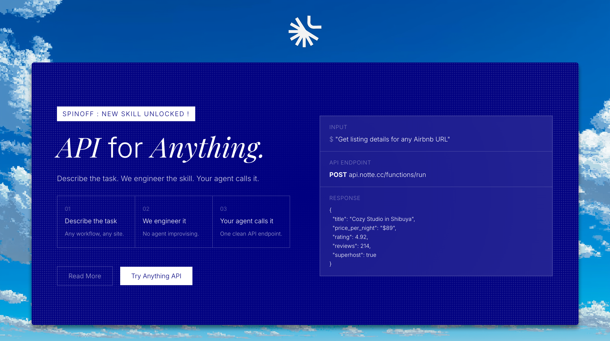
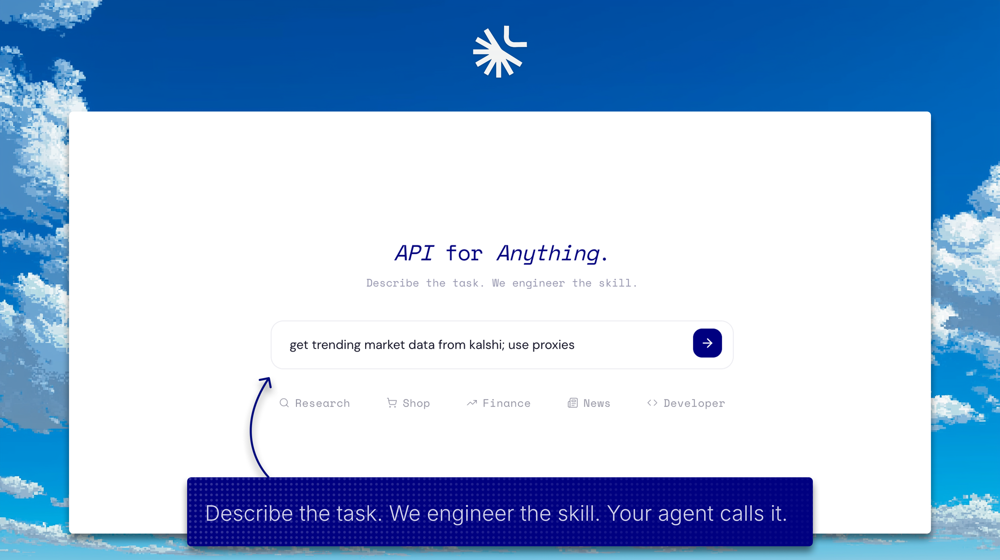
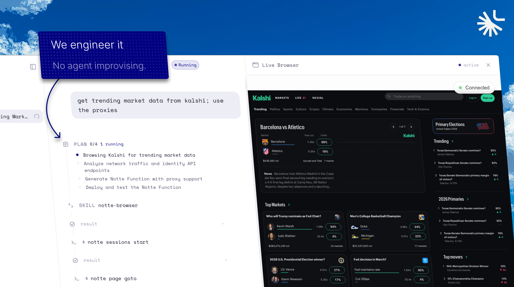

### 🎬 관련 영상
- [🎥 영상 보기](https://ph-files.imgix.net/967eefb8-709a-47b0-afc0-f0061ee03188.jpeg?auto=format)

---

## 2. [Kodo](https://www.producthunt.com/products/kodo-3)
**Votes**: 236 | **도입 난이도**: 중 | **신뢰도**: 중
**Tagline**: Create fully editable designs by chatting with AI
**서비스 링크**: https://www.producthunt.com/r/EWHRT3ACB66Z6J

**태그**: AI, 디자인, 자동화, 그래픽, AI Tool, Chat, Prompting, Vision, Design

### 📌 이 서비스 한눈에 보기
Kodo는 AI와 대화하며 완전 편집 가능한 디자인을 만들 수 있게 해주는 도구입니다. 포스터, 슬라이드, 메뉴, 소셜 그래픽 등을 템플릿 없이 즉시 생성, 수정, 내보내기 가능합니다.

### 🔑 주요 기능
- AI 기반 디자인 도구로, 프롬프트만으로 디자인 생성 가능
- 생성된 디자인은 텍스트, 색상, 레이아웃 등 모든 요소 편집 가능
- 템플릿 없이 몇 분 안에 디자인 생성, 수정, 내보내기 가능

### 🙋 사용자에게 어떤 점이 좋은가
다른 AI 디자인 도구와 달리 편집 불가능한 이미지가 아닌, 사용자가 원하는 대로 수정 가능한 디자인을 제공하여 시간과 노력을 절약해줍니다.

### ✅ 지금 바로 써볼 기능
- 프롬프트를 사용하여 포스터 디자인 생성해보기
- 생성된 디자인의 텍스트 및 색상 변경해보기
- 다양한 프롬프트를 시도하여 원하는 디자인 얻어보기

### ⚠️ 사용 전 확인할 점
- AI가 생성하는 디자인의 품질은 프롬프트에 따라 달라질 수 있음
- 복잡한 디자인의 경우, AI 생성에 시간이 오래 걸릴 수 있음

### 🧭 확인이 더 필요한 정보
Kodo의 AI 디자인 생성 품질 및 편집 기능의 완성도에 대한 사용자 리뷰 확인이 필요합니다.

### 📸 스크린샷 및 갤러리

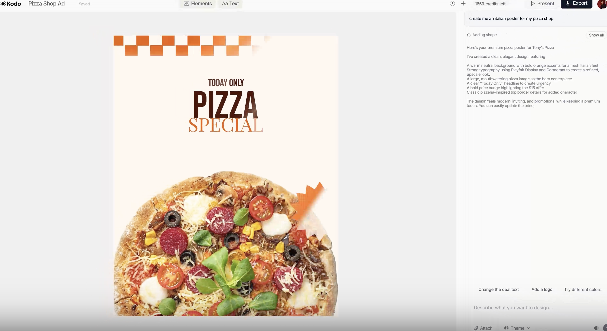
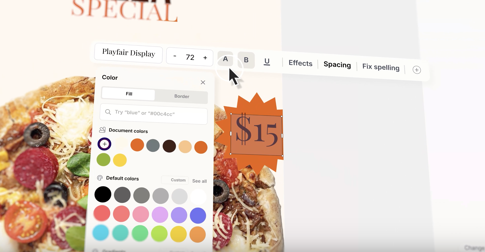

### 🎬 관련 영상
- [🎥 영상 보기](https://ph-files.imgix.net/5644c0e4-6d96-43fb-b9f3-f04dc5aa8790.gif?auto=format)

---

## 3. [Enia Code](https://www.producthunt.com/products/enia-code)
**Votes**: 216 | **도입 난이도**: 중 | **신뢰도**: 중
**Tagline**: Proactive AI that refines code & learns your standards
**서비스 링크**: https://www.producthunt.com/r/KXALRUT4YHMUUE

**태그**: DevTool, AI, 코드 분석, 자동화, Agent, Automation, AI Tool, Prompting

### 📌 이 서비스 한눈에 보기
Enia Code는 코드를 작성하는 동안 자동으로 버그, 성능 문제, 아키텍처 불일치 등을 감지하여 코드 품질을 향상시켜주는 AI 코딩 에이전트입니다.

### 🔑 주요 기능
- 프롬프트 없이 코드 작성 중 문제 자동 감지
- 버그, 성능 문제, 아키텍처 불일치, 리팩토링 기회 식별
- 기존 워크플로우에 방해 없이 사용 가능

### 🙋 사용자에게 어떤 점이 좋은가
코딩 과정에서 발생하는 잠재적 문제점을 실시간으로 파악하고 개선하여 개발 효율성을 높이고 코드 품질을 향상시킬 수 있습니다. 별도의 명령어 없이 자동으로 분석하므로 사용이 편리합니다.

### ✅ 지금 바로 써볼 기능
- 코드 작성 시 Enia Code 활성화
- 자동으로 감지되는 문제점 및 개선 사항 확인
- 제안된 리팩토링 기회 활용

### ⚠️ 사용 전 확인할 점
- AI가 제안하는 내용이 항상 최적은 아닐 수 있으므로 검토 필요
- 특정 코딩 스타일 또는 아키텍처에 최적화되어 있을 수 있음

### 🧭 확인이 더 필요한 정보
Enia Code가 지원하는 프로그래밍 언어 및 개발 환경에 대한 추가 정보 확인이 필요합니다.

### 📸 스크린샷 및 갤러리
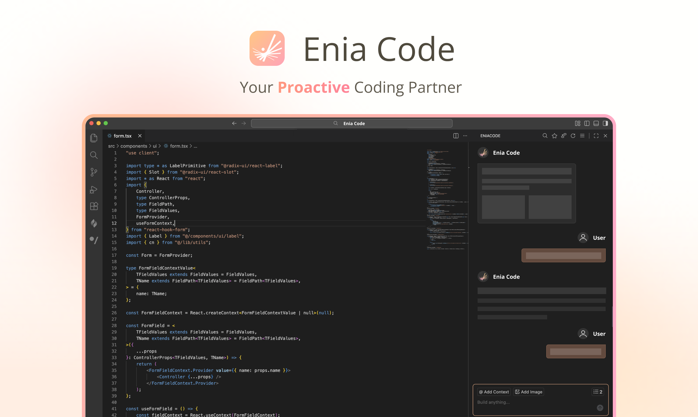
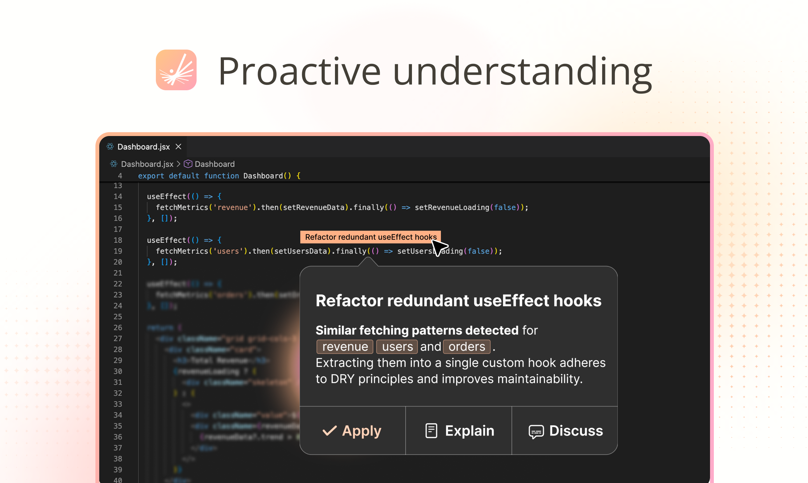
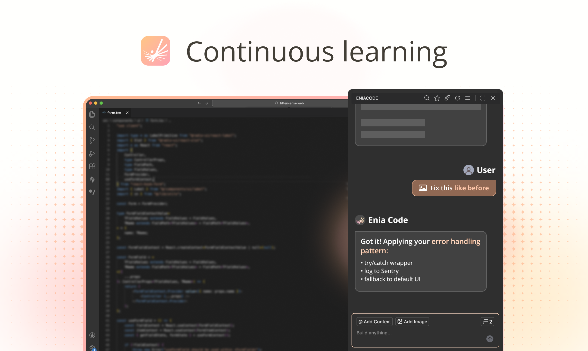

### 🎬 관련 영상
- [🎥 영상 보기](https://ph-files.imgix.net/1a1758bb-291f-4046-927a-92a7f34553e6.jpeg?auto=format)

---

## 4. [Gemini 3.1 Flash-Lite](https://www.producthunt.com/products/gemini-6)
**Votes**: 205 | **도입 난이도**: 중 | **신뢰도**: 중
**Tagline**: Best-in-class intelligence for your high-volume workloads
**서비스 링크**: https://www.producthunt.com/r/D5ZTQM2ERPLXVN

**태그**: AI, LLM, 성능, 비용 효율성

### 📌 이 서비스 한눈에 보기
Gemini 3.1 Flash-Lite는 Gemini 3 시리즈 중 가장 빠르고 비용 효율적인 모델로, 고성능 작업에 적합합니다.

### 🔑 주요 기능
- 2.5 Flash 대비 2.5배 빠른 첫 번째 토큰 생성 속도
- 45% 더 높은 출력 속도
- 입력 토큰당 $0.25, 출력 토큰당 $1.50의 저렴한 비용

### 🙋 사용자에게 어떤 점이 좋은가
대량의 데이터를 빠르게 처리해야 하는 작업에 적합하며, 비용 효율성까지 높아 경제적인 솔루션입니다.

### ✅ 지금 바로 써볼 기능
- 대용량 데이터 처리 작업에 적용해보기
- 기존 모델 대비 속도 및 비용 효율성 비교해보기
- 다양한 작업 부하 테스트를 통해 성능 확인하기

### ⚠️ 사용 전 확인할 점
- Gemini 3.1 Flash-Lite의 품질이 모든 작업에서 기존 모델과 동일한지 확인 필요
- 특정 작업에서 속도 향상이 제한적일 수 있음

### 🧭 확인이 더 필요한 정보
실제 사용 환경에서의 성능은 작업 유형 및 데이터 특성에 따라 달라질 수 있습니다.

### 📸 스크린샷 및 갤러리
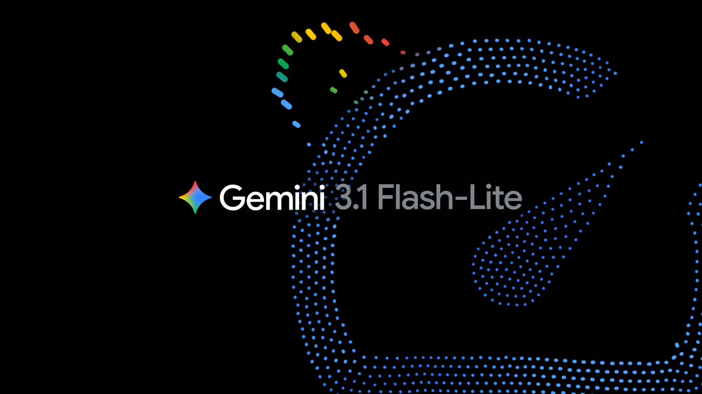
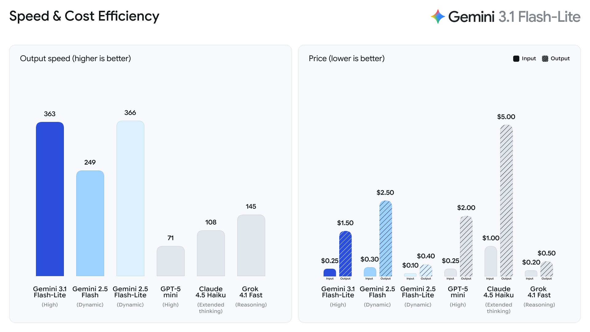
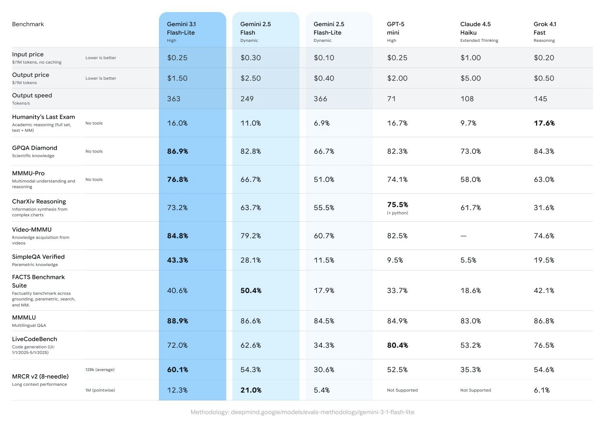

### 🎬 관련 영상
- [🎥 영상 보기](https://ph-files.imgix.net/34a06c13-ca43-4c70-b8db-4794e8b1509c.jpeg?auto=format)

---

## 5. [Picsart Persona & Storyline  ](https://www.producthunt.com/products/picsart)
**Votes**: 177 | **도입 난이도**: 중 | **신뢰도**: 중
**Tagline**: Design your AI influencer and create any story with it.
**서비스 링크**: https://www.producthunt.com/r/7EUQDHHXEE272O

**태그**: AI, 콘텐츠 제작, 캐릭터 디자인, 스토리텔링, 자동화, AI Tool, Design

### 📌 이 서비스 한눈에 보기
Picsart Persona & Storyline으로 AI 캐릭터를 디자인하고, 이 캐릭터를 활용해 다양한 스토리를 쉽게 만들어 보세요. 카메라 없이도 가능합니다.

### 🔑 주요 기능
- AI 캐릭터 디자인: 원하는 스타일의 AI 페르소나를 직접 디자인 가능
- 스토리텔링 자동화: 디자인한 캐릭터를 활용하여 짧은 영상, 시리즈, 전체 스토리 제작 가능
- 간편한 콘텐츠 제작: 카메라 없이도 일관된 캐릭터로 다양한 숏폼 콘텐츠 제작 가능

### 🙋 사용자에게 어떤 점이 좋은가
유튜브, 틱톡 등에서 얼굴을 드러내지 않고도 AI 캐릭터를 활용하여 콘텐츠를 제작하고 스토리를 전달할 수 있어 편리합니다.

### ✅ 지금 바로 써볼 기능
- Picsart Persona로 나만의 AI 캐릭터 디자인해보기
- AI Storyline으로 간단한 숏폼 영상 스토리 만들어보기
- 다양한 스타일의 AI 캐릭터를 디자인하여 콘텐츠에 활용해보기

### ⚠️ 사용 전 확인할 점
- AI 캐릭터 디자인의 자유도가 사용자의 기대와 다를 수 있음
- 생성되는 스토리의 품질은 사용자의 설정 및 AI 성능에 따라 달라질 수 있음

### 🧭 확인이 더 필요한 정보
AI 캐릭터 디자인 및 스토리 생성 기능의 성능과 사용자 만족도에 대한 추가적인 사용 후기 확인이 필요합니다.

### 📸 스크린샷 및 갤러리

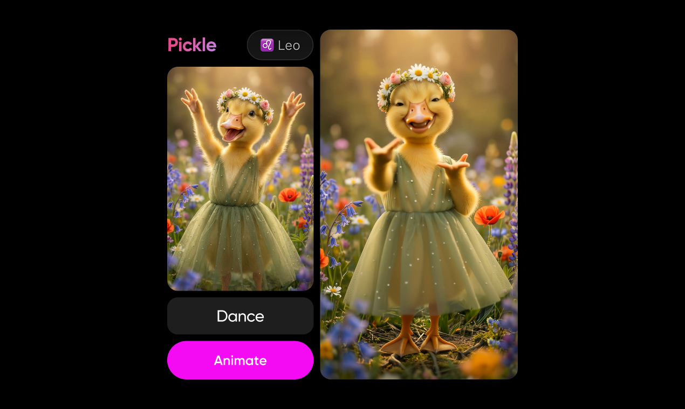

### 🎬 관련 영상
- [🎥 영상 보기](https://ph-files.imgix.net/46d70c93-fb73-4eb7-8f12-85a70caa827b.jpeg?auto=format)

---

## 6. [GPT‑5.3 Instant in ChatGPT](https://www.producthunt.com/products/openai)
**Votes**: 154 | **도입 난이도**: 하 | **신뢰도**: 중
**Tagline**: More accurate, less cringe, smoother & useful daily chats!
**서비스 링크**: https://www.producthunt.com/r/6ERZC2G6HOUV4V

**태그**: ChatGPT, AI, 대화형 AI, 생성형 AI, AI Tool, Chat

### 📌 이 서비스 한눈에 보기
ChatGPT에서 GPT-5.3 Instant를 사용하면 더 정확하고 자연스러운 대화가 가능하며, 불필요한 거절 없이 원하는 답변을 얻을 수 있습니다.

### 🔑 주요 기능
- 더욱 정확한 답변 제공
- 웹 정보 통합 능력 향상
- 불필요한 거절 감소 및 자연스러운 대화 톤

### 🙋 사용자에게 어떤 점이 좋은가
기존 ChatGPT보다 더욱 향상된 성능으로 일상적인 대화는 물론, 정보 검색 및 활용에 있어서도 더 나은 결과를 얻을 수 있습니다. 특히 어색함 없이 자연스러운 대화가 가능해 사용자 경험이 향상됩니다.

### ✅ 지금 바로 써볼 기능
- ChatGPT에서 GPT-5.3 Instant를 기본 설정으로 사용해 보기
- 기존에 불편했던 질문을 다시 시도해 보기
- 웹 검색 기능을 활용하여 정보 검색 정확도 비교해 보기

### ⚠️ 사용 전 확인할 점
- GPT-5.3 Instant의 답변이 항상 완벽하게 정확하지 않을 수 있음을 인지
- 새로운 모델이므로 기존 모델과의 호환성 문제를 확인

### 🧭 확인이 더 필요한 정보
GPT-5.3 Instant의 장기적인 성능 유지 및 개선 여부에 대한 추가적인 정보 확인이 필요합니다.

### 📸 스크린샷 및 갤러리
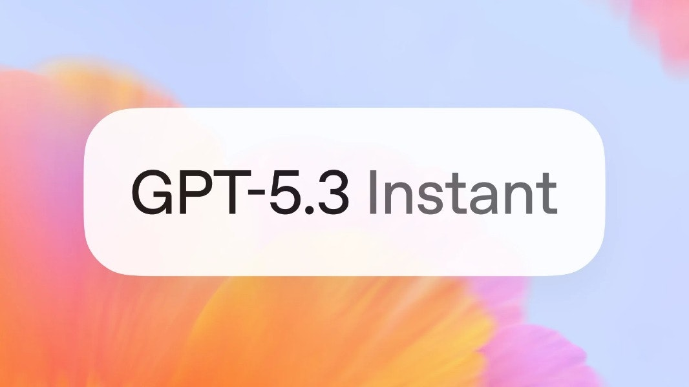

### 🎬 관련 영상
- [🎥 영상 보기](https://ph-files.imgix.net/82fa22dc-2f75-4f32-ac6f-c183ff14d658.jpeg?auto=format)

---

## 7. [Maxclaw on Mobile](https://www.producthunt.com/products/maxclaw-on-mobile)
**Votes**: 122 | **도입 난이도**: 중 | **신뢰도**: 중
**Tagline**: Build apps, research deeply and automate multi-step tasks
**서비스 링크**: https://www.producthunt.com/r/6DBSCHHS3X4Q4A

**태그**: DevTool, Automation, Mobile, AI, Agent

### 📌 이 서비스 한눈에 보기
MiniMax는 복잡한 목표를 달성하기 위해 멀티 에이전트 시스템을 활용, 앱 개발, 심층 연구, 멀티 스텝 자동화 작업을 모바일에서 전문가 수준으로 실행할 수 있도록 돕습니다.

### 🔑 주요 기능
- MiniMax-M2.5 모델 기반으로 복잡한 목표를 세분화하고 자동화
- 심층 연구 보고서, 풀스택 애플리케이션, 멀티모달 프레젠테이션 등 다양한 결과물 생성
- 모바일 기기에서 바로 사용 가능

### 🙋 사용자에게 어떤 점이 좋은가
복잡한 작업을 자동화하여 시간과 노력을 절약하고, 전문가 수준의 결과물을 쉽게 얻을 수 있습니다. 특히 이동 중에도 앱 개발, 연구, 자동화 작업을 수행할 수 있어 생산성을 높일 수 있습니다.

### ✅ 지금 바로 써볼 기능
- 심층 연구 보고서 생성
- 풀스택 애플리케이션 개발
- 멀티모달 프레젠테이션 제작

### ⚠️ 사용 전 확인할 점
- MiniMax-M2.5 모델의 성능에 따라 결과물의 품질이 달라질 수 있습니다.
- 복잡한 작업일수록 결과물을 검토하고 수정하는 과정이 필요할 수 있습니다.

### 🧭 확인이 더 필요한 정보
MiniMax-M2.5 모델의 구체적인 성능 지표 및 사용 사례에 대한 추가 정보가 필요합니다.

### 📸 스크린샷 및 갤러리
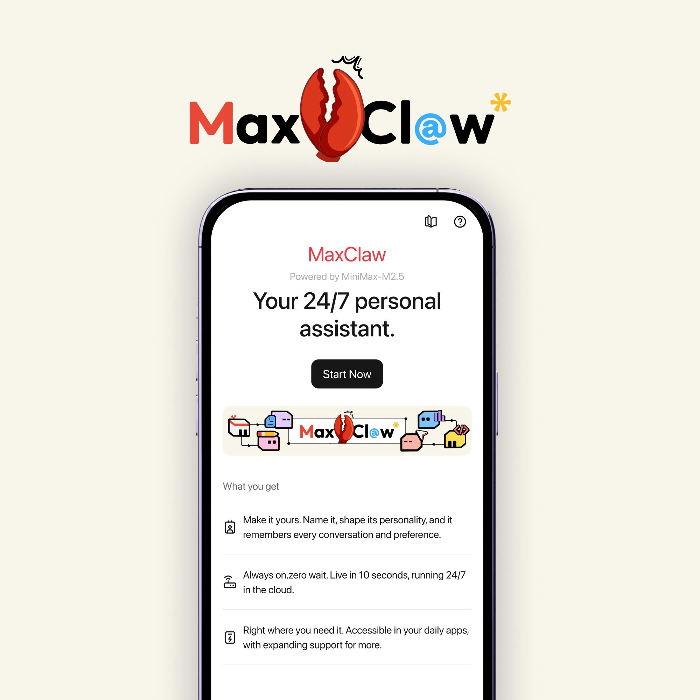

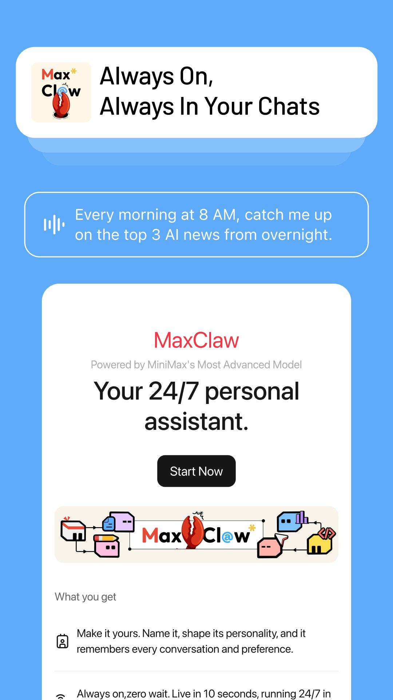

---

## 8. [Vocova](https://www.producthunt.com/products/vocova)
**Votes**: 119 | **도입 난이도**: 중 | **신뢰도**: 중
**Tagline**: Transcribe audio & video from 1,000+ platforms
**서비스 링크**: https://www.producthunt.com/r/SOIYHIRWCNMHDN

**태그**: 생산성, AI, 번역, 텍스트 변환, AI Tool, Video, DevTool

### 📌 이 서비스 한눈에 보기
Vocova는 YouTube, TikTok, Zoom 등 1,000개 이상의 플랫폼에서 오디오 및 비디오를 100개 이상의 언어로 텍스트로 변환하여 사용자가 쉽게 콘텐츠를 활용하고 편집할 수 있도록 돕습니다.

### 🔑 주요 기능
- 100개 이상의 언어 지원
- 화자 식별 및 타임스탬프 제공
- 다양한 파일 형식으로 내보내기 가능

### 🙋 사용자에게 어떤 점이 좋은가
회의, 강의, 인터뷰 등의 오디오/비디오 파일을 텍스트로 빠르게 변환하여 내용을 쉽게 파악하고 편집할 수 있으며, 다국어 번역 기능으로 글로벌 협업에 유용합니다.

### ✅ 지금 바로 써볼 기능
- YouTube 링크를 붙여넣어 텍스트 변환 시도
- 화자 식별 기능 확인
- AI 요약 및 Q&A 추출 기능 사용

### ⚠️ 사용 전 확인할 점
- 변환 품질은 오디오/비디오 품질에 따라 달라질 수 있음
- 지원하지 않는 플랫폼이 있을 수 있음

### 🧭 확인이 더 필요한 정보
무료 사용량 제한 및 유료 플랜 가격 정보 확인이 필요합니다.

### 📸 스크린샷 및 갤러리
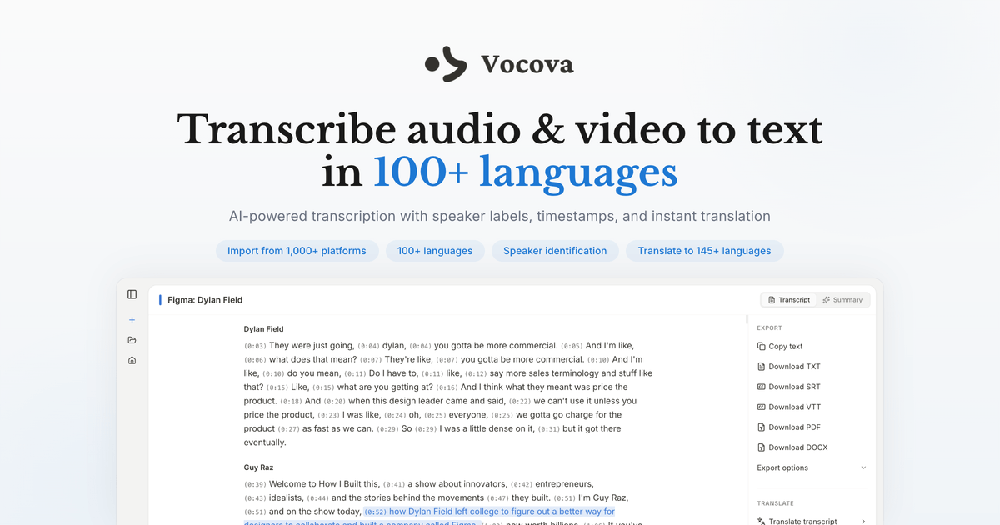
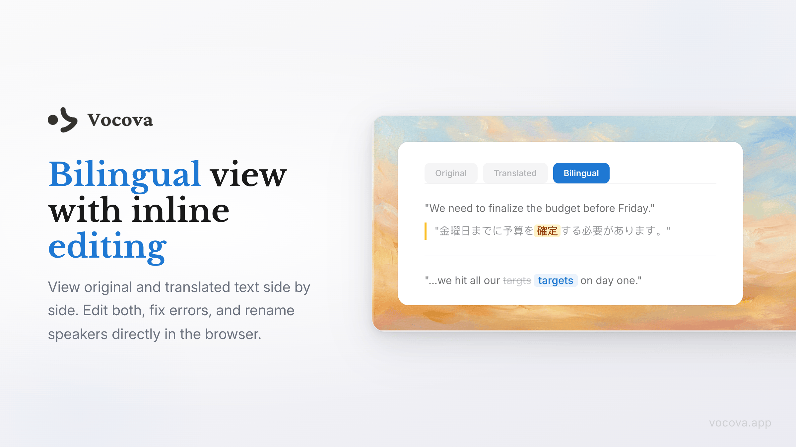
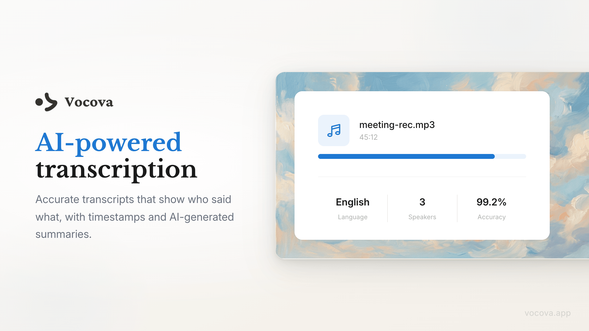

### 🎬 관련 영상
- [🎥 영상 보기](https://ph-files.imgix.net/6854fe8e-6136-412f-b566-2e3a6f3b9a99.jpeg?auto=format)

---

## 9. [Projekt](https://www.producthunt.com/products/projekt-design-engineered)
**Votes**: 112 | **도입 난이도**: 중 | **신뢰도**: 중
**Tagline**: The BYOK Design & Dev Tool for Building with Agents
**서비스 링크**: https://www.producthunt.com/r/7HFOB4ZZCQW456

**태그**: DevTool, AI, 코딩 자동화, 개발, 에이전트, Agent, AI Tool, Design

### 📌 이 서비스 한눈에 보기
Projekt는 AI 코딩 에이전트를 활용하여 앱 개발을 간소화하고, 사용자가 직접 API 키를 관리하여 유연성을 높이는 개발 도구입니다.

### 🔑 주요 기능
- AI 코딩 에이전트들을 한 작업 공간에서 관리
- 실시간 미리보기 및 인라인 편집 기능 제공
- 사용자 API 키를 직접 사용하여 종속성 및 추가 구독 방지

### 🙋 사용자에게 어떤 점이 좋은가
개발자는 Projekt를 통해 AI 기반 코딩 자동화를 경험하고, API 키를 직접 관리함으로써 데이터 보안과 비용 효율성을 높일 수 있습니다.

### ✅ 지금 바로 써볼 기능
- AI 에이전트들을 활용하여 초기 코드 생성해보기
- 실시간 미리보기 기능을 통해 디자인 검토해보기
- 자신의 API 키를 연동하여 사용량 및 비용 관리해보기

### ⚠️ 사용 전 확인할 점
- AI 에이전트의 성능은 사용자의 API 키 및 설정에 따라 달라질 수 있습니다.
- 복잡한 프로젝트의 경우, AI 에이전트의 자동화 수준에 한계가 있을 수 있습니다.

### 🧭 확인이 더 필요한 정보
AI 코딩 에이전트의 성능이 다양한 개발 환경에서 일관적으로 유지되는지 확인이 필요합니다.

### 📸 스크린샷 및 갤러리
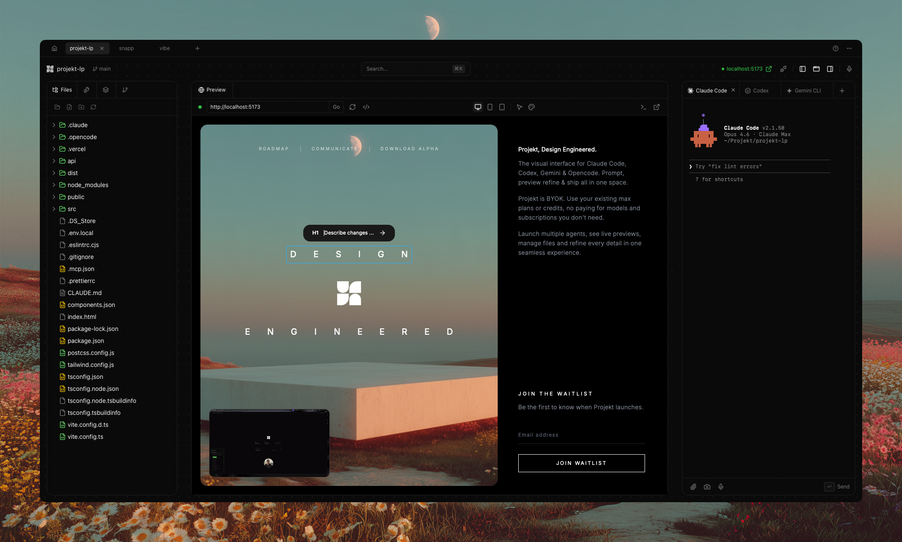
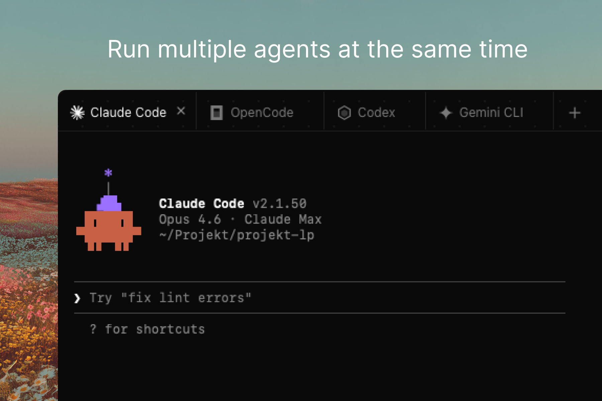
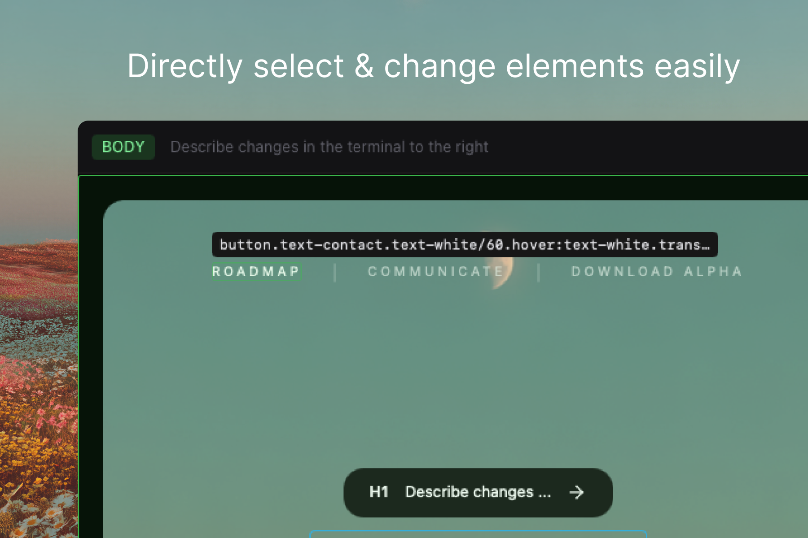

### 🎬 관련 영상
- [🎥 영상 보기](https://ph-files.imgix.net/87679f2e-01c8-4bd6-bdd7-8a30608fdfd3.gif?auto=format)

---

## 10. [day1tabs](https://www.producthunt.com/products/day1tabs)
**Votes**: 107 | **도입 난이도**: 하 | **신뢰도**: 중
**Tagline**: Your tabs close at midnight.See which ones you actually used
**서비스 링크**: https://www.producthunt.com/r/RNIZ7GDLV2RDOG

**태그**: 탭 관리, 생산성, 자동화, 정리, 브라우저 확장, AI Tool, Sales

### 📌 이 서비스 한눈에 보기
day1tabs는 자정에 사용하지 않는 탭을 자동으로 닫아주고, 실제로 사용한 탭과 그렇지 않은 탭을 구분하여 보여줌으로써 탭 관리의 효율성을 높여줍니다.

### 🔑 주요 기능
- 자정에 자동으로 탭 정리
- 사용한 탭과 사용하지 않은 탭 구분
- 중요 탭(Gmail, Docs 등)은 유지

### 🙋 사용자에게 어떤 점이 좋은가
탭을 정리하는 데 시간을 낭비하지 않고, 중요한 정보에 집중할 수 있도록 도와줍니다. 또한, 탭 관리 습관을 개선하여 생산성을 높일 수 있습니다.

### ✅ 지금 바로 써볼 기능
- day1tabs 설치 후 사용
- 유지할 도메인 설정
- 자정 이후 탭 정리 결과 확인

### ⚠️ 사용 전 확인할 점
- 자동으로 닫히는 탭에 중요한 정보가 있는지 확인
- 복구 기능이 있지만, 다음 자동 닫힘 전까지 복구해야 함

### 🧭 확인이 더 필요한 정보
데이터 수집이 전혀 없는지 개인 정보 보호 정책을 추가 확인이 필요합니다.

### 📸 스크린샷 및 갤러리
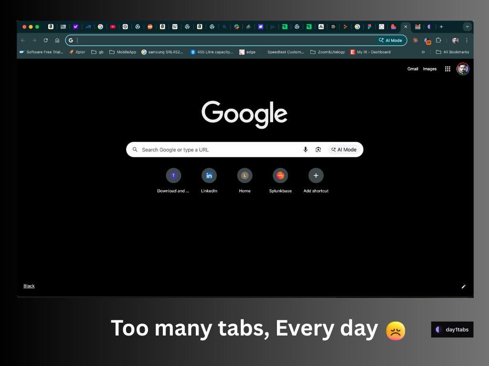

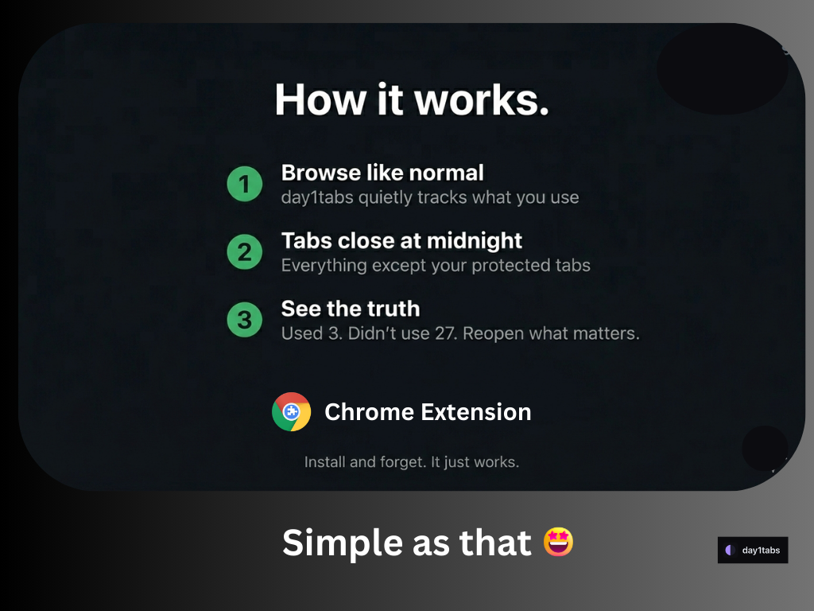

### 🎬 관련 영상
- [🎥 영상 보기](https://ph-files.imgix.net/aa470d3a-62cd-4bbe-b0ae-c4bb63a38f35.jpeg?auto=format)

---

