# 🚀 Product Hunt Daily Top 10 (2026-03-06)

## 1. [Aident AI Beta 2](https://www.producthunt.com/products/aident-ai)
**Votes**: 279 | **도입 난이도**: 중 | **신뢰도**: 중
**Tagline**: Open-world automations, managed in plain English
**서비스 링크**: https://www.producthunt.com/r/ZR222LC6TYKRHS

**태그**: 자동화, AI, 생산성, 워크플로우, Automation, AI Tool, Chat

### 📌 이 서비스 한눈에 보기
Aident AI는 Discord, Slack, X, Shopify 등 다양한 플랫폼에서 1000개 이상의 통합, 23000개 이상의 액션, 1000개 이상의 템플릿을 활용하여 자동화를 구축하고 관리할 수 있게 해주는 AI 기반 자동화 도구입니다.

### 🔑 주요 기능
- 다양한 플랫폼 지원: Discord, Slack, X, Shopify 등 다양한 플랫폼과 통합 가능
- 광범위한 기능: 23000개 이상의 액션과 1000개 이상의 템플릿 제공
- 실시간 모니터링: 실행, 승인, 문제 등을 하나의 라이브 대시보드에서 모니터링 가능

### 🙋 사용자에게 어떤 점이 좋은가
Aident AI를 통해 사용자는 복잡한 코딩 없이도 다양한 작업을 자동화하고, 업무 효율성을 높일 수 있습니다. 또한, 실시간 모니터링 기능을 통해 자동화 프로세스를 효과적으로 관리할 수 있습니다.

### ✅ 지금 바로 써볼 기능
- Discord 또는 Slack에서 자동화 설정해보기
- 제공되는 템플릿을 활용하여 자동화 워크플로우 구축해보기
- 라이브 대시보드를 통해 자동화 실행 상태 모니터링해보기

### ⚠️ 사용 전 확인할 점
- 자동화 설정 시 플랫폼별 API 제한 사항 확인 필요
- 템플릿 사용 시 사용자 정의 필요 여부 검토

### 🧭 확인이 더 필요한 정보
Aident AI의 장기적인 성능 및 안정성에 대한 사용자 피드백을 추가적으로 확인할 필요가 있습니다.

### 📸 스크린샷 및 갤러리

### 🎬 관련 영상
- [🎥 영상 보기](https://ph-files.imgix.net/f2229877-9235-4729-91f5-75aeb1e3955e.jpeg?auto=format)

---

## 2. [MacBook Neo](https://www.producthunt.com/products/apple)
**Votes**: 274 | **도입 난이도**: 하 | **신뢰도**: 중
**Tagline**: The magic of Mac at a surprising price
**서비스 링크**: https://www.producthunt.com/r/W2PM4UX6G5SFXZ

**태그**: MacBook, Apple, 노트북, 가성비, Design

### 📌 이 서비스 한눈에 보기
MacBook Neo: 놀라운 가격에 Mac의 마법을 경험하세요. 599달러부터 시작하는 새로운 MacBook으로, 뛰어난 디자인과 성능, 긴 배터리 수명을 제공합니다.

### 🔑 주요 기능
- 견고한 알루미늄 디자인
- 13인치 Liquid Retina 디스플레이
- Apple Silicon의 강력한 성능

### 🙋 사용자에게 어떤 점이 좋은가
MacBook Neo는 합리적인 가격으로 Mac의 뛰어난 사용 경험을 제공하며, 일상적인 작업과 엔터테인먼트를 위한 충분한 성능과 휴대성을 제공합니다.

### ✅ 지금 바로 써볼 기능
- 웹 서핑 및 문서 작업
- 영상 시청 및 간단한 게임
- Apple 생태계 연동 경험

### ⚠️ 사용 전 확인할 점
- 고성능 작업에는 적합하지 않을 수 있음
- 저장 공간 및 확장성 제한

### 🧭 확인이 더 필요한 정보
정확한 Apple Silicon 칩의 종류와 성능에 대한 추가 정보가 필요합니다.

### 📸 스크린샷 및 갤러리

### 🎬 관련 영상
- [🎥 영상 보기](https://ph-files.imgix.net/6efd19e2-e886-4a8e-8954-6dc2333ef385.jpeg?auto=format)

---

## 3. [Coursekit](https://www.producthunt.com/products/coursekit)
**Votes**: 214 | **도입 난이도**: 중 | **신뢰도**: 중
**Tagline**: Turn your course into a full suite of embeddable AI agents 
**서비스 링크**: https://www.producthunt.com/r/F5L2WLUESWKBX5

**태그**: AI, 교육, 자동화, 노코드, Agent, AI Tool, Sales

### 📌 이 서비스 한눈에 보기
Coursekit은 강의 URL을 기반으로 학생들을 위한 맞춤형 AI 도구 모음을 생성하여 24시간 내내 브랜드 경험을 제공하고 학습을 지원합니다.

### 🔑 주요 기능
- 강의 URL 분석을 통해 AI 도구 자동 생성
- 브랜드 아이덴티티를 반영한 맞춤형 AI 에이전트 제공
- 코딩 없이 간편하게 AI 도구 구축 가능

### 🙋 사용자에게 어떤 점이 좋은가
학생들은 24시간 언제든지 강의 내용을 기반으로 한 AI 도우미의 도움을 받을 수 있으며, 강사는 브랜드 경험을 강화하고 학생 참여도를 높일 수 있습니다.

### ✅ 지금 바로 써볼 기능
- 강의 URL을 입력하여 AI 도구 생성 시작
- 생성된 AI 도구의 브랜드 설정 커스터마이징
- 학생들에게 AI 도구 사용법 안내

### ⚠️ 사용 전 확인할 점
- AI가 분석하는 강의 내용의 정확성 확인 필요
- 생성된 AI 도구의 답변 품질에 대한 지속적인 모니터링 필요

### 🧭 확인이 더 필요한 정보
생성된 AI 도구의 성능이 실제 학생들의 학습 효과에 미치는 영향에 대한 추가적인 검증이 필요합니다.

### 📸 스크린샷 및 갤러리

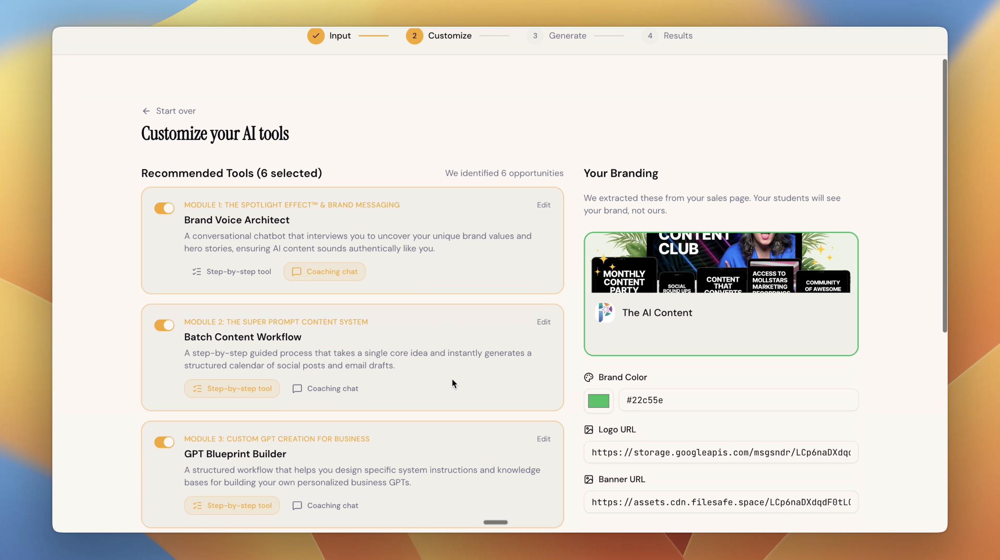
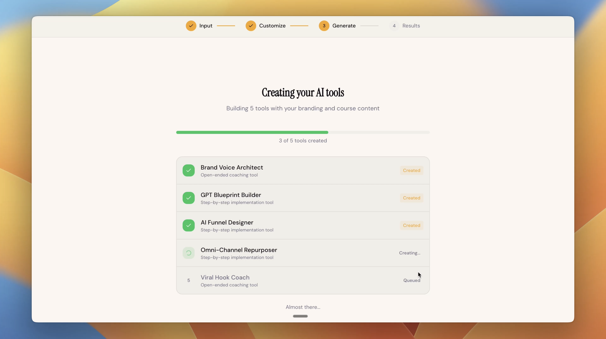

### 🎬 관련 영상
- [🎥 영상 보기](https://ph-files.imgix.net/34bcfd16-0a9b-4361-a735-62febcd38023.jpeg?auto=format)

---

## 4. [Heywa](https://www.producthunt.com/products/heywa)
**Votes**: 205 | **도입 난이도**: 중 | **신뢰도**: 중
**Tagline**: Tappable visual stories instead of ChatGPT text walls
**서비스 링크**: https://www.producthunt.com/r/TI6ZFJH7P4PU5M

**태그**: AI, 시각화, 정보 탐색, 스토리텔링, Chat, Prompting

### 📌 이 서비스 한눈에 보기
Heywa는 ChatGPT 텍스트 대신 탭 가능한 시각적 스토리로 질문에 대한 답변을 제공하여, 사용자가 더 쉽고 빠르게 정보를 탐색하고 이해할 수 있도록 돕습니다.

### 🔑 주요 기능
- 프롬프트 기반으로 시각적 스토리 자동 생성
- 탭 가능한 인터랙티브한 인터페이스 제공
- 긴 텍스트 응답 대신 시각적 정보 탐색

### 🙋 사용자에게 어떤 점이 좋은가
ChatGPT의 긴 텍스트 답변 대신 시각적인 스토리텔링 방식으로 정보를 제공하여 사용자가 정보를 더 직관적으로 이해하고 빠르게 탐색할 수 있도록 도와줍니다. 여러 탭을 열어보거나 긴 채팅 내용을 읽을 필요 없이, 시각적으로 정리된 정보를 통해 효율적인 정보 습득이 가능합니다.

### ✅ 지금 바로 써볼 기능
- 질문 입력 후 시각적 스토리 생성해보기
- 탭 인터페이스를 통해 정보 탐색해보기
- 다양한 질문으로 시각적 스토리텔링 경험해보기

### ⚠️ 사용 전 확인할 점
- 생성되는 시각적 스토리의 정확성 검증 필요
- 정보의 깊이가 텍스트 기반 정보보다 얕을 수 있음

### 🧭 확인이 더 필요한 정보
Heywa가 제공하는 시각적 스토리의 정보 정확도 및 최신성에 대한 추가적인 검증이 필요합니다.

### 📸 스크린샷 및 갤러리

### 🎬 관련 영상
- [🎥 영상 보기](https://ph-files.imgix.net/9f8b3c8c-08f1-48c3-ae47-d2ee30daa8b9.jpeg?auto=format)

---

## 5. [Golf](https://www.producthunt.com/products/golf)
**Votes**: 169 | **도입 난이도**: 중 | **신뢰도**: 중
**Tagline**: Enterprise MCP Control Plane
**서비스 링크**: https://www.producthunt.com/r/7RWZG7JZC6OJL4

**태그**: AI, 보안, 자동화, DevTool, 규정 준수, Agent, AI Tool, Security

### 📌 이 서비스 한눈에 보기
Golf는 AI 에이전트 및 MCP 서버를 중앙 집중적으로 관리, 보안, 감사할 수 있도록 해주는 엔터프라이즈 MCP 컨트롤 플레인입니다.

### 🔑 주요 기능
- AI 에이전트 및 MCP 서버에 대한 중앙 집중식 가시성 제공
- 정책 제어를 통해 보안 및 규정 준수 강화
- 감사 추적을 통해 책임성 확보

### 🙋 사용자에게 어떤 점이 좋은가
AI 에이전트 사용 환경에서 보안, 규정 준수, 제어 기능을 강화하여 더욱 안전하고 효율적인 운영을 가능하게 합니다.

### ✅ 지금 바로 써볼 기능
- 중앙 집중식 가시성 기능으로 AI 에이전트 현황 파악
- 정책 제어 기능을 통해 보안 정책 설정 및 적용
- 감사 추적 기능을 통해 활동 내역 감사

### ⚠️ 사용 전 확인할 점
- 기존 시스템과의 호환성 확인 필요
- 정책 설정 및 관리에 대한 학습 필요

### 🧭 확인이 더 필요한 정보
구체적인 기술 스택 및 지원 범위에 대한 추가 정보가 필요합니다.

### 📸 스크린샷 및 갤러리

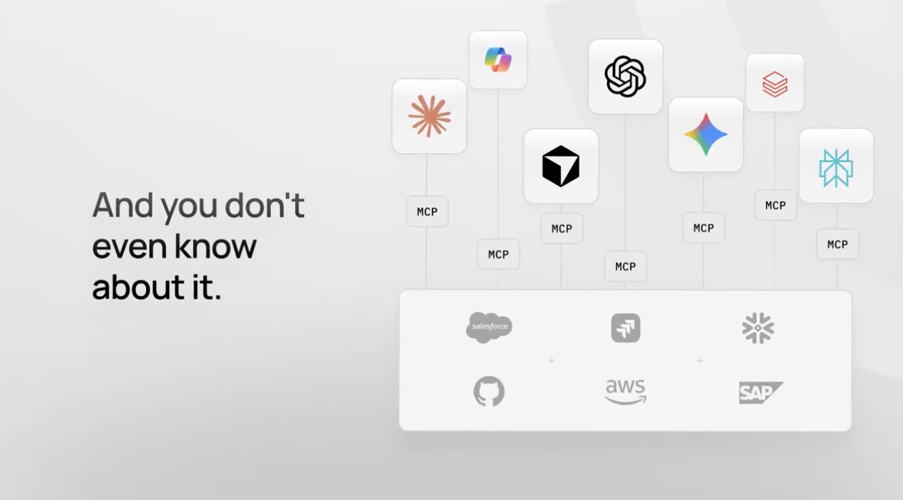
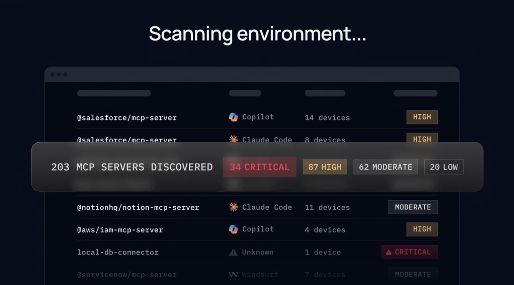

### 🎬 관련 영상
- [🎥 영상 보기](https://ph-files.imgix.net/eef6b051-0777-445d-bb76-67ed4038683b.jpeg?auto=format)

---

## 6. [Willow Voice for Teams](https://www.producthunt.com/products/willow-voice)
**Votes**: 141 | **도입 난이도**: 중 | **신뢰도**: 중
**Tagline**: Kill the keyboard for your team with voice AI
**서비스 링크**: https://www.producthunt.com/r/U5TA7BZVQHIVRR

**태그**: 생산성, AI, 음성인식, 팀 협업, 자동화, AI Tool, Email

### 📌 이 서비스 한눈에 보기
Willow Voice for Teams는 팀을 위한 음성 AI 받아쓰기 도구로, 팀의 고유한 용어와 약어를 정확하게 인식하고 공유 단축키를 통해 템플릿이나 상용구를 쉽게 삽입할 수 있어 생산성을 향상시킵니다.

### 🔑 주요 기능
- 팀 맞춤형 음성 받아쓰기 기능 제공
- 공유 단축키를 통한 템플릿 및 상용구 삽입
- SOC 2 및 HIPAA 규정 준수

### 🙋 사용자에게 어떤 점이 좋은가
팀 내 의사소통 속도를 높이고, 반복적인 텍스트 입력 작업을 줄여 업무 효율성을 높일 수 있습니다. 특히, 회사 고유의 용어 사용이 많은 경우 유용합니다.

### ✅ 지금 바로 써볼 기능
- 팀에서 자주 사용하는 용어 및 약어 등록
- 자주 사용하는 이메일 서명이나 템플릿을 단축키로 설정
- 다양한 문서 작성 시 음성 받아쓰기 기능 활용

### ⚠️ 사용 전 확인할 점
- 음성 인식 정확도는 사용 환경 및 발음에 따라 달라질 수 있음
- 개인 정보 보호를 위해 민감한 정보는 직접 입력하는 것이 안전함

### 🧭 확인이 더 필요한 정보
Willow Voice for Teams의 다양한 기능이 실제 팀 환경에서 얼마나 효율적으로 작동하는지 확인이 필요합니다.

### 📸 스크린샷 및 갤러리
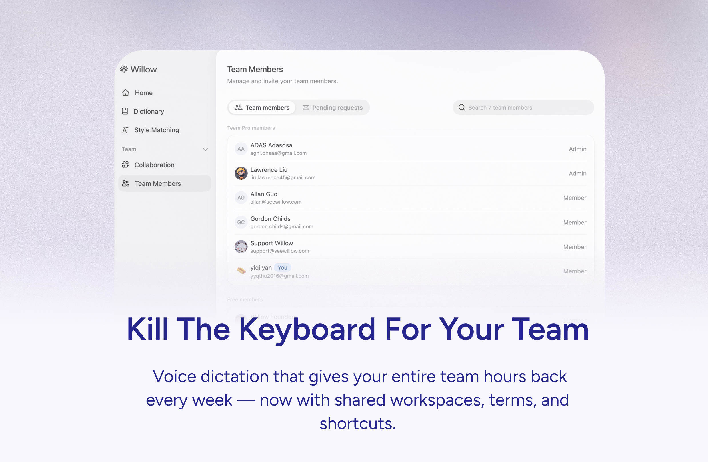
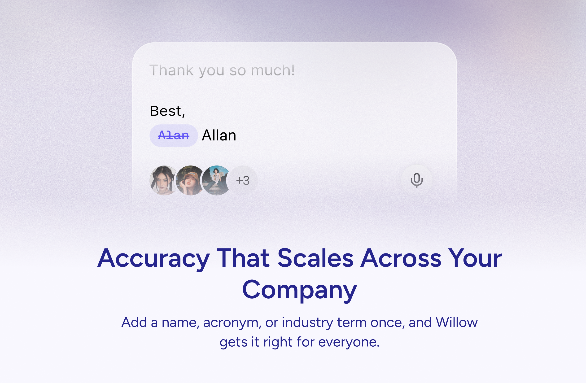
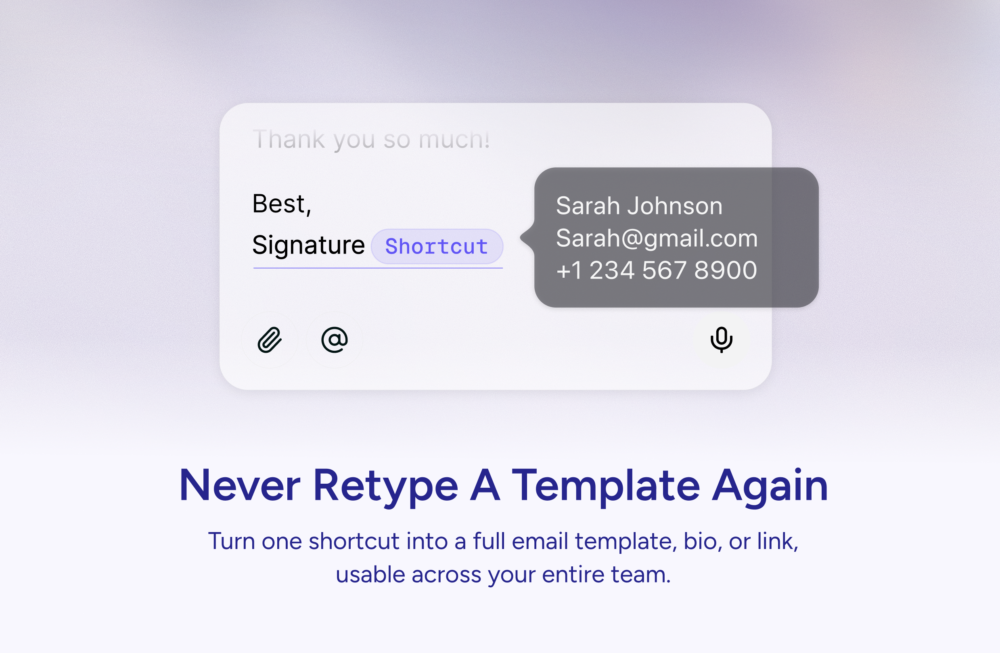

### 🎬 관련 영상
- [🎥 영상 보기](https://ph-files.imgix.net/967c0f20-7d0e-4f12-bbae-072d936a064a.jpeg?auto=format)

---

## 7. [Parsewise](https://www.producthunt.com/products/parsewise)
**Votes**: 129 | **도입 난이도**: 중 | **신뢰도**: 중
**Tagline**: Cursor for document work
**서비스 링크**: https://www.producthunt.com/r/US4RXMMVCTKITJ

**태그**: AI, 문서 분석, 자동화, 생산성, 지식 관리, Agent, AI Tool, Prompting, DevTool

### 📌 이 서비스 한눈에 보기
Parsewise는 AI 에이전트를 활용하여 대량의 문서를 분석하고, 문서 간 교차 참조 및 추론을 통해 필요한 정보를 추출하여 문서 작업 효율성을 높여줍니다.

### 🔑 주요 기능
- 코드 없이 AI 에이전트 설정 및 실행 가능
- 대량 문서(수천 건) 일괄 분석 지원
- 추출된 정보의 출처 추적 가능

### 🙋 사용자에게 어떤 점이 좋은가
개별 PDF 파일을 일일이 확인할 필요 없이, Parsewise를 통해 전체 문서에서 필요한 정보를 빠르게 찾고 분석할 수 있어 시간과 노력을 절약할 수 있습니다.

### ✅ 지금 바로 써볼 기능
- 보유한 문서 코퍼스를 업로드하여 AI 에이전트 분석 시작
- 다양한 문서 유형에 대한 AI 에이전트 설정 실험
- 추출된 정보의 출처 추적 기능 활용

### ⚠️ 사용 전 확인할 점
- AI 에이전트의 정확도는 문서 품질 및 설정에 따라 달라질 수 있음
- 대량 문서 처리 시 소요 시간 확인 필요

### 🧭 확인이 더 필요한 정보
실제 문서 분석 속도 및 정확도에 대한 사용자 리뷰 확인이 필요합니다.

### 📸 스크린샷 및 갤러리
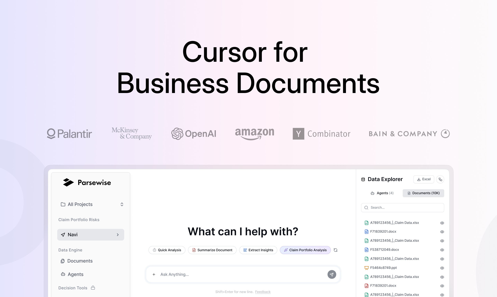
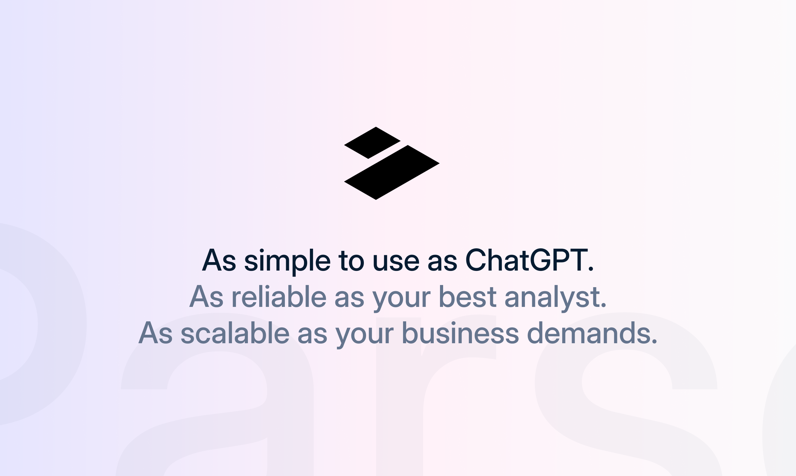
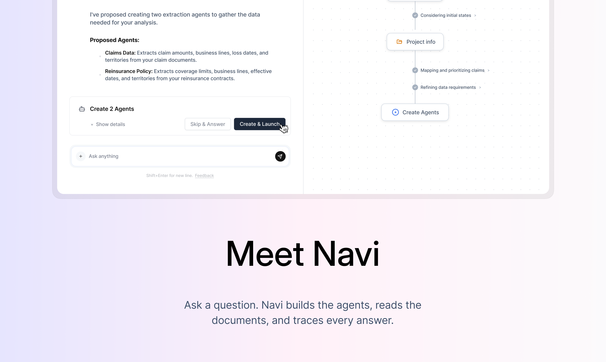

### 🎬 관련 영상
- [🎥 영상 보기](https://ph-files.imgix.net/2a4946ff-4e1a-46ac-81a8-5468d1a982f5.jpeg?auto=format)

---

## 8. [Codex app for Windows](https://www.producthunt.com/products/openai)
**Votes**: 117 | **도입 난이도**: 중 | **신뢰도**: 중
**Tagline**: Codex now runs natively on Windows with secure sandbox
**서비스 링크**: https://www.producthunt.com/r/DRCZ4MAD5KVHF4

**태그**: DevTool, 코딩, 자동화, 샌드박스, Agent, AI Tool

### 📌 이 서비스 한눈에 보기
OpenAI의 Codex를 Windows에서 네이티브 앱으로 사용하여, 안전한 샌드박스 환경에서 병렬 코딩 에이전트를 활용해 보세요.

### 🔑 주요 기능
- Windows 네이티브 앱으로 제공
- OS 수준 샌드박스 환경에서 작업 격리
- 코드 작성, 테스트, 제안 시 로컬 환경 오염 방지

### 🙋 사용자에게 어떤 점이 좋은가
Codex Windows 앱을 통해 개발 환경을 안전하게 유지하면서 여러 코딩 에이전트를 동시에 활용하여 생산성을 높일 수 있습니다.

### ✅ 지금 바로 써볼 기능
- Windows 앱 설치 후 실행
- 샌드박스 환경 설정 확인
- 병렬 코딩 에이전트 활성화

### ⚠️ 사용 전 확인할 점
- 샌드박스 환경 설정에 대한 이해 필요
- 에이전트 성능은 작업 복잡도에 따라 달라질 수 있음

### 🧭 확인이 더 필요한 정보
Codex 에이전트의 구체적인 성능 및 지원 언어에 대한 추가 정보 확인이 필요합니다.

### 📸 스크린샷 및 갤러리
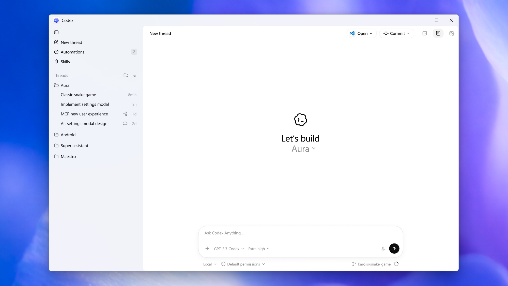
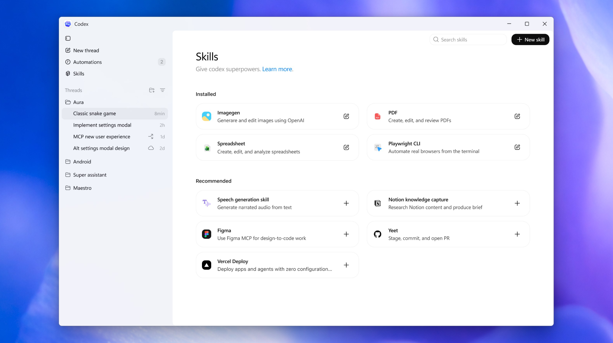
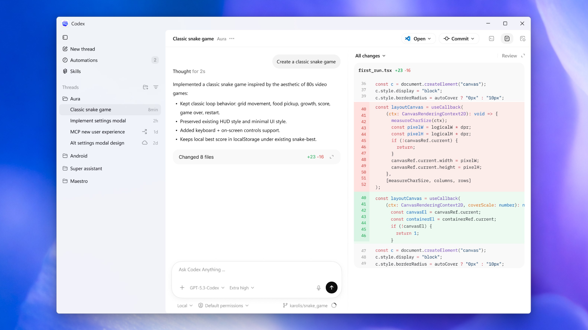

---

## 9. [Hermit](https://www.producthunt.com/products/hermit-2)
**Votes**: 114 | **도입 난이도**: 중 | **신뢰도**: 중
**Tagline**: Leave ChatGPT while keeping everything it learned about you
**서비스 링크**: https://www.producthunt.com/r/5OV6EBNVN4ELJM

**태그**: LLM, 데이터 이전, 자동화, 분석, 생산성, Chat, Prompting, Analytics

### 📌 이 서비스 한눈에 보기
ChatGPT 대화 기록을 분석하여 Claude, Gemini 등 다른 LLM으로 이전할 수 있도록 개인화된 프로필을 생성해주는 툴입니다.

### 🔑 주요 기능
- ChatGPT 데이터 내보내기 파일을 분석하여 프로젝트 및 테마별 프로필 생성
- Claude Memory, Claude Projects, Gemini Gems 등 다양한 LLM 형식으로 내보내기 지원
- 시간적 맥락을 고려하여 활성/과거 상태를 구분

### 🙋 사용자에게 어떤 점이 좋은가
ChatGPT에서 쌓은 대화 맥락을 다른 LLM으로 쉽게 옮겨 활용할 수 있으며, 데이터 분석 기능도 무료로 제공됩니다.

### ✅ 지금 바로 써볼 기능
- ChatGPT 데이터 내보내기
- Hermit에 데이터 업로드 및 분석
- 생성된 프로필을 원하는 LLM에 붙여넣기

### ⚠️ 사용 전 확인할 점
- 데이터 처리 후 24시간 이내 삭제되므로, 필요한 데이터는 미리 백업 필요
- ChatGPT 데이터 내보내기 형식이 변경될 경우 호환성 문제 발생 가능성 존재

### 🧭 확인이 더 필요한 정보
실제 LLM 간 데이터 이전 효과 및 성능 차이에 대한 사용자 후기 확인이 필요합니다.

### 📸 스크린샷 및 갤러리

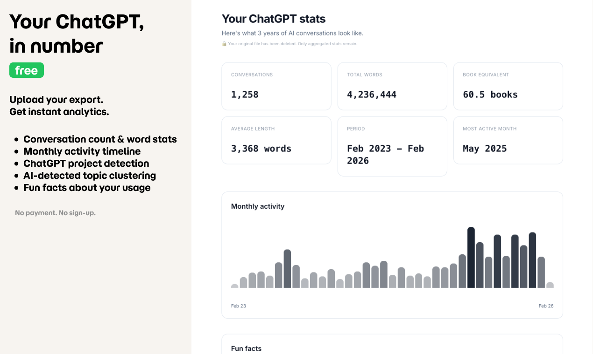
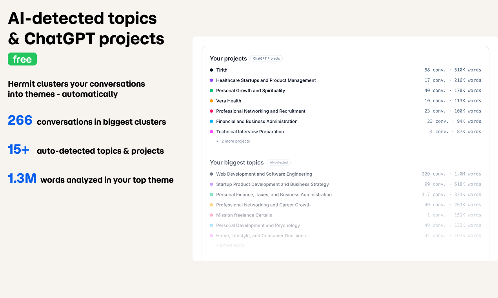

### 🎬 관련 영상
- [🎥 영상 보기](https://ph-files.imgix.net/58d17023-99f1-457f-bd89-02272a911c97.gif?auto=format)

---

## 10. [Supa Social](https://www.producthunt.com/products/supa-social-by-once-ui)
**Votes**: 112 | **도입 난이도**: 중 | **신뢰도**: 중
**Tagline**: Self-host your community platform
**서비스 링크**: https://www.producthunt.com/r/HSJIBO3HPSJ4OE

**태그**: 커뮤니티, 자체 호스팅, 소셜 플랫폼, Supabase, Once UI

### 📌 이 서비스 한눈에 보기
Supa Social은 Supabase와 Once UI로 구축된 자체 호스팅 소셜 플랫폼으로, 인증, 프로필, 팔로워, 역할, 알림 등 다양한 기능을 몇 분 안에 배포하여 커뮤니티를 구축하고 관리할 수 있게 해줍니다.

### 🔑 주요 기능
- 완전한 기능을 갖춘 자체 호스팅 소셜 플랫폼
- 빠른 배포 및 설정 가능
- 다양한 게시물 형식을 지원하는 유연한 피드 제공

### 🙋 사용자에게 어떤 점이 좋은가
Supa Social을 사용하면 분산형 마이크로 커뮤니티, 고객 공간, 내부 허브, 수익성 있는 틈새 네트워크 등 다양한 유형의 커뮤니티를 직접 구축하고 제어할 수 있습니다.

### ✅ 지금 바로 써볼 기능
- 자체 서버에 배포하여 커뮤니티 플랫폼 구축 시작
- 다양한 게시물 형식을 테스트하여 사용자 참여 유도
- 역할 및 권한 설정을 통해 커뮤니티 관리 효율성 향상

### ⚠️ 사용 전 확인할 점
- 자체 호스팅 환경 설정 및 유지 관리 필요
- 커뮤니티 규모에 따른 서버 자원 확장 고려

### 🧭 확인이 더 필요한 정보
Supa Social의 성능 및 확장성에 대한 사용자 후기 및 사례 연구가 필요합니다.

### 📸 스크린샷 및 갤러리

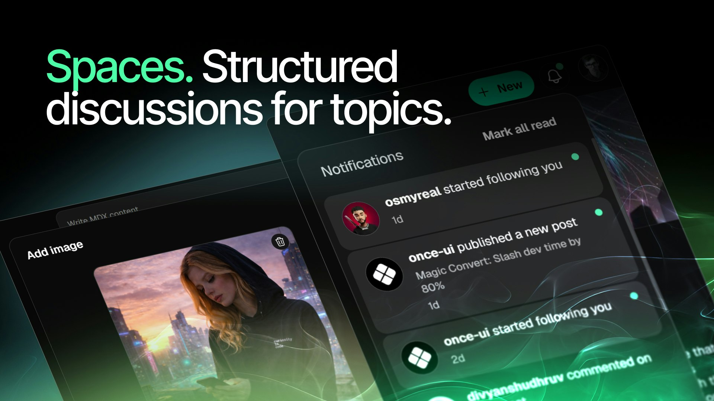

---

