# 🚀 Product Hunt Daily Top 10 (2026-03-07)

## 1. [GPT‑5.4](https://www.producthunt.com/products/openai)
**Votes**: 291 | **도입 난이도**: 중 | **신뢰도**: 중
**Tagline**: OpenAI's most efficient model: less tokens, more clarity
**서비스 링크**: https://www.producthunt.com/r/VEUASU6Y4BVETI

**태그**: AI, 생성AI, 생산성, 웹 리서치, 자동화, AI Tool

### 📌 이 서비스 한눈에 보기
GPT-5.4는 이전 모델보다 오류가 적고, 긴 작업에 대한 맥락 유지 능력이 뛰어나며, 토큰 소모량도 줄여주는 OpenAI의 효율적인 모델입니다.

### 🔑 주요 기능
- 더 깊이 있는 웹 리서치 가능
- 긴 작업에서 맥락 유지 능력 향상
- 이전 모델 대비 33% 적은 오류

### 🙋 사용자에게 어떤 점이 좋은가
GPT-5.4를 사용하면 더 적은 비용으로 더 정확하고 효율적인 작업을 수행할 수 있으며, 응답 중 모델을 중단하고 방향을 재설정할 수 있어 작업 흐름을 더욱 효과적으로 제어할 수 있습니다.

### ✅ 지금 바로 써볼 기능
- 긴 문서 요약 작업에 활용해보기
- 웹 리서치 작업에 활용해보기
- 모델 응답 중단 및 재지시 기능 사용해보기

### ⚠️ 사용 전 확인할 점
- 여전히 사실과 다른 정보가 생성될 수 있으므로 결과물 검증 필요
- 토큰 소모량 감소 효과는 작업 유형에 따라 다를 수 있음

### 🧭 확인이 더 필요한 정보
실제 토큰 소모량 감소 효과 및 성능 향상 정도는 사용 환경에 따라 달라질 수 있으므로, 다양한 사용 사례에서 테스트해 보는 것이 좋습니다.

### 📸 스크린샷 및 갤러리

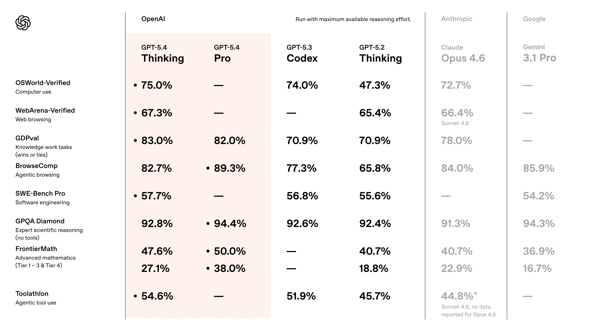
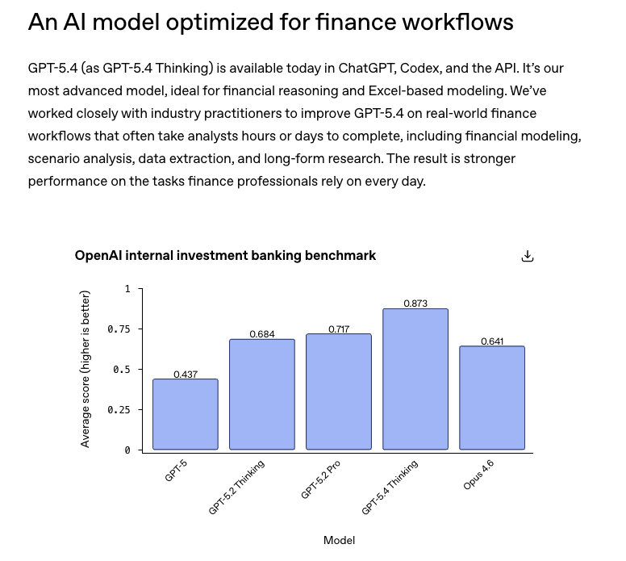

### 🎬 관련 영상
- [🎥 영상 보기](https://ph-files.imgix.net/cb63d204-a130-4151-9f2b-68ac50c7357a.jpeg?auto=format)

---

## 2. [CoChat](https://www.producthunt.com/products/cochat)
**Votes**: 202 | **도입 난이도**: 중 | **신뢰도**: 중
**Tagline**: Openclaw for Teams that is secure, collaborative, autonomous
**서비스 링크**: https://www.producthunt.com/r/QDRCIGCVTC7BM5

**태그**: 협업, AI 에이전트, 보안, 자동화, Agent, AI Tool, Chat, Security

### 📌 이 서비스 한눈에 보기
CoChat은 팀과 AI 에이전트가 안전하게 협업할 수 있는 환경을 제공하여, OpenClaw를 기업 환경에서 더욱 효율적으로 사용할 수 있도록 돕습니다.

### 🔑 주요 기능
- 팀과 AI 에이전트의 협업 환경 제공
- OpenClaw 연동 및 에이전트 공유의 보안 강화 (SSH 불필요)
- 자동 보안 감사 및 로그 기록 기능

### 🙋 사용자에게 어떤 점이 좋은가
CoChat을 통해 팀은 AI 에이전트와 함께 더욱 효율적으로 작업하고, 보안 걱정 없이 OpenClaw를 활용할 수 있습니다. 사람과 AI의 강점을 결합하여 더 나은 결과물을 만들 수 있습니다.

### ✅ 지금 바로 써볼 기능
- 팀에 맞는 에이전트 설정 및 개인화
- 보안 감사 로그 확인 및 민감한 단계에 대한 승인 프로세스 설정
- 팀원과 에이전트가 함께 작업하는 스레드 생성

### ⚠️ 사용 전 확인할 점
- 자체 호스팅 또는 CoChat 관리 게이트웨이 설정 필요
- 에이전트의 성능은 OpenClaw 및 설정에 따라 달라질 수 있음

### 🧭 확인이 더 필요한 정보
CoChat의 실제 성능 및 보안 감사 기능의 효과는 사용 환경에 따라 달라질 수 있으므로, 실제 사용 후기를 참고하는 것이 좋습니다.

### 📸 스크린샷 및 갤러리
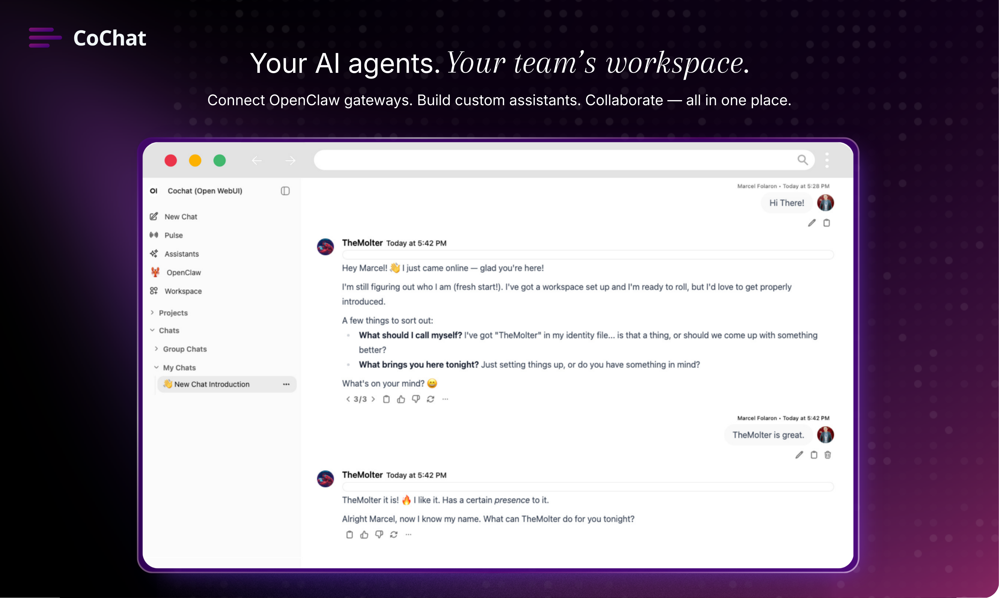
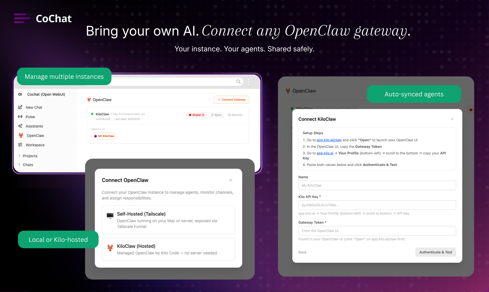
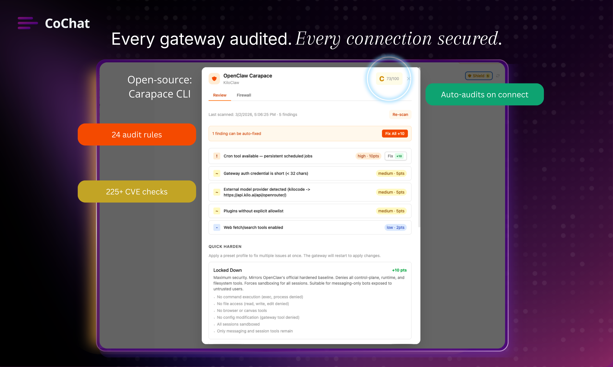

### 🎬 관련 영상
- [🎥 영상 보기](https://ph-files.imgix.net/b692535c-f7ad-446d-a029-4b28016aae66.jpeg?auto=format)

---

## 3. [SuperPowers AI](https://www.producthunt.com/products/superpowers-ai-2)
**Votes**: 188 | **도입 난이도**: 중 | **신뢰도**: 중
**Tagline**: Real time ambient visual agents for phones and wearables
**서비스 링크**: https://www.producthunt.com/r/HMNQ4QQAMHJSBI

**태그**: AI, Vision AI, Wearable, Agent, AI Tool

### 📌 이 서비스 한눈에 보기
SuperPowers AI는 휴대폰이나 웨어러블 기기에서 Claude 수준의 AI 에이전트를 통해 시각적 문제를 즉시 해결할 수 있게 해줍니다. 코딩 없이 실시간 주변 시각 에이전트를 활용하세요.

### 🔑 주요 기능
- 실시간 주변 시각 에이전트
- Claude 수준의 AI
- 코딩 없이 시각적 문제 해결

### 🙋 사용자에게 어떤 점이 좋은가
휴대폰이나 안경을 통해 보이는 것을 AI가 분석하여 즉각적인 문제 해결을 돕고, 별도의 코딩 작업 없이도 가능하여 사용 편의성이 높습니다.

### ✅ 지금 바로 써볼 기능
- 휴대폰 카메라를 통해 주변 환경 분석
- 안경형 웨어러블 기기 연동
- 제공되는 AI 에이전트 활용

### ⚠️ 사용 전 확인할 점
- AI 에이전트의 정확도 및 반응 속도 확인 필요
- 개인 정보 보호 및 보안 문제 고려

### 🧭 확인이 더 필요한 정보
실제 사용 환경에서의 성능 및 다양한 웨어러블 기기와의 호환성 검증이 필요합니다.

### 📸 스크린샷 및 갤러리

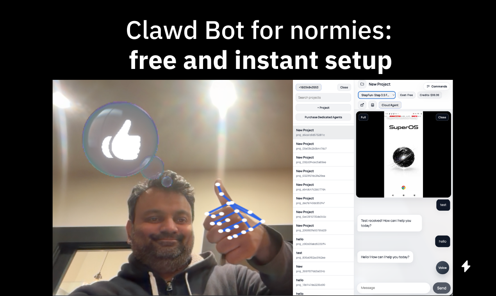

### 🎬 관련 영상
- [🎥 영상 보기](https://ph-files.imgix.net/486d8aa3-dfd1-4d97-be55-137a7443c0c2.jpeg?auto=format)

---

## 4. [Context Gateway](https://www.producthunt.com/products/context-gateway)
**Votes**: 172 | **도입 난이도**: 하 | **신뢰도**: 중
**Tagline**: Make Claude Code faster and cheaper without losing context
**서비스 링크**: https://www.producthunt.com/r/IURY2Z5SGEY23F

**태그**: DevTool, Claude, Context Management, Optimization

### 📌 이 서비스 한눈에 보기
Context Gateway는 Claude Code의 컨텍스트를 압축하여 속도와 비용을 절감하고, 설정이 간편하며 즉각적인 컨텍스트 압축 및 지출 제한 설정 기능을 제공합니다.

### 🔑 주요 기능
- Claude Code, Codex, OpenClaw의 지연 시간 감소 및 토큰 비용 절감
- 중요한 컨텍스트 보존
- 1분 이내의 빠른 설정

### 🙋 사용자에게 어떤 점이 좋은가
Claude Code를 사용하는 개발자가 더 빠르고 저렴하게 코드를 생성할 수 있도록 도와주며, 컨텍스트 관리의 편의성을 높여줍니다.

### ✅ 지금 바로 써볼 기능
- Context Gateway 설정 및 Claude Code 연동
- 컨텍스트 압축 기능 사용
- 지출 제한 설정 기능 사용

### ⚠️ 사용 전 확인할 점
- 압축 과정에서 컨텍스트 손실 가능성 확인
- Claude Code 외 다른 모델과의 호환성 확인 필요

### 🧭 확인이 더 필요한 정보
실제 사용 환경에서 어느 정도의 성능 향상 및 비용 절감 효과가 있는지 확인이 필요합니다.

### 📸 스크린샷 및 갤러리
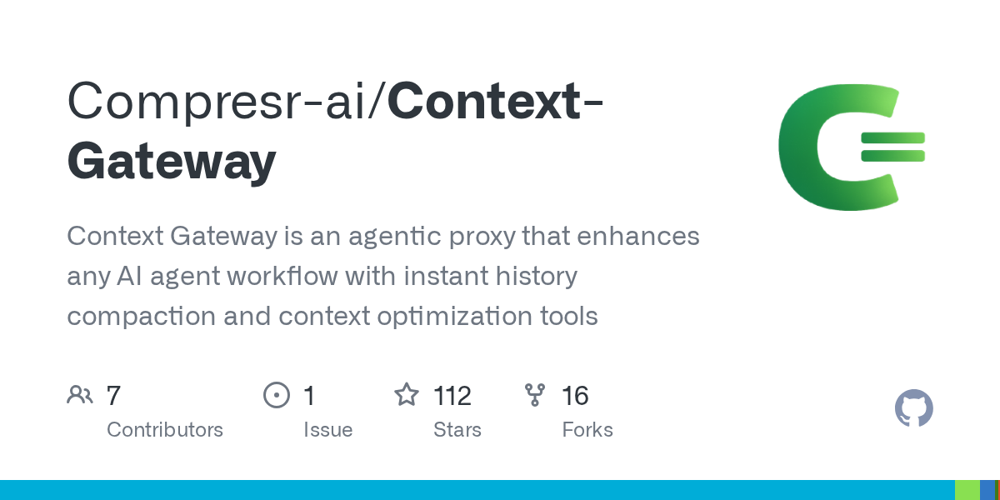

### 🎬 관련 영상
- [🎥 영상 보기](https://ph-files.imgix.net/bc565710-affd-4b3c-8f00-af908bbfc854.jpeg?auto=format)

---

## 5. [ChatGPT for Excel](https://www.producthunt.com/products/chatgpt)
**Votes**: 135 | **도입 난이도**: 중 | **신뢰도**: 중
**Tagline**: Build and update spreadsheets with ChatGPT in real time
**서비스 링크**: https://www.producthunt.com/r/N76V4F6NK3D2I4

**태그**: DevTool, Automation, Analytics, Productivity, AI, AI Tool, Chat

### 📌 이 서비스 한눈에 보기
ChatGPT for Excel은 엑셀 내에서 실시간으로 ChatGPT를 활용하여 스프레드시트 생성, 데이터 분석, 업데이트를 간편하게 할 수 있도록 도와줍니다.

### 🔑 주요 기능
- 자연어 명령으로 스프레드시트 구축 및 업데이트
- 탭과 수식을 넘나드는 데이터 분석
- 변경 사항에 대한 설명 및 셀 연결 제공

### 🙋 사용자에게 어떤 점이 좋은가
엑셀에서 도구를 전환할 필요 없이 오류 수정, 패턴 발견, 데이터 분석을 통해 더 스마트한 워크플로우를 구축할 수 있습니다.

### ✅ 지금 바로 써볼 기능
- 자연어 명령으로 간단한 스프레드시트 생성해보기
- 데이터 분석 기능 활용하여 데이터 패턴 파악해보기
- 변경 사항 설명 기능을 통해 변경 내역 이해도 높이기

### ⚠️ 사용 전 확인할 점
- 편집 전에 확인하는 과정을 통해 의도치 않은 변경 방지
- 데이터 분석 결과의 정확성 검증 필요

### 🧭 확인이 더 필요한 정보
ChatGPT의 응답 정확도 및 데이터 분석의 신뢰성에 대한 추가적인 검증이 필요합니다.

### 📸 스크린샷 및 갤러리
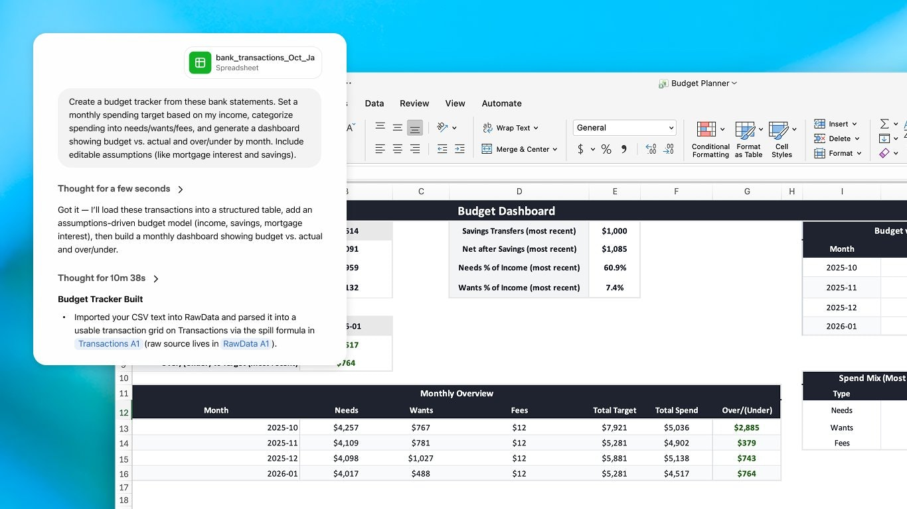

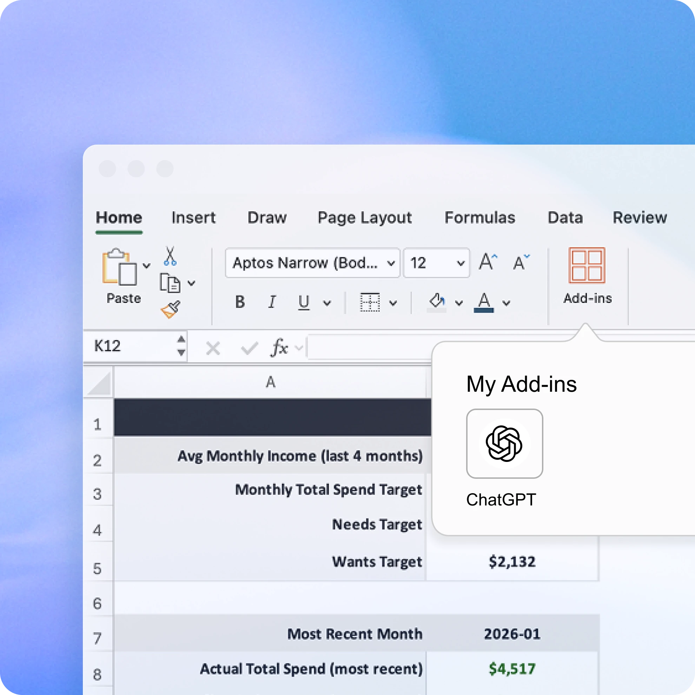

---

## 6. [Zesty by DoorDash](https://www.producthunt.com/products/zesty-local-food-discovery-2)
**Votes**: 119 | **도입 난이도**: 하 | **신뢰도**: 중
**Tagline**: Your personal restaurant concierge
**서비스 링크**: https://www.producthunt.com/r/GF5ELMWSNLMCIF

**태그**: AI, 레스토랑 추천, 개인화, DoorDash, AI Tool, Chat

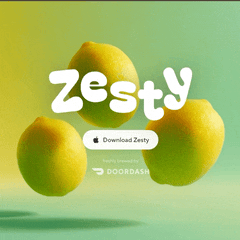

### 📌 이 서비스 한눈에 보기
Zesty는 DoorDash에서 제공하는 AI 기반 레스토랑 컨시어지로, 소셜 신호와 트렌드를 분석하여 개인 맞춤형 식사 경험을 제공합니다.

### 🔑 주요 기능
- AI 기반 대화형 인터페이스를 통해 원하는 분위기의 레스토랑을 쉽게 찾을 수 있습니다.
- 소셜 신호와 TikTok 트렌드를 활용하여 최신 맛집 정보를 제공합니다.
- 개인 취향을 학습하여 더욱 정확한 레스토랑 추천이 가능합니다.

### 🙋 사용자에게 어떤 점이 좋은가
더 이상 지도에서 핀을 찾거나 리뷰를 읽을 필요 없이, Zesty를 통해 빠르고 간편하게 원하는 레스토랑을 찾을 수 있습니다. 특히 분위기를 중요하게 생각하는 사용자에게 유용합니다.

### ✅ 지금 바로 써볼 기능
- Zesty에 접속하여 원하는 분위기 (예: 조용한 파스타집)를 검색해 보세요.
- TikTok 트렌드를 기반으로 추천되는 레스토랑을 확인해 보세요.
- 개인 취향을 설정하여 나만을 위한 맞춤 추천을 받아보세요.

### ⚠️ 사용 전 확인할 점
- 아직 서비스 초기 단계이므로, 추천 결과가 완벽하지 않을 수 있습니다.
- 특정 지역 또는 특정 종류의 레스토랑 정보가 부족할 수 있습니다.

### 🧭 확인이 더 필요한 정보
Zesty의 추천 알고리즘이 얼마나 정확하고 다양한 레스토랑 정보를 제공하는지 추가적인 검증이 필요합니다.

### 📸 스크린샷 및 갤러리
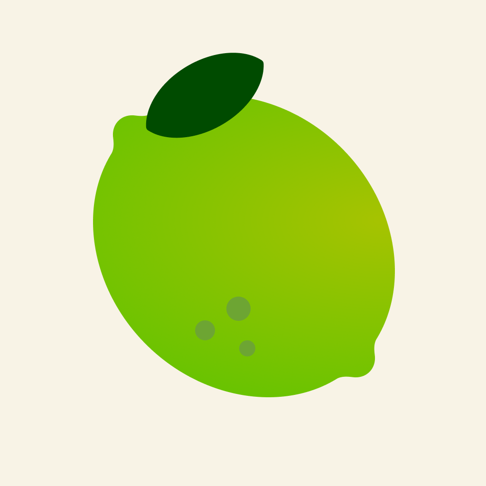
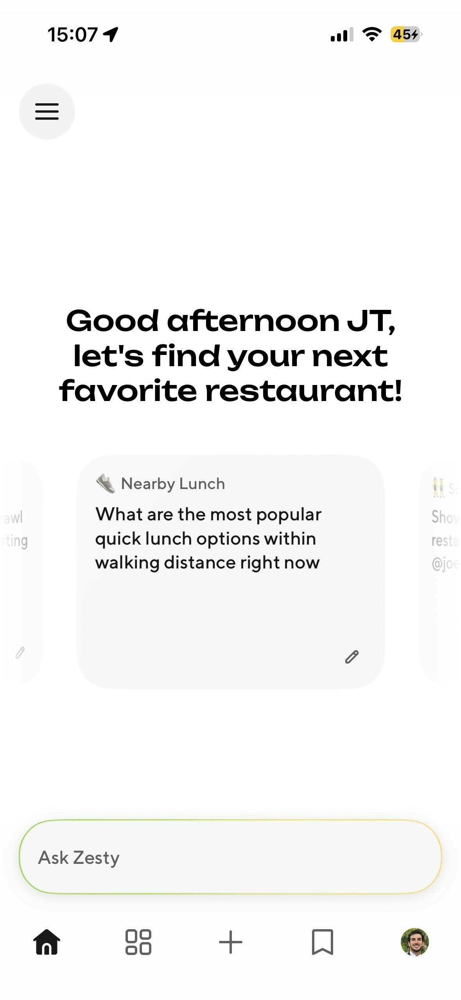
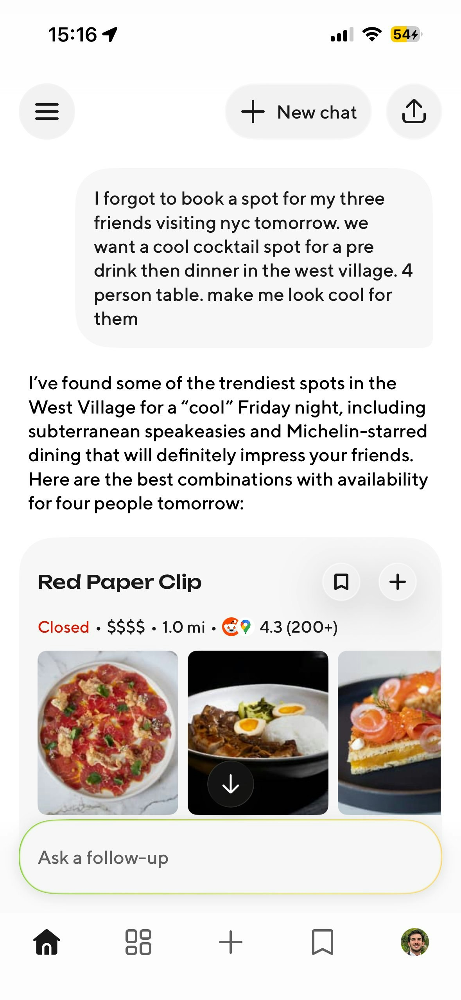

### 🎬 관련 영상
- [🎥 영상 보기](https://ph-files.imgix.net/90368b7d-8feb-4486-aad2-e847d9626485.jpeg?auto=format)

---

## 7. [Saydi](https://www.producthunt.com/products/saydi)
**Votes**: 118 | **도입 난이도**: 중 | **신뢰도**: 중
**Tagline**: Real time voice translation for persona & work
**서비스 링크**: https://www.producthunt.com/r/KI5PWMDIGSH2ML

**태그**: AI, 번역, 음성인식, 생산성, 커뮤니케이션, AI Tool

### 📌 이 서비스 한눈에 보기
Saydi는 실시간 AI 음성 번역을 통해 언어 장벽 없이 비즈니스 미팅, 이벤트, 계약을 성사시킬 수 있도록 돕는 솔루션입니다.

### 🔑 주요 기능
- 실시간 AI 음성 번역 제공
- 인간 통역 수준의 뉘앙스 전달
- 기존 통역 비용의 1% 수준으로 절감

### 🙋 사용자에게 어떤 점이 좋은가
언어 문제로 어려움을 겪던 국제 비즈니스, 이벤트, 미팅 등을 효율적으로 진행할 수 있게 되어, 시간과 비용을 절약하고 더 많은 기회를 창출할 수 있습니다.

### ✅ 지금 바로 써볼 기능
- 다국어 회의에서 Saydi를 활용하여 원활한 소통 경험하기
- 해외 클라이언트와의 계약 시 Saydi를 통해 언어 장벽 없이 협상 진행하기
- 국제 이벤트에서 Saydi를 사용하여 참가자들의 만족도 높이기

### ⚠️ 사용 전 확인할 점
- AI 번역 품질은 사용 환경 및 언어에 따라 차이가 있을 수 있음
- 특정 전문 용어 또는 기술적인 내용의 번역 정확도는 검토 필요

### 🧭 확인이 더 필요한 정보
AI 번역 품질이 다양한 사용 사례에서 일관되게 높은 수준을 유지하는지 확인이 필요합니다.

### 📸 스크린샷 및 갤러리

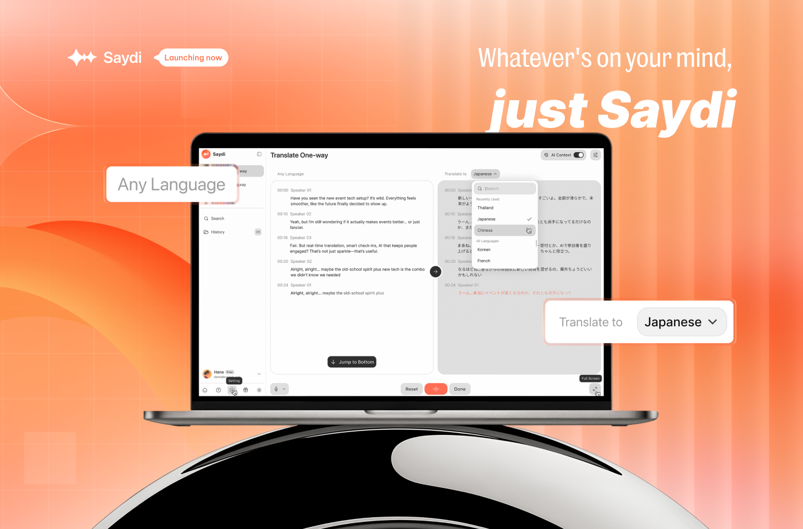

---

## 8. [Gemlet](https://www.producthunt.com/products/gemlet)
**Votes**: 115 | **도입 난이도**: 중 | **신뢰도**: 중
**Tagline**: Native, keyboard-first Gemini client for macOS
**서비스 링크**: https://www.producthunt.com/r/SWMPSKSMEL26A5

**태그**: macOS, Gemini, AI, 생산성, 클라이언트, AI Tool, Design, API

### 📌 이 서비스 한눈에 보기
Gemlet은 macOS에서 키보드 중심으로 Gemini를 사용할 수 있게 해주는 네이티브 클라이언트로, 단축키를 통해 빠르게 AI를 실행하고 워크스페이스 및 프로필 관리, PDF/JSON 내보내기 등의 기능을 제공합니다.

### 🔑 주요 기능
- 글로벌 단축키 및 명령 팔레트 지원
- 분할 화면 워크스페이스 및 멀티 프로필 지원 (업무/개인)
- PDF/JSON 내보내기 기능 제공

### 🙋 사용자에게 어떤 점이 좋은가
브라우저 탭을 찾아 헤매는 대신 단축키로 즉시 AI를 실행하고, 여러 프로필을 통해 업무와 개인 용도를 분리하여 사용할 수 있어 생산성을 높여줍니다.

### ✅ 지금 바로 써볼 기능
- 글로벌 단축키 설정 및 사용
- 분할 화면 워크스페이스 설정 및 활용
- PDF/JSON 내보내기 기능으로 히스토리 저장

### ⚠️ 사용 전 확인할 점
- Google 계정 필요
- macOS에서만 사용 가능

### 🧭 확인이 더 필요한 정보
Gemini API의 사용량 제한 또는 Google 계정 정책 변경에 따른 영향은 추가 확인이 필요합니다.

### 📸 스크린샷 및 갤러리
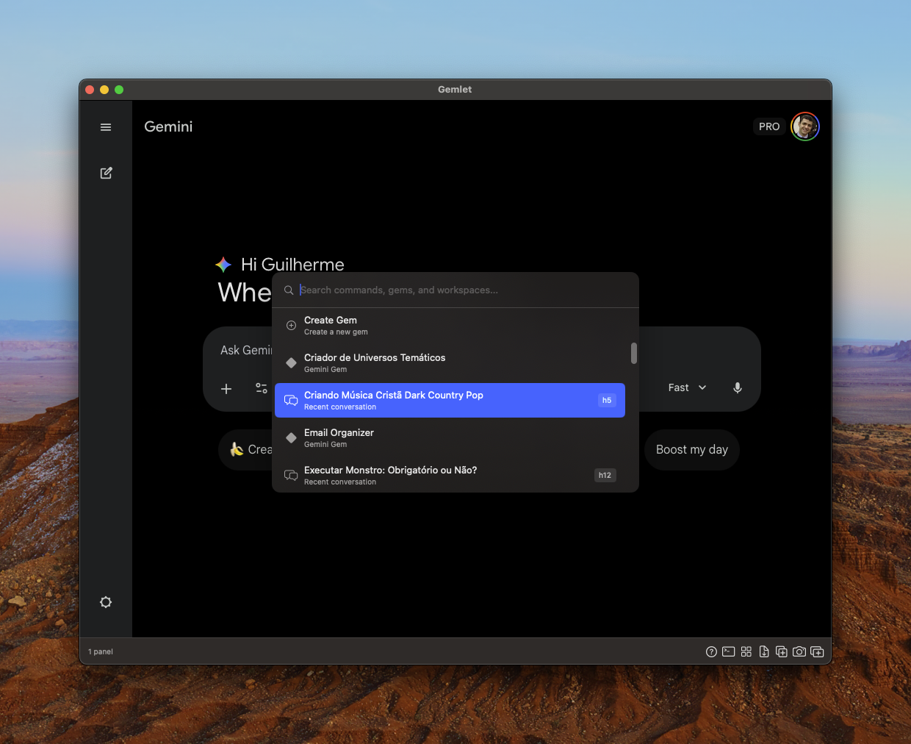
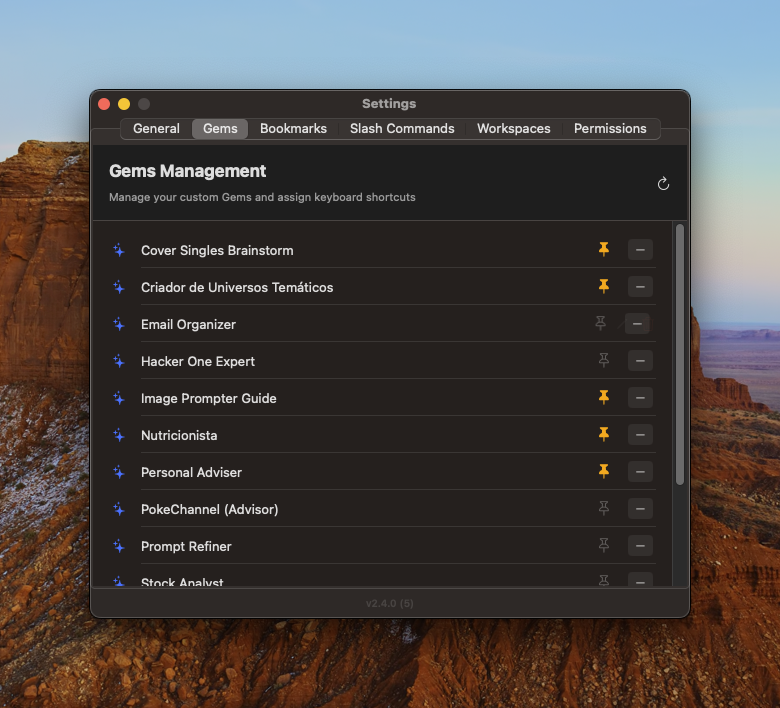
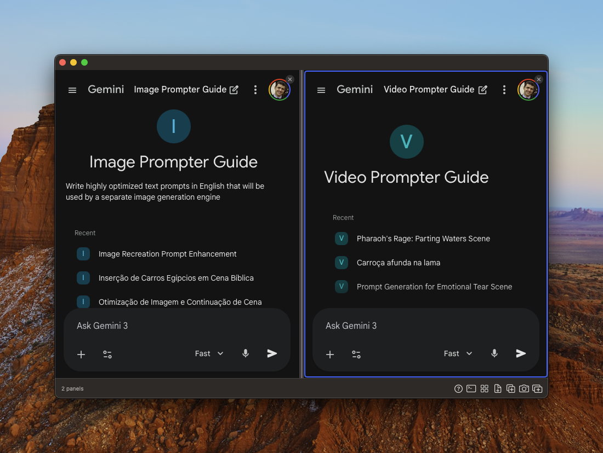

### 🎬 관련 영상
- [🎥 영상 보기](https://ph-files.imgix.net/ea20a49d-75bd-4808-96bf-afe08d5a4132.jpeg?auto=format)

---

## 9. [Pitwall F1](https://www.producthunt.com/products/pitwall-f1-macos-app)
**Votes**: 106 | **도입 난이도**: 하 | **신뢰도**: 중
**Tagline**: Live F1 timing & standings in your Mac menu bar
**서비스 링크**: https://www.producthunt.com/r/6QROJX2PPOZHD5

**태그**: F1, 레이싱, 맥OS, 실시간 데이터, 메뉴 막대 앱

### 📌 이 서비스 한눈에 보기
Pitwall F1은 맥 메뉴 막대에서 실시간 F1 데이터(순위, 랩타임 등)를 바로 확인할 수 있게 해주는 앱입니다. 화면 공간을 낭비하지 않고 간편하게 F1 레이스 정보를 얻을 수 있습니다.

### 🔑 주요 기능
- 맥 메뉴 막대에서 실시간 F1 데이터 확인
- 브라우저 탭 없이 즉시 레이스 정보 접근
- 연습 세션, 예선, 그랑프리 등 모든 세션 지원

### 🙋 사용자에게 어떤 점이 좋은가
F1 팬이라면 화면을 가득 채우는 브라우저 창 없이도 맥 메뉴 막대에서 간편하게 레이스 상황을 파악할 수 있어 편리합니다. 특히 여러 작업을 동시에 수행하면서 F1 레이스를 챙겨보고 싶은 사용자에게 유용합니다.

### ✅ 지금 바로 써볼 기능
- 메뉴 막대에서 실시간 순위 확인
- 랩타임 변화 모니터링
- 다음 레이스 일정 확인

### ⚠️ 사용 전 확인할 점
- macOS에서만 사용 가능
- F1 데이터 제공 정확도 확인 필요

### 🧭 확인이 더 필요한 정보
데이터 제공 주기가 실시간인지, 아니면 약간의 딜레이가 있는지 확인이 필요합니다.

### 📸 스크린샷 및 갤러리

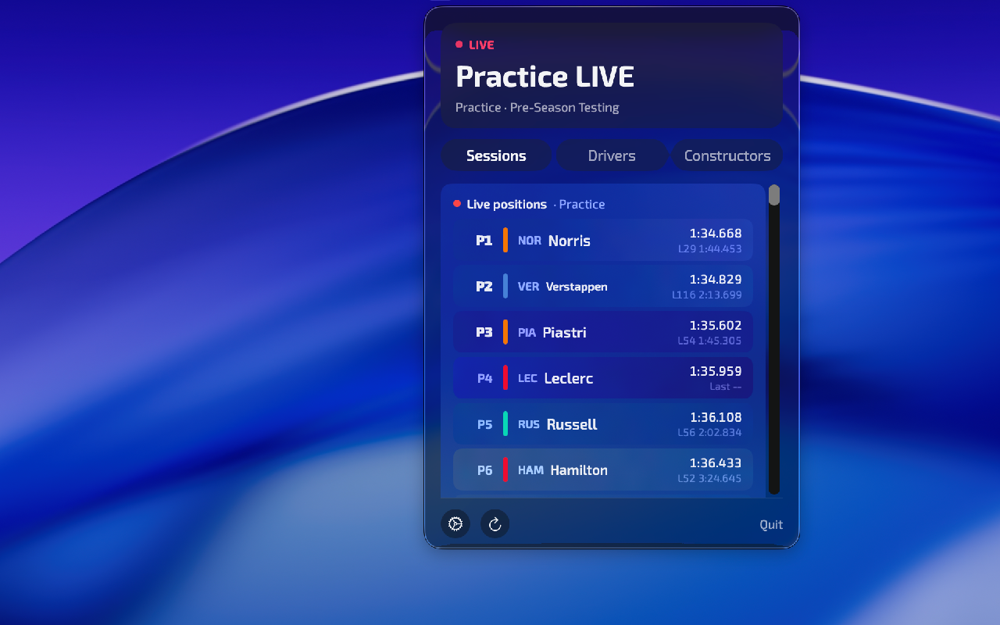
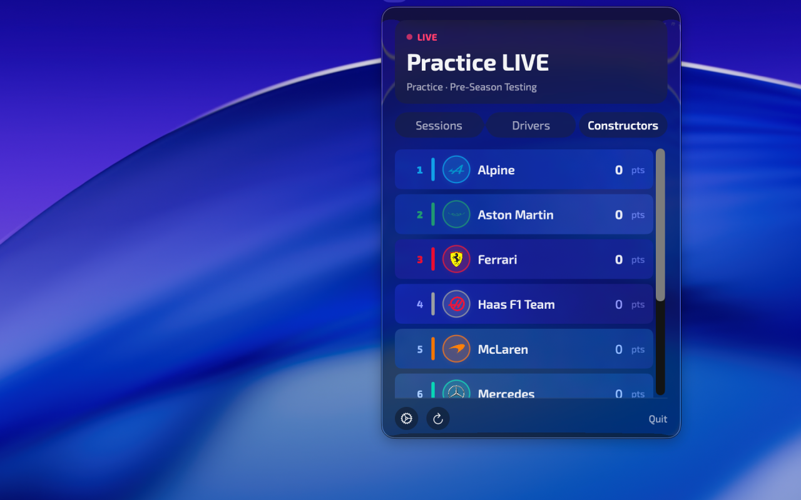

---

## 10. [Cushion](https://www.producthunt.com/products/cushion-4)
**Votes**: 98 | **도입 난이도**: 중 | **신뢰도**: 중
**Tagline**:  combines posts, messaging, + check‑ins for better teamwork
**서비스 링크**: https://www.producthunt.com/r/HPCLKWA74PS42E

**태그**: 협업, 메시징, 생산성, 팀워크

### 📌 이 서비스 한눈에 보기
Cushion은 분산된 소규모 팀을 위한 비동기 메시징 앱으로, 게시물, 메시지, 체크인을 결합하여 팀워크를 향상시키고 생산성을 높입니다.

### 🔑 주요 기능
- 비동기 메시징으로 집중력 향상
- 게시물, 메시지, 체크인 통합 관리
- 분산된 팀을 위한 협업 기능 제공

### 🙋 사용자에게 어떤 점이 좋은가
팀원 간의 커뮤니케이션 효율성을 높이고, 업무 집중도를 향상시켜 더 많은 일을 처리할 수 있도록 돕습니다.

### ✅ 지금 바로 써볼 기능
- 팀원 초대하여 채널 생성
- 업무 관련 게시물 작성
- 일일 체크인 기능 사용

### ⚠️ 사용 전 확인할 점
- 팀원들이 비동기 커뮤니케이션 방식에 익숙해져야 함
- 기존 협업 도구와의 연동 필요성 검토

### 🧭 확인이 더 필요한 정보
Cushion의 구체적인 기능 및 사용 후기는 추가적인 정보 확인이 필요합니다.

### 📸 스크린샷 및 갤러리
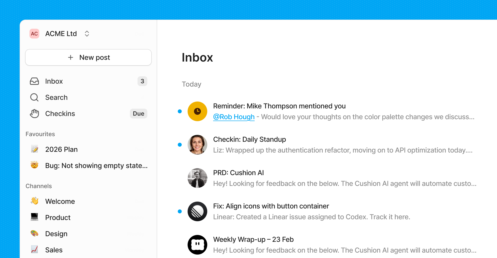
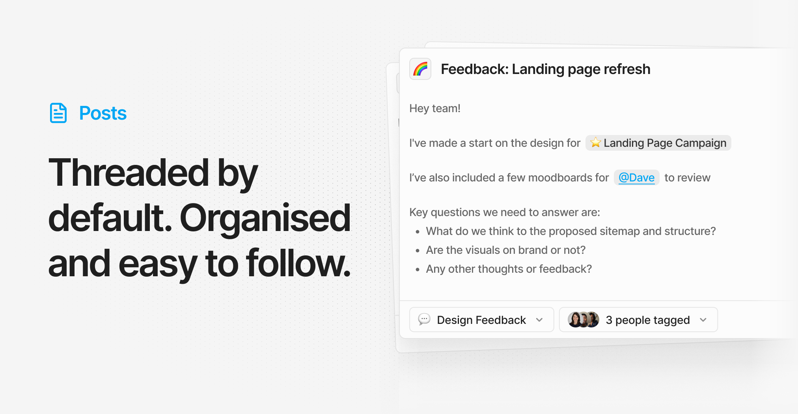
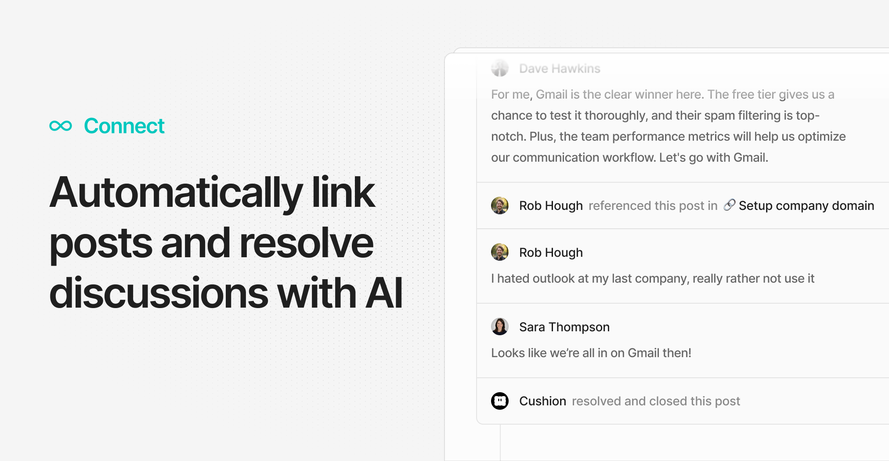

### 🎬 관련 영상
- [🎥 영상 보기](https://ph-files.imgix.net/225727d8-9533-4763-94d6-ec0900a82dd1.jpeg?auto=format)

---

