# 🚀 Product Hunt Daily Top 10 (2026-03-08)

## 1. [TestSprite 2.1](https://www.producthunt.com/products/testsprite)
**Votes**: 279 | **도입 난이도**: 중 | **신뢰도**: 중
**Tagline**: Agentic testing for the AI-native team.
**서비스 링크**: https://www.producthunt.com/r/ZQ64PV4H5YAR5V

**태그**: DevTool, AI, Automation, Testing, GitHub, Agent, AI Tool, Prompting

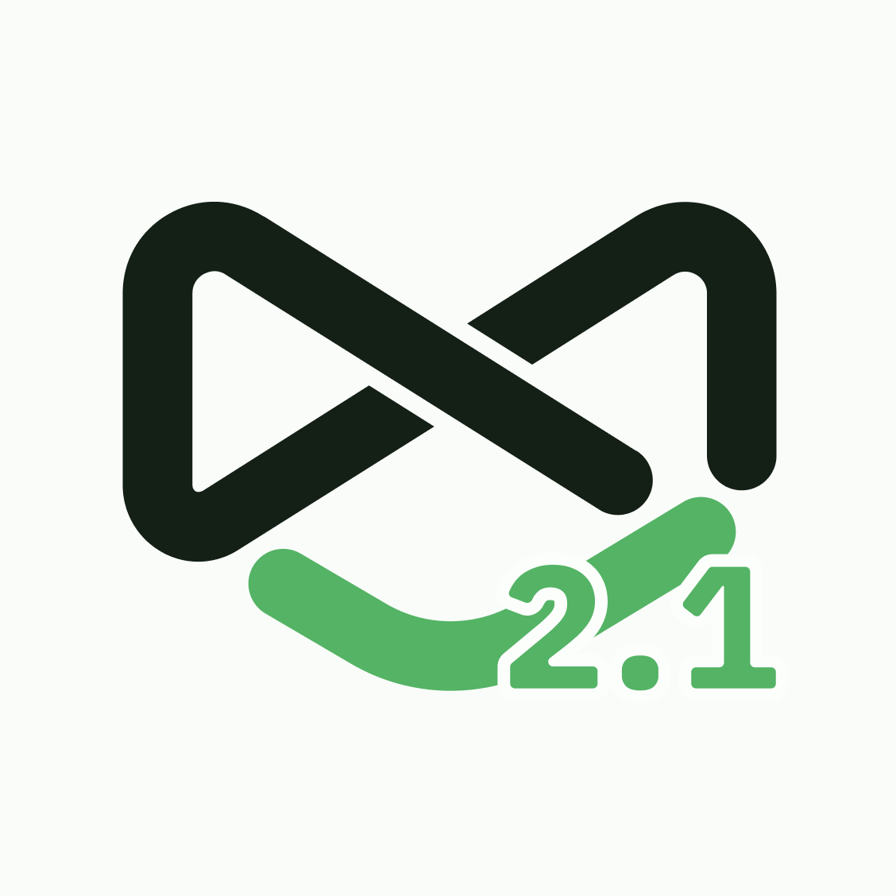

### 📌 이 서비스 한눈에 보기
TestSprite 2.1은 AI 기반 팀을 위한 에이전트 기반 테스트 도구로, IDE에 연결되어 자동으로 테스트 스위트를 생성하고, 빠른 테스트 엔진, 시각적 편집기, GitHub 통합을 제공하여 AI 코딩의 정확성을 보장합니다.

### 🔑 주요 기능
- IDE에 연결되어 자동으로 테스트 스위트 생성
- 4~5배 빠른 테스트 엔진으로 테스트 시간 단축
- GitHub 통합으로 PR 시 자동 테스트 및 실패 시 병합 차단

### 🙋 사용자에게 어떤 점이 좋은가
AI 코딩의 테스트 과정을 자동화하여 개발 시간을 단축하고 코드 품질을 향상시킬 수 있습니다. 특히 GitHub 통합을 통해 지속적인 통합 환경에서 코드 안정성을 확보할 수 있습니다.

### ✅ 지금 바로 써볼 기능
- IDE에 TestSprite MCP 연결하여 자동 테스트 스위트 생성
- 시각적 테스트 편집기에서 테스트 단계별 스냅샷 확인 및 수정
- GitHub 저장소에 통합하여 PR 시 자동 테스트 설정

### ⚠️ 사용 전 확인할 점
- AI가 생성한 코드에 대한 테스트 정확도 검증 필요
- 지원하는 IDE 및 GitHub 버전 확인 필요

### 🧭 확인이 더 필요한 정보
실제 사용 환경에서의 테스트 시간 단축 효과 및 GitHub 통합의 안정성에 대한 추가적인 사용자 후기 확인이 필요합니다.

### 📸 스크린샷 및 갤러리

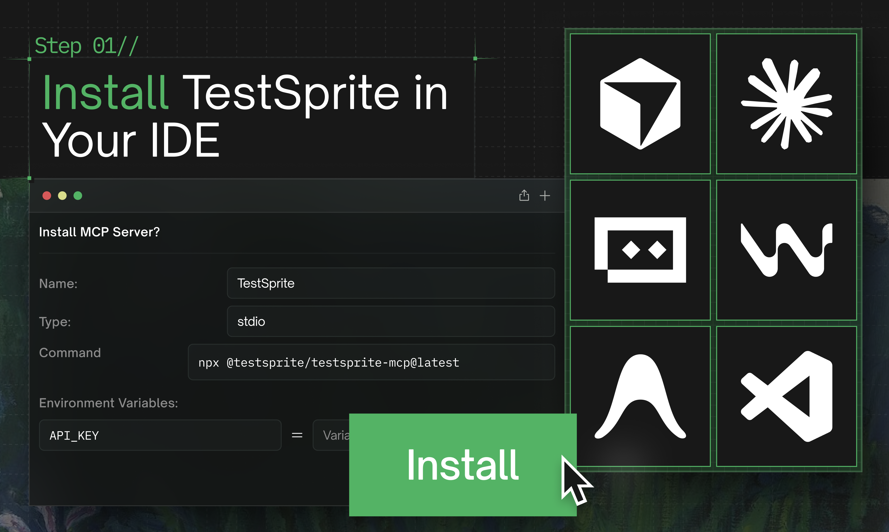
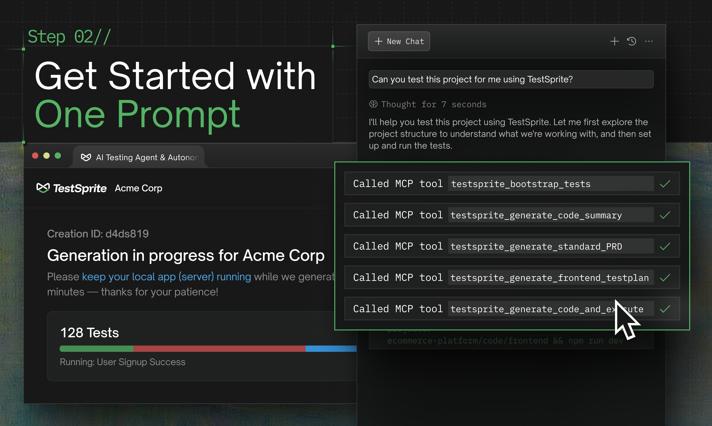

### 🎬 관련 영상
- [🎥 영상 보기](https://ph-files.imgix.net/5722eba8-daa4-4624-aa7c-3eb694606f9b.jpeg?auto=format)

---

## 2. [Copperlane](https://www.producthunt.com/products/copperlane)
**Votes**: 196 | **도입 난이도**: 중 | **신뢰도**: 중
**Tagline**: Turn hours of loan processing into seconds
**서비스 링크**: https://www.producthunt.com/r/DJX44CAUATRT3G

**태그**: AI, FinTech, Automation, Loan, Agent, AI Tool

### 📌 이 서비스 한눈에 보기
Copperlane은 AI 기반 대출 심사 시스템으로, Penny라는 AI 에이전트를 통해 대출 처리 시간을 획기적으로 단축시켜줍니다.

### 🔑 주요 기능
- AI 에이전트 Penny를 통해 금리 최적화, 서류 검증 자동화
- 대출 처리 시간을 몇 시간에서 몇 초로 단축
- 차세대 AI 기반 대출 심사 시스템

### 🙋 사용자에게 어떤 점이 좋은가
대출 기관은 Copperlane을 통해 업무 효율성을 극대화하고, 고객에게 더 빠른 서비스를 제공할 수 있습니다. 특히, 반복적인 서류 검토 작업을 자동화하여 담당자의 업무 부담을 줄여줍니다.

### ✅ 지금 바로 써볼 기능
- Penny AI 에이전트의 금리 최적화 기능 사용해보기
- 자동 서류 검증 기능으로 대출 심사 프로세스 간소화하기
- 대출 신청자에게 Penny를 통해 맞춤형 가이드 제공하기

### ⚠️ 사용 전 확인할 점
- AI 에이전트의 정확도 및 오류 발생 가능성 확인 필요
- 기존 시스템과의 통합 호환성 점검 필요

### 🧭 확인이 더 필요한 정보
Copperlane의 실제 금리 최적화 효과 및 서류 검증 정확도에 대한 추가적인 정보가 필요합니다.

### 📸 스크린샷 및 갤러리
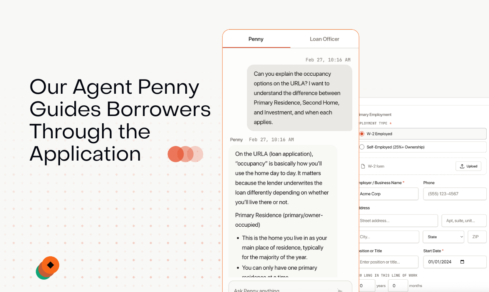
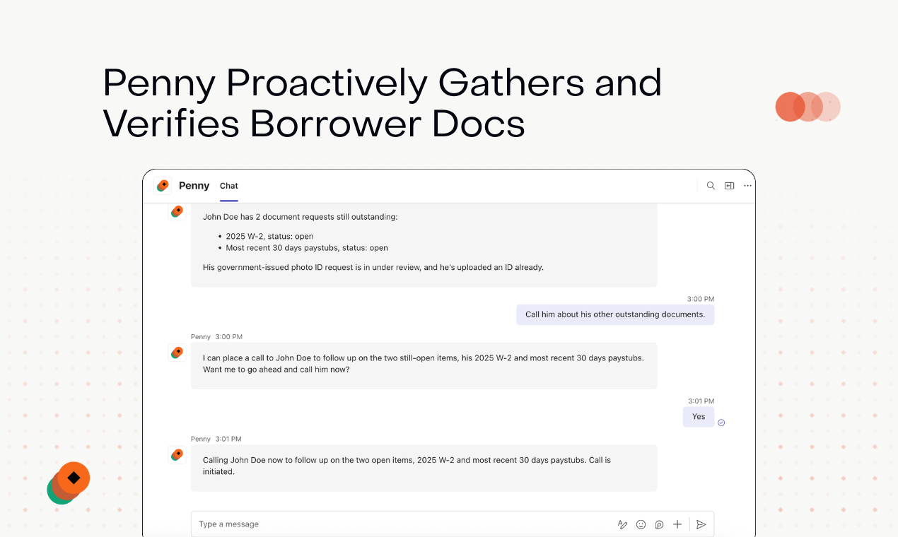
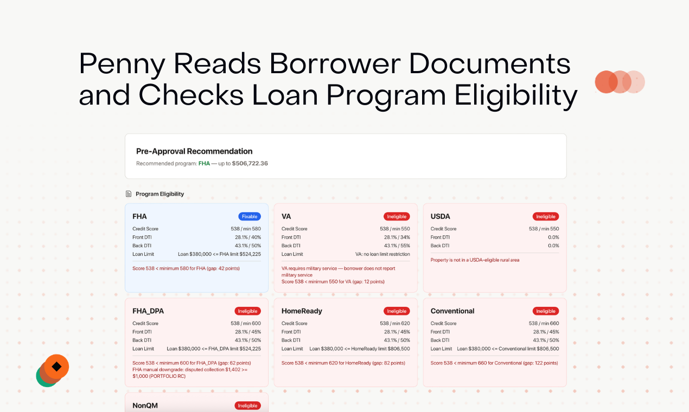

### 🎬 관련 영상
- [🎥 영상 보기](https://ph-files.imgix.net/af235a67-c3f0-47b4-958c-468e4204bdab.jpeg?auto=format)

---

## 3. [Codex Security](https://www.producthunt.com/products/openai)
**Votes**: 192 | **도입 난이도**: 중 | **신뢰도**: 중
**Tagline**: Our application security agent
**서비스 링크**: https://www.producthunt.com/r/E644QNWPBKSI6T

**태그**: 보안, 개발, 자동화, 취약점 분석, Agent, DevTool, Security

### 📌 이 서비스 한눈에 보기
Codex Security는 코드베이스의 취약점을 찾아내고 검증하여 수정 사항을 제안함으로써 개발팀이 중요한 문제에 집중하고 더 빠르게 코드를 배포할 수 있도록 돕는 애플리케이션 보안 에이전트입니다.

### 🔑 주요 기능
- 취약점 자동 발견 및 검증
- 수정 제안 제공
- 코드 보안 강화 및 개발 속도 향상

### 🙋 사용자에게 어떤 점이 좋은가
개발팀은 Codex Security를 통해 보안 취약점을 쉽게 식별하고 해결하여 개발 프로세스를 간소화하고 더 안전한 애플리케이션을 구축할 수 있습니다.

### ✅ 지금 바로 써볼 기능
- 코드베이스 스캔 시작
- 발견된 취약점 검토
- 제안된 수정 사항 적용

### ⚠️ 사용 전 확인할 점
- 지원되는 프로그래밍 언어 및 프레임워크 확인 필요
- 오탐 가능성 존재

### 🧭 확인이 더 필요한 정보
Codex Security의 성능 및 정확도에 대한 사용자 리뷰 및 사례 연구를 추가적으로 확인하는 것이 좋습니다.

### 📸 스크린샷 및 갤러리
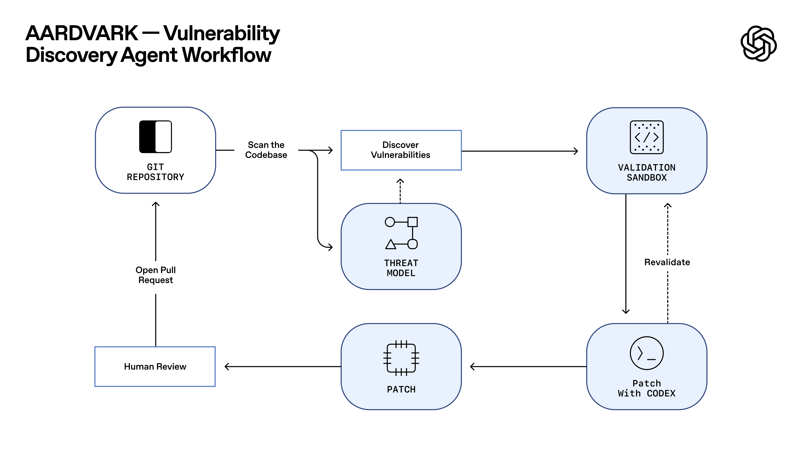

### 🎬 관련 영상
- [🎥 영상 보기](https://ph-files.imgix.net/978ee703-edbf-4b42-b5b1-7b3c63040f8b.jpeg?auto=format)

---

## 4. [FasterGH](https://www.producthunt.com/products/fastergh)
**Votes**: 172 | **도입 난이도**: 하 | **신뢰도**: 중
**Tagline**: Fast GitHub browsing experience
**서비스 링크**: https://www.producthunt.com/r/DEZFMI42LNAWGI

**태그**: GitHub, 캐싱, 개발 도구, 성능, 미러링

### 📌 이 서비스 한눈에 보기
FasterGH는 Convex를 사용하여 GitHub를 실시간으로 캐싱하여 빠른 브라우징 경험을 제공합니다.

### 🔑 주요 기능
- GitHub의 데이터를 실시간으로 캐싱하여 빠른 속도 제공
- Convex를 사용하여 낮은 지연 시간으로 데이터 접근
- GitHub가 원본 데이터 소스, Convex는 읽기 전용 모델

### 🙋 사용자에게 어떤 점이 좋은가
GitHub 저장소를 더 빠르게 탐색하고 코드를 검색하여 개발 생산성을 향상시킬 수 있습니다.

### ✅ 지금 바로 써볼 기능
- 관심 있는 GitHub 저장소를 FasterGH에서 검색해보기
- 기존 GitHub 브라우징 속도와 비교해보기
- FasterGH를 사용하여 코드 검색 속도 향상 경험하기

### ⚠️ 사용 전 확인할 점
- GitHub API 사용량 제한에 따른 영향 확인 필요
- Convex 캐싱 시스템의 데이터 동기화 지연 가능성 고려

### 🧭 확인이 더 필요한 정보
Convex 캐싱 시스템의 안정성과 데이터 일관성에 대한 추가 정보가 필요합니다.

### 📸 스크린샷 및 갤러리
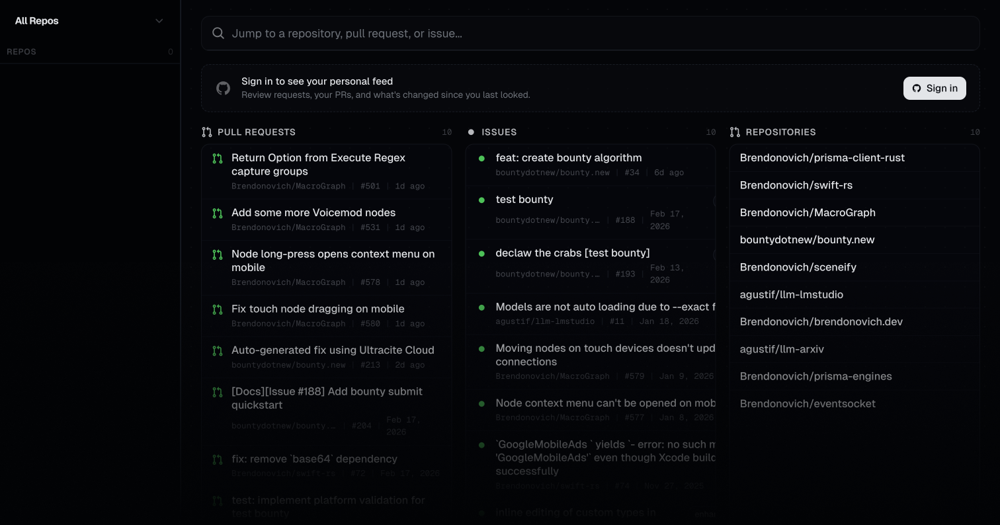
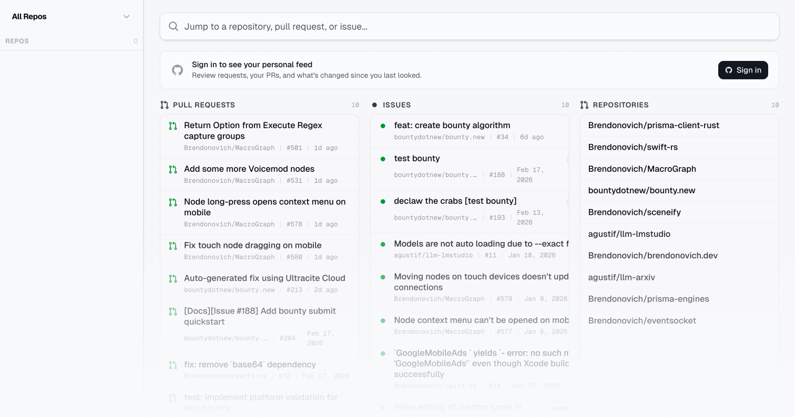

---

## 5. [21st Agents SDK](https://www.producthunt.com/products/21st-dev-the-npm-for-design-engineers)
**Votes**: 141 | **도입 난이도**: 중 | **신뢰도**: 중
**Tagline**: SDK to add an Claude Code AI agent to your app
**서비스 링크**: https://www.producthunt.com/r/F7EYLEJXM3YKD6

**태그**: AI Agent, SDK, 개발 도구, 자동화, Agent, AI Tool, Chat, DevTool

### 📌 이 서비스 한눈에 보기
21st Agents SDK는 Claude Code AI 에이전트를 앱에 빠르게 통합할 수 있도록 지원하여, 개발자가 인프라 관리가 아닌 에이전트의 고유 기능에 집중할 수 있게 합니다.

### 🔑 주요 기능
- TypeScript로 에이전트 정의
- 원 커맨드로 배포
- 스트리밍, 세션 관리, 사용량 청구, 관찰 기능이 내장된 채팅 UI 제공

### 🙋 사용자에게 어떤 점이 좋은가
앱에 AI 에이전트를 쉽게 추가하고 관리할 수 있어 개발 시간과 리소스를 절약하고, 사용자 경험을 향상시킬 수 있습니다.

### ✅ 지금 바로 써볼 기능
- TypeScript로 간단한 에이전트 정의해보기
- 제공되는 채팅 UI를 앱에 임베드해보기
- 사용량 청구 및 관찰 기능 설정해보기

### ⚠️ 사용 전 확인할 점
- Claude Code AI 에이전트의 성능 및 비용 고려
- TypeScript에 대한 이해 필요

### 🧭 확인이 더 필요한 정보
Y Combinator의 지원을 받는 만큼, SDK의 장기적인 유지보수 및 업데이트 계획을 확인하는 것이 좋습니다.

### 📸 스크린샷 및 갤러리
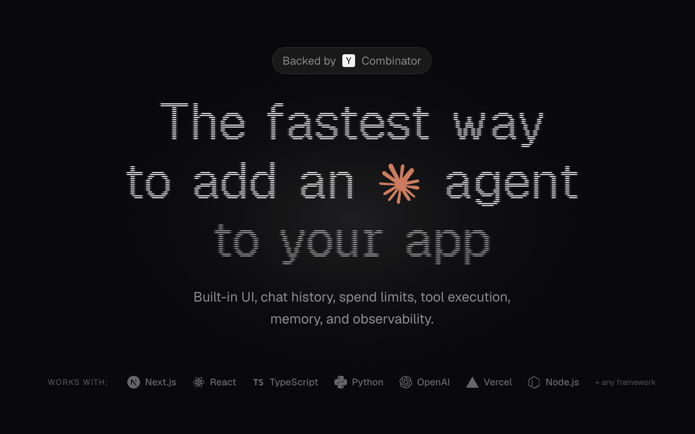
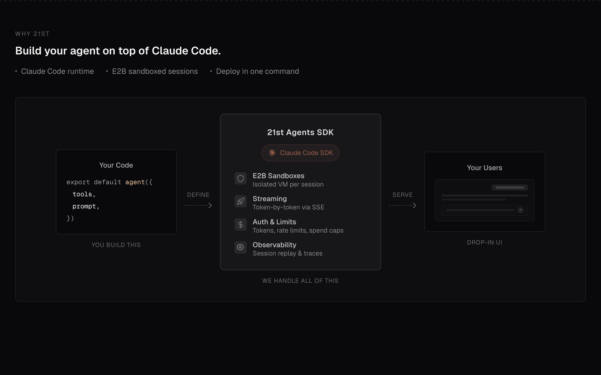
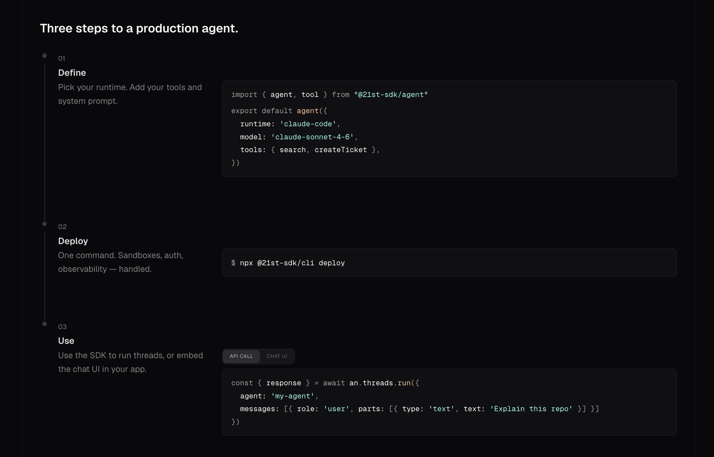

---

## 6. [Variant](https://www.producthunt.com/products/variant-2)
**Votes**: 113 | **도입 난이도**: 중 | **신뢰도**: 중
**Tagline**: Endless designs for your ideas, just scroll.
**서비스 링크**: https://www.producthunt.com/r/DXVAKTERMMJYXF

**태그**: 디자인, AI, 자동화, 아이디어 구체화, AI Tool, Design

### 📌 이 서비스 한눈에 보기
Variant는 원하는 디자인을 설명할 필요 없이 다양한 디자인 옵션을 보여주는 툴로, 창작 아이디어를 시각적으로 탐색하고 적용할 수 있도록 돕습니다.

### 🔑 주요 기능
- 아이디어를 시각적으로 빠르게 구현
- 무한한 디자인 옵션 제공
- 별도 설명 없이 원하는 분위기 적용

### 🙋 사용자에게 어떤 점이 좋은가
Variant를 사용하면 아이디어를 구체화하는 데 드는 시간과 노력을 줄이고, 다양한 디자인 스타일을 쉽게 실험해 볼 수 있습니다.

### ✅ 지금 바로 써볼 기능
- 원하는 분위기의 디자인 샘플 업로드
- 다양한 디자인 옵션 스크롤하며 확인
- 마음에 드는 디자인 선택 및 적용

### ⚠️ 사용 전 확인할 점
- 결과물의 독창성 검토 필요
- 세부 조정 기능의 유무 확인 필요

### 🧭 확인이 더 필요한 정보
Variant가 제공하는 디자인 옵션의 범위와 사용자 정의 가능성에 대한 추가 정보가 필요합니다.

### 📸 스크린샷 및 갤러리

---

## 7. [LTX Desktop](https://www.producthunt.com/products/ltx-desktop)
**Votes**: 105 | **도입 난이도**: 중 | **신뢰도**: 중
**Tagline**: Local open-source LTX video editor optimized for GPUs
**서비스 링크**: https://www.producthunt.com/r/IE2R2WSRUQDWSA

**태그**: 비디오 편집, 오픈소스, AI, GPU, 로컬, AI Tool, Video

### 📌 이 서비스 한눈에 보기
LTX 데스크톱은 GPU에 최적화된 로컬 오픈 소스 비디오 편집기로, AI 생성 기능까지 갖춰 사용자의 영상 편집 효율성을 높여줍니다.

### 🔑 주요 기능
- 무료 오픈 소스 비디오 편집기
- GPU 최적화로 빠른 편집 속도
- 로컬 환경에서 AI 생성 기능 제공

### 🙋 사용자에게 어떤 점이 좋은가
LTX 데스크톱을 사용하면 복잡한 설정 없이도 고품질의 비디오 편집과 AI 기반 콘텐츠 생성을 로컬 환경에서 편리하게 수행할 수 있습니다.

### ✅ 지금 바로 써볼 기능
- LTX 데스크톱 다운로드 및 설치
- 기존 영상 파일 불러와 편집 시작
- AI 기반 영상 생성 기능 사용해보기

### ⚠️ 사용 전 확인할 점
- GPU 성능에 따라 편집 속도 차이 발생 가능
- 오픈 소스 특성상 사용자 스스로 문제 해결 필요

### 🧭 확인이 더 필요한 정보
LTX-2.3 모델의 AI 생성 기능 성능 및 지원 포맷에 대한 추가 정보 확인이 필요합니다.

### 📸 스크린샷 및 갤러리
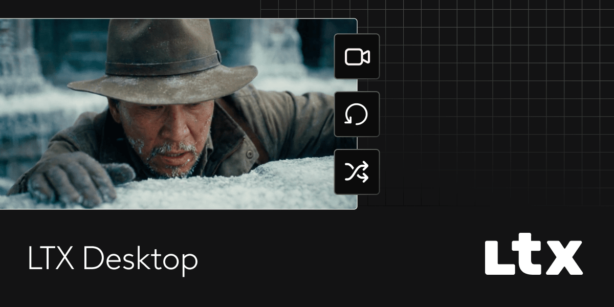
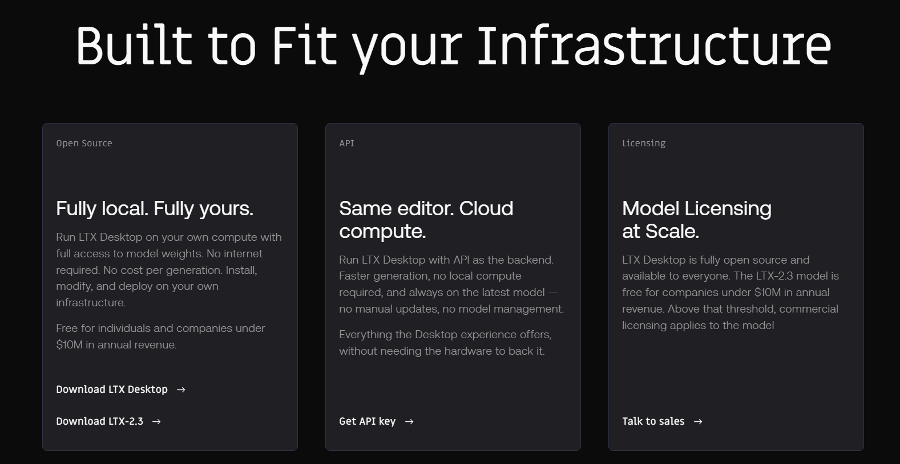
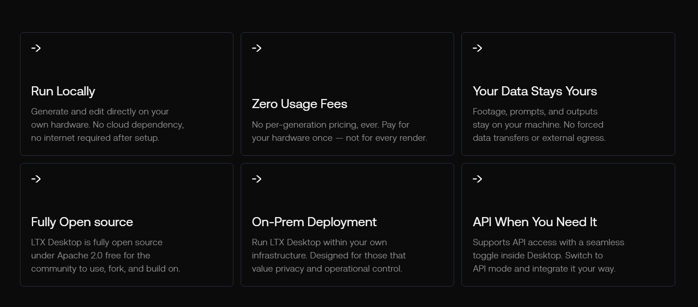

### 🎬 관련 영상
- [🎥 영상 보기](https://ph-files.imgix.net/4edd247c-4c9e-4987-8419-eb68da78b0e3.jpeg?auto=format)

---

## 8. [Thinking Line](https://www.producthunt.com/products/thinking-line)
**Votes**: 102 | **도입 난이도**: 중 | **신뢰도**: 중
**Tagline**: AI-powered doodle video and vector generator
**서비스 링크**: https://www.producthunt.com/r/PQFC7XTRIUVCUV

**태그**: AI, 벡터 그래픽, 비디오 제작, 콘텐츠 제작, AI Tool, Prompting, Video, Vision

### 📌 이 서비스 한눈에 보기
Thinking Line은 AI 기반으로 프롬프트를 통해 편집 가능한 SVG 벡터 이미지와 설명 비디오를 쉽게 만들 수 있게 해줍니다.

### 🔑 주요 기능
- AI 기반 이미지 벡터화 및 낙서 생성
- 프롬프트를 편집 가능한 SVG로 변환
- 매력적인 설명 비디오 제작

### 🙋 사용자에게 어떤 점이 좋은가
아이디어를 빠르게 시각화하고, 편집 가능한 벡터 이미지를 얻어 디자인 작업 효율성을 높일 수 있습니다. 설명 비디오 제작으로 콘텐츠 제작 시간을 단축할 수 있습니다.

### ✅ 지금 바로 써볼 기능
- 프롬프트를 입력하여 SVG 이미지 생성해보기
- 생성된 SVG 이미지를 편집하여 원하는 스타일로 변경해보기
- 설명 비디오 제작 기능 사용해보기

### ⚠️ 사용 전 확인할 점
- AI 생성 결과물의 품질은 프롬프트에 따라 달라질 수 있습니다.
- 벡터 이미지 편집 시, 전문적인 디자인 지식이 필요할 수 있습니다.

### 🧭 확인이 더 필요한 정보
AI 모델의 성능 및 지원되는 프롬프트 종류에 대한 추가 정보 확인이 필요합니다.

### 📸 스크린샷 및 갤러리
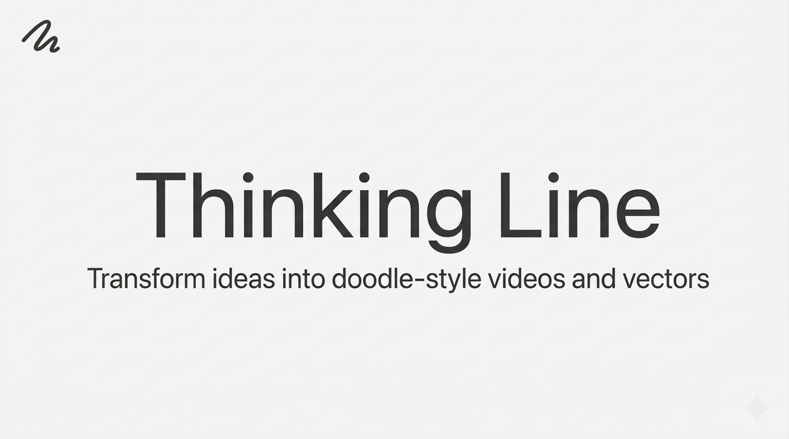
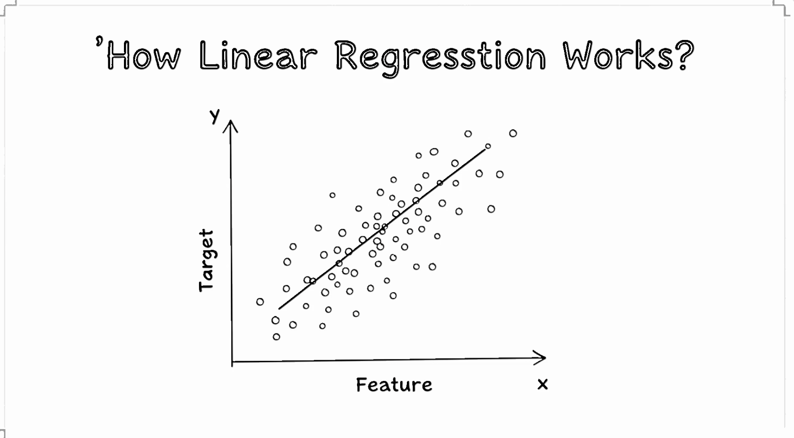

---

## 9. [NotchPad](https://www.producthunt.com/products/notchpad)
**Votes**: 92 | **도입 난이도**: 하 | **신뢰도**: 중
**Tagline**: The secure notepad and clipboard manager for your Mac.
**서비스 링크**: https://www.producthunt.com/r/3F5TDFI3UXGFJB

**태그**: 생산성, 메모, 클립보드, 보안, 스니펫

### 📌 이 서비스 한눈에 보기
맥북 프로 노치 안에 숨어있는 메모장, 클립보드 관리자, 스니펫 도구로, 클릭 한 번으로 즉시 사용 가능하며 AES-256 암호화로 보안까지 강화했습니다.

### 🔑 주요 기능
- 맥북 프로 노치에 통합되어 빠른 접근성 제공
- 메모장, 클립보드 관리, 스니펫 기능 통합
- AES-256 암호화로 데이터 보안 강화 (1Password, Bitwarden, Touch ID 지원)

### 🙋 사용자에게 어떤 점이 좋은가
작업 흐름을 방해받지 않고 필요한 정보를 즉시 기록하고 관리할 수 있어 생산성을 높여줍니다. 특히 보안이 중요한 정보를 안전하게 보관할 수 있습니다.

### ✅ 지금 바로 써볼 기능
- 맥북 프로 노치를 클릭하여 메모장 실행
- 클립보드 관리 기능을 활용하여 복사/붙여넣기 효율 증대
- 스니펫 기능을 활용하여 자주 사용하는 텍스트 저장 및 활용

### ⚠️ 사용 전 확인할 점
- 맥북 프로 노치가 없는 모델에서는 사용 불가
- 15일 무료 평가판 이후 유료 구매 필요

### 🧭 확인이 더 필요한 정보
다른 클라우드 서비스와의 통합 가능성 및 데이터 동기화 지원 여부 확인이 필요합니다.

### 📸 스크린샷 및 갤러리
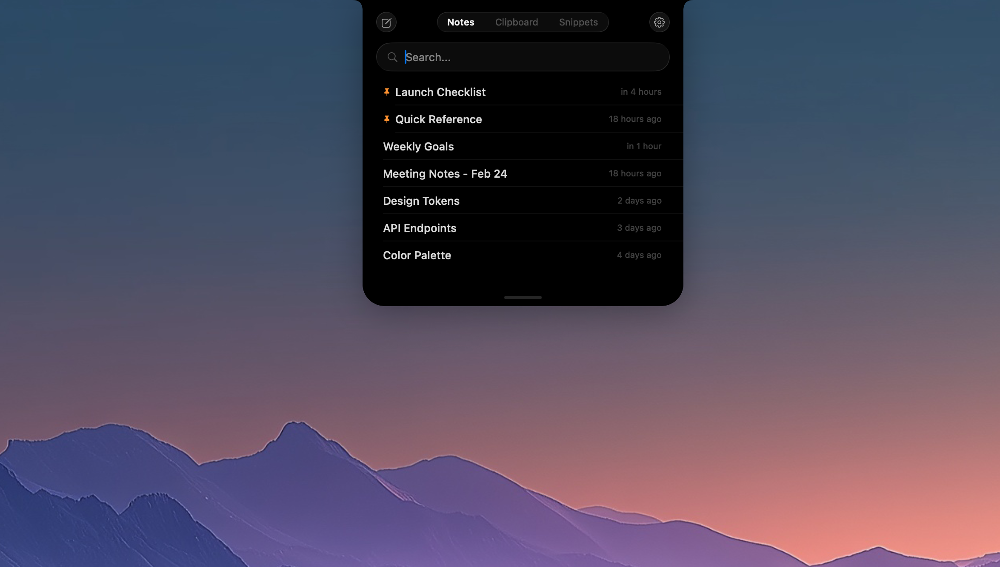
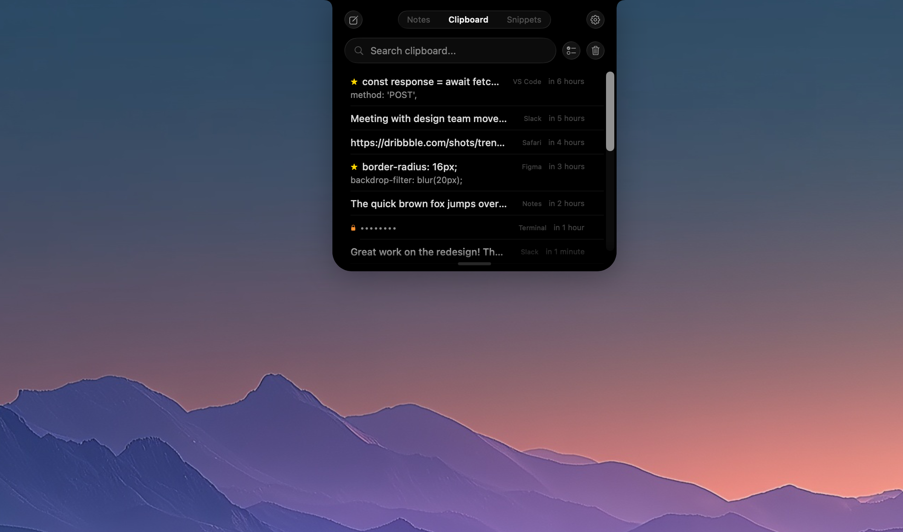
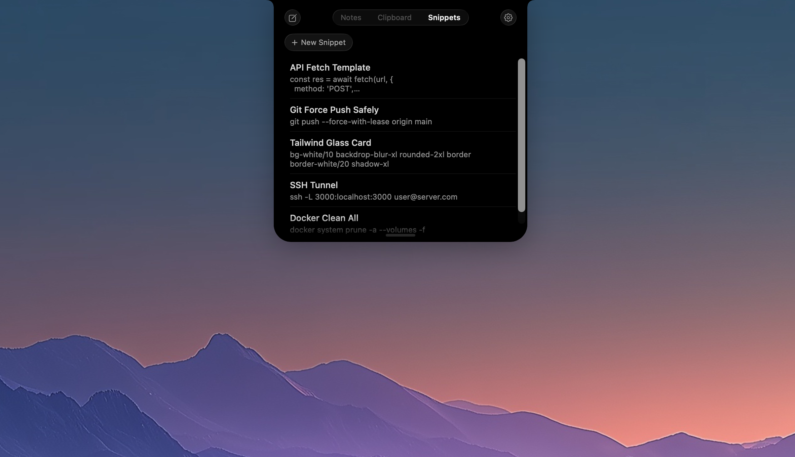

### 🎬 관련 영상
- [🎥 영상 보기](https://ph-files.imgix.net/43e672c5-8bfb-401d-9c61-37de43739170.jpeg?auto=format)

---

## 10. [Olmo Hybrid](https://www.producthunt.com/products/allen-institute-of-artificial-intelligence)
**Votes**: 91 | **도입 난이도**: 중 | **신뢰도**: 중
**Tagline**: 7B open model mixing transformers and linear RNNs
**서비스 링크**: https://www.producthunt.com/r/PC7BT6K6VZLUCU

**태그**: AI 모델, RNN, Transformer, Open Source

### 📌 이 서비스 한눈에 보기
Olmo Hybrid는 트랜스포머 어텐션과 선형 RNN 레이어를 결합한 완전 개방형 7B 모델로, 더 적은 토큰으로 Olmo 3와 유사한 정확도를 제공합니다.

### 🔑 주요 기능
- 트랜스포머 어텐션과 선형 RNN 레이어 결합
- Gated DeltaNet을 3:1 비율로 사용하여 효율성 향상
- Olmo 3 대비 49% 적은 토큰 사용

### 🙋 사용자에게 어떤 점이 좋은가
더 적은 리소스로 유사한 수준의 정확도를 얻을 수 있어, 모델 운영 비용을 절감하고 효율적인 AI 개발이 가능합니다.

### ✅ 지금 바로 써볼 기능
- Olmo Hybrid 모델 다운로드 및 사용
- Gated DeltaNet 레이어 구조 실험
- 기존 모델과 성능 비교

### ⚠️ 사용 전 확인할 점
- 7B 모델 크기에 따른 하드웨어 요구 사항 확인
- RNN 레이어 특성에 따른 학습 데이터 의존성 고려

### 🧭 확인이 더 필요한 정보
실제 사용 환경에서의 성능 및 효율성에 대한 추가 검증이 필요합니다.

### 📸 스크린샷 및 갤러리
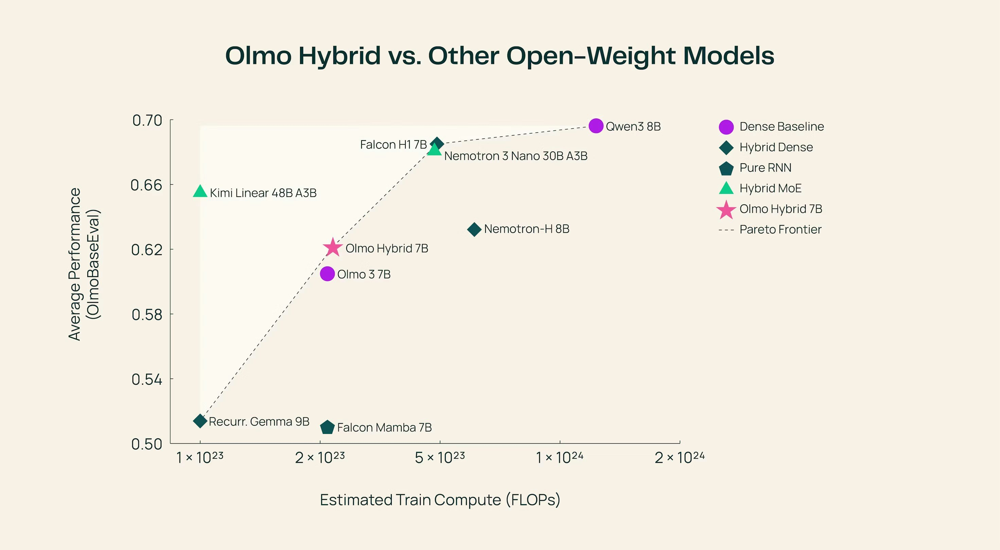
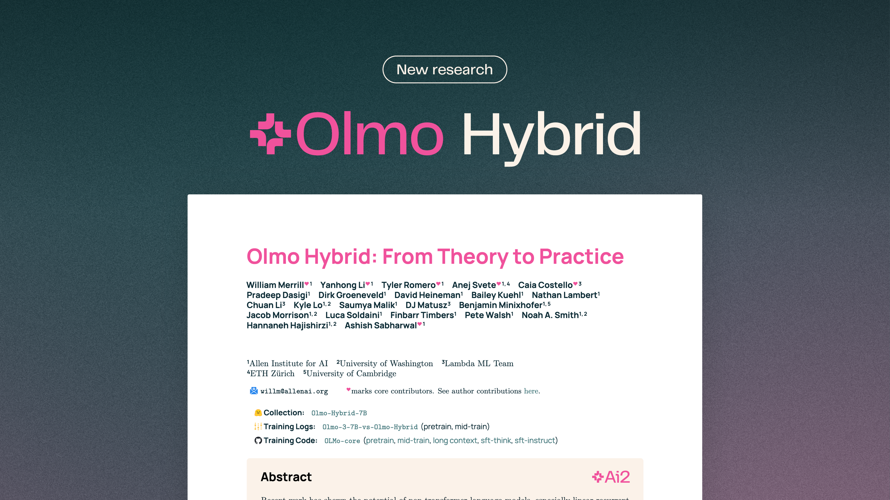
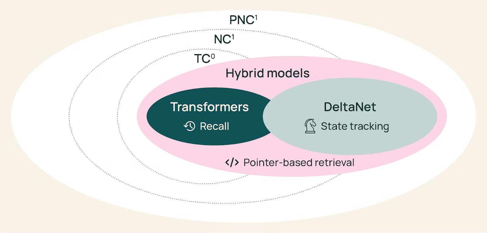

---

