# 🚀 Product Hunt Daily Top 10 (2026-03-09)

## 1. [Claude Marketplace](https://www.producthunt.com/products/claude-marketplace)
**Votes**: 345 | **도입 난이도**: 중 | **신뢰도**: 중
**Tagline**: Helping companies easily get the AI tools they need
**서비스 링크**: https://www.producthunt.com/r/7DWRGBKT5I3Y5B

**태그**: AI, 마켓플레이스, Claude, 솔루션, Anthropic, AI Tool

### 📌 이 서비스 한눈에 보기
Anthropic의 Claude 모델을 활용하는 AI 솔루션을 더 쉽게 도입하고 기존 약정 금액을 활용하여 결제할 수 있도록 지원하는 마켓플레이스입니다.

### 🔑 주요 기능
- Anthropic의 Claude 모델 기반 솔루션 제공
- 기존 Anthropic 계약 금액으로 결제 가능
- 기업이 AI 도구를 쉽게 도입하도록 지원

### 🙋 사용자에게 어떤 점이 좋은가
Claude 모델을 사용하는 다양한 AI 솔루션을 쉽게 찾아보고, 기존에 Anthropic과 맺은 계약을 활용하여 비용을 지불할 수 있어 편리합니다.

### ✅ 지금 바로 써볼 기능
- Claude Marketplace에서 제공하는 솔루션 살펴보기
- Anthropic 기존 계약 금액 확인
- 관심 있는 솔루션의 데모 또는 평가판 사용해보기

### ⚠️ 사용 전 확인할 점
- 현재 제한된 미리보기 버전으로 제공
- 제공되는 솔루션의 종류와 범위 확인 필요

### 🧭 확인이 더 필요한 정보
마켓플레이스에서 제공되는 솔루션의 종류와 공급업체에 대한 추가 정보가 필요합니다.

### 📸 스크린샷 및 갤러리
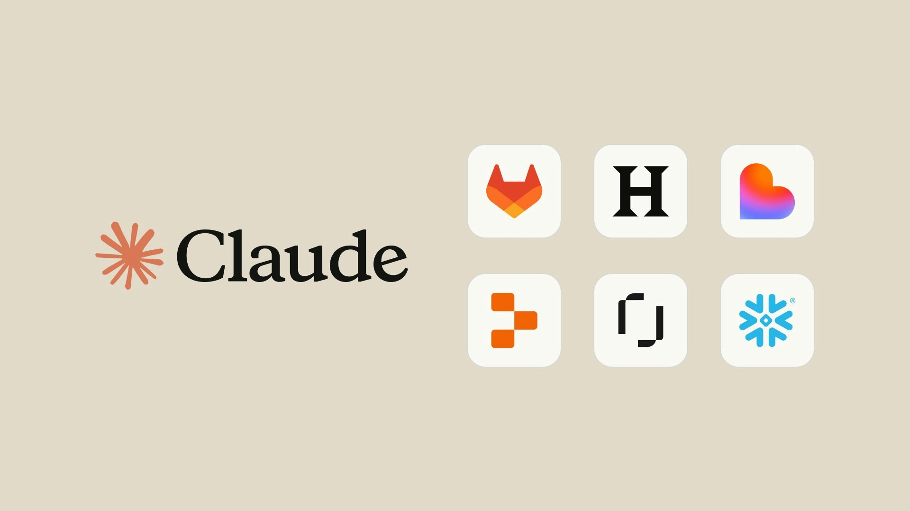
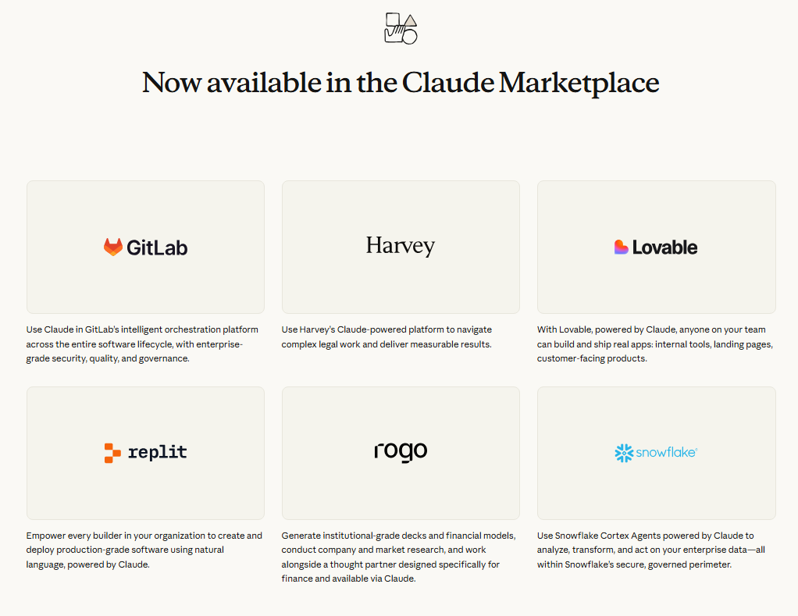

---

## 2. [Vibe Marketplace by Greta](https://www.producthunt.com/products/gretabyquestera)
**Votes**: 194 | **도입 난이도**: 중 | **신뢰도**: 중
**Tagline**: Sell what you ship, instantly 
**서비스 링크**: https://www.producthunt.com/r/Z6T7LW3HTW6BF6

**태그**: No-code, Marketplace, Side Project, Web Development, App Development, DevTool

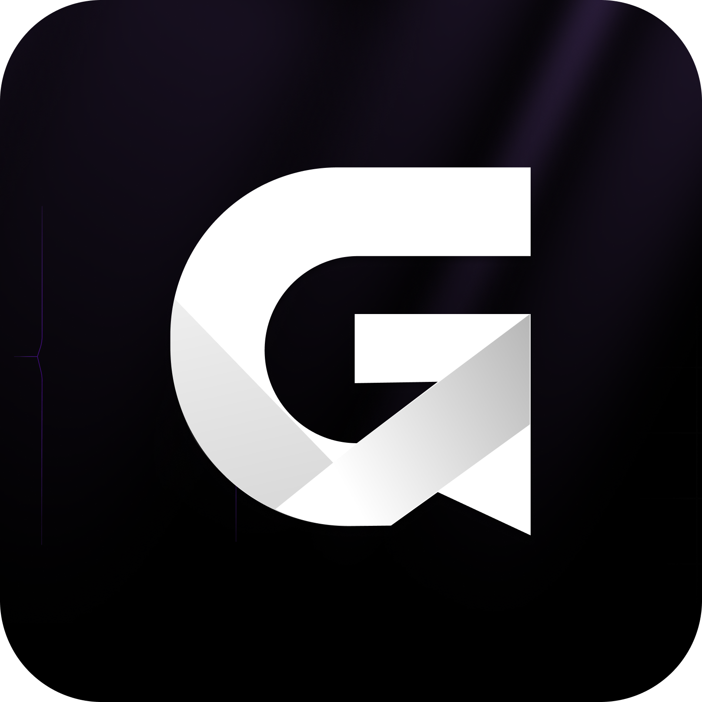

### 📌 이 서비스 한눈에 보기
Vibe Coding의 Greta를 사용하여 코딩 없이 웹사이트, 앱, UI 컴포넌트를 만들고 판매하여 수익을 창출할 수 있는 마켓플레이스입니다.

### 🔑 주요 기능
- 코딩 없이 제품 제작 및 판매 가능
- 사이드 프로젝트로 수익 창출
- 기존 제품 구매로 빠른 런칭 가능

### 🙋 사용자에게 어떤 점이 좋은가
코딩 없이 아이디어를 빠르게 구현하고 수익화할 수 있으며, 이미 만들어진 제품을 활용하여 개발 시간을 단축할 수 있습니다.

### ✅ 지금 바로 써볼 기능
- Greta를 사용하여 간단한 웹사이트 제작 후 판매
- 마켓플레이스에서 필요한 UI 컴포넌트 검색 및 구매
- 사이드 프로젝트 아이디어 구상 후 Greta로 구현

### ⚠️ 사용 전 확인할 점
- Greta 사용법 숙지 필요
- 마켓플레이스 활성화 정도에 따라 수익 변동 가능

### 🧭 확인이 더 필요한 정보
마켓플레이스의 활성 사용자 수 및 판매 수수료에 대한 추가 정보 확인이 필요합니다.

### 📸 스크린샷 및 갤러리

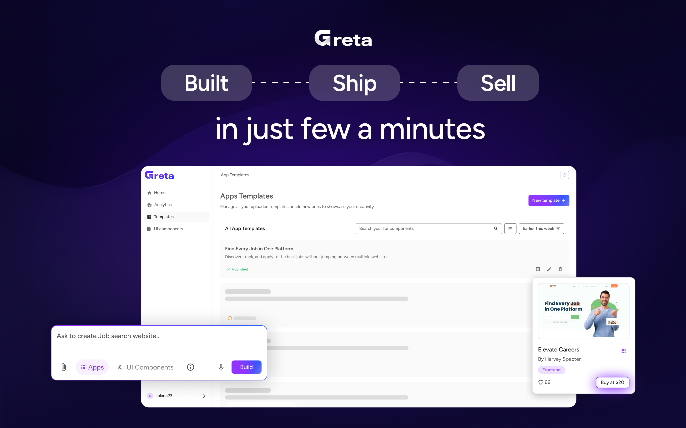

### 🎬 관련 영상
- [🎥 영상 보기](https://ph-files.imgix.net/06c48132-8085-4850-90ff-bdf3d76dc84b.jpeg?auto=format)

---

## 3. [GetMimic](https://www.producthunt.com/products/getmimic)
**Votes**: 172 | **도입 난이도**: 중 | **신뢰도**: 중
**Tagline**: Generate viral social & chat mockups in seconds with AI.
**서비스 링크**: https://www.producthunt.com/r/NG2ALO5LEHRFLC

**태그**: AI, Mockup, 마케팅, 자동화, 디자인, AI Tool, Chat, Prompting, Marketing

### 📌 이 서비스 한눈에 보기
GetMimic은 AI를 활용하여 소셜 미디어 및 채팅 mockups을 빠르게 생성하여 마케팅 자료 제작 시간을 단축시켜 줍니다.

### 🔑 주요 기능
- 35개 이상의 플랫폼 지원 (WhatsApp, Twitter, ChatGPT 등)
- AI 자동 완성 기능으로 대화 내용 자동 생성
- 실시간 Light/Dark 모드 미리보기 및 클라우드 저장 지원

### 🙋 사용자에게 어떤 점이 좋은가
Photoshop 없이도 몇 초 만에 워터마크 없는 고품질의 mockups을 만들 수 있어 마케팅 자료 제작 효율성을 높여줍니다.

### ✅ 지금 바로 써볼 기능
- AI 자동 완성 기능으로 대화 내용 생성해보기
- 다양한 플랫폼에서 mockups 미리보기
- Light/Dark 모드 전환하여 디자인 확인

### ⚠️ 사용 전 확인할 점
- 지원하는 플랫폼 목록 확인 필요
- AI 자동 완성 기능의 정확도 확인 필요

### 🧭 확인이 더 필요한 정보
AI 자동 완성 기능이 얼마나 자연스러운 대화를 생성하는지 사용자가 직접 확인해야 합니다.

### 📸 스크린샷 및 갤러리

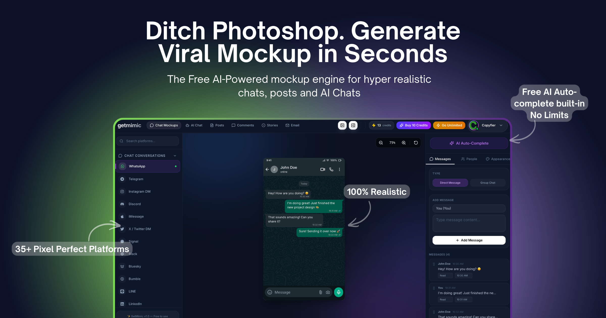

---

## 4. [Pulldog](https://www.producthunt.com/products/pulldog)
**Votes**: 158 | **도입 난이도**: 중 | **신뢰도**: 중
**Tagline**: A Mac application to keep your code reviews organized!
**서비스 링크**: https://www.producthunt.com/r/6XKSJZ67Z57E4N

**태그**: DevTool, Code Review, macOS, Github, Gitlab

### 📌 이 서비스 한눈에 보기
Pulldog은 macOS 환경에서 Github 및 Gitlab 풀 리퀘스트를 효율적으로 관리하고 검토할 수 있도록 돕는 네이티브 앱입니다. 여러 계정을 통합 관리하고, 스마트 쿼리를 통해 필요한 PR에 집중하며, 다양한 macOS 기능을 활용하여 코드 리뷰 생산성을 높여줍니다.

### 🔑 주요 기능
- Github 및 Gitlab 풀 리퀘스트 통합 관리
- 스마트 쿼리를 통한 PR 노이즈 감소
- Spotlight, 위젯, Apple Intelligence 등 macOS 기능 활용

### 🙋 사용자에게 어떤 점이 좋은가
브라우저 탭 없이 macOS 네이티브 환경에서 집중적인 코드 리뷰가 가능하며, 여러 계정을 하나의 통합된 받은 편지함에서 관리하여 효율성을 높일 수 있습니다.

### ✅ 지금 바로 써볼 기능
- Github 또는 Gitlab 계정 연결
- 스마트 쿼리 설정하여 관심 있는 PR 필터링
- Spotlight 액션 또는 위젯을 사용하여 코드 리뷰 수행

### ⚠️ 사용 전 확인할 점
- macOS 환경에서만 사용 가능
- Apple Intelligence 기능은 특정 macOS 버전 이상에서만 지원될 수 있음

### 🧭 확인이 더 필요한 정보
Apple Intelligence 기능의 구체적인 지원 범위 및 성능에 대한 추가 정보 확인이 필요합니다.

### 📸 스크린샷 및 갤러리

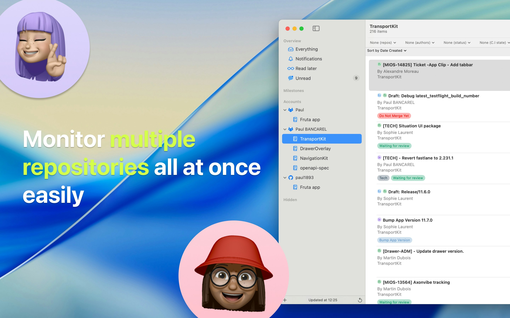
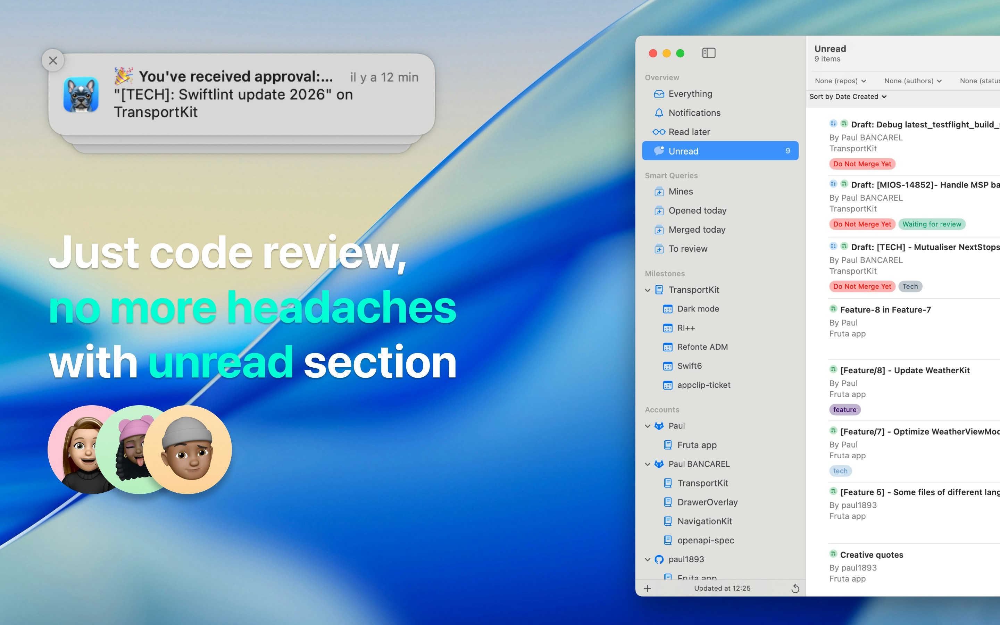

### 🎬 관련 영상
- [🎥 영상 보기](https://ph-files.imgix.net/ac0de303-93b1-4668-82d7-28110857deaf.jpeg?auto=format)

---

## 5. [Song Sweeper](https://www.producthunt.com/products/song-sweeper)
**Votes**: 141 | **도입 난이도**: 중 | **신뢰도**: 중
**Tagline**: Remove duplicate songs
**서비스 링크**: https://www.producthunt.com/r/A5BD3HDFPXL3TQ

**태그**: 음악, 정리, 유틸리티, 자동화

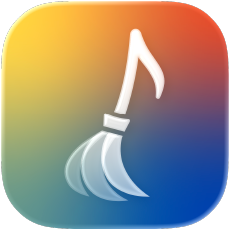

### 📌 이 서비스 한눈에 보기
Song Sweeper는 Apple Music 라이브러리를 정리하여 중복된 노래를 제거하고, 앨범 에디션을 통합하며, 듣지 않는 노래를 찾아 제거하고, 자주 듣는 트랙을 즐겨찾기에 추가하여 추천 기능을 개선하는 iPhone 앱입니다.

### 🔑 주요 기능
- Apple Music 라이브러리 정리
- 중복된 노래 제거 및 앨범 에디션 통합
- 듣지 않는 노래를 찾아 제거

### 🙋 사용자에게 어떤 점이 좋은가
지저분한 음악 라이브러리를 깔끔하게 정리하고, 저장 공간을 확보하며, 음악 감상 경험을 향상시킬 수 있습니다.

### ✅ 지금 바로 써볼 기능
- 중복된 노래 찾기 기능 사용
- 앨범 에디션 통합 기능 사용
- 듣지 않는 노래 목록 확인 및 제거

### ⚠️ 사용 전 확인할 점
- Apple Music 계정 필요
- 대용량 라이브러리 정리 시 시간 소요 가능성

### 🧭 확인이 더 필요한 정보
정확한 중복 노래 제거율 및 추천 기능 개선 효과는 사용자마다 다를 수 있습니다.

### 📸 스크린샷 및 갤러리

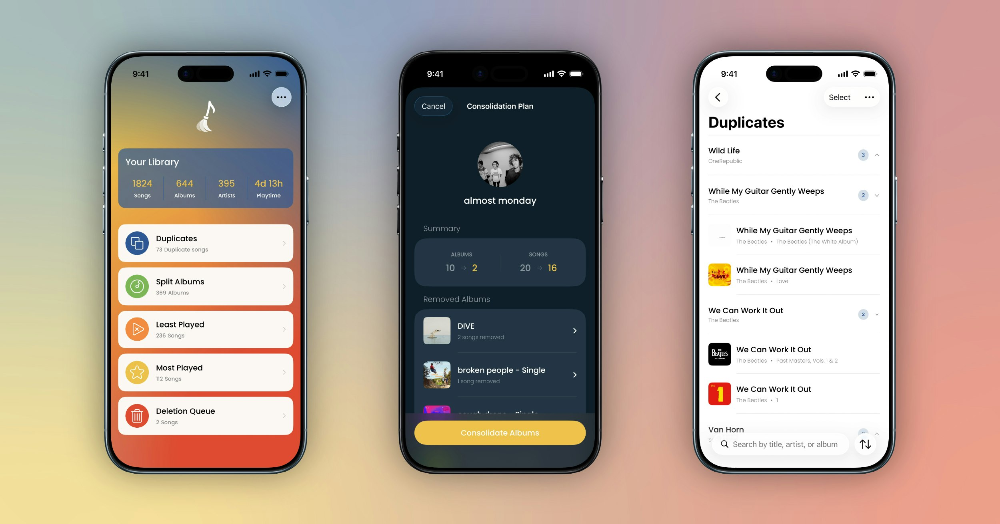
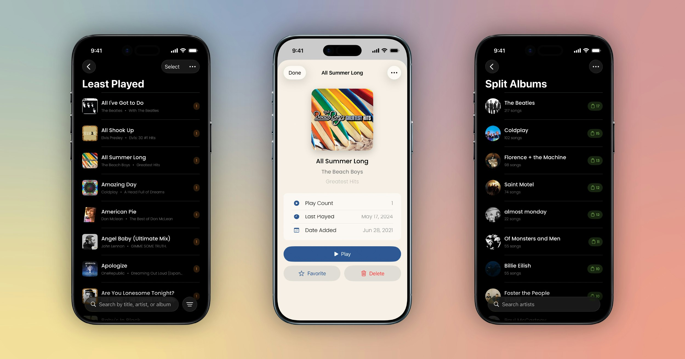

---

## 6. [MarketingDB](https://www.producthunt.com/products/marketingdb)
**Votes**: 43 | **도입 난이도**: 하 | **신뢰도**: 중
**Tagline**: Free dofollow backlinks for the next generation of SaaS.
**서비스 링크**: https://www.producthunt.com/r/TS4LQEMCOHXJ6I

**태그**: 백링크, SaaS, 마케팅, 커뮤니티, Marketing

### 📌 이 서비스 한눈에 보기
MarketingDB는 SaaS 스타트업을 위해 무료로 고품질 백링크를 제공하여 초기 인지도를 높이는 데 도움을 줍니다.

### 🔑 주요 기능
- 대부분의 디렉토리가 유료인 반면, MarketingDB는 무료로 dofollow 백링크를 제공합니다.
- 개발자 커뮤니티를 위해 개발자들이 직접 만들었습니다.
- 모든 프로젝트에 대해 실제 dofollow 백링크, 진정한 리뷰, 영구적인 목록을 제공합니다.

### 🙋 사용자에게 어떤 점이 좋은가
초기 단계의 SaaS 프로젝트가 마케팅 비용 부담 없이 백링크를 확보하고 인지도를 높이는 데 유용합니다. 특히 자금 확보가 어려운 스타트업에게 실질적인 도움이 될 수 있습니다.

### ✅ 지금 바로 써볼 기능
- 자신의 SaaS 프로젝트를 MarketingDB에 등록하여 무료 백링크를 확보하세요.
- MarketingDB에 등록된 다른 프로젝트들을 살펴보고 아이디어를 얻으세요.
- 커뮤니티에 참여하여 다른 개발자들과 소통하세요.

### ⚠️ 사용 전 확인할 점
- 무료 서비스이므로 서비스 지속성에 대한 보장이 없을 수 있습니다.
- 백링크 품질이 검색 엔진 순위에 미치는 영향은 보장되지 않습니다.

### 🧭 확인이 더 필요한 정보
MarketingDB의 장기적인 유지 가능성과 백링크 효과에 대한 추가적인 검증이 필요합니다.

### 📸 스크린샷 및 갤러리
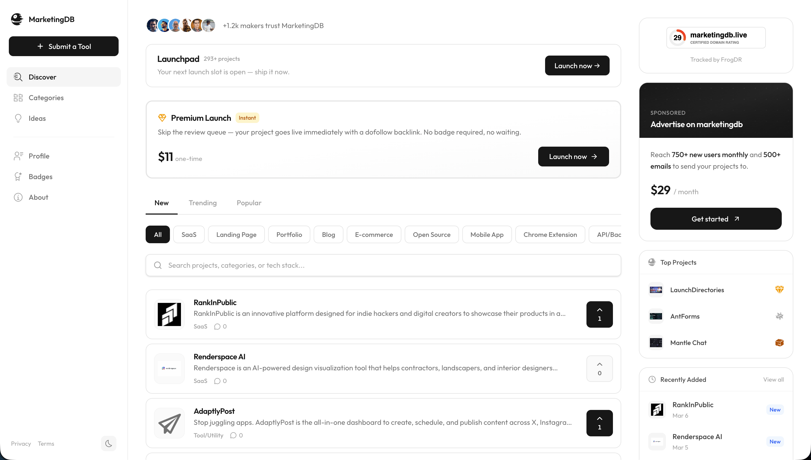
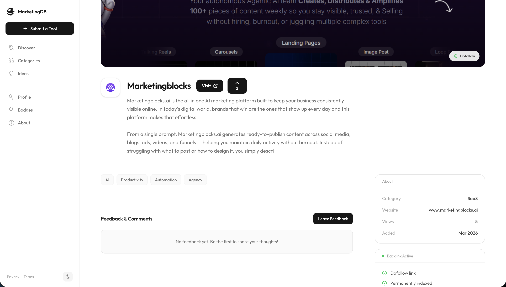

---

## 7. [Soloron](https://www.producthunt.com/products/soloron)
**Votes**: 38 | **도입 난이도**: 중 | **신뢰도**: 중
**Tagline**: Build real apps by simply describing them.
**서비스 링크**: https://www.producthunt.com/r/KMMZIPMGOQW7YH

**태그**: AI, No-code, App Builder, Automation, AI Tool

### 📌 이 서비스 한눈에 보기
아이디어만 있으면 AI가 앱을 자동으로 구축하고 업데이트해주는 솔루션입니다.

### 🔑 주요 기능
- 아이디어를 설명하는 것만으로 앱 개발 가능
- AI 기반 자동 앱 빌드 및 업데이트
- 개발 지식 없이도 앱 제작 가능

### 🙋 사용자에게 어떤 점이 좋은가
개발자가 아니어도 원하는 앱을 쉽게 만들 수 있으며, 아이디어를 빠르게 현실화할 수 있습니다.

### ✅ 지금 바로 써볼 기능
- 아이디어 구체화하여 앱 설명 작성해보기
- 자동 생성된 앱 디자인 및 기능 커스터마이징해보기
- 앱 업데이트 및 유지보수 자동화 기능 사용해보기

### ⚠️ 사용 전 확인할 점
- AI가 생성하는 앱의 품질은 아이디어 설명의 명확성에 따라 달라질 수 있음
- 복잡하거나 특수한 기능을 가진 앱은 완벽하게 구현되지 않을 수 있음

### 🧭 확인이 더 필요한 정보
AI가 생성하는 앱의 성능 및 확장성에 대한 추가적인 정보 확인이 필요합니다.

### 📸 스크린샷 및 갤러리
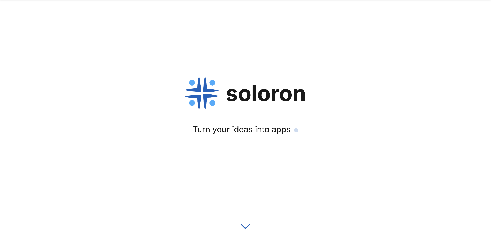
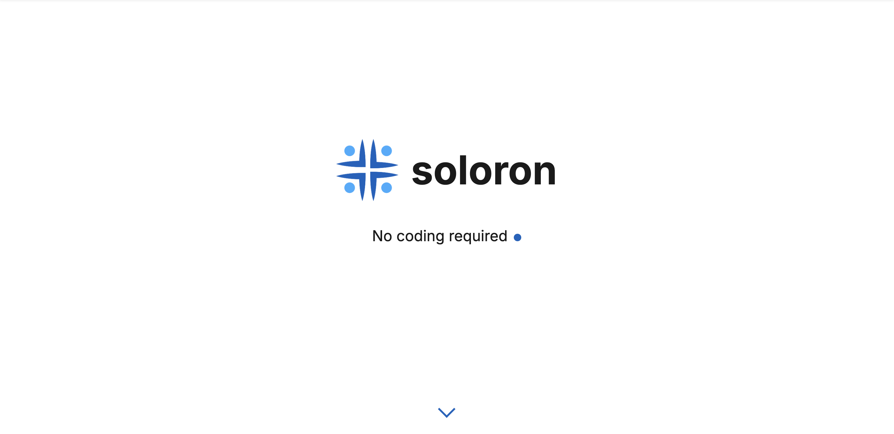
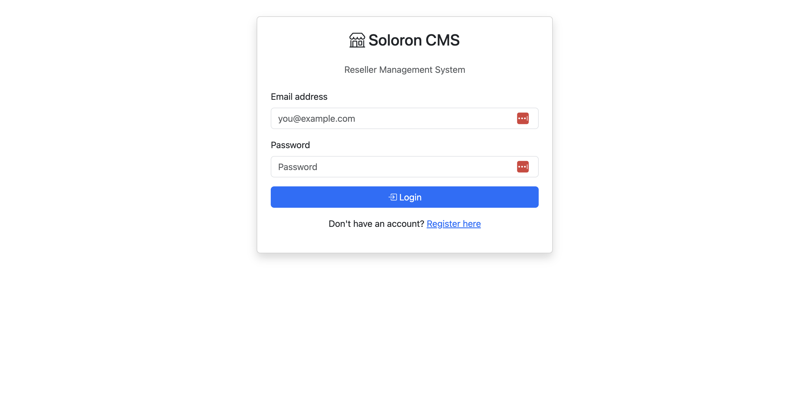

### 🎬 관련 영상
- [🎥 영상 보기](https://ph-files.imgix.net/7a87df11-f270-4a8c-977e-f6e7c3ae5a35.jpeg?auto=format)

---

## 8. [FinishDSA](https://www.producthunt.com/products/finishdsa)
**Votes**: 23 | **도입 난이도**: 중 | **신뢰도**: 중
**Tagline**: Finish DSA with structure, consistency, and zero overwhelm.
**서비스 링크**: https://www.producthunt.com/r/3JL6I3LAZ2N4AG

**태그**: DSA, 코딩 인터뷰, 알고리즘, 자료구조, 학습

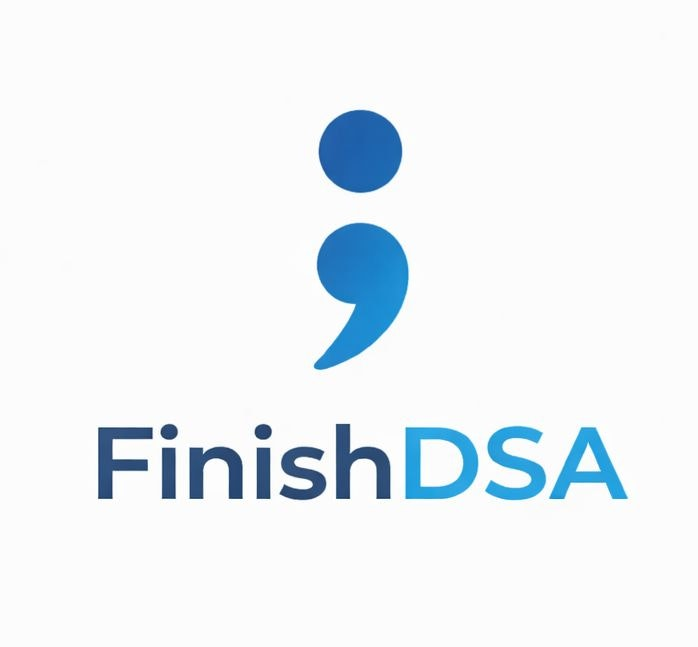

### 📌 이 서비스 한눈에 보기
FinishDSA는 체계적인 학습, 엄선된 문제, 명확한 로드맵을 통해 학생들이 자료 구조 및 알고리즘을 마스터하고 코딩 인터뷰를 성공적으로 준비하도록 돕습니다.

### 🔑 주요 기능
- 구조화된 연습을 제공합니다.
- 엄선된 문제들을 제공합니다.
- 명확한 로드맵을 제시합니다.

### 🙋 사용자에게 어떤 점이 좋은가
코딩 인터뷰를 준비하는 학생들에게 체계적인 학습 경로와 효율적인 문제 해결 능력을 길러줍니다. 자료 구조 및 알고리즘 학습에 대한 부담감을 줄여줍니다.

### ✅ 지금 바로 써볼 기능
- 제공되는 로드맵을 따라 학습 시작하기
- 엄선된 문제들을 풀어보며 실력 향상시키기
- 코딩 인터뷰 대비를 위한 연습 진행하기

### ⚠️ 사용 전 확인할 점
- 제공되는 문제의 난이도가 사용자의 수준에 맞는지 확인 필요
- 로드맵이 사용자의 학습 스타일에 적합한지 고려 필요

### 🧭 확인이 더 필요한 정보
제공되는 문제의 양과 난이도가 다양한 코딩 인터뷰 요구사항을 충족하는지 추가 확인이 필요합니다.

### 📸 스크린샷 및 갤러리

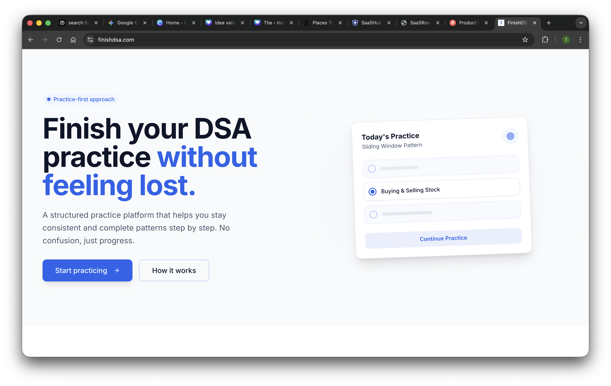
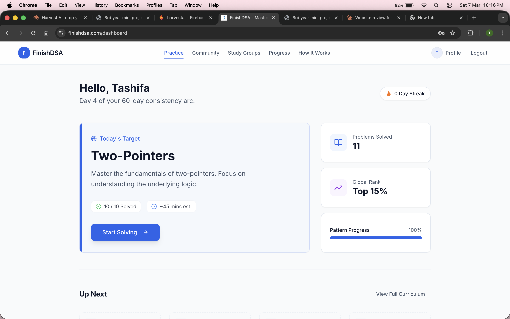

---

## 9. [DossierPrêt](https://www.producthunt.com/products/dossierpret)
**Votes**: 12 | **도입 난이도**: 중 | **신뢰도**: 중
**Tagline**: Analyze your mortgage file before the bank does
**서비스 링크**: https://www.producthunt.com/r/XDLLZNTMRUIGW5

**태그**: 금융, 분석, 모기지, 자동화, AI Tool

### 📌 이 서비스 한눈에 보기
은행 심사 전에 모기지 파일을 분석하여 거절 위험을 감지하고 승인 가능성을 높여주는 금융 진단 도구

### 🔑 주요 기능
- 모기지 파일 사전 분석
- 거절 위험 감지 및 개선
- 명확한 금융 진단 제공

### 🙋 사용자에게 어떤 점이 좋은가
은행에서 모기지 심사를 하기 전에 미리 파일을 분석하여 승인 가능성을 높이고 재정 상태를 명확히 파악할 수 있도록 도와줍니다.

### ✅ 지금 바로 써볼 기능
- 모기지 파일 업로드 및 분석
- 거절 위험 요소 확인
- 승인 가능성 개선 방안 모색

### ⚠️ 사용 전 확인할 점
- 분석 결과는 참고용이며, 실제 은행 심사 결과와 다를 수 있음
- 모든 금융 상품에 대한 분석을 제공하지 않을 수 있음

### 🧭 확인이 더 필요한 정보
제공되는 분석의 정확도 및 실제 은행 심사와의 연관성에 대한 추가적인 정보 확인이 필요합니다.

### 📸 스크린샷 및 갤러리
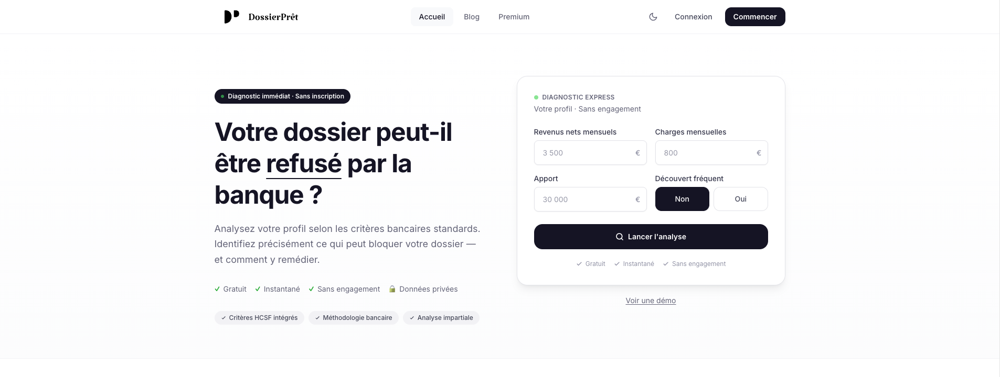
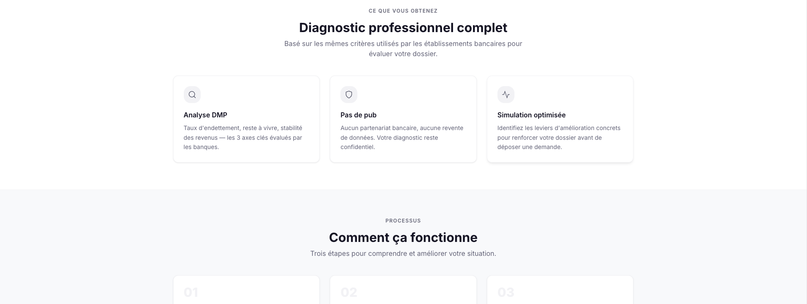
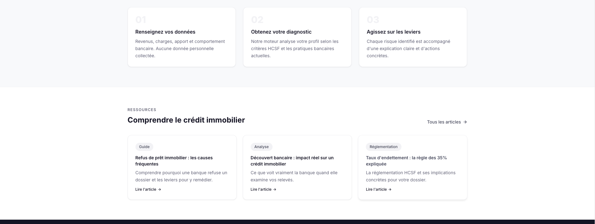

### 🎬 관련 영상
- [🎥 영상 보기](https://ph-files.imgix.net/e23d053f-c870-4a50-af3d-82a267d545e5.jpeg?auto=format)

---

## 10. [Unenhanced](https://www.producthunt.com/products/unenhanced)
**Votes**: 8 | **도입 난이도**: 하 | **신뢰도**: 중
**Tagline**: Take photos without iPhone auto-enhance
**서비스 링크**: https://www.producthunt.com/r/AEPNXOJ5Q7DEYP

**태그**: Camera, Photography, No-filter, Vision

### 📌 이 서비스 한눈에 보기
아이폰 자동 보정 없이 보이는 그대로 사진을 찍고 싶다면 Unenhanced 카메라 앱을 사용해보세요.

### 🔑 주요 기능
- 아이폰 기본 카메라의 과도한 보정(선명도, 대비, 색감 조정)을 줄임
- 카메라 미리보기 화면과 동일한 결과물을 얻을 수 있음
- 더욱 자연스럽고 사실적인 이미지를 캡처 가능

### 🙋 사용자에게 어떤 점이 좋은가
기본 카메라의 보정 효과가 마음에 들지 않거나, 눈으로 보는 그대로의 사진을 찍고 싶을 때 유용합니다.

### ✅ 지금 바로 써볼 기능
- 앱을 다운로드하여 실행
- 기본 카메라 앱과 비교하며 사진 촬영
- 다양한 조명 환경에서 테스트

### ⚠️ 사용 전 확인할 점
- 보정 기능이 없으므로 후보정 작업이 필요할 수 있음
- 기본 카메라 앱에 비해 기능이 제한적일 수 있음

### 🧭 확인이 더 필요한 정보
앱의 호환성 및 안정성에 대한 사용자 리뷰를 확인하는 것이 좋습니다.

### 📸 스크린샷 및 갤러리
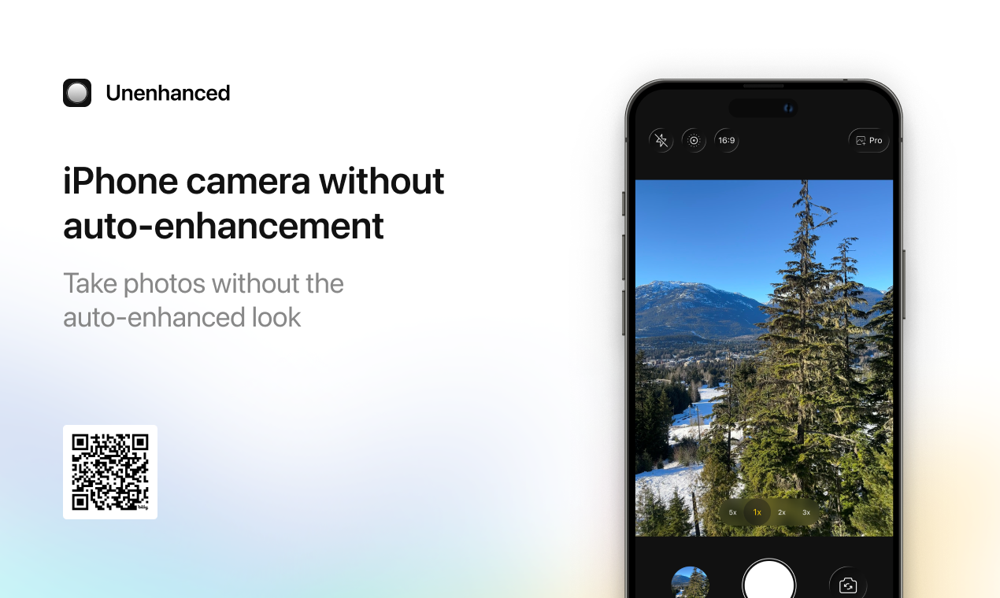
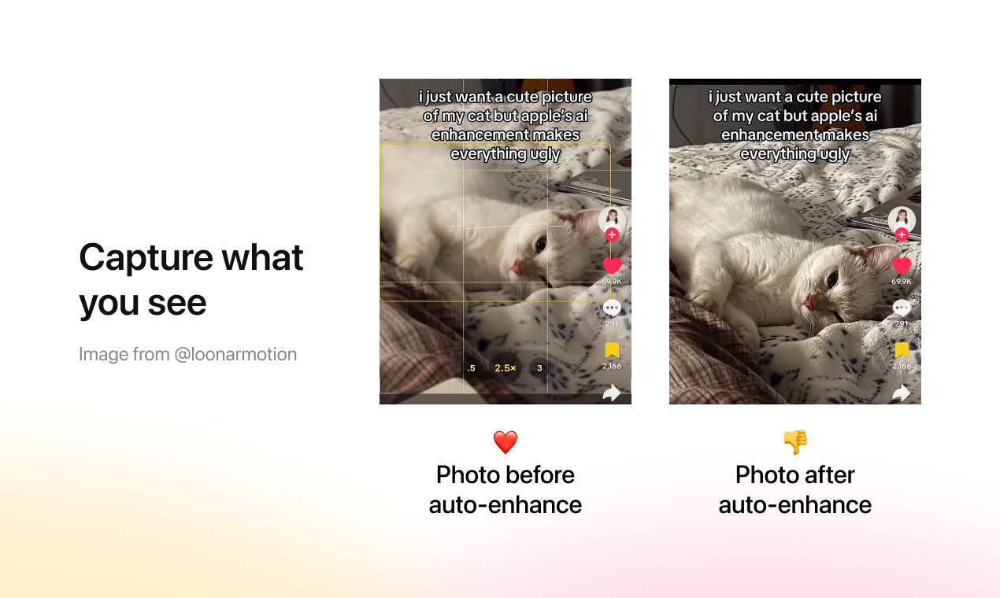

---

