# 🚀 Product Hunt Daily Top 10 (2026-03-10)

## 1. [Timelaps](https://www.producthunt.com/products/timelaps)
**Votes**: 363 | **도입 난이도**: 중 | **신뢰도**: 중
**Tagline**: Know if your marketing is working with real-time insights
**서비스 링크**: https://www.producthunt.com/r/45H337VA2R5INK

**태그**: 마케팅 분석, 소비자 데이터, 실시간 인사이트, Marketing

### 📌 이 서비스 한눈에 보기
Timelaps는 실시간 인사이트를 통해 마케팅 효과를 측정하고, 4,000명 이상의 소비자 데이터를 기반으로 브랜드 마케팅 성과를 분석하여, 기존 방식 대비 저렴하고 과학적인 마케팅 성과 측정을 제공합니다.

### 🔑 주요 기능
- 실시간 마케팅 성과 측정 및 분석
- 4,000명 이상의 소비자 데이터 기반
- 기존 방식 대비 저렴한 비용

### 🙋 사용자에게 어떤 점이 좋은가
Timelaps를 통해 마케팅 캠페인의 효과를 실시간으로 파악하고, 소비자 데이터를 기반으로 개선점을 찾아 마케팅 ROI를 극대화할 수 있습니다.

### ✅ 지금 바로 써볼 기능
- 마케팅 캠페인 성과 측정 시작
- 타겟 고객층 설정 및 데이터 분석
- 실시간 인사이트 기반 마케팅 전략 수정

### ⚠️ 사용 전 확인할 점
- 데이터 샘플의 대표성 확인 필요
- 제공되는 인사이트의 해석 능력 요구

### 🧭 확인이 더 필요한 정보
제공되는 소비자 데이터의 구체적인 수집 방법 및 분석 알고리즘에 대한 추가 정보 확인이 필요합니다.

### 📸 스크린샷 및 갤러리
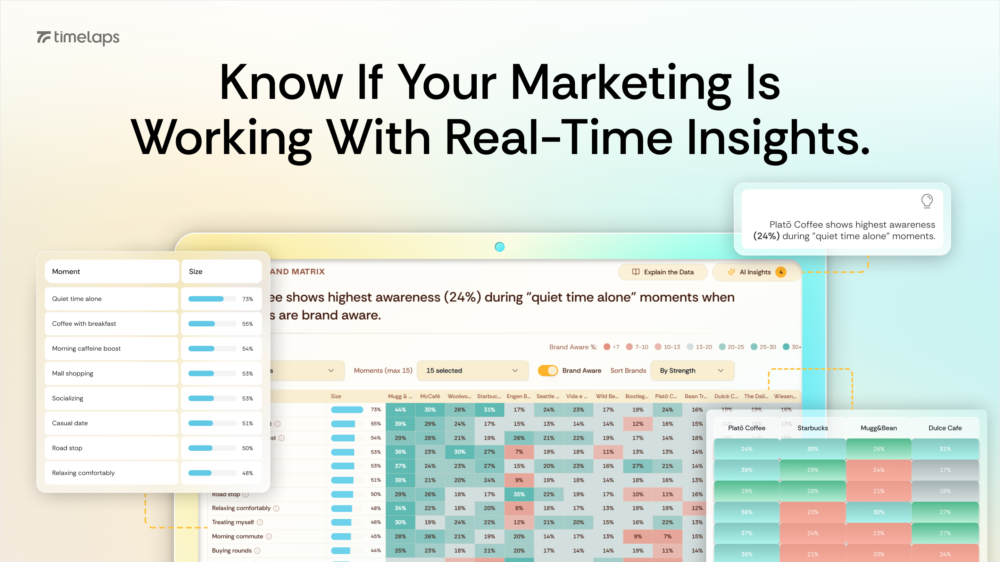
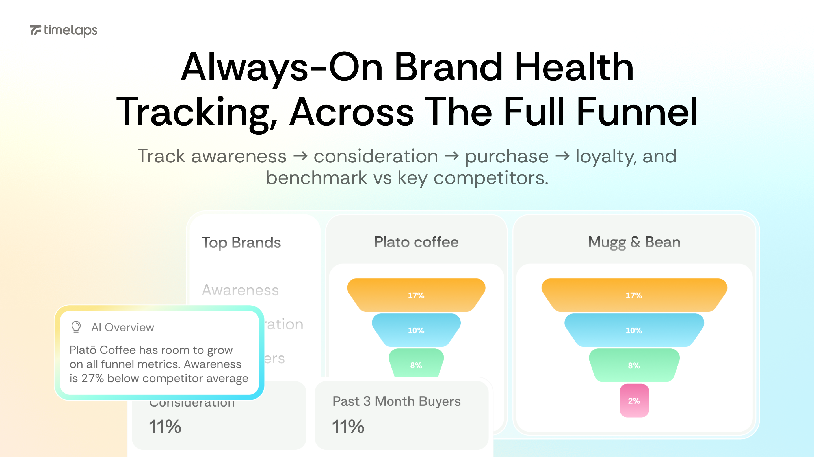
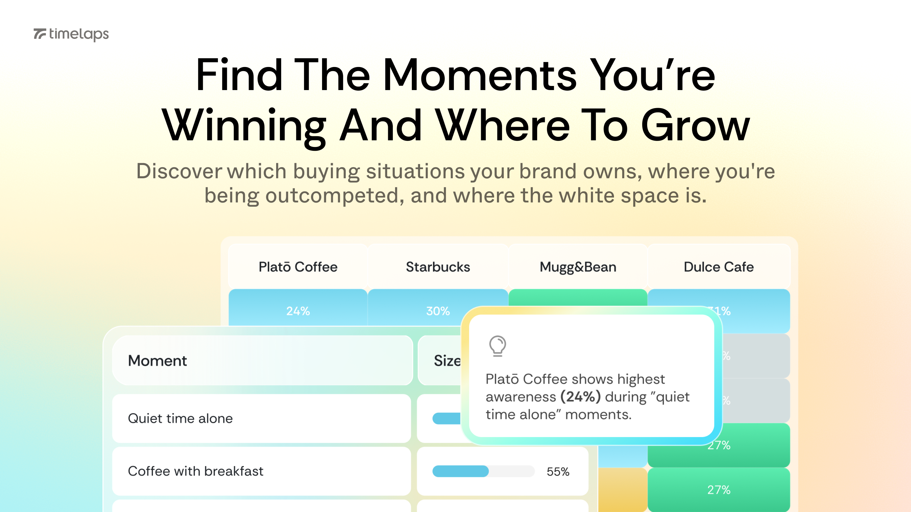

### 🎬 관련 영상
- [🎥 영상 보기](https://ph-files.imgix.net/f253b81a-11f6-4d91-ac90-0cc36c3fa855.jpeg?auto=format)

---

## 2. [Roundtable](https://www.producthunt.com/products/joinroundtable)
**Votes**: 355 | **도입 난이도**: 중 | **신뢰도**: 중
**Tagline**: Launch your EU investment fund in days, not months
**서비스 링크**: https://www.producthunt.com/r/E7IIYG2S3D4EKQ

**태그**: FinTech, 펀드 관리, 투자, EUVECA, AI Tool, API

### 📌 이 서비스 한눈에 보기
Roundtable은 유럽 투자 펀드 설립 과정을 간소화하여, 수개월 걸리던 작업을 며칠 만에 가능하게 해주는 플랫폼입니다.

### 🔑 주요 기능
- EUVECA 라이선스를 통해 유럽 전역의 투자자에게 펀드를 마케팅할 수 있습니다.
- 디지털 LP 온보딩, 자본 호출 및 배분 관리를 하나의 플랫폼에서 처리할 수 있습니다.
- 미국 LP도 환영합니다.

### 🙋 사용자에게 어떤 점이 좋은가
유럽에서 펀드를 설립하는 데 드는 시간과 비용을 획기적으로 줄여주어, 신규 펀드 매니저가 더 빠르게 시장에 진입할 수 있도록 돕습니다.

### ✅ 지금 바로 써볼 기능
- 플랫폼 데모 신청하기
- EUVECA 라이선스 정보 확인하기
- 디지털 LP 온보딩 기능 살펴보기

### ⚠️ 사용 전 확인할 점
- EUVECA 라이선스 조건 확인 필요
- 미국 LP 관련 법규 준수 여부 확인 필요

### 🧭 확인이 더 필요한 정보
Roundtable 플랫폼 사용 시 발생하는 구체적인 법률 및 세금 관련 비용에 대한 추가 확인이 필요합니다.

### 📸 스크린샷 및 갤러리

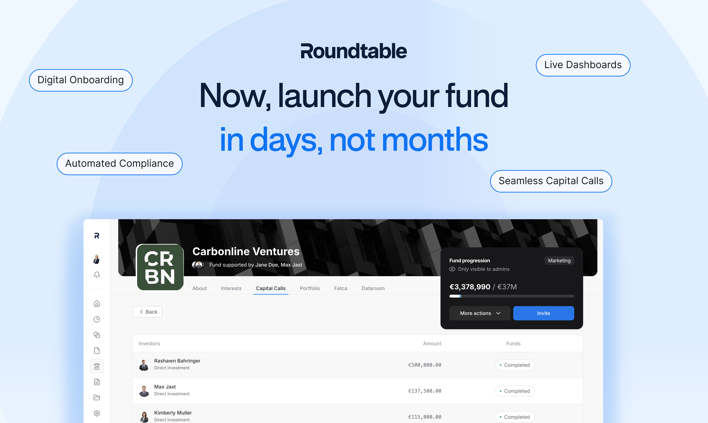
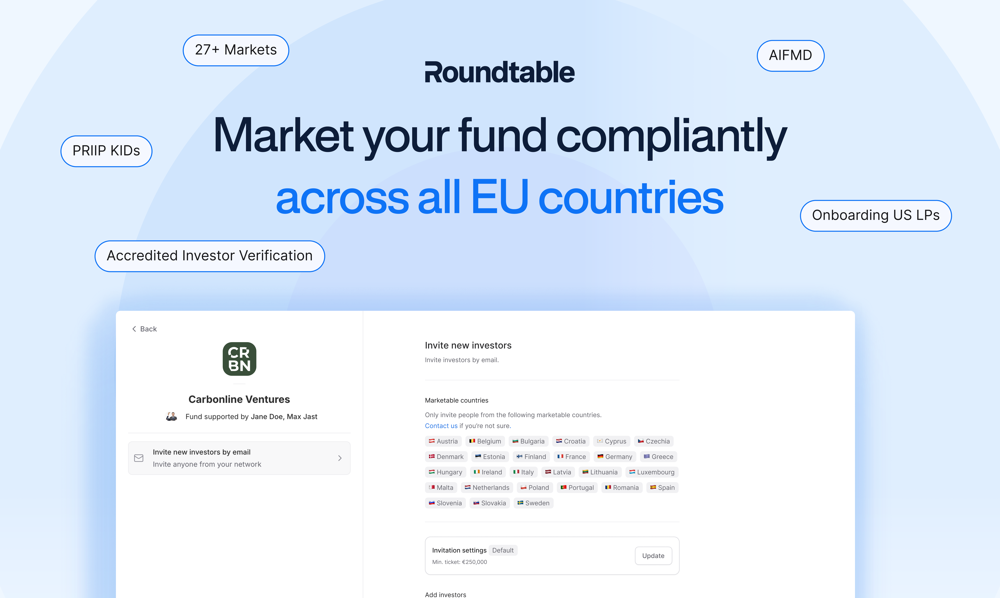

---

## 3. [Dex](https://www.producthunt.com/products/dex-6)
**Votes**: 240 | **도입 난이도**: 중 | **신뢰도**: 중
**Tagline**: Ask your data. Get answers and next steps.
**서비스 링크**: https://www.producthunt.com/r/6QGZ7PKRIF6ZAA

**태그**: AI, 데이터 분석, 자동화, BI, AI Tool

### 📌 이 서비스 한눈에 보기
Dex는 AI 데이터 분석 도구로, 데이터베이스, 스프레드시트, BI 도구를 연결하여 질문하면 즉시 답변과 다음 단계를 추천해 줍니다.

### 🔑 주요 기능
- 데이터를 기반으로 의사 결정을 빠르게 내릴 수 있습니다.
- 데이터 분석 전문 지식 없이도 데이터 기반 인사이트를 얻을 수 있습니다.
- 다양한 데이터 소스를 통합하여 분석할 수 있습니다.

### 🙋 사용자에게 어떤 점이 좋은가
창업자는 Dex를 통해 데이터 분석에 드는 시간과 노력을 줄이고, 핵심 비즈니스에 집중할 수 있습니다. 데이터 기반 의사 결정을 통해 더 나은 성과를 기대할 수 있습니다.

### ✅ 지금 바로 써볼 기능
- 데이터베이스 또는 스프레드시트 연결하기
- 데이터에 대한 질문을 영어로 던져보기
- 추천된 다음 단계 검토하기

### ⚠️ 사용 전 확인할 점
- 영어 질문만 지원하므로, 한국어 질문은 불가능합니다.
- 지원하는 데이터베이스 및 BI 도구 목록을 확인해야 합니다.

### 🧭 확인이 더 필요한 정보
어떤 종류의 '다음 단계' 추천을 제공하는지 구체적인 예시가 필요합니다.

### 📸 스크린샷 및 갤러리
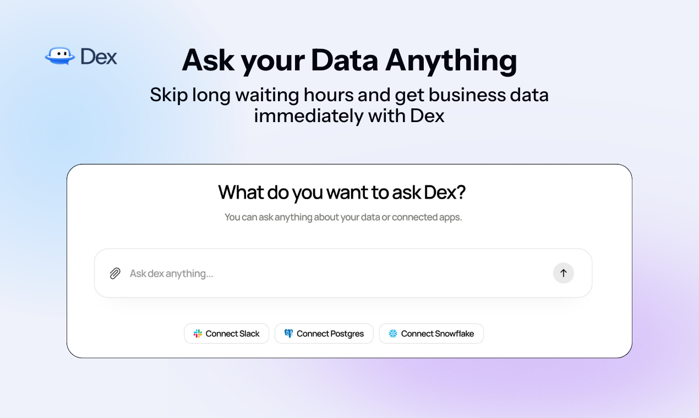
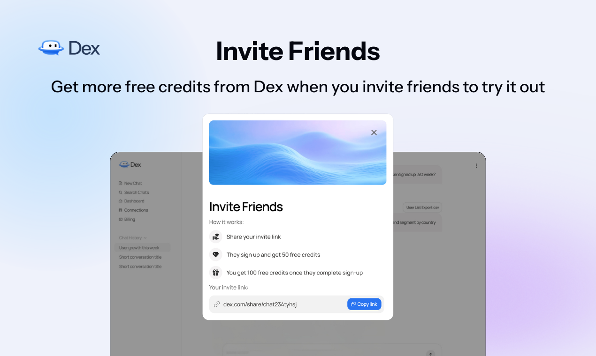
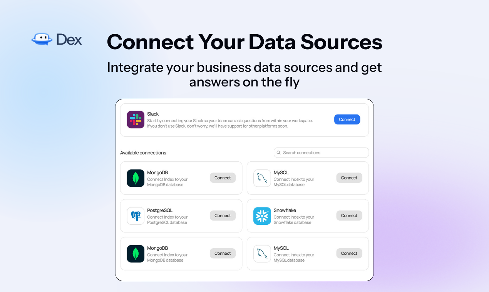

### 🎬 관련 영상
- [🎥 영상 보기](https://ph-files.imgix.net/c74639e9-f977-4506-bf33-7924d7794095.jpeg?auto=format)

---

## 4. [simply](https://www.producthunt.com/products/simply-4)
**Votes**: 233 | **도입 난이도**: 하 | **신뢰도**: 중
**Tagline**: ai nutrition app
**서비스 링크**: https://www.producthunt.com/r/7RQXA6VNZE4NZH

**태그**: 건강, 영양, AI, 습관, 팁, AI Tool, Design

### 📌 이 서비스 한눈에 보기
Simply는 복잡한 식단이나 제한적인 식단 계획 없이도 건강을 개선하고 싶은 사람들을 위해 공인된 영양사가 만든 실용적인 일일 영양 팁을 제공하는 AI 영양 앱입니다.

### 🔑 주요 기능
- 공인 영양사가 제공하는 실용적인 영양 팁
- 복잡한 식단 없이 일상 생활에서 적용 가능한 작은 습관 형성
- 지속 가능한 건강한 습관 구축 지원

### 🙋 사용자에게 어떤 점이 좋은가
건강 개선을 원하지만 복잡한 정보에 압도당하는 사용자들이 일상에서 쉽게 실천할 수 있는 영양 팁을 얻고, 지속 가능한 건강 습관을 만들 수 있도록 돕습니다.

### ✅ 지금 바로 써볼 기능
- 매일 제공되는 영양 팁 확인하기
- 팁을 일상 생활에 적용해보기
- 건강 습관 변화 추적하기

### ⚠️ 사용 전 확인할 점
- 개인의 건강 상태에 따라 효과가 다를 수 있음
- 팁의 효과를 확인하려면 꾸준한 실천이 필요함

### 🧭 확인이 더 필요한 정보
개별 사용자에게 최적화된 팁 제공 여부 및 AI 기반 추천의 정확도에 대한 추가 정보가 필요합니다.

### 📸 스크린샷 및 갤러리
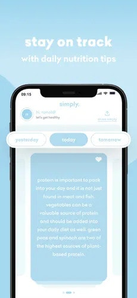
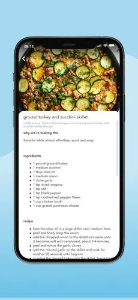
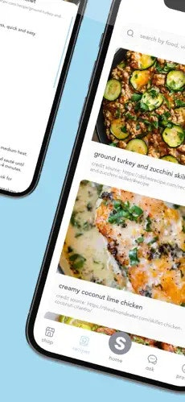

### 🎬 관련 영상
- [🎥 영상 보기](https://ph-files.imgix.net/8ecb7fc6-b277-4fb0-9ff4-b21cae64c4fc.jpeg?auto=format)

---

## 5. [SCRAPR](https://www.producthunt.com/products/scrapr-universal-web-scraping-api)
**Votes**: 211 | **도입 난이도**: 중 | **신뢰도**: 중
**Tagline**: Turn any website into an API
**서비스 링크**: https://www.producthunt.com/r/CFQLNYN252GSKA

**태그**: DevTool, Automation, API

### 📌 이 서비스 한눈에 보기
SCRAPR은 웹사이트 URL을 API처럼 활용하여 코딩 없이도 원하는 데이터를 추출할 수 있게 해줍니다.

### 🔑 주요 기능
- 웹사이트를 API로 변환
- 브라우저 불필요
- 코드 작업 불필요

### 🙋 사용자에게 어떤 점이 좋은가
웹사이트의 데이터를 쉽게 추출하여 분석, 자동화, 개발 등에 활용할 수 있습니다. API 키 없이도 가능합니다.

### ✅ 지금 바로 써볼 기능
- 원하는 웹사이트 URL 입력해보기
- 추출된 데이터 구조 확인하기
- 자동화 스크립트에 적용해보기

### ⚠️ 사용 전 확인할 점
- 웹사이트 구조 변경 시 데이터 추출 방식 업데이트 필요
- 복잡한 웹사이트의 경우 데이터 추출 정확도 확인 필요

### 🧭 확인이 더 필요한 정보
SCRAPR이 모든 웹사이트에서 안정적으로 작동하는지 확인이 필요합니다.

### 📸 스크린샷 및 갤러리
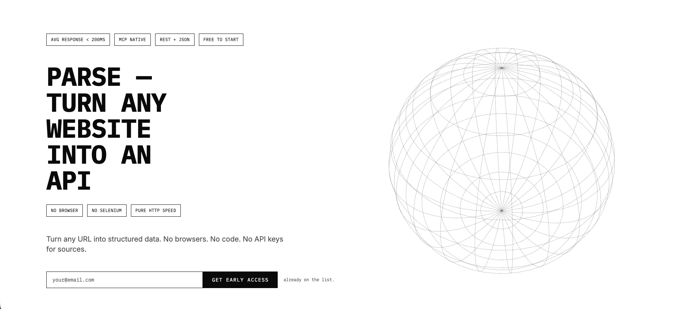
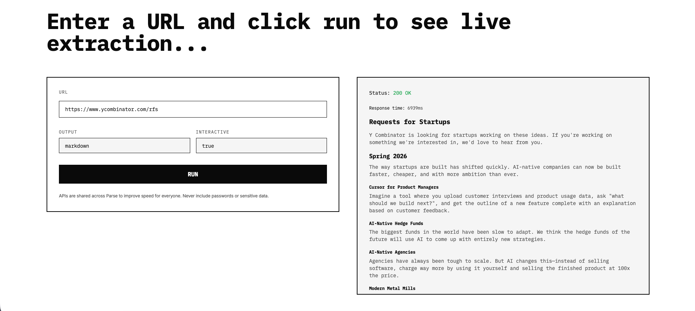
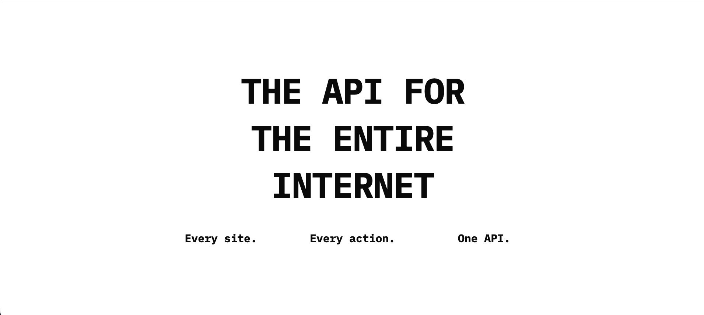

---

## 6. [BrandingStudio.ai](https://www.producthunt.com/products/brandingstudio-ai)
**Votes**: 142 | **도입 난이도**: 중 | **신뢰도**: 중
**Tagline**: Agency-quality branding in 60 minutes, not 6 months
**서비스 링크**: https://www.producthunt.com/r/RWEWCHMRCGXAQ3

**태그**: 브랜딩, AI, 자동화, 스타트업, 디자인, AI Tool

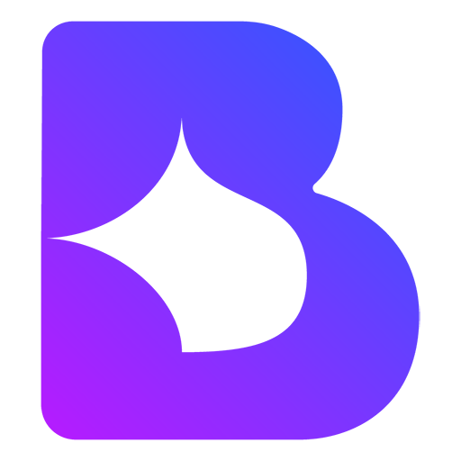

### 📌 이 서비스 한눈에 보기
BrandingStudio.ai는 AI 기반으로 단 60분 만에 고품질 브랜딩을 제공하여, 창업자가 시간과 비용을 절약하고 빠르게 브랜드를 구축할 수 있도록 돕습니다.

### 🔑 주요 기능
- AI 기반의 7가지 모듈로 브랜드 전략, 경쟁사 분석, 로고, 색상 시스템 등을 자동 생성
- 1,000개 이상의 데이터 포인트를 분석하여 정확하고 맞춤화된 브랜드 결과물 제공
- SVG, PDF, 디지털 브랜드 허브 등 다양한 형식으로 결과물을 내보내기 가능

### 🙋 사용자에게 어떤 점이 좋은가
BrandingStudio.ai를 사용하면 창업자는 비싼 에이전시 비용 없이도 빠르고 효율적으로 전문적인 브랜드 아이덴티티를 구축하고, 시장 경쟁력을 강화할 수 있습니다.

### ✅ 지금 바로 써볼 기능
- 사업에 대한 데이터 입력 후 AI 기반 브랜드 전략 및 경쟁사 분석 결과 확인
- 자동 생성된 로고, 색상 시스템, 타이포그래피 등의 브랜드 요소 검토 및 수정
- 90일 런치 플랜을 활용하여 브랜드 출시 계획 수립

### ⚠️ 사용 전 확인할 점
- AI가 생성한 결과물이 사용자의 기대와 완전히 일치하지 않을 수 있음
- 데이터 분석의 정확성은 입력된 데이터의 품질에 따라 달라질 수 있음

### 🧭 확인이 더 필요한 정보
AI가 생성하는 브랜드 요소가 실제 시장에서 어떤 반응을 얻을지는 추가적인 검증이 필요합니다.

### 📸 스크린샷 및 갤러리
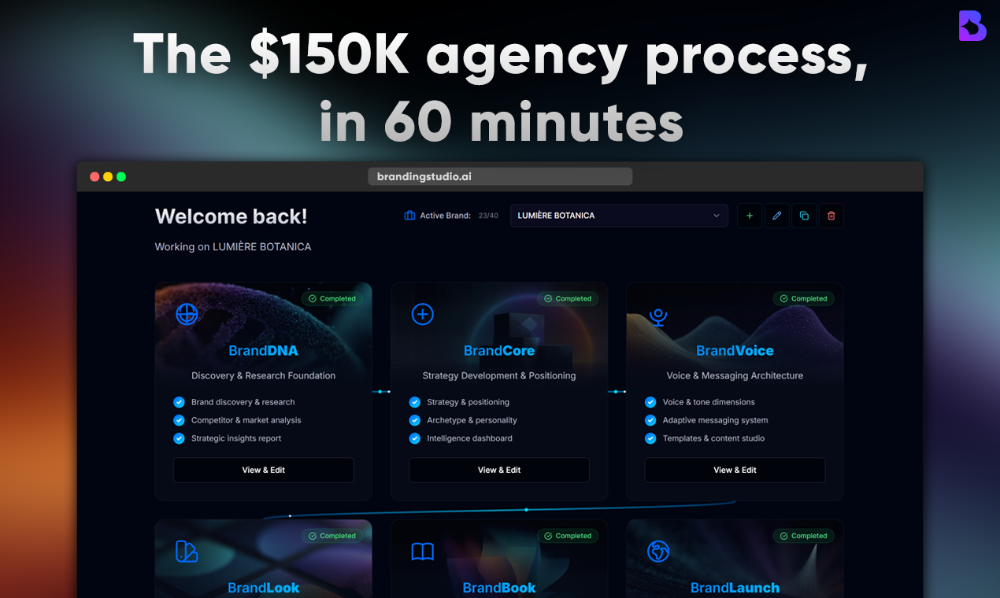
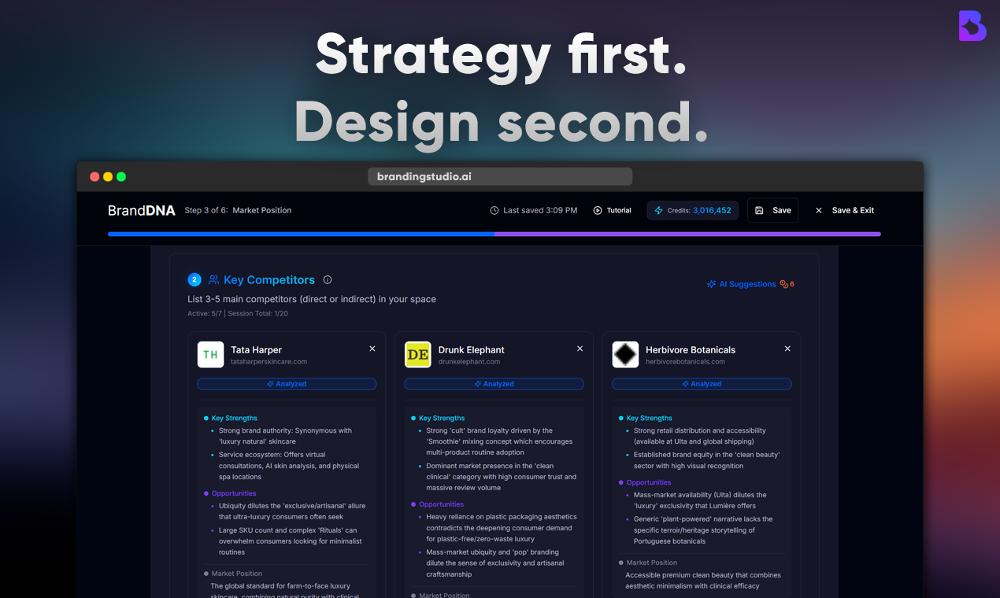
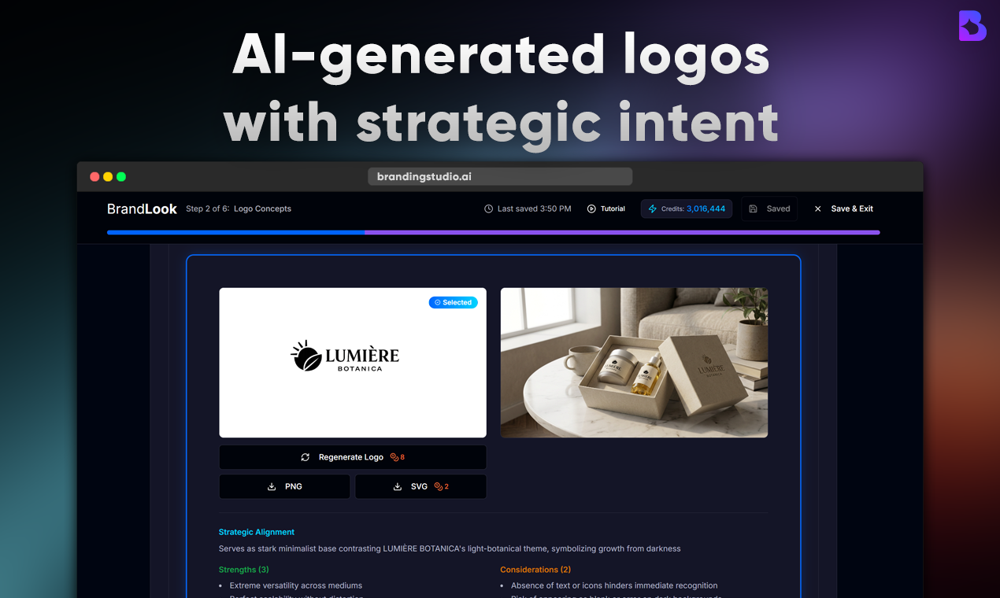

### 🎬 관련 영상
- [🎥 영상 보기](https://ph-files.imgix.net/262b34a3-1c52-43a9-a5f8-7ffed908b7b3.jpeg?auto=format)

---

## 7. [Nothing Phone (4a) Pro](https://www.producthunt.com/products/nothing-phone-3)
**Votes**: 130 | **도입 난이도**: 중 | **신뢰도**: 중
**Tagline**: Redefining the Nothing aesthetic with a metal unibody
**서비스 링크**: https://www.producthunt.com/r/YFXFQNL775S45U

**태그**: Android, Smartphone, Photography

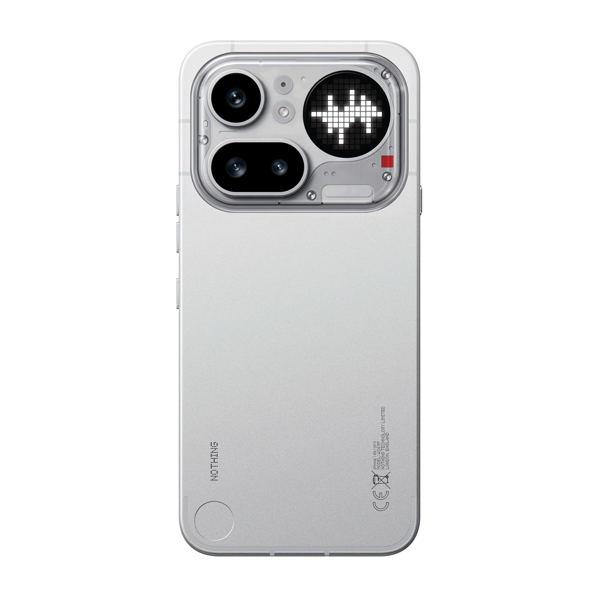

### 📌 이 서비스 한눈에 보기
Nothing Phone (4a) Pro는 풀 메탈 유니바디 디자인과 향상된 카메라 기능을 통해 Nothing의 미학을 재정의합니다.

### 🔑 주요 기능
- 슬림한 풀 메탈 유니바디 디자인
- 스냅드래곤 7 Gen 4 프로세서 탑재
- 최대 140배 텔레포토 줌 지원

### 🙋 사용자에게 어떤 점이 좋은가
Nothing Phone (4a) Pro는 견고한 디자인과 강력한 성능, 향상된 카메라 기능을 통해 사용자에게 프리미엄 모바일 경험을 제공합니다.

### ✅ 지금 바로 써볼 기능
- 140배 텔레포토 줌으로 사진 촬영해보기
- 새로운 Glyph Matrix 경험해보기
- 메탈 유니바디 디자인 감상하기

### ⚠️ 사용 전 확인할 점
- 카메라 모듈 외 투명 디자인이 적용되지 않음
- 정확한 배터리 성능 정보 확인 필요

### 🧭 확인이 더 필요한 정보
실제 사용 환경에서의 스냅드래곤 7 Gen 4 성능 및 배터리 효율에 대한 추가 정보가 필요합니다.

### 📸 스크린샷 및 갤러리
_Pro_media_1.jpg)
_Pro_media_2.jpg)
_Pro_media_3.jpg)

### 🎬 관련 영상
- [🎥 영상 보기](https://ph-files.imgix.net/d12f153b-9e73-4eac-b23a-c684a1bb2e36.jpeg?auto=format)

---

## 8. [Unite Pro for macOS](https://www.producthunt.com/products/unite-for-macos)
**Votes**: 126 | **도입 난이도**: 중 | **신뢰도**: 중
**Tagline**: Turn websites into Mac apps
**서비스 링크**: https://www.producthunt.com/r/5CE4BWJHNLLNBR

**태그**: 생산성, 맥 앱, 웹 서비스, 커스터마이징, AI Tool

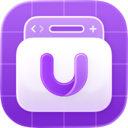

### 📌 이 서비스 한눈에 보기
Unite Pro는 웹사이트를 맥 앱처럼 만들어 생산성을 높여주는 도구입니다.

### 🔑 주요 기능
- 웹사이트를 맥 앱으로 빠르게 전환
- 윈도우, 사이드바, 메뉴 막대 모드 지원
- 독 배지, 알림, AI 오버레이 등 네이티브 기능 추가

### 🙋 사용자에게 어떤 점이 좋은가
자주 사용하는 웹 서비스를 맥 앱처럼 편리하게 사용하고, 불필요한 방해 요소를 제거하여 업무 효율성을 높일 수 있습니다.

### ✅ 지금 바로 써볼 기능
- 자주 사용하는 웹사이트 앱으로 만들기
- 다양한 모드(Window, Sidebar, Menu Bar) 시험해보기
- 독 배지나 알림 기능 설정해보기

### ⚠️ 사용 전 확인할 점
- macOS Tahoe 이상에서만 작동
- 웹사이트 호환성 확인 필요

### 🧭 확인이 더 필요한 정보
어떤 웹사이트들이 Unite Pro와 가장 잘 호환되는지 추가 정보가 필요합니다.

### 📸 스크린샷 및 갤러리
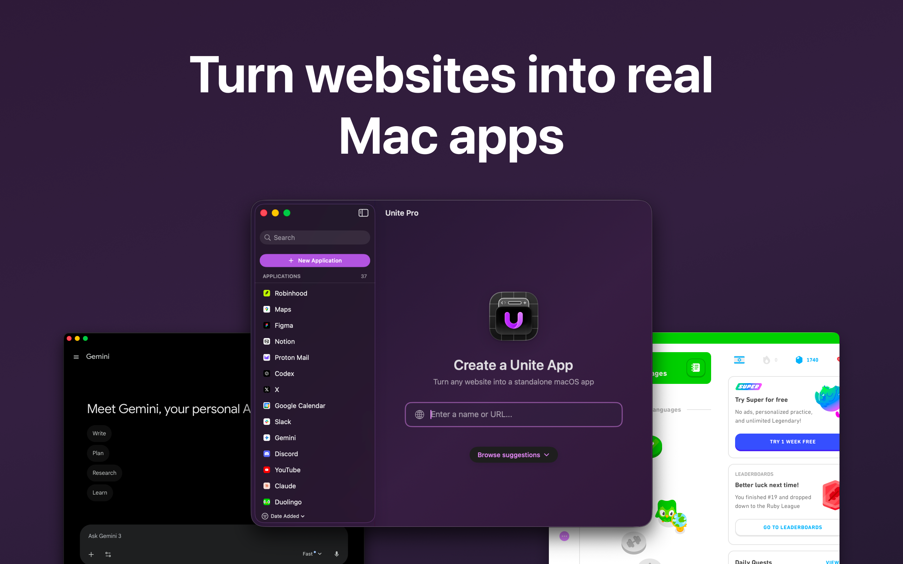
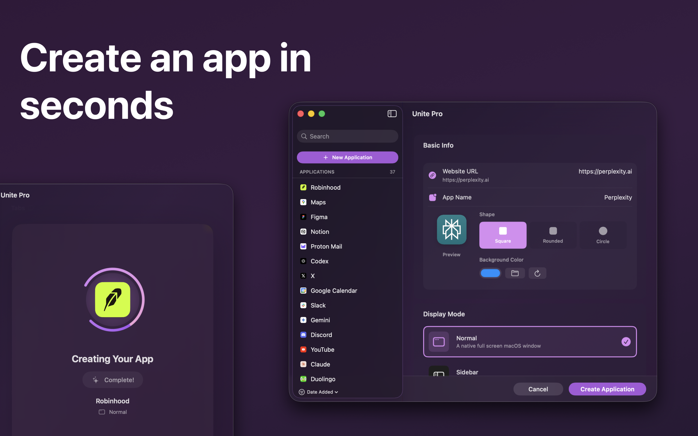
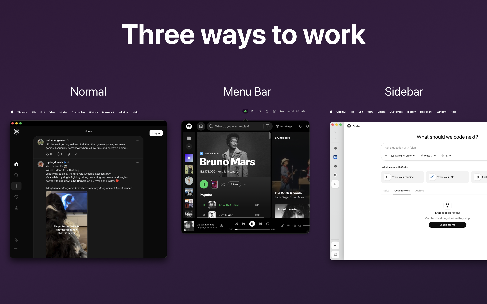

---

## 9. [OpenClix](https://www.producthunt.com/products/openclix-smarter-mobile-engagement)
**Votes**: 120 | **도입 난이도**: 중 | **신뢰도**: 중
**Tagline**: Agent-driven retention flows for mobile apps.
**서비스 링크**: https://www.producthunt.com/r/J426JXHFDPUGFH

**태그**: 모바일 앱, 푸시 알림, 사용자 유지, 마케팅 자동화, 성과 분석, Agent, AI Tool

### 📌 이 서비스 한눈에 보기
OpenClix는 모바일 앱의 사용자 유지율을 높이기 위해 에이전트가 주도하는 푸시 캠페인을 쉽게 실행할 수 있도록 지원합니다. 복잡한 설정 없이 스마트 트리거, 규칙, 스케줄링을 통해 캠페인을 만들고, 에이전트가 결과를 분석하여 참여도를 최적화하고, 비효율적인 캠페인을 중단할 수 있습니다.

### 🔑 주요 기능
- 에이전트 주도 푸시 캠페인으로 사용자 유지율 향상
- 스마트 트리거, 규칙, 스케줄링으로 캠페인 자동화
- 실제 데이터 기반으로 캠페인 성과 분석 및 최적화

### 🙋 사용자에게 어떤 점이 좋은가
OpenClix를 사용하면 모바일 앱 팀은 더 빠르게 제품을 출시하고, 알림 피로도를 줄이며, 실제 성과 데이터를 기반으로 반복적인 개선을 할 수 있습니다. 이를 통해 사용자 유지율을 효과적으로 높일 수 있습니다.

### ✅ 지금 바로 써볼 기능
- 스마트 트리거를 설정하여 특정 행동을 기반으로 푸시 알림 보내기
- A/B 테스트를 통해 다양한 메시지 및 타이밍 전략 실험하기
- 캠페인 성과 데이터를 분석하여 참여도가 낮은 사용자 그룹 파악하기

### ⚠️ 사용 전 확인할 점
- 푸시 알림 전략이 사용자 경험을 저해하지 않도록 주의
- 개인 정보 보호 정책 및 관련 법규 준수 필요

### 🧭 확인이 더 필요한 정보
OpenClix의 구체적인 가격 정책 및 지원하는 플랫폼에 대한 추가 정보가 필요합니다.

### 📸 스크린샷 및 갤러리
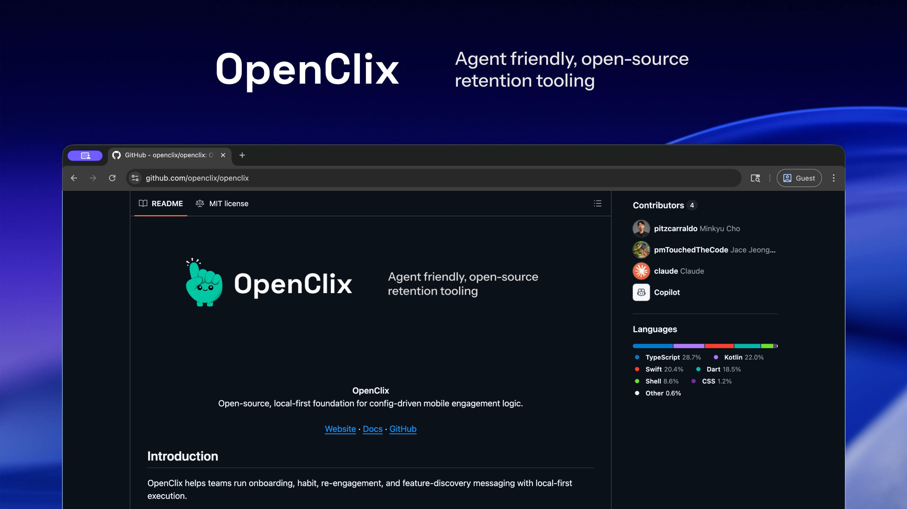
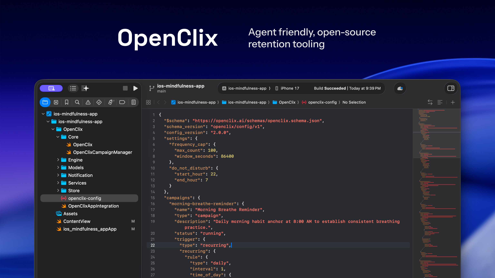

### 🎬 관련 영상
- [🎥 영상 보기](https://ph-files.imgix.net/ea1e293f-ca32-4757-a959-8d36eeb63db9.jpeg?auto=format)

---

## 10. [cutefolio](https://www.producthunt.com/products/cutefolio)
**Votes**: 115 | **도입 난이도**: 하 | **신뢰도**: 중
**Tagline**: build portfolios that actually look cute.
**서비스 링크**: https://www.producthunt.com/r/YVBPEM4RBZTBVZ

**태그**: 포트폴리오, 링크폴리오, 분석, 디자인, 브랜딩, AI Tool, Analytics

### 📌 이 서비스 한눈에 보기
cutefolio는 큐트한 디자인으로 시선을 사로잡는 포트폴리오 또는 링크폴리오를 만들 수 있게 해주는 서비스입니다. Linktree보다 더 예쁘고 체계적이며, 분석 기능, 커스텀 도메인 지원 등 다양한 기능을 제공합니다.

### 🔑 주요 기능
- 귀엽고 현대적인 디자인
- 방문자 분석 및 트래픽 분석 제공
- 커스텀 도메인 및 무료 도메인 지원

### 🙋 사용자에게 어떤 점이 좋은가
개인 및 브랜드의 개성을 살린 포트폴리오를 쉽게 만들고, 방문자 분석을 통해 효과적인 콘텐츠 전략을 수립할 수 있습니다.

### ✅ 지금 바로 써볼 기능
- 다양한 디자인 템플릿 살펴보기
- 커스텀 도메인 연결해보기
- 방문자 분석 기능 활용해보기

### ⚠️ 사용 전 확인할 점
- 제공되는 디자인 템플릿의 다양성 확인 필요
- 분석 기능의 정확도 및 신뢰성 검토 필요

### 🧭 확인이 더 필요한 정보
구체적인 디자인 템플릿 종류와 분석 기능의 상세 정보에 대한 추가 확인이 필요합니다.

### 📸 스크린샷 및 갤러리
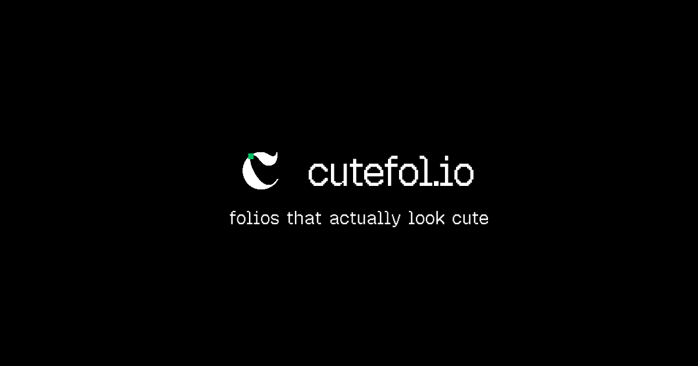
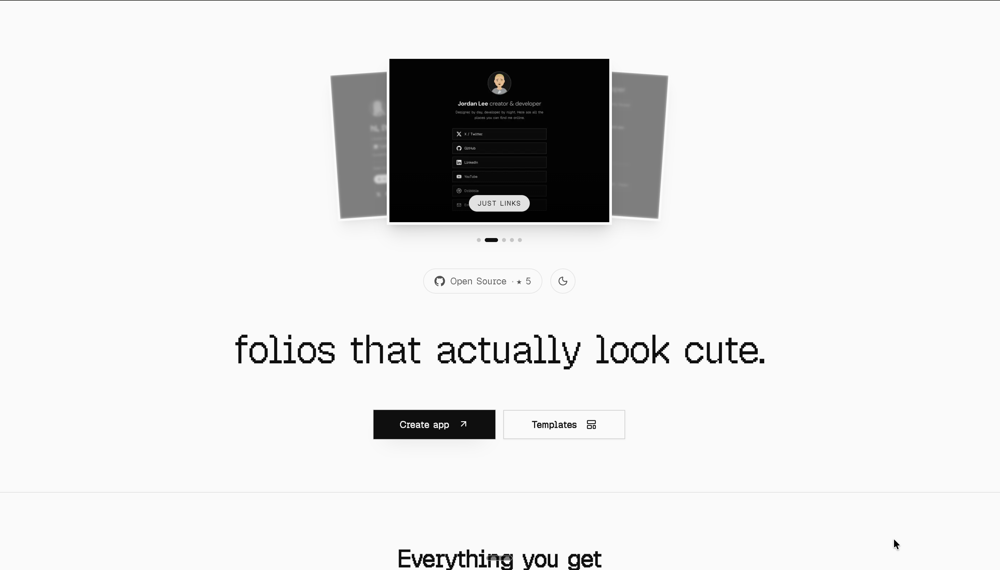
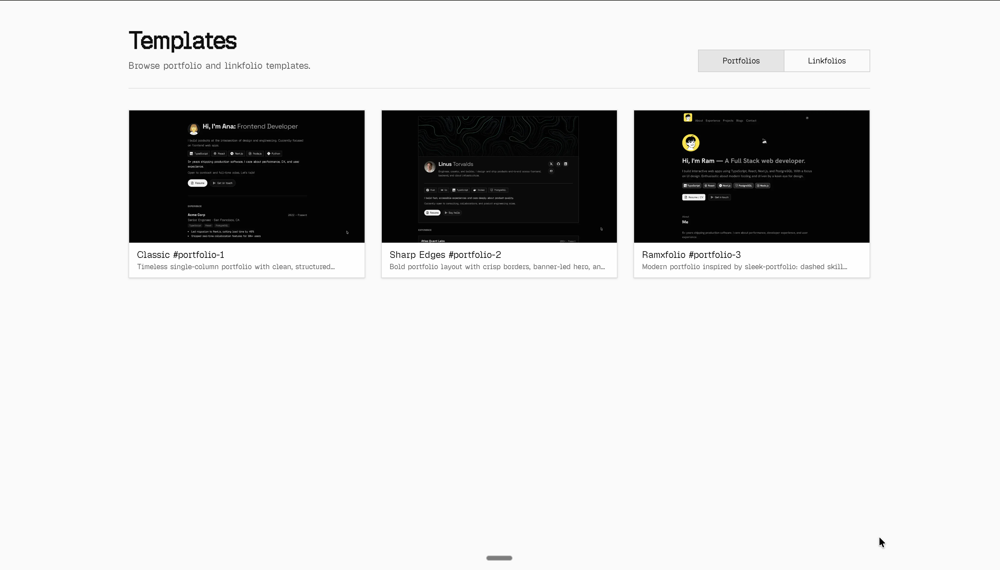

---

