# 🚀 Product Hunt Daily Top 10 (2026-03-11)

## 1. [Visual Translate by Vozo](https://www.producthunt.com/products/vozo)
**Votes**: 447 | **도입 난이도**: 중 | **신뢰도**: 중
**Tagline**: Translate text in your videos without recreating visuals
**서비스 링크**: https://www.producthunt.com/r/WDYAIZ3JF4ZRJZ

**태그**: 비디오 번역, 자동화, 다국어, 콘텐츠 제작, AI Tool, Video

### 📌 이 서비스 한눈에 보기
Visual Translate는 비디오 속 텍스트를 다시 만들 필요 없이 번역하여, 더빙, 립싱크, 자막과 함께 비디오를 완벽하게 다국어 버전으로 만들 수 있게 해줍니다.

### 🔑 주요 기능
- 비디오 내 텍스트 자동 감지 및 번역
- 원래 레이아웃, 스타일, 애니메이션 유지
- 슬라이드, 다이어그램, 콜아웃 등 다양한 텍스트 요소 지원

### 🙋 사용자에게 어떤 점이 좋은가
슬라이드 비디오나 설명 비디오를 다국어 버전으로 쉽게 제작하여 전 세계 시청자에게 도달할 수 있으며, 비주얼 요소를 처음부터 다시 만들 필요가 없어 시간과 비용을 절약할 수 있습니다.

### ✅ 지금 바로 써볼 기능
- 기존 슬라이드 비디오를 업로드하여 번역 테스트
- 다양한 스타일의 텍스트가 포함된 비디오로 번역 품질 확인
- 번역된 비디오를 다양한 플랫폼에 게시하여 반응 확인

### ⚠️ 사용 전 확인할 점
- 복잡한 애니메이션이나 특수 효과가 적용된 텍스트의 경우 번역 품질이 떨어질 수 있음
- 지원하는 언어 및 글꼴 스타일 확인 필요

### 🧭 확인이 더 필요한 정보
실제 사용 환경에서 다양한 비디오 유형에 대한 번역 품질 및 정확도에 대한 추가적인 검증이 필요합니다.

### 📸 스크린샷 및 갤러리

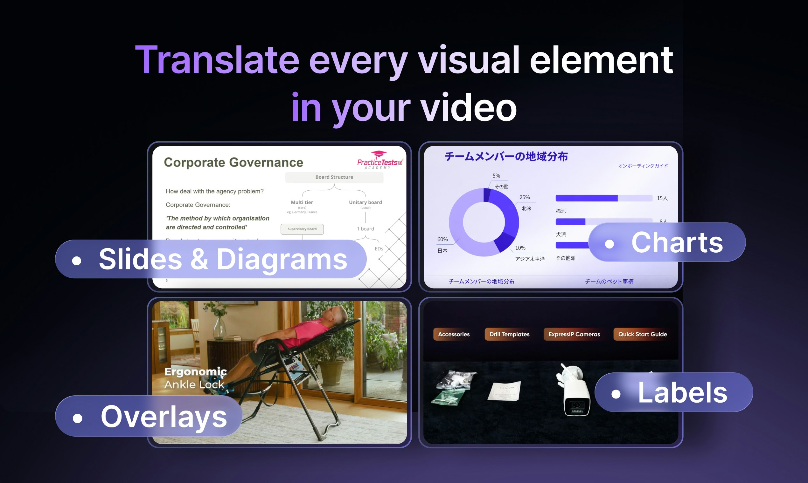
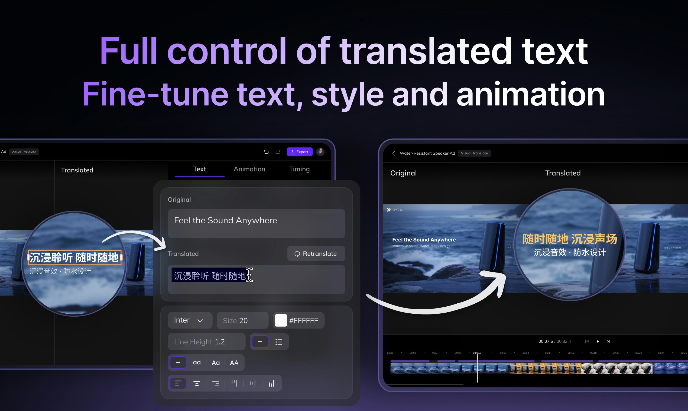

### 🎬 관련 영상
- [🎥 영상 보기](https://ph-files.imgix.net/c0a3a5ed-2a72-4edb-8e12-5c291ea485bf.jpeg?auto=format)

---

## 2. [Chronicle 2.0](https://www.producthunt.com/products/chronicle-6)
**Votes**: 401 | **도입 난이도**: 중 | **신뢰도**: 중
**Tagline**: AI presentations without the AI slop
**서비스 링크**: https://www.producthunt.com/r/CNILDWDEB2RJOP

**태그**: AI, 프레젠테이션, 디자인, 자동화, AI Tool, Prompting, Design

### 📌 이 서비스 한눈에 보기
Chronicle 2.0은 AI를 활용하여 깔끔하고 보기 좋은 프레젠테이션을 빠르게 제작할 수 있도록 도와주는 디자인 파트너입니다.

### 🔑 주요 기능
- AI 기반으로 프레젠테이션 초안을 빠르게 생성
- 노트, 프롬프트, 기존 자료를 활용 가능
- 대화를 통해 슬라이드 수정 및 개선

### 🙋 사용자에게 어떤 점이 좋은가
몇 분 안에 멋진 프레젠테이션을 만들 수 있으며, 브랜드 스타일에 맞춰 디자인을 유지할 수 있습니다. AI가 초안을 만들어주므로 시간을 절약하고 효율성을 높일 수 있습니다.

### ✅ 지금 바로 써볼 기능
- 노트나 프롬프트를 사용하여 새로운 프레젠테이션 초안 생성해보기
- 기존 프레젠테이션 자료를 업로드하여 AI가 어떻게 개선하는지 확인해보기
- 대화형 인터페이스를 통해 슬라이드 수정해보기

### ⚠️ 사용 전 확인할 점
- AI가 생성한 초안은 완벽하지 않을 수 있으므로, 반드시 검토 및 수정 필요
- 브랜드 스타일 가이드라인을 정확히 반영하는지 확인 필요

### 🧭 확인이 더 필요한 정보
AI가 생성하는 디자인의 품질이 사용자의 기대 수준을 충족하는지 확인이 필요합니다.

### 📸 스크린샷 및 갤러리

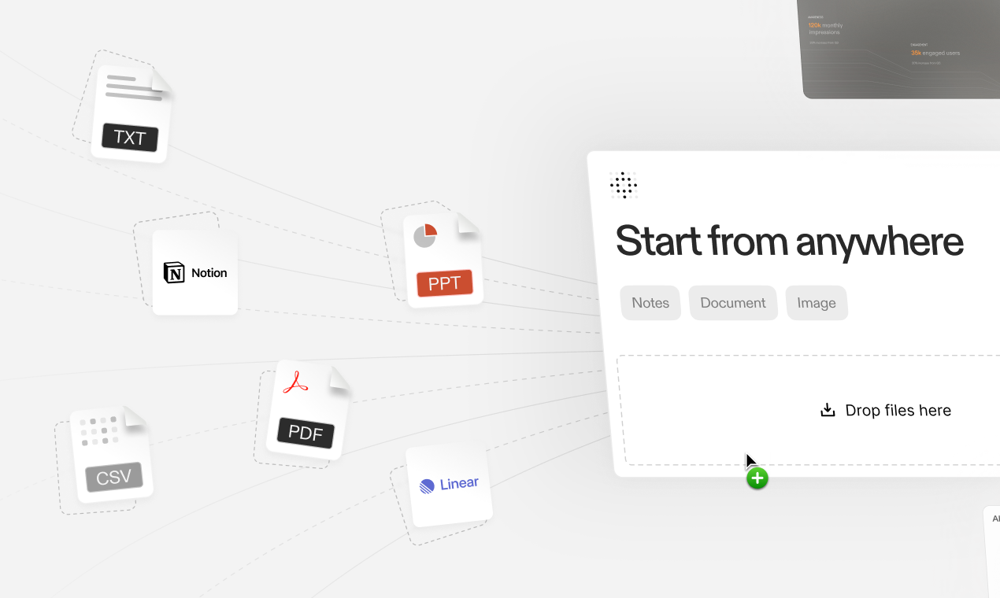
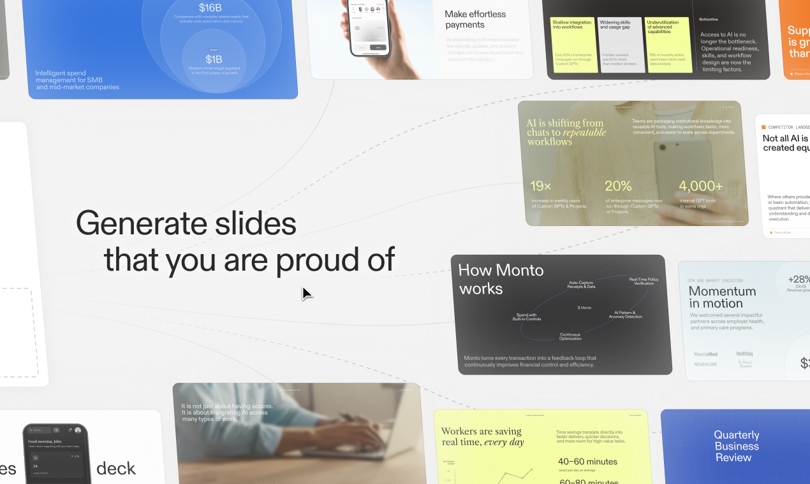

### 🎬 관련 영상
- [🎥 영상 보기](https://ph-files.imgix.net/e9c06885-828a-4cef-9e83-583efac50b07.jpeg?auto=format)

---

## 3. [Your Next Store](https://www.producthunt.com/products/your-next-store)
**Votes**: 351 | **도입 난이도**: 중 | **신뢰도**: 중
**Tagline**: AI-first platform for building commerce stores, fast
**서비스 링크**: https://www.producthunt.com/r/JSAOCBLS5PULLD

**태그**: AI, 커머스, Next.js, Stripe, 개발, Agent, Automation, AI Tool, Chat, Design, DevTool, API

### 📌 이 서비스 한눈에 보기
Your Next Store는 AI 기반으로 빠르게 커머스 스토어를 구축할 수 있도록 돕는 플랫폼으로, 특히 디자인 중심의 브랜드를 구축하는 에이전시 및 소프트웨어 팀에 유용합니다.

### 🔑 주요 기능
- AI와 대화를 통해 스토어 구축 가능
- Stripe 연동 및 Next.js 기반의 프로덕션 준비된 앱 제공
- 코드 소유권을 완전히 가질 수 있어 유연한 개발 가능

### 🙋 사용자에게 어떤 점이 좋은가
AI를 활용하여 스토어 구축 과정을 간소화하고, API를 통해 커머스 기능을 효율적으로 관리할 수 있어 개발 생산성을 높일 수 있습니다.

### ✅ 지금 바로 써볼 기능
- AI와 대화를 통해 스토어 디자인 초안 생성해보기
- Stripe 연동 설정 확인하기
- Next.js 앱 코드 구조 살펴보기

### ⚠️ 사용 전 확인할 점
- AI 기반 기능의 정확도 및 성능 확인 필요
- Stripe 연동 관련 수수료 및 정책 확인 필요

### 🧭 확인이 더 필요한 정보
AI가 제공하는 스토어 디자인 및 기능의 사용자 맞춤화 정도를 추가적으로 확인해야 합니다.

### 📸 스크린샷 및 갤러리
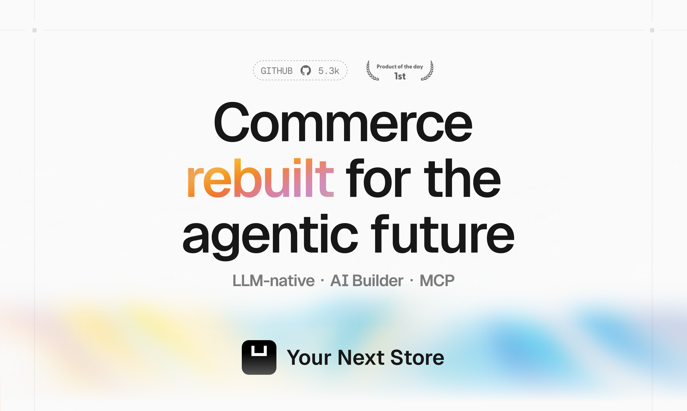
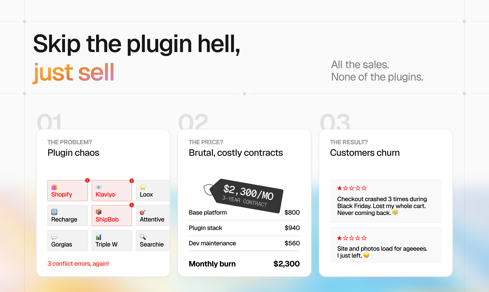
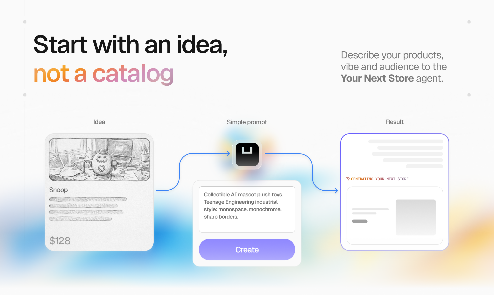

---

## 4. [Claude Code Review](https://www.producthunt.com/products/claude)
**Votes**: 330 | **도입 난이도**: 중 | **신뢰도**: 중
**Tagline**: Multi-agent review catching bugs early in AI-generated code
**서비스 링크**: https://www.producthunt.com/r/TX3N3FXOJTYS3N

**태그**: DevTool, AI, 코드 리뷰, 자동화, Agent, AI Tool, Security

### 📌 이 서비스 한눈에 보기
Claude Code Review는 AI가 생성한 코드의 버그를 초기에 잡아내는 멀티 에이전트 코드 리뷰 시스템으로, 팀 및 엔터프라이즈 사용자를 대상으로 연구 프리뷰를 제공합니다.

### 🔑 주요 기능
- AI 기반 멀티 에이전트 코드 리뷰
- 버그, 보안 문제, 숨겨진 로직 결함 탐지
- 오탐 감소를 위한 검증 기능

### 🙋 사용자에게 어떤 점이 좋은가
AI가 생성한 코드의 품질을 높이고, 개발 초기 단계에서 잠재적인 문제를 발견하여 시간과 비용을 절약할 수 있습니다.

### ✅ 지금 바로 써볼 기능
- 팀 또는 엔터프라이즈 계정으로 연구 프리뷰 신청
- 기존 코드 리뷰 프로세스에 통합
- AI 생성 코드에 대한 리뷰 결과 분석

### ⚠️ 사용 전 확인할 점
- 연구 프리뷰 버전이므로 기능 제한이 있을 수 있음
- AI 생성 코드 외의 코드에 대한 효과는 불확실

### 🧭 확인이 더 필요한 정보
정확도 및 성능에 대한 사용자 피드백 데이터가 더 필요합니다.

### 📸 스크린샷 및 갤러리
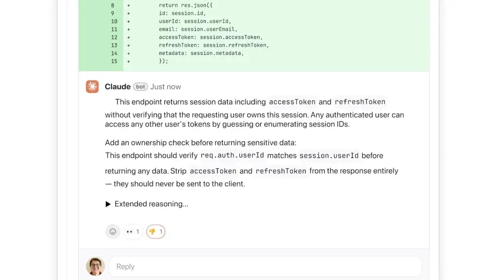

### 🎬 관련 영상
- [🎥 영상 보기](https://ph-files.imgix.net/f92632ac-bcda-47d8-bcac-f03c760e4060.jpeg?auto=format)

---

## 5. [Fish Audio S2](https://www.producthunt.com/products/fish-speech)
**Votes**: 239 | **도입 난이도**: 중 | **신뢰도**: 중
**Tagline**: Real Expressive AI Voices
**서비스 링크**: https://www.producthunt.com/r/SZPNSLJNJZPMER

**태그**: TTS, AI 음성, 오픈소스, 음성 합성, AI Tool

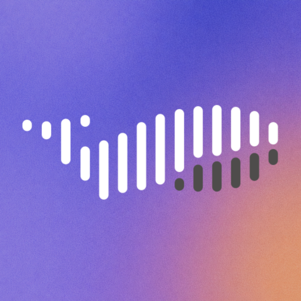

### 📌 이 서비스 한눈에 보기
Fish Audio S2는 자연어 기반으로 음성 표현을 제어하고 다중 화자 대화를 생성할 수 있는 오픈 소스 TTS 기술입니다.

### 🔑 주요 기능
- 자연어를 사용하여 음성 톤과 스타일을 제어 가능
- 다중 화자 대화 생성을 한 번에 처리
- 80개 이상의 언어 지원

### 🙋 사용자에게 어떤 점이 좋은가
사용자는 더욱 실감나고 다양한 표현이 가능한 AI 음성을 쉽게 제작하여 콘텐츠 제작 효율성을 높일 수 있습니다.

### ✅ 지금 바로 써볼 기능
- whisper, laughing nervously 같은 자연어 큐 사용해보기
- 다양한 언어로 음성 생성해보기
- 다중 화자 대화 생성 기능 사용해보기

### ⚠️ 사용 전 확인할 점
- 오픈 소스 모델이므로 사용 목적에 따른 라이선스 확인 필요
- 생성된 음성의 품질은 입력 텍스트 및 설정에 따라 달라질 수 있음

### 🧭 확인이 더 필요한 정보
실제 사용 환경에서의 음성 품질 및 안정성에 대한 추가적인 사용자 피드백이 필요합니다.

### 📸 스크린샷 및 갤러리
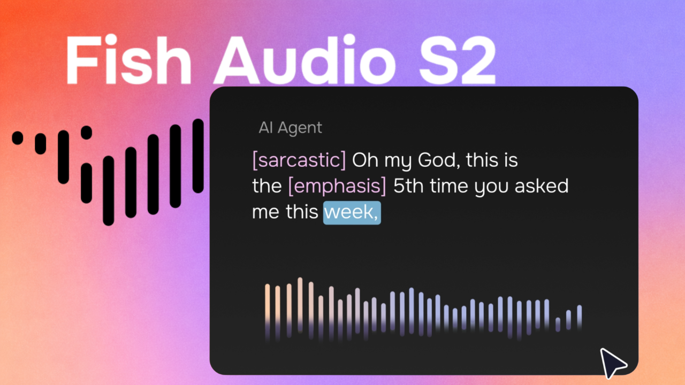
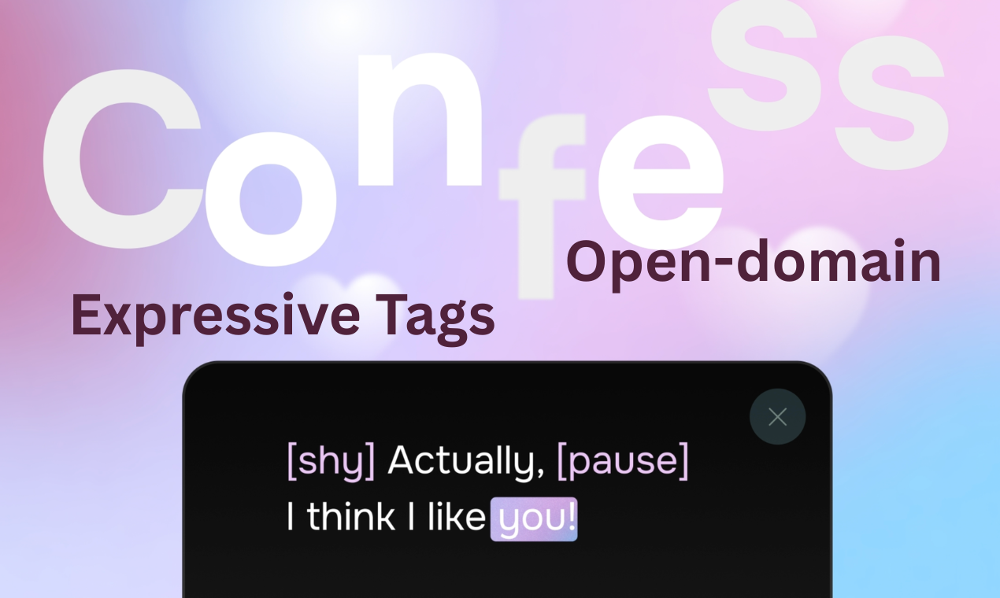
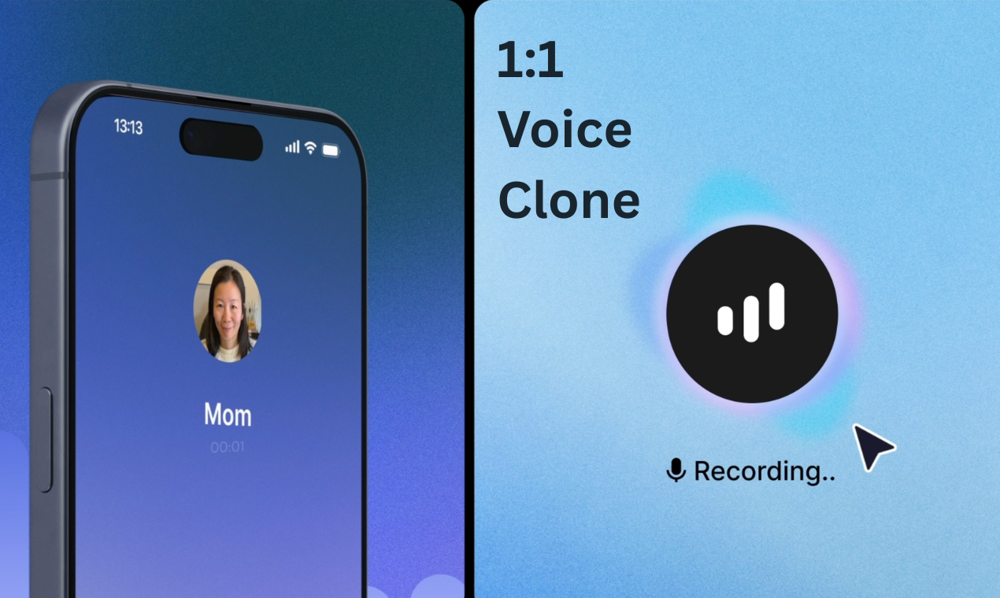

### 🎬 관련 영상
- [🎥 영상 보기](https://ph-files.imgix.net/b0fbeb6e-ac80-47ba-adcb-0e3a3ae22736.jpeg?auto=format)

---

## 6. [sitefire.ai](https://www.producthunt.com/products/sitefire-ai)
**Votes**: 183 | **도입 난이도**: 중 | **신뢰도**: 중
**Tagline**: Marketing suite for the agentic web
**서비스 링크**: https://www.producthunt.com/r/O5UCCTYDMRG6AP

**태그**: 마케팅 자동화, 콘텐츠 생성, SEO, AI, Agent, AI Tool, Marketing

### 📌 이 서비스 한눈에 보기
sitefire.ai는 에이전트 웹을 위한 마케팅 스위트로서, 콘텐츠 분석, 브랜드 인지 기사 작성, CMS 게시, PR 아웃렛 및 UGC 발굴, 맞춤형 아웃리치 제안 등을 자동화하여 SEO 및 콘텐츠 담당자를 대체할 수 있습니다.

### 🔑 주요 기능
- 콘텐츠가 인용을 유도하는 방식 분석
- 브랜드 인지 기사 자동 작성 및 CMS 게시 (Framer, Webflow)
- AI 답변에 영향을 미치는 PR 아웃렛 및 UGC 발굴 및 맞춤형 아웃리치 제안 제공

### 🙋 사용자에게 어떤 점이 좋은가
SEO 및 콘텐츠 마케팅 담당자를 고용하지 않고도 에이전트 웹에 대한 마케팅을 자동화하여 시간과 비용을 절약할 수 있습니다.

### ✅ 지금 바로 써볼 기능
- 콘텐츠 분석 에이전트 사용해보기
- 기사 자동 작성 및 게시 기능 사용해보기
- PR 아웃렛 및 UGC 발굴 기능 사용해보기

### ⚠️ 사용 전 확인할 점
- 자동 생성된 콘텐츠의 품질 검토 필요
- 아웃리치 제안의 적절성 검토 필요

### 🧭 확인이 더 필요한 정보
자동 생성된 콘텐츠가 실제 SEO 및 마케팅 성과에 미치는 영향에 대한 추가적인 검증이 필요합니다.

### 📸 스크린샷 및 갤러리
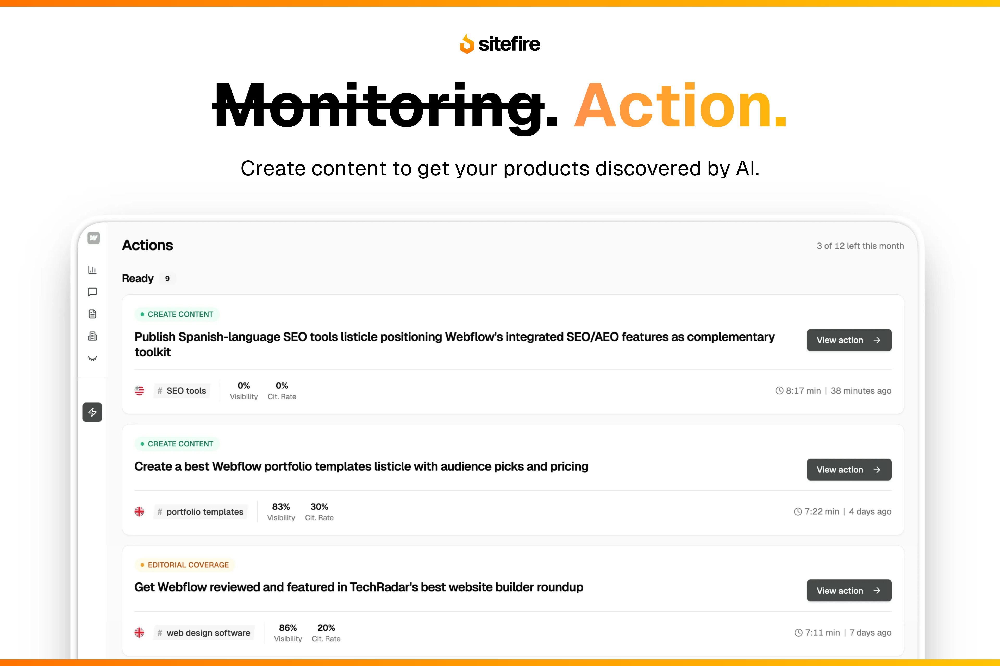
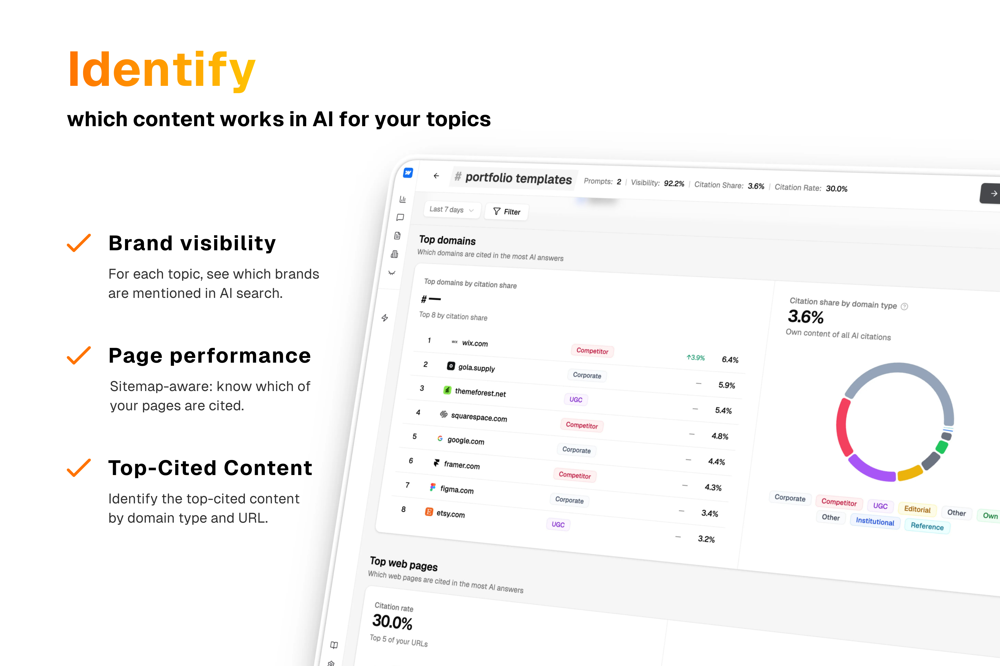
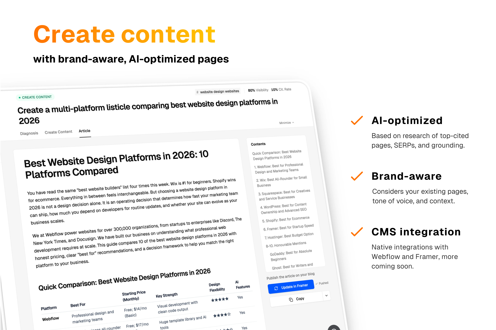

### 🎬 관련 영상
- [🎥 영상 보기](https://ph-files.imgix.net/b435ece3-946b-43b9-b352-d470a4c9d94b.jpeg?auto=format)

---

## 7. [New Macaly Agent](https://www.producthunt.com/products/macaly)
**Votes**: 171 | **도입 난이도**: 중 | **신뢰도**: 중
**Tagline**: Nobody tells you what you can ask AI to build
**서비스 링크**: https://www.producthunt.com/r/3UNCWIK6UTMB72

**태그**: DevTool, AI, Automation, Low-code, Agent, AI Tool, Video, Design

### 📌 이 서비스 한눈에 보기
Macaly Agent는 AI를 활용하여 랜딩 페이지 생성, 웹사이트 재설계, 스프레드시트 기반 대시보드 구축 등 다양한 작업을 자동화하여 개발 생산성을 극대화합니다.

### 🔑 주요 기능
- AI 에이전트를 통해 다양한 개발 관련 작업을 자동화
- YouTube 비디오에서 랜딩 페이지 생성, 웹사이트 재설계 등 즉각적인 활용 가능
- 데이터베이스 설정, 사용자 인증 및 역할 추가 등 복잡한 작업 지원

### 🙋 사용자에게 어떤 점이 좋은가
개발자가 반복적인 작업에 소요하는 시간을 줄이고, 더 창의적인 작업에 집중할 수 있도록 돕습니다. AI 기능을 앱에 쉽게 통합할 수 있어 사용자 경험을 향상시킬 수 있습니다.

### ✅ 지금 바로 써볼 기능
- YouTube 비디오 URL을 사용하여 랜딩 페이지 자동 생성해보기
- 기존 웹사이트 URL을 기반으로 새로운 디자인 제안 받아보기
- 스프레드시트 데이터를 기반으로 대시보드 자동 생성해보기

### ⚠️ 사용 전 확인할 점
- AI가 생성한 결과물의 품질은 입력 데이터에 따라 달라질 수 있습니다.
- 자동화된 결과물을 실제 서비스에 적용하기 전에 반드시 검토해야 합니다.

### 🧭 확인이 더 필요한 정보
Macaly Agent가 지원하는 특정 기술 스택 및 플랫폼에 대한 정보 확인이 필요합니다.

### 📸 스크린샷 및 갤러리
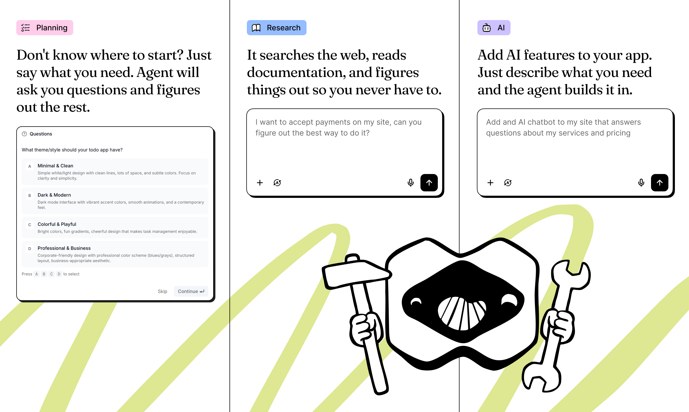
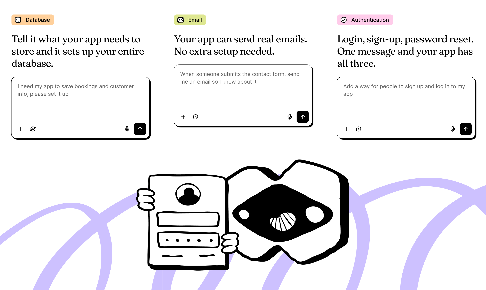
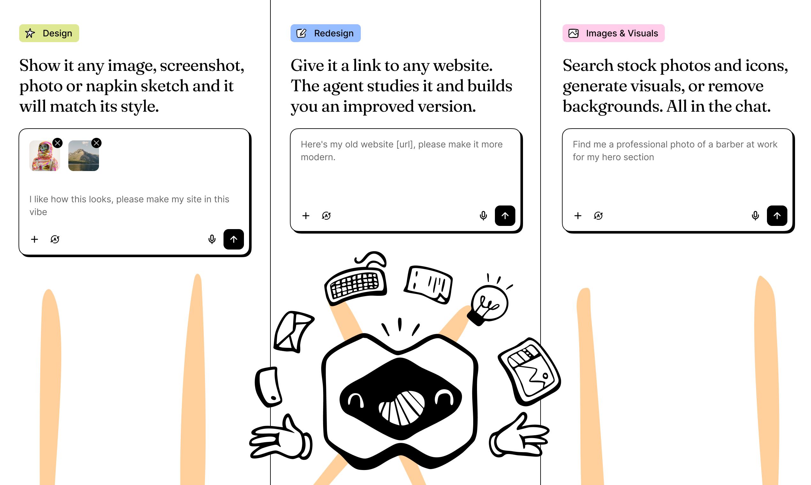

---

## 8. [Spine Swarm](https://www.producthunt.com/products/spine-2)
**Votes**: 155 | **도입 난이도**: 중 | **신뢰도**: 중
**Tagline**: Manage a team of AI agents that do real work
**서비스 링크**: https://www.producthunt.com/r/X5DFJLLQTNWLIF

**태그**: AI, 자동화, 생산성, 업무 효율성, Agent, AI Tool, Chat, Prompting

### 📌 이 서비스 한눈에 보기
Spine Swarm은 복잡한 작업을 처음부터 끝까지 완료하는 AI 에이전트 팀을 관리하고 배포하여 ChatGPT, Gemini, Claude보다 철저하고 정확한 결과물을 얻을 수 있게 해줍니다.

### 🔑 주요 기능
- AI 에이전트 팀 관리 및 배포
- 웹 검색, 심층 연구, 전략 문서 작성 등 다양한 작업 수행
- 시각적 캔버스에서 감사 가능한 작업 결과 제공

### 🙋 사용자에게 어떤 점이 좋은가
단 하나의 프롬프트로 복잡한 작업을 자동화하여 시간과 노력을 절약하고, 더 철저하고 정확한 결과물을 얻을 수 있습니다.

### ✅ 지금 바로 써볼 기능
- AI 에이전트 팀을 구성하여 특정 작업 할당
- 웹 검색 및 연구 기능 활용
- 생성된 전략 문서 및 프레젠테이션 검토

### ⚠️ 사용 전 확인할 점
- AI 에이전트의 결과물이 완벽하지 않을 수 있으므로 검토 필요
- 복잡한 작업일수록 프롬프트 엔지니어링 중요

### 🧭 확인이 더 필요한 정보
AI 에이전트의 성능과 정확도에 대한 사용자 피드백 및 사례 연구가 더 필요합니다.

### 📸 스크린샷 및 갤러리
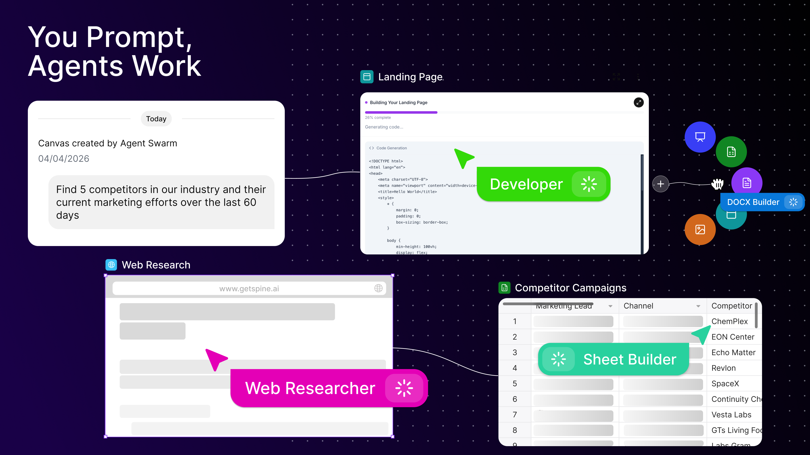
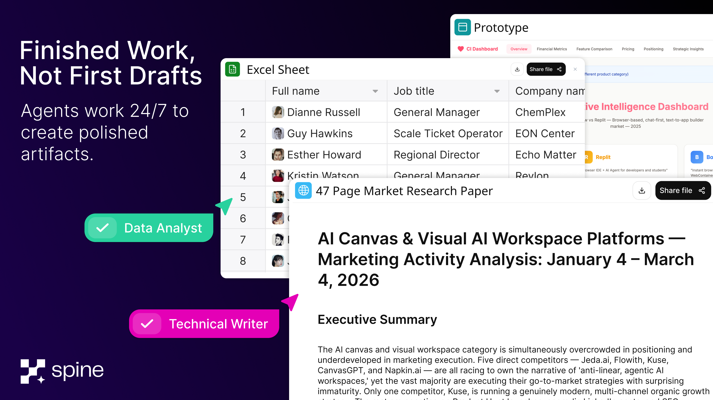
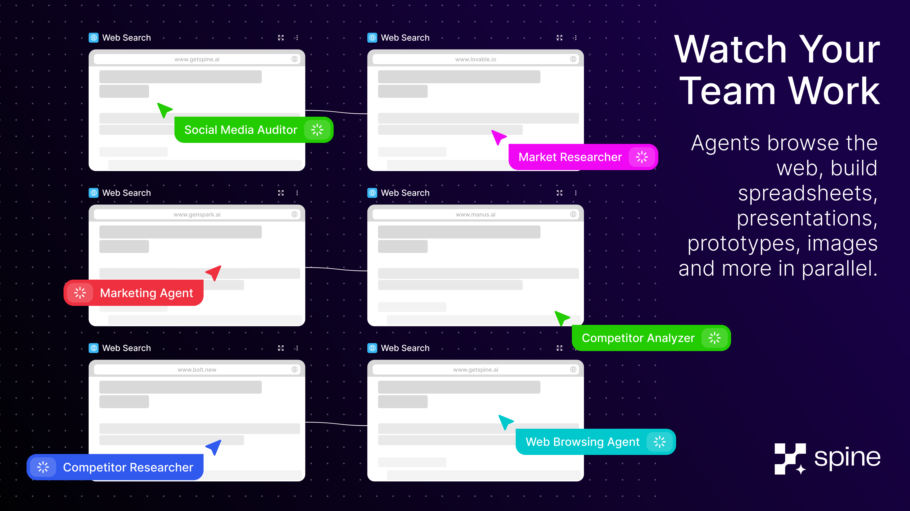

### 🎬 관련 영상
- [🎥 영상 보기](https://ph-files.imgix.net/57d82dad-6765-4aff-b4db-ab1b47b9e639.jpeg?auto=format)

---

## 9. [Agent Skills](https://www.producthunt.com/products/agent-skills-3)
**Votes**: 144 | **도입 난이도**: 하 | **신뢰도**: 중
**Tagline**: Find skills for Claude Code, Cursor, Copilot & more
**서비스 링크**: https://www.producthunt.com/r/HRAD7U3JSIMZ7I

**태그**: AI 에이전트, 스킬 검색, 보안 감사, 개발 도구, Agent, AI Tool, DevTool, Security

### 📌 이 서비스 한눈에 보기
Claude Code, Cursor, Copilot 등 다양한 AI 에이전트 스킬을 한 곳에서 검색하고 보안 감사 정보까지 확인할 수 있는 플랫폼입니다.

### 🔑 주요 기능
- 10만 개 이상의 AI 에이전트 스킬 보유
- 30개 이상의 플랫폼 지원
- 각 스킬 목록에 대한 보안 감사 제공

### 🙋 사용자에게 어떤 점이 좋은가
여러 AI 에이전트 플랫폼에서 필요한 스킬을 일일이 찾아다닐 필요 없이, Agent Skills에서 한 번에 검색하고 안전하게 사용할 수 있습니다.

### ✅ 지금 바로 써볼 기능
- Claude Code에서 사용할 스킬 검색
- Cursor에서 사용할 스킬 검색
- Copilot에서 사용할 스킬 검색

### ⚠️ 사용 전 확인할 점
- 보안 감사가 완료되지 않은 스킬은 사용에 주의
- 제공 플랫폼 외 다른 플랫폼과의 호환성 확인 필요

### 🧭 확인이 더 필요한 정보
각 스킬의 성능 및 사용자 리뷰 정보는 추가적으로 확인이 필요합니다.

### 📸 스크린샷 및 갤러리
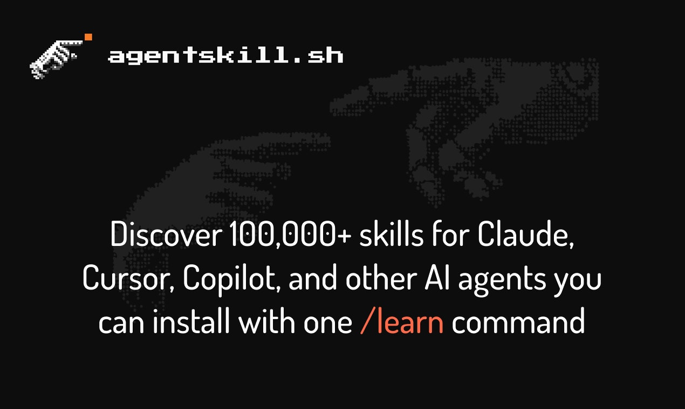

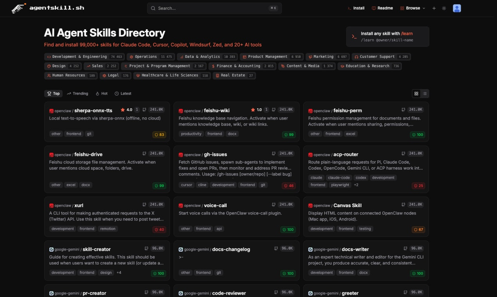

---

## 10. [Sonarly](https://www.producthunt.com/products/sonarly)
**Votes**: 133 | **도입 난이도**: 중 | **신뢰도**: 중
**Tagline**: The AI that fixes prod autonomously
**서비스 링크**: https://www.producthunt.com/r/RUAT5UXW5LL34U

**태그**: DevTool, AI, Automation, Monitoring, Debugging, Agent, AI Tool

### 📌 이 서비스 한눈에 보기
Sonarly는 AI를 활용하여 Sentry, Datadog 등 모니터링 도구의 알림을 자동으로 분석, 중복 제거하고, 프로덕션 시스템의 맥락을 파악하여 버그를 자율적으로 수정해주는 도구입니다.

### 🔑 주요 기능
- AI 기반 자동 문제 해결: 알림 분류, 중복 제거, 버그 수정 자동화
- 프로덕션 컨텍스트 활용: 시스템 전체 맥락을 파악하여 정확한 문제 해결
- PR 자동 생성: 문제 원인 분석 및 증거를 포함한 PR 자동 생성

### 🙋 사용자에게 어떤 점이 좋은가
Sonarly를 통해 개발자는 알림 과다로 인한 피로감을 줄이고, 문제 해결 시간을 단축하여 더 중요한 업무에 집중할 수 있습니다.

### ✅ 지금 바로 써볼 기능
- Sentry 또는 Datadog 연동하여 알림 자동 분석 시작
- 자동 생성된 PR 검토 및 적용
- Sonarly의 문제 해결 제안 검토 및 개선

### ⚠️ 사용 전 확인할 점
- Claude Code 및 Opus 4.6 모델의 성능에 따라 결과 정확도 달라질 수 있음
- 자동 생성된 PR의 적합성 검토 필요

### 🧭 확인이 더 필요한 정보
Sonarly의 실제 문제 해결 성공률 및 사용 편의성에 대한 추가적인 사용자 후기 확인이 필요합니다.

### 📸 스크린샷 및 갤러리
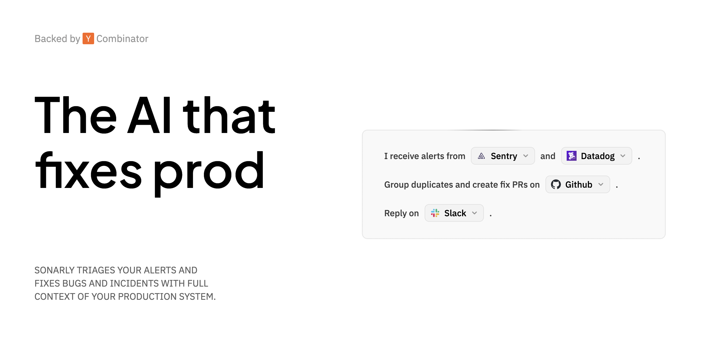
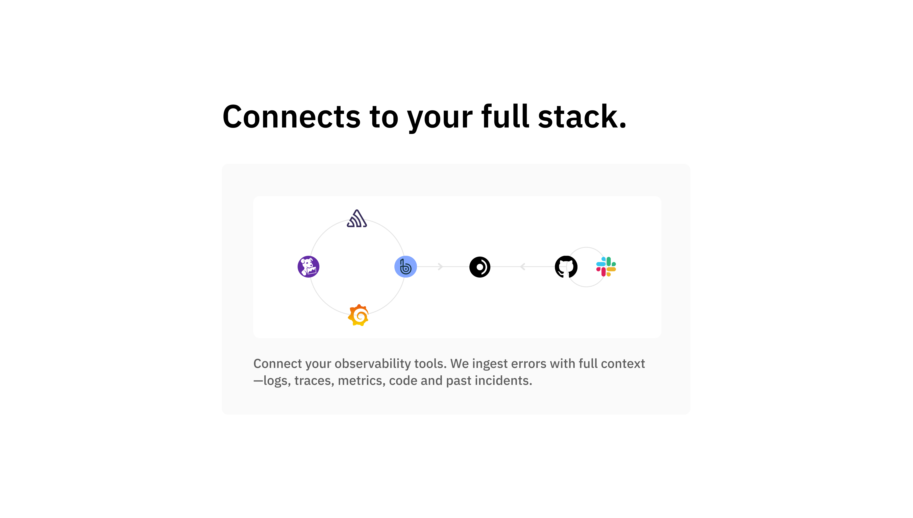
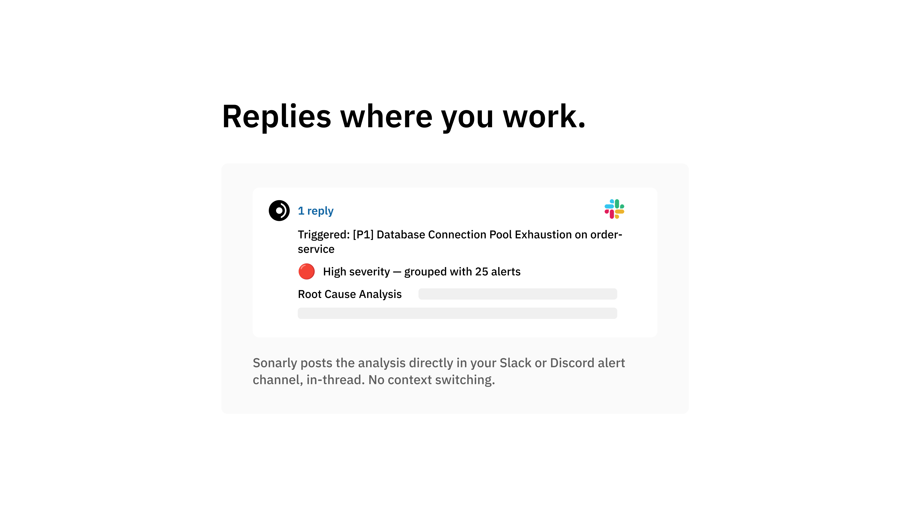

### 🎬 관련 영상
- [🎥 영상 보기](https://ph-files.imgix.net/0ed8b884-4fcc-4826-b746-819e2a78622d.jpeg?auto=format)

---

