# 🚀 Product Hunt Daily Top 10 (2026-03-17)

## 1. [MuleRun](https://www.producthunt.com/products/mulerun)
**Votes**: 374 | **도입 난이도**: 중 | **신뢰도**: 중
**Tagline**: Raise an AI that actually learns how you work
**서비스 링크**: https://www.producthunt.com/r/4K3Z3GNR5C2LPH

**태그**: AI, 자동화, 생산성, 개인 비서, AI Tool

### 📌 이 서비스 한눈에 보기
MuleRun은 사용자의 업무 습관을 학습하여 스스로 발전하는 개인 AI를 제공, 코딩이나 복잡한 설정 없이도 사용자의 니즈를 예측하고 필요한 정보를 미리 준비해줍니다.

### 🔑 주요 기능
- 사용자의 업무 패턴, 의사 결정 방식, 선호도를 학습하여 지속적으로 발전
- 24/7 전용 클라우드 VM에서 실행되어 오프라인 상태에서도 작업 가능
- 사용자가 요청하기 전에 필요한 정보를 미리 준비

### 🙋 사용자에게 어떤 점이 좋은가
MuleRun을 통해 사용자는 반복적인 업무에서 벗어나 더욱 창의적인 작업에 집중할 수 있으며, 개인 비서처럼 사용자의 업무를 효율적으로 지원합니다.

### ✅ 지금 바로 써볼 기능
- AI를 활성화하여 업무 습관 학습 시작
- 클라우드 VM 설정 확인 및 필요 리소스 점검
- AI가 제안하는 정보 및 작업 방식 검토

### ⚠️ 사용 전 확인할 점
- 개인 정보 및 민감한 데이터 처리 시 보안에 유의
- AI의 초기 학습 기간 동안은 정확도가 낮을 수 있음

### 🧭 확인이 더 필요한 정보
AI의 학습 속도 및 정확도가 사용자마다 어떻게 달라지는지 추가 확인이 필요합니다.

### 📸 스크린샷 및 갤러리

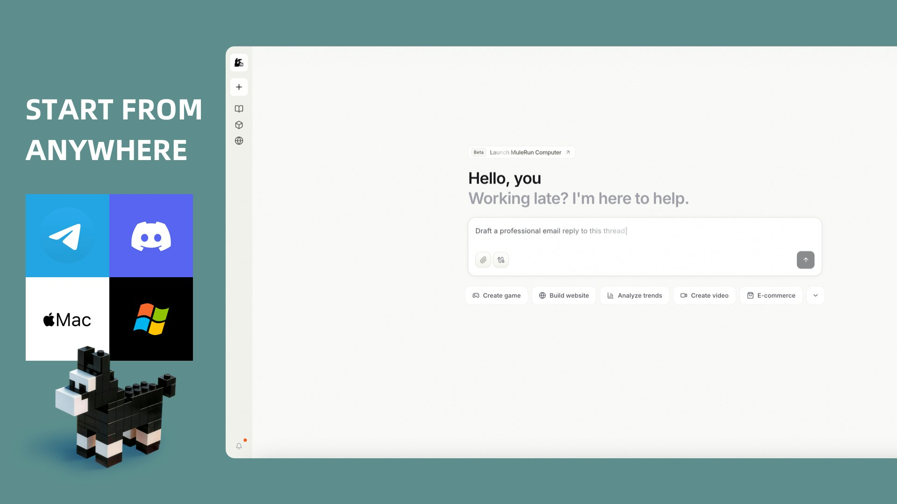

---

## 2. [Glam AI](https://www.producthunt.com/products/glam-ai)
**Votes**: 320 | **도입 난이도**: 하 | **신뢰도**: 중
**Tagline**: Pick a trend, add your photo, and create viral content
**서비스 링크**: https://www.producthunt.com/r/6CT6NKJROZGNHU

**태그**: 콘텐츠 제작, AI, 이미지, 비디오, 템플릿, Automation, AI Tool, Prompting, Video, Vision

### 📌 이 서비스 한눈에 보기
Glam AI는 트렌드에 맞는 템플릿을 활용하여 사진만으로 빠르게 고품질 콘텐츠를 제작할 수 있게 해줍니다.

### 🔑 주요 기능
- 복잡한 프롬프트나 워크플로우 없이 트렌디한 비주얼 콘텐츠 제작 가능
- 주요 이미지 및 비디오 모델을 하나의 구독으로 사용
- 크리에이터, 인플루언서, 브랜드를 위해 빠른 콘텐츠 제작 지원

### 🙋 사용자에게 어떤 점이 좋은가
별도의 노력 없이도 트렌드를 따라가는 콘텐츠를 쉽게 만들 수 있어 시간과 노력을 절약해줍니다.

### ✅ 지금 바로 써볼 기능
- 트렌드 템플릿 둘러보기
- 사진 또는 제품 이미지 업로드
- 고품질 비주얼 콘텐츠 생성

### ⚠️ 사용 전 확인할 점
- 제공되는 템플릿의 다양성 및 최신 트렌드 반영 여부 확인 필요
- 생성된 콘텐츠의 저작권 및 사용 범위 확인 필요

### 🧭 확인이 더 필요한 정보
Glam AI가 제공하는 이미지 및 비디오 모델의 종류와 성능에 대한 추가 정보가 필요합니다.

### 📸 스크린샷 및 갤러리

### 🎬 관련 영상
- [🎥 영상 보기](https://ph-files.imgix.net/706d84ac-b731-4a30-80b4-af21ea1034b3.jpeg?auto=format)

---

## 3. [GLM-5-Turbo](https://www.producthunt.com/products/z-ai)
**Votes**: 213 | **도입 난이도**: 중 | **신뢰도**: 중
**Tagline**: High-speed agentic model built specifically for OpenClaw
**서비스 링크**: https://www.producthunt.com/r/NGUA2JHJBTAVW3

**태그**: AI, Agent, Automation, OpenClaw, AI Tool

### 📌 이 서비스 한눈에 보기
GLM-5-Turbo는 OpenClaw에 최적화된 고속 에이전트 모델로, 도구 호출, 복잡한 명령어 수행, 장기 실행 작업에 특화되어 있습니다.

### 🔑 주요 기능
- OpenClaw에 최적화되어 빠른 속도와 안정성을 제공합니다.
- 정확한 도구 호출 및 복잡한 명령어 수행 능력이 뛰어납니다.
- 할루시네이션 현상이 거의 없어 신뢰성 있는 결과를 제공합니다.

### 🙋 사용자에게 어떤 점이 좋은가
실제 에이전트 워크플로우에 적합하도록 설계되어 자동화 효율성을 높이고 오류를 줄이는 데 기여합니다.

### ✅ 지금 바로 써볼 기능
- OpenClaw 환경에서 GLM-5-Turbo를 활용하여 작업 자동화 테스트를 진행해보세요.
- 복잡한 명령어를 사용하는 워크플로우에 적용하여 성능 향상을 확인해보세요.
- 장기 실행 작업을 GLM-5-Turbo에 맡겨 안정성을 평가해보세요.

### ⚠️ 사용 전 확인할 점
- OpenClaw 환경 외에서의 성능은 다를 수 있습니다.
- 특정 작업 유형에 따라 최적화 정도가 다를 수 있습니다.

### 🧭 확인이 더 필요한 정보
OpenClaw 외 다른 환경에서의 성능 및 호환성에 대한 추가 정보가 필요합니다.

### 📸 스크린샷 및 갤러리

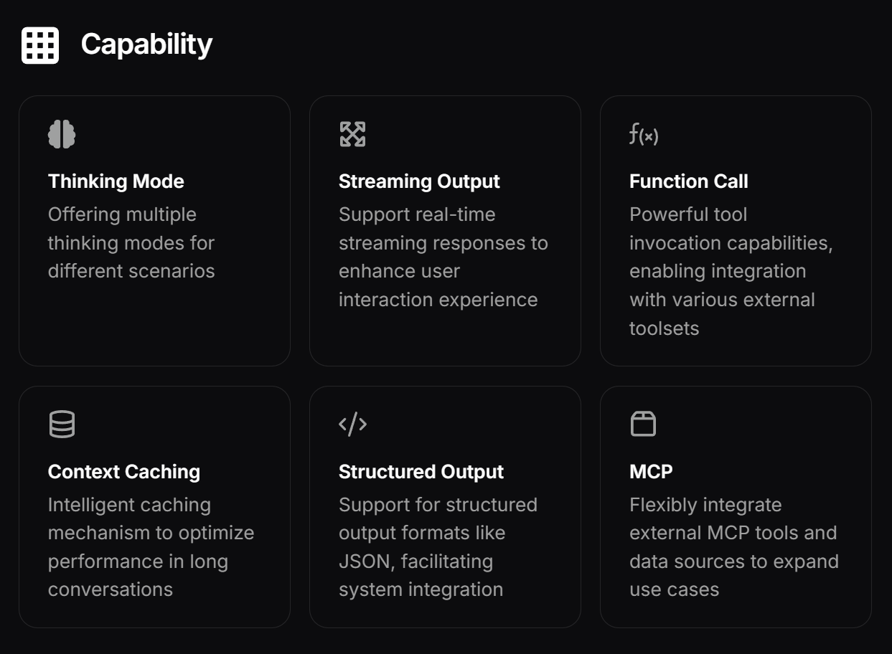
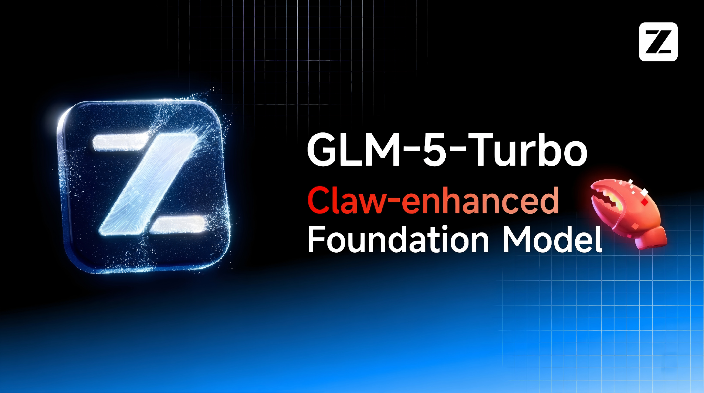

---

## 4. [JetBrains Air](https://www.producthunt.com/products/jetbrains)
**Votes**: 192 | **도입 난이도**: 중 | **신뢰도**: 중
**Tagline**: Run Codex, Claude Agents, Gemini CLI, and Junie side by side
**서비스 링크**: https://www.producthunt.com/r/JKDDUKOGBMB2Q7

**태그**: DevTool, AI, Automation, 코딩 에이전트, Agent, AI Tool, Design

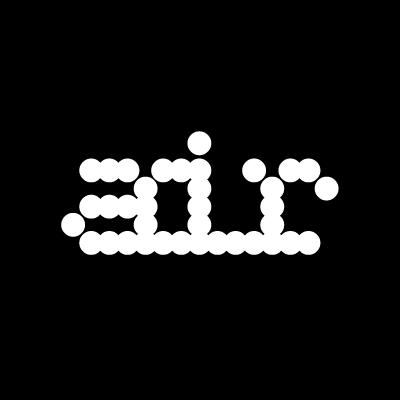

### 📌 이 서비스 한눈에 보기
JetBrains Air는 Codex, Claude Agent, Gemini CLI, Junie와 같은 코딩 에이전트를 통합하여 실제 코드베이스에서 에이전트 기반 개발을 효율적으로 수행할 수 있도록 돕는 macOS용 도구입니다.

### 🔑 주요 기능
- 다양한 코딩 에이전트 통합 (Codex, Claude Agent, Gemini CLI, Junie)
- 명확한 작업 정의, 격리된 환경에서의 실행, 코드 인텔리전스를 활용한 결과 검토
- macOS 지원 (Windows, Linux 버전 예정)

### 🙋 사용자에게 어떤 점이 좋은가
JetBrains Air를 사용하면 여러 코딩 에이전트를 하나의 워크플로우에서 관리하고, 코드 개발 과정을 더욱 체계적이고 효율적으로 만들 수 있습니다.

### ✅ 지금 바로 써볼 기능
- macOS에서 JetBrains Air 다운로드 및 설치
- 선호하는 코딩 에이전트 연동
- 실제 코드베이스에서 에이전트 기반 개발 워크플로우 테스트

### ⚠️ 사용 전 확인할 점
- 현재 macOS만 지원하며, Windows 및 Linux 버전은 추후 제공 예정
- 통합된 코딩 에이전트의 성능 및 호환성 확인 필요

### 🧭 확인이 더 필요한 정보
Windows 및 Linux 버전의 출시 일정에 대한 추가 정보가 필요합니다.

### 📸 스크린샷 및 갤러리
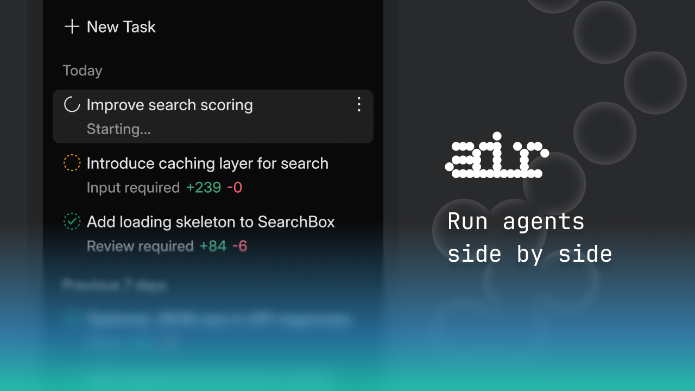
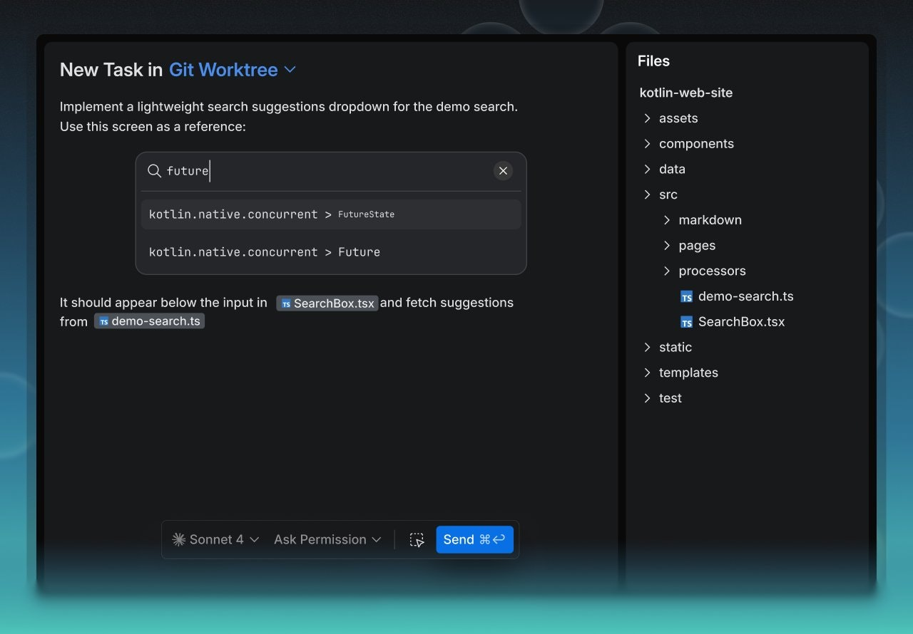
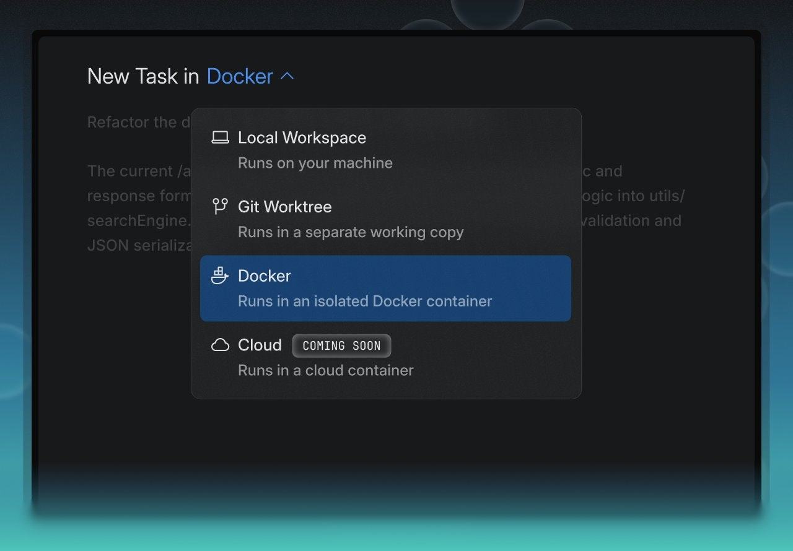

### 🎬 관련 영상
- [🎥 영상 보기](https://ph-files.imgix.net/675b3fd7-1bc4-4999-8ea4-f28792792ee4.jpeg?auto=format)

---

## 5. [Donely ](https://www.producthunt.com/products/donely)
**Votes**: 171 | **도입 난이도**: 중 | **신뢰도**: 중
**Tagline**: Your own OpenClaw instance for $0/mo + free AI usage offer
**서비스 링크**: https://www.producthunt.com/r/EWB7KJ3ZCRTTYG

**태그**: DevTool, AI, Automation, Open Source, Agent, AI Tool

### 📌 이 서비스 한눈에 보기
Donely는 완전 관리형 OpenClaw 컨테이너를 무료로 제공하며, 사용한 AI 크레딧에 대해서만 비용을 지불합니다. 초기 한 달 동안은 무료 AI 사용 혜택도 제공합니다.

### 🔑 주요 기능
- 완전 관리형 OpenClaw 인스턴스를 무료로 제공
- AI 사용량에 따라 지불하는 합리적인 가격 정책
- Gmail, Slack 등 950개 이상의 앱과 즉시 연결 가능

### 🙋 사용자에게 어떤 점이 좋은가
기본 호스팅 비용을 절약하고, AI 에이전트를 쉽게 연결하여 자동화 워크플로우를 구축할 수 있습니다. 인스턴스 문제 발생 시 AI가 자동으로 복구해줍니다.

### ✅ 지금 바로 써볼 기능
- 무료 OpenClaw 인스턴스 시작하기
- Gmail, Slack 등 자주 사용하는 앱 연동하기
- AI 자동 복구 기능 체험하기

### ⚠️ 사용 전 확인할 점
- AI 크레딧 사용량에 따른 추가 비용 발생 가능성
- OpenClaw에 대한 기본적인 이해 필요

### 🧭 확인이 더 필요한 정보
무료 AI 사용 혜택의 정확한 기간 및 제한 사항 확인이 필요합니다.

### 📸 스크린샷 및 갤러리
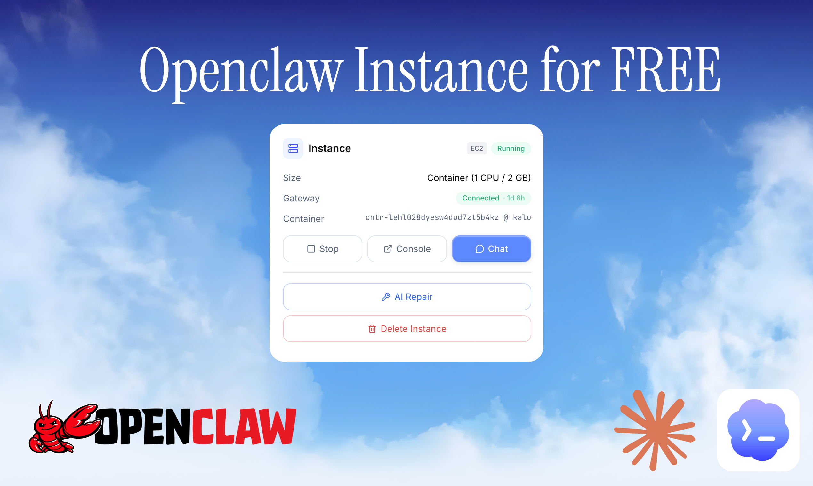
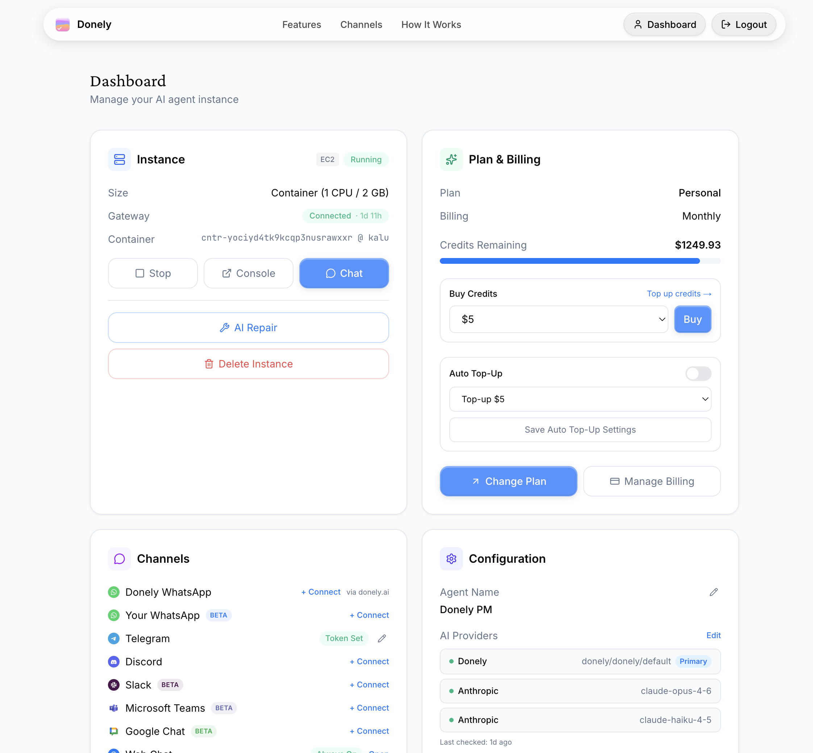
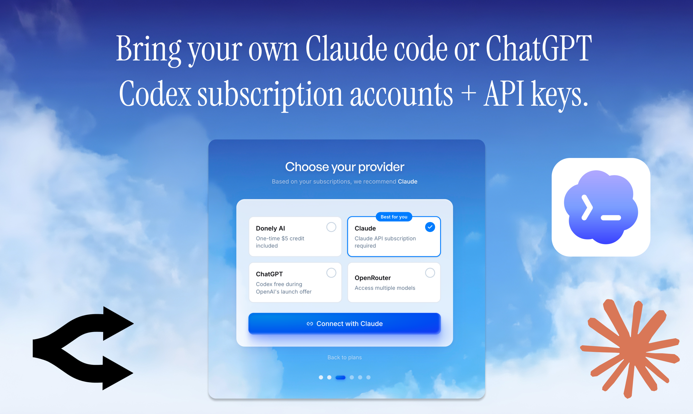

### 🎬 관련 영상
- [🎥 영상 보기](https://ph-files.imgix.net/3d91fb76-27f9-40db-83c5-e02493705474.jpeg?auto=format)

---

## 6. [Masko Code](https://www.producthunt.com/products/masko-code)
**Votes**: 150 | **도입 난이도**: 중 | **신뢰도**: 중
**Tagline**:  A mascot that watches Claude Code for you
**서비스 링크**: https://www.producthunt.com/r/OUUXHDSDUPSV4H

**태그**: DevTool, Automation, Agent, Mascot, Open Source, AI Tool, Prompting

### 📌 이 서비스 한눈에 보기
Claude Code 에이전트를 사용하는 사용자를 위해, 데스크탑 마스코트가 실시간으로 에이전트 활동을 감시하고 필요한 권한 승인 및 터미널 전환을 간편하게 해주는 무료 오픈소스 도구입니다.

### 🔑 주요 기능
- Claude Code 에이전트 활동을 실시간으로 모니터링
- 마스코트를 통해 권한 요청 및 알림을 시각적으로 표시
- 단축키를 통해 터미널 전환 및 세션 관리를 간편하게 수행

### 🙋 사용자에게 어떤 점이 좋은가
Claude Code 에이전트 사용 시 발생하는 번거로운 작업 전환과 잦은 확인 과정을 줄여 생산성을 향상시키고, 에이전트 관리를 더욱 효율적으로 만들어줍니다.

### ✅ 지금 바로 써볼 기능
- Masko Code를 다운로드하여 데스크탑에 설치
- Clippy 또는 다른 마스코트를 선택하여 에이전트 모니터링 시작
- 단축키(⌘1, ⌘M, 더블 탭 ⌘)를 사용하여 터미널 전환 및 세션 관리

### ⚠️ 사용 전 확인할 점
- 100% 로컬 환경에서 실행되므로, 보안 설정을 확인해야 합니다.
- 커뮤니티에서 제공하는 마스코트의 안전성을 확인해야 합니다.

### 🧭 확인이 더 필요한 정보
Masko Code가 Claude Code 에이전트의 성능에 미치는 영향에 대한 추가 정보가 필요합니다.

### 📸 스크린샷 및 갤러리
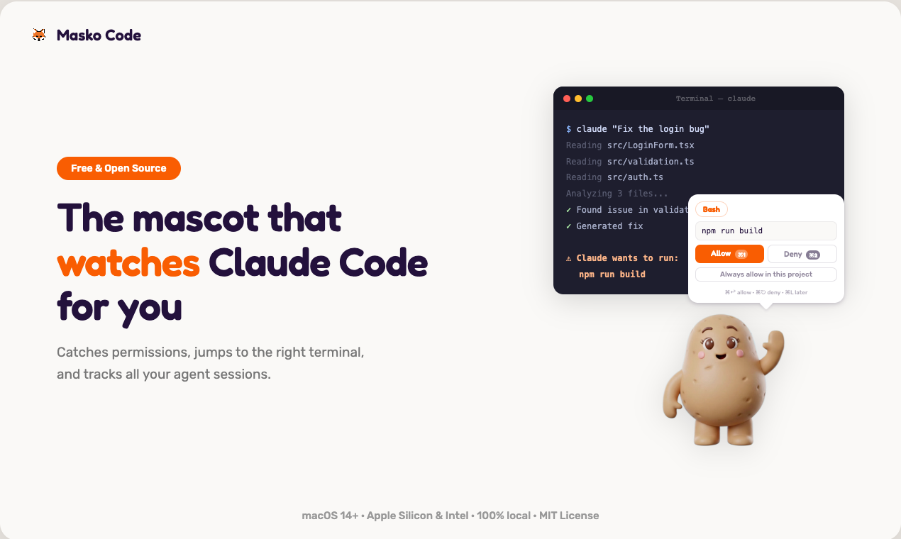
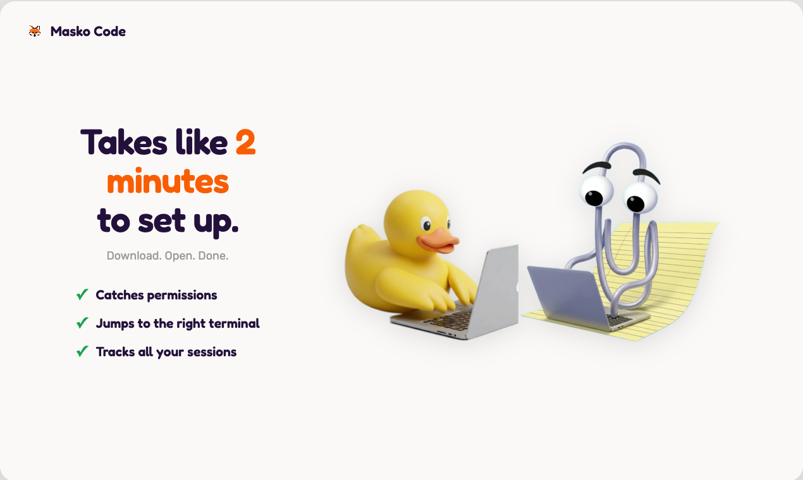
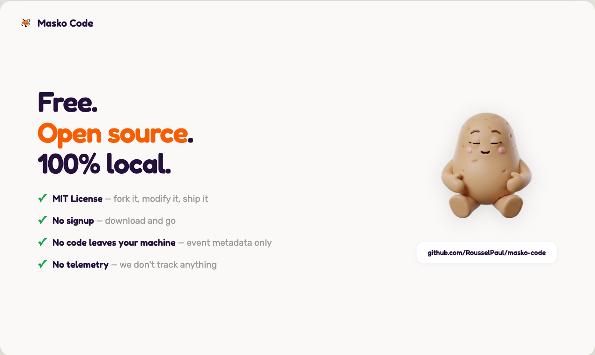

### 🎬 관련 영상
- [🎥 영상 보기](https://ph-files.imgix.net/8c927e4c-cf40-46f3-9a0e-01f8424509d1.jpeg?auto=format)

---

## 7. [Refgrow 2.0](https://www.producthunt.com/products/refgrow)
**Votes**: 146 | **도입 난이도**: 하 | **신뢰도**: 중
**Tagline**: Grow your revenue with referrals
**서비스 링크**: https://www.producthunt.com/r/X3NL7P5MWAFF53

**태그**: 추천 프로그램, 제휴 마케팅, 수익 증대, 마케팅 자동화

### 📌 이 서비스 한눈에 보기
Refgrow 2.0으로 몇 분 안에 간편하게 제휴 및 추천 프로그램을 시작하여 수익을 늘리세요.

### 🔑 주요 기능
- 몇 분 안에 제휴 및 추천 프로그램 런칭
- 간편한 사용법
- 수익 증대에 집중

### 🙋 사용자에게 어떤 점이 좋은가
Refgrow 2.0을 통해 쉽고 빠르게 추천 프로그램을 구축하고, 이를 통해 매출 증대를 기대할 수 있습니다.

### ✅ 지금 바로 써볼 기능
- 추천 프로그램 템플릿 살펴보기
- 제휴 마케팅 설정 마법사 사용해보기
- 수익 추적 대시보드 확인하기

### ⚠️ 사용 전 확인할 점
- 프로그램 활성화를 위한 마케팅 전략 필요
- 초기 사용자 확보 노력 필요

### 🧭 확인이 더 필요한 정보
제공되는 템플릿의 다양성과 사용자 정의 가능 범위에 대한 추가 정보가 필요합니다.

### 📸 스크린샷 및 갤러리
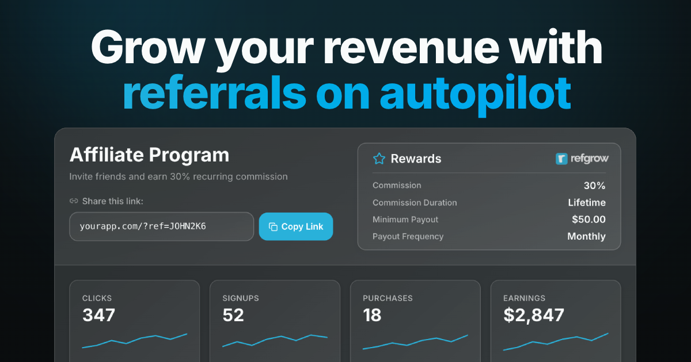
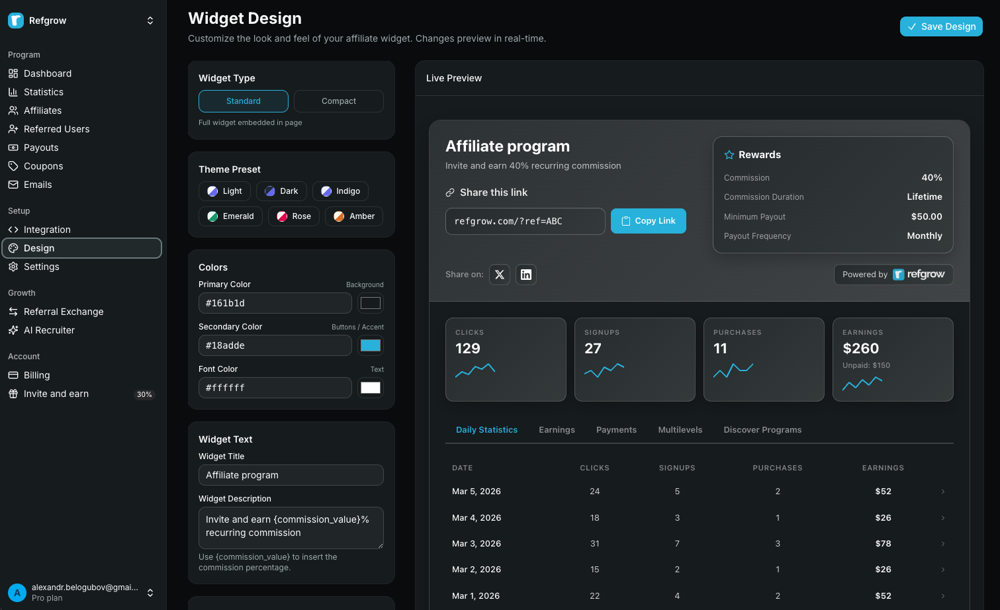
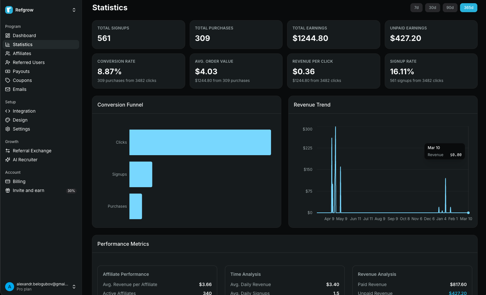

---

## 8. [Knock](https://www.producthunt.com/products/knock-7)
**Votes**: 140 | **도입 난이도**: 하 | **신뢰도**: 중
**Tagline**: Knock on your MacBook to control your Mac
**서비스 링크**: https://www.producthunt.com/r/GEQYTO7BSAT7GO

**태그**: 자동화, 생산성, 맥, 단축키

### 📌 이 서비스 한눈에 보기
맥북을 두드려서 탭 전환, 음악 재생/정지, 앱 실행 등 다양한 액션을 즉시 실행할 수 있게 해주는 자동화 도구

### 🔑 주요 기능
- 맥북 자체의 내장 가속도계를 활용
- 간단한 두드림으로 단축키 실행
- 사용자 정의 스크립트 실행 가능

### 🙋 사용자에게 어떤 점이 좋은가
복잡한 단축키 조합 없이 간단한 동작으로 맥을 제어하여 작업 효율성을 높여줍니다. 특히 Apple Silicon 맥북 사용자에게 유용합니다.

### ✅ 지금 바로 써볼 기능
- 음악 재생/정지 설정
- 자주 사용하는 앱 실행 설정
- 스크린샷 기능 설정

### ⚠️ 사용 전 확인할 점
- Apple Silicon 맥북에서만 작동
- 가속도계 민감도에 따른 오작동 가능성

### 🧭 확인이 더 필요한 정보
실제 사용 환경에서 두드림 인식률과 배터리 소모량에 대한 추가 정보가 필요합니다.

### 📸 스크린샷 및 갤러리
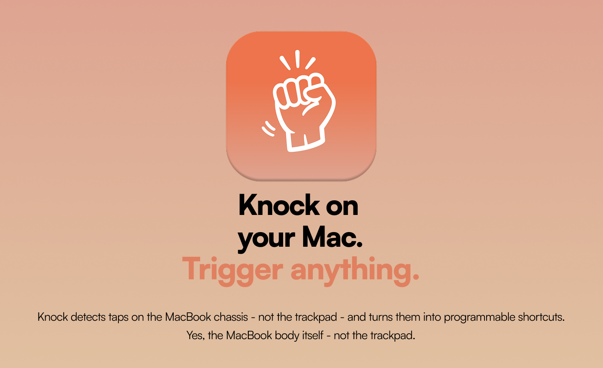
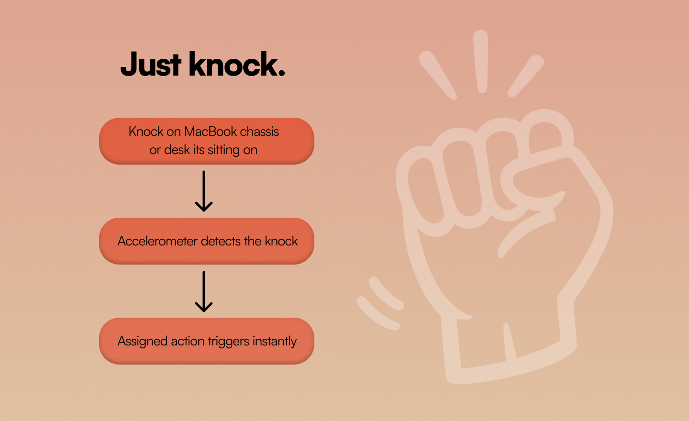
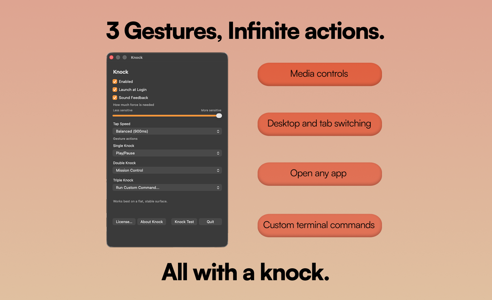

---

## 9. [Wendi AI](https://www.producthunt.com/products/wendi-ai-yc-application)
**Votes**: 116 | **도입 난이도**: 중 | **신뢰도**: 중
**Tagline**: The AI OS for people who manage people
**서비스 링크**: https://www.producthunt.com/r/WXVYSORXI7524Q

**태그**: AI, 생산성, 팀 관리, HR, 자동화, AI Tool

### 📌 이 서비스 한눈에 보기
Wendi AI는 팀 관리자를 위한 AI 기반 운영체제로, 회의록 작성부터 리더십 및 HR 관련 안전한 지침 제공까지, 팀 관리 효율성을 높여줍니다.

### 🔑 주요 기능
- AI가 회의 내용을 자동으로 기록하고 요약합니다.
- 리더십 및 HR 관련 의사 결정에 대한 안전한 가이드를 제공합니다.
- 팀 관리 효율성을 향상시켜 AI를 활용한 업무 환경을 구축합니다.

### 🙋 사용자에게 어떤 점이 좋은가
Wendi AI를 통해 팀 관리자는 회의록 작성 시간을 절약하고, 더 나은 의사 결정을 내릴 수 있으며, 팀 전체의 생산성을 향상시킬 수 있습니다.

### ✅ 지금 바로 써볼 기능
- 회의에 Wendi AI를 참여시켜 회의록 자동 작성 기능을 사용해 보세요.
- 팀 관리 관련 어려운 의사 결정 시 Wendi AI의 가이드를 참고하세요.
- 팀원들의 피드백을 수집하여 Wendi AI의 활용도를 높여보세요.

### ⚠️ 사용 전 확인할 점
- AI가 제공하는 가이드가 모든 상황에 적합하지 않을 수 있으므로, 최종 결정은 관리자의 판단에 따라 이루어져야 합니다.
- 데이터 보안 및 개인 정보 보호 정책을 확인하고, 민감한 정보 공유에 주의해야 합니다.

### 🧭 확인이 더 필요한 정보
Wendi AI의 HR 관련 가이드가 국내 노동법 및 규정에 얼마나 정확하게 부합하는지 추가 확인이 필요합니다.

### 📸 스크린샷 및 갤러리
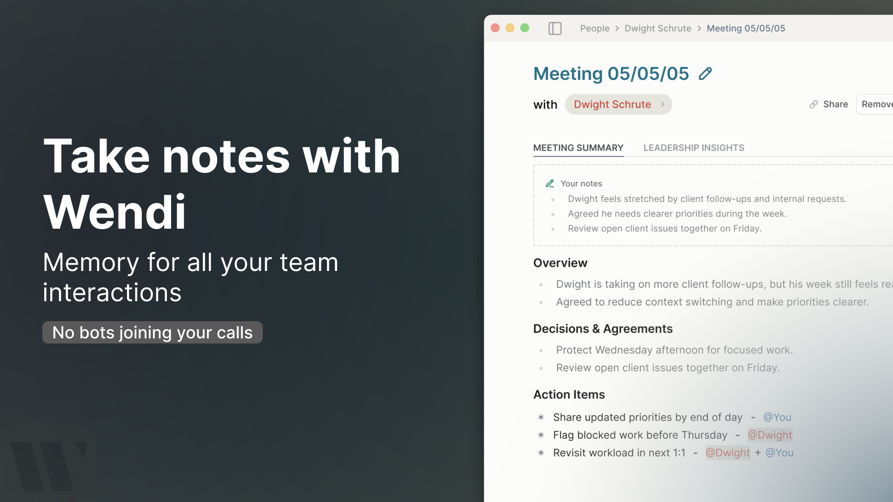
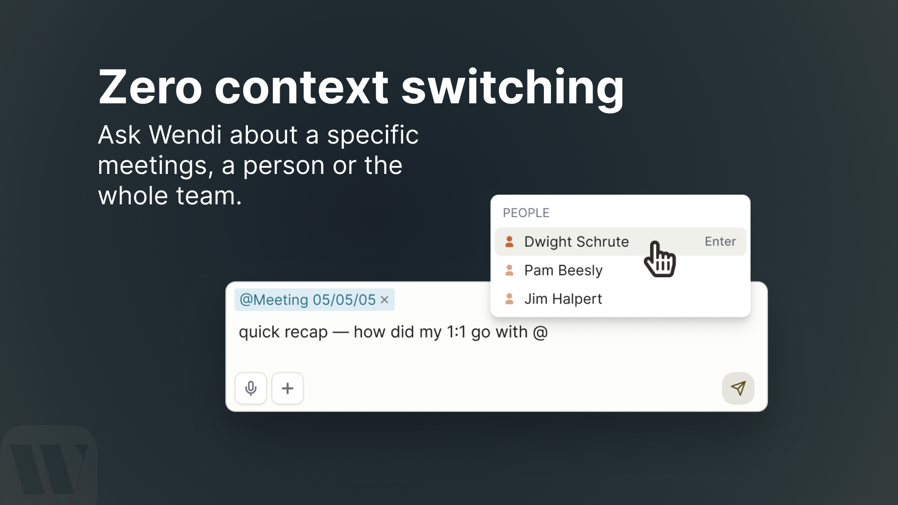
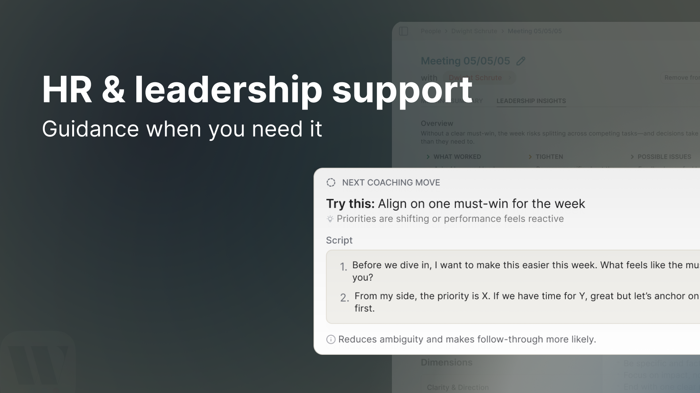

### 🎬 관련 영상
- [🎥 영상 보기](https://ph-files.imgix.net/3be38556-93f4-49f3-a71d-3d7fa773701d.jpeg?auto=format)

---

## 10. [ZeroSettle](https://www.producthunt.com/products/zerosettle)
**Votes**: 116 | **도입 난이도**: 중 | **신뢰도**: 중
**Tagline**: Drop-in direct billing SDK to skip the 30% Apple Tax
**서비스 링크**: https://www.producthunt.com/r/MWLZ7TTK6FZCN5

**태그**: SDK, 결제, 개발 도구, 수수료 절감, DevTool

### 📌 이 서비스 한눈에 보기
ZeroSettle은 모바일 앱 개발자가 애플 앱스토어 수수료 30%를 내지 않고 직접 결제를 구현할 수 있도록 돕는 SDK입니다. 설정이 간편하고 사용자 유지율을 높이며 즉시 정산이 가능합니다.

### 🔑 주요 기능
- 앱 스토어 수수료 절감
- 사용자 유지율 향상
- 즉각적인 정산

### 🙋 사용자에게 어떤 점이 좋은가
ZeroSettle을 사용하면 앱 개발 비용을 절감하고 사용자에게 더 나은 결제 경험을 제공하여 수익성을 높일 수 있습니다.

### ✅ 지금 바로 써볼 기능
- SDK 설치 및 설정
- 직접 결제 기능 구현
- 결제 흐름 테스트

### ⚠️ 사용 전 확인할 점
- 애플 앱스토어 정책 준수 필요
- 보안 및 개인 정보 보호 고려

### 🧭 확인이 더 필요한 정보
ZeroSettle 사용 시 앱 스토어 정책 위반 가능성은 없는지 추가 확인이 필요합니다.

### 📸 스크린샷 및 갤러리
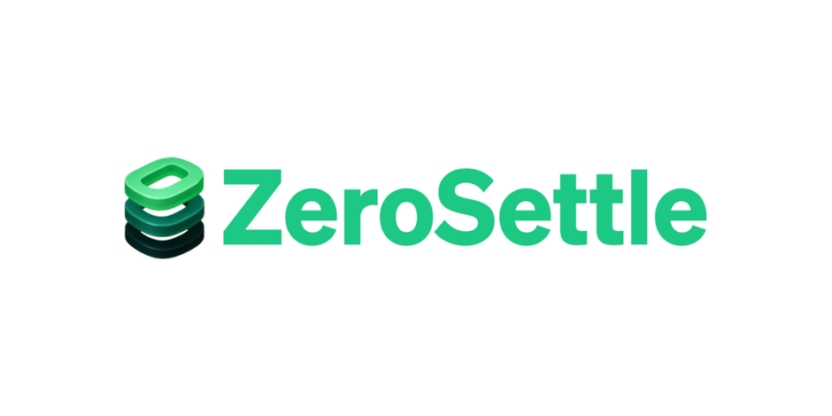
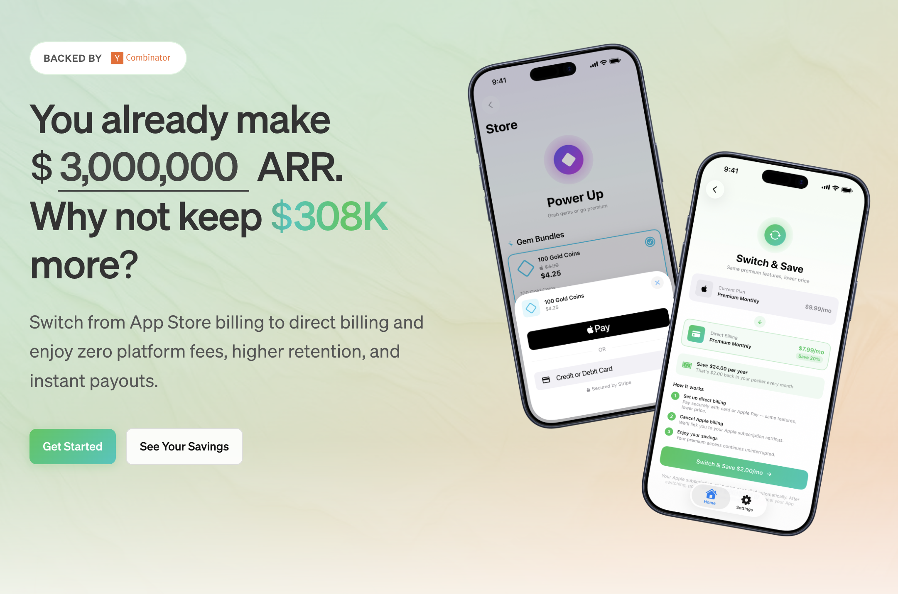
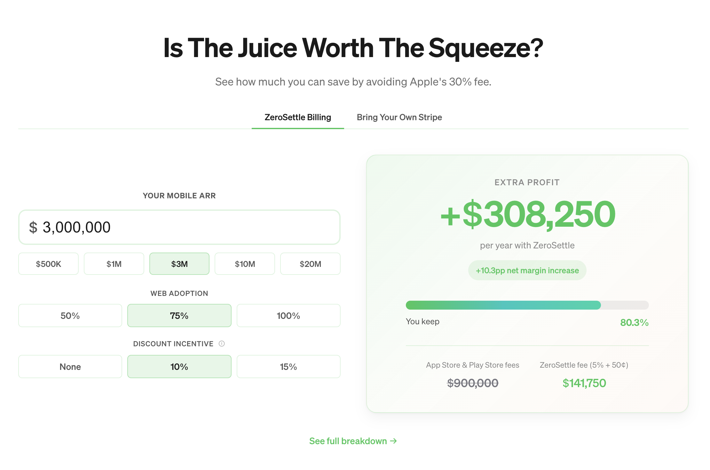

### 🎬 관련 영상
- [🎥 영상 보기](https://ph-files.imgix.net/113cb2e1-e0ca-4eea-9763-fc09c14d1331.jpeg?auto=format)

---

