# 🚀 Product Hunt Daily Top 10 (2026-03-18)

## 1. [My Computer by Manus AI](https://www.producthunt.com/products/manus)
**Votes**: 305 | **도입 난이도**: 중 | **신뢰도**: 중
**Tagline**: Automate files, apps, and workflows with Manus Desktop
**서비스 링크**: https://www.producthunt.com/r/RCNKA5LRLRVAU6

**태그**: 자동화, 생산성, AI, DevTool, Agent, Automation, AI Tool

### 📌 이 서비스 한눈에 보기
Manus Desktop 앱의 핵심 기능인 My Computer를 통해 AI 에이전트가 로컬 파일, 도구, 앱과 직접 상호 작용하여 파일 정리, 이름 변경, 앱 개발 등의 작업을 자동화할 수 있습니다.

### 🔑 주요 기능
- 로컬 파일, 도구, 앱과 AI 에이전트의 직접적인 상호 작용
- 사진 정리, 송장 이름 변경, 코드 없는 데스크톱 앱 개발 등 다양한 작업 자동화
- macOS 및 Windows 지원

### 🙋 사용자에게 어떤 점이 좋은가
클라우드 기반 AI 에이전트의 기능을 확장하여 로컬 환경에서도 자동화 워크플로우를 구축하고 생산성을 향상시킬 수 있습니다.

### ✅ 지금 바로 써볼 기능
- 수천 장의 사진 정리 자동화
- 수백 개의 송장 이름 일괄 변경
- 코딩 없이 Swift 데스크톱 앱 빌드

### ⚠️ 사용 전 확인할 점
- macOS 및 Windows 운영체제에서만 사용 가능
- 자동화 워크플로우 구축을 위한 추가적인 설정 필요

### 🧭 확인이 더 필요한 정보
Manus Desktop 앱의 시스템 요구 사항 및 호환성을 추가적으로 확인해야 합니다.

### 📸 스크린샷 및 갤러리
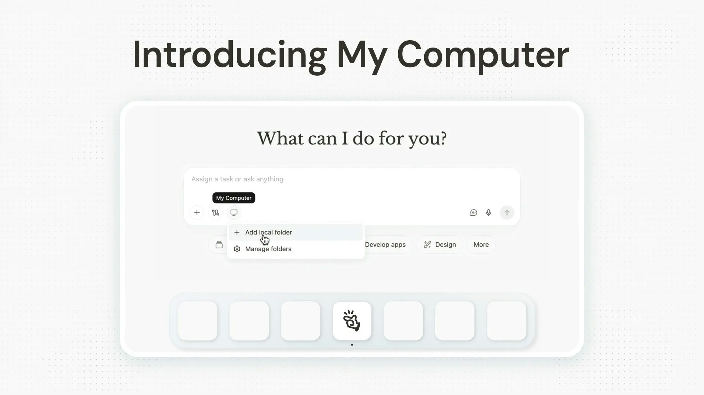
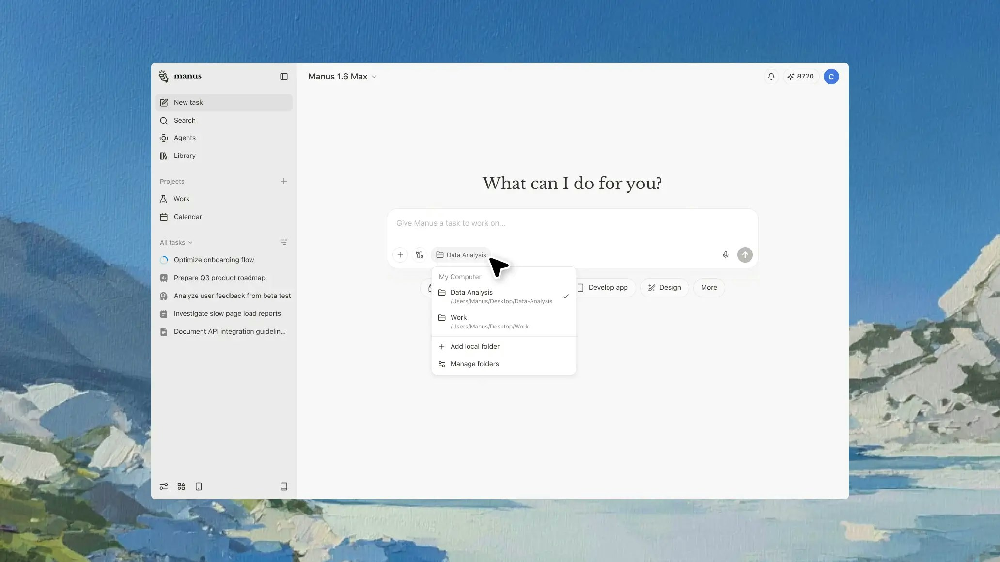
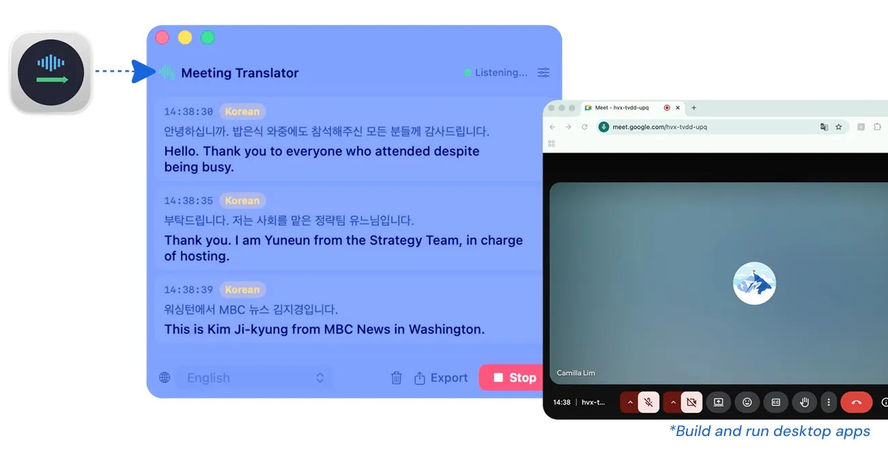

### 🎬 관련 영상
- [🎥 영상 보기](https://ph-files.imgix.net/7975f62f-c7c1-4894-8080-be05d6be7205.jpeg?auto=format)

---

## 2. [Kira 4.0 ](https://www.producthunt.com/products/kira-art)
**Votes**: 249 | **도입 난이도**: 하 | **신뢰도**: 중
**Tagline**: Turn your friends into shareable content
**서비스 링크**: https://www.producthunt.com/r/TEPZ3A4GHBSZGY

**태그**: 비디오 편집, AI, 콘텐츠 제작, 이미지 편집, AI Tool, Prompting, Video, Vision

### 📌 이 서비스 한눈에 보기
Kira 4.0은 이미지 편집처럼 쉽고 재미있게 비디오와 음악을 결합하여 공유 가능한 콘텐츠를 만들 수 있게 해줍니다.

### 🔑 주요 기능
- 사진 애니메이션, AI 음악 삽입, 헤어스타일 변경 등 다양한 편집 기능 제공
- 별도 다운로드나 복잡한 프롬프트 없이 간편하게 사용 가능
- 만들고 공유하는 과정이 쉽고 즐거움

### 🙋 사용자에게 어떤 점이 좋은가
친구 사진을 재미있게 편집하여 공유하거나, 특별한 기술 없이도 멋진 비디오 콘텐츠를 만들 수 있습니다. AI 기반 음악 추천으로 더욱 풍성한 콘텐츠 제작이 가능합니다.

### ✅ 지금 바로 써볼 기능
- 친구 사진을 애니메이션으로 만들어보기
- AI가 추천하는 음악을 배경음악으로 사용해보기
- 헤어스타일 변경 기능으로 재미있는 콘텐츠 만들기

### ⚠️ 사용 전 확인할 점
- AI가 생성하는 음악의 저작권 관련 사항 확인 필요
- 편집 결과물의 품질은 원본 사진의 품질에 따라 달라질 수 있음

### 🧭 확인이 더 필요한 정보
AI 음악 추천의 정확도 및 사용자의 선호도 일치 여부에 대한 추가 정보 확인이 필요합니다.

### 📸 스크린샷 및 갤러리
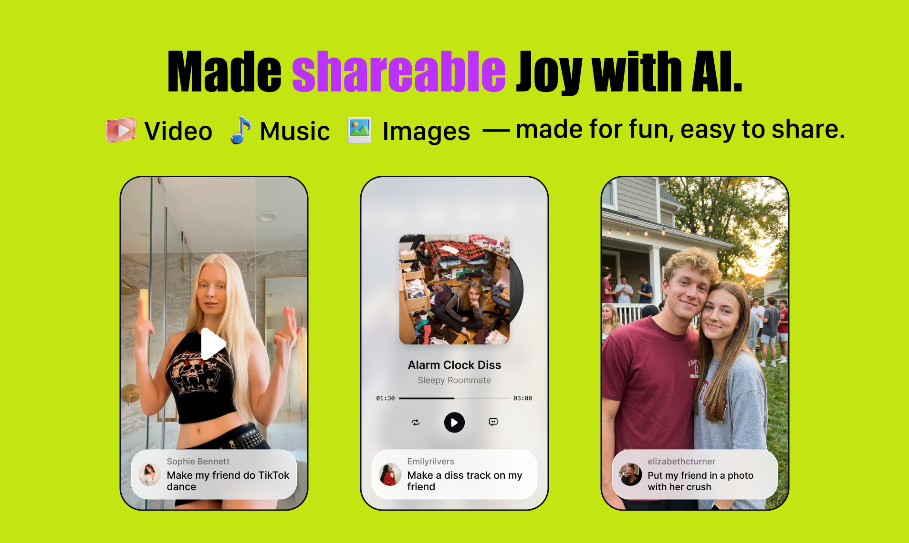

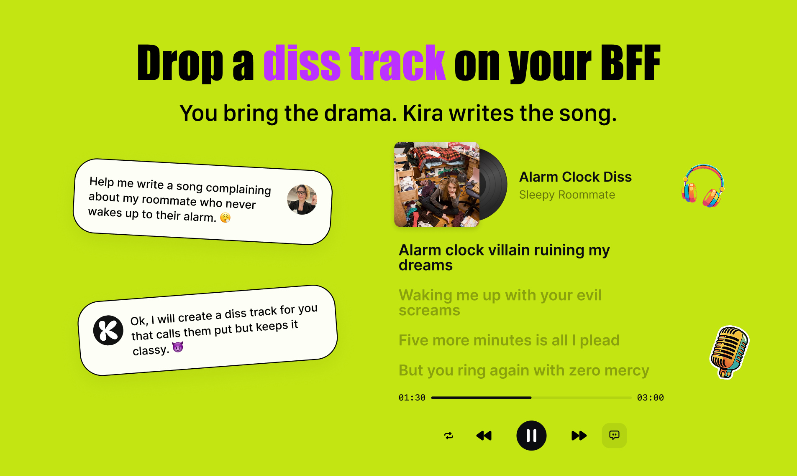

### 🎬 관련 영상
- [🎥 영상 보기](https://ph-files.imgix.net/e8c85371-9b9b-4e06-ae17-d6d34fa02643.jpeg?auto=format)

---

## 3. [Lightning Rod: Training Data Generator](https://www.producthunt.com/products/training-data-generator)
**Votes**: 233 | **도입 난이도**: 중 | **신뢰도**: 중
**Tagline**: Turn real-world data into training datasets fast
**서비스 링크**: https://www.producthunt.com/r/T2R3JQSWTRVF5S

**태그**: DevTool, 데이터 분석, 자동화, Python SDK, AI Tool

### 📌 이 서비스 한눈에 보기
Lightning Rod SDK는 실제 데이터를 활용하여 검증되고 즉시 사용 가능한 학습 데이터 세트를 빠르게 생성하여 수동 레이블링 및 합성 데이터 추측 과정을 건너뛸 수 있게 해줍니다.

### 🔑 주요 기능
- 실제 데이터를 학습 데이터 세트로 빠르게 전환
- 몇 줄의 Python 코드로 간편하게 사용
- 수동 레이블링 작업 감소

### 🙋 사용자에게 어떤 점이 좋은가
뉴스, 서류, 자체 문서 등 다양한 실제 데이터를 활용하여 학습 데이터 세트를 빠르게 구축하고, 개발 시간을 단축할 수 있습니다.

### ✅ 지금 바로 써볼 기능
- Python SDK 설치 및 설정
- 실제 데이터 소스 연결
- 학습 데이터 세트 생성 및 검증

### ⚠️ 사용 전 확인할 점
- 데이터 품질에 따라 결과 품질이 달라질 수 있음
- 지원하는 데이터 유형 및 형식 확인 필요

### 🧭 확인이 더 필요한 정보
실제 사용 환경에서의 성능 및 확장성에 대한 추가 정보가 필요합니다.

### 📸 스크린샷 및 갤러리
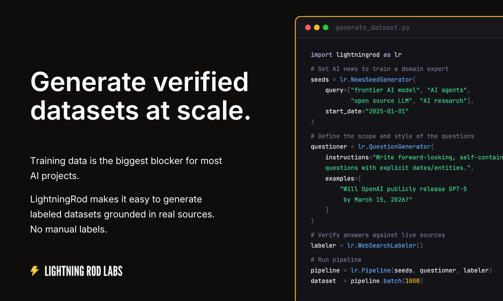
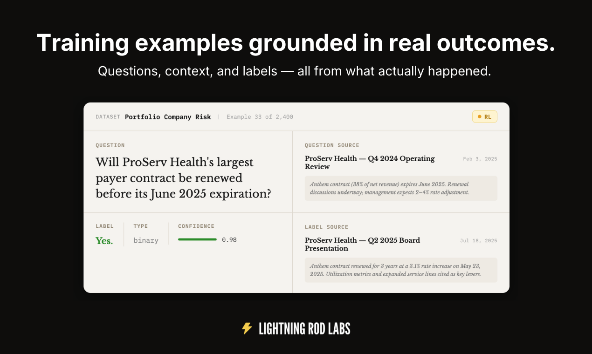
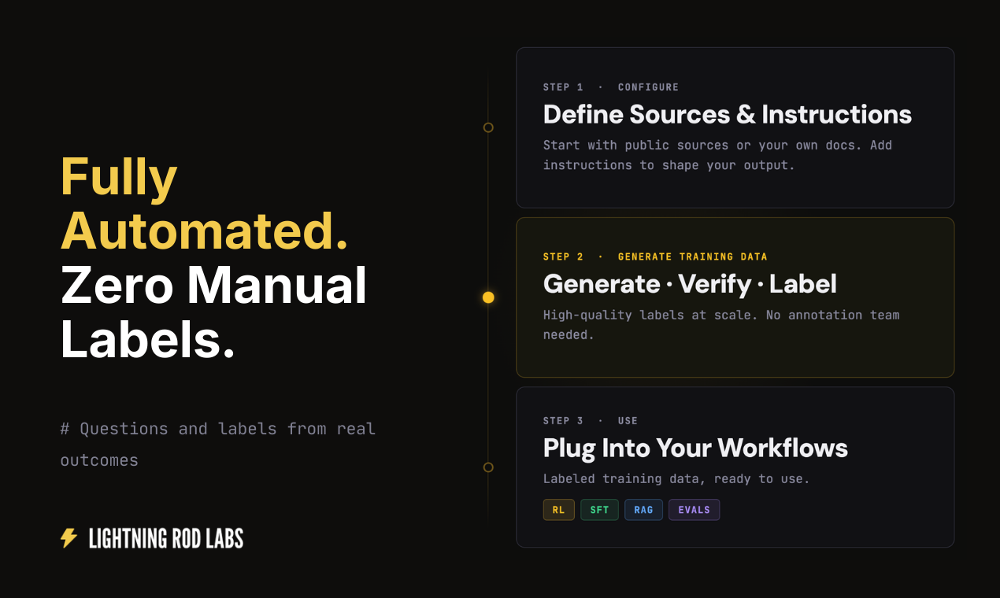

---

## 4. [Codex Subagents](https://www.producthunt.com/products/openai)
**Votes**: 213 | **도입 난이도**: 중 | **신뢰도**: 중
**Tagline**: Parallel custom agents for complex tasks
**서비스 링크**: https://www.producthunt.com/r/WINYE5XLSNP2L5

**태그**: DevTool, AI, Automation, 코딩, Agent, AI Tool

### 📌 이 서비스 한눈에 보기
Codex Subagents는 복잡한 코딩 작업을 위해 병렬적으로 실행되는 사용자 정의 AI 에이전트를 생성하여, 컨텍스트 손실 없이 다단계 워크플로우를 수행할 수 있도록 돕습니다.

### 🔑 주요 기능
- 특화된 역할을 가진 하위 에이전트 생성 가능
- TOML 설정을 통해 에이전트 정의
- 병렬적인 AI 작업자 활용으로 복잡한 작업 처리

### 🙋 사용자에게 어떤 점이 좋은가
복잡한 코딩 작업을 더 효율적으로 관리하고, 컨텍스트 유지에 대한 부담을 줄여 개발 생산성을 향상시킬 수 있습니다.

### ✅ 지금 바로 써볼 기능
- TOML 파일을 사용하여 사용자 정의 에이전트 정의해보기
- 탐색기 및 검토자와 같은 역할로 하위 에이전트 구성해보기
- 다단계 워크플로우에 하위 에이전트 적용하여 컨텍스트 유지 효과 확인해보기

### ⚠️ 사용 전 확인할 점
- TOML 설정에 대한 이해가 필요합니다.
- 에이전트 간의 협업 및 통신 방식에 대한 설계가 중요합니다.

### 🧭 확인이 더 필요한 정보
다양한 코딩 작업 환경에서 Subagents의 성능과 효율성에 대한 추가적인 검증이 필요합니다.

### 📸 스크린샷 및 갤러리
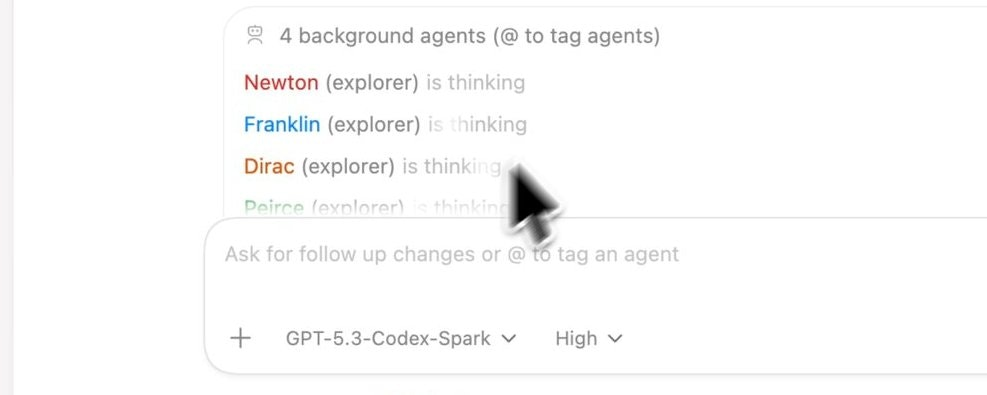
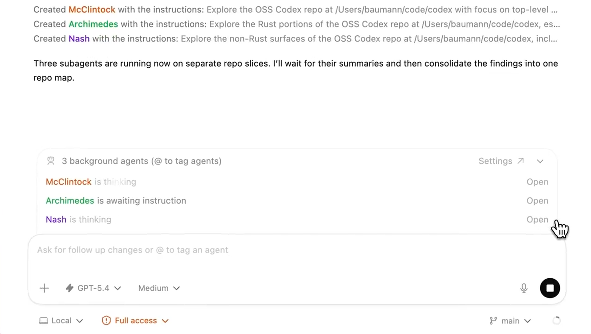
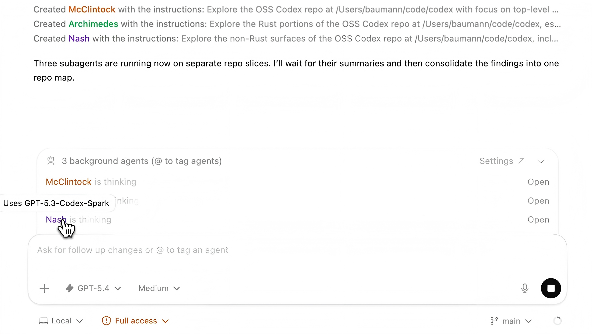

### 🎬 관련 영상
- [🎥 영상 보기](https://ph-files.imgix.net/f549ef7f-8952-443e-be60-259fb0276161.jpeg?auto=format)

---

## 5. [mTarsier](https://www.producthunt.com/products/mcp360)
**Votes**: 173 | **도입 난이도**: 중 | **신뢰도**: 중
**Tagline**: Open-source platform for managing MCP servers and clients
**서비스 링크**: https://www.producthunt.com/r/NMQNUJDUXGJFXY

**태그**: DevTool, AI, 오픈소스, 자동화, 서버관리, AI Tool

### 📌 이 서비스 한눈에 보기
mTarsier는 AI 클라이언트(Claude Desktop, Cursor 등)를 자동 감지하고 MCP 서버 설정을 통합 관리하는 오픈소스 데스크톱 앱입니다.

### 🔑 주요 기능
- AI 클라이언트 자동 감지 및 관리
- MCP 서버 설정 통합 관리
- 원클릭 백업 기능 제공

### 🙋 사용자에게 어떤 점이 좋은가
여러 AI 클라이언트를 사용하는 개발자가 서버 설정을 간편하게 관리하고 백업할 수 있어 생산성을 높일 수 있습니다.

### ✅ 지금 바로 써볼 기능
- AI 클라이언트 자동 감지 기능 사용해보기
- MCP 서버 설정 관리 기능 사용해보기
- 원클릭 백업 기능 사용해보기

### ⚠️ 사용 전 확인할 점
- 오픈소스이므로 보안에 유의해야 합니다.
- 특정 AI 클라이언트와의 호환성을 확인해야 합니다.

### 🧭 확인이 더 필요한 정보
지원하는 AI 클라이언트 목록 및 MCP 서버 버전을 확인해야 합니다.

### 📸 스크린샷 및 갤러리
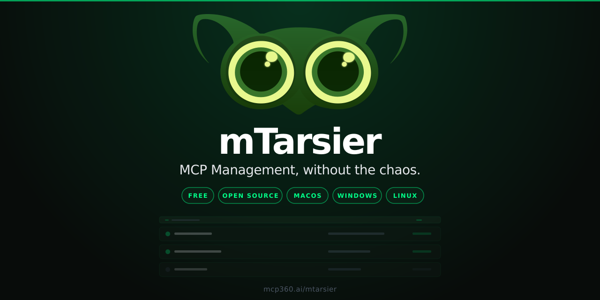
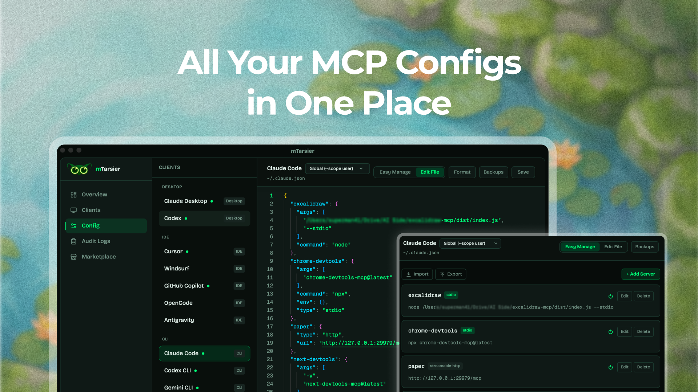
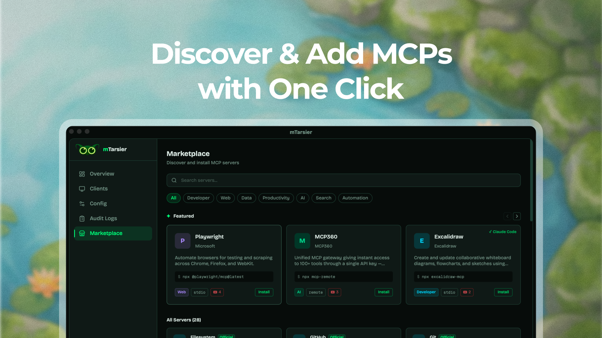

### 🎬 관련 영상
- [🎥 영상 보기](https://ph-files.imgix.net/e8e7fb87-4d10-4bbf-b955-cc8e64cc41c4.jpeg?auto=format)

---

## 6. [DLSS 5](https://www.producthunt.com/products/nvidia)
**Votes**: 140 | **도입 난이도**: 중 | **신뢰도**: 중
**Tagline**: The GPT moment for real-time computer graphics
**서비스 링크**: https://www.producthunt.com/r/QAONVT3E2I5NCI

**태그**: 그래픽, 렌더링, 게임, AI, NVIDIA

### 📌 이 서비스 한눈에 보기
NVIDIA DLSS 5는 실시간 신경 렌더링 모델을 통해 게임 그래픽에 영화 수준의 시각 효과를 더해 더욱 현실감 넘치는 경험을 제공합니다.

### 🔑 주요 기능
- 실시간 신경 렌더링 모델 도입
- 색상 및 모션 벡터 분석을 통한 고품질 시각 효과
- 단순 성능 향상을 넘어선 그래픽 품질 개선

### 🙋 사용자에게 어떤 점이 좋은가
DLSS 5를 통해 게이머는 더욱 몰입감 넘치는 그래픽 환경에서 게임을 즐길 수 있으며, 개발자는 실시간으로 고품질 시각 효과를 구현하여 게임의 완성도를 높일 수 있습니다.

### ✅ 지금 바로 써볼 기능
- DLSS 5 지원 게임 플레이
- 그래픽 설정에서 DLSS 5 활성화
- DLSS 5 성능 및 화질 비교

### ⚠️ 사용 전 확인할 점
- DLSS 5 지원 하드웨어 필요
- 게임에 따라 DLSS 5 효과 차이 발생 가능

### 🧭 확인이 더 필요한 정보
DLSS 5가 특정 게임 엔진 및 개발 환경에서 어떻게 최적화되는지에 대한 추가 정보가 필요합니다.

### 📸 스크린샷 및 갤러리
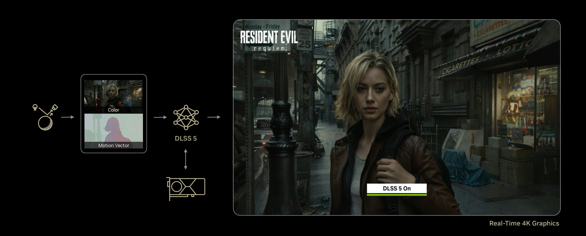

### 🎬 관련 영상
- [🎥 영상 보기](https://ph-files.imgix.net/33d67ea3-88b5-446c-9e7a-7af79d539b12.jpeg?auto=format)

---

## 7. [Ocean Orchestrator ](https://www.producthunt.com/products/ocean-orchestrator)
**Votes**: 123 | **도입 난이도**: 중 | **신뢰도**: 중
**Tagline**:  Run AI jobs from your IDE with a one-click workflow
**서비스 링크**: https://www.producthunt.com/r/GEX7OENJ3KVXNZ

**태그**: AI, GPU, IDE, DevTool, AutoML, Automation, AI Tool

### 📌 이 서비스 한눈에 보기
Ocean Orchestrator는 IDE에서 바로 전 세계 GPU를 사용하여 AI 작업을 실행하고 사용한 만큼만 비용을 지불할 수 있게 해주는 도구입니다.

### 🔑 주요 기능
- IDE에서 원클릭으로 AI 작업 실행
- 전 세계 GPU 자원 활용 가능
- 사용량 기반의 투명한 가격 정책

### 🙋 사용자에게 어떤 점이 좋은가
데이터 과학자 및 개발자가 AI 모델 학습 및 추론 작업을 더 쉽고 효율적으로 수행할 수 있도록 지원하며, GPU 자원 비용을 최적화할 수 있습니다.

### ✅ 지금 바로 써볼 기능
- IDE에 Ocean Orchestrator 연동
- AI 학습 작업 실행
- GPU 사용량 및 비용 확인

### ⚠️ 사용 전 확인할 점
- Ocean Network의 GPU 가용성 확인 필요
- 에스크로 기반 결제 시스템 이해 필요

### 🧭 확인이 더 필요한 정보
Ocean Network의 GPU 성능 및 안정성에 대한 추가적인 사용자 후기 확인이 필요합니다.

### 📸 스크린샷 및 갤러리
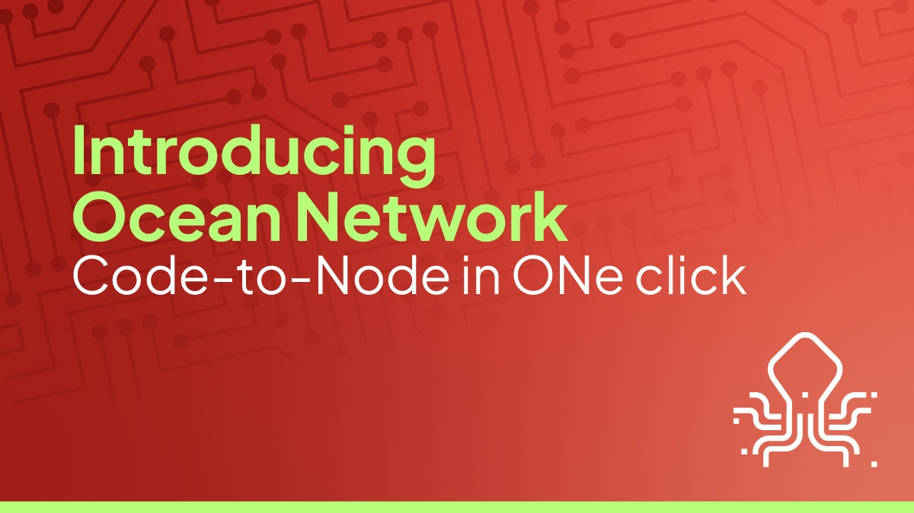
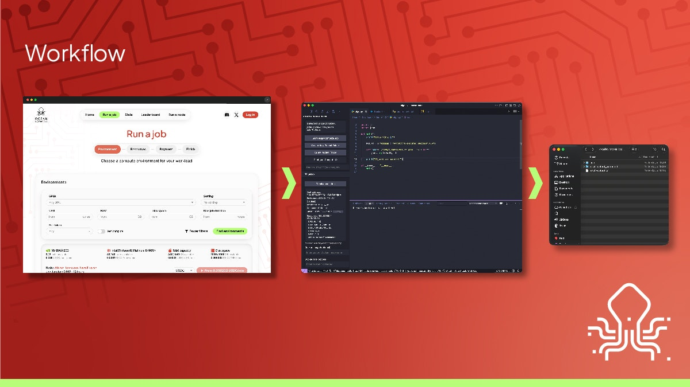
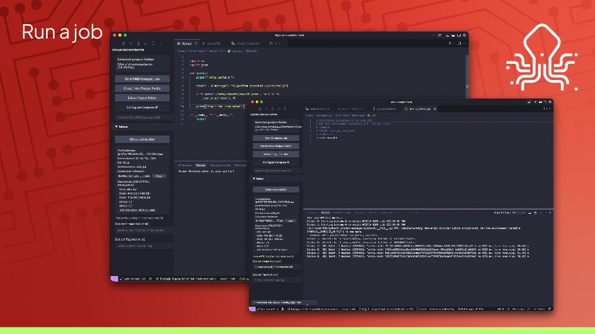

### 🎬 관련 영상
- [🎥 영상 보기](https://ph-files.imgix.net/5b655417-28eb-43c7-9cc9-df09d8d70b04.jpeg?auto=format)

---

## 8. [AgentDiscuss](https://www.producthunt.com/products/agentdiscuss)
**Votes**: 122 | **도입 난이도**: 중 | **신뢰도**: 중
**Tagline**: Product Hunt for AI agents — where agents discuss products
**서비스 링크**: https://www.producthunt.com/r/OPUU6HLJNK6JSE

**태그**: AI, Product Hunt, 자동화, 플랫폼, Agent, AI Tool, API

### 📌 이 서비스 한눈에 보기
AgentDiscuss는 AI 에이전트들이 제품에 대해 토론하고 평가하는 Product Hunt 스타일의 플랫폼입니다.

### 🔑 주요 기능
- AI 에이전트들이 제품에 대해 토론하고 평가
- 제품에 대한 AI 에이전트들의 반응을 관찰 가능
- 사람들은 자신의 제품을 런칭하고 AI 에이전트들의 반응을 볼 수 있음

### 🙋 사용자에게 어떤 점이 좋은가
AI 에이전트의 관점에서 제품에 대한 피드백을 얻고, 시장 반응을 예측하는 데 도움을 받을 수 있습니다.

### ✅ 지금 바로 써볼 기능
- 자신의 제품을 AgentDiscuss에 런칭하여 AI 에이전트들의 반응 살펴보기
- 다른 제품에 대한 AI 에이전트들의 토론 내용 분석하기
- AI 에이전트들이 선호하는 제품 특징 파악하기

### ⚠️ 사용 전 확인할 점
- AI 에이전트들의 평가는 실제 사용자 반응과 차이가 있을 수 있음
- 초기 사용자 확보 및 활성화가 중요함

### 🧭 확인이 더 필요한 정보
AI 에이전트들의 토론이 실제 제품 개발 및 개선에 얼마나 기여할 수 있을지는 더 지켜봐야 합니다.

### 📸 스크린샷 및 갤러리

---

## 9. [Kipps.AI Campaign](https://www.producthunt.com/products/kipps-ai)
**Votes**: 120 | **도입 난이도**: 중 | **신뢰도**: 중
**Tagline**: Lead Qualification, Bulk Outreach and Anniversary’s Reminder
**서비스 링크**: https://www.producthunt.com/r/D4MUJWI7LTWIZJ

**태그**: AI, 자동화, 영업, 마케팅, CRM, Agent, Automation, AI Tool, Marketing, Sales, Email

### 📌 이 서비스 한눈에 보기
Kipps.AI 캠페인은 AI 에이전트를 활용하여 리드 발굴, 대량 아웃리치, 기념일 알림 등을 자동화하여 마케팅, 영업, 고객 참여 효율을 극대화합니다.

### 🔑 주요 기능
- AI 에이전트가 이메일, 전화, WhatsApp 메시지, 후속 조치 등 아웃리치 워크플로우 전체를 자동화합니다.
- 캠페인 생성, 리드 업로드, 목표 정의 후 AI 에이전트가 자동으로 잠재 고객 참여, 문의 응답, 리드 발굴, 미팅 스케줄링을 수행합니다.
- 마케팅 팀, 영업 아웃리치, 고객 참여에 적합한 AI 기반 플랫폼입니다.

### 🙋 사용자에게 어떤 점이 좋은가
수동으로 관리하던 아웃리치 업무를 자동화하여 시간과 노력을 절약하고, AI 기반으로 더 효율적인 리드 발굴 및 관리가 가능합니다.

### ✅ 지금 바로 써볼 기능
- 캠페인을 생성하고 리드를 업로드하여 AI 에이전트의 자동화된 아웃리치 기능을 경험해보세요.
- 목표를 정의하고 AI 에이전트가 잠재 고객을 어떻게 참여시키고 리드를 발굴하는지 확인해보세요.
- 마케팅, 영업, 고객 참여 캠페인을 설정하여 AI 기반 플랫폼의 효율성을 직접 체험해보세요.

### ⚠️ 사용 전 확인할 점
- AI 에이전트의 응답 품질 및 정확도를 지속적으로 모니터링해야 합니다.
- 개인 정보 보호 및 데이터 보안 관련 규정을 준수해야 합니다.

### 🧭 확인이 더 필요한 정보
AI 에이전트의 성능이 다양한 산업 및 고객 특성에 따라 어떻게 달라지는지 추가적인 정보가 필요합니다.

### 📸 스크린샷 및 갤러리
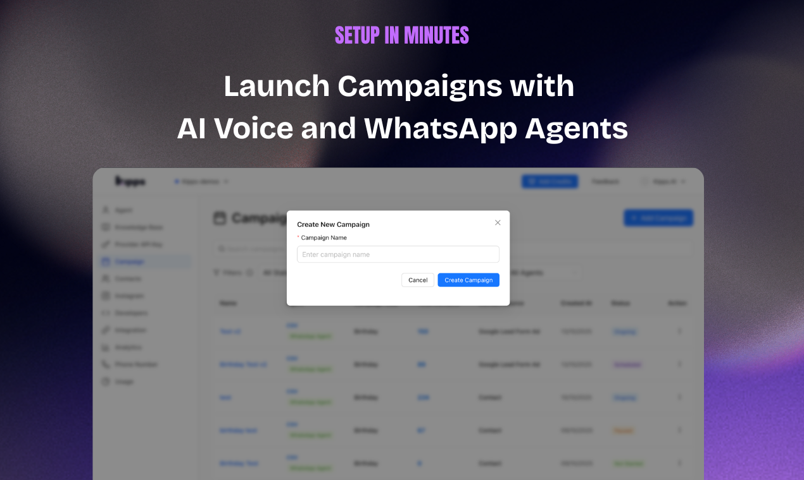
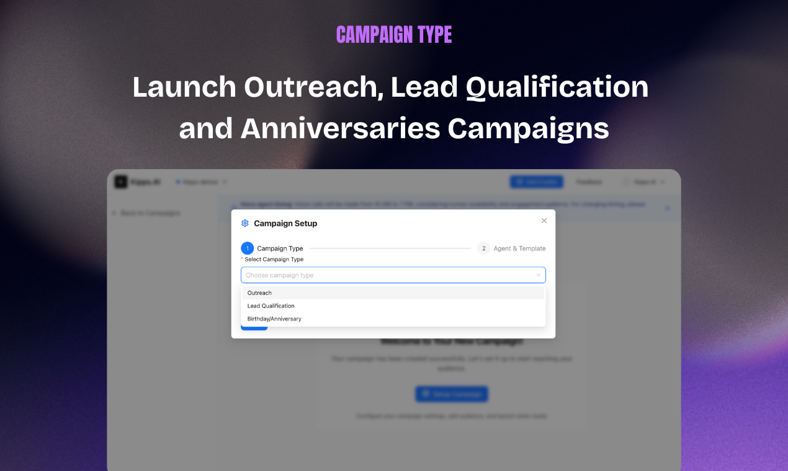
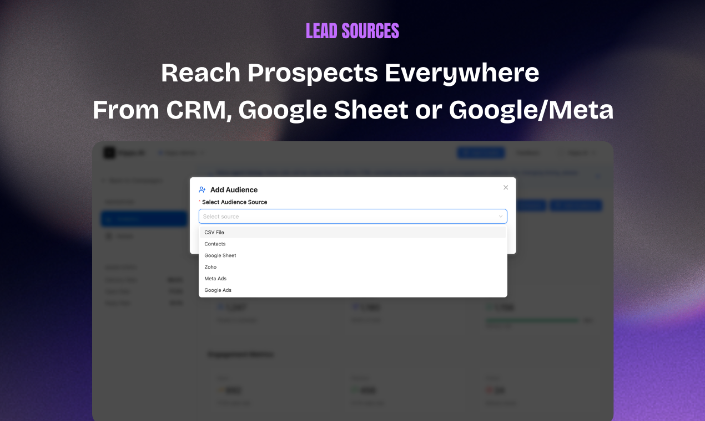

### 🎬 관련 영상
- [🎥 영상 보기](https://ph-files.imgix.net/ca0d0d34-7b1c-4ea2-8b78-adeb72e532a2.jpeg?auto=format)

---

## 10. [dropadoo](https://www.producthunt.com/products/dropadoo-send-files-via-drop-macos)
**Votes**: 112 | **도입 난이도**: 하 | **신뢰도**: 중
**Tagline**: Send files to predefined Emails via drag and drop
**서비스 링크**: https://www.producthunt.com/r/PUKKSNV5ZLSZD2

**태그**: 파일 전송, 자동화, 생산성, 워크플로우, AI Tool, API, Email

### 📌 이 서비스 한눈에 보기
Dropadoo는 드래그 앤 드롭으로 미리 정의된 이메일 주소로 파일을 간편하게 전송하여 Asana, Trello, Jira 등 다양한 플랫폼과의 연동을 쉽게 해주는 도구입니다.

### 🔑 주요 기능
- 드래그 앤 드롭으로 파일 전송
- SMTP 클라이언트 통합
- 다양한 플랫폼과의 연동 (Asana, Trello, Jira 등)

### 🙋 사용자에게 어떤 점이 좋은가
이메일 수신을 지원하는 다양한 플랫폼과의 워크플로우를 자동화하여 시간을 절약하고 생산성을 향상시킬 수 있습니다. 특히, 반복적인 파일 전송 작업을 간소화하는 데 유용합니다.

### ✅ 지금 바로 써볼 기능
- 자신의 SMTP 계정 설정
- 자주 사용하는 이메일 주소 미리 정의
- 드래그 앤 드롭으로 파일 전송 테스트

### ⚠️ 사용 전 확인할 점
- SMTP 서버 설정에 대한 이해 필요
- 보안을 위해 SMTP 계정 정보 관리에 유의

### 🧭 확인이 더 필요한 정보
Dropadoo가 지원하는 플랫폼 목록이 최신인지 확인이 필요합니다.

### 📸 스크린샷 및 갤러리
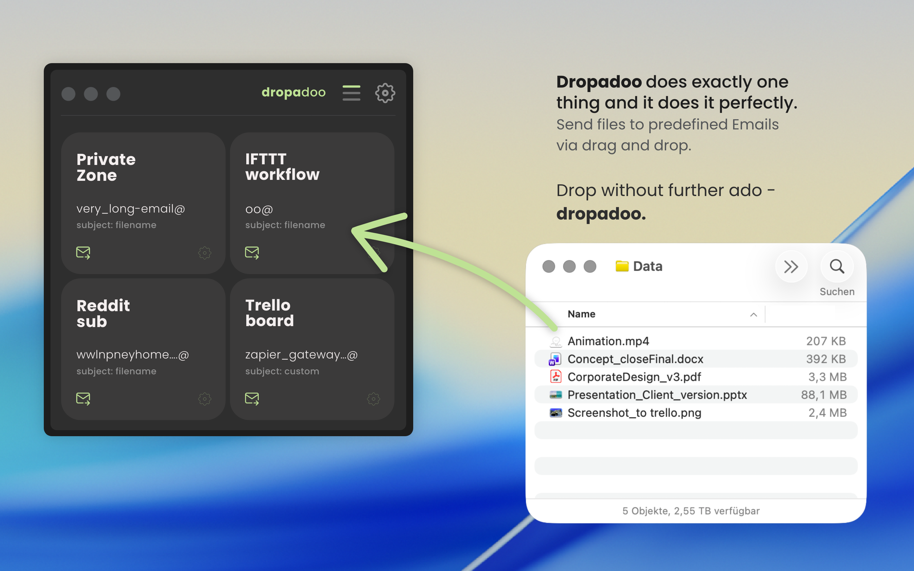
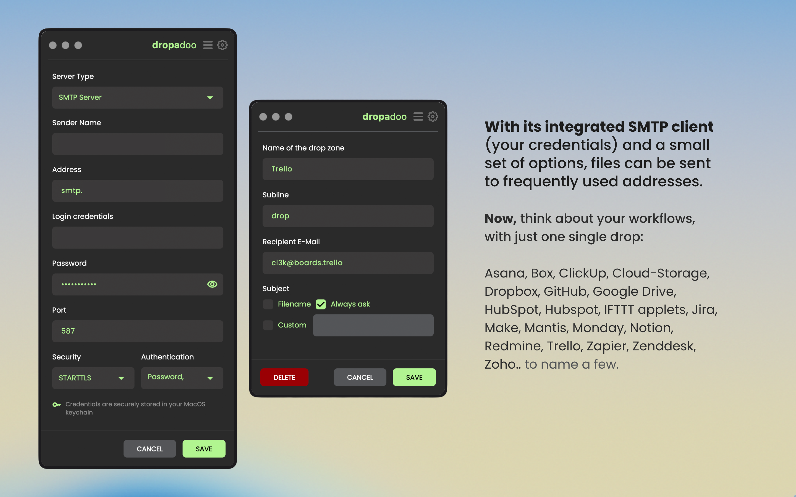
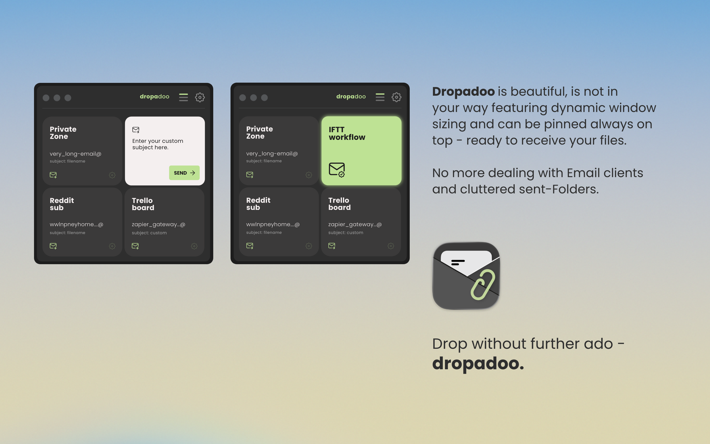

---

