# 🚀 Product Hunt Daily Top 10 (2026-03-19)

## 1. [Claude Dispatch](https://www.producthunt.com/products/claude)
**Votes**: 387 | **도입 난이도**: 중 | **신뢰도**: 중
**Tagline**: Text Claude from your phone using “Dispatch”
**서비스 링크**: https://www.producthunt.com/r/TMUX57AWSXO26K

**태그**: AI, 생산성, 자동화, 모바일

### 📌 이 서비스 한눈에 보기
Claude Dispatch를 통해 휴대폰에서 Claude를 사용하여 파일 관리, 보고서 작성, 작업 실행 등 다양한 기능을 로컬 환경에서 안전하게 사용할 수 있습니다.

### 🔑 주요 기능
- 데스크탑 기반으로 휴대폰에서 Claude 사용 가능
- 파일 접근, 브라우징, 보고서 작성, 작업 실행 등 다양한 기능 지원
- 샌드박스 환경에서 로컬로 실행되어 안전하고, 사용자의 승인 후 작업 실행

### 🙋 사용자에게 어떤 점이 좋은가
이 앱을 통해 사용자는 휴대폰에서 Claude의 강력한 기능을 활용하여 업무 효율성을 높이고, 데스크탑 환경에 구애받지 않고 편리하게 작업을 수행할 수 있습니다.

### ✅ 지금 바로 써볼 기능
- 휴대폰에서 Claude Dispatch를 설치하고 데스크탑과 연동하여 사용해보기
- 파일 접근 권한 설정 및 샌드박스 환경 설정 확인하기
- 보고서 작성 기능 및 작업 실행 기능 테스트해보기

### ⚠️ 사용 전 확인할 점
- 데스크탑 환경에 의존적이며, 데스크탑이 켜져 있어야 사용 가능
- 샌드박스 환경의 보안 설정 및 파일 접근 권한 설정을 신중하게 설정해야 함

### 🧭 확인이 더 필요한 정보
Claude Dispatch의 성능 및 안정성에 대한 사용자 리뷰 및 평가 정보가 부족합니다.

### 📸 스크린샷 및 갤러리
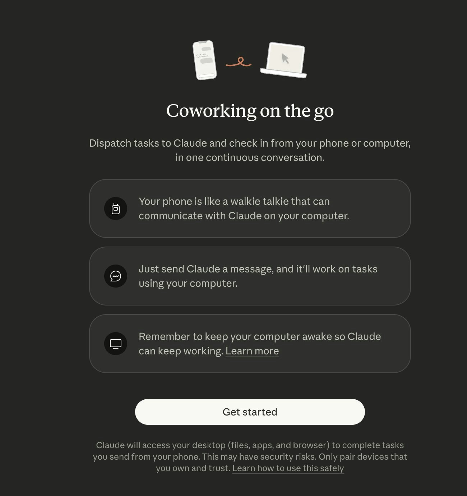
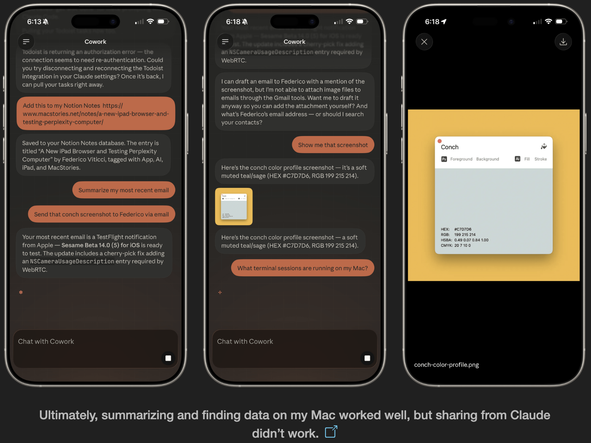
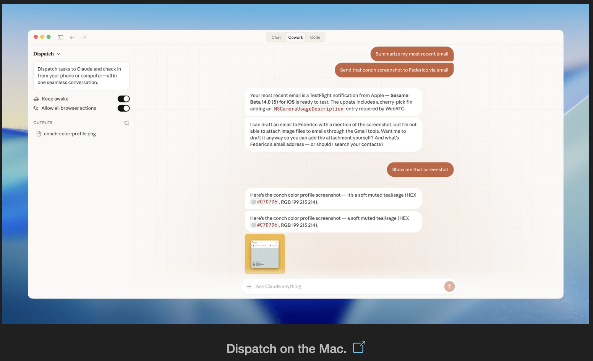

### 🎬 관련 영상
- [🎥 영상 보기](https://ph-files.imgix.net/bfa2f664-8820-4237-b04a-ffb1e4e4be07.jpeg?auto=format)

---

## 2. [Lightfield](https://www.producthunt.com/products/lightfield)
**Votes**: 326 | **도입 난이도**: 중 | **신뢰도**: 중
**Tagline**: AI-native CRM that builds itself and does work for you
**서비스 링크**: https://www.producthunt.com/r/5XYMLXOKBCUN76

**태그**: CRM, AI, 자동화, 영업, 생산성, AI Tool, Email

### 📌 이 서비스 한눈에 보기
Lightfield는 AI 기반 CRM으로, 이메일, 미팅, 통화 내용을 자동으로 분석하여 CRM을 구축하고, 사용자를 대신해 다양한 작업을 수행하여 영업 생산성을 향상시켜 줍니다.

### 🔑 주요 기능
- 수동 데이터 입력 없이 자동으로 CRM 구축
- 자연어 질문을 통해 필요한 정보 즉시 획득
- 후속 조치, 제안서 작성 등 다양한 작업 자동화

### 🙋 사용자에게 어떤 점이 좋은가
영업 담당자는 데이터 입력 시간을 절약하고, 고객과의 관계 개선 및 영업 전략 수립에 집중할 수 있습니다. 또한, AI 기반 분석을 통해 데이터 기반 의사 결정을 내릴 수 있습니다.

### ✅ 지금 바로 써볼 기능
- 인박스 연결하여 CRM 자동 구축
- 자연어로 필요한 정보 질문해보기
- 후속 조치 자동화 기능 사용해보기

### ⚠️ 사용 전 확인할 점
- 개인 정보 보호 정책 및 데이터 보안 확인 필요
- AI 분석 정확도에 대한 검증 필요

### 🧭 확인이 더 필요한 정보
Lightfield의 AI 분석 정확도 및 지원하는 CRM 기능 범위에 대한 추가 정보 확인이 필요합니다.

### 📸 스크린샷 및 갤러리
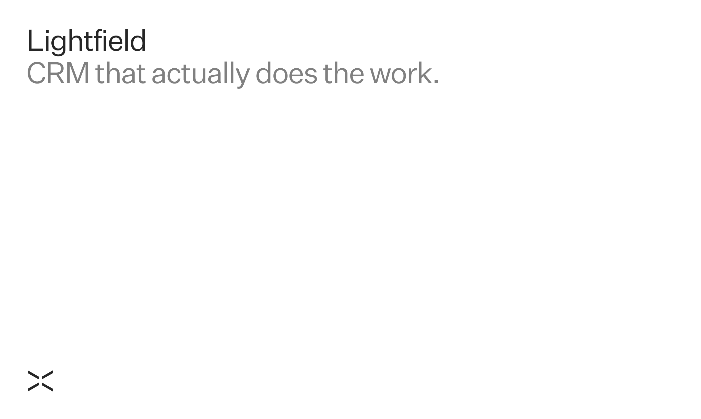
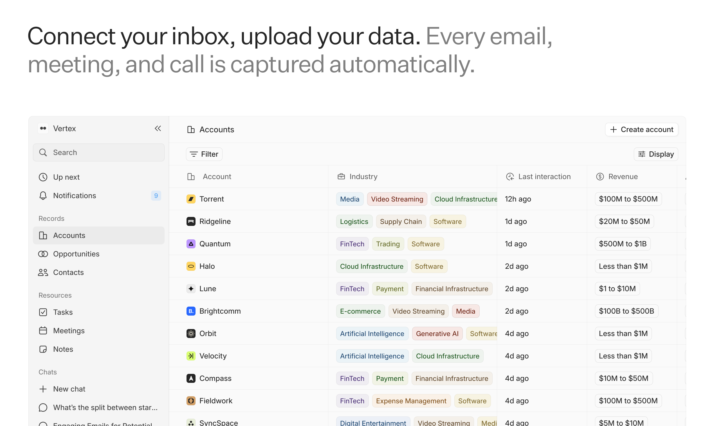
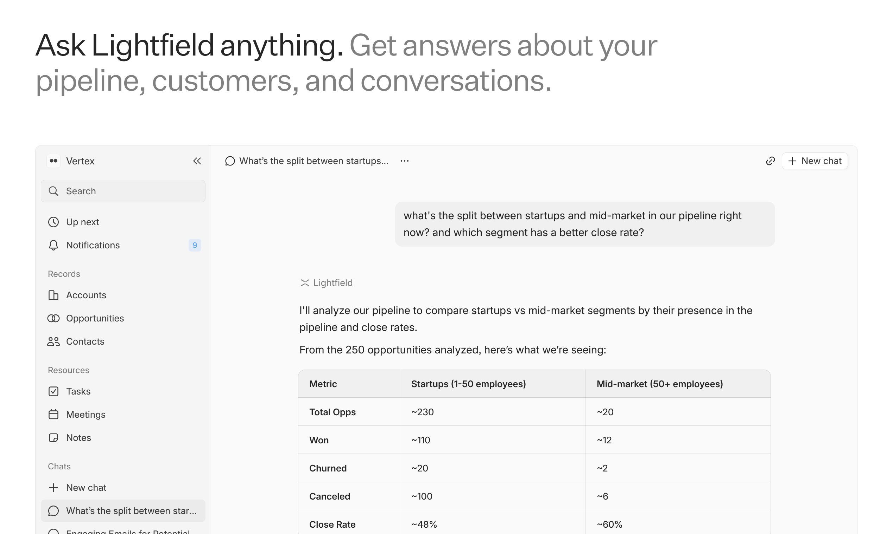

### 🎬 관련 영상
- [🎥 영상 보기](https://ph-files.imgix.net/c9c9f927-5573-46f4-817d-10e96d69ad44.jpeg?auto=format)

---

## 3. [Genie by Databox](https://www.producthunt.com/products/databox)
**Votes**: 259 | **도입 난이도**: 중 | **신뢰도**: 중
**Tagline**: Your AI analyst for business performance
**서비스 링크**: https://www.producthunt.com/r/R4XRSTSGW67YUH

**태그**: AI, 분석, 데이터 분석, 비즈니스 인텔리전스, AI Tool

### 📌 이 서비스 한눈에 보기
Genie는 Databox에 내장된 AI 분석가로, 비즈니스 성과에 대한 질문에 즉각적인 인사이트를 제공하여 팀이 결과를 이끄는 요인을 빠르게 파악하고 조치를 취할 수 있도록 돕습니다.

### 🔑 주요 기능
- AI 기반 데이터 분석
- 비즈니스 성과 질문에 대한 즉각적인 답변
- 데이터 기반 의사 결정 지원

### 🙋 사용자에게 어떤 점이 좋은가
Genie를 통해 데이터 분석 시간을 절약하고, 비즈니스 성과에 대한 더 깊은 이해를 얻어 더 나은 의사 결정을 내릴 수 있습니다.

### ✅ 지금 바로 써볼 기능
- 비즈니스 성과 관련 질문 던져보기
- AI가 제공하는 인사이트 기반으로 액션 아이템 정의하기
- 팀원들과 데이터 기반 의사결정 프로세스 도입 논의하기

### ⚠️ 사용 전 확인할 점
- Databox에 데이터 연동 필요
- AI 분석의 정확도는 데이터 품질에 따라 달라질 수 있음

### 🧭 확인이 더 필요한 정보
Genie의 분석 정확도 및 지원하는 데이터 소스 범위에 대한 추가 정보 확인이 필요합니다.

### 📸 스크린샷 및 갤러리
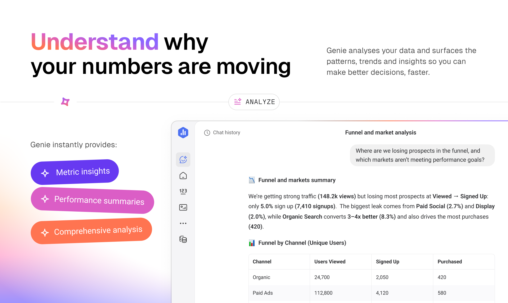
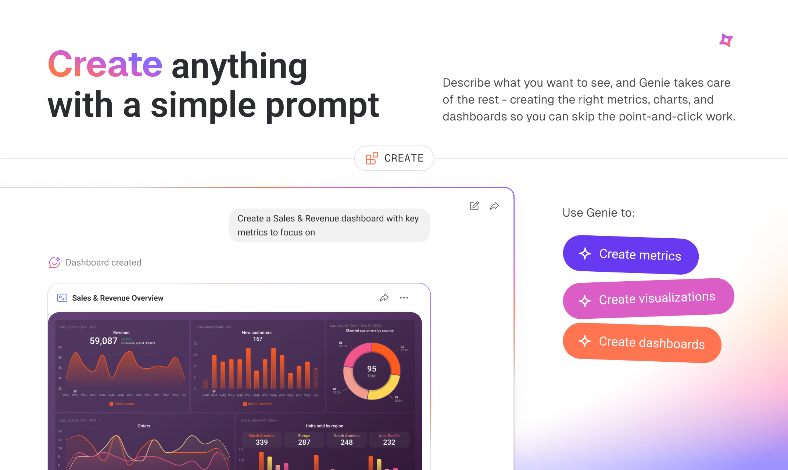
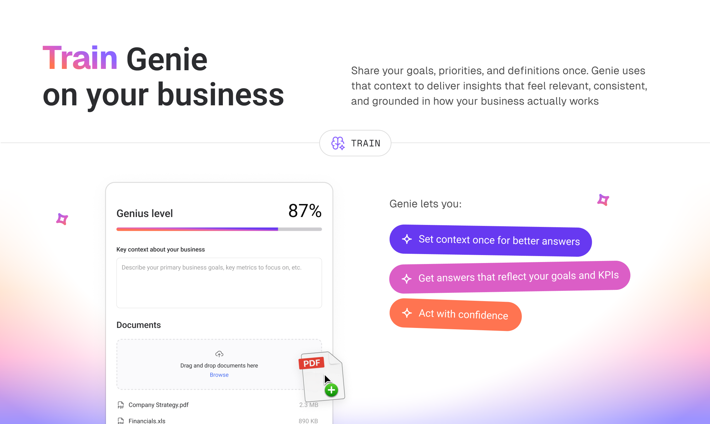

### 🎬 관련 영상
- [🎥 영상 보기](https://ph-files.imgix.net/66b2dbae-819c-4952-ad2a-73173149a1bd.jpeg?auto=format)

---

## 4. [GPT‑5.4 mini and nano](https://www.producthunt.com/products/openai)
**Votes**: 214 | **도입 난이도**: 중 | **신뢰도**: 중
**Tagline**: Fast and efficient models optimized for coding and subagents
**서비스 링크**: https://www.producthunt.com/r/CKXMQ7IWZI72H6

**태그**: DevTool, 코딩, 자동화, AI, Agent, Automation, AI Tool, Chat, Design, API

### 📌 이 서비스 한눈에 보기
GPT-5.4는 빠른 속도와 효율성을 갖춘 코딩 및 서브 에이전트 최적화 모델로, ChatGPT, API, Codex에서 바로 사용할 수 있습니다.

### 🔑 주요 기능
- GPT-5.4 mini는 2배 더 빠르고, nano는 가장 저렴한 비용으로 사용 가능
- 코딩, 서브 에이전트, 멀티모달 작업에 적합
- 컴퓨터 사용, 웹 검색, 대규모 컨텍스트 지원

### 🙋 사용자에게 어떤 점이 좋은가
실제 환경에서 대규모 실행에 적합하며, 응답성이 뛰어난 AI 시스템을 구축할 수 있습니다. 특히 코딩 작업 효율성을 높일 수 있습니다.

### ✅ 지금 바로 써볼 기능
- ChatGPT에서 GPT-5.4 사용해보기
- API를 통해 코딩 작업에 통합해보기
- Codex에서 활용해보기

### ⚠️ 사용 전 확인할 점
- 대규모 컨텍스트 처리 시 성능 확인 필요
- API 사용량에 따른 비용 확인 필요

### 🧭 확인이 더 필요한 정보
GPT-5.4 mini 및 nano 모델의 구체적인 성능 벤치마크 정보는 추가 확인이 필요합니다.

### 📸 스크린샷 및 갤러리
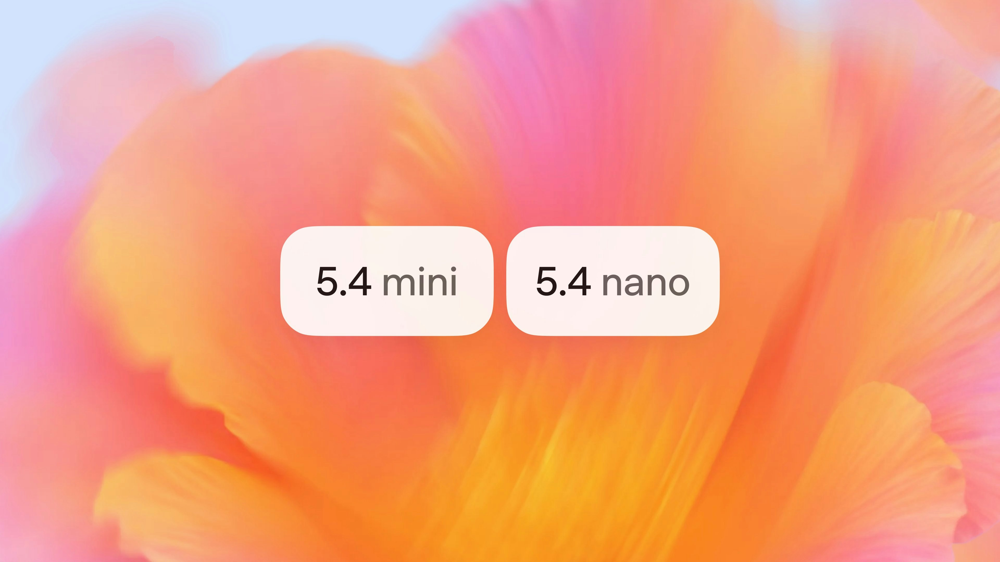
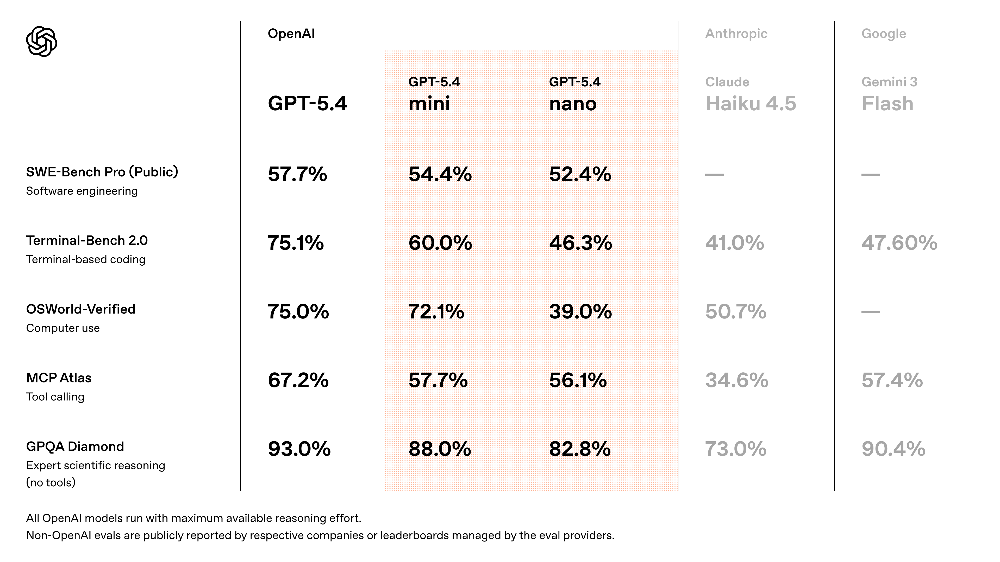
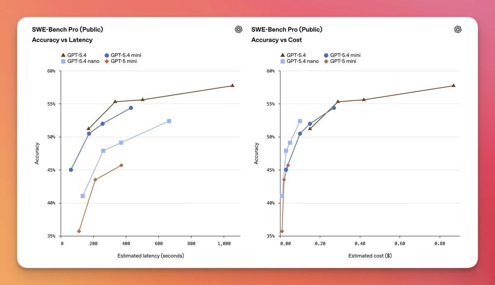

### 🎬 관련 영상
- [🎥 영상 보기](https://ph-files.imgix.net/42a7a545-30b2-4f30-bcdc-b644c7cc9ff0.jpeg?auto=format)

---

## 5. [OpenObserve](https://www.producthunt.com/products/openobserve)
**Votes**: 205 | **도입 난이도**: 중 | **신뢰도**: 중
**Tagline**: AI-native, open-source Datadog alternative
**서비스 링크**: https://www.producthunt.com/r/6OIZ7PEM5V7NQ4

**태그**: DevTool, Observability, Open Source, Monitoring, Analytics, AI Tool

### 📌 이 서비스 한눈에 보기
OpenObserve는 Datadog의 오픈 소스 대안으로, AI 기반의 빠른 속도, 확장성, 비용 효율성을 제공하는 관측 플랫폼입니다.

### 🔑 주요 기능
- ElasticSearch 대비 140배 낮은 스토리지 비용
- 로그, 메트릭, 트레이스 모니터링 지원
- 2분 내에 빠른 시작 가능

### 🙋 사용자에게 어떤 점이 좋은가
기존 솔루션 대비 비용을 절감하면서도 강력한 관측 기능을 활용하여 시스템을 효율적으로 관리할 수 있습니다.

### ✅ 지금 바로 써볼 기능
- 로그 데이터 수집 및 분석 설정
- 메트릭 대시보드 구성
- 트레이싱 데이터 연동

### ⚠️ 사용 전 확인할 점
- 오픈 소스 솔루션 운영 및 관리 필요
- 새로운 플랫폼 학습 곡선 존재

### 🧭 확인이 더 필요한 정보
AI 기반 기능의 구체적인 성능 및 활용 사례에 대한 추가 정보가 필요합니다.

### 📸 스크린샷 및 갤러리
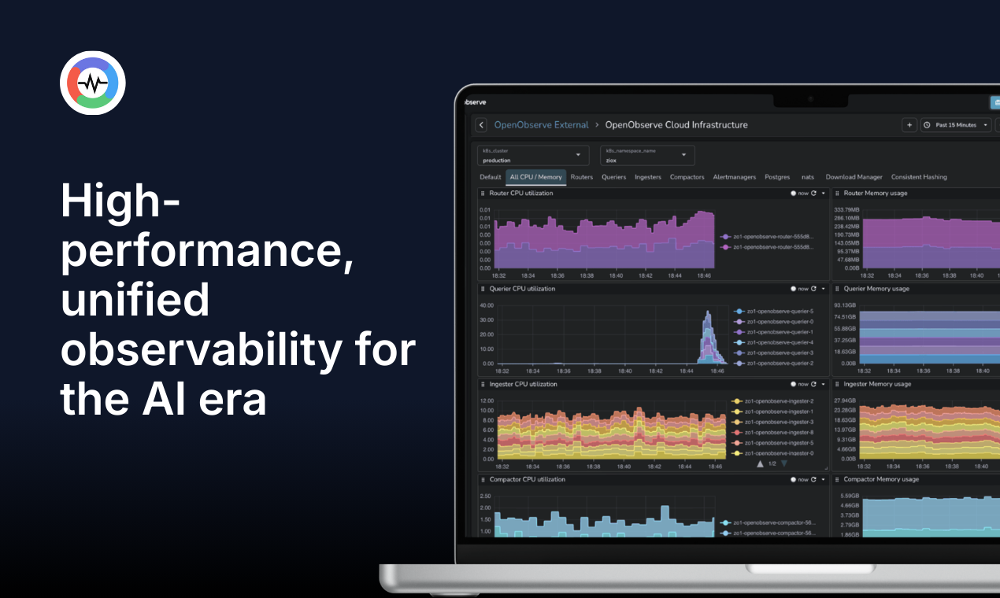
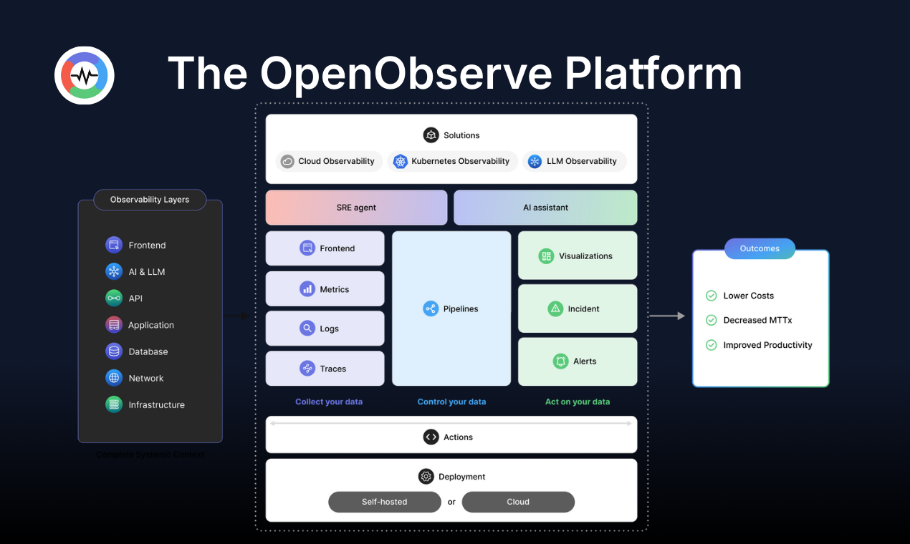
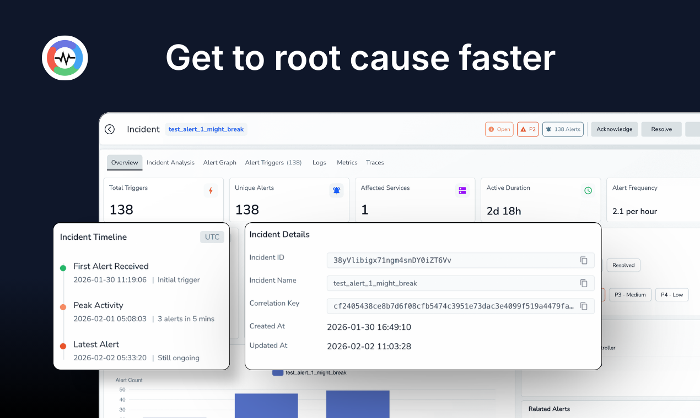

### 🎬 관련 영상
- [🎥 영상 보기](https://ph-files.imgix.net/d52ab976-8f9a-43e9-a5d8-c23210d63d33.jpeg?auto=format)

---

## 6. [Banyan AI Lite](https://www.producthunt.com/products/banyan-ai-lite)
**Votes**: 187 | **도입 난이도**: 중 | **신뢰도**: 중
**Tagline**: AI detecting & preventing SaaS churn
**서비스 링크**: https://www.producthunt.com/r/6VZOMHYDICLHO5

**태그**: AI, SaaS, 고객 이탈 방지, 데이터 분석, 자동화, AI Tool, CRM

### 📌 이 서비스 한눈에 보기
Banyan AI Lite는 SaaS 기업의 가장 큰 문제인 고객 이탈을 예측하고 방지하여 수익을 보호하는 AI 기반 솔루션입니다.

### 🔑 주요 기능
- CRM, 결제, 고객 지원, 제품 사용 데이터 통합
- 고객 이탈 위험 및 확장 기회 식별
- 빠른 설정 및 측정 가능한 결과 제공

### 🙋 사용자에게 어떤 점이 좋은가
Banyan AI Lite를 통해 SaaS 기업은 고객 이탈을 사전에 방지하고, 매출 감소를 막을 수 있습니다. 또한, 고객 데이터를 기반으로 확장 기회를 포착하여 추가 수익을 창출할 수 있습니다.

### ✅ 지금 바로 써볼 기능
- 데이터 소스 연결 (CRM, 결제 시스템 등)
- 이탈 위험 고객군 확인
- 확장 기회 고객군 확인

### ⚠️ 사용 전 확인할 점
- 정확한 예측을 위해서는 충분한 양의 데이터 필요
- 데이터 통합 과정에서 개인 정보 보호 및 보안 고려

### 🧭 확인이 더 필요한 정보
Banyan AI Lite의 예측 정확도는 데이터 품질 및 통합 수준에 따라 달라질 수 있습니다.

### 📸 스크린샷 및 갤러리
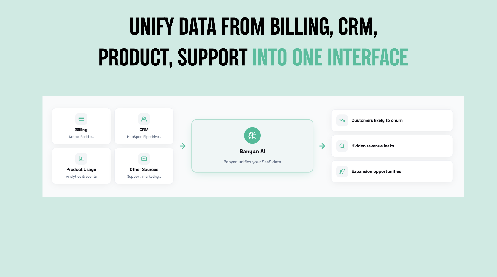
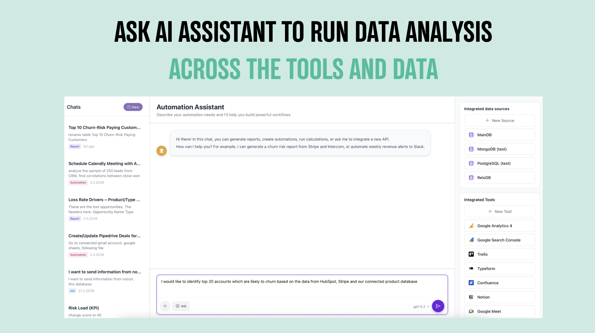
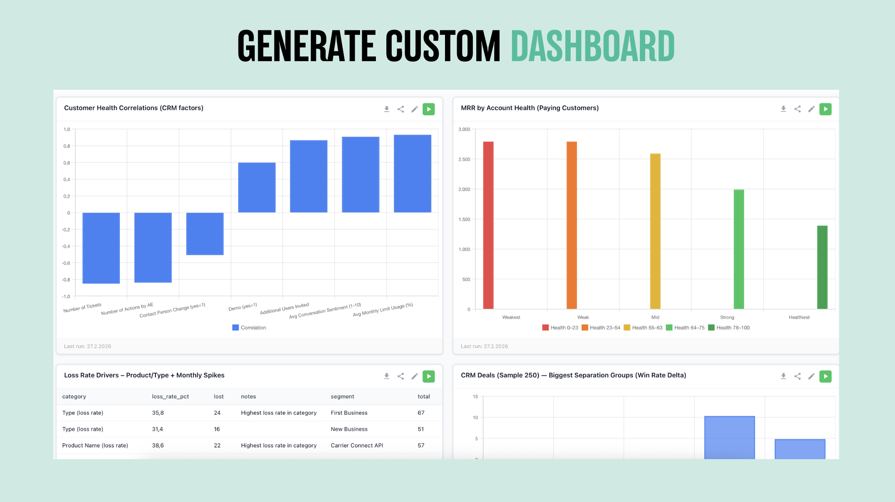

### 🎬 관련 영상
- [🎥 영상 보기](https://ph-files.imgix.net/49a49287-c0b9-45d3-9f9d-59b2d13f9be6.jpeg?auto=format)

---

## 7. [Permit.io MCP Gateway](https://www.producthunt.com/products/permit-io)
**Votes**: 153 | **도입 난이도**: 중 | **신뢰도**: 중
**Tagline**: Drop-in MCP Security Developers Love and CISOs Trust
**서비스 링크**: https://www.producthunt.com/r/76MJC4X3IVC45P

**태그**: 보안, AI, 접근 제어, 인증, DevTool, Agent, AI Tool, Security

### 📌 이 서비스 한눈에 보기
Permit.io MCP Gateway는 AI 에이전트 보안을 강화하여 기존 MCP 서버의 인증, 권한 부여, 거버넌스 기능을 확장하고, OAuth 인증 및 상세한 접근 제어를 통해 보안을 강화합니다.

### 🔑 주요 기능
- 기존 MCP 서버 코드 변경 없이 보안 기능 추가
- OAuth 인증, Zanzibar 스타일 권한 부여, 동의 화면 제공
- 모든 결정에 대한 로깅 기능 제공

### 🙋 사용자에게 어떤 점이 좋은가
AI 에이전트가 사용하는 도구에 대한 보안을 강화하고, 기존 인프라와의 통합을 용이하게 하여 개발 및 운영 효율성을 높입니다.

### ✅ 지금 바로 써볼 기능
- 기존 MCP 서버 URL을 Permit MCP Gateway URL로 교체
- OAuth 인증 설정
- Zanzibar 스타일 권한 부여 규칙 정의

### ⚠️ 사용 전 확인할 점
- 기존 MCP 서버와의 호환성 확인 필요
- OAuth 인증 설정 및 관리에 대한 이해 필요

### 🧭 확인이 더 필요한 정보
Permit MCP Gateway의 성능 및 확장성에 대한 추가 정보 확인이 필요합니다.

### 📸 스크린샷 및 갤러리

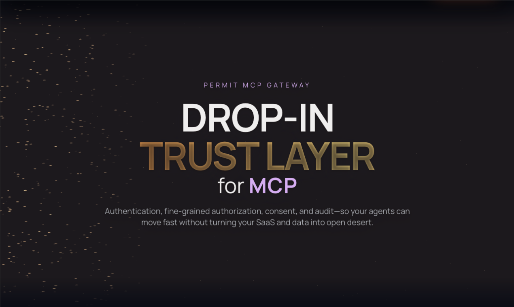
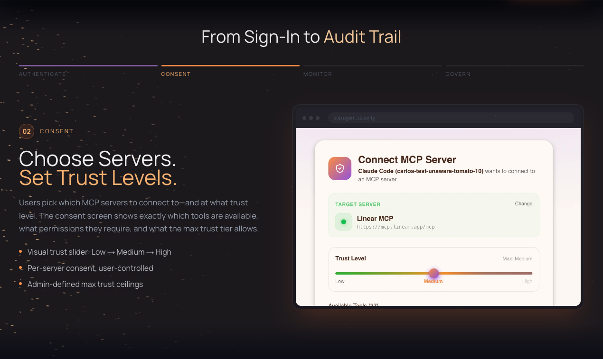

### 🎬 관련 영상
- [🎥 영상 보기](https://ph-files.imgix.net/908856c9-b958-434d-bdef-7a32c49817b1.jpeg?auto=format)

---

## 8. [AutoSend MCP](https://www.producthunt.com/products/autosend-mcp)
**Votes**: 153 | **도입 난이도**: 중 | **신뢰도**: 중
**Tagline**: The email platform your AI agent can operate.
**서비스 링크**: https://www.producthunt.com/r/CC7DFIPPQSDK7P

**태그**: AI, 이메일 마케팅, 자동화, CRM, 분석, Agent, AI Tool, Email

### 📌 이 서비스 한눈에 보기
AutoSend MCP는 AI 에이전트가 이메일 캠페인을 직접 운영하고 관리할 수 있도록 지원하는 플랫폼입니다.

### 🔑 주요 기능
- AI 에이전트가 AutoSend 플랫폼에 직접 접근 가능
- 템플릿 생성, 캠페인 관리, 대상 고객 관리 기능 제공
- 이메일 전송 통계 모니터링 지원

### 🙋 사용자에게 어떤 점이 좋은가
AI를 활용하여 이메일 마케팅 자동화를 구축하고, 캠페인 성과를 효율적으로 추적할 수 있습니다.

### ✅ 지금 바로 써볼 기능
- AI 에이전트 연동 설정
- 이메일 템플릿 디자인
- 캠페인 생성 및 자동 실행 설정

### ⚠️ 사용 전 확인할 점
- AI 에이전트의 접근 권한 및 보안 설정 필요
- 이메일 전송량 제한 확인

### 🧭 확인이 더 필요한 정보
AI 에이전트 연동 시 호환성 및 성능에 대한 추가적인 검토가 필요합니다.

### 📸 스크린샷 및 갤러리
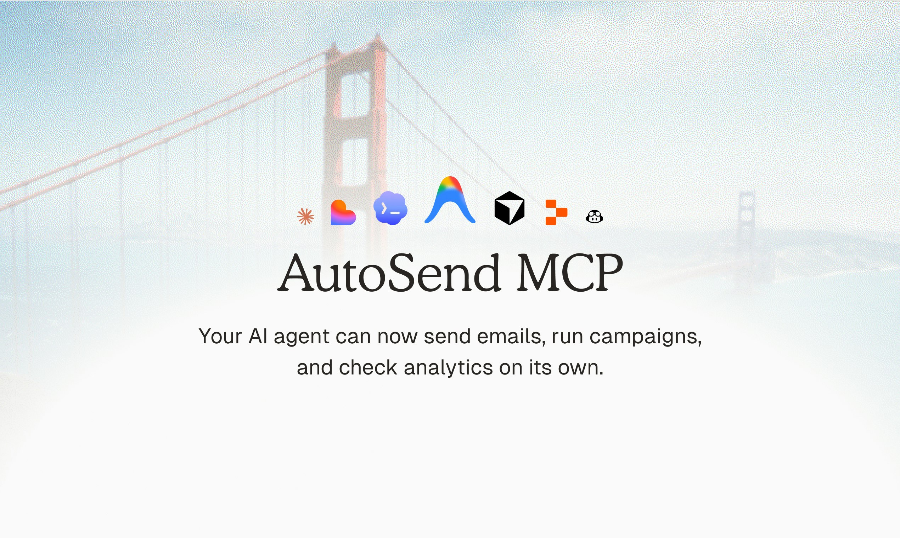
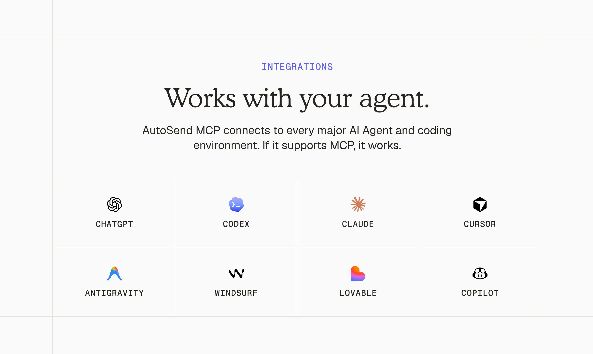
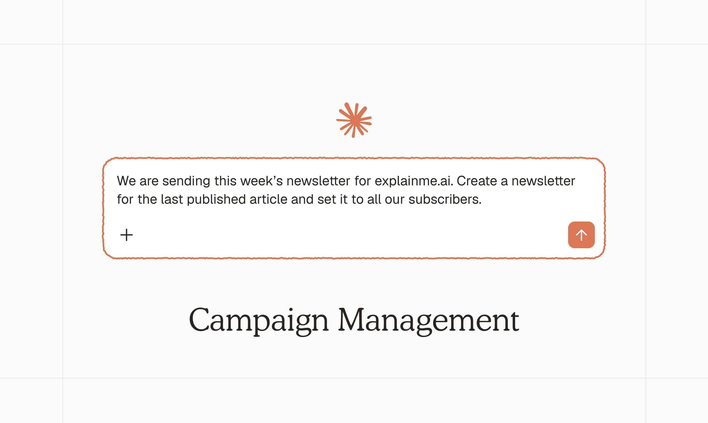

### 🎬 관련 영상
- [🎥 영상 보기](https://ph-files.imgix.net/bb083402-fce4-439c-8657-efe06fdf8eff.jpeg?auto=format)

---

## 9. [Unsloth Studio](https://www.producthunt.com/products/unsloth)
**Votes**: 126 | **도입 난이도**: 중 | **신뢰도**: 중
**Tagline**: Open-source web UI to run and train AI models.
**서비스 링크**: https://www.producthunt.com/r/T3CJ7XUCZMP3EO

**태그**: AI, LLM, Open Source, No-Code, Web UI, AI Tool, DevTool

### 📌 이 서비스 한눈에 보기
Unsloth Studio는 코딩 없이 로컬에서 LLM을 학습, 실행, 내보내기 할 수 있는 오픈소스 웹 UI를 제공하여, 데이터셋 구축부터 모델 미세 조정까지 간편하게 처리하고 성능을 향상시킵니다.

### 🔑 주요 기능
- 복잡한 코드 작성 없이 LLM 학습, 실행, 내보내기 가능
- 비정형 파일을 데이터셋으로 변환
- 기존 방식 대비 2배 빠른 속도와 70% 적은 VRAM 사용

### 🙋 사용자에게 어떤 점이 좋은가
Unsloth Studio를 사용하면 AI 모델 학습 과정을 간소화하고 효율성을 높여, 개발자는 더 적은 리소스로 더 빠르게 모델을 개발하고 배포할 수 있습니다.

### ✅ 지금 바로 써볼 기능
- 로컬 환경에 Unsloth Studio 설치 및 실행
- 비정형 파일 데이터셋으로 변환 후 LLM 학습
- 학습된 모델 내보내기 및 활용

### ⚠️ 사용 전 확인할 점
- 오픈소스이므로 사용 전 라이선스 확인 필요
- 로컬 환경의 컴퓨팅 자원(CPU, GPU, RAM)에 따라 성능이 제한될 수 있음

### 🧭 확인이 더 필요한 정보
다양한 LLM 모델과의 호환성 및 최적화 정도에 대한 추가 정보가 필요합니다.

### 📸 스크린샷 및 갤러리
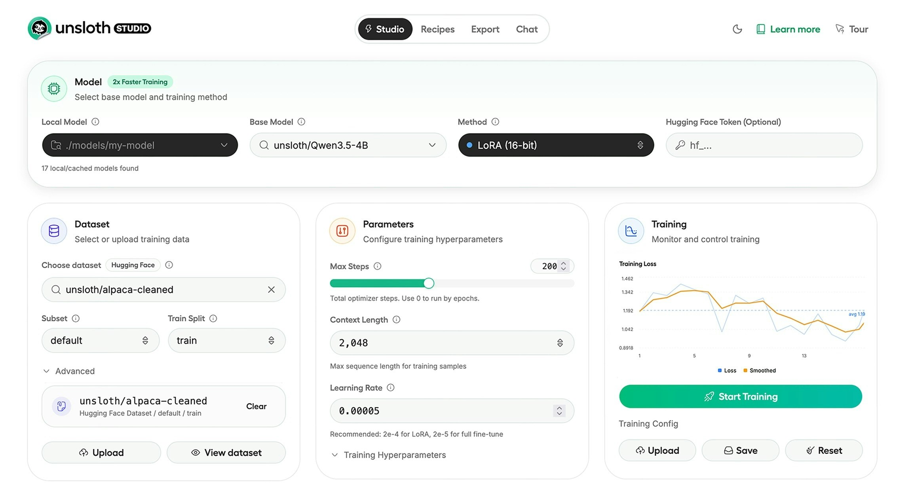
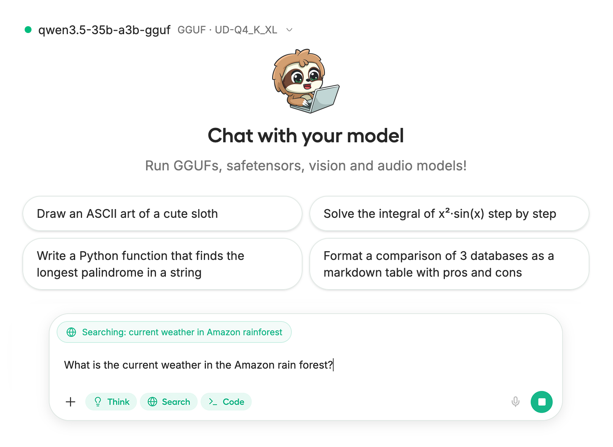
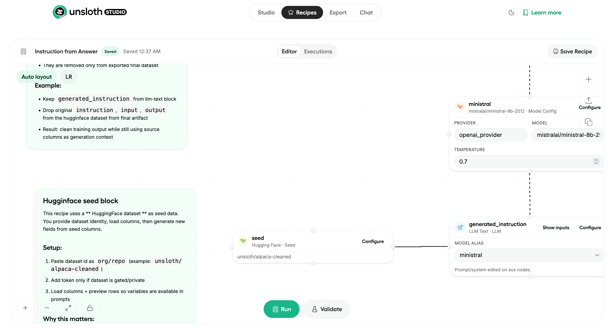

### 🎬 관련 영상
- [🎥 영상 보기](https://ph-files.imgix.net/15134b1f-b963-4446-ad54-88e99012b3ea.jpeg?auto=format)

---

## 10. [Grok's Text to Speech API ](https://www.producthunt.com/products/grok-s-text-to-speech-api)
**Votes**: 115 | **도입 난이도**: 중 | **신뢰도**: 중
**Tagline**: Grok's Text to Speech API is now available. 
**서비스 링크**: https://www.producthunt.com/r/3XI3JPOZLHU5MR

**태그**: TTS, API, 음성 합성, 개발 도구, AI Tool

### 📌 이 서비스 한눈에 보기
Grok의 Text to Speech API로 앱에 자연스러운 음성 기능을 쉽게 통합하여 사용자 경험을 향상시킬 수 있습니다.

### 🔑 주요 기능
- 자연스러운 음성 제공
- 표현력 있는 컨트롤 지원
- 다양한 앱에 통합 가능

### 🙋 사용자에게 어떤 점이 좋은가
앱에 생동감을 불어넣어 사용자 몰입도를 높이고, 접근성을 향상시켜 더 많은 사용자를 확보할 수 있습니다.

### ✅ 지금 바로 써볼 기능
- API 문서 확인
- 샘플 코드 실행
- 무료 평가판 사용

### ⚠️ 사용 전 확인할 점
- API 사용량 제한 확인
- 지원되는 언어 및 음성 확인

### 🧭 확인이 더 필요한 정보
API의 구체적인 성능 지표 및 지원 언어에 대한 추가 정보 확인이 필요합니다.

### 📸 스크린샷 및 갤러리
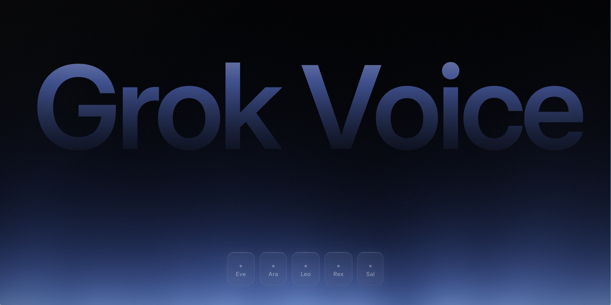
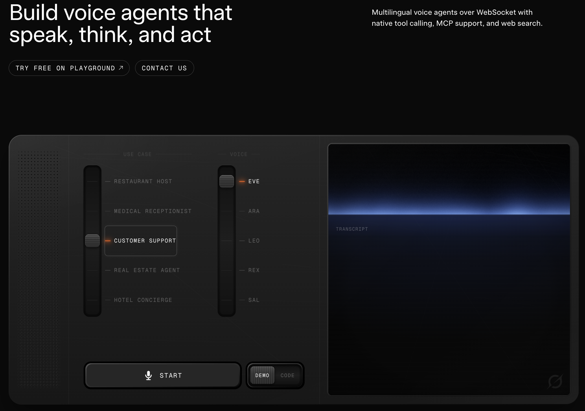
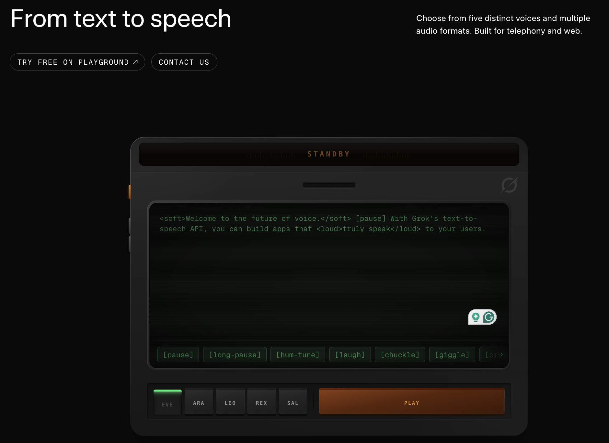

### 🎬 관련 영상
- [🎥 영상 보기](https://ph-files.imgix.net/83c947e3-d925-480d-9106-03240e6c90ad.jpeg?auto=format)

---

