# 🚀 Product Hunt Daily Top 10 (2026-03-20)

## 1. [Stitch 2.0 by Google](https://www.producthunt.com/products/stitch-2-0-by-google-2)
**Votes**: 440 | **도입 난이도**: 중 | **신뢰도**: 중
**Tagline**: Vibe design beautiful production-ready UI in seconds
**서비스 링크**: https://www.producthunt.com/r/FCKF6O6HKHV32R

**태그**: AI, UI 디자인, 프로토타입, 협업, 자동화, Agent, AI Tool, Vision, Design, DevTool

### 📌 이 서비스 한눈에 보기
Stitch 2.0은 AI 기반의 디자인 도구로, 자연어, 음성, 문맥 인식 에이전트를 활용하여 고품질 UI를 빠르게 디자인, 반복, 협업할 수 있도록 돕습니다.

### 🔑 주요 기능
- 자연어, 음성, 문맥 인식 기반의 AI 디자인 기능 제공
- 이미지, 코드, 텍스트를 통합하여 디자인 가능
- 즉각적인 프로토타입 생성 및 디자인 시스템 유지

### 🙋 사용자에게 어떤 점이 좋은가
Stitch 2.0을 사용하면 아이디어에서 인터페이스까지의 디자인 과정을 몇 초 만에 완료할 수 있어, 디자인 작업 속도를 향상시키고 생산성을 극대화할 수 있습니다.

### ✅ 지금 바로 써볼 기능
- 자연어를 사용하여 UI 요소 생성해보기
- 음성 명령으로 디자인 변경해보기
- 내장된 디자인 시스템 활용하여 일관성 유지하기

### ⚠️ 사용 전 확인할 점
- AI 기반 기능의 정확도 및 디자인 품질 검토 필요
- 특정 디자인 시스템과의 호환성 확인 필요

### 🧭 확인이 더 필요한 정보
Stitch 2.0의 AI 기능이 얼마나 다양한 디자인 스타일과 복잡성을 지원하는지 추가 확인이 필요합니다.

### 📸 스크린샷 및 갤러리
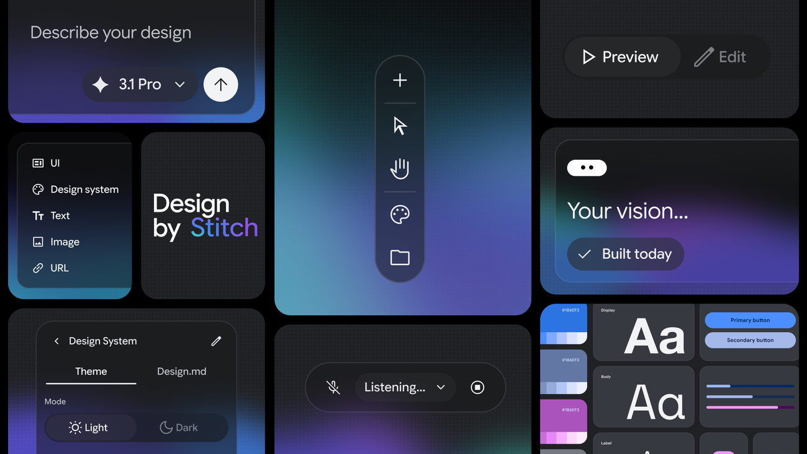
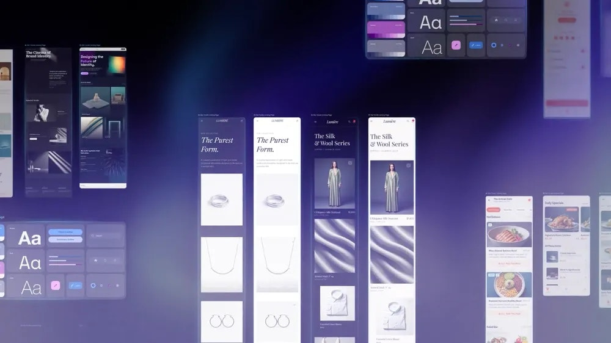
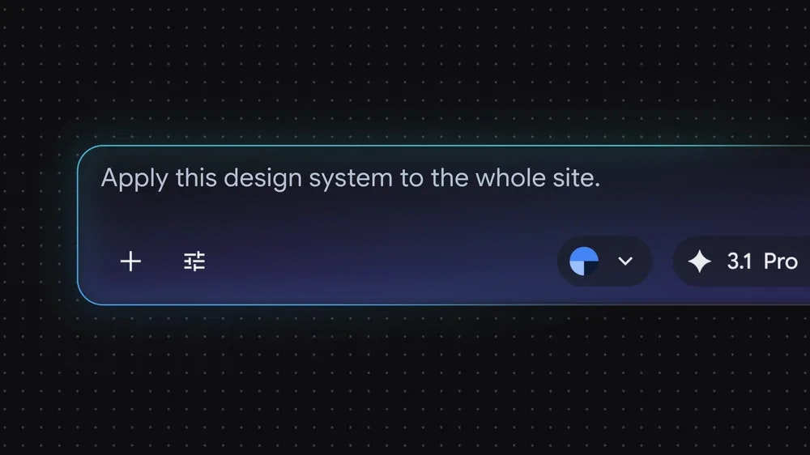

### 🎬 관련 영상
- [🎥 영상 보기](https://ph-files.imgix.net/08dce253-af61-4336-9537-d8e3238a7de8.jpeg?auto=format)

---

## 2. [MiniMax-M2.7](https://www.producthunt.com/products/minimax-agent)
**Votes**: 259 | **도입 난이도**: 중 | **신뢰도**: 중
**Tagline**: Self-evolving AI model powering autonomous agents
**서비스 링크**: https://www.producthunt.com/r/QWPGVYW4USQ4SJ

**태그**: AI, 자동화, 개발 도구, 에이전트, Agent, Automation, AI Tool, API

### 📌 이 서비스 한눈에 보기
MiniMax M2.7은 스스로 진화하는 AI 모델로, 복잡한 작업을 자동화하고 지속적으로 학습하여 최소한의 인간 개입으로 업무를 수행할 수 있게 해줍니다.

### 🔑 주요 기능
- 자기 개선 AI 모델
- 에이전트 팀 협업 기능
- 코딩, 디버깅, 연구 등 복잡한 작업 처리

### 🙋 사용자에게 어떤 점이 좋은가
MiniMax M2.7을 통해 AI 기반 워크플로우를 구축하고, 개발 생산성을 향상시키며, 반복적인 작업을 자동화하여 시간을 절약할 수 있습니다.

### ✅ 지금 바로 써볼 기능
- API를 사용하여 기존 시스템에 통합
- MiniMax Agent를 통해 AI 에이전트 활용
- 자동화 워크플로우 구축

### ⚠️ 사용 전 확인할 점
- API 사용량에 따른 비용 발생 가능성
- 자동화 수준에 따른 잠재적 오류 가능성

### 🧭 확인이 더 필요한 정보
MiniMax M2.7의 장기적인 성능과 안정성에 대한 추가적인 검증이 필요합니다.

### 📸 스크린샷 및 갤러리
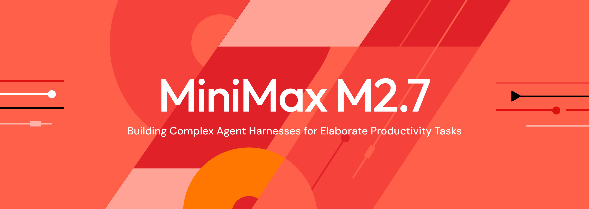
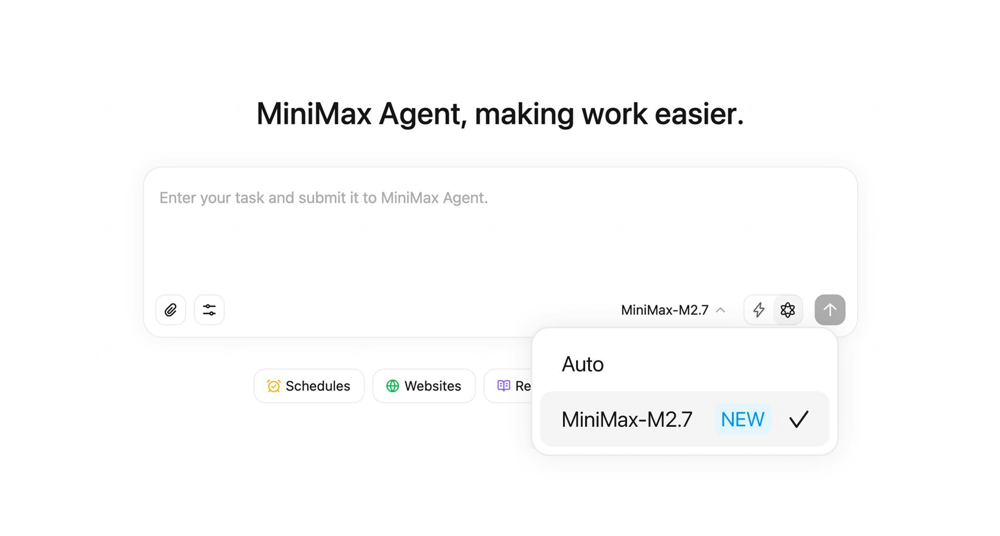
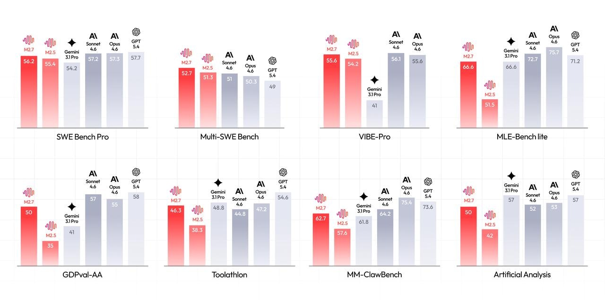

---

## 3. [InfrOS](https://www.producthunt.com/products/infros)
**Votes**: 213 | **도입 난이도**: 중 | **신뢰도**: 중
**Tagline**: Predict and validate cloud architectures before launch
**서비스 링크**: https://www.producthunt.com/r/JMODKEWNZJOEM5

**태그**: 클라우드, 아키텍처, 에뮬레이션, DevOps, Design

### 📌 이 서비스 한눈에 보기
InfrOS는 클라우드 시스템 구축 시 최적화된 아키텍처를 설계하고 검증하여 배포 전에 에뮬레이션을 통해 결과를 증명하고, 인프라를 제어하며 발전시킬 수 있도록 돕습니다.

### 🔑 주요 기능
- 클라우드 아키텍처 설계 및 검증
- 배포 전 에뮬레이션을 통한 결과 예측 및 증명
- 인프라 발전 제어

### 🙋 사용자에게 어떤 점이 좋은가
클라우드 시스템 구축 팀은 InfrOS를 통해 최적화된 아키텍처를 설계하고 검증하여 배포 전에 발생할 수 있는 문제를 예방하고, 인프라를 효율적으로 관리할 수 있습니다.

### ✅ 지금 바로 써볼 기능
- 클라우드 아키텍처 설계 기능 사용해보기
- 에뮬레이션 기능을 통한 결과 예측 및 검증
- 인프라 발전 제어 기능 사용해보기

### ⚠️ 사용 전 확인할 점
- 에뮬레이션 환경과 실제 배포 환경의 차이 고려
- 지원하는 클라우드 플랫폼 및 서비스 확인

### 🧭 확인이 더 필요한 정보
InfrOS가 지원하는 클라우드 플랫폼 및 서비스의 범위에 대한 추가 정보 확인이 필요합니다.

### 📸 스크린샷 및 갤러리
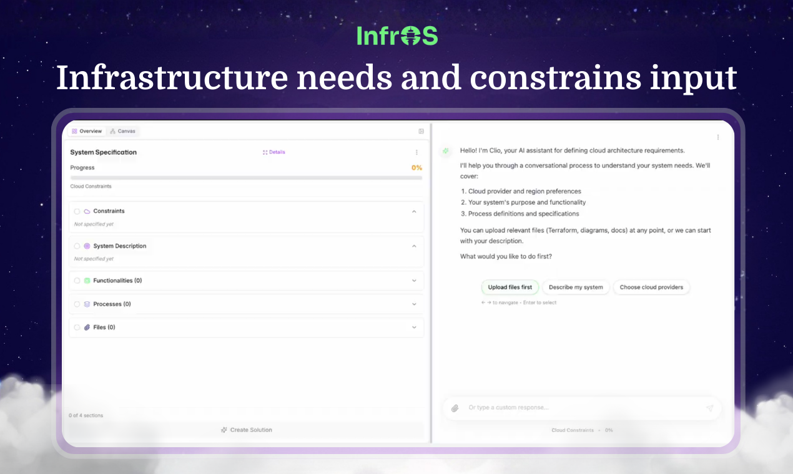
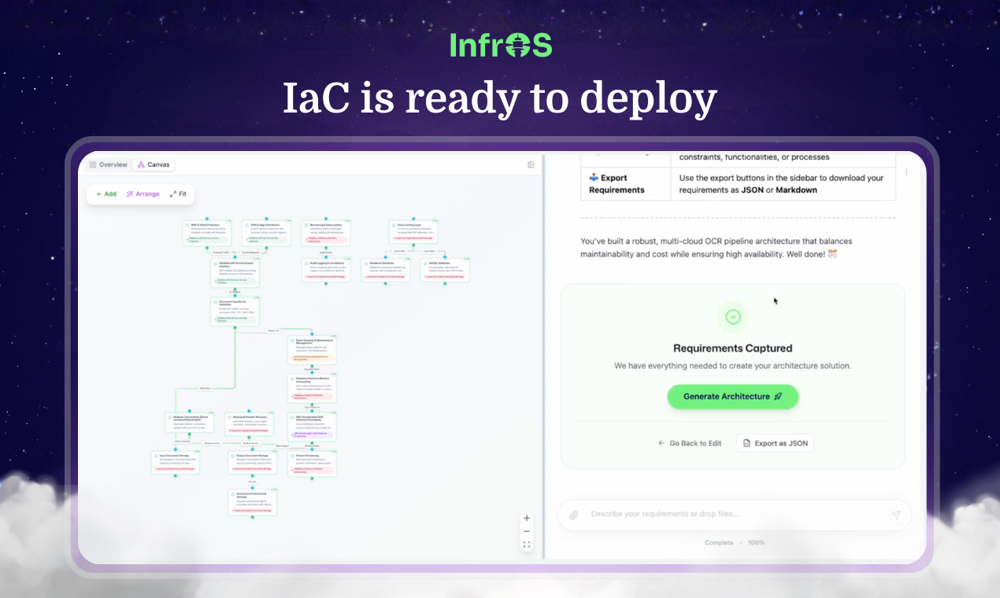
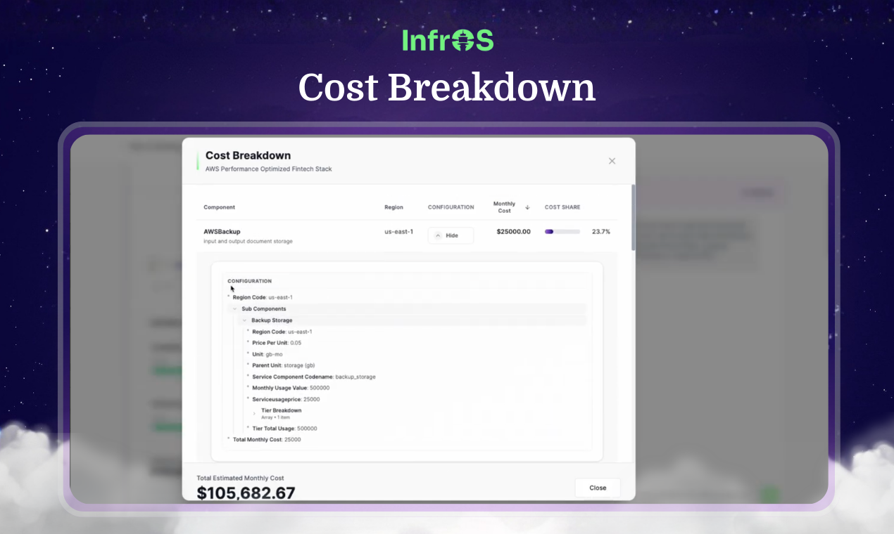

### 🎬 관련 영상
- [🎥 영상 보기](https://ph-files.imgix.net/d8ea8786-86db-44e1-a2fa-1c49cf674d7a.jpeg?auto=format)

---

## 4. [OctoClaw](https://www.producthunt.com/products/octoclaw)
**Votes**: 204 | **도입 난이도**: 중 | **신뢰도**: 중
**Tagline**: Hire AI specialists for marketing, sales, support, and more
**서비스 링크**: https://www.producthunt.com/r/B6QI56ORHI6MW3

**태그**: AI, 자동화, 업무 효율성, 생산성, 고객 지원, Automation, AI Tool, Marketing, Sales

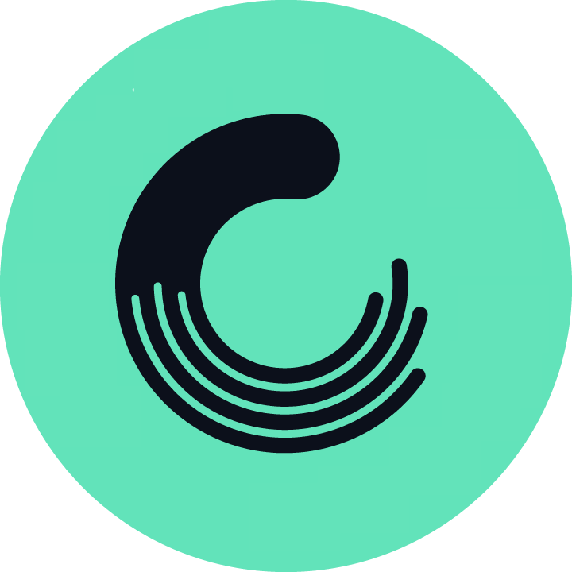

### 📌 이 서비스 한눈에 보기
OctoClaw는 콘텐츠 작성, 리드 검증, 고객 응대 등 다양한 비즈니스 업무를 실제로 수행하는 AI 전문가를 제공하여 업무 효율성을 높여줍니다.

### 🔑 주요 기능
- 마케팅, 영업, 고객 지원 등 다양한 분야의 AI 전문가 활용
- 콘텐츠 작성, 리드 검증, 고객 응대 등 실제 업무 실행
- 다양한 도구와 연동하여 워크플로우 조정

### 🙋 사용자에게 어떤 점이 좋은가
OctoClaw를 통해 AI 전문가를 고용하여 콘텐츠 제작, 잠재 고객 발굴, 고객 응대 등의 업무를 자동화하고 효율성을 높일 수 있습니다.

### ✅ 지금 바로 써볼 기능
- 콘텐츠 작성 AI 전문가 활용
- 리드 검증 자동화
- 고객 응대 자동화 설정

### ⚠️ 사용 전 확인할 점
- AI 전문가의 성능은 작업의 복잡성과 데이터 품질에 따라 달라질 수 있습니다.
- 기존 도구와의 연동 가능성을 확인해야 합니다.

### 🧭 확인이 더 필요한 정보
AI 전문가의 정확도와 효율성에 대한 사용자 후기를 추가적으로 확인하는 것이 좋습니다.

### 📸 스크린샷 및 갤러리
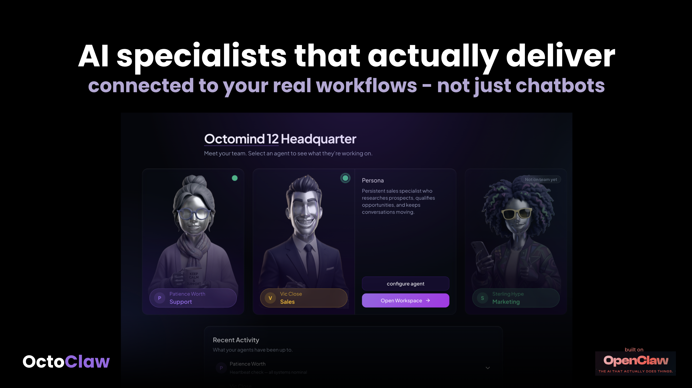
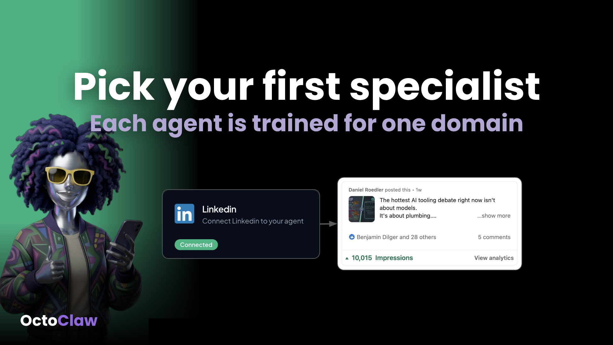
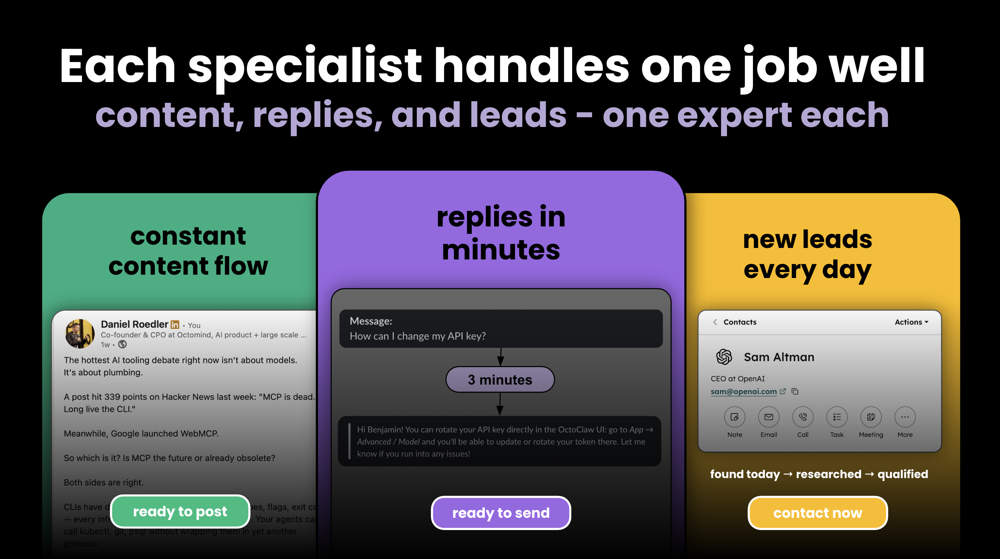

### 🎬 관련 영상
- [🎥 영상 보기](https://ph-files.imgix.net/c8f4c911-ed3a-42c3-9f69-4062e4a275e9.jpeg?auto=format)

---

## 5. [Netlify.new](https://www.producthunt.com/products/netlify)
**Votes**: 191 | **도입 난이도**: 하 | **신뢰도**: 중
**Tagline**: Start a project with just a prompt on Netlify
**서비스 링크**: https://www.producthunt.com/r/X4EY7ZAP7OYZHK

**태그**: DevTool, AI, 프론트엔드, 자동화, 배포, Agent, AI Tool, Prompting

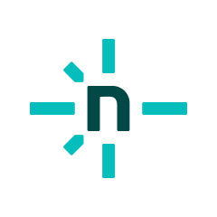

### 📌 이 서비스 한눈에 보기
Netlify.new를 통해 프롬프트만으로 즉시 Netlify 프로젝트를 시작하고, 실제 프로덕션 URL에서 바로 작업하며 배포까지 완료하세요.

### 🔑 주요 기능
- 프롬프트 기반 즉시 프로젝트 시작: 로컬 설정이나 리포지토리 없이 앱 설명만으로 시작 가능
- AI 에이전트 활용: Claude, Gemini, Codex 등 AI 에이전트를 선택하여 코드 생성 및 프로젝트 구성
- Netlify 인프라 즉시 활용: 빌트인 폼, 서버리스 함수 등 Netlify의 모든 기능을 바로 사용

### 🙋 사용자에게 어떤 점이 좋은가
아이디어를 즉시 프로토타입으로 만들고, 실제 Netlify 환경에서 빠르게 테스트하고 개선할 수 있습니다. 기존 방식도 지원하므로 필요에 따라 Git 연동도 가능합니다.

### ✅ 지금 바로 써볼 기능
- netlify.new 접속하여 즉시 프로젝트 시작
- 다양한 AI 에이전트(Claude, Gemini, Codex) 실험
- 빌트인 폼 및 서버리스 함수 활용

### ⚠️ 사용 전 확인할 점
- AI 에이전트의 코드 생성 품질에 따라 결과가 달라질 수 있음
- 복잡한 프로젝트의 경우, 초기 프롬프트 기반 설정 후 추가적인 수동 설정이 필요할 수 있음

### 🧭 확인이 더 필요한 정보
AI 에이전트별 코드 생성 성능 및 Netlify의 장기적인 지원 계획에 대한 추가 정보 확인이 필요합니다.

### 📸 스크린샷 및 갤러리
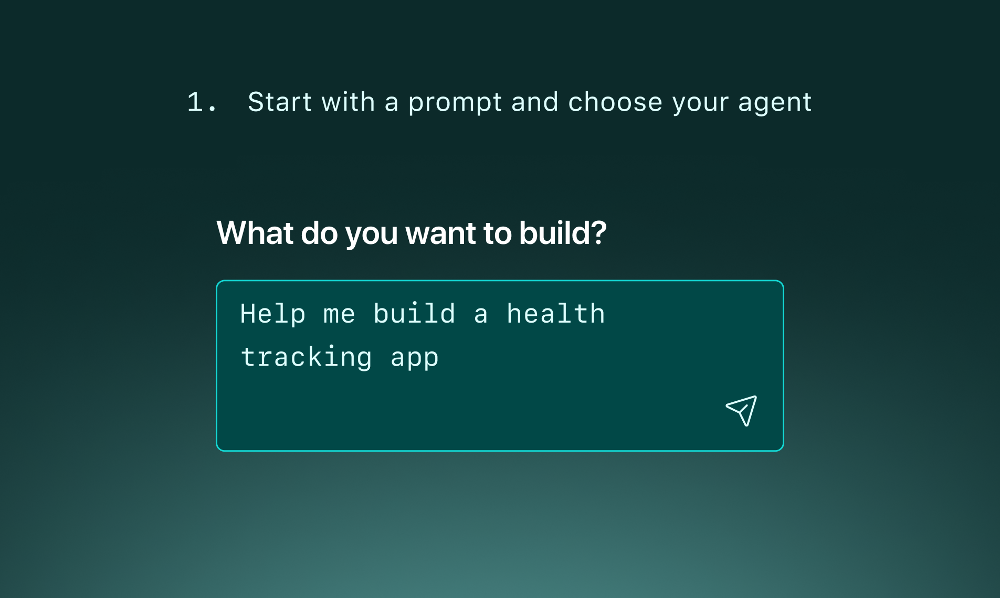
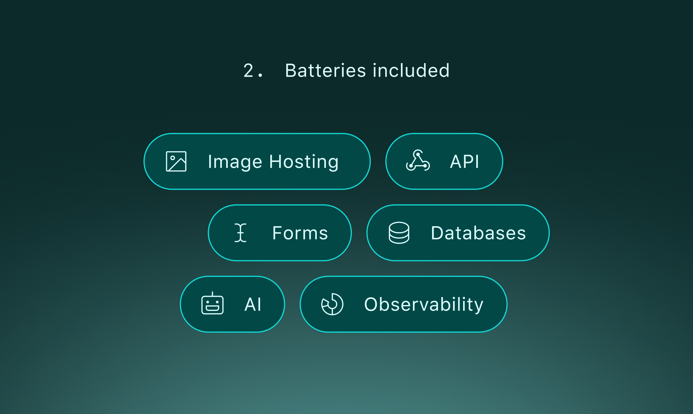
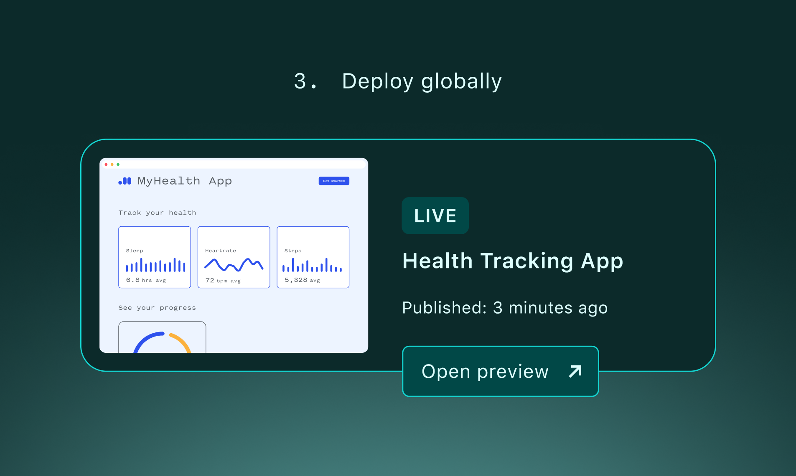

---

## 6. [Comet for iOS](https://www.producthunt.com/products/perplexity-ai)
**Votes**: 160 | **도입 난이도**: 중 | **신뢰도**: 중
**Tagline**: Agentic AI browser and assistant for mobile by Perplexity 
**서비스 링크**: https://www.producthunt.com/r/U4SOBCCNE6I4ER

**태그**: AI, 브라우저, 생산성, 모바일, Agent, AI Tool, Chat

### 📌 이 서비스 한눈에 보기
Perplexity에서 만든 Comet은 모바일에 최적화된 AI 브라우저 및 어시스턴트로, 탭 요약, 음성 채팅, 브라우징 정리, 방해 요소 차단 기능을 제공하며, AI 어시스턴트가 사용자를 대신해 작업을 수행합니다.

### 🔑 주요 기능
- 모바일 환경에 최적화된 AI 브라우저
- 탭 요약, 음성 채팅, 브라우징 정리 기능 제공
- AI 어시스턴트가 사용자 대신 작업 수행

### 🙋 사용자에게 어떤 점이 좋은가
이동 중에도 스마트하게 브라우징하고 AI의 도움을 받아 효율적으로 작업을 처리할 수 있습니다. 특히 여러 탭을 관리하거나 정보를 빠르게 요약해야 할 때 유용합니다.

### ✅ 지금 바로 써볼 기능
- 탭 요약 기능 사용해보기
- 음성 채팅 기능 사용해보기
- AI 어시스턴트에게 작업 지시해보기

### ⚠️ 사용 전 확인할 점
- AI 어시스턴트의 작업 결과 정확성 확인 필요
- 개인 정보 처리 및 보안에 유의

### 🧭 확인이 더 필요한 정보
AI 어시스턴트의 성능 및 개인 정보 처리 방식에 대한 추가 정보 확인이 필요합니다.

### 📸 스크린샷 및 갤러리
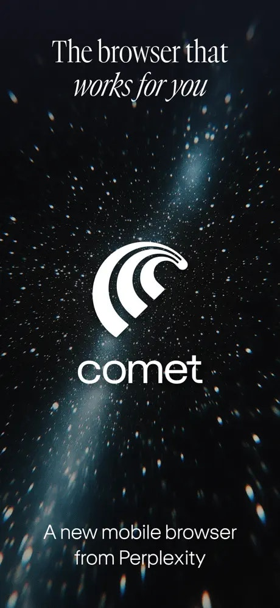

### 🎬 관련 영상
- [🎥 영상 보기](https://ph-files.imgix.net/8f9dcd76-5b63-4af5-a650-e66711cb2470.jpeg?auto=format)

---

## 7. [PixelClaw](https://www.producthunt.com/products/pixelclaw)
**Votes**: 133 | **도입 난이도**: 하 | **신뢰도**: 중
**Tagline**: A tiny pixel crab that lives on your Dock
**서비스 링크**: https://www.producthunt.com/r/VKEHNPPUAYEI2W

**태그**: 맥 앱, 애니메이션, Dock, 귀여움, DevTool

### 📌 이 서비스 한눈에 보기
PixelClaw는 맥 Dock에서 귀여운 애니메이션 게를 키우며 Claude Code 작업 중에도 소소한 즐거움을 더해주는 앱입니다.

### 🔑 주요 기능
- 맥 Dock에서 살아 움직이는 픽셀 게
- 낮잠, 점프, 사과 쫓기 등 다양한 애니메이션
- Claude Code 작업 중에도 귀여운 볼거리 제공

### 🙋 사용자에게 어떤 점이 좋은가
지루한 작업 중에도 잠시나마 귀여운 게를 보며 힐링하고, 맥 Dock을 더욱 개성 있게 꾸밀 수 있습니다.

### ✅ 지금 바로 써볼 기능
- PixelClaw 다운로드 및 설치
- 맥 Dock에서 PixelClaw 실행
- 사과를 드래그하여 게에게 주기

### ⚠️ 사용 전 확인할 점
- 애니메이션이 CPU 사용량을 늘릴 수 있음
- Dock 공간을 차지할 수 있음

### 🧭 확인이 더 필요한 정보
PixelClaw의 시스템 자원 사용량에 대한 추가 정보 확인이 필요합니다.

### 📸 스크린샷 및 갤러리
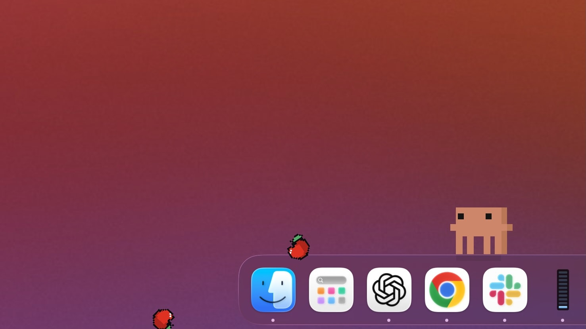
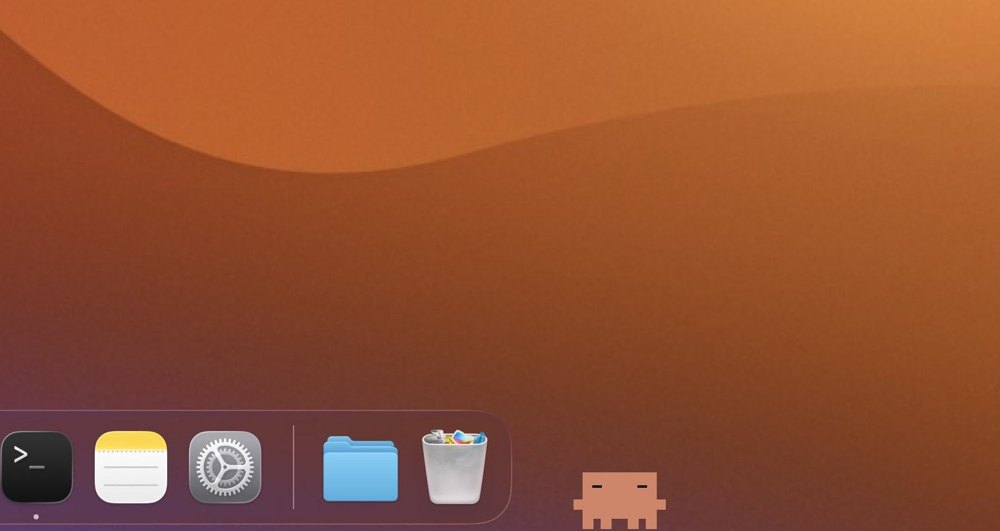
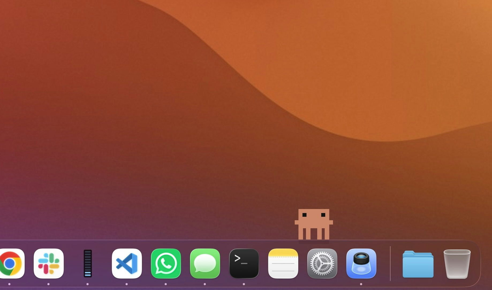

### 🎬 관련 영상
- [🎥 영상 보기](https://ph-files.imgix.net/5ebcfe24-8d53-4df0-9281-c044ce020500.jpeg?auto=format)

---

## 8. [Cimanote](https://www.producthunt.com/products/cimanote)
**Votes**: 132 | **도입 난이도**: 하 | **신뢰도**: 중
**Tagline**: The fast, clean note app Evernote used to be
**서비스 링크**: https://www.producthunt.com/r/PD44QI4PNYVON4

**태그**: 노트, 생산성, 협업, Evernote, 대체

### 📌 이 서비스 한눈에 보기
Evernote의 가격 인상 및 기능 제한에 실망한 사용자를 위한 빠르고 깔끔한 노트 앱으로, Evernote의 과거 장점을 그대로 계승하면서 실시간 협업 및 데이터 내보내기 기능을 제공합니다.

### 🔑 주요 기능
- 빠른 로딩 속도와 깔끔한 인터페이스
- 모든 기기 지원 및 실시간 협업 기능
- Evernote 데이터 완벽하게 가져오기

### 🙋 사용자에게 어떤 점이 좋은가
Evernote의 대안을 찾는 사용자에게 빠르고 안정적인 노트 환경을 제공하며, 데이터 손실 없이 기존 Evernote 노트를 쉽게 이전할 수 있습니다.

### ✅ 지금 바로 써볼 기능
- Evernote 노트 가져오기 기능 사용해보기
- 실시간 협업 기능으로 팀원과 함께 노트 편집해보기
- 다양한 기기에서 노트 동기화 속도 확인해보기

### ⚠️ 사용 전 확인할 점
- 첫 500명 이후 유료 구독 모델($6/월) 적용
- Evernote 외 다른 노트 서비스로부터의 데이터 이전 지원 여부 확인 필요

### 🧭 확인이 더 필요한 정보
향후 기능 업데이트 및 장기적인 서비스 지속 가능성에 대한 사용자 리뷰 확인이 필요합니다.

### 📸 스크린샷 및 갤러리
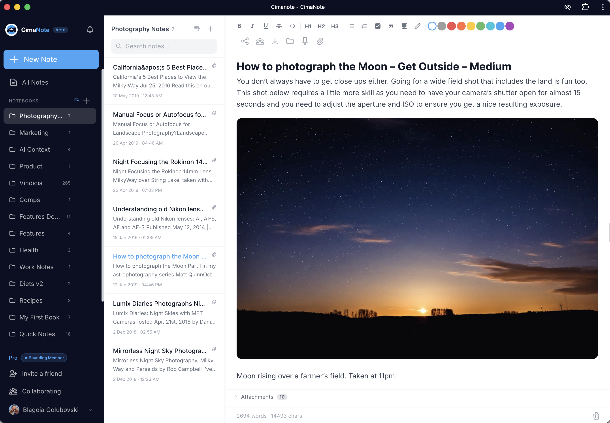
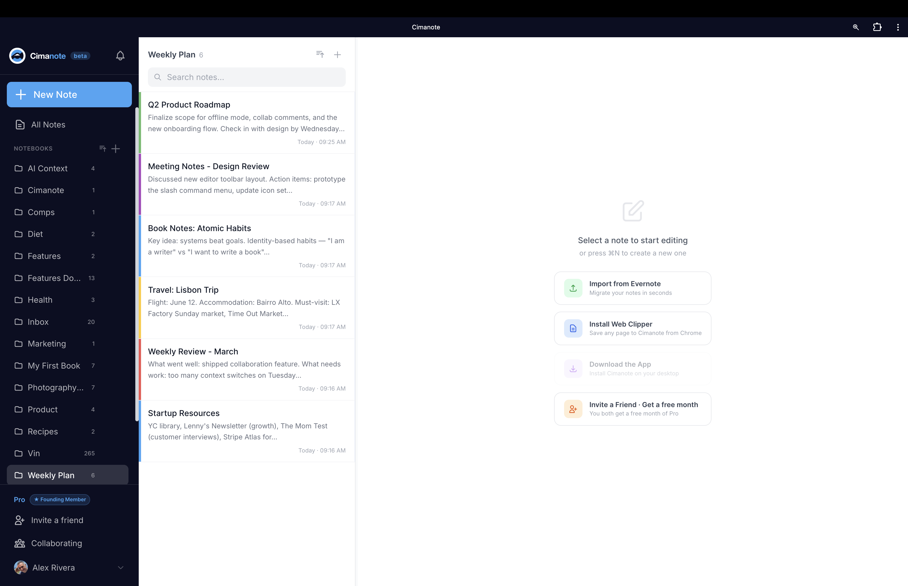
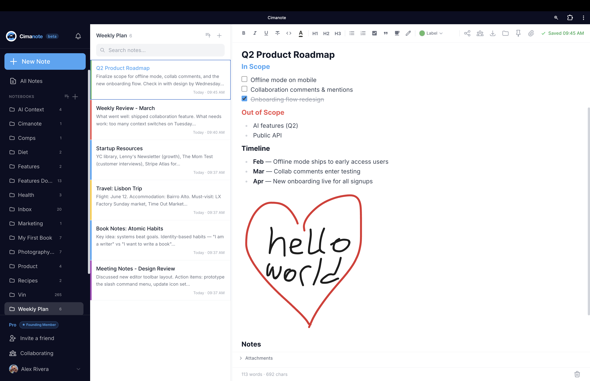

---

## 9. [Scouts for iOS](https://www.producthunt.com/products/scouts-by-yutori)
**Votes**: 116 | **도입 난이도**: 중 | **신뢰도**: 중
**Tagline**: Your always-on AI agents to monitor the web, now on iOS
**서비스 링크**: https://www.producthunt.com/r/SIMFMY4BTRNYIT

**태그**: iOS, AI, Automation, Research, Monitoring, Agent, AI Tool

### 📌 이 서비스 한눈에 보기
Scouts for iOS는 이동 중에도 AI 에이전트를 통해 관심 있는 모든 것을 연구하고 모니터링할 수 있도록 도와줍니다.

### 🔑 주요 기능
- iOS에서 AI 에이전트 사용 가능
- 웹 모니터링 및 리서치 자동화
- 언제 어디서든 정보 접근

### 🙋 사용자에게 어떤 점이 좋은가
이동 중에도 필요한 정보를 놓치지 않고 빠르게 확인할 수 있어 효율적인 업무 처리가 가능합니다.

### ✅ 지금 바로 써볼 기능
- 관심 주제에 대한 스카우트 설정
- 새로운 정보 알림 설정
- 에이전트 리서치 결과 확인

### ⚠️ 사용 전 확인할 점
- AI 에이전트의 정보 정확도 확인 필요
- 데이터 사용량에 따른 요금 발생 가능성 확인

### 🧭 확인이 더 필요한 정보
AI 에이전트의 성능 및 데이터 정확도에 대한 사용자 리뷰 확인이 필요합니다.

### 📸 스크린샷 및 갤러리
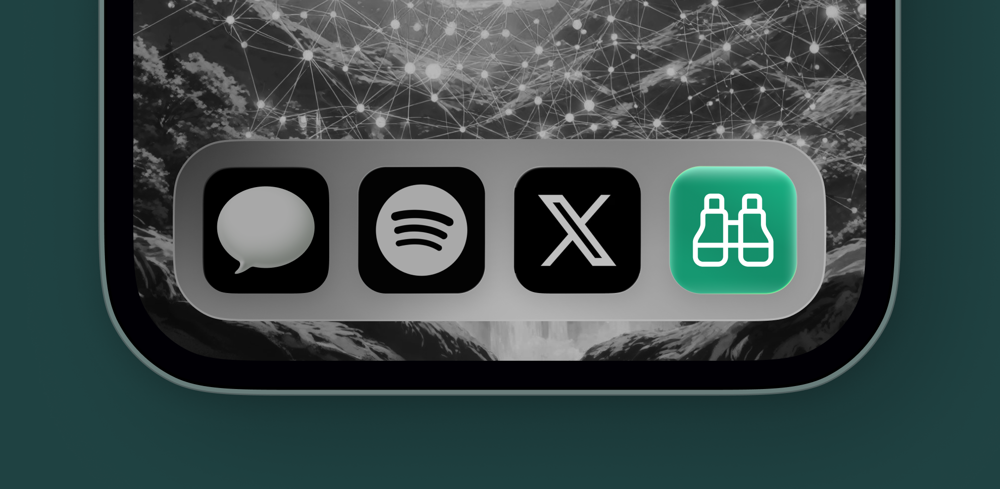

---

## 10. [talat](https://www.producthunt.com/products/talat)
**Votes**: 108 | **도입 난이도**: 중 | **신뢰도**: 중
**Tagline**: Realtime meeting notes that don’t leave your Mac
**서비스 링크**: https://www.producthunt.com/r/YMCHBNLELUWCYI

**태그**: 회의, 생산성, 자동화, 노트, 개인정보보호, LLM, Prompting

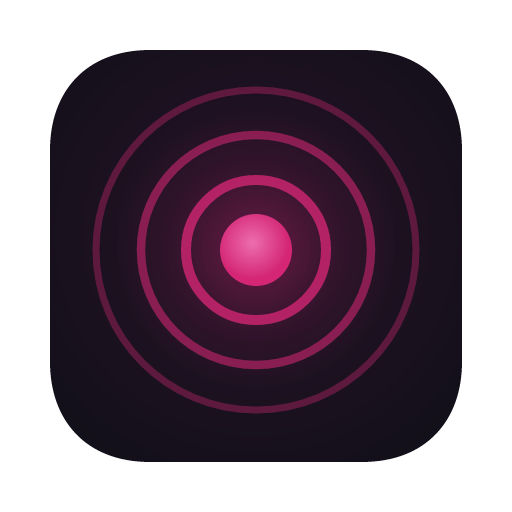

### 📌 이 서비스 한눈에 보기
talat은 Mac에서 실시간으로 회의 내용을 캡처, 기록, 편집 가능한 노트로 만들어주는 앱입니다. 모든 과정이 Mac 내에서 처리되어 개인 정보 보호에 강점을 가지며, 다양한 사용자 정의 옵션을 제공합니다.

### 🔑 주요 기능
- Mac의 Neural Engine을 사용하여 오디오를 로컬에서 처리
- 실시간 음성-텍스트 변환 및 양방향 대화 기록
- Obsidian 자동 내보내기, 웹훅, MCP 서버를 통한 데이터 쿼리 등 다양한 사용자 정의 기능 제공

### 🙋 사용자에게 어떤 점이 좋은가
회의 내용을 텍스트로 기록하고 검색할 수 있어 회의 후 정보 접근성이 향상되며, 개인 정보 보호를 중요시하는 사용자에게 적합합니다.

### ✅ 지금 바로 써볼 기능
- 커스텀 LLM 제공자 설정
- 맞춤 요약 프롬프트 작성
- Obsidian 자동 내보내기 설정

### ⚠️ 사용 전 확인할 점
- Mac의 성능에 따라 실시간 처리 속도가 달라질 수 있음
- 초기 설정 및 사용자 정의에 시간이 소요될 수 있음

### 🧭 확인이 더 필요한 정보
타사 LLM 통합 시 개인 정보 처리 방식에 대한 추가 확인이 필요합니다.

### 📸 스크린샷 및 갤러리
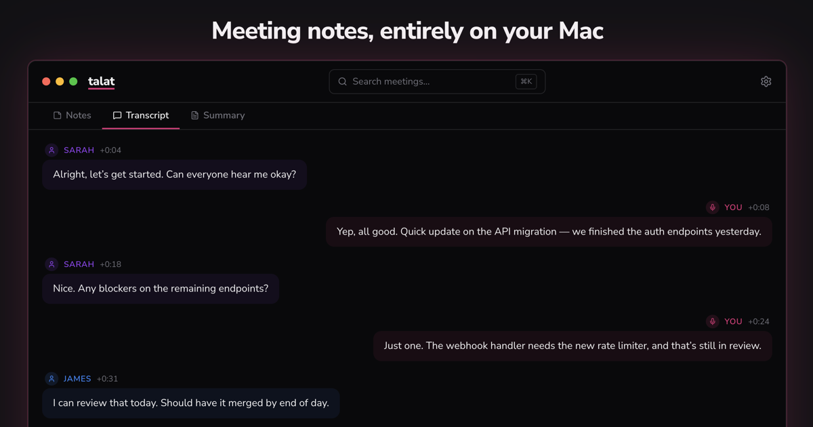
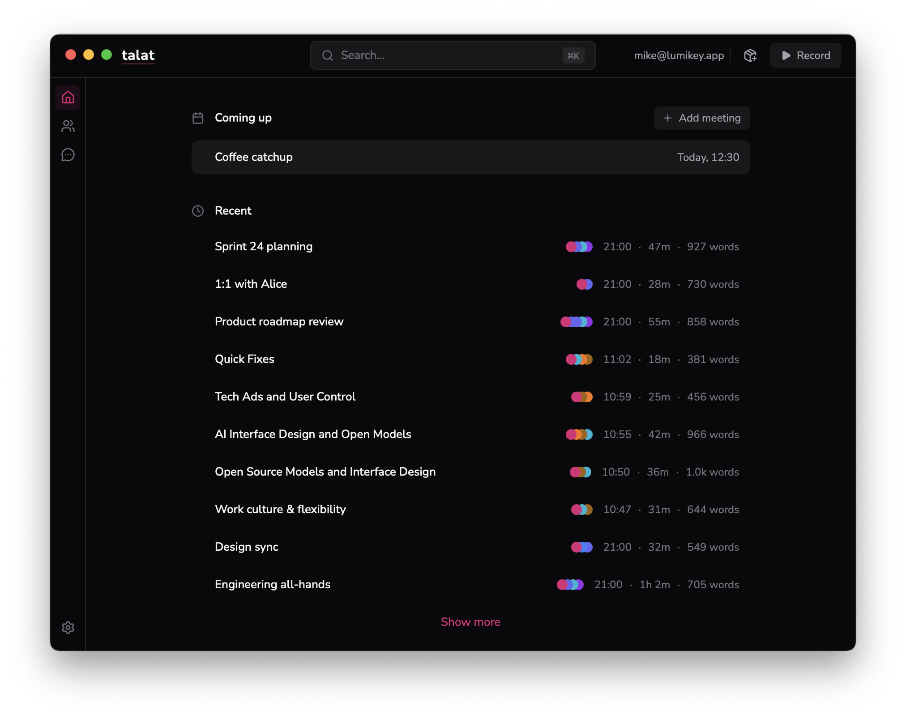
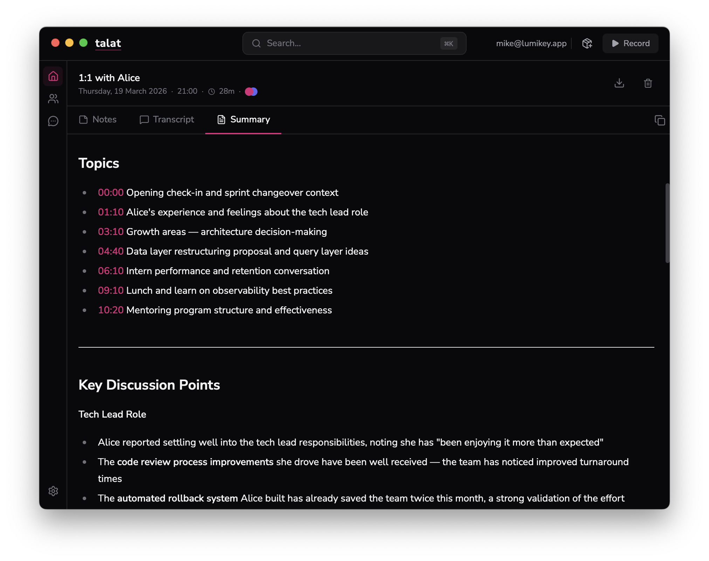

### 🎬 관련 영상
- [🎥 영상 보기](https://ph-files.imgix.net/4a2b235c-6414-42ea-8c11-038b197801b0.jpeg?auto=format)

---

