# 🚀 Product Hunt Daily Top 10 (2026-03-22)

## 1. [Design Agent by Lokuma](https://www.producthunt.com/products/lokuma-ai)
**Votes**: 309 | **도입 난이도**: 중 | **신뢰도**: 중
**Tagline**: The designer for your AI agents (Openclaw, CC, Codex)
**서비스 링크**: https://www.producthunt.com/r/DW6P33NOZTQ6LJ

**태그**: AI, 디자인, 자동화, 생산성, Agent, AI Tool, Design, DevTool

### 📌 이 서비스 한눈에 보기
Lokuma Design Agent는 AI 에이전트가 디자인 작업을 수행할 수 있도록 돕는 디자인 인텔리전스 레이어입니다. AI가 생성한 결과물을 시각적으로 보기 좋게 디자인해줍니다.

### 🔑 주요 기능
- AI 에이전트(OpenClaw, Claude Code, Codex 등)를 위한 디자인 도구
- 레이아웃, 타이포그래피, 시각적 균형을 고려한 디자인 제공
- 랜딩 페이지, 웹사이트, 캠페인 페이지 등 다양한 결과물 생성

### 🙋 사용자에게 어떤 점이 좋은가
AI가 생성한 결과물을 디자인적으로 개선하여 사용자 경험을 향상시키고, 더 보기 좋고 전문적인 결과물을 얻을 수 있습니다.

### ✅ 지금 바로 써볼 기능
- OpenClaw, Claude Code, Codex 등 AI 에이전트와 연동하여 사용해보기
- 랜딩 페이지나 웹사이트 디자인에 활용해보기
- AI가 생성한 결과물을 Lokuma Design Agent로 개선해보기

### ⚠️ 사용 전 확인할 점
- AI 에이전트와의 호환성을 확인해야 함
- 디자인 결과물의 품질은 AI의 성능에 따라 달라질 수 있음

### 🧭 확인이 더 필요한 정보
Lokuma Design Agent의 구체적인 성능 및 지원하는 AI 에이전트 목록을 확인해야 합니다.

### 📸 스크린샷 및 갤러리
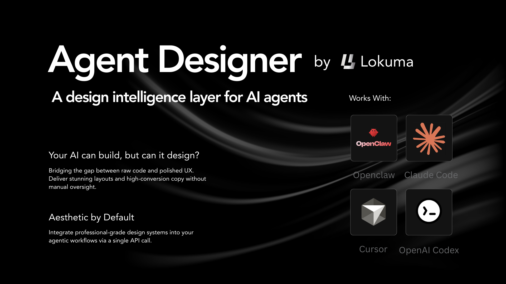
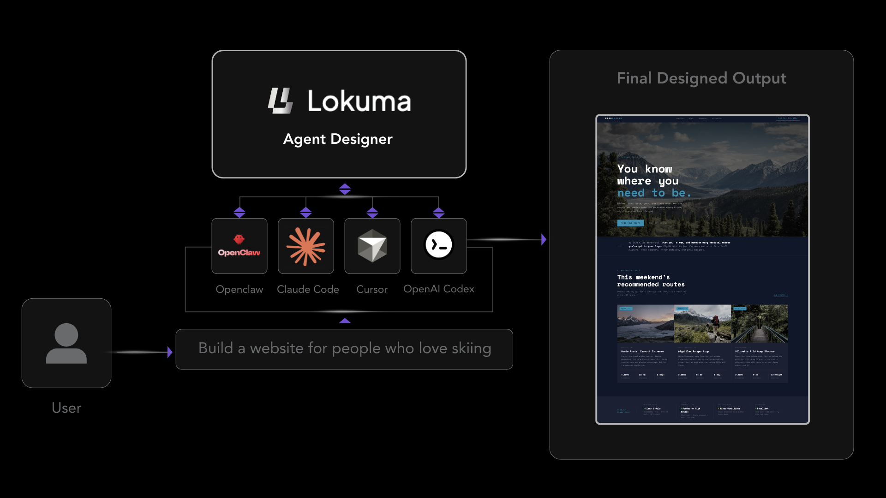
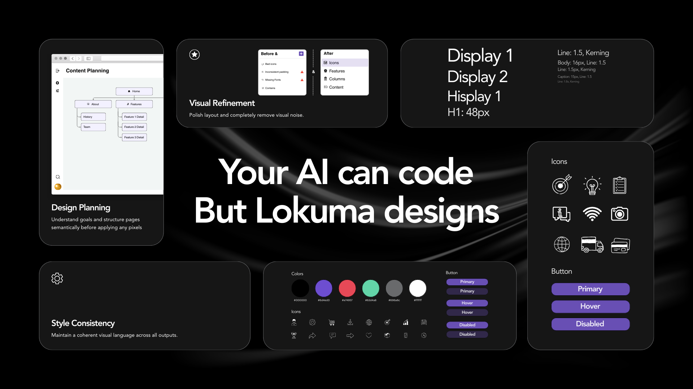

### 🎬 관련 영상
- [🎥 영상 보기](https://ph-files.imgix.net/9cebad1d-110b-48ed-af81-1bd1531dcefa.jpeg?auto=format)

---

## 2. [Claude Cowork Projects](https://www.producthunt.com/products/claude-cowork-projects)
**Votes**: 275 | **도입 난이도**: 중 | **신뢰도**: 중
**Tagline**: Tasks, context, and files organized in one workspace
**서비스 링크**: https://www.producthunt.com/r/CB5MLNHOJ6UGRF

**태그**: 생산성, 협업, 작업 관리, 워크플로우, Automation

### 📌 이 서비스 한눈에 보기
Claude Cowork Projects는 개인 및 팀이 복잡한 워크플로우를 관리할 때 필요한 작업, 파일, 지침, 메모리를 하나의 데스크탑 작업 공간으로 통합하여 효율성을 높여줍니다.

### 🔑 주요 기능
- 작업, 파일, 지침, 메모리를 하나의 작업 공간으로 통합
- 개인 및 팀을 위한 복잡한 워크플로우 관리
- 모든 것을 로컬에 보관, 정리, 재사용 가능

### 🙋 사용자에게 어떤 점이 좋은가
일관된 컨텍스트를 유지하며 작업을 더 빠르게 처리할 수 있도록 도와줍니다. 특히 복잡한 프로젝트를 관리하는 팀에게 유용합니다.

### ✅ 지금 바로 써볼 기능
- 작업 공간을 설정하고 필요한 파일과 지침을 가져오기
- 팀원들을 초대하여 협업 시작하기
- 작업을 세분화하고 우선순위를 설정하여 효율적으로 관리하기

### ⚠️ 사용 전 확인할 점
- 로컬 환경에 데이터를 보관하므로 데이터 백업 및 보안에 유의해야 함
- 팀 규모가 커질수록 작업 공간 관리가 복잡해질 수 있음

### 🧭 확인이 더 필요한 정보
다른 협업 도구와의 호환성 및 데이터 동기화 기능에 대한 추가 정보가 필요합니다.

### 📸 스크린샷 및 갤러리
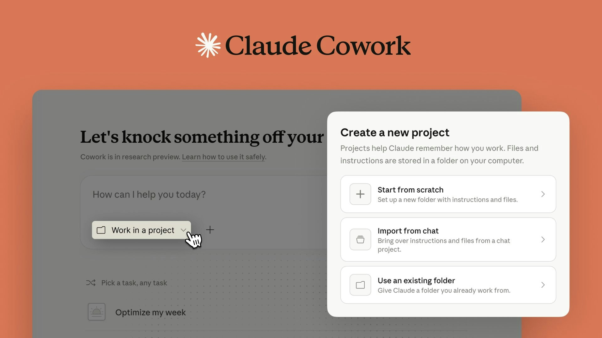
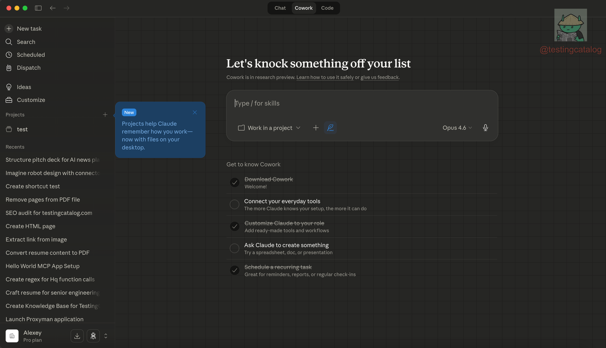
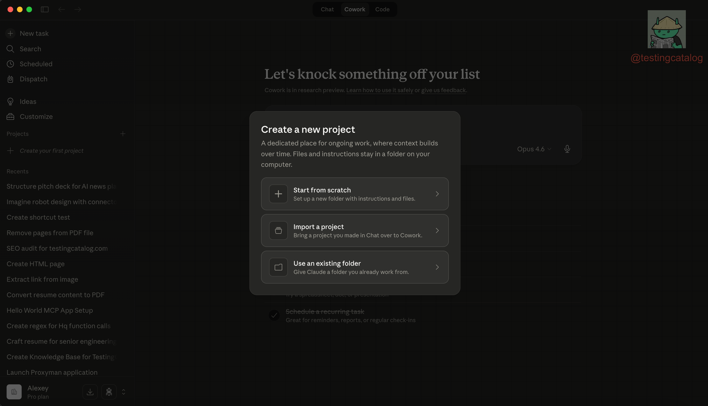

### 🎬 관련 영상
- [🎥 영상 보기](https://ph-files.imgix.net/a54d678f-a1b3-473e-bd8b-77176d592795.jpeg?auto=format)

---

## 3. [Vite+ ](https://www.producthunt.com/products/vite-alpha)
**Votes**: 207 | **도입 난이도**: 중 | **신뢰도**: 중
**Tagline**: The Unified Toolchain for the Web
**서비스 링크**: https://www.producthunt.com/r/YJOVGX3XYVIS24

**태그**: DevTool, 웹 개발, 툴체인, 자동화, AI Tool

### 📌 이 서비스 한눈에 보기
Vite+는 웹 애플리케이션 개발을 위한 통합 툴체인으로, 런타임, 패키지 관리자, 프론트엔드 스택을 하나의 도구로 관리할 수 있게 해줍니다.

### 🔑 주요 기능
- 웹 개발을 위한 통합 툴체인 제공
- 런타임, 패키지 관리, 프론트엔드 스택 통합 관리
- 간단한 설치 명령어 제공 (curl)

### 🙋 사용자에게 어떤 점이 좋은가
Vite+를 사용하면 여러 도구를 개별적으로 관리할 필요 없이 웹 개발 환경을 효율적으로 설정하고 관리할 수 있습니다.

### ✅ 지금 바로 써볼 기능
- 제공된 curl 명령어를 사용하여 설치해보기
- 지원하는 프론트엔드 스택 확인해보기
- 기존 프로젝트에 통합 가능성 검토해보기

### ⚠️ 사용 전 확인할 점
- 기존 워크플로우와의 호환성 확인 필요
- 지원하는 프레임워크 및 라이브러리 범위 확인 필요

### 🧭 확인이 더 필요한 정보
Vite+가 제공하는 구체적인 기능 및 지원 스택에 대한 추가 정보가 필요합니다.

### 📸 스크린샷 및 갤러리
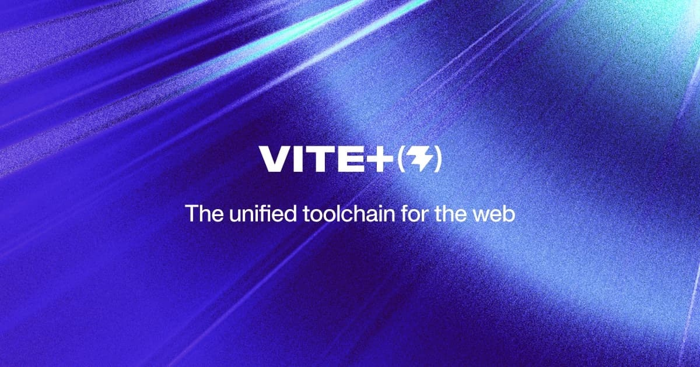
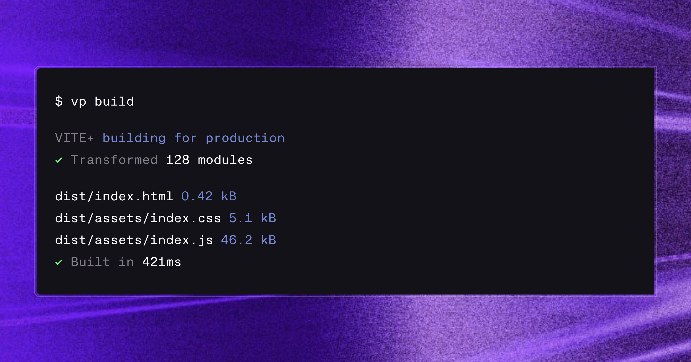
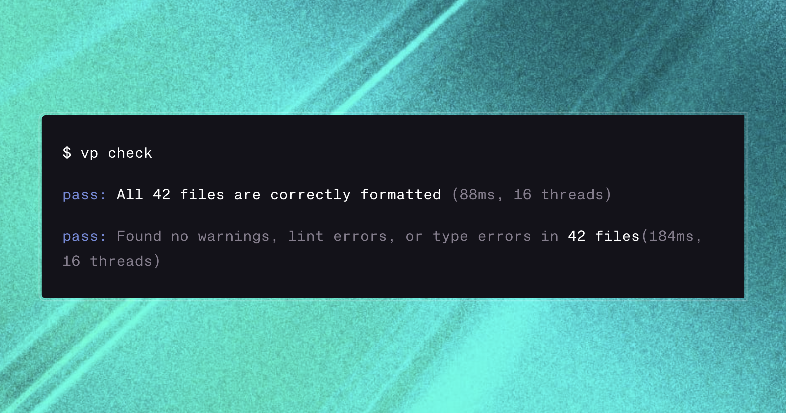

### 🎬 관련 영상
- [🎥 영상 보기](https://ph-files.imgix.net/7dc39de9-61db-41ba-b700-38d073be3b32.jpeg?auto=format)

---

## 4. [Fractal](https://www.producthunt.com/products/fractal-2)
**Votes**: 184 | **도입 난이도**: 중 | **신뢰도**: 중
**Tagline**: The fastest way to ship exceptional ChatGPT apps
**서비스 링크**: https://www.producthunt.com/r/36Z7WQPRVUH34E

**태그**: ChatGPT, DevTool, 자동화, AI, AI Tool, Chat

### 📌 이 서비스 한눈에 보기
Fractal은 ChatGPT 앱을 가장 빠르게 제작하고 배포할 수 있도록 아키텍처, 코딩, 테스트, 배포를 자동화하여 사용자가 제품 개발에만 집중할 수 있게 합니다.

### 🔑 주요 기능
- ChatGPT 앱 개발 속도 향상
- 아키텍처 계획, 코딩, 테스트, 배포 자동화
- 빠른 반복 개발 및 시장 출시 지원

### 🙋 사용자에게 어떤 점이 좋은가
Fractal을 사용하면 ChatGPT 앱을 몇 주가 아닌 몇 분 만에 개발하여 빠르게 시장에 출시하고 경쟁 우위를 확보할 수 있습니다.

### ✅ 지금 바로 써볼 기능
- Fractal을 사용하여 ChatGPT 앱 프로토타입 즉시 제작
- 자동화된 배포 기능 활용
- 빠른 반복 개발을 통해 사용자 피드백 반영

### ⚠️ 사용 전 확인할 점
- ChatGPT 앱 개발에 대한 기본적인 이해 필요
- Fractal의 자동화 수준 및 지원 범위 확인 필요

### 🧭 확인이 더 필요한 정보
Fractal이 지원하는 특정 ChatGPT 앱 유형 및 개발 환경에 대한 추가 정보 확인이 필요합니다.

### 📸 스크린샷 및 갤러리

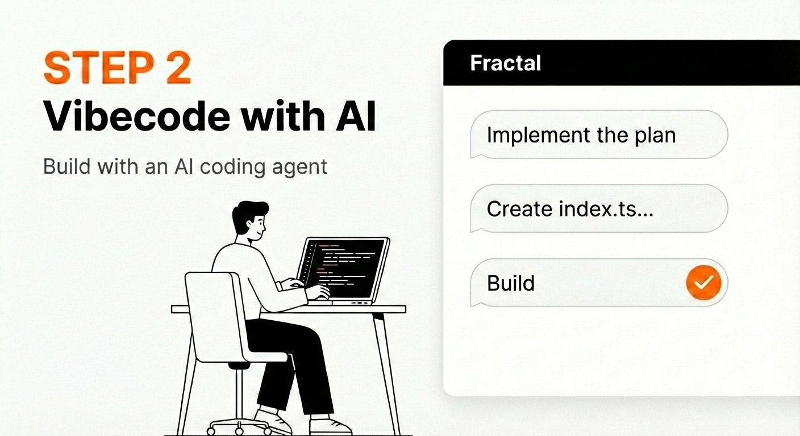

### 🎬 관련 영상
- [🎥 영상 보기](https://ph-files.imgix.net/a6c432d7-2341-4b6e-9743-2d6468280ef7.jpeg?auto=format)

---

## 5. [Cursor Glass](https://www.producthunt.com/products/glass-4)
**Votes**: 180 | **도입 난이도**: 중 | **신뢰도**: 중
**Tagline**: Unified agent workspace with seamless cloud handoff power
**서비스 링크**: https://www.producthunt.com/r/Z2YOTY7EIMZBX5

**태그**: DevTool, 클라우드, 자동화, 워크스페이스, Agent, Automation

### 📌 이 서비스 한눈에 보기
Cursor Glass는 에이전트, 저장소, 클라우드 작업을 통합 관리하고, 로컬-클라우드 환경 간 전환을 매끄럽게 해주는 개발자용 통합 워크스페이스입니다.

### 🔑 주요 기능
- 에이전트, 저장소, 클라우드 작업을 한 곳에서 관리
- 로컬-클라우드 환경 간 작업 전환으로 워크플로우 중단 최소화
- Composer 2 기반으로 강력한 코딩 성능 및 비용 절감

### 🙋 사용자에게 어떤 점이 좋은가
엔지니어는 여러 에이전트를 동시에 실행하면서 컨텍스트 전환을 줄이고 작업 가시성을 높일 수 있습니다. 클라우드 환경에서 개발하는 경우 특히 유용합니다.

### ✅ 지금 바로 써볼 기능
- 클라우드 핸드오프 기능으로 로컬-클라우드 전환 테스트
- Composer 2 성능을 기존 환경과 비교
- 에이전트 및 저장소 통합 관리 기능 사용

### ⚠️ 사용 전 확인할 점
- Composer 2 호환성 확인 필요
- 클라우드 환경 설정 및 연동 필요

### 🧭 확인이 더 필요한 정보
구체적인 성능 향상 정도 및 비용 절감 효과는 사용 환경에 따라 달라질 수 있습니다.

### 📸 스크린샷 및 갤러리
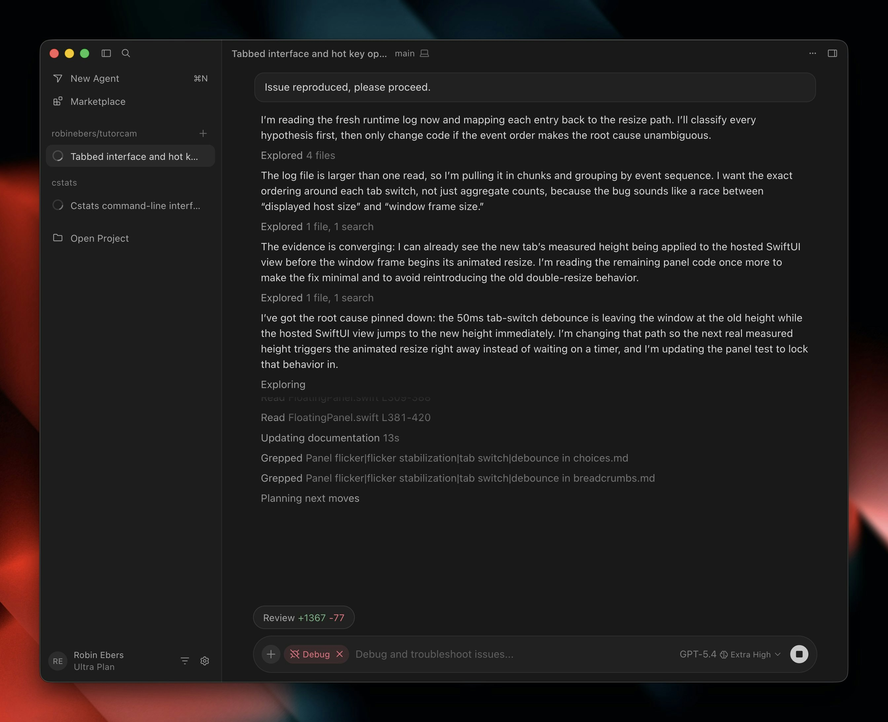
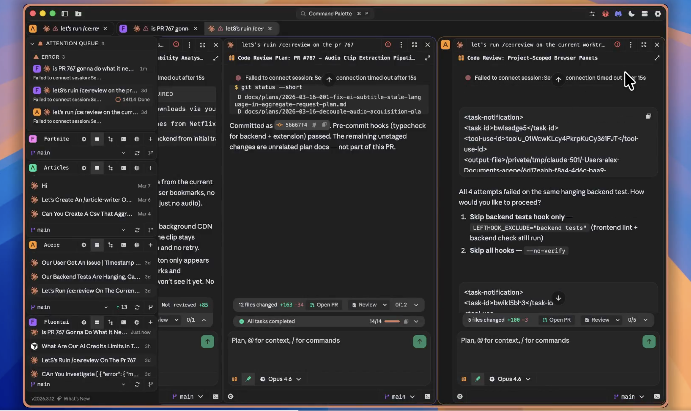
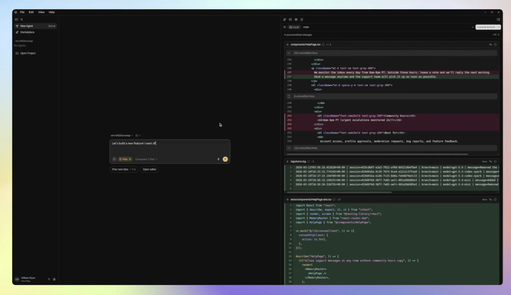

### 🎬 관련 영상
- [🎥 영상 보기](https://ph-files.imgix.net/cda06de7-d9f5-44b6-840e-647cfc5f52f3.jpeg?auto=format)

---

## 6. [Contral](https://www.producthunt.com/products/contral)
**Votes**: 127 | **도입 난이도**: 중 | **신뢰도**: 중
**Tagline**: The agentic IDE which teaches while you build.
**서비스 링크**: https://www.producthunt.com/r/BM54CGYFXXNADV

**태그**: IDE, AI, 개발 학습, 자동화, Agent, AI Tool, DevTool

### 📌 이 서비스 한눈에 보기
Contral은 AI 에이전트를 활용하여 개발자가 코딩을 배우면서 동시에 실제 프로젝트를 구축할 수 있도록 돕는 IDE입니다.

### 🔑 주요 기능
- 빌드 모드를 통해 실제 프로젝트를 구축하며 학습 가능
- AI 에이전트의 컨텍스트 기반 지원 제공
- 학습 모드를 통해 단계별 가이드 및 실시간 설명 제공

### 🙋 사용자에게 어떤 점이 좋은가
개발자는 Contral을 통해 실제 코딩 경험을 쌓으면서 효과적으로 프로그래밍 언어를 학습하고, AI의 도움을 받아 더욱 효율적인 개발이 가능합니다.

### ✅ 지금 바로 써볼 기능
- 빌드 모드에서 제공하는 컨텍스트 기반 지원 활용해보기
- 학습 모드에서 단계별 가이드 따라해보기
- AI 에이전트와 협업하여 코드 작성해보기

### ⚠️ 사용 전 확인할 점
- 현재 200명 이상의 개발자가 대기자 명단에 있으므로 즉시 사용 가능 여부 확인 필요
- AI 에이전트의 지원 범위 및 정확도 확인 필요

### 🧭 확인이 더 필요한 정보
Contral의 AI 에이전트가 지원하는 프로그래밍 언어 및 기능의 상세 목록 확인이 필요합니다.

### 📸 스크린샷 및 갤러리
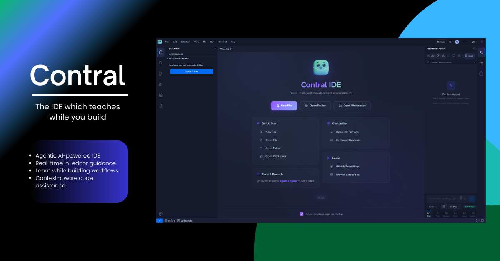
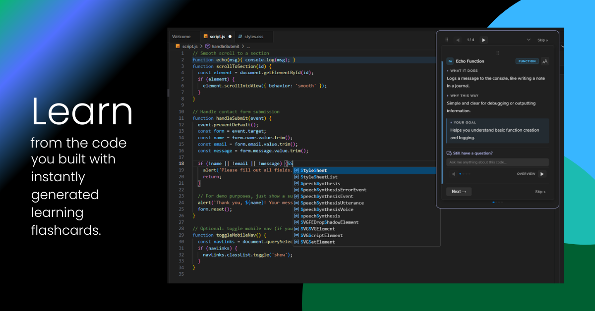
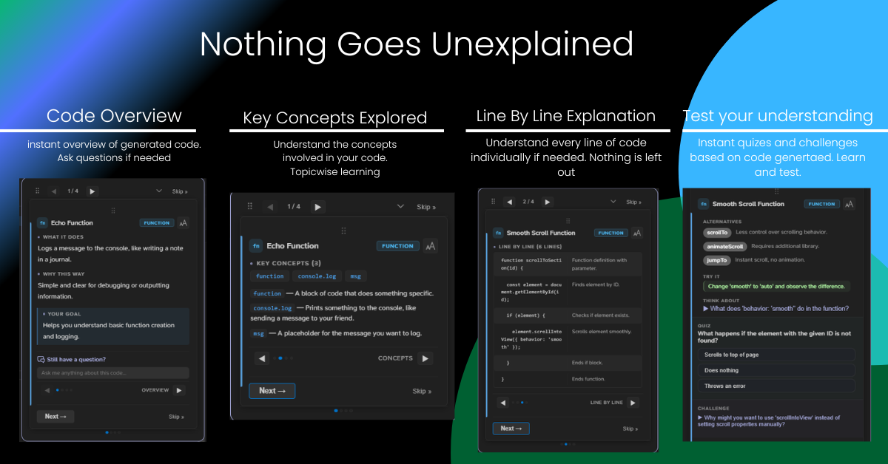

### 🎬 관련 영상
- [🎥 영상 보기](https://ph-files.imgix.net/31454a36-e57e-4791-a3ea-470822fadf7a.jpeg?auto=format)

---

## 7. [Replit Agent 4](https://www.producthunt.com/products/replit-agent-4)
**Votes**: 123 | **도입 난이도**: 중 | **신뢰도**: 중
**Tagline**: Build design, and ship anything AI fast in one flow
**서비스 링크**: https://www.producthunt.com/r/BLFA5DWV6PYKUJ

**태그**: AI, 협업, 개발, 자동화, Agent, AI Tool, Design

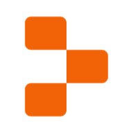

### 📌 이 서비스 한눈에 보기
Replit Agent 4는 인간과 AI 에이전트 간의 창의적인 협업을 지원하여 디자인, 개발, 배포를 하나의 흐름으로 통합하여 생산성을 극대화합니다.

### 🔑 주요 기능
- 무한 캔버스에서 디자인 가능
- 팀 협업 기능 제공
- 병렬 에이전트 실행 지원

### 🙋 사용자에게 어떤 점이 좋은가
반복적인 작업을 줄여 창작 흐름을 유지하고 앱, 사이트, 슬라이드 등을 더 빠르게 제작할 수 있도록 도와줍니다.

### ✅ 지금 바로 써볼 기능
- 무한 캔버스에서 디자인 시작하기
- 팀원 초대하여 협업하기
- 병렬 에이전트 실행하여 작업 속도 향상시키기

### ⚠️ 사용 전 확인할 점
- AI 에이전트의 결과물이 사용자의 의도와 정확히 일치하는지 확인 필요
- 팀 협업 시 권한 설정 및 관리 주의

### 🧭 확인이 더 필요한 정보
AI 에이전트의 성능이 복잡한 작업 환경에서 얼마나 효과적인지 추가적인 사용 사례 확인이 필요합니다.

### 📸 스크린샷 및 갤러리
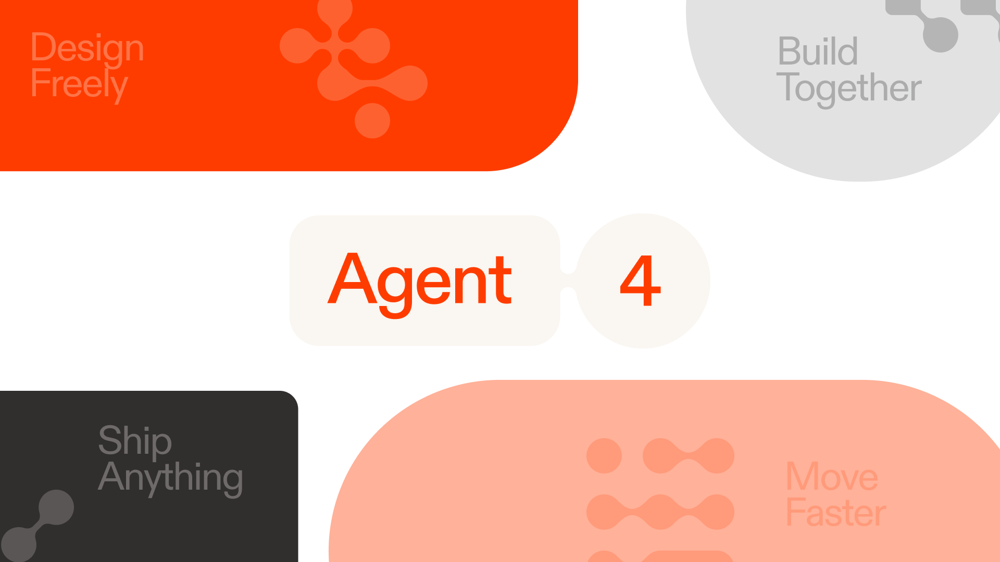
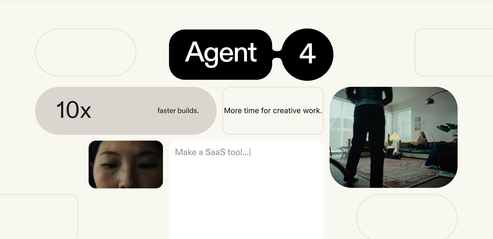
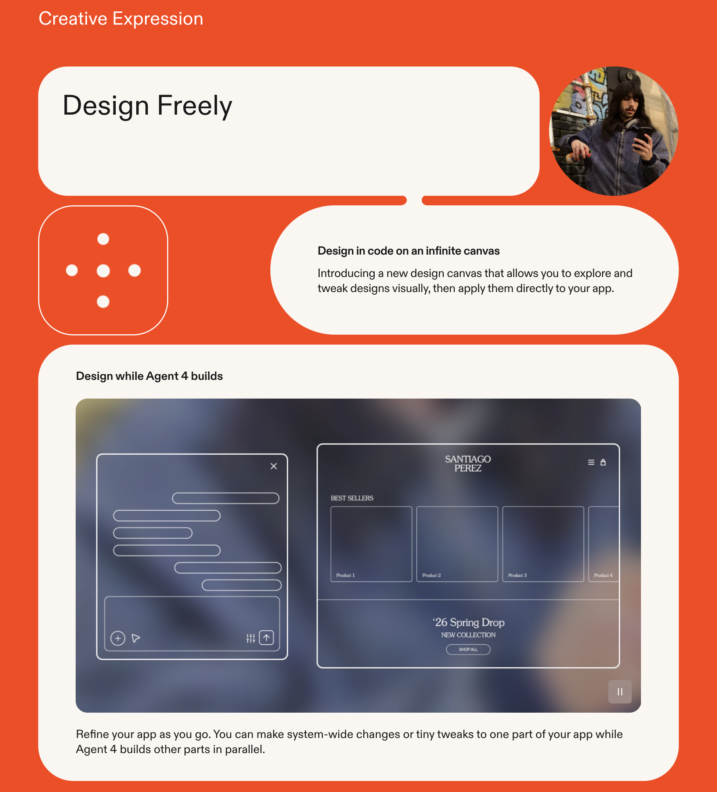

### 🎬 관련 영상
- [🎥 영상 보기](https://ph-files.imgix.net/a1933ca7-f46d-4290-b917-c3564f20a562.jpeg?auto=format)

---

## 8. [murmur](https://www.producthunt.com/products/murmur-7)
**Votes**: 115 | **도입 난이도**: 중 | **신뢰도**: 중
**Tagline**: practice tough phone calls with AI before you make them
**서비스 링크**: https://www.producthunt.com/r/WC7YOUJQ7EOBU2

**태그**: AI, 통화 연습, iOS, 시뮬레이션, 코칭, AI Tool, Chat

### 📌 이 서비스 한눈에 보기
Murmur는 AI와 실제 전화 통화를 연습하여 어려운 통화에 대한 두려움을 없애주는 iOS 앱입니다.

### 🔑 주요 기능
- 40개 이상의 시나리오 또는 직접 시나리오를 만들어 연습 가능
- AI와 실제 음성 통화처럼 대화하며 피드백을 즉시 받음
- 의사, 집주인, 면접관 등 다양한 역할과 통화 연습

### 🙋 사용자에게 어떤 점이 좋은가
실제 통화 전에 안전하고 비판 없는 환경에서 연습하여 자신감을 얻고, 통화 기술을 향상시킬 수 있습니다.

### ✅ 지금 바로 써볼 기능
- 내장된 시나리오 중 하나를 선택하여 AI와 통화 연습 시작
- 자신만의 시나리오를 만들어 특정 상황에 대비
- 통화 후 피드백을 통해 개선할 부분 파악

### ⚠️ 사용 전 확인할 점
- iOS 기기에서만 사용 가능
- AI의 피드백은 참고용이며, 실제 상황과 차이가 있을 수 있음

### 🧭 확인이 더 필요한 정보
AI 코칭의 정확도와 다양한 통화 상황에 대한 적용 가능성을 추가적으로 확인해야 합니다.

### 📸 스크린샷 및 갤러리
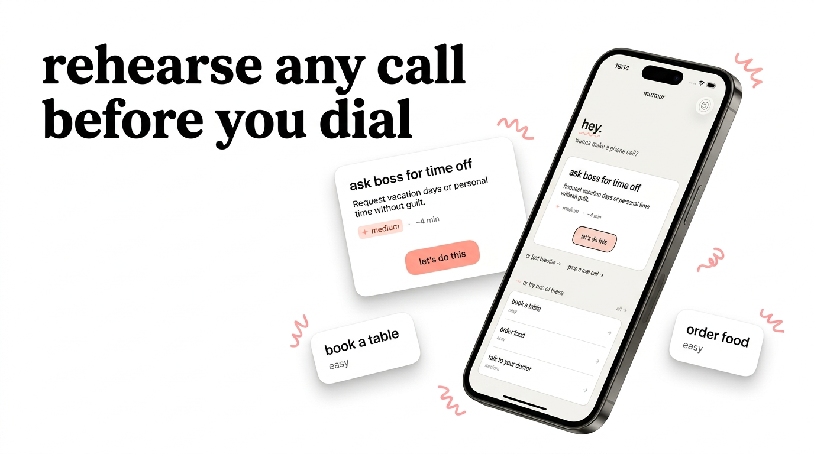

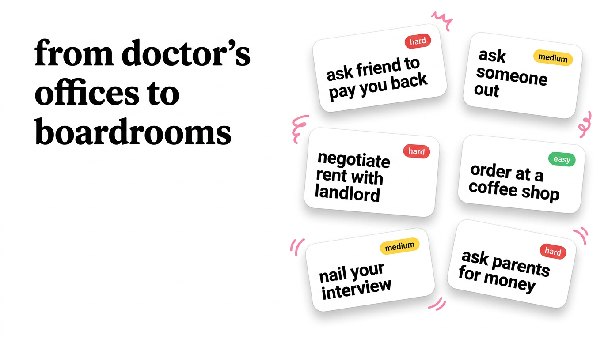

---

## 9. [Mindspend](https://www.producthunt.com/products/mindspend)
**Votes**: 115 | **도입 난이도**: 하 | **신뢰도**: 중
**Tagline**: Track how you feel about spending, not just the numbers
**서비스 링크**: https://www.producthunt.com/r/TVR2TYYARASWFJ

**태그**: 예산 관리, 감정 분석, 소비 습관

### 📌 이 서비스 한눈에 보기
Mindspend는 지출에 대한 감정을 추적하여 소비 습관을 새로운 시각으로 이해하도록 돕는 예산 관리 앱입니다.

### 🔑 주요 기능
- 각 구매 후 '가치 있음', '괜찮음', '후회' 중 감정 태그 선택
- 은행 연동이나 복잡한 설정 없이 간단하게 사용 가능
- 몇 주 후, 감정을 통해 소비 패턴을 파악

### 🙋 사용자에게 어떤 점이 좋은가
단순히 돈이 어디로 흘러가는지 아는 것을 넘어, 소비에 대한 감정을 이해함으로써 더 나은 소비 습관을 형성하도록 돕습니다.

### ✅ 지금 바로 써볼 기능
- 구매 후 감정 태그를 꼼꼼히 기록하기
- 몇 주 동안의 지출 패턴을 분석하여 감정 변화 확인하기
- 후회하는 지출 항목을 파악하고 개선 방안 모색하기

### ⚠️ 사용 전 확인할 점
- 수동으로 지출을 기록해야 하므로 번거로울 수 있음
- 감정에 의존하므로 객관적인 분석이 어려울 수 있음

### 🧭 확인이 더 필요한 정보
Mindspend가 장기적인 소비 습관 개선에 얼마나 효과적인지 추가적인 사용 후기 확인이 필요합니다.

### 📸 스크린샷 및 갤러리

---

## 10. [Novi Notes](https://www.producthunt.com/products/novi-notes)
**Votes**: 95 | **도입 난이도**: 하 | **신뢰도**: 중
**Tagline**: Local-first AI note app for Mac zero config via MCP
**서비스 링크**: https://www.producthunt.com/r/BDKX4FKB7AYWA6

**태그**: AI, 노트, 맥, 오프라인, 생산성, AI Tool, API

### 📌 이 서비스 한눈에 보기
Novi Notes는 로컬 우선 맥 노트 앱으로, 별도 설정 없이 MCP를 통해 AI 기능을 바로 사용할 수 있어 편리합니다.

### 🔑 주요 기능
- MCP를 통한 AI 기본 지원
- 100% 로컬 및 오프라인 사용
- 일회성 구매, 구독 불필요

### 🙋 사용자에게 어떤 점이 좋은가
별도의 설정 없이 Claude AI를 통해 노트를 읽고 쓸 수 있어 생산성을 높여줍니다. 인터넷 연결 없이도 사용 가능하여 보안이 중요한 사용자에게 적합합니다.

### ✅ 지금 바로 써볼 기능
- Claude AI를 사용하여 노트 작성해보기
- 오프라인 상태에서 노트 사용해보기
- 데일리 노트, 매뉴얼, 포스트잇 기능 사용해보기

### ⚠️ 사용 전 확인할 점
- MCP 호환성 확인 필요
- Claude AI 사용 가능 여부 확인 필요

### 🧭 확인이 더 필요한 정보
MCP를 통해 Claude AI를 사용하는 방식에 대한 추가 정보 확인이 필요합니다.

### 📸 스크린샷 및 갤러리
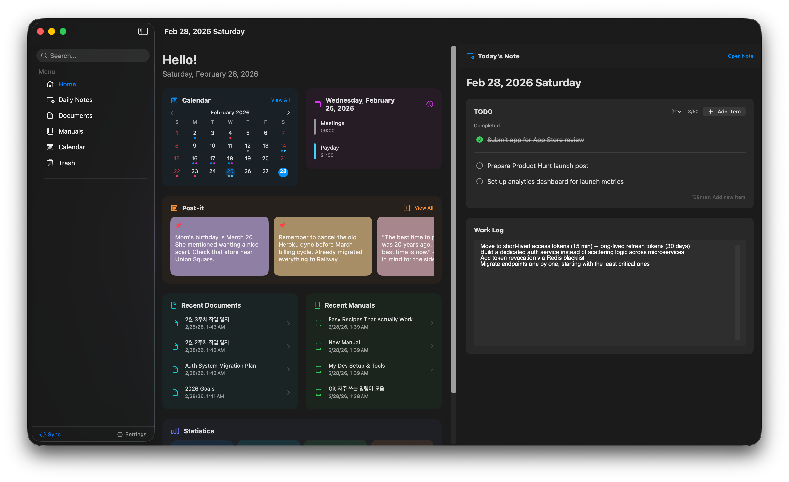

---

