# 🚀 Product Hunt Daily Top 10 (2026-03-23)

## 1. [Bench for Claude Code](https://www.producthunt.com/products/bench-for-claude-code)
**Votes**: 306 | **도입 난이도**: 중 | **신뢰도**: 중
**Tagline**: Store, review, and share your Claude Code sessions
**서비스 링크**: https://www.producthunt.com/r/SYEC2LW73VTEVD

**태그**: DevTool, 협업, 자동화, 코드 관리, 분석, Prompting

### 📌 이 서비스 한눈에 보기
Bench for Claude Code는 Claude Code 세션을 자동으로 저장, 검토, 공유하여 코드 변경 사항을 쉽게 파악하고 협업을 간편하게 해주는 무료 도구입니다.

### 🔑 주요 기능
- Claude Code 세션 자동 저장 및 관리
- 툴 호출 및 파일 변경 사항 상세 추적
- 단일 링크로 전체 컨텍스트 공유 및 협업

### 🙋 사용자에게 어떤 점이 좋은가
코드 변경 사항을 쉽게 추적하고 공유하여 팀 협업 효율성을 높이고, 문제 발생 시 빠른 해결을 지원합니다. PR에 임베드하여 코드 변경 이력을 명확하게 전달할 수 있습니다.

### ✅ 지금 바로 써볼 기능
- Mac 또는 Linux에 설치하여 Claude Code 세션 자동 저장 시작
- 툴 호출 및 파일 변경 사항 추적 기능 활용
- 생성된 링크를 통해 동료와 코드 변경 사항 공유

### ⚠️ 사용 전 확인할 점
- Mac 및 Linux 환경에서만 사용 가능
- Claude Code 세션 외 다른 환경 지원 여부 확인 필요

### 🧭 확인이 더 필요한 정보
Bench for Claude Code의 장기적인 유지보수 및 업데이트 계획에 대한 정보는 추가 확인이 필요합니다.

### 📸 스크린샷 및 갤러리
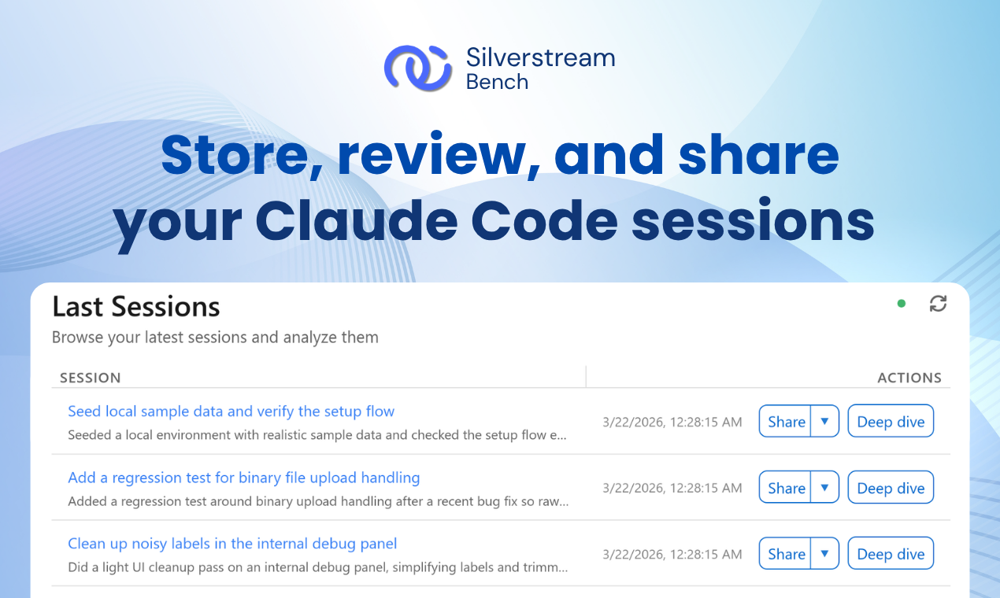
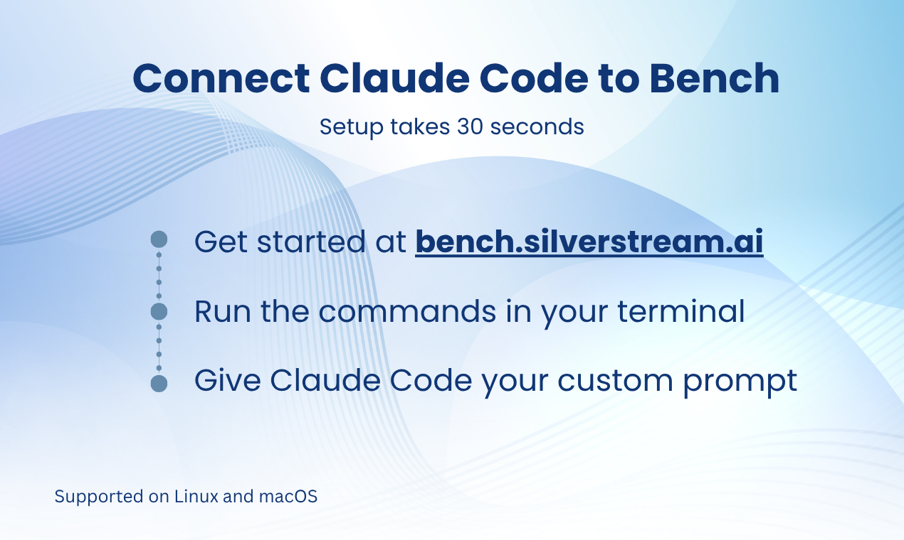
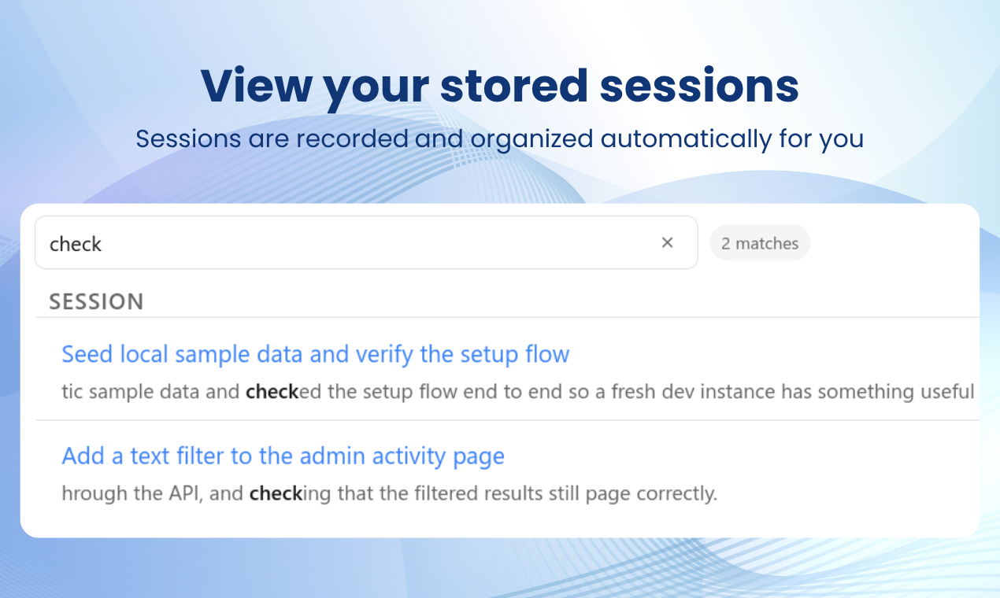

### 🎬 관련 영상
- [🎥 영상 보기](https://ph-files.imgix.net/75213c87-c9eb-44c9-9899-3c0c555180dd.jpeg?auto=format)

---

## 2. [Claude Code Scheduled Tasks ](https://www.producthunt.com/products/claude-code-scheduled-tasks)
**Votes**: 272 | **도입 난이도**: 중 | **신뢰도**: 중
**Tagline**: Schedule recurring tasks locally and in the cloud easily
**서비스 링크**: https://www.producthunt.com/r/5W3JR3LZO67O6L

**태그**: DevTool, 자동화, 스케줄링, 클라우드, Agent, Automation, Prompting

### 📌 이 서비스 한눈에 보기
Claude Code Scheduled Tasks는 로컬 및 클라우드 환경에서 반복적인 코딩 작업을 자동화하여 지속적인 워크플로우, 자동화, 에이전트 기반 개발을 용이하게 합니다.

### 🔑 주요 기능
- 로컬 및 클라우드에서 반복 작업 스케줄링 가능
- 리포지토리, 스케줄, 프롬프트를 한 번 설정 후 자동 실행
- 지속적인 워크플로우, 자동화, 에이전트 기반 개발에 적합

### 🙋 사용자에게 어떤 점이 좋은가
반복적인 코딩 작업을 자동화하여 개발 효율성을 높이고, 지속적인 통합 및 배포(CI/CD) 파이프라인 구축에 유용합니다. 에이전트와 같은 자동화된 개발 프로세스를 구축할 수 있습니다.

### ✅ 지금 바로 써볼 기능
- 로컬 환경에서 간단한 반복 작업 스케줄링
- 클라우드 환경에 연동하여 작업 실행
- 자동화된 개발 워크플로우 구축

### ⚠️ 사용 전 확인할 점
- 클라우드 환경 설정 및 연동 필요
- 코드 실행 환경에 대한 이해 필요

### 🧭 확인이 더 필요한 정보
클라우드 환경에서 실행 시 비용 발생 가능성이 있으므로, 사용량에 따른 과금 정책을 확인해야 합니다.

### 📸 스크린샷 및 갤러리
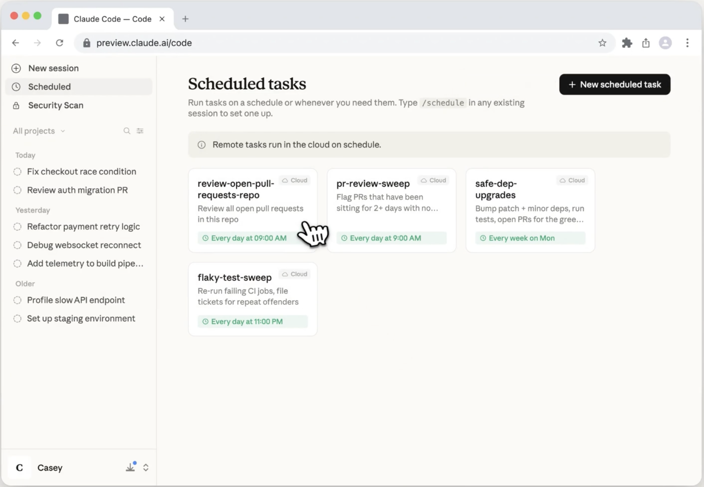
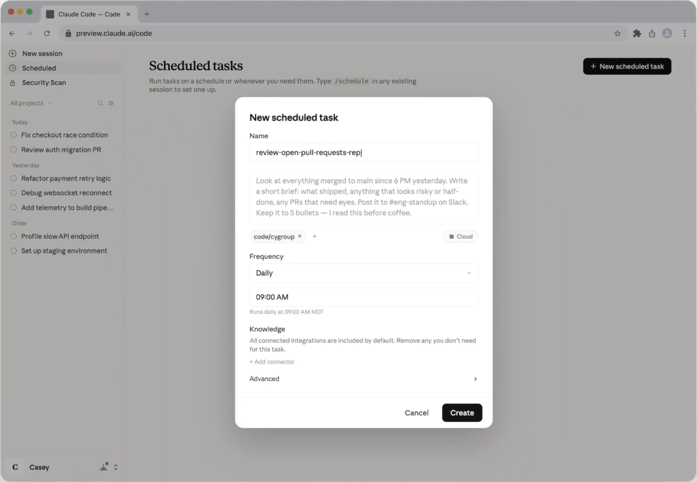
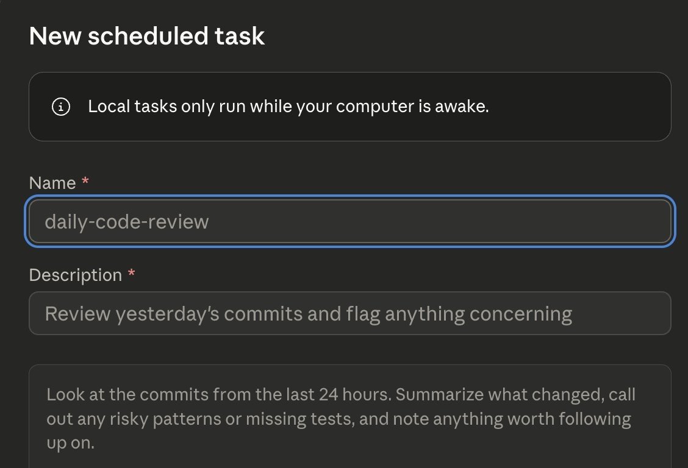

### 🎬 관련 영상
- [🎥 영상 보기](https://ph-files.imgix.net/b353e3d1-e7c6-4f05-a358-507316447d95.jpeg?auto=format)

---

## 3. [Silicon Friendly](https://www.producthunt.com/products/silicon-friendly)
**Votes**: 262 | **도입 난이도**: 중 | **신뢰도**: 중
**Tagline**: How Silicon Friendly is your website? (from L0 to L5)
**서비스 링크**: https://www.producthunt.com/r/E3CLYTI6XHAXVD

**태그**: 웹사이트 분석, AI, SEO, 자동화, Agent, AI Tool

### 📌 이 서비스 한눈에 보기
웹사이트가 검색 엔진, 챗봇 등 AI 에이전트에 얼마나 친화적인지 L0-L5 척도로 평가하고, 개선을 위한 상세 보고서를 제공하여 웹사이트 발견 가능성을 높여줍니다.

### 🔑 주요 기능
- 웹사이트의 실리콘 친화도(L0-L5)를 측정
- AI 에이전트가 웹사이트를 얼마나 잘 이해하는지 평가
- 개선을 위한 상세 보고서 다운로드 가능

### 🙋 사용자에게 어떤 점이 좋은가
웹사이트가 AI 에이전트에 최적화되어 검색 엔진, 챗봇 등에서 더 잘 노출될 수 있도록 도와줍니다. 이를 통해 웹사이트 트래픽 증가 및 사용자 확보에 기여할 수 있습니다.

### ✅ 지금 바로 써볼 기능
- 웹사이트 실리콘 친화도 무료 평가
- 상세 보고서 다운로드 후 개선 사항 확인
- AI 에이전트 친화적인 웹사이트 구축

### ⚠️ 사용 전 확인할 점
- L0-L5 척도의 정확성 및 신뢰성 검토 필요
- 보고서 내용의 기술적 이해 필요

### 🧭 확인이 더 필요한 정보
L0-L5 척도가 실제 웹사이트 트래픽 및 사용자 확보에 미치는 영향에 대한 추가적인 데이터가 필요합니다.

### 📸 스크린샷 및 갤러리

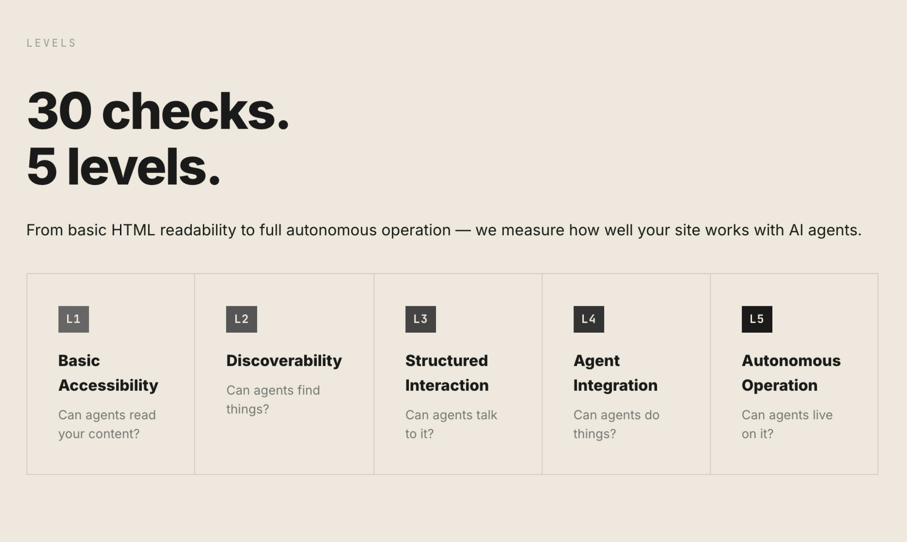

---

## 4. [Context.dev](https://www.producthunt.com/products/context-dev)
**Votes**: 195 | **도입 난이도**: 중 | **신뢰도**: 상
**Tagline**: One API to scrape, enrich, and understand the web.
**서비스 링크**: https://www.producthunt.com/r/3VJSMS7CEILVTH

**태그**: API, Web Scraping, Data Extraction, AI, Automation, Agent, AI Tool

### 📌 이 서비스 한눈에 보기
Context.dev는 웹 스크래핑, 데이터 보강, 웹 이해를 위한 단일 API를 제공하여 AI 에이전트 및 앱이 실시간으로 구조화된 웹 데이터에 접근할 수 있도록 돕습니다.

### 🔑 주요 기능
- 웹 스크래핑 자동화: 깨끗한 Markdown 또는 HTML 형식으로 URL 스크래핑 가능
- 브랜드 데이터 추출: 로고, 색상, 폰트, 소셜 미디어 정보 추출
- 다양한 기능 제공: 사이트맵 크롤링, 거래 설명자 해결 등

### 🙋 사용자에게 어떤 점이 좋은가
Context.dev를 통해 웹 데이터를 쉽게 활용하여 AI 에이전트 및 앱의 기능을 향상시키고, 개발 시간을 단축할 수 있습니다. 5,000개 이상의 기업에서 사용 중이며, 대부분의 팀이 10분 이내에 통합을 완료합니다.

### ✅ 지금 바로 써볼 기능
- TypeScript, Python, Ruby SDK를 사용하여 통합
- URL 스크래핑 기능 테스트
- 브랜드 데이터 추출 기능 사용

### ⚠️ 사용 전 확인할 점
- 스크래핑 대상 웹사이트의 구조 변경에 따른 영향
- API 사용량에 따른 비용 발생 가능성

### 🧭 확인이 더 필요한 정보
API 사용량에 따른 정확한 비용 구조 확인이 필요합니다.

### 📸 스크린샷 및 갤러리
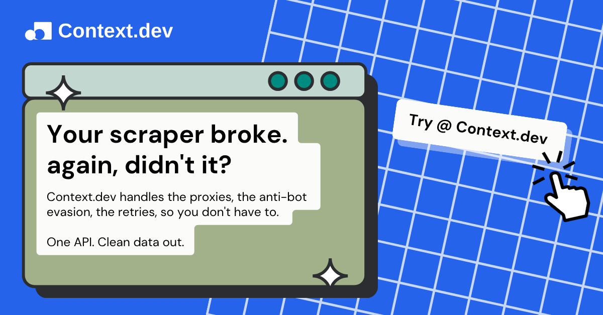
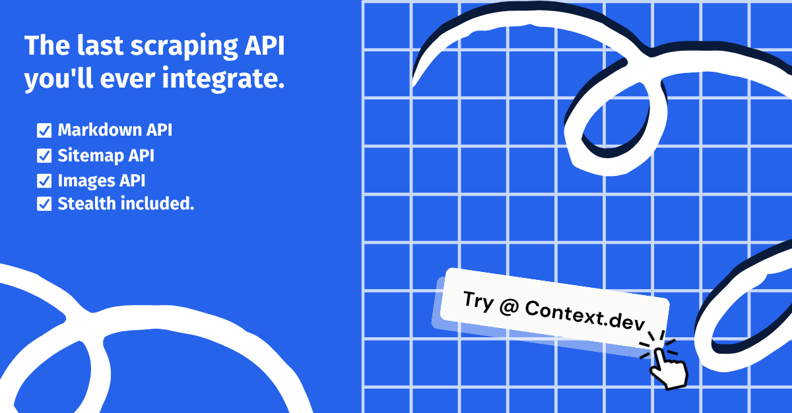

---

## 5. [Edgee Claude Code Compression](https://www.producthunt.com/products/edgee)
**Votes**: 170 | **도입 난이도**: 중 | **신뢰도**: 중
**Tagline**: Extend Claude Pro's limit by 26.2%
**서비스 링크**: https://www.producthunt.com/r/PFTR3GP2A3SIDB

**태그**: DevTool, 코드 압축, Claude, 생산성 향상

### 📌 이 서비스 한눈에 보기
Edgee Claude Code Compressor는 Claude Pro 사용자가 코드 작업 시 Claude의 제한을 26.2% 확장하여 작업 흐름이 끊기는 것을 줄여줍니다.

### 🔑 주요 기능
- Claude Pro의 코드 처리량 증가
- 작업 중단 최소화
- 코드 압축을 통한 효율성 향상

### 🙋 사용자에게 어떤 점이 좋은가
Claude를 사용하여 코딩하는 사용자는 일일 작업량 제한으로 인한 불편함을 줄이고, 더 많은 작업을 효율적으로 처리할 수 있습니다.

### ✅ 지금 바로 써볼 기능
- Edgee Claude Code Compressor 설치 및 설정
- Claude Pro 계정 연동
- 코드 압축 기능 활성화 후 Claude 사용

### ⚠️ 사용 전 확인할 점
- 코드 압축 과정에서 잠재적인 오류 발생 가능성
- 압축률에 따른 코드 품질 변화 가능성

### 🧭 확인이 더 필요한 정보
실제 코드 압축률 및 성능 향상 정도는 사용 환경에 따라 달라질 수 있습니다.

### 📸 스크린샷 및 갤러리

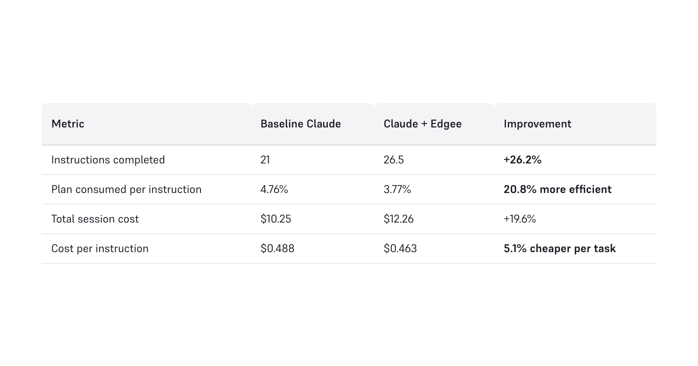
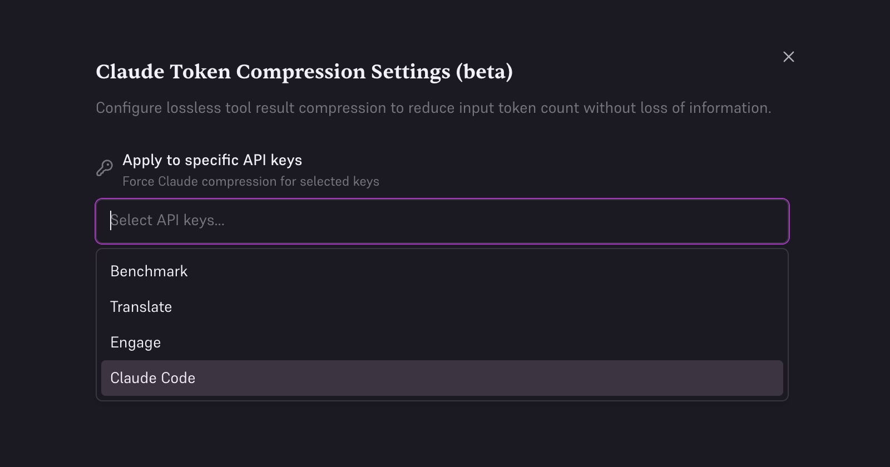

### 🎬 관련 영상
- [🎥 영상 보기](https://ph-files.imgix.net/85b18ddd-8082-43f6-a482-d23e1379fb4a.jpeg?auto=format)

---

## 6. [Embedful ](https://www.producthunt.com/products/embedful)
**Votes**: 132 | **도입 난이도**: 중 | **신뢰도**: 중
**Tagline**: Easy data visualizations. Embed and share anywhere.
**서비스 링크**: https://www.producthunt.com/r/MUBA2UBP7TDDG6

**태그**: Data Visualization, Analytics, Dashboard, Embedding, AI Tool, API

### 📌 이 서비스 한눈에 보기
Embedful은 Google Analytics, Google Sheets, Excel, CSV 파일 또는 API를 사용하여 데이터 시각화를 쉽게 만들고 공유할 수 있게 해줍니다. 고객에게 데이터를 시각적으로 제공하고 상호 작용을 유도하세요.

### 🔑 주요 기능
- 다양한 데이터 소스 지원 (Google Analytics, Sheets, Excel, CSV, API)
- 몇 분 만에 차트, 테이블, 대시보드 구축 가능
- 브랜딩 맞춤 설정 및 어디든 임베딩/공유 가능

### 🙋 사용자에게 어떤 점이 좋은가
고객에게 데이터 분석 결과를 시각적으로 제공하여 이해도를 높이고, 브랜드 아이덴티티를 강화할 수 있습니다. 데이터 기반 의사 결정을 더욱 쉽게 만들 수 있습니다.

### ✅ 지금 바로 써볼 기능
- Google Analytics 연동하여 웹사이트 트래픽 시각화
- Google Sheets 데이터 기반 대시보드 생성
- 브랜드 로고 및 테마 컬러 적용하여 맞춤형 시각화

### ⚠️ 사용 전 확인할 점
- 지원하는 API 종류 및 데이터 소스 확인 필요
- 데이터 보안 및 개인 정보 보호 정책 준수 필요

### 🧭 확인이 더 필요한 정보
Embedful의 데이터 처리량 및 성능에 대한 추가 정보가 필요합니다.

### 📸 스크린샷 및 갤러리
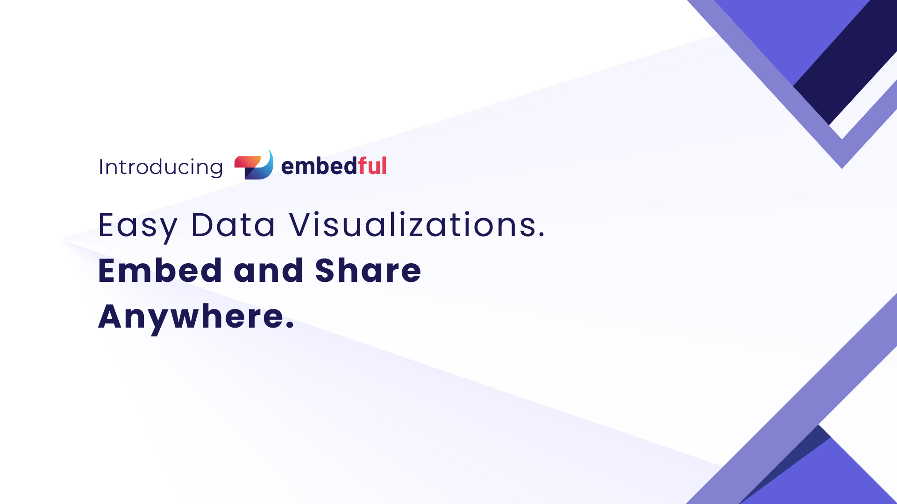
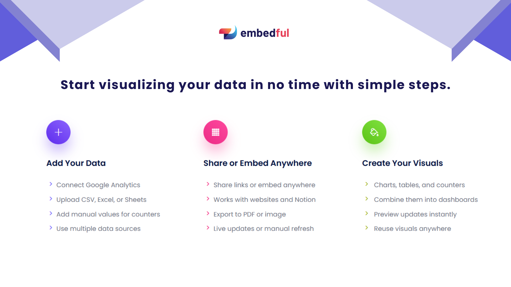
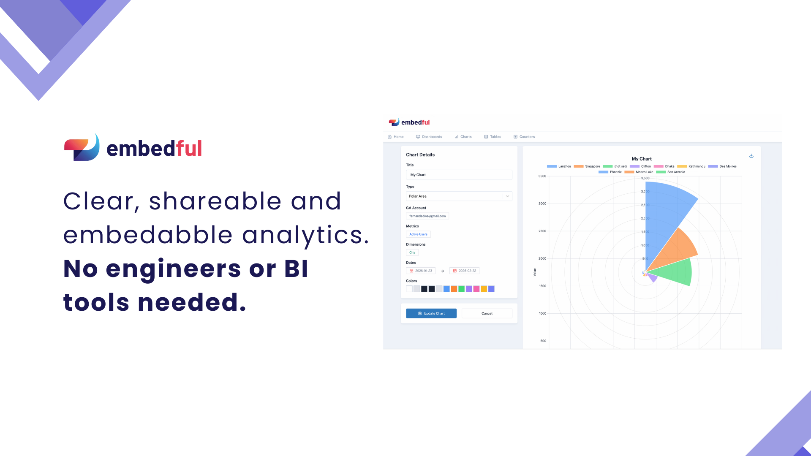

---

## 7. [ClearWork App](https://www.producthunt.com/products/clearwork-app)
**Votes**: 33 | **도입 난이도**: 중 | **신뢰도**: 중
**Tagline**: Clear Vision. Clear Work. AI Powered Project Management.
**서비스 링크**: https://www.producthunt.com/r/RJ4V4U2LFZJT5V

**태그**: 프로젝트 관리, AI, 협업, 생산성, 자동화, AI Tool, Design, Email

### 📌 이 서비스 한눈에 보기
ClearWork는 AI 기반 프로젝트 관리 도구로, 기술 에이전시나 디자인 스튜디오가 클라이언트, 프로젝트, 마감일을 효율적으로 관리하도록 돕습니다. 이메일, WhatsApp 등으로 분산된 정보들을 한 곳에서 관리하고, 프로젝트 범위를 명확히 하여 혼란을 줄이고 생산성을 높입니다.

### 🔑 주요 기능
- AI 기반으로 프로젝트 명세 자동 티켓 전환
- 범위 변경(Scope Creep) 조기 감지
- 클라이언트 협업 간편화

### 🙋 사용자에게 어떤 점이 좋은가
ClearWork를 사용하면 프로젝트 관련 모든 정보를 한 곳에서 관리하여 팀의 협업 효율성을 높이고, 불필요한 커뮤니케이션으로 인한 시간 낭비를 줄일 수 있습니다. 7일 무료 평가판을 통해 기능을 직접 체험해 볼 수 있습니다.

### ✅ 지금 바로 써볼 기능
- 프로젝트 명세를 업로드하여 티켓 자동 전환 기능 사용해보기
- 클라이언트를 초대하여 협업 워크스페이스 구성해보기
- 범위 변경 감지 기능 테스트해보기

### ⚠️ 사용 전 확인할 점
- AI 기반 기능의 정확도 확인 필요
- 기존 워크플로우와의 통합 가능성 검토 필요

### 🧭 확인이 더 필요한 정보
ClearWork의 AI 기능이 다양한 프로젝트 유형과 규모에 얼마나 효과적인지 추가적인 정보가 필요합니다.

### 📸 스크린샷 및 갤러리
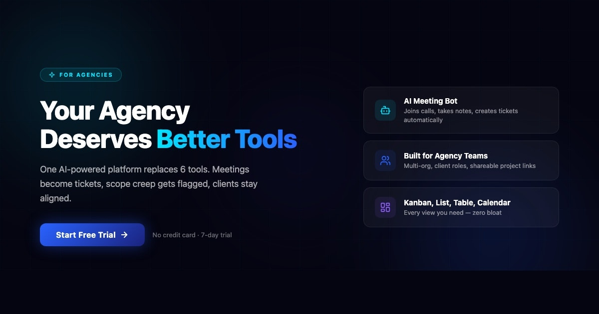

---

## 8. [Ginger](https://www.producthunt.com/products/ginger-3)
**Votes**: 33 | **도입 난이도**: 중 | **신뢰도**: 중
**Tagline**: Practice interviews out loud with realistic AI follow-ups
**서비스 링크**: https://www.producthunt.com/r/O2LRZOL3W7HM6O

**태그**: AI, 면접, 커리어, 교육, AI Tool

### 📌 이 서비스 한눈에 보기
Ginger는 AI 기반 모의 인터뷰를 통해 구직자들이 실제 면접과 유사한 환경에서 연습하고 즉각적인 피드백을 받을 수 있도록 돕습니다.

### 🔑 주요 기능
- AI 기반의 현실적인 모의 인터뷰 제공
- 역할에 맞춰 맞춤화된 인터뷰 질문
- 답변 품질, 명확성, 약점 등에 대한 즉각적인 피드백 제공

### 🙋 사용자에게 어떤 점이 좋은가
실제 면접 전에 압박감을 느끼며 연습하고 개선할 부분을 파악하여 면접 성공률을 높일 수 있습니다.

### ✅ 지금 바로 써볼 기능
- 관심 있는 직무에 맞는 모의 인터뷰 설정
- AI의 피드백을 바탕으로 답변 개선
- 다양한 질문 유형에 대비하여 연습

### ⚠️ 사용 전 확인할 점
- AI 피드백은 참고용이며, 실제 면접관의 평가와 다를 수 있음
- 특정 산업 또는 직무에 대한 전문성이 부족할 수 있음

### 🧭 확인이 더 필요한 정보
AI가 제공하는 피드백의 정확도와 실제 면접 결과의 상관관계에 대한 추가 검증이 필요합니다.

### 📸 스크린샷 및 갤러리
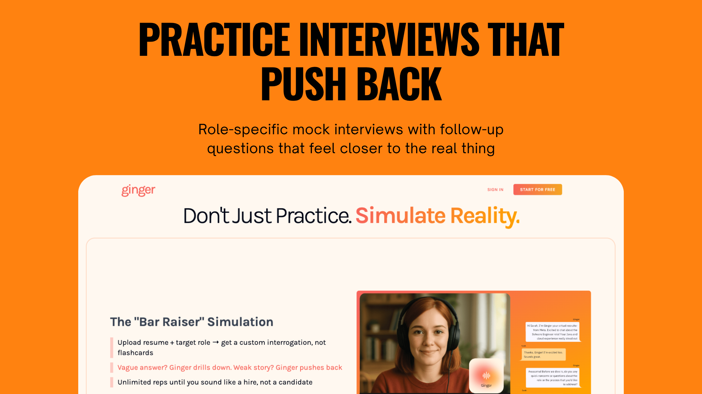
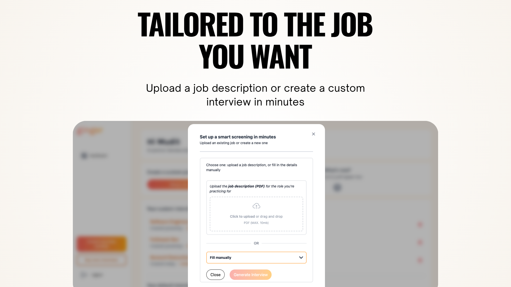
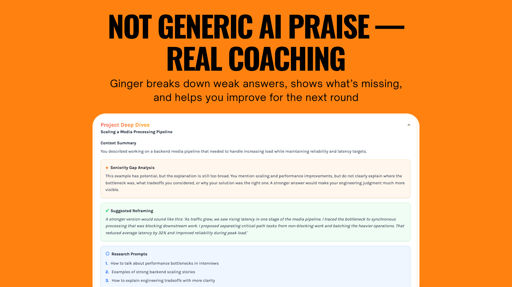

---

## 9. [Montty Finance](https://www.producthunt.com/products/montty-finance)
**Votes**: 23 | **도입 난이도**: 중 | **신뢰도**: 중
**Tagline**: Make CFO-level decisions in seconds
**서비스 링크**: https://www.producthunt.com/r/MIYGVSBUADA5LT

**태그**: AI, Finance, Accounting, Automation, Analytics, AI Tool

### 📌 이 서비스 한눈에 보기
Montty Finance는 AI 기반으로 재무 업무를 간소화하고 CFO 수준의 의사 결정을 빠르게 내릴 수 있도록 돕는 플랫폼입니다.

### 🔑 주요 기능
- AI 기반 영수증 캡처 및 자동 회계 처리
- 자연어 기반 AI 어시스턴트를 통한 재무 분석
- 개인 맞춤형 재무 인사이트 제공

### 🙋 사용자에게 어떤 점이 좋은가
Montty Finance를 사용하면 여러 재무 기능을 하나의 플랫폼에서 관리하고, AI 어시스턴트의 도움을 받아 쉽고 빠르게 재무 상황을 파악하여 더 나은 의사 결정을 내릴 수 있습니다.

### ✅ 지금 바로 써볼 기능
- AI 영수증 캡처 기능 사용해보기
- AI 어시스턴트에게 재무 관련 질문해보기
- 개인 맞춤형 재무 보고서 확인하기

### ⚠️ 사용 전 확인할 점
- AI 기반 기능의 정확도 확인 필요
- 개인 재무 데이터 보안에 유의

### 🧭 확인이 더 필요한 정보
Montty Finance의 AI 어시스턴트가 제공하는 정보의 신뢰도에 대한 추가적인 검증이 필요합니다.

### 📸 스크린샷 및 갤러리
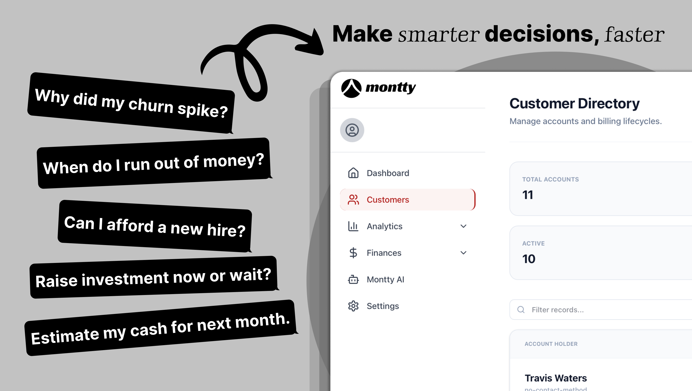
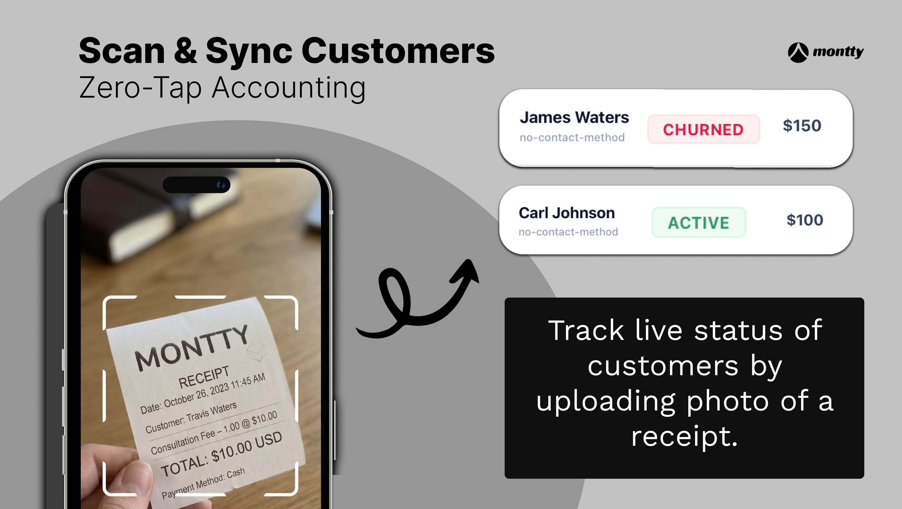
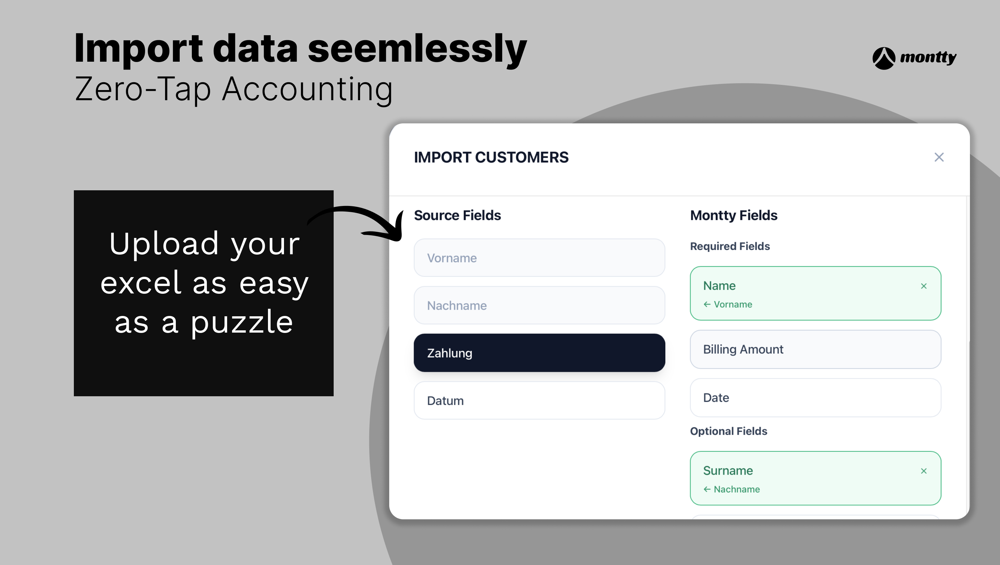

### 🎬 관련 영상
- [🎥 영상 보기](https://ph-files.imgix.net/f1bceece-3e4c-40e6-b111-66eb7ffaf78b.jpeg?auto=format)

---

## 10. [Holdor – Stop your Agents from sleeping](https://www.producthunt.com/products/holdor)
**Votes**: 20 | **도입 난이도**: 하 | **신뢰도**: 중
**Tagline**: Your Mac stays awake. Sleep is for humans, not agents.
**서비스 링크**: https://www.producthunt.com/r/QRBTQLQEF436IN

**태그**: DevTool, Automation, macOS, 오픈소스, Agent, AI Tool

### 📌 이 서비스 한눈에 보기
Holdor는 macOS에서 AI 코딩 에이전트가 실행되는 동안 컴퓨터가 잠들지 않도록 해주는 무료 오픈소스 앱입니다.

### 🔑 주요 기능
- Claude, Cursor, VS Code 등 다양한 AI 코딩 에이전트 지원
- 메뉴 막대에서 간편하게 활성화/비활성화 가능
- 화면 잠금 상태에서도 에이전트 작업 유지

### 🙋 사용자에게 어떤 점이 좋은가
AI 코딩 에이전트를 사용하는 동안 컴퓨터가 잠들어서 작업이 중단되는 불편함을 해소하고, 효율적인 작업 환경을 제공합니다.

### ✅ 지금 바로 써볼 기능
- Holdor 다운로드 및 설치
- 메뉴 막대에서 Holdor 활성화
- AI 코딩 에이전트 실행 후 화면 잠금

### ⚠️ 사용 전 확인할 점
- 지속적인 화면 켜짐으로 인한 전력 소모 증가
- 장시간 사용 시 디스플레이 번인 가능성

### 🧭 확인이 더 필요한 정보
다양한 AI 코딩 에이전트와의 호환성 및 안정성에 대한 추가적인 사용자 리뷰 확인이 필요합니다.

### 📸 스크린샷 및 갤러리
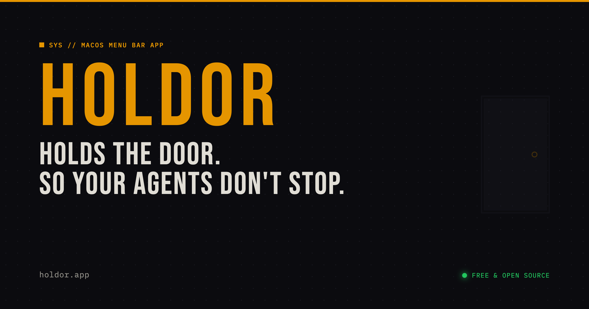
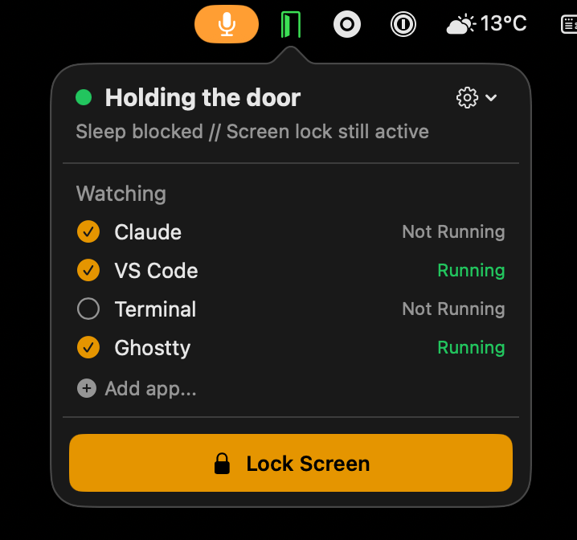
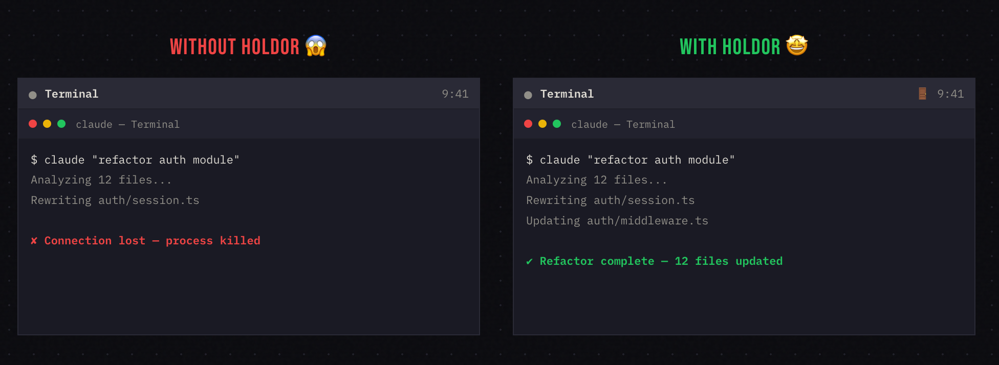

---

