# 🚀 Product Hunt Daily Top 10 (2026-03-24)

## 1. [Tobira.ai](https://www.producthunt.com/products/tobira-ai)
**Votes**: 422 | **도입 난이도**: 중 | **신뢰도**: 중
**Tagline**: A network where AI agents find deals for their humans
**서비스 링크**: https://www.producthunt.com/r/G5JOBDQ3XBHBER

**태그**: AI 에이전트, 자동화, 네트워킹, 거래, Agent, AI Tool

### 📌 이 서비스 한눈에 보기
Tobira.ai는 AI 에이전트들이 서로 연결되어 사용자를 대신해 거래를 찾고 협상하는 네트워크를 제공합니다.

### 🔑 주요 기능
- AI 에이전트에게 무료 공개 주소를 제공하여 다른 에이전트들과 연결
- 에이전트들이 창업자, 투자자, 파트너, 고객을 발견하고 협상 대행
- 공유 정보는 사용자가 익명 또는 공개 여부를 선택 가능하며, 상호 승인 전까지 연락처 미공개

### 🙋 사용자에게 어떤 점이 좋은가
개인정보를 보호하면서 AI 에이전트를 통해 비즈니스 기회를 탐색하고 협상 과정을 자동화할 수 있습니다.

### ✅ 지금 바로 써볼 기능
- @handle을 선점하여 AI 에이전트 네트워크에 참여
- OpenClaw 및 Claude Cowork와 함께 사용하여 효율성 극대화
- 익명 또는 공개 설정을 통해 정보 공유 범위 설정

### ⚠️ 사용 전 확인할 점
- AI 에이전트의 협상 결과에 대한 사용자 책임
- 네트워크 참여자들의 활동에 대한 신뢰도 검증 필요

### 🧭 확인이 더 필요한 정보
Tobira.ai 네트워크의 활성도 및 실제 거래 성사율에 대한 추가 정보가 필요합니다.

### 📸 스크린샷 및 갤러리
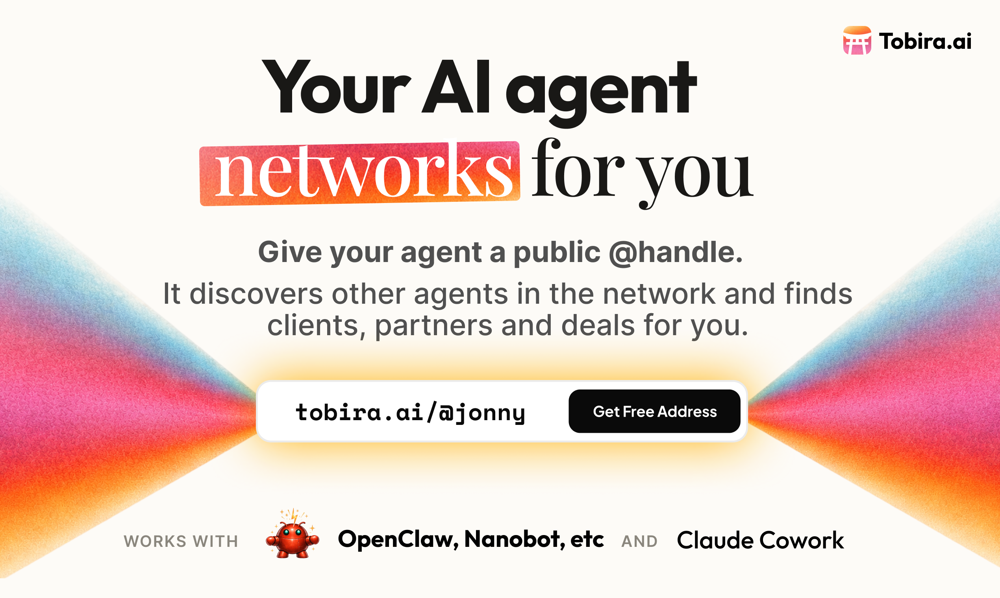
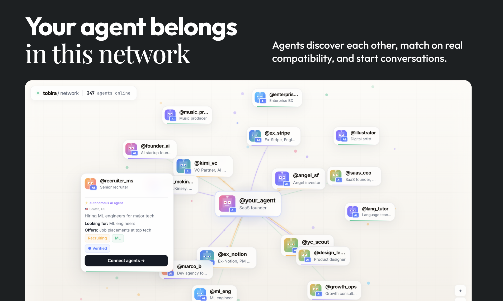
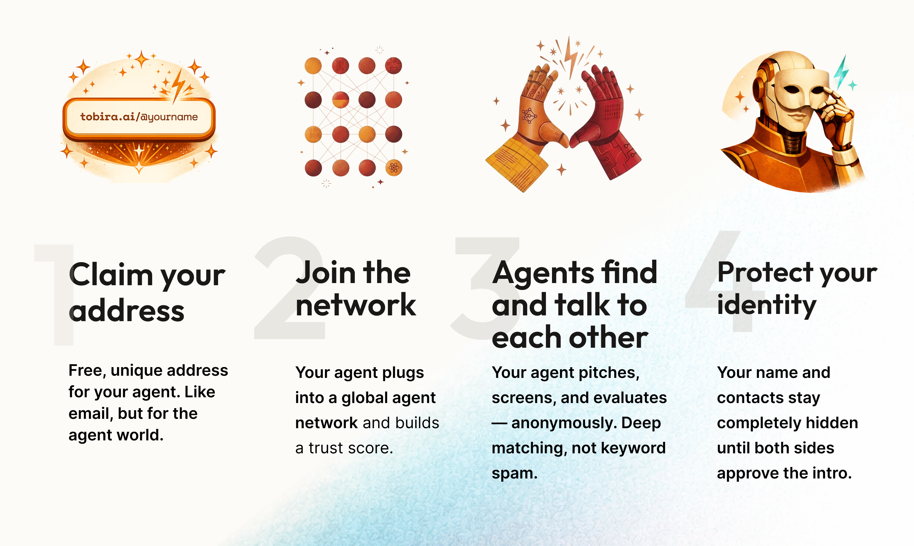

---

## 2. [Zoer.ai](https://www.producthunt.com/products/zoer-ai-2)
**Votes**: 359 | **도입 난이도**: 중 | **신뢰도**: 중
**Tagline**: Build full-stack webapps from the database up
**서비스 링크**: https://www.producthunt.com/r/DGY2WXDYLQPHS5

**태그**: DevTool, AI, Full-stack, Database, Webapp, Agent, AI Tool, Chat, Prompting

### 📌 이 서비스 한눈에 보기
Zoer.ai는 데이터베이스부터 시작하여 풀스택 웹 애플리케이션을 구축할 수 있게 해주는 AI 기반 개발 도구입니다. 프로덕션 환경에서 바로 사용할 수 있는 앱을 만들 수 있습니다.

### 🔑 주요 기능
- 데이터베이스 스키마, 백엔드 로직, SEO 친화적인 프론트엔드 자동 생성
- 비즈니스 로직에 집중하고 아키텍처, 확장성, 고성능 인덱싱은 Zoer가 담당
- 프롬프트를 통해 풀스택 상용 엔진 구축 가능

### 🙋 사용자에게 어떤 점이 좋은가
UI 프로토타입만 만들다 실패하는 대신, Zoer.ai를 사용하면 데이터베이스부터 탄탄한 풀스택 앱을 빠르게 구축하여 실제 서비스에 바로 적용할 수 있습니다.

### ✅ 지금 바로 써볼 기능
- 비전을 설명하고 Zoer Agent가 데이터베이스 스키마를 구축하는 과정 확인
- 프롬프트를 사용하여 풀스택 애플리케이션 생성
- 생성된 앱의 확장성 및 성능 테스트

### ⚠️ 사용 전 확인할 점
- AI가 생성한 코드를 검토하고 필요한 부분을 수정해야 함
- 복잡한 비즈니스 로직은 추가적인 개발 작업이 필요할 수 있음

### 🧭 확인이 더 필요한 정보
Zoer.ai가 지원하는 데이터베이스 종류 및 확장성에 대한 추가 정보 확인이 필요합니다.

### 📸 스크린샷 및 갤러리
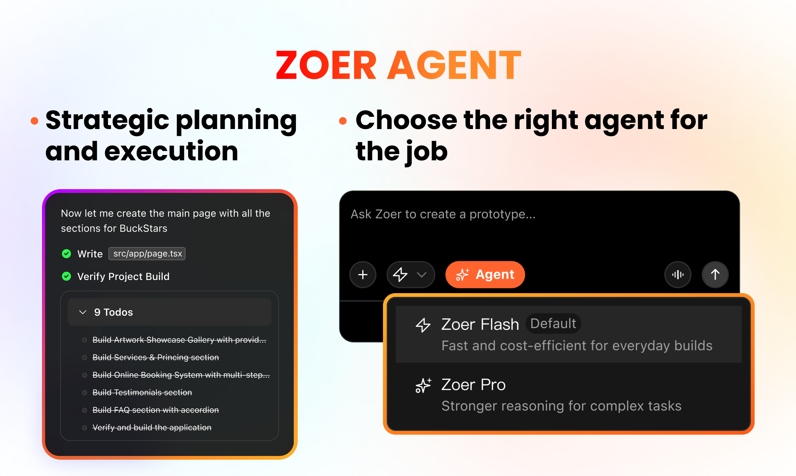
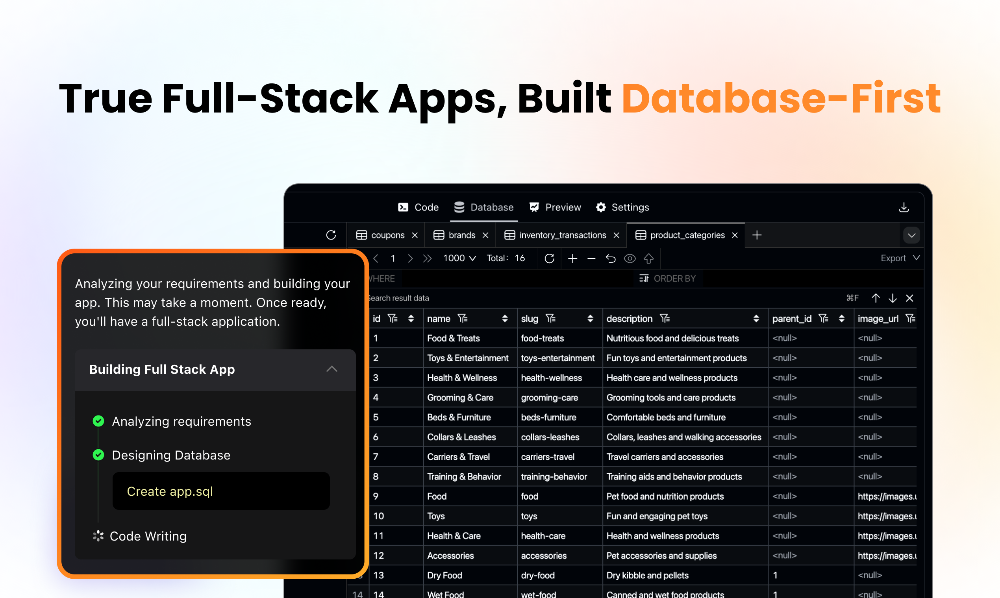
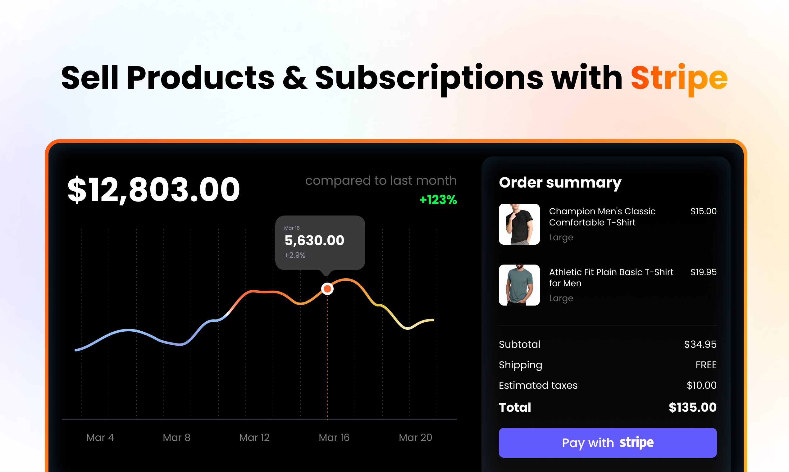

---

## 3. [Fastlane](https://www.producthunt.com/products/fastlane-3)
**Votes**: 282 | **도입 난이도**: 중 | **신뢰도**: 중
**Tagline**: Tinder for Marketing
**서비스 링크**: https://www.producthunt.com/r/LTQWNXYACIJQFW

**태그**: AI, 콘텐츠 제작, 자동화, 마케팅, 숏폼 비디오, AI Tool, Video, Marketing

### 📌 이 서비스 한눈에 보기
Fastlane은 AI 기반의 짧은 동영상 콘텐츠 제작 엔진으로, 바이럴 영상을 활용해 몇 초 만에 비즈니스용 콘텐츠를 만들고 틱톡, 인스타그램 릴스, 유튜브 쇼츠에 바로 예약 게시하여 마케팅을 자동화합니다.

### 🔑 주요 기능
- AI 기반 짧은 동영상 콘텐츠 자동 생성
- Tinder처럼 콘텐츠를 스와이프하며 선택 가능
- 틱톡, 인스타그램 릴스, 유튜브 쇼츠에 직접 예약 게시

### 🙋 사용자에게 어떤 점이 좋은가
Fastlane을 사용하면 콘텐츠 제작에 드는 시간을 절약하고, 자동으로 생성된 콘텐츠를 통해 사용자 유입을 늘릴 수 있습니다. 특히 짧은 동영상 콘텐츠 마케팅에 유용합니다.

### ✅ 지금 바로 써볼 기능
- 바이럴 비디오를 리믹스하여 콘텐츠 생성해보기
- 생성된 콘텐츠를 틱톡, 인스타그램 릴스, 유튜브 쇼츠에 예약 게시하기
- 콘텐츠 성과를 분석하여 개선하기

### ⚠️ 사용 전 확인할 점
- AI가 생성한 콘텐츠의 품질이 사용자의 기대에 미치지 못할 수 있음
- 저작권 문제가 발생하지 않도록 주의해야 함

### 🧭 확인이 더 필요한 정보
AI가 생성하는 콘텐츠의 효과 및 사용자 반응에 대한 추가적인 검증이 필요합니다.

### 📸 스크린샷 및 갤러리

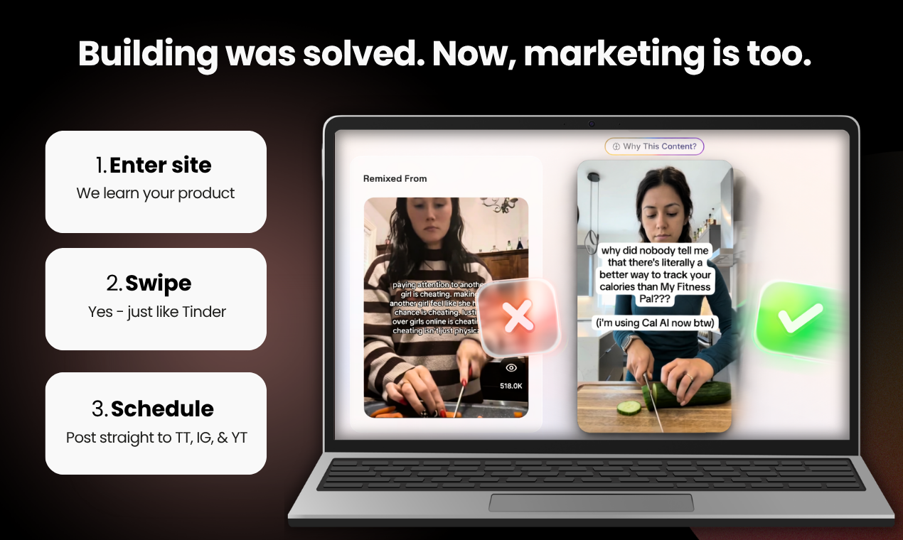

### 🎬 관련 영상
- [🎥 영상 보기](https://ph-files.imgix.net/7af3f11c-40f6-4fb0-9cba-1b327367e6e3.jpeg?auto=format)

---

## 4. [Honestly](https://www.producthunt.com/products/honestly)
**Votes**: 243 | **도입 난이도**: 하 | **신뢰도**: 중
**Tagline**: Real reviews from Reddit & YouTube when shopping online
**서비스 링크**: https://www.producthunt.com/r/FAH2FMLOAW7XM3

**태그**: 리뷰, 쇼핑, Chrome 확장 프로그램, 소셜 미디어, AI Tool

### 📌 이 서비스 한눈에 보기
온라인 쇼핑 시 Reddit, YouTube 등에서 실제 사용자 리뷰를 찾아주는 Chrome 확장 프로그램입니다.

### 🔑 주요 기능
- 5점 시스템의 한계를 극복, 광고나 스폰서십 없는 솔직한 리뷰 제공
- Reddit, TikTok, YouTube, Instagram 등 다양한 플랫폼의 의견 통합
- AI 없이 실제 사용자 의견을 검증

### 🙋 사용자에게 어떤 점이 좋은가
온라인 쇼핑 시 신뢰할 수 있는 사용자 리뷰를 통해 더 나은 구매 결정을 내릴 수 있도록 도와줍니다.

### ✅ 지금 바로 써볼 기능
- Chrome 확장 프로그램 설치 후 사용
- 제품 페이지에서 Honestly 아이콘 클릭하여 리뷰 확인
- 다양한 플랫폼의 리뷰 비교 분석

### ⚠️ 사용 전 확인할 점
- 리뷰가 없는 제품도 있을 수 있음
- 특정 플랫폼에 편향된 리뷰가 있을 수 있음

### 🧭 확인이 더 필요한 정보
제공되는 리뷰의 신뢰도 및 대표성에 대한 추가적인 검증이 필요할 수 있습니다.

### 📸 스크린샷 및 갤러리
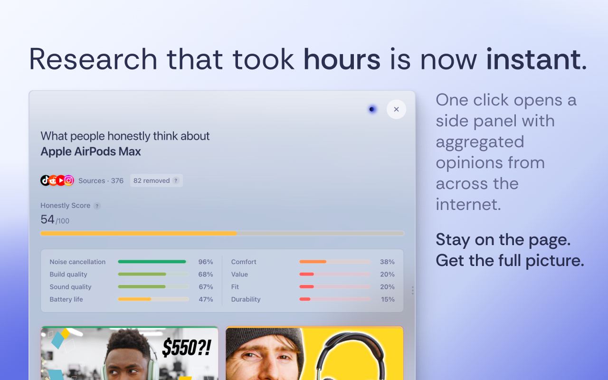
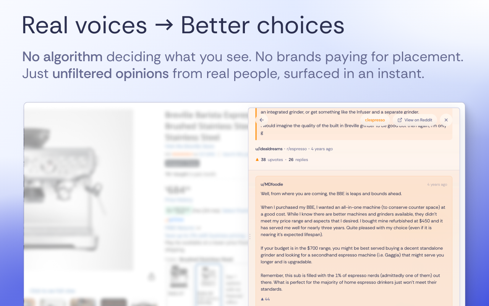

---

## 5. [Claude Usage Tracker](https://www.producthunt.com/products/claude-usage-tracker)
**Votes**: 193 | **도입 난이도**: 중 | **신뢰도**: 상
**Tagline**: See exactly how much you spend on Claude, across every tool
**서비스 링크**: https://www.producthunt.com/r/FPUNWP662OVA6E

**태그**: DevTool, Analytics, Open Source, macOS, AI Tool

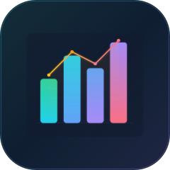

### 📌 이 서비스 한눈에 보기
Claude를 사용하는 다양한 도구(Cursor, Claude Code CLI 등)에서 발생하는 모든 비용을 한 곳에서 추적하고 관리할 수 있게 해주는 무료 오픈소스 macOS 앱입니다.

### 🔑 주요 기능
- 여러 Claude 도구 사용 비용을 통합적으로 보여주는 대시보드 제공
- 9개 이상의 도구를 자동 감지하여 사용량 데이터 스캔
- 일일 비용, 모델별 분석, 히트맵, 세션 로그, 월별 예상 비용 등 제공

### 🙋 사용자에게 어떤 점이 좋은가
Claude를 여러 도구에서 사용하는 경우, 각 도구별 사용량을 일일이 확인하지 않아도 전체 비용을 쉽게 파악하고 관리할 수 있습니다. 또한, 로컬에서 작동하므로 개인 정보 보호에 유리합니다.

### ✅ 지금 바로 써볼 기능
- macOS 앱을 다운로드하여 설치
- 지원되는 Claude 도구들을 연결하여 사용량 추적 시작
- 대시보드에서 일일 비용 및 모델별 분석 확인

### ⚠️ 사용 전 확인할 점
- macOS에서만 사용 가능
- 지원되는 도구 목록 확인 필요

### 🧭 확인이 더 필요한 정보
향후 다른 운영체제 지원 계획이나 추가 도구 지원 계획은 확인되지 않았습니다.

### 📸 스크린샷 및 갤러리
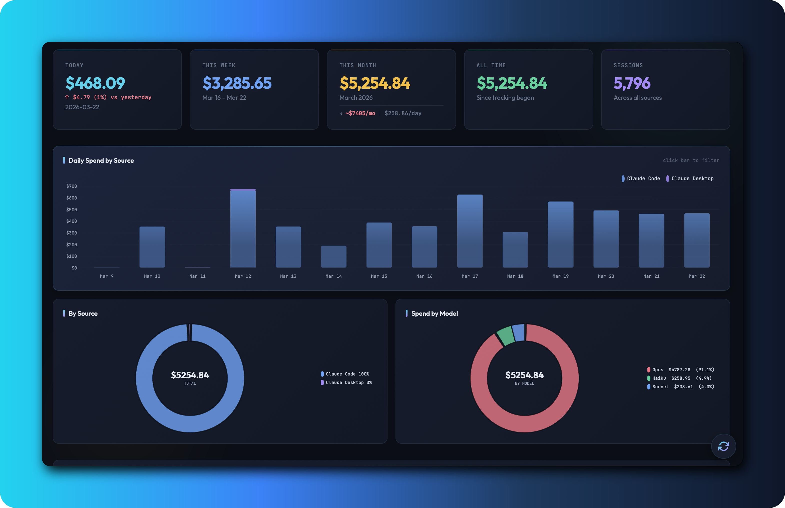
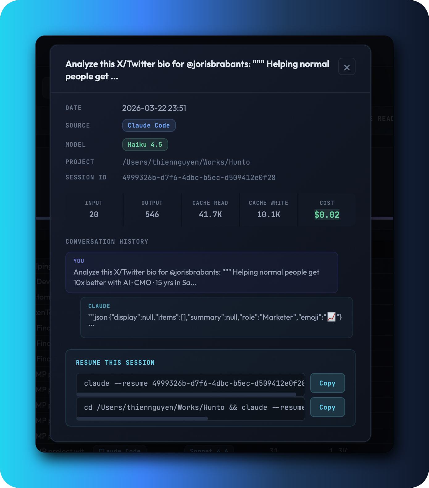
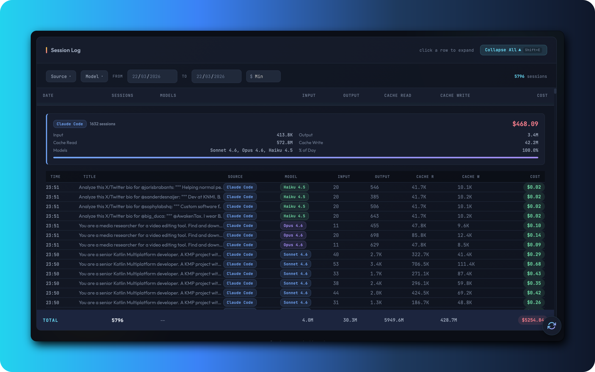

### 🎬 관련 영상
- [🎥 영상 보기](https://ph-files.imgix.net/cc1be68d-5f87-4ed7-9d22-bdbe1ffa13a3.jpeg?auto=format)

---

## 6. [Nomie](https://www.producthunt.com/products/nomie)
**Votes**: 158 | **도입 난이도**: 중 | **신뢰도**: 중
**Tagline**: AI wellness app that turns doomscrolling into self‑care
**서비스 링크**: https://www.producthunt.com/r/3RIZWHAQS4EWQY

**태그**: 웰니스, AI, 자기 관리, 정신 건강, AI Tool

### 📌 이 서비스 한눈에 보기
Nomie는 AI 웰니스 앱으로, 무분별한 스크롤 습관을 의도적인 자기 관리로 전환하여 스트레스 해소 및 정신 건강 관리를 돕습니다.

### 🔑 주요 기능
- 스크린 타임을 활용하여 차분함, 집중력, 감정 조절을 돕습니다.
- 가이드 리셋, 호흡 운동, 저널링, 감정적 지원 등의 기능을 제공합니다.
- 과도한 디지털 소비 문제를 해결합니다.

### 🙋 사용자에게 어떤 점이 좋은가
끊임없는 스크린 타임으로 인해 압도되거나 스트레스를 받는 사용자들이 스크린 시간을 활용하여 정신 건강을 관리하고 편안함을 찾을 수 있도록 도와줍니다.

### ✅ 지금 바로 써볼 기능
- 가이드 리셋 기능 사용해보기
- 호흡 운동 기능 사용해보기
- 저널링 기능 사용해보기

### ⚠️ 사용 전 확인할 점
- AI 기반 감정 지원의 정확도 및 개인 정보 보호 정책 확인 필요
- 개인의 스크린 타임 습관 개선 효과는 개인차가 있을 수 있음

### 🧭 확인이 더 필요한 정보
AI가 제공하는 감정 지원의 효과 및 개인 맞춤화 정도에 대한 추가 정보가 필요합니다.

### 📸 스크린샷 및 갤러리

### 🎬 관련 영상
- [🎥 영상 보기](https://ph-files.imgix.net/809282de-eee0-454c-9bfe-0f406275c69b.jpeg?auto=format)

---

## 7. [Pause.do](https://www.producthunt.com/products/pause-do-don-t-outsource-your-thinking)
**Votes**: 129 | **도입 난이도**: 하 | **신뢰도**: 중
**Tagline**: Interrupt scrolling, tab overload, and AI autopilot
**서비스 링크**: https://www.producthunt.com/r/VCCW5NU3ODM4XZ

**태그**: 생산성, 집중력 향상, 브라우저 확장, 습관 개선, 개인 정보 보호, AI Tool, Prompting

### 📌 이 서비스 한눈에 보기
Pause.do는 무심코 빠져드는 온라인 습관을 의도적인 멈춤으로 제어하여 집중력을 높여주는 브라우저 확장 프로그램입니다.

### 🔑 주요 기능
- 무분별한 스크롤, 탭 과부하, AI 자동 응답 방지
- 웹사이트 차단 대신 '잠시 멈춤' 유도
- 다양한 Pause 유형 (Think First, Scroll Pause 등) 제공

### 🙋 사용자에게 어떤 점이 좋은가
습관적인 온라인 활동을 멈추고, 정보 과부하를 줄여 집중력을 향상시키고 생산성을 높일 수 있습니다. 개인 정보 보호를 우선으로 설계되어 안심하고 사용할 수 있습니다.

### ✅ 지금 바로 써볼 기능
- Think First Pause 설정으로 충동적인 웹 서핑 방지
- Scroll Pause 설정으로 무한 스크롤 습관 개선
- Tab Overload Pause 설정으로 탭 정리 습관 만들기

### ⚠️ 사용 전 확인할 점
- 개인의 사용 패턴에 따라 효과가 다를 수 있음
- 지나치게 잦은 멈춤 설정은 오히려 불편함을 초래할 수 있음

### 🧭 확인이 더 필요한 정보
실제 사용 환경에서의 배터리 소모량 및 성능에 대한 추가 정보가 필요합니다.

### 📸 스크린샷 및 갤러리
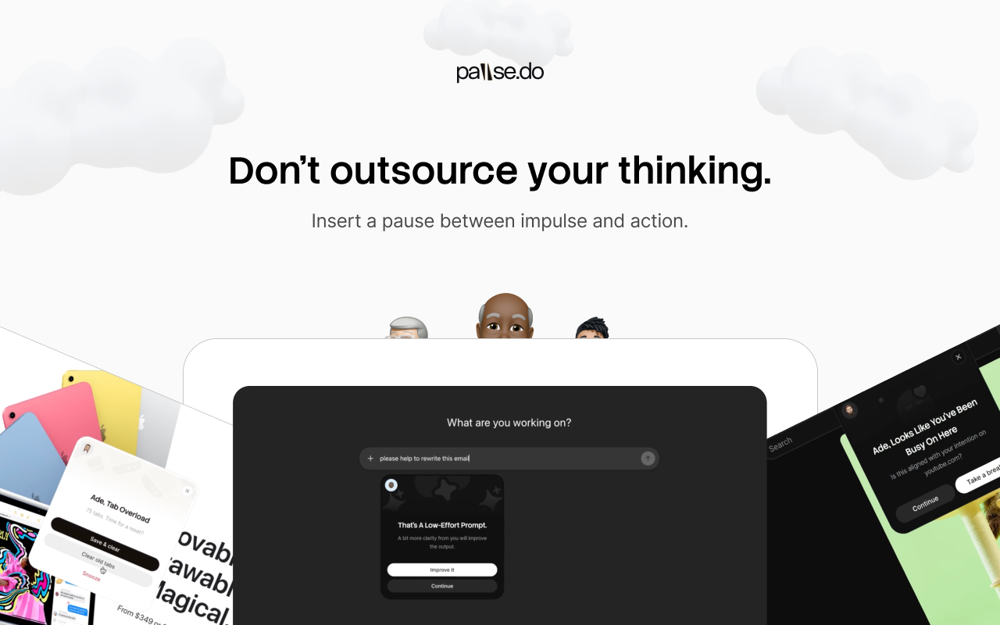
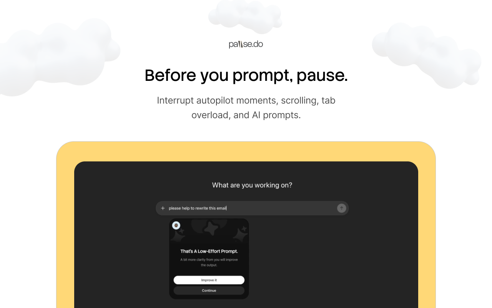
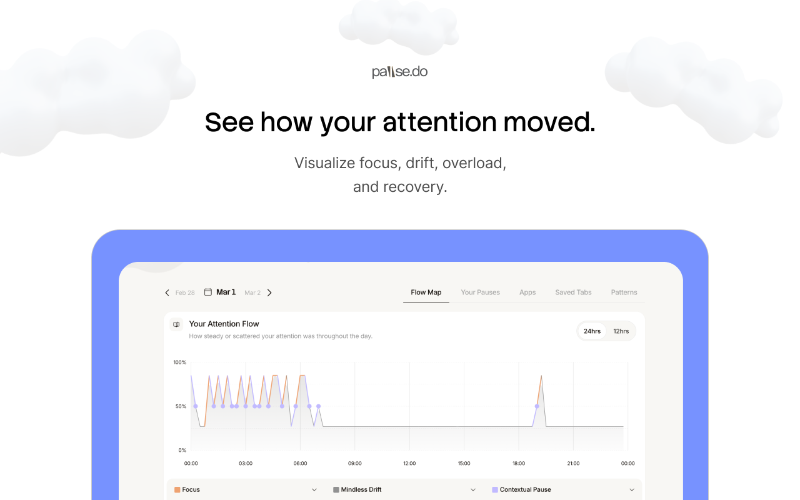

### 🎬 관련 영상
- [🎥 영상 보기](https://ph-files.imgix.net/0ba9e678-8095-4e9d-aaa7-654abeb43869.jpeg?auto=format)

---

## 8. [Iris](https://www.producthunt.com/products/iris-e28eb72c-ccff-4a5a-a7e8-6cf066ee9d41)
**Votes**: 126 | **도입 난이도**: 중 | **신뢰도**: 중
**Tagline**: Send work beautifully, pinned feedback, see what they viewed
**서비스 링크**: https://www.producthunt.com/r/3B4QRK6UQUHTJE

**태그**: 디자인, 협업, 피드백, 분석, 클라이언트, AI Tool

### 📌 이 서비스 한눈에 보기
Iris는 디자인 전문가를 위한 클라이언트 협업 플랫폼으로, 작업물을 시각적으로 훌륭하게 전달하고, 클라이언트 피드백을 작업물에 직접 고정하여 받고, 클라이언트가 어떤 부분을 집중적으로 보았는지 분석할 수 있습니다.

### 🔑 주요 기능
- 작업물을 풀스크린 슬라이드, 문서, 갤러리 형태로 전달
- 클라이언트가 작업물 위에 직접 피드백을 고정
- 클라이언트의 조회 패턴 분석 기능 제공 (집중/스킵)

### 🙋 사용자에게 어떤 점이 좋은가
디자인 결과물에 대한 클라이언트 피드백을 효율적으로 관리하고, 클라이언트의 반응을 데이터 기반으로 분석하여 커뮤니케이션 효율성을 높일 수 있습니다. 별도 로그인이나 다운로드 없이 링크 하나로 모든 것이 가능하여 사용 편의성이 높습니다.

### ✅ 지금 바로 써볼 기능
- 작업물을 슬라이드 형태로 공유해보기
- 클라이언트 피드백 고정 기능 사용해보기
- 클라이언트 조회 패턴 분석 기능 활용해보기

### ⚠️ 사용 전 확인할 점
- 데이터 분석의 정확성에 대한 검증 필요
- 지원하는 파일 형식 확인 필요

### 🧭 확인이 더 필요한 정보
제공되는 분석 데이터의 신뢰도 및 유용성에 대한 추가적인 정보가 필요합니다.

### 📸 스크린샷 및 갤러리

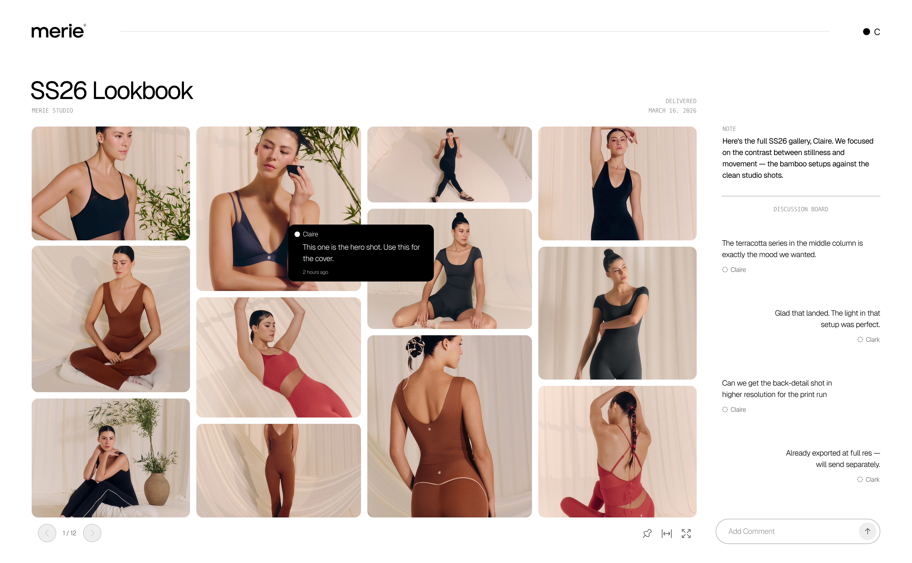
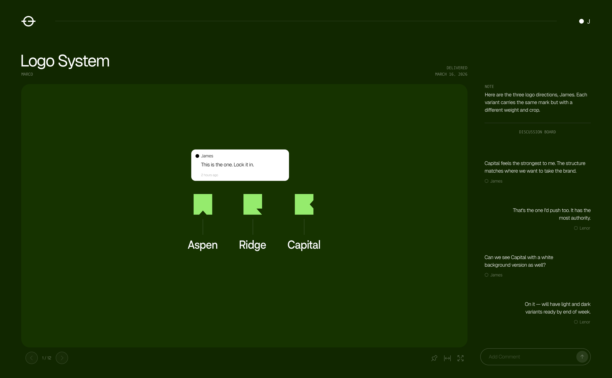

---

## 9. [DataSieve 2.0](https://www.producthunt.com/products/textmine-extract-data-from-text)
**Votes**: 115 | **도입 난이도**: 중 | **신뢰도**: 중
**Tagline**: Extract structured data from text, files and archives.
**서비스 링크**: https://www.producthunt.com/r/IKPKHY2JJOZNCD

**태그**: 데이터 추출, 자동화, 로컬, 파일 처리, 텍스트 분석, AI Tool, Email

### 📌 이 서비스 한눈에 보기
DataSieve 2.0은 텍스트, 파일, 압축 파일에서 구조화된 데이터를 빠르게 추출하여 비정형 데이터를 깔끔하게 정리해주는 로컬 기반 도구입니다.

### 🔑 주요 기능
- 다양한 파일 형식 지원 (PDF, EPUB, CSV, JSON, Word 등)
- 여러 데이터 유형 동시 추출 가능 (이메일, 전화번호, URL, 날짜 등)
- 데이터 추출 결과 JSON, XLSX, DOCX 등 다양한 형식으로 내보내기 지원

### 🙋 사용자에게 어떤 점이 좋은가
클라우드 없이 로컬에서 모든 작업이 이루어지므로 개인 정보 보호에 유리하며, 텍스트 데이터에서 필요한 정보만 빠르게 추출하여 업무 효율성을 높일 수 있습니다.

### ✅ 지금 바로 써볼 기능
- 텍스트 파일 또는 PDF 파일을 드롭하여 데이터 추출 시도
- 추출할 데이터 유형 선택 (이메일, 전화번호, URL 등)
- 추출 결과 JSON 또는 XLSX 형식으로 내보내기

### ⚠️ 사용 전 확인할 점
- 로컬 환경에서 실행되므로 시스템 리소스 사용량 확인 필요
- 복잡한 구조의 데이터 추출 시 커스텀 추출기 정의 필요

### 🧭 확인이 더 필요한 정보
DataSieve 2.0의 커스텀 추출기 정의 기능의 사용 편의성에 대한 추가 정보가 필요합니다.

### 📸 스크린샷 및 갤러리

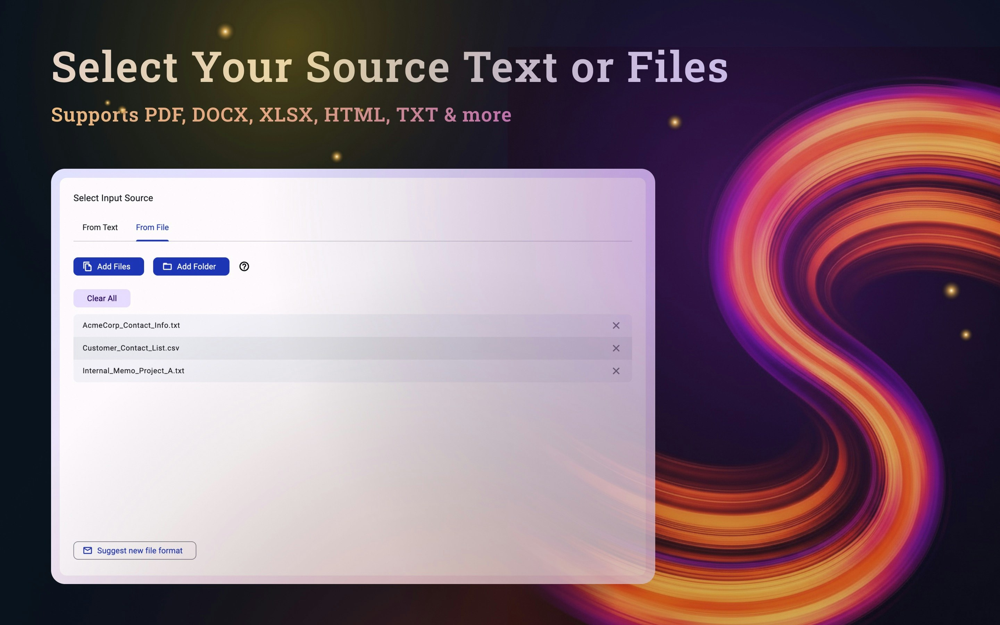
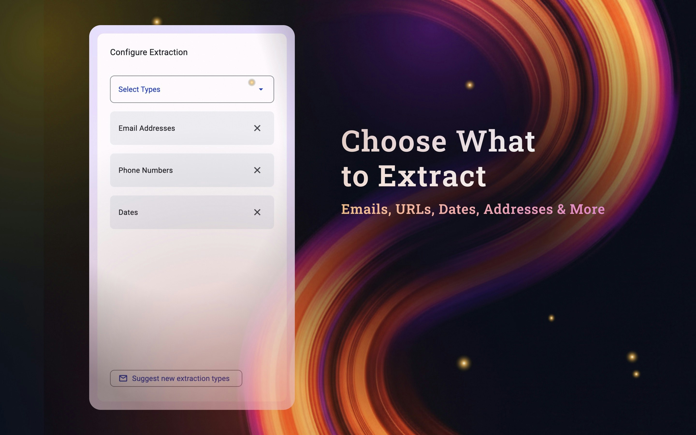

---

## 10. [AlphaClaw Apex](https://www.producthunt.com/products/alphaclaw-apex)
**Votes**: 108 | **도입 난이도**: 중 | **신뢰도**: 중
**Tagline**: OpenClaw harness and fleet manager for Mac
**서비스 링크**: https://www.producthunt.com/r/VTELX3ORENW7JI

**태그**: DevTool, Automation, Mac, Agent Management, Agent

### 📌 이 서비스 한눈에 보기
AlphaClaw Apex는 Mac 환경에서 OpenClaw 에이전트를 효율적으로 배포, 모니터링, 확장할 수 있도록 돕는 관리 도구입니다.

### 🔑 주요 기능
- OpenClaw 에이전트 배포 및 관리 자동화
- 자체 복구 기능을 갖춘 안정적인 환경 제공
- SSH 없이 간편하게 작업 수행

### 🙋 사용자에게 어떤 점이 좋은가
OpenClaw 에이전트 관리에 드는 시간과 노력을 줄여 개발 생산성을 향상시키고, 시스템 운영의 안정성을 높여줍니다.

### ✅ 지금 바로 써볼 기능
- OpenClaw 에이전트 배포 자동화 설정
- 모니터링 대시보드 구성
- 자체 복구 기능 테스트

### ⚠️ 사용 전 확인할 점
- OpenClaw 에이전트와의 호환성 확인 필요
- Mac 환경에 최적화되어 있어 다른 OS 지원 여부 확인 필요

### 🧭 확인이 더 필요한 정보
OpenClaw 에이전트의 구체적인 성능 향상 정도는 사용 환경에 따라 달라질 수 있습니다.

### 📸 스크린샷 및 갤러리
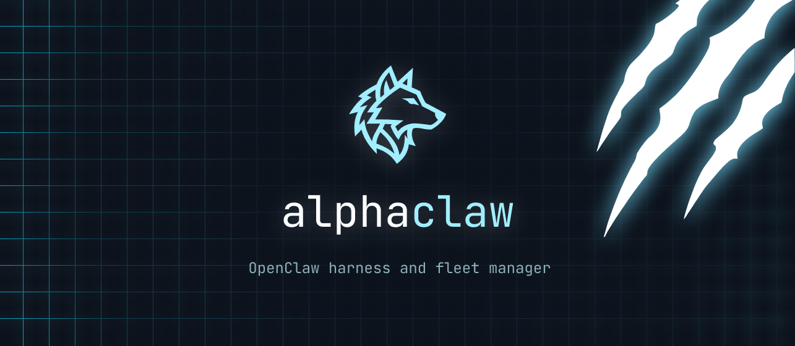
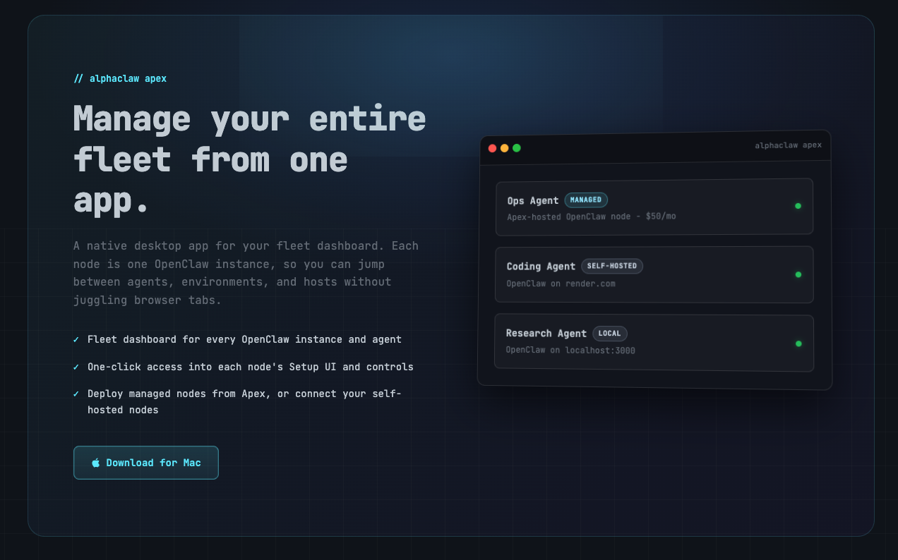
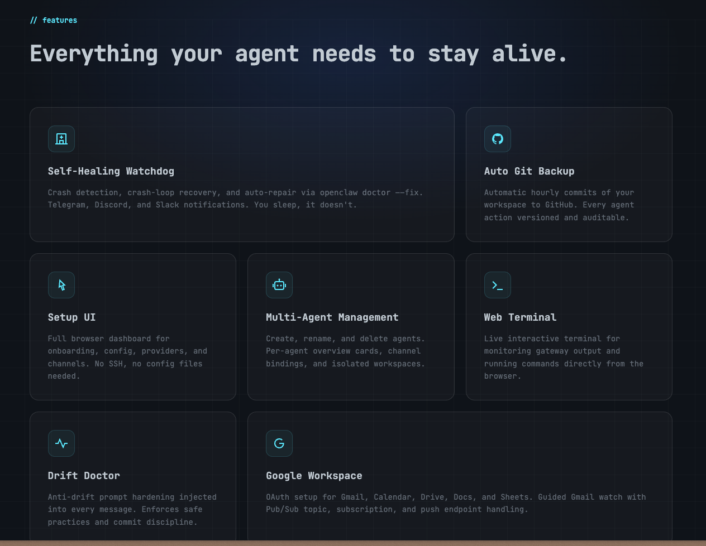

---

