# 🚀 Product Hunt Daily Top 10 (2026-03-25)

## 1. [Claude Computer Use](https://www.producthunt.com/products/claude)
**Votes**: 427 | **도입 난이도**: 중 | **신뢰도**: 중
**Tagline**: Enable Claude to use your computer to complete tasks 
**서비스 링크**: https://www.producthunt.com/r/AYTPIHDXORCWT2
**재등장**: 최근 7일 내 재등장 (마지막 등장 3일 전)

**태그**: AI, 자동화, 생산성, Mac, AI Tool, Email

### 📌 이 서비스 한눈에 보기
Anthropic의 Claude가 이제 컴퓨터를 사용하여 클릭, 타이핑, 브라우징, 앱 실행 등 사람처럼 작업을 수행할 수 있게 되었습니다. Dispatch와 함께 Mac에서 Claude에게 작업을 할당하고 실행하도록 할 수 있습니다.

### 🔑 주요 기능
- Claude가 컴퓨터를 직접 조작하여 작업을 자동화합니다.
- 이메일 작성, 보고서 작성 등 다양한 작업을 수행할 수 있습니다.
- 스마트폰에서 작업을 할당하고 Claude가 Mac에서 실행합니다.

### 🙋 사용자에게 어떤 점이 좋은가
Claude를 통해 반복적인 컴퓨터 작업을 자동화하여 시간을 절약하고 효율성을 높일 수 있습니다. 특히 Mac 사용자에게 유용합니다.

### ✅ 지금 바로 써볼 기능
- Dispatch를 설치하고 Claude와 연결하여 사용해보기
- 이메일 초안 작성 작업을 Claude에게 맡겨보기
- 웹 브라우징을 통한 정보 검색 자동화해보기

### ⚠️ 사용 전 확인할 점
- Claude가 컴퓨터를 제어하므로 보안에 유의해야 합니다.
- 복잡한 작업은 Claude가 제대로 수행하지 못할 수 있습니다.

### 🧭 확인이 더 필요한 정보
Claude의 컴퓨터 사용 기능이 모든 작업에 완벽하게 적용될 수 있을지는 추가적인 검증이 필요합니다.

### 📸 스크린샷 및 갤러리
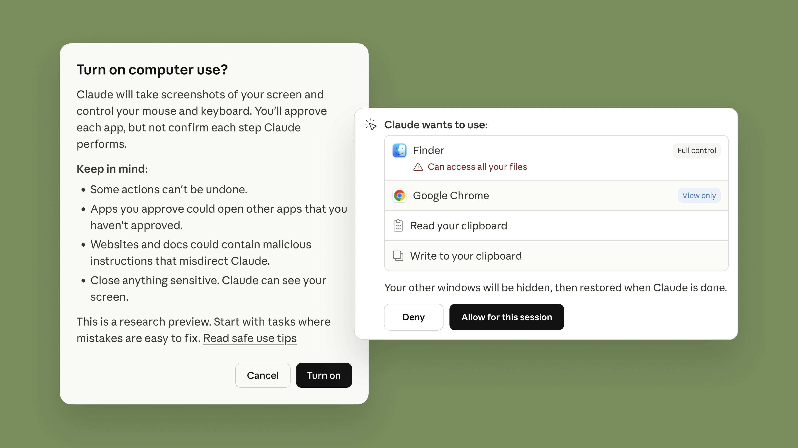
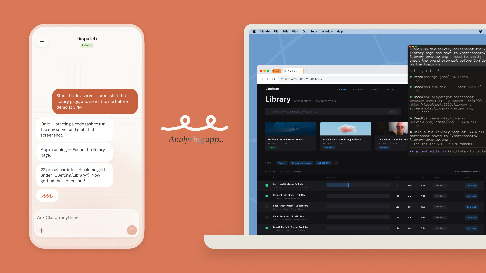

### 🎬 관련 영상
- [🎥 영상 보기](https://ph-files.imgix.net/487c0809-6b28-4dd3-b9ae-e24f550205a8.jpeg?auto=format)

---

## 2. [Kitty Points Leaderboard](https://www.producthunt.com/products/producthunt)
**Votes**: 313 | **도입 난이도**: 하 | **신뢰도**: 중
**Tagline**: Find interesting community members and see how you stack up
**서비스 링크**: https://www.producthunt.com/r/UA5BMACRSNW472

**태그**: 커뮤니티, 리더보드, 랭킹, 참여, Product Hunt

### 📌 이 서비스 한눈에 보기
Product Hunt 커뮤니티 멤버들의 활동을 순위로 보여주어, 참여를 장려하고 사용자들에게 더 많은 가시성과 신뢰도를 제공합니다.

### 🔑 주요 기능
- Product Hunt 커뮤니티 멤버 순위표 제공
- 커뮤니티 활동 참여 독려
- 상위 랭커에게 가시성 및 신뢰도 제공

### 🙋 사용자에게 어떤 점이 좋은가
커뮤니티 내에서 자신의 위치를 파악하고, 더 활발하게 활동하여 인지도를 높일 수 있습니다.

### ✅ 지금 바로 써볼 기능
- 자신의 순위 확인하기
- 커뮤니티 활동에 적극적으로 참여하기
- 상위 랭커들의 활동 방식 참고하기

### ⚠️ 사용 전 확인할 점
- 순위가 절대적인 지표는 아님
- 커뮤니티 활동의 다양한 측면을 고려해야 함

### 🧭 확인이 더 필요한 정보
순위 산정 기준에 대한 상세 정보 확인이 필요합니다.

### 📸 스크린샷 및 갤러리
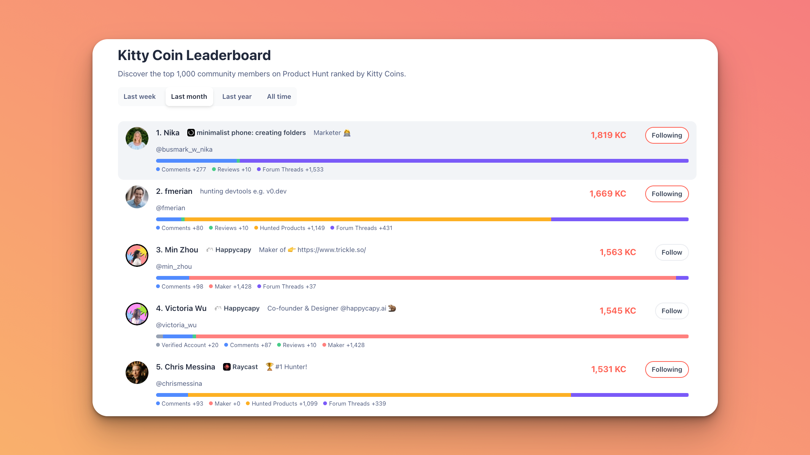
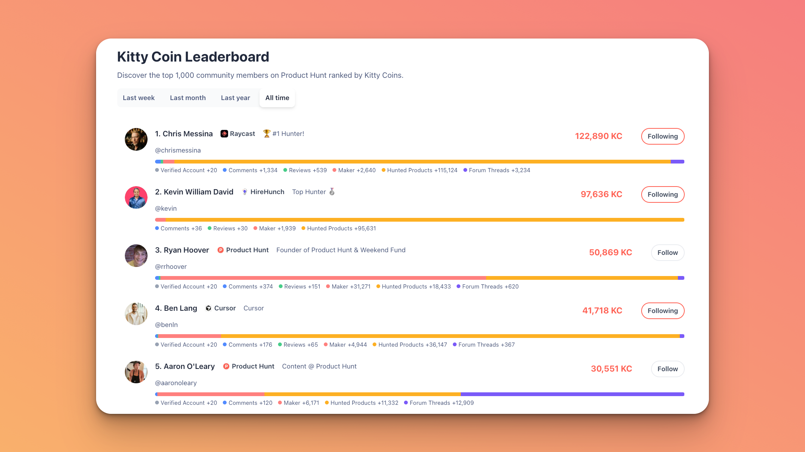

---

## 3. [Cekura](https://www.producthunt.com/products/vocera)
**Votes**: 313 | **도입 난이도**: 중 | **신뢰도**: 중
**Tagline**: Observe and analyze your voice and chat AI agents
**서비스 링크**: https://www.producthunt.com/r/BVQAPOUNVQ25FB

**태그**: AI, Analytics, Chatbot, Voice AI, Agent, AI Tool, LLM, Chat

### 📌 이 서비스 한눈에 보기
Cekura는 음성 및 채팅 AI 에이전트의 성능을 30개 이상의 사전 정의된 지표를 통해 실시간으로 분석하고 개선하여 고객 경험, 정확성, 대화 품질을 향상시키는 데 도움을 줍니다.

### 🔑 주요 기능
- 30개 이상의 사전 정의된 지표를 통해 CX, 정확성, 대화 및 음성 품질 분석
- 약 20개의 대화만으로 완벽한 LLM 심판을 구성하고 Cekura Labs에서 자동 개선
- 실시간 분할 대시보드를 통해 대화형 AI의 추세 파악

### 🙋 사용자에게 어떤 점이 좋은가
Cekura를 사용하면 대화형 AI 에이전트의 성능을 정확하게 측정하고 개선하여 고객 만족도를 높이고 운영 효율성을 향상시킬 수 있습니다.

### ✅ 지금 바로 써볼 기능
- 대시보드에서 제공하는 실시간 지표를 통해 AI 에이전트의 성능 변화 추이 모니터링
- Cekura Labs를 활용하여 LLM 심판을 구성하고 AI 모델 개선
- 자동 알림 기능을 설정하여 주요 지표 변화에 대한 즉각적인 대응

### ⚠️ 사용 전 확인할 점
- 초기 설정 및 데이터 통합에 시간과 노력이 필요할 수 있습니다.
- 제공되는 지표가 모든 비즈니스 요구사항을 충족하지 못할 수 있습니다.

### 🧭 확인이 더 필요한 정보
Cekura가 특정 산업 분야 또는 특정 유형의 대화형 AI 에이전트에 얼마나 효과적인지 추가적인 사용 사례 연구가 필요합니다.

### 📸 스크린샷 및 갤러리
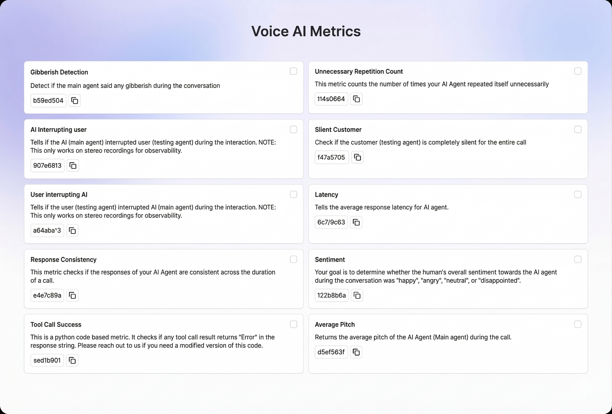

### 🎬 관련 영상
- [🎥 영상 보기](https://ph-files.imgix.net/be20a4ee-a1df-466f-ad58-8eaea0431252.jpeg?auto=format)

---

## 4. [jared.so](https://www.producthunt.com/products/jared-so)
**Votes**: 210 | **도입 난이도**: 중 | **신뢰도**: 중
**Tagline**: AI that monitors convos & proactively jumps in when needed
**서비스 링크**: https://www.producthunt.com/r/7P5NYVK4WNFYBG

**태그**: AI, Slack, 자동화, 협업, 생산성, AI Tool

### 📌 이 서비스 한눈에 보기
jared.so는 Slack에서 팀의 대화를 모니터링하고 필요한 순간에 개입하여 업무를 자동화하는 AI 직원입니다.

### 🔑 주요 기능
- Slack에서 팀 대화 맥락을 파악하고 능동적으로 참여
- 10,000개 이상의 도구와 연동 가능
- 별도 요청 없이도 업무 수행

### 🙋 사용자에게 어떤 점이 좋은가
팀 협업 효율성을 높이고, 반복적인 업무를 자동화하여 생산성을 향상시킬 수 있습니다. 특히, 팀원들이 놓칠 수 있는 중요한 정보를 AI가 파악하여 알려주어 의사결정을 돕습니다.

### ✅ 지금 바로 써볼 기능
- Slack에 jared.so 추가하여 팀 채널 연결
- 자주 사용하는 도구 연동 설정
- AI가 참여할 대화 주제 및 키워드 설정

### ⚠️ 사용 전 확인할 점
- AI가 민감한 정보를 부적절하게 처리할 가능성 검토 필요
- 초기 설정 및 학습 과정 필요

### 🧭 확인이 더 필요한 정보
jared.so의 실제 성능 및 팀 협업에 미치는 영향에 대한 사용자 후기 확인이 필요합니다.

### 📸 스크린샷 및 갤러리
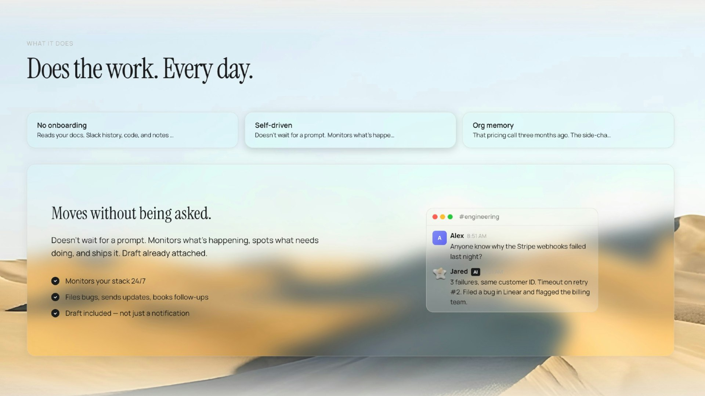
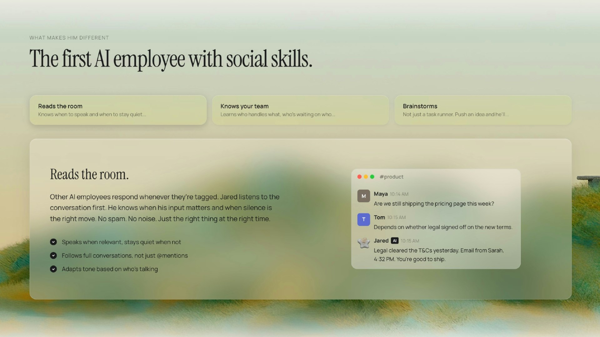
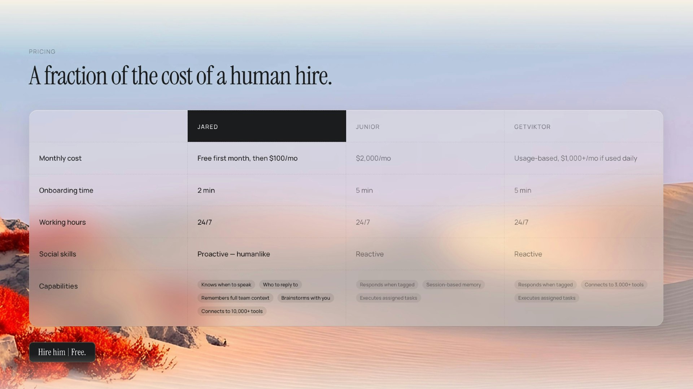

### 🎬 관련 영상
- [🎥 영상 보기](https://ph-files.imgix.net/ae63f77e-1af4-4603-bdbc-d2d534dc563a.jpeg?auto=format)

---

## 5. [Drift](https://www.producthunt.com/products/drift-ai)
**Votes**: 198 | **도입 난이도**: 중 | **신뢰도**: 중
**Tagline**: AI agent to run robot simulations faster and reliably
**서비스 링크**: https://www.producthunt.com/r/W65GW52TI2TQVF

**태그**: 로보틱스, AI, 시뮬레이션, 자동화, 개발 도구, Agent, AI Tool, Prompting

### 📌 이 서비스 한눈에 보기
Drift는 프롬프트만으로 로봇 시뮬레이션을 빠르게 구축하고 안정적으로 실행할 수 있게 해주는 AI 에이전트입니다.

### 🔑 주요 기능
- 터미널에서 프롬프트만으로 로봇 시뮬레이션 구축 가능
- ROS, 시뮬레이터, 플러그인, OS 오케스트레이션 등 필요한 모든 기능 제공
- ROS 상태, 작업 공간, 시뮬레이터 추적을 통해 문제 해결 지원

### 🙋 사용자에게 어떤 점이 좋은가
로봇 개발자가 복잡한 설정 없이 빠르게 시뮬레이션을 구축하고, 문제 발생 시 신속하게 해결하여 개발 효율성을 높일 수 있습니다.

### ✅ 지금 바로 써볼 기능
- 터미널에서 프롬프트 입력하여 로봇 및 월드 구축
- 시뮬레이션 실행 및 제어 루프 연결
- ROS 상태 추적 기능 활용하여 문제 해결

### ⚠️ 사용 전 확인할 점
- 지원하는 로봇 및 시뮬레이터 종류 확인 필요
- 프롬프트 기반 방식에 대한 학습 필요

### 🧭 확인이 더 필요한 정보
Drift가 지원하는 구체적인 로봇 및 시뮬레이터 목록 확인이 필요합니다.

### 📸 스크린샷 및 갤러리
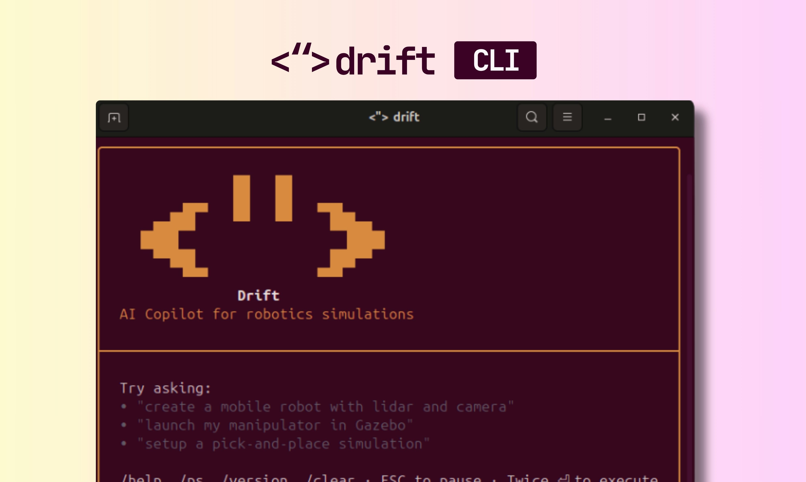
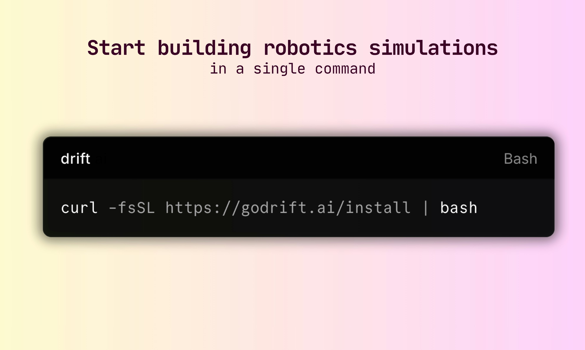
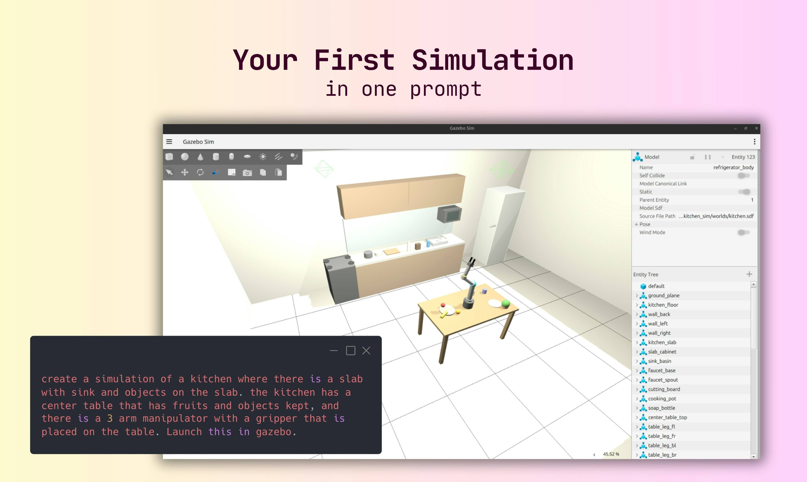

### 🎬 관련 영상
- [🎥 영상 보기](https://ph-files.imgix.net/397d0c3f-a849-49ee-997c-8d7d5f0bc158.jpeg?auto=format)

---

## 6. [Google Gemini in Chrome](https://www.producthunt.com/products/googlegemini-in-chrome)
**Votes**: 148 | **도입 난이도**: 중 | **신뢰도**: 중
**Tagline**: Turn your browser into an AI workspace
**서비스 링크**: https://www.producthunt.com/r/3VDHSZVTJSEVW7

**태그**: AI, 생산성, 브라우저, 자동화, AI Tool, Vision, Email

### 📌 이 서비스 한눈에 보기
Google Gemini in Chrome은 브라우저 내 AI 작업 공간을 제공하여 탭 전환 없이 요약, 정보 비교, 이메일 작성, 이미지 변환 등 다양한 작업을 효율적으로 처리할 수 있게 해줍니다.

### 🔑 주요 기능
- 브라우저 내 AI 통합으로 작업 효율성 향상
- Gmail, Calendar, Maps, YouTube 등 Google 서비스와 원활한 연동
- Gemini 3.1 기반의 강력한 AI 기능 제공

### 🙋 사용자에게 어떤 점이 좋은가
탭을 옮겨 다니거나 복사-붙여넣기 할 필요 없이 브라우저 내에서 바로 AI 기능을 활용하여 시간을 절약하고 생산성을 높일 수 있습니다.

### ✅ 지금 바로 써볼 기능
- 긴 기사 요약 기능 사용해보기
- 여러 탭의 정보 비교 기능 사용해보기
- 이메일 초안 작성 기능 사용해보기

### ⚠️ 사용 전 확인할 점
- Gemini 3.1의 성능 및 정확도 확인 필요
- 개인 정보 처리 및 보안 관련 정책 확인 필요

### 🧭 확인이 더 필요한 정보
Gemini 3.1의 실제 성능과 다양한 웹사이트 및 서비스와의 호환성에 대한 추가적인 사용 후기 확인이 필요합니다.

### 📸 스크린샷 및 갤러리

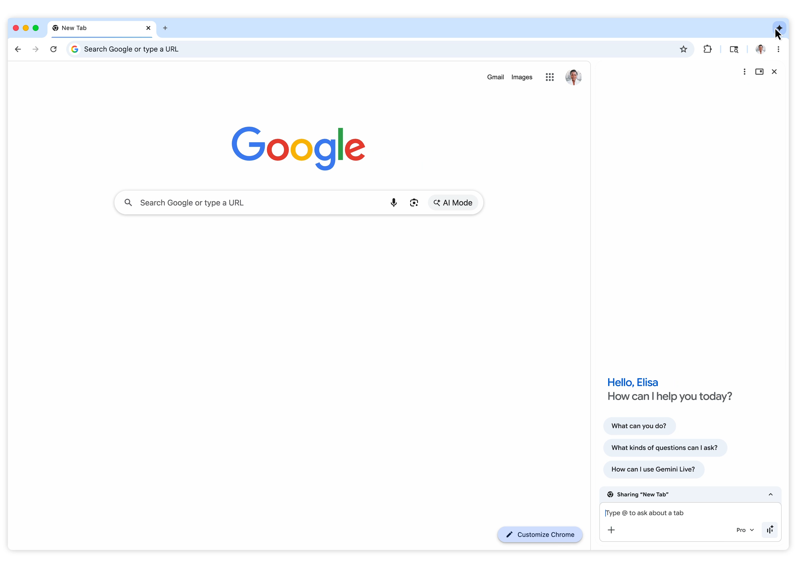
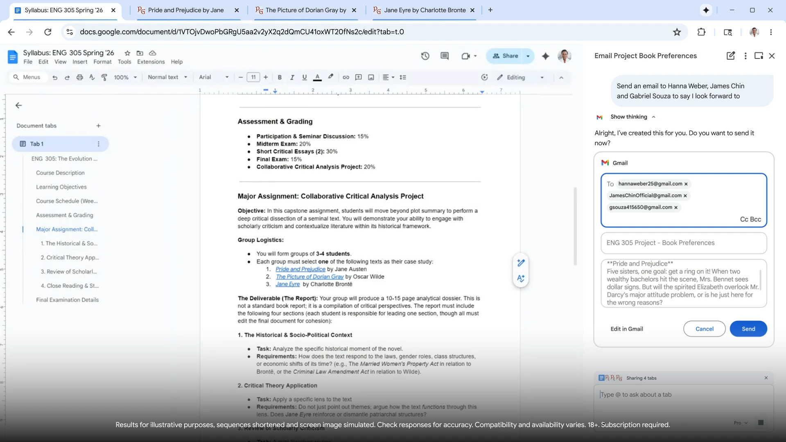

### 🎬 관련 영상
- [🎥 영상 보기](https://ph-files.imgix.net/22ffa015-f972-43bb-a09e-398dc577f77b.jpeg?auto=format)

---

## 7. [Jotform AI](https://www.producthunt.com/products/jotform)
**Votes**: 144 | **도입 난이도**: 하 | **신뢰도**: 중
**Tagline**: Build forms faster with Jotform AI
**서비스 링크**: https://www.producthunt.com/r/VAASWLHBUAACHF

**태그**: 폼 빌더, AI, 자동화, 생산성, AI Tool, Prompting

### 📌 이 서비스 한눈에 보기
Jotform AI는 자연어 설명을 통해 즉시 폼을 생성하고 편집할 수 있게 해 줍니다. 복잡한 폼 제작 과정을 단순화하여 시간과 노력을 절약해 줍니다.

### 🔑 주요 기능
- 자연어 기반 폼 자동 생성 및 편집
- 필드, 조건부 로직, 구조 자동 구성
- 별도 설정 없이 즉시 사용 가능

### 🙋 사용자에게 어떤 점이 좋은가
폼 제작에 필요한 시간과 노력을 크게 줄여주어, 사용자는 폼의 내용과 목적에 더 집중할 수 있습니다. 복잡한 폼도 쉽게 만들 수 있어 접근성이 높습니다.

### ✅ 지금 바로 써볼 기능
- 자연어 프롬프트로 폼 생성해보기
- 생성된 폼의 필드 및 로직 수정해보기
- 다양한 폼 템플릿에 적용해보기

### ⚠️ 사용 전 확인할 점
- AI가 생성한 폼의 정확성 검토 필요
- 복잡한 조건이나 특수한 요구사항은 수동 조정 필요

### 🧭 확인이 더 필요한 정보
AI가 생성하는 폼의 품질이 사용자의 의도를 얼마나 정확하게 반영하는지 확인이 필요합니다.

### 📸 스크린샷 및 갤러리
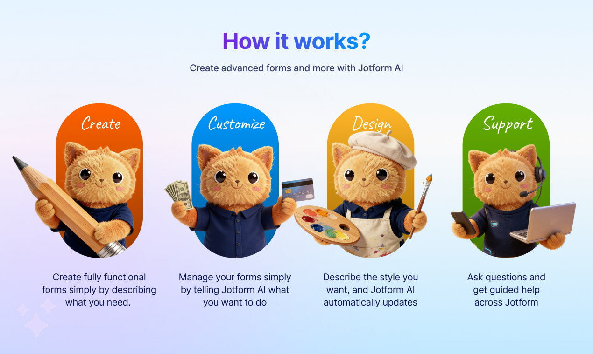
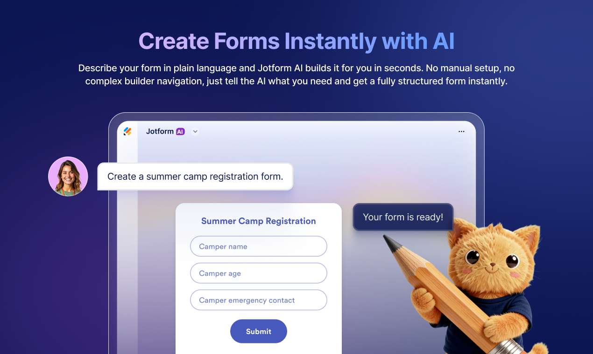
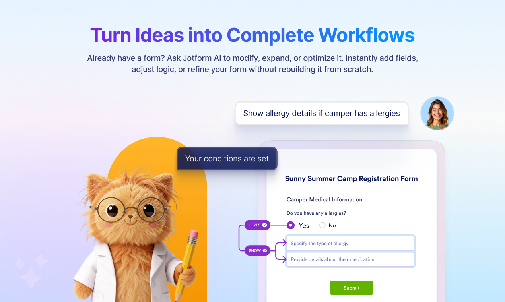

### 🎬 관련 영상
- [🎥 영상 보기](https://ph-files.imgix.net/44717ebb-30d9-47ff-a38b-ce8880c25975.jpeg?auto=format)

---

## 8. [Maestri](https://www.producthunt.com/products/maestri)
**Votes**: 132 | **도입 난이도**: 중 | **신뢰도**: 중
**Tagline**: An infinite canvas where coding agents work in concert
**서비스 링크**: https://www.producthunt.com/r/FLNQUUNPKJDWPD

**태그**: DevTool, AI, Automation, macOS, Agent, AI Tool

### 📌 이 서비스 한눈에 보기
Maestri는 코딩 에이전트들이 협업하는 무한 캔버스를 제공하는 macOS 앱으로, 시각적인 노드 배치, 에이전트 연결, AI 기반 모니터링 및 요약 기능을 통해 개발 생산성을 향상시킵니다.

### 🔑 주요 기능
- 무한 캔버스에서 코딩 에이전트들을 시각적으로 배치하고 연결하여 협업 가능
- Claude Code, Codex, Gemini, OpenCode 등 다양한 에이전트 지원
- Apple Intelligence 기반의 Ombro AI가 작업 모니터링 및 요약 제공

### 🙋 사용자에게 어떤 점이 좋은가
터미널, 노트, 스케치를 자유롭게 배치하고 연결하여 복잡한 코딩 작업을 시각적으로 관리하고, AI 기반 모니터링 및 요약 기능을 통해 작업 효율성을 높일 수 있습니다.

### ✅ 지금 바로 써볼 기능
- 캔버스에 터미널 노드 배치하고 에이전트 연결해보기
- Ombro AI를 활용하여 작업 요약 기능 사용해보기
- 다양한 코딩 에이전트(Claude Code, Codex 등) 연동 시도해보기

### ⚠️ 사용 전 확인할 점
- macOS 전용 앱이므로 다른 운영체제에서는 사용 불가
- 클라우드 기반이 아니므로 데이터 백업 및 동기화에 유의

### 🧭 확인이 더 필요한 정보
Ombro AI의 성능 및 지원되는 코딩 에이전트 종류에 대한 추가 정보 확인이 필요합니다.

### 📸 스크린샷 및 갤러리
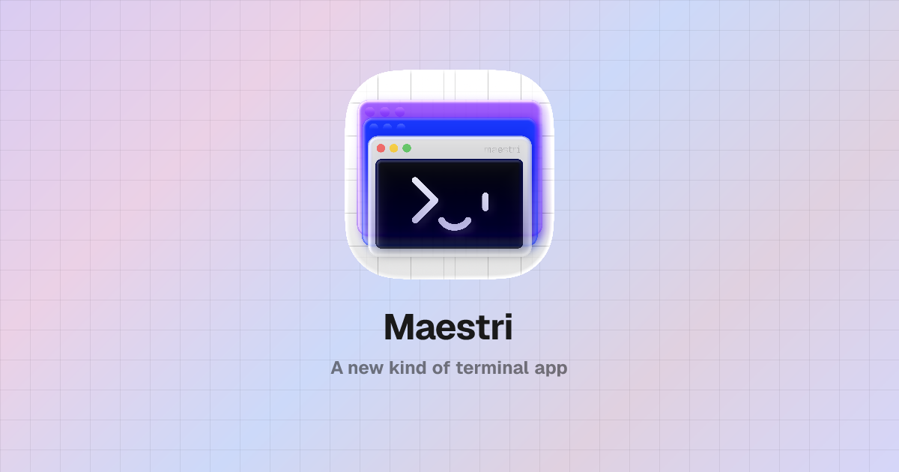
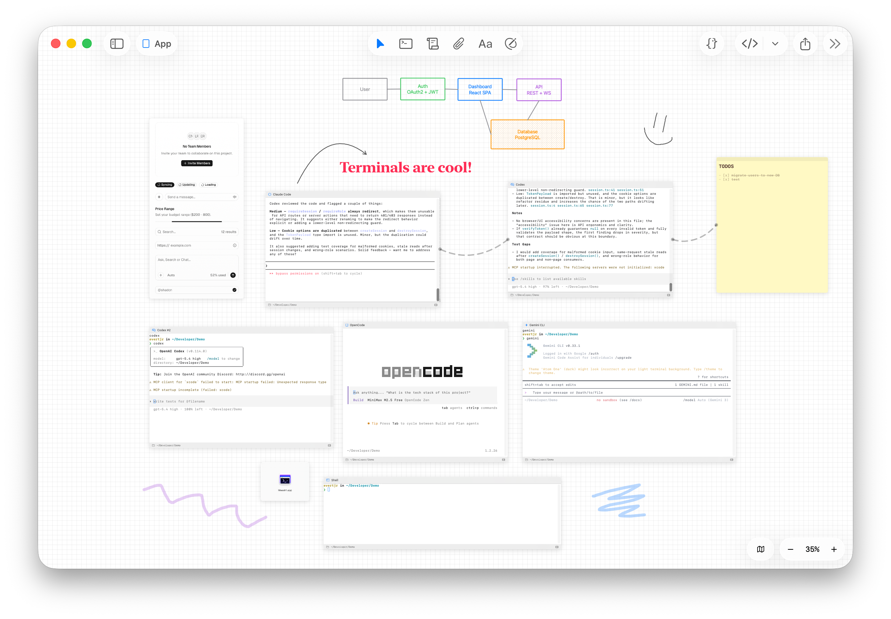
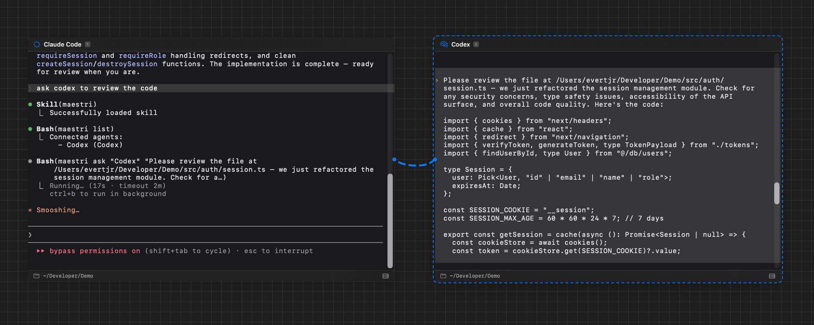

---

## 9. [Agent Hub Builder](https://www.producthunt.com/products/mindpal-ai)
**Votes**: 124 | **도입 난이도**: 중 | **신뢰도**: 중
**Tagline**: Build a Netflix-style library of AI-powered tools to sell
**서비스 링크**: https://www.producthunt.com/r/QXVYVZIXG7CBNI

**태그**: AI, No-code, Platform, Subscription, Tool, Agent, AI Tool, Chat

### 📌 이 서비스 한눈에 보기
Agent Hub Builder는 AI 기반 도구들을 넷플릭스처럼 구성하여 판매할 수 있게 해주는 플랫폼입니다. 전문가의 지식을 바탕으로 AI 도구 허브를 구축하고, 구독 모델을 통해 수익을 창출하세요.

### 🔑 주요 기능
- AI 도구들을 넷플릭스 스타일로 구성하여 제공
- MindPal, Base44, Replit 등 다양한 플랫폼과 연동 가능
- 인증, 사용량 추적, 채팅 기록, 개인화 프로필, 유료 결제 기능 포함

### 🙋 사용자에게 어떤 점이 좋은가
고객에게 24시간 AI 기반 지원을 제공하고, 더 높은 고객 유지율과 새로운 수익원을 확보할 수 있습니다.

### ✅ 지금 바로 써볼 기능
- MindPal을 사용하여 핵심 AI 기능 구축
- Base44, Lovable, Replit 등 플랫폼에서 허브 생성
- 유료 구독 모델 설정 및 고객 프로필 개인화

### ⚠️ 사용 전 확인할 점
- MindPal 및 기타 플랫폼과의 연동 호환성 확인 필요
- 구축된 AI 도구의 성능 및 정확도 검증 필요

### 🧭 확인이 더 필요한 정보
실제 고객 유지율 및 수익 증가 효과는 AI 도구의 품질 및 마케팅 전략에 따라 달라질 수 있습니다.

### 📸 스크린샷 및 갤러리

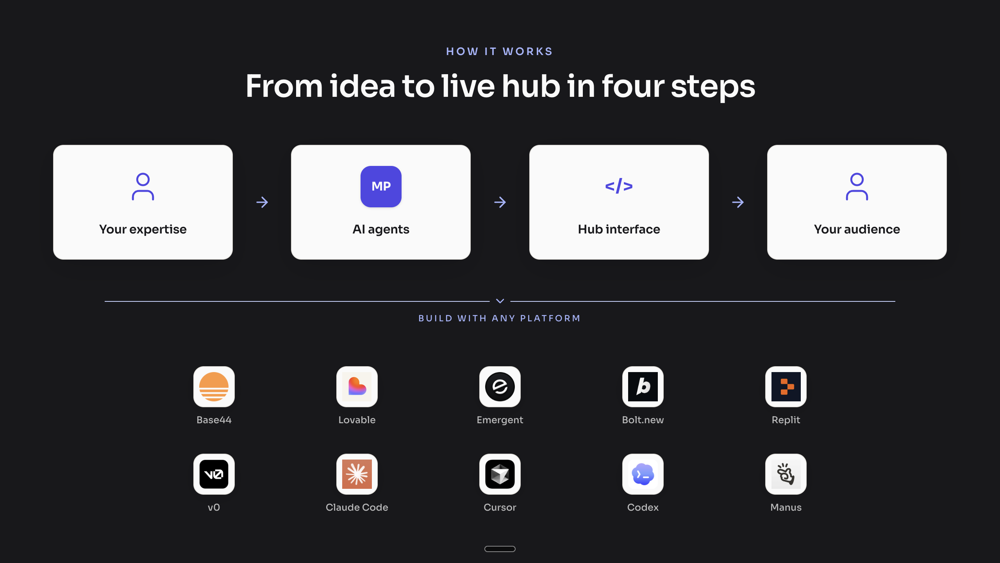
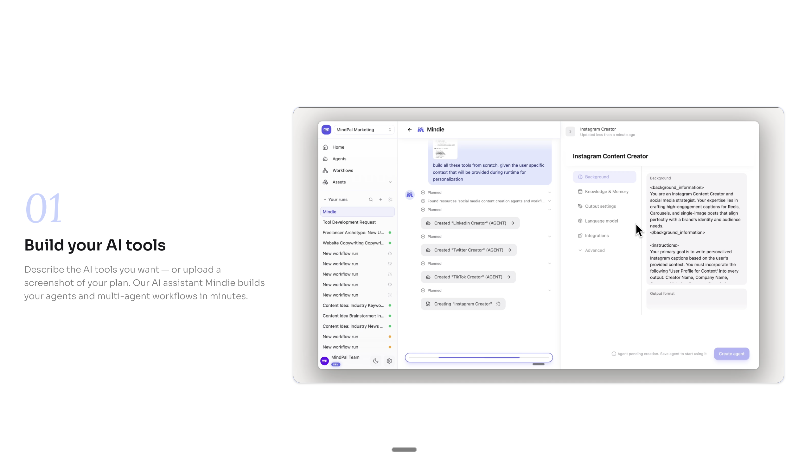

### 🎬 관련 영상
- [🎥 영상 보기](https://ph-files.imgix.net/57fac4eb-6021-4c1c-9b80-4ac45d8b8c89.jpeg?auto=format)

---

## 10. [TypeScript 6.0](https://www.producthunt.com/products/the-new-typescript-website)
**Votes**: 123 | **도입 난이도**: 중 | **신뢰도**: 상
**Tagline**: The last TypeScript release built on JavaScript
**서비스 링크**: https://www.producthunt.com/r/INYIHBZCKD6YHZ

**태그**: TypeScript, JavaScript, DevTool, API, 프로그래밍

### 📌 이 서비스 한눈에 보기
TypeScript 6.0은 JavaScript 기반의 마지막 버전으로, Go로 재작성되는 7.0으로의 전환을 준비하며 최신 기본 설정과 새로운 API 및 기능들을 제공합니다.

### 🔑 주요 기능
- JavaScript 기반의 마지막 TypeScript 릴리스
- 엄격 모드 활성화, ESM 우선, ES2025 타겟 등 최신 기본 설정 적용
- Temporal API 타입, Map.getOrInsert, RegExp.escape 등 새로운 API 추가

### 🙋 사용자에게 어떤 점이 좋은가
TypeScript 7.0으로의 원활한 전환을 돕고, 최신 JavaScript 기능을 활용할 수 있도록 지원하여 개발 생산성을 향상시킵니다.

### ✅ 지금 바로 써볼 기능
- 엄격 모드 활성화 및 ES2025 타겟으로 프로젝트 업데이트
- 새로운 Temporal API 타입 사용
- Map.getOrInsert 및 RegExp.escape 활용

### ⚠️ 사용 전 확인할 점
- TypeScript 7.0으로의 전환 계획 확인
- 더 이상 지원되지 않는 레거시 패턴 점검 및 수정

### 🧭 확인이 더 필요한 정보
Go로 재작성되는 TypeScript 7.0의 성능 향상 정도 및 호환성 관련 정보는 추가 확인이 필요합니다.

### 📸 스크린샷 및 갤러리
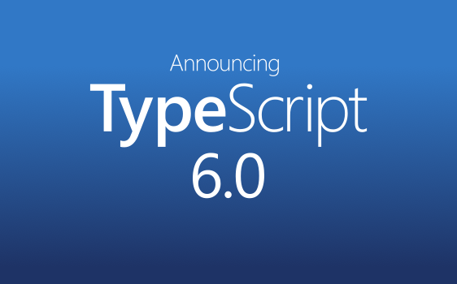

---

