# 🚀 Product Hunt Daily Top 10 (2026-03-26)

## 1. [Agentplace AI Agents](https://www.producthunt.com/products/agentplace)
**Votes**: 415 | **도입 난이도**: 중 | **신뢰도**: 중
**Tagline**: Create specialized AI agents for real tasks and workflows
**서비스 링크**: https://www.producthunt.com/r/LICQ5AAJADF7J6

**태그**: AI 에이전트, 자동화, 워크플로우, 생산성, No-code, Agent, Automation, AI Tool

### 📌 이 서비스 한눈에 보기
Agentplace는 특정 업무에 특화된 AI 에이전트를 쉽게 만들고 활용하여 워크플로우를 자동화하고 효율성을 높여주는 도구입니다.

### 🔑 주요 기능
- 다양한 워크플로우에 바로 사용 가능한 에이전트 템플릿 제공
- 코드 없이 몇 분 만에 맞춤형 에이전트 생성 가능
- 리드 라우팅, 연구, 문서 분석 등 다양한 작업 지원

### 🙋 사용자에게 어떤 점이 좋은가
반복적인 작업을 자동화하여 시간과 노력을 절약하고, 팀 협업 및 기존 도구와의 연동을 통해 업무 효율성을 극대화할 수 있습니다.

### ✅ 지금 바로 써볼 기능
- 기존 워크플로우에 맞는 에이전트 템플릿 검색
- 맞춤형 에이전트 생성 및 팀원과 공유
- 기존 사용하는 도구와 Agentplace 연동

### ⚠️ 사용 전 확인할 점
- 에이전트 성능은 학습 데이터 품질에 따라 달라질 수 있음
- 특정 작업에 대한 에이전트의 정확도 및 신뢰성 검증 필요

### 🧭 확인이 더 필요한 정보
Agentplace의 다양한 기능과 실제 사용 사례에 대한 추가 정보 확인이 필요합니다.

### 📸 스크린샷 및 갤러리
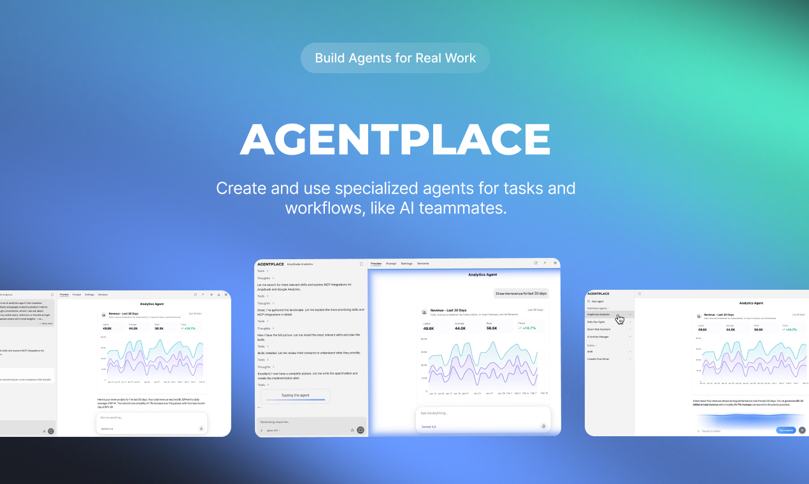
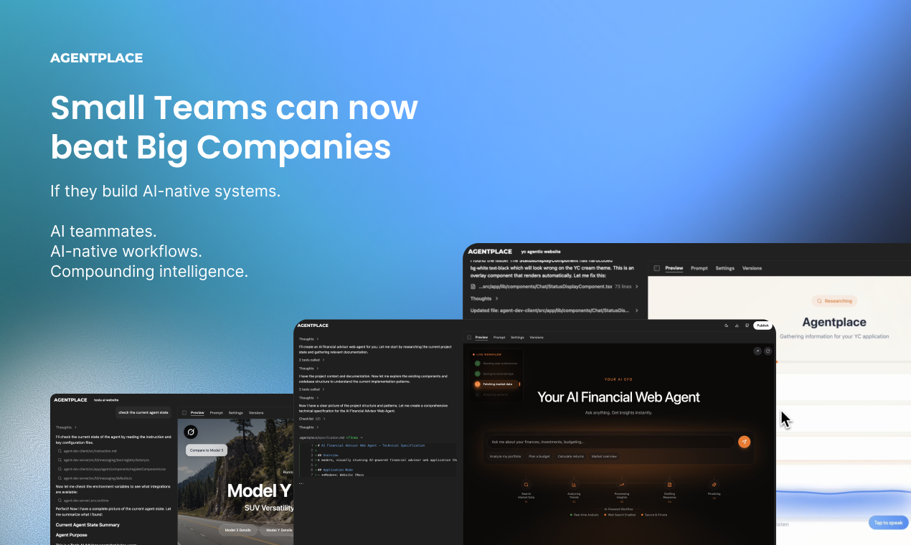
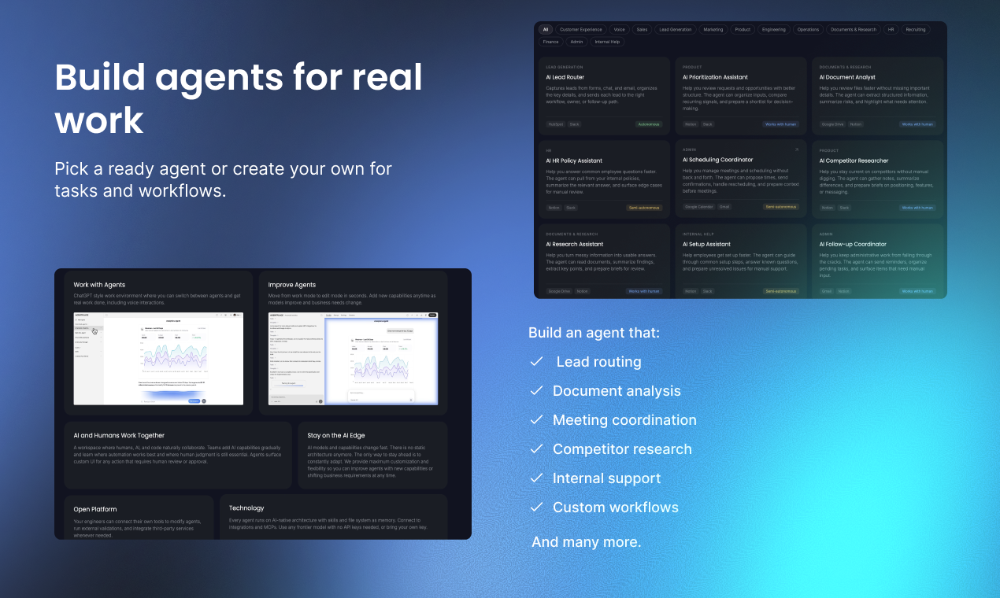

### 🎬 관련 영상
- [🎥 영상 보기](https://ph-files.imgix.net/69bec4e5-70a6-4d96-95d4-49e86bf71d72.jpeg?auto=format)

---

## 2. [Auto Mode by Claude Code](https://www.producthunt.com/products/claude)
**Votes**: 329 | **도입 난이도**: 중 | **신뢰도**: 중
**Tagline**: Let Claude make permission decisions on your behalf
**서비스 링크**: https://www.producthunt.com/r/RJLK2YR4XIFPRO
**재등장**: 최근 7일 내 재등장 (마지막 등장 4일 전)

**태그**: DevTool, 자동화, AI, 코드 분석

### 📌 이 서비스 한눈에 보기
Claude Code의 자동 모드는 파일 쓰기 및 bash 명령 승인을 자동화하여 개발자가 안전한 환경에서 더 효율적으로 작업할 수 있도록 돕습니다.

### 🔑 주요 기능
- Claude가 파일 쓰기 및 bash 명령을 자동으로 승인합니다.
- 안전한 작업은 자동으로 실행하고, 위험한 작업은 차단합니다.
- 격리된 환경에서 사용해야 합니다.

### 🙋 사용자에게 어떤 점이 좋은가
개발자는 Claude의 자동 모드를 통해 반복적인 승인 작업을 줄이고, 더 중요한 코딩 작업에 집중할 수 있습니다. 특히 격리된 환경에서 안전하게 자동화된 워크플로우를 구축할 수 있습니다.

### ✅ 지금 바로 써볼 기능
- 격리된 개발 환경에서 자동 모드를 활성화하여 테스트해 보세요.
- 자동으로 승인되는 작업과 차단되는 작업의 기준을 확인하세요.
- 자동 모드 사용 시 발생할 수 있는 잠재적 위험을 평가하세요.

### ⚠️ 사용 전 확인할 점
- 격리되지 않은 환경에서는 예상치 못한 보안 문제가 발생할 수 있습니다.
- 자동 승인 기준을 잘못 설정하면 데이터 손실이나 시스템 오류가 발생할 수 있습니다.

### 🧭 확인이 더 필요한 정보
자동 모드의 분류 정확도와 실제 환경에서의 성능에 대한 추가 정보가 필요합니다.

### 📸 스크린샷 및 갤러리
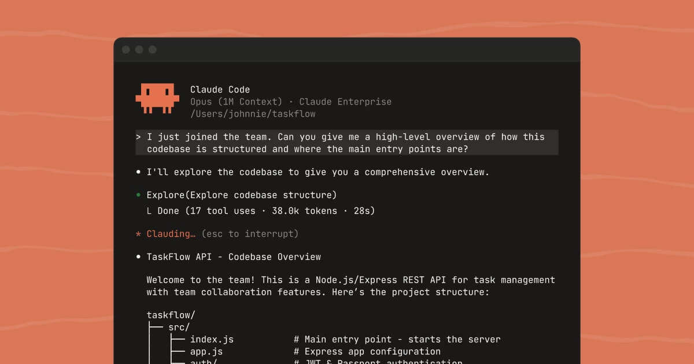
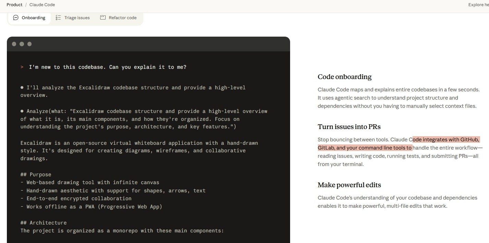
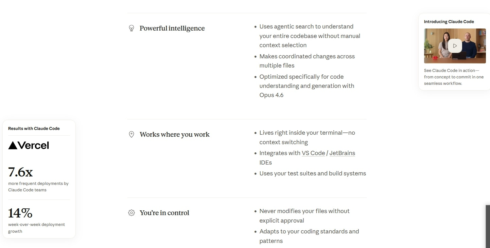

---

## 3. [Pendium](https://www.producthunt.com/products/pendium-ai)
**Votes**: 219 | **도입 난이도**: 중 | **신뢰도**: 중
**Tagline**: Help AI agents recommend you more often to the right people
**서비스 링크**: https://www.producthunt.com/r/5KNOBKVPLIFIWQ

**태그**: AI, 마케팅, 자동화, 분석, 가시성, Agent, AI Tool

### 📌 이 서비스 한눈에 보기
Pendium은 AI 에이전트가 사용자의 제품 및 서비스를 더 자주, 올바른 사람들에게 추천하도록 돕는 마케팅 도구입니다.

### 🔑 주요 기능
- AI 에이전트가 제품 카테고리를 어떻게 조사하는지 추적 및 관리
- AI 에이전트가 인용하는 내용과 사용자의 노출 방식 파악
- 기존 콘텐츠 엔지니어링 시스템과 연결하여 실시간 가시성 데이터 및 인사이트 확보

### 🙋 사용자에게 어떤 점이 좋은가
AI 에이전트가 구매 결정에 미치는 영향력이 커짐에 따라, Pendium은 기업이 AI 가시성을 모니터링하고 성장시키는 데 도움을 줍니다.

### ✅ 지금 바로 써볼 기능
- AI 에이전트가 사용자의 제품 카테고리를 어떻게 조사하는지 추적
- AI 에이전트가 어떤 콘텐츠를 인용하는지 확인
- Pendium을 기존 콘텐츠 엔지니어링 시스템과 연결하여 데이터 확보

### ⚠️ 사용 전 확인할 점
- AI 에이전트의 의사 결정 로직에 대한 이해가 필요
- 정확한 데이터 분석을 위한 콘텐츠 엔지니어링 시스템 연동 필요

### 🧭 확인이 더 필요한 정보
AI 에이전트 마케팅의 효과 측정 및 ROI에 대한 추가 정보 확인이 필요합니다.

### 📸 스크린샷 및 갤러리

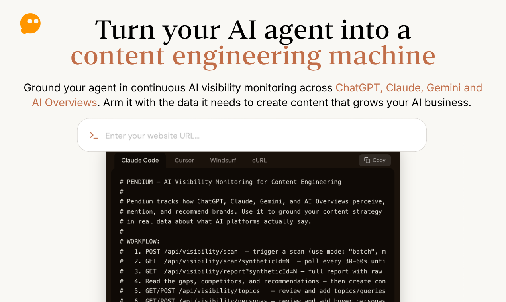
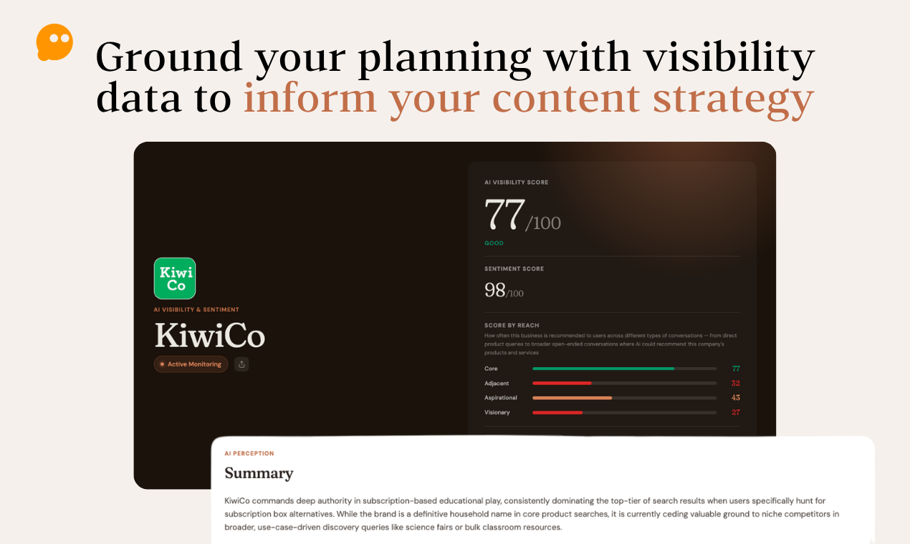

### 🎬 관련 영상
- [🎥 영상 보기](https://ph-files.imgix.net/4cd6a840-a581-4d6c-8eaf-364c6ce2f0de.gif?auto=format)

---

## 4. [TurboQuant](https://www.producthunt.com/products/turboquant)
**Votes**: 207 | **도입 난이도**: 중 | **신뢰도**: 중
**Tagline**:  New LLM compression algorithm by Google 
**서비스 링크**: https://www.producthunt.com/r/CRKBWLVAB4ZKZV

**태그**: LLM, 압축, 알고리즘, 최적화, 검색엔진

### 📌 이 서비스 한눈에 보기
Google에서 개발한 TurboQuant는 LLM과 벡터 검색 엔진을 위한 새로운 압축 알고리즘으로, 모델 크기를 대폭 줄여줍니다.

### 🔑 주요 기능
- 대규모 언어 모델 압축
- 벡터 검색 엔진 최적화
- 이론적으로 검증된 양자화 알고리즘

### 🙋 사용자에게 어떤 점이 좋은가
모델 크기를 줄여 리소스 사용량을 절감하고, 더 빠른 추론 속도를 경험할 수 있습니다. 특히 LLM을 활용한 서비스 운영 비용을 크게 낮출 수 있습니다.

### ✅ 지금 바로 써볼 기능
- TurboQuant 알고리즘을 기존 LLM 모델에 적용해보기
- 벡터 검색 엔진에 TurboQuant를 통합하여 검색 속도 향상 테스트
- 압축률과 성능 간의 균형점을 찾아 최적화하기

### ⚠️ 사용 전 확인할 점
- 압축 과정에서 모델 정확도 손실 가능성 확인
- 특정 모델 아키텍처에 대한 호환성 검토 필요

### 🧭 확인이 더 필요한 정보
실제 사용 환경에서의 성능 및 리소스 절감 효과는 모델 및 데이터셋에 따라 달라질 수 있습니다.

### 📸 스크린샷 및 갤러리
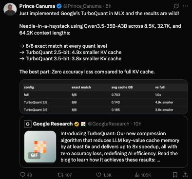
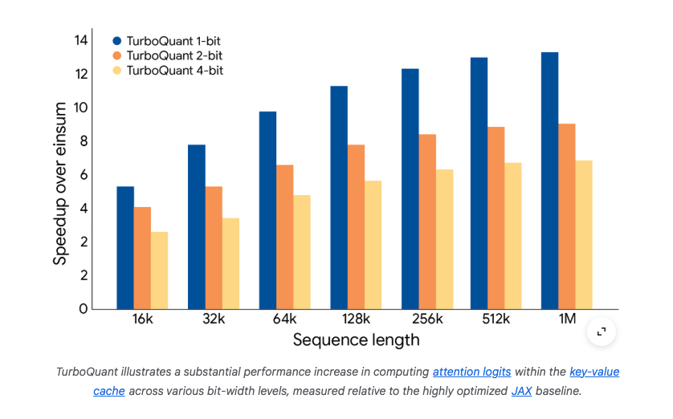
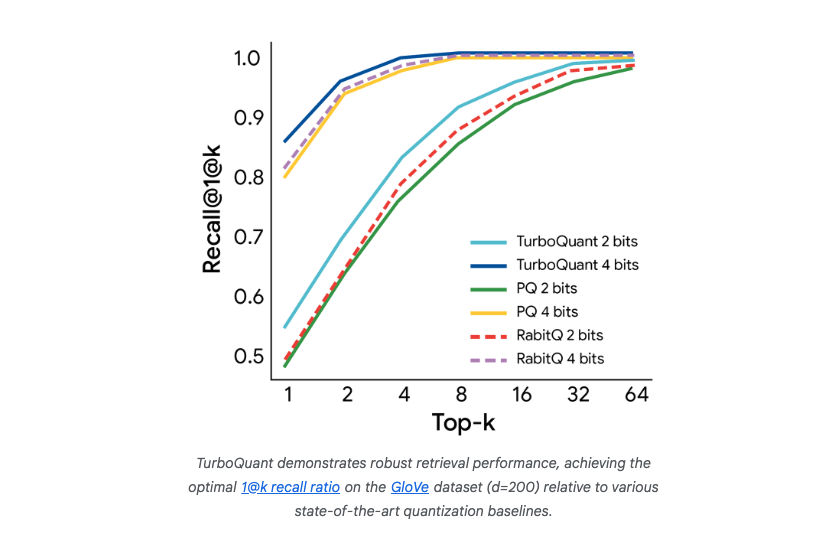

---

## 5. [LayerProof Matte](https://www.producthunt.com/products/layerproof-social-content-generation)
**Votes**: 170 | **도입 난이도**: 중 | **신뢰도**: 중
**Tagline**: Repurpose social media posts with unique content per format
**서비스 링크**: https://www.producthunt.com/r/JWWNPF7CWATCS7

**태그**: 콘텐츠 생성, 자동화, 소셜 미디어, 마케팅, AI Tool

### 📌 이 서비스 한눈에 보기
LayerProof Matte는 URL 하나로 LinkedIn, X, Instagram, TikTok, Facebook에 최적화된 콘텐츠를 자동 생성하여 소셜 미디어 마케팅 효율을 극대화합니다.

### 🔑 주요 기능
- URL 기반 콘텐츠 자동 생성
- 각 플랫폼별 네이티브 포맷 지원
- 출처 추적 가능 및 허위 정보 방지

### 🙋 사용자에게 어떤 점이 좋은가
소셜 미디어 콘텐츠 제작 시간을 단축하고, 플랫폼별 최적화된 포맷으로 게시하여 도달률과 참여도를 높일 수 있습니다.

### ✅ 지금 바로 써볼 기능
- URL을 붙여넣고 다양한 플랫폼용 콘텐츠 생성해보기
- 생성된 콘텐츠의 출처 추적 기능 확인하기
- 무료 평가판으로 기능 체험하기

### ⚠️ 사용 전 확인할 점
- 생성된 콘텐츠의 적합성을 검토해야 함
- 지원하는 플랫폼 및 기능에 제한이 있을 수 있음

### 🧭 확인이 더 필요한 정보
자동 생성 콘텐츠의 품질과 플랫폼별 최적화 수준에 대한 사용자 후기 확인이 필요합니다.

### 📸 스크린샷 및 갤러리

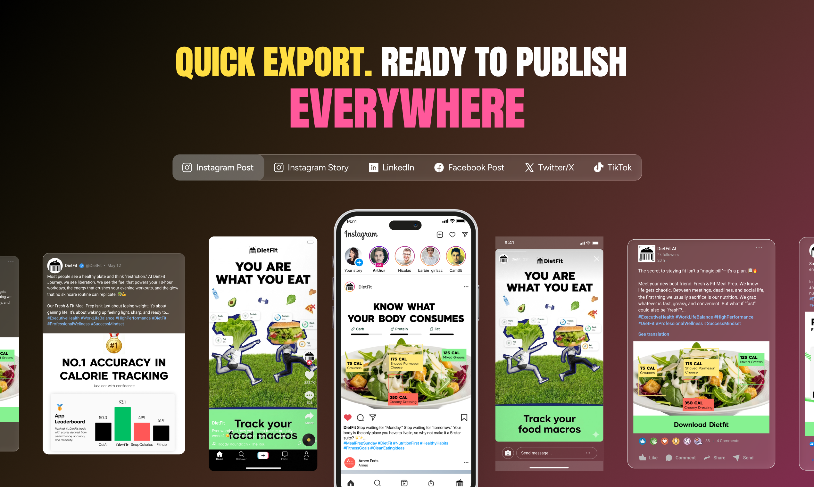

### 🎬 관련 영상
- [🎥 영상 보기](https://ph-files.imgix.net/15dfd266-5cb0-4b3f-833e-42e07e9efd01.jpeg?auto=format)

---

## 6. [Omma](https://www.producthunt.com/products/omma)
**Votes**: 153 | **도입 난이도**: 중 | **신뢰도**: 중
**Tagline**: Create 3D, apps, and websites with parallel agents
**서비스 링크**: https://www.producthunt.com/r/PUUQ6CD2KCAOI3

**태그**: 3D, AI, 코드 생성, 자동화, Agent, AI Tool, LLM, DevTool

### 📌 이 서비스 한눈에 보기
Omma는 LLM, AI 3D 생성, 미디어 생성을 병렬 에이전트와 결합하여 인터랙티브 앱, 웹사이트, 3D 에셋 등을 만들 수 있게 해주는 도구입니다.

### 🔑 주요 기능
- 코드 생성 (LLM 활용)
- AI 기반 3D 모델 생성
- 병렬 에이전트를 통한 자동화

### 🙋 사용자에게 어떤 점이 좋은가
코딩 없이도 3D 에셋, 앱, 웹사이트를 빠르게 제작하여 아이디어를 시각화하고 프로토타입을 만들 수 있습니다.

### ✅ 지금 바로 써볼 기능
- 3D 에셋 생성 기능 사용해보기
- 웹사이트 자동 생성 기능 사용해보기
- 병렬 에이전트 설정 실험해보기

### ⚠️ 사용 전 확인할 점
- AI 생성 결과물의 품질은 프롬프트에 따라 달라질 수 있습니다.
- 복잡한 로직 구현에는 한계가 있을 수 있습니다.

### 🧭 확인이 더 필요한 정보
생성 결과물의 상업적 이용 가능 범위에 대한 추가 확인이 필요합니다.

### 📸 스크린샷 및 갤러리
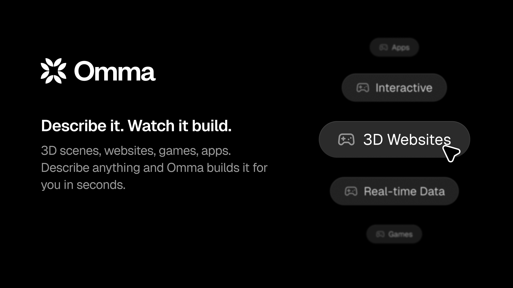
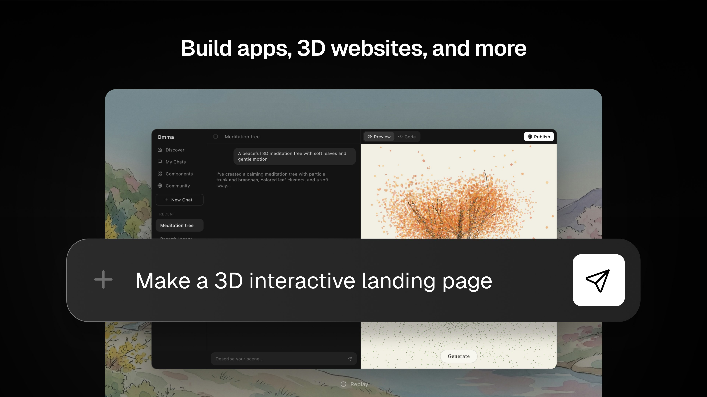
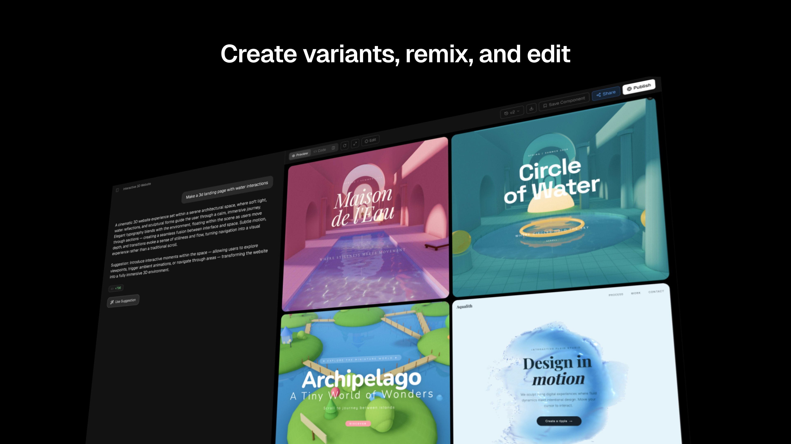

### 🎬 관련 영상
- [🎥 영상 보기](https://ph-files.imgix.net/aa573dec-1d5a-42b1-9bb0-c0beb7716877.jpeg?auto=format)

---

## 7. [Flowershow](https://www.producthunt.com/products/flowershow)
**Votes**: 143 | **도입 난이도**: 하 | **신뢰도**: 중
**Tagline**: Publish your markdown as a beautiful website – in seconds.
**서비스 링크**: https://www.producthunt.com/r/TEUUV4MOU5UDJ5

**태그**: Markdown, Website Builder, Documentation, No-code, AI Tool

### 📌 이 서비스 한눈에 보기
Flowershow는 마크다운 파일을 즉시 아름다운 웹사이트로 변환하여 배포 및 유지보수 부담 없이 문서, 블로그, 위키 등을 게시할 수 있게 해주는 호스팅 플랫폼입니다.

### 🔑 주요 기능
- 마크다운 파일을 기반으로 웹사이트 즉시 생성
- 배포 및 유지보수 불필요
- GitHub, CLI, Obsidian, 드래그 앤 드롭 등 다양한 방식의 파일 Import 지원

### 🙋 사용자에게 어떤 점이 좋은가
코딩 없이도 마크다운 파일만으로 멋진 웹사이트를 빠르게 만들고 관리할 수 있어, 기술 문서나 개인 블로그를 운영하는 사용자에게 매우 유용합니다.

### ✅ 지금 바로 써볼 기능
- GitHub 저장소 연동하여 문서 웹사이트 구축해보기
- Obsidian 노트 가져와서 지식 베이스 만들기
- 드래그 앤 드롭으로 간단한 랜딩 페이지 만들어보기

### ⚠️ 사용 전 확인할 점
- 무료 플랜의 기능 제한 확인 필요
- 커스터마이징 옵션의 범위 확인 필요

### 🧭 확인이 더 필요한 정보
Flowershow의 트래픽 제한 및 스케일링 옵션에 대한 추가 정보가 필요합니다.

### 📸 스크린샷 및 갤러리
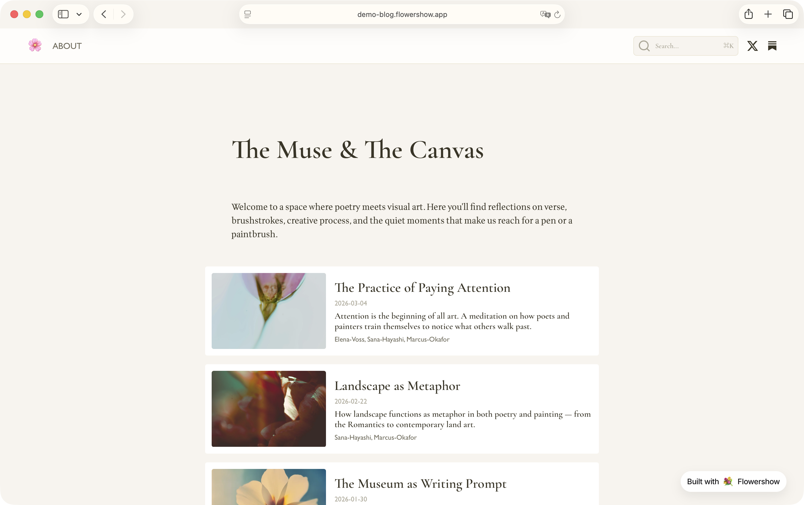
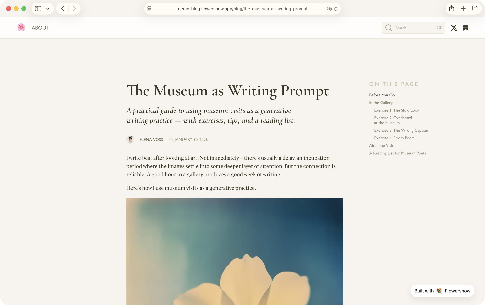
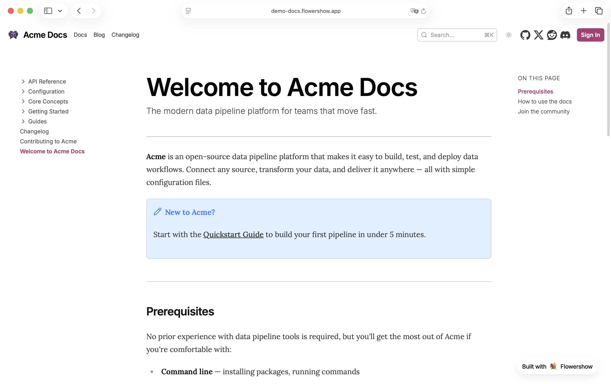

### 🎬 관련 영상
- [🎥 영상 보기](https://ph-files.imgix.net/87a54086-0329-4897-87e1-d5ef2df7d60b.jpeg?auto=format)

---

## 8. [Toone](https://www.producthunt.com/products/toone)
**Votes**: 134 | **도입 난이도**: 중 | **신뢰도**: 중
**Tagline**: AI teams that run your work
**서비스 링크**: https://www.producthunt.com/r/Q3DWHAV6WOUFUR

**태그**: AI, 자동화, 생산성, 업무 효율, 에이전트, Agent, AI Tool

### 📌 이 서비스 한눈에 보기
Toone은 AI 에이전트 팀을 관리하여 업무를 자동화하고 효율성을 높여주는 툴입니다. 특히 ProductHunt 사용자를 위해 평생 템플릿을 제공합니다.

### 🔑 주요 기능
- 스포트라이트 인터페이스를 통해 AI 에이전트 팀 관리
- 웹사이트 연동 및 회의 기록/루틴 실행 기능
- 다양한 부서별 무료 템플릿 제공 (ProductHunt 사용자에게는 평생 템플릿 제공)

### 🙋 사용자에게 어떤 점이 좋은가
반복적인 업무를 자동화하고, 다양한 템플릿을 활용하여 업무 효율성을 극대화할 수 있습니다. 특히 인스타그램 연동 템플릿은 소셜 미디어 분석 및 콘텐츠 제작에 유용합니다.

### ✅ 지금 바로 써볼 기능
- 미디어 조직 템플릿을 사용하여 인스타그램 분석 및 게시물 작성 자동화
- 웹사이트를 연동하여 데이터 수집 및 분석 자동화
- 회의 기록 및 루틴 실행 기능 활용

### ⚠️ 사용 전 확인할 점
- AI 에이전트의 성능은 설정 및 데이터에 따라 달라질 수 있음
- 웹사이트 연동 시 개인 정보 보호 정책 및 데이터 보안 고려 필요

### 🧭 확인이 더 필요한 정보
AI 에이전트의 정확도 및 자동화 수준은 사용 사례에 따라 다를 수 있으므로, 실제 사용 환경에서 테스트가 필요합니다.

### 📸 스크린샷 및 갤러리
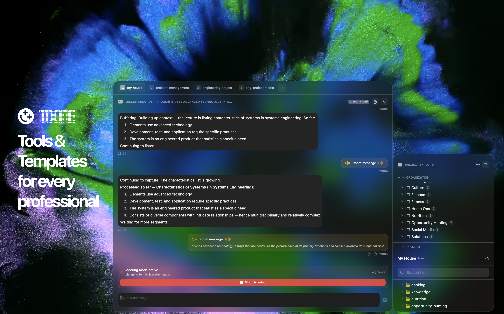

### 🎬 관련 영상
- [🎥 영상 보기](https://ph-files.imgix.net/38b84c30-6f81-47be-9411-c08bae626176.jpeg?auto=format)

---

## 9. [Descent](https://www.producthunt.com/products/descent-2)
**Votes**: 127 | **도입 난이도**: 하 | **신뢰도**: 중
**Tagline**: Set a budget and get alerted when flights get cheap
**서비스 링크**: https://www.producthunt.com/r/HJJEFWAVKPTNO5

**태그**: 여행, 항공권, 가격 추적, 자동 알림, AI

### 📌 이 서비스 한눈에 보기
Descent는 원하는 항공편 가격을 설정하고, 가격이 내려가면 알림을 받아 항공권을 저렴하게 구매할 수 있도록 도와주는 서비스입니다.

### 🔑 주요 기능
- 원하는 노선, 예산 설정 후 가격 변동 알림
- 비즈니스/이코노미 클래스, 직항, 다양한 통화, 승객 수 추적 지원
- Descent Copilot을 통해 음성으로 알림 생성 가능 (Apple Intelligence 활용, 온디바이스)

### 🙋 사용자에게 어떤 점이 좋은가
더 이상 항공권 가격을 계속 확인할 필요 없이, 예산 내에서 가장 저렴한 항공권을 자동으로 찾을 수 있어 시간과 노력을 절약해 줍니다.

### ✅ 지금 바로 써볼 기능
- 원하는 여행지와 예산을 설정하여 알림 생성
- Descent Copilot을 사용하여 음성으로 알림 생성
- 비즈니스/이코노미 클래스 설정을 변경하여 가격 비교

### ⚠️ 사용 전 확인할 점
- Apple Intelligence는 온디바이스로 구동되므로, 지원 기기 확인 필요
- 가격 변동 알림의 정확성 및 시의성 확인 필요

### 🧭 확인이 더 필요한 정보
Descent Copilot의 한국어 지원 여부 및 성능 확인이 필요합니다.

### 📸 스크린샷 및 갤러리
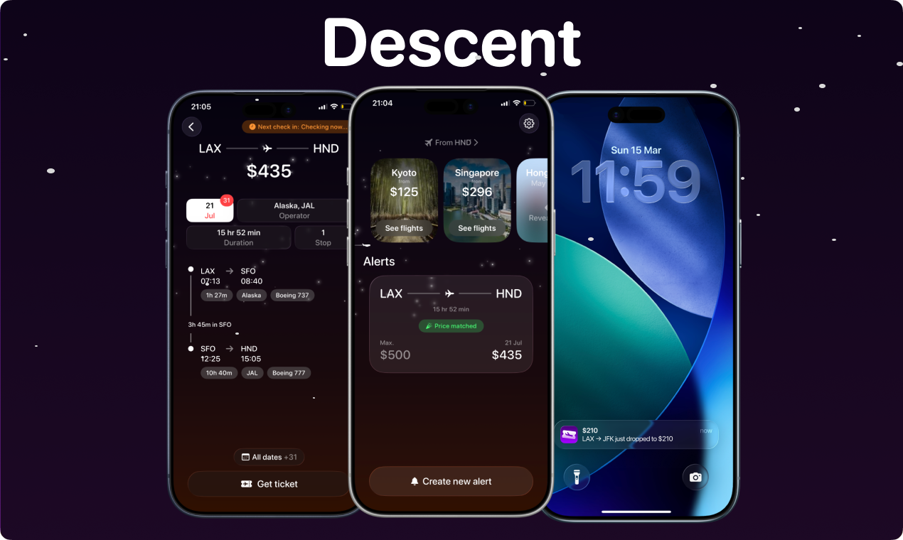
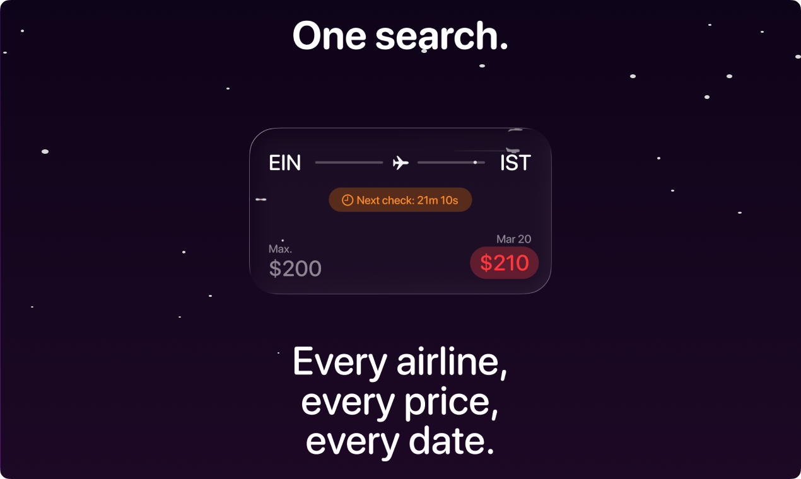

---

## 10. [Aikido × Lovable](https://www.producthunt.com/products/aikido-2)
**Votes**: 126 | **도입 난이도**: 중 | **신뢰도**: 중
**Tagline**: Agentic pentesting, now inside Lovable
**서비스 링크**: https://www.producthunt.com/r/CVJ2TY5KT3QMZV

**태그**: DevTool, 보안, 테스트, 자동화, Agent, AI Tool

### 📌 이 서비스 한눈에 보기
Lovable 플랫폼에 Aikido의 침투 테스트 기능이 통합되어, 실제 공격을 시뮬레이션하고 배포 전에 문제를 해결할 수 있습니다.

### 🔑 주요 기능
- Lovable 내에서 침투 테스트 수행
- 실제 공격 시뮬레이션 가능
- 배포 전 문제 해결

### 🙋 사용자에게 어떤 점이 좋은가
개발자는 실제 공격과 유사한 환경에서 애플리케이션의 취약점을 사전에 발견하고 수정하여, 보안성을 높일 수 있습니다.

### ✅ 지금 바로 써볼 기능
- Lovable에서 Aikido 침투 테스트 기능 활성화
- 애플리케이션에 대한 침투 테스트 시뮬레이션 실행
- 발견된 취약점 수정 및 재테스트

### ⚠️ 사용 전 확인할 점
- 침투 테스트의 범위와 깊이는 Aikido의 기능에 따라 제한될 수 있음
- 테스트 결과에 대한 해석 및 수정은 개발자의 책임 하에 이루어져야 함

### 🧭 확인이 더 필요한 정보
Aikido의 침투 테스트 기능이 Lovable 플랫폼에 얼마나 긴밀하게 통합되었는지 확인이 필요합니다.

### 📸 스크린샷 및 갤러리
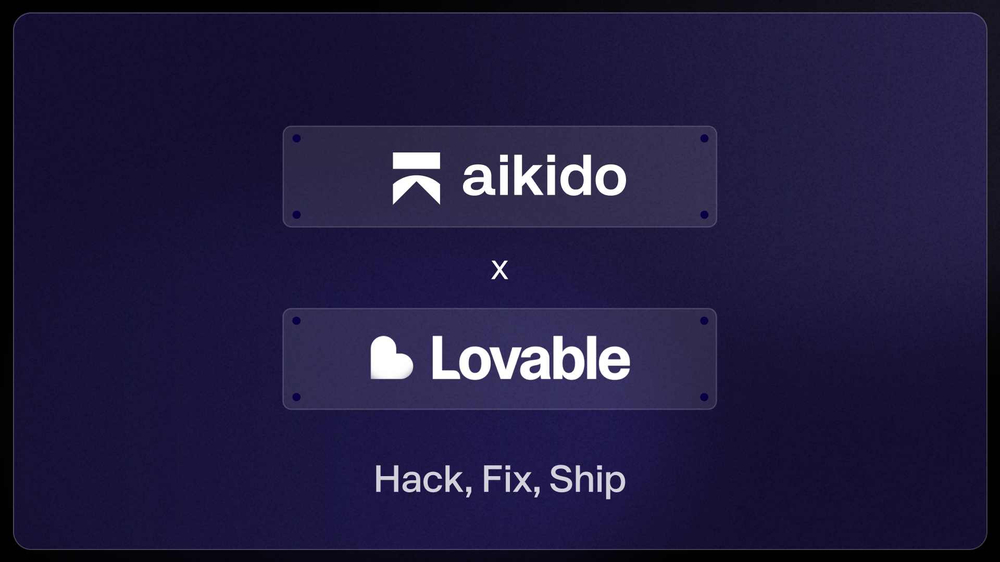
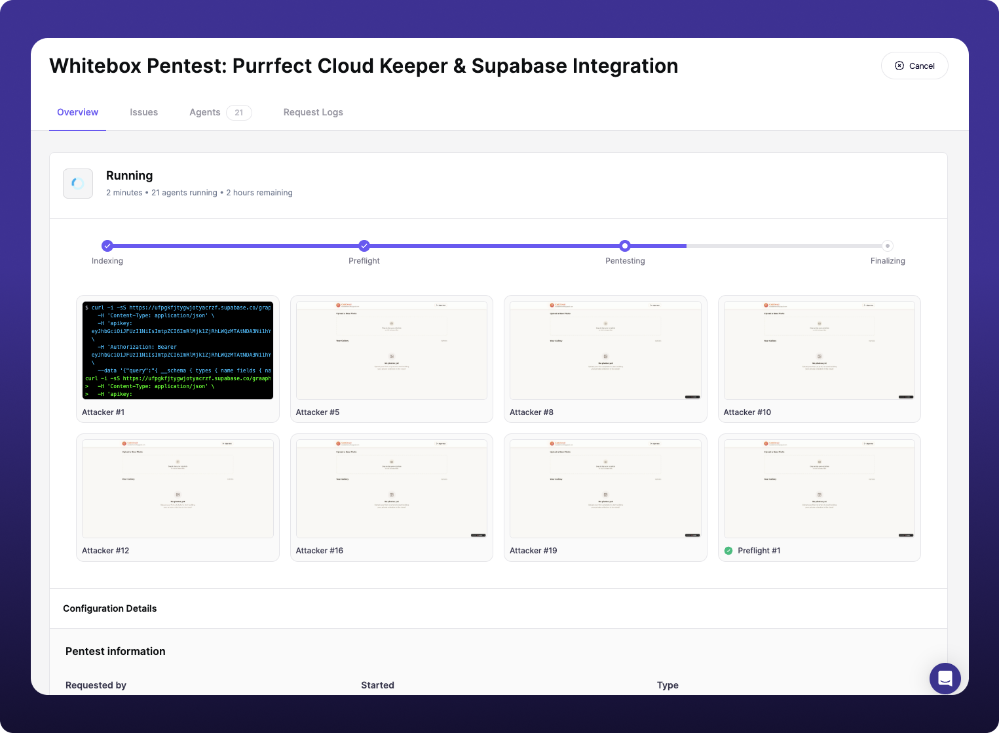

---

