# 🚀 Product Hunt Daily Top 10 (2026-03-27)

## 1. [Littlebird](https://www.producthunt.com/products/littlebird)
**Votes**: 0 | **도입 난이도**: 중 | **신뢰도**: 중
**Tagline**: The AI assistant that already knows your work
**서비스 링크**: https://www.producthunt.com/r/5P6FZ2JTZUBBPB

**태그**: AI, 생산성, 업무 자동화, AI Tool

### 📌 이 서비스 한눈에 보기
Littlebird는 사용자의 업무 내용을 파악하여 더욱 관련성 높은 답변, 초안, 계획을 제공하는 AI 비서입니다.

### 🔑 주요 기능
- 화면에 보이는 내용을 인식하고 회의 내용을 기록하여 프로젝트 및 우선순위에 대한 개인 메모리를 구축합니다.
- 앱과 대화 전반에 걸쳐 정보를 연결하여 실제 업무에 기반한 답변을 제공합니다.
- 별도의 통합 없이 데스크톱에서 보이는 모든 것을 Littlebird가 파악합니다.

### 🙋 사용자에게 어떤 점이 좋은가
Littlebird는 사용자의 업무 맥락을 이해하여 더욱 정확하고 개인화된 지원을 제공하므로, 업무 효율성을 높이고 의사 결정을 개선하는 데 도움이 됩니다.

### ✅ 지금 바로 써볼 기능
- Littlebird를 설치하고 평소처럼 업무를 진행하며 AI가 어떻게 학습하는지 관찰합니다.
- 특정 프로젝트에 대한 요약 또는 계획 초안을 요청하여 관련성을 평가합니다.
- 회의 내용을 요약하거나 특정 정보에 대한 질문을 던져 답변의 정확성을 확인합니다.

### ⚠️ 사용 전 확인할 점
- 개인 정보 보호 정책 및 데이터 보안 조치를 확인해야 합니다.
- AI가 모든 정보를 정확하게 파악하지 못할 수 있으므로, 중요한 정보는 항상 재확인해야 합니다.

### 🧭 확인이 더 필요한 정보
Littlebird의 성능이 다양한 업무 환경과 앱에서 일관적으로 유지되는지 추가적인 사용 후기 확인이 필요합니다.

### 📸 스크린샷 및 갤러리
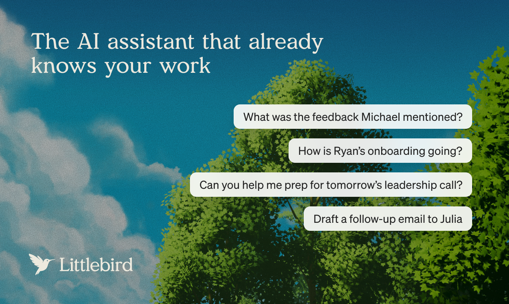
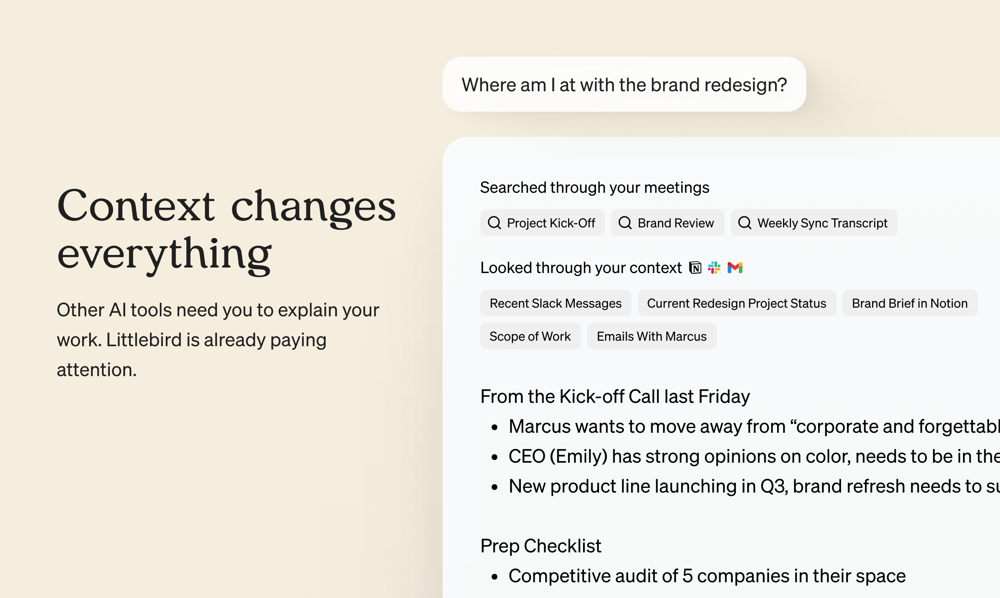
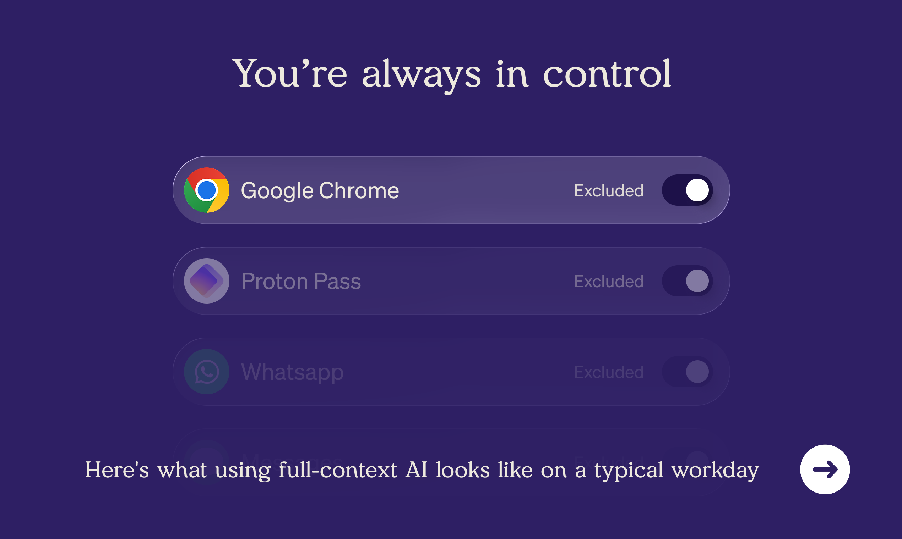

---

## 2. [Claude Mobile: Work Tools](https://www.producthunt.com/products/claude-mobile-work-tools)
**Votes**: 0 | **도입 난이도**: 중 | **신뢰도**: 중
**Tagline**: Access Claude work tools on the go
**서비스 링크**: https://www.producthunt.com/r/56LSOTAGCFBSS7

**태그**: 생산성, 협업, 모바일, 업무 자동화, Design

### 📌 이 서비스 한눈에 보기
이제 Claude를 통해 이동 중에도 Figma 디자인 검토, Canva 슬라이드 제작, Amplitude 대시보드 확인 등 다양한 작업을 스마트폰으로 처리할 수 있습니다.

### 🔑 주요 기능
- Claude를 통해 언제 어디서든 업무 도구에 접근 가능
- Figma, Canva, Amplitude 등 다양한 플랫폼 지원
- 이동 중에도 효율적인 업무 처리 가능

### 🙋 사용자에게 어떤 점이 좋은가
더 이상 데스크에 얽매이지 않고 이동 중에도 디자인 검토, 프레젠테이션 제작, 데이터 분석 등 다양한 업무를 처리하여 생산성을 높일 수 있습니다.

### ✅ 지금 바로 써볼 기능
- 모바일에서 Claude를 실행하고 Figma 디자인을 열어보기
- Canva 슬라이드를 Claude에서 바로 수정하고 공유하기
- Amplitude 대시보드를 확인하여 주요 지표를 모니터링하기

### ⚠️ 사용 전 확인할 점
- 모바일 환경에서의 데이터 사용량 확인 필요
- 각 플랫폼과의 호환성 및 기능 제한 여부 확인 필요

### 🧭 확인이 더 필요한 정보
Claude 모바일 앱의 구체적인 기능 및 지원 플랫폼 목록에 대한 추가 정보 확인이 필요합니다.

### 📸 스크린샷 및 갤러리
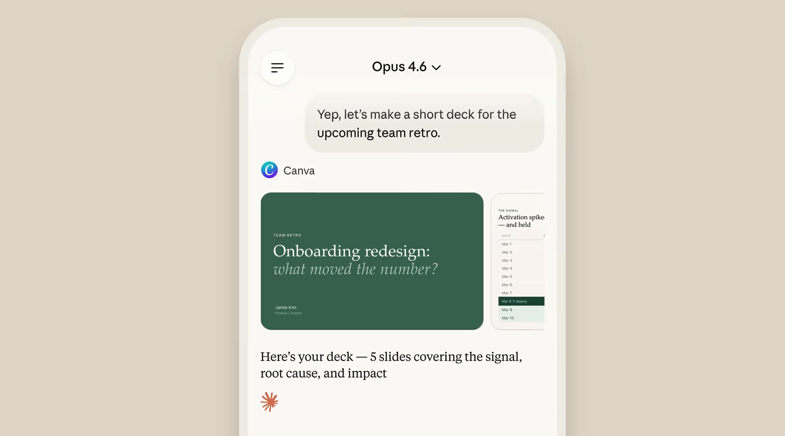
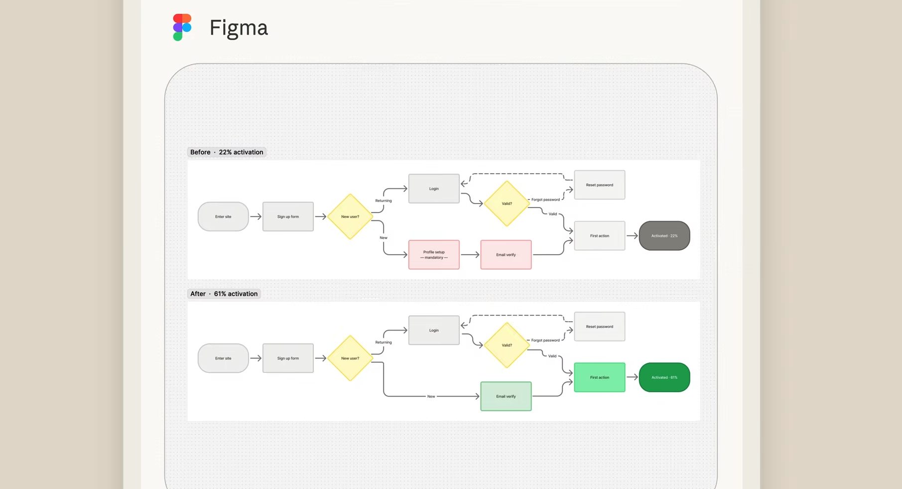
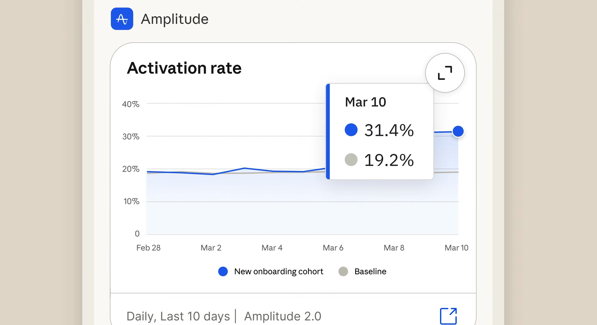

### 🎬 관련 영상
- [🎥 영상 보기](https://ph-files.imgix.net/0a724048-ebcf-4240-9280-f1d264a50b6f.jpeg?auto=format)
- [🎥 영상 보기](https://ph-files.imgix.net/14f0dd76-b97f-4cce-92b5-c0a7b4ffe519.jpeg?auto=format)

---

## 3. [Mokkit](https://www.producthunt.com/products/mokkit-2)
**Votes**: 0 | **도입 난이도**: 하 | **신뢰도**: 중
**Tagline**: Turn any screenshot into a scroll-stopping animated visual 
**서비스 링크**: https://www.producthunt.com/r/UGEWK3FWIAMDYO

**태그**: 디자인, 애니메이션, 마케팅, 스크린샷, 모형, Design, Marketing

### 📌 이 서비스 한눈에 보기
Mokkit은 정적인 스크린샷을 눈길을 사로잡는 애니메이션 모형으로 빠르게 변환하여 디자인 기술 없이도 마케팅 자료를 돋보이게 해줍니다.

### 🔑 주요 기능
- 정적 스크린샷을 애니메이션 장치 모형으로 변환
- 디자인 기술 없이 사용 가능
- 소프트웨어, 앱, 웹사이트를 전문적으로 보여주는데 적합

### 🙋 사용자에게 어떤 점이 좋은가
소프트웨어나 앱의 스크린샷을 더욱 매력적이고 전문적으로 보여줄 수 있어 마케팅 자료의 효과를 높일 수 있습니다. 디자인 기술이 없어도 쉽게 사용할 수 있다는 장점이 있습니다.

### ✅ 지금 바로 써볼 기능
- 스크린샷을 업로드하여 애니메이션 모형으로 변환해보기
- 다양한 애니메이션 효과 적용해보기
- 변환된 이미지를 마케팅 자료에 활용해보기

### ⚠️ 사용 전 확인할 점
- 애니메이션 효과가 과도하면 오히려 집중도를 떨어뜨릴 수 있음
- 변환 결과물의 품질이 원본 스크린샷에 따라 달라질 수 있음

### 🧭 확인이 더 필요한 정보
애니메이션 효과의 종류와 사용자 정의 옵션에 대한 추가 정보 확인이 필요합니다.

### 📸 스크린샷 및 갤러리
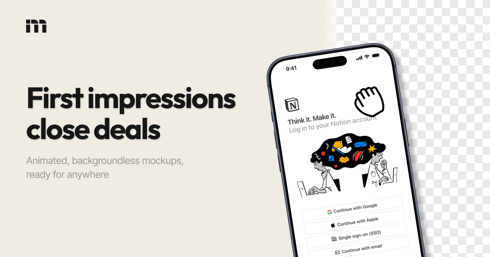
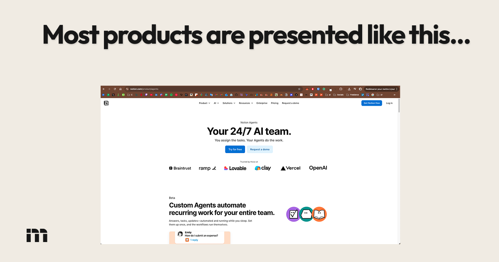
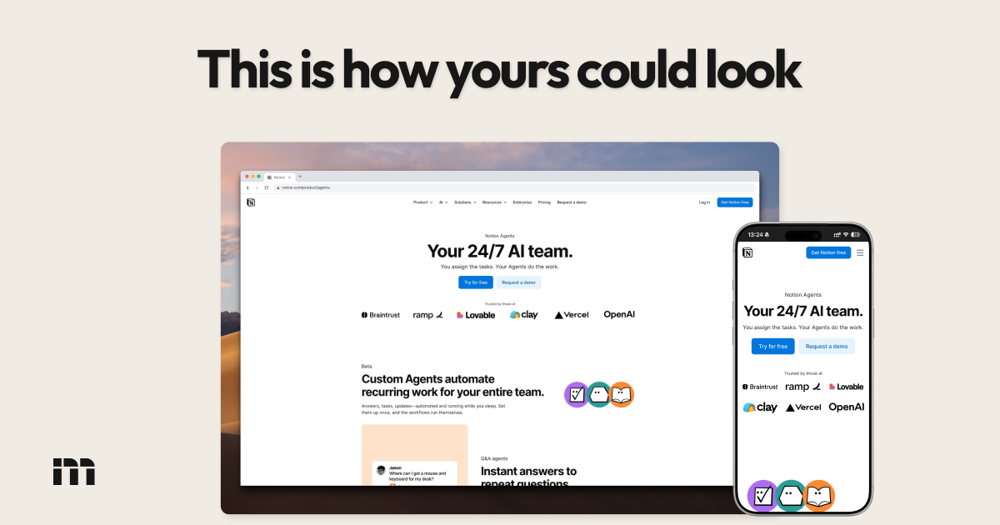

---

## 4. [Jentic Mini](https://www.producthunt.com/products/jentic-mini)
**Votes**: 0 | **도입 난이도**: 중 | **신뢰도**: 중
**Tagline**: Give your AI agents safe access to 10,000+ APIs
**서비스 링크**: https://www.producthunt.com/r/D7O56LQECI47DE

**태그**: AI, API, DevTool, Automation, Security, Agent, AI Tool, Prompting

### 📌 이 서비스 한눈에 보기
Jentic Mini는 AI 에이전트가 안전하게 10,000개 이상의 API에 접근할 수 있도록 돕는 오픈 소스 API 실행 레이어입니다.

### 🔑 주요 기능
- 에이전트와 외부 세계 사이의 중개자 역할
- API 인증 및 보안 관리 자동화
- 10,000개 이상의 API 카탈로그 제공

### 🙋 사용자에게 어떤 점이 좋은가
AI 에이전트 개발 시 API 연동의 복잡성을 줄여주고, 보안 위험 없이 다양한 API를 활용할 수 있게 해줍니다.

### ✅ 지금 바로 써볼 기능
- 자체 호스팅 환경에 Jentic Mini 설치
- API 카탈로그 탐색 및 필요한 API 선택
- 에이전트에서 API 호출 테스트

### ⚠️ 사용 전 확인할 점
- 자체 호스팅 환경 구축 및 유지 관리 필요
- API 카탈로그의 최신성 및 정확성 확인 필요

### 🧭 확인이 더 필요한 정보
제공되는 API 카탈로그의 범위와 업데이트 주기를 추가적으로 확인해야 합니다.

### 📸 스크린샷 및 갤러리
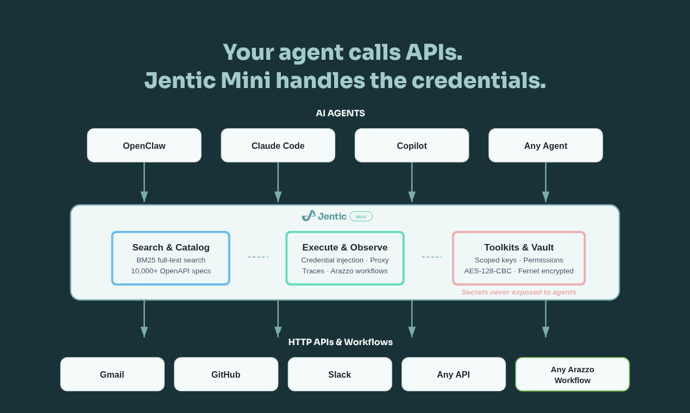
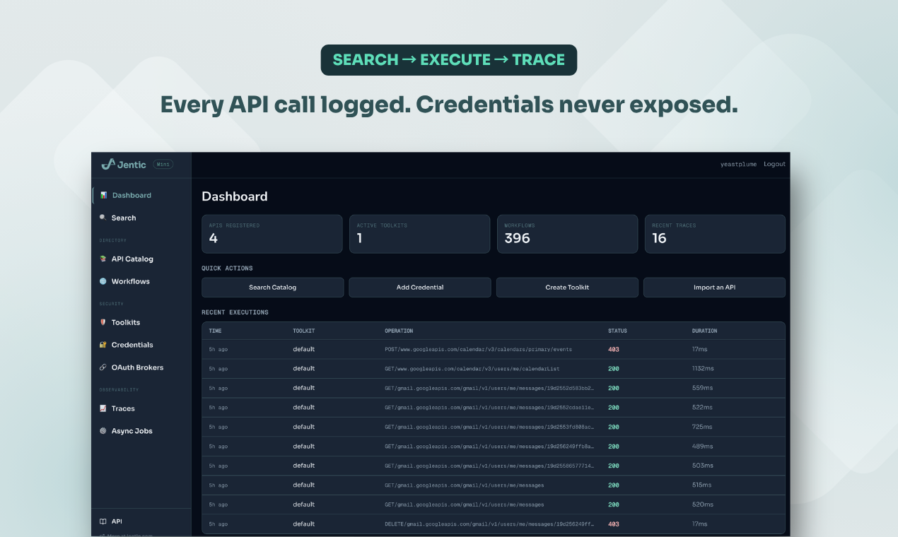
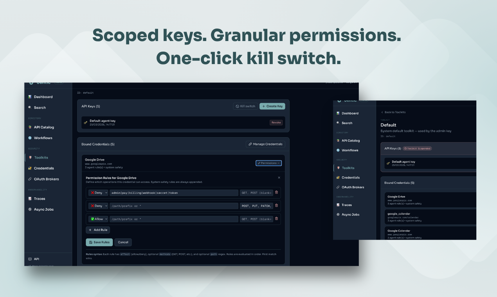

### 🎬 관련 영상
- [🎥 영상 보기](https://ph-files.imgix.net/d89cf58c-2c5d-4910-9f9b-8a347ab1a958.jpeg?auto=format)

---

## 5. [Venn.ai](https://www.producthunt.com/products/venn-ai-2)
**Votes**: 0 | **도입 난이도**: 중 | **신뢰도**: 중
**Tagline**: Delegate real work to AI agents with safety guardrails
**서비스 링크**: https://www.producthunt.com/r/BY5AUEZIBNS6D6

**태그**: DevTool, Automation, AI, Workflow, Agent, AI Tool, Chat

### 📌 이 서비스 한눈에 보기
Venn.ai는 Claude, ChatGPT 등의 AI 에이전트를 앱에 연결하고 안전 장치를 설정하여 코딩 없이 AI 작업을 위임하고 제어할 수 있게 해줍니다.

### 🔑 주요 기능
- 다양한 AI 에이전트 연결 및 통합 (Claude, Cursor, ChatGPT, VS Code)
- 작업 수준별 제어 및 가시성 확보 (Draft but don't send, Update but don't delete)
- 코딩 없이 안전 장치 설정 및 AI 작업 위임

### 🙋 사용자에게 어떤 점이 좋은가
AI 에이전트의 작업 범위를 세밀하게 제어하여 자동화된 워크플로우를 안전하게 구축하고 관리할 수 있습니다. 코딩 없이도 AI를 활용하여 생산성을 높일 수 있습니다.

### ✅ 지금 바로 써볼 기능
- Claude 또는 ChatGPT 에이전트를 연결하여 초안 작성 자동화
- 업데이트 작업에 대한 제어 규칙 설정
- 작업 로그 및 활동 추적 기능 활용

### ⚠️ 사용 전 확인할 점
- AI 에이전트의 성능은 연결된 앱 및 데이터에 따라 달라질 수 있습니다.
- 안전 장치 설정 시 의도치 않은 작업 제한이 발생할 수 있습니다.

### 🧭 확인이 더 필요한 정보
지원되는 AI 에이전트 및 앱 목록, 그리고 안전 장치 설정의 구체적인 예시를 확인하는 것이 좋습니다.

### 📸 스크린샷 및 갤러리
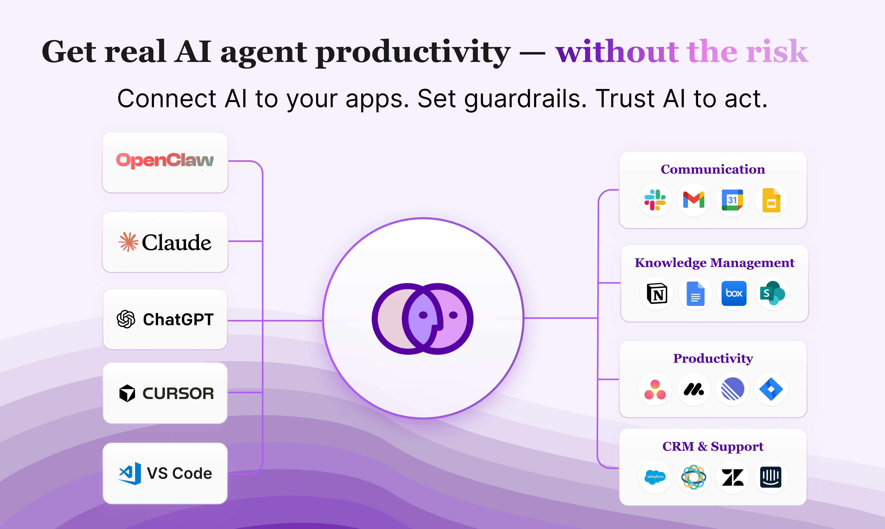
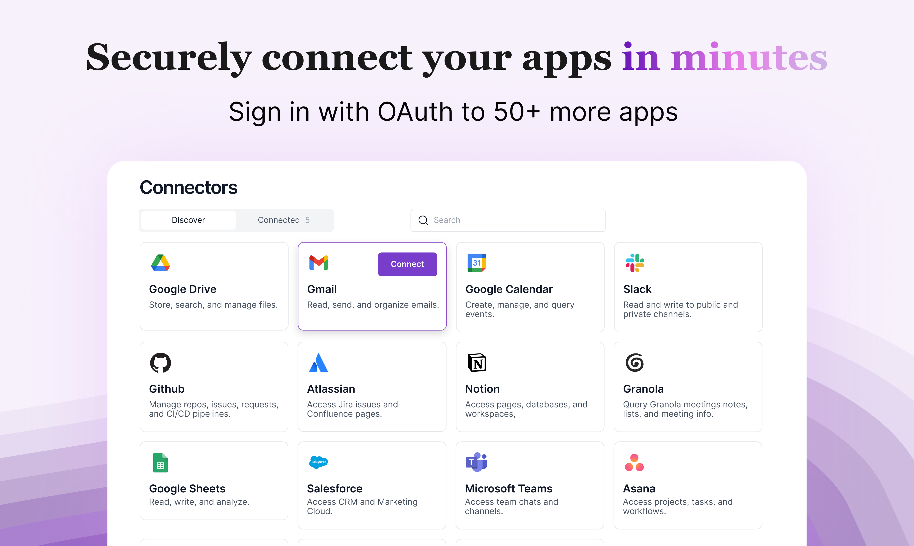
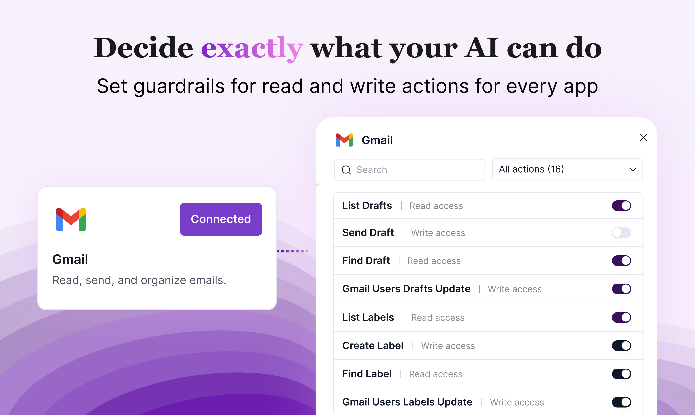

### 🎬 관련 영상
- [🎥 영상 보기](https://ph-files.imgix.net/3167c69e-2d57-4916-9275-809238e6e3d9.jpeg?auto=format)

---

## 6. [PIO](https://www.producthunt.com/products/pio)
**Votes**: 0 | **도입 난이도**: 중 | **신뢰도**: 중
**Tagline**: Agnatically hire, onboard, & pay talent in 150+ countries
**서비스 링크**: https://www.producthunt.com/r/QULPRGT7FXPHQS

**태그**: HR, Payroll, Global, Compliance, Agent

### 📌 이 서비스 한눈에 보기
PIO는 법인 설립 없이 150개국 이상에서 인재를 채용, 온보딩, 급여 지급할 수 있도록 지원하는 올인원 솔루션입니다.

### 🔑 주요 기능
- 해외 법인 설립 없이 글로벌 인재 채용 및 관리
- 급여, 법률 준수 자동화
- PIO Agent를 통해 간편하게 급여 관련 정보 확인 및 실행

### 🙋 사용자에게 어떤 점이 좋은가
해외 진출 시 복잡한 법인 설립 절차 없이 인재를 빠르게 확보하고 관리할 수 있어 시간과 비용을 절약할 수 있습니다. PIO Agent를 통해 급여 관련 문의에 즉각적으로 대응할 수 있습니다.

### ✅ 지금 바로 써볼 기능
- PIO Agent를 통해 해외 채용 예상 비용 문의
- 해외 계약직 급여 지급 기능 사용
- 각 국가별 법률 준수 사항 확인

### ⚠️ 사용 전 확인할 점
- 지원하는 국가 목록 및 관련 법규 확인 필요
- PIO Agent의 정보 정확도 검증 필요

### 🧭 확인이 더 필요한 정보
PIO가 제공하는 법률 준수 정보의 최신성 및 정확성에 대한 추가 확인이 필요합니다.

### 📸 스크린샷 및 갤러리
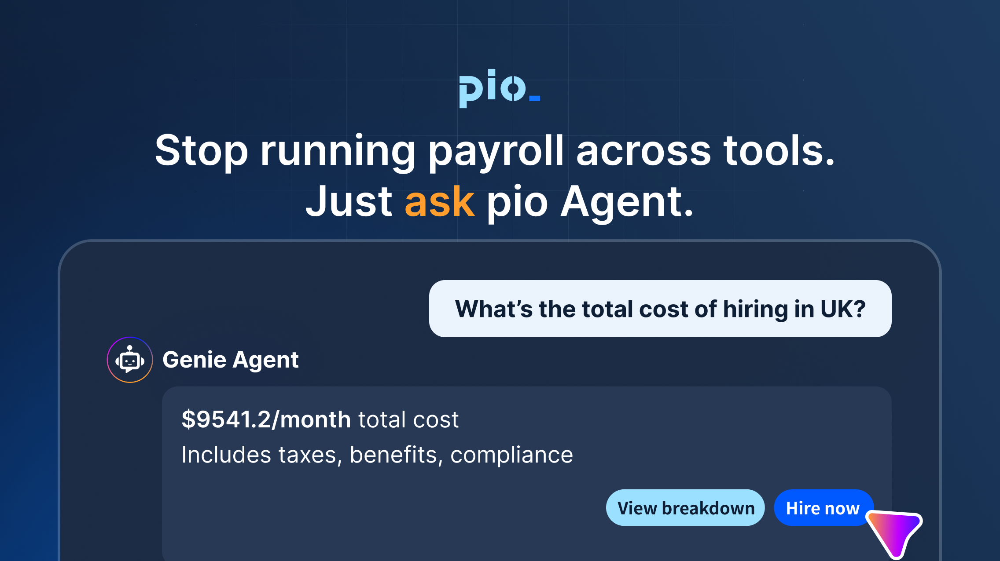
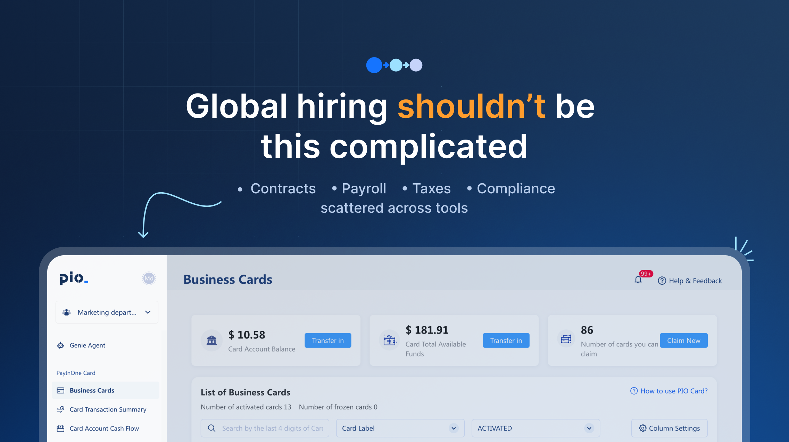
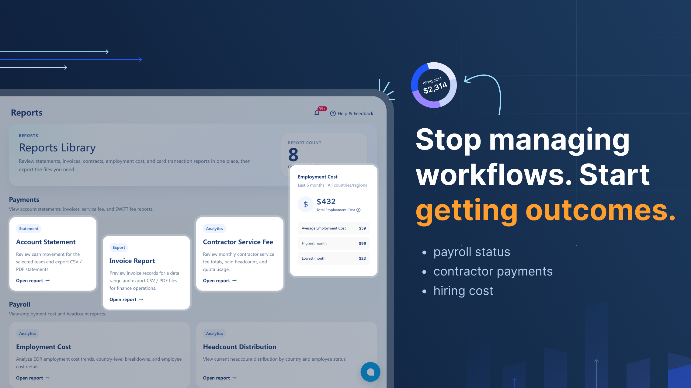

### 🎬 관련 영상
- [🎥 영상 보기](https://ph-files.imgix.net/98a76647-f02b-4f65-b0e0-5d22f3666557.jpeg?auto=format)

---

## 7. [Linear Agent](https://www.producthunt.com/products/linear-agent)
**Votes**: 0 | **도입 난이도**: 중 | **신뢰도**: 중
**Tagline**: Synthesize context, makes recommendations, and takes action.
**서비스 링크**: https://www.producthunt.com/r/TZSSDUOI2JUR4C

**태그**: DevTool, AI, Workflow, Automation, Agent

### 📌 이 서비스 한눈에 보기
Linear에 내장된 AI 에이전트가 로드맵, 이슈, 코드를 이해하고 추천 및 액션을 수행하여 개발 생산성을 향상시킵니다.

### 🔑 주요 기능
- Linear에 직접 통합되어 어디서든 사용 가능
- 로드맵, 이슈, 코드에 대한 깊은 이해
- 질문 응답, 명령 실행 등 다양한 기능 제공

### 🙋 사용자에게 어떤 점이 좋은가
Linear 사용자라면 별도 설정 없이 바로 AI 기반의 자동화된 워크플로우를 경험하고, 개발 관련 의사 결정을 더 빠르고 정확하게 내릴 수 있습니다.

### ✅ 지금 바로 써볼 기능
- Linear 워크스페이스에 Linear Agent 추가
- 로드맵 관련 질문으로 기능 테스트
- 코드 관련 질문으로 기능 테스트

### ⚠️ 사용 전 확인할 점
- Linear에 종속적인 서비스
- AI 답변의 정확도에 대한 검증 필요

### 🧭 확인이 더 필요한 정보
Linear Agent의 성능 및 기능이 Linear의 다른 기능과 어떻게 연동되는지 추가 확인이 필요합니다.

### 📸 스크린샷 및 갤러리
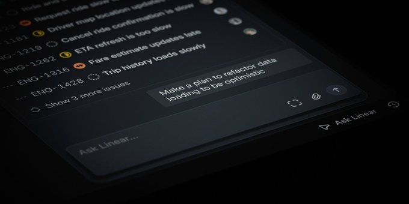
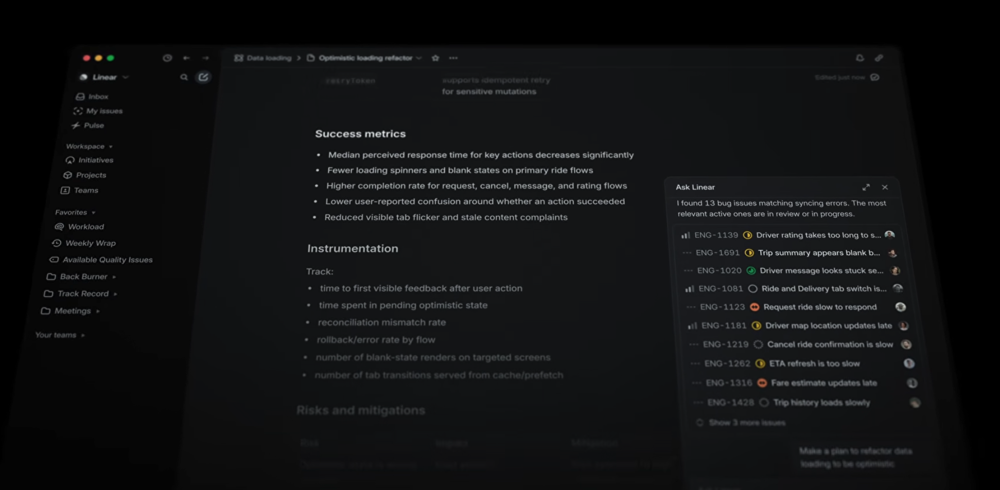
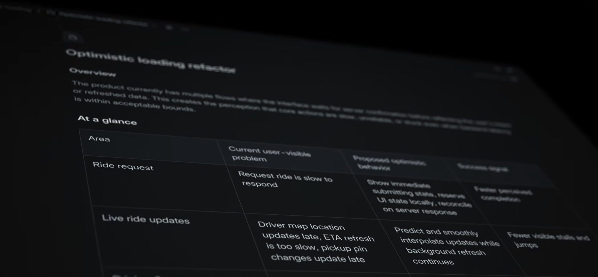

### 🎬 관련 영상
- [🎥 영상 보기](https://ph-files.imgix.net/a8be6cd2-194a-420e-816f-0c063325faf6.jpeg?auto=format)

---

## 8. [Spotify SongDNA](https://www.producthunt.com/products/spotify)
**Votes**: 0 | **도입 난이도**: 하 | **신뢰도**: 상
**Tagline**: The interactive creative network behind your favorite music
**서비스 링크**: https://www.producthunt.com/r/UH7UQZBZC7DR6A

**태그**: 음악, 탐색, 정보, 네트워크, Spotify

### 📌 이 서비스 한눈에 보기
Spotify SongDNA는 좋아하는 음악의 창작 과정을 시각적으로 보여주는 인터랙티브 기능으로, 곡에 참여한 작가, 프로듀서, 샘플 등의 정보를 쉽게 탐색할 수 있게 해줍니다.

### 🔑 주요 기능
- 좋아하는 곡의 창작자 네트워크를 시각적으로 보여줍니다.
- Now Playing 화면에서 바로 접근 가능합니다.
- 곡의 탄생 배경과 관련된 다양한 정보를 제공합니다.

### 🙋 사용자에게 어떤 점이 좋은가
좋아하는 음악이 어떻게 만들어졌는지 더 깊이 이해하고, 새로운 아티스트나 음악을 발견하는 데 도움을 줍니다.

### ✅ 지금 바로 써볼 기능
- Spotify에서 좋아하는 곡을 재생하고 Now Playing 화면을 확인해보세요.
- SongDNA를 통해 곡에 참여한 다른 아티스트들을 탐색해보세요.
- 새롭게 발견한 아티스트의 다른 곡들도 들어보세요.

### ⚠️ 사용 전 확인할 점
- 모든 곡에 SongDNA 정보가 제공되는 것은 아닙니다.
- 정보의 정확성은 Spotify의 데이터에 의존합니다.

### 🧭 확인이 더 필요한 정보
SongDNA 정보 제공 범위가 모든 곡으로 확대될지 여부는 불확실합니다.

### 📸 스크린샷 및 갤러리
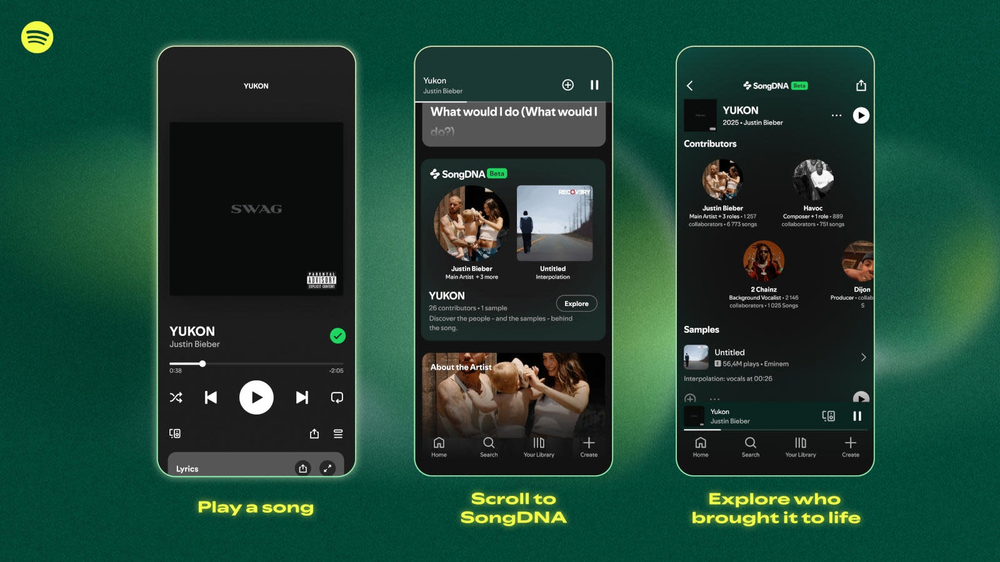

### 🎬 관련 영상
- [🎥 영상 보기](https://ph-files.imgix.net/f76c15dc-f521-4f41-ad64-294ffec22618.jpeg?auto=format)

---

## 9. [PinchBench](https://www.producthunt.com/products/kiloclaw)
**Votes**: 0 | **도입 난이도**: 중 | **신뢰도**: 중
**Tagline**: Find the best AI model for your OpenClaw
**서비스 링크**: https://www.producthunt.com/r/5LYZJA7TJEATYL

**태그**: DevTool, LLM, 벤치마킹, OpenClaw, AI, Agent, AI Tool

### 📌 이 서비스 한눈에 보기
PinchBench는 OpenClaw 코딩 에이전트로서 LLM 모델의 성능을 벤치마킹하여 개발자가 적합한 모델을 선택하도록 돕는 시스템입니다.

### 🔑 주요 기능
- 다양한 LLM 모델을 실제 작업으로 평가
- 성공률, 속도, 비용 측정
- Kilo Code에서 제작

### 🙋 사용자에게 어떤 점이 좋은가
OpenClaw 코딩 에이전트 개발 시 어떤 LLM 모델이 가장 적합한지 객관적인 데이터를 기반으로 선택할 수 있도록 도와줍니다.

### ✅ 지금 바로 써볼 기능
- OpenClaw 연동 테스트
- 다양한 LLM 모델 성능 비교
- 비용 효율적인 모델 탐색

### ⚠️ 사용 전 확인할 점
- OpenClaw에 특화된 벤치마크
- 제공되는 LLM 모델 목록 확인

### 🧭 확인이 더 필요한 정보
제공되는 LLM 모델의 종류와 벤치마크 데이터의 업데이트 주기를 확인해야 합니다.

### 📸 스크린샷 및 갤러리
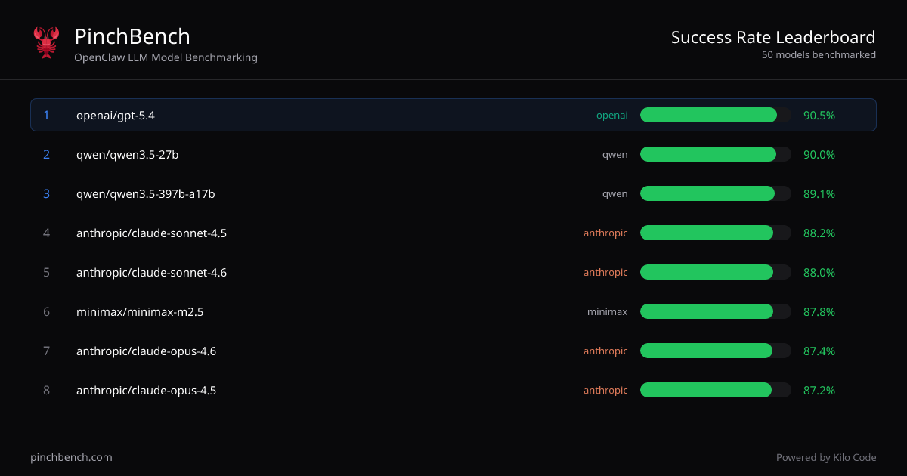
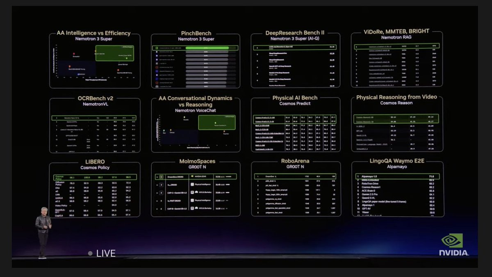

---

## 10. [Lyria 3 Pro by Google Deepmind](https://www.producthunt.com/products/google-3)
**Votes**: 0 | **도입 난이도**: 중 | **신뢰도**: 중
**Tagline**: Create longer AI music tracks with structure & control 
**서비스 링크**: https://www.producthunt.com/r/V2BZXJPWWSJTAW

**태그**: AI 음악, 음악 생성, 저작권 보호, Gemini, Deepmind, AI Tool

### 📌 이 서비스 한눈에 보기
Gemini 앱에서 최대 3분 길이의 구조화된 AI 음악 트랙을 만들고, SynthID 워터마크로 책임감 있는 사용을 지원합니다.

### 🔑 주요 기능
- 최대 3분 길이의 AI 음악 생성
- Verse, Chorus, Bridge 등 구조적 요소 제어
- SynthID 워터마크를 통한 저작권 보호

### 🙋 사용자에게 어떤 점이 좋은가
집중력을 높이는 음악, 맞춤형 사운드트랙, 징글 등 다양한 창작물을 만들 수 있으며, AI가 생성한 음악의 저작권 문제를 SynthID 워터마크로 해결합니다.

### ✅ 지금 바로 써볼 기능
- Gemini 앱에서 Lyria 3 Pro를 실행하여 음악 생성 시작
- Verse, Chorus 등 구조적 요소를 활용하여 트랙 구성
- SynthID 워터마크 기능 확인

### ⚠️ 사용 전 확인할 점
- 생성된 음악의 품질은 프롬프트에 따라 달라질 수 있음
- SynthID 워터마크의 완벽한 저작권 보호 기능은 보장되지 않음

### 🧭 확인이 더 필요한 정보
Lyria 3 Pro의 음악 생성 품질 및 SynthID 워터마크의 효과에 대한 사용자 피드백을 추가적으로 확인해야 합니다.

### 📸 스크린샷 및 갤러리
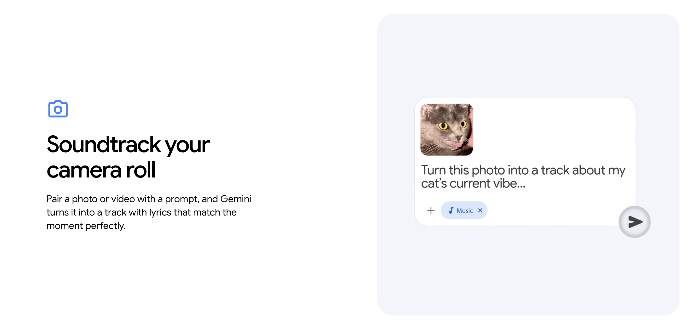
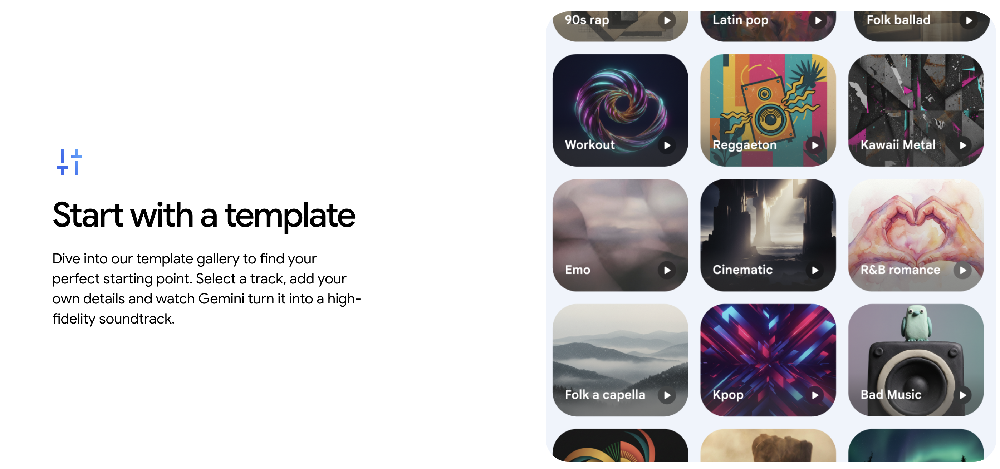
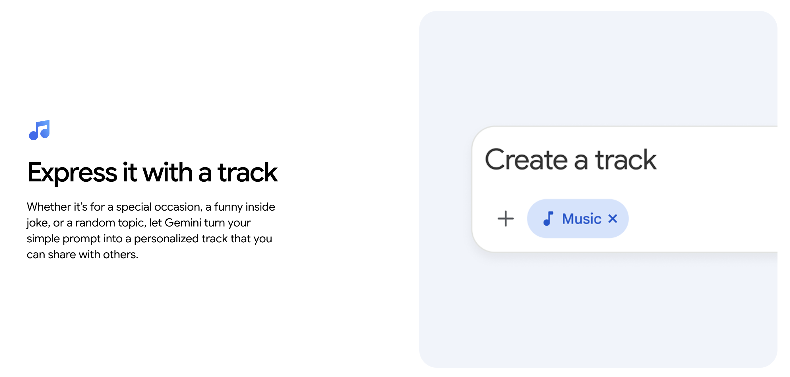

### 🎬 관련 영상
- [🎥 영상 보기](https://ph-files.imgix.net/3ee06ecb-27b2-426b-9a92-eed176aa5a29.jpeg?auto=format)

---

