# 🚀 Product Hunt Daily Top 10 (2026-03-28)

## 1. [Agentation](https://www.producthunt.com/products/agentation)
**Votes**: 311 | **도입 난이도**: 중 | **신뢰도**: 중
**Tagline**: The visual feedback tool for AI agents
**서비스 링크**: https://www.producthunt.com/r/UBMKYT2Z76KGDI

**태그**: DevTool, AI, Automation, Annotation, Agent, AI Tool

### 📌 이 서비스 한눈에 보기
Agentation은 UI 어노테이션을 AI 에이전트가 이해하고 실행할 수 있는 구조화된 컨텍스트로 변환하여 AI 코딩 도구의 활용도를 높여줍니다.

### 🔑 주요 기능
- UI 어노테이션을 구조화된 데이터로 변환
- Claude Code, Codex 등 다양한 AI 도구와 호환
- AI 코딩 에이전트의 이해도 및 실행력 향상

### 🙋 사용자에게 어떤 점이 좋은가
UI 요소에 메모를 추가하고, AI 코딩 도구에 붙여넣어 AI가 UI를 더 잘 이해하고 작동하도록 만들 수 있습니다. AI 코딩 효율성을 높이는 데 도움이 됩니다.

### ✅ 지금 바로 써볼 기능
- UI 요소 클릭 후 메모 추가
- 생성된 구조화된 컨텍스트를 AI 코딩 도구에 붙여넣기
- AI 에이전트의 반응 확인 및 개선

### ⚠️ 사용 전 확인할 점
- AI 에이전트의 성능은 Agentation으로 제공되는 컨텍스트의 품질에 따라 달라질 수 있음
- 지원되는 AI 코딩 도구 목록 확인 필요

### 🧭 확인이 더 필요한 정보
실제 다양한 AI 코딩 에이전트 환경에서의 호환성 및 성능 테스트 결과가 필요합니다.

### 📸 스크린샷 및 갤러리
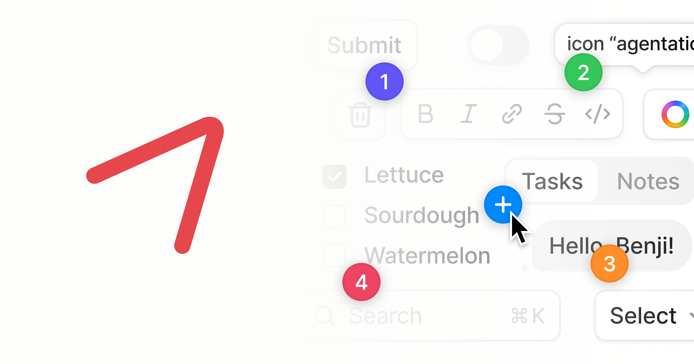
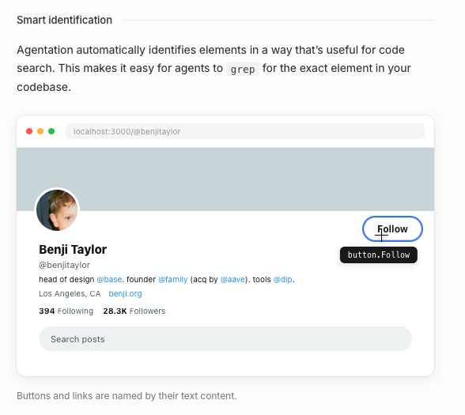
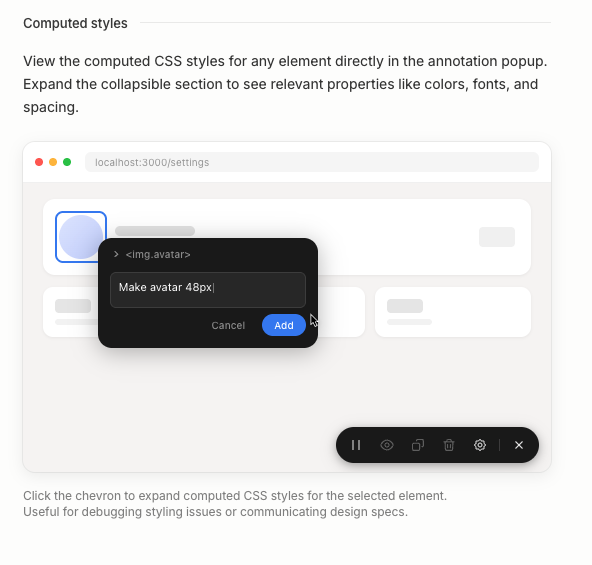

---

## 2. [Claude Code auto-fix ](https://www.producthunt.com/products/claude-code-auto-fix-in-the-cloud)
**Votes**: 268 | **도입 난이도**: 중 | **신뢰도**: 중
**Tagline**: Auto-fix PRs in the cloud while you stay hands-off
**서비스 링크**: https://www.producthunt.com/r/ZD7UARQER7Q65Z

**태그**: DevTool, Automation, CI/CD, Code Review, AI Tool

### 📌 이 서비스 한눈에 보기
Claude Code auto-fix는 클라우드에서 PR을 자동으로 수정하여 CI 실패 및 리뷰 코멘트를 해결, 개발자가 직접 관여하지 않아도 PR을 병합 가능한 상태로 만들어줍니다.

### 🔑 주요 기능
- 클라우드 기반으로 PR을 자동 모니터링 및 수정
- CI 실패 및 리뷰 코멘트 자동 해결
- 필요시 사용자에게 질문하고 수정 사항 푸시

### 🙋 사용자에게 어떤 점이 좋은가
개발자는 PR 수정에 시간을 쏟지 않고 다른 작업에 집중할 수 있으며, PR이 항상 병합 가능한 상태로 유지됩니다.

### ✅ 지금 바로 써볼 기능
- 기존 CI/CD 파이프라인에 통합
- 자동 수정 규칙 설정
- PR 모니터링 및 자동 수정 결과 확인

### ⚠️ 사용 전 확인할 점
- 자동 수정 규칙 설정 시 오탐 또는 잘못된 수정 가능성 확인
- 코드 변경 사항에 대한 충분한 테스트 필요

### 🧭 확인이 더 필요한 정보
지원하는 CI/CD 플랫폼 및 언어 확인이 필요합니다.

### 📸 스크린샷 및 갤러리
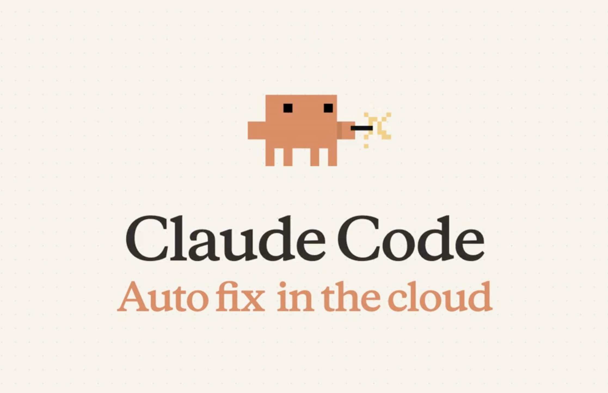
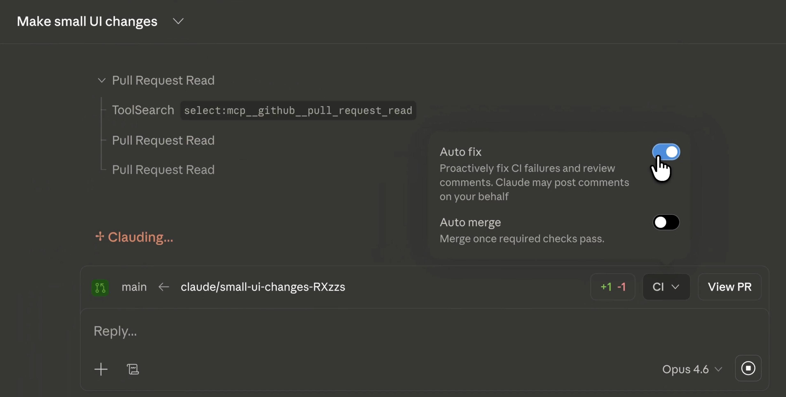
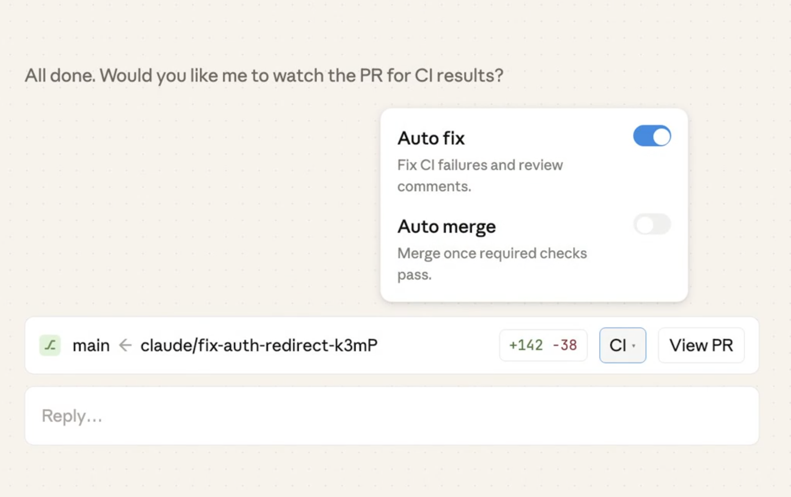

---

## 3. [Gemini 3.1 Flash Live](https://www.producthunt.com/products/gemini-6)
**Votes**: 257 | **도입 난이도**: 중 | **신뢰도**: 중
**Tagline**: Making audio AI more natural and reliable
**서비스 링크**: https://www.producthunt.com/r/5EGR7NSXB6V7QK

**태그**: AI, 오디오, 실시간, 대화형 AI, AI Tool

### 📌 이 서비스 한눈에 보기
Gemini 3.1 Flash Live는 Google의 최첨단 오디오 모델로, 실시간 대화에 최적화되어 복잡한 추론과 기능 호출에 뛰어납니다.

### 🔑 주요 기능
- 낮은 지연 시간으로 실시간 대화에 적합
- 복잡한 추론 및 기능 호출 능력
- Gemini Live 및 Google Search Live에 사용되는 동일 엔진

### 🙋 사용자에게 어떤 점이 좋은가
실시간 오디오 기반 상호작용이 필요한 서비스나 애플리케이션에서 더욱 자연스럽고 안정적인 사용자 경험을 제공할 수 있습니다.

### ✅ 지금 바로 써볼 기능
- Gemini Live 사용해보기
- Google Search Live 사용해보기
- 오디오 기반 기능 호출 테스트

### ⚠️ 사용 전 확인할 점
- 특정 사용 사례에 따른 성능 차이
- 데이터 보안 및 개인 정보 보호 고려

### 🧭 확인이 더 필요한 정보
Gemini 3.1 Flash Live의 구체적인 API 사용 방법 및 기술 사양에 대한 추가 정보가 필요합니다.

### 📸 스크린샷 및 갤러리

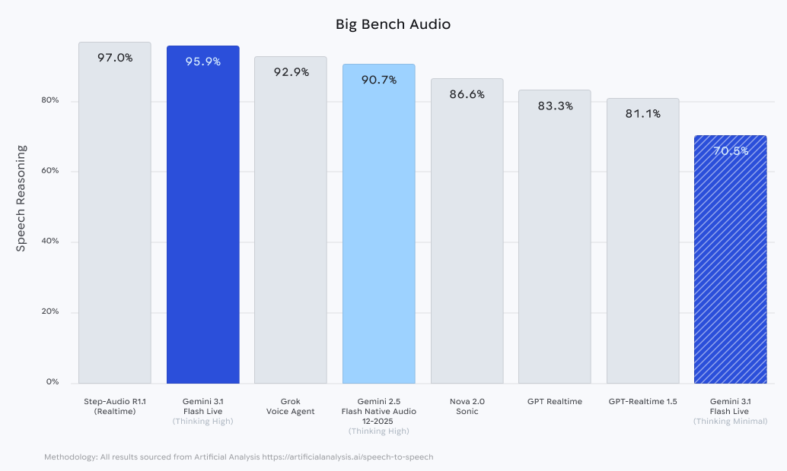

### 🎬 관련 영상
- [🎥 영상 보기](https://ph-files.imgix.net/206b69e9-c5cc-4f04-bcc9-eb5aaa28c200.jpeg?auto=format)

---

## 4. [InsideOrg](https://www.producthunt.com/products/insideorg)
**Votes**: 248 | **도입 난이도**: 하 | **신뢰도**: 중
**Tagline**: Free organization chart viewer for any company
**서비스 링크**: https://www.producthunt.com/r/SZCX7EGZ2ZDGUA

**태그**: 조직도, 데이터 분석, 정보 검색, B2B, AI Tool

### 📌 이 서비스 한눈에 보기
InsideOrg는 회사 도메인 입력만으로 무료로 의사 결정자, 보고 라인, 조직 구조를 즉시 보여주는 조직도 뷰어입니다.

### 🔑 주요 기능
- 어떤 회사의 조직도든 무료로 볼 수 있습니다.
- 회사 도메인 입력만으로 조직 구조를 즉시 파악합니다.
- 의사 결정자와 보고 라인을 쉽게 확인할 수 있습니다.

### 🙋 사용자에게 어떤 점이 좋은가
영업, 마케팅, 채용 등 다양한 목적을 위해 특정 회사의 조직 구조를 빠르게 파악해야 할 때 유용합니다. 조직도 정보를 얻기 위해 비용을 지불할 필요가 없습니다.

### ✅ 지금 바로 써볼 기능
- 관심 있는 회사 도메인을 입력하여 조직도를 확인해 보세요.
- 특정 임원이나 담당자를 검색하여 보고 라인을 파악해 보세요.
- 경쟁사나 협력사의 조직 구조를 분석해 보세요.

### ⚠️ 사용 전 확인할 점
- 공개적으로 공유되지 않은 조직 정보는 표시되지 않을 수 있습니다.
- 정보의 정확성은 회사의 업데이트 빈도에 따라 달라질 수 있습니다.

### 🧭 확인이 더 필요한 정보
데이터의 최신성 및 정확도에 대한 추가 검증이 필요합니다.

### 📸 스크린샷 및 갤러리
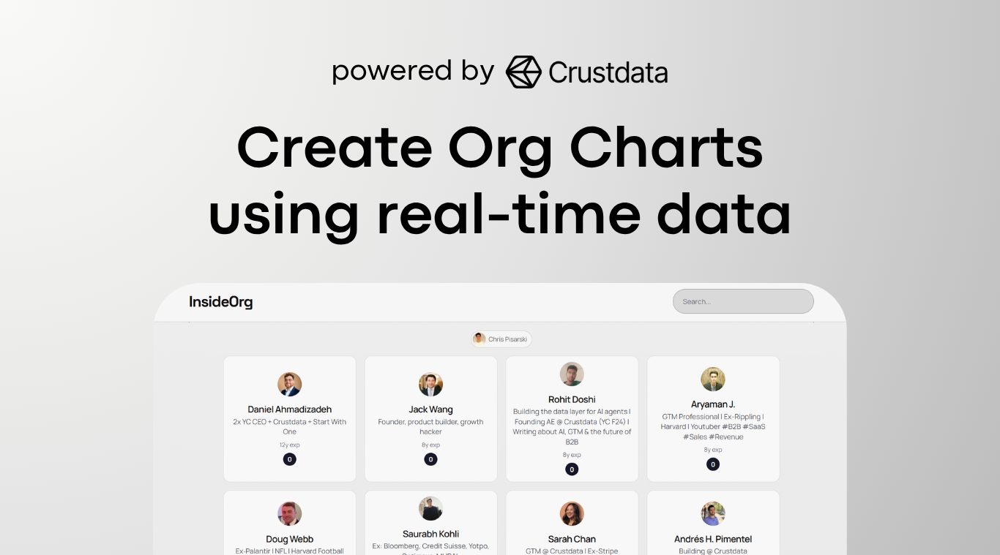
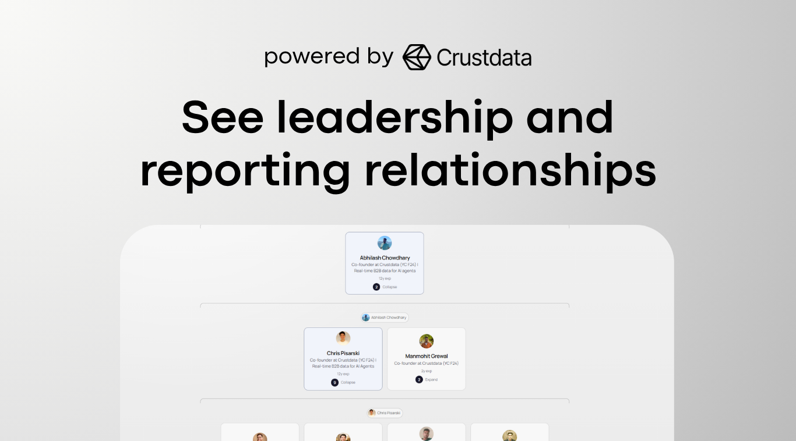
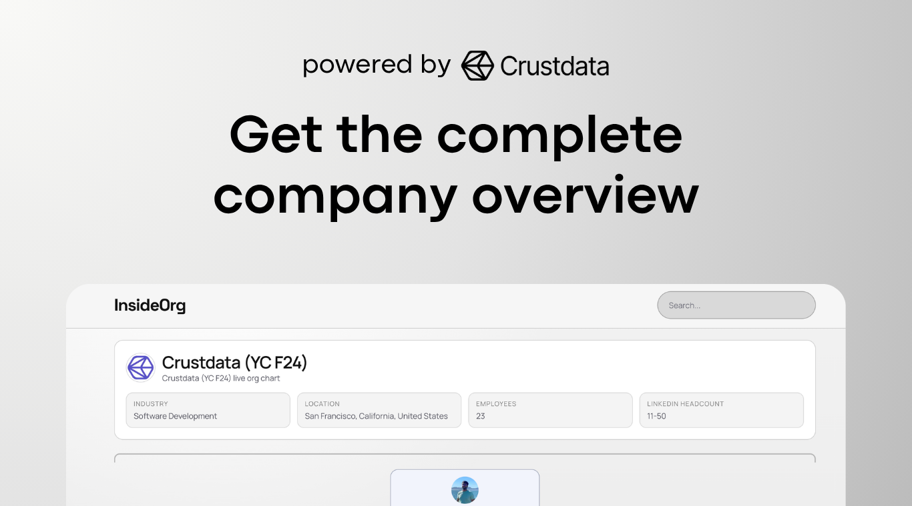

### 🎬 관련 영상
- [🎥 영상 보기](https://ph-files.imgix.net/0e1ca147-9640-49eb-89c5-1c0682ddfccf.jpeg?auto=format)

---

## 5. [Cockpit AI](https://www.producthunt.com/products/cockpit-ai)
**Votes**: 206 | **도입 난이도**: 중 | **신뢰도**: 중
**Tagline**: Run revenue agents across every channel
**서비스 링크**: https://www.producthunt.com/r/ZSATDD5TGHHICH

**태그**: AI, 영업 자동화, 생산성, CRM, Agent, AI Tool

### 📌 이 서비스 한눈에 보기
Cockpit AI는 AI 기반 영업 에이전트를 통해 잠재 고객 발굴, 개인화된 아웃리치, 채널 간 팔로우업, 미팅 예약 등 영업 활동 전반을 자동화하여 수익 증대를 돕습니다.

### 🔑 주요 기능
- AI 기반 영업 에이전트 배포
- 다양한 채널(이메일, 연락처, 문서, 캘린더) 통합
- 잠재 고객 리서치 및 개인화된 아웃리치 자동화

### 🙋 사용자에게 어떤 점이 좋은가
영업 담당자는 반복적인 업무에서 벗어나 고부가가치 활동에 집중하고, 더 많은 잠재 고객에게 효율적으로 접근하여 계약 성사율을 높일 수 있습니다.

### ✅ 지금 바로 써볼 기능
- AI 영업 에이전트 설정 및 배포
- 기존 CRM 및 영업 도구 연동
- 자동화된 아웃리치 캠페인 실행

### ⚠️ 사용 전 확인할 점
- AI의 개인화 수준 및 정확도 검토 필요
- 자동화된 커뮤니케이션의 적절성 및 윤리적 고려

### 🧭 확인이 더 필요한 정보
실제 사용 시 AI 에이전트의 성능 및 효과에 대한 사용자 피드백 확인이 필요합니다.

### 📸 스크린샷 및 갤러리
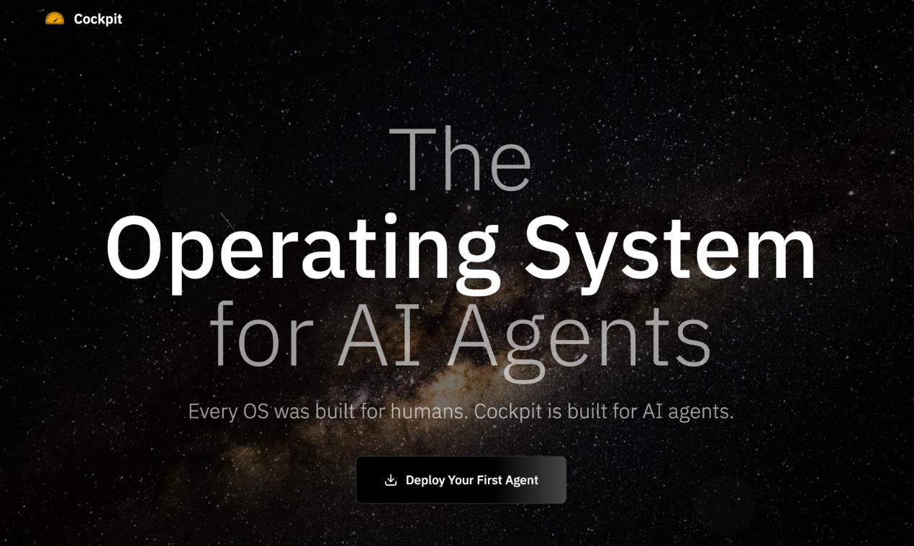
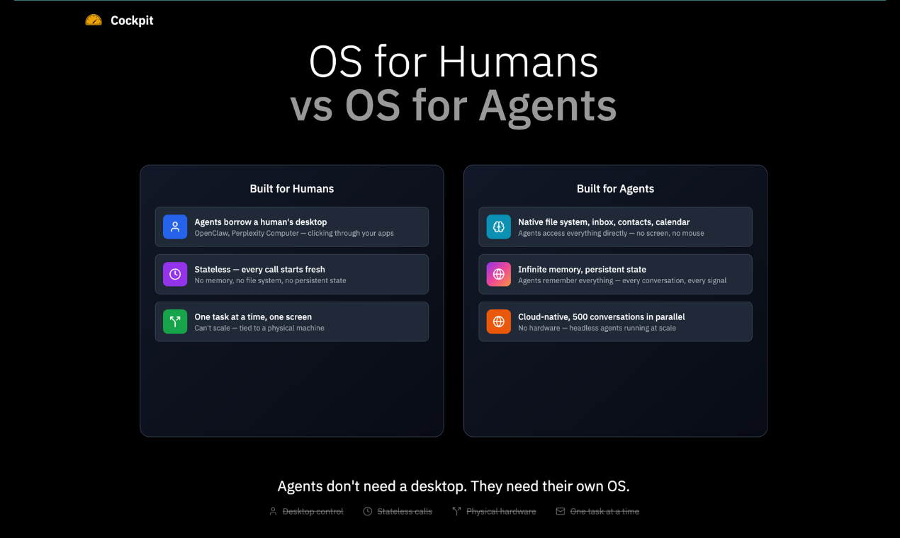
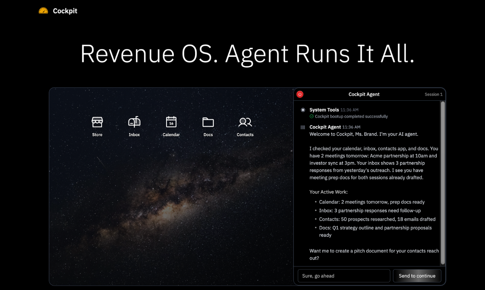

### 🎬 관련 영상
- [🎥 영상 보기](https://ph-files.imgix.net/834a2f15-e87e-4f23-9e7c-169ab5dc3f6b.jpeg?auto=format)

---

## 6. [Codex Plugins](https://www.producthunt.com/products/openai)
**Votes**: 173 | **도입 난이도**: 중 | **신뢰도**: 중
**Tagline**: Package Codex skills and app integrations as plugins
**서비스 링크**: https://www.producthunt.com/r/MXXCFXKHV6GFJT

**태그**: DevTool, Workflow, Integration, Automation

### 📌 이 서비스 한눈에 보기
Codex Plugins는 팀과 개발자가 재사용 가능한 플러그인 형태로 기술, 앱 통합, 워크플로우를 패키징하여 생산성을 높여줍니다.

### 🔑 주요 기능
- Slack, Figma, Notion, Google Drive와 같은 도구를 연결하여 워크플로우 간소화
- 내장된 기술, 인증 및 통합으로 일관된 워크플로우 구축, 공유 및 확장
- 계획, 연구, 코딩 및 사후 작업 워크플로우를 효율적으로 관리

### 🙋 사용자에게 어떤 점이 좋은가
팀 전체에서 일관된 워크플로우를 구축하고 확장하여 프로젝트 효율성을 높이고, 다양한 앱과의 연동을 통해 작업 과정을 간소화할 수 있습니다.

### ✅ 지금 바로 써볼 기능
- Slack 연동하여 팀 협업 자동화
- Figma 연동하여 디자인 워크플로우 개선
- Notion 연동하여 프로젝트 관리 효율화

### ⚠️ 사용 전 확인할 점
- 플러그인 간의 호환성 확인 필요
- 지원하는 앱 및 기능 범위 확인 필요

### 🧭 확인이 더 필요한 정보
Codex Plugins의 구체적인 가격 정책 및 지원 앱 목록에 대한 추가 정보 확인이 필요합니다.

### 📸 스크린샷 및 갤러리
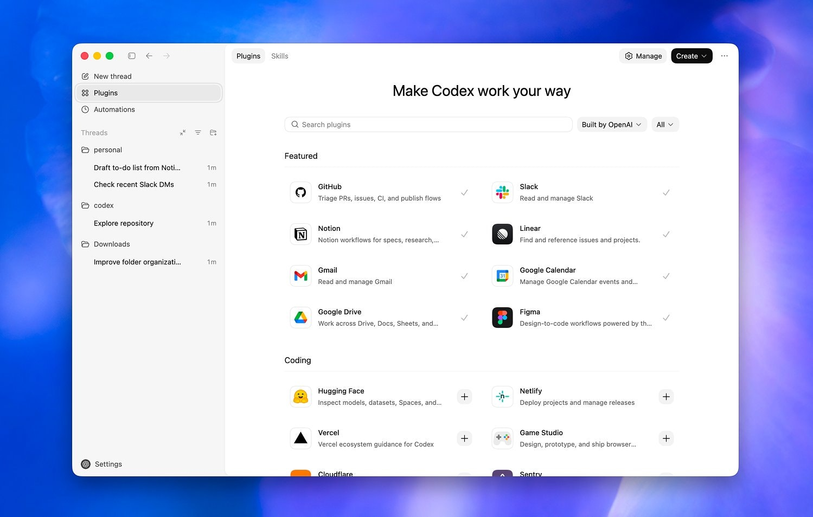
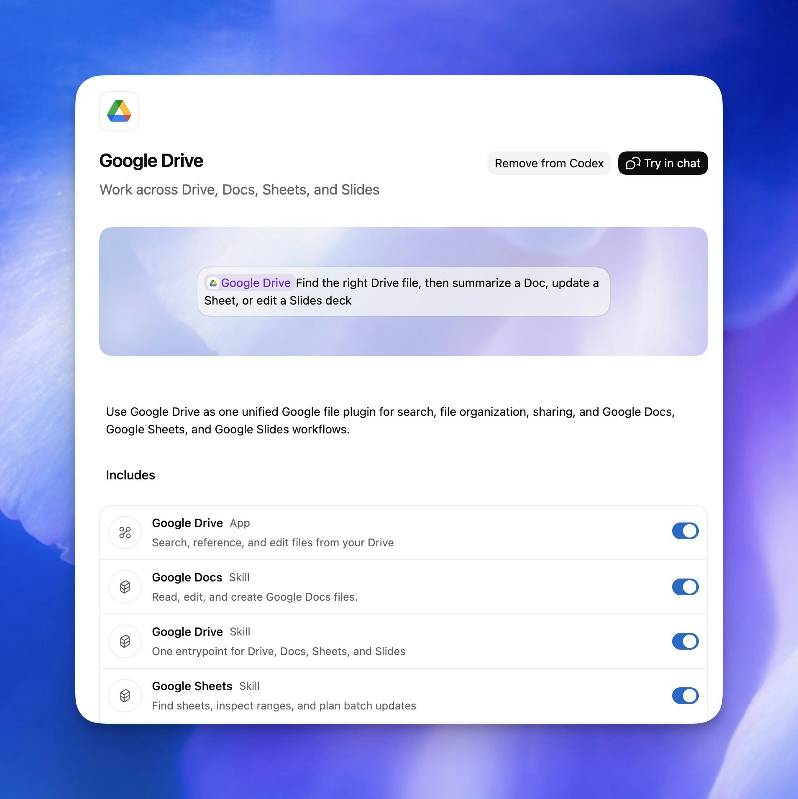

### 🎬 관련 영상
- [🎥 영상 보기](https://ph-files.imgix.net/c21b6dc3-6cd6-4cec-876a-36048e4f32b2.jpeg?auto=format)

---

## 7. [Suno v5.5](https://www.producthunt.com/products/suno)
**Votes**: 170 | **도입 난이도**: 중 | **신뢰도**: 중
**Tagline**: Create with your voice, tune models to your sound
**서비스 링크**: https://www.producthunt.com/r/S25VKIT6BZUNGW

**태그**: 음악 생성, AI, 개인화, 오디오, AI Tool

### 📌 이 서비스 한눈에 보기
Suno v5.5는 사용자의 목소리를 활용하여 개인화된 음악 모델을 만들고, 사용자의 취향에 맞는 음악을 생성할 수 있도록 돕는 최신 모델입니다.

### 🔑 주요 기능
- 자신의 목소리를 사용하여 음악 생성
- 자신의 음악 카탈로그를 기반으로 모델 훈련
- 개인 취향 학습을 통한 맞춤형 음악 추천

### 🙋 사용자에게 어떤 점이 좋은가
Suno v5.5를 통해 사용자는 더욱 개인화되고 독창적인 음악을 만들 수 있으며, 자신의 취향에 맞는 음악을 쉽게 찾을 수 있습니다.

### ✅ 지금 바로 써볼 기능
- 자신의 목소리로 새로운 노래 만들기
- 자신의 음악 카탈로그를 사용하여 모델 훈련하기
- My Taste 기능을 통해 개인 취향 설정하기

### ⚠️ 사용 전 확인할 점
- 개인 목소리 사용에 따른 저작권 문제 확인 필요
- 모델 훈련에 필요한 데이터 양에 따른 성능 차이 발생 가능성

### 🧭 확인이 더 필요한 정보
개인화 모델의 성능이 사용자의 데이터 품질 및 양에 따라 어떻게 달라지는지 추가 확인이 필요합니다.

### 📸 스크린샷 및 갤러리

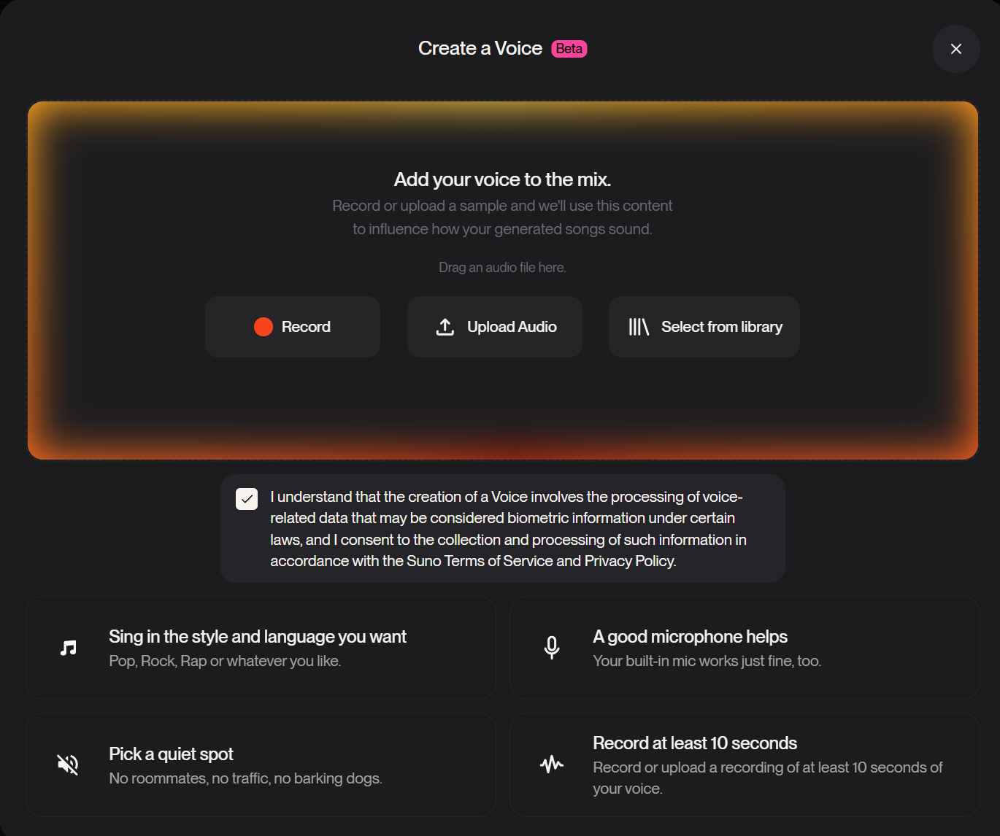

### 🎬 관련 영상
- [🎥 영상 보기](https://ph-files.imgix.net/4e8da565-109e-499f-819b-175853a79d27.jpeg?auto=format)
- [🎥 영상 보기](https://ph-files.imgix.net/0267c703-dc50-40cc-9dc1-8c5b136933d0.jpeg?auto=format)

---

## 8. [Stripe Projects](https://www.producthunt.com/products/stripe-projects)
**Votes**: 153 | **도입 난이도**: 중 | **신뢰도**: 중
**Tagline**: Production-ready dev stack from your terminal
**서비스 링크**: https://www.producthunt.com/r/CNUQWRUNOD3BAQ

**태그**: DevTool, CLI, 개발 자동화, 인프라, Stripe, Agent, AI Tool, Analytics

### 📌 이 서비스 한눈에 보기
Stripe Projects는 CLI를 통해 호스팅, 데이터베이스, 인증, AI, 관측 기능 등을 설정하여 개발자와 코딩 에이전트에게 안정적인 개발 환경을 제공합니다.

### 🔑 주요 기능
- CLI를 통해 다양한 개발 스택 설정 가능
- 실제 서비스 프로비저닝 및 관리 용이
- 사용량 추적 및 관리 기능 제공

### 🙋 사용자에게 어떤 점이 좋은가
개발자는 Stripe Projects를 통해 인프라 설정에 드는 시간을 줄이고 핵심 개발에 집중할 수 있습니다. 코딩 에이전트에게도 안정적인 개발 환경을 제공하여 생산성을 향상시킵니다.

### ✅ 지금 바로 써볼 기능
- CLI를 통해 간단한 프로젝트 설정해보기
- 제공되는 다양한 스택 옵션 살펴보기
- 사용량 추적 기능 활용하여 비용 관리하기

### ⚠️ 사용 전 확인할 점
- Stripe 결제 시스템과의 연동 필요
- CLI 환경에 익숙하지 않은 사용자는 학습 필요

### 🧭 확인이 더 필요한 정보
Stripe Projects의 구체적인 요금 정책 및 지원하는 서비스 목록에 대한 추가 확인이 필요합니다.

### 📸 스크린샷 및 갤러리
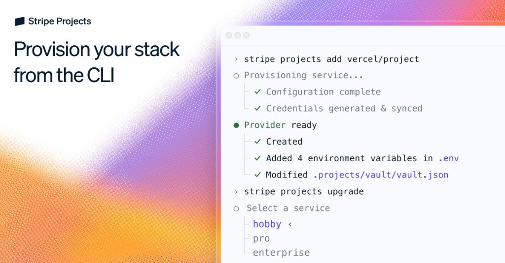
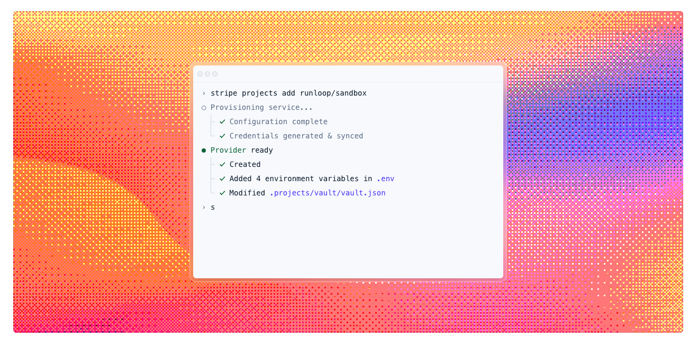
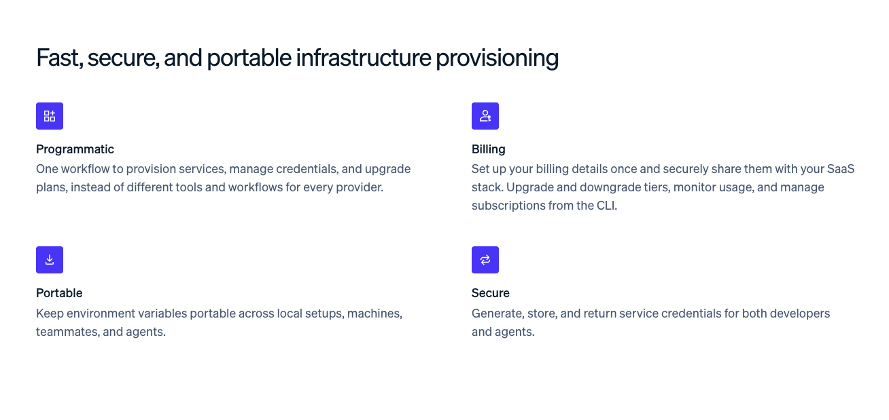

---

## 9. [Audos Publishing House](https://www.producthunt.com/products/socap)
**Votes**: 150 | **도입 난이도**: 중 | **신뢰도**: 중
**Tagline**: Build an AI business, get up to $100K. No equity taken
**서비스 링크**: https://www.producthunt.com/r/PJFD3R55EDQXRH

**태그**: AI, 창업, 투자, 비즈니스, AI Tool

### 📌 이 서비스 한눈에 보기
Audos Publishing House는 BarkBox 및 Ro 팀에서 만든 AI 기반 비즈니스 구축 지원 플랫폼으로, 최대 10만 달러의 자금을 무상으로 지원합니다.

### 🔑 주요 기능
- AI 기반 비즈니스 구축을 위한 도구 및 멘토링 제공
- 최대 10만 달러의 무상 자금 지원 (지분 없음)
- No Cap의 AI 투자 전문성 활용

### 🙋 사용자에게 어떤 점이 좋은가
AI 비즈니스를 시작하고 성장시키려는 기업가에게 필요한 자금과 지침을 제공하여 성공 가능성을 높여줍니다.

### ✅ 지금 바로 써볼 기능
- Audos Publishing House 웹사이트 방문하여 프로그램 정보 확인
- AI 비즈니스 아이디어 구체화
- 자금 지원 신청 절차 확인

### ⚠️ 사용 전 확인할 점
- 자금 지원 경쟁률 확인 필요
- AI 비즈니스 모델의 시장 적합성 검증 필요

### 🧭 확인이 더 필요한 정보
자금 지원 조건 및 상세 프로그램 내용을 추가적으로 확인해야 합니다.

### 📸 스크린샷 및 갤러리
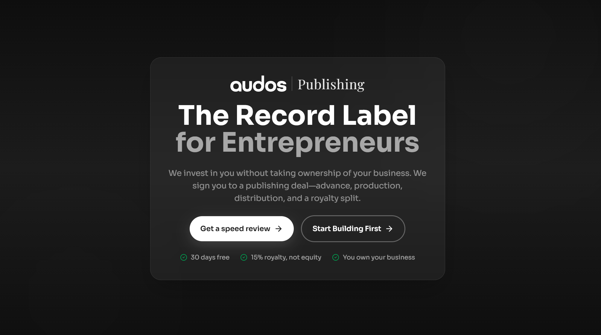
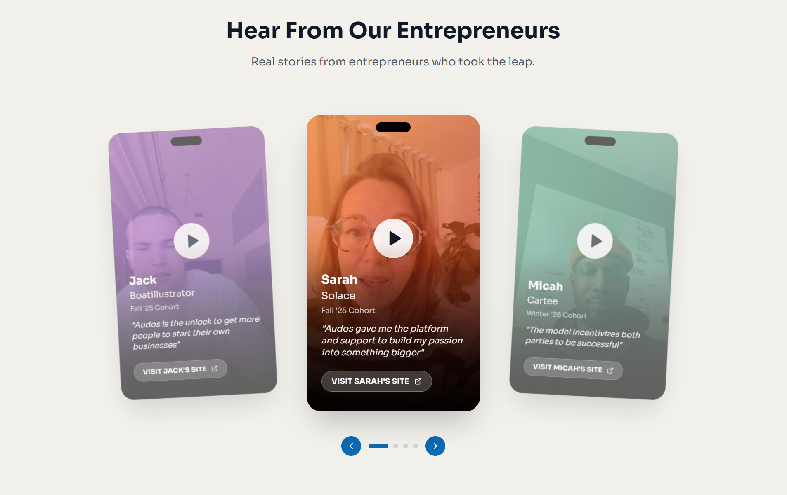

---

## 10. [Voxtral TTS by Mistral AI](https://www.producthunt.com/products/mistral-7b)
**Votes**: 146 | **도입 난이도**: 중 | **신뢰도**: 중
**Tagline**: Multilingual TTS model with realistic and expressive speech
**서비스 링크**: https://www.producthunt.com/r/627BPOH5ZBLWMR

**태그**: TTS, 음성 합성, AI, 다국어 지원, Agent, Automation, AI Tool

### 📌 이 서비스 한눈에 보기
Mistral AI에서 개발한 Voxtral TTS는 현실적이고 감정 표현이 풍부한 음성을 제공하는 최첨단 다국어 텍스트 음성 변환 모델입니다.

### 🔑 주요 기능
- 낮은 지연 시간으로 빠른 응답 속도
- 음성 복제 기능으로 사용자 정의 음성 생성 가능
- 9개 언어 지원으로 글로벌 서비스에 적합

### 🙋 사용자에게 어떤 점이 좋은가
확장 가능한 음성 에이전트 및 엔터프라이즈 워크플로우에 이상적이며, 다양한 언어 지원으로 글로벌 사용자에게 맞춤형 음성 경험을 제공할 수 있습니다.

### ✅ 지금 바로 써볼 기능
- 다양한 감정 표현으로 텍스트 변환 시도
- 음성 복제 기능을 활용하여 자신만의 음성 생성
- 지원되는 9개 언어로 테스트

### ⚠️ 사용 전 확인할 점
- 음성 복제 시 개인 정보 보호 및 저작권 문제 확인 필요
- 지원 언어 외 다른 언어에 대한 지원 여부 확인 필요

### 🧭 확인이 더 필요한 정보
실제 사용 환경에서의 지연 시간 및 음성 품질에 대한 사용자 피드백 데이터가 더 필요합니다.

### 📸 스크린샷 및 갤러리

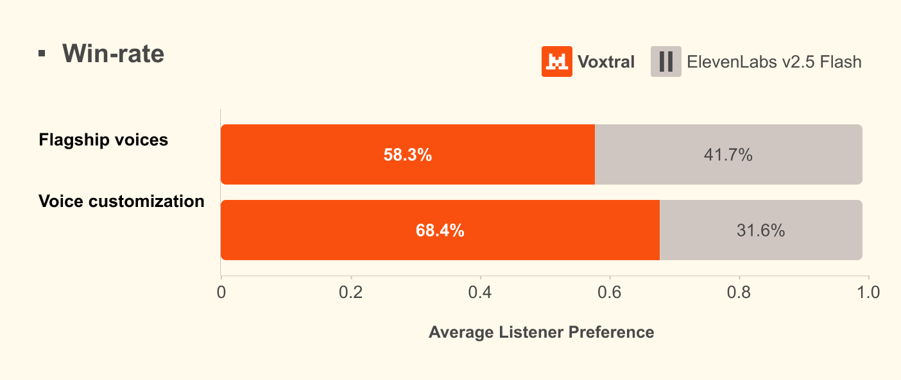
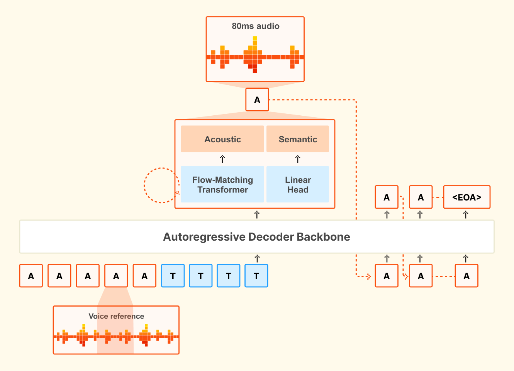

### 🎬 관련 영상
- [🎥 영상 보기](https://ph-files.imgix.net/8b258967-ae75-4699-b75d-2733c5eb257c.jpeg?auto=format)

---

