# 🚀 Product Hunt Daily Top 10 (2026-03-29)

## 1. [SlapMac](https://www.producthunt.com/products/slapmac)
**Votes**: 280 | **도입 난이도**: 하 | **신뢰도**: 상
**Tagline**: Slap your MacBook. It screams back. That's it.
**서비스 링크**: https://www.producthunt.com/r/SUJSASEPYC5QFK

**태그**: 재미, 유틸리티

### 📌 이 서비스 한눈에 보기
맥북을 때리면 소리를 지르는 앱. 재미를 위한 단순한 제품입니다.

### 🔑 주요 기능
- 맥북을 때리면 소리를 냅니다.
- 단순한 재미를 제공합니다.
- 더 이상의 기능은 없습니다.

### 🙋 사용자에게 어떤 점이 좋은가
스트레스 해소나 재미를 위해 사용할 수 있습니다. 그 외의 실용적인 가치는 없습니다.

### ✅ 지금 바로 써볼 기능
- 맥북을 살짝 때려보고 소리를 들어보세요.
- 친구들에게 공유하여 재미를 느껴보세요.

### ⚠️ 사용 전 확인할 점
- 맥북을 너무 세게 때리지 않도록 주의하세요.
- 제품의 목적은 재미 외에 다른 기능은 없습니다.

### 🧭 확인이 더 필요한 정보
제품의 지속적인 업데이트나 기능 추가 계획은 불확실합니다.

### 📸 스크린샷 및 갤러리

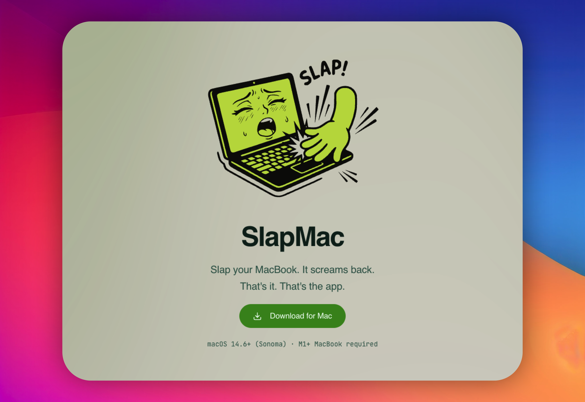

### 🎬 관련 영상
- [🎥 영상 보기](https://ph-files.imgix.net/09c3325a-1297-42e6-af82-ff34c30ba4c3.jpeg?auto=format)

---

## 2. [Crossnode](https://www.producthunt.com/products/crossnode)
**Votes**: 248 | **도입 난이도**: 중 | **신뢰도**: 중
**Tagline**: Vibe code AI agents and put them behind a payment wall
**서비스 링크**: https://www.producthunt.com/r/37A2GEWBOXLPGI

**태그**: AI, 유료화, 자동화, 백엔드, No-code, Agent, Automation, AI Tool, DevTool, Email

### 📌 이 서비스 한눈에 보기
Crossnode는 AI 에이전트를 빠르게 유료 상품으로 전환할 수 있게 해주는 플랫폼입니다. 복잡한 백엔드 설정 없이 워크플로우를 연결하고, 결제 및 사용자 관리를 자동화하여 AI 에이전트 판매를 간편하게 만들어줍니다.

### 🔑 주요 기능
- AI 에이전트를 유료 상품으로 쉽게 전환
- n8n 워크플로우 업로드 또는 자연어 기반 에이전트 구축 지원
- 로그인, 결제, 사용량 제한 등 백엔드 기능 자동 처리

### 🙋 사용자에게 어떤 점이 좋은가
AI 에이전트 개발자는 Crossnode를 통해 복잡한 백엔드 개발 없이 자신의 AI 에이전트를 수익화하고 고객에게 제공할 수 있습니다. 고객 이메일만 입력하면 에이전트 할당이 가능하여 관리가 매우 편리합니다.

### ✅ 지금 바로 써볼 기능
- n8n 워크플로우를 업로드하여 AI 에이전트 연결
- 자연어를 사용하여 새로운 AI 에이전트 구축
- 고객 이메일을 입력하여 에이전트 할당 및 사용량 관리

### ⚠️ 사용 전 확인할 점
- n8n과의 호환성 및 지원되는 워크플로우 유형 확인 필요
- 결제 시스템 및 수수료 관련 상세 정보 확인 필요

### 🧭 확인이 더 필요한 정보
Crossnode의 확장성 및 지원되는 AI 에이전트의 종류에 대한 추가 정보가 필요합니다.

### 📸 스크린샷 및 갤러리
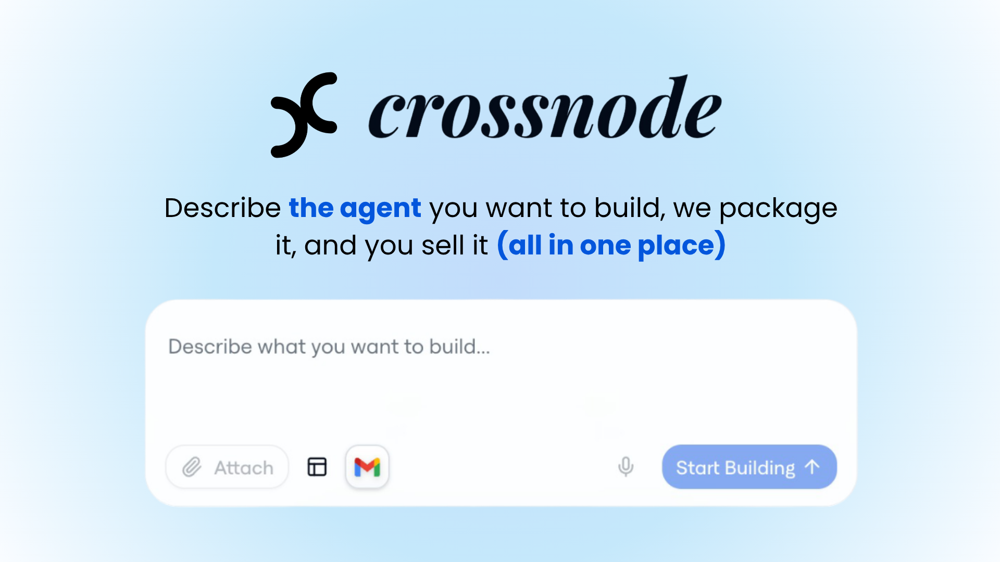
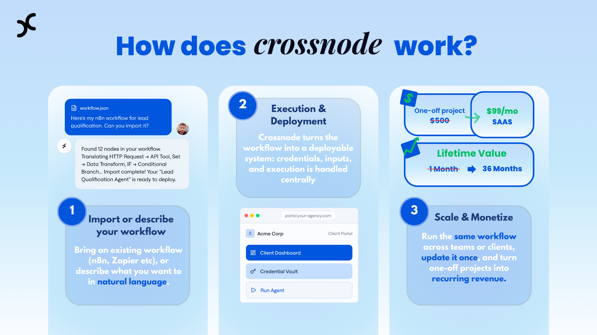
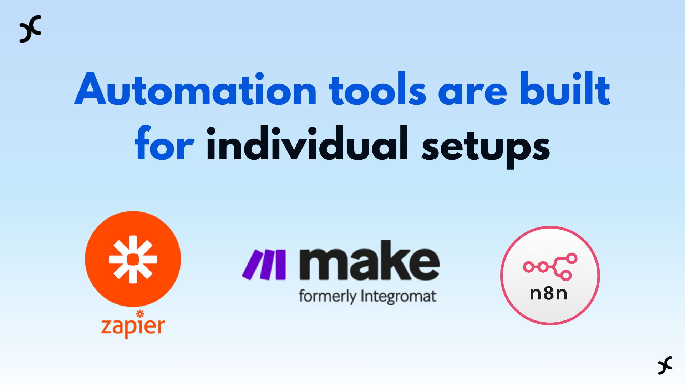

### 🎬 관련 영상
- [🎥 영상 보기](https://ph-files.imgix.net/e78632eb-68fd-4c25-a42c-8eb0ab2e5ece.jpeg?auto=format)

---

## 3. [Aera Browser](https://www.producthunt.com/products/aera-browser)
**Votes**: 177 | **도입 난이도**: 중 | **신뢰도**: 중
**Tagline**: The browser built for automation
**서비스 링크**: https://www.producthunt.com/r/45ASS7UPWHFNKV

**태그**: 자동화, 브라우저, 개발 도구, 개인 정보 보호, Agent, Automation, DevTool

### 📌 이 서비스 한눈에 보기
Aera 브라우저는 자동화 워크플로우를 위해 설계되었으며, 백그라운드에서 작업을 실행하고 데이터와 기록을 로컬에 보관하여 개인 정보 보호를 강화합니다.

### 🔑 주요 기능
- 자동화 워크플로우를 위한 브라우저
- 백그라운드에서 전체 워크플로우 실행 및 관리
- 데이터와 기록을 로컬에 보관하여 개인 정보 보호

### 🙋 사용자에게 어떤 점이 좋은가
Aera 브라우저를 사용하면 반복적인 작업을 자동화하여 시간을 절약하고, 개인 정보 보호를 강화할 수 있습니다. Cursor나 Claude Code와 같은 도구와 연동하여 더욱 강력한 자동화 기능을 활용할 수 있습니다.

### ✅ 지금 바로 써볼 기능
- 자동화 작업 생성 및 실행
- Cursor 또는 Claude Code와 연동하여 사용
- 개인 정보 보호 설정 확인

### ⚠️ 사용 전 확인할 점
- 로컬 환경에 의존적이므로 환경 설정 필요
- 타 브라우저와의 호환성 확인 필요

### 🧭 확인이 더 필요한 정보
Aera 브라우저의 성능 및 안정성에 대한 사용자 리뷰 확인이 필요합니다.

### 📸 스크린샷 및 갤러리

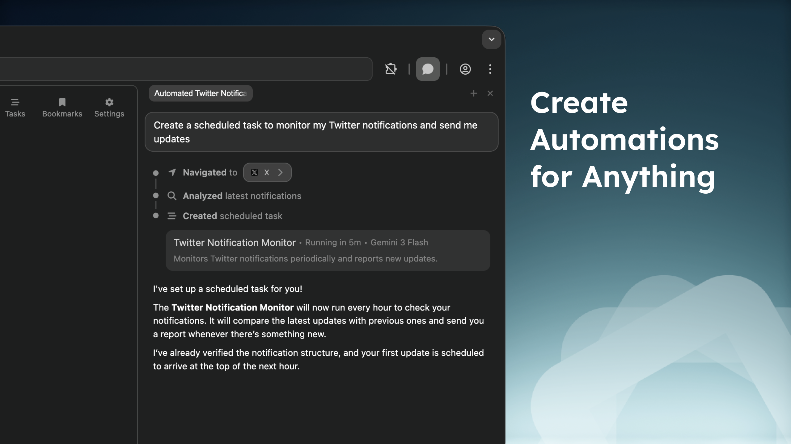
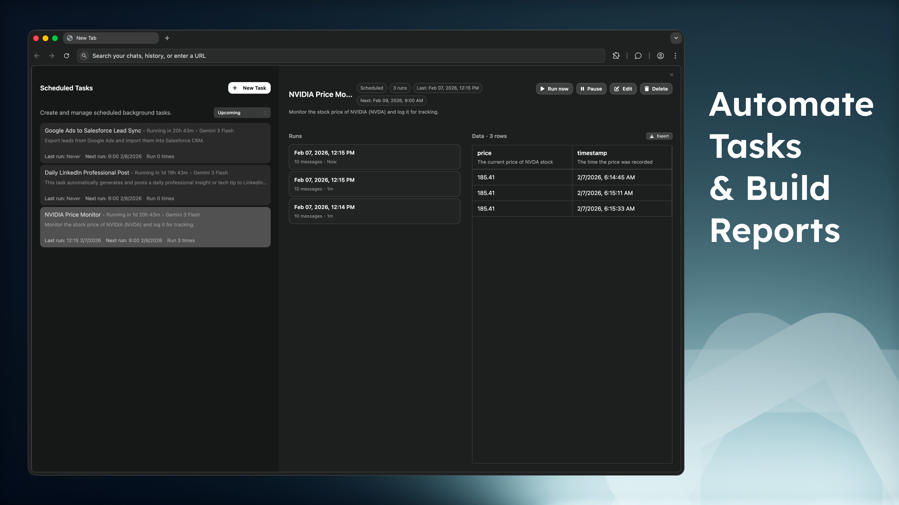

### 🎬 관련 영상
- [🎥 영상 보기](https://ph-files.imgix.net/c4d131fc-f930-4e8a-8bad-733d520d8693.jpeg?auto=format)

---

## 4. [CrabTalk](https://www.producthunt.com/products/crabtalk)
**Votes**: 153 | **도입 난이도**: 중 | **신뢰도**: 중
**Tagline**: The agent daemon that hides nothing. 8MB. Open Source
**서비스 링크**: https://www.producthunt.com/r/ZAAIAYTYC43FIJ

**태그**: DevTool, 에이전트, 모니터링, 오픈소스, Agent

### 📌 이 서비스 한눈에 보기
CrabTalk은 에이전트의 모든 활동을 실시간으로 스트리밍하여 개발자가 필요한 정보만 선택적으로 활용할 수 있도록 지원하는 오픈 소스 데몬입니다.

### 🔑 주요 기능
- 8MB의 가벼운 데몬으로 설치가 간편함 (curl 한 줄)
- 에이전트의 모든 이벤트 스트리밍 (텍스트 변경, 도구 호출, 사고 과정 등)
- 사용자 정의 모델 통합 가능

### 🙋 사용자에게 어떤 점이 좋은가
에이전트의 내부 동작을 투명하게 파악하고, 필요한 데이터만 선택적으로 활용하여 개발 효율성을 높일 수 있습니다.

### ✅ 지금 바로 써볼 기능
- curl 명령어로 CrabTalk 설치
- 에이전트 이벤트 스트리밍 설정
- 사용자 정의 모델 연결

### ⚠️ 사용 전 확인할 점
- 사용자 정의 모델과의 호환성 확인 필요
- 스트리밍되는 데이터 양에 따른 리소스 사용량 고려

### 🧭 확인이 더 필요한 정보
다양한 에이전트 환경에서의 안정성 및 성능에 대한 추가 검증이 필요합니다.

### 📸 스크린샷 및 갤러리

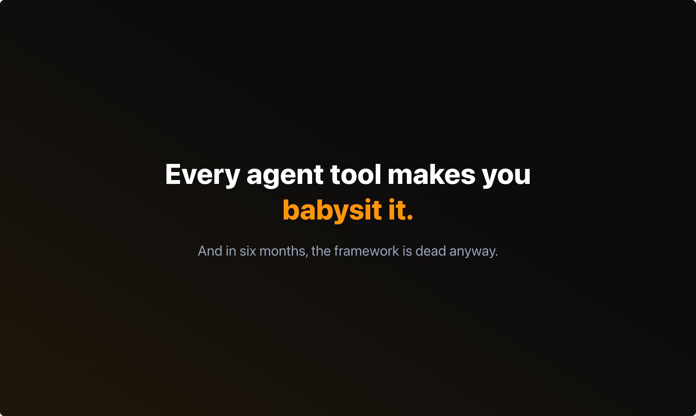
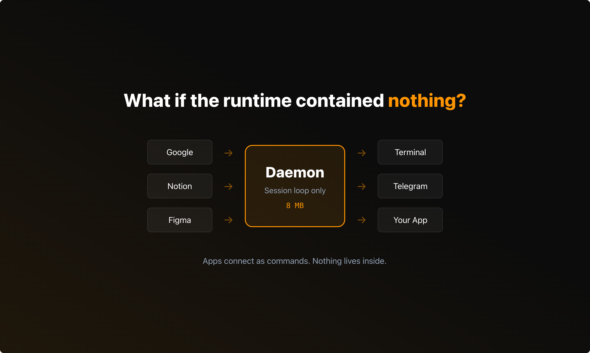

### 🎬 관련 영상
- [🎥 영상 보기](https://ph-files.imgix.net/728be1d1-fe69-486b-bac9-5171f0843942.jpeg?auto=format)

---

## 5. [Apparent for Gmail](https://www.producthunt.com/products/apparent-for-gmail)
**Votes**: 151 | **도입 난이도**: 하 | **신뢰도**: 중
**Tagline**: Make Gmail easier to read and manage.
**서비스 링크**: https://www.producthunt.com/r/MVLWQNIV4PJAZJ

**태그**: Gmail, 생산성, 개인 설정, 브라우저 확장, AI Tool, Email

### 📌 이 서비스 한눈에 보기
Apparent for Gmail은 Gmail을 더 읽기 쉽고 관리하기 쉽게 만들어주는 브라우저 확장 프로그램입니다.

### 🔑 주요 기능
- Gmail 대화에서 최신 메시지를 먼저 보여줍니다.
- 모든 메시지를 빠짐없이 표시합니다.
- AI 요약 및 시각적 노이즈를 제거하여 집중도를 높입니다.

### 🙋 사용자에게 어떤 점이 좋은가
Gmail 인터페이스를 개인 설정하여 생산성을 높이고 중요한 정보에 더 쉽게 접근할 수 있습니다. 로컬에서 실행되므로 개인 정보 보호에도 유리합니다.

### ✅ 지금 바로 써볼 기능
- 확장 프로그램을 설치하고 Gmail을 열어보세요.
- 대화 목록에서 최신 메시지가 먼저 나타나는지 확인하세요.
- AI 요약이 숨겨졌는지 확인하여 깔끔해진 인터페이스를 경험해보세요.

### ⚠️ 사용 전 확인할 점
- 브라우저 확장 프로그램이므로 브라우저 호환성을 확인하세요.
- Gmail 인터페이스 변경으로 인해 다른 확장 프로그램과의 충돌 가능성을 고려하세요.

### 🧭 확인이 더 필요한 정보
Gmail 업데이트에 따라 확장 프로그램의 기능이 영향을 받을 수 있습니다.

### 📸 스크린샷 및 갤러리
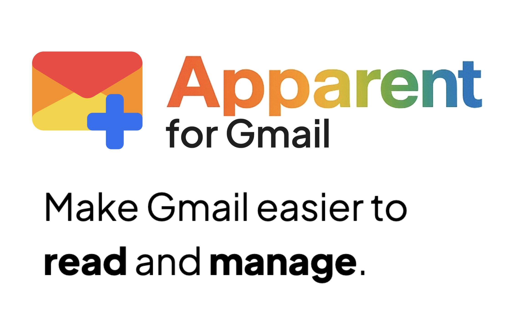

---

## 6. [Cohere Transcribe](https://www.producthunt.com/products/cohere-2)
**Votes**: 113 | **도입 난이도**: 중 | **신뢰도**: 중
**Tagline**: New state-of-the-art in open source speech recognition
**서비스 링크**: https://www.producthunt.com/r/ZOGEDIIJJKRU5L

**태그**: 음성 인식, 오픈 소스, AI, DevTool

### 📌 이 서비스 한눈에 보기
Cohere Transcribe는 기업 워크로드에 최적화된 오픈 소스 음성 인식 모델로, 높은 처리량과 14개 언어에서 5.42% WER을 제공하여 로컬 환경에서 사용하기 적합합니다.

### 🔑 주요 기능
- 20억 개의 파라미터를 가진 오픈 소스 음성 인식 모델
- 기업 워크로드에 최적화
- 14개 언어에서 5.42%의 낮은 WER

### 🙋 사용자에게 어떤 점이 좋은가
개인 정보 보호가 중요한 환경에서 로컬 또는 데스크톱에서 고성능 음성 인식을 사용할 수 있습니다. 특히 기업 환경에서 데이터 보안을 유지하면서 음성 데이터를 처리해야 할 때 유용합니다.

### ✅ 지금 바로 써볼 기능
- 지원되는 14개 언어 확인
- 로컬 환경에 배포하여 성능 테스트
- 기존 음성 인식 솔루션과 WER 비교

### ⚠️ 사용 전 확인할 점
- 오픈 소스 모델이므로 자체적인 유지보수 및 관리가 필요
- 특정 하드웨어 환경에서 최적의 성능을 내지 못할 수 있음

### 🧭 확인이 더 필요한 정보
실제 사용 환경에서의 성능은 데이터셋 및 환경에 따라 달라질 수 있으므로, 다양한 조건에서 테스트해 보는 것이 좋습니다.

### 📸 스크린샷 및 갤러리

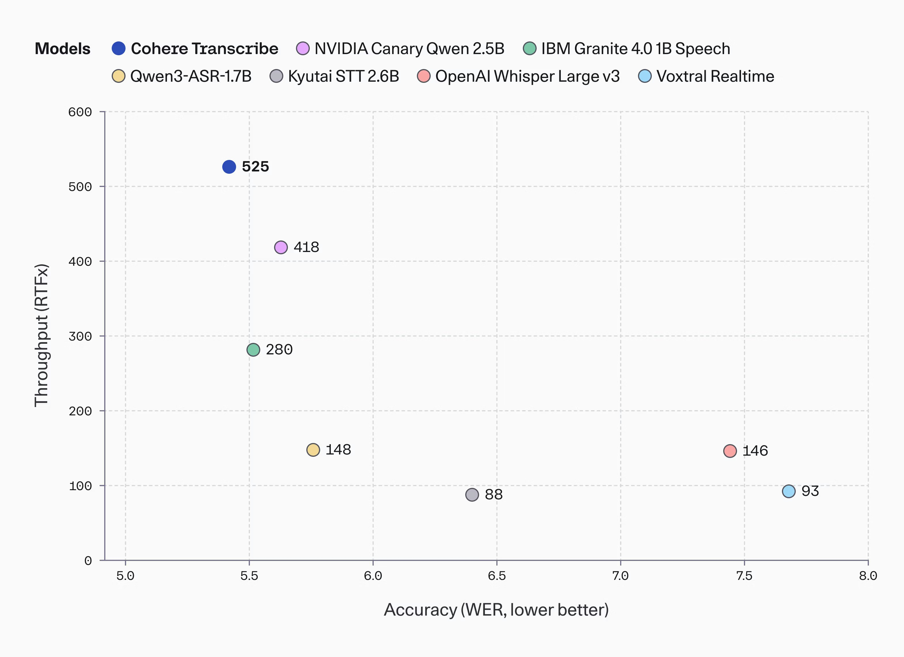
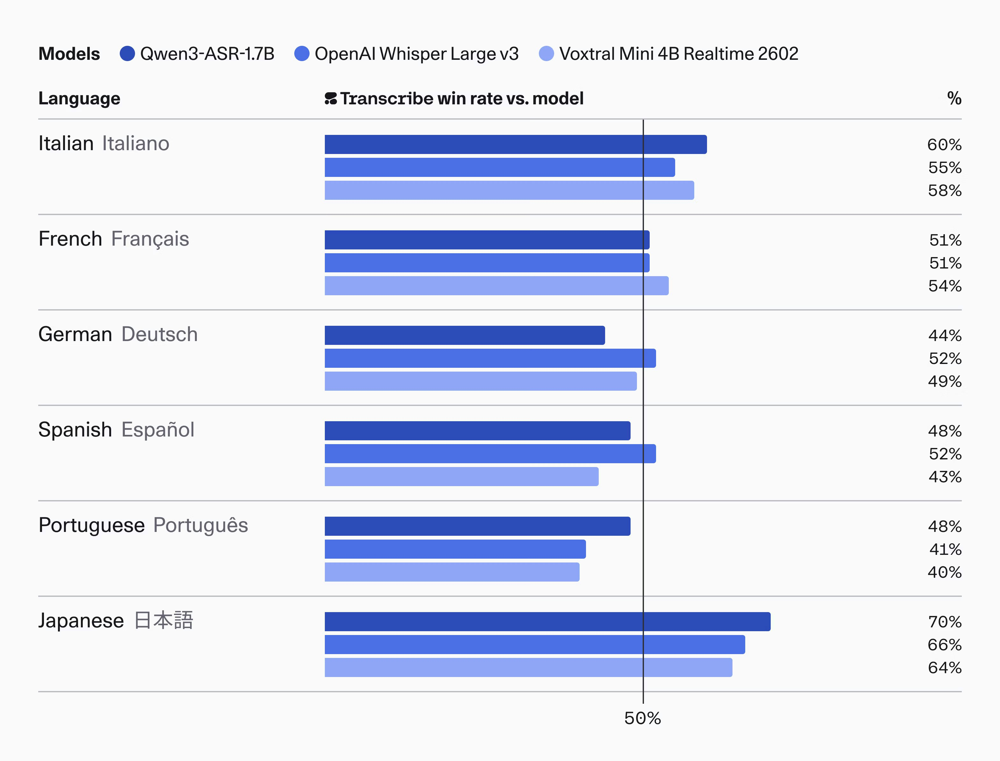

### 🎬 관련 영상
- [🎥 영상 보기](https://ph-files.imgix.net/57bb312f-62ec-4381-ad60-afa0d1e4aa29.jpeg?auto=format)

---

## 7. [WordPress Studio CLI](https://www.producthunt.com/products/wordpress-studio-cli)
**Votes**: 95 | **도입 난이도**: 중 | **신뢰도**: 중
**Tagline**: WordPress Studio now has an independently installable CLI
**서비스 링크**: https://www.producthunt.com/r/K2VLOEJFT2JJRR

**태그**: DevTool, CLI, WordPress, Automation

### 📌 이 서비스 한눈에 보기
WordPress Studio의 기능을 터미널에서 제어하고, 스크립팅 워크플로우에 로컬 개발을 통합할 수 있는 독립적인 CLI 도구입니다.

### 🔑 주요 기능
- 터미널에서 WordPress Studio 기능 제어
- 스크립팅 워크플로우에 로컬 개발 통합
- CLI 도구를 통한 자동화

### 🙋 사용자에게 어떤 점이 좋은가
터미널 환경에서 WordPress Studio의 기능을 활용하여 개발 프로세스를 자동화하고 효율성을 높일 수 있습니다. 스크립트를 통해 반복적인 작업을 간소화할 수 있습니다.

### ✅ 지금 바로 써볼 기능
- CLI 설치 및 설정
- 터미널에서 WordPress Studio 기능 실행
- 스크립트 작성 및 통합

### ⚠️ 사용 전 확인할 점
- CLI 사용법 숙지 필요
- 기존 스크립트와의 호환성 확인

### 🧭 확인이 더 필요한 정보
WordPress Studio CLI의 구체적인 기능 및 지원 범위에 대한 추가 정보가 필요합니다.

### 📸 스크린샷 및 갤러리
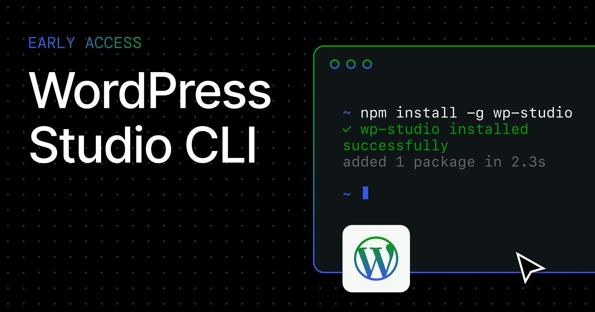
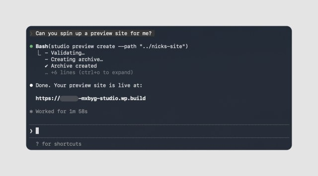
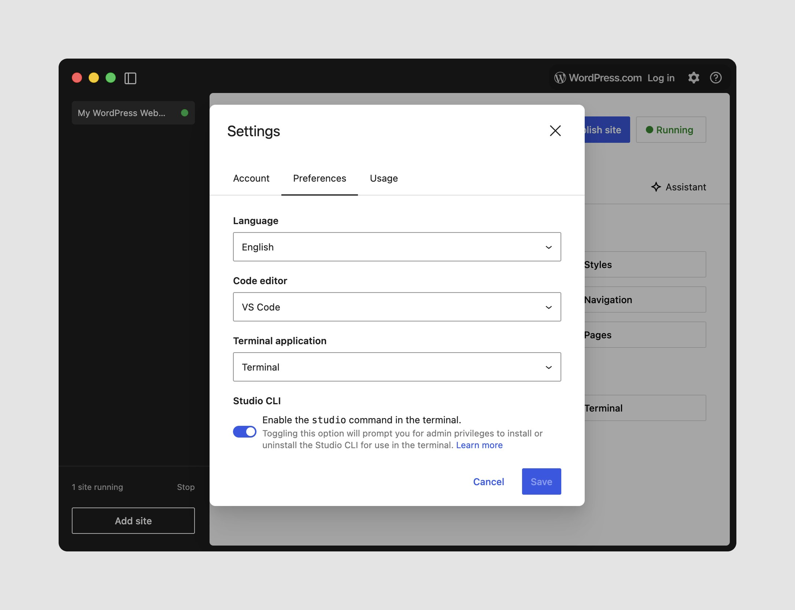

---

## 8. [RepoLens](https://www.producthunt.com/products/repolens)
**Votes**: 92 | **도입 난이도**: 중 | **신뢰도**: 중
**Tagline**: Know what changed and what matters across your codebase
**서비스 링크**: https://www.producthunt.com/r/QWK26XU6MFBQF5

**태그**: DevTool, 코드 분석, 협업, 자동화, 코드 리뷰, Chat

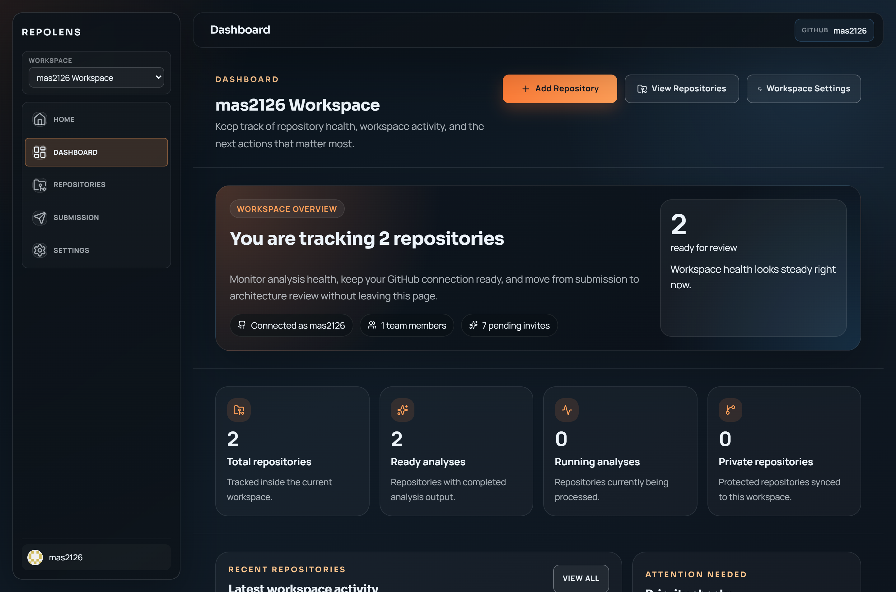

### 📌 이 서비스 한눈에 보기
RepoLens는 코드 변경 사항 분석, 주요 변경 지점 강조, 브랜치 비교, 변경 알림 등을 통해 엔지니어링 팀이 코드베이스를 더 빠르고 정확하게 이해하도록 돕는 도구입니다.

### 🔑 주요 기능
- PR 분석 및 영향 받는 모듈/엔드포인트 감지
- 코드 리뷰 핫스팟 강조
- 브랜치 기반 채팅 및 구조적 브랜치 비교

### 🙋 사용자에게 어떤 점이 좋은가
코드 변경 사항을 빠르게 파악하고 중요한 부분에 집중하여 코드 리뷰 효율성을 높이고, 코드베이스에 대한 이해도를 향상시켜 개발 속도를 향상시킵니다.

### ✅ 지금 바로 써볼 기능
- PR 분석 기능으로 코드 변경 영향도 파악
- 핫스팟 강조 기능으로 리뷰 집중 영역 확인
- 브랜치 비교 기능으로 코드 구조 변화 분석

### ⚠️ 사용 전 확인할 점
- 지원하는 저장소 유형 및 코드 언어 확인 필요
- 분석 정확도는 코드 스타일 및 복잡성에 따라 달라질 수 있음

### 🧭 확인이 더 필요한 정보
RepoLens의 분석 정확도 및 지원 범위를 실제 프로젝트에 적용하여 확인하는 것이 좋습니다.

### 📸 스크린샷 및 갤러리
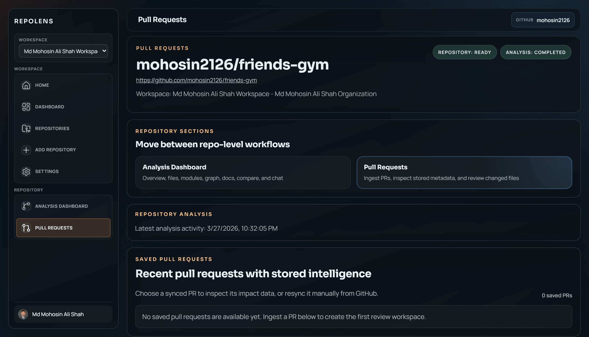
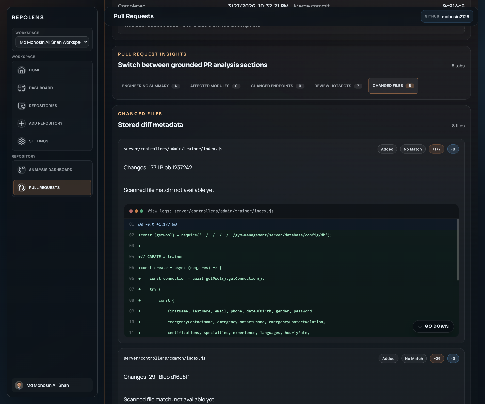
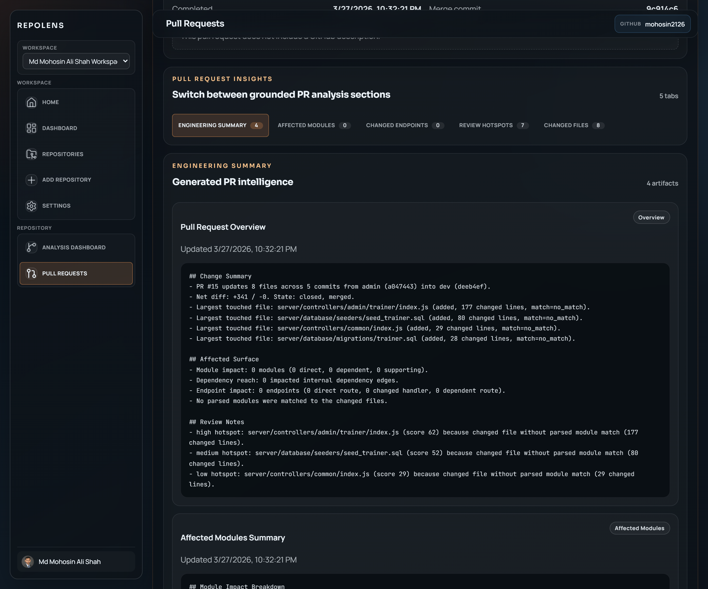

### 🎬 관련 영상
- [🎥 영상 보기](https://ph-files.imgix.net/b3712b1a-2005-4f88-ad99-70e9f22a266a.jpeg?auto=format)

---

## 9. [Lexaclaw](https://www.producthunt.com/products/lexaclaw)
**Votes**: 90 | **도입 난이도**: 중 | **신뢰도**: 중
**Tagline**: Startup legal compliance built on OpenClaw
**서비스 링크**: https://www.producthunt.com/r/OBMSRIA7BCEITG

**태그**: DevTool, 법률, 자동화, 스타트업, Agent

### 📌 이 서비스 한눈에 보기
Lexaclaw는 OpenClaw 기반으로 스타트업의 법적 의무를 추적, 정부 양식 작성, 법률 문서 생성을 자동화하여 스타트업의 법률 준수를 돕는 무료 도구입니다.

### 🔑 주요 기능
- 스타트업의 법적 의무 자동 추적 및 관리
- 정부 양식 자동 작성 및 법률 문서 생성
- 로컬에서 실행되어 문서 보안 유지

### 🙋 사용자에게 어떤 점이 좋은가
스타트업은 Lexaclaw를 통해 복잡한 법률 준수 과정을 간소화하고, 시간과 비용을 절약할 수 있습니다. 또한, 문서가 로컬에서 처리되므로 데이터 보안 걱정 없이 사용할 수 있습니다.

### ✅ 지금 바로 써볼 기능
- Lexaclaw 저장소에 에이전트 연결하여 시작하기
- 문서 스캔을 통해 의무 사항 자동 발견 기능 사용해보기
- 제공되는 법률 문서 템플릿 활용해보기

### ⚠️ 사용 전 확인할 점
- OpenClaw 기반이므로 OpenClaw에 대한 이해 필요
- 제공되는 법률 문서 템플릿의 적합성 검토 필요

### 🧭 확인이 더 필요한 정보
Lexaclaw가 제공하는 법률 문서 템플릿이 모든 상황에 적합한지 추가 확인이 필요합니다.

### 📸 스크린샷 및 갤러리
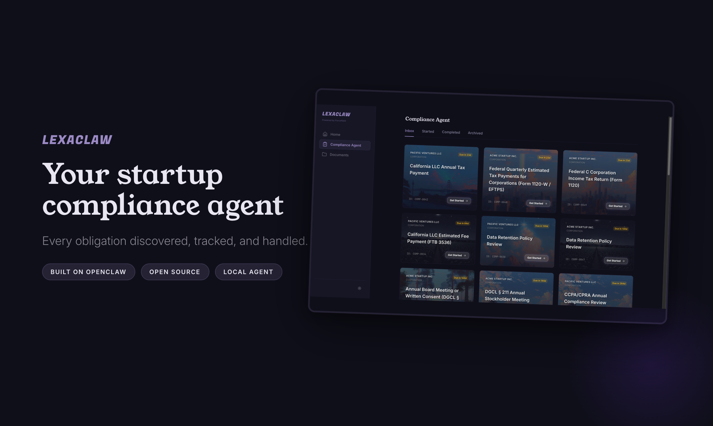
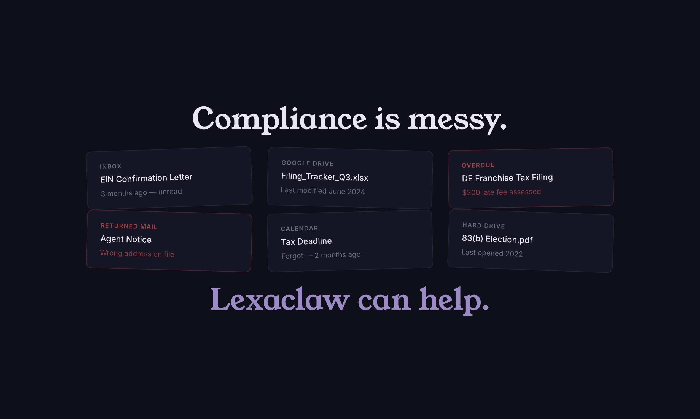
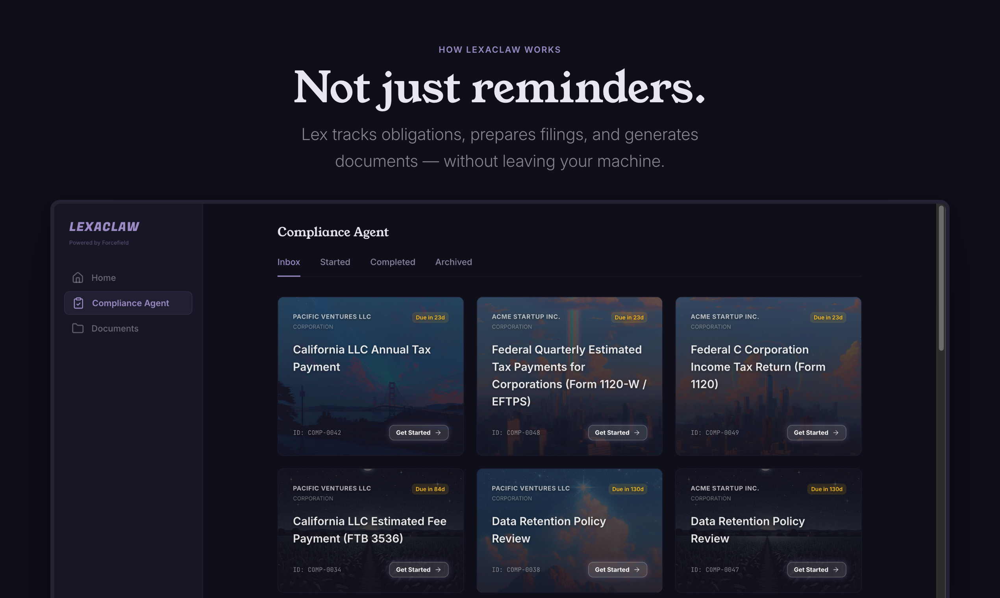

### 🎬 관련 영상
- [🎥 영상 보기](https://ph-files.imgix.net/0ca0097f-fb47-43ed-82d4-883c17bd0074.jpeg?auto=format)

---

## 10. [Expect](https://www.producthunt.com/products/expect)
**Votes**: 88 | **도입 난이도**: 중 | **신뢰도**: 중
**Tagline**: Let agents test your code in a real browser
**서비스 링크**: https://www.producthunt.com/r/6SIAEH7XH5JINV

**태그**: DevTool, 테스트 자동화, 브라우저 테스트, Agent, AI Tool

### 📌 이 서비스 한눈에 보기
Expect는 실제 브라우저에서 에이전트가 코드를 테스트할 수 있도록 하여 개발자가 변경 사항을 쉽게 검증하고 테스트할 수 있게 돕습니다.

### 🔑 주요 기능
- 커밋되지 않은 변경 사항 또는 브랜치 차이에 대한 테스트 계획 자동 생성
- 실제 브라우저 환경에서 테스트 실행
- 단일 명령어로 간편하게 사용 가능

### 🙋 사용자에게 어떤 점이 좋은가
개발자는 Expect를 통해 코드 변경 사항을 빠르게 테스트하고 잠재적인 문제를 사전에 발견하여 개발 효율성을 높일 수 있습니다. 브라우저 호환성 문제나 예기치 않은 오류를 줄이는 데 도움이 됩니다.

### ✅ 지금 바로 써볼 기능
- 명령어 한 줄로 테스트 계획 생성 및 실행해보기
- 변경 사항 추적 및 테스트 자동화 설정해보기
- 실제 브라우저에서 테스트 결과 확인해보기

### ⚠️ 사용 전 확인할 점
- 테스트 환경 설정 및 브라우저 호환성 확인 필요
- 자동 생성된 테스트 계획의 정확성 검토 필요

### 🧭 확인이 더 필요한 정보
Expect가 지원하는 브라우저 종류 및 테스트 자동화 수준에 대한 추가 정보 확인이 필요합니다.

### 📸 스크린샷 및 갤러리
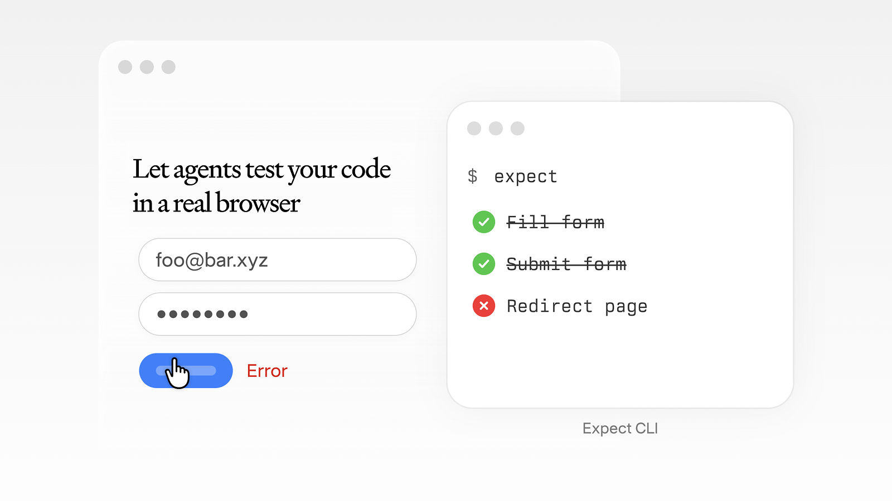
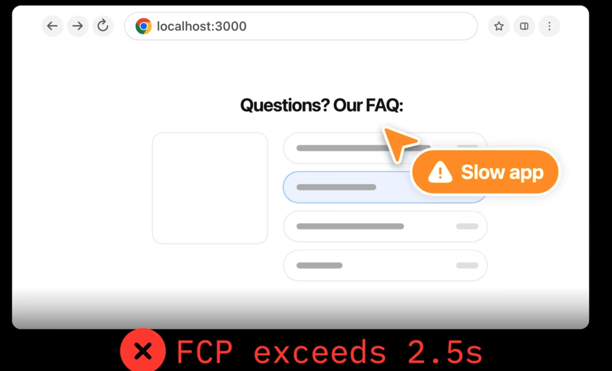
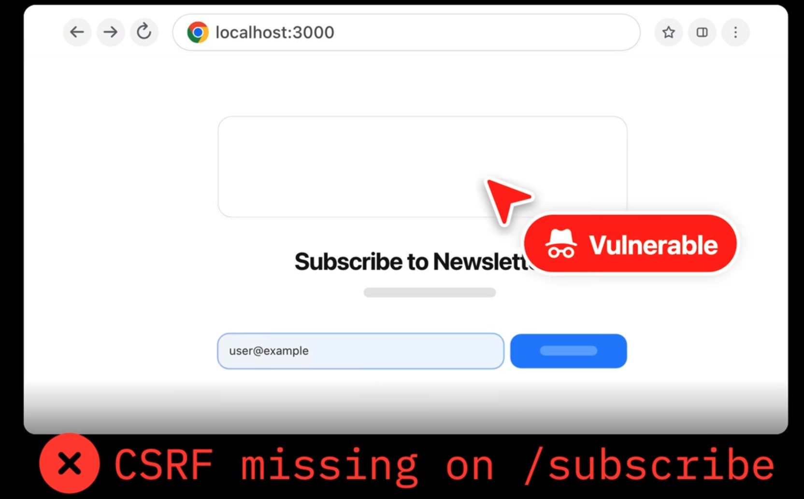

---

