# 🚀 Product Hunt Daily Top 10 (2026-03-30)

## 1. [Clico](https://www.producthunt.com/products/clico)
**Votes**: 287 | **도입 난이도**: 중 | **신뢰도**: 중
**Tagline**: Every textbox, supercharged
**서비스 링크**: https://www.producthunt.com/r/GD6ONHGSZHP2DM

**태그**: 생산성, AI, 브라우저 확장, 글쓰기 도구, AI Tool, Design, Productivity

### 📌 이 서비스 한눈에 보기
Clico는 브라우저 내에서 작동하여 웹페이지의 맥락을 이해하고, 복사/붙여넣기 없이 글쓰기 및 생산성을 향상시켜주는 브라우저 확장 프로그램입니다.

### 🔑 주요 기능
- 브라우저 내에서 직접 작동하여 편리함
- 웹페이지 맥락을 이해하여 높은 관련성 제공
- 글쓰기 및 생산성 향상에 도움

### 🙋 사용자에게 어떤 점이 좋은가
텍스트 상자에서 바로 AI 기능을 활용하여 글쓰기 효율을 높이고, 웹페이지 내용을 바탕으로 더욱 정확한 결과물을 얻을 수 있습니다.

### ✅ 지금 바로 써볼 기능
- 텍스트 상자에 Clico를 활성화하여 사용해보기
- 웹페이지 내용을 요약해보기
- 문장 개선 기능 사용해보기

### ⚠️ 사용 전 확인할 점
- 개인 정보 처리 방침 확인 필요
- 지원하는 브라우저 및 웹페이지 확인 필요

### 🧭 확인이 더 필요한 정보
Clico의 구체적인 기능 및 지원 범위에 대한 추가 정보 확인이 필요합니다.

### 📸 스크린샷 및 갤러리

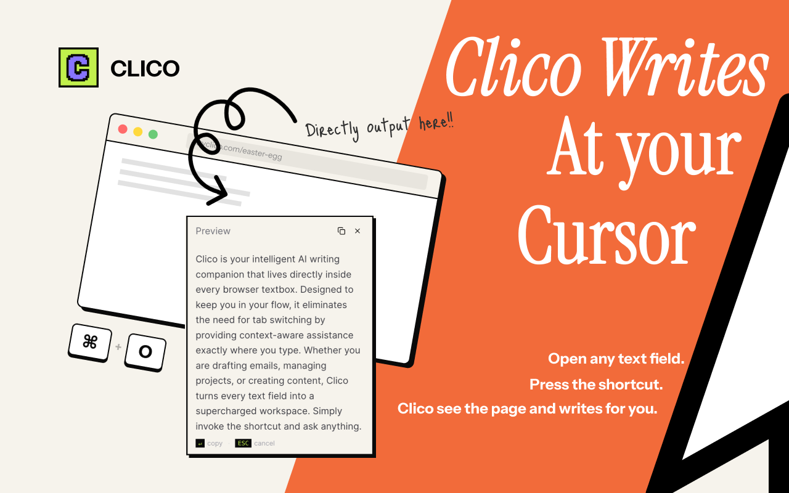
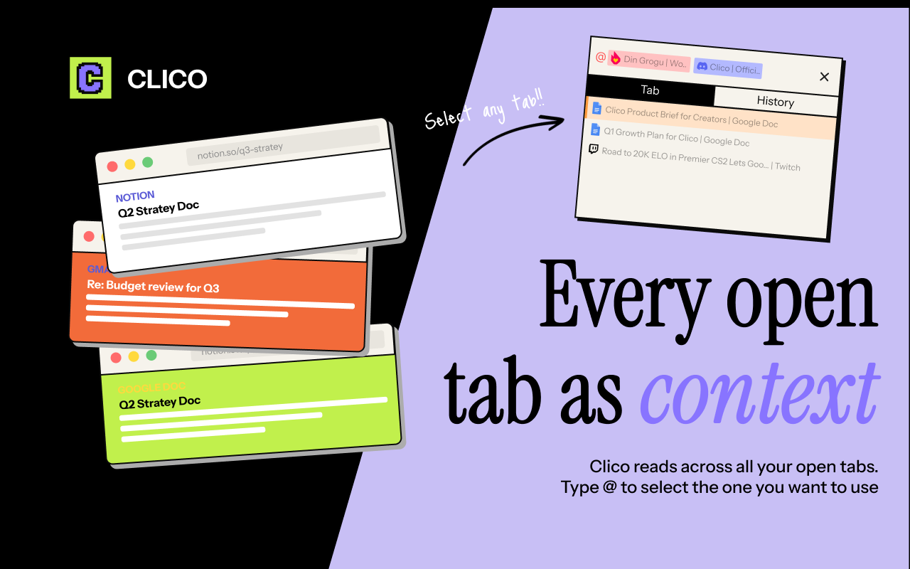

### 🎬 관련 영상
- [🎥 영상 보기](https://ph-files.imgix.net/3fb700ac-079e-46c9-9675-162e4dcf7ca0.jpeg?auto=format)

---

## 2. [Sheet Ninja](https://www.producthunt.com/products/sheet-ninja-2)
**Votes**: 242 | **도입 난이도**: 중 | **신뢰도**: 중
**Tagline**: Ship vibe-coded apps. Your data stays in Google Sheets.
**서비스 링크**: https://www.producthunt.com/r/3RO2ERPOTX5IRL

**태그**: DevTool, API, Google Sheets, Automation

### 📌 이 서비스 한눈에 보기
Sheet Ninja는 Google Sheets 데이터를 API로 즉시 변환하여, 별도의 데이터베이스 구축 없이 앱을 만들고 실시간으로 데이터를 동기화할 수 있게 해줍니다.

### 🔑 주요 기능
- Google Sheets를 API로 즉시 변환
- 데이터베이스 구축 없이 앱 개발 가능
- 실시간 데이터 동기화로 사용자 편의성 향상

### 🙋 사용자에게 어떤 점이 좋은가
데이터를 Sheets에서 직접 관리하고 앱에 즉시 반영하여, 백엔드 작업 없이 간편하게 앱을 유지보수할 수 있습니다. 고객이 스프레드시트처럼 데이터를 편집하면 앱에 바로 반영되므로, 번거로운 업데이트 과정이 필요 없습니다.

### ✅ 지금 바로 써볼 기능
- Google Sheet를 API로 변환해보기
- Lovable, Bolt, Replit 등과 연동하여 앱 개발 시작하기
- 데이터 변경 시 앱에 실시간으로 반영되는지 확인하기

### ⚠️ 사용 전 확인할 점
- Google Sheets의 용량 제한 고려
- API 호출량에 따른 성능 변화 확인

### 🧭 확인이 더 필요한 정보
API 호출량 증가에 따른 성능 변화 및 Google Sheets의 복잡한 데이터 구조에 대한 처리 성능을 추가적으로 확인해야 합니다.

### 📸 스크린샷 및 갤러리

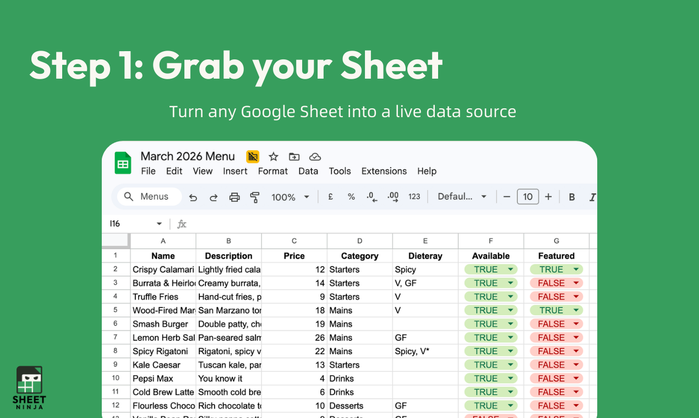
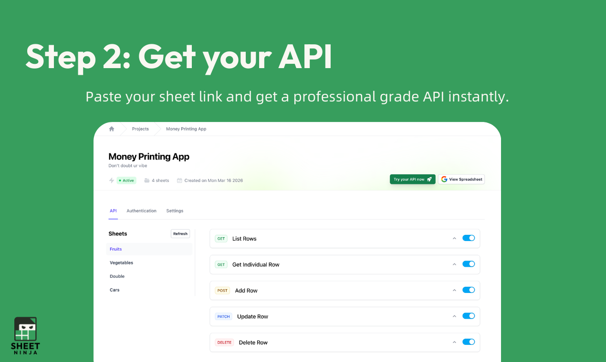

---

## 3. [SUN ](https://www.producthunt.com/products/sun-ai)
**Votes**: 234 | **도입 난이도**: 중 | **신뢰도**: 중
**Tagline**: Personalized AI audio lessons generated on demand
**서비스 링크**: https://www.producthunt.com/r/J4NRYY3OWX3IZJ

**태그**: AI, 오디오 학습, 개인화, 온디맨드 콘텐츠, AI Tool, Email

### 📌 이 서비스 한눈에 보기
SUN은 사용자의 개인적인 맥락을 이해하여 맞춤형 오디오 학습 콘텐츠를 즉석에서 생성해주는 AI 기반 플랫폼입니다.

### 🔑 주요 기능
- 개인 맞춤형 오디오 콘텐츠 즉시 생성
- 학습 중 질문하고 상호작용 가능
- 스크린 없이 지속적인 학습 지원

### 🙋 사용자에게 어떤 점이 좋은가
이메일, 노트 등 개인 데이터를 기반으로 학습 콘텐츠가 생성되므로, 사용자는 자신의 상황에 맞는 오디오 학습 경험을 할 수 있습니다. 이동 중이나 운동 중에도 학습이 가능하여 시간을 효율적으로 활용할 수 있습니다.

### ✅ 지금 바로 써볼 기능
- 관심 있는 주제로 오디오 콘텐츠 생성해보기
- 학습 중 질문 기능 사용해보기
- 개인 데이터 연동하여 맞춤 학습 경험하기

### ⚠️ 사용 전 확인할 점
- 개인 정보 사용에 대한 보안 고려 필요
- AI 생성 콘텐츠의 정확성 검증 필요

### 🧭 확인이 더 필요한 정보
AI가 개인의 맥락을 얼마나 정확하게 파악하여 콘텐츠를 생성하는지 확인이 필요합니다.

### 📸 스크린샷 및 갤러리
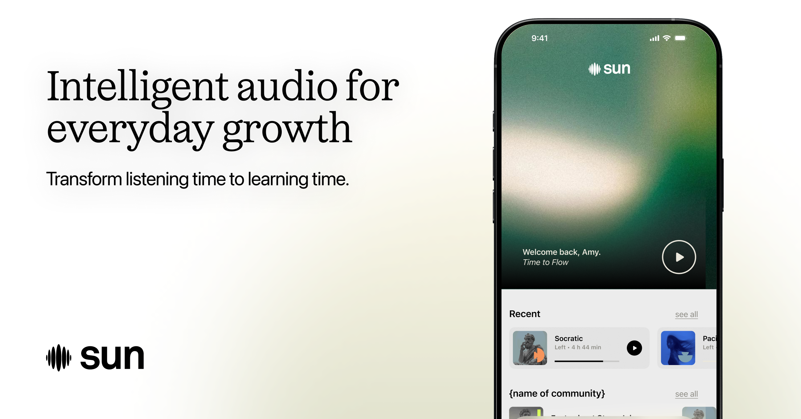

### 🎬 관련 영상
- [🎥 영상 보기](https://ph-files.imgix.net/5b53f0f4-4d35-4255-a9ed-782cf7476e14.jpeg?auto=format)

---

## 4. [Google Search Live](https://www.producthunt.com/products/google-search-live)
**Votes**: 197 | **도입 난이도**: 중 | **신뢰도**: 중
**Tagline**:  Interactive, multimodal conversation in AI Mode
**서비스 링크**: https://www.producthunt.com/r/5SNFLTIZ4KC4CZ

**태그**: AI, 검색, 대화형 인터페이스, 다국어 지원, AI Tool

### 📌 이 서비스 한눈에 보기
Google Search Live가 AI 모드를 지원하는 모든 언어와 지역으로 확장되어, 사용자는 더욱 풍부하고 상호작용적인 검색 경험을 누릴 수 있습니다.

### 🔑 주요 기능
- AI 기반의 대화형 검색 기능 제공
- 다양한 언어 및 지역 지원
- 작년에 예고된 기능의 글로벌 확장

### 🙋 사용자에게 어떤 점이 좋은가
AI 모드를 통해 사용자는 검색 결과와 상호작용하며 더 자세한 정보를 얻고, 복잡한 질문에 대한 답변을 쉽게 찾을 수 있습니다. 특히, 다양한 언어 지원으로 전 세계 사용자가 편리하게 이용할 수 있습니다.

### ✅ 지금 바로 써볼 기능
- AI 모드 활성화 후 검색어 입력해보기
- 다양한 질문 방식으로 검색 시도해보기
- 지원되는 다른 언어로 검색해보기

### ⚠️ 사용 전 확인할 점
- AI 모델의 답변 정확도 확인 필요
- 개인 정보 보호 정책 확인

### 🧭 확인이 더 필요한 정보
AI 모드의 정확성과 답변 품질에 대한 사용자 피드백 추이 확인이 필요합니다.

### 📸 스크린샷 및 갤러리

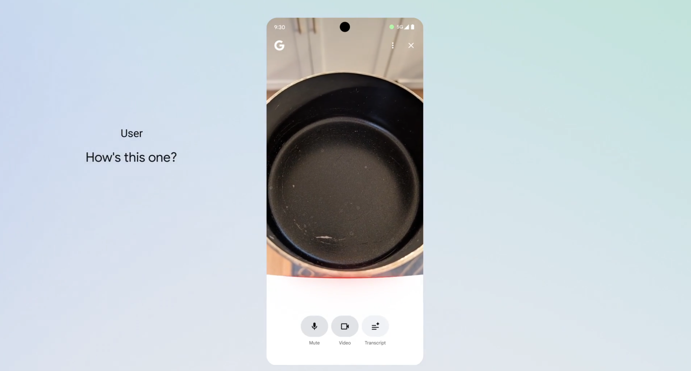
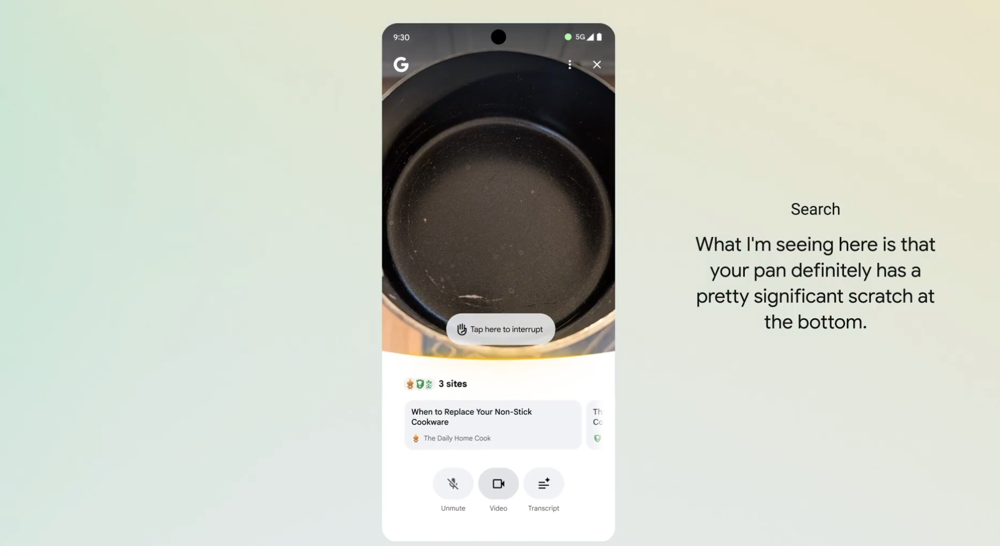

---

## 5. [Genzi](https://www.producthunt.com/products/genzi)
**Votes**: 172 | **도입 난이도**: 하 | **신뢰도**: 중
**Tagline**: The social app built around music
**서비스 링크**: https://www.producthunt.com/r/GLXNFJYCJEIRKR

**태그**: 소셜, 음악, 커뮤니티, 이벤트

### 📌 이 서비스 한눈에 보기
Genzi는 음악을 중심으로 소통하고 새로운 음악을 발견하며, 취향 기반 커뮤니티 참여 및 오프라인 이벤트 연결을 지원하는 소셜 앱입니다.

### 🔑 주요 기능
- 듣고 있는 음악 공유 및 새로운 음악/아티스트 발견
- 음악 스타일 기반 커뮤니티 참여
- 음악을 매개로 사람들을 연결하는 오프라인 이벤트 정보 제공

### 🙋 사용자에게 어떤 점이 좋은가
음악 취향을 공유하고 공감대를 형성하여 새로운 사람들과 쉽게 소통하고, 관심사에 맞는 오프라인 모임에 참여할 수 있도록 도와줍니다.

### ✅ 지금 바로 써볼 기능
- 현재 듣고 있는 음악을 공유해보세요.
- 관심 있는 음악 스타일의 커뮤니티에 참여해보세요.
- 주변에서 열리는 음악 관련 이벤트를 찾아보세요.

### ⚠️ 사용 전 확인할 점
- 개인 정보 공유 범위 설정을 확인하세요.
- 오프라인 이벤트 참여 시 안전에 유의하세요.

### 🧭 확인이 더 필요한 정보
사용자 수 증가에 따른 커뮤니티 활성화 정도를 추가적으로 확인해야 합니다.

### 📸 스크린샷 및 갤러리

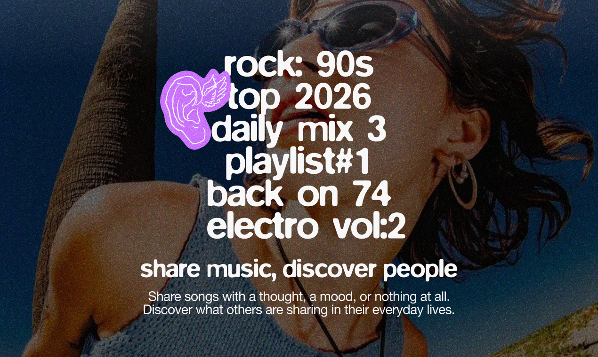

---

## 6. [Parallel Code](https://www.producthunt.com/products/parallel-code)
**Votes**: 140 | **도입 난이도**: 중 | **신뢰도**: 중
**Tagline**: Use Claude Code, Codex, and Gemini in parallel
**서비스 링크**: https://www.producthunt.com/r/ZFERG6IQAYBJAF

**태그**: DevTool, AI, 코딩, 자동화, macOS, Agent, AI Tool

### 📌 이 서비스 한눈에 보기
Parallel Code는 macOS 앱으로, Claude Code, Codex, Gemini와 같은 AI 코딩 에이전트를 병렬적으로 사용하여 개발 효율성을 높여줍니다.

### 🔑 주요 기능
- AI 코딩 에이전트 병렬 사용
- 자동 Git 브랜치 및 작업 트리 관리
- 무료 오픈 소스

### 🙋 사용자에게 어떤 점이 좋은가
여러 AI 코딩 도구를 동시에 활용하여 코드 작성 속도를 높이고, 다양한 결과를 비교 분석하여 최적의 코드를 선택할 수 있습니다. Git 브랜치 관리를 자동화하여 개발 워크플로우를 간소화합니다.

### ✅ 지금 바로 써볼 기능
- macOS 앱 설치 및 실행
- Claude Code, Codex, Gemini API 키 설정
- 새 프로젝트 생성 후 AI 에이전트 병렬 실행

### ⚠️ 사용 전 확인할 점
- macOS 환경에서만 사용 가능
- AI 코딩 에이전트 API 키 필요

### 🧭 확인이 더 필요한 정보
다양한 프로젝트 환경에서의 성능 및 안정성 검증이 필요합니다.

### 📸 스크린샷 및 갤러리

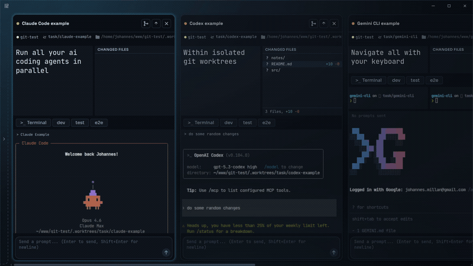
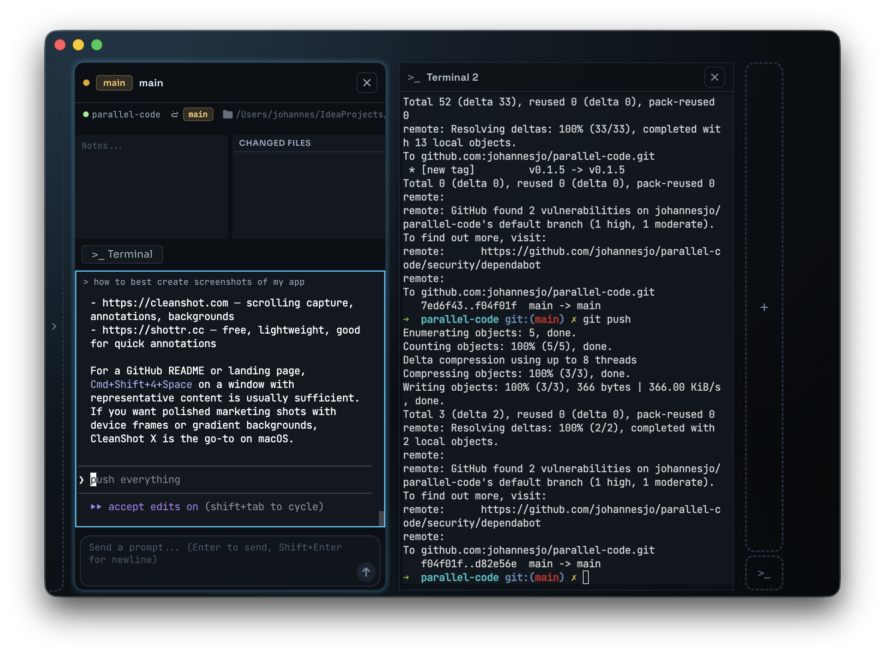

### 🎬 관련 영상
- [🎥 영상 보기](https://ph-files.imgix.net/d3b47b68-86f2-4a4c-ba7b-f55b5ef10b01.jpeg?auto=format)

---

## 7. [Cline Kanban](https://www.producthunt.com/products/cline-4)
**Votes**: 136 | **도입 난이도**: 중 | **신뢰도**: 중
**Tagline**: CLI-agnostic kanban for multi-agent orchestration
**서비스 링크**: https://www.producthunt.com/r/KO2E5AR3CDHFU6

**태그**: DevTool, 칸반, 자동화, CLI, Agent, AI Tool

### 📌 이 서비스 한눈에 보기
Cline Kanban은 터미널에서 벗어나 에이전트 작업을 보드에서 관리하고 연결하여 효율적인 멀티 에이전트 오케스트레이션을 가능하게 합니다.

### 🔑 주요 기능
- CLI 환경에 구애받지 않는 칸반 보드 제공
- 에이전트 작업 생성, 관리, 연결을 단일 뷰에서 지원
- Claude Code 및 Codex와 호환

### 🙋 사용자에게 어떤 점이 좋은가
터미널에서 벗어나 시각적으로 에이전트 작업을 관리하고 연결하여 워크플로우를 개선하고 생산성을 높일 수 있습니다. 특히 Claude Code 및 Codex 사용자는 더욱 편리하게 활용할 수 있습니다.

### ✅ 지금 바로 써볼 기능
- 칸반 보드 생성 및 에이전트 작업 추가
- 작업 간의 종속성 설정 및 연결
- Claude Code 또는 Codex 에이전트 연동

### ⚠️ 사용 전 확인할 점
- CLI 환경에 대한 기본적인 이해 필요
- Claude Code 및 Codex 연동 시 호환성 확인 필요

### 🧭 확인이 더 필요한 정보
다른 에이전트와의 호환성 및 확장성에 대한 정보 확인이 필요합니다.

### 📸 스크린샷 및 갤러리

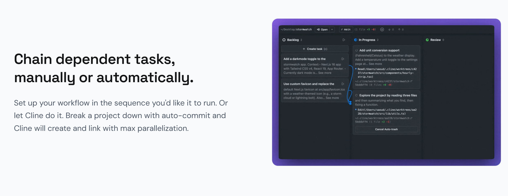

### 🎬 관련 영상
- [🎥 영상 보기](https://ph-files.imgix.net/fd8755d0-8a46-4884-806e-e685fce841e8.jpeg?auto=format)

---

## 8. [Peopling](https://www.producthunt.com/products/peopling)
**Votes**: 117 | **도입 난이도**: 중 | **신뢰도**: 중
**Tagline**: Practice difficult conversations before they happen
**서비스 링크**: https://www.producthunt.com/r/6MW2FO5CRGUAES

**태그**: AI, 커뮤니케이션, 역할극, 리더십, HR, AI Tool

### 📌 이 서비스 한눈에 보기
Peopling은 어려운 대화를 연습할 수 있는 AI 기반 음성 역할극 도구로, 관리자들이 실제 상황에서 더 효과적으로 대처할 수 있도록 돕습니다.

### 🔑 주요 기능
- AI 기반 음성 역할극을 통해 피드백, 목표 조정, 1:1 미팅 등 어려운 대화 연습 가능
- Stripe, Netflix 등 유수 기업 코칭 경험을 바탕으로 설계
- 이론보다는 실제 연습에 집중

### 🙋 사용자에게 어떤 점이 좋은가
피하고 싶은 대화를 미리 연습하여 실제 상황에서 자신감을 갖고 임할 수 있으며, 팀원과의 관계 개선 및 성과 향상에 기여할 수 있습니다.

### ✅ 지금 바로 써볼 기능
- 피드백 시나리오 연습
- 목표 조정 대화 연습
- 1:1 미팅 시뮬레이션

### ⚠️ 사용 전 확인할 점
- AI 역할극의 현실감 부족 가능성
- 실제 대화와 100% 동일한 효과 기대는 어려움

### 🧭 확인이 더 필요한 정보
AI 역할극의 효과성에 대한 사용자 피드백 및 추가적인 활용 사례 검토가 필요합니다.

### 📸 스크린샷 및 갤러리
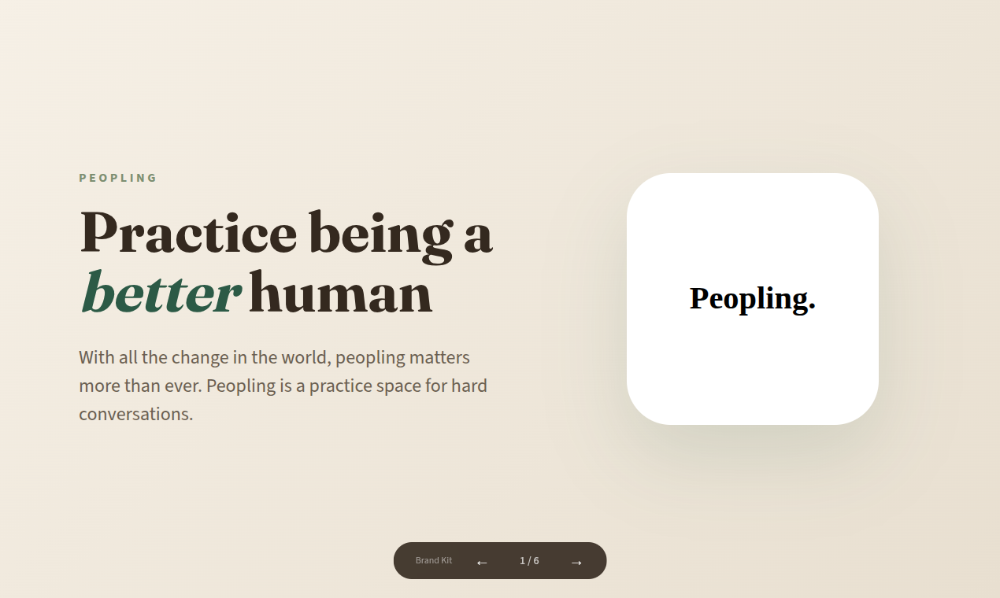
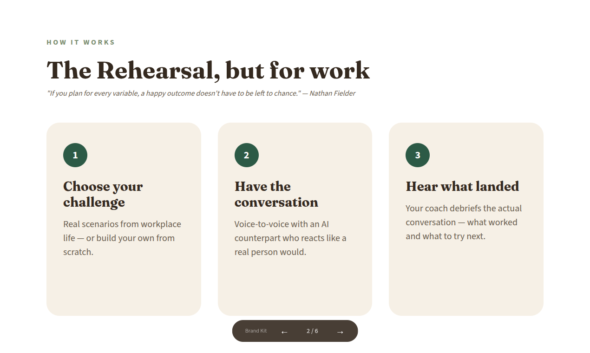
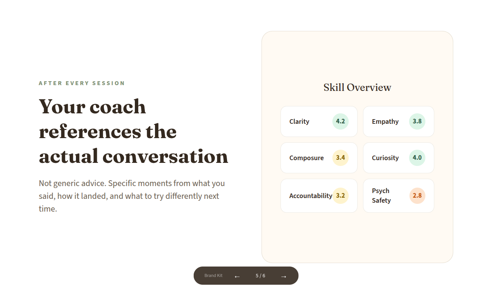

### 🎬 관련 영상
- [🎥 영상 보기](https://ph-files.imgix.net/033a6d6d-1f9e-4a9a-8fb7-4e5da90ba099.jpeg?auto=format)

---

## 9. [Pensieve](https://www.producthunt.com/products/pensieve-5)
**Votes**: 117 | **도입 난이도**: 중 | **신뢰도**: 중
**Tagline**: Full company context for every AI agent
**서비스 링크**: https://www.producthunt.com/r/PRBGFIPXUUR7T7

**태그**: AI, 자동화, 생산성, DevTool, Agent, AI Tool

### 📌 이 서비스 한눈에 보기
Pensieve는 AI 에이전트가 회사 전체의 맥락을 이해하도록 돕는 도구로, 복잡한 비즈니스 배경 설명 없이도 AI가 정확하게 작동하도록 지원합니다.

### 🔑 주요 기능
- AI 에이전트에게 필요한 회사 전체 맥락 제공
- 도구 연결을 통해 조직의 생생한 그림 구축
- Anthropic, OpenAI, Google inference와 호환

### 🙋 사용자에게 어떤 점이 좋은가
AI 에이전트가 프로젝트, 결정, 고객 관계 등을 종합적으로 이해하여 더욱 정확하고 효율적인 의사 결정을 내릴 수 있도록 돕습니다. 매번 반복되는 설명 없이 AI를 활용할 수 있습니다.

### ✅ 지금 바로 써볼 기능
- Anthropic, OpenAI, Google inference 중 하나 연결
- 회사 내 관련 도구 연결
- AI 에이전트에게 Pensieve 컨텍스트 활용 지시

### ⚠️ 사용 전 확인할 점
- AI 에이전트의 성능은 연결된 도구 및 데이터의 품질에 따라 달라질 수 있음
- 지원되는 inference 종류 확인 필요

### 🧭 확인이 더 필요한 정보
실제 사용 시 AI 에이전트의 성능 향상 정도 및 데이터 연결 복잡성에 대한 추가 확인이 필요합니다.

### 📸 스크린샷 및 갤러리

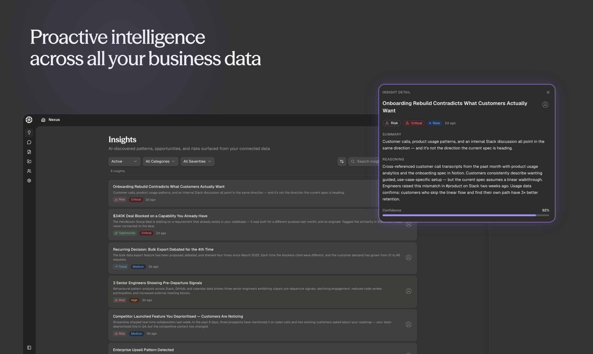
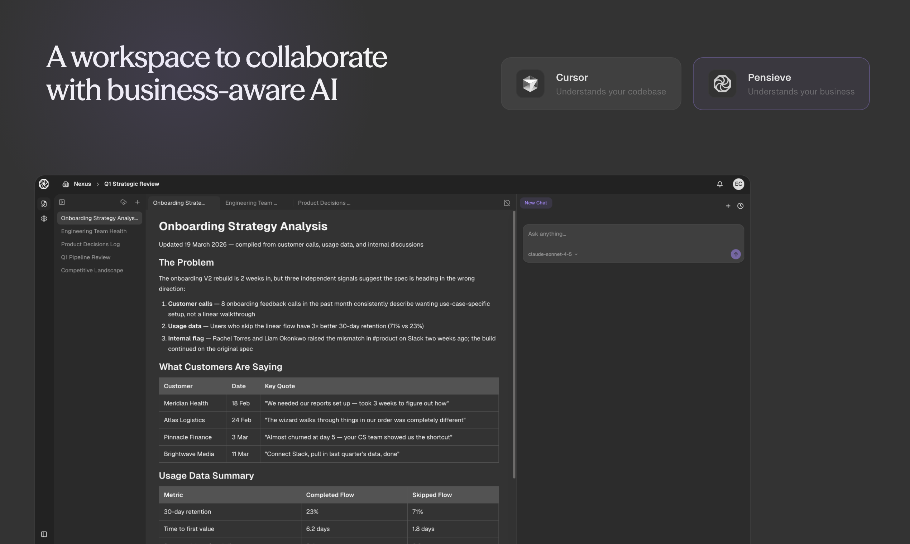

### 🎬 관련 영상
- [🎥 영상 보기](https://ph-files.imgix.net/a43513b4-f09e-4c8b-bd5b-1ec665b8fb45.jpeg?auto=format)

---

## 10. [GuideYou](https://www.producthunt.com/products/guideyou)
**Votes**: 106 | **도입 난이도**: 중 | **신뢰도**: 중
**Tagline**: Guidance for everyday technology
**서비스 링크**: https://www.producthunt.com/r/S4UARC4XPEXUKP

**태그**: 가이드, 기술 지원, 가족, 협업, AI Tool

### 📌 이 서비스 한눈에 보기
GuideYou는 가족들이 기술 사용 중 어려움을 겪을 때마다 전화하는 대신, 시각적인 단계별 가이드를 만들어 공유하여 문제를 해결할 수 있도록 돕습니다.

### 🔑 주요 기능
- 스크린샷 업로드 및 강조 기능으로 쉬운 가이드 제작
- 가족 작업 공간에서 가이드 공유 및 피드백 지원
- 모든 기기에서 사용 가능하며, 화면 변경 시 피드백 지원

### 🙋 사용자에게 어떤 점이 좋은가
가족 구성원이 기술 사용에 어려움을 겪을 때마다 반복적으로 설명하는 대신, GuideYou를 통해 한 번의 설명으로 문제를 해결하고 시간을 절약할 수 있습니다.

### ✅ 지금 바로 써볼 기능
- 가족들이 자주 묻는 기술 문제에 대한 가이드 제작
- 스크린샷을 활용하여 시각적인 가이드 만들기
- 가족 작업 공간을 설정하여 가이드 공유

### ⚠️ 사용 전 확인할 점
- 가이드 제작에 필요한 스크린샷 준비 필요
- 가족 구성원의 피드백을 반영하여 가이드 업데이트 필요

### 🧭 확인이 더 필요한 정보
GuideYou의 가족 작업 공간 기능이 실제 가족 구성원 간의 협업을 얼마나 효과적으로 지원하는지 확인이 필요합니다.

### 📸 스크린샷 및 갤러리

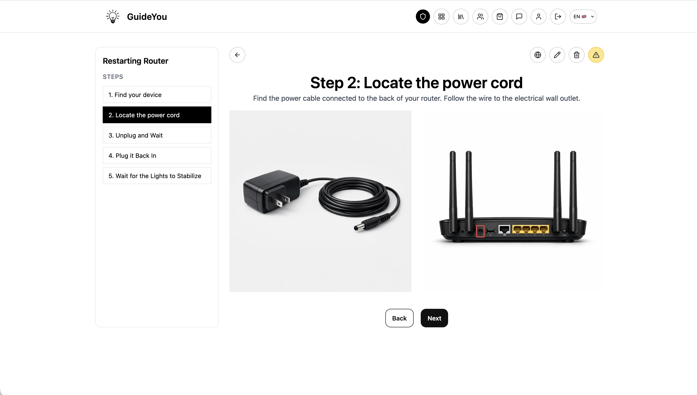
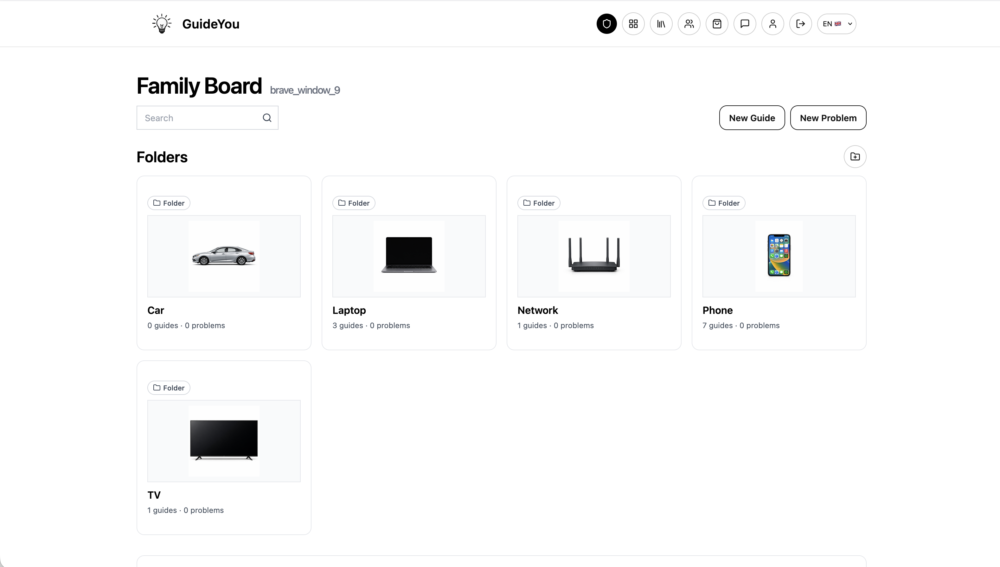

### 🎬 관련 영상
- [🎥 영상 보기](https://ph-files.imgix.net/7302c7de-ef7a-4e6e-b39c-ab5f19746e8b.jpeg?auto=format)

---

