# 🚀 Product Hunt Daily Top 10 (2026-03-31)

## 1. [Notion MCP](https://www.producthunt.com/products/notion-mcp)
**Votes**: 331 | **도입 난이도**: 중 | **신뢰도**: 중
**Tagline**: Your Notion workspace, inside every AI agent
**서비스 링크**: https://www.producthunt.com/r/4YOM25QCPRUPJB

**태그**: AI, Notion, Automation, Productivity, Workflow, Agent, AI Tool, Chat

### 📌 이 서비스 한눈에 보기
Notion MCP는 AI 에이전트가 Notion 워크스페이스에 직접 접근하여 실시간으로 데이터를 읽고 쓸 수 있게 해, 문서 생성, 작업 관리, 보고서 생성 등 자동화된 워크플로우를 구축하도록 돕습니다.

### 🔑 주요 기능
- ChatGPT, Claude, Cursor 등 AI 도구를 Notion 워크스페이스에 연결
- 실시간 읽기/쓰기 액세스 지원
- 문서 생성, 작업 관리, 보고서 생성 자동화

### 🙋 사용자에게 어떤 점이 좋은가
흩어져 있는 데이터를 활용하여 실행 가능한 워크플로우를 만들고, AI 에이전트를 통해 Notion 워크스페이스를 더욱 효율적으로 관리할 수 있습니다.

### ✅ 지금 바로 써볼 기능
- ChatGPT를 연결하여 문서 초안 자동 생성
- Claude를 사용하여 데이터베이스 기반 보고서 생성
- Cursor를 통해 코드 관련 문서 자동 업데이트

### ⚠️ 사용 전 확인할 점
- AI 에이전트의 접근 권한 설정 및 보안 관리 필요
- Notion 워크스페이스 구조에 따라 연동 효율성이 달라질 수 있음

### 🧭 확인이 더 필요한 정보
Notion MCP의 다양한 AI 도구 지원 범위 및 데이터 처리량에 대한 추가 정보 확인이 필요합니다.

### 📸 스크린샷 및 갤러리
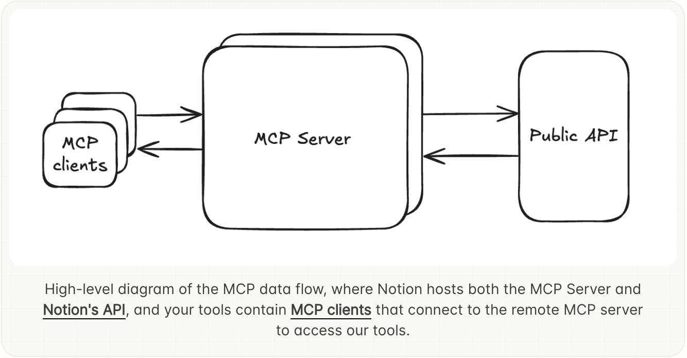
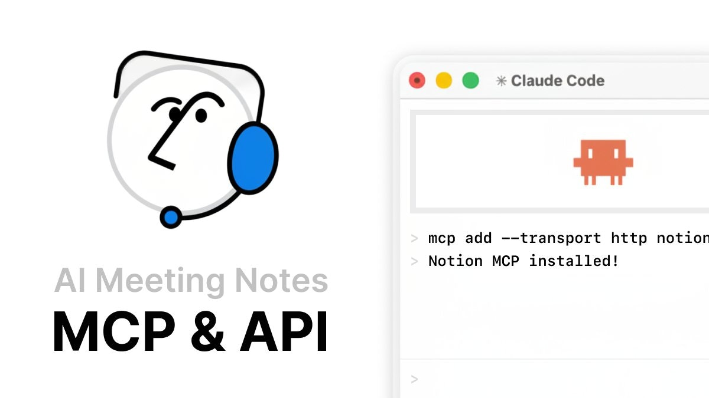
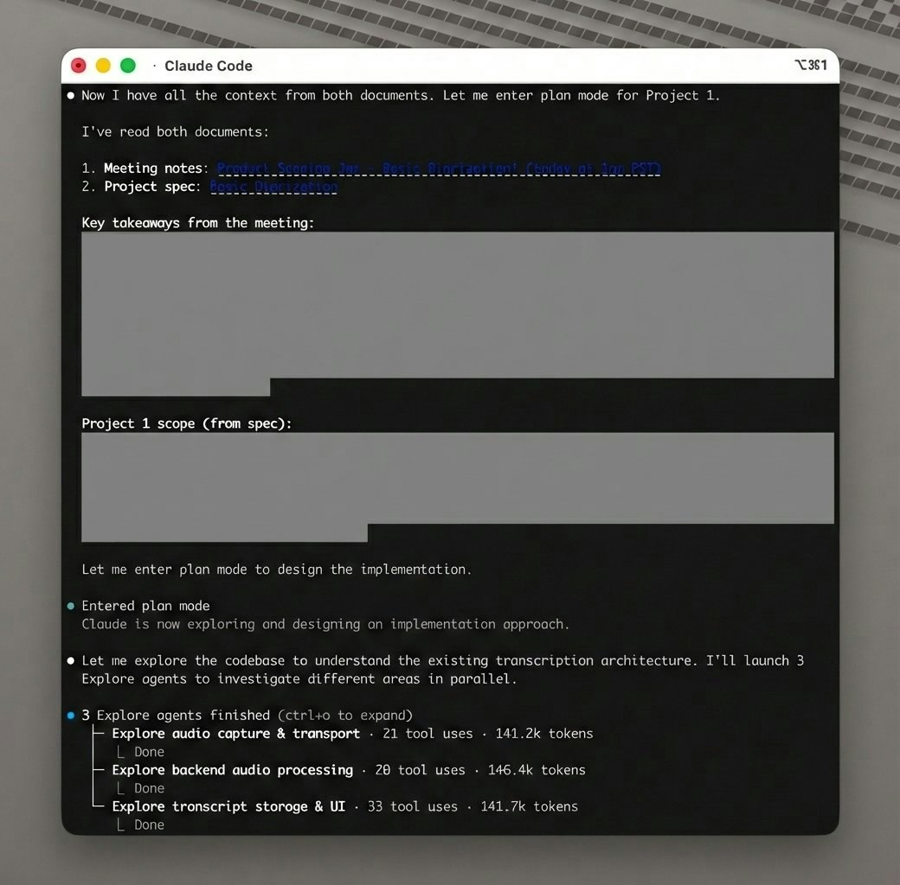

### 🎬 관련 영상
- [🎥 영상 보기](https://ph-files.imgix.net/a5070d17-74f2-48d0-b4a9-11e06e44926b.jpeg?auto=format)

---

## 2. [PopTask](https://www.producthunt.com/products/poptask-menu-bar-task-manager)
**Votes**: 229 | **도입 난이도**: 중 | **신뢰도**: 중
**Tagline**: Light menu bar task manager for quickly capturing tasks
**서비스 링크**: https://www.producthunt.com/r/4W5ACCCHTEADFO

**태그**: Task Management, Productivity, macOS, AI, Automation, AI Tool

### 📌 이 서비스 한눈에 보기
PopTask는 macOS 메뉴 막대에서 빠르게 작업을 캡처하고 관리할 수 있는 가벼운 작업 관리자입니다. 자연어 입력과 AI 기반 스케줄링을 지원하여 효율적인 작업 관리를 돕습니다.

### 🔑 주요 기능
- macOS 메뉴 막대에서 빠른 작업 캡처
- 자연어 입력 및 AI 기반 스케줄링 지원
- 7개 언어 지원 및 스마트 카운트다운 알림 제공

### 🙋 사용자에게 어떤 점이 좋은가
복잡한 설정 없이 자연어 입력을 통해 작업을 빠르게 추가하고 관리할 수 있어, 시간 관리 효율성을 높여줍니다. AI 기반 스케줄링은 작업 우선순위 결정에 도움을 줍니다.

### ✅ 지금 바로 써볼 기능
- 메뉴 막대에서 작업 추가해보기
- 자연어로 작업 내용 입력해보기
- 스마트 카운트다운 알림 설정해보기

### ⚠️ 사용 전 확인할 점
- macOS 26 이상에서 최적화되어 있으며, 이전 버전에서는 클라우드 지원 필요
- AI 스케줄링의 정확도는 사용 패턴에 따라 달라질 수 있음

### 🧭 확인이 더 필요한 정보
AI 스케줄링 기능의 정확도 및 사용자별 최적화 정도에 대한 추가 정보 확인이 필요합니다.

### 📸 스크린샷 및 갤러리
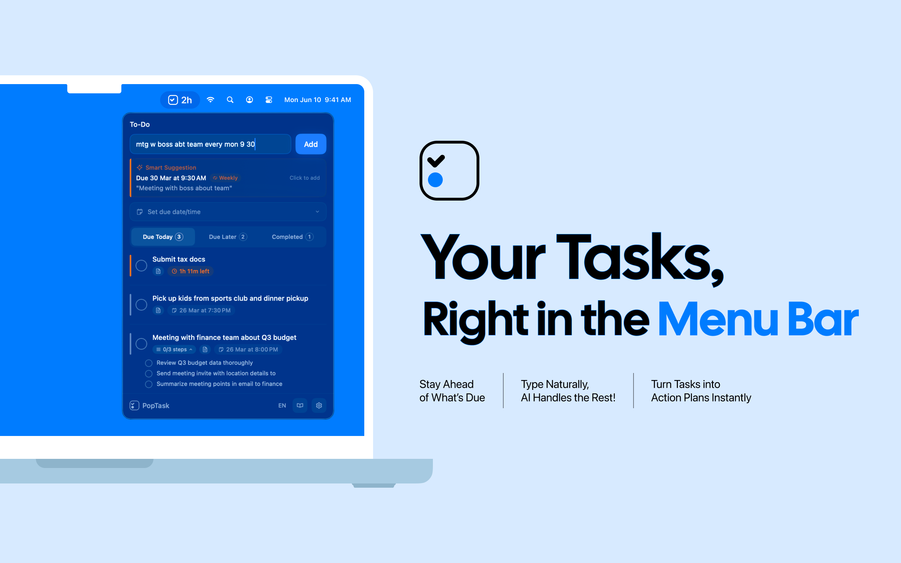
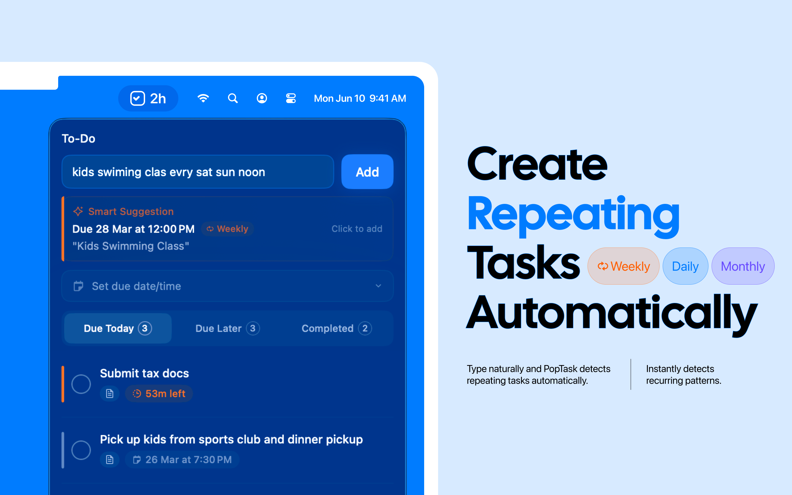
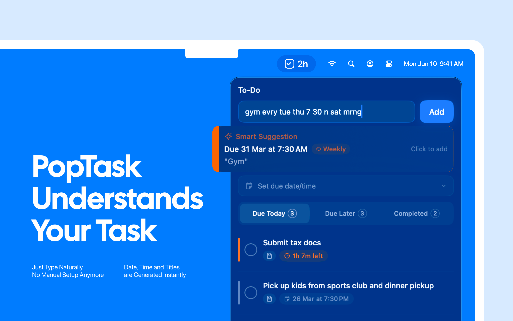

---

## 3. [Goals](https://www.producthunt.com/products/goals)
**Votes**: 198 | **도입 난이도**: 중 | **신뢰도**: 중
**Tagline**: AI turns your goal into one daily action.
**서비스 링크**: https://www.producthunt.com/r/45AIAQA2MKI7AG

**태그**: 생산성, AI, 목표 관리, 습관, AI Tool

### 📌 이 서비스 한눈에 보기
AI가 목표를 매일 실천 가능한 하나의 행동으로 바꿔주는 앱으로, 복잡한 계획 없이 꾸준히 목표를 달성하도록 돕습니다.

### 🔑 주요 기능
- AI 기반 목표 분해: 목표를 달성하기 위한 일일 실천 계획 자동 생성
- 단순한 인터페이스: 대시보드나 복잡한 작업 관리 없이 매일 할 일만 제시
- 지속적인 동기 부여: 스트릭 기능과 체크인을 통해 꾸준함 유지 및 계획 조정

### 🙋 사용자에게 어떤 점이 좋은가
목표 달성을 위해 무엇을 해야 할지 막막할 때, AI가 구체적인 일일 행동을 제시하여 꾸준히 실천하도록 도와줍니다. 복잡한 프로젝트 관리 없이도 목표를 향해 나아갈 수 있습니다.

### ✅ 지금 바로 써볼 기능
- 목표 입력 후 AI가 생성하는 일일 계획 확인
- 매일 제시되는 행동 완료 후 체크
- 스트릭 유지하며 꾸준히 목표 달성

### ⚠️ 사용 전 확인할 점
- AI가 생성하는 계획이 개인의 상황과 완전히 맞지 않을 수 있음
- 제시된 행동을 꾸준히 실천해야 효과를 볼 수 있음

### 🧭 확인이 더 필요한 정보
AI의 계획 정확도 및 개인별 맞춤 정도에 대한 추가 정보 확인이 필요합니다.

### 📸 스크린샷 및 갤러리

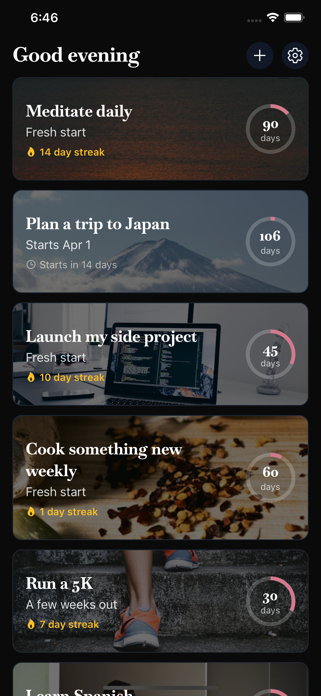

### 🎬 관련 영상
- [🎥 영상 보기](https://ph-files.imgix.net/27a98671-12ed-433b-aeeb-3fe33ef1802d.jpeg?auto=format)

---

## 4. [FreeCAD 1.1](https://www.producthunt.com/products/freecad-2)
**Votes**: 185 | **도입 난이도**: 중 | **신뢰도**: 중
**Tagline**: Extremely powerful, completely free 3D CAD modeling
**서비스 링크**: https://www.producthunt.com/r/GKBVMA7PP4ZOOQ

**태그**: 3D 모델링, CAD, CAM, FEA, 오픈소스

### 📌 이 서비스 한눈에 보기
FreeCAD 1.1은 강력한 무료 오픈소스 3D CAD 모델러의 대규모 업데이트로, 사용자 편의성을 크게 향상시키는 투명 미리보기, 인터랙티브 드래거, 새로운 CAM 도구 및 향상된 어셈블리 기능을 제공합니다.

### 🔑 주요 기능
- 투명 미리보기 기능으로 모델링 시각화 개선
- 인터랙티브 드래거로 직관적인 모델 편집 가능
- 새로운 CAM 도구로 제조 워크플로우 효율성 증대

### 🙋 사용자에게 어떤 점이 좋은가
FreeCAD 1.1은 3D 모델링, CAM, FEA 작업을 무료로 수행할 수 있게 해주며, 개선된 사용자 인터페이스와 새로운 기능으로 작업 효율성을 높여줍니다.

### ✅ 지금 바로 써볼 기능
- 투명 미리보기 기능으로 모델 시각화 경험 개선
- 인터랙티브 드래거를 사용하여 모델 편집 간소화
- 새로운 CAM 도구를 사용하여 제조 프로세스 최적화

### ⚠️ 사용 전 확인할 점
- 오픈소스 소프트웨어 특성상 커뮤니티 지원에 의존적임
- 고급 기능 사용 시 학습 곡선이 존재할 수 있음

### 🧭 확인이 더 필요한 정보
FreeCAD 1.1의 성능은 사용자의 하드웨어 사양 및 모델 복잡성에 따라 달라질 수 있습니다.

### 📸 스크린샷 및 갤러리

### 🎬 관련 영상
- [🎥 영상 보기](https://ph-files.imgix.net/5a19843f-c857-4c33-8364-9a191aa91485.jpeg?auto=format)

---

## 5. [Invoke](https://www.producthunt.com/products/invoke-studio)
**Votes**: 162 | **도입 난이도**: 중 | **신뢰도**: 중
**Tagline**: Agentic coding IDE with visual planning boards and canvas
**서비스 링크**: https://www.producthunt.com/r/MQ52L6PPBWZUA2

**태그**: IDE, AI 코딩, 자동화, 시각적 개발, DevTool, Agent, AI Tool, Design, API

### 📌 이 서비스 한눈에 보기
Invoke는 시각적 계획 도구와 캔버스를 갖춘 AI 코딩 IDE로, AI 에이전트를 활용해 코드 개발 과정을 자동화하고 시각적으로 관리할 수 있게 해줍니다.

### 🔑 주요 기능
- 시각적 계획 보드를 통해 기능 개발 과정을 시각적으로 설계하고 관리
- 캔버스에서 UI 디자인을 시각적으로 편집하고 실제 코드로 내보내기
- 다양한 AI 모델(Claude, OpenAI 등)과 연동하여 AI 코딩 에이전트 활용

### 🙋 사용자에게 어떤 점이 좋은가
코드 개발 과정을 시각화하여 관리하고, AI 에이전트를 통해 개발 효율성을 높일 수 있습니다. 특히 UI 디자인을 코드로 쉽게 변환할 수 있어 프론트엔드 개발에 유용합니다.

### ✅ 지금 바로 써볼 기능
- 보드를 사용하여 새로운 기능 개발 계획 세우기
- 캔버스에서 간단한 UI 디자인 후 코드 생성해보기
- 다양한 AI 모델을 연동하여 코드 자동 완성 기능 사용해보기

### ⚠️ 사용 전 확인할 점
- API 키를 직접 등록해야 사용 가능
- AI 모델의 성능에 따라 결과물의 품질이 달라질 수 있음

### 🧭 확인이 더 필요한 정보
AI 에이전트의 코드 생성 품질 및 다양한 AI 모델과의 호환성에 대한 사용자 리뷰 확인이 필요합니다.

### 📸 스크린샷 및 갤러리
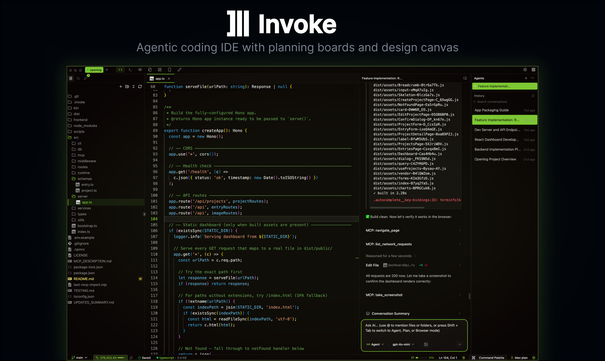
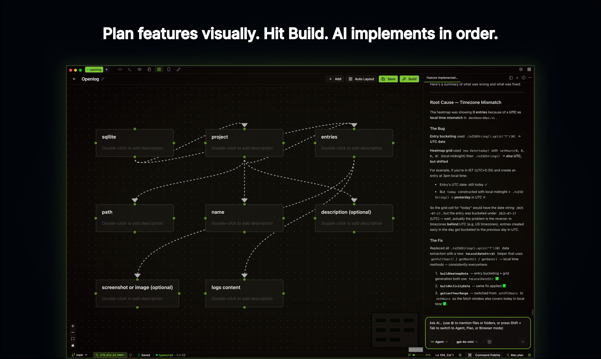
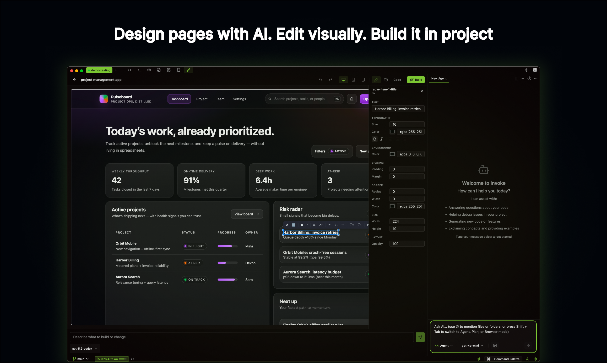

---

## 6. [Ollang DX](https://www.producthunt.com/products/ollang-mcp-skills-sdk-api)
**Votes**: 135 | **도입 난이도**: 중 | **신뢰도**: 중
**Tagline**: The AI Language Execution Layer for Enterprise
**서비스 링크**: https://www.producthunt.com/r/MEPNXW7UCHMMYB

**태그**: AI, Localization, DevTool, Automation, Agent, AI Tool, Video, API

### 📌 이 서비스 한눈에 보기
Ollang DX는 웹, 앱, 비디오, 오디오, 문서 등 다양한 형식의 콘텐츠를 AI 기반으로 현지화하는 플랫폼으로, 엔터프라이즈 환경에 최적화된 언어 실행 레이어를 제공합니다.

### 🔑 주요 기능
- MCP를 통해 AI 에이전트가 워크플로우 실행
- SKILLS를 활용하여 재사용 가능한 에이전트 액션 구축
- SDK를 사용하여 번역 스캔 및 적용

### 🙋 사용자에게 어떤 점이 좋은가
다양한 형식의 콘텐츠를 효율적으로 현지화하고, 개발자 통합을 통해 현지화 파이프라인을 간소화하여 시간과 비용을 절감할 수 있습니다.

### ✅ 지금 바로 써볼 기능
- MCP를 사용하여 AI 에이전트 워크플로우 테스트
- SKILLS를 활용하여 자주 사용하는 액션 자동화
- SDK를 통해 기존 프로젝트에 번역 기능 통합

### ⚠️ 사용 전 확인할 점
- AI 번역 품질은 콘텐츠 유형 및 언어 쌍에 따라 다를 수 있음
- API 통합 시 개발 리소스 필요

### 🧭 확인이 더 필요한 정보
AI 번역 품질 및 특정 언어 지원 여부에 대한 추가 확인이 필요합니다.

### 📸 스크린샷 및 갤러리

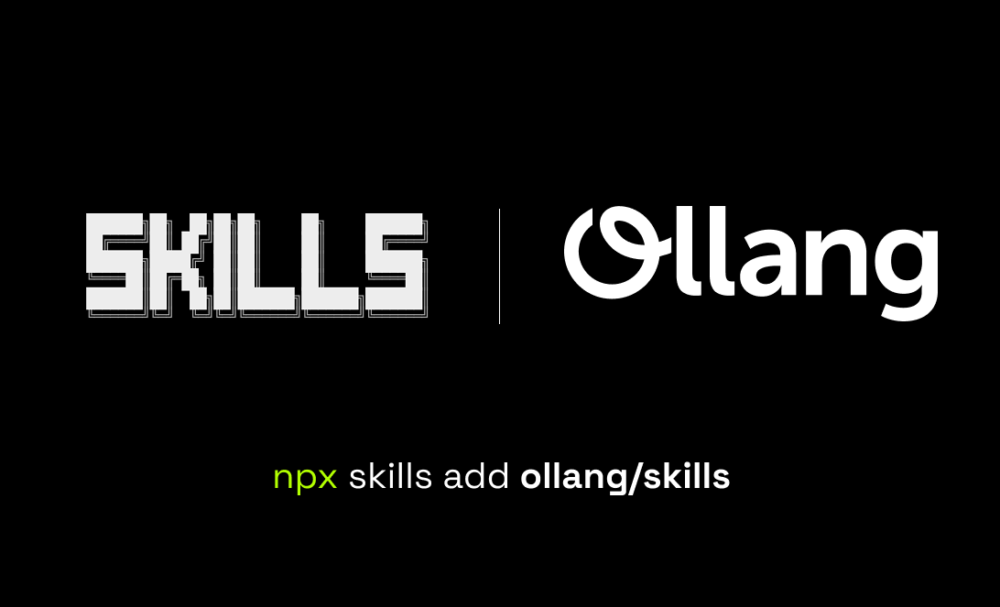
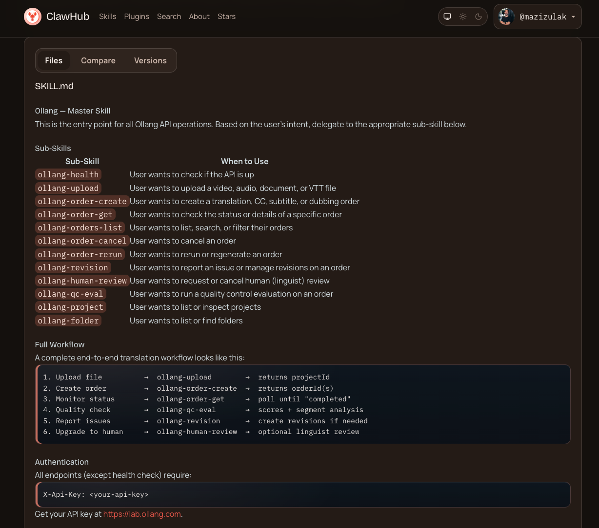

### 🎬 관련 영상
- [🎥 영상 보기](https://ph-files.imgix.net/fa37f197-9568-4080-920d-e725cfc6bbc2.jpeg?auto=format)

---

## 7. [Bluor AI](https://www.producthunt.com/products/bluor-ai)
**Votes**: 132 | **도입 난이도**: 중 | **신뢰도**: 중
**Tagline**: Beautiful emails, in seconds
**서비스 링크**: https://www.producthunt.com/r/HVSKZ7WWRMMLWN

**태그**: AI, 이메일 디자인, 자동화, 생산성, AI Tool, Prompting, Design, Email

### 📌 이 서비스 한눈에 보기
Bluor AI는 AI 기반 이메일 디자인 도구로, 몇 초 안에 아름답고 반응형 이메일을 만들어 시간을 절약해줍니다.

### 🔑 주요 기능
- AI 기반으로 빠른 이메일 디자인 생성
- 디자이너 없이도 브랜드에 맞는 아름다운 이메일 제작 가능
- 간단한 설명만으로 완성된 이메일 디자인 제공

### 🙋 사용자에게 어떤 점이 좋은가
이메일 디자인에 소요되는 시간을 획기적으로 줄여주고, 전문 디자이너 없이도 훌륭한 결과물을 얻을 수 있습니다.

### ✅ 지금 바로 써볼 기능
- 캠페인 설명을 입력하여 이메일 디자인 생성해보기
- 생성된 이메일 디자인의 반응성 확인하기
- 브랜드 스타일을 반영하여 이메일 디자인 커스터마이징하기

### ⚠️ 사용 전 확인할 점
- AI가 생성한 디자인이 완벽하게 사용자의 의도와 일치하지 않을 수 있음
- 세부적인 디자인 수정은 추가 작업이 필요할 수 있음

### 🧭 확인이 더 필요한 정보
AI가 생성하는 디자인의 품질이 사용자의 기대 수준을 충족하는지 확인이 필요합니다.

### 📸 스크린샷 및 갤러리
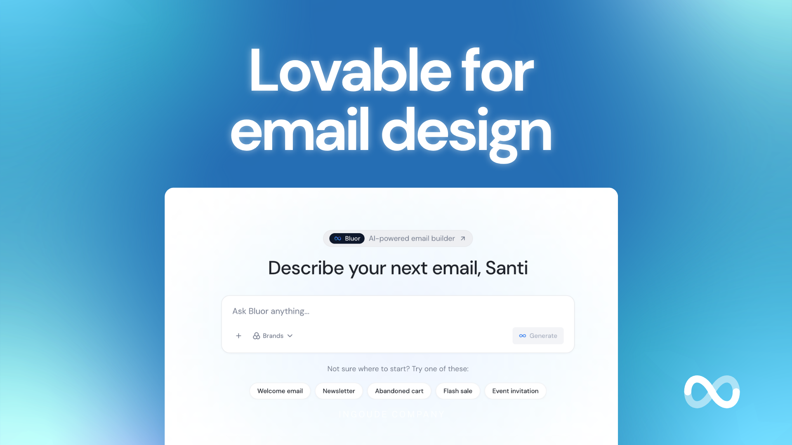

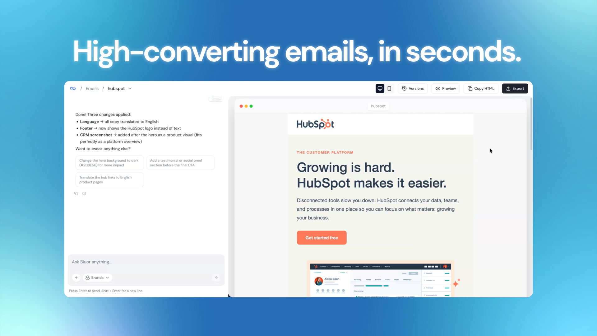

### 🎬 관련 영상
- [🎥 영상 보기](https://ph-files.imgix.net/816fdd78-8bc1-4bac-9632-ab4397107b43.jpeg?auto=format)

---

## 8. [Blood Sugar Journal](https://www.producthunt.com/products/blood-sugar-journal)
**Votes**: 132 | **도입 난이도**: 중 | **신뢰도**: 중
**Tagline**: AI-powered diabetes tracking for the modern era. 
**서비스 링크**: https://www.producthunt.com/r/GYDE7YMNIMXBQR

**태그**: 건강, AI, iOS, 당뇨, 데이터 분석, AI Tool, Design

### 📌 이 서비스 한눈에 보기
혈당 및 인슐린 데이터를 AI 기반으로 분석하여 개인 맞춤형 보고서를 제공, 당뇨 관리를 더 쉽고 효율적으로 만들어주는 iOS 앱.

### 🔑 주요 기능
- GPT-4o-mini AI를 활용한 데이터 분석 및 보고서 생성
- 빠르고 아름다운 디자인, iOS 26에 최적화
- iCloud를 통한 원활한 데이터 동기화

### 🙋 사용자에게 어떤 점이 좋은가
혈당 관리를 위한 복잡한 데이터를 AI가 분석하여 이해하기 쉬운 보고서로 제공하므로, 사용자는 자신의 상태를 더 명확하게 파악하고 효과적으로 관리할 수 있습니다.

### ✅ 지금 바로 써볼 기능
- 혈당 및 인슐린 데이터 입력하여 AI 보고서 확인
- iCloud 동기화 설정하여 데이터 백업 및 공유
- 개인 맞춤형 보고서 기반으로 식단 및 운동 계획 조정

### ⚠️ 사용 전 확인할 점
- AI 분석 결과는 참고용이며, 의료 전문가의 조언을 대체할 수 없음
- iOS 26 이상에서만 사용 가능

### 🧭 확인이 더 필요한 정보
AI 분석의 정확도 및 개인별 맞춤 정도에 대한 추가적인 사용 후기 확인이 필요합니다.

### 📸 스크린샷 및 갤러리
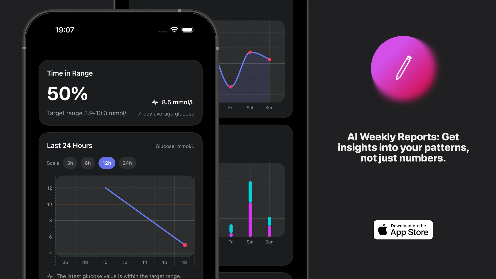
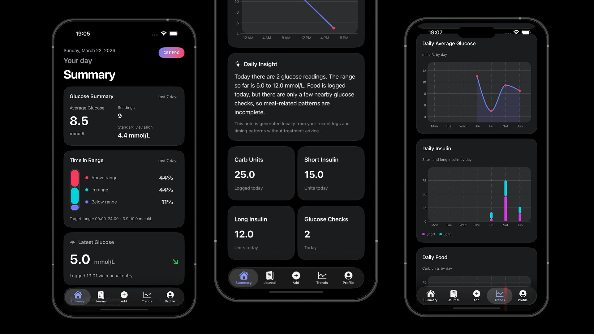

### 🎬 관련 영상
- [🎥 영상 보기](https://ph-files.imgix.net/c9c30cf5-e5b2-46fd-a429-1c99e03d73e5.jpeg?auto=format)

---

## 9. [Letterbook](https://www.producthunt.com/products/letterbook)
**Votes**: 121 | **도입 난이도**: 중 | **신뢰도**: 중
**Tagline**: AI support platform built for founders
**서비스 링크**: https://www.producthunt.com/r/LXC3Q4GVW5FIFZ

**태그**: AI, 고객 지원, 자동화, CRM, Agent, AI Tool, Email

### 📌 이 서비스 한눈에 보기
Letterbook은 데이터베이스와 Stripe 연동을 통해 AI 기반 고객 지원을 제공하여 Zendesk, Freshdesk, Intercom, Front 등의 기존 솔루션의 대안을 제시합니다.

### 🔑 주요 기능
- 데이터베이스 및 Stripe 연동
- AI 기반 티켓 해결
- 다양한 채널 지원 (이메일, 양식 등)

### 🙋 사용자에게 어떤 점이 좋은가
Letterbook을 사용하면 AI가 고객 지원 티켓을 자동으로 처리하므로, 창업자는 고객 지원 업무 부담을 줄이고 핵심 사업에 집중할 수 있습니다.

### ✅ 지금 바로 써볼 기능
- 데이터베이스 연동
- Stripe 연동
- AI 지원 에이전트 설정

### ⚠️ 사용 전 확인할 점
- AI 정확도에 대한 지속적인 모니터링 필요
- 데이터베이스 연동 시 보안 고려

### 🧭 확인이 더 필요한 정보
AI 지원 에이전트의 성능 및 사용자 만족도에 대한 추가적인 정보가 필요합니다.

### 📸 스크린샷 및 갤러리
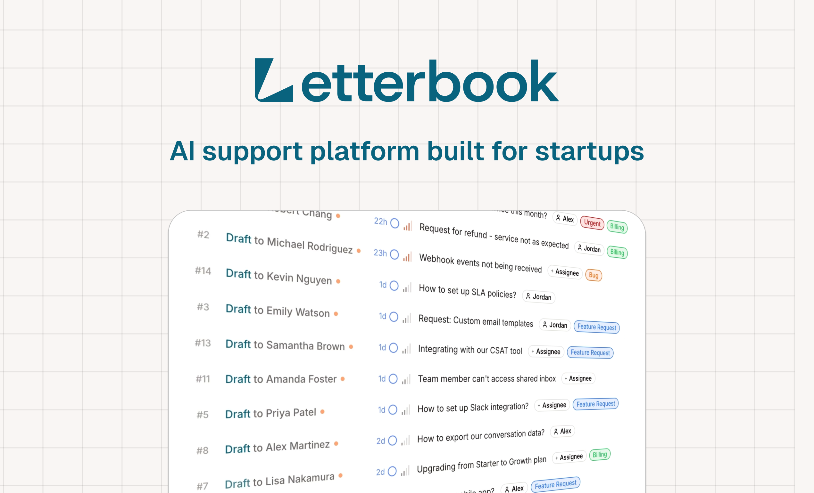
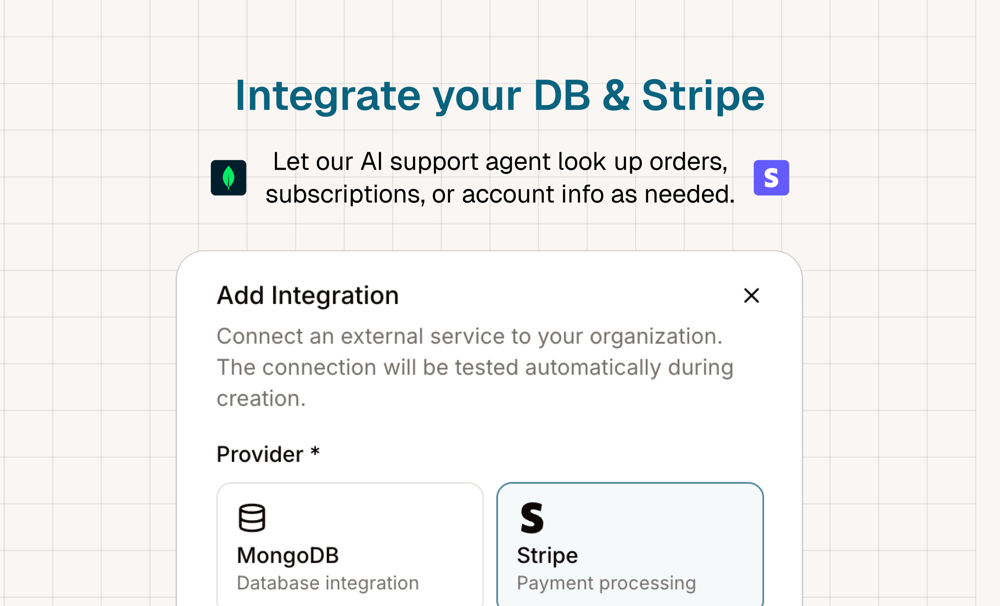
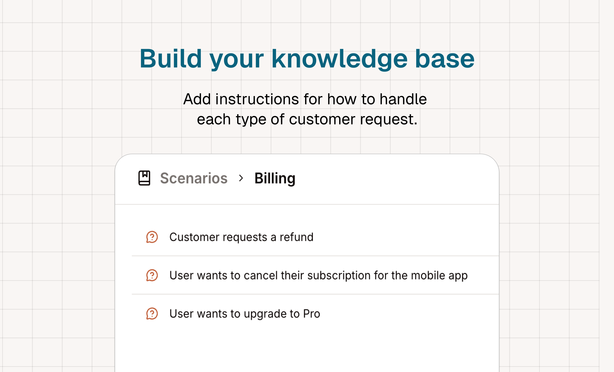

### 🎬 관련 영상
- [🎥 영상 보기](https://ph-files.imgix.net/8b02a89f-978d-4433-ac61-97c48feb0952.jpeg?auto=format)

---

## 10. [Git Blog](https://www.producthunt.com/products/git-blog)
**Votes**: 119 | **도입 난이도**: 중 | **신뢰도**: 중
**Tagline**: Publish sites using Markdown & GitHub from your phone
**서비스 링크**: https://www.producthunt.com/r/2MOLRZXFUBNCD4

**태그**: iOS, GitHub, Markdown, 블로깅, 정적 사이트, AI Tool, Vision

### 📌 이 서비스 한눈에 보기
이제 데스크톱이 없어도 괜찮습니다! Git Blog를 사용하면 아이폰에서 Markdown으로 작성된 글과 사진을 GitHub 저장소에 게시하여 Jekyll, Hugo 등 다양한 정적 사이트 설정을 지원할 수 있습니다.

### 🔑 주요 기능
- 아이폰에서 Markdown 포스트 작성 및 게시
- GitHub 저장소 지원 (Jekyll, Hugo, Eleventy, Astro, Next.js, Gatsby, Hexo 등)
- 이미지 리사이징 및 최적화, 오프라인 드래프트 지원

### 🙋 사용자에게 어떤 점이 좋은가
언제 어디서든 블로그 포스팅이 가능하며, 이동 중에도 간편하게 콘텐츠를 관리하고 게시할 수 있습니다. YAML front matter 템플릿 설정, 이미지 추가, 브랜치 푸시 또는 PR 열기 등의 작업을 아이폰에서 바로 처리할 수 있어 효율성을 높여줍니다.

### ✅ 지금 바로 써볼 기능
- 아이폰에 Git Blog 설치
- GitHub 저장소 연결
- Markdown 포스트 작성 및 게시

### ⚠️ 사용 전 확인할 점
- GitHub 저장소 접근 권한 설정 확인
- 이미지 업로드 시 데이터 사용량 확인

### 🧭 확인이 더 필요한 정보
다양한 정적 사이트 설정과의 호환성 및 이미지 최적화 수준에 대한 추가적인 사용 후기 확인이 필요합니다.

### 📸 스크린샷 및 갤러리
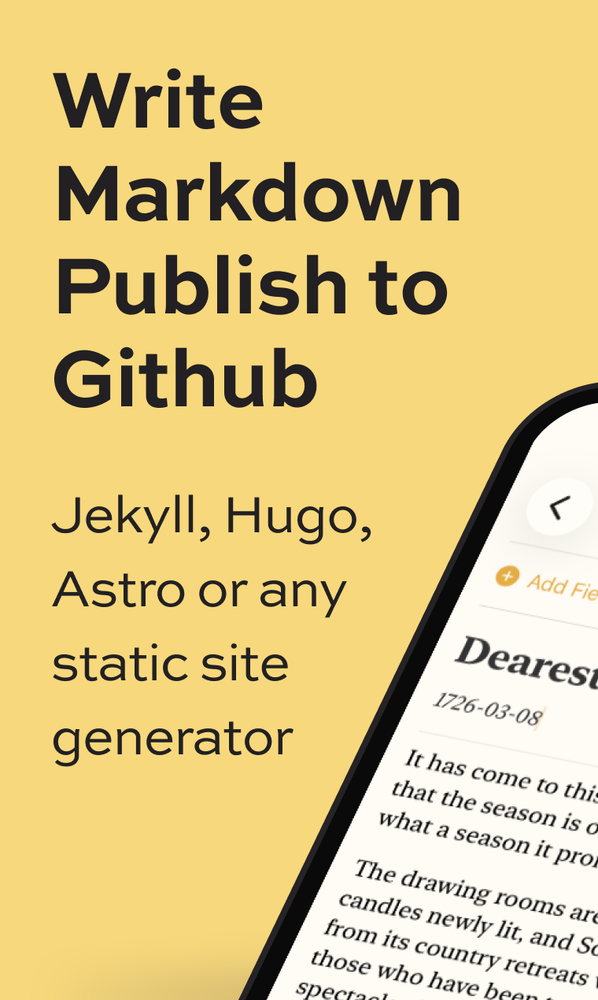

### 🎬 관련 영상
- [🎥 영상 보기](https://ph-files.imgix.net/dd248f29-3c17-4116-bc4c-7a7e7afd7784.jpeg?auto=format)

---

