# 🚀 Product Hunt Daily Top 10 (2026-04-01)

## 1. [Jupid](https://www.producthunt.com/products/jupid)
**Votes**: 441 | **도입 난이도**: 중 | **신뢰도**: 중
**Tagline**: File your taxes with Claude Code
**서비스 링크**: https://www.producthunt.com/r/IV445DDMYNBMML

**태그**: 세금, 자동화, 생산성, AI, LLM, DevTool

### 📌 이 서비스 한눈에 보기
Jupid는 Claude Code와 연동하여 은행 거래 내역을 분석, IRS Schedule C 양식에 맞춰 자동 분류하고 누락된 공제 항목을 찾아 세금 신고를 5분 만에 완료할 수 있도록 돕습니다.

### 🔑 주요 기능
- 은행 계좌 연동으로 거래 내역 자동 분류 및 학습
- IRS Schedule C 카테고리 매핑 정확도 약 96%
- 평균 연간 $1,249의 누락된 공제 항목 발견

### 🙋 사용자에게 어떤 점이 좋은가
개인 사업자나 프리랜서가 세금 신고 시 복잡한 거래 내역 분류 작업을 간소화하고, 놓치기 쉬운 공제 항목을 찾아 세금 절약에 도움을 받을 수 있습니다.

### ✅ 지금 바로 써볼 기능
- 무료 평가판 사용해보기
- 은행 계좌 연동하여 거래 내역 분석 시작하기
- Schedule C 자동 작성 기능 사용해보기

### ⚠️ 사용 전 확인할 점
- Claude Code 연동 필요
- 은행 계좌 정보 제공에 대한 보안 고려 필요

### 🧭 확인이 더 필요한 정보
제공된 Schedule C 카테고리 매핑 정확도가 모든 사용자에게 동일하게 적용될지는 추가 확인이 필요합니다.

### 📸 스크린샷 및 갤러리
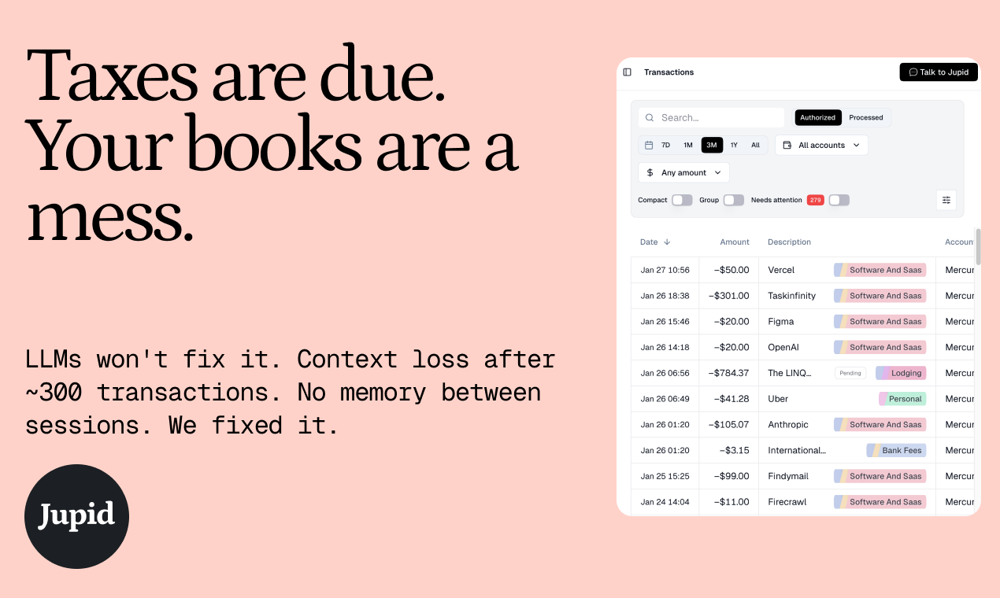
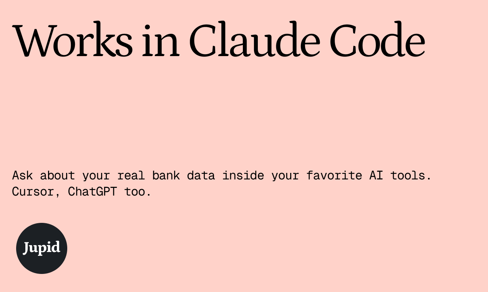
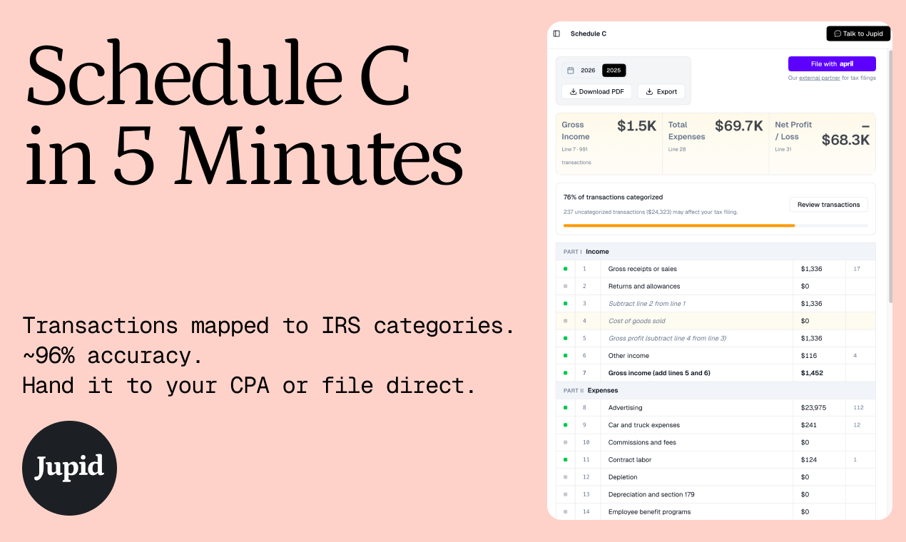

### 🎬 관련 영상
- [🎥 영상 보기](https://ph-files.imgix.net/d5339c26-7688-47a3-912c-f9327d1c05b1.jpeg?auto=format)

---

## 2. [Computer Use in Claude Code](https://www.producthunt.com/products/claude)
**Votes**: 297 | **도입 난이도**: 중 | **신뢰도**: 중
**Tagline**: Let Claude use your computer from the CLI
**서비스 링크**: https://www.producthunt.com/r/YWBXBLA4J4FAAV
**재등장**: 최근 7일 내 재등장 (마지막 등장 5일 전)

**태그**: CLI, Automation, macOS, DevTool, AI

### 📌 이 서비스 한눈에 보기
Claude Code CLI에서 컴퓨터를 사용하여 앱을 열고, 클릭하고, 타이핑하고, 화면을 볼 수 있게 해주는 macOS용 도구입니다.

### 🔑 주요 기능
- Claude Code CLI에서 컴퓨터 사용 가능
- macOS에서 앱 열기, 클릭, 타이핑, 화면 보기 지원
- GUI 기반 도구 자동화 및 네이티브 앱 테스트 가능

### 🙋 사용자에게 어떤 점이 좋은가
터미널을 벗어나지 않고도 GUI 기반 도구를 자동화하고 네이티브 앱을 테스트하여 개발 생산성을 높일 수 있습니다. 특히 시각적 문제 디버깅에 유용합니다.

### ✅ 지금 바로 써볼 기능
- Claude Code CLI 설치 및 설정
- macOS에서 컴퓨터 사용 권한 부여
- GUI 자동화 스크립트 작성 및 실행

### ⚠️ 사용 전 확인할 점
- macOS 환경에서만 동작
- Claude Code CLI 호환성 확인 필요

### 🧭 확인이 더 필요한 정보
Claude Code CLI의 컴퓨터 사용 기능이 다른 운영체제에서도 지원될지 여부는 불확실합니다.

### 📸 스크린샷 및 갤러리
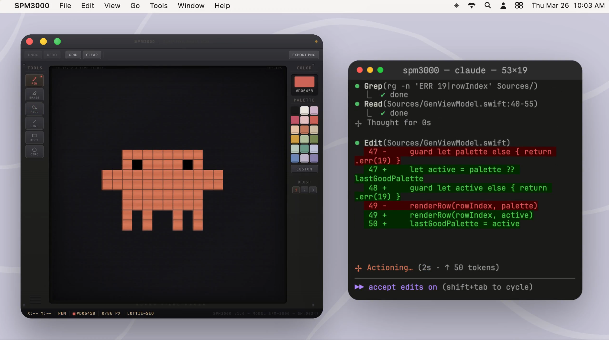
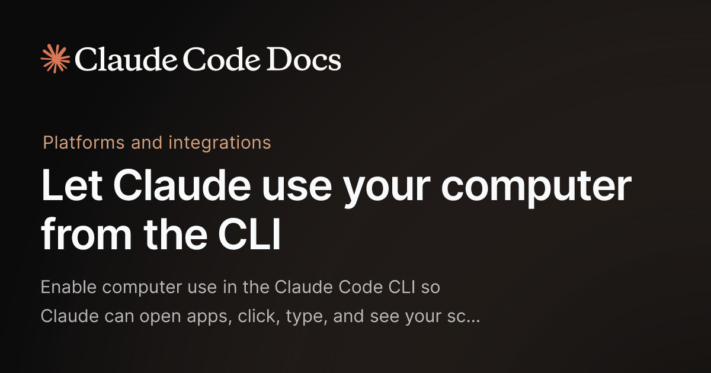
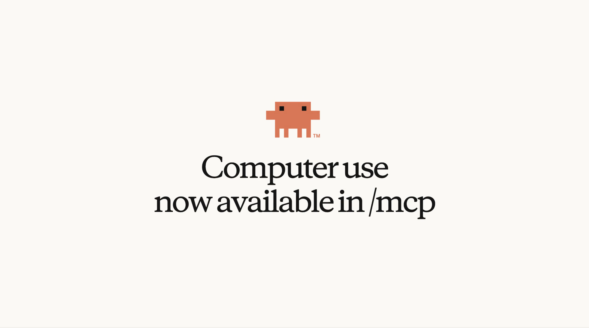

---

## 3. [Pixero AI ](https://www.producthunt.com/products/pixero-ai-2)
**Votes**: 245 | **도입 난이도**: 중 | **신뢰도**: 중
**Tagline**: OpenClaw for AI Ads
**서비스 링크**: https://www.producthunt.com/r/IHF5OGGMBRR6XW

**태그**: AI, 광고, 자동화, Meta Ads, 마케팅, Agent, AI Tool

### 📌 이 서비스 한눈에 보기
Pixero AI는 웹사이트 URL만 입력하면 AI 에이전트가 Meta 광고 캠페인을 자동으로 생성, 배포 및 관리하여 광고 운영을 간소화합니다.

### 🔑 주요 기능
- URL 기반 Meta 광고 캠페인 자동 생성
- 최신 AI 모델을 활용한 광고 제작
- 캠페인 전략 수립, 광고 배포 및 관리 자동화

### 🙋 사용자에게 어떤 점이 좋은가
Meta 광고 캠페인 운영에 드는 시간과 노력을 절약하고, AI 기반 최적화를 통해 광고 효율을 높일 수 있습니다.

### ✅ 지금 바로 써볼 기능
- 웹사이트 URL을 입력하여 Meta 광고 캠페인 자동 생성 시작
- 생성된 광고 캠페인 성과 모니터링
- AI 에이전트의 캠페인 관리 기능 활용

### ⚠️ 사용 전 확인할 점
- AI가 생성한 광고가 브랜드 이미지와 일치하는지 확인 필요
- Meta 광고 정책 준수 여부 확인 필요

### 🧭 확인이 더 필요한 정보
AI 광고 생성 모델의 성능 및 최적화 수준에 대한 추가 정보 확인이 필요합니다.

### 📸 스크린샷 및 갤러리
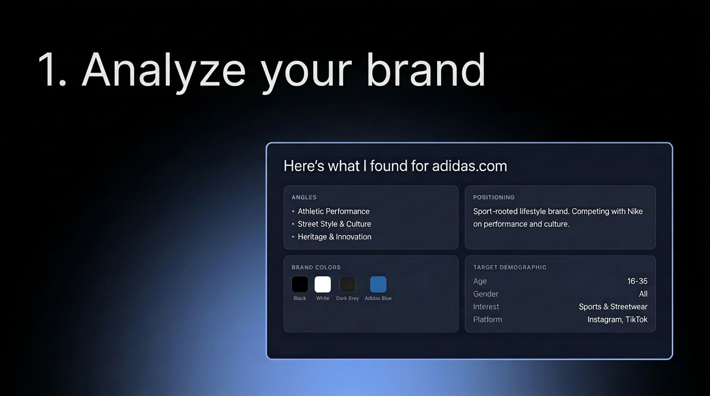
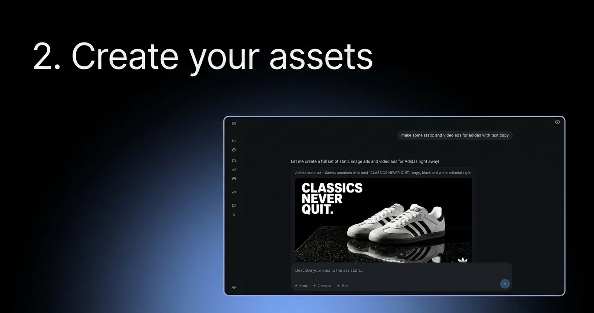
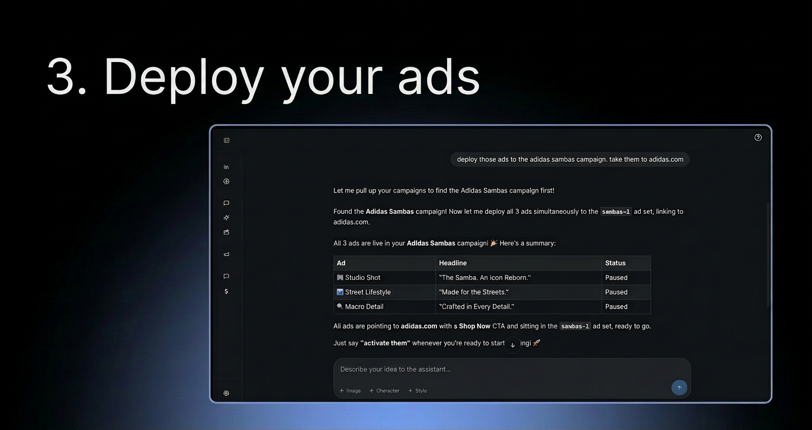

### 🎬 관련 영상
- [🎥 영상 보기](https://ph-files.imgix.net/8e36822a-935d-4c35-a319-95ddf28648b0.jpeg?auto=format)

---

## 4. [Solvea ](https://www.producthunt.com/products/solvea)
**Votes**: 193 | **도입 난이도**: 중 | **신뢰도**: 중
**Tagline**: Create your AI receptionist that answers, books, and sells
**서비스 링크**: https://www.producthunt.com/r/SVOAF72B37H7V5

**태그**: AI, 고객 지원, 자동화, 챗봇, 예약 관리, AI Tool, Chat, Sales, Email

### 📌 이 서비스 한눈에 보기
Solvea는 코딩 없이 AI 비서를 만들어 고객 지원, 판매, 예약 관리를 자동화하는 올인원 플랫폼입니다.

### 🔑 주요 기능
- 24/7 고객 응대: 전화, 채팅, 이메일을 통해 연중무휴 고객 응대가 가능합니다.
- 문맥 파악 및 실행: 단순 챗봇과 달리 문맥을 기억하고 필요한 조치를 취합니다.
- 쉬운 설정: 코딩 없이 원하는 기능을 설명만 하면 AI 비서를 빠르게 구축할 수 있습니다.

### 🙋 사용자에게 어떤 점이 좋은가
Solvea를 통해 고객 응대 시간을 줄이고, 놓치는 고객 없이 효율적인 비즈니스 운영이 가능합니다. 특히 소규모 사업자나 1인 기업에게 유용합니다.

### ✅ 지금 바로 써볼 기능
- AI 비서 구축 후 고객 지원 자동화
- 상품 추천 및 판매 기능 설정
- 예약 관리 기능 연동

### ⚠️ 사용 전 확인할 점
- AI가 모든 질문에 정확하게 답변하지 못할 수 있으므로, 답변 정확도 모니터링이 필요합니다.
- 복잡한 문의는 AI가 처리하지 못할 수 있으므로, 담당자 연결 기능을 준비해야 합니다.

### 🧭 확인이 더 필요한 정보
Solvea의 AI가 얼마나 다양한 산업 분야의 고객 문의를 효과적으로 처리할 수 있는지 확인이 필요합니다.

### 📸 스크린샷 및 갤러리
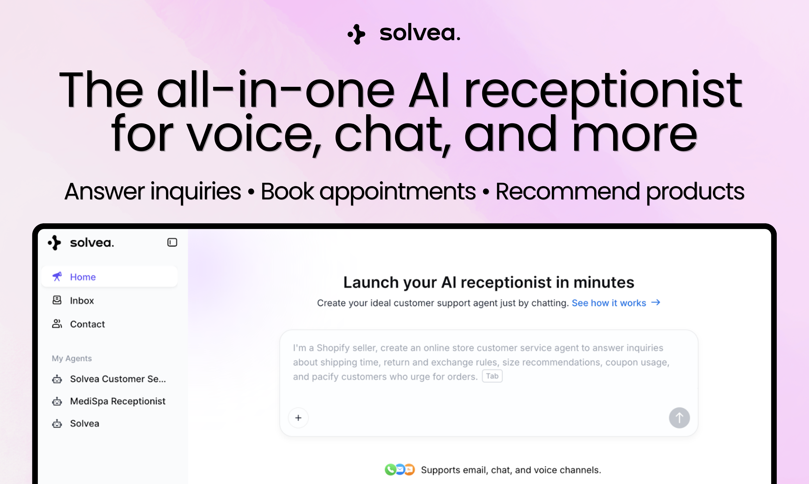
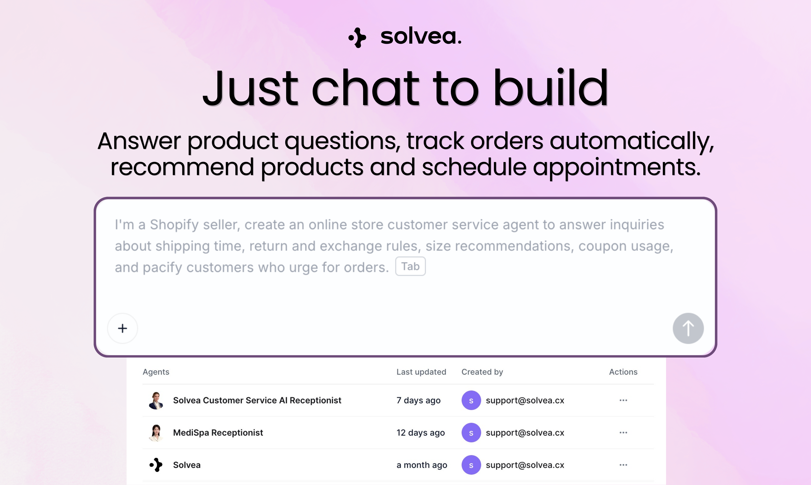
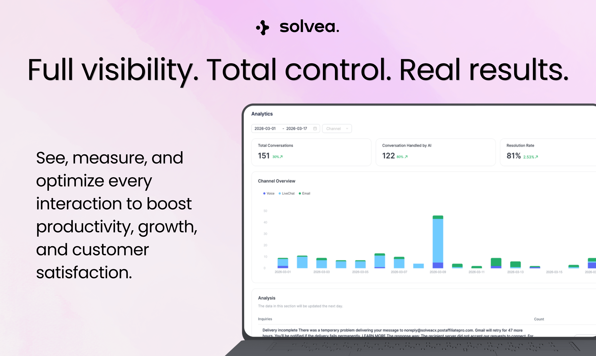

### 🎬 관련 영상
- [🎥 영상 보기](https://ph-files.imgix.net/2a6ea654-46a0-4128-848a-92f451fd96a9.jpeg?auto=format)

---

## 5. [Perplexity API Platform](https://www.producthunt.com/products/perplexity-api-platform)
**Votes**: 182 | **도입 난이도**: 중 | **신뢰도**: 중
**Tagline**: Power your products with web-wide research, Q&A capabilities
**서비스 링크**: https://www.producthunt.com/r/MWZV3JIB2USTR4

**태그**: API, 검색, Q&A, 개발 도구, Agent, DevTool

### 📌 이 서비스 한눈에 보기
Perplexity API 플랫폼은 웹 전체를 대상으로 하는 연구 및 Q&A 기능을 제품에 통합할 수 있도록 지원하며, 여러 공급업체의 모델 접근, 실시간 검색, 최첨단 임베딩을 제공하여 개발자가 여러 벤더를 연결할 필요 없이 하나의 API 키로 모든 기능을 사용할 수 있도록 합니다.

### 🔑 주요 기능
- 2000억 개 이상의 URL에 대한 실시간 검색 기능 제공
- 다양한 모델 공급업체에 대한 통합 접근 방식
- 단일 API 키로 모든 기능 사용 가능

### 🙋 사용자에게 어떤 점이 좋은가
개발자는 여러 서비스를 통합하는 번거로움 없이 웹 기반 연구 및 Q&A 기능을 제품에 쉽게 추가할 수 있으며, 시간과 비용을 절약할 수 있습니다.

### ✅ 지금 바로 써볼 기능
- API 문서 확인
- 무료 평가판 사용
- 지원팀에 문의

### ⚠️ 사용 전 확인할 점
- API 사용량에 따른 비용 발생 가능성
- 특정 모델 공급업체의 성능에 의존적일 수 있음

### 🧭 확인이 더 필요한 정보
제공되는 모델의 종류와 성능, 그리고 API 사용량에 따른 정확한 비용 구조에 대한 추가 정보가 필요합니다.

### 📸 스크린샷 및 갤러리
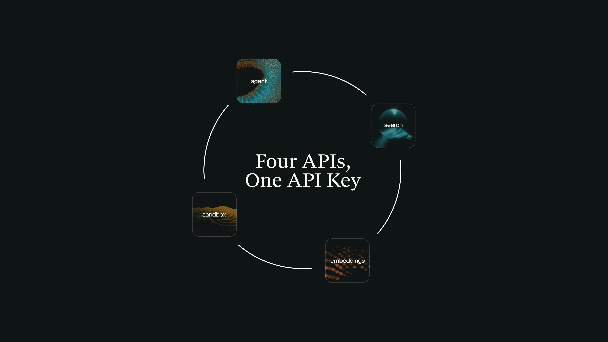
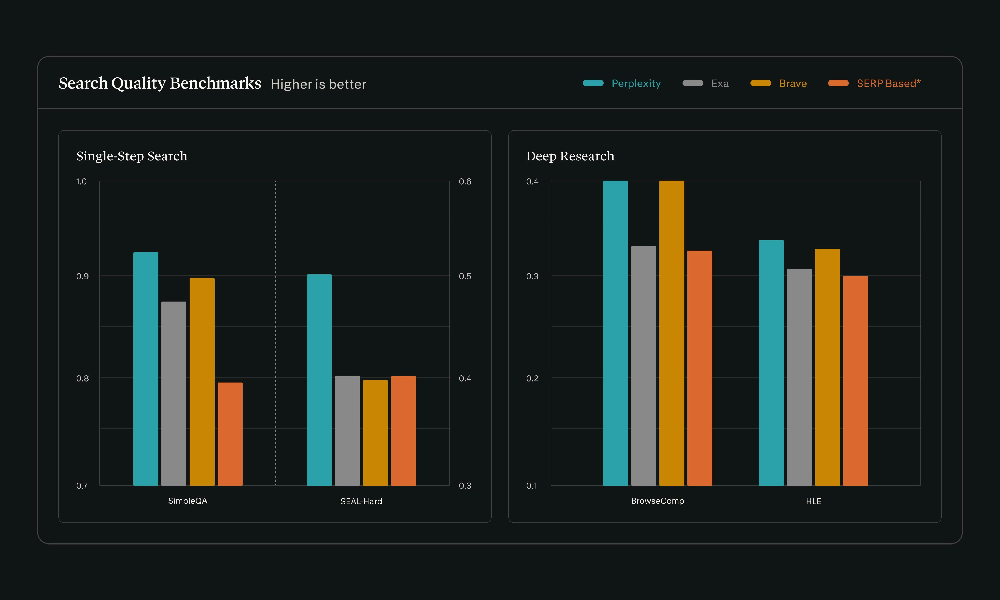
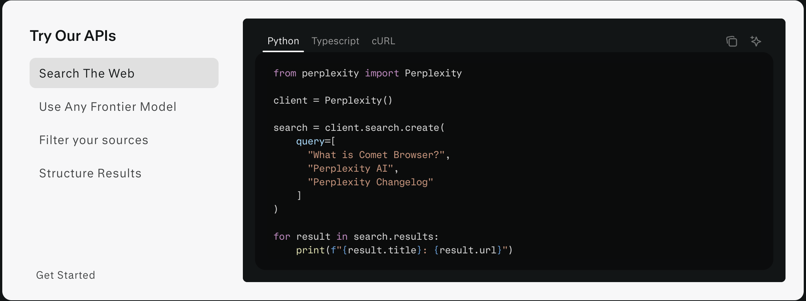

---

## 6. [Viktor for Media Buyers](https://www.producthunt.com/products/viktor)
**Votes**: 169 | **도입 난이도**: 중 | **신뢰도**: 중
**Tagline**: Manages your Meta and Google Ads from Slack
**서비스 링크**: https://www.producthunt.com/r/IXUJIJJPMNXYK5

**태그**: AI, 광고 자동화, Slack, Meta Ads, Google Ads, AI Tool

### 📌 이 서비스 한눈에 보기
Viktor는 Slack에서 Meta 및 Google Ads를 관리하여 미디어 바이어가 광고 운영을 간소화하고 효율성을 높일 수 있도록 돕는 AI 협업 도구입니다.

### 🔑 주요 기능
- Slack에서 Meta 및 Google Ads 계정을 통합 관리
- AI 기반으로 광고 세트 일시 중지, 확장, 예산 조정 등 자동화
- Meta Ads 103개, Google Ads 37개 액션 지원

### 🙋 사용자에게 어떤 점이 좋은가
Slack에서 광고 캠페인을 실시간으로 관리하고, 여러 플랫폼 간 예산 조정 및 보고서 작성을 간편하게 만들어 광고 운영 효율성을 극대화합니다.

### ✅ 지금 바로 써볼 기능
- Slack에서 광고 세트 일시 중지 기능 사용해보기
- Slack에서 예산 조정 기능 사용해보기
- Slack에서 보고서 내보내기 기능 사용해보기

### ⚠️ 사용 전 확인할 점
- 실제 쓰기 권한을 가지므로 신중한 사용 필요
- 지원하는 액션 목록 및 사용법 숙지 필요

### 🧭 확인이 더 필요한 정보
Viktor의 AI가 광고 운영에 미치는 실제 효과 및 최적화 수준은 사용 환경에 따라 달라질 수 있습니다.

### 📸 스크린샷 및 갤러리

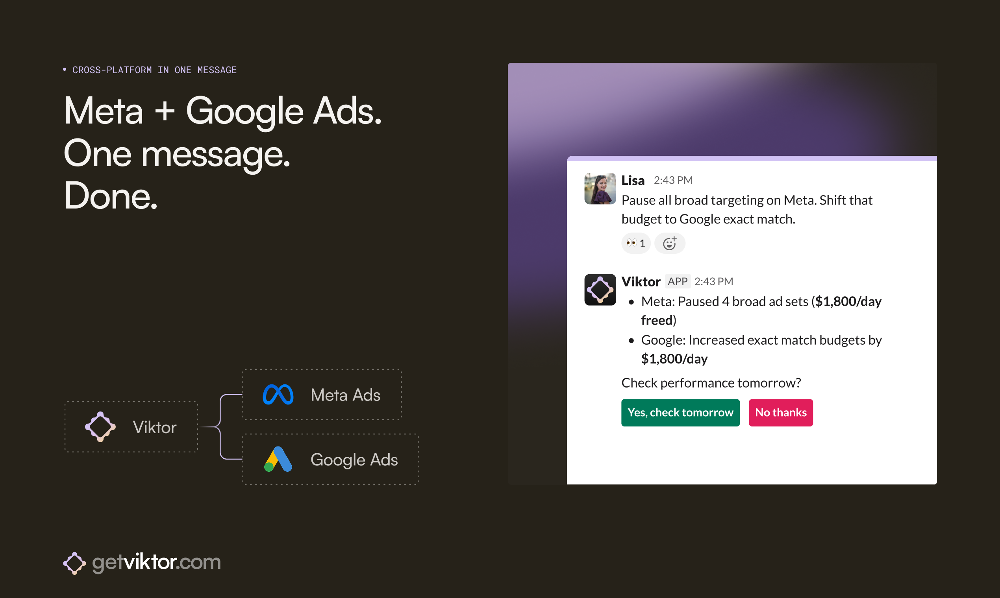
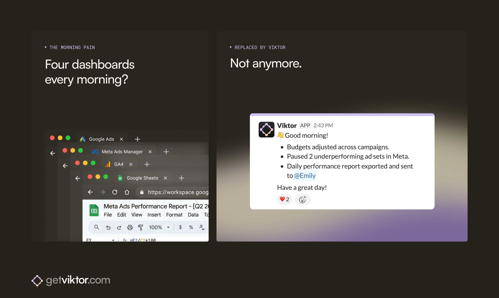

### 🎬 관련 영상
- [🎥 영상 보기](https://ph-files.imgix.net/61a01434-85c6-4525-b13c-af1ee16cae24.jpeg?auto=format)

---

## 7. [Stamp](https://www.producthunt.com/products/stamp-4)
**Votes**: 136 | **도입 난이도**: 중 | **신뢰도**: 중
**Tagline**: The AI Secretary that thinks, writes, and works like you
**서비스 링크**: https://www.producthunt.com/r/4RAU4J3ROHBGQ7

**태그**: AI 비서, 자동화, 생산성, 이메일, 캘린더, AI Tool, Email

### 📌 이 서비스 한눈에 보기
Stamp는 사용자의 스타일과 맥락을 학습하여 이메일과 캘린더 관리를 자동화해주는 AI 비서입니다.

### 🔑 주요 기능
- 개인화된 AI 비서: 사용자의 선호도를 학습하여 맞춤형으로 작동
- 이메일 및 캘린더 관리 자동화: 사용자의 스타일을 반영하여 업무 처리
- 무료 시작: 모든 이메일 환경에서 사용 가능

### 🙋 사용자에게 어떤 점이 좋은가
Stamp를 사용하면 이메일과 캘린더 관리에 소요되는 시간을 절약하고, 개인 비서처럼 업무를 처리할 수 있어 생산성을 높일 수 있습니다. 무료로 시작하여 AI 비서의 편리함을 경험해보세요.

### ✅ 지금 바로 써볼 기능
- Stamp를 설치하고 이메일 계정을 연결하여 시작하기
- Stamp에게 자주 사용하는 이메일 스타일과 캘린더 설정을 학습시키기
- Stamp가 제안하는 이메일 초안 및 캘린더 일정을 검토하고 수정하여 정확도 높이기

### ⚠️ 사용 전 확인할 점
- AI가 사용자의 스타일을 완전히 이해하기까지 시간이 걸릴 수 있음
- 개인 정보 보호 및 보안에 대한 고려 필요

### 🧭 확인이 더 필요한 정보
Stamp의 장기적인 성능 및 사용자 만족도에 대한 추가적인 정보가 필요합니다.

### 📸 스크린샷 및 갤러리
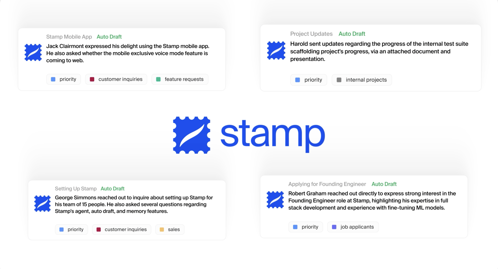
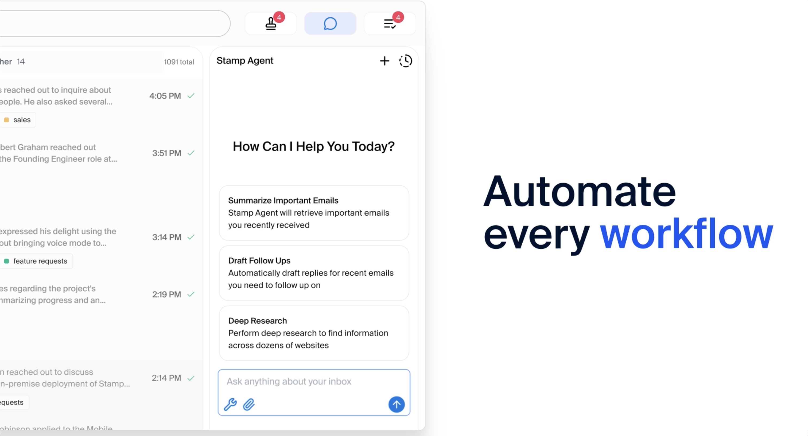
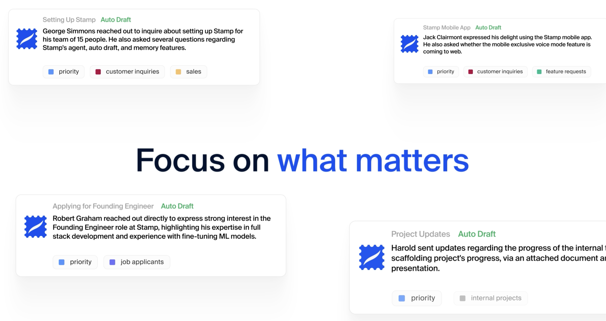

### 🎬 관련 영상
- [🎥 영상 보기](https://ph-files.imgix.net/dd459b7b-d397-48ac-bcda-5080ddb8a89b.jpeg?auto=format)

---

## 8. [Metabase Data Studio](https://www.producthunt.com/products/metabase)
**Votes**: 126 | **도입 난이도**: 중 | **신뢰도**: 상
**Tagline**: Build the semantic layer that makes AI analytics trustworthy
**서비스 링크**: https://www.producthunt.com/r/DAWGQLW755STHZ

**태그**: AI, Analytics, Data Studio, Semantic Layer, AI Tool

### 📌 이 서비스 한눈에 보기
Metabase Data Studio는 AI 분석의 신뢰성을 높이기 위해 메트릭, 세그먼트, 비즈니스 로직을 통합 정의하는 시맨틱 레이어를 구축할 수 있는 분석가 워크벤치입니다.

### 🔑 주요 기능
- SQL 또는 Python을 사용하여 데이터 변환
- 변경 사항 적용 전 종속성 확인
- 신뢰할 수 있는 정보 라이브러리 게시

### 🙋 사용자에게 어떤 점이 좋은가
AI 분석 및 모든 사용자가 '활성 사용자' 또는 '수익'과 같은 지표를 명확하게 이해하도록 도와 신뢰성 있는 답변을 얻을 수 있게 합니다.

### ✅ 지금 바로 써볼 기능
- 메트릭 정의
- SQL 또는 Python을 사용한 데이터 변환
- 라이브러리에 신뢰할 수 있는 정보 게시

### ⚠️ 사용 전 확인할 점
- 정의된 시맨틱 레이어가 없는 경우 AI 분석 결과의 신뢰성이 떨어질 수 있음
- SQL 또는 Python에 대한 지식이 필요할 수 있음

### 🧭 확인이 더 필요한 정보
제공된 설명 외에 특정 데이터 소스와의 호환성 정보는 추가 확인이 필요합니다.

### 📸 스크린샷 및 갤러리
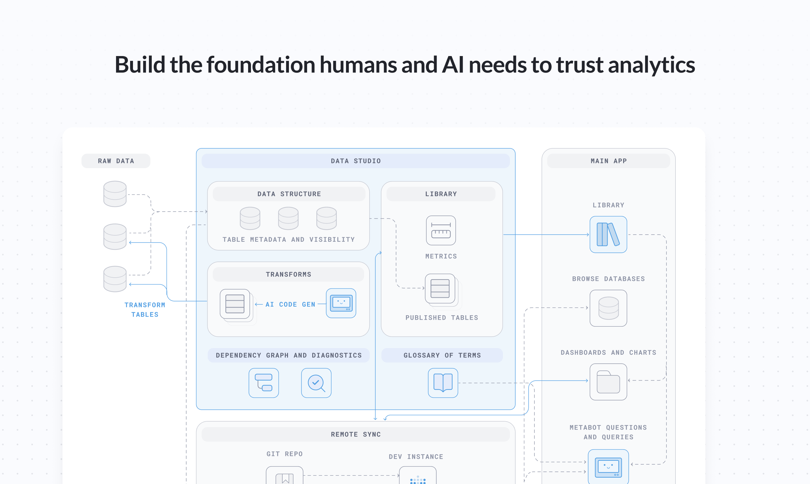
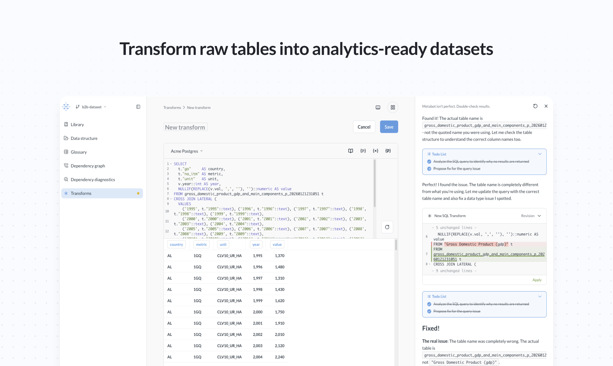
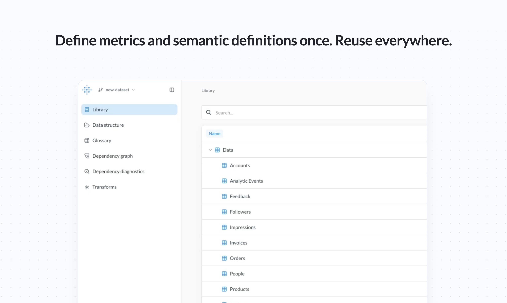

### 🎬 관련 영상
- [🎥 영상 보기](https://ph-files.imgix.net/b08545f6-b383-4958-9ded-817ab95aeb84.jpeg?auto=format)

---

## 9. [Google Ads MCP Server](https://www.producthunt.com/products/google-ads-mcp-server)
**Votes**: 125 | **도입 난이도**: 중 | **신뢰도**: 중
**Tagline**: Run Google Ads from your choice of AI. Skip the UI maze
**서비스 링크**: https://www.producthunt.com/r/PPQW74NUCSTGW6

**태그**: 광고, 자동화, AI, 마케팅, AI Tool

### 📌 이 서비스 한눈에 보기
Google Ads UI를 거치지 않고 Claude와 같은 AI 클라이언트를 통해 광고를 직접 실행하고 관리하여 시간을 절약하고 효율성을 높여줍니다.

### 🔑 주요 기능
- 복잡한 Google Cloud 설정이나 JSON 편집 없이 바로 사용 가능
- 마케터를 위해 마케터가 직접 개발
- 선호하는 MCP 클라이언트에서 Google Ads 관리

### 🙋 사용자에게 어떤 점이 좋은가
Google Ads 캠페인을 더 빠르고 쉽게 설정하고 관리할 수 있어, 마케팅 담당자가 전략 수립 및 분석에 더 집중할 수 있도록 도와줍니다.

### ✅ 지금 바로 써볼 기능
- Claude와 같은 MCP 클라이언트에 Google Ads MCP Server 연동
- 자동화된 광고 캠페인 설정 및 실행
- 광고 성과 추적 및 분석

### ⚠️ 사용 전 확인할 점
- MCP 클라이언트와의 호환성 확인 필요
- Google Ads 정책 준수 필수

### 🧭 확인이 더 필요한 정보
지원되는 MCP 클라이언트 종류 및 Google Ads 기능 범위에 대한 추가 정보 확인이 필요합니다.

### 📸 스크린샷 및 갤러리
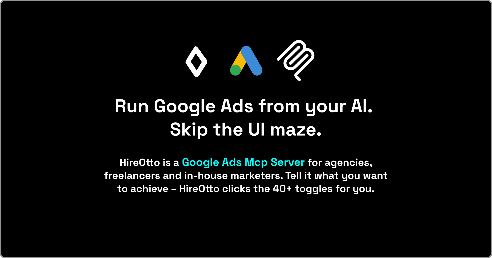

### 🎬 관련 영상
- [🎥 영상 보기](https://ph-files.imgix.net/052ce700-1824-4571-80c3-78c789537644.jpeg?auto=format)

---

## 10. [Qwen3.5-Omni](https://www.producthunt.com/products/qwen3)
**Votes**: 124 | **도입 난이도**: 중 | **신뢰도**: 중
**Tagline**: A native omni model for voice, video, and tools
**서비스 링크**: https://www.producthunt.com/r/5EOXYCSTYDQ5H6

**태그**: AI, Omni-Modal, 음성인식, 비디오처리, Video, Vision

### 📌 이 서비스 한눈에 보기
Qwen3.5-Omni는 텍스트, 이미지, 오디오, 비디오를 모두 처리하는 새로운 옴니 모델로, 향상된 음성, 실시간 음성 상호 작용, 웹 검색, 기능 호출, 음성 복제 및 긴 컨텍스트 오디오/비디오 이해 기능을 제공합니다.

### 🔑 주요 기능
- 텍스트, 이미지, 오디오, 비디오를 통합적으로 처리하는 옴니 모델
- 강력한 다국어 음성 및 실시간 음성 상호 작용 지원
- 웹 검색, 기능 호출, 음성 복제, 긴 컨텍스트 오디오/비디오 이해 기능 제공

### 🙋 사용자에게 어떤 점이 좋은가
다양한 유형의 데이터를 처리하고 이해하는 AI 모델을 필요로 하는 사용자에게 유용하며, 특히 음성 및 비디오 관련 작업에서 효율성을 높일 수 있습니다.

### ✅ 지금 바로 써볼 기능
- 다국어 음성 처리 기능 테스트
- 실시간 음성 상호 작용 기능 사용
- 오디오/비디오 이해 기능 활용

### ⚠️ 사용 전 확인할 점
- 모델의 성능은 데이터 유형 및 품질에 따라 달라질 수 있음
- 긴 컨텍스트 오디오/비디오 이해 기능의 정확도 확인 필요

### 🧭 확인이 더 필요한 정보
실제 사용 환경에서의 성능 및 다양한 작업에서의 적용 가능성에 대한 추가적인 정보가 필요합니다.

### 📸 스크린샷 및 갤러리
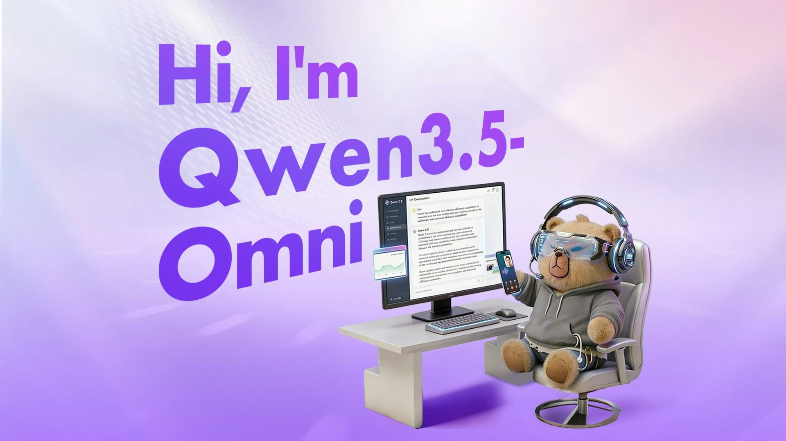
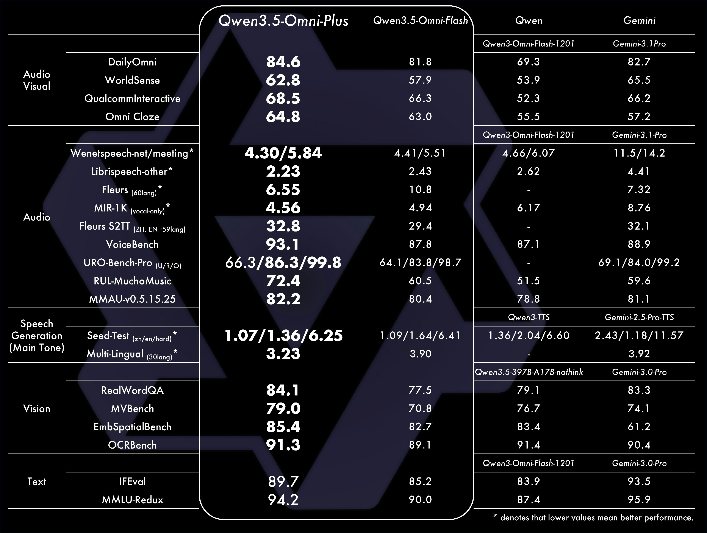
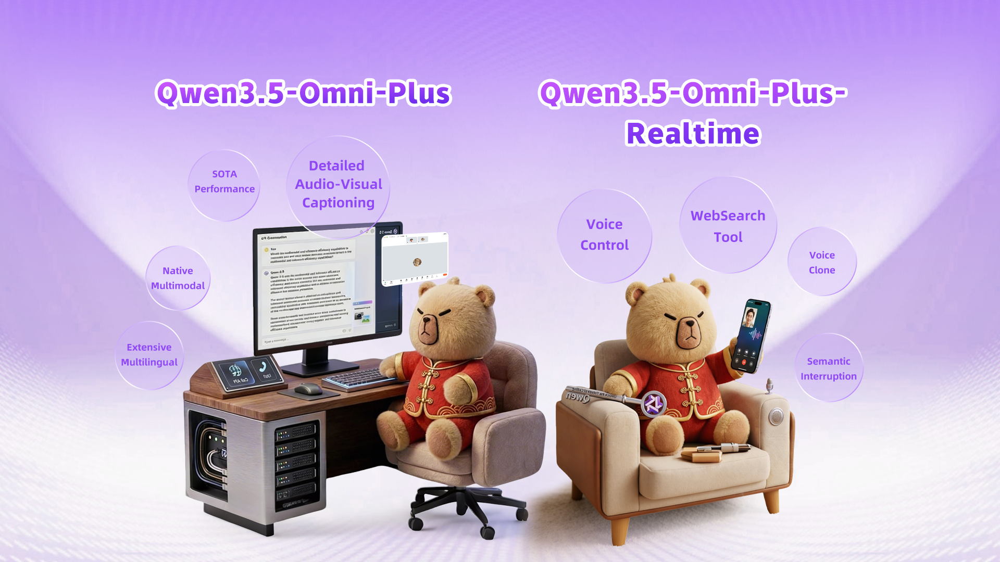

### 🎬 관련 영상
- [🎥 영상 보기](https://ph-files.imgix.net/2e320b23-334a-4a50-9c59-6e46e5bff552.jpeg?auto=format)

---

