# 🚀 Product Hunt Daily Top 10 (2026-04-02)

## 1. [Noiz Easter Voice](https://www.producthunt.com/products/noiz-studio)
**Votes**: 315 | **도입 난이도**: 하 | **신뢰도**: 중
**Tagline**: Crack an Easter egg to generate an AI voice
**서비스 링크**: https://www.producthunt.com/r/RLGNXCRT7ZEWRG

**태그**: AI, 음성 생성, 부활절, 콘텐츠 제작, AI Tool, Prompting, Vision

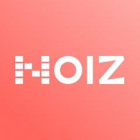

### 📌 이 서비스 한눈에 보기
Noiz Easter Voice로 부활절 달걀을 깨서 AI 음성을 생성하고, 나만의 개성 넘치는 음성을 만들어보세요.

### 🔑 주요 기능
- 부활절 테마의 AI 음성 생성
- 프롬프트와 이미지를 이용한 맞춤형 음성 제작
- 다양하고 재미있는 캐릭터 음성 제공

### 🙋 사용자에게 어떤 점이 좋은가
특별한 부활절 인사말을 만들거나, 재미있는 캐릭터 음성으로 콘텐츠를 제작하는 데 활용할 수 있습니다.

### ✅ 지금 바로 써볼 기능
- 음성 달걀을 깨서 새로운 AI 음성 잠금 해제하기
- 프롬프트와 이미지를 사용하여 나만의 음성 만들기
- 다양한 캐릭터 음성으로 부활절 인사말 생성하기

### ⚠️ 사용 전 확인할 점
- AI 음성 품질은 프롬프트 및 이미지 품질에 따라 달라질 수 있음
- 생성된 음성의 저작권 및 사용 범위 확인 필요

### 🧭 확인이 더 필요한 정보
AI 음성 생성에 필요한 크레딧 정책 및 상세 사용 조건은 추가 확인이 필요합니다.

### 📸 스크린샷 및 갤러리
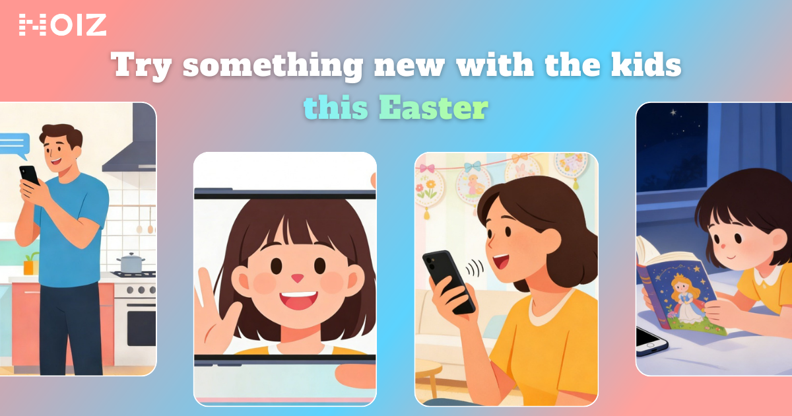
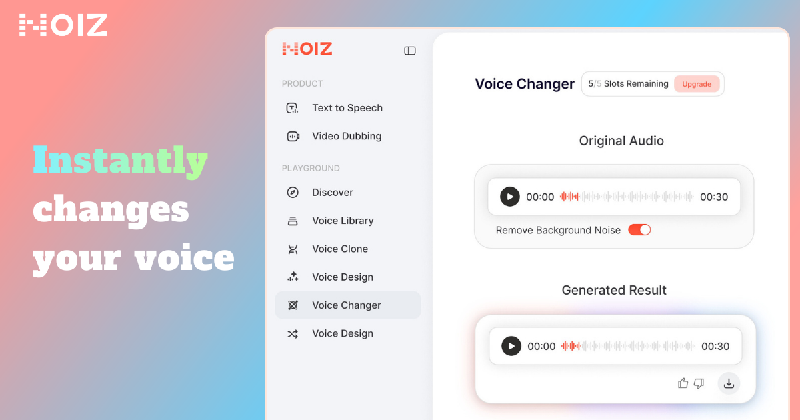
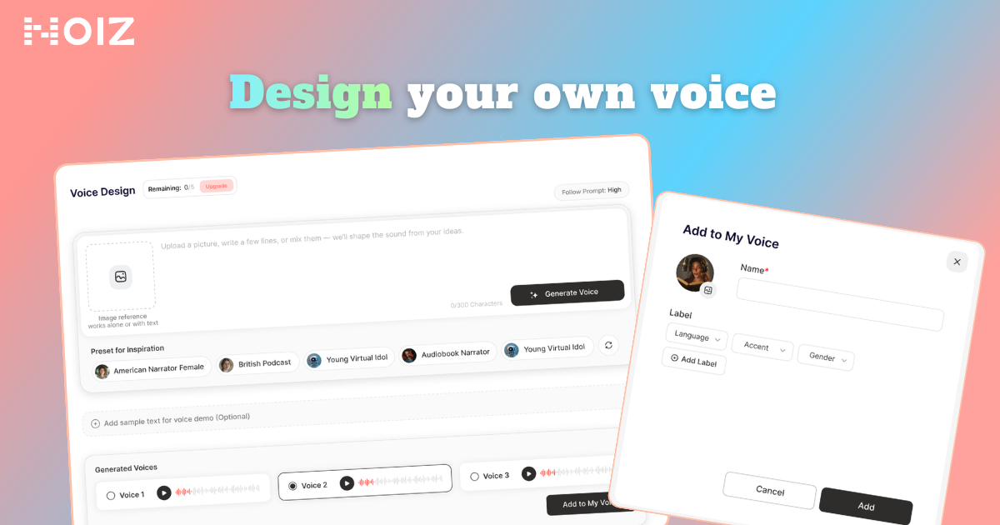

### 🎬 관련 영상
- [🎥 영상 보기](https://ph-files.imgix.net/7b121954-c701-4bd9-b752-47714bd14796.jpeg?auto=format)

---

## 2. [Ollama v0.19](https://www.producthunt.com/products/ollama)
**Votes**: 284 | **도입 난이도**: 중 | **신뢰도**: 중
**Tagline**: Massive local model speedup on Apple Silicon with MLX
**서비스 링크**: https://www.producthunt.com/r/Z7W5EBMANBJLNM

**태그**: ML, 로컬 모델, Apple Silicon, 개발 도구, Agent, Automation

### 📌 이 서비스 한눈에 보기
Ollama v0.19는 Apple Silicon에서 MLX를 기반으로 추론을 재구축하여 로컬 성능을 대폭 향상시키고, NVFP4 지원, 스마트 캐시 재사용, 스냅샷, 삭제 기능을 추가하여 더욱 빠른 응답성을 제공합니다.

### 🔑 주요 기능
- Apple Silicon에서 MLX 기반으로 로컬 모델 추론 속도 향상
- NVFP4 지원으로 성능 개선
- 스마트 캐시 재사용 및 스냅샷 기능으로 응답성 향상

### 🙋 사용자에게 어떤 점이 좋은가
로컬 환경에서 코딩 및 에이전트 워크플로우의 속도가 빨라져 개발 생산성을 높일 수 있으며, 더욱 빠르고 반응성이 좋은 세션을 경험할 수 있습니다.

### ✅ 지금 바로 써볼 기능
- Apple Silicon 환경에서 Ollama v0.19로 업그레이드하여 성능 향상 체험
- NVFP4 지원을 활용하여 모델 성능 최적화
- 스마트 캐시 및 스냅샷 기능을 활용하여 세션 응답성 개선

### ⚠️ 사용 전 확인할 점
- Apple Silicon 환경이 아닌 경우 성능 향상 효과가 제한적일 수 있음
- NVFP4 지원은 특정 모델에만 해당될 수 있으므로 호환성 확인 필요

### 🧭 확인이 더 필요한 정보
실제 성능 향상 폭은 모델 및 사용 환경에 따라 다를 수 있으므로, 사용 전 테스트를 권장합니다.

### 📸 스크린샷 및 갤러리

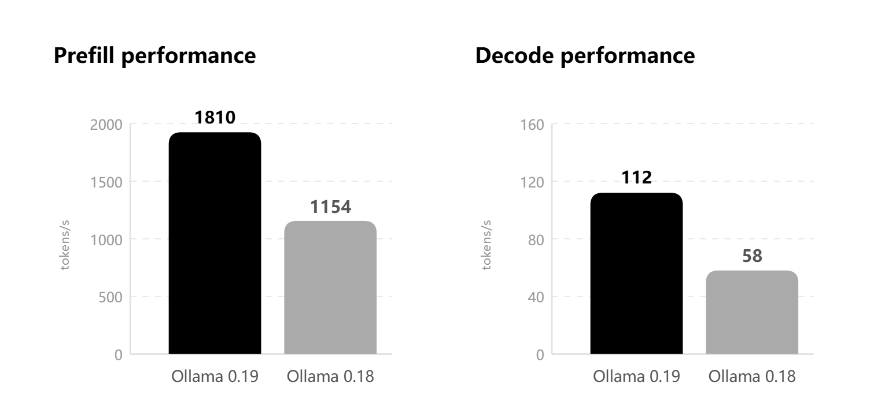
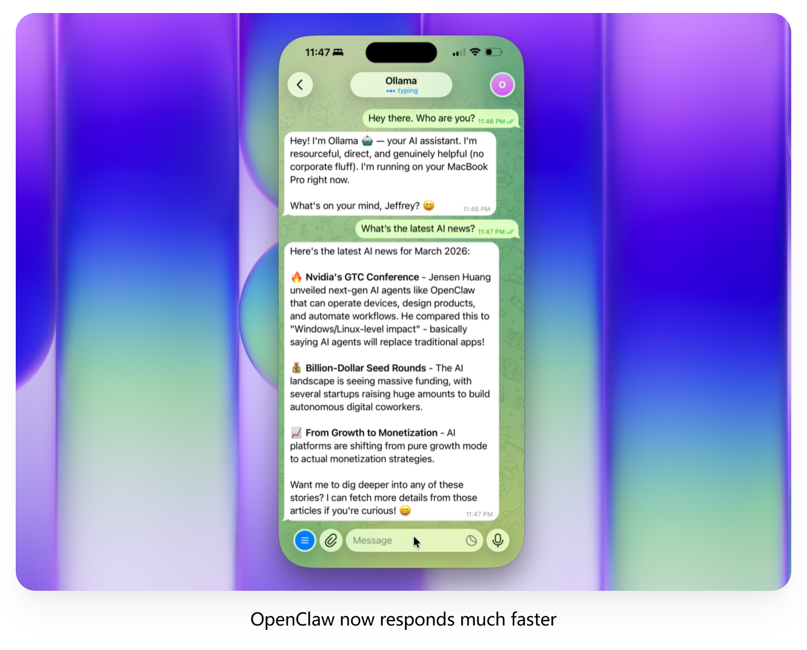

---

## 3. [traceAI](https://www.producthunt.com/products/future-agi)
**Votes**: 209 | **도입 난이도**: 중 | **신뢰도**: 중
**Tagline**: Open-source LLM tracing that speaks GenAI, not HTTP.
**서비스 링크**: https://www.producthunt.com/r/W77CUHBVI74B7W

**태그**: LLM, Tracing, Observability, Open Source, DevTool, Agent, AI Tool, Prompting

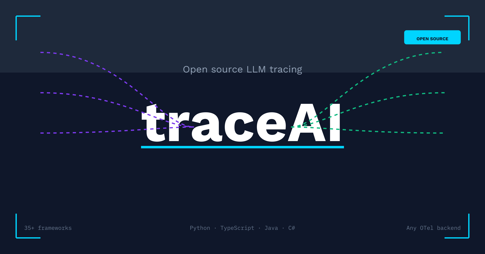

### 📌 이 서비스 한눈에 보기
traceAI는 기존의 관측 가능성 스택과 연동되는 오픈 소스 LLM 추적 도구로, GenAI의 의미를 정확히 파악하여 HTTP가 아닌 GenAI 중심으로 작동합니다.

### 🔑 주요 기능
- 프롬프트, 완료, 토큰, 검색, 에이전트 결정을 캡처합니다.
- GenAI 의미 규칙을 정확히 따릅니다.
- Datadog, Grafana, Jaeger 등 모든 OTel 백엔드로 라우팅됩니다.

### 🙋 사용자에게 어떤 점이 좋은가
traceAI를 사용하면 기존의 관측 가능성 도구를 변경하지 않고도 LLM 애플리케이션을 쉽게 추적하고 디버깅할 수 있습니다. 두 줄의 코드만으로 애플리케이션 전체를 계측할 수 있습니다.

### ✅ 지금 바로 써볼 기능
- Python, TypeScript, Java, C# 중 사용하는 언어로 애플리케이션을 계측해보기
- OpenAI, LangChain, CrewAI 등 35개 이상의 지원 프레임워크 활용해보기
- OTel 백엔드(Datadog, Grafana, Jaeger)에 연동하여 데이터 확인해보기

### ⚠️ 사용 전 확인할 점
- OTel 백엔드 설정 및 관리에 대한 이해가 필요합니다.
- 오픈 소스이므로 자체적인 유지보수 및 커스터마이징이 필요할 수 있습니다.

### 🧭 확인이 더 필요한 정보
traceAI가 특정 환경이나 워크로드에서 얼마나 효과적인지 확인이 필요합니다.

### 📸 스크린샷 및 갤러리
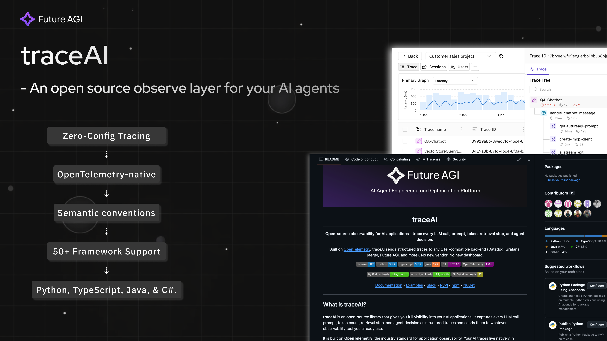
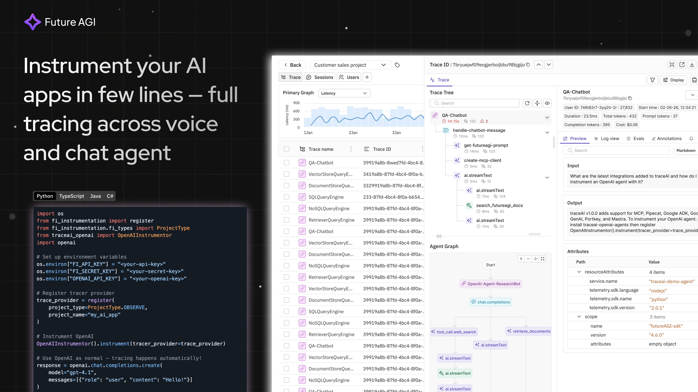
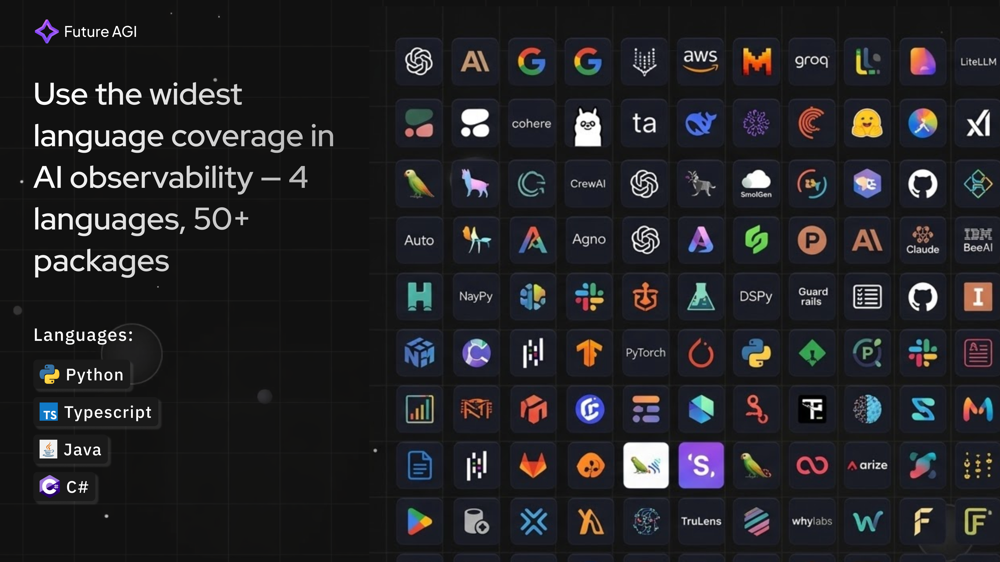

---

## 4. [Zzzappy](https://www.producthunt.com/products/zzzappy)
**Votes**: 200 | **도입 난이도**: 중 | **신뢰도**: 중
**Tagline**: Science-backed breaks to protect your vision & prevent RSI
**서비스 링크**: https://www.producthunt.com/r/UUQ3KAI6MHZ2WM

**태그**: 건강, 생산성, macOS, RSI 예방, 시력 보호, AI Tool

### 📌 이 서비스 한눈에 보기
Zzzappy는 macOS에서 화면 사용 시간과 팔의 움직임을 모니터링하여 시력 보호 및 RSI 예방을 위한 휴식을 과학적으로 스케줄링해주는 앱입니다.

### 🔑 주요 기능
- 눈 보호를 위한 20-20-20 규칙 및 사용자 정의 가능한 간격 설정
- 키보드 입력, 마우스 클릭, 트랙패드 이동 거리 등 팔의 움직임 실시간 모니터링
- 스마트 일시 정지, 몰입형 휴식, 건강 대시보드 등 다양한 기능 제공

### 🙋 사용자에게 어떤 점이 좋은가
장시간 컴퓨터 사용으로 인한 시력 저하 및 RSI 위험을 줄여주어 건강한 작업 환경을 조성할 수 있습니다.

### ✅ 지금 바로 써볼 기능
- 눈 보호를 위한 20-20-20 규칙 간격 사용자 정의하기
- 팔 움직임 모니터링 기능 활성화하고 알림 설정하기
- 건강 대시보드에서 사용 시간 및 움직임 패턴 확인하기

### ⚠️ 사용 전 확인할 점
- macOS에서만 사용 가능
- 개인의 사용 패턴에 따라 휴식 스케줄링 효과가 다를 수 있음

### 🧭 확인이 더 필요한 정보
실제 사용자들의 장기간 사용 후 효과에 대한 추가적인 정보가 필요합니다.

### 📸 스크린샷 및 갤러리

---

## 5. [ClawMetry for NVIDIA NemoClaw](https://www.producthunt.com/products/clawmetry)
**Votes**: 175 | **도입 난이도**: 중 | **신뢰도**: 중
**Tagline**: Know what's happening inside your NemoClaw sandboxes
**서비스 링크**: https://www.producthunt.com/r/WDKGCKMGIUTG5Y

**태그**: NVIDIA, Observability, Sandbox, Open Source, Monitoring, AI Tool

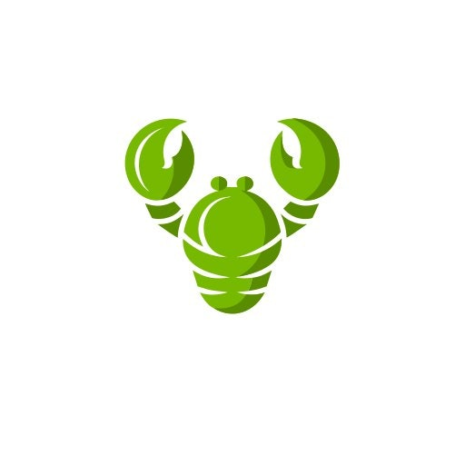

### 📌 이 서비스 한눈에 보기
NVIDIA NemoClaw 샌드박스 내부를 완벽하게 관찰하여 모델의 사고 과정, 도구 호출, 토큰 비용 등을 실시간으로 파악하고 E2E 암호화까지 제공하는 오픈소스 도구입니다.

### 🔑 주요 기능
- NVIDIA NemoClaw 샌드박스 내부의 완전한 가시성 제공
- 모델의 사고 과정, 도구 호출, 토큰 비용 등을 실시간으로 모니터링
- E2E 암호화로 보안 강화

### 🙋 사용자에게 어떤 점이 좋은가
NVIDIA NemoClaw를 사용하는 개발자는 샌드박스 내부 동작을 상세하게 파악하여 모델 성능을 최적화하고 비용을 절감할 수 있습니다. 또한, 오픈 소스이므로 자유롭게 사용하고 기여할 수 있습니다.

### ✅ 지금 바로 써볼 기능
- 호스트에서 단일 명령어로 모든 샌드박스에 ClawMetry 적용
- 모델의 두뇌 활동, 흐름 시각화, 메모리 모니터링 기능 사용
- 클라우드 동기화 기능 (유료) 사용 고려

### ⚠️ 사용 전 확인할 점
- 클라우드 동기화는 유료($5/sandbox/월)이므로 비용 고려 필요
- 오픈 소스이므로 자체적인 유지보수 및 관리가 필요할 수 있음

### 🧭 확인이 더 필요한 정보
95K 이상의 설치 수와 100개국 이상에서 사용 중이라는 정보의 신뢰성 검증이 필요합니다.

### 📸 스크린샷 및 갤러리
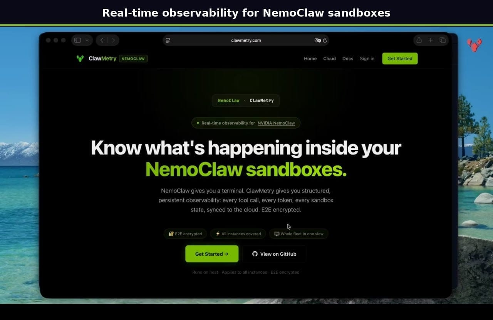
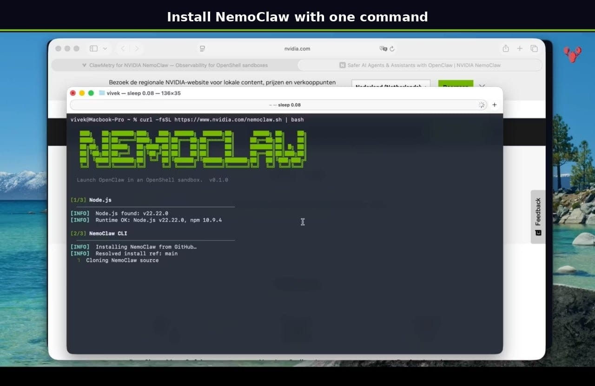
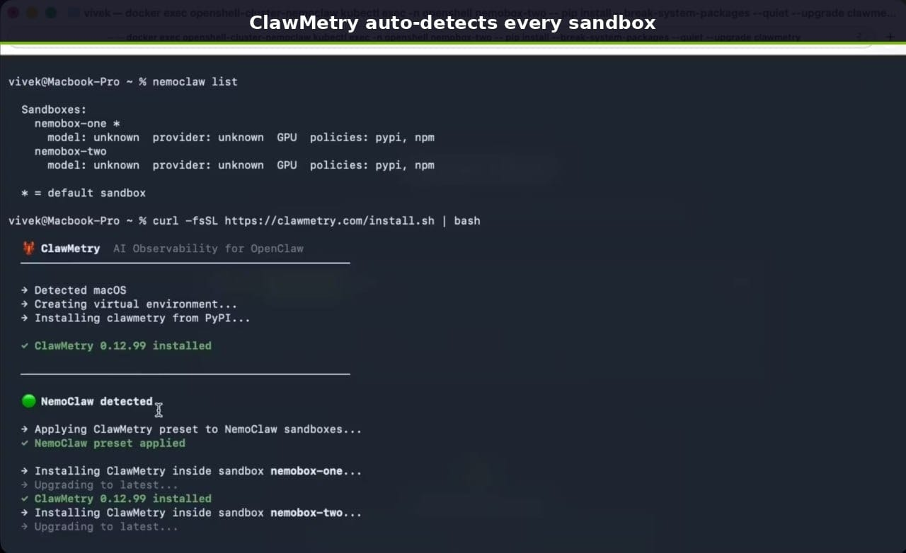

### 🎬 관련 영상
- [🎥 영상 보기](https://ph-files.imgix.net/9a0a206f-c0ca-4fda-a717-4527c3a2d588.jpeg?auto=format)

---

## 6. [Remodex](https://www.producthunt.com/products/remodex-codex-remote-control)
**Votes**: 150 | **도입 난이도**: 중 | **신뢰도**: 중
**Tagline**: Control Codex on your iPhone
**서비스 링크**: https://www.producthunt.com/r/OTYGACI34EFM2X

**태그**: DevTool, iOS, 원격 제어, 오픈소스, 자동화, Agent, AI Tool, Prompting

### 📌 이 서비스 한눈에 보기
Remodex는 아이폰으로 Mac에서 실행되는 Codex를 원격으로 제어하여, 어디서든 Codex의 기능을 활용할 수 있게 해주는 오픈소스 iOS 앱입니다.

### 🔑 주요 기능
- 아이폰에서 Codex를 원격으로 제어 가능
- 스레드 생성, 서브에이전트 실행, Git 커밋 푸시 등 다양한 기능 지원
- 종단간 암호화로 보안 강화 및 필요시 자체 릴레이 서버 구축 가능

### 🙋 사용자에게 어떤 점이 좋은가
Mac 앞에서 벗어나 아이폰으로 Codex를 편리하게 사용하고, 이동 중에도 생산성을 유지할 수 있습니다. 특히 개발자에게 유용합니다.

### ✅ 지금 바로 써볼 기능
- QR 코드를 사용하여 Mac과 iPhone을 페어링
- iPhone에서 스레드를 생성하고 Codex의 응답 확인
- Git 커밋을 푸시하여 원격으로 코드 변경 사항 적용

### ⚠️ 사용 전 확인할 점
- Codex가 Mac에서 실행 중이어야 Remodex 사용 가능
- 오픈소스이므로 보안 및 안정성에 대한 자체 검토 필요

### 🧭 확인이 더 필요한 정보
Remodex의 릴레이 서버 성능 및 안정성에 대한 추가적인 사용자 후기 확인이 필요합니다.

### 📸 스크린샷 및 갤러리
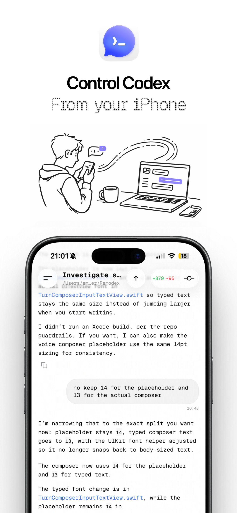
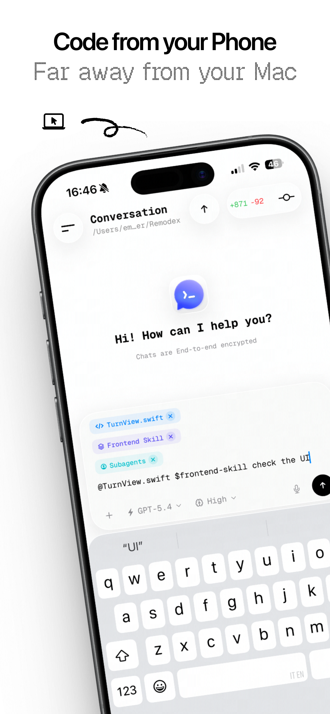
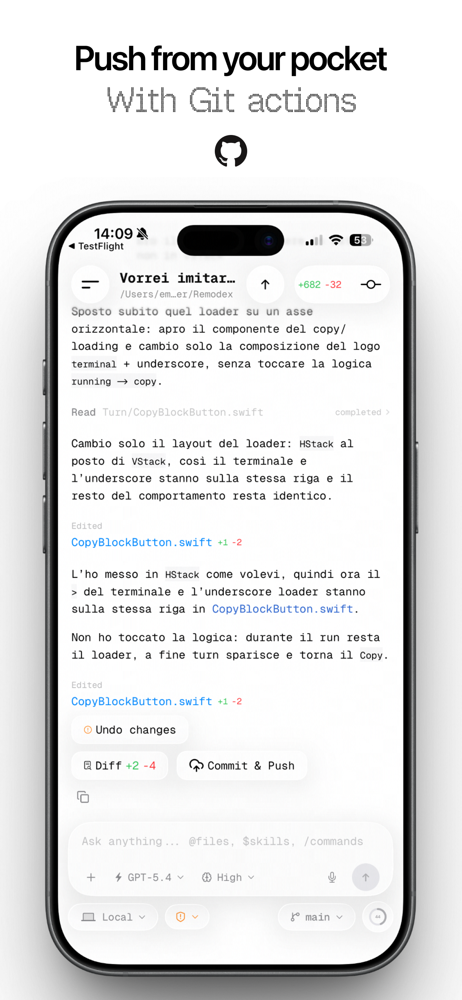

### 🎬 관련 영상
- [🎥 영상 보기](https://ph-files.imgix.net/5c443bc1-1363-4f2b-9d5b-7ff265b545a0.jpeg?auto=format)

---

## 7. [Google Veo 3.1 Lite](https://www.producthunt.com/products/google-pay-2)
**Votes**: 140 | **도입 난이도**: 중 | **신뢰도**: 중
**Tagline**: Google's most cost-effective video generation model
**서비스 링크**: https://www.producthunt.com/r/BVITBLCHCXT2OS

**태그**: Video Generation, AI, Gemini API, Video, Vision, API

### 📌 이 서비스 한눈에 보기
Google Veo 3.1 Lite는 Gemini API 기반으로 고화질 비디오를 저렴하게 생성할 수 있게 해주는 모델입니다.

### 🔑 주요 기능
- 텍스트 및 이미지 기반 비디오 생성 지원
- 720p/1080p 해상도 지원
- 비용 효율성이 뛰어남 (Fast 모델 대비 50% 미만)

### 🙋 사용자에게 어떤 점이 좋은가
대량의 비디오 콘텐츠를 제작해야 하는 사용자에게 비용 부담을 줄여주면서도 고품질 비디오를 만들 수 있는 유용한 도구입니다.

### ✅ 지금 바로 써볼 기능
- 텍스트 프롬프트를 사용하여 비디오 생성해보기
- 이미지를 사용하여 비디오 생성해보기
- 다양한 비율과 길이로 비디오 제작해보기

### ⚠️ 사용 전 확인할 점
- 생성 가능한 비디오 품질이 Google Veo의 다른 모델보다 낮을 수 있음
- Gemini API 사용량에 따라 비용이 발생할 수 있음

### 🧭 확인이 더 필요한 정보
실제 사용 환경에서의 비디오 생성 속도 및 품질은 사용자의 환경에 따라 달라질 수 있습니다.

### 📸 스크린샷 및 갤러리

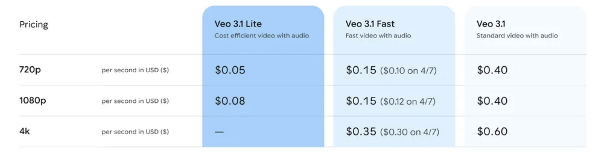

### 🎬 관련 영상
- [🎥 영상 보기](https://ph-files.imgix.net/b5c9fb83-bb66-4bfe-a896-47ec88b2476e.jpeg?auto=format)

---

## 8. [Prospecting by Clarify](https://www.producthunt.com/products/clarify-6)
**Votes**: 136 | **도입 난이도**: 중 | **신뢰도**: 중
**Tagline**: Source leads, send outbound, grow pipeline. All in your CRM.
**서비스 링크**: https://www.producthunt.com/r/PSIMKOZKZEGZF5

**태그**: CRM, Sales, Lead Generation, Automation, AI Tool, Prompting

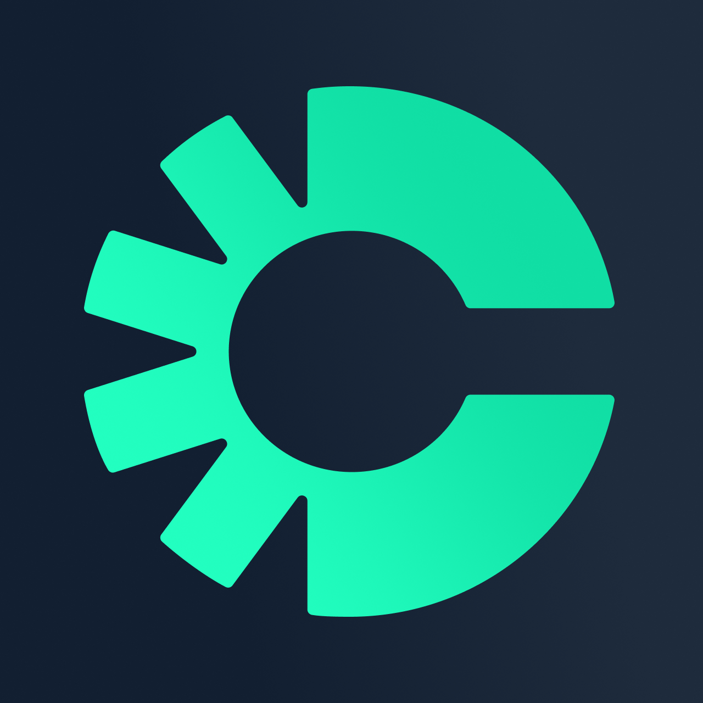

### 📌 이 서비스 한눈에 보기
Clarify의 Prospecting 기능으로 CRM 내에서 리드 소싱, 아웃바운드 캠페인, 파이프라인 관리를 한 번에 해결하여 영업 효율성을 극대화하세요.

### 🔑 주요 기능
- CRM 내에서 리드 소싱, 정보 보강, 시퀀스 전송을 통합 관리
- 단 한 번의 프롬프트로 타겟 리드 검색 가능
- 클릭 한 번으로 개인화된 캠페인 구축

### 🙋 사용자에게 어떤 점이 좋은가
여러 툴을 사용할 필요 없이 CRM 내에서 모든 prospecting 과정을 자동화하여 시간과 노력을 절약하고, 파이프라인 성장에 집중할 수 있습니다.

### ✅ 지금 바로 써볼 기능
- Lead Finder를 사용하여 타겟 리드를 검색해 보세요.
- 캠페인을 구축하여 자동화된 아웃바운드 영업을 시작하세요.
- CRM 내에서 파이프라인 성장 추이를 모니터링하세요.

### ⚠️ 사용 전 확인할 점
- Clarify CRM과의 호환성을 확인해야 합니다.
- 자동화된 캠페인이 스팸으로 인식되지 않도록 개인화에 신경 써야 합니다.

### 🧭 확인이 더 필요한 정보
Clarify CRM의 기존 기능과의 연동 방식 및 데이터 마이그레이션 지원 여부를 확인해야 합니다.

### 📸 스크린샷 및 갤러리
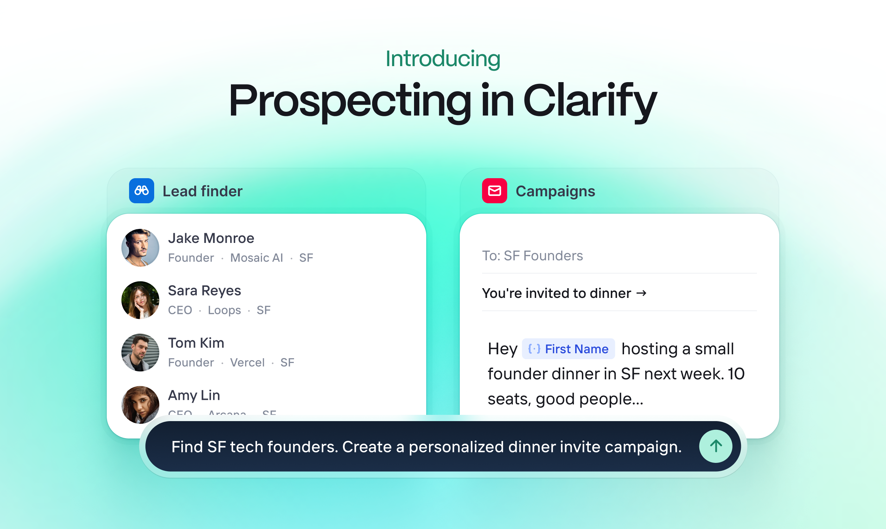
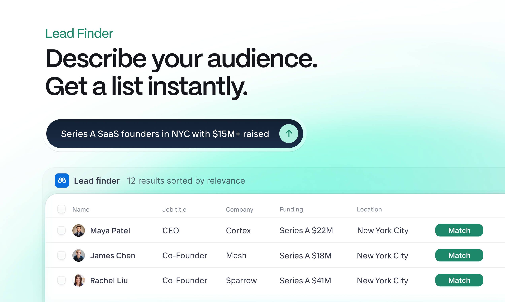
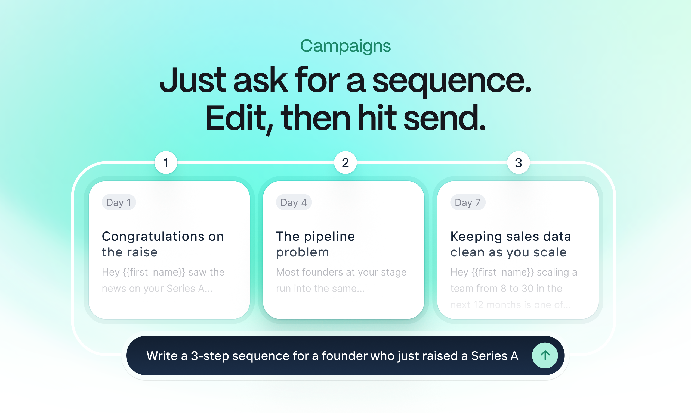

### 🎬 관련 영상
- [🎥 영상 보기](https://ph-files.imgix.net/1dfe2ebf-68be-4ac7-b49b-7d9dbb24576a.jpeg?auto=format)

---

## 9. [Snapstick](https://www.producthunt.com/products/snapstick-photos-to-stickers)
**Votes**: 117 | **도입 난이도**: 하 | **신뢰도**: 중
**Tagline**: Turn your camera roll into group chat chaos
**서비스 링크**: https://www.producthunt.com/r/SH7S24WSRPNGUO

**태그**: 스티커, 사진 편집, 소셜, iOS, AI Tool, Chat

### 📌 이 서비스 한눈에 보기
Snapstick은 카메라 롤의 사진을 스티커로 만들어 그룹 채팅을 더욱 재미있게 만들어주는 iOS 앱입니다. 스티커를 실제 상품으로 제작할 수도 있습니다.

### 🔑 주요 기능
- 사진을 스티커로 쉽게 변환
- 그룹 채팅에서 스티커 공유
- 스티커를 실제 상품으로 제작 가능

### 🙋 사용자에게 어떤 점이 좋은가
밋밋한 사진에 새로운 생명을 불어넣고, 친구들과의 채팅을 더욱 즐겁게 만들어줍니다. 특별한 스티커를 티셔츠나 머그컵으로 만들어 선물할 수도 있습니다.

### ✅ 지금 바로 써볼 기능
- 자신의 사진으로 스티커 만들기
- 그룹 채팅에서 스티커 공유하기
- 마음에 드는 스티커를 실제 상품으로 제작하기

### ⚠️ 사용 전 확인할 점
- iOS에서만 사용 가능
- 상품 제작 비용 발생

### 🧭 확인이 더 필요한 정보
스티커 제작 가능한 상품 종류 및 가격 정보 확인이 필요합니다.

### 📸 스크린샷 및 갤러리

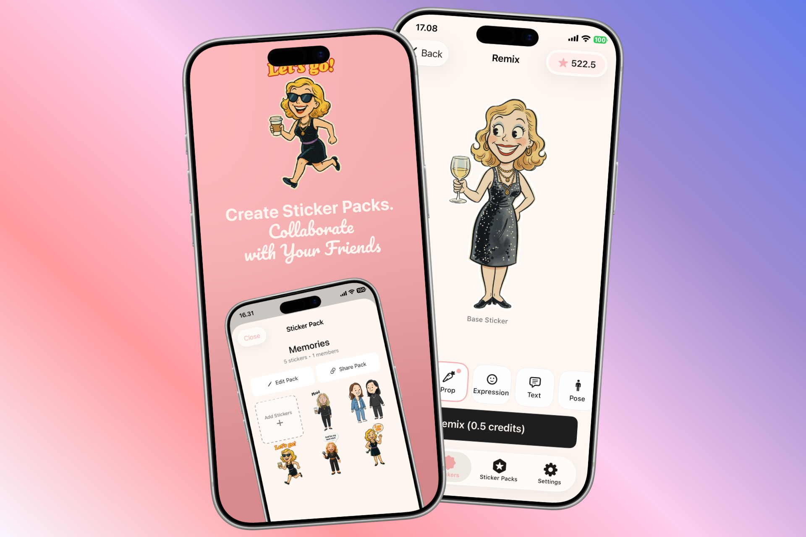

### 🎬 관련 영상
- [🎥 영상 보기](https://ph-files.imgix.net/0f894810-d081-4af3-acad-ea02dff5a5b1.jpeg?auto=format)

---

## 10. [Slackbot](https://www.producthunt.com/products/slack)
**Votes**: 113 | **도입 난이도**: 중 | **신뢰도**: 중
**Tagline**: Team up with your AI teammate in the all-new Slack
**서비스 링크**: https://www.producthunt.com/r/VEFFZLVMNXAI7A

**태그**: AI, 생산성, 자동화, 협업, Agent, AI Tool

### 📌 이 서비스 한눈에 보기
Slackbot은 Slack 내에서 AI를 활용하여 회의 준비, 보고서 분석, 인사이트 발견 등 업무 효율성을 높여주는 개인 AI 에이전트입니다.

### 🔑 주요 기능
- Slack 내에서 AI 에이전트 활용
- 회의 준비 및 보고서 분석 지원
- Slack을 벗어나지 않고 인사이트 발견

### 🙋 사용자에게 어떤 점이 좋은가
Slackbot을 통해 Slack 내에서 모든 업무를 처리할 수 있어 생산성을 향상시키고, AI 기반 분석으로 더 나은 의사 결정을 내릴 수 있습니다.

### ✅ 지금 바로 써볼 기능
- Slackbot 활성화 및 설정
- 회의 준비 기능 사용해보기
- 보고서 분석 기능 사용해보기

### ⚠️ 사용 전 확인할 점
- AI 분석의 정확도 확인 필요
- 개인 정보 보호 정책 확인 필요

### 🧭 확인이 더 필요한 정보
Slackbot의 AI 성능 및 지원 범위에 대한 추가 정보 확인이 필요합니다.

### 📸 스크린샷 및 갤러리
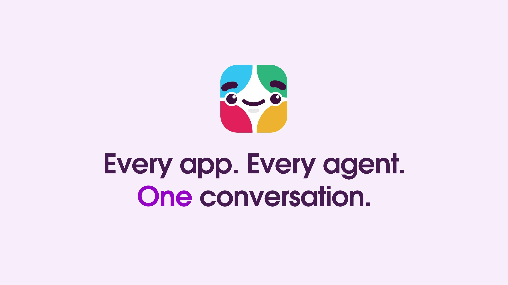
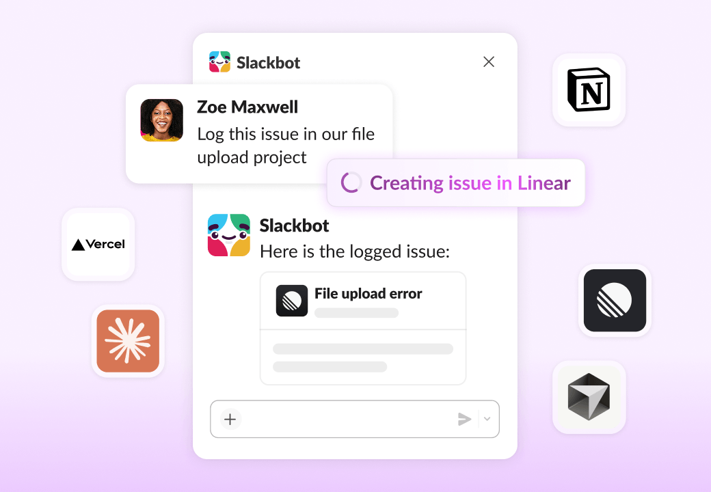
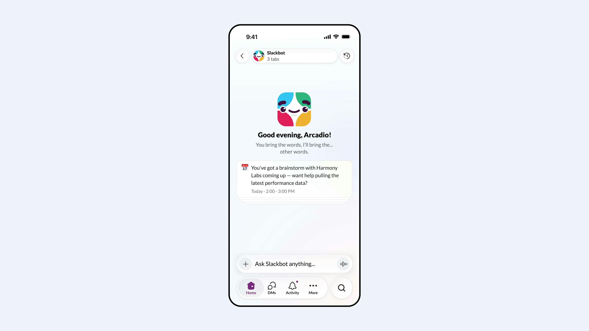

### 🎬 관련 영상
- [🎥 영상 보기](https://ph-files.imgix.net/0a5f5546-15a0-4922-8ebb-6d9fd5b5e570.jpeg?auto=format)

---

