# 🚀 Product Hunt Daily Top 10 (2026-04-03)

## 1. [Denovo](https://www.producthunt.com/products/denovo)
**Votes**: 249 | **도입 난이도**: 중 | **신뢰도**: 중
**Tagline**: Build and run your business while you sleep.
**서비스 링크**: https://www.producthunt.com/r/AYHVPEC5Z76U6S

**태그**: 자동화, 스타트업, 웹 개발, 마케팅, Video

### 📌 이 서비스 한눈에 보기
아이디어만 있으면 자동으로 사업 계획, 웹 앱 개발, 마케팅까지 대행하여 완전 자동화된 스타트업을 구축하고 운영할 수 있게 해줍니다.

### 🔑 주요 기능
- 아이디어를 완전한 스타트업으로 자동 전환
- 피치 덱, 사업 계획, 홍보 영상, 풀스택 웹 앱 자동 생성
- 엔지니어링, 사업 개발, 소셜 미디어 운영 자동화

### 🙋 사용자에게 어떤 점이 좋은가
사업 아이디어를 현실화하는 데 필요한 시간과 노력을 크게 줄여주고, 초기 스타트업 운영의 복잡성을 해소해 줍니다.

### ✅ 지금 바로 써볼 기능
- 아이디어를 입력하고 자동 생성되는 사업 계획 검토
- 자동 생성된 웹 앱 데모 확인
- 자동화된 소셜 미디어 마케팅 성과 모니터링

### ⚠️ 사용 전 확인할 점
- 자동 생성 결과물의 품질이 아이디어의 구체성에 따라 달라질 수 있음
- 완전 자동화가 모든 사업 단계에 적합하지 않을 수 있음

### 🧭 확인이 더 필요한 정보
자동 생성 결과물의 실제 사업 성공률에 대한 추가 정보가 필요합니다.

### 📸 스크린샷 및 갤러리
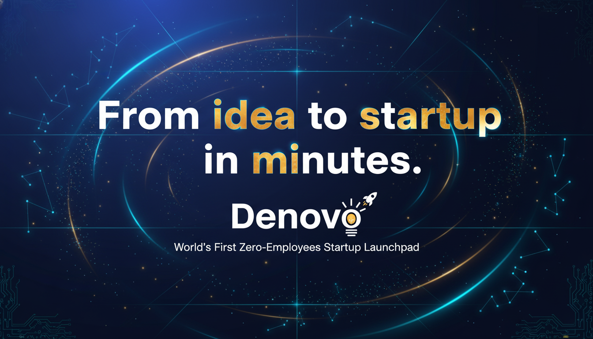
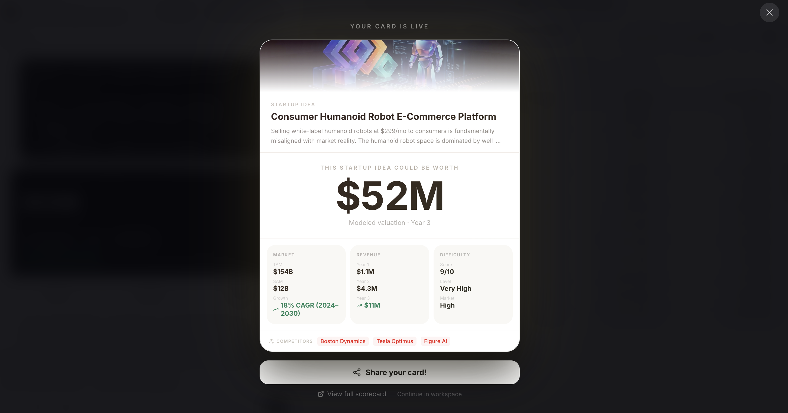
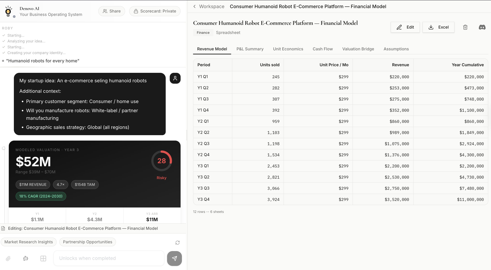

### 🎬 관련 영상
- [🎥 영상 보기](https://ph-files.imgix.net/bc227708-880a-4644-bf35-90b1954369d0.jpeg?auto=format)

---

## 2. [Lightning V3](https://www.producthunt.com/products/smallest-ai)
**Votes**: 245 | **도입 난이도**: 중 | **신뢰도**: 중
**Tagline**: Text-to-Speech built for Voice Agents
**서비스 링크**: https://www.producthunt.com/r/5BLNSLSG2AWHQ7

**태그**: AI, 음성 합성, 음성 에이전트, 텍스트 음성 변환, Agent, AI Tool

### 📌 이 서비스 한눈에 보기
Lightning V3는 100ms의 짧은 지연 시간과 높은 음질을 제공하며, 다양한 언어를 지원하여 음성 에이전트, IVR 시스템, 콘텐츠 제작 등에 사람과 유사한 음성으로 활용 가능한 텍스트 음성 변환 모델입니다.

### 🔑 주요 기능
- 100ms의 짧은 지연 시간
- 높은 음질 (3.89 WVMOS)
- 다양한 언어 지원 (영어, 힌디어, 스페인어, 타밀어 외 15개 이상)

### 🙋 사용자에게 어떤 점이 좋은가
실시간 음성 복제 기능과 다양한 언어 지원을 통해 음성 에이전트, IVR 시스템, 콘텐츠 제작 등 다양한 분야에서 활용 가능하며, 특히 빠른 응답 속도와 높은 음질은 사용자 경험을 향상시킵니다.

### ✅ 지금 바로 써볼 기능
- 10초 오디오 클립으로 음성 복제 시도
- 다양한 언어로 텍스트 음성 변환 테스트
- 음성 에이전트 또는 IVR 시스템에 통합하여 사용

### ⚠️ 사용 전 확인할 점
- 특정 언어 또는 억양에 대한 지원 수준 확인 필요
- 음성 복제 기능의 윤리적 사용 고려

### 🧭 확인이 더 필요한 정보
OpenAI의 GPT-4o-mini-TTS 대비 선호도 76.2%의 출처에 대한 추가 확인이 필요합니다.

### 📸 스크린샷 및 갤러리
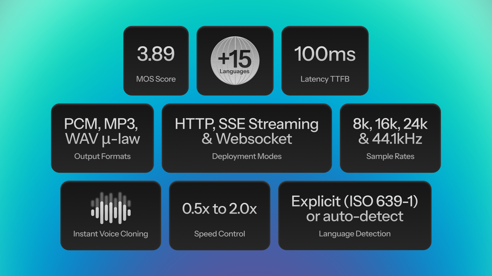
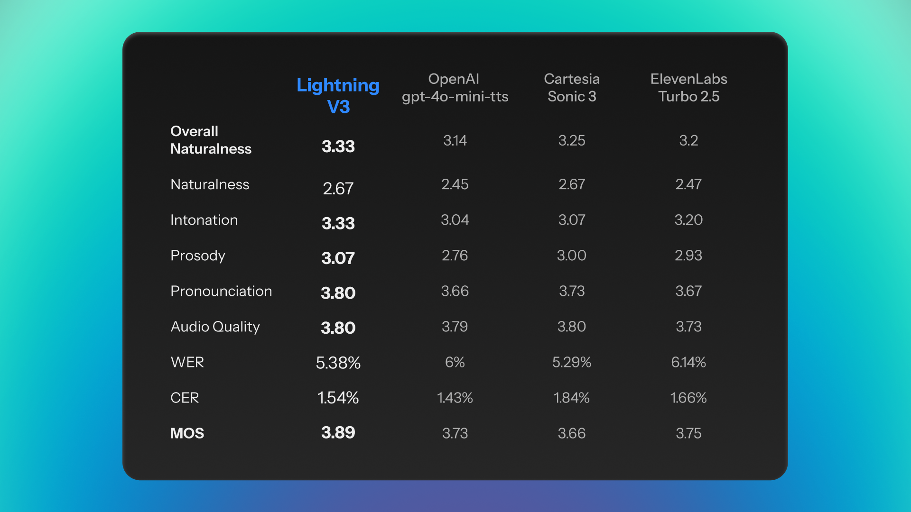
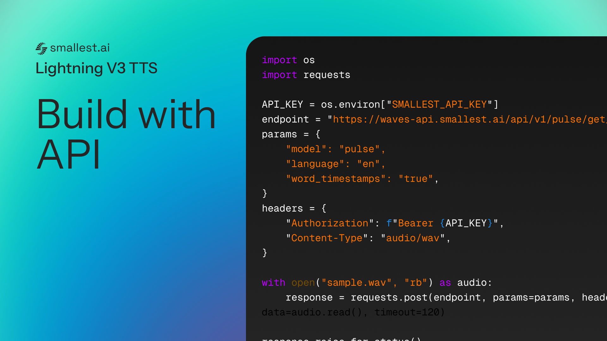

### 🎬 관련 영상
- [🎥 영상 보기](https://ph-files.imgix.net/fdaa09ff-0c2a-46cc-a81f-865108d52139.jpeg?auto=format)

---

## 3. [Claude Code Voice Mode](https://www.producthunt.com/products/claude-code-voice-mode)
**Votes**: 237 | **도입 난이도**: 하 | **신뢰도**: 상
**Tagline**: Speak your prompts into Claude Code
**서비스 링크**: https://www.producthunt.com/r/BTVIUSEAXGLMYP

**태그**: AI, 생산성, 음성인식, 개발, AI Tool, Prompting, DevTool

### 📌 이 서비스 한눈에 보기
Claude Code에 음성으로 프롬프트를 입력하여 핸즈프리로 더욱 자연스러운 대화가 가능해졌습니다.

### 🔑 주요 기능
- 음성 모드를 통해 Claude와 핸즈프리 대화 가능
- 음성 및 텍스트 모드 간 전환 용이
- 멀티태스킹, 학습, 브레인스토밍 시 생산성 향상

### 🙋 사용자에게 어떤 점이 좋은가
이동 중에도 Claude Code를 사용하여 더욱 효율적으로 작업할 수 있으며, 음성 입력으로 더욱 자연스러운 상호작용이 가능합니다.

### ✅ 지금 바로 써볼 기능
- 음성 모드로 코드 생성 요청해보기
- 음성으로 아이디어 브레인스토밍 해보기
- 텍스트 모드와 음성 모드 전환하며 사용해보기

### ⚠️ 사용 전 확인할 점
- 소음이 심한 환경에서는 음성 인식률이 낮아질 수 있음
- 정확한 음성 인식을 위해 명확하고 간결하게 말해야 함

### 🧭 확인이 더 필요한 정보
음성 모드의 다양한 언어 지원 범위에 대한 추가 확인이 필요합니다.

### 📸 스크린샷 및 갤러리
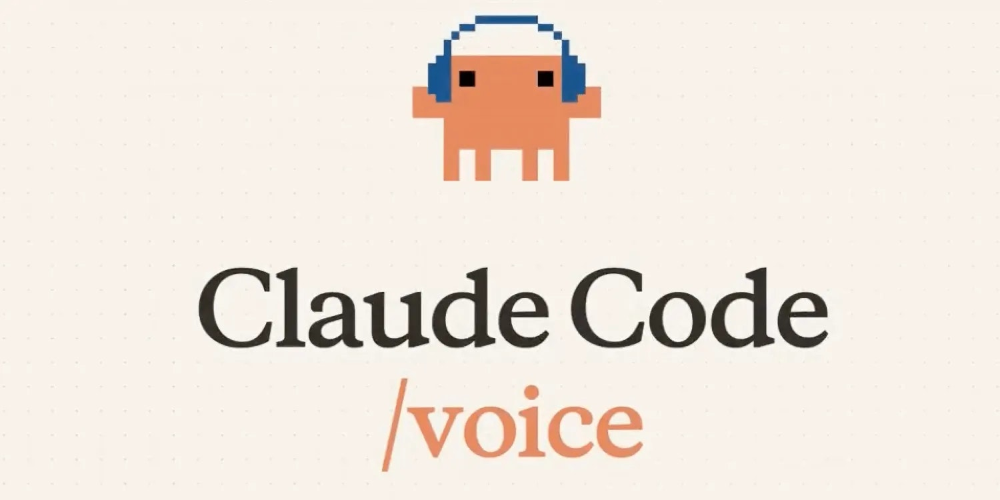
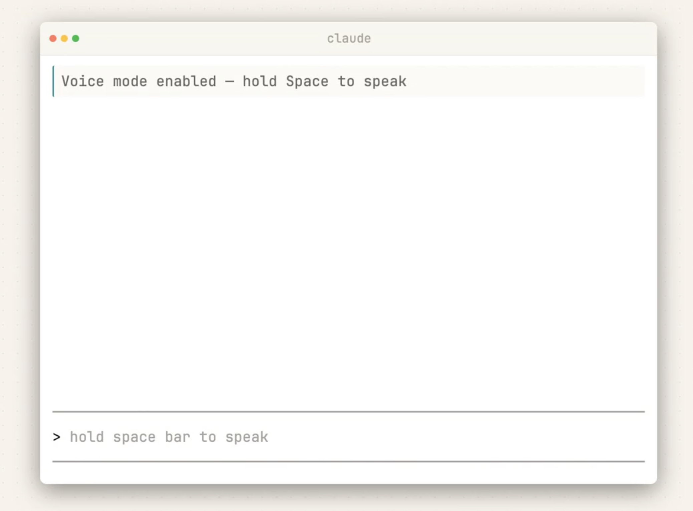
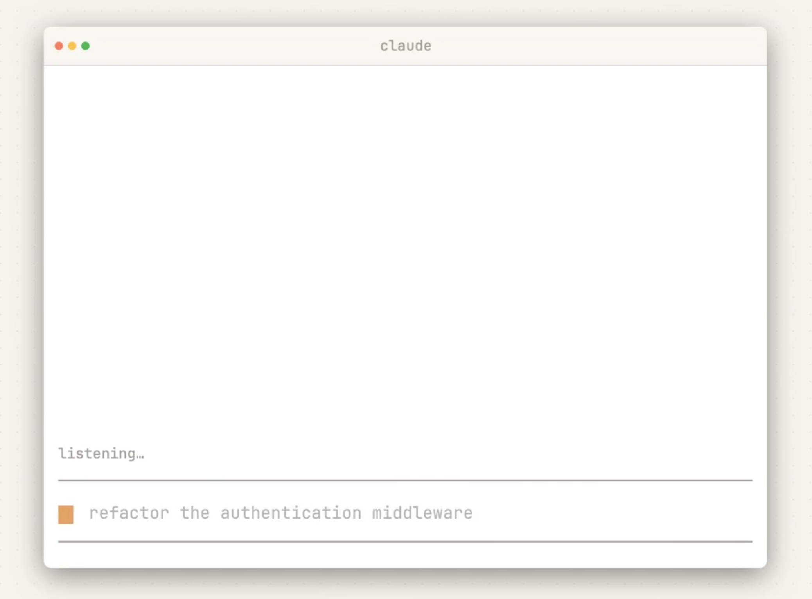

---

## 4. [GLM-5V-Turbo](https://www.producthunt.com/products/z-ai)
**Votes**: 157 | **도입 난이도**: 중 | **신뢰도**: 중
**Tagline**: Vision-to-code foundation model for real GUI automation
**서비스 링크**: https://www.producthunt.com/r/6KERPELGMR26RQ

**태그**: DevTool, Automation, 코딩, 멀티모달, Agent, AI Tool, Video, Vision

### 📌 이 서비스 한눈에 보기
GLM-5V-Turbo는 이미지, 비디오, 파일, UI 레이아웃을 이해하고 실행 가능한 코드로 변환하여 GUI 자동화를 돕는 Z.AI의 멀티모달 코딩 모델입니다.

### 🔑 주요 기능
- 시각적 컨텍스트를 코드로 변환
- 디버깅 지원
- Claude Code 및 OpenClaw와 연동하여 에이전트 워크플로우 강화

### 🙋 사용자에게 어떤 점이 좋은가
GUI 자동화 작업을 더욱 효율적으로 처리하고, 시각 정보를 기반으로 코드를 생성하여 개발 생산성을 향상시킬 수 있습니다.

### ✅ 지금 바로 써볼 기능
- 이미지 기반 코드 생성 테스트
- UI 레이아웃 기반 코드 생성 테스트
- 디버깅 기능 활용

### ⚠️ 사용 전 확인할 점
- 모델의 정확도 및 생성된 코드의 완성도 확인 필요
- 특정 UI 환경 또는 파일 형식에 대한 호환성 확인 필요

### 🧭 확인이 더 필요한 정보
실제 사용 환경에서의 성능 및 다양한 파일 형식에 대한 지원 범위에 대한 추가 정보가 필요합니다.

### 📸 스크린샷 및 갤러리
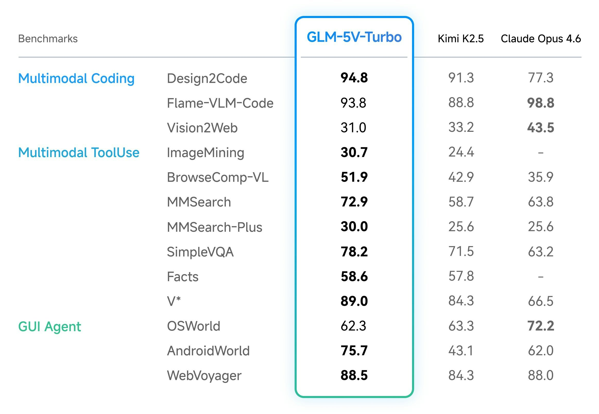
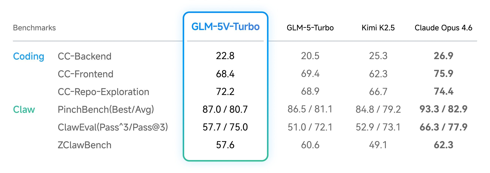

### 🎬 관련 영상
- [🎥 영상 보기](https://ph-files.imgix.net/05697cab-9418-42ae-88f4-51ef9b35968e.jpeg?auto=format)

---

## 5. [Cosyra](https://www.producthunt.com/products/cosyra)
**Votes**: 131 | **도입 난이도**: 중 | **신뢰도**: 중
**Tagline**: Run AI coding agents from your phone
**서비스 링크**: https://www.producthunt.com/r/LHHG2E4JCBD47F

**태그**: DevTool, AI, Mobile, Cloud, Coding, Agent, AI Tool

### 📌 이 서비스 한눈에 보기
Cosyra는 모바일 환경에서 AI 코딩 에이전트를 실행할 수 있게 해주는 클라우드 터미널 앱입니다. 랩탑 없이도 Claude Code, Codex CLI, Gemini CLI를 사용하여 AI 개발을 어디서든 가능하게 합니다.

### 🔑 주요 기능
- 모바일 클라우드 터미널 환경 제공
- Claude Code, Codex CLI, Gemini CLI 지원
- 언제 어디서든 AI 에이전트 활용 가능

### 🙋 사용자에게 어떤 점이 좋은가
랩탑 없이도 이동 중이나 외부 환경에서 AI 코딩 작업을 수행할 수 있어 개발 생산성을 높일 수 있습니다. AI 에이전트를 활용한 개발을 더욱 편리하게 만들어줍니다.

### ✅ 지금 바로 써볼 기능
- Claude Code 실행하여 간단한 코드 생성해보기
- Codex CLI를 사용하여 코드 자동 완성 기능 사용해보기
- Gemini CLI를 통해 AI 모델 테스트 해보기

### ⚠️ 사용 전 확인할 점
- 모바일 환경에 따른 성능 제약이 있을 수 있습니다.
- 클라우드 기반이므로 네트워크 연결 상태를 확인해야 합니다.

### 🧭 확인이 더 필요한 정보
다양한 AI 모델 및 에이전트 지원 범위와 모바일 환경에서의 안정성에 대한 추가적인 정보 확인이 필요합니다.

### 📸 스크린샷 및 갤러리
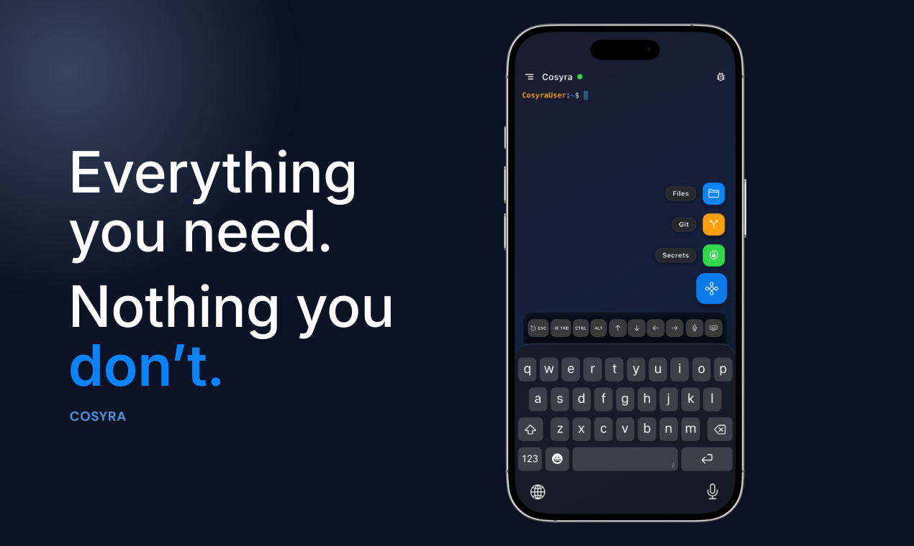
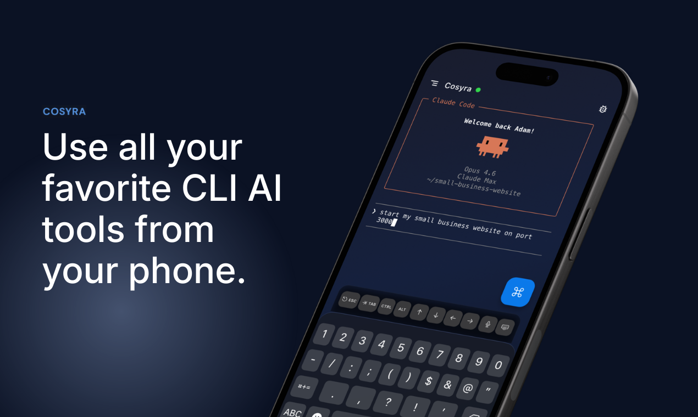
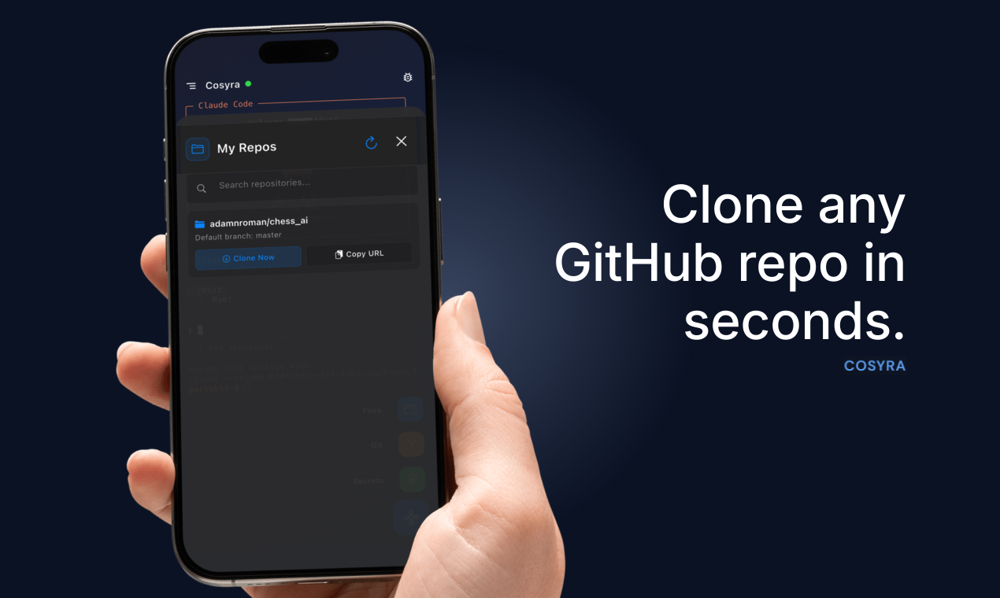

### 🎬 관련 영상
- [🎥 영상 보기](https://ph-files.imgix.net/867f4835-3b75-49e1-9aa5-7fed4b903670.jpeg?auto=format)

---

## 6. [Nitro by Rocketlane](https://www.producthunt.com/products/rocketlane)
**Votes**: 121 | **도입 난이도**: 중 | **신뢰도**: 중
**Tagline**: AI agents for modern service delivery
**서비스 링크**: https://www.producthunt.com/r/FW6JSW3QBODAFM

**태그**: AI, 자동화, 서비스 관리, 생산성, Agent, AI Tool

### 📌 이 서비스 한눈에 보기
Rocketlane에 내장된 Nitro는 AI 에이전트를 통해 SaaS, IT, 에이전시, 법률 서비스 제공 시 발생하는 백오피스 업무, 거버넌스 관리, 문서화 등의 자동화를 지원하여 효율성을 극대화합니다.

### 🔑 주요 기능
- 리소스 관리, 누락된 시간 기록 및 미청구 시간 추적 자동화
- 거버넌스 강화, 실시간 위험 및 기회 감지
- 문서화, 마이그레이션 및 구성 자동화

### 🙋 사용자에게 어떤 점이 좋은가
Nitro는 서비스 제공 팀의 역량을 강화하여 무한한 관찰력, 실행력, 기억력을 제공함으로써 효율성을 획기적으로 향상시킵니다. 팀은 소모적인 반복 업무에서 벗어나 더욱 전략적인 업무에 집중할 수 있습니다.

### ✅ 지금 바로 써볼 기능
- 자동화 에이전트 설정 및 워크플로우 통합
- 실시간 위험 감지 기능 활성화
- 자동 문서화 기능 설정

### ⚠️ 사용 전 확인할 점
- 초기 설정 및 AI 에이전트 학습에 시간 소요 가능
- 자동화 범위 및 정확도는 서비스 유형 및 데이터 품질에 따라 달라질 수 있음

### 🧭 확인이 더 필요한 정보
Nitro의 실제 성능 향상 정도는 사용 사례 및 데이터에 따라 달라질 수 있으므로, 파일럿 테스트를 통해 확인하는 것이 좋습니다.

### 📸 스크린샷 및 갤러리
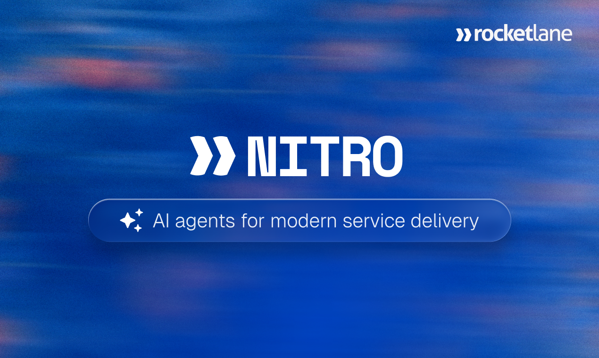
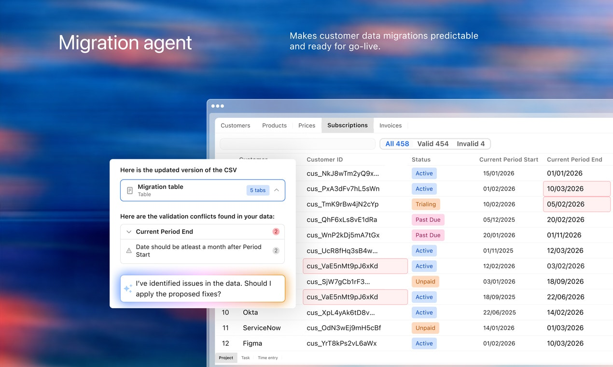
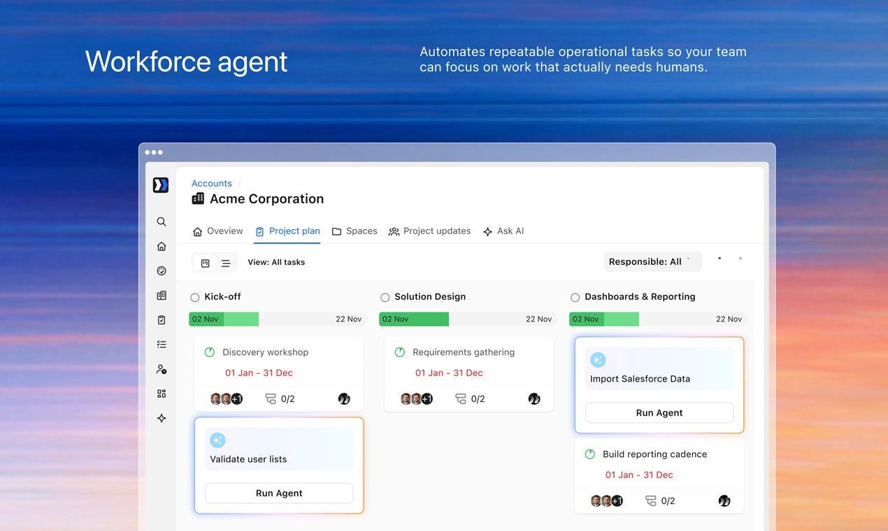

### 🎬 관련 영상
- [🎥 영상 보기](https://ph-files.imgix.net/e773a95a-62b1-48cd-a9c4-4f2b18509677.jpeg?auto=format)

---

## 7. [Mngr](https://www.producthunt.com/products/imbue-7)
**Votes**: 118 | **도입 난이도**: 중 | **신뢰도**: 중
**Tagline**: Run 100s of Claude agents in parallel
**서비스 링크**: https://www.producthunt.com/r/2CGB3SHJUWQ2ZI

**태그**: DevTool, Automation, CLI, Agent

### 📌 이 서비스 한눈에 보기
Mngr는 코딩 에이전트를 대규모로 병렬 실행하여 복잡한 워크플로우를 자동화하고 관리할 수 있게 해주는 CLI 도구입니다.

### 🔑 주요 기능
- 수백 개의 Claude 에이전트를 병렬로 실행 가능
- 테스트 수정, 이슈 해결 PR 생성, 사용 사례 검증 등 자동화 워크플로우 구성
- 에이전트 상태 모니터링 및 실시간 디버깅 지원

### 🙋 사용자에게 어떤 점이 좋은가
반복적인 코딩 작업을 자동화하여 개발 생산성을 높이고, 에이전트 관리를 통해 효율적인 협업 환경을 구축할 수 있습니다.

### ✅ 지금 바로 써볼 기능
- 테스트 자동화 워크플로우 구성해보기
- 이슈 해결 PR 자동 생성 설정해보기
- 에이전트 상태 모니터링 기능 사용해보기

### ⚠️ 사용 전 확인할 점
- 에이전트 실행 환경(로컬, Modal, Docker) 설정 필요
- Claude 에이전트 사용량에 따른 비용 발생 가능성 확인

### 🧭 확인이 더 필요한 정보
오픈 소스 프로젝트이므로, 커뮤니티 지원 및 업데이트 빈도를 확인하는 것이 좋습니다.

### 📸 스크린샷 및 갤러리
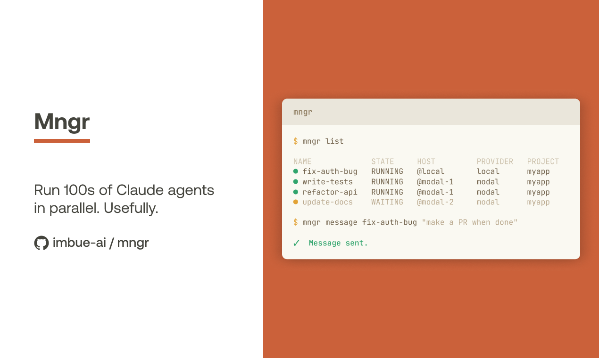
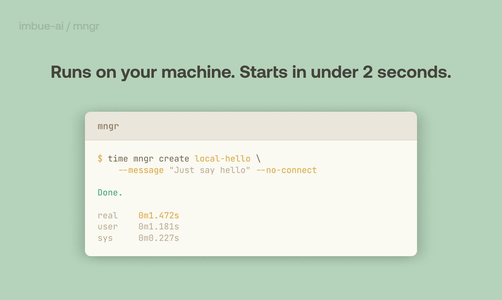
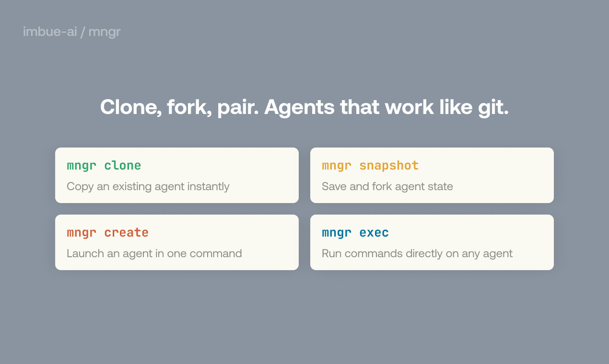

---

## 8. [tama96](https://www.producthunt.com/products/tama96-desktop-terminal-ai-pet)
**Votes**: 114 | **도입 난이도**: 중 | **신뢰도**: 중
**Tagline**: A Tamagotchi for your desktop, terminal, and AI agents
**서비스 링크**: https://www.producthunt.com/r/NSQXA3FJSHM7WS

**태그**: DevTool, AI, Automation, Pet, Agent, AI Tool

### 📌 이 서비스 한눈에 보기
데스크톱, 터미널, AI 에이전트에서 1996년 스타일의 다마고치를 키우고 프로그래밍할 수 있습니다.

### 🔑 주요 기능
- 데스크톱, 터미널, AI 에이전트에서 사용 가능
- 픽셀 LCD UI와 클릭 가능한 아이콘 제공
- AI 에이전트가 먹이 주기, 놀아주기 등 관리 가능

### 🙋 사용자에게 어떤 점이 좋은가
추억의 다마고치를 다양한 환경에서 즐길 수 있으며, AI 에이전트를 통해 자동화된 관리가 가능합니다.

### ✅ 지금 바로 써볼 기능
- 데스크톱 앱을 설치하고 펫을 키워보세요
- 터미널에서 펫을 관리해보세요
- AI 에이전트를 연결하여 자동 관리 기능을 사용해보세요

### ⚠️ 사용 전 확인할 점
- AI 에이전트 연결 시 권한 및 속도 제한을 확인하세요
- 초기 설정 및 환경 구성에 시간이 소요될 수 있습니다

### 🧭 확인이 더 필요한 정보
AI 에이전트 연결 및 자동화 기능의 성능과 안정성에 대한 추가적인 정보가 필요합니다.

### 📸 스크린샷 및 갤러리
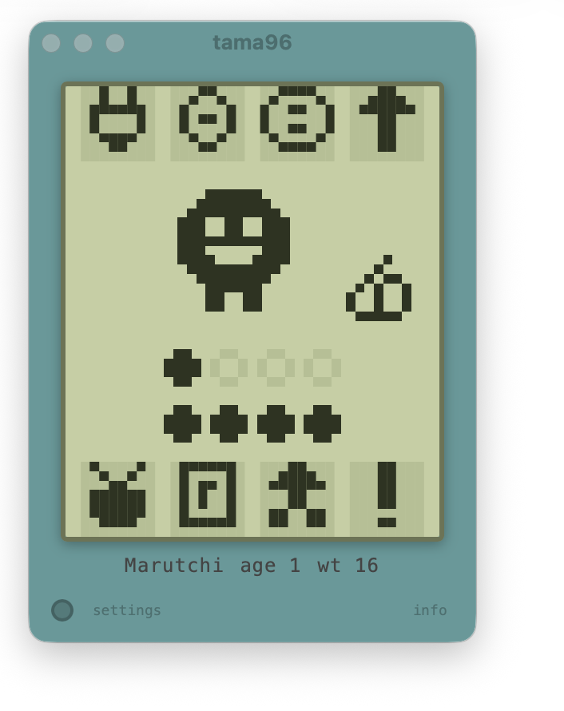

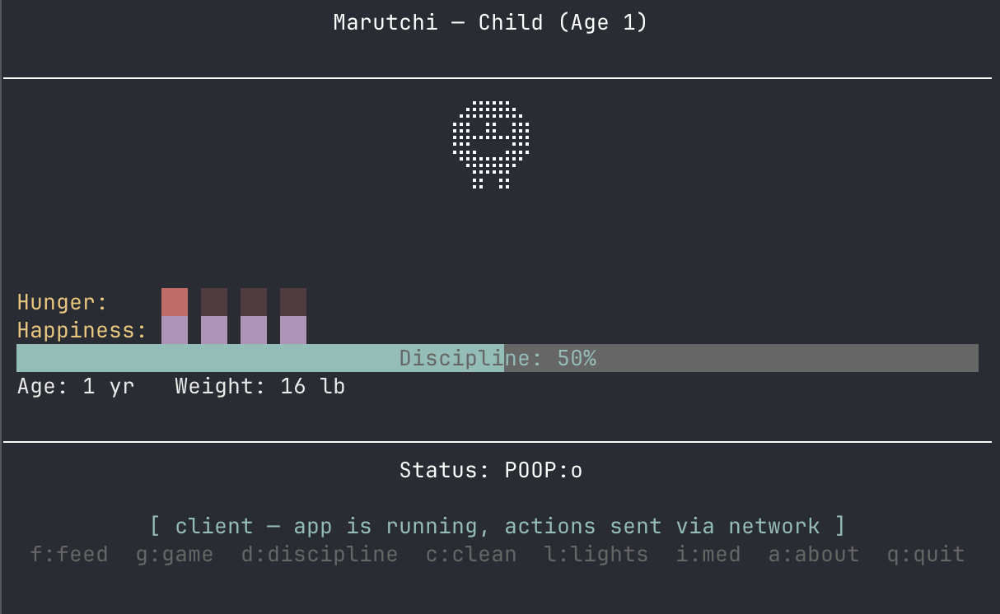

### 🎬 관련 영상
- [🎥 영상 보기](https://ph-files.imgix.net/9c4c1f32-f89a-49dc-9ad8-ac6b3a8d2860.jpeg?auto=format)

---

## 9. [Wan 2.7-Image](https://www.producthunt.com/products/wan-2-2)
**Votes**: 112 | **도입 난이도**: 중 | **신뢰도**: 중
**Tagline**: Interactive pixel-level editing and consistent storyboards
**서비스 링크**: https://www.producthunt.com/r/DXSUKYNVYSOUZH

**태그**: AI, 이미지 생성, 편집, 스토리보드, AI Tool, Prompting, Vision, API

### 📌 이 서비스 한눈에 보기
Alibaba의 Wan 2.7-Image는 AI 이미지 생성에 대한 정밀한 제어 기능을 제공하며, 픽셀 단위 편집과 일관성 있는 스토리보드 생성을 지원하여 창작 과정을 혁신합니다.

### 🔑 주요 기능
- 픽셀 단위의 인터랙티브 편집 기능 (이동, 크기 조정, 텍스트 편집)
- 단일 프롬프트에서 최대 12개의 일관된 연속 이미지 생성
- 웹 및 API를 통한 접근성 제공

### 🙋 사용자에게 어떤 점이 좋은가
사용자는 AI 이미지 생성 과정을 세밀하게 제어하고, 일관성 있는 스토리보드를 쉽게 제작하여 창의적인 콘텐츠 제작에 활용할 수 있습니다.

### ✅ 지금 바로 써볼 기능
- 픽셀 단위 편집 기능을 사용하여 이미지의 특정 부분을 수정해 보세요.
- 단일 프롬프트를 사용하여 연속적인 이미지 스토리를 생성해 보세요.
- API를 통해 기존 워크플로우에 통합하는 것을 고려해보세요.

### ⚠️ 사용 전 확인할 점
- AI 생성 이미지의 품질은 프롬프트의 내용에 따라 달라질 수 있습니다.
- API 사용 시 기술적인 이해가 필요할 수 있습니다.

### 🧭 확인이 더 필요한 정보
Alibaba Wan 2.7-Image의 이미지 생성 품질 및 편집 기능의 성능에 대한 사용자 후기 및 사례 연구가 필요합니다.

### 📸 스크린샷 및 갤러리

---

## 10. [Mac Pet](https://www.producthunt.com/products/mac-pet)
**Votes**: 105 | **도입 난이도**: 하 | **신뢰도**: 중
**Tagline**: A pixel pet for your menu bar or MacBook notch w/ Pomodoro 
**서비스 링크**: https://www.producthunt.com/r/HYBCKAYBCVN2JP

**태그**: 생산성, 집중력, 펫, Pomodoro, 맥

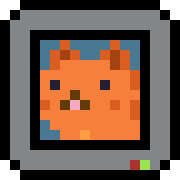

### 📌 이 서비스 한눈에 보기
맥 메뉴 막대 또는 MacBook 노치에 귀여운 픽셀 펫을 키우면서 Pomodoro 타이머로 집중력 향상!

### 🔑 주요 기능
- 메뉴 막대 또는 노치에 표시되는 픽셀 펫
- Pomodoro 타이머 내장으로 집중 시간 관리
- 활동 기록 및 연속성 추적 기능

### 🙋 사용자에게 어떤 점이 좋은가
귀여운 펫을 보면서 집중력을 높이고, 작업 습관을 개선할 수 있습니다. 특히 새로운 MacBook의 노치 디자인을 활용하여 더욱 자연스럽게 사용할 수 있습니다.

### ✅ 지금 바로 써볼 기능
- 펫 종류 선택 및 이름 설정
- Pomodoro 타이머 시작 및 집중 세션 설정
- 활동 기록 확인 및 연속성 유지

### ⚠️ 사용 전 확인할 점
- 지나친 펫 관리는 오히려 집중력을 저해할 수 있습니다.
- 일부 구형 Mac에서는 노치 모드를 지원하지 않을 수 있습니다.

### 🧭 확인이 더 필요한 정보
배터리 소모량에 대한 정보는 사용 환경에 따라 달라질 수 있습니다.

### 📸 스크린샷 및 갤러리

---

